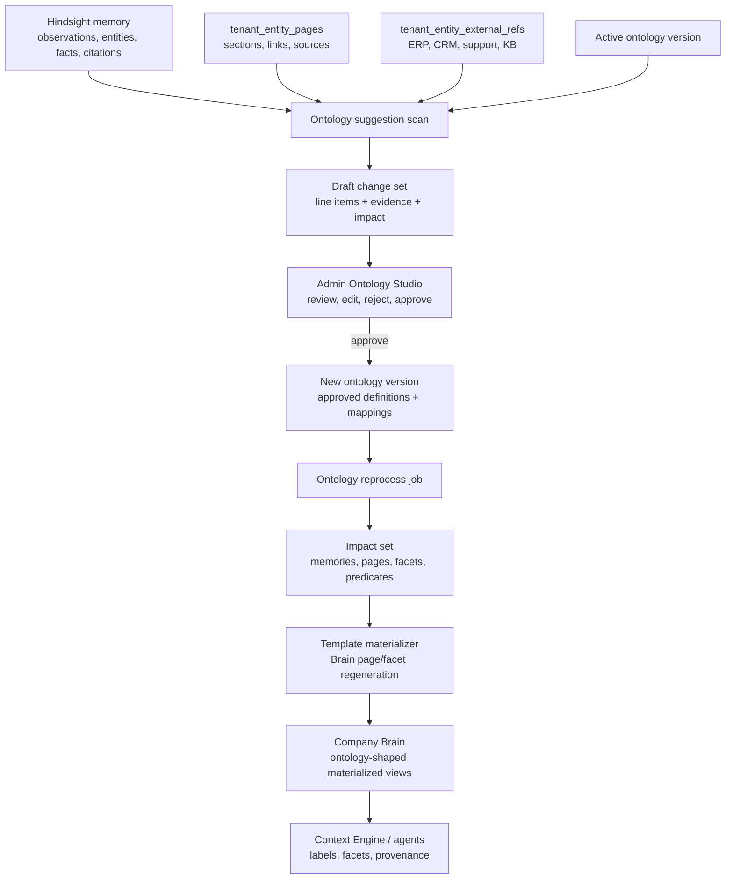
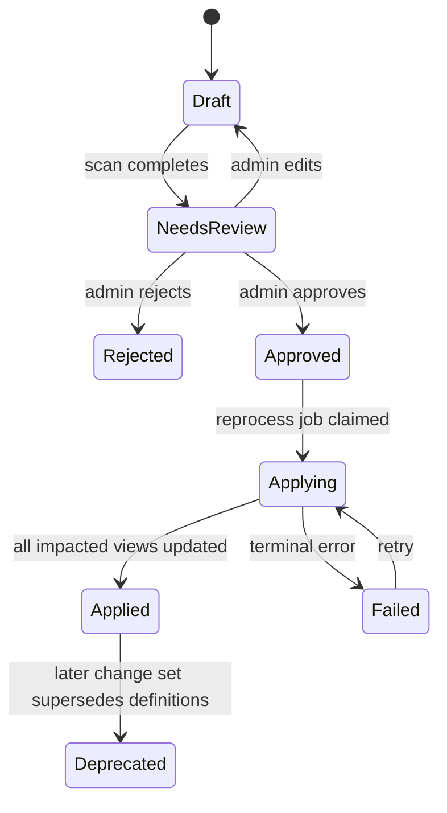

# feat: Add business ontology change sets

## Overview

Add a tenant-scoped business ontology layer that turns Company Brain from an ad hoc wiki compiler output into an ontology-shaped materialized view over Hindsight-backed memory. The v1 feature centers on ontology change sets: ThinkWork detects repeated business patterns, groups proposed type/template/relationship/mapping changes into reviewable bundles, lets tenant admins edit and approve them, and then queues observable reprocessing so existing Brain pages improve retroactively.

The plan keeps Hindsight as the raw memory and provenance substrate. It adds ThinkWork-owned ontology definitions and change-set governance around the current Brain tables, then makes the Brain compiler/materializer use approved page/facet templates instead of rediscovering structure on each run.

---

## Problem Frame

Company Brain currently mixes durable memory, compiled wiki pages, entity pages, source routing, enrichment, graph links, and admin inspection. Hindsight is doing the memory job, but the compile path still asks LLM-driven planning to choose page identity, page shape, sections, links, summaries, and confidence all at once. That makes the Brain feel like a second memory system rather than a trustworthy materialized view.

The origin document resolves the product boundary: Hindsight is memory, ontology is meaning, and Company Brain is the materialized view. This plan translates that into implementation units that add an ontology domain without porting Maniflow's old Ontology Studio wholesale and without pulling the agent-work ontology into core ThinkWork.

---

## Requirements Trace

- R1. Hindsight remains the source substrate for observations, extracted facts, entities, and citations.
- R2. Company Brain pages/facets become ontology-shaped materialized views rather than a separate memory system.
- R3. v1 is business/domain ontology only; agent-work ontology waits for Symphony ETL or later substrate work.
- R4. Tenant admins can manage business entity types through proposed, approved, deprecated, and rejected states.
- R5. Tenant admins can manage relationship types with lifecycle, aliases, inverse names, guidance, and source/target constraints.
- R6. Tenant admins can manage entity page/facet templates that determine Company Brain materialization.
- R7. ThinkWork names stay product-native; standards are optional mappings.
- R8. The system proposes entity types, relationships, templates, aliases, predicate mappings, and entity-resolution concerns from observed patterns.
- R9. Related suggestions are grouped into coherent ontology change sets.
- R10. Line items are editable/removable, while approval/audit/reprocessing happen at the change-set level.
- R11. Change sets include evidence, citations/source references, confidence, observed frequency, and expected impact.
- R12. Admins can approve, reject, edit, deprecate, or hold change sets without silent active-ontology mutation.
- R13. Approval queues asynchronous reprocessing.
- R14. Reprocessing identifies impacted memories, entities, relationship candidates, pages, and facets before applying changes.
- R15. Reprocessing can reclassify entities, map predicates, add/revise facets, and regenerate affected Brain pages.
- R16. Reprocessing preserves provenance for every generated or changed facet.
- R17. Reprocessing exposes status, errors, retry behavior, and before/after impact.
- R18. Failed reprocessing does not pretend the ontology cleanly applied.
- R19. Approved ontology templates determine the primary shape of Brain pages/facets for agent retrieval.
- R20. The compiler renders approved structure instead of discovering structure from scratch.
- R21. Trust/facet precedence remains explicit.
- R22. Agent context includes ontology labels, relationship meaning, and provenance.
- R23. External vocabulary mappings support exact, close, broad, narrow, and related mapping kinds.
- R24. Standards mappings help interoperability but do not dictate ThinkWork naming/modeling.
- R25. v1 proves the loop on a small business ontology before vertical packs.

**Origin actors:** A1 tenant admin / business ontology owner, A2 ThinkWork agent, A3 Hindsight memory layer, A4 ontology suggestion engine, A5 Company Brain compiler, A6 ThinkWork operator
**Origin flows:** F1 suggest ontology change set, F2 review and approve change set, F3 apply update and reprocess Brain views, F4 agent uses ontology-shaped Brain context
**Origin acceptance examples:** AE1 customer commitment suggestion, AE2 edited change-set approval queues one job, AE3 risk type/facet reprocessing, AE4 Schema.org mapping stays metadata, AE5 meeting context uses ontology-shaped facets

---

## Scope Boundaries

### Deferred for later

- Agent-work ontology for proposals, plans, tasks, runs, artifacts, HITL questions, PRs, and review comments.
- Full standards conformance or native RDF/OWL/SKOS/FIBO/FHIR execution semantics.
- Rich vertical packs beyond a small initial business ontology.
- Cross-tenant ontology sharing or consortium pattern publication.
- Automatic operational writes back into ERP, CRM, support, or other systems of record.
- Multi-hop graph query products beyond what is needed to materialize and retrieve Company Brain facets.
- Customer-facing self-service ontology marketplace or external ontology import wizard.

### Outside this product's identity

- A generic semantic-web workbench for ontology experts.
- A replacement for Hindsight's memory extraction and retrieval engine.
- A human-authored Notion-style wiki where admins manually curate every page.
- A pure vector-search layer that ignores typed business meaning.
- An agent-work orchestration product inside core ThinkWork; that belongs with Symphony ETL or a later work substrate.

### Deferred to Follow-Up Work

- Moving wiki and Brain tables into `wiki.*` and `brain.*` schemas remains a separate schema-extraction effort from `docs/brainstorms/2026-05-16-wiki-brain-schema-extraction-requirements.md`.
- Agent-work ontology imports from Symphony ETL should consume the same mapping/change-set concepts later, but this plan only implements business/domain ontology.
- Vertical defaults beyond the seed business vocabulary should land as follow-up ontology-pack work after the suggestion/reprocess loop proves itself.

---

## Context & Research

### Relevant Code and Patterns

- `packages/database-pg/src/schema/tenant-entity-pages.ts` already defines tenant-shared Brain entity pages, sections, links, aliases, and section sources. It has fixed subtypes (`customer`, `opportunity`, `order`, `person`) and fixed facet types.
- `packages/database-pg/src/schema/tenant-entity-external-refs.ts` stores tenant-scoped external source payloads for ERP, CRM, support, KB, and tracker sources.
- `packages/database-pg/src/schema/wiki.ts` documents compiled wiki pages as derived rows over Hindsight memory and provides the existing job ledger pattern through `wiki_compile_jobs`.
- `packages/database-pg/graphql/types/brain.graphql` exposes current Brain page/facet/enrichment API surface. New ontology GraphQL should live alongside it rather than overload enrichment types.
- `packages/api/src/lib/brain/repository.ts` enforces source citations and trust-gradient promotion rules for tenant entity facets.
- `packages/api/src/lib/brain/facet-types.ts` centralizes known subtypes, facet types, source kinds, and trust ranking; ontology implementation must make this data-driven without losing the trust invariant.
- `packages/api/src/lib/wiki/templates.ts`, `packages/api/src/lib/wiki/planner.ts`, `packages/api/src/lib/wiki/section-writer.ts`, and `packages/api/src/lib/wiki/compiler.ts` are the current page-shape/template/planner path. This is the right comparison point for making templates authoritative.
- `packages/api/src/lib/wiki/enqueue.ts`, `packages/api/src/lib/wiki/repository.ts`, and `packages/api/src/handlers/wiki-compile.ts` show durable async job enqueue, dedupe, claim, retry, and status patterns.
- `packages/api/src/lib/brain/enrichment-service.ts` shows the current async page-enrichment draft job pattern using `wiki_compile_jobs` and `wiki-compile`.
- `packages/api/src/lib/context-engine/providers/wiki.ts` currently searches owner-scoped wiki pages only; ontology-aware tenant Brain context needs an additive provider or provider update.
- `apps/admin/src/components/Sidebar.tsx` owns the admin navigation groups. Ontology Studio should appear in the Manage section as an operator governance surface, while still linking conceptually to Company Brain.
- `apps/admin/src/routes/_authed/_tenant/knowledge.tsx` owns the Knowledge section tabs for Brain, Pages, KBs, and Search. Those remain read/retrieval surfaces; Ontology Studio belongs under Manage because it changes tenant governance.
- `apps/mobile/app/wiki/[type]/[slug].tsx`, `apps/mobile/components/brain/BrainSearchSurface.tsx`, and mobile generated GraphQL types prove mobile already consumes Brain/wiki results, but v1 ontology administration should be admin-first.
- `packages/api/src/__tests__/graphql-contract.test.ts` currently asserts ontology types are absent. This becomes a deliberate contract update when ontology is restored in ThinkWork.
- Maniflow prior art: PRD-41B's Ontology Studio used entity types, relation types, predicate mappings, ER review, `Scan & Propose`, Hindsight metadata writes, and retain-mission generation. Useful concepts: shared classifier, admin review UI, and explicit ontology tables. Concepts not to port directly: raw per-entity approval as the center of gravity, Hindsight-metadata mutation as the only materialization path, and agent-work ontology scope.

### Institutional Learnings

- `docs/solutions/database-issues/brain-enrichment-approval-must-sync-wiki-sections-2026-05-02.md`: any write path that changes page prose must update both whole-page body and section rows, because clients render sections.
- `docs/solutions/logic-errors/compile-continuation-dedupe-bucket-2026-04-20.md`: compile/reprocess dedupe collisions can silently stop long-running chains. Reprocessing needs explicit continuation metrics and collision behavior.
- `docs/solutions/best-practices/probe-every-pipeline-stage-before-tuning-2026-04-20.md`: structural compile improvements need audit probes before tuning thresholds or prompts.
- `docs/solutions/workflow-issues/manually-applied-drizzle-migrations-drift-from-dev-2026-04-21.md`: hand-rolled migrations need `-- creates:` markers and drift reporting when Drizzle cannot safely express the desired database shape.
- `docs/solutions/integration-issues/web-enrichment-must-use-summarized-external-results-2026-05-01.md`: proving provider participation is not enough; reviewable suggestions must be concise, cited, and admin-evaluable.
- `docs/residual-review-findings/feat-brain-enrichment-draft-page-review.md`: Brain draft review still has residual risks around stale snapshots, handler tests, prompt injection in candidate interpolation, and markdown section parsing. Ontology reprocessing must not compound those paths blindly.

### External References

- [Schema.org schemas](https://schema.org/docs/schemas.html) as a broad mapping target for `Organization`, `Person`, `Product`, `Offer`, and related business concepts.
- [W3C PROV-O](https://www.w3.org/TR/prov-o/) for provenance vocabulary inspiration, especially source/evidence relationships.
- [W3C SKOS](https://www.w3.org/TR/skos-reference/) for mapping-kind vocabulary such as exact, close, broad, narrow, and related matches.
- [Dublin Core Terms](https://www.dublincore.org/specifications/dublin-core/dcmi-terms/) for metadata mappings around source, title, description, and temporal properties.
- [The AI Revolution Nobody Saw Coming: Why Ontology Just Beat Vector Embeddings](https://medium.com/@aftab001x/the-ai-revolution-nobody-saw-coming-why-ontology-just-beat-vector-embeddings-9e999457f108) as directional product input: ontology should add explicit meaning and explainability on top of embeddings, not replace memory retrieval wholesale.

---

## Key Technical Decisions

- **Add an ontology domain beside Brain, not inside Hindsight:** Store approved definitions, mappings, change sets, and reprocess status in ThinkWork tables. Hindsight remains memory and evidence.
- **Use change sets as the atomic approval unit:** Ontology changes behave like business-schema migrations. The UI can edit line items, but activation and reprocessing are bundled.
- **Version active ontology definitions:** Approval produces a durable ontology version/change-set application boundary so reprocessing can be retried, audited, and compared.
- **Make templates authoritative before relationships get fancy:** Page/facet templates solve the current Company Brain hodgepodge first. Typed relationship edges become more valuable once entity types and facets are stable.
- **Seed a small product-native business ontology:** Start with `customer`, `person`, `opportunity`, `order`, `support_case`, `commitment`, `risk`, and `decision` or close equivalents, then let suggestions expand it.
- **Use standards as mappings, not internal names:** External vocabularies live in mapping rows with mapping kind and URI/term metadata. ThinkWork canonical names stay readable for agents and admins.
- **Queue ontology reprocessing as its own job family:** Reusing every `wiki_compile_jobs` assumption would force tenant business ontology into owner-scoped wiki semantics. Follow its job-ledger pattern, but use ontology-specific impact/apply rows.
- **Prefer source-scoped deterministic candidates plus LLM summarization:** v1 suggestion scans should gather concrete frequencies/evidence from Hindsight, tenant entity pages, external refs, and current Brain sources, then use LLM synthesis to name coherent change sets.
- **Keep Ontology Studio under Manage:** Build Ontology Studio as a Manage-section route (`/ontology`) because it governs tenant-wide Brain meaning, approvals, and reprocessing. Knowledge remains the read/retrieval area for Brain, Pages, KBs, and Search.

---

## Open Questions

### Resolved During Planning

- **Where should ontology live?** In core ThinkWork as a business/domain ontology domain. Agent-work ontology stays deferred to Symphony ETL or later work-substrate planning.
- **Should ThinkWork conform to external standards?** No. Standards are optional mappings with mapping kinds. Canonical ThinkWork types and relationships remain product-native.
- **What is the first approval unit?** A change set, not a single suggestion row.
- **Should reprocessing be synchronous?** No. Approval records the ontology update and queues async reprocessing with observable status and recovery.
- **Should Maniflow be ported directly?** No. Borrow the table concepts, classifier, and admin review shape, but adapt them to ThinkWork's tenant entity pages, facets, Context Engine, and compile jobs.

### Deferred to Implementation

- **Exact Hindsight source query shape:** Implementation should inspect the deployed Hindsight schema adapter currently used by ThinkWork before finalizing raw SQL. The plan only requires evidence-backed candidate extraction.
- **Exact seed ontology fixture format:** Implementation can choose SQL seed rows, TS constants, or migration-backed inserts, as long as tenant defaults are idempotent and testable.
- **Exact LLM model and prompt budget:** Use the repo's current Bedrock helper/model conventions where possible; tune model and budgets during implementation tests.
- **Exact GraphQL pagination fields:** The plan names the surfaces; implementation can choose cursor vs limit/offset details consistent with nearby resolvers.
- **Exact reprocess batching limits:** Set them from observed corpus size and existing compile job limits during implementation.

---

## Output Structure

This tree is directional. The implementing agent may adjust file names if current code patterns suggest a cleaner shape.

```text
packages/database-pg/src/schema/
  ontology.ts
packages/database-pg/graphql/types/
  ontology.graphql
packages/api/src/graphql/resolvers/ontology/
  index.ts
  *.query.ts
  *.mutation.ts
packages/api/src/lib/ontology/
  repository.ts
  suggestions.ts
  change-sets.ts
  reprocess.ts
  templates.ts
apps/admin/src/routes/_authed/_tenant/
  ontology.tsx
  -ontology-route.test.tsx
docs/src/content/docs/concepts/knowledge/
  business-ontology.mdx
```

---

## High-Level Technical Design

> _This illustrates the intended approach and is directional guidance for review, not implementation specification. The implementing agent should treat it as context, not code to reproduce._





---

## Implementation Units

- U1. **Ontology schema, migrations, and seeds**

**Goal:** Add persistent ontology definitions, mappings, change sets, suggestion line items, scan jobs, and reprocess job state.

**Requirements:** R4, R5, R6, R7, R9, R10, R11, R12, R13, R17, R18, R23, R24, R25, AE2, AE4

**Dependencies:** None

**Files:**

- Create: `packages/database-pg/src/schema/ontology.ts`
- Modify: `packages/database-pg/src/schema/index.ts`
- Create: `packages/database-pg/graphql/types/ontology.graphql`
- Modify: `packages/database-pg/graphql/types/brain.graphql`
- Create: `packages/database-pg/drizzle/NNNN_business_ontology.sql`
- Create: `packages/database-pg/__tests__/schema-ontology.test.ts`
- Modify: `packages/api/src/__tests__/graphql-contract.test.ts`

**Approach:**

- Model ontology definitions separately from suggestions. Minimum tables should cover ontology versions, entity types, relationship types, page/facet templates, external mappings, change sets, change-set line items, evidence examples, suggestion scan jobs, and reprocess jobs.
- Use lifecycle states that match the origin: proposed, approved, deprecated, rejected, plus applying/applied/failed where change-set application needs it.
- Keep template rows explicit enough to represent section slug, heading, facet type, source priority, prompt/guidance, and display order.
- Store external mapping rows against entity or relationship definitions with mapping kind values aligned to SKOS-style exact/close/broad/narrow/related.
- Seed the small business ontology idempotently. The seed should not lock tenants out of edits; it should behave like default approved definitions that can later be deprecated or superseded.
- Do not widen `TENANT_ENTITY_SUBTYPES` or GraphQL enums by hand as the long-term source of truth. Transitional compatibility constants can remain while repository helpers are moved to data-backed ontology lookups.
- Choose Drizzle-generated migration only if it produces clear DDL. If hand-rolled SQL is needed for constraints/seeds, follow the manual migration marker convention.

**Execution note:** Schema-first. Add tests that pin lifecycle values, uniqueness, tenant isolation, mapping kinds, and seed idempotency before API code depends on them.

**Patterns to follow:**

- `packages/database-pg/src/schema/tenant-entity-pages.ts` for tenant-scoped Brain table conventions.
- `packages/database-pg/src/schema/wiki.ts` for derived-store comments and job ledger fields.
- `packages/database-pg/__tests__/schema-computers.test.ts` for schema invariants.
- Maniflow prior art: `ontology_node_types`, `ontology_edge_types`, `ontology_predicate_mappings`, and ER review queue concepts.

**Test scenarios:**

- Happy path: a tenant can have approved `customer`, `commitment`, and `risk` entity types with templates and external mappings.
- Happy path: one change set contains multiple line items and evidence examples tied to source references.
- Happy path: approving a change set records an ontology version boundary without deleting the draft evidence.
- Happy path: a suggestion scan job records pending/running/succeeded/failed state and points to created or updated change sets.
- Edge case: two tenants can use the same canonical type slug without collision.
- Edge case: an external mapping can be broad while the ThinkWork canonical type remains `customer`.
- Error path: duplicate active entity type slug for the same tenant is rejected.
- Error path: invalid mapping kind or lifecycle state is rejected.
- Migration path: seed insertion is idempotent across repeated migration/test setup runs.
- Contract path: GraphQL contract test is updated from "ontology absent" to "ontology surface present" with expected core types.

**Verification:**

- Schema exports compile and all ontology tables are available through `@thinkwork/database-pg/schema`.
- The generated GraphQL schema includes ontology types and mutations without changing existing Brain enrichment contracts.
- Drift/manual migration checks can identify all hand-rolled ontology objects if a hand-rolled migration is used.

---

- U2. **Ontology repository and GraphQL API**

**Goal:** Expose tenant-admin ontology management and change-set review APIs with consistent authorization, pagination, and audit behavior.

**Requirements:** R4, R5, R6, R10, R11, R12, R17, R18, R23, R24, AE2, AE4

**Dependencies:** U1

**Files:**

- Create: `packages/api/src/lib/ontology/repository.ts`
- Create: `packages/api/src/lib/ontology/change-sets.ts`
- Create: `packages/api/src/graphql/resolvers/ontology/index.ts`
- Create: `packages/api/src/graphql/resolvers/ontology/ontologyDefinitions.query.ts`
- Create: `packages/api/src/graphql/resolvers/ontology/ontologyChangeSets.query.ts`
- Create: `packages/api/src/graphql/resolvers/ontology/approveOntologyChangeSet.mutation.ts`
- Create: `packages/api/src/graphql/resolvers/ontology/rejectOntologyChangeSet.mutation.ts`
- Create: `packages/api/src/graphql/resolvers/ontology/updateOntologyChangeSet.mutation.ts`
- Modify: `packages/api/src/graphql/resolvers/index.ts`
- Create: `packages/api/src/graphql/resolvers/ontology/ontology.test.ts`
- Modify: `packages/api/src/__tests__/graphql-contract.test.ts`

**Approach:**

- Put business logic in `packages/api/src/lib/ontology/*`; keep GraphQL resolvers thin like nearby resolver folders.
- Require tenant-admin access for definition mutation, change-set approval/rejection, and reprocess retry. Read APIs can be tenant-admin first for v1; agent-facing read surfaces are handled in U6.
- Return change sets as review artifacts: summary, status, line items, evidence examples, confidence, observed frequency, expected impact, proposed template changes, proposed mappings, and reprocess status.
- Support editing line-item status/content before approval. Approval persists only remaining approved/edited line items.
- Record admin actions in `activityLog` or an ontology-specific audit row so approval/rejection has actor and timestamp.
- Approval should call the enqueue function from U4, not perform reprocessing inline.

**Execution note:** Start with resolver-level authorization and state-transition tests before wiring the admin UI.

**Patterns to follow:**

- `packages/api/src/graphql/resolvers/brain/index.ts` for resolver grouping.
- `packages/api/src/graphql/resolvers/wiki/compileWikiNow.mutation.ts` and `packages/api/src/__tests__/wiki-resolvers.test.ts` for admin-only mutation testing.
- `packages/api/src/lib/brain/promotion.ts` for activity-log style audit records.

**Test scenarios:**

- Happy path: tenant admin lists definitions and sees approved seed types/templates.
- Happy path: tenant admin edits a draft change-set line item and then approves the change set.
- Happy path: approval creates a new ontology version/application boundary and queues a reprocess job.
- Edge case: approving a change set with a removed weak relationship omits that relationship from the active ontology update. Covers AE2.
- Edge case: broad Schema.org mapping is returned as metadata while canonical type name remains `customer`. Covers AE4.
- Error path: non-admin caller cannot approve, reject, or mutate ontology definitions.
- Error path: stale or already-terminal change set cannot be approved twice.
- Error path: cross-tenant access to a change set fails closed.
- Integration: GraphQL schema codegen consumers can compile against the new ontology operations.

**Verification:**

- Ontology resolver folder is registered in root resolvers.
- Existing Brain/wiki queries continue to pass contract tests.
- Approval returns quickly with queued/applied status rather than waiting on reprocess work.

---

- U3. **Suggestion scan and change-set generation**

**Goal:** Detect recurring unmodeled business patterns asynchronously and create coherent draft ontology change sets with evidence and impact estimates.

**Requirements:** R1, R2, R8, R9, R10, R11, R14, R23, R25, F1, AE1

**Dependencies:** U1, U2

**Files:**

- Create: `packages/api/src/lib/ontology/suggestions.ts`
- Create: `packages/api/src/lib/ontology/evidence.ts`
- Create: `packages/api/src/lib/ontology/standards-mappings.ts`
- Create: `packages/api/src/handlers/ontology-scan.ts`
- Create: `packages/api/src/graphql/resolvers/ontology/startOntologySuggestionScan.mutation.ts`
- Create: `packages/api/src/graphql/resolvers/ontology/ontologySuggestionScan.query.ts`
- Modify: `packages/api/src/graphql/resolvers/ontology/index.ts`
- Modify: `scripts/build-lambdas.sh`
- Modify: `terraform/modules/app/main.tf`
- Modify: `terraform/modules/app/variables.tf`
- Modify: `terraform/modules/app/outputs.tf`
- Create: `packages/api/src/lib/ontology/suggestions.test.ts`
- Create: `packages/api/src/handlers/ontology-scan.test.ts`
- Create: `packages/api/src/graphql/resolvers/ontology/startOntologySuggestionScan.mutation.test.ts`

**Approach:**

- Start suggestion scans through a durable scan job row and async Lambda invoke. A resolver may support a bounded dry-run later, but the v1 admin action should not depend on a long LLM/data scan finishing inside a GraphQL request.
- Scan a staged source combination in v1: approved ontology definitions, `tenant_entity_pages` sections/sources, `tenant_entity_external_refs`, existing Brain links, and Hindsight-derived observations/entities where the current adapter can safely query them.
- Produce deterministic candidate features first: repeated section phrases, recurring source kinds, entity subtypes that no template covers, repeated predicates/verbs around customers, unresolved aliases, and external ref kinds without page/facet homes.
- Use an LLM synthesis step to group raw candidate features into coherent change-set proposals, name the business concept, summarize expected impact, and suggest entity/relationship/template/mapping line items.
- Persist all evidence examples with source kind/ref and a short evidence quote/summary. Avoid storing raw huge source payloads in change-set rows.
- Add idempotency/dedupe so repeated scans update or supersede an open draft rather than spamming admins. The scan job should report created/updated/no-op change-set counts.
- Include a special path for the origin's Customer Commitment example: promises, due dates, owners, and follow-up obligations should cluster into a commitment type/facet proposal.
- Treat external standards as suggestions for mappings only. `standards-mappings.ts` can provide seed candidate URIs/labels for common seed types, not an imported ontology.

**Execution note:** Build this with characterization fixtures around current Brain/Hindsight-like rows; prompt output should be parsed defensively and tested with malformed model responses.

**Patterns to follow:**

- Maniflow's shared `classifyEntityBatch()` pattern as prior art for one reusable classifier/synthesizer instead of resolver-local prompt code.
- `packages/api/src/lib/brain/enrichment-candidate-synthesis.ts` for deduping and normalizing external/context candidates.
- `packages/api/src/lib/wiki/planner.ts` for structured LLM JSON with conservative parsing and bounded outputs.

**Test scenarios:**

- Happy path: repeated customer promises with due dates produce a "Customer commitment model" change set containing `commitment`, customer/person relationships, an `open_commitments` facet, cited examples, and impact counts. Covers AE1.
- Happy path: repeated support case external refs suggest a support-case-aware facet/template without changing canonical `customer`.
- Happy path: candidate mappings include Schema.org metadata for seed types but do not rename ThinkWork types.
- Edge case: a scan with no sufficient recurring patterns returns a no-op result and does not create an empty change set.
- Edge case: running the same scan twice updates/dedupes the same open draft.
- Error path: malformed LLM JSON creates a failed scan status with diagnostic metadata, not partial unreviewable suggestions.
- Error path: Hindsight source query unavailable still allows a degraded scan over Brain pages/external refs with provider status evidence.
- Integration: `startOntologySuggestionScan` mutation is admin-only, returns a scan job id quickly, and the query exposes job status plus created/updated change-set IDs after completion.

**Verification:**

- Admin can trigger a scan, watch scan status, and see one reviewable change set instead of disconnected suggestion rows.
- Every suggestion line item has at least one evidence example or is rejected before persistence.
- Scan logs/metrics distinguish no-op, degraded, failed, and proposed outcomes.

---

- U4. **Ontology reprocess job orchestration**

**Goal:** Queue, claim, retry, and observe ontology reprocessing after change-set approval without blocking the admin approval request.

**Requirements:** R13, R14, R17, R18, F3, AE2, AE3

**Dependencies:** U1, U2

**Files:**

- Create: `packages/api/src/lib/ontology/reprocess.ts`
- Create: `packages/api/src/lib/ontology/impact.ts`
- Create: `packages/api/src/handlers/ontology-reprocess.ts`
- Modify: `scripts/build-lambdas.sh`
- Modify: `terraform/modules/app/main.tf`
- Modify: `terraform/modules/app/variables.tf`
- Modify: `terraform/modules/app/outputs.tf`
- Create: `packages/api/src/lib/ontology/reprocess.test.ts`
- Create: `packages/api/src/handlers/ontology-reprocess.test.ts`

**Approach:**

- Implement an ontology-specific reprocess job ledger rather than overloading owner-scoped `wiki_compile_jobs`.
- Approval inserts a job with tenant id, change set id, ontology version id, dedupe key, status, attempt count, input/impact fields, metrics, and errors.
- Add a Lambda handler that claims either a provided job id or the next pending ontology reprocess job, mirroring the wiki-compile handler's idempotent "already done" behavior.
- Split processing into impact analysis and apply. Impact analysis identifies affected pages/facets/source refs/predicates before materialization and stores counts for admin/operator visibility.
- Use continuation-safe batching. If a job hits a cap, enqueue or mark continuation explicitly; do not rely on silent dedupe collision behavior.
- Failed jobs should leave the ontology version/change set visible as approved but not fully applied. Admin/operator surfaces must see failed status and retry.
- Invoke the Lambda asynchronously after approval. If invocation fails, the durable row remains claimable by retry/scheduler/admin replay.

**Execution note:** Characterize current `wiki_compile_jobs` behavior first, then implement a separate ledger with tests for dedupe and terminal reruns.

**Patterns to follow:**

- `packages/api/src/lib/wiki/repository.ts` compile job functions for enqueue/claim/complete semantics.
- `packages/api/src/handlers/wiki-compile.ts` for handler idempotency.
- `packages/api/src/lib/wiki/enqueue.ts` for durable row plus best-effort async invoke.
- `docs/solutions/logic-errors/compile-continuation-dedupe-bucket-2026-04-20.md` for continuation risk.

**Test scenarios:**

- Happy path: approval enqueues exactly one pending reprocess job for the approved change set. Covers AE2.
- Happy path: handler claims a pending job, computes impact counts, applies materialization, and marks succeeded with metrics.
- Happy path: `risk` type/facet approval produces a job that reports affected customer pages and changed facets. Covers AE3.
- Edge case: repeated approval/retry attempt for the same change set does not create duplicate in-flight jobs.
- Edge case: cap-hit continuation is visible in metrics and creates a follow-up job or resumable state.
- Error path: Lambda invocation failure leaves the job pending/claimable and returns approval success with warning metadata.
- Error path: apply failure marks failed with error and does not mark change set applied.
- Integration: handler can process a specific job id and returns already_done for terminal jobs.

**Verification:**

- Admin approval latency remains bounded by row writes and Lambda invoke, not full materialization.
- Job status, metrics, and errors are queryable through U2 GraphQL APIs.
- Failed jobs can be retried without duplicating already-applied line items.

---

- U5. **Ontology-aware Brain templates and materialization**

**Goal:** Make approved page/facet templates authoritative for tenant entity pages and reprocess affected Brain views with citations intact.

**Requirements:** R2, R6, R14, R15, R16, R19, R20, R21, R22, F3, F4, AE3, AE5

**Dependencies:** U1, U4

**Files:**

- Create: `packages/api/src/lib/ontology/templates.ts`
- Create: `packages/api/src/lib/ontology/materializer.ts`
- Modify: `packages/api/src/lib/brain/facet-types.ts`
- Modify: `packages/api/src/lib/brain/repository.ts`
- Modify: `packages/api/src/lib/wiki/templates.ts`
- Modify: `packages/api/src/lib/wiki/planner.ts`
- Modify: `packages/api/src/lib/wiki/section-writer.ts`
- Modify: `packages/api/src/lib/wiki/compiler.ts`
- Create: `packages/api/src/lib/ontology/templates.test.ts`
- Create: `packages/api/src/lib/ontology/materializer.test.ts`
- Modify: `packages/api/src/__tests__/wiki-compiler.test.ts`
- Modify: `packages/api/src/__tests__/wiki-draft-compile.test.ts`

**Approach:**

- Add an ontology template resolver that returns approved tenant templates with seed defaults as fallback.
- For tenant entity pages, materialization should create/update `tenant_entity_page_sections` by approved template section slug/order/facet type rather than letting LLM output invent new sections.
- Preserve trust ranking from `facet-types.ts`; move the allowed facet/source decisions behind ontology-aware helpers rather than hard-coded arrays where possible.
- Ensure every generated or changed section writes `tenant_entity_section_sources` or corresponding wiki section sources. Do not update only `body_md`.
- Keep owner-scoped wiki pages working. The first authoritative-template path should target tenant entity pages, with owner-scoped wiki template behavior adjusted only where it shares planner/writer code.
- For `commitment` and `risk`, materializer should generate predictable customer facets such as `open_commitments` and `risks_and_landmines` from source-backed evidence.
- Add prompt guardrails that tell planner/writer code to use approved templates and relationship labels, not invent schema.
- Add before/after impact summary generation: pages changed, facets added, facets updated, sources retained, skipped pages, and errors.

**Execution note:** Add tests around section-row sync and source preservation before changing compiler/materializer behavior.

**Patterns to follow:**

- `packages/api/src/lib/wiki/templates.ts` for current template shape.
- `packages/api/src/lib/brain/repository.ts` for citation-required facet writes.
- `docs/solutions/database-issues/brain-enrichment-approval-must-sync-wiki-sections-2026-05-02.md` for body/section consistency.
- `packages/api/src/lib/wiki/section-writer.ts` for narrow section-grain generation.

**Test scenarios:**

- Happy path: approved `customer` template determines section order and facet slugs for a tenant entity page.
- Happy path: approved `risk` type and `risks_and_landmines` facet regenerate affected customer pages with citations and impact counts. Covers AE3.
- Happy path: meeting context page includes key people, opportunities, commitments, risks, and recent activity facets from approved templates. Covers AE5.
- Edge case: a page with existing manual/admin-curated higher-trust facet content is not overwritten by lower-trust compiled evidence.
- Edge case: deprecated template section is not created for new reprocess runs but existing sourced content is preserved or archived according to lifecycle policy.
- Error path: a generated section with no source evidence is rejected or marked failed rather than written as trusted Brain content.
- Error path: malformed markdown from a writer does not corrupt section rows or whole-page body.
- Integration: materializer updates page body and section rows transactionally for every changed page.

**Verification:**

- Reprocessed Brain pages have predictable ontology-defined section/facet shape.
- Source citations survive every regenerated facet.
- Existing wiki/mobile section renderers see the updated sections without requiring a direct DB backfill.

---

- U6. **Ontology-aware Context Engine and agent retrieval**

**Goal:** Surface ontology labels, templates, relationships, and provenance to agents when they retrieve Company Brain context.

**Requirements:** R19, R20, R21, R22, F4, AE5

**Dependencies:** U1, U5

**Files:**

- Modify: `packages/api/src/lib/context-engine/types.ts`
- Modify: `packages/api/src/lib/context-engine/providers/wiki.ts`
- Create: `packages/api/src/lib/context-engine/providers/brain.ts`
- Modify: `packages/api/src/lib/context-engine/providers/catalog.ts`
- Create: `packages/api/src/lib/context-engine/providers/brain.test.ts`
- Modify: `packages/api/src/lib/context-engine/__tests__/provider-normalization.test.ts`
- Modify: `packages/api/src/lib/context-engine/__tests__/router.test.ts`
- Modify: `packages/api/src/lib/context-engine/__tests__/service.test.ts`
- Modify: `packages/api/src/lib/context-engine/source-families.test.ts`

**Approach:**

- Add or update a Brain provider that reads tenant entity pages/facets in addition to owner-scoped wiki search. Keep existing wiki provider behavior stable for personal pages.
- Include ontology metadata in `ContextHit.metadata` and provenance metadata: entity type, relationship labels where relevant, facet slug/type, source trust tier, ontology version id, and source references.
- Preserve trust-gradient ordering in result synthesis so operational/relationship/compiled facts outrank KB/external enrichment.
- Return source-family values that allow enrichment/review surfaces to distinguish ontology-shaped Brain hits from generic pages.
- Do not expose raw ontology internals that agents would need to reinterpret. The context should be structured enough that agents can use it directly.

**Execution note:** Add provider tests before enabling the provider by default; Context Engine regressions affect both agent runtime and mobile search behavior.

**Patterns to follow:**

- `packages/api/src/lib/context-engine/providers/wiki.ts` for provider shape.
- `packages/api/src/lib/context-engine/providers/erp-customer.ts`, `crm-opportunity.ts`, and `support-case.ts` for source-specific freshness/provenance metadata.
- `docs/verification/2026-04-29-context-engine-dev-verification.md` for separation between Hindsight memory and wiki/page paths.

**Test scenarios:**

- Happy path: query for a customer returns tenant Brain facets with ontology type and template metadata.
- Happy path: agent meeting-prep query returns commitments and risks as structured facets with citations. Covers AE5.
- Edge case: caller without tenant/user scope receives skipped provider status rather than cross-tenant data.
- Edge case: wiki provider continues returning owner-scoped personal pages unchanged.
- Error path: ontology lookup failure degrades to page hit with error status metadata rather than failing the whole Context Engine query.
- Integration: provider registry can select Brain, pages/wiki, memory, KB, and web independently.

**Verification:**

- Context Engine responses include ontology labels/provenance for Brain hits.
- Existing wiki/mobile search tests still pass or are deliberately updated for the new provider split.
- Agent-facing context no longer requires the agent to infer schema from prose alone.

---

- U7. **Admin Ontology Studio**

**Goal:** Add an admin-first Ontology Studio under the Manage section for scanning, reviewing, editing, approving, rejecting, and monitoring business ontology change sets.

**Requirements:** R4, R5, R6, R8, R9, R10, R11, R12, R17, R18, R23, F1, F2, F3, AE1, AE2, AE3, AE4

**Dependencies:** U2, U3, U4

**Files:**

- Modify: `apps/admin/src/components/Sidebar.tsx`
- Create: `apps/admin/src/routes/_authed/_tenant/ontology.tsx`
- Create: `apps/admin/src/routes/_authed/_tenant/-ontology-route.test.tsx`
- Modify: `apps/admin/src/routes/_authed/_tenant/agent-templates/-template-kind.test.ts`
- Modify: `apps/admin/src/lib/graphql-queries.ts`
- Modify: `apps/admin/src/gql/graphql.ts`
- Modify: `apps/admin/src/gql/gql.ts`
- Modify: `apps/admin/src/routeTree.gen.ts`
- Create: `apps/admin/src/routes/_authed/_tenant/-ontology-change-set.test.tsx`

**Approach:**

- Add an `Ontology` navigation item to the Manage sidebar group, likely between Compliance and Settings or near Analytics depending on final IA.
- Implement the route at `/ontology`, separate from `/knowledge`, because approval/reprocess actions are tenant governance actions rather than day-to-day Brain retrieval.
- Build four practical surfaces: Definitions, Change Sets, Mappings, and Reprocess Jobs. Keep Maniflow's Entity/Relation/ER/Health split as inspiration, but center the new change-set workflow.
- Primary page should show draft/needs-review change sets with evidence, confidence, frequency, impact, scan status, and actions.
- Line-item editor should allow removing weak items, editing names/guidance/mappings/templates, and holding items before approval.
- Approval must clearly show that one async reprocess job will be queued and that status is visible after submit.
- Reprocess job view should show pending/running/succeeded/failed, counts, errors, retry action, and before/after impact summary.
- Use standard admin UI patterns; this is an operational governance screen, not a marketing/landing page.

**Execution note:** UI should be built against mocked GraphQL fixtures first, then verified against local admin dev server with copied `.env` per AGENTS.md if implementation includes visual checks.

**Patterns to follow:**

- `apps/admin/src/components/Sidebar.tsx` for Manage-section navigation.
- `apps/admin/src/routes/_authed/_tenant/knowledge/context-engine.tsx` for dense admin configuration/review UI.
- `apps/admin/src/routes/_authed/_tenant/wiki/index.tsx` for existing Knowledge section routing and GraphQL usage.
- Maniflow Ontology Studio `/ontology` as prior product inspiration, adapted to change sets.

**Test scenarios:**

- Happy path: Ontology appears in the Manage sidebar group and routes to `/ontology`.
- Happy path: admin starts a scan, sees running/completed status, and then sees a Customer Commitment change set with cited evidence. Covers AE1.
- Happy path: admin removes a weak relationship line item and approves the rest; UI shows queued reprocess job. Covers AE2.
- Happy path: mapping editor shows Schema.org broad mapping while canonical type remains ThinkWork `customer`. Covers AE4.
- Edge case: no suggestions state explains that no strong recurring patterns were found without showing an error.
- Edge case: failed reprocess job shows error and retry affordance.
- Error path: mutation failure leaves draft state intact and displays actionable feedback.
- Authorization: non-admin user cannot access mutation controls.

**Verification:**

- Sidebar/route tests pass with the new Manage navigation item and `/ontology` route.
- Generated route tree and GraphQL codegen are updated.
- Admin can complete scan -> review -> edit -> approve -> monitor in the UI against mocked or dev data.

---

- U8. **Docs, operations, and rollout guardrails**

**Goal:** Document the ontology model, operator workflow, reprocess behavior, and rollout guardrails so the feature is understandable and recoverable.

**Requirements:** R1, R2, R3, R7, R13, R16, R17, R18, R23, R24, R25

**Dependencies:** U1, U2, U4, U5, U6, U7

**Files:**

- Create: `docs/src/content/docs/concepts/knowledge/business-ontology.mdx`
- Modify: `docs/src/content/docs/concepts/knowledge/knowledge-graph.mdx`
- Modify: `docs/src/content/docs/concepts/knowledge/compounding-memory-pipeline.mdx`
- Modify: `docs/src/content/docs/concepts/knowledge/compounding-memory-pages.mdx`
- Modify: `docs/src/content/docs/api/context-engine.mdx`
- Modify: `docs/src/content/docs/api/compounding-memory.mdx`
- Create: `docs/src/content/docs/guides/business-ontology-operations.mdx`
- Create: `docs/solutions/best-practices/business-ontology-change-set-loop-2026-05-17.md`

**Approach:**

- Explain the boundary in product language: Hindsight is memory, ontology is meaning, Brain is materialized view.
- Document change-set lifecycle, suggestion sources, evidence expectations, approval, reprocess jobs, retry, and failure recovery.
- Document standards mapping stance with examples for Schema.org, SKOS mapping kinds, PROV-O-inspired provenance, and Dublin Core metadata.
- Update existing knowledge graph docs to stop saying typed predicates are absent without noting the new ontology path.
- Add operational runbook steps for inspecting failed reprocess jobs and verifying affected pages/facets.
- Record a solution/pattern doc so future agent-work ontology or vertical-pack work reuses the same change-set loop rather than inventing another studio.

**Patterns to follow:**

- `docs/src/content/docs/concepts/knowledge/compounding-memory-pipeline.mdx` for current pipeline-level docs.
- `docs/src/content/docs/api/context-engine.mdx` for internal Company Brain provider contract docs.
- `docs/solutions/best-practices/context-engine-adapters-operator-verification-2026-04-29.md` for operator verification style.

**Test scenarios:**

- Test expectation: none for pure docs, but docs links and generated Starlight routes should render without broken frontmatter or links.

**Verification:**

- Docs explain how an approved change set changes future and past Brain materialization.
- Operators have enough information to inspect and recover failed ontology reprocessing.
- Future Symphony ETL planning can reference the pattern doc for agent-work ontology instead of duplicating concepts.

---

## System-Wide Impact

- **Interaction graph:** New ontology APIs sit beside Brain/wiki APIs. Approval invokes ontology reprocess, which writes tenant entity pages/sections/sources and affects Context Engine provider output.
- **Error propagation:** Suggestion scan errors produce failed scan/change-set status. Approval enqueue errors should surface to the mutation. Async Lambda invoke failures should warn but leave durable pending jobs. Reprocess failures mark failed and preserve retry state.
- **State lifecycle risks:** Change sets, ontology versions, reprocess jobs, and materialized pages can drift if partial application is not explicit. The job ledger and impact/apply split exist to make that drift visible.
- **API surface parity:** GraphQL schema changes require codegen for `apps/cli`, `apps/admin`, `apps/mobile`, and `packages/api` if they consume generated types. Admin gets the first UI; mobile remains read/review-oriented in v1.
- **Integration coverage:** Unit tests must be supplemented by cross-layer tests for approve -> enqueue -> process -> page/facet update -> Context Engine result.
- **Unchanged invariants:** Hindsight remains the memory engine. Owner-scoped `wiki_pages` remain personal compiled pages. Tenant entity pages remain the shared business Brain substrate. External mappings do not force canonical naming changes.

---

## Risks & Dependencies

| Risk                                                                  | Likelihood | Impact | Mitigation                                                                                                                                      |
| --------------------------------------------------------------------- | ---------- | ------ | ----------------------------------------------------------------------------------------------------------------------------------------------- |
| Ontology schema becomes a generic semantic-web workbench              | Medium     | High   | Keep v1 surfaces centered on business Brain templates, change sets, and reprocessing; defer RDF/OWL/SKOS execution semantics.                   |
| Suggestion scan creates noisy or unreviewable proposals               | Medium     | High   | Require evidence examples, frequencies, impact estimates, no-op behavior, and change-set dedupe before UI approval.                             |
| Reprocessing partially applies and admins think it succeeded          | Medium     | High   | Separate approved ontology version from applied reprocess status; expose failed/applying/applied states and retry.                              |
| Compiler changes break existing wiki/mobile rendering                 | Medium     | High   | Target tenant entity pages first, keep owner-scoped wiki behavior stable, and test section-row sync plus mobile/render contracts.               |
| Hard-coded subtype/facet constants conflict with data-backed ontology | High       | Medium | Keep transitional constants only as compatibility shims; move new decisions through ontology template helpers.                                  |
| Hindsight raw schema assumptions are wrong in deployed environments   | Medium     | Medium | Isolate source adapters in suggestion scan; support degraded scans over Brain/external refs; verify Hindsight query path during implementation. |
| Standards mapping distracts from product-native vocabulary            | Low        | Medium | Store mappings as optional metadata only; seed a small set and avoid import wizards.                                                            |
| Admin UI expands too much before the loop works                       | Medium     | Medium | Build Definitions, Change Sets, Mappings, Jobs only; avoid graph explorer and vertical pack authoring in v1.                                    |

---

## Phased Delivery

### Phase 1: Governed Ontology Substrate

- U1 adds storage, migrations, seeds, and GraphQL schema.
- U2 adds thin admin APIs and approval/rejection state transitions.

### Phase 2: Suggestions and Approval Loop

- U3 creates evidence-backed draft change sets.
- U7 adds the Manage-section Ontology Studio review surface once APIs are stable enough to exercise.

### Phase 3: Reprocess and Materialize

- U4 adds async reprocess orchestration.
- U5 makes approved templates authoritative for Brain page/facet materialization.

### Phase 4: Agent Consumption and Documentation

- U6 updates Context Engine/agent retrieval with ontology-shaped Brain context.
- U8 documents the model, operations, and future reuse path.

---

## Alternative Approaches Considered

- **Port Maniflow Ontology Studio directly:** Rejected. Maniflow centered on Hindsight entity metadata and type tabs; ThinkWork's current pain is Brain page/facet materialization and change-set reprocessing.
- **Make external standards the canonical model:** Rejected. Standards are useful for credibility and interoperability, but adopting their names/semantics wholesale would make product vocabulary worse for agents and admins.
- **Only prompt-engineer the wiki compiler:** Rejected. Better prompts might reduce variance, but they do not create versioned ontology definitions, admin approval, or retroactive reprocessing.
- **Use individual suggestions as approvals:** Rejected. Ontology changes interact; change sets give admins a coherent business migration and make reprocessing atomic.
- **Overload `wiki_compile_jobs` for ontology reprocessing:** Rejected for v1. Its owner-scoped semantics and wiki triggers are too specific; reuse the job-ledger pattern instead.

---

## Success Metrics

- A scan on representative tenant data proposes at least one coherent change set with evidence and estimated impact, rather than a flat list of raw type names.
- Admin can approve an edited change set and see one queued reprocess job within the same UI flow.
- Reprocessing a seed scenario such as `risk` or `commitment` updates affected customer pages with cited facets and a before/after impact summary.
- Agent context for a customer meeting includes approved ontology facets and labels without requiring the agent to infer schema from prose.
- Existing wiki/Brain tests remain stable except where the GraphQL ontology absence contract is intentionally updated.

---

## Documentation / Operational Notes

- Run codegen in every affected consumer with a `codegen` script after GraphQL schema changes: `apps/cli`, `apps/admin`, `apps/mobile`, and `packages/api`.
- If ontology migration is hand-rolled, include `-- creates:` markers and validate with the manual migration reporter as described in `docs/solutions/workflow-issues/manually-applied-drizzle-migrations-drift-from-dev-2026-04-21.md`.
- Reprocess jobs should emit metrics compatible with CloudWatch/operator inspection: pages scanned, pages changed, facets added, facets updated, sources preserved, skipped items, errors, latency, and cost when LLM calls are used.
- Roll out with the seed ontology and manual/admin-triggered scans first. Scheduled scans can wait until the loop proves signal quality.
- Keep a feature flag or tenant capability check around suggestion scan and reprocessing while dogfooding, because this touches persistent business memory.

---

## Sources & References

- **Origin document:** [docs/brainstorms/2026-05-17-business-ontology-change-sets-requirements.md](docs/brainstorms/2026-05-17-business-ontology-change-sets-requirements.md)
- Related brainstorm: [docs/brainstorms/2026-04-29-company-brain-v0-requirements.md](docs/brainstorms/2026-04-29-company-brain-v0-requirements.md)
- Related brainstorm: [docs/brainstorms/2026-05-16-wiki-brain-schema-extraction-requirements.md](docs/brainstorms/2026-05-16-wiki-brain-schema-extraction-requirements.md)
- Current Brain schema: `packages/database-pg/src/schema/tenant-entity-pages.ts`
- Current Brain refs schema: `packages/database-pg/src/schema/tenant-entity-external-refs.ts`
- Current wiki schema/job ledger: `packages/database-pg/src/schema/wiki.ts`
- Current Brain GraphQL: `packages/database-pg/graphql/types/brain.graphql`
- Current Brain repository: `packages/api/src/lib/brain/repository.ts`
- Current wiki compiler/templates: `packages/api/src/lib/wiki/compiler.ts`, `packages/api/src/lib/wiki/templates.ts`
- Current Context Engine wiki provider: `packages/api/src/lib/context-engine/providers/wiki.ts`
- Maniflow prior art: `prds/prd-41b-hindsight-ontology-studio.md` in the private Maniflow repo, plus its ontology schema/classifier/scan resolver.
- Schema.org schemas: https://schema.org/docs/schemas.html
- W3C PROV-O: https://www.w3.org/TR/prov-o/
- W3C SKOS Reference: https://www.w3.org/TR/skos-reference/
- Dublin Core Terms: https://www.dublincore.org/specifications/dublin-core/dcmi-terms/
- Medium article: https://medium.com/@aftab001x/the-ai-revolution-nobody-saw-coming-why-ontology-just-beat-vector-embeddings-9e999457f108
