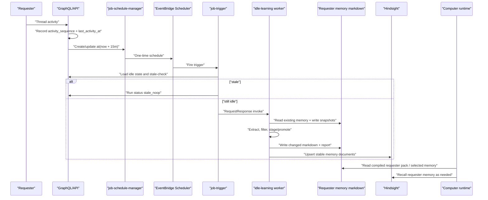

# feat: Requester Idle Memory Learning

## Overview

Implement requester-scoped learning after a Thread becomes idle for 15 minutes. This plan deliberately does **not** create a full per-user Workspace that merges into a shared Computer workspace. Instead, it creates a narrower user memory surface:

1. A one-time EventBridge schedule per active Thread idle window.
2. A requester-scoped markdown memory surface under the existing user S3 prefix.
3. An idle learner that updates only allowlisted user memory markdown, with snapshots, reports, and safety gates.
4. Stable Hindsight document upserts derived from those markdown files.
5. A requester overlay that shared Computer turns compose separately from the shared Computer workspace.

This keeps the shared Computer workspace user-neutral while giving the requester durable, inspectable memory that can compound.

## Problem Frame

Shared Computers changed the ownership model: a Computer is a shared capability, not a private agent for one human. The existing `USER.md` model came from per-agent pairing and now creates the wrong boundary for shared Computers. User-specific preferences, corrections, relationships, projects, and working style should live in the requester's memory layer, not in the Computer workspace copied to every invocation.

The desired behavior is: after a Thread has no meaningful activity for 15 minutes, a one-time idle-learning job reviews the Thread, writes high-signal user memory to markdown, records what changed, then updates Hindsight from those markdown documents. Future shared Computer turns compose this requester memory as an overlay.

OpenClaw is reference architecture, not a dependency. The borrowed pattern is markdown-first source of truth, private machine state, human-readable reports, staged candidates, thresholded promotion, source rehydration before promotion, and anti-contamination rules that prevent generated reflections from becoming future evidence.

## Requirements Trace

All R-IDs reference `docs/brainstorms/2026-05-18-requester-idle-memory-learning-requirements.md`.

- **R1-R4.** One-time 15-minute idle trigger with restart, stale guard, and idempotency — U1, U2, U3.
- **R5-R9.** Requester markdown memory source of truth, no shared workspace writes, no requester skills, automatic but reversible — U4, U5, U6.
- **R10-R14.** OpenClaw-inspired separation of working notes, state, reports, staged candidates, durable promotion, rehydration, evidence gates, and anti-contamination — U5.
- **R15-R17.** Shared Computer context and requester context compose as separate scopes with bounded budget and auditability — U7.
- **R18-R20.** Hindsight indexes stable markdown-derived records and raw transcript retain stops being the owned durable-memory path for this feature — U6, U8.
- **R21-R25.** Run reports, rollback pointers, prompt-control/secret/policy rejection, status visibility, and bounded budgets — U3, U4, U5, U8.

Acceptance examples map directly:

- **AE1, AE2:** U1-U3.
- **AE3:** U4, U7.
- **AE4, AE7:** U5.
- **AE5:** U6.
- **AE6:** U3, U4, U8.

## Scope Boundaries

- In scope: shared Computer requester idle learning for Thread messages and related Thread activity; requester-scoped memory markdown; stable Hindsight upserts from those markdown files; prompt-time requester overlay; operator-visible run status.
- Out of scope: requester-specific skills; shared/team memory learning; passive Slack/channel learning outside a Thread; replacing Thread history or AgentCore short-term/session memory; large end-user settings; perfect truth maintenance.
- Out of scope for v1: recurring nightly dreaming across all users. The 15-minute idle job stages and promotes Thread-local learnings. A later user-level compaction/dreaming sweep can read the same candidate/state files.
- Out of scope for this implementation plan: re-architecting the whole workspace composer. This plan introduces a requester memory surface and a prompt overlay without making every user a full workspace tenant.

## Context & Research

### Existing Thinkwork Seams

- `packages/database-pg/src/schema/scheduled-jobs.ts` already models timer jobs through `scheduled_jobs` and `thread_turns`.
- `packages/lambda/job-schedule-manager.ts` already creates/updates/deletes EventBridge Scheduler jobs, supports `at(...)`, and uses `ActionAfterCompletion: "DELETE"` for one-time schedules.
- `packages/lambda/job-trigger.ts` already dispatches scheduled job types and disables one-time jobs after firing.
- `packages/api/src/graphql/resolvers/messages/sendMessage.mutation.ts` is the primary user-message path for Computer Threads. It intentionally does not bump `threads.updated_at` for user messages, so idle learning needs its own activity state.
- `packages/api/src/lib/computers/thread-cutover.ts` enqueues Computer Thread work and preserves requester identity through `computerTasks.created_by_user_id`.
- `packages/api/src/lib/computers/requester-context.ts` already assembles requester-scoped Hindsight recall for Computer turns.
- `packages/api/src/lib/computers/runtime-api.ts` has a newer `loadThreadTurnContext` path that builds requester context, but the current dispatch path still goes through `invokeChatAgent`. U7 must reconcile this by making requester context explicit in the actual Computer turn payload.
- `packages/api/src/lib/memory/adapters/hindsight-adapter.ts` already supports stable `document_id` + `update_mode: "replace"` for thread and daily documents. U6 extends this shape to requester memory markdown files.
- `packages/agentcore-strands/agent-container/container-sources/user_storage.py` already reads `tenants/{tenant}/users/{user}/knowledge-pack.md`, proving the user-tier S3 prefix and runtime read pattern.
- `packages/agentcore-strands/agent-container/container-sources/server.py` currently auto-retains full Thread transcripts through `api_memory_client.retain_full_thread`. U8 gates or reshapes that path once markdown-derived learning owns durable memory for Computer Threads.
- `packages/workspace-defaults/files/USER.md` and `packages/api/src/lib/user-md-writer.ts` are legacy user profile surfaces for paired agents. Shared Computer turns should not use this file as the requester memory layer.

### OpenClaw Reference Takeaways

- `MEMORY.md` is the compact durable layer; dated `memory/YYYY-MM-DD.md` files are working memory; `DREAMS.md` or phase folders are review output.
- Machine state lives under hidden memory subfolders, separate from human-readable memory.
- Dreaming stages candidate snippets before promotion. Promotion depends on recall/frequency/relevance/diversity/recency signals.
- Deep promotion rehydrates candidates from source files before writing `MEMORY.md`.
- Dream reports and generated reflections are explicitly excluded from future promotion sources.
- Contamination filters reject prompt-control-like content and generated report prose.

### Institutional Learnings

- `docs/solutions/workflow-issues/agentcore-completion-callback-env-shadowing-2026-04-25.md` — snapshot env and identity at call boundaries; relevant to runtime and worker payloads.
- `docs/solutions/workflow-issues/manually-applied-drizzle-migrations-drift-from-dev-2026-04-21.md` — schema work needs explicit Drizzle migration/codegen discipline and manual-migration markers when applicable.
- `docs/solutions/workflow-issues/agentcore-runtime-no-auto-repull-requires-explicit-update-2026-04-24.md` — runtime prompt/payload changes require post-deploy AgentCore runtime verification.
- `docs/solutions/workflow-issues/workspace-defaults-md-byte-parity-needs-ts-test-2026-04-25.md` — if this work changes workspace defaults, update generated TS constants and run the workspace-defaults test.
- `docs/solutions/best-practices/probe-every-pipeline-stage-before-tuning-2026-04-20.md` — add probes/status surfaces before tuning extraction/promotion thresholds.
- `docs/solutions/logic-errors/compile-continuation-dedupe-bucket-2026-04-20.md` — prior one-shot background work showed how fire-and-forget retries can duplicate side effects. U3 uses state idempotency plus `RequestResponse` for the idle worker invoke from `job-trigger`.

## Key Technical Decisions

1. **Requester memory surface, not requester Workspace.** Store user memory files under `tenants/{tenantId}/users/{userId}/memory/...` in the existing workspace bucket. The Computer workspace remains `tenants/{tenant}/agents|computers/...` and user-neutral.
2. **Reuse EventBridge Scheduler, add dedicated idle state.** Reuse `scheduled_jobs` and `job-schedule-manager` for one-time `at(...)` schedules, but add dedicated idle-learning state/run tables so internal triggers can be hidden from user automation lists and audited cleanly.
3. **Do not use `threads.updated_at` as the idle source of truth.** User messages intentionally avoid bumping it. Add an explicit Thread activity helper that writes `(last_activity_at, activity_sequence)` into idle-learning state and schedules/reschedules the one-time trigger.
4. **Hidden scheduled job trigger type.** Use `trigger_type = "thread_idle_memory_learning"` with `created_by_type = "system"` and `config.internal = true`. User/admin scheduled job listing excludes `config.internal = true` by default.
5. **Dedicated idle-learning Lambda worker.** `job-trigger` stays the scheduler dispatcher. It checks stale state, creates a run row, then invokes a bounded worker Lambda with `InvocationType: "RequestResponse"` so invoke errors can be recorded immediately.
6. **Hybrid promotion in v1.** Explicit user statements, corrections, stable preferences, and confirmed decisions may promote directly to durable memory. Weak one-off observations are staged as candidates and only promote after recurrence or strong evidence. This keeps the 15-minute job useful without pretending every inference is standing memory.
7. **Markdown files are source of truth; Hindsight is an index.** Hindsight receives stable document upserts for changed memory files, not an uncontrolled stream of raw transcript facts. Retrieval still uses existing memory services.
8. **Reports are not evidence.** Run reports and model reflections are review artifacts. Future learning runs read source Thread messages and requester memory files, not prior reports, when promoting.
9. **Suppress shared Computer `USER.md` leakage.** Shared Computer turns render requester overlay separately and stop treating workspace `USER.md` as the active requester profile. Legacy personal agents can keep the old behavior until they are explicitly migrated.
10. **Automatic writes require rollback artifacts.** Each run snapshots changed memory files before write, records hashes and snapshot keys, and exposes a rollback path that restores prior content and updates Hindsight.

## Data Model

Add Drizzle schema and migration entries in `packages/database-pg/src/schema/` and `packages/database-pg/drizzle/`.

### `thread_idle_learning_state`

One row per Thread that has ever scheduled idle learning.

- `id`
- `tenant_id`
- `thread_id` unique
- `computer_id`
- `requester_user_id`
- `activity_sequence`
- `last_activity_at`
- `scheduled_for`
- `scheduled_job_id`
- `status`: `idle_scheduled | running | stale | changed | no_change | failed | disabled`
- `last_run_id`
- `created_at`
- `updated_at`

### `thread_idle_learning_runs`

One row per attempted idle-learning run.

- `id`
- `tenant_id`
- `thread_id`
- `computer_id`
- `requester_user_id`
- `scheduled_job_id`
- `activity_sequence`
- `scheduled_for`
- `started_at`
- `finished_at`
- `status`: `running | stale_noop | changed | no_change | failed | rolled_back`
- `changed_files`: JSONB array with path, before hash, after hash, snapshot key, Hindsight document id.
- `candidate_summary`: JSONB counts by category and decision.
- `report_s3_key`
- `error`
- `budget`: JSONB with token/model/time/file limits and actuals.
- `metadata`: JSONB for model/version/prompt checksum.

## User Memory S3 Layout

All keys are server-computed from tenant/user IDs after DB authorization.

```text
tenants/{tenantId}/users/{userId}/memory/MEMORY.md
tenants/{tenantId}/users/{userId}/memory/candidates/YYYY-MM-DD.md
tenants/{tenantId}/users/{userId}/memory/working/YYYY-MM-DD.md
tenants/{tenantId}/users/{userId}/memory/.state/thread-idle/{threadId}.json
tenants/{tenantId}/users/{userId}/memory/.snapshots/{runId}/{encodedPath}.md
tenants/{tenantId}/users/{userId}/memory/reports/thread-idle/{runId}.md
tenants/{tenantId}/users/{userId}/knowledge-pack.md
```

The v1 write allowlist is:

- `memory/MEMORY.md`
- `memory/candidates/YYYY-MM-DD.md`
- `memory/working/YYYY-MM-DD.md`

The learner may write `.state`, `.snapshots`, and `reports` through internal APIs only. Runtime tools and model-generated writes cannot target those paths.

## High-Level Design



## Implementation Units

### U1 — Idle Learning Schema and Internal Job Filtering

**Goal:** Add durable idle-learning state/run tables and hide internal schedules from user-facing automation queries.

**Files:**

- `packages/database-pg/src/schema/scheduled-jobs.ts`
- `packages/database-pg/src/schema/threads.ts` or new `packages/database-pg/src/schema/thread-idle-learning.ts`
- `packages/database-pg/src/schema/index.ts`
- `packages/database-pg/graphql/types/*.graphql`
- `packages/database-pg/drizzle/NNNN_thread_idle_learning.sql`
- `packages/api/src/handlers/scheduled-jobs.ts`
- `packages/lambda/job-schedule-manager.ts`

**Implementation notes:**

- Add `thread_idle_learning_state` and `thread_idle_learning_runs`.
- Add indexes on `(tenant_id, thread_id)`, `(tenant_id, requester_user_id, updated_at)`, and `(tenant_id, status, scheduled_for)`.
- Keep `scheduled_jobs` reusable, but filter `config.internal = true` from default scheduled-job list responses.
- If the GraphQL/API scheduled job surface exposes all trigger types, explicitly block user creation/update of `thread_idle_memory_learning`.
- Preserve direct `triggerType` filter behavior for internal diagnostics when a caller is authenticated as service/admin.

**Tests:**

- Schema/type tests compile after codegen.
- `packages/api/src/handlers/scheduled-jobs.*.test.ts`: internal jobs are excluded by default and included only through explicit internal/admin filtering.
- Migration smoke: `pnpm --filter @thinkwork/database-pg db:generate` or hand migration with markers per repo convention.

### U2 — Thread Activity Hook and One-Time Schedule Reset

**Goal:** Every meaningful Thread activity restarts the 15-minute idle timer and updates `activity_sequence`.

**Files:**

- `packages/api/src/lib/thread-idle-learning/activity.ts` (new)
- `packages/api/src/graphql/resolvers/messages/sendMessage.mutation.ts`
- `packages/api/src/lib/computers/runtime-api.ts`
- `packages/api/src/handlers/thread-attachments-finalize.ts`
- `packages/api/src/handlers/mcp-approval.ts`
- `packages/api/src/handlers/slack/events.ts`
- `packages/api/src/graphql/utils.ts`
- `packages/api/src/__tests__/computer-thread-cutover-routing.test.ts`

**Meaningful activity in v1:**

- Requester user messages.
- Assistant/computer responses persisted to the Thread.
- Finalized attachments linked to a Thread.
- Approval decisions/tool-result messages when they are persisted as Thread-visible events.

Thread title edits, labels, read receipts, and background status bookkeeping do not reset idle learning unless they create Thread-visible conversational evidence.

**Implementation notes:**

- Create `recordThreadActivityForIdleLearning({ tenantId, threadId, computerId, requesterUserId, source, occurredAt })`.
- The helper:
  - upserts `thread_idle_learning_state`;
  - increments `activity_sequence`;
  - computes `scheduled_for = occurredAt + 15 minutes`;
  - creates or updates a hidden `scheduled_jobs` row;
  - calls `job-schedule-manager` with `RequestResponse` semantics through the same internal helper style used by scheduled jobs.
- Store `activity_sequence`, `last_activity_at`, `threadId`, `requesterUserId`, and `computerId` in `scheduled_jobs.config`.
- Idempotency key is `thread-idle-learning:{threadId}` at the state layer; schedule updates replace the existing EventBridge schedule instead of creating multiples.

**Tests:**

- User message schedules `at(T+15m)` even though `threads.updated_at` is not bumped.
- Assistant response reschedules from response time, so AE1 runs after the assistant response idle point.
- Two concurrent activity calls produce one state row and one active scheduled job.
- Attachment finalization resets the timer only when associated with the Thread.

### U3 — Scheduler Fire Path and Worker Invocation

**Goal:** Add a `thread_idle_memory_learning` branch to `job-trigger` that stale-checks, records run state, invokes the worker, and updates final status.

**Files:**

- `packages/lambda/job-trigger.ts`
- `packages/lambda/__tests__/job-trigger.thread-idle-learning.test.ts` (new)
- `packages/api/src/handlers/thread-idle-memory-learning.ts` (new)
- `packages/api/src/handlers/thread-idle-memory-learning.test.ts` (new)
- `scripts/build-lambdas.sh`
- `terraform/modules/app/lambda-api/handlers.tf`
- `terraform/modules/app/lambda-api/iam.tf` or current handler IAM file

**Implementation notes:**

- `job-trigger` branch loads `thread_idle_learning_state` and `scheduled_jobs.config`.
- If state `activity_sequence` or `last_activity_at` differs from event/config, insert/update run as `stale_noop`, leave memory untouched, and return.
- If still idle, insert `thread_idle_learning_runs(status="running")` and invoke `thread-idle-memory-learning` with `InvocationType: "RequestResponse"`.
- Worker response shape: `{ ok, status, changedFiles, reportS3Key, budget, error? }`.
- On worker failure, mark run `failed`, update state `failed`, write a `computer_events` warning if a Computer exists.
- Preserve one-time schedule deletion behavior after firing.

**Tests:**

- Stale schedule fire writes no memory and marks `stale_noop`.
- Fresh schedule fire invokes worker with tenant/thread/user/computer/activity fields.
- Worker error marks the run failed and does not mark the hidden schedule as user-visible.
- One-time schedule cleanup still runs for this trigger type.

### U4 — Requester Memory File Store, Snapshots, and Reports

**Goal:** Provide safe server-side read/write/list primitives for requester memory files and run reports.

**Files:**

- `packages/api/src/lib/requester-memory/storage.ts` (new)
- `packages/api/src/lib/requester-memory/storage.test.ts` (new)
- `packages/api/src/handlers/thread-idle-memory-learning.ts`
- `terraform/modules/app/lambda-api/handlers.tf`

**Implementation notes:**

- Add helpers:
  - `requesterMemoryKey({ tenantId, userId, path })`
  - `readRequesterMemoryFile`
  - `writeRequesterMemoryFileWithSnapshot`
  - `writeIdleLearningReport`
  - `restoreRequesterMemorySnapshot`
- Validate tenant/user IDs with the same safe-ID approach as `user_storage.py`.
- Validate paths against the allowlist. Reject absolute paths, `..`, hidden path writes outside internal-only helpers, and `USER.md` / `REQUESTER.md`.
- Snapshot before write to `memory/.snapshots/{runId}/{encodedPath}.md`.
- Store SHA-256 hashes and byte counts for before/after.
- Report format is markdown with structured JSON frontmatter or a fenced JSON block for machine parsing.

**Tests:**

- Allowed paths round-trip.
- Disallowed paths reject traversal, hidden paths, `USER.md`, shared workspace paths, and skill/tool names.
- Snapshot is written before overwrite and rollback restores exact prior content.
- Report write includes changed files, skipped candidates, safety rejects, Hindsight status, and budget usage.

### U5 — OpenClaw-Inspired Learning Pipeline

**Goal:** Convert Thread evidence into staged candidates and durable requester memory with gates, budgets, and anti-contamination.

**Files:**

- `packages/api/src/lib/requester-memory/learner.ts` (new)
- `packages/api/src/lib/requester-memory/prompts.ts` (new)
- `packages/api/src/lib/requester-memory/safety.ts` (new)
- `packages/api/src/lib/requester-memory/markdown.ts` (new)
- `packages/api/src/lib/requester-memory/learner.test.ts` (new)
- `packages/api/src/handlers/thread-idle-memory-learning.ts`

**Pipeline:**

1. Load canonical Thread transcript from `messages`, Thread metadata, attachment metadata, approval/task outcomes, and current requester memory files.
2. Build a bounded evidence packet: message IDs, roles, timestamps, excerpts, and metadata references. Do not load arbitrary attachment bodies unless explicitly text-extracted and under budget.
3. Ask the model for structured candidate JSON with categories: `preference`, `correction`, `person`, `project`, `workflow`, `decision`, `negative_signal`, `reject`.
4. Run deterministic safety filters for secrets, prompt-control language, policy/permission/tool instructions, and generated-report markers.
5. Score candidates by explicitness, correction strength, recurrence, task outcome, recency, and contradiction with existing memory.
6. Rehydrate every promoted candidate from canonical message evidence before writing.
7. Write weak material to `memory/candidates/YYYY-MM-DD.md`; promote strong material to `memory/MEMORY.md`; optionally append neutral working notes to `memory/working/YYYY-MM-DD.md`.
8. Write a report with diffs/summaries, evidence references, rejects, and budget usage.

**OpenClaw pattern mapping:**

- `memory/candidates/YYYY-MM-DD.md` is the short-term staged layer.
- `memory/.state/thread-idle/{threadId}.json` stores cursors, hashes, scores, and locks.
- `memory/MEMORY.md` is the durable compact layer.
- `memory/reports/thread-idle/{runId}.md` is human-readable review output and never a promotion source.

**Tests:**

- Explicit correction promotes to durable memory with message provenance.
- One-off inference stages but does not promote.
- Prompt injection text is rejected and appears only in report rejects.
- Secret-like content is redacted/rejected.
- Generated report text is ignored as an evidence source.
- Budget exhaustion writes a partial report and leaves run status explainable.
- Contradictory durable memory produces an update with evidence rather than duplicating both facts.

### U6 — Stable Hindsight Upserts from Markdown Memory

**Goal:** Index changed requester memory markdown into Hindsight with stable document IDs and provenance.

**Files:**

- `packages/api/src/lib/memory/types.ts`
- `packages/api/src/lib/memory/adapter.ts`
- `packages/api/src/lib/memory/adapters/hindsight-adapter.ts`
- `packages/api/src/lib/memory/adapters/hindsight-adapter.test.ts`
- `packages/api/src/lib/requester-memory/hindsight-sync.ts` (new)
- `packages/api/src/lib/requester-memory/hindsight-sync.test.ts` (new)
- `packages/api/src/handlers/memory-retain.ts`

**Implementation notes:**

- Add an adapter method or service function for markdown document upsert:
  - owner: `(tenantId, ownerType="user", ownerId=userId)`
  - `document_id = requester_memory:{userId}:{path}`
  - `update_mode = "replace"`
  - `context = "thinkwork_requester_memory"`
  - metadata: `source="requester_memory_markdown"`, path, runId, threadId, evidence message IDs, before/after hashes.
- Do not send reports, snapshots, or `.state` files to Hindsight.
- On rollback, re-upsert the restored document content or delete the document if the file became empty.
- Keep raw `retainConversation` available for legacy/non-Computer flows, but tag Computer Thread auto-retain as deprecated once U8 gates it.

**Tests:**

- Same memory file updated twice uses the same Hindsight document ID.
- Report paths are ignored.
- Metadata preserves thread/run/file provenance.
- Rollback re-upserts restored content.
- Hindsight failure records run warning without losing markdown writes.

### U7 — Requester Overlay in Shared Computer Turns

**Goal:** Make requester context explicit in the actual Computer runtime path and stop treating shared workspace `USER.md` as the requester profile.

**Files:**

- `packages/api/src/lib/computers/thread-cutover.ts`
- `packages/api/src/graphql/utils.ts`
- `packages/api/src/handlers/chat-agent-invoke.ts`
- `packages/api/src/lib/computers/requester-context.ts`
- `packages/api/src/lib/computers/runtime-api.ts`
- `packages/agentcore-strands/agent-container/container-sources/server.py`
- `packages/agentcore-strands/agent-container/container-sources/user_storage.py`
- `packages/agentcore-strands/agent-container/test_knowledge_pack_loader.py`
- `packages/agentcore-strands/agent-container/test_delegate_to_workspace_tool.py`
- `packages/api/src/lib/computers/runtime-api.test.ts`

**Implementation notes:**

- Extend Computer dispatch payload to include `requester_user_id`, `requester_context`, and `computer_scope`.
- Use `formatRequesterContextForPrompt` output plus selected memory/pack metadata as the requester overlay.
- In Strands `server.py`, render requester overlay in a separate bounded section, e.g. `<requester_context_overlay>`.
- For `computer_scope="shared"`, suppress or demote workspace `USER.md` from system-prompt loading. Shared Computer identity comes from Computer/template files; requester identity comes from overlay.
- Include audit metadata in task events: requester user id, memory hit IDs, pack etag/age if loaded, and memory document IDs made available.
- Preserve legacy behavior for historical personal Computers or agent paths until separately migrated.

**Tests:**

- Shared Computer prompt includes requester overlay and does not include workspace `USER.md` text.
- Another requester on the same Computer does not receive the first requester's memory.
- System-context runs without requester user id skip requester overlay with an explicit reason.
- Prompt budget truncates memory hits/pack content deterministically.

### U8 — Runtime Retain Gate, Status Surface, and Rollback

**Goal:** Prevent duplicate durable-memory paths for Computer Threads and expose enough operations to review and undo automatic memory writes.

**Files:**

- `packages/agentcore-strands/agent-container/container-sources/server.py`
- `packages/agentcore-strands/agent-container/container-sources/api_memory_client.py`
- `packages/api/src/handlers/memory-retain.ts`
- `packages/api/src/graphql/resolvers/memory/*.ts`
- `packages/database-pg/graphql/types/memory.graphql`
- `apps/admin/src/**/memory*` or current Memory/Computer detail routes
- `apps/mobile/src/**/memory*` only if an existing run-status surface exists
- `packages/api/src/lib/requester-memory/rollback.ts` (new)
- `packages/api/src/lib/requester-memory/rollback.test.ts` (new)

**Implementation notes:**

- Add config flag `REQUESTER_IDLE_MEMORY_LEARNING_ENABLED` default off for initial deploy, then enable in dev.
- For Computer Thread turns when the flag is on, stop treating raw transcript auto-retain as the primary durable memory path. Options:
  - skip `retain_full_thread` for Computer Threads and rely on idle learner;
  - or retain raw transcript with metadata `durable_memory_source="transcript_legacy"` and exclude it from requester pack/long-term promotion.
- Add GraphQL/API queries for idle-learning run list/detail by requester/thread.
- Add rollback mutation/action that restores snapshots for a run, marks run `rolled_back`, writes a rollback report entry, and syncs Hindsight.
- Minimal admin surface: run status, changed files, report link/body, rollback button for changed runs. A large end-user settings UI is out of scope.

**Tests:**

- When enabled for Computer Threads, raw transcript retain is skipped or marked legacy per chosen branch.
- Run list/detail enforce tenant and requester access.
- Rollback restores snapshots and updates run/Hindsight status.
- Failed Hindsight sync after rollback remains visible and retryable.

## Sequencing

1. U1 schema/state foundation.
2. U2 activity hook and schedule reset.
3. U3 scheduler fire path and worker shell with stale/no-op behavior.
4. U4 requester memory storage and report/snapshot primitives.
5. U5 learner pipeline.
6. U6 Hindsight sync.
7. U7 requester overlay in actual Computer runtime path.
8. U8 retain gate, status UI/API, rollback.

Recommended shipping slices:

- **Slice A:** U1-U3 behind `REQUESTER_IDLE_MEMORY_LEARNING_ENABLED=false`; verify schedules and stale no-ops without writes.
- **Slice B:** U4-U5 write reports/candidates only; no durable `MEMORY.md` promotion.
- **Slice C:** U5 durable promotion + U6 Hindsight sync in dev.
- **Slice D:** U7 overlay and U8 raw-retain gate; enable for shared Computers.
- **Slice E:** Admin rollback/status polish and production rollout.

## Verification Plan

Do not run these during planning. Implementing agents should run the relevant subset per slice.

- `pnpm --filter @thinkwork/database-pg db:generate` or hand migration validation, depending on migration shape.
- `pnpm schema:build`
- Codegen in `apps/cli`, `apps/admin`, `apps/mobile`, and `packages/api` after GraphQL edits.
- `pnpm --filter @thinkwork/api test`
- `pnpm --filter @thinkwork/lambda test`
- `uv run pytest packages/agentcore-strands/agent-container/test_knowledge_pack_loader.py`
- `uv run pytest packages/agentcore-strands/agent-container/test_user_storage.py`
- Targeted integration smoke in dev:
  - send a Computer Thread message;
  - confirm idle schedule created for 15 minutes after latest activity;
  - send another activity before fire and confirm stale event no-ops;
  - let a fresh idle event fire;
  - inspect requester memory S3 keys, run report, Hindsight document, and next-turn requester overlay.

## Risks and Mitigations

| Risk | Mitigation |
| --- | --- |
| User-facing scheduled jobs list shows internal idle triggers | U1 filters `config.internal = true` by default and blocks user mutation of this trigger type |
| Races promote memory after a new message | U2 activity sequence + U3 stale guard + U5 rehydration before write |
| Prompt injection becomes durable memory | U5 deterministic filters, model prompt constraints, report-only rejects, no reports as evidence |
| Shared Computer leaks one requester's memory to another | U7 requester overlay scoped by `requester_user_id`; suppress shared `USER.md`; tests with two users on one Computer |
| Duplicate Hindsight facts from raw transcript and markdown memory | U6 stable markdown document IDs + U8 retain gate for Computer Threads |
| Bad automatic memory write harms trust | U4 snapshots, U8 rollback, report diff/evidence |
| New worker Lambda lacks IAM/build wiring | U3 explicitly owns `scripts/build-lambdas.sh` and Terraform handler/IAM changes |
| Over-promoting one-off observations | U5 hybrid promotion; weak observations stage in candidates |
| Hindsight outage blocks learning | Markdown write remains source of truth; Hindsight status recorded and retryable |

## Open Questions

### Resolved During Planning

- **Full per-user Workspace?** No. Use requester memory S3 surface plus prompt overlay, not a merged workspace.
- **Scheduler substrate?** Reuse existing `scheduled_jobs`/EventBridge manager with dedicated idle state/run tables.
- **Durable memory target?** Markdown first, Hindsight second.
- **Skills in requester overlay?** Out of v1.
- **15-minute idle job promotion strategy?** Hybrid: strong evidence can promote, weak evidence stages.
- **OpenClaw dependency?** Reference only, no vendoring.

### Deferred to Implementation

- Exact prompt/model for extraction and whether to use Bedrock JSON schema/constrained output or post-validate plain JSON.
- Whether admin rollback appears under Memory, Computer detail, or Thread detail first.
- Exact rollout flag default per stage.
- Whether to backfill/delete legacy shared Computer `USER.md` files immediately or only suppress them at prompt time in v1.
- Whether user-level nightly dreaming/compaction should be implemented as a follow-up using the same candidate/state files.

## Agent Handoff

- Start with U1-U3 and keep the feature flag off until stale/no-op behavior is proven.
- Use `apply_patch` for edits and follow repo codegen/migration rules.
- Keep every S3 key server-computed; no client-provided path or tenant/user prefix.
- Do not write requester memory into a Computer workspace, `USER.md`, `REQUESTER.md`, skills, or tool definitions.
- Treat OpenClaw as design prior art: state/report/durable separation, source rehydration, thresholded promotion, and contamination filters are the important parts.
