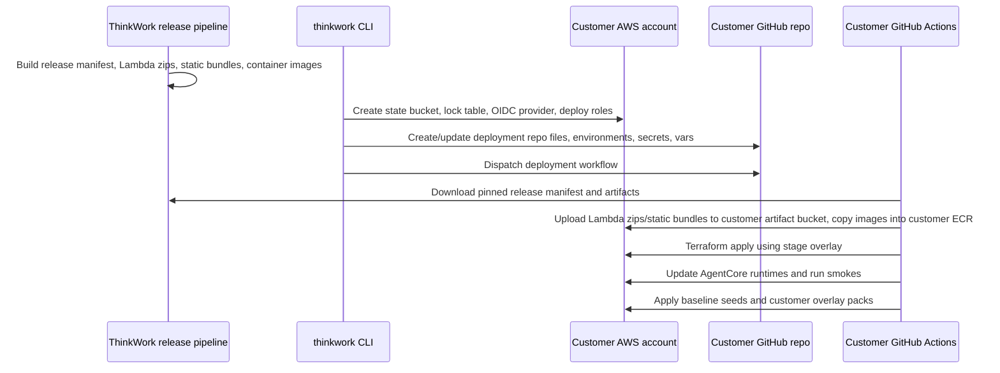

# feat: Enterprise Customer Deployment Repo

## Overview

Build the enterprise deployment model as a customer-owned deployment repository that pins a ThinkWork release, carries customer overlays, and deploys into the customer's AWS account through GitHub Actions after a one-time CLI bootstrap.

The central implementation decision is to stop treating the monorepo checkout as the deployment artifact. Today `.github/workflows/deploy.yml` builds Lambda zips, runtime containers, and SPAs from source. A no-fork customer deployment repo needs a release manifest that coordinates those artifacts, plus Terraform/CLI support to consume them without copying the whole ThinkWork source tree.

---

## Problem Frame

ThinkWork needs a repeatable enterprise foundation deployment path for new AWS accounts while supporting contracted customization such as evals, seeds, skills, workspace defaults, and branding. The origin document rejects a full ThinkWork source fork as the default customer strategy because it creates recurring merge burden and obscures which work should flow upstream (see origin: `docs/brainstorms/2026-05-18-enterprise-customer-deployment-repo-requirements.md`).

The plan turns that product decision into four technical surfaces:

- A versioned ThinkWork release manifest and artifact set.
- Terraform modules that can consume remote release artifacts.
- A CLI bootstrap command that creates the AWS/GitHub trust bridge and customer-owned release artifact bucket.
- A generated customer deployment repo with CI and overlay contracts.

---

## Requirements Trace

- R1. Default enterprise deployment is a customer-owned deployment repo, not a full ThinkWork source fork.
- R2. The local CLI bootstraps and dispatches setup; it is not steady-state production deploy authority.
- R3. First bootstrap runs from an admin laptop with temporary AWS admin-equivalent access.
- R4. Steady-state deploys use GitHub Actions OIDC and scoped AWS deploy roles, not long-lived AWS keys.
- R5. The customer deployment repo pins a ThinkWork release/version and stores customer configuration/assets.
- R6. First enterprise model supports multiple stages in one AWS account with GitHub Environment approval.
- R7. CI deploys infrastructure, runtime/app artifacts, migrations, baseline seeds, customer seeds, and eval packs.
- R8. CI produces enough logs and smoke output for customer/ThinkWork diagnosis without the bootstrap machine.
- R9. Customer customization starts in the customer overlay.
- R10. Reusable product/platform behavior lands upstream and is consumed by version bump.
- R11. Missing customization boundaries should become upstream extension points before forking.
- R12. A full ThinkWork fork is an emergency escape hatch with explicit fork-debt tracking only.

**Origin actors:** A1 Enterprise platform admin, A2 Customer GitHub admin, A3 ThinkWork delivery engineer, A4 Customer deployment CI, A5 ThinkWork source repo/release pipeline.

**Origin flows:** F1 Bootstrap a new customer AWS account, F2 Deploy or upgrade ThinkWork, F3 Deliver customer-specific customization.

**Origin acceptance examples:** AE1 no-fork deployment of pinned foundation plus eval pack, AE2 bootstrap creates OIDC trust and deploy roles, AE3 reusable customization flows upstream and is adopted by version bump.

---

## Scope Boundaries

- Do not make customer forking of the full ThinkWork source repo the normal path.
- Do not build a ThinkWork-hosted managed SaaS deployment model here.
- Do not require separate AWS accounts for staging and production in the first version; support one account with multiple stages.
- Do not keep local laptop deploys as the production path after bootstrap, except as break-glass recovery.
- Do not put customer secrets in generated files; generated files may reference GitHub Environments, AWS Secrets Manager, or SSM.
- Do not require customer CI to compile the ThinkWork monorepo from source.

### Deferred to Follow-Up Work

- Supporting CI providers beyond GitHub Actions.
- Separate-account staging/production bootstrap.
- A web UI for customer deployment repo management.
- Full automated migration from an emergency customer fork back to a deployment repo.

---

## Context & Research

### Relevant Code and Patterns

- `.github/workflows/deploy.yml` is the current source-repo deploy pipeline. It builds Lambda zips, pushes AgentCore images, applies Terraform, updates AgentCore runtimes, builds SPAs, bootstraps workspace defaults, and runs deploy summary checks.
- `.github/workflows/release.yml` currently publishes only `thinkwork-cli` to npm/Homebrew/GitHub Releases. It does not publish deployable Lambda/static/container artifact metadata.
- `apps/cli/src/commands/init.ts` scaffolds local Terraform files and registers an environment in `~/.thinkwork/environments`; useful for prompt/registry style, but it writes `terraform.tfvars` with plaintext secrets and targets local Terraform deploys.
- `apps/cli/src/commands/deploy.ts` and `apps/cli/src/commands/bootstrap.ts` run Terraform and workspace seeding locally. The new enterprise flow should reuse patterns where helpful but hand deployment authority to CI.
- `apps/cli/src/environments.ts` is the local environment registry; enterprise bootstrap needs a related but separate customer deployment registry entry.
- `terraform/modules/thinkwork/variables.tf` already exposes `lambda_artifact_bucket` and `lambda_artifact_prefix`, but `terraform/modules/app/lambda-api/handlers.tf` currently only creates real Lambda handlers when `lambda_zips_dir` is set. Remote Lambda artifact consumption is not wired through.
- `terraform/modules/app/static-site/main.tf` provisions S3/CloudFront buckets but does not upload frontend assets; current source CI uses `scripts/build-admin.sh`, `scripts/build-computer.sh`, and `scripts/build-docs.sh`.
- `packages/skill-catalog/scripts/install-finance-pilot.ts` is a useful precedent for an idempotent, tested installer that pushes customer-like skill files through the deployed REST API.
- `apps/cli/__tests__/no-required-options.test.ts` protects the CLI's interactive fallback rule. New enterprise commands should avoid required `--stage`/`--tenant` options unless there is a documented exception.

### Institutional Learnings

- `docs/solutions/workflow-issues/agentcore-runtime-no-auto-repull-requires-explicit-update-2026-04-24.md`: AgentCore Runtime does not auto-repull ECR tags. Customer CI must explicitly update runtimes and verify active image freshness.
- `docs/solutions/workflow-issues/deploy-silent-arch-mismatch-took-a-week-to-surface-2026-04-24.md`: Multi-component deploys need cross-component assertions; green CI can hide stale AgentCore runtime images.
- `docs/solutions/logic-errors/bootstrap-silent-exit-1-set-e-tenant-loop-2026-04-21.md`: Bootstrap scripts need loud diagnostics and failure isolation; strict shell with silent exits caused deploy ambiguity.
- `docs/solutions/workflow-issues/manually-applied-drizzle-migrations-drift-from-dev-2026-04-21.md`: Hand-rolled migrations need explicit drift markers and deploy gates. Customer CI must keep database migration/seeding status visible.

### External References

- GitHub Actions OpenID Connect with AWS: `https://docs.github.com/en/actions/how-tos/secure-your-work/security-harden-deployments/oidc-in-aws`
- GitHub REST API for workflow dispatch: `https://docs.github.com/en/rest/actions/workflows#create-a-workflow-dispatch-event`
- AWS IAM condition keys for GitHub OIDC: `https://docs.aws.amazon.com/IAM/latest/UserGuide/reference_policies_iam-condition-keys.html#condition-keys-wif`
- Terraform S3 backend: `https://developer.hashicorp.com/terraform/language/backend/s3`

---

## Key Technical Decisions

- Publish a coordinated release manifest instead of asking customer CI to infer artifacts: The deployment repo pins one manifest version that names Terraform module version, CLI version, Lambda artifact bundle, static bundles, and container image tags.
- Use upstream-published images as source images, then copy into customer ECR: Customer runtimes should run from customer-owned ECR repos, but the deployment repo should not need the full monorepo to build images.
- Wire Terraform remote Lambda artifacts before generating customer CI: Without remote zip support, no-fork deploys would either create placeholder handlers or require a source checkout.
- Generate a deployment repo, not just a Terraform directory: The customer-owned artifact must include GitHub workflow, environment overlays, customer overlay folders, `thinkwork.lock`, and docs.
- Keep CLI bootstrap idempotent and split from deploy: Bootstrap creates state storage, OIDC, roles, GitHub configuration, and dispatches CI. CI owns deploy/apply/seed.
- Prefer GitHub REST via the platform token or `gh` fallback in the CLI bootstrap: Avoid adding a large GitHub SDK unless implementation shows fetch ergonomics are painful.

---

## Open Questions

### Resolved During Planning

- Artifact set to pin: Pin a release manifest that coordinates CLI/Terraform module version, Lambda zips, static bundles, runtime images, and seed/overlay schema version.
- Customer overlay contract: Start with filesystem assets in the deployment repo (`customer/evals`, `customer/seeds`, `customer/skills`, `customer/workspace-defaults`, `customer/branding`) plus a metadata file that declares which packs apply to each stage.
- Bootstrap role split: Use an admin-local bootstrap path to create state/OIDC/roles, then a scoped CI role for steady-state deploys.
- Stage naming: Support generated `dev` and `prod` by default in one AWS account, with state keys and GitHub Environments matching those names.

### Deferred to Implementation

- Exact release manifest schema fields: Implementation should keep the manifest small, but final field names can settle while wiring release assets.
- Exact minimum IAM policy for the CI deploy role: Start from the resources Terraform actually touches; implementation should iterate toward least privilege with explicit TODOs for any broad grants that remain.
- Whether the generated deployment repo commits files directly or opens a PR: The CLI should support both eventually; implementation can ship direct commit/create as the first working path if it is auditable.

---

## Output Structure

Expected generated customer deployment repo shape:

```text
customer-thinkwork-deploy/
  .github/workflows/deploy.yml
  README.md
  thinkwork.lock
  terraform/
    stages/dev.tfvars
    stages/prod.tfvars
    main.tf
    backend-dev.hcl
    backend-prod.hcl
  customer/
    deployment.json
    evals/
    seeds/
    skills/
    workspace-defaults/
    branding/
```

Expected ThinkWork source additions:

```text
apps/cli/src/commands/enterprise/
  bootstrap.ts
  overlay.ts
  release.ts
  github.ts
  aws-bootstrap.ts
  templates/
scripts/release/
  build-release-manifest.ts
  package-static-assets.sh
  publish-release-assets.sh
terraform/modules/app/lambda-api/
  remote-artifacts.tf
docs/src/content/docs/deploy/
  enterprise-deployment-repo.mdx
```

This tree is directional. During implementation, keep file placement consistent with existing CLI command organization and Terraform module boundaries.

---

## High-Level Technical Design

> _This illustrates the intended approach and is directional guidance for review, not implementation specification. The implementing agent should treat it as context, not code to reproduce._



---

## Implementation Units

- U1. **Publish Coordinated ThinkWork Release Artifacts**

**Goal:** Extend the ThinkWork release pipeline so a deployment repo can pin one release manifest and fetch all artifacts needed to deploy without a source checkout.

**Requirements:** R5, R7, R10, R11, F2, AE1

**Dependencies:** None

**Files:**

- Modify: `.github/workflows/release.yml`
- Modify: `scripts/build-lambdas.sh`
- Create: `scripts/release/build-release-manifest.ts`
- Create: `scripts/release/package-static-assets.sh`
- Create: `scripts/release/publish-release-assets.sh`
- Modify: `apps/cli/scripts/bundle-terraform.js`
- Test: `scripts/release/__tests__/build-release-manifest.test.ts`

**Approach:**

- Add release jobs after verification that build Lambda zips, static bundles, and runtime image metadata for the tag.
- Publish a versioned `thinkwork-release.json` manifest as a GitHub Release asset. The manifest should name artifact URLs, checksums, image source tags/digests, Terraform/CLI version, and an overlay schema version.
- Keep the existing npm/Homebrew CLI publish path, but ensure the CLI version and manifest version are tied to the same tag.
- Do not require customer deployment repos to know monorepo internals such as which Lambda handlers exist; the manifest owns that mapping.
- Record container image digests, not only mutable tags, because AgentCore runtime freshness verification depends on immutable identity.

**Patterns to follow:**

- `.github/workflows/release.yml` for tag-triggered release publishing.
- `scripts/build-lambdas.sh` for deterministic Lambda zip creation.
- `.github/workflows/deploy.yml` for current container/static build responsibilities to extract into release assets.

**Test scenarios:**

- Happy path: Given a sample manifest input with Lambda zips, static bundles, and two runtime images, manifest generation emits a stable JSON object with version, checksums, and artifact names.
- Edge case: Given a missing required artifact, manifest generation fails with a message naming the missing artifact.
- Error path: Given duplicate artifact logical names, manifest generation fails instead of overwriting one entry.
- Integration: A release dry-run produces a manifest whose referenced Lambda artifact names match the handler names Terraform expects.

**Verification:**

- A tagged release exposes a manifest and all referenced assets.
- Manifest checksums match uploaded assets.
- Existing CLI npm/Homebrew release remains intact.

---

- U2. **Teach Terraform to Consume Remote Release Artifacts**

**Goal:** Make the Terraform modules deploy real application code from release artifacts instead of requiring `lambda_zips_dir` and source-built assets.

**Requirements:** R5, R7, R8, F2, AE1

**Dependencies:** U1

**Files:**

- Modify: `terraform/modules/thinkwork/variables.tf`
- Modify: `terraform/modules/thinkwork/main.tf`
- Modify: `terraform/modules/app/lambda-api/variables.tf`
- Modify: `terraform/modules/app/lambda-api/handlers.tf`
- Create: `terraform/modules/app/lambda-api/remote-artifacts.tf`
- Modify: `terraform/modules/thinkwork/outputs.tf`
- Modify: `terraform/examples/greenfield/main.tf`
- Modify: `terraform/examples/greenfield/terraform.tfvars.example`
- Test: `apps/cli/__tests__/terraform-enterprise-artifact-fixture.test.ts`

**Approach:**

- Wire the existing `lambda_artifact_bucket` and `lambda_artifact_prefix` variables into Lambda function definitions so remote S3 artifacts are first-class, not dead variables.
- Preserve local `lambda_zips_dir` for source-repo/dev deploys. Remote artifacts and local zips should be mutually exclusive, with a clear Terraform check.
- Add inputs for pinned runtime image URIs/digests where Terraform or post-apply scripts need them, while keeping runtime updates explicit in CI.
- Add a fixture-style test that renders the enterprise Terraform entrypoint with remote artifacts enabled and asserts no local `dist/lambdas` path is required.
- Ensure required static-site bucket and distribution outputs stay available because customer CI syncs release bundles after Terraform apply.
- Keep static site provisioning separate from static asset upload; CI will sync release bundles into the provisioned buckets after Terraform outputs exist.

**Patterns to follow:**

- Existing `lambda_zips_dir` handler definitions in `terraform/modules/app/lambda-api/handlers.tf`.
- Existing Terraform fixture tests in `apps/cli/__tests__/terraform-sandbox-host-fixture.test.ts` and `apps/cli/__tests__/terraform-slack-fixture.test.ts`.
- `terraform/examples/greenfield/main.tf` as the current module-consumer entrypoint.

**Test scenarios:**

- Happy path: With remote artifact variables set and `lambda_zips_dir` empty, Terraform configuration references S3 bucket/key artifacts for every required handler.
- Edge case: With both `lambda_zips_dir` and remote artifact variables set, Terraform validation fails with a clear mutually-exclusive-input message.
- Edge case: With neither local nor remote Lambda artifacts set for an enterprise deployment fixture, validation fails before producing placeholder/empty handler state.
- Integration: The generated enterprise Terraform fixture includes app, data, and foundation variables needed by one-account multi-stage deploys.

**Verification:**

- Source-repo deploys can still use local zips.
- Customer deployment repos can deploy Lambda handlers from uploaded release artifacts.
- Terraform plan errors are clear when artifact inputs are incomplete.

---

- U3. **Define the Customer Deployment Repo and Overlay Contract**

**Goal:** Create a versioned deployment repo template and overlay contract for customer evals, seeds, skills, workspace defaults, branding, and stage-specific configuration.

**Requirements:** R1, R5, R6, R9, R10, R11, F2, F3, AE1, AE3

**Dependencies:** U1, U2

**Files:**

- Create: `apps/cli/src/commands/enterprise/templates/deploy-repo/README.md`
- Create: `apps/cli/src/commands/enterprise/templates/deploy-repo/thinkwork.lock`
- Create: `apps/cli/src/commands/enterprise/templates/deploy-repo/.github/workflows/deploy.yml`
- Create: `apps/cli/src/commands/enterprise/templates/deploy-repo/terraform/main.tf`
- Create: `apps/cli/src/commands/enterprise/templates/deploy-repo/terraform/stages/dev.tfvars`
- Create: `apps/cli/src/commands/enterprise/templates/deploy-repo/terraform/stages/prod.tfvars`
- Create: `apps/cli/src/commands/enterprise/templates/deploy-repo/customer/deployment.json`
- Create: `apps/cli/src/commands/enterprise/templates/deploy-repo/customer/evals/README.md`
- Create: `apps/cli/src/commands/enterprise/templates/deploy-repo/customer/seeds/README.md`
- Create: `apps/cli/src/commands/enterprise/templates/deploy-repo/customer/skills/README.md`
- Create: `apps/cli/src/commands/enterprise/templates/deploy-repo/customer/workspace-defaults/README.md`
- Create: `apps/cli/src/commands/enterprise/templates/deploy-repo/customer/branding/README.md`
- Test: `apps/cli/__tests__/enterprise-template.test.ts`

**Approach:**

- Add a template tree bundled into the CLI package. The generated repo should be understandable without the ThinkWork source checkout.
- `thinkwork.lock` pins the release manifest URL/version and checksum. Stage files carry non-secret configuration; secrets are named but not stored.
- `customer/deployment.json` declares overlay packs and which stages they apply to. Keep the initial schema intentionally small: enabled eval packs, skill packs, workspace-default packs, branding asset references, and tenant bootstrap metadata.
- Include README files that state file shapes and secret-handling rules. Documentation in the generated repo is part of the product surface.
- Make the template deterministic so tests can snapshot key files without churn.

**Patterns to follow:**

- `apps/cli/scripts/bundle-terraform.js` for bundling non-code assets into CLI distribution.
- `seeds/eval-test-cases/README.md` for seed file shape documentation.
- `packages/skill-catalog/scripts/install-finance-pilot.ts` for overlay installer expectations.

**Test scenarios:**

- Happy path: Rendering the template for customer slug `acme` and stages `dev,prod` creates `thinkwork.lock`, stage tfvars, workflow, and customer overlay directories.
- Edge case: Rendering twice over an existing template preserves customer-owned overlay files and updates only generated files marked as managed.
- Error path: An invalid customer slug or stage name fails with the same validation posture as existing CLI stage validation.
- Integration: The generated workflow references `thinkwork.lock` and `customer/deployment.json`, not monorepo source paths.

**Verification:**

- The generated repo can be committed as-is without secrets.
- The generated files explain where the customer should place evals, seeds, skills, workspace defaults, and branding.

---

- U4. **Add CLI Enterprise Bootstrap**

**Goal:** Add a guided CLI command that bootstraps the customer AWS/GitHub trust bridge and creates or updates the customer deployment repo.

**Requirements:** R2, R3, R4, R6, R8, F1, AE2

**Dependencies:** U3

**Files:**

- Modify: `apps/cli/src/cli.ts`
- Create: `apps/cli/src/commands/enterprise.ts`
- Create: `apps/cli/src/commands/enterprise/bootstrap.ts`
- Create: `apps/cli/src/commands/enterprise/aws-bootstrap.ts`
- Create: `apps/cli/src/commands/enterprise/github.ts`
- Create: `apps/cli/src/commands/enterprise/release.ts`
- Modify: `apps/cli/src/environments.ts`
- Test: `apps/cli/__tests__/enterprise-registration.test.ts`
- Test: `apps/cli/__tests__/enterprise-bootstrap.test.ts`
- Test: `apps/cli/__tests__/no-required-options.test.ts`

**Approach:**

- Add a command group such as `thinkwork enterprise bootstrap`.
- Preflight AWS identity, account ID, region, Bedrock model access signal, Terraform availability, GitHub repo access, and whether the target repo/environments already exist.
- Create or verify Terraform state bucket, state lock table or lockfile-compatible backend configuration, a customer-owned release artifact bucket for Lambda/static bundles, GitHub OIDC provider, and per-stage deploy roles.
- Configure GitHub Environments, non-secret vars, and secret placeholders. Where a value is customer secret material, prompt for storage in GitHub Environment secrets or print a clear follow-up if API access is unavailable.
- Write or update the customer deployment repo files from U3 and dispatch the workflow using GitHub's workflow dispatch API.
- Store local bootstrap metadata under `~/.thinkwork` without storing customer secrets.
- Use broad bootstrap permissions only locally; generated CI deploy roles should be scoped and documented.

**Execution note:** Implement with test-first coverage around dry-run/idempotency before touching AWS/GitHub calls. External calls should sit behind thin adapters that can be mocked.

**Patterns to follow:**

- `apps/cli/src/commands/init.ts` for guided prompt style and environment registration.
- `apps/cli/src/commands/deploy.ts` for prod-like confirmation behavior.
- `apps/cli/__tests__/no-required-options.test.ts` for interactive fallback expectations.
- Existing `getAwsIdentity` usage in `apps/cli/src/aws.ts`.

**Test scenarios:**

- Happy path: Dry-run bootstrap with mocked AWS/GitHub clients plans state bucket, artifact bucket, OIDC provider, deploy roles, repo files, environments, and workflow dispatch.
- Idempotency: Running bootstrap twice against mocked existing resources reports reuse/update rather than duplicate creation.
- Error path: Missing AWS identity fails before any GitHub mutation.
- Error path: GitHub token lacks environment/secret permission; bootstrap reports the exact missing capability and preserves already-generated local files.
- Security: Generated OIDC trust policy constrains repo owner/name, environment or branch subject, and audience.
- Integration: Command registration exposes `enterprise bootstrap` and no new required options violate CLI fallback tests.

**Verification:**

- A customer admin can run one command locally to establish CI deployment authority.
- Generated AWS trust is tied to the intended GitHub repository and stage/environment.

---

- U5. **Build the Customer CI Deployment Workflow**

**Goal:** Provide the generated GitHub Actions workflow that consumes the pinned release, deploys the stack, copies runtime/static artifacts, applies overlays, and emits a useful summary.

**Requirements:** R4, R5, R6, R7, R8, F2, AE1, AE2

**Dependencies:** U1, U2, U3, U4

**Files:**

- Modify: `apps/cli/src/commands/enterprise/templates/deploy-repo/.github/workflows/deploy.yml`
- Create: `apps/cli/src/commands/enterprise/templates/deploy-repo/scripts/apply-release.mjs`
- Create: `apps/cli/src/commands/enterprise/templates/deploy-repo/scripts/smoke.mjs`
- Test: `apps/cli/__tests__/enterprise-workflow-template.test.ts`

**Approach:**

- Workflow inputs should include `stage`, `component` where useful, and `run_smokes`.
- Use `permissions: id-token: write` and `aws-actions/configure-aws-credentials` with `role-to-assume`, not static AWS keys.
- Download and verify `thinkwork.lock` + release manifest checksums before applying.
- Upload Lambda release artifacts into the bootstrap-created customer artifact bucket/prefix expected by Terraform before apply.
- Copy/push runtime images into customer ECR, preserving immutable release digests and stage tags. After Terraform creates/updates AgentCore runtimes, explicitly update runtime images and verify source/digest freshness.
- Apply Terraform for the selected stage, then sync static site bundles to the provisioned S3 buckets using Terraform outputs.
- Run workspace/default bootstrap, customer overlay application, eval seeding, and smoke checks.
- Emit a deploy summary with URLs, artifact versions, runtime image digests, bootstrap/overlay results, and smoke status.

**Patterns to follow:**

- `.github/workflows/deploy.yml` for current job ordering and AgentCore runtime update responsibilities.
- `scripts/post-deploy.sh` for runtime freshness verification.
- `scripts/bootstrap-workspace.sh` for workspace/skill catalog seeding behavior.

**Test scenarios:**

- Happy path: Rendered workflow for `dev` and `prod` includes OIDC permissions, environment selection, manifest verification, Terraform apply, artifact upload, runtime update, overlay apply, smokes, and summary.
- Security: Rendered workflow does not reference `AWS_ACCESS_KEY_ID` or `AWS_SECRET_ACCESS_KEY`.
- Edge case: `prod` stage includes a GitHub Environment gate reference while `dev` can run without manual approval.
- Error path: If manifest checksum verification fails, the workflow exits before assuming deploy actions that mutate infrastructure.
- Integration: Workflow uses generated stage names and state/backend paths consistently.

**Verification:**

- The generated workflow is auditable and deploys from release artifacts plus customer overlay only.
- Deploy summary gives enough state to debug without the original bootstrap machine.

---

- U6. **Implement Customer Overlay Application**

**Goal:** Add the overlay application path for customer evals, seeds, skills, workspace defaults, and branding after the foundation deploy completes.

**Requirements:** R7, R8, R9, R10, R11, F2, F3, AE1, AE3

**Dependencies:** U3, U5

**Files:**

- Create: `apps/cli/src/commands/enterprise/overlay.ts`
- Create: `apps/cli/src/commands/enterprise/overlay-schema.ts`
- Create: `apps/cli/src/commands/enterprise/overlay-apply.ts`
- Modify: `apps/cli/src/commands/eval/seed.ts`
- Modify: `packages/api/src/lib/eval-seeds.ts`
- Create: `packages/api/src/lib/customer-overlay-seeds.ts`
- Test: `apps/cli/__tests__/enterprise-overlay.test.ts`
- Test: `packages/api/src/__tests__/customer-overlay-seeds.test.ts`

**Approach:**

- Define a schema for `customer/deployment.json` and validate it before mutation.
- Start with idempotent overlay operations: skill files through the workspace file API, workspace defaults through the existing bootstrap/defaults path, eval packs through an import path that can distinguish customer source from built-in `yaml-seed`, and branding assets through explicit stage config or static asset sync.
- Preserve the current built-in starter eval behavior. Customer eval packs should not masquerade as built-in `yaml-seed` rows if that would collide with cleanup/drift assumptions.
- Keep service-auth/API-key paths out of public browser bundles; CI may use stage secrets to call deployed APIs.
- Surface per-pack results in JSON so CI summary can report inserted/skipped/updated counts.

**Execution note:** Add schema/shape tests before wiring deploy mutation paths; customer overlays become an external contract.

**Patterns to follow:**

- `packages/skill-catalog/scripts/install-finance-pilot.ts` for idempotent skill installation and tests.
- `seeds/eval-test-cases/README.md` and `packages/api/src/lib/eval-seeds.ts` for eval seed shape.
- `scripts/bootstrap-workspace.sh` and `packages/api/src/handlers/seed-workspace-defaults.ts` for workspace defaults.

**Test scenarios:**

- Happy path: A valid overlay with one eval pack and one skill pack validates and produces an apply plan with deterministic operations.
- Edge case: Reapplying the same overlay skips or updates idempotently without duplicate eval cases or duplicate skill files.
- Error path: Invalid eval JSON fails validation before any API calls.
- Error path: A workspace file PUT failure halts the affected pack and reports the failed relative path.
- Integration: Applying an overlay after baseline bootstrap reports built-in seed counts separately from customer overlay counts.

**Verification:**

- Customer overlays can be applied by CI after deploy.
- Built-in starter seeds and customer-specific packs remain distinguishable.

---

- U7. **Document and Smoke the Enterprise Deployment Path**

**Goal:** Add operator docs, generated repo docs, and smoke checks that make the first enterprise deployment executable and debuggable.

**Requirements:** R2, R3, R4, R6, R8, R12, F1, F2, F3, AE2

**Dependencies:** U4, U5, U6

**Files:**

- Create: `docs/src/content/docs/deploy/enterprise-deployment-repo.mdx`
- Modify: `docs/src/content/docs/deploy/configuration.mdx`
- Modify: `docs/src/content/docs/applications/cli/commands.mdx`
- Create: `docs/src/content/docs/deploy/customer-overlay-contract.mdx`
- Create: `apps/cli/src/commands/enterprise/templates/deploy-repo/docs/runbook.md`
- Create: `scripts/smoke-enterprise-deployment-template.sh`
- Test: `apps/cli/__tests__/enterprise-doc-links.test.ts`

**Approach:**

- Document the single recommended strategy: deployment repo, no source fork by default, CLI bootstrap once, CI deploys afterward.
- Include a first-account checklist covering AWS admin access, GitHub admin access, Bedrock model access, domain/DNS choices, secret inventory, and approval policy.
- Document the generated repo layout and overlay contract, including what belongs upstream versus customer-specific overlay.
- Add smoke coverage for generated template integrity, workflow syntax shape, manifest verification path, and overlay dry-run validation.
- Include break-glass guidance that explicitly marks full source forks as emergency fork debt, not the normal path.

**Patterns to follow:**

- `docs/src/content/docs/deploy/greenfield.mdx` and `docs/src/content/docs/deploy/byo.mdx` for deployment guide style.
- `docs/src/content/docs/applications/cli/commands.mdx` for CLI command documentation.
- `scripts/smoke/README.md` for smoke test explanation style.

**Test scenarios:**

- Happy path: Docs link checker/fixture confirms the new deploy docs are reachable from the deploy docs set.
- Happy path: Generated runbook names the exact sequence bootstrap -> workflow dispatch -> CI deploy -> overlay apply -> smoke summary.
- Edge case: Docs warn that customer secrets are never committed and name supported secret homes.
- Integration: Smoke script can render a sample deployment repo, validate `thinkwork.lock`, and run overlay dry-run without AWS mutation.

**Verification:**

- A ThinkWork delivery engineer can hand the docs to a customer admin and follow the same deployment story the code implements.
- The generated repo includes enough runbook material for day-2 operations.

---

## System-Wide Impact

- **Interaction graph:** Release workflow produces deploy artifacts; CLI bootstrap configures AWS/GitHub; customer CI consumes artifacts, applies Terraform, updates runtimes, syncs sites, applies overlays, and runs smokes.
- **Error propagation:** Manifest checksum, IAM/OIDC, Terraform, runtime update, overlay apply, and smoke failures should fail the CI job with named sections and summaries.
- **State lifecycle risks:** Terraform state bucket/lock table creation must be idempotent; release assets must be immutable; runtime image tags/digests must not drift from the manifest.
- **API surface parity:** CLI docs/help, generated repo README, and deploy docs must tell the same story. Existing `thinkwork init/deploy/bootstrap` stay available for local/source deploys but should not be described as the enterprise production path.
- **Integration coverage:** Unit tests cover manifest/template logic; workflow/template smoke covers generated repo shape; first live verification still requires a real AWS account and GitHub repo.
- **Unchanged invariants:** Existing hosted dev deploy workflow continues to work from the source repo. Existing CLI local deploy commands are preserved for current operator workflows.

---

## Risks & Dependencies

| Risk                                                            | Mitigation                                                                                                                                     |
| --------------------------------------------------------------- | ---------------------------------------------------------------------------------------------------------------------------------------------- |
| Release manifest misses an artifact required by Terraform or CI | U1 manifest tests and U5 manifest verification fail before mutation.                                                                           |
| First apply needs Lambda zip keys before the app stack exists   | Bootstrap creates a customer artifact bucket outside the app stack; CI uploads release zips there before Terraform apply.                      |
| Terraform remote artifact support breaks source-repo deploys    | Keep `lambda_zips_dir` path and add mutual-exclusion tests for local vs remote artifacts.                                                      |
| CI role is too broad for enterprise comfort                     | Split bootstrap/admin role from steady-state deploy role; document any broad grants and reduce in follow-up before customer rollout.           |
| AgentCore runtime silently stays stale                          | Preserve explicit runtime update and source/digest verification from existing deploy learnings.                                                |
| Customer overlays become an untyped dumping ground              | Add schema validation and dry-run before mutation.                                                                                             |
| Secrets leak into generated repo                                | Generated templates include references/placeholders only; tests assert no known secret keys or values are emitted.                             |
| Generated deployment repo diverges from source deploy workflow  | Release manifest becomes the shared contract; source deploy can continue building from source but should publish the same manifest on release. |

---

## Documentation / Operational Notes

- Update deploy docs to present deployment repo as the recommended enterprise path.
- Generated customer repo must include a runbook for bootstrap, approvals, deploy, rollback, overlay update, and release version bump.
- Release notes should call out when the release manifest schema changes.
- Customer CI should retain deploy summaries as audit evidence.
- First live rollout should be treated as a guided customer deployment rehearsal, with gaps captured as follow-up issues rather than patched by forking.

---

## Sources & References

- **Origin document:** `docs/brainstorms/2026-05-18-enterprise-customer-deployment-repo-requirements.md`
- Current deploy workflow: `.github/workflows/deploy.yml`
- Current release workflow: `.github/workflows/release.yml`
- CLI init/deploy/bootstrap: `apps/cli/src/commands/init.ts`, `apps/cli/src/commands/deploy.ts`, `apps/cli/src/commands/bootstrap.ts`
- Terraform artifact variables: `terraform/modules/thinkwork/variables.tf`, `terraform/modules/app/lambda-api/handlers.tf`
- Overlay precedent: `packages/skill-catalog/scripts/install-finance-pilot.ts`
- GitHub OIDC for AWS: `https://docs.github.com/en/actions/how-tos/secure-your-work/security-harden-deployments/oidc-in-aws`
- GitHub workflow dispatch API: `https://docs.github.com/en/rest/actions/workflows#create-a-workflow-dispatch-event`
- AWS IAM GitHub OIDC controls: `https://docs.aws.amazon.com/IAM/latest/UserGuide/reference_policies_iam-condition-keys.html#condition-keys-wif`
- Terraform S3 backend: `https://developer.hashicorp.com/terraform/language/backend/s3`
