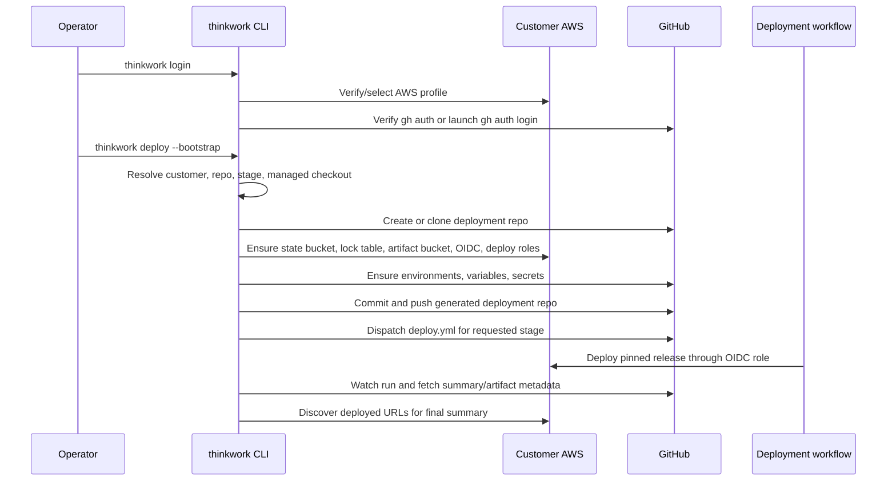

# feat: One-Line Enterprise Deploy

## Overview

Make the enterprise deployment repo path feel like the product the operator
expected:

```bash
thinkwork login
thinkwork deploy --bootstrap
```

The customer-owned deployment repo remains the audit, customization, and CI
substrate, but the CLI owns the ceremony: GitHub repo creation or reuse,
generated repo checkout, release pinning, AWS/GitHub bootstrap, environment
secret setup, commit/push, workflow dispatch, run watching, and final URL
summary. The detailed runbook becomes the troubleshooting explanation for what
the CLI did, not the default operator workflow.

---

## Problem Frame

Yesterday's enterprise deployment repo work made the deployment model explicit
and reproducible, but it exposed too much machinery to the human operator. The
docs now describe a correct path with many manual steps: create or clone a repo,
compute a manifest checksum, run `enterprise bootstrap`, commit and push
generated files, set GitHub Environment secrets, dispatch a workflow, watch the
run, download artifacts, and then log in.

That is operationally precise, but it is not the deployment UX. The intended
enterprise experience is a top-level deploy command that drives the lower-level
enterprise machinery while preserving the origin requirements: CI is still the
steady-state deploy authority, GitHub OIDC still avoids long-lived AWS keys,
and customer overlays still live in a customer-owned repo (see origin:
`docs/brainstorms/2026-05-18-enterprise-customer-deployment-repo-requirements.md`).

---

## Requirements Trace

- R1. A new enterprise operator can run `thinkwork login` and then
  `thinkwork deploy --bootstrap` as the happy-path first deploy.
- R2. The deployment repo remains customer-owned and auditable, but the CLI can
  create, clone, manage, commit, push, and dispatch it automatically.
- R3. The top-level `thinkwork deploy` command preserves the existing local
  Terraform deploy behavior unless the caller explicitly selects enterprise
  bootstrap/CI mode or the current directory is a generated deployment repo.
- R4. `thinkwork login` verifies both AWS readiness and GitHub CLI readiness for
  enterprise deploys without storing GitHub tokens itself.
- R5. Bootstrap generates or prompts for required GitHub Environment secrets and
  writes them through `gh secret set`; secrets are never committed or persisted
  in `~/.thinkwork`.
- R6. The default first deploy bootstraps `dev` and `prod` deployment
  authority, but dispatches only the requested stage, defaulting to `dev`.
- R7. The CLI waits for the dispatched GitHub Actions run by default in
  interactive mode and prints a stage summary with the run URL, deploy artifact
  names, and discovered ThinkWork URLs.
- R8. The lower-level `thinkwork enterprise bootstrap` command remains
  available for dry runs, debugging, and scripted use.
- R9. The one-line deploy flow carries forward the origin model: no source fork
  as default, OIDC for steady-state deploys, overlay-first customization, and
  versioned release pinning.

**Origin actors:** A1 Enterprise platform admin, A2 Customer GitHub admin, A3
ThinkWork delivery engineer, A4 Customer deployment CI, A5 ThinkWork source
repo/release pipeline.

**Origin flows:** F1 Bootstrap a new customer AWS account, F2 Deploy or upgrade
ThinkWork, F3 Deliver customer-specific customization.

**Origin acceptance examples:** AE1 no-fork deployment of pinned foundation
plus eval pack, AE2 bootstrap creates OIDC trust and deploy roles, AE3 reusable
customization flows upstream and is adopted by version bump.

---

## Scope Boundaries

- Do not replace the customer-owned deployment repo with local laptop deploys.
  The CLI may orchestrate the first run, but CI remains the deploy authority.
- Do not store GitHub personal access tokens, AWS secret keys, database
  passwords, API auth secrets, or OAuth client secrets in generated repo files or
  local ThinkWork metadata.
- Do not require a ThinkWork source checkout for the new operator path.
- Do not remove `thinkwork enterprise bootstrap`; it remains the explicit
  primitive that the top-level command wraps.
- Do not dispatch `prod` by default. Production-like deploys require an explicit
  stage and must keep GitHub Environment protection in the loop.
- Do not build support for non-GitHub CI providers in this plan.

### Deferred to Follow-Up Work

- A hosted/web deployment wizard that performs the same orchestration without a
  terminal.
- Separate AWS accounts for dev and prod enterprise stages.
- Rich customer overlay editing commands beyond validating/applying existing
  overlay folders.
- A first-class GitHub App authentication path that removes the `gh` CLI
  dependency.

---

## Context & Research

### Relevant Code and Patterns

- `apps/cli/src/commands/deploy.ts` is the existing top-level local Terraform
  deploy command. It resolves a stage, validates `foundation|data|app|all`,
  applies Terraform tiers, and runs a post-deploy probe. The new flow must not
  break this default behavior.
- `apps/cli/src/commands/enterprise/bootstrap.ts` already builds the AWS/GitHub
  enterprise bootstrap plan, renders the deployment repo template, writes local
  enterprise metadata, supports dry run, and can optionally dispatch a workflow.
- `apps/cli/src/commands/enterprise/github.ts` currently shells out to `gh` for
  environments, variables, and workflow dispatch. It is the right place to add
  repo creation, repository file commit/push, environment secret setup, and run
  watching abstractions.
- `apps/cli/src/commands/enterprise/release.ts` resolves the default release pin
  from the installed CLI version. The top-level happy path should use this, but
  it should fail loud if the release manifest checksum is still `CHANGE_ME`
  during a mutating deploy.
- `apps/cli/src/environments.ts` already persists
  `~/.thinkwork/enterprise-deployments/<customer>.json` without secrets. It can
  grow to remember the managed checkout path, default stage, and last workflow
  run metadata.
- `apps/cli/src/commands/login.ts` already handles AWS credential selection and
  optionally chains into deployed API login. It should add a GitHub readiness
  check or enterprise-deploy readiness hint, not own GitHub token storage.
- `apps/cli/__tests__/no-required-options.test.ts` enforces the interactive
  fallback contract. New options such as `--customer`, `--repo`, and `--stage`
  must be optional with prompt/resolver fallbacks.
- `docs/src/content/docs/deploy/enterprise-deployment-repo.mdx` and
  `apps/cli/src/commands/enterprise/templates/deploy-repo/docs/runbook.md` now
  describe the manual steps that the one-line deploy flow should automate.

### Institutional Learnings

- `docs/solutions/workflow-issues/agentcore-runtime-no-auto-repull-requires-explicit-update-2026-04-24.md`:
  runtime image movement must be explicit and verified; the generated workflow
  and run summary cannot rely on ECR pushes alone.
- `docs/solutions/workflow-issues/deploy-silent-arch-mismatch-took-a-week-to-surface-2026-04-24.md`:
  multi-component deploys need cross-component assertions and visible run
  evidence, not just green build steps.
- `docs/solutions/logic-errors/bootstrap-silent-exit-1-set-e-tenant-loop-2026-04-21.md`:
  bootstrap-style automation needs loud diagnostics and failure isolation; a
  one-shot CLI command must surface the exact failed subsystem.
- `docs/solutions/workflow-issues/manually-applied-drizzle-migrations-drift-from-dev-2026-04-21.md`:
  deploy UX should keep migration/drift status visible in workflow output and
  final summaries.

### External References

- GitHub CLI `gh repo create`, including `--source` and `--push` support:
  `https://cli.github.com/manual/gh_repo_create`
- GitHub CLI command surface for `gh workflow`, `gh run`, `gh secret`, and
  `gh variable`: `https://cli.github.com/manual/gh`
- AWS/GitHub OIDC action guidance: `https://github.com/aws-actions/configure-aws-credentials`
- AWS IAM guidance for GitHub OIDC trust policy conditions and environment
  protection: `https://docs.aws.amazon.com/IAM/latest/UserGuide/id_roles_create_for-idp_oidc.html`

---

## Key Technical Decisions

- Add enterprise CI mode to top-level `thinkwork deploy` instead of inventing a
  new verb: The user already expects deploy to deploy. `--bootstrap` makes the
  first-run path explicit while preserving existing local behavior.
- Keep `thinkwork enterprise bootstrap` as the primitive: The top-level flow
  should call shared orchestration functions, not duplicate AWS/GitHub planning
  logic.
- Require `gh` for v1 GitHub operations: The codebase already uses `gh`; using
  it keeps credential ownership with GitHub CLI and avoids new token storage.
- Default to a managed local checkout under `~/.thinkwork/enterprise-deployments`
  when the user is not already inside a deployment repo: This hides repo
  ceremony without hiding the remote repo itself.
- Generate `dev` secrets automatically in interactive first deploys, but make
  prod-like secret setup explicit and stage-scoped: This preserves the one-line
  dev bootstrap while respecting production change-control.
- Wait for CI in the CLI rather than asking operators to watch GitHub manually:
  the one-line command is only trustworthy if it exits with success/failure that
  reflects the workflow run.

---

## Open Questions

### Resolved During Planning

- Should there still be a deployment repo? Yes. It remains the audit and
  customization substrate; the CLI simply owns the default lifecycle around it.
- Should `thinkwork deploy --bootstrap` deploy both `dev` and `prod`? No. It
  should create authority/configuration for both by default, but dispatch only
  the requested stage, defaulting to `dev`.
- Should `thinkwork login` store GitHub credentials? No. It should verify or
  launch `gh auth login`, letting GitHub CLI own token storage.
- Should the existing local Terraform `thinkwork deploy` be replaced? No. Keep
  it as the default outside enterprise mode to avoid breaking current users.

### Deferred to Implementation

- Exact prompts and wording for customer slug/repo defaults: Implementation can
  tune copy while preserving the non-interactive options.
- Exact run artifact names to print in the final summary: Use the generated
  workflow's actual artifact naming once implementation touches it.
- Whether repository creation uses `gh repo create --source --push` directly or
  explicit `git init`/`git remote`/`git push`: Choose the safer path based on
  testability and existing repository state handling.

---

## High-Level Technical Design

> _This illustrates the intended approach and is directional guidance for
> review, not implementation specification. The implementing agent should treat
> it as context, not code to reproduce._



### Deploy Mode Decision Matrix

| Invocation/context                                                         | Behavior                                                                                      |
| -------------------------------------------------------------------------- | --------------------------------------------------------------------------------------------- |
| `thinkwork deploy --bootstrap`                                             | Enterprise first-run orchestration; create/reuse repo, bootstrap trust, push, dispatch, wait. |
| `thinkwork deploy --customer acme` with existing enterprise metadata       | Dispatch the customer deployment repo workflow for the requested stage.                       |
| Current directory contains `thinkwork.lock` and `customer/deployment.json` | Treat as deployment repo and dispatch its workflow unless `--local-terraform` is passed.      |
| No enterprise flags/context                                                | Preserve existing local Terraform deploy behavior.                                            |

---

## Implementation Units

- U1. **Login Readiness for Enterprise Deploy**

**Goal:** Make `thinkwork login` leave an operator ready for the one-line
enterprise deploy path by verifying AWS and GitHub CLI readiness.

**Requirements:** R1, R4, R9; origin R2, R3, R4; F1; AE2

**Dependencies:** None

**Files:**

- Modify: `apps/cli/src/commands/login.ts`
- Create: `apps/cli/src/commands/enterprise/preflight.ts`
- Test: `apps/cli/__tests__/enterprise-preflight.test.ts`
- Test: `apps/cli/__tests__/no-required-options.test.ts`

**Approach:**

- Extract reusable enterprise preflight helpers for AWS identity, `gh`
  availability, `gh auth status`, git availability, and interactive/non-
  interactive readiness.
- Extend the no-stage `thinkwork login` path so after AWS profile selection it
  reports GitHub readiness and, in an interactive terminal, offers to launch
  `gh auth login` when `gh` is installed but unauthenticated.
- Do not persist GitHub tokens or ask for raw tokens. Treat `gh` as the
  credential authority.
- Keep existing deployed API login behavior intact. The enterprise readiness
  check is additive and should not block users who only need AWS-local deploys
  unless they asked for enterprise deploy readiness.
- In non-interactive mode, print a clear remediation such as `gh auth login`
  instead of prompting.

**Patterns to follow:**

- `apps/cli/src/commands/login.ts` profile picker and non-interactive fallback.
- `apps/cli/src/commands/enterprise/github.ts` shelling out to `gh`.
- `apps/cli/__tests__/no-required-options.test.ts` interactive fallback rule.

**Test scenarios:**

- Happy path: Given verified AWS identity and authenticated `gh`, `thinkwork
login` reports enterprise deploy readiness without mutating config beyond the
  existing AWS profile save.
- Edge case: Given `gh` is missing, login still succeeds for AWS but prints an
  enterprise deploy warning naming the missing executable.
- Error path: Given non-interactive mode and unauthenticated `gh`, the preflight
  returns a remediation instead of trying to prompt.
- Integration: Adding the readiness options does not introduce required
  Commander options.

**Verification:**

- `thinkwork login` still supports existing AWS and stage API login flows.
- Enterprise deploy readiness is visible before the operator reaches deploy.

---

- U2. **Top-Level Deploy Mode Routing**

**Goal:** Add enterprise CI mode to `thinkwork deploy` without breaking the
existing local Terraform deploy behavior.

**Requirements:** R1, R2, R3, R6, R8, R9; origin R1, R2, R5; F1, F2; AE1, AE2

**Dependencies:** U1

**Files:**

- Modify: `apps/cli/src/commands/deploy.ts`
- Create: `apps/cli/src/commands/enterprise/deploy.ts`
- Modify: `apps/cli/src/environments.ts`
- Test: `apps/cli/__tests__/enterprise-deploy-routing.test.ts`
- Test: `apps/cli/__tests__/deploy-registration.test.ts`
- Test: `apps/cli/__tests__/no-required-options.test.ts`

**Approach:**

- Add top-level deploy options for enterprise mode:
  `--bootstrap`, `--customer <slug>`, `--repo <owner/name>`,
  `--create-repo`, `--checkout-dir <path>`, `--wait/--no-wait`,
  `--local-terraform`, `--release-version`, `--manifest-url`,
  `--manifest-sha256`, and existing `--stage`.
- Route to enterprise deploy when `--bootstrap` is present, when `--customer`
  resolves to enterprise metadata, or when the current directory looks like a
  generated deployment repo.
- Preserve existing local Terraform behavior when no enterprise signal exists.
  If there is ambiguity, prefer a prompt in TTY mode and a clear error in
  non-interactive mode.
- Extend `EnterpriseDeploymentConfig` with non-secret fields such as
  `checkoutDir`, `defaultStage`, `repositoryDefaultBranch`, `lastWorkflowRunId`,
  and `lastWorkflowUrl`.
- Keep component naming separate: local Terraform deploy uses
  `foundation|data|app|all`; enterprise workflow uses
  `all|foundation|artifacts|overlays|smokes`. The routing layer should validate
  against the selected mode's vocabulary.

**Patterns to follow:**

- Existing deploy command's confirmation and `isProdLike` handling in
  `apps/cli/src/commands/deploy.ts`.
- Enterprise metadata helpers in `apps/cli/src/environments.ts`.
- Stage resolver behavior in `apps/cli/src/lib/resolve-stage.ts`.

**Execution note:** Add characterization coverage for the existing local
Terraform deploy path before changing `apps/cli/src/commands/deploy.ts`.

**Test scenarios:**

- Happy path: `thinkwork deploy --bootstrap --customer acme --repo acme/deploy`
  routes to enterprise bootstrap orchestration and does not call local
  Terraform helpers.
- Happy path: `thinkwork deploy -s dev` outside enterprise context preserves the
  existing local Terraform path.
- Edge case: Running from a generated deployment repo without `--customer`
  resolves enterprise mode from `thinkwork.lock` and `customer/deployment.json`.
- Edge case: Running from a generated deployment repo with `--local-terraform`
  preserves the existing local Terraform path.
- Edge case: Non-interactive `--bootstrap` without a customer slug fails with a
  message naming the missing `--customer` option.
- Error path: Passing a local Terraform component name in enterprise mode, or an
  enterprise workflow component in local mode, fails with mode-specific help.

**Verification:**

- Existing deploy tests continue to pass.
- New enterprise mode is opt-in and discoverable from `thinkwork deploy --help`.

---

- U3. **One-Shot Bootstrap Orchestrator**

**Goal:** Implement the orchestration behind `thinkwork deploy --bootstrap`:
repo create/reuse, managed checkout, release pin resolution, AWS/GitHub
bootstrap, environment secret setup, generated repo commit, and push.

**Requirements:** R1, R2, R5, R6, R8, R9; origin R1-R7, R9-R11; F1, F2; AE1,
AE2, AE3

**Dependencies:** U1, U2

**Files:**

- Modify: `apps/cli/src/commands/enterprise/bootstrap.ts`
- Modify: `apps/cli/src/commands/enterprise/github.ts`
- Create: `apps/cli/src/commands/enterprise/repository.ts`
- Create: `apps/cli/src/commands/enterprise/secrets.ts`
- Modify: `apps/cli/src/commands/enterprise/template.ts`
- Test: `apps/cli/__tests__/enterprise-bootstrap.test.ts`
- Test: `apps/cli/__tests__/enterprise-deploy-bootstrap.test.ts`
- Test: `apps/cli/__tests__/enterprise-repository.test.ts`
- Test: `apps/cli/__tests__/enterprise-secrets.test.ts`

**Approach:**

- Introduce an enterprise deployment orchestrator that composes the existing
  `runEnterpriseBootstrap` primitive with GitHub repo lifecycle and git commit
  operations.
- If `--repo` is omitted in TTY mode, propose a default from the authenticated
  GitHub owner plus `<customer>-thinkwork-deploy`; in non-interactive mode,
  require `--repo`.
- If `--create-repo` is present or the repo does not exist and the operator
  confirms, create a private GitHub repo. Otherwise clone/reuse the existing
  repo.
- Use a managed checkout directory when the command is not run inside a
  deployment repo. Preserve customer-owned files without the ThinkWork managed
  marker, following the existing template renderer behavior.
- Resolve release pin from the installed CLI version. For mutating deploys,
  validate that the manifest URL is reachable and compute or verify its SHA-256;
  do not allow `CHANGE_ME` in `thinkwork.lock`.
- Generate strong per-stage `TF_VAR_DB_PASSWORD` and
  `TF_VAR_API_AUTH_SECRET` values for non-production stages when no value is
  supplied. For prod-like stages, prompt in TTY mode or require explicit secret
  values/source options in non-interactive mode.
- Set GitHub Environment secrets through the GitHub client abstraction. Never
  write generated secret values to disk or local metadata.
- Commit and push only when generated or customer-approved files changed. Use a
  conservative managed commit message inside the deployment repo.

**Patterns to follow:**

- `renderEnterpriseDeployRepoTemplate` preservation semantics in
  `apps/cli/src/commands/enterprise/template.ts`.
- Existing `GhCliEnterpriseBootstrapClient` command-shelling pattern.
- `generateSecret` pattern in `apps/cli/src/commands/init.ts`, but use a helper
  that produces URL/secret-manager-safe values.

**Test scenarios:**

- Happy path: Given an empty managed checkout and mocked AWS/GitHub/git clients,
  bootstrap creates repo files, sets env variables/secrets, commits, pushes, and
  records metadata without exposing secrets.
- Happy path: Given an existing deployment repo with unchanged managed files,
  bootstrap reuses it and skips an empty commit while still dispatching deploy
  when requested.
- Edge case: A customer-owned unmarked file already exists in the checkout; the
  renderer preserves it and the summary reports the preservation warning.
- Edge case: Release manifest SHA is omitted; mutating bootstrap computes it
  from the release URL and writes a concrete checksum.
- Error path: Release manifest cannot be fetched; bootstrap fails before AWS or
  GitHub mutation.
- Error path: Prod-like stage lacks explicit secret input in non-interactive
  mode; bootstrap fails before writing partial secrets.
- Integration: No secret value appears in generated files, metadata JSON, or
  summary output.

**Verification:**

- `thinkwork deploy --bootstrap --dry-run` prints a complete plan without
  mutations.
- `thinkwork deploy --bootstrap --customer acme --repo owner/repo --stage dev`
  can be exercised with mocked clients end to end.

---

- U4. **Workflow Dispatch, Run Watch, and Final Summary**

**Goal:** Make `thinkwork deploy --bootstrap` and follow-up enterprise deploys
feel complete by dispatching the customer workflow, waiting for CI, surfacing
failure details, and printing deployed URLs.

**Requirements:** R1, R2, R6, R7, R9; origin R4, R7, R8; F2; AE1, AE2

**Dependencies:** U2, U3

**Files:**

- Modify: `apps/cli/src/commands/enterprise/github.ts`
- Create: `apps/cli/src/commands/enterprise/workflow.ts`
- Modify: `apps/cli/src/aws-discovery.ts`
- Test: `apps/cli/__tests__/enterprise-workflow.test.ts`
- Test: `apps/cli/__tests__/enterprise-deploy-bootstrap.test.ts`

**Approach:**

- Extend the GitHub client abstraction to dispatch a workflow with stage,
  component, and smoke inputs, then resolve the resulting run ID.
- In interactive mode, wait by default; support `--no-wait` for operators who
  want fire-and-follow from GitHub.
- Poll the run and print compact progress that names the current workflow state
  without dumping every CI log line. On failure, surface the failed job names,
  the run URL, and the command to inspect logs.
- Download or list deploy evidence artifacts when the workflow succeeds, but do
  not require local artifact download for success.
- After a successful run, call existing AWS discovery helpers to print admin,
  API, AppSync, and docs URLs for the deployed stage when available.
- Persist last workflow run metadata in the enterprise deployment registry so
  `thinkwork deploy --customer acme --stage dev` can show the prior state.

**Patterns to follow:**

- Current workflow dispatch in `GhCliEnterpriseBootstrapClient.dispatchWorkflow`.
- AWS stage discovery in `apps/cli/src/aws-discovery.ts` and status printing in
  `apps/cli/src/commands/status.ts`.
- GitHub CLI `gh workflow run`, `gh run list`, `gh run watch`, and `gh run view`
  command surface.

**Test scenarios:**

- Happy path: Dispatch returns a run ID; watcher observes success; final summary
  includes run URL and discovered stage URLs.
- Happy path: `--no-wait` dispatches and exits with a run URL but does not poll.
- Edge case: GitHub returns no run immediately after dispatch; watcher retries
  within a bounded window before failing.
- Error path: Workflow run fails; CLI exits non-zero and prints failed job names
  plus the GitHub run URL.
- Error path: Deploy succeeds but AWS URL discovery fails; CLI reports the run
  success and a non-fatal discovery warning.

**Verification:**

- Successful enterprise deploy commands terminate with a useful human summary.
- Failed workflow runs are diagnosable from CLI output without opening the full
  run manually first.

---

- U5. **Docs, Help Text, and Regression Coverage**

**Goal:** Reframe documentation around the one-line deploy path while preserving
the detailed runbook as troubleshooting and under-the-hood reference.

**Requirements:** R1-R9; origin R1-R12; F1-F3; AE1-AE3

**Dependencies:** U1, U2, U3, U4

**Files:**

- Modify: `docs/src/content/docs/deploy/enterprise-deployment-repo.mdx`
- Modify: `apps/cli/src/commands/enterprise/templates/deploy-repo/docs/runbook.md`
- Modify: `apps/cli/src/commands/deploy.ts`
- Modify: `apps/cli/src/commands/enterprise.ts`
- Modify: `apps/cli/__tests__/enterprise-doc-links.test.ts`
- Modify: `apps/cli/__tests__/registration-smoke.test.ts`
- Test: `apps/cli/__tests__/enterprise-doc-links.test.ts`

**Approach:**

- Put the happy path first in docs:
  `thinkwork login` then `thinkwork deploy --bootstrap`.
- Move the manual 30-step flow into an "What the CLI does" or "Troubleshooting
  manual path" section.
- Update generated customer runbooks so they describe normal follow-up deploys
  as `thinkwork deploy --customer <slug> --stage <stage>`, with direct
  `gh workflow run` as the fallback.
- Ensure CLI help makes the mode boundary clear: local Terraform deploy by
  default; enterprise CI deploy when `--bootstrap`, `--customer`, or deployment
  repo context is present.
- Preserve phrases and anchors existing enterprise docs tests depend on unless
  tests are intentionally updated.

**Patterns to follow:**

- Existing docs page structure in
  `docs/src/content/docs/deploy/enterprise-deployment-repo.mdx`.
- CLI registration tests that protect command discoverability.

**Test scenarios:**

- Happy path: Docs link tests find the one-line deploy page and generated
  runbook references.
- Edge case: Help text includes `--bootstrap`, `--customer`, and `--no-wait`
  without required options.
- Integration: Generated deployment repo runbook still includes fallback
  workflow dispatch instructions for break-glass/manual operation.

**Verification:**

- Docs build succeeds.
- Enterprise CLI tests and registration smoke tests pass.
- The first visible enterprise deploy docs example is the one-line flow.

---

## System-Wide Impact

- **Interaction graph:** `thinkwork login` gains GitHub readiness checks;
  `thinkwork deploy` gains enterprise-mode routing; enterprise helpers gain
  repo/secret/workflow operations. Existing API-backed commands and local
  Terraform deploys should remain unchanged.
- **Error propagation:** Preflight and bootstrap errors should identify the
  failed subsystem: AWS identity, GitHub auth, repo access, release manifest,
  secret setup, git push, workflow dispatch, workflow failure, or URL discovery.
- **State lifecycle risks:** Partial bootstrap can leave AWS state buckets,
  GitHub environments, or a local managed checkout. Commands must be idempotent
  and safe to rerun.
- **API surface parity:** Lower-level `thinkwork enterprise bootstrap` remains
  scriptable; top-level `thinkwork deploy` adds the human-friendly path.
- **Integration coverage:** Unit tests should use mocked AWS/GitHub/git
  clients. Live AWS/GitHub mutation remains out of local tests and should be
  covered by dry-run and CI-safe smoke fixtures.
- **Unchanged invariants:** No long-lived AWS keys in GitHub, no committed
  secrets, no default source fork, no local laptop as steady-state deploy
  authority, and no production deploy without explicit stage intent.

---

## Risks & Dependencies

| Risk                                                                                            | Mitigation                                                                                                                                         |
| ----------------------------------------------------------------------------------------------- | -------------------------------------------------------------------------------------------------------------------------------------------------- |
| The top-level deploy command becomes ambiguous between local Terraform and enterprise CI modes. | Use explicit mode detection, help text, and tests for all decision-matrix rows. Preserve local behavior when no enterprise signal exists.          |
| One-line bootstrap hides too much and makes failures feel mysterious.                           | Print a compact step plan and subsystem-specific errors; keep the detailed runbook as the troubleshooting reference.                               |
| Secret automation accidentally leaks generated values.                                          | Centralize secret generation/setup, test that summaries/metadata/files omit secret values, and rely on `gh secret set` for storage.                |
| GitHub run dispatch returns before a run is discoverable.                                       | Add bounded retry logic around run lookup and clear timeout output.                                                                                |
| Prod deploys become too easy.                                                                   | Default dispatch stage to `dev`, require explicit prod-like stage intent, and keep GitHub Environment protection rules in the deployment workflow. |
| `gh` CLI dependency blocks some enterprise environments.                                        | Preflight detects and explains the dependency; direct GitHub API/GitHub App auth remains follow-up work.                                           |

---

## Documentation / Operational Notes

- The docs should lead with the happy path and show manual commands only after
  explaining that they are what the CLI automates.
- The generated deployment repo runbook should tell operators to use
  `thinkwork deploy --customer <slug> --stage <stage>` for normal redeploys.
- Release notes should call this out as a UX change rather than a new deployment
  model: the underlying customer-owned repo/OIDC architecture remains the same.
- Support/on-call docs should retain the manual command equivalents for
  diagnosing bootstrap failures.

---

## Sources & References

- **Origin document:** `docs/brainstorms/2026-05-18-enterprise-customer-deployment-repo-requirements.md`
- Previous implementation plan: `docs/plans/2026-05-18-002-feat-enterprise-deployment-repo-plan.md`
- Existing deploy command: `apps/cli/src/commands/deploy.ts`
- Existing enterprise bootstrap: `apps/cli/src/commands/enterprise/bootstrap.ts`
- Existing GitHub bootstrap client: `apps/cli/src/commands/enterprise/github.ts`
- Existing login command: `apps/cli/src/commands/login.ts`
- Existing enterprise docs: `docs/src/content/docs/deploy/enterprise-deployment-repo.mdx`
- GitHub CLI repo creation docs: `https://cli.github.com/manual/gh_repo_create`
- GitHub CLI command index: `https://cli.github.com/manual/gh`
- AWS credentials action OIDC guidance: `https://github.com/aws-actions/configure-aws-credentials`
- AWS IAM GitHub OIDC trust guidance: `https://docs.aws.amazon.com/IAM/latest/UserGuide/id_roles_create_for-idp_oidc.html`
