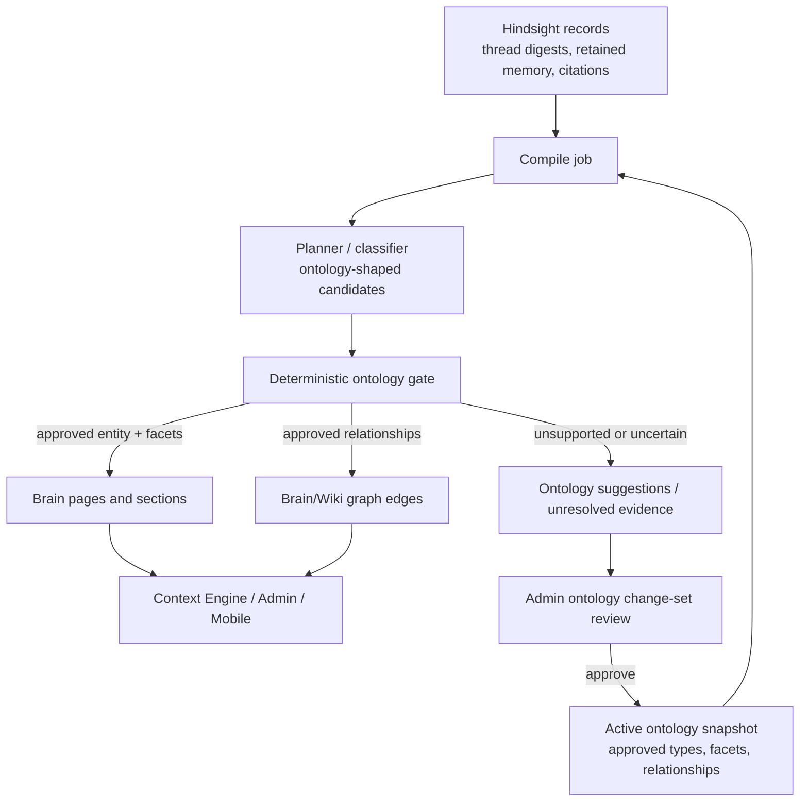
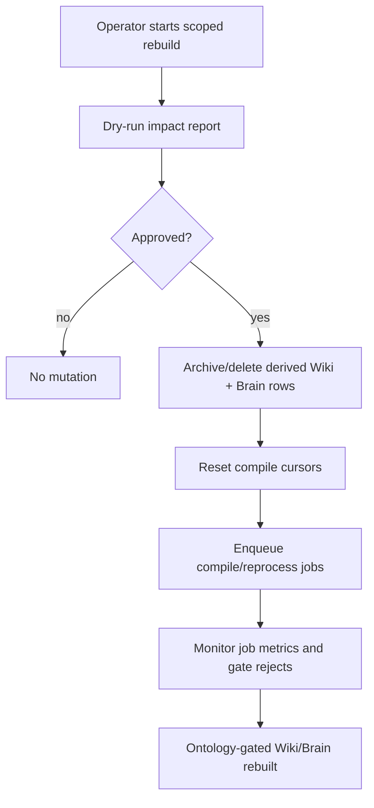

# feat: Gate Hindsight-to-Wiki Materialization Through Approved Ontology

## Overview

Make Hindsight the memory substrate and make Wiki/Brain a strictly
ontology-shaped materialized view. The compiler may read observations from
Hindsight, but only approved ontology entity types, facet templates, and
relationship types are allowed to create durable Wiki/Brain pages, sections,
and graph edges.

Unapproved patterns should not disappear. They should become unresolved
observations or evidence-backed ontology suggestions/change sets, so tenant
admins can approve the meaning layer before it changes the visible Wiki/Brain.
After this lands, operators need a safe rebuild path that removes current
derived Wiki/Brain output, resets compile cursors, and recompiles from
Hindsight through the approved ontology gate.

## Problem Frame

The ontology plan established the product boundary: Hindsight is memory,
ontology is meaning, and Company Brain/Wiki is the materialized view. The
current Wiki compiler still asks an LLM planner to choose pages, page types,
sections, and links, then writes `wiki.pages` and `wiki.page_links` through
`packages/api/src/lib/wiki/compiler.ts`. It includes ontology-aware prompt
guardrails, but prompt guardrails are not enforcement.

That means the system can still produce durable pages or links for concepts
that have not been approved in the tenant ontology. The desired behavior is
tighter: Hindsight can surface any observation, but only approved types and
relationships actually make it to Wiki/Brain.

## Requirements Trace

- R1. Hindsight records remain the source substrate for observations, facts,
  citations, and compile evidence.
- R2. Wiki/Brain is a derived materialized view, not a second memory system.
- R3. Only approved ontology entity types can create or update durable
  structured entity pages.
- R4. Only approved facet templates can create or update structured page
  sections/facets for those entity types.
- R5. Only approved relationship types, with matching source/target
  constraints, can create durable graph edges.
- R6. Unsupported or uncertain observations become unresolved mentions,
  rejected compiler candidates, or ontology suggestion/change-set evidence.
  They do not create pages or relationships.
- R7. The gate must be enforced after planning and before database writes, so
  no prompt mistake or adapter drift bypasses it.
- R8. Rebuild operations must clear old derived Wiki/Brain output and reset
  cursors before recompiling from Hindsight under the active ontology version.
- R9. Rebuilds must be scoped, observable, auditable, and dry-run capable.
  They must not run as hidden production mutations during deploy.
- R10. Page prose and section rows must stay synchronized for every write path,
  because clients render section rows.

These carry forward the origin requirements that Hindsight is the source
substrate, approved ontology templates determine Brain shape, reprocessing is
asynchronous and observable, and failed reprocessing must not pretend the
ontology cleanly applied.

## Scope Boundaries

In scope:

- Hindsight-backed compile input for owner-scoped Wiki and tenant Brain
  materialization.
- A loaded active ontology snapshot used by compiler/planner/materializer code.
- Hard validation of entity type, facet template, and relationship type before
  any durable page/section/link write.
- Routing unsupported candidates into unresolved mentions and ontology
  suggestion/change-set evidence.
- Safe wipe/recompile support for derived Wiki/Brain surfaces after the gate is
  deployed.
- Tests that prove unapproved concepts cannot create durable output.

Out of scope:

- Replacing Hindsight recall/reflect.
- A generic semantic web workbench or RDF/OWL execution engine.
- Agent-work ontology for plans, PRs, runs, tasks, and artifacts.
- Manual production data mutation as part of implementation.
- Customer-facing ontology marketplace or vertical ontology packs beyond the
  seed business vocabulary needed for this feature.

## Current System Notes

- `packages/api/src/lib/wiki/compiler.ts` runs compile jobs, calls
  `runPlanner`, then applies page updates, new pages, unresolved mentions,
  promotions, and page links.
- `packages/api/src/lib/wiki/planner.ts` currently outputs the legacy page
  types `entity`, `topic`, and `decision`. It can see prompt guardrails from
  `packages/api/src/lib/wiki/templates.ts`, but its output schema does not
  require ontology entity type slugs, facet slugs, or relationship type slugs.
- `packages/api/src/lib/ontology/repository.ts` already exposes approved
  ontology definitions, active versions, relationship types, facet templates,
  and approved mappings.
- `packages/api/src/lib/ontology/templates.ts` resolves approved page/facet
  templates. The current seed set is still narrow (`customer`, `opportunity`,
  `order`, `person`), while prior ontology planning called for business
  concepts such as `support_case`, `commitment`, `risk`, and `decision`.
- `packages/api/src/lib/ontology/materializer.ts` already materializes approved
  templates into Brain page sections and synchronizes page bodies from
  sections.
- `packages/api/src/lib/ontology/suggestions.ts` currently marks the Hindsight
  provider as degraded/unavailable because the Hindsight scan adapter is not
  wired for ontology suggestions.
- `packages/database-pg/src/schema/brain.ts` still has a database check
  constraint restricting `brain.pages.entity_subtype` to the seed subtype list.
  Any dynamic approved ontology beyond that list needs a migration strategy.
- `apps/cli/src/commands/wiki/rebuild.ts` already provides a destructive
  single-agent archive-and-compile flow. It archives active owner-scoped wiki
  pages and clears the compile cursor, but it does not wipe tenant Brain
  derived rows or enforce ontology gates.

## Key Decisions

1. **Enforcement is code, not prompt text.** Planner prompts should describe
   the active ontology, but a deterministic validator must reject or reroute
   every unapproved entity type, facet template, and relationship before write.
2. **The active ontology snapshot is compile input.** Compile jobs should load
   the active tenant ontology version once, pass a compact snapshot into
   planning, and use the same snapshot for validation and write decisions.
3. **Rejected materialization becomes ontology evidence.** If Hindsight
   contains repeated observations that do not fit the approved ontology, the
   system should produce suggestion/change-set evidence instead of creating a
   speculative wiki page.
4. **Brain is the structured destination; owner Wiki is compatibility/search.**
   Approved business entities should materialize into the structured Brain
   tables. Owner-scoped `wiki.pages` can remain a legacy/personal retrieval
   surface, but business-domain output must obey the same ontology gate.
5. **Relationship links need typed semantics.** Legacy link kinds such as
   `reference`, `parent_of`, and `child_of` are not enough for business
   relationships. The plan should add or reuse a relationship slug field so
   edges can be checked against approved relationship definitions.
6. **Rebuild is explicit operator action.** After deployment, operators run a
   dry-run and then a scoped destructive rebuild. Deployment itself should not
   silently delete Wiki/Brain rows.

## High-Level Design

## Implementation Units

### U1 — Active Ontology Compile Snapshot

**Goal:** Provide a single compile-time contract for approved entity types,
facet templates, relationship types, mappings, and active ontology version.

**Files:**

- `packages/api/src/lib/ontology/compile-snapshot.ts` (new)
- `packages/api/src/lib/ontology/repository.ts`
- `packages/api/src/lib/ontology/templates.ts`
- `packages/api/src/lib/ontology/compile-snapshot.test.ts` (new)

**Approach:**

- Load approved definitions through the ontology repository and normalize them
  into sets/maps optimized for compile validation.
- Include entity type slug/name/broad type, approved facet templates by entity
  type, approved relationship slugs with source/target constraints, source
  priority, active ontology version id, and optional external mappings.
- Exclude proposed, deprecated, rejected, and inactive definitions from the
  write-allowing snapshot.
- Add an explicit empty-state behavior: if no active ontology exists, the gate
  runs in conservative mode and creates no new structured business pages.
- Expand or make data-driven the seed business ontology so planned concepts
  like support cases, commitments, risks, and decisions can be approved without
  fighting hardcoded checks.

**Verification:**

- Approved definitions appear in the snapshot with stable slugs.
- Proposed/deprecated/rejected definitions do not authorize writes.
- Relationship constraints are available for source/target validation.
- Empty ontology state returns a conservative snapshot rather than silently
  falling back to legacy free-form output.

### U2 — Ontology-Shaped Planner Contract

**Goal:** Change the compile planner/classifier contract from free-form wiki
pages to ontology-shaped materialization candidates.

**Files:**

- `packages/api/src/lib/wiki/planner.ts`
- `packages/api/src/lib/wiki/templates.ts`
- `packages/api/src/lib/wiki/planner.ontology.test.ts` (new)
- `packages/api/src/lib/ontology/compile-snapshot.ts`

**Approach:**

- Pass the active ontology snapshot into `runPlanner`.
- Update planner prompt context and output schema so candidates carry
  `entityTypeSlug`, `facetSlug`, and `relationshipTypeSlug` where applicable.
- Keep planner output directional. It may propose candidates and evidence, but
  it does not decide what is approved.
- Preserve unresolved mention output for observations that cannot be confidently
  mapped to approved ontology.
- Include Hindsight source references in candidate evidence so later rejection
  can still feed the suggestion loop.

**Verification:**

- Planner receives approved ontology labels/facet slugs in its input.
- Planner output parser rejects candidates missing required ontology fields for
  structured materialization.
- A memory observation that does not match any approved type becomes unresolved
  evidence, not a new durable page.
- Existing legacy owner-scoped page compile tests continue to pass where they
  are explicitly outside business ontology materialization.

### U3 — Deterministic Materialization Gate

**Goal:** Enforce approved ontology after planning and before every Wiki/Brain
write.

**Files:**

- `packages/api/src/lib/ontology/materialization-gate.ts` (new)
- `packages/api/src/lib/wiki/compiler.ts`
- `packages/api/src/lib/wiki/compiler.ontology-gate.test.ts` (new)
- `packages/api/src/lib/ontology/materialization-gate.test.ts` (new)

**Approach:**

- Validate each proposed entity page against approved entity type slugs.
- Validate each proposed section/facet against approved facet templates for the
  entity type.
- Validate each proposed relationship against approved relationship type slug
  and source/target constraints.
- Reject or reroute unapproved candidates before calling `upsertPage`,
  `writeSection`, Brain materializer helpers, or link upserts.
- Record gate metrics on the compile job: approved pages, approved facets,
  approved relationships, rejected pages, rejected facets, rejected
  relationships, unresolved observations, and suggestion candidates.
- Treat gate rejection as expected compile output, not a job failure, unless
  the active ontology snapshot itself is invalid.

**Verification:**

- Unapproved entity type candidates do not create `wiki.pages` or
  `brain.pages`.
- Unapproved facet candidates do not create section rows.
- Unapproved relationship candidates do not create graph links.
- Gate metrics are persisted on the compile job and visible through existing
  job status readers.
- A malformed active ontology snapshot fails loudly before any partial trusted
  writes occur.

### U4 — Approved Brain/Wiki Write Path

**Goal:** Route approved business-domain materialization into structured Brain
tables and keep compatibility Wiki output constrained by the same gate.

**Files:**

- `packages/api/src/lib/ontology/materializer.ts`
- `packages/api/src/lib/brain/repository.ts`
- `packages/api/src/lib/wiki/compiler.ts`
- `packages/database-pg/src/schema/brain.ts`
- `packages/database-pg/drizzle/*_ontology_gated_brain_links.sql` (new, if schema changes are needed)
- `packages/api/src/lib/ontology/materializer.test.ts`
- `packages/api/src/lib/wiki/compiler.ontology-gate.test.ts`

**Approach:**

- Use approved facet templates as the section write contract.
- Preserve provenance by writing section sources for every generated or updated
  facet.
- Synchronize `body_md` from section rows after materializer writes, following
  the existing Brain enrichment learning.
- Add or repurpose relationship metadata on `brain.page_links` and any
  compatibility wiki links so relationship slugs can be stored and validated.
- Replace hardcoded `brain.pages.entity_subtype` constraints with a strategy
  that can support tenant-approved ontology types. If a dynamic database check
  is not viable, enforce approved slugs in application code and keep database
  constraints to general shape/status invariants.

**Verification:**

- Approved Hindsight evidence creates or updates the expected Brain entity page
  and approved facets.
- Page body and section rows remain synchronized after materialization.
- Relationship links include approved relationship semantics and reject invalid
  source/target combinations.
- Source citations survive rebuild and appear in memory-to-wiki joins.
- Database migrations include manual drift markers when Drizzle cannot express
  the required constraint change safely.

### U5 — Hindsight-Backed Ontology Suggestions

**Goal:** Wire Hindsight observations into ontology suggestion scans so rejected
or unsupported compile candidates can become reviewable change sets.

**Files:**

- `packages/api/src/lib/ontology/suggestions.ts`
- `packages/api/src/lib/memory/adapters/hindsight-adapter.ts`
- `packages/api/src/handlers/ontology-scan.ts`
- `packages/api/src/lib/ontology/suggestions.test.ts`
- `packages/api/src/handlers/ontology-scan.test.ts`

**Approach:**

- Replace the degraded Hindsight provider placeholder in
  `ontology/suggestions.ts` with an adapter that reads relevant retained
  observations for the tenant and, when available, user/requester scopes.
- Normalize Hindsight observations into the existing
  `OntologySuggestionObservation` evidence shape.
- Feed materialization-gate rejections into the same suggestion evidence path
  when they are frequent or high confidence.
- Keep provider status explicit: ok, degraded, unavailable, count, and error
  details.
- Deduplicate repeated suggestions into coherent change sets rather than one
  change set per rejected compiler candidate.

**Verification:**

- Hindsight provider status is `ok` with a count when the adapter returns
  observations.
- Hindsight-backed observations can produce a draft change set with evidence.
- Unsupported materialization candidates are captured as suggestion evidence.
- Provider failure degrades the suggestion scan without blocking Brain/wiki
  compile.

### U6 — Scoped Wipe and Recompile Workflow

**Goal:** Add an operator-safe way to remove current derived Wiki/Brain output
and recompile from Hindsight under the active ontology gate.

**Files:**

- `packages/api/src/lib/wiki/rebuild-runner.ts`
- `packages/api/src/lib/wiki/reset.ts` (new, if useful)
- `packages/api/src/graphql/resolvers/wiki/resetWikiCursor.mutation.ts`
- `packages/api/src/graphql/resolvers/wiki/compileWikiNow.mutation.ts`
- `apps/cli/src/commands/wiki/rebuild.ts`
- `apps/cli/src/commands/wiki/status.ts`
- `apps/cli/__tests__/wiki-registration.test.ts`
- `packages/api/src/lib/wiki/rebuild-runner.test.ts` (new)

**Approach:**

- Extend rebuild from "archive active owner wiki pages" to an
  ontology-aware reset that can also clear or archive derived Brain rows for a
  tenant/user scope.
- Preserve ontology definitions, change sets, evidence examples, external
  mappings, and source-system references. Only derived materialized Wiki/Brain
  output and compile cursors should be reset.
- Add dry-run impact output before mutation: affected wiki pages, Brain pages,
  sections, links, aliases, unresolved mentions, compile cursors, and pending
  jobs.
- Reset compile cursors to force a full Hindsight replay.
- Enqueue compile/reprocess jobs and expose gate metrics in status output.
- Keep destructive execution behind the existing confirmation/`--yes` pattern
  and admin authorization. Do not support an accidental tenant-wide rebuild
  without explicit scoped intent.

**Verification:**

- Dry-run reports affected rows without mutating them.
- Confirmed rebuild clears derived rows/cursors in the requested scope and
  preserves ontology definitions/change sets.
- Rebuild enqueues a fresh compile job and status output shows gate metrics.
- Pending/running job handling prevents duplicate destructive runs for the same
  scope.
- Existing single-agent wiki rebuild behavior remains compatible or is
  intentionally migrated with updated CLI help/tests.

### U7 — Admin and Context Observability

**Goal:** Make the ontology gate visible enough that operators can trust an
empty or reduced Wiki/Brain after rebuild.

**Files:**

- `packages/database-pg/graphql/types/wiki.graphql`
- `packages/database-pg/graphql/types/ontology.graphql`
- `packages/api/src/graphql/resolvers/wiki/wikiCompileJobs.query.ts`
- `packages/api/src/graphql/resolvers/ontology/*`
- `apps/admin/src/routes/_authed/_tenant/ontology.tsx`
- `apps/admin/src/routes/_authed/_tenant/knowledge.tsx`
- `apps/admin/src/gql/*`

**Approach:**

- Surface compile gate metrics in wiki compile job status.
- Show ontology scan/provider status and recent suggestion/change-set evidence.
- In admin Knowledge/Memory views, make it clear whether a missing page means
  "no Hindsight evidence" or "evidence exists but no approved ontology type."
- Ensure Context Engine retrieval only treats approved ontology-shaped Brain
  facets as trusted structured context.

**Verification:**

- Admin can inspect a rebuild job and see approved/rejected gate counts.
- Admin can navigate from rejected/unsupported observations to ontology
  suggestions/change sets.
- Context Engine search does not return rejected/unapproved candidates as
  trusted Wiki/Brain facts.
- GraphQL codegen is updated for API, admin, mobile, and CLI consumers touched
  by schema changes.

## Testing Strategy

Feature tests should start at the gate because that is the highest-risk
contract. Unit tests should prove no unapproved entity, facet, or relationship
can slip through even if the planner proposes it. Integration tests should
exercise compile with a fake active ontology snapshot and fake Hindsight
records, then assert the database writes and rejected metrics.

Rebuild tests should be characterization-first around the current
`resetWikiCursor` and CLI rebuild behavior, then expand coverage for dry-run
impact, Brain row clearing, cursor reset, and job enqueue. Destructive rebuild
tests should use transaction-scoped test databases or repository fakes rather
than production commands.

## Data and Migration Notes

- Review `brain.pages.entity_subtype` and related check constraints before
  enabling tenant-approved dynamic entity types. The current seed-only database
  check will block newly approved slugs unless it is migrated.
- If relationship slugs are added to `brain.page_links` or `wiki.page_links`,
  backfill existing links conservatively as legacy `reference` links and do not
  treat them as approved business relationships until recompiled.
- Any hand-written SQL migration must include the repo's drift-report markers.
- Rebuild should archive/delete derived materialized rows only after a dry-run
  report. It should not remove Hindsight records, ontology definitions,
  change-set audit history, external mappings, or tenant/user identity data.

## Risks and Mitigations

- **Ontology too narrow produces an empty Wiki/Brain.** Mitigate with gate
  rejection metrics, suggestion change sets, and seed ontology expansion before
  the first rebuild.
- **Prompt output bypasses approval.** Mitigate with deterministic validation
  after planning and before every write.
- **Rebuild deletes useful derived context.** Mitigate with scoped dry-run,
  explicit confirmation, archived/exportable rows where practical, and
  recompile-from-Hindsight verification before broad use.
- **Old compile cursors skip historical Hindsight records.** Mitigate by
  resetting cursors as part of rebuild and recording the reset in job metrics.
- **Brain body/section divergence returns.** Mitigate by forcing all approved
  materializer writes through section rows plus body sync.
- **Relationship semantics are under-modeled.** Mitigate by adding typed
  relationship slugs before exposing approved relationship links as trusted
  agent context.

## Rollout Plan

1. Land the ontology compile snapshot and deterministic gate behind current
   compile jobs.
2. Wire Hindsight-backed suggestion evidence so unsupported observations are
   actionable instead of silently dropped.
3. Add Brain/link schema support for approved relationship semantics if the
   existing link shape is insufficient.
4. Add dry-run rebuild support and prove it in dev/staging with a narrow scope.
5. Deploy through the normal merge/deploy pipeline.
6. Run a scoped dry-run impact report for the target tenant/user scopes.
7. After operator approval, reset derived Wiki/Brain output and recompile from
   Hindsight under the approved ontology gate.
8. Monitor compile status, gate metrics, suggestion creation, and Context
   Engine retrieval quality before considering broader tenant-wide rebuilds.

## Open Questions

- Should owner-scoped personal Wiki pages remain free-form for non-business
  memory, or should all visible Wiki output move behind approved ontology? The
  implementation can start by gating business-domain materialization and making
  legacy personal pages explicitly non-structured.
- Should rebuild archive derived rows for audit or physically delete them after
  export? Existing wiki rebuild archives active pages; Brain rows may need a
  clearer retention policy before destructive tenant-wide operations.
- How broad should the initial seed ontology be before the first rebuild?
  Current code only seeds core commercial entities, but real user memory likely
  needs commitments, risks, support cases, and decisions to avoid excessive
  rejection.
