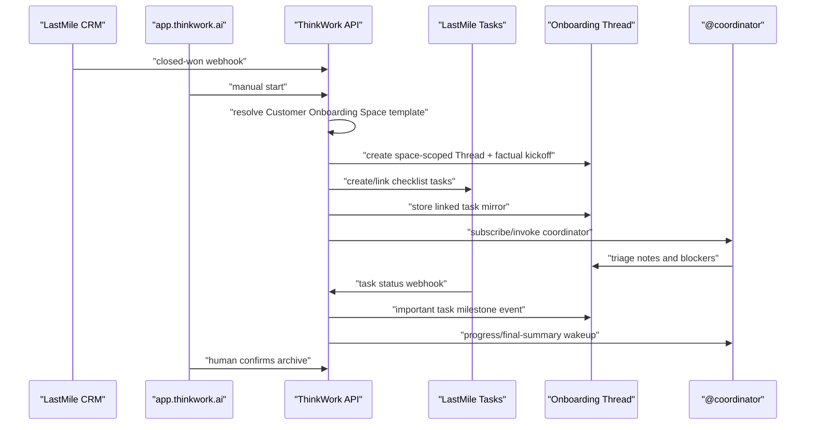

# feat: Spaces customer onboarding v1

> Superseded by `docs/plans/2026-05-20-003-spaces-as-agent-contextual-workrooms-template-removal-plan.md` for future implementation direction. This plan remains useful as a historical record of the Customer Onboarding workflow slice, but its older "Space as collaboration room/workflow template" framing should not be used to extend the current product model. Spaces are now contextual workrooms that can organize user conversations and inject files, tools, MCP/data policy, and source context into agent turns.

## Overview

ThinkWork's end-user app should become a collaborative workspace centered on Spaces, Threads, role-based agents, and linked external work. The first proof is Customer Onboarding: a LastMile CRM closed-won event or manual start creates one onboarding Thread inside a Customer Onboarding Space, seeds it with source context, creates/links LastMile Tasks from a Space checklist, subscribes `@coordinator`, mirrors important task events, and lets a human archive the Thread when all required work is complete.

This plan intentionally keeps `apps/computer` and the existing Computer runtime as internal compatibility names for now. The user-facing surface moves to `app.thinkwork.ai`, with `computer.thinkwork.ai` retained as a compatibility redirect during cutover.

## Requirements Trace

- `docs/brainstorms/2026-05-19-spaces-customer-onboarding-v1-requirements.md` is the primary source of truth. This plan carries forward actors A1-A8, flows F1-F4, requirements R1-R22, acceptance examples AE1-AE6, and the scope boundaries.
- `docs/brainstorms/2026-05-19-computer-to-app-rename-and-light-mode-polish-requirements.md` contributes the URL and user-visible rename requirements: canonical `app.thinkwork.ai`, temporary 301 from `computer.thinkwork.ai`, Cognito callback compatibility, and no rename of `apps/computer` or `@thinkwork/computer` in this pass.
- The plan narrows LastMile behavior to v1: LastMile CRM triggers the workflow; LastMile Tasks remains the system of record; ThinkWork stores a mirrored checklist and discussion history.

## Current Code Context

- End-user app deployment is still named Computer in Terraform and scripts: `terraform/modules/thinkwork/main.tf`, `terraform/modules/thinkwork/variables.tf`, `terraform/modules/thinkwork/outputs.tf`, `terraform/examples/greenfield/main.tf`, and `scripts/build-computer.sh`.
- Existing Thread schema already supports `agentId`, `computerId`, `metadata`, `archivedAt`, `ThreadChannel.WEBHOOK`, and list/detail GraphQL through `packages/database-pg/graphql/types/threads.graphql`, `packages/database-pg/src/schema/threads.ts`, and `packages/api/src/graphql/resolvers/threads/`.
- Webhook infrastructure already has HMAC-signed integration routes under `packages/api/src/handlers/webhooks/`, including `crm-opportunity.ts` and `task-event.ts`. Today those handlers dispatch skill runs. Customer Onboarding v1 should pivot the close-won path to deterministic Thread/task creation first, then coordinator-agent assistance.
- Agent governance already lives around global agent/template models in `packages/database-pg/src/schema/agents.ts`, `packages/database-pg/src/schema/agent-templates.ts`, and `packages/api/src/graphql/resolvers/templates/`.
- The end-user UI already has thread list/detail/composer primitives in `apps/computer/src/routes/_authed/_shell/threads.index.tsx`, `apps/computer/src/routes/_authed/_shell/threads.$id.tsx`, `apps/computer/src/components/computer/ComputerThreadDetailRoute.tsx`, and `apps/computer/src/components/computer/TaskDashboard.tsx`.
- The current Thread detail is still shaped like a one-user agent chat: `apps/computer/src/components/computer/TaskThreadView.tsx` renders a narrow transcript, one follow-up composer, and Computer-oriented processing rows. Spaces v1 needs a significant Thread detail overhaul so collaboration feels like a shared room/case file rather than a personal chat session.
- LastMile Tasks MCP is a user-named external resource, not a repo-local implementation. Implementation must bind to the concrete tool names and credential path during work, while this plan defines the adapter contract ThinkWork needs.

## Product Vocabulary

- `Workspace`: the tenant/company/account boundary.
- `Space`: a channel/project room inside a Workspace.
- `Thread`: the durable conversation/case file.
- `Agent`: a global role-based collaborator assigned into Spaces.
- `Task`: a lightweight linked checklist item whose system of record can be external.
- `Runtime`: internal execution substrate. Do not expose "Computer" as the new collaboration concept.

## Target Flow

## Key Decisions

- Add Spaces as a first-class domain instead of stretching Computers into a new meaning. Computers remain internal infrastructure until a later cleanup.
- Seed/admin-configure the Customer Onboarding Space for v1. Do not build general-purpose Space setup UI in the first slice.
- Represent agent behavior at the `space_agent_assignments` intersection: global agent role/capability comes from the Agent; Space assignment supplies local instructions, subscription defaults, and local constraints.
- Make onboarding kickoff deterministic. The webhook/manual workflow creates the Thread and LastMile tasks from the Space checklist before `@coordinator` interprets anything.
- Treat LastMile Tasks as source of truth. ThinkWork stores enough mirrored state for checklist UX, Thread events, sync health, and archive readiness.
- Use the existing signed webhook route pattern, but do not route the close-won event straight into an agent-decided checklist.
- Make `app.thinkwork.ai` canonical in the same release path, with `computer.thinkwork.ai` redirecting for bookmark and OAuth compatibility.

## Implementation Units

### Unit 1: App Domain Rename and User-Facing Computer Sweep

**Goal:** Move the end-user app to `app.thinkwork.ai` without breaking existing `computer.thinkwork.ai` bookmarks, OAuth callback flows, or the internal `apps/computer` build.

**Files:**

- Modify `terraform/modules/thinkwork/variables.tf` to add `app_domain` / `app_certificate_arn` aliases while keeping `computer_domain` compatibility.
- Modify `terraform/modules/thinkwork/main.tf` so Cognito callbacks include `app.thinkwork.ai` and `computer.thinkwork.ai` while redirect compatibility is active.
- Modify `terraform/modules/thinkwork/outputs.tf` to emit `app_url`, `app_distribution_id`, `app_bucket_name`, plus deprecated `computer_*` aliases that still point at the same site.
- Modify `terraform/modules/app/www-dns/variables.tf`, `terraform/modules/app/www-dns/main.tf`, and `terraform/modules/app/www-dns/outputs.tf` so the shared certificate covers `app.<domain>`, Cloudflare points `app.<domain>` at the app distribution, and `computer.<domain>` can point at a redirect distribution instead of the app distribution.
- Add the lowest-ceremony redirect mechanism in Terraform, likely mirroring the existing `www` redirect bucket/distribution in `terraform/modules/app/www-dns/main.tf`, so `computer.<domain>/<path>` 301s to `app.<domain>/<path>` during the compatibility window.
- Modify `terraform/examples/greenfield/main.tf` to derive `app.${var.www_domain}` and keep DNS/cert compatibility for `computer.${var.www_domain}`.
- Modify `scripts/build-computer.sh` to prefer `app_*` outputs when present, fall back to `computer_*`, and print "app" language in deploy output.
- Modify `scripts/build-computer.test.sh` to cover the new output compatibility.
- Modify `apps/computer/src/routes/sign-in.tsx`, `apps/computer/src/components/ComputerSidebar.tsx`, and user-visible copy discovered by `rg -n "Computer|Cloud Computer|computer.thinkwork" apps/computer/src`.

**Tests:**

- Update `scripts/build-computer.test.sh` to assert every `tf_output_raw` name has a greenfield output and that app outputs are preferred.
- Update `apps/computer/src/routes/_authed/_shell/-shell.test.tsx` for sidebar branding.
- Update `apps/computer/src/lib/computer-routes.test.ts` only if route helpers embed old host/copy.

**Scenarios:**

- Terraform outputs expose both `app_url` and legacy `computer_url`.
- Build script succeeds against both new and old output sets.
- Cognito callback allowlist contains both canonical and compatibility URLs.
- `https://computer.thinkwork.ai/threads/example` 301s to `https://app.thinkwork.ai/threads/example`.
- User-visible app chrome says ThinkWork / Spaces language, not Cloud Computer.

### Unit 2: Space Domain Model and GraphQL Contract

**Goal:** Add Spaces as tenant-scoped collaboration rooms with seed/admin configuration for Customer Onboarding.

**Files:**

- Create `packages/database-pg/src/schema/spaces.ts`.
- Modify `packages/database-pg/src/schema/index.ts`.
- Create `packages/database-pg/graphql/types/spaces.graphql`.
- Modify `packages/api/src/graphql/resolvers/index.ts`.
- Create `packages/api/src/graphql/resolvers/spaces/index.ts`.
- Create `packages/api/src/graphql/resolvers/spaces/spaces.query.ts`, `space.query.ts`, and `customerOnboardingSpace.query.ts`.
- Add a Drizzle migration under `packages/database-pg/drizzle/`.

**Model:**

- `spaces`: tenant, slug, name, description, prompt, status, kind/template key, config, timestamps.
- `space_members`: tenant, space, user, role, notification/subscription preference.
- `space_agent_assignments`: tenant, space, agent, local role, local instructions, auto-subscribe defaults, allowed capability/tool overrides, status.
- `space_checklist_templates` and `space_checklist_items`: Space-owned onboarding checklist definition, role key, required flag, external task template metadata.
- `space_integrations`: per-Space LastMile settings, writeback policy, webhook/provider config references.

**Tests:**

- Add `packages/api/src/graphql/resolvers/spaces/spaces.query.test.ts`.
- Add `packages/api/src/graphql/resolvers/spaces/customerOnboardingSpace.query.test.ts`.
- Add schema contract coverage in `packages/api/src/__tests__/graphql-contract.test.ts`.

**Scenarios:**

- A tenant member can list Spaces for their tenant only.
- The seeded Customer Onboarding Space exposes checklist items and assigned coordinator metadata.
- Cross-tenant Space ids return null/empty rather than leaking.
- Space prompt and assignment-local instructions are represented separately from the global Agent prompt.

### Unit 3: Space-Scoped Threads and Participants

**Goal:** Attach Threads to Spaces and represent human/agent participation without making every Space an always-on autonomous channel.

**Files:**

- Modify `packages/database-pg/src/schema/threads.ts` to add `space_id` and an index on tenant/space/activity.
- Create `packages/database-pg/src/schema/thread-participants.ts` or add the table in `spaces.ts` if the schema stays compact.
- Modify `packages/database-pg/graphql/types/threads.graphql` for `spaceId`, `space`, and linked participant fields.
- Modify `packages/api/src/graphql/resolvers/threads/createThread.mutation.ts`.
- Modify `packages/api/src/graphql/resolvers/threads/threadsPaged.query.ts`.
- Modify `packages/api/src/graphql/resolvers/threads/types.ts`.
- Modify `packages/database-pg/src/lib/thread-helpers.ts`.

**Tests:**

- Update `packages/api/src/graphql/resolvers/threads/threadsPaged.query.test.ts`.
- Update `packages/api/src/graphql/resolvers/threads/types.test.ts`.
- Add `packages/api/src/graphql/resolvers/threads/createThread.space.test.ts`.

**Scenarios:**

- Creating a Space Thread validates tenant membership and Space membership/config.
- Thread list can filter by `spaceId`.
- A coordinator assigned with auto-subscribe becomes a Thread participant when the onboarding workflow creates the Thread.
- Existing non-Space Threads still work and keep their existing identifiers/channels.

### Unit 4: Linked Task Mirror

**Goal:** Store a ThinkWork-side checklist mirror for LastMile Tasks so the Thread can render progress, sync health, and archive readiness without becoming the task system of record.

**Files:**

- Create `packages/database-pg/src/schema/linked-tasks.ts`.
- Modify `packages/database-pg/src/schema/index.ts`.
- Create `packages/database-pg/graphql/types/linked-tasks.graphql` or include task types in `spaces.graphql`.
- Create `packages/api/src/graphql/resolvers/linked-tasks/index.ts`.
- Create `packages/api/src/graphql/resolvers/linked-tasks/threadLinkedTasks.query.ts`.
- Create `packages/api/src/lib/linked-tasks/status.ts`.
- Add a Drizzle migration under `packages/database-pg/drizzle/`.

**Model:**

- `linked_tasks`: tenant, space, thread, checklist item, provider (`lastmile`), external task id/url, title, required flag, role key, assignee display/external id, status, blocked flag, sync status, last synced at, metadata.
- `linked_task_events`: important provider milestones only: created, completed, blocked, reassigned, due date changed, sync failed, writeback posted.

**Tests:**

- Add `packages/api/src/graphql/resolvers/linked-tasks/threadLinkedTasks.query.test.ts`.
- Add `packages/api/src/lib/linked-tasks/status.test.ts`.
- Add GraphQL contract coverage in `packages/api/src/__tests__/graphql-contract.test.ts`.

**Scenarios:**

- Checklist renders enough state for humans: title, external link, assignee, status, required, last synced, sync health.
- Unknown provider statuses normalize to an explicit `UNKNOWN` or sync-warning state, not "complete".
- Completion detection only counts required tasks.
- Cross-tenant linked task access is denied.

### Unit 5: LastMile Task Adapter and External Writeback Policy

**Goal:** Isolate LastMile Tasks MCP/API calls behind a small adapter that can create, read, update, and optionally write comments according to Space policy.

**Files:**

- Create `packages/api/src/lib/lastmile/tasks-adapter.ts`.
- Create `packages/api/src/lib/lastmile/tasks-adapter.test.ts`.
- Create `packages/api/src/lib/spaces/writeback-policy.ts`.
- Create `packages/api/src/lib/spaces/writeback-policy.test.ts`.
- Modify `packages/api/src/graphql/resolvers/spaces/customerOnboardingSpace.query.ts` if Space integration status needs to surface missing LastMile configuration.
- Update `docs/src/content/docs/applications/admin/mcp-servers.mdx` or a new docs page only after concrete LastMile MCP binding is known.

**Contract:**

- `createTask(input)` returns external task id, url, initial status, assignee.
- `readTask(externalTaskId)` returns status, assignee, blocked/due metadata if available.
- `postComment(externalTaskId, body)` is gated by Space writeback policy.
- Adapter calls must preserve provider error detail for sync health without exposing secrets in Thread UI.

**Tests:**

- Adapter tests with mocked MCP responses for create success, duplicate/idempotent create, missing role assignee, provider outage, and permission denial.
- Policy tests for disabled writeback, status-summary writeback, and agent-comment confirmation-required behavior.

**Scenarios:**

- Required checklist tasks are created deterministically from Space config.
- Ambiguous role mapping creates an unassigned or triage task and marks it for coordinator follow-up.
- External writeback never posts agent-authored comments unless policy explicitly allows it or a human confirmed.

### Unit 6: Customer Onboarding Workflow Service

**Goal:** Make webhook and manual starts call one service that creates the same onboarding case-file shape every time.

**Files:**

- Create `packages/api/src/lib/spaces/customer-onboarding-workflow.ts`.
- Create `packages/api/src/lib/spaces/customer-onboarding-workflow.test.ts`.
- Modify `packages/api/src/handlers/webhooks/crm-opportunity.ts` to resolve the close-won payload into this workflow instead of dispatching a generic skill run as the primary action.
- Modify `packages/api/src/__tests__/webhook-crm-opportunity.test.ts`.
- Create `packages/api/src/graphql/resolvers/spaces/startCustomerOnboarding.mutation.ts`.
- Modify `packages/api/src/graphql/resolvers/spaces/index.ts`.
- Create or update smoke fixture `scripts/smoke/fixtures/crm-opportunity-won.json`.

**Behavior:**

- Normalize LastMile CRM payload into source context: customer/company, opportunity id/link, sales rep, contacts, deal value, product/plan, close date, notes, documents/links, special requirements, and missing fields.
- Idempotently create or return the onboarding Thread for the same tenant + opportunity id.
- Post a factual kickoff message with source metadata separate from model interpretation.
- Create/link LastMile checklist tasks through Unit 5.
- Create linked task mirror rows through Unit 4.
- Add coordinator as participant through Unit 3.
- Enqueue/invoke coordinator follow-up after deterministic setup commits.

**Tests:**

- Webhook resolver accepts rich closed-won payloads and rejects malformed/cross-tenant payloads.
- Manual mutation and webhook path create equivalent Thread/task shape.
- Duplicate close-won events return the existing Thread and do not duplicate LastMile Tasks.
- Missing optional CRM fields appear as missing facts in the kickoff instead of failing the workflow.

### Unit 7: LastMile Status Sync and Thread Milestone Events

**Goal:** Keep the mirrored checklist current through LastMile task webhooks, refresh fallback, and concise Thread activity events.

**Files:**

- Modify `packages/api/src/handlers/webhooks/task-event.ts` to handle LastMile task status events for linked tasks.
- Update `packages/api/src/__tests__/webhook-task-event.test.ts`.
- Create `packages/api/src/lib/linked-tasks/sync-linked-task.ts`.
- Create `packages/api/src/lib/linked-tasks/sync-linked-task.test.ts`.
- Create `packages/api/src/lib/linked-tasks/refresh-linked-tasks.ts`.
- Add a scheduled handler only if needed under `packages/api/src/handlers/linked-task-refresh.ts`.
- Modify `terraform/modules/app/lambda-api/handlers.tf` and `scripts/build-lambdas.sh` only if a new handler is introduced.

**Tests:**

- Status webhook maps LastMile complete/blocked/reassigned/due-date events into linked task state.
- Refresh fallback repairs stale mirrored state without duplicating Thread events.
- Sync failures mark sync health and produce a single important milestone.
- All-required-complete detector triggers coordinator summary work but does not archive automatically.

**Scenarios:**

- Completing a LastMile task updates the checklist and posts one Thread milestone.
- Full provider chatter is not mirrored.
- Missed webhook is corrected by refresh.
- All required complete produces archive recommendation, not auto-archive.

### Unit 8: Coordinator Agent Assignment and Wakeups

**Goal:** Let `@coordinator` behave like a global role agent with Space-local onboarding instructions.

**Files:**

- Create `packages/api/src/lib/spaces/coordinator-agent.ts`.
- Create `packages/api/src/lib/spaces/coordinator-agent.test.ts`.
- Modify `packages/api/src/handlers/chat-agent-invoke.ts` only if Thread context needs to include Space assignment instructions.
- Modify `packages/agentcore-strands/agent-container/server.py` only if runtime request payloads need a new `space_context` shape.
- Modify `packages/database-pg/graphql/types/agents.graphql` only if Space assignment metadata must be queryable from the app.

**Behavior:**

- Resolve global coordinator agent from `space_agent_assignments`.
- Inject Space prompt + assignment-local instructions into coordinator invocation context.
- Coordinator follow-ups cover kickoff triage, unassigned/ambiguous owners, progress summaries, blockers, and final archive recommendation.
- Agent participation is limited to mention, subscription, trigger, or scheduled wakeup. No ambient Space-wide autonomy in v1.

**Tests:**

- Coordinator resolution fails closed when no approved assignment exists.
- Space-local instructions are included without mutating the global Agent prompt.
- Coordinator wakeup is enqueued once per new onboarding Thread.
- Completion summary wakeup is gated on required tasks complete.

### Unit 9: End-User Spaces UI

**Goal:** Make `app.thinkwork.ai` feel like a collaborative Space product while reusing existing Thread primitives.

**Files:**

- Modify `apps/computer/src/components/ComputerSidebar.tsx` to add Spaces-first navigation and remove Cloud Computer framing.
- Create `apps/computer/src/routes/_authed/_shell/spaces.index.tsx`.
- Create `apps/computer/src/routes/_authed/_shell/spaces.$spaceId.tsx`.
- Create `apps/computer/src/routes/_authed/_shell/spaces.$spaceId.threads.$threadId.tsx` only if the existing `threads.$id.tsx` route cannot be cleanly adapted.
- Create `apps/computer/src/components/spaces/SpaceThreadList.tsx`.
- Create `apps/computer/src/components/spaces/OnboardingChecklistPanel.tsx`.
- Create `apps/computer/src/components/spaces/StartOnboardingDialog.tsx`.
- Modify `apps/computer/src/lib/graphql-queries.ts`.

**Tests:**

- Add `apps/computer/src/components/spaces/OnboardingChecklistPanel.test.tsx`.
- Add `apps/computer/src/components/spaces/StartOnboardingDialog.test.tsx`.
- Add route tests near existing `apps/computer/src/routes/_authed/_shell/-shell.test.tsx`.
- Update `apps/computer/src/lib/graphql-queries.test.ts`.

**Scenarios:**

- User opens Spaces, selects Customer Onboarding, and sees onboarding Threads.
- User manually starts onboarding and gets the same Thread shape as webhook-created cases.
- Thread detail shows source context, messages, linked task checklist, sync health, and archive recommendation.
- Archive confirmation is explicit and human-driven.

### Unit 10: Collaborative Thread Detail and Mentions

**Goal:** Rebuild Thread detail for multi-user collaboration: Slack-like transcript density, clear human/agent attribution, mention autocomplete, participant context, real-time updates, and agent mention dispatch. This is a first-class part of Spaces v1, not visual polish.

**Files:**

- Create `packages/database-pg/src/schema/message-mentions.ts` or place `message_mentions` in `messages.ts` if the schema stays compact.
- Modify `packages/database-pg/src/schema/index.ts`.
- Modify `packages/database-pg/graphql/types/messages.graphql` so messages can expose sender display metadata and structured mentions.
- Modify `packages/database-pg/graphql/types/threads.graphql` so Thread detail can expose participants and mention targets.
- Modify `packages/api/src/graphql/resolvers/messages/sendMessage.mutation.ts` to validate structured mentions and persist mention rows/metadata.
- Modify `packages/api/src/graphql/resolvers/messages/messages.query.ts` and message type mapping to return sender/mention data.
- Create `packages/api/src/graphql/resolvers/threads/threadMentionTargets.query.ts` or equivalent Space-scoped mention target resolver.
- Create `packages/api/src/lib/mentions/parse-message-mentions.ts`.
- Create `packages/api/src/lib/mentions/dispatch-agent-mentions.ts`.
- Replace or heavily refactor `apps/computer/src/components/computer/TaskThreadView.tsx` into Space-oriented components, preferably under `apps/computer/src/components/spaces/`.
- Create `apps/computer/src/components/spaces/ThreadConversation.tsx`.
- Create `apps/computer/src/components/spaces/ThreadComposer.tsx`.
- Create `apps/computer/src/components/spaces/MentionMenu.tsx`.
- Create `apps/computer/src/components/spaces/ThreadParticipantsBar.tsx`.
- Modify `apps/computer/src/components/computer/ComputerThreadDetailRoute.tsx` or route it through a new Space Thread detail component.
- Modify `apps/computer/src/lib/graphql-queries.ts`.

**Behavior:**

- Messages render with sender name/avatar/type, timestamp, and grouped consecutive messages so the transcript reads like a collaborative room rather than alternating user/assistant bubbles.
- System/task milestones render as compact timeline rows, distinct from human discussion and agent replies.
- `@` opens a mention menu containing Space members, assigned agents, and relevant sources/connectors when available.
- Mentioning an agent records a structured mention and dispatches that agent with Thread + Space assignment context.
- Mentioning a human records the mention for future notification work; v1 does not need full notification delivery if that would delay the proof.
- Composer supports plain human discussion, file attachments, and mentions without implying every message is a command to one agent.
- The onboarding checklist and source context remain visible near the Thread, but the conversation column is the primary collaboration surface.

**Tests:**

- Add `packages/api/src/lib/mentions/parse-message-mentions.test.ts`.
- Add `packages/api/src/lib/mentions/dispatch-agent-mentions.test.ts`.
- Add `packages/api/src/graphql/resolvers/threads/threadMentionTargets.query.test.ts`.
- Update `packages/api/src/graphql/resolvers/messages/sendMessage.mutation.test.ts` or add it if missing.
- Add `apps/computer/src/components/spaces/ThreadConversation.test.tsx`.
- Add `apps/computer/src/components/spaces/ThreadComposer.test.tsx`.
- Add `apps/computer/src/components/spaces/MentionMenu.test.tsx`.
- Retire or narrow `apps/computer/src/components/computer/TaskThreadView.test.tsx` as the old view is replaced.

**Scenarios:**

- Sales, accounting, finance, and `@coordinator` messages all show distinct attribution in one Thread.
- Typing `@coor` offers the assigned coordinator agent; selecting it inserts a structured mention and sending dispatches that agent.
- Typing `@` also offers Space human members, and human mentions persist on the message.
- Linked task completion events appear as timeline milestones, not assistant chat messages.
- A Thread with no running agent still feels useful as a human collaboration room.
- Real-time new messages from another user append without a full-page reload.

### Unit 11: Seed Data, Operations, and Documentation

**Goal:** Make the v1 slice deployable and operable without a general-purpose configuration UI.

**Files:**

- Create a seed script under `scripts/seed-customer-onboarding-space.ts` or add a CLI/admin seed path if an existing seed convention fits better.
- Modify `scripts/smoke/README.md` for the Customer Onboarding webhook smoke.
- Modify `scripts/smoke/webhook-smoke.sh` only if payload/route flags need changes.
- Create `docs/runbooks/customer-onboarding-space-runbook.md`.
- Update `docs/src/content/docs/applications/admin/mcp-servers.mdx` only with facts confirmed during implementation.
- Run generated schema/codegen updates in consumers with codegen scripts: `packages/api`, `packages/database-pg`, `apps/computer`, `apps/admin`, and `apps/mobile` as needed by GraphQL changes.

**Tests:**

- Add or update smoke fixture tests around `scripts/smoke/fixtures/crm-opportunity-won.json`.
- Use `pnpm schema:build` and relevant package `codegen` outputs as verification.
- Use focused API/app tests from prior units before broad `pnpm -r --if-present typecheck`.

**Scenarios:**

- A dev/stage tenant can be seeded with one Customer Onboarding Space, one coordinator assignment, one checklist, and LastMile integration placeholders.
- Operator runbook explains signing secret setup, webhook URL, expected payload, LastMile Tasks MCP requirements, and rollback behavior.
- Smoke path creates a Thread and linked tasks without needing hidden manual DB edits.

## Sequencing

1. Unit 1 can land independently to unblock `app.thinkwork.ai` and remove user-facing Computer framing.
2. Units 2-4 define the durable data contract. Land them together or in a tightly ordered stack with migrations first.
3. Units 5-7 wire LastMile task creation and sync. Use mocked LastMile adapter tests until real MCP tool binding is confirmed.
4. Unit 8 adds agent behavior after deterministic workflow shape is stable.
5. Unit 9 adds the Spaces UI once GraphQL contracts are in place.
6. Unit 10 overhauls Thread detail once the Space/participant/mention contracts are available. This can begin in parallel with Unit 9 after the GraphQL contract is drafted.
7. Unit 11 packages seed, docs, smoke, codegen, and deploy verification.

## Deferred Scope

- Full Space creation/configuration UI.
- Multi-provider task integrations beyond LastMile Tasks.
- Native task boards, subtasks, dependencies, estimates, bulk planning, or replacing LastMile Tasks.
- Full external task comment/activity mirroring.
- Rich presence, typing indicators, emoji reactions, message edits, message threads/replies, and unread-count notification routing. The v1 collaboration bar is mentions, attribution, multi-user real-time messages, and useful case-file context.
- Ambient agent participation in every Space conversation.
- Automatic archive without human confirmation.
- Full internal rename from `apps/computer` / `@thinkwork/computer` / `computer_*` code identifiers.
- Deep Space-level files/knowledge UI beyond source context, documents/links, and Thread attachments.

## Risks and Mitigations

| Risk                                                       | Impact                                           | Mitigation                                                                                                                       |
| ---------------------------------------------------------- | ------------------------------------------------ | -------------------------------------------------------------------------------------------------------------------------------- |
| Domain rename and Spaces work entangle too much            | Delays first customer proof                      | Land Unit 1 as an independent compatibility rename; keep internal `apps/computer` names.                                         |
| LastMile Tasks MCP contract differs from assumptions       | Workflow cannot create/link tasks reliably       | Keep a narrow adapter with mocked tests first; bind exact tool names during Unit 5 implementation.                               |
| Webhook duplicate/retry creates duplicate onboarding cases | Customer confusion and external task duplication | Use tenant + external opportunity id idempotency in Unit 6 before creating external tasks.                                       |
| Spaces ships with the old one-user chat detail             | Product direction feels incoherent               | Treat Unit 10 as required for v1 proof, with mentions, attribution, multi-user transcript rendering, and agent mention dispatch. |
| Agent decides required checklist inconsistently            | Missing onboarding work                          | Deterministic Space checklist creates tasks before coordinator invocation.                                                       |
| Task sync noise floods Threads                             | Poor collaboration signal                        | Mirror only important milestones and coalesce refresh-derived events.                                                            |
| Space-agent instructions fork global agents implicitly     | Governance drift                                 | Store local instructions only on `space_agent_assignments`; never mutate global Agent prompt for Space behavior.                 |
| External comments posted by agents surprise customers      | Trust and audit risk                             | Default writeback to disabled/summary-only; require human confirmation for routine agent comments unless explicitly trusted.     |

## Verification Plan

- Schema: `pnpm schema:build`, Drizzle migration generation/checks, and GraphQL contract tests.
- API: focused Vitest tests for Spaces queries/mutations, onboarding workflow idempotency, LastMile adapter, linked task sync, and coordinator invocation.
- App: focused route/component tests for Spaces navigation, manual start, checklist panel, and archive confirmation.
- Thread collaboration: focused API/app tests for mention parsing, mention target authorization, agent mention dispatch, multi-sender transcript rendering, and real-time new message append.
- Scripts/Terraform: `bash scripts/build-computer.test.sh`, Terraform plan review for `app_domain`/compat outputs, and Lambda bundle updates if new handlers land.
- Smoke: signed close-won webhook fixture creates one Customer Onboarding Thread with linked task mirrors in a dev/stage tenant.

## Confidence Check

This plan passes a self-review against the origin requirements:

- R1 and the secondary URL rename requirements are covered by Unit 1 and Unit 9.
- R2-R6 are covered by Units 2, 3, 8, and 10.
- R7-R12 are covered by Unit 6.
- R13-R20 are covered by Units 4, 5, and 7.
- R21-R22 are covered by Units 7, 9, and 10.
- AE1-AE6 each map to at least one implementation unit and test scenario.

The largest execution-time unknown is the exact LastMile Tasks MCP tool contract. The plan deliberately isolates that uncertainty in Unit 5 so the rest of the product shape does not depend on guessing it now.
