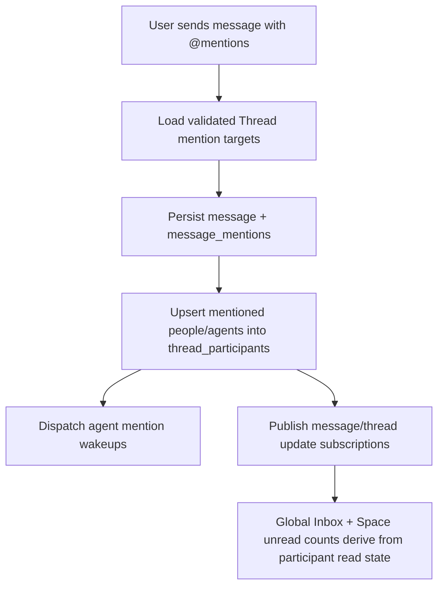
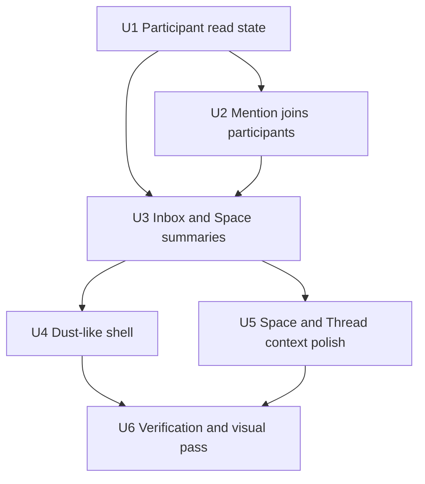

# feat: Spaces collaborative chat UI

> Superseded by `docs/plans/2026-05-20-003-spaces-as-agent-contextual-workrooms-template-removal-plan.md` for future implementation direction. Keep this plan as historical design input for collaborative Threads, mentions, and unread behavior, but do not treat its room/channel-first Space model as active scope. The current model keeps Spaces in the end-user app as contextual workrooms: a Space is both where work happens and the context package an agent receives for that work.

## Overview

Rework the `apps/computer` end-user app into a Dust-like collaborative Chat and Spaces shell. The first implementation slice makes `Chat` the default landing surface, adds a global Inbox across Spaces, shows per-Space unread counts in the sidebar, lets users switch Space context, and completes the `@person` / `@agent` collaboration path so mentions add participants to the shared Thread.

The repo already has much of the Spaces foundation: Space-owned Threads, Thread participants, structured message mentions, Space mention targets, and agent mention wakeups. This plan builds on those contracts rather than reopening the Spaces schema wholesale. The main missing substrate is participant-scoped unread/read state; the legacy `threads.last_read_at` field is thread-level and cannot correctly represent multiple humans collaborating in one Thread.

---

## Problem Frame

General users need one place to ask agents for help and involve teammates in the same durable conversation. Today the end-user app has a Spaces route and room-style Thread detail, but the shell still reads like a workbench/admin navigation surface, Inbox is not global across Spaces, Space unread counts are not represented, and mentioned people/agents are not guaranteed to become durable Thread participants.

The product behavior comes from the origin requirements doc: compact Dust-like top tabs, global Inbox first, Space unread navigation, and mentions that join people or agents to the Thread (see origin: `docs/brainstorms/2026-05-19-spaces-collaborative-user-app-ui-requirements.md`).

---

## Requirements Trace

- R1. Use compact Dust-like `Chat`, `Spaces`, and `Admin` first-level navigation.
- R2. Land general users on `Chat`.
- R3. Keep `Admin` reachable for permitted users without making the end-user app feel like an admin console.
- R4. Show a global Inbox section above Space-specific navigation in Chat.
- R5. Make Inbox global across Spaces and label each Inbox item with its Space.
- R6. Show each accessible Space as a sidebar nav item with unread count.
- R7. Let selecting a Space scope the Thread list/composer context while preserving global Inbox visibility.
- R8. Show all accessible Spaces in the `Spaces` tab with unread count and basic identity/activity.
- R9. Opening a Space from `Spaces` sets the active Chat context.
- R10. Borrow Dust's clarity/density while keeping ThinkWork Space identity visible.
- R11. Support people and agents as participants in the same Thread.
- R12. Surface mentionable people and agents from `@` in the composer.
- R13. Add mentioned people/agents as Thread participants.
- R14. Give mentioned participants future unread/inbox state.
- R15. Wake or route work to mentioned agents in the same Thread.
- R16. Make current Space context visible in the composer.
- R17. Support grouped recency sections such as Inbox, Today, Yesterday, and older periods.
- R18. Prioritize global Inbox above recency-only Threads.
- R19. Update Space unread counts when unread activity occurs in that Space.
- R20. Make Thread header/detail show participants, owning Space, and agent activity/mention context.

**Origin actors:** A1 general user, A2 mentioned teammate, A3 mentioned agent, A4 Space member, A5 tenant admin.
**Origin flows:** F1 global Chat Inbox, F2 Space switching, F3 teammate/agent mention, F4 new Thread.
**Origin acceptance examples:** AE1 global Inbox and Space counts, AE2 Space selection, AE3 teammate mention joins, AE4 agent mention joins and wakes, AE5 Space/participant context in Thread detail.

---

## Scope Boundaries

### Deferred for later

- Full Slack-like channel hierarchy.
- Reactions, emoji workflows, message threading inside Threads, and rich presence.
- Pinning, saved items, bookmarks, and advanced sidebar customization.
- Fine-grained per-user notification preference UI beyond the default mention/join behavior.
- General-purpose Space creation/configuration UX for all users.
- Full Space document library, file browser, and knowledge management views.
- Advanced agent marketplace or catalog UX beyond mentionable agents assigned to the Space.
- Cross-Space search beyond what is needed for the global Inbox and basic Thread discovery.

### Outside this product's identity

- ThinkWork is not trying to replace Slack as a general chat system.
- ThinkWork is not an admin-first console for the end-user app.
- ThinkWork is not a one-agent private chat app; collaboration among people and agents is the core surface.
- ThinkWork is not a generic notification inbox detached from Space and Thread context.

### Deferred to Follow-Up Work

- Mobile parity for the redesigned Spaces Chat shell. `apps/mobile` already has mention-related components, but this plan targets the web end-user app in `apps/computer`.
- Rich notification delivery beyond unread/inbox state. This plan creates participant state that later push/email notification work can consume.

---

## Context & Research

### Relevant Code and Patterns

- `apps/computer/src/routes/index.tsx` currently redirects `/` to `/threads`; keep Chat as the default route but change the user-facing label and shell behavior.
- `apps/computer/src/components/ComputerSidebar.tsx` owns the current left navigation and already queries `ThreadsPagedQuery` for a count.
- `apps/computer/src/components/AppTopBar.tsx` and `apps/computer/src/context/PageHeaderContext.tsx` provide page-level header state; the new Dust-like top tabs should be shell navigation, not page-local content tabs.
- `apps/computer/src/routes/_authed/_shell/spaces.index.tsx`, `spaces.$spaceId.tsx`, and `spaces.$spaceId.threads.$threadId.tsx` already provide Space listing, Space detail, and Space Thread detail routes.
- `apps/computer/src/components/spaces/SpaceThreadList.tsx`, `SpaceThreadRoom.tsx`, `ThreadComposer.tsx`, `MentionMenu.tsx`, `ThreadConversation.tsx`, and `ThreadParticipantsBar.tsx` are the existing collaboration UI components to extend.
- `apps/computer/src/lib/graphql-queries.ts` uses plain `gql` documents without generated types in this app.
- `packages/api/src/graphql/resolvers/messages/sendMessage.mutation.ts` already validates structured mentions, persists `message_mentions`, and dispatches agent wakeups.
- `packages/api/src/lib/mentions/thread-mention-targets.ts` already loads Space members, assigned agents, and existing participants as mention targets.
- `packages/database-pg/src/schema/thread-participants.ts` already models user and agent participants with notification preference and uniqueness constraints.
- `packages/api/src/graphql/resolvers/threads/unreadThreadCount.query.ts` and `apps/mobile/lib/hooks/use-thread-read-state.ts` show existing legacy thread-level read-state behavior to preserve for older surfaces.

### Institutional Learnings

- `docs/plans/2026-05-19-003-feat-spaces-customer-onboarding-v1-plan.md` U9/U10 shipped the first Spaces UI and collaborative Thread detail. The new plan should not recreate those foundations; it should close the global Inbox, Space unread, and participant-join gaps.
- `docs/plans/autopilot-status.md` records that U9, U10, U11, and U13 merged: Space-owned Threads, room-style Space Thread conversation UI, structured mentions, and admin Spaces are already live in the codebase.
- `AGENTS.md` requires `pnpm`, keeps `apps/computer` as internal compatibility naming for now, and warns that the platform has no local-only mode for full end-to-end verification.

### External References

- Dust Discover docs: `https://dust.tt/academy/first-steps-on-dust/chapter/discover`. Used as product/UI reference for Chat history, Spaces, agent/person mentions, and a dense collaboration shell. Local repo patterns are sufficient for implementation planning, so no broader external framework research is needed.
- Additional Dust screenshots from 2026-05-19 show two useful UI details: the Chat tab keeps the left rail extremely compact with search, New, overflow, conversation grouping, and user/help footer; the Spaces tab uses a hierarchical left rail with Administration shortcuts plus Open Spaces and Restricted Spaces groups. Treat these as visual/IA references, not scope to build full Dust connection/tool administration.

---

## Key Technical Decisions

- **Participant-scoped read state is the source of truth for collaborative Space Threads:** Add/read/update unread state on `thread_participants` for Space collaboration. Keep `threads.last_read_at` as legacy compatibility for older personal/computer thread surfaces so admin and mobile do not break during this slice.
- **Mentions add participants in `sendMessage`:** The existing message mention path is the right integration point because it already validates targets and has the complete `tenantId`, `threadId`, `spaceId`, sender, message, and parsed mention set. Message, mention, and participant writes should be transactional so the product never records a visible mention without the participant join it promises.
- **Space collaboration needs a user-message activity signal:** For collaborative Space Threads, a human message should refresh the activity signal used by global Inbox and Space unread counts even when no agent has responded. Preserve the existing Computer-thread invariant that agent turn-start dispatch still happens once and only once.
- **Use existing Space membership/assignment rules for mention eligibility:** `threadMentionTargets` already loads Space members and active Space agent assignments. The participant insertion path should reuse that validated target set rather than accepting arbitrary user or agent IDs.
- **Do not introduce a separate Inbox table for v1:** Global Inbox and Space unread counts can be derived from Space Threads, participants, `lastActivityAt` / `lastTurnCompletedAt`, and participant read timestamps. A materialized Inbox can be revisited only if query performance or notification fan-out requires it.
- **Make `/threads` the Chat tab rather than adding a new `/chat` route first:** The root route already lands at `/threads`. Keeping the route stable lowers migration cost while the UI label becomes `Chat`.
- **Scope the redesign to `apps/computer`:** The web end-user app is the surface shown in the screenshots and has current Spaces routes. Mobile mention fixes can follow once the web contract is stable.
- **Spaces tab should be tree-first, not card-only:** The existing Space card grid can remain as the content pane, but the Dust-inspired direction needs a persistent Spaces rail that groups Administration, Open Spaces, and Restricted Spaces. Full connection/data management remains deferred.

---

## Open Questions

### Resolved During Planning

- **What is the unread-count source of truth?** Participant-scoped `thread_participants.last_read_at` for collaborative Space Threads; legacy `threads.last_read_at` remains compatibility state.
- **What activity timestamp drives unread?** Use the same effective activity concept as Thread lists, but ensure collaborative Space user messages update it. Agent-only `last_turn_completed_at` is insufficient for user-to-user unread.
- **Where should recency groups appear?** Global Inbox and Space nav live in the Chat sidebar. Recency groups appear in the active Thread list below global Inbox and selected-Space context, matching the Dust-like sidebar shape.
- **What is the minimal participant display?** Use the existing `ThreadParticipantsBar`, but enrich the Thread header/composer area with owning Space and active/mentioned agent affordances rather than adding presence.

### Deferred to Implementation

- **Exact query shape for unread summaries:** Implementers should choose between adding fields to existing `Space`/`Thread` GraphQL types or adding a focused summary query based on resolver/test ergonomics. The source of truth and behavior are fixed; field names are implementation detail.
- **Exact responsive breakpoints for the Dust-like shell:** Final dimensions should be tuned in browser verification against desktop and mobile-width screenshots.
- **Admin permission detection for the `Admin` tab:** Use the existing auth/tenant context if available; otherwise keep the tab visible but route-gated consistently with current admin access.

---

## High-Level Technical Design

> _This illustrates the intended approach and is directional guidance for review, not implementation specification. The implementing agent should treat it as context, not code to reproduce._

---

## Implementation Units

- U1. **Participant-Scoped Read State**

**Goal:** Give each human Thread participant independent unread/read state so global Inbox and Space counts can work for multi-user collaboration.

**Requirements:** R5, R6, R14, R18, R19; F1, F3; AE1, AE3.

**Dependencies:** None.

**Files:**

- Modify: `packages/database-pg/src/schema/thread-participants.ts`
- Modify: `packages/database-pg/src/schema/threads.ts`
- Modify: `packages/database-pg/graphql/types/threads.graphql`
- Modify: `packages/api/src/graphql/resolvers/threads/types.ts`
- Modify: `packages/api/src/graphql/resolvers/threads/updateThread.mutation.ts`
- Modify: `packages/api/src/graphql/resolvers/threads/threadsPaged.query.ts`
- Modify: `packages/api/src/graphql/resolvers/threads/unreadThreadCount.query.ts`
- Create: `packages/database-pg/drizzle/NNNN_thread_participant_read_state.sql`
- Test: `packages/database-pg/__tests__/thread-participants-schema.test.ts`
- Test: `packages/api/src/graphql/resolvers/threads/threadsPaged.query.test.ts`
- Test: `packages/api/src/graphql/resolvers/threads/unreadThreadCount.query.test.ts`
- Test: `packages/api/src/graphql/resolvers/threads/updateThread.mutation.test.ts`

**Approach:**

- Add participant-level read timestamp state to `thread_participants`.
- For authenticated user callers, treat their user participant row as authoritative for collaborative Space Thread unread state.
- Preserve legacy `threads.last_read_at` behavior for older non-participant or non-Space surfaces so existing admin/mobile code does not regress.
- Let read marking update the caller's participant row when one exists; fall back to legacy thread-level `last_read_at` only when there is no participant row.
- Ensure unread counts exclude archived Threads and only count Threads where the caller has a user participant row with unread activity.
- Ensure the activity timestamp used for unread is updated by collaborative Space user messages as well as agent responses, while preserving the old Computer-thread behavior where user messages alone do not start duplicate agent turns.

**Execution note:** Start with API/database characterization tests around the legacy `lastReadAt` behavior, then add the participant-scoped expectations.

**Patterns to follow:**

- `packages/database-pg/src/schema/thread-participants.ts` for existing participant uniqueness and allowed-value checks.
- `packages/api/src/graphql/resolvers/threads/updateThread.mutation.ts` for read-state-only updates that avoid noisy thread update side effects.
- `packages/api/src/graphql/resolvers/threads/unreadThreadCount.query.ts` for existing unread predicate shape.

**Test scenarios:**

- Happy path: a user participant with null participant read timestamp and a Thread with newer activity is counted unread.
- Happy path: updating `lastReadAt` for a Space Thread updates the caller's participant row and removes that Thread from the caller's unread count.
- Happy path: a human message in a collaborative Space Thread creates unread state for other subscribed human participants even before an agent response exists.
- Edge case: user A marking a Thread read does not clear user B's unread state for the same Thread.
- Edge case: a legacy Thread without a participant row still uses `threads.last_read_at` compatibility behavior.
- Edge case: a Computer-owned personal Thread keeps the existing single-submit/agent-response ordering and does not get double-dispatched by the collaboration activity update.
- Error path: a Cognito caller who is not a Thread participant cannot mark another user's participant state read.
- Integration: `threadsPaged` returns enough caller-specific read state for the app to compute row and Inbox unread state without extra per-row queries.

**Verification:**

- Multi-user Space Threads can represent unread/read state independently per human participant.
- Existing thread list/read-state tests still pass for non-Space or legacy surfaces.

---

- U2. **Mentioned Targets Join Threads**

**Goal:** Make `@person` and `@agent` mentions add the target as a durable Thread participant before agent wakeups and unread calculations run.

**Requirements:** R11, R12, R13, R14, R15; F3; AE3, AE4.

**Dependencies:** U1.

**Files:**

- Modify: `packages/api/src/graphql/resolvers/messages/sendMessage.mutation.ts`
- Modify: `packages/api/src/lib/mentions/thread-mention-targets.ts`
- Modify: `packages/api/src/lib/mentions/dispatch-agent-mentions.ts`
- Create: `packages/api/src/lib/mentions/thread-participant-mentions.ts`
- Test: `packages/api/src/graphql/resolvers/messages/sendMessage.mentions.test.ts`
- Test: `packages/api/src/lib/mentions/thread-participant-mentions.test.ts`
- Test: `packages/api/src/lib/mentions/thread-mention-targets.test.ts`
- Test: `packages/api/src/lib/mentions/dispatch-agent-mentions.test.ts`
- Test: `packages/database-pg/__tests__/thread-participants-schema.test.ts`

**Approach:**

- After mention validation/parsing, persist the message, structured mentions, and mentioned participant rows inside one transaction; dispatch agent wakeups only after that transaction commits.
- Set `source` to a mention-specific value and default notification preference to subscribed for newly mentioned targets.
- Use the already-loaded mention targets to derive display/role context and to avoid arbitrary cross-tenant insertion.
- Insert participants before `dispatchAgentMentions` so the agent wakeup and subsequent mention target reloads see the agent as part of the Thread.
- For user messages in collaborative Space Threads, publish or update Thread activity after the transaction so Inbox/Space unread subscriptions can refresh.
- Leave existing participants unchanged on repeated mentions.

**Patterns to follow:**

- `packages/api/src/graphql/resolvers/threads/createThread.mutation.ts` for participant row construction and auto-subscribed agent insertion.
- `packages/api/src/lib/mentions/parse-message-mentions.ts` for target normalization and de-duplication.
- `packages/database-pg/src/schema/thread-participants.ts` unique indexes for idempotent upsert behavior.

**Test scenarios:**

- Covers AE3. Happy path: mentioning a Space member inserts a `user` participant with source `mention` and future unread state initialized as unread.
- Covers AE4. Happy path: mentioning an assigned Space agent inserts an `agent` participant and still enqueues one idempotent agent wakeup.
- Edge case: mentioning an existing participant does not duplicate rows or reset their notification/read state unexpectedly.
- Error path: explicit mention input for a user or agent outside the validated target set fails before message side effects that would create participant rows.
- Error path: participant insertion failure rolls back the message and mention rows rather than leaving a visible mention without participant membership.
- Integration: after a send with mentions, `threadMentionTargets` returns the mentioned targets as participants and `SpaceThreadCollaborationQuery` can render them in `ThreadParticipantsBar`.
- Integration: a teammate mention causes the mentioned user to see the Thread in global Inbox without requiring an agent response.

**Verification:**

- A mentioned person or agent is visible as a participant on the next Thread reload.
- Agent mention dispatch behavior remains idempotent.

---

- U3. **Global Inbox and Space Unread Summaries**

**Goal:** Add the GraphQL/data layer that lets `apps/computer` render global Inbox items, per-Space unread counts, and active Space Thread lists from the same participant-scoped read model.

**Requirements:** R4, R5, R6, R7, R8, R17, R18, R19; F1, F2; AE1, AE2.

**Dependencies:** U1, U2.

**Files:**

- Modify: `packages/database-pg/graphql/types/spaces.graphql`
- Modify: `packages/database-pg/graphql/types/threads.graphql`
- Modify: `packages/api/src/graphql/resolvers/spaces/spaces.query.ts`
- Modify: `packages/api/src/graphql/resolvers/spaces/types.ts`
- Modify: `packages/api/src/graphql/resolvers/threads/threadsPaged.query.ts`
- Modify: `apps/computer/src/lib/graphql-queries.ts`
- Modify: `apps/computer/src/components/spaces/space-types.ts`
- Test: `packages/api/src/graphql/resolvers/spaces/spaces.query.test.ts`
- Test: `packages/api/src/graphql/resolvers/threads/threadsPaged.query.test.ts`
- Test: `packages/api/src/__tests__/graphql-contract.test.ts`
- Test: `apps/computer/src/lib/graphql-queries.test.ts`

**Approach:**

- Expose unread summary data needed by the Chat shell: global unread Threads with Space identity, per-Space unread counts, and active Space recency lists.
- Keep the query shape focused on current user state rather than tenant-wide unread metrics.
- Prefer deriving counts in resolver queries over adding new persisted summary tables for v1.
- Ensure Spaces list data includes enough identity/activity for the `Spaces` tab without forcing a second detail query per card.
- Keep query filters tenant- and membership-scoped through existing resolver access rules.

**Patterns to follow:**

- `apps/computer/src/lib/graphql-queries.ts` for plain `gql` query additions.
- `packages/api/src/graphql/resolvers/spaces/spaces.query.ts` and `packages/api/src/graphql/resolvers/threads/threadsPaged.query.ts` for existing tenant/member scoping.
- `apps/computer/src/components/spaces/space-types.ts` for UI-facing data normalization helpers.

**Test scenarios:**

- Covers AE1. Happy path: a user in three Spaces receives global Inbox rows from two Spaces and matching per-Space unread counts.
- Covers AE2. Happy path: filtering by selected Space returns that Space's Threads while global Inbox query remains cross-Space.
- Edge case: Spaces with zero unread Threads render a zero/empty count without disappearing.
- Edge case: archived Threads do not contribute to global Inbox or Space unread counts.
- Error path: user without Space membership does not receive that Space's unread rows or counts.
- Integration: a mention-created participant with unread state appears in the global Inbox after another participant sends a message.
- Integration: user-authored messages and agent-authored messages both refresh the unread summaries that the Chat shell renders.

**Verification:**

- App queries can render global Inbox, Space nav counts, and Space cards without client-side N+1 fetching.

---

- U4. **Dust-Like Chat Shell and Sidebar**

**Goal:** Replace the current workbench-style left navigation with a compact Chat/Spaces/Admin shell where Chat defaults to global Inbox plus Space unread navigation.

**Requirements:** R1, R2, R3, R4, R5, R6, R7, R10, R17, R18; F1, F2; AE1, AE2.

**Dependencies:** U3.

**Files:**

- Modify: `apps/computer/src/routes/index.tsx`
- Modify: `apps/computer/src/routes/_authed/_shell.tsx`
- Modify: `apps/computer/src/components/ComputerSidebar.tsx`
- Modify: `apps/computer/src/components/AppTopBar.tsx`
- Modify: `apps/computer/src/lib/computer-routes.ts`
- Modify: `apps/computer/src/routes/_authed/_shell/threads.index.tsx`
- Create: `apps/computer/src/components/shell/AppModeTabs.tsx`
- Create: `apps/computer/src/components/shell/ChatSidebar.tsx`
- Create: `apps/computer/src/components/shell/GlobalInboxSection.tsx`
- Create: `apps/computer/src/components/shell/SpaceNavSection.tsx`
- Test: `apps/computer/src/routes/_authed/_shell/-shell.test.tsx`
- Test: `apps/computer/src/components/shell/ChatSidebar.test.tsx`
- Test: `apps/computer/src/components/shell/GlobalInboxSection.test.tsx`
- Test: `apps/computer/src/components/shell/SpaceNavSection.test.tsx`

**Approach:**

- Treat `/threads` as the `Chat` tab and `/spaces` as the `Spaces` tab, keeping route stability while changing visible product language.
- Move first-level mode navigation to a compact top tab area in the left shell, matching the Dust-inspired screenshots.
- In Chat mode, render search, New, global Inbox, Space nav entries with unread counts, and recency groups.
- Keep the global Inbox visible even when a Space is selected.
- Keep secondary product areas such as Artifacts, Automations, Memory, and Customize out of the primary v1 Chat tab unless they are reachable through overflow or future Admin paths.
- Preserve the bottom user/help footer treatment from the current sidebar, but make the primary middle content change by active top tab.
- Use existing `@thinkwork/ui` sidebar primitives where they support the new shape; introduce small shell components instead of baking all behavior into `ComputerSidebar.tsx`.

**Patterns to follow:**

- `apps/computer/src/components/ComputerSidebar.tsx` for existing route active-state and collapsed behavior.
- `apps/computer/src/components/spaces/SpaceThreadList.tsx` for dense Thread row styling.
- Dust screenshot/reference for compact tab density, search/New controls, Inbox section, and grouped recency.

**Test scenarios:**

- Covers AE1. Happy path: landing at `/` redirects to Chat and renders top tabs with Chat active, global Inbox first, and Space nav counts.
- Covers AE2. Happy path: selecting a Space nav item changes the active Space context while preserving global Inbox visibility.
- Edge case: no unread Inbox items still leaves Space nav and recent Thread groups usable.
- Edge case: no Spaces renders an empty state without hiding Chat shell controls.
- Error path: unread summary query failure shows a contained sidebar error instead of blanking the whole app.
- Visual regression expectation: desktop sidebar remains dense and readable; mobile-width layout does not overlap tab labels, search, New, or unread badges.
- Visual regression expectation: dark-mode Chat rail matches the compact Dust reference with top tabs, search, New, overflow, conversations/inbox, and footer visible without crowding.

**Verification:**

- The first viewport reads as a Dust-like Chat/Spaces/Admin shell rather than the older Spaces/Threads/Artifacts workbench sidebar.

---

- U5. **Space Browser, Thread Header, and Composer Context**

**Goal:** Make Space switching and Thread detail communicate the current Space, participants, and mention/agent activity clearly enough for collaborative work.

**Requirements:** R8, R9, R10, R16, R20; F2, F4; AE2, AE5.

**Dependencies:** U3.

**Files:**

- Modify: `apps/computer/src/routes/_authed/_shell/spaces.index.tsx`
- Modify: `apps/computer/src/routes/_authed/_shell/spaces.$spaceId.tsx`
- Modify: `apps/computer/src/routes/_authed/_shell/spaces.$spaceId.threads.$threadId.tsx`
- Modify: `apps/computer/src/components/spaces/SpaceThreadRoom.tsx`
- Modify: `apps/computer/src/components/spaces/ThreadParticipantsBar.tsx`
- Modify: `apps/computer/src/components/spaces/ThreadComposer.tsx`
- Modify: `apps/computer/src/components/spaces/MentionMenu.tsx`
- Modify: `apps/computer/src/components/spaces/SpaceThreadList.tsx`
- Modify: `apps/computer/src/components/NewThreadDialog.tsx`
- Test: `apps/computer/src/routes/_authed/_shell/-spaces-route.test.tsx`
- Test: `apps/computer/src/components/spaces/ThreadComposer.test.tsx`
- Test: `apps/computer/src/components/spaces/MentionMenu.test.tsx`
- Test: `apps/computer/src/components/spaces/ThreadParticipantsBar.test.tsx`
- Test: `apps/computer/src/components/spaces/SpaceThreadList.test.tsx`

**Approach:**

- Add unread count and activity signal to Space cards/list rows in the `Spaces` tab.
- Rework the `Spaces` tab around a Dust-like tree rail: Administration shortcuts first, then Open Spaces and Restricted Spaces groups with expandable Space sections where available.
- Opening a Space from `Spaces` should set active Chat context through route/navigation state; avoid a separate hidden Space selector.
- Treat Connections, Tools, Triggers, folders, websites, and connected data as labels/entry points only where current ThinkWork capabilities already exist; do not invent new connector administration behavior in this UI slice.
- Enrich Thread detail with Space name/label and participant summary in the header or participant bar.
- Add compact Space context copy/chip to the composer so users know where the message will land.
- Keep mention menu results grouped or visually differentiated between people and agents, but do not add rich agent marketplace behavior.
- Make New Thread creation Space-first: current Space is explicit, and mentions in the opening message should use the same structured mention path when feasible.

**Patterns to follow:**

- `apps/computer/src/components/spaces/ThreadParticipantsBar.tsx` for participant display.
- `apps/computer/src/components/spaces/MentionMenu.tsx` for person/agent differentiation.
- `apps/computer/src/components/NewThreadDialog.tsx` for Space-scoped thread creation.

**Test scenarios:**

- Covers AE2. Happy path: clicking a Space card opens/scopes Chat to that Space and shows Space Threads.
- Happy path: the Spaces tab shows Open Spaces and Restricted Spaces groups, with unread/activity indicators available on each Space row.
- Edge case: a tenant with no restricted Spaces still renders the Open Spaces group and Administration shortcuts cleanly.
- Covers AE5. Happy path: Thread detail displays owning Space and both human/agent participants.
- Happy path: composer shows current Space context and still submits structured mention data.
- Edge case: Thread route with mismatched `spaceId` still shows the existing "Thread not found in this Space" guard.
- Edge case: long Space names and long participant names truncate cleanly without overlapping controls.
- Error path: mention target query failure leaves the composer usable for plain messages and shows a non-blocking indication if needed.

**Verification:**

- Users can tell which Space owns a Thread before sending a message.
- Space cards and Space nav entries both communicate unread state consistently.

---

- U6. **Verification, Browser Polish, and Contract Safeguards**

**Goal:** Verify the redesigned app shell, collaboration path, and unread behavior across focused tests and browser inspection without turning the plan into full E2E AWS validation.

**Requirements:** Supports all requirements, especially R1-R7 and R11-R20.

**Dependencies:** U4, U5.

**Files:**

- Modify: `apps/computer/src/routes/_authed/_shell/-shell.test.tsx`
- Modify: `apps/computer/src/routes/_authed/_shell/-spaces-route.test.tsx`
- Modify: `apps/computer/src/lib/graphql-queries.test.ts`
- Modify: `packages/api/src/__tests__/graphql-contract.test.ts`
- Modify: `docs/plans/autopilot-status.md` only if this work is executed through the existing autopilot ledger workflow.

**Approach:**

- Preserve focused Vitest coverage at each layer rather than adding a brittle full-stack test that cannot run without a deployed AWS stack.
- Use browser verification for the local `apps/computer` dev server after implementation, with the ignored env file copied from the main checkout when running from a worktree per `AGENTS.md`.
- Check desktop and mobile-width layouts for overlap, unread badge readability, and composer/mention-menu positioning.
- Add source-level safeguards where the repo already uses them, especially around `SendMessageMutation` single-submit ownership.

**Patterns to follow:**

- `apps/computer/src/lib/use-composer-state.test.ts` for source-level invariant tests that catch accidental double-submit paths.
- `apps/computer/src/routes/_authed/_shell/-spaces-route.test.tsx` for lightweight route/component mocks.
- `packages/api/src/__tests__/graphql-contract.test.ts` for schema contract coverage.

**Test scenarios:**

- Integration: sending a message with a person mention persists mention, inserts participant, and makes the Thread unread for the mentioned user.
- Integration: sending a message with an agent mention persists mention, inserts participant, and enqueues one agent wakeup.
- Integration: global Inbox and Space unread counts update after unread activity and clear after the current user marks the Thread read.
- Regression: existing Space Thread detail still renders messages, participants, linked tasks, and archive controls.
- Regression: composer code does not create a second send path that fires duplicate agent turns.
- Visual: Chat shell top tabs, search, New, Inbox, Space nav, Thread list, and composer fit without overlapping at representative desktop and narrow widths.

**Verification:**

- Focused package tests cover data contracts and UI state.
- Browser screenshots confirm the Dust-like shell is readable, compact, and usable.

---

## System-Wide Impact

- **Interaction graph:** `sendMessage` now affects `messages`, `message_mentions`, `thread_participants`, collaborative activity timestamps, agent wakeups, and subscriptions. The mutation's side-effect order matters: validate, transactionally persist message/mentions/participants, dispatch agent wakeups after commit, then publish message/thread updates.
- **Error propagation:** invalid mention targets should fail before participant insertion or agent wakeup. Participant insertion failures should fail the send and roll back message/mention writes if they would violate the product promise that mentions join participants; agent wakeup failures can remain logged/non-blocking as today if the message and participant state are already durable.
- **State lifecycle risks:** participant unread state must be idempotent, per-user, and isolated. Repeated mentions should not reset existing participant read/notification state. Archived Threads should not contribute to unread summaries. User-authored Space messages must create unread state for other participants without creating duplicate agent dispatch.
- **API surface parity:** `apps/computer` gets the new shell first. Admin and mobile should keep legacy behavior unless they explicitly opt into participant-scoped fields.
- **Integration coverage:** unit tests alone will not prove global Inbox behavior; resolver tests need to exercise participant read state, mention insertion, and unread count derivation together.
- **Unchanged invariants:** every Thread still belongs to one Space; Space membership still gates access; assigned Space agents remain the mentionable agent set; full Slack replacement features remain out of scope.

---

## Risks & Dependencies

| Risk                                                                                   | Mitigation                                                                                                                                                                                   |
| -------------------------------------------------------------------------------------- | -------------------------------------------------------------------------------------------------------------------------------------------------------------------------------------------- |
| Participant read state introduces schema drift or breaks legacy `lastReadAt` consumers | Keep legacy `threads.last_read_at` in place; add focused migration markers and compatibility tests around non-Space/legacy paths.                                                            |
| `sendMessage` grows too many side effects                                              | Extract participant insertion into a small mention helper with tests; keep mutation orchestration readable and side-effect ordering explicit.                                                |
| A visible mention persists without participant membership                              | Wrap message, mention, and participant writes in one transaction and dispatch agent wakeups only after commit.                                                                               |
| User-to-user messages never appear unread because activity only tracks agent turns     | Add a collaborative Space activity update path for user messages and test it separately from Computer turn dispatch.                                                                         |
| Global Inbox queries become expensive across many Spaces/Threads                       | Derive counts with indexed participant/thread predicates first; defer materialized Inbox table until measurements show it is needed.                                                         |
| UI redesign hides operational surfaces users still need                                | Keep this slice scoped to end-user Chat/Spaces/Admin; preserve existing routes where possible even if they move out of primary nav.                                                          |
| Spaces tab drifts into a broad Dust admin clone                                        | Model the tree/IA visually, but only wire entries backed by existing ThinkWork capabilities; defer broad connection/tool administration.                                                     |
| Mention menu appears to work but opening messages cannot mention participants          | Include New Thread/opening-message behavior in U5 where feasible; otherwise document it as the next follow-up before shipping broad usage.                                                   |
| Browser polish regresses because app requires deployed config                          | Follow `AGENTS.md`: copy `apps/computer` env from the main checkout when working in a worktree; local browser verification covers layout while deployed stack remains required for true E2E. |

---

## Documentation / Operational Notes

- Update any user-facing docs or screenshots only after the visual direction lands; the current plan is a product UI rework, not docs-first work.
- If participant-scoped read state requires a hand-rolled migration, include `-- creates-column:` / `-- creates:` markers so `pnpm db:migrate-manual` can detect drift.
- End-to-end AWS verification should happen after merge/deploy because the repo has no local-only mode.

---

## Sources & References

- **Origin document:** [docs/brainstorms/2026-05-19-spaces-collaborative-user-app-ui-requirements.md](../brainstorms/2026-05-19-spaces-collaborative-user-app-ui-requirements.md)
- Prior Spaces plan: [docs/plans/2026-05-19-003-feat-spaces-customer-onboarding-v1-plan.md](2026-05-19-003-feat-spaces-customer-onboarding-v1-plan.md)
- Spaces execution ledger: [docs/plans/autopilot-status.md](autopilot-status.md)
- Dust reference: [Dust Discover](https://dust.tt/academy/first-steps-on-dust/chapter/discover)
- Relevant app code: `apps/computer/src/components/ComputerSidebar.tsx`, `apps/computer/src/routes/_authed/_shell/spaces.index.tsx`, `apps/computer/src/routes/_authed/_shell/spaces.$spaceId.tsx`, `apps/computer/src/routes/_authed/_shell/spaces.$spaceId.threads.$threadId.tsx`, `apps/computer/src/components/spaces/SpaceThreadRoom.tsx`, `apps/computer/src/components/spaces/ThreadComposer.tsx`, `apps/computer/src/components/spaces/MentionMenu.tsx`
- Relevant API/data code: `packages/api/src/graphql/resolvers/messages/sendMessage.mutation.ts`, `packages/api/src/lib/mentions/thread-mention-targets.ts`, `packages/api/src/lib/mentions/parse-message-mentions.ts`, `packages/api/src/lib/mentions/dispatch-agent-mentions.ts`, `packages/database-pg/src/schema/thread-participants.ts`, `packages/database-pg/src/schema/messages.ts`
