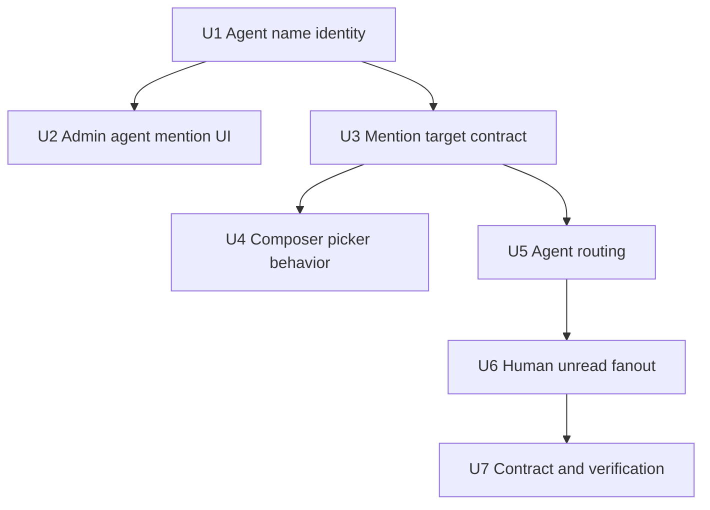

# fix: Agent mentions and multiplayer unread routing

## Overview

Finish the collaboration contract for Spaces chat now that the simplified shell is in place. Agents must appear in the `@` picker alongside humans, agent mentions must use the agent's tenant-unique name instead of an internal slug/mention column, messages must route to the right agent, and unread state must behave per human participant rather than as a thread-level flag.

This is a follow-on to `docs/plans/2026-05-19-005-feat-spaces-collaborative-chat-ui-plan.md`. That plan shipped the UI substrate and much of the mention/read-state plumbing; this plan tightens the behavior that is still missing or confusing in the product.

## Problem Frame

Spaces chat is meant to be multiplayer: humans and agents collaborate in one durable thread. Right now the user-facing behavior still has several private-chat leftovers:

- Agents do not reliably appear in the mention picker.
- The admin Agents table exposes an internal mention/slug column instead of making the agent name the mention identity.
- Agent names are not enforced as unique mention handles.
- A message with no explicit mention does not clearly route to the subscribed agent.
- Human unread state needs to be updated per person when new chat activity happens.

The desired model is closer to Slack plus agents: type `@Cruz`, pick the agent, send the turn to Cruz; type no mention, send to the thread's subscribed/default agent; type `@Eric`, bring Eric into the conversation and mark the thread unread for the relevant humans.

## Requirements Trace

- R1. Mention picker includes all eligible tenant humans and all eligible tenant agents.
- R2. Mention picker filtering is contains-based, not starts-with.
- R3. Mention picker displays agents by agent name, not slug.
- R4. Agent admin list removes the separate `Mention` column.
- R5. Agent admin surfaces the mention identity by prefixing the displayed agent name with `@`.
- R6. Agent names are unique within a tenant for mention purposes.
- R7. Renaming an agent preserves the existing identity/workspace side effects while enforcing uniqueness.
- R8. Explicit `@agent` mention sends the turn to that mentioned agent.
- R9. A message with no agent mention and no person mention routes to the subscribed/default agent for the thread.
- R10. A message with only human mentions adds/updates human participants and unread state without inventing a random agent recipient.
- R11. Any human participant other than the sender gets per-person unread state when a new message lands.
- R12. Agent-authored messages also make the thread unread for subscribed human participants.
- R13. Read state remains isolated per human; one person reading the thread does not clear another person's unread state.

## Scope Boundaries

### In Scope

- Agent-name-based mention display and parsing.
- Tenant-scoped uniqueness for active/non-archived agent names.
- Admin Agents table cleanup around mention display.
- Mention target resolver and composer picker fixes.
- Message routing for explicit agent mentions and no-mention default agent turns.
- Per-human unread state updates for collaborative chat messages.
- Focused tests for API, data, and computer/admin UI contracts.

### Out of Scope

- Full notification delivery via push, email, Slack, or desktop notifications.
- Rich presence, reactions, nested message threads, and read receipts UI.
- Removing or repurposing `agents.slug` globally. Slug remains an internal stable identifier for email addresses, workspaces, template paths, and existing routes.
- Mobile UI parity beyond shared GraphQL/API contracts.
- Reworking the Spaces shell again.

## Context & Research

### Current Patterns

- `packages/api/src/lib/mentions/thread-mention-targets.ts` already loads thread participants, Space members, tenant members, Space-assigned agents, and tenant agents. The implementation intends to include agents, so the likely gap is contract/test/UI shape rather than a wholly missing data source.
- `packages/api/src/lib/mentions/parse-message-mentions.ts` parses explicit structured mentions first, then text mentions against `displayName` and aliases.
- `apps/computer/src/components/spaces/MentionMenu.tsx` already filters by `displayName` and `role` using contains matching and renders users/agents with different icons.
- `apps/computer/src/components/computer/TaskThreadView.tsx` has keyboard-compatible mention selection for the current primary thread composer; `apps/computer/src/components/spaces/ThreadComposer.tsx` still uses a simpler picker without keyboard navigation.
- `packages/api/src/graphql/resolvers/messages/sendMessage.mutation.ts` persists messages, structured mentions, mention-created participants, and dispatches explicit agent wakeups.
- `packages/api/src/lib/mentions/dispatch-agent-mentions.ts` only creates wakeups for parsed agent mentions.
- `packages/database-pg/src/schema/thread-participants.ts` already has participant-scoped `last_read_at`.
- `packages/api/src/graphql/resolvers/threads/unreadThreadCount.query.ts`, `threadsPaged.query.ts`, and `updateThread.mutation.ts` already prefer participant-scoped read state for Cognito users while keeping legacy thread read state for old rows.
- `apps/admin/src/routes/_authed/_tenant/agents/index.tsx` currently maps `mentionHandle: a.slug` and renders a separate `Mention` column.
- `packages/database-pg/src/schema/agents.ts` has `agents.name` and a globally unique nullable `agents.slug`; there is not currently a tenant-scoped name uniqueness index.
- `packages/api/src/graphql/resolvers/agents/createAgent.mutation.ts` and `updateAgent.mutation.ts` are the right API enforcement points for name normalization, uniqueness errors, and rename side effects.

### Institutional Context

- The prior Spaces plan explicitly called for people and agents to join the same thread, agent mentions to wake agents, and participant read state to be the collaboration source of truth.
- `AGENTS.md` says GraphQL source lives under `packages/database-pg/graphql/types/*.graphql`; after GraphQL edits, consumers with codegen scripts need regenerated output.
- `AGENTS.md` also makes clear the platform has no local-only end-to-end mode, so implementation should rely on focused tests plus local browser verification for UI.

### External Research

No external research is needed for this follow-up. The behavior is product-specific, and the repo already contains the relevant mention, agent, and unread patterns.

## Key Decisions

- **Agent name becomes the human mention identity.** The mention picker and admin UI should show `@Agent Name`, backed by `agents.name`. `agents.slug` remains internal infrastructure identity.
- **Uniqueness is tenant-scoped and case-insensitive.** Two non-archived agents in the same tenant should not be able to share the same normalized name. This keeps `@Marco` unambiguous without breaking other tenants.
- **Mention parsing keeps structured mentions authoritative.** UI-selected mentions should continue sending `targetType` and `targetId`; text parsing remains a fallback for pasted/manual `@Name` content.
- **Mention aliases should not promote slug.** Slug can remain an internal fallback alias only where needed for backward compatibility, but new UI and tests should assert agent-name display and `@Name` raw text.
- **Routing distinguishes no-mention from human-only mention.** No mentions means route to the subscribed/default agent. Human-only mentions mean collaborate with humans and update unread state; they should not silently wake an unrelated agent.
- **Unread is timestamp-based per human participant.** Prefer the existing `thread_participants.last_read_at` model over adding a separate boolean flag. A thread is unread for a human when the effective activity timestamp is newer than that human's participant read timestamp or when the read timestamp is null.
- **Do not clear unread state for the sender.** On send, keep or set the sender's participant read timestamp to the message timestamp while leaving other human participants unread.

## Implementation Units

### U1. Agent Name Identity and Uniqueness

**Goal:** Make agent names safe to use as tenant-level mention handles.

**Requirements:** R3, R5, R6, R7.

**Files:**

- Modify: `packages/database-pg/src/schema/agents.ts`
- Modify: `packages/database-pg/graphql/types/agents.graphql`
- Modify: `packages/api/src/graphql/resolvers/agents/createAgent.mutation.ts`
- Modify: `packages/api/src/graphql/resolvers/agents/updateAgent.mutation.ts`
- Create: `packages/database-pg/drizzle/NNNN_agents_tenant_name_unique.sql`
- Test: `packages/database-pg/__tests__/agents-schema.test.ts`
- Test: `packages/api/src/graphql/resolvers/agents/createAgent.mutation.test.ts`
- Test: `packages/api/src/graphql/resolvers/agents/updateAgent.mutation.test.ts`

**Approach:**

- Normalize agent names for comparison by trimming and lowercasing.
- Add a tenant-scoped uniqueness rule for non-archived agents. Prefer a partial unique index on `(tenant_id, lower(name)) WHERE status != 'archived'`.
- Add a migration preflight/backfill strategy for existing duplicate names. If duplicates exist, suffix later duplicates conservatively in the migration or make the migration fail loudly with a clear comment, depending on existing migration conventions.
- Enforce the same uniqueness in `createAgent` and `updateAgent` before relying on the DB constraint so the admin UI gets a useful GraphQL error.
- Preserve existing rename side effects in `updateAgent`, especially `IDENTITY.md` writes.

**Test Scenarios:**

- Creating `Marco` succeeds when no active agent named `Marco` exists in the tenant.
- Creating `marco` fails when `Marco` already exists in the same tenant.
- Creating `Marco` in a different tenant succeeds.
- Renaming `Cruz` to `Marco` fails when `Marco` already exists in the same tenant.
- Renaming `Marco` to `Marco` as a no-op succeeds.
- Archived duplicate names do not block creating a new active agent if the partial-index rule allows that.
- Invalid empty or whitespace-only names still fail before uniqueness checks.

### U2. Admin Agents Table Mention Cleanup

**Goal:** Remove the internal mention/slug column and show the mention identity directly in the name column.

**Requirements:** R4, R5.

**Files:**

- Modify: `apps/admin/src/routes/_authed/_tenant/agents/index.tsx`
- Modify: `apps/admin/src/components/agents/AgentDetailChrome.tsx`
- Modify: `apps/admin/src/components/agents/AgentDetailSheet.tsx`
- Modify: `apps/admin/src/components/agents/AgentFormDialog.tsx`
- Test: `apps/admin/src/routes/_authed/_tenant/agents/-agents-route.test.tsx`
- Test: `apps/admin/src/components/agents/AgentFormDialog.test.tsx`

**Approach:**

- Remove `mentionHandle` from `AgentRow`.
- Remove the `Mention` table column.
- Render the primary name as `@${agent.name}` in the Agents table so the admin page teaches the exact mention syntax.
- Keep slug badges/details where they are infrastructure-specific, such as workspace/email/capability surfaces, but do not label them as the chat mention.
- Surface duplicate-name GraphQL errors in the agent form without introducing client-only uniqueness logic that can drift from the API.

**Test Scenarios:**

- Agents table headers no longer include `Mention`.
- Agents table shows `@Marco` in the name cell.
- Search still matches agent names after the row shape changes.
- Sorting by name still sorts by the raw agent name, not by the visual `@` prefix.
- Duplicate-name mutation errors are shown in the form and do not close the dialog.

### U3. Mention Target Contract Includes Agents by Name

**Goal:** Guarantee `threadMentionTargets` returns all eligible humans and agents with the display shape the picker needs.

**Requirements:** R1, R2, R3.

**Files:**

- Modify: `packages/api/src/lib/mentions/thread-mention-targets.ts`
- Modify: `packages/api/src/graphql/resolvers/threads/threadMentionTargets.query.ts`
- Modify: `packages/database-pg/graphql/types/threads.graphql`
- Modify: `apps/computer/src/lib/graphql-queries.ts`
- Test: `packages/api/src/lib/mentions/thread-mention-targets.test.ts`
- Test: `packages/api/src/graphql/resolvers/threads/threadMentionTargets.query.test.ts`
- Test: `apps/computer/src/lib/graphql-queries.test.ts`

**Approach:**

- Keep tenant isolation strict: mention targets come only from the caller's tenant and accessible thread.
- Return active tenant users and non-archived tenant agents, deduped with existing thread participants and Space assignments.
- For agents, set `displayName` to `agents.name` and ensure the UI can render `@displayName`.
- Remove slug from primary display. If slug remains in `aliases` for transitional parsing, add tests that display/raw mention text remains name-based.
- Include enough target metadata to allow UI differentiation: `targetType`, `targetId`, `displayName`, `avatarUrl`, and `role`.
- Add characterization coverage proving tenant agents are returned even when they are not already thread participants.

**Test Scenarios:**

- Thread mention targets include an active tenant user.
- Thread mention targets include a non-archived tenant agent that is not already a thread participant.
- Archived agents are excluded.
- Agents from another tenant are excluded.
- Space-assigned and thread-participant agents are deduped by `agent:id`.
- Agent target `displayName` is the agent name, not slug.
- Resolver maps `agent` to GraphQL enum `AGENT`.

### U4. Composer Mention Picker Behavior

**Goal:** Make the picker reliably usable for humans and agents in the active chat composer.

**Requirements:** R1, R2, R3.

**Files:**

- Modify: `apps/computer/src/components/spaces/MentionMenu.tsx`
- Modify: `apps/computer/src/components/spaces/ThreadComposer.tsx`
- Modify: `apps/computer/src/components/computer/TaskThreadView.tsx`
- Modify: `apps/computer/src/components/computer/ComputerThreadDetailRoute.tsx`
- Test: `apps/computer/src/components/spaces/MentionMenu.test.tsx`
- Test: `apps/computer/src/components/spaces/ThreadComposer.test.tsx`
- Test: `apps/computer/src/components/computer/TaskThreadView.test.tsx`
- Test: `apps/computer/src/components/computer/ComputerThreadDetailRoute.test.tsx`

**Approach:**

- Ensure `MentionMenu` continues contains matching across `displayName` and `role`.
- Render visible suggestion labels as `@Name` or insert the `@` prefix in the row affordance without duplicating `@@` on selection.
- Reuse the keyboard behavior already present in `TaskThreadView`: first item highlighted, ArrowDown/ArrowUp cycles, Enter selects.
- Add the same keyboard-compatible behavior to `ThreadComposer` so Space thread composer and computer thread composer do not diverge.
- Keep selected mentions structured by `targetType` and `targetId`, with `rawText` equal to `@Agent Name`.
- Reset active index when the query or result list changes.

**Test Scenarios:**

- Typing `@arc` finds `Marco` because matching is contains-based.
- Typing `@eng` can find an agent whose role contains `eng`.
- First result is highlighted by default.
- ArrowDown and ArrowUp change the highlighted result.
- Enter selects the highlighted result and inserts `@Name`.
- Selecting an agent submits a structured `AGENT` mention with the agent ID.
- Selecting a user submits a structured `USER` mention with the user ID.
- The picker has visible interior padding so hover/active backgrounds do not touch the dropdown border.

### U5. Message Routing for Explicit and Default Agents

**Goal:** Route user turns to the intended agent without treating every message as a private chat or waking random agents.

**Requirements:** R8, R9, R10.

**Files:**

- Modify: `packages/api/src/graphql/resolvers/messages/sendMessage.mutation.ts`
- Modify: `packages/api/src/graphql/resolvers/threads/createThread.mutation.ts`
- Modify: `packages/api/src/lib/mentions/dispatch-agent-mentions.ts`
- Create: `packages/api/src/lib/mentions/default-agent-routing.ts`
- Test: `packages/api/src/graphql/resolvers/messages/sendMessage.mentions.test.ts`
- Test: `packages/api/src/graphql/resolvers/threads/createThread.mentions.test.ts`
- Test: `packages/api/src/lib/mentions/dispatch-agent-mentions.test.ts`
- Test: `packages/api/src/lib/mentions/default-agent-routing.test.ts`

**Approach:**

- After parsing mentions, split them into agent mentions and human mentions.
- If one or more agent mentions exist, enqueue wakeups for those agents only.
- If no mentions of any kind exist, resolve the thread's subscribed/default agent and enqueue a wakeup for that agent.
- If only human mentions exist, do not default-route to an agent; persist participants/unread and notify the thread.
- Apply the same routing rules to `createThread` when `firstMessage` is present. Opening a new chat with `@Agent Name` should route to that agent; opening a new chat with plain text should route to the default agent after the thread and creator/default participants exist.
- Define "subscribed/default agent" using existing thread participant data first: an agent participant with source such as `space_auto_subscribe` or notification preference `subscribed`. If multiple candidates exist, choose a deterministic one based on creation order or explicit primary assignment if the schema already has one.
- If there is no subscribed/default agent, do not enqueue a wakeup; log/return a non-blocking result while preserving the message.
- Keep idempotency keys message-scoped so retries do not create duplicate wakeups.

**Test Scenarios:**

- Message `@Marco can you help?` creates one wakeup for Marco.
- Message `@Marco @Cruz compare these` creates one wakeup per mentioned agent.
- Message `Can you help?` with no mentions creates one wakeup for the thread's subscribed/default agent.
- Message `@Eric can you review?` creates no agent wakeup when the only mention is human.
- Message with no mentions and no default agent persists without throwing and logs no wakeup.
- New thread `@Marco start this` creates the thread, records the opening message mention, adds Marco as a participant, and creates one wakeup for Marco.
- New thread `Start this` creates the thread and routes the opening message to the default subscribed agent.
- Re-sending or retrying the same message ID does not duplicate default-agent wakeups.
- Computer-owned personal threads keep their existing `enqueueComputerThreadTurn` path and are not double-dispatched through the Space agent wakeup helper.

### U6. Per-Human Unread Fanout

**Goal:** Mark new chat activity unread for every relevant human participant except the sender.

**Requirements:** R11, R12, R13.

**Files:**

- Modify: `packages/api/src/graphql/resolvers/messages/sendMessage.mutation.ts`
- Modify: `packages/api/src/graphql/resolvers/threads/createThread.mutation.ts`
- Create: `packages/api/src/lib/threads/thread-unread-state.ts`
- Modify: `packages/api/src/graphql/resolvers/threads/threadsPaged.query.ts`
- Modify: `packages/api/src/graphql/resolvers/threads/unreadThreadCount.query.ts`
- Modify: `packages/api/src/graphql/resolvers/threads/updateThread.mutation.ts`
- Test: `packages/api/src/lib/threads/thread-unread-state.test.ts`
- Test: `packages/api/src/graphql/resolvers/messages/sendMessage.unread.test.ts`
- Test: `packages/api/src/graphql/resolvers/threads/createThread.unread.test.ts`
- Test: `packages/api/src/graphql/resolvers/threads/threadsPaged.query.test.ts`
- Test: `packages/api/src/graphql/resolvers/threads/unreadThreadCount.query.test.ts`
- Test: `packages/api/src/graphql/resolvers/threads/updateThread.mutation.test.ts`

**Approach:**

- Use message creation time or a single transaction timestamp as the activity timestamp.
- For user-authored messages, set the sender's participant `last_read_at` to the message timestamp when the sender has a participant row.
- Leave other human participants' `last_read_at` unchanged so existing unread predicates mark the thread unread for them.
- For agent-authored messages, leave all human participant read timestamps unchanged so the response becomes unread for every subscribed human who has not already read newer activity.
- Ensure newly mentioned human participants are inserted with `last_read_at = null`, making the new thread activity unread for them.
- For `createThread(firstMessage:)`, initialize the creator's participant read timestamp to the first message timestamp, while mentioned humans and other subscribed humans remain unread.
- Keep muted participants out of unread counts if existing notification preference semantics support that; otherwise document the follow-up.
- Publish thread update notifications after the transaction so sidebar unread state can refresh.

**Test Scenarios:**

- User A sends a message; User A's participant read timestamp is advanced to the message timestamp.
- User A sends a message; User B remains unread.
- User A mentions User C; User C is inserted as a participant with unread state.
- Agent Marco sends a message; all subscribed human participants remain unread until each marks the thread read.
- User A marking read does not alter User B's `last_read_at`.
- `threadsPaged(unreadOnly: true)` returns the thread for User B but not User A after User A sends.
- `unreadThreadCount` counts participant-scoped unread rows and ignores archived threads.

### U7. GraphQL Codegen, Contract Tests, and Browser Verification

**Goal:** Make the cross-package contract durable and verify the visible experience.

**Requirements:** Supports R1-R13.

**Files:**

- Modify: `packages/api/src/__tests__/graphql-contract.test.ts`
- Modify: `apps/admin/src/lib/graphql-queries.ts`
- Modify: `apps/admin/src/gql/`
- Modify: `apps/computer/src/lib/graphql-queries.ts`
- Modify: `apps/mobile/` generated GraphQL files if schema changes affect mobile codegen
- Test: `packages/api/src/__tests__/graphql-contract.test.ts`
- Test: `apps/admin/src/lib/graphql-queries.test.ts`
- Test: `apps/computer/src/lib/graphql-queries.test.ts`

**Approach:**

- Regenerate GraphQL consumers touched by schema changes.
- Add contract coverage so `ThreadMentionTarget` continues exposing the fields needed by the picker.
- Add contract coverage that agent list queries still provide the fields the admin table needs after removing the mention column.
- Run focused API/UI tests first, then broader typecheck/lint for affected packages.
- Start the local admin/computer dev app for browser verification after implementation. Confirm the mention picker lists users and agents, displays `@Name`, selects via keyboard, and routes messages without navigating away from the thread.

**Test Scenarios:**

- GraphQL schema includes `ThreadMentionTarget` with `targetType`, `targetId`, `displayName`, `avatarUrl`, and `role`.
- Admin Agents query does not require an extra mention handle field.
- Computer mention target query returns enough data to render user and agent rows.
- Browser check: typing `@` shows humans and agents.
- Browser check: typing a substring of an agent's name filters to that agent.
- Browser check: selecting the first mention with Enter inserts `@Agent Name`.

## System-Wide Impact

- **Database:** Adds or tightens uniqueness constraints around agent names. Existing duplicate data must be handled deliberately before the migration can ship.
- **GraphQL/API:** `sendMessage` becomes the orchestration point for mention participants, agent routing, and unread fanout. Keep side-effect order explicit and tested.
- **Admin UI:** Agent name is now the mention identity. Slug remains available only where infrastructure identity matters.
- **Computer UI:** Mention picker becomes the shared user/agent selector, with keyboard behavior and structured mention submission.
- **Runtime routing:** Agent wakeup requests now come from either explicit agent mentions or a deterministic default-agent fallback for no-mention messages.
- **Unread state:** Human unread behavior becomes participant-scoped. Legacy thread read state remains a compatibility fallback for older non-participant rows.

## Risks & Mitigations

| Risk                                                                  | Mitigation                                                                                      |
| --------------------------------------------------------------------- | ----------------------------------------------------------------------------------------------- |
| Existing duplicate agent names break the uniqueness migration         | Add preflight coverage and choose a conservative migration strategy before creating the index.  |
| Changing agent name semantics breaks slug-based email/workspace paths | Keep `agents.slug` internal and do not remove or rename slug fields in infrastructure surfaces. |
| Mention picker appears correct but sends no structured mention        | Test `rawText`, `targetType`, and `targetId` at the composer boundary.                          |
| Human-only mentions accidentally wake the default agent               | Add explicit routing tests for human-only mention messages.                                     |
| Default agent routing picks an unstable/random agent                  | Centralize selection in `default-agent-routing.ts` and test deterministic ordering.             |
| Unread fanout marks sender unread                                     | Test sender read timestamp updates in the message transaction.                                  |
| Agent-authored replies do not wake unread state for humans            | Test agent sender path separately from user sender path.                                        |
| Computer-owned personal threads get double-dispatched                 | Keep existing computer queue path separate and add regression coverage.                         |

## Documentation Notes

- Update any admin copy that still says agents have a separate mention handle.
- If the migration is hand-rolled, include the repo's required `-- creates:` or `-- creates-column:` markers where applicable.
- If duplicate agent names exist in real environments, record the chosen remediation in `docs/solutions/` after implementation so future agent identity work has the context.

## Sources & References

- Prior plan: `docs/plans/2026-05-19-005-feat-spaces-collaborative-chat-ui-plan.md`
- Admin agents table: `apps/admin/src/routes/_authed/_tenant/agents/index.tsx`
- Agent schema: `packages/database-pg/src/schema/agents.ts`
- Agent create/update resolvers: `packages/api/src/graphql/resolvers/agents/createAgent.mutation.ts`, `packages/api/src/graphql/resolvers/agents/updateAgent.mutation.ts`
- Mention targets: `packages/api/src/lib/mentions/thread-mention-targets.ts`, `packages/api/src/graphql/resolvers/threads/threadMentionTargets.query.ts`
- Mention parsing: `packages/api/src/lib/mentions/parse-message-mentions.ts`
- Agent wakeups: `packages/api/src/lib/mentions/dispatch-agent-mentions.ts`
- Message send orchestration: `packages/api/src/graphql/resolvers/messages/sendMessage.mutation.ts`
- Thread participants: `packages/database-pg/src/schema/thread-participants.ts`
- Unread queries: `packages/api/src/graphql/resolvers/threads/unreadThreadCount.query.ts`, `packages/api/src/graphql/resolvers/threads/threadsPaged.query.ts`
- Computer mention UI: `apps/computer/src/components/spaces/MentionMenu.tsx`, `apps/computer/src/components/spaces/ThreadComposer.tsx`, `apps/computer/src/components/computer/TaskThreadView.tsx`
