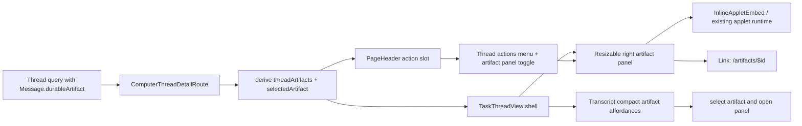

# Computer Artifact Side Panel

## Overview

Move generated app artifacts out of the thread transcript and into a Dust/Copilot-style right side panel in `apps/computer`. Threads should keep the conversational flow readable while still making artifacts immediately available through a header toggle, a compact transcript affordance, and the existing full-screen artifact route.

This is a layout and interaction change around the existing iframe/app artifact runtime. It should not replace the artifact data model, the applet sandbox, or the full-screen `/artifacts/$id` route.

---

## Problem Frame

Inline artifact rendering makes the thread feel heavy and fragile: a dashboard iframe can consume most of the transcript, collide with the fixed composer, and distract from the agent's written response. The user wants the artifact experience to feel closer to Dust: conversation in the main lane, artifact preview in a right panel, full-screen available when needed.

The current implementation already has the hard parts: `Message.durableArtifact` is mapped into `TaskThreadMessage`, `GeneratedArtifactCard` knows how to classify app artifacts, `InlineAppletEmbed` mounts the sandboxed applet, and `artifacts.$id.tsx` provides a full-screen route. The plan should reuse those pieces and change where the artifact preview lives.

---

## Requirements Trace

- R1. Generated artifacts no longer render as large inline iframes inside assistant transcript messages.
- R2. Threads with at least one artifact expose an "open right side panel" header button to the right of the existing thread `...` menu.
- R3. The artifact panel opens at 500px wide on desktop and can be resized with a visible drag handle.
- R4. The panel displays the selected artifact using the existing artifact/app runtime and includes a full-screen link to `/artifacts/$id`.
- R5. The header artifact button is hidden when the current thread has no artifacts.
- R6. Transcript messages with artifacts retain a compact, discoverable artifact affordance that can open/select the artifact in the side panel.
- R7. Full-screen artifact behavior, sandbox isolation, applet loading, and artifact deletion/pinning surfaces remain unchanged unless explicitly touched by the panel integration.
- R8. The implementation must work for regular chats and space threads because both render through the computer thread detail stack.

---

## Scope Boundaries

- Do not adopt CopilotKit, AG-UI, Vercel AI Elements Canvas, or Dust code for this change.
- Do not rewrite the generated artifact substrate from iframe/app artifacts to HTML/component artifacts.
- Do not change artifact persistence, GraphQL artifact schema, thread-message schema, or applet generation.
- Do not add Dust-style export/share controls in this iteration.
- Do not remove the existing full-screen artifact route.
- Do not build a multi-artifact gallery beyond what is needed to select among artifacts already attached to the current thread.

### Deferred to Follow-Up Work

- A richer artifact tray/gallery for threads with many generated artifacts.
- Persisting panel width per user or per thread if session-only width state is not enough.
- A future artifact substrate overhaul from generated TSX/app iframe toward the HTML artifact direction described in `docs/brainstorms/2026-05-12-computer-html-artifact-substrate-requirements.md`.

---

## Context & Research

### Relevant Code and Patterns

- `apps/computer/src/components/computer/ComputerThreadDetailRoute.tsx` owns the thread detail data flow, maps `durableArtifact` into `TaskThread`, and composes `usePageHeaderActions` with `ThreadDetailActions`.
- `apps/computer/src/components/computer/TaskThreadView.tsx` renders transcript messages and currently embeds `GeneratedArtifactCard` inline when `message.durableArtifact` is present.
- `apps/computer/src/components/computer/GeneratedArtifactCard.tsx` classifies app artifacts and currently embeds `InlineAppletEmbed` inside `GeneratedAppArtifactShell`.
- `apps/computer/src/components/computer/ThreadDetailActions.tsx` owns the existing `...` menu. The side-panel toggle should compose next to it instead of being hidden inside the menu.
- `apps/computer/src/components/AppTopBar.tsx` renders the `PageHeaderContext` action slot on the far right of the header.
- `apps/computer/src/routes/_authed/_shell/artifacts.$id.tsx` is the existing full-screen applet route and should remain the full-screen destination.
- `apps/computer/src/components/apps/InlineAppletEmbed.tsx`, `apps/computer/src/applets/mount.tsx`, and `apps/computer/src/applets/iframe-controller.ts` are the existing sandbox/app mount path.
- `packages/ui/src/components/ui/sheet.tsx` and `packages/ui/src/components/ui/resizable.tsx` already expose ShadCN-compatible `Sheet`, `ResizablePanelGroup`, `ResizablePanel`, and `ResizableHandle` primitives.

### Institutional Learnings

- `docs/solutions/architecture-patterns/ai-elements-iframe-canvas-foundation-decision-2026-05-10.md`: keep generic generated dashboards as saved app artifacts behind ThinkWork's iframe/app artifact runtime; AI Elements can provide chat composition without owning the generated app surface.
- `docs/solutions/architecture-patterns/copilotkit-agui-computer-spike-verdict-2026-05-10.md`: CopilotKit/AG-UI remains a reference for interaction patterns, but the active implementation should keep ThinkWork-owned artifact/runtime boundaries.
- `docs/solutions/design-patterns/ai-elements-vendor-extend-composability-gap-2026-05-13.md`: when local AI Elements/ShadCN primitives need extra slots, extend local source cleanly rather than layering brittle overlays.
- `docs/solutions/workflow-issues/survey-before-applying-parent-plan-destructive-work-2026-04-24.md`: artifact consumers are live and cross-cutting; avoid destructive artifact-model changes for a UI-only panel iteration.

### External References

- None. Local product screenshots plus existing ThinkWork/Dust-inspired direction are enough; external framework docs would add little because the repo already vendors the needed ShadCN primitives.

---

## Key Technical Decisions

- Keep the side panel in the thread route/layout, not inside individual messages: the panel is a page-level companion to the thread, so it should be owned near `ComputerThreadDetailRoute` and `TaskThreadView` rather than remounting per transcript segment.
- Use existing `InlineAppletEmbed` for app artifacts in the panel: this preserves the sandbox boundary and avoids forking the artifact renderer.
- Convert `GeneratedArtifactCard` into a compact transcript affordance or split it into compact/full variants: the transcript needs a trigger, while the panel needs the embedded preview.
- Compose the artifact panel toggle beside `ThreadDetailActions`: this directly satisfies the user's "right of the ... dropdown" request and keeps thread management actions separate from artifact viewing.
- Prefer `ResizablePanelGroup` for desktop and `Sheet` semantics only where they fit: the requested UI is a persistent right panel with a drag handle. A modal sheet is useful as a mobile/narrow fallback, but a desktop panel should participate in layout rather than overlaying the transcript.
- Select the latest thread artifact by default: this matches the common case where the agent's most recent artifact is the one the user wants to inspect. Compact transcript affordances can select older artifacts.

---

## Open Questions

### Resolved During Planning

- Should this replace the artifact runtime? No. The current iframe/app artifact foundation remains the chosen runtime boundary.
- Should the panel button appear for every thread? No. It appears only when the current thread has at least one artifact.
- Should inline artifact cards disappear completely? The large inline embed should disappear; a compact artifact row/card should remain so users can discover and select artifacts at the point they were created.

### Deferred to Implementation

- Exact mobile behavior: implementers should choose the smallest responsive behavior that avoids broken layout, likely an overlay `Sheet` or full-width panel below the header on narrow screens.
- Width persistence: start with local component state unless implementation finds an existing route/UI preference persistence pattern that is cheap to reuse.
- Multi-artifact selection UI density: keep it minimal for v1; if the current thread has several artifacts, a simple title selector/list in the panel header is enough.

---

## High-Level Technical Design

> This illustrates the intended approach and is directional guidance for review, not implementation specification. The implementing agent should treat it as context, not code to reproduce.

---

## Implementation Units

- U1. **Derive Thread Artifact State**

**Goal:** Give the thread detail route a stable model for "artifacts attached to this thread", selected artifact, and panel-open state.

**Requirements:** R2, R4, R5, R8

**Dependencies:** None

**Files:**

- Modify: `apps/computer/src/components/computer/ComputerThreadDetailRoute.tsx`
- Modify: `apps/computer/src/components/computer/TaskThreadView.tsx`
- Test: `apps/computer/src/components/computer/ComputerThreadDetailRoute.test.tsx`
- Test: `apps/computer/src/components/computer/TaskThreadView.test.tsx`

**Approach:**

- Derive `threadArtifacts` from `visibleThread.messages[*].durableArtifact`, preserving message order and deduplicating by artifact id.
- Choose the latest artifact as the default selected artifact.
- Keep selected artifact and panel-open state in the route or immediate thread layout owner so header actions and transcript affordances can both drive it.
- Ensure optimistic user turns without artifacts do not clear the selected artifact unnecessarily.

**Patterns to follow:**

- Existing `attachedArtifacts` derivation in `ComputerThreadDetailRoute.tsx`.
- Existing `usePageHeaderActions` composition in `ComputerThreadDetailRoute.tsx`.

**Test scenarios:**

- Happy path: thread with one assistant message artifact derives one thread artifact and shows the header toggle.
- Happy path: thread with multiple artifact messages defaults to the newest artifact.
- Edge case: duplicated artifact ids across messages appear once.
- Edge case: thread with no artifacts does not show the panel toggle.
- Integration: a subscription-triggered thread query refresh that adds an artifact makes the toggle appear without losing existing thread content.

**Verification:**

- The route has a single source of truth for selected artifact and panel-open state.

---

- U2. **Replace Inline Artifact Embed With Compact Transcript Affordance**

**Goal:** Remove large inline iframes from transcript messages while preserving a clear artifact marker where the artifact was created.

**Requirements:** R1, R6, R7

**Dependencies:** U1

**Files:**

- Modify: `apps/computer/src/components/computer/GeneratedArtifactCard.tsx`
- Modify: `apps/computer/src/components/computer/TaskThreadView.tsx`
- Test: `apps/computer/src/components/computer/GeneratedArtifactCard.test.tsx`
- Test: `apps/computer/src/components/computer/TaskThreadView.test.tsx`

**Approach:**

- Split the current artifact UI into a compact transcript trigger and an embedded preview renderer, or introduce a mode prop that makes the transcript render compactly.
- The compact affordance should show title, type/badge, optional summary, and an action that opens/selects the artifact in the side panel.
- Preserve a full-screen link for non-panel fallback, but make the primary action the panel selection when the thread view provides an `onOpenArtifact` callback.
- Non-app artifacts can keep a compact "preview unavailable" state until broader artifact types are supported in the panel.

**Patterns to follow:**

- Existing `GeneratedArtifactCard` title/type/summary rendering.
- Existing `Button asChild` + TanStack `Link` pattern for full-screen artifact links.

**Test scenarios:**

- Happy path: artifact message renders a compact artifact card, not `InlineAppletEmbed`.
- Happy path: clicking the compact card/action calls the panel-open callback with the artifact id.
- Edge case: without a callback, the compact card still exposes a full-screen link.
- Edge case: non-app artifact renders compact metadata without an iframe.

**Verification:**

- No transcript test fixture renders a large artifact iframe/card inline.

---

- U3. **Build Resizable Artifact Side Panel**

**Goal:** Add a reusable right-side artifact panel that starts at 500px wide, can be resized, and uses the existing applet renderer.

**Requirements:** R3, R4, R7

**Dependencies:** U1

**Files:**

- Create: `apps/computer/src/components/computer/ThreadArtifactPanel.tsx`
- Modify: `apps/computer/src/components/computer/GeneratedArtifactCard.tsx`
- Test: `apps/computer/src/components/computer/ThreadArtifactPanel.test.tsx`
- Test: `apps/computer/src/components/apps/InlineAppletEmbed.test.tsx`

**Approach:**

- Render the selected artifact in a right panel with a header containing title, artifact type label, close button, and full-screen link.
- For app artifacts, use `GeneratedAppArtifactShell` plus `InlineAppletEmbed` or an extracted preview renderer from `GeneratedArtifactCard`.
- Use `ResizablePanelGroup`, `ResizablePanel`, and `ResizableHandle` for the desktop layout with an initial width equivalent to 500px.
- Clamp panel width to keep both transcript and panel usable on common desktop widths.
- Use `Sheet` or a simple overlay fallback for narrow viewports if the resizable layout cannot fit cleanly.

**Patterns to follow:**

- `packages/ui/src/components/ui/resizable.tsx` for drag handle behavior.
- `apps/computer/src/routes/_authed/_shell/artifacts.$id.tsx` for applet loading/failure conventions.
- `apps/computer/src/components/apps/GeneratedAppArtifactShell.tsx` for app artifact framing.

**Test scenarios:**

- Happy path: selected app artifact renders `InlineAppletEmbed` in the panel.
- Happy path: "Open full" links to `/artifacts/$id`.
- Happy path: close button hides the panel but keeps the selected artifact in state.
- Edge case: selected artifact is null while panel is open; panel closes or renders an empty state without crashing.
- Edge case: non-app artifact renders metadata and a full-screen link without attempting applet mount.
- Integration: resize handle is present and keyboard/focus accessible through the ShadCN primitive.

**Verification:**

- The panel opens at the intended default desktop width and can be resized without shifting the composer into unusable space.

---

- U4. **Add Header Toggle Beside Thread Actions**

**Goal:** Add the requested header control to open the artifact side panel, positioned to the right of the existing `...` thread actions menu.

**Requirements:** R2, R5

**Dependencies:** U1, U3

**Files:**

- Modify: `apps/computer/src/components/computer/ComputerThreadDetailRoute.tsx`
- Modify: `apps/computer/src/components/AppTopBar.tsx`
- Test: `apps/computer/src/components/computer/ComputerThreadDetailRoute.test.tsx`
- Test: `apps/computer/src/components/computer/ThreadDetailActions.test.tsx`

**Approach:**

- Compose the existing created-at label, `ThreadDetailActions`, and new artifact-panel toggle in the route's page-header action.
- Place the toggle after `ThreadDetailActions` so it appears to the right of the `...` dropdown.
- Use an icon-only button with accessible label and active/open state styling.
- Hide the toggle entirely when `threadArtifacts.length === 0`.
- Only modify `AppTopBar` if the current single action slot prevents correct ordering or spacing.

**Patterns to follow:**

- Existing `usePageHeaderActions` `actionKey` strategy in `ComputerThreadDetailRoute.tsx`.
- Existing icon button patterns in `ThreadDetailActions.tsx` and `AppTopBar.tsx`.

**Test scenarios:**

- Happy path: a thread with an artifact renders the artifact panel toggle after the `Thread actions` trigger.
- Happy path: clicking the toggle opens the panel with the selected artifact.
- Edge case: a thread without artifacts has no artifact panel toggle.
- Edge case: deleting/archive actions in the `...` menu still work with the adjacent toggle present.

**Verification:**

- Header action ordering matches the screenshot intent: timestamp, `...`, artifact side-panel button.

---

- U5. **Integrate Panel Layout With Thread View**

**Goal:** Make the thread transcript, composer, and artifact panel coexist cleanly without overlap or broken scrolling.

**Requirements:** R1, R3, R4, R6, R8

**Dependencies:** U2, U3, U4

**Files:**

- Modify: `apps/computer/src/components/computer/TaskThreadView.tsx`
- Modify: `apps/computer/src/components/computer/ComputerThreadDetailRoute.tsx`
- Modify: `apps/computer/src/components/spaces/SpaceThreadRoom.tsx` if it bypasses the shared thread detail layout for any space-thread path
- Test: `apps/computer/src/components/computer/TaskThreadView.test.tsx`
- Test: `apps/computer/src/components/computer/ComputerThreadDetailRoute.test.tsx`
- Test: `apps/computer/src/components/spaces/ThreadComposer.test.tsx`

**Approach:**

- Let the thread detail route pass panel props into `TaskThreadView`, or wrap `TaskThreadView` with a layout component that owns the resizable panel.
- Keep the composer anchored within the main transcript lane; the panel should not sit underneath or behind the composer.
- Ensure transcript scrolling remains independent from artifact panel scrolling.
- Confirm regular chats and space threads hit the same shared integration path after the current space-routing fixes.

**Patterns to follow:**

- Current `TaskThreadView` composer anchoring and transcript scroll behavior.
- Current space-thread route reuse of `ComputerThreadDetailRoute` or `SpaceThreadRoom`.

**Test scenarios:**

- Happy path: opening the panel does not hide or overlap the follow-up composer.
- Happy path: selecting an artifact from a transcript compact card updates the panel preview.
- Edge case: panel remains closed by default on a thread with artifacts until the user opens it, unless implementation chooses to auto-open only immediately after artifact creation.
- Edge case: navigating from one thread to another resets selected artifact to the new thread's latest artifact.
- Integration: a thread opened from a space sidebar can display its artifact panel the same way as a generic chat thread.

**Verification:**

- Browser verification on `localhost:5174` shows transcript, composer, and side panel all usable at desktop width.

---

- U6. **Visual, Accessibility, and Regression Verification**

**Goal:** Lock down the behavior with targeted tests and a manual browser pass against the live dev server.

**Requirements:** R1, R2, R3, R4, R5, R6, R7, R8

**Dependencies:** U1, U2, U3, U4, U5

**Files:**

- Modify: `apps/computer/src/components/computer/TaskThreadView.test.tsx`
- Modify: `apps/computer/src/components/computer/ComputerThreadDetailRoute.test.tsx`
- Modify: `apps/computer/src/components/computer/GeneratedArtifactCard.test.tsx`
- Create or modify: `apps/computer/src/components/computer/ThreadArtifactPanel.test.tsx`

**Approach:**

- Add regression coverage for "artifact exists but no inline iframe".
- Add header visibility/order coverage for artifact and no-artifact threads.
- Add panel open/close/select/full-screen-link coverage.
- Use browser verification after unit tests because this is layout-sensitive and the iframe sandbox requires visual confirmation.

**Patterns to follow:**

- Existing Vitest + React Testing Library patterns in `apps/computer/src/components/computer/*.test.tsx`.
- Existing artifact route tests in `apps/computer/src/routes/_authed/_shell/-artifacts.$id.test.tsx`.

**Test scenarios:**

- Happy path: generated app artifact opens in the panel and renders a loading/mounted applet area.
- Happy path: header toggle appears only when `durableArtifact` data exists.
- Error path: applet load failure renders the existing failure UI in the panel instead of a blank rectangle.
- Integration: full-screen link opens the existing artifact route and does not depend on panel state.
- Visual: at a desktop viewport, the panel starts around 500px, the drag handle is visible, and the transcript/composer remain readable.

**Verification:**

- Unit tests pass for touched computer components.
- `apps/computer` typecheck passes.
- Browser smoke confirms the Dust-style layout on `localhost:5174`.

---

## System-Wide Impact

- **Interaction graph:** `ComputerThreadDetailRoute` becomes the state bridge between header actions, transcript artifact affordances, and the right panel. `TaskThreadView` remains the transcript/composer renderer but gains panel-aware callbacks or layout props.
- **Error propagation:** Artifact/app iframe load errors should continue to surface through existing applet failure/loading UI; the panel must not swallow them or convert them into blank space.
- **State lifecycle risks:** Navigating between threads, receiving subscription updates, or deleting artifacts can leave stale selected ids unless state is derived carefully from current thread artifacts.
- **API surface parity:** No GraphQL/API changes are expected. Mobile and admin are unchanged.
- **Integration coverage:** Unit tests can prove state and rendering decisions, but browser verification is required for the panel resize, composer overlap, and iframe mount behavior.
- **Unchanged invariants:** App artifacts remain sandboxed, full-screen artifacts remain routed through `/artifacts/$id`, and artifact deletion remains owned by existing artifact/thread action surfaces.

---

## Risks & Dependencies

| Risk                                                                          | Mitigation                                                                                                                               |
| ----------------------------------------------------------------------------- | ---------------------------------------------------------------------------------------------------------------------------------------- |
| Panel and composer overlap on smaller screens                                 | Use a desktop resizable panel with a narrow-screen fallback; include browser verification at desktop and at one constrained width.       |
| Reusing `InlineAppletEmbed` in two places creates duplicate mount assumptions | Remove inline transcript embedding so the panel is the only thread-local preview mount; full-screen route remains separate.              |
| Thread header action slot becomes too crowded                                 | Keep the artifact toggle icon-only, hide it for no-artifact threads, and modify `AppTopBar` only if necessary.                           |
| Multiple artifacts make selection ambiguous                                   | Default to latest artifact and let compact transcript affordances select older artifacts. Defer full gallery polish.                     |
| Local dev artifact rendering appears broken if iframe shell is not running    | Document in verification notes that local applet preview depends on the iframe shell dev server or the configured sandbox iframe source. |

---

## Documentation / Operational Notes

- No user-facing docs are required for this first UI iteration.
- PR description should call out that this is a thread UI presentation change, not an artifact runtime or schema change.
- Local visual verification should include the user app dev server and iframe shell dev server because the panel reuses `InlineAppletEmbed`.

---

## Sources & References

- User request: Dust/Copilot-style artifact side panel with 500px resizable right panel, header toggle, and full-screen link.
- Related code: `apps/computer/src/components/computer/ComputerThreadDetailRoute.tsx`
- Related code: `apps/computer/src/components/computer/TaskThreadView.tsx`
- Related code: `apps/computer/src/components/computer/GeneratedArtifactCard.tsx`
- Related code: `apps/computer/src/components/computer/ThreadDetailActions.tsx`
- Related code: `apps/computer/src/components/AppTopBar.tsx`
- Related code: `apps/computer/src/routes/_authed/_shell/artifacts.$id.tsx`
- Related code: `packages/ui/src/components/ui/resizable.tsx`
- Related code: `packages/ui/src/components/ui/sheet.tsx`
- Institutional learning: `docs/solutions/architecture-patterns/ai-elements-iframe-canvas-foundation-decision-2026-05-10.md`
- Institutional learning: `docs/solutions/architecture-patterns/copilotkit-agui-computer-spike-verdict-2026-05-10.md`
- Institutional learning: `docs/solutions/design-patterns/ai-elements-vendor-extend-composability-gap-2026-05-13.md`
