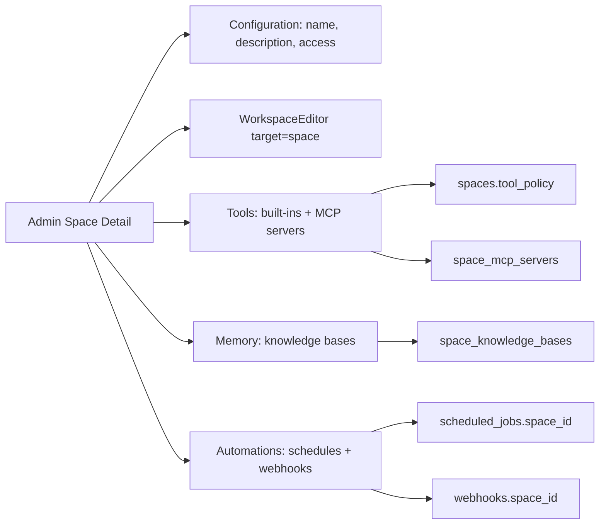

# feat: Simplify admin Space Studio

## Overview

This plan reshapes the admin Spaces surface around the current product model: Spaces are contextual workrooms, not database rows or workflow templates. The visible admin work is mostly UI simplification, but three tabs require durable API/data support: Space-selected knowledge bases, Space-selected built-in tools and MCP servers, and Space-scoped scheduled jobs/webhooks.

The implementation should land as a focused admin/API/schema change. It should not remove old Space database fields in the same PR unless an explicit caller audit proves they are dead. That follows the repo convention in `docs/solutions/conventions/admin-trim-ui-preserve-backend-mutations-2026-05-13.md`.

---

## Problem Frame

The current admin Spaces UI still leaks earlier implementation concepts: list columns for kind/config counts, separate Connected Data / Tools / MCP tabs, raw JSON panels, slug/category/status metadata, and workflow-era trigger fields. The origin document defines the target operator experience: a compact Space Studio with Configuration, Workspace, Tools, Memory, and Automations (see origin: `docs/brainstorms/2026-05-21-admin-space-studio-simplification-requirements.md`).

---

## Requirements Trace

- R1. "Skills and Tools" becomes "Tools" everywhere user-visible in the admin app.
- R2. The Tools navigation icon changes to Lucide `PocketKnife`.
- R3. The Spaces list page removes its subtitle.
- R4. The Spaces table shows only Space, Access, Status, and Updated.
- R5. Space detail tabs appear in the order Configuration, Workspace, Tools, Memory, Automations.
- R6. The base Space detail route opens Configuration by default.
- R7. Configuration shows only name, description, and access.
- R8. Memory is knowledge bases only with a multi-select control.
- R9. Memory does not expose other memory resource types.
- R10. Tools is one page with built-in tool and MCP server multi-select groups.
- R11. Automations is a unified Space-scoped table for scheduled automations and webhooks.
- R12. The Automations table distinguishes rows by Type and shares common status/run columns.
- R13. Space automations are framed around Space outcomes.
- R14. Product-obsolete Space fields stop being first-class admin concepts, with backend removal gated by audit.
- R15. Slug/internal identifiers stay internal-only when still needed.

**Origin actors:** A1 tenant admin, A2 agent runtime / context renderer, A3 planner / implementer.

**Origin flows:** F1 configure a Space, F2 attach context to a Space, F3 review Space automations.

**Origin acceptance examples:** AE1 global Tools label/icon, AE2 simplified Spaces list, AE3 Configuration default and metadata removal, AE4 KB-only Memory, AE5 combined Tools page, AE6 unified Space Automations table.

---

## Scope Boundaries

- No end-user Spaces app changes.
- No generalized memory resource model beyond knowledge bases.
- No new automation builder UX beyond filtering/showing Space-scoped scheduled jobs and webhooks.
- No LastMile checklist/customer-onboarding workflow revival.
- No raw JSON editor or advanced policy inspector in the default Space detail UI.
- No same-pass deletion of old Space schema/API fields unless the implementation includes a concrete caller audit proving they are unused.

### Deferred to Follow-Up Work

- Database field removal for legacy Space concepts: create a separate backend audit/migration PR after this UI/API work lands.
- Broader runtime consumption of Space knowledge/tools/automations: this plan exposes clean configuration surfaces; effective turn composition remains governed by the larger Spaces rearchitecture plan.

---

## Context & Research

### Relevant Code and Patterns

- `apps/admin/src/components/Sidebar.tsx` owns the sidebar label/icon currently using `Puzzle` and "Skills and Tools".
- `apps/admin/src/routes/_authed/_tenant/capabilities.tsx` and child capability routes own the page heading and breadcrumbs that still say "Skills and Tools".
- `apps/admin/src/routes/_authed/_tenant/spaces/index.tsx` currently builds list rows with kind, agent count, MCP count, tool policy count, and connected data count, and routes clicks to `/spaces/$spaceId/workspace`.
- `apps/admin/src/components/spaces/SpaceDetailChrome.tsx` currently owns Space detail loading, tab navigation, save behavior, and panels. It already uses `WorkspaceEditor` with `target={{ spaceId }}` for Workspace.
- `apps/admin/src/routes/_authed/_tenant/spaces/-spaces-admin-route.test.ts` is a source-level route contract test that should be rewritten to assert the new routes, tabs, columns, and query fields.
- `apps/admin/src/components/ui/multi-select.tsx` is an existing MultiSelect component and should be reused for Memory and Tools.
- `packages/database-pg/src/schema/knowledge-bases.ts` has `knowledge_bases` and `agent_knowledge_bases`; no Space-to-KB table exists yet.
- `packages/database-pg/src/schema/mcp-servers.ts` already has `space_mcp_servers`, and `packages/api/src/graphql/resolvers/spaces/types.ts` already resolves `Space.mcpServers`.
- `packages/database-pg/src/schema/scheduled-jobs.ts` and `packages/database-pg/src/schema/webhooks.ts` do not currently have direct `space_id` fields.
- `packages/api/src/handlers/scheduled-jobs.ts` and `packages/api/src/handlers/webhooks-admin.ts` power the existing admin schedules/webhooks pages through REST-style endpoints. GraphQL resolvers for scheduled jobs and webhooks also exist and should keep parity.

### Institutional Learnings

- `docs/solutions/conventions/admin-trim-ui-preserve-backend-mutations-2026-05-13.md`: trim UI first and audit backend deletion separately. This directly applies to hiding Space fields from Configuration.
- `docs/solutions/architecture-patterns/workspace-skills-load-from-copied-agent-workspace-2026-04-28.md`: built-in tools must not be disguised as editable workspace skills. The Tools tab should keep built-in tools distinct from Workspace files.
- `docs/solutions/design-patterns/audit-existing-ui-and-data-model-before-parallel-build-2026-04-28.md`: reuse existing operator table/list patterns before building parallel surfaces. The Space Automations tab should normalize scheduled jobs and webhooks into one local table rather than inventing a new automation substrate.

### External References

- Not used. The repo already contains the relevant admin, GraphQL, schema, and component patterns.

---

## Key Technical Decisions

- Use a dedicated `space_knowledge_bases` join table rather than hiding KB ids inside `spaces.config` or `context_config`. This mirrors `agent_knowledge_bases`, keeps selections queryable, and avoids raw JSON policy editing.
- Add a Space tools mutation that updates built-in tool slugs and Space MCP server assignments together. Built-in tool selection can continue to store normalized slugs in `spaces.tool_policy`; MCP assignments should use the existing `space_mcp_servers` table.
- Add nullable `space_id` columns to both `scheduled_jobs` and `webhooks`. This is the lowest-ceremony way to filter existing automation surfaces by Space while preserving existing global automations, but it must also flow into runtime dispatch so Space automations create or resume Space-scoped work.
- Reuse the existing admin MultiSelect component. Do not add a new selector primitive unless implementation finds it cannot support grouped options or needed accessibility.
- Do not delete legacy Space fields in this implementation. Hide them from the UI and reduce admin GraphQL query selections where no longer needed; leave schema cleanup as a follow-up audit.

---

## Open Questions

### Resolved During Planning

- Space KB storage: use a dedicated Space-to-KB association, not JSON config.
- Built-in tools API shape: create a Space-specific mutation/query shape so the UI does not edit raw `toolPolicy` JSON.
- Automations Space scoping: use direct nullable `space_id` fields on scheduled jobs and webhooks instead of creating a new automation target model.
- Automation runtime propagation: scheduled job dispatch should use the persisted Space id as source of truth when creating wakeups or threads, and webhook dispatch should pass the Space id into agent thread creation.
- Space field removal: defer backend deletion to a dedicated audit PR.

### Deferred to Implementation

- Exact built-in tool policy JSON shape: implementation should inspect current `listBuiltinTools` and runtime policy readers before choosing the persisted format.
- Route file naming after tab changes: TanStack file-route names should follow existing generator conventions; update generated route tree after files are added/removed.
- Whether the Space Automations tab fetches through REST helpers or GraphQL queries: choose the path that gives the smallest parity burden, but keep filters available in both surfaces when the underlying schema supports them.

---

## High-Level Technical Design

> _This illustrates the intended approach and is directional guidance for review, not implementation specification. The implementing agent should treat it as context, not code to reproduce._

---

## Implementation Units

- U1. **Rename global capabilities surface to Tools**

**Goal:** Make the admin navigation and capabilities page read as "Tools" with the `PocketKnife` icon.

**Requirements:** R1, R2, AE1.

**Dependencies:** None.

**Files:**

- Modify: `apps/admin/src/components/Sidebar.tsx`
- Modify: `apps/admin/src/routes/_authed/_tenant/capabilities.tsx`
- Modify: `apps/admin/src/routes/_authed/_tenant/capabilities/builtin-tools.tsx`
- Modify: `apps/admin/src/routes/_authed/_tenant/capabilities/mcp-servers.tsx`
- Modify: `apps/admin/src/routes/_authed/_tenant/capabilities/skills/index.tsx`
- Modify: `apps/admin/src/routes/_authed/_tenant/capabilities/skills/$slug.tsx`
- Modify: `apps/admin/src/routes/_authed/_tenant/capabilities/skills/builder.tsx`
- Modify: `apps/admin/src/routes/_authed/_tenant/capabilities/plugins/index.tsx`
- Modify: `apps/admin/src/routes/_authed/_tenant/capabilities/plugins/$uploadId.tsx`
- Test: `apps/admin/src/routes/_authed/_tenant/-ontology-route.test.tsx`
- Test: `apps/admin/src/routes/_authed/_tenant/capabilities/__tests__/-CapabilitiesLayout.target.test.ts`

**Approach:**

- Replace user-visible "Skills and Tools" labels and breadcrumbs with "Tools".
- Change the sidebar icon import from `Puzzle` to Lucide `PocketKnife`.
- Keep route paths under `/capabilities` unchanged. The request is label/icon only; route renames would expand scope and break links.

**Patterns to follow:**

- Sidebar item patterns in `apps/admin/src/components/Sidebar.tsx`.
- Existing source-level route tests in `apps/admin/src/routes/_authed/_tenant/capabilities/__tests__/-CapabilitiesLayout.target.test.ts`.

**Test scenarios:**

- Covers AE1. Happy path: sidebar source renders `PocketKnife` and `label: "Tools"` for `/capabilities`.
- Happy path: capabilities page heading is "Tools" and child route breadcrumbs reference "Tools".
- Edge case: `/capabilities/skills` route remains reachable even though the parent label is now Tools.

**Verification:**

- No user-visible "Skills and Tools" text remains under tracked admin source except intentional historical docs or tests updated to assert absence.

---

- U2. **Simplify Spaces list and detail route structure**

**Goal:** Reshape the existing Space Studio routes and chrome around the target tabs and list columns.

**Requirements:** R3, R4, R5, R6, R7, R14, R15, F1, AE2, AE3.

**Dependencies:** U1 can land independently; no hard dependency.

**Files:**

- Modify: `apps/admin/src/routes/_authed/_tenant/spaces/index.tsx`
- Modify: `apps/admin/src/routes/_authed/_tenant/spaces/$spaceId.tsx`
- Rename/modify: `apps/admin/src/routes/_authed/_tenant/spaces/$spaceId_.settings.tsx`
- Keep/modify: `apps/admin/src/routes/_authed/_tenant/spaces/$spaceId_.workspace.tsx`
- Delete or retire route file: `apps/admin/src/routes/_authed/_tenant/spaces/$spaceId_.connected-data.tsx`
- Delete or retire route file: `apps/admin/src/routes/_authed/_tenant/spaces/$spaceId_.mcp.tsx`
- Modify: `apps/admin/src/components/spaces/SpaceDetailChrome.tsx`
- Modify: `apps/admin/src/lib/graphql-queries.ts`
- Regenerate: `apps/admin/src/gql/graphql.ts`
- Regenerate: `apps/admin/src/routeTree.gen.ts`
- Test: `apps/admin/src/routes/_authed/_tenant/spaces/-spaces-admin-route.test.ts`

**Approach:**

- Replace the list page description with no subtitle.
- Remove row fields and column definitions for kind, agent count, MCP count, tool count, and connected data count.
- Change list row navigation and create-success navigation to `/spaces/$spaceId/configuration`.
- Make `/spaces/$spaceId` redirect to Configuration instead of Workspace.
- Rename the current Settings concept to Configuration and strip all internal metadata and JSON panels from the visible panel.
- Keep save behavior for name, description, and access mode.
- Reduce Space admin GraphQL selections where the list/configuration no longer needs old fields, but do not remove backend fields from schema.

**Execution note:** Treat this as UI trim first. Do not delete backend mutations or schema fields in the same pass without a separate caller audit.

**Patterns to follow:**

- Current `SpaceDetailChrome` save flow and `UpdateSpaceMutation`.
- `docs/solutions/conventions/admin-trim-ui-preserve-backend-mutations-2026-05-13.md`.

**Test scenarios:**

- Covers AE2. Happy path: Spaces list source contains headers Space, Access, Status, Updated and does not contain headers Kind, Agents, MCP, Tools, Connected Data.
- Covers AE3. Happy path: base detail route redirects to `/spaces/$spaceId/configuration`.
- Covers AE3. Happy path: detail chrome tabs appear in order Configuration, Workspace, Tools, Memory, Automations.
- Covers AE3. Edge case: Configuration panel does not render slug, category/kind, status metadata, created timestamp, raw config, context config, connected data config, agent availability, trigger config, or render diagnostics strings.
- Integration: regenerated route tree imports the new configuration/memory/automations routes and no longer imports retired connected-data/mcp routes.

**Verification:**

- Space list and detail route tests encode the new IA.
- Generated GraphQL and route tree stay consistent with route/query changes.

---

- U3. **Add Space knowledge-base selection contract**

**Goal:** Make Space Memory a KB-only multi-select backed by a queryable Space-to-KB association.

**Requirements:** R8, R9, F2, AE4.

**Dependencies:** U2 route structure should exist before the Memory tab is wired into navigation.

**Files:**

- Modify: `packages/database-pg/src/schema/knowledge-bases.ts`
- Modify: `packages/database-pg/src/schema/index.ts`
- Add: `packages/database-pg/drizzle/NNNN_space_knowledge_bases.sql`
- Modify: `packages/database-pg/graphql/types/knowledge-bases.graphql`
- Modify: `packages/database-pg/graphql/types/spaces.graphql`
- Add: `packages/api/src/graphql/resolvers/spaces/setSpaceKnowledgeBases.mutation.ts`
- Modify: `packages/api/src/graphql/resolvers/spaces/types.ts`
- Modify: `packages/api/src/graphql/resolvers/spaces/index.ts`
- Test: `packages/api/src/graphql/resolvers/spaces/setSpaceKnowledgeBases.mutation.test.ts`
- Test: `packages/api/src/graphql/resolvers/spaces/types.test.ts`
- Modify: `apps/admin/src/lib/graphql-queries.ts`
- Add: `apps/admin/src/routes/_authed/_tenant/spaces/$spaceId_.memory.tsx`
- Modify: `apps/admin/src/components/spaces/SpaceDetailChrome.tsx`
- Regenerate: `apps/admin/src/gql/graphql.ts`
- Regenerate: `terraform/schema.graphql`
- Test: `apps/admin/src/routes/_authed/_tenant/spaces/-spaces-admin-route.test.ts`

**Approach:**

- Add `space_knowledge_bases` as a join table analogous to `agent_knowledge_bases`, with `tenant_id`, `space_id`, `knowledge_base_id`, `enabled`, and optional `search_config`.
- Expose `Space.knowledgeBases` and a `setSpaceKnowledgeBases` mutation.
- Validate that every requested KB belongs to the same tenant as the Space before replacing assignments.
- Reuse `KnowledgeBasesListQuery` for available options and the existing `MultiSelect` component for selection.
- Keep Memory tab copy and layout focused on selected KBs only; do not add Hindsight/wiki/source context affordances.

**Patterns to follow:**

- `packages/database-pg/src/schema/knowledge-bases.ts` for agent-to-KB association shape.
- `packages/api/src/graphql/resolvers/knowledge/setAgentKnowledgeBases.mutation.ts` for replace-all assignment semantics.
- `apps/admin/src/components/ui/multi-select.tsx` for multi-select behavior.

**Test scenarios:**

- Covers AE4. Happy path: selecting two tenant KBs replaces the Space's KB assignments and the detail query returns both.
- Edge case: selecting an empty list removes all Space KB assignments and leaves Memory in an empty selected state.
- Error path: selecting a KB from another tenant is rejected and does not create partial assignments.
- Integration: Space detail query resolves selected KB details (`id`, `name`, `status`) for the Memory tab without exposing other memory resource types.

**Verification:**

- GraphQL schema, API resolvers, admin query, and generated admin types all agree on Space KB assignment.

---

- U4. **Unify Space built-in tools and MCP selection**

**Goal:** Replace raw tool/MCP policy displays with one Tools page containing built-in tool and MCP server multi-select groups.

**Requirements:** R10, F2, AE5.

**Dependencies:** U2 route structure.

**Files:**

- Modify: `packages/database-pg/graphql/types/spaces.graphql`
- Add: `packages/api/src/graphql/resolvers/spaces/setSpaceTools.mutation.ts`
- Modify: `packages/api/src/graphql/resolvers/spaces/types.ts`
- Modify: `packages/api/src/graphql/resolvers/spaces/index.ts`
- Test: `packages/api/src/graphql/resolvers/spaces/setSpaceTools.mutation.test.ts`
- Test: `packages/api/src/graphql/resolvers/spaces/types.test.ts`
- Modify: `apps/admin/src/lib/graphql-queries.ts`
- Modify: `apps/admin/src/routes/_authed/_tenant/spaces/$spaceId_.tools.tsx`
- Modify: `apps/admin/src/components/spaces/SpaceDetailChrome.tsx`
- Regenerate: `apps/admin/src/gql/graphql.ts`
- Regenerate: `terraform/schema.graphql`
- Test: `apps/admin/src/routes/_authed/_tenant/spaces/-spaces-admin-route.test.ts`

**Approach:**

- Add a Space tools mutation that accepts built-in tool slugs and MCP server ids.
- Persist built-in tools through the existing Space tool-policy storage after normalizing to the runtime's current allowlist/enablement shape.
- Persist MCP server selection by upserting/deleting rows in `space_mcp_servers`.
- Validate MCP server ids belong to the tenant before writing.
- The admin UI should fetch available built-ins with `listBuiltinTools` and available MCP servers with the existing MCP admin API or GraphQL data already available to Space detail.
- Render two MultiSelect controls: Built-in Tools and MCP Servers. Show selected counts/status summaries, not raw JSON.

**Execution note:** Keep built-in tools distinct from workspace skills. Do not materialize built-in tools under Space workspace files or `workspace/skills`.

**Patterns to follow:**

- `apps/admin/src/lib/builtin-tools-api.ts` for built-in tool listing.
- `apps/admin/src/lib/mcp-api.ts` and `packages/database-pg/src/schema/mcp-servers.ts` for MCP server state.
- `docs/solutions/architecture-patterns/workspace-skills-load-from-copied-agent-workspace-2026-04-28.md` for built-in tool boundaries.

**Test scenarios:**

- Covers AE5. Happy path: selecting built-in tool slugs and MCP server ids saves both groups and the Space detail query reflects the selections.
- Edge case: selecting no MCP servers disables/removes all Space MCP assignments without affecting built-in tool selections.
- Error path: selecting an MCP server from another tenant is rejected without partial writes.
- Error path: selecting an unknown built-in tool slug is rejected or ignored consistently according to the chosen existing built-in tool validation pattern.
- Integration: Tools page source no longer renders "Tool Policy", "MCP Policy", or raw JSON panels.

**Verification:**

- Space Tools tab renders one page with two multi-select groups and no raw policy JSON.
- Existing global Built-in Tools and MCP Servers pages remain the resource creation/management surfaces.

---

- U5. **Scope scheduled jobs and webhooks to Spaces**

**Goal:** Add a minimal Space association to existing scheduled jobs and webhooks so a Space Automations tab can filter both resource types.

**Requirements:** R11, R12, R13, F3, AE6.

**Dependencies:** U2 route structure. U3/U4 are independent.

**Files:**

- Modify: `packages/database-pg/src/schema/scheduled-jobs.ts`
- Modify: `packages/database-pg/src/schema/webhooks.ts`
- Add: `packages/database-pg/drizzle/NNNN_space_automations.sql`
- Modify: `packages/database-pg/graphql/types/scheduled-jobs.graphql`
- Modify: `packages/database-pg/graphql/types/webhooks.graphql`
- Modify: `packages/api/src/graphql/resolvers/triggers/scheduledJobs.query.ts`
- Modify: `packages/api/src/graphql/resolvers/webhooks/webhooks.query.ts`
- Modify: `packages/api/src/handlers/scheduled-jobs.ts`
- Modify: `packages/api/src/handlers/webhooks-admin.ts`
- Modify: `packages/api/src/handlers/webhooks.ts`
- Modify: `packages/lambda/job-schedule-manager.ts`
- Modify: `packages/lambda/job-trigger.ts`
- Test: `packages/api/src/graphql/resolvers/triggers/scheduledJobs.query.test.ts`
- Test: `packages/api/src/graphql/resolvers/webhooks/webhooks.query.test.ts`
- Test: `packages/api/src/handlers/scheduled-jobs.computer-id.test.ts`
- Test: `packages/api/src/handlers/webhooks-admin.test.ts`
- Test: `packages/api/src/handlers/webhooks.space.test.ts`
- Test: `packages/lambda/__tests__/job-trigger.space-context.test.ts`
- Modify: `apps/admin/src/lib/graphql-queries.ts`
- Add: `apps/admin/src/routes/_authed/_tenant/spaces/$spaceId_.automations.tsx`
- Modify: `apps/admin/src/components/spaces/SpaceDetailChrome.tsx`
- Regenerate: `apps/admin/src/gql/graphql.ts`
- Regenerate: `terraform/schema.graphql`
- Test: `apps/admin/src/routes/_authed/_tenant/spaces/-spaces-admin-route.test.ts`

**Approach:**

- Add nullable `space_id` references to `scheduled_jobs` and `webhooks` with tenant/space indexes.
- Extend GraphQL query filters and REST list endpoints with optional `spaceId` / `space_id` filters.
- Include `spaceId` in GraphQL types and REST rows so the admin can distinguish global vs Space-specific entries.
- Extend create/update paths to accept an optional Space id and validate that the Space belongs to the same tenant before writing it.
- Propagate Space context through execution, not just listing. Scheduled jobs should either include `spaceId` in the EventBridge payload or have `job-trigger` load `scheduled_jobs.space_id` from the database and treat that as source of truth. Manual fire paths should use the same behavior.
- For agent-targeted webhooks, pass `spaceId` into `ensureThreadForWork` so webhook-created work lands in the Space. For routine-targeted webhooks, preserve Space context in the task/turn metadata path available to that flow if a direct column is not present.
- Build the Space Automations tab by fetching scheduled jobs and webhooks filtered to the current Space, normalizing both into a local row type.
- Use common columns: Name, Type, Schedule / Trigger, Status, Last Run, Next Run / Last Delivery.
- Do not implement new creation/editing UX here; row clicks can route to existing schedule/webhook detail pages.

**Patterns to follow:**

- Existing scheduled job list and run-state derivation in `apps/admin/src/routes/_authed/_tenant/automations/schedules/index.tsx`.
- Existing webhook list display in `apps/admin/src/routes/_authed/_tenant/automations/webhooks/index.tsx`.
- Existing tenant-scoped query auth and cross-tenant tests in webhook and scheduled job resolver tests.

**Test scenarios:**

- Covers AE6. Happy path: a Space with one scheduled job and one webhook returns both to the Space Automations tab as separate Type values.
- Happy path: global scheduled jobs/webhooks with null `space_id` remain visible in existing global Automations/Webhooks pages.
- Happy path: a Space-scoped scheduled job execution creates or resumes work with the Space id included in the wakeup/thread context.
- Happy path: a Space-scoped agent webhook calls `ensureThreadForWork` with the Space id.
- Edge case: filtering by a Space with no jobs/webhooks returns an empty table state.
- Error path: REST/GraphQL filters do not leak rows from another tenant's Space id.
- Integration: existing scheduled job and webhook detail routes continue to load rows with or without `space_id`.

**Verification:**

- Existing global automation pages still work.
- Space Automations tab shows only current-Space rows and shares the visual table language from global Automations.

---

- U6. **Codegen, schema build, and Space cleanup audit note**

**Goal:** Keep generated artifacts current and make the backend cleanup boundary explicit for follow-up work.

**Requirements:** R14, R15, success criteria.

**Dependencies:** U2, U3, U4, U5.

**Files:**

- Regenerate: `terraform/schema.graphql`
- Regenerate: `apps/admin/src/gql/graphql.ts`
- Regenerate: `apps/admin/src/routeTree.gen.ts`
- Modify: `docs/plans/2026-05-21-005-feat-admin-space-studio-simplification-plan.md` only if implementation uncovers a scope correction
- Optional add: `docs/plans/<follow-up>-refactor-space-schema-cleanup-plan.md` if the implementer chooses to document the backend audit immediately

**Approach:**

- Run the repository's normal GraphQL schema build and admin codegen after schema/query changes.
- Regenerate TanStack route tree after route files are added/removed/renamed.
- Audit references to retired admin-only Space fields (`kind`, `category`, `config`, `context_config`, `connected_data_config`, `agent_availability_policy`, `trigger_config`, `render_diagnostics`) and record findings for a follow-up backend cleanup plan or issue.
- Do not mix follow-up DB deletion into this implementation unless the audit proves a tiny, safe removal.

**Patterns to follow:**

- AGENTS.md GraphQL/codegen instructions.
- `docs/solutions/conventions/admin-trim-ui-preserve-backend-mutations-2026-05-13.md`.

**Test scenarios:**

- Test expectation: none for the audit note itself; generated outputs are covered by compile/typecheck and the feature tests in U2-U5.

**Verification:**

- Generated schema/types/routes are up to date.
- Follow-up cleanup risk is visible instead of hidden behind the UI trim.

---

## System-Wide Impact

- **Interaction graph:** Admin Space detail now reads and writes Space configuration, KB assignment, built-in tool policy, MCP assignment, scheduled jobs, and webhooks. These touch admin UI, GraphQL schema/resolvers, REST handlers, Drizzle schema, generated admin types, and AppSync schema generation.
- **Error propagation:** Multi-select save mutations should fail visibly in the admin UI and avoid partial cross-tenant writes. Existing toast patterns in `SpaceDetailChrome` are appropriate.
- **State lifecycle risks:** Replace-all assignments for KBs/tools/MCP are simple but need transaction-like behavior where possible to avoid partial selection drift.
- **API surface parity:** If `spaceId` is added to GraphQL scheduled jobs/webhooks, REST handlers used by current admin pages should receive the same filter.
- **Runtime context parity:** Space-scoped automations must carry `spaceId` through scheduler payloads, manual fire paths, and webhook dispatch, or the UI will imply a Space relationship the runtime does not honor.
- **Integration coverage:** The Space Automations tab crosses two resource types and two existing admin domains; route/source tests plus resolver/handler tests should cover the normalized behavior.
- **Unchanged invariants:** `/capabilities`, `/automations/schedules`, and `/automations/webhooks` remain canonical global management routes. Space detail selects and filters existing resources; it does not become the sole authoring surface.

---

## Risks & Dependencies

| Risk                                                               | Mitigation                                                                                                                                 |
| ------------------------------------------------------------------ | ------------------------------------------------------------------------------------------------------------------------------------------ |
| UI trim accidentally deletes backend used elsewhere                | Hide UI first; defer backend field deletion to audited follow-up work.                                                                     |
| Space Tools persists built-ins in a shape runtime does not consume | Inspect existing built-in tool policy readers before choosing the exact JSON shape; test mutation output against the expected query shape. |
| Space automations split from global automation pages               | Add nullable `space_id` while preserving existing global list behavior and route details.                                                  |
| Space automation appears scoped in admin but runs globally         | Propagate `spaceId` through job-trigger/manual-fire/webhook dispatch tests, with persisted row data as source of truth.                    |
| Route generator drift after deleting/renaming Space routes         | Regenerate `apps/admin/src/routeTree.gen.ts` and update source-level route tests.                                                          |
| Cross-tenant resource selection leaks                              | Validate tenant ownership for KBs, MCP servers, scheduled jobs, and webhooks in resolvers/handlers.                                        |

---

## Documentation / Operational Notes

- No user-facing docs are required for the first PR unless a docs page already describes the old Space Studio tabs.
- The PR description should explicitly say legacy Space DB field removal is deferred to a follow-up audit.
- If migrations add nullable `space_id`, no data backfill is required for existing global jobs/webhooks.

---

## Sources & References

- **Origin document:** [docs/brainstorms/2026-05-21-admin-space-studio-simplification-requirements.md](../brainstorms/2026-05-21-admin-space-studio-simplification-requirements.md)
- Related requirements: [docs/brainstorms/2026-05-20-spaces-as-agent-context-modules-template-removal-requirements.md](../brainstorms/2026-05-20-spaces-as-agent-context-modules-template-removal-requirements.md)
- Related plan: [docs/plans/2026-05-20-003-spaces-as-agent-contextual-workrooms-template-removal-plan.md](2026-05-20-003-spaces-as-agent-contextual-workrooms-template-removal-plan.md)
- Institutional learning: [docs/solutions/conventions/admin-trim-ui-preserve-backend-mutations-2026-05-13.md](../solutions/conventions/admin-trim-ui-preserve-backend-mutations-2026-05-13.md)
- Institutional learning: [docs/solutions/architecture-patterns/workspace-skills-load-from-copied-agent-workspace-2026-04-28.md](../solutions/architecture-patterns/workspace-skills-load-from-copied-agent-workspace-2026-04-28.md)
- Institutional learning: [docs/solutions/design-patterns/audit-existing-ui-and-data-model-before-parallel-build-2026-04-28.md](../solutions/design-patterns/audit-existing-ui-and-data-model-before-parallel-build-2026-04-28.md)
