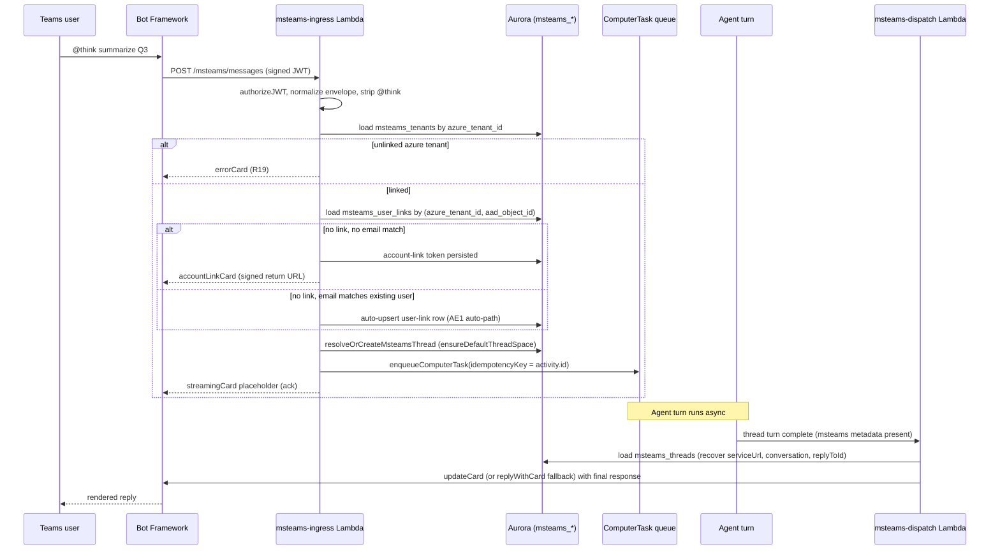

# feat: Microsoft Teams `@think` bot

## Summary

Add a Microsoft Teams bot that lets any linked Teams user invoke ThinkWork by mentioning `@think <prompt>` in a DM, group chat, or channel where the bot has been added — no per-channel binding, no agent selector. Inbound activities land in the tenant's default `general` Space attributed to the requester, carrying Teams context metadata for the existing Spaces-side router to re-target. The plan ships as a multi-PR inert-first arc on `@microsoft/agents-hosting`, mirroring the Slack workspace-app substrate one-for-one with naming swapped to avoid collision with the internal `teams` namespace.

---

## Problem Frame

ThinkWork's first enterprise customer requires the platform be available inside Microsoft Teams. ThinkWork already reaches users through the Computer web app, mobile, and a Slack workspace app — but has no Teams ingress. The Slack precedent (`docs/brainstorms/2026-05-17-shared-computers-slack-requirements.md`) solved the same surface against a tighter routing model (slug-named Computers, explicit assignment, picker UX); the Teams brainstorm explicitly relaxes those routing rules and lets the Spaces-side context router handle thread placement after the fact.

Two material findings shape the plan's shape rather than its scope. First, the bare names `teams`, `Teams`, and `team_*` are already taken inside the repo by the internal organizational-teams domain (`packages/database-pg/src/schema/teams.ts`, `packages/api/src/graphql/resolvers/teams/`, the `teams` Lambda zip name). Every new artifact for this work uses the `msteams_*` prefix. Second, the `botbuilder` SDK named in the brainstorm's Dependencies section was archived 2026-01-05; `@microsoft/agents-hosting` is Microsoft's GA successor and is the runtime dependency this plan targets. The brainstorm Dependencies entry was updated when the SDK choice was confirmed.

---

## System-Wide Impact

| Surface | Change |
|---|---|
| Database | New `msteams_tenants`, `msteams_user_links`, `msteams_threads` tables (mirror of Slack equivalents). Hand-rolled SQL migration with `-- creates:` markers; applied to dev via psql before merge per CLAUDE.md migration discipline. |
| API Gateway / Lambda | Three new Lambda handlers (`msteams-ingress`, `msteams-oauth-install`, `msteams-account-link-complete`) + three new routes. Default esbuild externalize flags — `@microsoft/agents-hosting` is bundled inline; AWS SDKs stay external. |
| Secrets Manager | New shared bot credentials at `thinkwork/<stage>/oauth/microsoft-365` (the `microsoft_365` provider is already in the OAuth typed union per the OAuth secrets learning). New link-token signing secret. |
| GraphQL | New `msteams.graphql` type file (`packages/database-pg/graphql/types/msteams.graphql`) and resolvers under `packages/api/src/graphql/resolvers/msteams/`. Requires `pnpm schema:build` + codegen for `apps/cli`, `apps/admin`, `apps/mobile`, `packages/api`. |
| Thread substrate | A new ingress writer that uses `ensureDefaultThreadSpace` + `enqueueComputerTask` with `idempotencyKey = activity.id`. No changes to existing thread-write paths. |
| Reply path | New outbound dispatch Lambda (`msteams-dispatch`) invoked from the thread-turn completion hook to call back into Bot Framework using the original activity's `serviceUrl`. |
| Admin SPA | New surface for "Connect Teams" install kickoff + status. Mirrors the existing Slack workspace install card. Out of scope for this plan; tracked under Deferred to Follow-Up Work. |
| Mobile app | New self-service surface for "unlink my Teams identity" + status. Out of scope for this plan; tracked under Deferred to Follow-Up Work. |
| Spaces-side router | Already exists and consumes thread metadata. No changes — this plan only writes the `metadata.msteams` envelope it already knows how to read. |

---

## High-Level Technical Design

*The diagram and notes below illustrate the intended approach and are directional guidance for review, not implementation specification. The implementing agent should treat them as context, not code to reproduce.*

### End-to-end activity flow



### Naming map vs Slack precedent

| Slack | Teams |
|---|---|
| `slack_workspaces` (one row per workspace; `slack_team_id UNIQUE`) | `msteams_tenants` (one row per Azure tenant; `azure_tenant_id UNIQUE`) |
| `slack_user_links` (Slack user → ThinkWork user) | `msteams_user_links` (AAD object id → ThinkWork user) |
| `slack_threads` (Slack thread → ThinkWork thread, idempotent on `(team, channel, root_ts)`) | `msteams_threads` (Teams conversation → ThinkWork thread, idempotent on `(azure_tenant_id, conversation_id, parent_activity_id)`) |
| 3 ingress Lambdas (`slack-events`, `slack-slash-command`, `slack-interactivity`) | 1 ingress Lambda (`msteams-ingress`) — Bot Framework dispatches activity types inside one endpoint |
| `slack-oauth-install` (workspace install OAuth callback) | `msteams-oauth-install` (Azure admin-consent return) |
| User link via generic OAuth callback (`oauth-callback.ts`, provider `slack`) | User link via dedicated `msteams-account-link-complete` + auto-link by AAD email match in the ingress flow |
| `slack-dispatch.ts` Lambda (outbound, EventBridge Scheduler) | `msteams-dispatch.ts` Lambda (outbound, invoked from thread-turn completion hook) |
| HMAC v0 signature + 5-minute replay window | Bot Framework JWT validation + service URL allowlist (`*.smba.trafficmanager.net`) |

### Activity envelope shape (what gets persisted on the thread)

The `messages.metadata.msteams` payload follows the existing pattern from `messages.metadata.slack`:

```ts
// Type sketch — actual type lives in packages/api/src/lib/msteams/envelope.ts
type MsteamsActivityEnvelope = {
  activityId: string;          // Bot Framework activity.id — idempotency key
  azureTenantId: string;       // channelData.tenant.id
  conversationId: string;      // conversation.id
  channelId: string | null;    // channelData.channel.id (null in DMs)
  channelName: string | null;  // channelData.channel.name when available
  parentActivityId: string | null; // replyToId
  serviceUrl: string;          // for async writeback
  aadObjectId: string;         // from.aadObjectId
  aadDisplayName: string;      // from.name
  requesterEmail: string;      // from Graph /users/{id} lookup (or JWT 'upn'/'mail' when present)
  rawText: string;             // post-mention-strip
};
```

This shape is sufficient for the Spaces-side router (which already consumes thread metadata) without further Teams-specific data fetches.

---

## Output Structure

```
packages/
  api/
    src/
      handlers/
        msteams/
          ingress.ts
          oauth-install.ts
          account-link-complete.ts
          __tests__/
            ingress.test.ts
            oauth-install.test.ts
            account-link-complete.test.ts
      lib/
        msteams/
          _shared.ts
          adaptive-cards.ts
          account-link-token.ts
          completion-callback.ts
          dispatch.ts
          envelope.ts
          jwt-validation.ts
          mention-parser.ts
          tenant-store.ts
          thread-mapping.ts
          user-link-store.ts
          __tests__/
            account-link-token.test.ts
            adaptive-cards.test.ts
            dispatch.test.ts
            envelope.test.ts
            jwt-validation.test.ts
            mention-parser.test.ts
            tenant-store.test.ts
            thread-mapping.test.ts
            user-link-store.test.ts
      graphql/
        resolvers/
          msteams/
            index.ts
            myMsteamsLinks.query.ts
            msteamsTenants.query.ts
            shared.ts
            startMsteamsTenantInstall.mutation.ts
            uninstallMsteamsTenant.mutation.ts
            unlinkMsteamsIdentity.mutation.ts
            __tests__/
              (one .test.ts per resolver)
    teams-app-package/
      manifest.json
      color.png
      outline.png
    scripts/
      create-msteams-app.ts
  database-pg/
    src/schema/msteams.ts
    drizzle/NNNN_msteams_init.sql
    graphql/types/msteams.graphql
    __tests__/schema-msteams.test.ts
  lambda/
    msteams-dispatch.ts
    __tests__/msteams-dispatch.test.ts
terraform/
  modules/app/lambda-api/
    msteams-app-secrets.tf
docs/operations/
  msteams-install-runbook.md
```

The per-unit `**Files:**` lists below are authoritative for what each unit creates or modifies; the tree above is the expected resulting layout.

---

## Implementation Units

### U1. Drizzle schema and hand-rolled migration for `msteams_*` tables

**Goal:** Land the persistence substrate (Azure tenant link, AAD identity link, Teams conversation ↔ thread mapping) so every downstream unit has a place to write provenance.

**Requirements:** R1, R3, R7, R8, R14, R19

**Dependencies:** none

**Files:**
- `packages/database-pg/src/schema/msteams.ts`
- `packages/database-pg/drizzle/NNNN_msteams_init.sql` (hand-rolled, with required `-- creates:` markers)
- `packages/database-pg/src/schema/index.ts` (add export)
- `packages/database-pg/__tests__/schema-msteams.test.ts`

**Approach:**
- Three tables, mirroring Slack's schema column-for-column with naming swapped:
  - `msteams_tenants(id, tenant_id FK, azure_tenant_id UNIQUE, azure_tenant_name, app_id, bot_id, service_url, installed_by_user_id FK, status, installed_at, uninstalled_at, created_at, updated_at)`
  - `msteams_user_links(id, tenant_id FK, azure_tenant_id, aad_object_id, user_id FK ON DELETE RESTRICT, aad_email, aad_display_name, status, linked_at, unlinked_at, created_at, updated_at)` with unique `(azure_tenant_id, aad_object_id)`
  - `msteams_threads(id, tenant_id FK, azure_tenant_id, conversation_id, parent_activity_id NULLABLE, thread_id FK, service_url, channel_id NULLABLE, channel_name NULLABLE, created_at, updated_at)` with unique `(azure_tenant_id, conversation_id, parent_activity_id)` using `NULLS NOT DISTINCT`
- Hand-rolled SQL since Drizzle's `db:generate` cannot emit partial-unique constraints or correct `NULLS NOT DISTINCT` semantics. Required markers in the SQL header: `-- creates: public.msteams_tenants`, `-- creates: public.msteams_user_links`, `-- creates: public.msteams_threads`, `-- creates-constraint: public.msteams_user_links_user_id_fk`, plus markers for every CHECK constraint and unique index. CI's Migration Precheck gate verifies these against dev.
- Apply to dev via `psql "$DATABASE_URL" -f packages/database-pg/drizzle/NNNN_msteams_init.sql` before merging the PR. Paste `\d+ msteams_tenants`, `\d+ msteams_user_links`, `\d+ msteams_threads` into the PR body.

**Patterns to follow:**
- `packages/database-pg/src/schema/slack.ts` (table shape, FK choices, status check constraints)
- `packages/database-pg/__tests__/spaces-schema.test.ts` (schema-test patterns)
- Recent hand-rolled migration in `packages/database-pg/drizzle/` with `-- creates:` markers in the header

**Test scenarios:**
- Schema definition matches the column list above (types, NOT NULL, defaults)
- Unique constraint on `azure_tenant_id` rejects two `msteams_tenants` rows with the same Azure tenant id even if they target different ThinkWork tenants
- Unique constraint on `(azure_tenant_id, aad_object_id)` for `msteams_user_links` rejects re-link attempts; upsert path works
- FK on `msteams_user_links.user_id` is `ON DELETE RESTRICT` (matches Slack — deleting a user does not silently orphan the link)
- Status CHECK constraints reject unknown values for each table
- Cascading delete: deleting a ThinkWork tenant row cascades to `msteams_tenants` rows; deleting a thread cascades to `msteams_threads` rows
- `msteams_threads` unique constraint treats two NULL `parent_activity_id` values as equal (`NULLS NOT DISTINCT`) — only one root-thread mapping per `(azure_tenant_id, conversation_id)`

**Verification:** `pnpm --filter @thinkwork/database-pg test` passes; `pnpm db:migrate-manual` reports no MISSING markers against dev; `\d+` output of all three tables pasted into PR body matches the expected shape.

---

### U2. Lambda scaffolds, Terraform wiring, and Teams app manifest (inert)

**Goal:** Stand up the ingress endpoints, routes, secret resources, and Teams app manifest package as deployable, throwing-on-invoke substrate. After this unit lands, the Bot Framework webhook is reachable, the manifest is uploadable to a test Teams tenant, and any inbound activity gets a recognizable 500 — but no real work is done.

**Requirements:** R1, R2, R3, R4, R21

**Dependencies:** U1

**Files:**
- `packages/api/src/handlers/msteams/ingress.ts` (stub — throws)
- `packages/api/src/handlers/msteams/oauth-install.ts` (stub — throws)
- `packages/api/src/handlers/msteams/account-link-complete.ts` (stub — throws)
- `terraform/modules/app/lambda-api/handlers.tf` (three new Lambdas + three new routes + `msteams_handler_env`)
- `terraform/modules/app/lambda-api/msteams-app-secrets.tf` (new — mirror of `slack-app-secrets.tf`)
- `scripts/build-lambdas.sh` (three new `build_handler` entries)
- `packages/api/teams-app-package/manifest.json`
- `packages/api/teams-app-package/color.png` (placeholder 192x192)
- `packages/api/teams-app-package/outline.png` (placeholder 32x32)
- `packages/api/scripts/create-msteams-app.ts` (helper to bundle manifest + icons into a zip)

**Approach:**
- Stubs `throw new Error("msteams <handler> not implemented yet (stub)")` per the inert-first seam-swap pattern (per `docs/solutions/architecture-patterns/inert-first-seam-swap-multi-pr-pattern-2026-05-08.md`). Bot Framework retry + DLQ make the inert state visible — a no-op `200` would silently swallow every kind of integration failure during the rest of the build-out.
- Handler skeleton uses `APIGatewayProxyEventV2` + `handleCors` + `json` from `packages/api/src/lib/response.ts` (per the lambda-options-preflight learning).
- Route map in `handlers.tf`: `POST /msteams/messages` → `msteams-ingress`, `GET|POST /msteams/oauth/install` → `msteams-oauth-install`, `GET /msteams/account-link/complete` → `msteams-account-link-complete`.
- `msteams_handler_env` (mirror of `slack_handler_env`) attached to all three Lambdas: `MICROSOFT_OAUTH_SECRET_ARN` (already exists in `common_env` per the existing `microsoft_365` OAuth provider), `THINKWORK_APP_URL`, and a new `MSTEAMS_LINK_TOKEN_SECRET_ARN`.
- New secret resources in `msteams-app-secrets.tf`: `thinkwork/<stage>/oauth/microsoft-365` already exists; this unit only adds `thinkwork/<stage>/msteams/link-token-signing-key`. Both with `lifecycle.ignore_changes = [secret_string]` so we populate values out-of-band.
- Manifest uses Teams app manifest v1.21 schema, multi-tenant. Scopes `personal`, `team`, `groupChat`. Reference shape: the dust repo's `connectors/teams-app-package/manifest.json` is a structural reference (not a dependency).

**Execution note:** Verify both the build-script entry AND the `handlers.tf` entry exist before pushing. Missing the second blocks every deploy with the `filebase64sha256` error per the `feedback_lambda_zip_build_entry_required` memory.

**Patterns to follow:**
- `packages/api/src/handlers/slack/_shared.ts` (handler scaffold shape)
- `terraform/modules/app/lambda-api/slack-app-secrets.tf` (secret resource pattern)
- `scripts/build-lambdas.sh` lines 391–404 (Slack `build_handler` entries)

**Test scenarios:**
- `pnpm build:lambdas msteams-ingress` (and the other two) produces a valid zip in `dist/lambdas/<name>/`
- Each inert handler returns HTTP 500 with body `{ error: "msteams <handler> not implemented yet (stub)" }`
- Terraform `terraform plan` against the test stage shows clean adds for three Lambdas, three routes, and one secret resource without diff against unrelated Slack resources
- Manifest JSON validates against Teams app manifest v1.21 JSON schema

**Verification:** All builds succeed; manual `terraform plan` reviewed; manifest JSON-schema validation passes; the three inert handlers respond with their "not implemented" 500 when invoked via the dev API Gateway.

---

### U3. JWT validation, activity envelope, mention parser, and handler-shared library

**Goal:** Provide the Bot Framework auth primitives and activity normalization that the live ingress will consume in U6.

**Requirements:** R2, R11, R12

**Dependencies:** U2

**Files:**
- `packages/api/src/lib/msteams/jwt-validation.ts`
- `packages/api/src/lib/msteams/envelope.ts`
- `packages/api/src/lib/msteams/_shared.ts`
- `packages/api/src/lib/msteams/mention-parser.ts`
- `packages/api/src/lib/msteams/__tests__/jwt-validation.test.ts`
- `packages/api/src/lib/msteams/__tests__/envelope.test.ts`
- `packages/api/src/lib/msteams/__tests__/mention-parser.test.ts`
- `packages/api/package.json` (add `@microsoft/agents-hosting` + `@microsoft/agents-hosting-extensions-teams` deps)

**Approach:**
- `jwt-validation.ts`: thin wrapper around `@microsoft/agents-hosting`'s `loadAuthConfigFromEnv()` + `authorizeJWT(authConfig)`. Configure `clientId` from the `microsoft_365` Secrets Manager record (already typed in `packages/api/src/lib/oauth-client-credentials.ts`). Enforce a service-URL allowlist matching `https://smba.trafficmanager.net`, `https://eus.smba.trafficmanager.net`, `https://wus.smba.trafficmanager.net`, `https://emea.smba.trafficmanager.net`, `https://apac.smba.trafficmanager.net`. Reject unknown service URLs as 403.
- `envelope.ts`: `MsteamsActivityEnvelope` TypeScript type per the High-Level Technical Design sketch. Normalizer extracts these fields from an Activity into the stable shape, regardless of `activity.type` (message, invoke, conversationUpdate).
- `_shared.ts`: `createMsteamsHandler(config, deps)` factory mirroring Slack's `_shared.ts` shape:
  1. Read raw bytes from the API Gateway event
  2. Validate JWT via the authorizeJWT middleware
  3. Extract azure tenant id from `activity.channelData.tenant.id`
  4. Look up `msteams_tenants` by `azure_tenant_id` — fail with errorCard per R19 if unlinked
  5. Load shared Microsoft app credentials from Secrets Manager
  6. Dispatch to the surface handler with `MsteamsHandlerArgs { activity, envelope, headers, rawBody, tenant }`
- `mention-parser.ts`: strip Teams `<at>...</at>` mentions whose text matches the bot's `recipient.name` case-insensitively. Any leading `+token` after stripping is preserved as prompt content per R12 (validated in tests with `+sales` text → kept as prompt).

**Patterns to follow:**
- `packages/api/src/handlers/slack/_shared.ts` (factory shape, dispatch envelope)
- `packages/api/src/lib/slack/envelope.ts` (envelope type pattern)
- The dust repo's `connectors/src/api/webhooks/teams/jwt_validation.ts` as a reference for the validation flow (the actual code uses the new SDK, not the legacy one referenced there)

**Test scenarios:**
- jwt-validation: rejects missing Authorization header; rejects invalid signature; rejects expired token; accepts a valid token from each allowed service URL prefix; rejects an attacker-controlled service URL (`http://evil.example.com`)
- envelope: handles a `message` activity with channel data; handles an `invoke` activity (adaptive card action); handles `conversationUpdate`; handles a DM activity missing `channelData.channel.name`; surfaces a clear error when `from.aadObjectId` is missing (so U6's R20 path is testable)
- mention-parser: strips a single `<at>think</at>` mention; strips when surrounded by text; leaves `+sales summarize this` intact as prompt (covers AE4); matches recipient name case-insensitively; handles a DM prompt with no mention tags (returns input unchanged); handles two `<at>` mentions where one is the bot and one isn't (strips only the bot's)

**Verification:** `pnpm --filter @thinkwork/api test packages/api/src/lib/msteams/__tests__/` passes; `pnpm --filter @thinkwork/api typecheck` passes.

---

### U4. Tenant link store, user link store, and account-link signed token utility

**Goal:** Provide the typed persistence helpers and signed-token primitives that the ingress handler and the GraphQL admin surface will share.

**Requirements:** R3, R6, R7, R8, R9

**Dependencies:** U1, U3

**Files:**
- `packages/api/src/lib/msteams/tenant-store.ts`
- `packages/api/src/lib/msteams/user-link-store.ts`
- `packages/api/src/lib/msteams/account-link-token.ts`
- `packages/api/src/lib/msteams/__tests__/tenant-store.test.ts`
- `packages/api/src/lib/msteams/__tests__/user-link-store.test.ts`
- `packages/api/src/lib/msteams/__tests__/account-link-token.test.ts`

**Approach:**
- `tenant-store.ts` exports `loadTenantByAzureTenantId(azureTenantId)`, `upsertTenantLink({ tenantId, azureTenantId, azureTenantName, installedByUserId, ... })`, `markTenantUninstalled(id)`. The `azure_tenant_id UNIQUE` invariant means duplicate install attempts on a different ThinkWork tenant fail loudly with "azure tenant already bound."
- `user-link-store.ts` exports:
  - `findLinkByAad({ azureTenantId, aadObjectId })` — primary lookup, returns the link row + joined user when found
  - `findUserByEmail({ tenantId, email })` — auto-link helper for the AAD-email-match path, **strictly tenant-scoped** to avoid the `oauth-authorize-wrong-user-id-binding-2026-04-21` regression
  - `upsertLink({ tenantId, azureTenantId, aadObjectId, userId, aadEmail, aadDisplayName })`
  - `unlinkLink(id)` — sets `status='unlinked'`, populates `unlinked_at`
  - Diagnostic log line `[msteams-link] rows=N user=<id-prefix> tenant=<id-prefix>` at each lookup boundary per learning #4 — this single line is what surfaces multi-user mis-binds
- `account-link-token.ts`: signed token following the same base64url(JSON payload) + `.` + base64url(HMAC-SHA256) shape as `packages/api/src/lib/slack/oauth-state.ts`. Payload `{ azureTenantId, aadObjectId, aadEmail, aadDisplayName, expiresAt, nonce }`. TTL constant `MSTEAMS_LINK_TOKEN_TTL_MS = 10 * 60 * 1000`. Sign with secret resolved from `MSTEAMS_LINK_TOKEN_SECRET_ARN`. Verifier accepts a payload, decodes it, checks signature + expiry, and refuses to bind to a user whose AAD object id does not match the token payload (per R9).

**Patterns to follow:**
- `packages/api/src/lib/slack/workspace-store.ts`, `user-link-store.ts`, `oauth-state.ts`
- `packages/api/src/graphql/resolvers/core/resolve-auth-user.ts` for the `users.id → email → fail closed` shape

**Test scenarios:**
- tenant-store: `upsertTenantLink` is idempotent on the same Azure tenant; second call with a different ThinkWork tenant for the same Azure tenant raises a typed error; `loadTenantByAzureTenantId` returns null for unknown; `markTenantUninstalled` flips status + sets `uninstalled_at`
- user-link-store: `findLinkByAad` returns null for unknown AAD identity; `findUserByEmail` does NOT return a user from another tenant who shares the same email (covers the multi-user-mis-bind class from learning #4); `upsertLink` updates rather than inserts when `(azure_tenant_id, aad_object_id)` already exists; the diagnostic log line is emitted at each lookup boundary (verified by spying on the logger); Covers AE1 — the auto-link branch returns a link row when `aadEmail` matches a ThinkWork user
- account-link-token: round-trip create + verify works; expired token rejected; wrong-secret signature rejected; tampered payload rejected; token cannot be reused to bind a different `aadObjectId` (covers R9)

**Verification:** Unit tests pass; type-check passes.

---

### U5. Thread mapping, adaptive cards, and outbound dispatch helpers

**Goal:** Provide the transactional write path from a Teams activity to a ThinkWork thread, the card builders for every Teams-surface message, and the outbound reply primitives. This unit also pins the streaming card UX shape (see Execution note).

**Requirements:** R10, R13, R14, R15, R16, R17, R18

**Dependencies:** U1, U3, U4

**Files:**
- `packages/api/src/lib/msteams/thread-mapping.ts`
- `packages/api/src/lib/msteams/adaptive-cards.ts`
- `packages/api/src/lib/msteams/dispatch.ts`
- `packages/api/src/lib/msteams/__tests__/thread-mapping.test.ts`
- `packages/api/src/lib/msteams/__tests__/adaptive-cards.test.ts`
- `packages/api/src/lib/msteams/__tests__/dispatch.test.ts`

**Approach:**
- `thread-mapping.ts`: `resolveOrCreateMsteamsThread({ tenantId, requesterUserId, envelope })` returns `{ threadId, messageId, wasCreated }` inside one transaction:
  1. `findExisting` against `msteams_threads` by `(azure_tenant_id, conversation_id, parent_activity_id)`
  2. If absent, call `ensureDefaultThreadSpace({ tenantId, userId: requesterUserId })` — this also adds the requester to `space_members` so private-Space access logic stays consistent (avoids re-implementing the older Slack inline-upsert path)
  3. Create the thread with `channel: "msteams"`, identifier `MSTEAMS-<n>`, `created_by_type: "user"`
  4. Insert the `msteams_threads` row mapping the external coordinates to the new thread id, capturing `service_url` for later writeback
  5. Insert a `messages` row with `role: "user"`, `sender_type: "user"`, and `metadata: { source: "msteams", msteams: envelope }`
- `adaptive-cards.ts`: builders for `welcomeCard()`, `accountLinkCard({ linkUrl })`, `errorCard(message)`, `streamingCard({ status, partialContent })`, and `finalResponseCard({ content, footnotes, threadUrl })`. All cards target Adaptive Cards schema v1.5 (Teams's current ceiling).
- `dispatch.ts`: `replyWithCard({ serviceUrl, conversation, replyToId, card })` and `updateCard({ serviceUrl, conversation, activityId, card })`. Implementation uses `@microsoft/agents-hosting`'s `CloudAdapter.continueConversation()` for proactive sends. Cache the app bearer token per service URL with a short TTL (≤ token lifetime - 60s).

**Execution note:** During this unit's manual test cycle, verify in a real Teams test tenant whether `updateCard` actually replaces the prior adaptive card in place. If yes, the streaming UX from R16 ships as designed (progressive card updates). If no (the agents-hosting migration cut the legacy `StreamingConnection` and Teams' streaming UX feature constrains cards to the final chunk), the fallback shape is: send a `streamingCard` with `status: "thinking…"` text on activity ingress, then replace it with `finalResponseCard` on completion. Both shapes satisfy R16 ("update a single adaptive card"); the difference is whether intermediate updates render. Document the verified behavior in code comments and reflect any builder-shape change here.

**Patterns to follow:**
- `packages/api/src/lib/slack/thread-mapping.ts` (transactional structure)
- `packages/api/src/lib/spaces/default-space.ts` (`ensureDefaultThreadSpace`)
- The dust repo's `connectors/src/api/webhooks/teams/adaptive_cards.ts` (card builder shapes — but rewritten on the new SDK)

**Test scenarios:**
- thread-mapping: first invocation creates the thread + `msteams_threads` row + initial message; second invocation with the same `(azure_tenant_id, conversation_id, parent_activity_id)` reuses the same thread; a reply-in-thread with a different `parent_activity_id` from the root creates a separate `msteams_threads` row pointing at a distinct thread; `ensureDefaultThreadSpace` adds the requester to `space_members` (verify via direct DB query); thread identifier follows the `MSTEAMS-<n>` pattern; the persisted `messages.metadata.msteams` envelope matches the input envelope; Covers AE2, AE3.
- adaptive-cards: each builder produces JSON validating against the Adaptive Card v1.5 schema; `welcomeCard` text names the `@think <prompt>` invocation (supports F2); `accountLinkCard` includes the signed link URL and shows the expiration window; `errorCard` rendering escapes user-supplied error message text (no XSS); `streamingCard` and `finalResponseCard` shapes match the agreed Teams streaming UX (see Execution note); footnote rendering preserves citation order.
- dispatch: `updateCard` cache hit reuses the prior bearer token; cache miss fetches a new token; 401 from Bot Framework triggers token refresh + retry once before surfacing; unknown serviceUrl is rejected before issuing a request.

**Verification:** Unit tests pass; manual verification of `updateCard` behavior in a real Teams tenant documented in code comments + Execution note resolution.

---

### U6. Live ingress handler bodies (substrate seam swap)

**Goal:** Replace the three inert handlers with their live bodies — `msteams-ingress` does JWT → tenant lookup → user resolution → mention strip → thread resolve → enqueue task → ack-with-card; `msteams-oauth-install` completes Azure admin-consent return; `msteams-account-link-complete` completes per-user link card return.

**Requirements:** R5, R6, R7, R10, R11, R12, R13, R17, R19, R20, R21

**Dependencies:** U3, U4, U5

**Files:**
- `packages/api/src/handlers/msteams/ingress.ts` (replace stub body)
- `packages/api/src/handlers/msteams/oauth-install.ts` (replace stub body)
- `packages/api/src/handlers/msteams/account-link-complete.ts` (replace stub body)
- `packages/api/src/handlers/msteams/__tests__/ingress.test.ts`
- `packages/api/src/handlers/msteams/__tests__/oauth-install.test.ts`
- `packages/api/src/handlers/msteams/__tests__/account-link-complete.test.ts`

**Approach:**
- `ingress.ts`:
  1. Run `createMsteamsHandler` from U3 (JWT + tenant resolution)
  2. Dispatch by activity type:
     - **`message`**: parse mention via `mention-parser`; resolve requester:
       - Look up `findLinkByAad({ azureTenantId, aadObjectId })`
       - If found → use it
       - If not found → fetch the requester's email (from JWT `upn`/`mail` claim when present, else via Microsoft Graph `/users/{aadObjectId}` per R7)
       - Try `findUserByEmail({ tenantId, email })` — if match, auto-upsert link and proceed (Covers AE1 auto-path)
       - If no email match, mint an `account-link-token` and post the `accountLinkCard` with the signed return URL; do not create a thread (Covers AE1 link-card path)
       - If Graph lookup fails or returns no email, surface `errorCard` per R20
     - `resolveOrCreateMsteamsThread({ tenantId, requesterUserId, envelope })` from U5
     - `enqueueComputerTask({ tenantId, computerId, taskType: "thread_turn", taskInput, idempotencyKey: activity.id, createdByUserId: requesterUserId })` — `computerId` resolved from the Space's primary computer (see Deferred Implementation Notes for the resolution path)
     - Ack via Bot Framework with the `streamingCard` placeholder (the async writeback in U7 finalizes the response)
     - **`conversationUpdate`** (bot added to a channel/DM/personal scope): reply with the `welcomeCard` (Covers F2, AE5)
     - **`invoke`** (adaptive card actions): handle action types we issued (e.g., dismiss link card); ignore unknown invokes with a 200
- `oauth-install.ts`: handles the Azure admin-consent return. Validates the signed install state token from U4; on success, calls `upsertTenantLink` with `installedByUserId` from the state payload; redirects to the admin SPA at `${THINKWORK_APP_URL}/settings/integrations/msteams?status=connected`.
- `account-link-complete.ts`: handles the per-user link-card return. Validates the signed token; calls `upsertLink`; renders a success HTML page (mirror the existing oauth-callback success page styling).
- Idempotency: `activity.id` carries through `enqueueComputerTask({ idempotencyKey })`; Bot Framework retries on the same id silently no-op (return wasCreated=false, no duplicate task).

**Patterns to follow:**
- `packages/api/src/handlers/slack/events.ts` (events dispatch + ephemeral link prompt pattern)
- `packages/api/src/handlers/oauth-callback.ts` lines 248–276 (Slack user-link upsert via generic OAuth callback — Teams uses a dedicated endpoint but the upsert shape is the same)
- `packages/api/src/lib/computers/tasks.ts` — `enqueueComputerTask` signature

**Test scenarios:**
- ingress: rejects activity with invalid JWT (Covers R2); rejects activity from an Azure tenant not in `msteams_tenants` with the admin-action `errorCard` per R19 (Covers AE7); for a known Azure tenant with an unlinked AAD identity and no email match, replies with `accountLinkCard` and does NOT create a thread (Covers AE1 link-card path); for a known Azure tenant with an AAD identity whose email matches an existing ThinkWork user, auto-upserts the link row and proceeds (Covers AE1 auto-path); for a linked user `@think summarize this account` in a channel, creates a thread in the `general` Space with the full `msteams` metadata envelope (Covers AE2); for a linked user `@think what's on my calendar today` in a DM, creates a thread with DM metadata (no channel name) and streams the response back to the DM (Covers AE3); `@think +sales summarize this account` treats `+sales` as part of the prompt and routes the thread to `general` (Covers AE4 and R12); inert channel (no `@think`) is ignored — no thread created; missing `aadObjectId` or `email` surfaces `errorCard` per R20; replaying the same `activity.id` returns 200 with no duplicate task (idempotency); adapter exceptions surface a user-visible `errorCard` and log the underlying error with the activity id per R21
- oauth-install: rejects expired state; rejects tampered state; rejects state signed by a different secret; on valid state, upserts tenant link with the right `installed_by_user_id`; redirects to the admin SPA success URL
- account-link-complete: rejects expired link token; rejects tampered token; rejects re-use against a different AAD identity (covers R9); on valid token, upserts the user-link row and renders the success page

**Verification:** Unit tests cover all branches; manual end-to-end probe (POST a real Bot Framework activity to dev `/msteams/messages` with a valid JWT, observe the thread and ComputerTask creation in DB).

---

### U7. Async reply writeback Lambda and thread-turn completion hook

**Goal:** When a ComputerTask thread turn completes, post the final agent response back to the originating Teams conversation via Bot Framework, using the `serviceUrl` persisted on `msteams_threads`.

**Requirements:** R16, R18

**Dependencies:** U5, U6

**Files:**
- `packages/lambda/msteams-dispatch.ts` (outbound delivery Lambda)
- `packages/api/src/lib/msteams/completion-callback.ts`
- `packages/lambda/__tests__/msteams-dispatch.test.ts`
- `packages/api/src/lib/msteams/__tests__/completion-callback.test.ts`
- `terraform/modules/app/lambda-api/handlers.tf` (add `msteams-dispatch` Lambda entry; route is internal-only — invoked by completion hook, not API Gateway)
- `scripts/build-lambdas.sh` (add `msteams-dispatch` build_handler entry)

**Approach:**
- `completion-callback.ts`: hooked into the existing thread-turn completion path (the discovery of the exact hook entrypoint is a Deferred Implementation Note — Slack's equivalent is `slack-dispatch.ts`'s EventBridge Scheduler trigger; Teams may use the same or invoke directly).
  - Branch: if `thread.metadata.source !== "msteams"`, return early (no Teams write)
  - Load `msteams_threads` row by `thread_id` to recover `service_url`, `conversation_id`, `parent_activity_id`
  - Build the final response card via `finalResponseCard({ content, footnotes, threadUrl })`
  - Invoke `msteams-dispatch` Lambda with `RequestResponse` per the CLAUDE.md fire-and-forget memory (this is a user-driven update — surface failures)
  - Per the `agentcore-completion-callback-env-shadowing-2026-04-25` learning: snapshot `THINKWORK_API_URL`, `API_AUTH_SECRET`, and the Microsoft App credentials at coroutine entry; thread them through to the dispatch invocation as explicit parameters. Never re-read `process.env` after the agent turn.
- `msteams-dispatch.ts`: thin outbound Lambda. Receives `{ serviceUrl, conversationId, activityId, replyToId, card, appCredentials }`. Calls `dispatch.updateCard` (when streaming card replace works) or `dispatch.replyWithCard` (fallback shape from U5's Execution note). Retries transient 5xx through Lambda's normal retry policy; sets `MaximumRetryAttempts = 0` on the Lambda's async config + SQS DLQ per the `async_retry_idempotency_lessons` memory (so duplicate replies are not posted on retry).
- For mid-turn streaming updates (when supported): emit progressive updates from the turn loop via the same Lambda. Fallback: send `streamingCard` "thinking…" on enqueue (U6), replace once with `finalResponseCard` here.

**Patterns to follow:**
- `packages/lambda/slack-dispatch.ts` (outbound delivery Lambda shape)
- `docs/solutions/workflow-issues/agentcore-completion-callback-env-shadowing-2026-04-25.md` (env-snapshot pattern at coroutine entry)
- `docs/solutions/architecture-patterns/async_retry_idempotency_lessons` (`MaximumRetryAttempts = 0` + DLQ for non-idempotent dispatch)

**Test scenarios:**
- completion-callback: for a non-msteams thread (e.g., Slack-originated), no Teams write happens and the completion path is unaffected; for a msteams thread, dispatches to `msteams-dispatch` with the right `serviceUrl + conversationId + replyToId`; missing `msteams_threads` row (race condition — thread completed but mapping row evicted) logs a warning and skips without throwing; env vars snapshotted at coroutine entry are used post-turn (simulated env mutation mid-turn does not affect the call); the dispatch is fired with `RequestResponse` and surfaces a failure when the dispatch Lambda errors (covers R21 path from the writeback side)
- msteams-dispatch: builds the final response card with content + footnotes + thread URL; calls `dispatch.updateCard` (or `replyWithCard`); handles 401 from Bot Framework with token refresh + retry once; transient 5xx are retried by Lambda async config — but only zero times after the first failure (no duplicate posts); permanent 4xx logs a clear error and lands in DLQ
- Covers AE6 fully: the reply posts to the Teams channel even if the thread is later re-targeted to a private Space — no retroactive redaction (the writeback ran before the router moved the thread, and the writeback does not consult Space access)

**Verification:** Unit tests pass; manual end-to-end verification of a full activity → thread turn → Teams reply cycle in dev with both a channel-bound conversation and a DM.

---

### U8. GraphQL admin and user resolvers for tenant + identity management

**Goal:** Land the GraphQL surface mirroring Slack's resolver layout — admin queries to inspect tenant bindings, an install kickoff mutation that returns the Azure admin-consent URL, an uninstall mutation, plus per-user unlink.

**Requirements:** R3, R8, R19

**Dependencies:** U4 (can ship in parallel with U5–U7 once U4 lands)

**Files:**
- `packages/database-pg/graphql/types/msteams.graphql`
- `packages/api/src/graphql/resolvers/msteams/index.ts`
- `packages/api/src/graphql/resolvers/msteams/msteamsTenants.query.ts`
- `packages/api/src/graphql/resolvers/msteams/myMsteamsLinks.query.ts`
- `packages/api/src/graphql/resolvers/msteams/startMsteamsTenantInstall.mutation.ts`
- `packages/api/src/graphql/resolvers/msteams/uninstallMsteamsTenant.mutation.ts`
- `packages/api/src/graphql/resolvers/msteams/unlinkMsteamsIdentity.mutation.ts`
- `packages/api/src/graphql/resolvers/msteams/shared.ts`
- `packages/api/src/graphql/resolvers/index.ts` (add import + spread at the same locations Slack appears)
- `packages/api/src/graphql/resolvers/msteams/__tests__/*.test.ts` (one per resolver)

**Approach:**
- Mirror `packages/api/src/graphql/resolvers/slack/` structure file-for-file.
- `startMsteamsTenantInstall`: admin-only via `resolveCallerTenantId(ctx)` + `resolveCallerUserId(ctx)` (per the OAuth tenant-resolver memory — `ctx.auth.tenantId` is null for Google-federated users). Mints a signed install-state token (10-minute TTL, mirror of the Slack install state in `oauth-state.ts`). Returns `{ consentUrl, expiresAt }` where `consentUrl = https://login.microsoftonline.com/common/adminconsent?client_id=<bot_app_id>&state=<signed>&redirect_uri=<install-return>`.
- `msteamsTenants(tenantId)`: admin-only; returns rows from `msteams_tenants` filtered to the caller's ThinkWork tenant.
- `myMsteamsLinks`: returns the caller's `msteams_user_links` rows; supports a `statusFilter` arg (active / unlinked / all).
- `uninstallMsteamsTenant(id)`: admin-only; flips status to `uninstalled` + sets `uninstalled_at`. Does not delete the row (audit trail).
- `unlinkMsteamsIdentity(id)`: caller can only unlink their own link rows; RBAC check via `link.user_id === ctx.callerUserId`.
- After adding `msteams.graphql`, run `pnpm schema:build` then `pnpm --filter <consumer> codegen` for each of `apps/cli`, `apps/admin`, `apps/mobile`, `packages/api`.

**Patterns to follow:**
- `packages/api/src/graphql/resolvers/slack/*.ts` — 1:1 mirror
- `packages/api/src/graphql/resolvers/core/resolve-auth-user.ts` for the Google-federated-user-safe tenant/user resolution

**Test scenarios:**
- startMsteamsTenantInstall: returns a well-formed consent URL with the bot's client id + signed state; non-admin caller rejected with a clear error; the signed state round-trips through `verify` in the install handler (cross-test against U4)
- msteamsTenants: returns only the caller's ThinkWork tenant's bindings; a caller from another tenant is rejected; non-admin caller rejected
- myMsteamsLinks: returns only the caller's links; `statusFilter` narrows correctly; a caller cannot see another user's links
- uninstallMsteamsTenant: flips status + sets `uninstalled_at`; admin-only; idempotent (calling on an already-uninstalled row is a no-op)
- unlinkMsteamsIdentity: caller can unlink their own link; caller cannot unlink another user's link (returns 403-equivalent error)

**Verification:** `pnpm schema:build` succeeds; codegen succeeds for all consumers; all resolver tests pass; admin SPA's GraphQL playground can execute `msteamsTenants` and see the new shape (manual check against dev).

---

### U9. Streaming card verification and production manifest finalization

**Goal:** End-to-end verify the streaming card UX in a live Teams test tenant against `@microsoft/agents-hosting`; finalize the manifest with production icons and metadata; write the install/test runbook.

**Requirements:** R16

**Dependencies:** U6, U7

**Files:**
- `packages/api/teams-app-package/manifest.json` (replace placeholder `<MICROSOFT_BOT_APP_ID>`, finalize description and developer URLs)
- `packages/api/teams-app-package/color.png` (real 192x192 production icon — replace placeholder)
- `packages/api/teams-app-package/outline.png` (real 32x32 production icon)
- `docs/operations/msteams-install-runbook.md` (new — admin install steps, dev-tenant setup, troubleshooting)
- Verification log captured in the PR body (screenshots/recordings of streaming card behavior in a real Teams tenant)

**Approach:**
- Set up a test Azure AD tenant (free tier sufficient) and register the multi-tenant bot via Azure Portal → Bot Service. Populate the `thinkwork/dev/oauth/microsoft-365` secret with the real bot client id + secret.
- Upload the manifest zip (produced by `pnpm tsx packages/api/scripts/create-msteams-app.ts`) to the Teams Developer Portal in the test tenant.
- Walk every Acceptance Example from the brainstorm against the dev deployment:
  - **AE1** (unlinked user → link card; auto-link by email after match)
  - **AE2** (channel `@think` → thread in `general` with channel metadata)
  - **AE3** (DM `@think` → thread in `general` with DM metadata)
  - **AE4** (`+sales` prefix treated as prompt content)
  - **AE5** (welcome card on bot add)
  - **AE6** (private-Space cross-surface visibility named explicitly)
  - **AE7** (unlinked Azure tenant → admin-action card)
- For R16: confirm whether `dispatch.updateCard` replaces an adaptive card in place. Two outcomes:
  - **If yes:** progressive streaming card UX ships as designed. Document in the runbook.
  - **If no:** the U5 Execution note's fallback shape is the shipped behavior — "thinking…" placeholder text followed by a single final card replacement. Update `adaptive-cards.ts` to drop the unused `streamingCard` builder if it turns out we don't need intermediate states, OR keep both shapes but document which one ships first.
- Runbook contents: admin install steps (Azure admin consent, manifest upload), per-user link card flow, dev-tenant setup, common errors (invalid JWT, unlinked tenant, Graph email lookup failure), recovery procedures, "how to verify the deploy actually ran the new code" probe per the `deploy-silent-arch-mismatch` learning.

**Patterns to follow:**
- `docs/solutions/workflow-issues/deploy-silent-arch-mismatch-took-a-week-to-surface-2026-04-24.md` — manual probe discipline before claiming victory
- The existing Slack install runbook if one exists under `docs/operations/`

**Test scenarios:**
- Manual: every AE from the brainstorm passes against the dev Teams tenant
- Manual: streaming card behavior verified — pinned shape documented in code comments + runbook
- Manual: PR body contains screenshots/recordings of the streaming UX as it actually behaves (covers the `deploy-silent-arch-mismatch` discipline)

**Verification:** All Acceptance Examples pass against the dev deployment; the runbook is reviewable as a self-contained install guide; the PR body documents the streaming card behavior with visual evidence.

---

## Key Technical Decisions

- **`@microsoft/agents-hosting` over `botbuilder`.** Confirmed during planning. `botbuilder-js` was archived 2026-01-05 and Microsoft support ended 2025-12-31; the GA Agents SDK is the only supported runtime. `AgentApplication` is used from day one rather than the soft-deprecated `ActivityHandler` to avoid a follow-up SDK migration.
- **Naming with `msteams_*` prefix everywhere.** The bare `teams` name collides with the internal organizational-teams domain across the schema, GraphQL resolvers, and Lambda zip names. Every new table, GraphQL type, resolver folder, Lambda handler file, and Lambda zip name uses `msteams_*` / `msteams-*` / `Msteams*` to avoid that collision.
- **One ingress Lambda, not three.** Bot Framework's `POST /api/messages` consolidates Slack's three ingress surfaces (events, slash, interactivity) into a single endpoint that dispatches by activity type inside `AgentApplication`. The plan ships `msteams-ingress` only; the OAuth install and account-link-complete Lambdas are separate because they're browser-driven redirect endpoints rather than Bot Framework webhooks.
- **AAD auto-link by email when match exists; link card only for true unknowns.** The brainstorm names only the link-card path. The AAD JWT carries authoritative tenant + email, so the friction-down auto-link is a real choice — a user whose `from.aadEmail` matches an existing `users.email` in the linked tenant is upserted into `msteams_user_links` without any link-card round-trip. This matches what the brainstorm's R7 actually says (email match → resolve) while only requiring the link card for the unrecognized-identity branch per R6.
- **Reply writeback via `serviceUrl` + Bot Framework app bearer token, not a scheduled-dispatch Lambda.** Slack's outbound path uses EventBridge Scheduler because the reply timing is decoupled from the inbound event by the agent turn's duration. Bot Framework requires the same shape — the response goes to the original activity's `serviceUrl` with an app bearer token. The new `msteams-dispatch` Lambda is invoked synchronously from the thread-turn completion hook (not scheduled) because we want to surface failures immediately.
- **Inert-first multi-PR arc, with stubs that THROW.** Per the `inert-first-seam-swap-multi-pr-pattern-2026-05-08` learning: U2's stubs throw recognizable errors rather than no-op 200. A no-op 200 on a Bot Framework webhook would silently swallow every kind of integration failure during the rest of the build. Bot Framework's retry + DLQ make the inert state visible.
- **`ensureDefaultThreadSpace`, not the legacy inline Space upsert.** Slack's thread-mapping predates `ensureDefaultThreadSpace`. Teams uses the newer helper so the requester is auto-added to `general` `space_members` and private-Space access enforcement reuses the existing `canPostToSpace` / `callerVisibleThreadPredicate` logic with zero new code. R17 (channel membership ≠ Space access) falls out of this for free.
- **Idempotency key = `activity.id`.** Bot Framework guarantees activity id uniqueness per inbound activity and reuses it on retry. `enqueueComputerTask({ idempotencyKey: activity.id })` matches the Slack precedent's `event_id` shape.
- **Tenant binding via dedicated `msteams_tenants` table; no extension of the existing `connections` table.** The connections table is per-user OAuth. Tenant-level Azure AD binding is structurally analogous to `slack_workspaces` (one row per workspace, tenant-scoped) and lives in its own table for the same reasons.
- **Diagnostic log lines at every identity-lookup boundary.** Per the `oauth-authorize-wrong-user-id-binding-2026-04-21` learning, every `user-link-store` lookup emits `[msteams-link] rows=N user=<prefix> tenant=<prefix>`. Without it, a multi-user mis-bind bug can hide for weeks.

---

## Test Strategy

- **Unit tests (vitest)** colocated under `__tests__/` directories per the repo convention. Each `lib/msteams/*.ts` and `handlers/msteams/*.ts` has a matching test file. Stores tested against a real Postgres test fixture (the standard `packages/api` vitest setup), not mocks. Signed tokens tested for round-trip + tamper + expiry + reuse.
- **Integration tests** for the ingress handler use Bot Framework activity fixtures (real-shaped JSON payloads captured from a dev Teams tenant) posted into the handler with a signed test JWT. Cover every Acceptance Example from the brainstorm via a fixture per AE.
- **Schema test** in `packages/database-pg/__tests__/schema-msteams.test.ts` confirms table shapes, constraints, FKs, and `NULLS NOT DISTINCT` behavior of the `msteams_threads` unique index.
- **GraphQL resolver tests** mirror the Slack resolver-test shape, exercising both the happy path and the auth-failure paths.
- **Manual verification** in U9 covers the live Teams round-trip, the streaming card UX shape (R16's actual behavior on the new SDK), and the runbook validation.
- **Test fixtures kept tenant-scoped.** All stores write against the test fixture's `tenant_id`; any test that needs an Azure tenant id generates a fake uuid per test rather than reusing one across suites — multi-user mis-bind regressions surface when cross-tenant isolation is sloppy.

---

## Risk Analysis & Mitigation

- **Streaming card UX may not work as documented on `@microsoft/agents-hosting`.** The legacy `StreamingConnection` was cut and Teams' streaming UX feature constrains adaptive cards to the final chunk. Whether `updateActivity` replace-in-place still works for cards independently of streaming transport is not confirmed by current Microsoft docs. **Mitigation:** U5's Execution note pins the verification step. U9 confirms behavior in a real tenant before the PR closes. Fallback shape ("thinking…" text → final card) is pre-designed and already documented; no architectural rework needed if the replace path doesn't work.
- **Multi-user mis-bind in `findUserByEmail`.** The historical regression in `oauth-authorize-wrong-user-id-binding-2026-04-21` was caused by an under-constrained `SELECT users WHERE tenant_id=? LIMIT 1` (no per-user predicate). **Mitigation:** `findUserByEmail` is strictly tenant-scoped + email-exact-match; never picks an arbitrary row. Diagnostic log line at every lookup. Unit test explicitly covers the "two users in same tenant with same email" edge case (rejects ambiguity rather than picking).
- **Bot Framework JWT validation gaps.** Picking the wrong issuer or skipping the service URL allowlist would let any signed JWT through. **Mitigation:** The U3 implementation enforces the allowlist explicitly; the test suite covers spoofed-service-URL rejection.
- **Deploy silent arch mismatch.** Per the deploy learning, `update-function-code` succeeding does not prove the runtime serves the new code. **Mitigation:** U9's runbook includes an explicit "verify the deploy actually ran the new code" probe before declaring v1 live (the manual probe runs an `@think` against dev and confirms the response carries the new code's behavior).
- **Manifest upload churn during iteration.** Each manifest change (description, icons, scopes) requires re-uploading the zip to the Teams Developer Portal and re-installing in the test tenant. **Mitigation:** U2 ships the inert manifest early and only U9 changes it again. Manifest tweaks are batched.
- **`microsoft_365` OAuth provider secret not yet populated in dev.** The typed union and secret resource exist (per learning #5), but the actual bot credentials need to be issued by Azure Portal and pasted in. **Mitigation:** U9 covers the secret population step explicitly in the runbook; until then, the inert handlers from U2 will fail JWT validation gracefully.
- **Spaces-side router behavior change between plan-time and ship-time.** The plan assumes the router re-targets threads based on `metadata.msteams`. If the router's contract changes, Teams threads may pile up in `general`. **Mitigation:** This is the same risk the brainstorm called out and resolved (router already ships first). The plan still doesn't depend on router internals — it only writes the agreed envelope shape.

---

## Dependencies / Prerequisites

- **`@microsoft/agents-hosting` + `@microsoft/agents-hosting-extensions-teams`** added to `packages/api`'s dependencies in U3. Both are bundled by esbuild (default `ESBUILD_FLAGS`).
- **Existing thread-turn completion hook** is the integration point for U7's `completion-callback.ts`. The exact entrypoint in the existing thread-turn path is discovered during U7 (Deferred Implementation Note).
- **`microsoft_365` OAuth provider typed union** already exists at `packages/api/src/lib/oauth-client-credentials.ts` (per the OAuth secrets learning). No code change required to register the provider; only the Secrets Manager secret needs values.
- **`ensureDefaultThreadSpace`** at `packages/api/src/lib/spaces/default-space.ts` is the canonical thread-write helper U5 builds on.
- **`enqueueComputerTask`** at `packages/api/src/lib/computers/tasks.ts` is the canonical task enqueue helper U6 uses.
- **`resolveCallerTenantId` / `resolveCallerUserId`** at `packages/api/src/graphql/resolvers/core/resolve-auth-user.ts` are used by every GraphQL resolver in U8 (Google-federated user fix per the CLAUDE.md memory).
- **`pnpm schema:build`** must succeed after U8's `msteams.graphql` file lands; downstream codegen must succeed for all four consumers.
- **Test Azure AD tenant + bot registration** is a U9 prerequisite. Eric or an admin needs to register the multi-tenant bot in Azure Portal and provide the client id + secret.

---

## Scope Boundaries

### Deferred for later (carried from brainstorm)

- No channel ↔ Space binding, picker, or "select your Space" affordance in v1.
- No `+agent`, `+space`, or any prefix selector in mention syntax.
- No outbound posting from Spaces to Teams beyond the reply-to-original-activity path (no proactive cards pushed to other channels).
- No file attachment, image, or rich-content ingestion from Teams in v1.
- No interactive tool-approval cards in Teams in v1; tool approvals continue to use the in-app surface.
- No slash commands, message extensions, app home tabs, or messaging-extension search.
- No Microsoft Graph directory sync, channel-roster reads, member sync, or AAD writeback. The bot reads only the requester's email and display name.
- No retroactive redaction of Teams replies when a thread is later re-targeted to a private Space.
- No per-tenant bot registrations or per-tenant manifest variants — one multi-tenant published app serves all customers.
- No automatic provisioning of ThinkWork users from AAD identities — unmatched users must explicitly link.

### Deferred to Follow-Up Work

- **Admin SPA surface for Teams install.** A dedicated "Connect Teams" card in the admin SPA that calls `startMsteamsTenantInstall` and renders post-install status. The mutation lands in U8; the SPA card is a follow-up PR.
- **Mobile self-service "unlink my Teams identity."** The mutation lands in U8; the mobile UI is a follow-up PR.
- **Migration from `ActivityHandler` to `AgentApplication` for any downstream surfaces.** This plan picks `AgentApplication` from day one, but if any future Teams-related code is added by another workstream using `ActivityHandler` (e.g., a notification-only bot), that migration is a follow-up.
- **`docs/solutions/` capture-back** of two patterns this work creates: third-party-platform thread metadata with default-Space-with-later-router-re-targeting, and Bot Framework JWT validation as a narrow REST entrypoint (rather than widening the existing auth surface). Capture via `/ce-compound` after the v1 lands.
- **Streaming card UX polish.** If U9 reveals that `updateCard` does not replace in place, a follow-up may explore Teams' streaming UX feature for a richer mid-turn experience. v1 ships with the verified shape.

---

## Deferred Implementation Notes

- **`computerId` resolution for `enqueueComputerTask`.** The existing helper signature requires a `computerId`. U6 needs to resolve the default Space's primary computer from `space_agent_assignments` + `agent_availability_policy`. The exact resolution path is discovered during U6 — likely via an existing helper in `packages/api/src/lib/computers/` that returns the primary computer for a Space. If no helper exists, U6 adds a small `resolvePrimaryComputerForSpace(spaceId)` to `packages/api/src/lib/spaces/`.
- **Thread-turn completion hook entrypoint.** U7's `completion-callback.ts` plugs into the existing thread-turn completion path. The exact integration point (event emitter, EventBridge event, direct function call) is discovered during U7. Slack's equivalent in `packages/lambda/slack-dispatch.ts` uses an EventBridge Scheduler trigger; Teams may follow the same or use a synchronous invocation from the turn-completion code.
- **Adaptive Card v1.5 schema validator choice.** U5's tests need to validate card JSON against the Adaptive Cards v1.5 schema. Whether to use `ajv` with the published JSON schema vs. the official Adaptive Cards SDK's own validator is settled in U5.
- **Manifest icon production assets.** U9 needs production-quality 192x192 color and 32x32 outline PNGs. Sourcing is out of scope for this plan (design asset request); placeholders ship in U2 and get replaced in U9.
- **`MicrosoftAppPassword` env var name.** The new SDK uses `clientId` / `clientSecret` rather than `MicrosoftAppId` / `MicrosoftAppPassword`. The Terraform env wiring in U2 uses the new names; downstream code in U3 reads them via `loadAuthConfigFromEnv()`.

---

## Verification

- All unit and integration test suites under `packages/api/src/lib/msteams/`, `packages/api/src/handlers/msteams/`, `packages/api/src/graphql/resolvers/msteams/`, `packages/database-pg/__tests__/`, and `packages/lambda/__tests__/` pass on CI.
- `pnpm schema:build` succeeds; codegen succeeds for `apps/cli`, `apps/admin`, `apps/mobile`, `packages/api`.
- `pnpm db:migrate-manual` reports no MISSING markers after the U1 migration is applied to dev.
- `terraform plan` against dev shows clean adds for three Lambdas + three routes + secret resources, with no diff against unrelated Slack resources.
- Manual end-to-end probe in U9 against a real Teams tenant: every Acceptance Example from the brainstorm passes, the streaming card behavior is documented with visual evidence, and the install runbook is reviewable as a self-contained guide.
