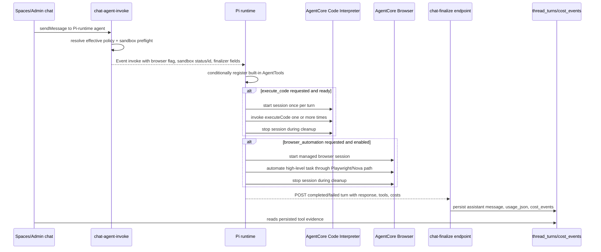

# feat: Add Pi Browser and Sandbox parity

## Overview

Make the Pi runtime eligible for core ThinkWork agent dogfooding by closing the two remaining baseline built-in gaps: `execute_code` through AgentCore Code Interpreter and `browser_automation` through AgentCore Browser. The work keeps Strands unchanged, preserves the existing API-side policy and preflight model, and adds Pi runtime finalizer parity so Spaces/admin chat turns persist real tool evidence instead of only returning it from a synchronous runtime response.

This is not a runtime re-decision. The product direction remains "folder is the agent", with Pi as the minimal runtime that can honor filesystem-owned behavior. This plan makes Pi safe enough to test as the core runtime without losing Browser Automation, Code Sandbox, MCP, or memory observability (see origin: `docs/brainstorms/2026-05-23-pi-browser-sandbox-core-agent-readiness-requirements.md`).

---

## Problem Frame

Operators can now select Pi versus Strands, but Pi is not yet core-agent ready. Strands already has mature Browser and Sandbox tool paths. Pi has a good tool substrate, real MCP bridging, and a Code Interpreter connector package, but it currently lacks a callable `execute_code` agent tool, has no Browser Automation tool, and still treats `sandbox_interpreter_id` as an unconditional invocation contract. That unconditional validation conflicts with the product contract: sandbox availability is resolved by `chat-agent-invoke` preflight only when the agent/template policy asks for sandbox.

There is also a chat-turn lifecycle mismatch. `chat-agent-invoke` dispatches AgentCore runtimes in Event mode and sends `finalize_callback_url`, `finalize_callback_secret`, and `thread_turn_id`. Strands posts the completed turn back to `/api/threads/{threadId}/finalize`; Pi currently documents chat-turn completion as owned by the synchronous caller. Browser and Sandbox parity will not be testable from Spaces/admin until Pi posts the same finalizer payload with `tools_called`, `tool_invocations`, and `tool_costs`.

---

## Requirements Trace

- R1. Pi exposes a real `execute_code` Pi `AgentTool` when sandbox preflight is ready and `sandbox_interpreter_id` is present.
- R2. Existing sandbox gates remain API-owned: template opt-in, tenant availability, invoking-user identity, and interpreter readiness.
- R3. Pi uses one AgentCore Code Interpreter session per agent turn, reuses it across multiple calls, and stops it at turn end.
- R4. Pi returns Strands-equivalent structured Sandbox results: success/failure, stdout, stderr, truncation, exit status, duration, and provisioning/cap/timeout/OOM/error states.
- R5. Pi preserves sandbox quota and audit semantics, including fail-before-spend quota denial.
- R6. Pi consumes the AgentCore stream shape with `result.content[]` and `result.structuredContent`.
- R7. Pi exposes a real `browser_automation` Pi `AgentTool` when the same effective policy enables Browser Automation.
- R8. Browser remains high-level task automation, not raw browser primitives.
- R9. Pi starts and closes managed AgentCore Browser sessions, returns bounded results, and surfaces unavailable/provisioning errors clearly.
- R10. Browser cost and event metadata distinguish AgentCore Browser substrate costs from high-level automation costs.
- R11. Deployed verification proves a browser session was used, not merely listed in a manifest.
- R12. Pi returns and persists `tools_called` and `tool_invocations` for Browser and Sandbox.
- R13. Tool availability respects tenant disabled built-ins, template/space effective policy, capability catalog narrowing, and runtime selection.
- R14. The core ThinkWork agent is not Pi-ready until a deployed Spaces/admin turn exercises both tools with observable evidence.
- R15. Strands behavior remains unchanged.

**Origin actors:** A1 Operator, A2 Core ThinkWork agent, A3 End user, A4 Platform engineer.

**Origin flows:** F1 Core agent invokes Code Sandbox on Pi, F2 Core agent invokes Browser Automation on Pi, F3 Runtime parity gate for core-agent promotion.

**Origin acceptance examples:** AE1 Sandbox happy path, AE2 sandbox disabled/quota path, AE3 Browser happy path, AE4 Browser cost split, AE5 Strands/Pi policy parity, AE6 core dogfood gate.

---

## Scope Boundaries

- Replacing Strands is out of scope. This plan adds Pi parity without weakening the working Strands paths.
- Raw browser-control primitives are out of scope. Pi should expose one high-level `browser_automation` tool that matches the existing product promise.
- Cross-turn Code Interpreter filesystem persistence is out of scope. The required model is still one sandbox session per agent turn.
- New sandbox environments, network policy models, credential-injection models, quota products, and admin governance UI are out of scope unless implementation discovers a hard parity blocker.
- Full MCP rework is out of scope. Pi already has an MCP bridge; Browser/Sandbox should only use MCP-style adapters if the runtime-visible behavior and observability contract remain the same.
- Making Pi the default runtime is out of scope for this PR. The deliverable is readiness evidence and an opt-in dogfood gate.

### Deferred to Follow-Up Work

- Core-agent default switch: make Pi preferred only after the deployed parity smoke passes and the team accepts the dogfood evidence.
- Exact AgentCore Browser usage reconciliation beyond invocation-time estimates: add later CloudWatch/span reconciliation if synchronous Browser session metrics are not available.
- Lower-level browser primitive tools: revisit only after high-level Browser Automation parity is stable.

---

## Context & Research

### Relevant Code and Patterns

- `packages/agentcore-pi/agent-container/src/server.ts` builds Pi `AgentTool[]`, records `tool_execution_start` / `tool_execution_end`, drains cleanup callbacks, and returns `tools_called` / `tool_invocations`.
- `packages/agentcore-pi/agent-container/src/server.ts` currently calls `resolveSandboxFactory` before tool assembly and returns 500 when `sandbox_interpreter_id` is missing. This must become conditional on sandbox policy/preflight state.
- `packages/agentcore-pi/agent-container/src/runtime/sandbox-factory.ts` and `packages/pi-aws/connectors/agentcore-codeinterpreter.ts` already wrap AgentCore Code Interpreter session start, invoke, stream parsing, and stop.
- `packages/agentcore-strands/agent-container/container-sources/sandbox_tool.py` is the behavioral source of truth for result shape, per-turn session reuse, quota-before-session, best-effort audit logging, truncation, and cleanup.
- `packages/agentcore-strands/agent-container/container-sources/browser_automation_tool.py` is the behavioral source of truth for `browser_automation`, unavailable states, bounded Playwright/Nova execution, event emission, and split Browser/Nova costs.
- `packages/api/src/handlers/chat-agent-invoke.ts` already sends `browser_automation_enabled`, `blocked_tools`, `mcp_configs`, sandbox preflight fields, and finalizer callback fields to the selected runtime.
- `packages/api/src/lib/chat-finalize/types.ts` and `packages/api/src/lib/chat-finalize/process-finalize.ts` define the persisted finalizer contract for messages, turn status, `tool_invocations`, `tools_called`, and `tool_costs`.
- `packages/api/scripts/pi-runtime-capability-smoke.ts` already checks persisted Pi `tool_invocations` for `plain`, `web_search`, `execute_code`, `hindsight`, and `mcp`, but does not include Browser yet.
- `terraform/modules/app/agentcore-runtime/main.tf` grants Strands both Code Interpreter and Browser IAM actions. `terraform/modules/app/agentcore-pi/main.tf` grants Code Interpreter but does not yet include the Browser IAM statement.

### Institutional Learnings

- `docs/solutions/integration-issues/agentcore-runtime-role-missing-code-interpreter-perms-2026-04-24.md` shows runtime tool code and IAM must ship together; missing AgentCore permissions only surface during real tool calls.
- `docs/solutions/best-practices/bedrock-agentcore-sdk-version-drift-prefer-raw-boto3-2026-04-24.md` warns that AgentCore wrappers drift. Keep SDK-specific Browser and Code Interpreter logic isolated behind focused modules and tests.
- `docs/solutions/workflow-issues/agentcore-runtime-no-auto-repull-requires-explicit-update-2026-04-24.md` means deployed verification must confirm the new Pi image is actually serving traffic.
- `docs/solutions/best-practices/activation-runtime-narrow-tool-surface-2026-04-26.md` reinforces that built-ins must be gated by resolved policy instead of letting runtime defaults widen the surface.
- `docs/solutions/workflow-issues/platform-agent-space-runtime-refactor-autopilot-sequencing-2026-05-23.md` is relevant sequencing context: platform runtime changes should be split into bounded, deployable slices with explicit autopilot/dogfood gates.

### External References

- AWS AgentCore Code Interpreter docs confirm direct session/invoke usage, including `InvokeCodeInterpreter` with `name: executeCode`, `language`, `code`, and a streamed `result.content[]` response: `https://docs.aws.amazon.com/bedrock-agentcore/latest/devguide/code-interpreter-execute-code.html`.
- Botocore AgentCore docs confirm `InvokeCodeInterpreter` supports `executeCode`, `executeCommand`, file operations, `structuredContent`, and expected exception classes: `https://docs.aws.amazon.com/botocore/latest/reference/services/bedrock-agentcore/client/invoke_code_interpreter.html`.
- AWS AgentCore Browser docs confirm Browser is session-based, supports Automation streams, uses Playwright/browser-use style clients, and should be explicitly stopped to avoid charges: `https://docs.aws.amazon.com/bedrock-agentcore/latest/devguide/browser-resource-session-management.html`.
- AWS Browser/Live View TypeScript article confirms the `bedrock-agentcore` TypeScript SDK exposes `Browser` and `PlaywrightBrowser` classes for Node-side Browser sessions and Playwright-over-CDP automation: `https://aws.amazon.com/blogs/machine-learning/embed-a-live-ai-browser-agent-in-your-react-app-with-amazon-bedrock-agentcore/`.
- AWS AgentCore pricing docs are the cost-model reference for Browser active CPU/memory estimates: `https://aws.amazon.com/bedrock/agentcore/pricing/`.

---

## Key Technical Decisions

- **Keep API-side policy authoritative.** `chat-agent-invoke` and `resolve-agent-runtime-config` remain the source of truth for Browser and Sandbox enablement. Pi consumes `browser_automation_enabled`, `blocked_tools`, `sandbox_status`, and `sandbox_interpreter_id`; it does not re-resolve tenant/template policy.
- **Replace unconditional sandbox validation with conditional registration.** Pi should not 500 when no sandbox was requested. It should register a real `execute_code` tool only for ready preflight, register a structured unavailable/provisioning stub when policy requested sandbox but preflight is not ready, and omit the tool when sandbox is not part of the effective policy.
- **Build dedicated Pi built-in tool modules.** Browser and Sandbox should not be implemented inline inside `server.ts`. Use modules under `packages/agentcore-pi/agent-container/src/runtime/tools/` so SDK drift, result shaping, costs, and cleanup stay testable.
- **Use `@thinkwork/pi-aws` as the Code Interpreter transport layer, not the product contract.** The connector already handles AWS session/invoke/stream mechanics. A Pi `execute_code` tool module should wrap it with Strands-compatible result semantics, quota checks, audit logging, truncation, and cleanup.
- **Prefer the AgentCore TypeScript Browser SDK for Pi.** Use the `bedrock-agentcore` Node package and its `PlaywrightBrowser` path if it fits the deployed Lambda image. If implementation discovers a blocking SDK/package issue, fall back to a thin internal bridge hidden behind the same Pi `browser_automation` module rather than changing the runtime-visible tool contract.
- **Pi must post chat finalizers.** Event-mode Spaces/admin turns require Pi to POST the same finalizer contract Strands posts. The synchronous response path can remain for direct/eval harnesses that omit finalizer fields, but it cannot be the only chat-turn completion mechanism.
- **Browser cost rows originate in runtime tools and are normalized by finalization.** Browser modules collect tool-cost metadata during execution; Sandbox modules collect invocation/audit metadata. Pi includes Browser costs in both top-level response and finalizer `response.tool_costs` so `process-finalize` can persist them with thread/agent attribution.
- **Strands stays untouched except as a reference.** Tests may compare Pi outputs to Strands fixture semantics, but the working Python runtime should not be refactored as part of this parity slice.

---

## Open Questions

### Resolved During Planning

- Should `execute_code` wrap `@thinkwork/pi-aws` or reimplement AWS SDK calls directly? Use `@thinkwork/pi-aws` for lower-level session/stream mechanics, with a dedicated Pi tool wrapper for ThinkWork product semantics.
- Should missing sandbox fields be a Pi contract violation? Only when the payload says sandbox is ready but the interpreter id is absent. No sandbox policy/request should mean no `execute_code` tool, not a 500.
- Should Browser be raw browser primitives or a high-level tool? High-level `browser_automation`, matching Strands and the origin requirements.
- Where should Browser costs be emitted? In the Pi Browser tool module, then passed through Pi response/finalizer as `tool_costs` for existing cost persistence.
- What proves readiness? A deployed Spaces/admin Pi turn that persists successful `execute_code` and `browser_automation` evidence in `thread_turns.usage_json`, plus Browser cost/event evidence.

### Deferred to Implementation

- Exact TypeScript Browser SDK surface and dependency footprint: implementation should confirm whether `bedrock-agentcore/browser/playwright` works in the Pi Lambda container. If not, use the internal bridge contingency without changing the external tool contract.
- Exact Browser deterministic target: choose a stable ThinkWork-controlled public page if available; otherwise use a stable public page and assert on AgentCore Browser session/event evidence rather than page text alone.
- Exact shape of Pi sandbox quota/audit helper reuse: use existing narrow REST endpoints and types where possible; add a minimal TypeScript client only if none exists.
- Exact per-call Browser CPU/memory usage: use synchronous values if available from AgentCore Browser session/span output; otherwise emit a clearly marked estimate, matching current Strands behavior.

---

## Output Structure

```text
packages/agentcore-pi/agent-container/src/runtime/tools/
  execute-code.ts
  browser-automation.ts
  tool-costs.ts
packages/agentcore-pi/agent-container/src/runtime/
  chat-finalize.ts
packages/agentcore-pi/agent-container/tests/
  execute-code-tool.test.ts
  browser-automation-tool.test.ts
  chat-finalize.test.ts
```

This is the expected new-file shape. The implementing agent may adjust helper filenames if existing local conventions make a different split cleaner, but the behavior should stay in focused modules rather than expanding `server.ts`.

---

## High-Level Technical Design

> _This illustrates the intended approach and is directional guidance for review, not implementation specification. The implementing agent should treat it as context, not code to reproduce._



---

## Implementation Units

- U1. **Make Pi built-in registration policy-aware**

**Goal:** Replace Pi's unconditional sandbox-id validation with a policy-aware built-in registration contract that can support Browser and Sandbox without widening tool availability.

**Requirements:** R1, R2, R7, R13, R15; AE2, AE5.

**Dependencies:** None.

**Files:**

- Modify: `packages/agentcore-pi/agent-container/src/server.ts`
- Modify: `packages/agentcore-pi/agent-container/src/runtime/sandbox-factory.ts`
- Test: `packages/agentcore-pi/agent-container/tests/server.test.ts`
- Test: `packages/agentcore-pi/agent-container/tests/sandbox-factory.test.ts`

**Approach:**

- Stop calling `resolveSandboxFactory` unconditionally before `assembleTools`.
- Treat `sandbox_status`, `sandbox_reason`, and `sandbox_interpreter_id` as preflight output, not a mandatory global Pi payload.
- Register no `execute_code` tool when sandbox was not requested by effective policy.
- Register a structured unavailable/provisioning `execute_code` stub only when the API explicitly reports a non-ready sandbox state for a sandbox-enabled agent. The stub should be tool evidence if the agent calls it, but it must not open an AgentCore session.
- Register the real tool only when `sandbox_status === "ready"` and `sandbox_interpreter_id` is a non-empty string.
- Add analogous conditional registration hooks for Browser using `browser_automation_enabled`, while leaving the actual Browser implementation to U3.

**Execution note:** Start with characterization coverage around current missing-sandbox behavior before changing the handler.

**Patterns to follow:**

- `packages/api/src/lib/sandbox-preflight.ts`
- `packages/api/src/handlers/chat-agent-invoke.ts`
- `packages/agentcore-strands/agent-container/container-sources/server.py`

**Test scenarios:**

- Happy path: payload with no sandbox fields and no Browser flag returns a successful Pi response and does not expose `execute_code` or `browser_automation`.
- Happy path: payload with `sandbox_status: "ready"` and a valid interpreter id registers `execute_code`.
- Edge case: payload with `sandbox_status: "ready"` but blank interpreter id returns a clear 500 contract error.
- Edge case: payload with `sandbox_status: "provisioning"` registers an unavailable stub that returns `SandboxProvisioning` without starting a session.
- Error path: malformed `browser_automation_enabled` or sandbox state is logged and narrowed rather than widening available tools.
- Integration: existing MCP and Hindsight tool registration still works when Browser/Sandbox fields are absent.

**Verification:**

- Pi can run a plain chat-turn payload without `sandbox_interpreter_id`.
- Pi's assembled tools match API-resolved policy states instead of runtime defaults.

---

- U2. **Add Pi `execute_code` AgentTool**

**Goal:** Implement a real Pi `execute_code` tool backed by AgentCore Code Interpreter, with Strands-equivalent result shape, per-turn session reuse, cleanup, quota, audit, and stream parsing.

**Requirements:** R1, R3, R4, R5, R6, R12, R13; F1; AE1, AE2.

**Dependencies:** U1.

**Files:**

- Create: `packages/agentcore-pi/agent-container/src/runtime/tools/execute-code.ts`
- Create: `packages/agentcore-pi/agent-container/tests/execute-code-tool.test.ts`
- Modify: `packages/agentcore-pi/agent-container/src/server.ts`
- Modify: `packages/pi-aws/connectors/agentcore-codeinterpreter.ts`
- Test: `packages/pi-aws/connectors/agentcore-codeinterpreter.test.ts`

**Approach:**

- Build a Pi `AgentTool` named `execute_code` with a compact parameter schema centered on Python code and an optional timeout hint.
- Use `@thinkwork/pi-aws` for Start/Invoke/Stop mechanics and stream parsing. Tighten that connector only where needed to preserve `structuredContent`, `content[]`, exit code, stdout, stderr, and exception-member events.
- Hold session state in the per-invocation tool closure and push one cleanup callback into the existing Pi cleanup array. Multiple calls in one turn reuse the same session.
- Run sandbox quota before starting a session. If quota is denied or unreachable, return `SandboxCapExceeded` without calling AgentCore.
- Emit best-effort audit metadata compatible with the existing sandbox invocation logging path. Audit failures log but do not unwind the agent turn.
- Return a structured object aligned with Strands `SandboxResult`, including truncation flags and known error classes.

**Patterns to follow:**

- `packages/agentcore-strands/agent-container/container-sources/sandbox_tool.py`
- `packages/agentcore-strands/agent-container/test_sandbox_tool.py`
- `packages/pi-aws/connectors/agentcore-codeinterpreter.ts`
- `packages/api/src/lib/sandbox-quota.ts`
- `packages/api/src/handlers/sandbox-invocation-log.ts`

**Test scenarios:**

- Covers AE1. Happy path: one `execute_code` call prints `385`, returns `ok: true`, stdout contains `385`, exit status is success, and Pi records tool evidence.
- Happy path: two `execute_code` calls in one turn reuse one AgentCore session and stop it exactly once during cleanup.
- Covers AE2. Error path: quota denied returns `SandboxCapExceeded` and does not call StartCodeInterpreterSession.
- Error path: no interpreter for a sandbox-enabled non-ready payload returns `SandboxProvisioning` and does not call AgentCore.
- Error path: timeout maps to `SandboxTimeout`; memory error maps to `SandboxOOM`; generic AWS failure maps to `SandboxError`.
- Edge case: large stdout/stderr is truncated to Strands-equivalent caps with accurate byte counts and flags.
- Edge case: stream output containing only `result.content[]` still produces stdout; stream output containing `result.structuredContent` preserves stdout, stderr, and exit code.
- Integration: tool invocation metadata includes `execute_code`, arguments, result, success/error state, started/finished timestamps, and runtime `pi`.

**Verification:**

- Pi unit tests prove session lifecycle, stream parsing, quota-before-spend, audit best effort, and result shape.
- The deployed Pi capability smoke for `execute_code` can pass using persisted `thread_turns.usage_json.tool_invocations`.

---

- U3. **Add Pi `browser_automation` AgentTool**

**Goal:** Implement high-level Browser Automation for Pi using AgentCore Browser, with bounded results, unavailable states, events, cleanup, and split cost records.

**Requirements:** R7, R8, R9, R10, R11, R12, R13; F2; AE3, AE4, AE5.

**Dependencies:** U1.

**Files:**

- Create: `packages/agentcore-pi/agent-container/src/runtime/tools/browser-automation.ts`
- Create: `packages/agentcore-pi/agent-container/src/runtime/tools/tool-costs.ts`
- Create: `packages/agentcore-pi/agent-container/tests/browser-automation-tool.test.ts`
- Modify: `packages/agentcore-pi/agent-container/src/server.ts`
- Modify: `packages/agentcore-pi/package.json`
- Modify: `packages/agentcore-pi/agent-container/Dockerfile`

**Approach:**

- Build a Pi `AgentTool` named `browser_automation` with `url` and `task` parameters. Keep the user-facing promise at "perform this browser task and summarize the result."
- Prefer the AgentCore TypeScript Browser SDK's Playwright path for Node-side session creation and CDP automation. Add the minimal runtime dependencies required by that SDK.
- Keep a dependency probe at tool construction. When Browser is enabled but dependencies/credentials are missing, register a stub that returns a clear unavailable result and emits an unavailable event.
- Start one managed Browser session per tool call, connect automation, produce bounded text output, and stop/close the session in a cleanup/finally path.
- Emit event metadata equivalent to Strands: started, completed, failed, unavailable. Include tenant/thread/agent attribution from Pi identity.
- Emit split `tool_costs`: `agentcore_browser_session` for Browser substrate and `nova_act_browser_automation` only when a high-level Nova engine is actually used.

**Patterns to follow:**

- `packages/agentcore-strands/agent-container/container-sources/browser_automation_tool.py`
- `packages/agentcore-strands/agent-container/test_browser_automation_tool.py`
- `terraform/modules/app/agentcore-runtime/main.tf`
- AWS Browser TypeScript SDK examples linked in External References.

**Test scenarios:**

- Covers AE3. Happy path: enabled Browser tool starts a fake Browser session, navigates to a deterministic page, returns bounded text, closes the session, and records `browser_automation`.
- Covers AE4. Happy path: completed Browser run emits an AgentCore Browser cost row with tenant/thread/agent metadata, duration, URL, task summary, and success state.
- Error path: missing SDK/dependency returns a clear unavailable result and no uncaught exception.
- Error path: Browser start failure returns a bounded error, emits `browser_automation_failed`, and does not leave cleanup callbacks pending.
- Error path: automation failure after session start still closes/stops the session and emits cost/event metadata with error state.
- Edge case: large page text is bounded before being returned to the agent or stored in tool invocation metadata.
- Integration: when Browser is effectively blocked, Pi does not register `browser_automation` even if the runtime package supports it.

**Verification:**

- Pi Browser unit tests prove session lifecycle, unavailable states, cost rows, and event capture.
- A deployed Browser smoke can prove AgentCore Browser session creation and persisted tool evidence.

---

- U4. **Add Pi chat-finalizer parity and tool-cost passthrough**

**Goal:** Make Pi complete Event-mode Spaces/admin chat turns through the same finalize callback contract Strands uses, including tool evidence and tool costs.

**Requirements:** R10, R12, R14, R15; F3; AE1, AE3, AE4, AE6.

**Dependencies:** U2, U3.

**Files:**

- Create: `packages/agentcore-pi/agent-container/src/runtime/chat-finalize.ts`
- Create: `packages/agentcore-pi/agent-container/tests/chat-finalize.test.ts`
- Modify: `packages/agentcore-pi/agent-container/src/server.ts`
- Test: `packages/agentcore-pi/agent-container/tests/server.test.ts`
- Test: `packages/api/src/lib/chat-finalize/process-finalize.test.ts`

**Approach:**

- Parse `finalize_callback_url`, `finalize_callback_secret`, and `thread_turn_id` from the invocation payload.
- When finalizer fields are present, POST a `FinalizePayload` with `status`, `duration_ms`, `response.content`, `response.tool_invocations`, `response.tools_called`, `response.tool_costs`, `usage`, tenant/agent/thread ids, and trace context.
- Keep the synchronous response body for direct/eval harnesses that omit finalizer fields.
- Validate the callback URL before sending: require HTTPS and prefer same-origin matching against `THINKWORK_API_URL` when that env value is present. Treat invalid callback destinations as terminal runtime configuration errors rather than posting secrets to an arbitrary URL.
- Use bounded retries with terminal 4xx behavior, mirroring Strands finalizer tests. Do not log bearer secrets or full response bodies.
- Include failed-turn finalization where possible so thread turns do not remain `running` indefinitely when the Pi agent loop or a tool fails.
- Ensure tool costs collected by U3 and future built-ins appear both top-level and under `response.tool_costs` so `process-finalize` can persist them without runtime-specific branches.

**Patterns to follow:**

- `packages/agentcore-strands/agent-container/test_finalize_callback.py`
- `packages/api/src/lib/chat-finalize/types.ts`
- `packages/api/src/lib/chat-finalize/process-finalize.ts`
- `packages/agentcore-pi/agent-container/src/server.ts` completion callback retry shape for skill runs.

**Test scenarios:**

- Happy path: successful Pi turn posts a finalizer payload with response content, `execute_code`, `browser_automation`, and tool cost rows.
- Happy path: direct invocation without finalizer fields still returns the normal synchronous body.
- Error path: agent-loop failure posts `status: "failed"` with bounded error text when finalizer fields are present.
- Error path: 503 then 200 retries and succeeds; 4xx does not retry; 401 is surfaced as an auth configuration error.
- Error path: non-HTTPS or origin-mismatched finalizer URL is rejected before any bearer secret is sent.
- Edge case: missing `thread_turn_id` disables chat finalization and logs a clear warning instead of posting malformed payload.
- Integration: `process-finalize` persists Pi `tool_invocations`, `tools_called`, and `tool_costs` identically to Strands.

**Verification:**

- Event-mode Pi chat turns no longer depend on `chat-agent-invoke` waiting for a synchronous Lambda response.
- Persisted `thread_turns.usage_json` contains Pi Browser and Sandbox evidence after finalization.

---

- U5. **Wire Pi IAM and deployed runtime configuration**

**Goal:** Ensure the deployed Pi Lambda role and runtime environment can actually run Browser/Sandbox tools in AWS, with no hidden permission or configuration gap.

**Requirements:** R3, R6, R9, R10, R11, R15.

**Dependencies:** U2, U3, U4.

**Files:**

- Modify: `terraform/modules/app/agentcore-pi/main.tf`
- Modify: `terraform/modules/app/agentcore-pi/README.md`
- Modify: `terraform/modules/thinkwork/main.tf`
- Test: `packages/agentcore-pi/agent-container/tests/browser-automation-tool.test.ts`
- Test: `packages/agentcore-pi/agent-container/tests/execute-code-tool.test.ts`

**Approach:**

- Mirror the Strands Browser IAM statement in `terraform/modules/app/agentcore-pi/main.tf`: Start/Get/List/Stop browser sessions plus automation/live-view stream actions and both system/custom browser ARN shapes.
- Confirm the existing Pi Code Interpreter IAM statement matches current AWS SDK actions and resource shapes.
- Add Browser runtime environment variables needed by the Pi tool module, such as Browser engine, estimate defaults, and Nova Act parameter name only if the Pi implementation uses them.
- Confirm the Node dependency and Docker changes from U3 are deployable in the Pi Lambda image without switching the repo away from pnpm.
- Wire only the terraform variables/env values that the implemented Browser module actually consumes.

**Patterns to follow:**

- `terraform/modules/app/agentcore-runtime/main.tf`
- `packages/agentcore-pi/agent-container/Dockerfile`
- `docs/solutions/integration-issues/agentcore-runtime-role-missing-code-interpreter-perms-2026-04-24.md`

**Test scenarios:**

- Config: Browser IAM policy includes all actions used by the Pi Browser module and scopes to AgentCore Browser resources.
- Config: Pi Docker/package changes include the Browser SDK and do not remove existing MCP/Hindsight/Code Interpreter dependencies.
- Error path: missing Browser permission produces a recognizable runtime error in the Browser tool result and logs, not a silent missing-tool response.
- Regression: Strands terraform and runtime package behavior are unchanged.

**Verification:**

- Terraform diff shows Pi Browser permissions without modifying Strands permissions except for comments if needed.
- Pi image can build with the Browser dependency set and existing Pi tests still pass.

---

- U6. **Extend deployed smokes for Browser plus combined Pi readiness**

**Goal:** Make readiness testable from the same deployed surfaces operators use: Spaces/admin chat turns and persisted thread-turn evidence.

**Requirements:** R11, R12, R14; F3; AE1, AE3, AE4, AE6.

**Dependencies:** U2, U3, U4, U5.

**Files:**

- Modify: `packages/api/scripts/pi-runtime-capability-smoke.ts`
- Modify: `scripts/post-deploy-smoke-pi.sh`
- Modify: `scripts/smoke/spaces-surface-smoke.mjs`
- Test: `packages/api/src/__tests__/pi-runtime-capability-smoke.test.ts`

**Approach:**

- Add `browser_automation` to the Pi capability smoke, including a prompt that forces exactly one Browser call against a deterministic target.
- Add evidence checks for persisted `thread_turns.usage_json.tool_invocations`, Browser event/cost metadata, and assistant response token.
- Add a combined readiness scenario that exercises `execute_code` and `browser_automation` in a Pi-runtime agent turn or in two back-to-back turns on the same agent, depending on model reliability.
- Keep the smoke failure mode crisp: distinguish no tool registered, tool call failed, result evidence missing, finalizer missing, cost event missing, and timeout.
- Extend the Spaces surface smoke with a Pi runtime option so the test starts from the app-facing route, not only a direct GraphQL harness.

**Patterns to follow:**

- `packages/api/scripts/pi-runtime-capability-smoke.ts`
- `scripts/smoke/spaces-surface-smoke.mjs`
- `packages/api/test/integration/sandbox/sandbox-pilot.e2e.test.ts`

**Test scenarios:**

- Covers AE1. Execute-code smoke passes only when persisted tool evidence includes successful `execute_code` and expected stdout/result.
- Covers AE3. Browser smoke passes only when persisted tool evidence includes successful `browser_automation` and Browser session/event evidence.
- Covers AE4. Browser smoke can require at least one Browser tool cost row when the stage is configured for cost persistence.
- Covers AE6. Combined Pi readiness smoke fails if either Browser or Sandbox evidence is missing, even if the assistant text looks plausible.
- Error path: finalizer does not run, leaving the turn queued/running; smoke reports finalizer/persistence failure rather than generic timeout.

**Verification:**

- Deployed dev smoke provides the evidence needed to decide whether the core ThinkWork agent can be dogfooded on Pi.
- Failures point to runtime registration, AWS tool execution, finalizer persistence, or smoke target separately.

---

- U7. **Document the Pi parity gate and operator testing path**

**Goal:** Leave a durable handoff for operators and future agents explaining how Pi Browser/Sandbox parity is enabled, tested, and promoted.

**Requirements:** R14, R15; F3; AE5, AE6.

**Dependencies:** U6.

**Files:**

- Create or modify: `docs/runbooks/pi-runtime-capability-smoke.md`
- Modify: `docs/plans/2026-05-23-004-feat-pi-browser-sandbox-parity-plan.md` only if implementation discovers plan-level changes during execution
- Modify: `packages/agentcore-pi/README.md` if present after implementation, otherwise `terraform/modules/app/agentcore-pi/README.md`

**Approach:**

- Document how to select Pi for an agent, what Browser/Sandbox effective policy must be enabled, and what smoke evidence proves readiness.
- Record known limitations: no cross-turn Code Interpreter persistence, no raw browser primitives, Browser cost estimates when exact usage is unavailable, and Pi remains opt-in until readiness evidence is accepted.
- Include a short troubleshooting matrix for missing tool, AccessDenied, finalizer not posting, Browser dependency unavailable, quota exceeded, and no persisted cost rows.

**Patterns to follow:**

- Existing runbooks under `docs/runbooks/`
- `terraform/modules/app/agentcore-pi/README.md`

**Test scenarios:**

- Test expectation: none - this is documentation, but every command/path/example should be checked against the implemented names before the PR is opened.

**Verification:**

- A platform engineer can reproduce the readiness smoke from the runbook without reading the implementation PR.

---

## System-Wide Impact

- **Interaction graph:** The key path is `sendMessage` -> `chat-agent-invoke` -> Pi Event-mode runtime -> Pi finalizer POST -> `process-finalize` -> `thread_turns` / `messages` / `cost_events`. Browser and Sandbox tools also touch AgentCore Browser, AgentCore Code Interpreter, quota/audit endpoints, and runtime IAM.
- **Error propagation:** API-side policy/preflight errors should narrow or stub tools before runtime. Runtime AWS/tool errors should return structured tool results when the agent can recover, and failed finalizer payloads when the turn itself cannot complete.
- **State lifecycle risks:** Code Interpreter sessions and Browser sessions must be stopped in cleanup/finally paths. Tool cleanup must run even when the model throws, an MCP transport errors, or finalization fails.
- **API surface parity:** `tools_called`, `tool_invocations`, `tool_costs`, `hindsight_usage`, and usage metadata must remain runtime-agnostic for `process-finalize`, admin thread inspectors, wakeup persistence, and smoke harnesses.
- **Integration coverage:** Unit tests alone cannot prove readiness. The deployed Spaces/admin smoke is required because it validates runtime selection, async Lambda invocation, finalizer persistence, AWS permissions, tool cost insertion, and UI-visible thread state together.
- **Unchanged invariants:** Strands Browser/Sandbox behavior, API-side effective policy resolution, tenant disabled built-ins, and capability catalog narrowing remain the same. Pi consumes these contracts; it does not replace them.

---

## Alternative Approaches Considered

- **Keep using Strands for core agents and leave Pi experimental:** Rejected for this slice because the product direction prioritizes filesystem-owned agents, and Pi cannot become the core dogfood runtime until parity blockers are closed.
- **Expose Browser/Sandbox only through MCP adapters:** Deferred. MCP is valuable for filesystem compatibility, but Browser/Sandbox already have runtime-owned session lifecycle, cost, IAM, quota, and audit contracts. Hiding them behind generic MCP too early would make parity harder to prove.
- **Port the Python Strands Browser/Sandbox modules wholesale into Pi:** Rejected as the default because Pi is a TypeScript runtime and already has a TypeScript Code Interpreter connector. A thin internal bridge remains a contingency only if the AgentCore Browser TypeScript SDK is unsuitable.
- **Make Pi the default runtime immediately after tools register:** Rejected. The origin requires deployed evidence from Spaces/admin, not just manifest/tool-list parity.

---

## Success Metrics

- A Pi-runtime agent can execute `execute_code` in dev and persist successful `execute_code` evidence in `thread_turns.usage_json.tool_invocations`.
- A Pi-runtime agent can execute `browser_automation` in dev and persist successful Browser evidence plus Browser tool cost/event metadata.
- A Spaces/admin chat turn using Pi completes through the finalizer callback and does not leave turns stuck in queued/running state.
- The combined Pi readiness smoke clearly passes or identifies the failing layer.
- Strands Browser and Sandbox tests continue to pass unchanged.

---

## Risks & Dependencies

| Risk                                                                                                     | Likelihood | Impact | Mitigation                                                                                                                        |
| -------------------------------------------------------------------------------------------------------- | ---------- | ------ | --------------------------------------------------------------------------------------------------------------------------------- |
| AgentCore Browser TypeScript SDK shape differs from the AWS article or is too heavy for the Lambda image | Medium     | High   | Hide Browser mechanics behind `browser-automation.ts`; keep an internal bridge contingency without changing the Pi tool contract. |
| Pi finalizer mismatch leaves Spaces/admin turns running forever                                          | Medium     | High   | Implement finalizer parity before deployed smoke; add success and failure finalizer tests.                                        |
| Finalizer callback URL could leak bearer auth if blindly trusted                                         | Low        | High   | Validate HTTPS and same-origin against `THINKWORK_API_URL` before sending the bearer secret.                                      |
| Unconditional sandbox validation keeps breaking non-sandbox Pi agents                                    | High       | Medium | U1 changes missing sandbox fields from global contract violation to policy-aware registration.                                    |
| IAM is incomplete for Browser                                                                            | Medium     | High   | Mirror Strands Browser IAM in Pi terraform and include an AccessDenied troubleshooting path in tests/runbook.                     |
| Tool call evidence is present but cost rows are dropped                                                  | Medium     | Medium | Include `tool_costs` in both Pi response and finalizer `response`, and add finalize persistence assertions.                       |
| Browser smoke is flaky due to public site variability                                                    | Medium     | Medium | Prefer a deterministic ThinkWork-controlled page; assert on AgentCore session/event evidence rather than page text alone.         |
| Sandbox quota/audit calls add latency or fail closed too aggressively                                    | Low        | Medium | Keep quota before session start, use bounded timeouts, and surface structured `SandboxCapExceeded` with clear reason.             |
| Strands regression through shared config changes                                                         | Low        | High   | Keep Strands runtime code unchanged and run existing Strands Browser/Sandbox tests as regression coverage.                        |

---

## Phased Delivery

### Phase 1 - Runtime contract and `execute_code`

Land U1 and U2 first. This removes the current missing-sandbox cliff and proves Code Interpreter parity on Pi with focused tests.

### Phase 2 - Browser and finalizer

Land U3 and U4 together or as tightly sequenced PRs. Browser tool evidence is not product-useful until finalizer persistence works for Event-mode Spaces/admin turns.

### Phase 3 - Deployability and readiness evidence

Land U5, U6, and U7. Deploy dev, force the Pi image/role update, run the capability smokes, then decide whether the core ThinkWork agent can enter Pi dogfooding.

---

## Documentation / Operational Notes

- Update the Pi runtime runbook with Browser/Sandbox prerequisites, smoke instructions, and troubleshooting.
- PR evidence should include local Pi tests, package build/typecheck outcomes, terraform diff summary for Pi IAM, and deployed dev smoke results.
- Do not claim Pi core-agent readiness until the deployed smoke has real persisted tool evidence for both Browser and Sandbox.
- If Browser cost rows are estimates, label them in metadata and record the future reconciliation follow-up.

---

## Sources & References

- **Origin document:** [docs/brainstorms/2026-05-23-pi-browser-sandbox-core-agent-readiness-requirements.md](../brainstorms/2026-05-23-pi-browser-sandbox-core-agent-readiness-requirements.md)
- **Prior Pi tool plan:** [docs/plans/2026-04-27-002-feat-pi-runtime-tool-execution-plan.md](2026-04-27-002-feat-pi-runtime-tool-execution-plan.md)
- **Prior Browser plan:** [docs/plans/2026-04-25-002-feat-agentcore-browser-automation-plan.md](2026-04-25-002-feat-agentcore-browser-automation-plan.md)
- **Prior Sandbox plan:** [docs/plans/2026-04-22-006-feat-agentcore-code-sandbox-plan.md](2026-04-22-006-feat-agentcore-code-sandbox-plan.md)
- **Pi runtime:** `packages/agentcore-pi/agent-container/src/server.ts`
- **Pi Code Interpreter connector:** `packages/pi-aws/connectors/agentcore-codeinterpreter.ts`
- **Strands Sandbox tool:** `packages/agentcore-strands/agent-container/container-sources/sandbox_tool.py`
- **Strands Browser tool:** `packages/agentcore-strands/agent-container/container-sources/browser_automation_tool.py`
- **Chat invoke dispatch:** `packages/api/src/handlers/chat-agent-invoke.ts`
- **Chat finalize contract:** `packages/api/src/lib/chat-finalize/types.ts`
- **AWS Code Interpreter docs:** `https://docs.aws.amazon.com/bedrock-agentcore/latest/devguide/code-interpreter-execute-code.html`
- **AWS Code Interpreter API docs:** `https://docs.aws.amazon.com/botocore/latest/reference/services/bedrock-agentcore/client/invoke_code_interpreter.html`
- **AWS Browser session docs:** `https://docs.aws.amazon.com/bedrock-agentcore/latest/devguide/browser-resource-session-management.html`
- **AWS Browser TypeScript SDK article:** `https://aws.amazon.com/blogs/machine-learning/embed-a-live-ai-browser-agent-in-your-react-app-with-amazon-bedrock-agentcore/`
