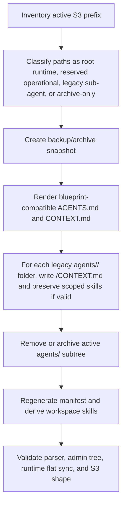

# refactor: Align fleet-caterpillar workspace to folder-as-agent blueprint

## Overview

Rework the dev S3 workspace for agent slug `fleet-caterpillar-456` in tenant `sleek-squirrel-230` so the folder tree matches the folder-as-agent blueprint from `workspace-blueprint/START-HERE.md`: this is a three-layer context delivery system, not just tidier file organization. Root `AGENTS.md` is the always-loaded map, root `CONTEXT.md` is the progressive-discovery router, and sub-agents are plain root folders with their own `CONTEXT.md`, not full copied agents under `agents/<slug>/`.

This plan is an operational data repair plus a small hardening slice. It does not redesign the runtime. The aim is to make this one agent compatible with the existing ThinkWork fat-folder contract, then leave reusable validation so the same legacy shape does not creep back in.

---

## Problem Frame

The current `fleet-caterpillar-456` S3 workspace was mostly materialized from a legacy single-agent/Marco-style shape. The live prefix contains root canonical files, but its sub-agents are stored under `workspace/agents/<slug>/` and each subfolder is a copied full agent bundle with `AGENTS.md`, `GUARDRAILS.md`, `PLATFORM.md`, `CAPABILITIES.md`, `MEMORY_GUIDE.md`, `ROUTER.md`, `SOUL.md`, `USER.md`, `manifest.json`, `memory/*`, and `skills/*`.

That conflicts with the current product model in the origin document: sub-agents should be plain folders enumerated by the parent `AGENTS.md` routing table, usually discovered through `CONTEXT.md`, with `memory/` and `skills/` reserved at every depth. It also conflicts with `workspace-blueprint/START-HERE.md`, which frames the structure as a three-layer routing architecture: Layer 1 map, Layer 2 router, and Layer 3 self-contained workspaces. The current `agents/<slug>/` copies flatten that funnel and encourage the agent to load too much duplicated context.

The operational fix should be careful: preserve useful root-level memory, skills, review artifacts, and audit history; archive the legacy `agents/` subtree rather than destroying it blindly; then write a clean folder-native tree that the admin builder, parsers, and runtimes can load without special cases.

---

## Requirements Trace

- R1. The root workspace must implement the `START-HERE.md` context-delivery model: Layer 1 map, Layer 2 router, and Layer 3 scoped workspace folders.
- R1a. The root map must explain what exists and where to go, not carry detailed specialist instructions.
- R1b. The root router must narrow each task to the right folder and call out what to load and what to skip.
- R2. Sub-agents must live as plain folders at the workspace root, not under a synthetic `agents/` folder.
- R3. Each sub-agent folder must be discoverable through the parent `AGENTS.md` routing table and contain at least a scoped `CONTEXT.md`.
- R4. Reserved folders `memory/` and `skills/` must remain reserved and must not be treated as sub-agents.
- R5. Root workspace skills and agent-specific memory must be preserved unless explicitly classified as legacy copied content.
- R6. Copied full-agent files inside legacy sub-agent folders must be collapsed into blueprint-style scoped context instead of duplicated wholesale.
- R7. The operation must be recoverable: inventory, backup/archive, dry-run diff, and post-write validation are required before declaring the S3 repair complete.
- R8. The repaired workspace must remain compatible with existing admin builder parsing, workspace skill derivation, Strands/Pi flat sync, and manifest regeneration.

**Origin actors:** A2 Tenant operator, A4 Agent runtime, A5 Sub-agent, A6 Ecosystem author.

**Origin flows:** F3 Sub-agent delegation at runtime, extended with the blueprint’s Layer 1/2/3 routing flow.

**Origin acceptance examples:** AE2 thin-specialist inheritance, AE6 scoped skills, AE7 reserved-name enforcement.

---

## Scope Boundaries

- Do not mutate production tenants. This plan targets the dev tenant/agent pair only: `sleek-squirrel-230` / `fleet-caterpillar-456`.
- Do not rewrite platform runtime composition semantics. Use the existing flat S3 sync plus existing `AGENTS.md` parsing contract.
- Do not delete audit, review, memory, or root skill content during the main repair.
- Do not copy platform built-in tools into `workspace/skills/`.
- Do not rename ThinkWork `AGENTS.md` to `CLAUDE.md`; map the blueprint’s `CLAUDE.md` role onto ThinkWork’s `AGENTS.md`.
- Do not preserve `workspace/agents/` as an active compatibility layer after the repair. It should be archived or removed from the active prefix.

### Deferred to Follow-Up Work

- Generalizing this into a multi-agent repair CLI or admin button: separate follow-up after this one-agent repair proves the shape.
- Full importer support for copying external blueprint folders into arbitrary agents: existing origin requirements cover it, but this plan only uses the blueprint as the target pattern.

---

## Context & Research

### Relevant Code and Patterns

- `packages/workspace-defaults/files/AGENTS.md` already describes ThinkWork’s folder-as-agent model: root map, `CONTEXT.md`, reserved `memory/` and `skills/`, and routing by `AGENTS.md`.
- `packages/api/src/lib/agents-md-parser.ts` and `packages/agentcore/agent-container/agents_md_parser.py` parse the `| Task | Go to | Read | Skills |` routing table and reject reserved `memory` / `skills` rows.
- `packages/api/workspace-files.ts` supports agent file list/get/put/delete, create-sub-agent behavior, manifest regeneration, and skill derivation on `AGENTS.md` / `SKILL.md` changes.
- `packages/api/src/lib/workspace-bootstrap.ts` and `packages/agentcore-pi/agent-container/src/runtime/bootstrap-workspace.ts` document the current flat S3 sync assumption: runtime reads only the agent workspace prefix.
- `apps/admin/src/components/agent-builder/WorkspaceEditor.tsx` and `apps/admin/src/components/agent-builder/FolderTree.tsx` already parse `AGENTS.md` rows and render route-aware folders.
- `packages/api/src/__tests__/workspace-files-handler.test.ts` has coverage for creating a sub-agent folder by writing `<slug>/CONTEXT.md` and appending a root `AGENTS.md` routing row.

### Institutional Learnings

- `docs/solutions/design-patterns/gitkeep-materialization-s3-empty-folders-2026-05-13.md` says empty S3 folders need filtered `.gitkeep` sentinels.
- `docs/solutions/architecture-patterns/workspace-skills-load-from-copied-agent-workspace-2026-04-28.md` says editable skills belong under `workspace/skills/<slug>/SKILL.md` and runtime activation reads the copied workspace.
- `docs/solutions/best-practices/injected-built-in-tools-are-not-workspace-skills-2026-04-28.md` warns not to materialize platform-owned built-ins as workspace skills.
- `docs/plans/2026-05-22-002-fix-artifact-builder-upgradable-sha-backfill-plan.md` identifies this exact dev agent as a previously stranded workspace-defaults repair target, so its skill files may contain legitimate recent fixes that must be preserved.

### External Blueprint Source

- `workspace-blueprint/START-HERE.md` is the primary blueprint reference. It says the structure is a context delivery system and defines the three-layer funnel: Layer 1 `CLAUDE.md` map, Layer 2 root `CONTEXT.md` router, Layer 3 workspace folders with their own `CONTEXT.md`.
- `workspace-blueprint/CLAUDE.md` shows the always-loaded map pattern: folder tree, quick navigation, cross-workspace flow, ID/naming conventions, placement rules, token-management guidance, and skills/tools inventory.
- `workspace-blueprint/CONTEXT.md` shows the router pattern: task-to-folder routing plus “you’ll also need” references.
- `workspace-blueprint/_examples/03-context-md-anatomy.md` defines the desired `CONTEXT.md` anatomy: what this workspace is, what to load, folder structure, process, skills/tools, and what not to do.
- `workspace-blueprint/_examples/02-skill-integration-patterns.md` is directly relevant to this repair because the current workspace has both root skills and scoped sub-agent skills. The repaired `CONTEXT.md` files should wire skills as pipeline gates, stage specialists, format triggers, always-on references, or cross-workspace skills rather than merely listing installed skill files.
- `workspace-blueprint/_examples/04-common-mistakes.md` names the failure modes this repair must avoid: one giant always-loaded map, missing “Skip These” guidance, skills listed without triggers, `CONTEXT.md` as encyclopedia, no cross-workspace handoff, and trying to build a perfect workspace before using it.
- `workspace-blueprint/production/CONTEXT.md` and `workspace-blueprint/production/workflows/CONTEXT.md` show nested sub-routing: a folder can have a workspace entry `CONTEXT.md` that routes into a deeper pipeline `CONTEXT.md`. This is the pattern to use if one of the migrated sub-agents has multi-stage work.
- `workspace-blueprint/writing-room/CONTEXT.md` and `workspace-blueprint/community/CONTEXT.md` show two useful alternatives for the migrated specialists: process-light scoped work with always-on references, and multi-format hub work with format-specific skills.

---

## Key Technical Decisions

- Treat `AGENTS.md` as ThinkWork’s equivalent of blueprint `CLAUDE.md`: the file name stays platform-native, but the role and content shape follow `START-HERE.md`'s Layer-1 map guidance.
- Use root `CONTEXT.md` as the Layer-2 traffic cop from `START-HERE.md`: it should route tasks into specialist folders and identify what to load or skip, without duplicating detailed workspace instructions.
- Move active sub-agent folders from `agents/<slug>/` to `<slug>/`: the synthetic `agents/` folder is UI/legacy baggage, not the runtime contract.
- Collapse copied sub-agent root files into scoped `CONTEXT.md` plus local `skills/` only when genuinely scoped: duplicated `PLATFORM.md`, `CAPABILITIES.md`, `MEMORY_GUIDE.md`, `ROUTER.md`, `SOUL.md`, and `USER.md` should not survive just because bootstrap copied them.
- Convert skills from “installed files” into contextual triggers. The repaired root and sub-agent `CONTEXT.md` files should say when each relevant skill/MCP is used, matching the `_examples/02-skill-integration-patterns.md` patterns.
- Prefer minimal useful specialist folders over encyclopedic ones. A sub-agent with only `CONTEXT.md` and a few triggered `skills/` can be correct; copying every possible reference file back in would recreate the same context-bloat problem.
- Archive before destructive cleanup: use an inactive archive prefix outside active runtime discovery, or S3 versioning, so restoring the exact old tree is possible.
- Preserve root operational folders: `memory/`, `skills/`, `review/`, `events/`, and root `manifest.json` are not sub-agents and should not be moved into the blueprint workspaces.

---

## Open Questions

### Resolved During Planning

- Where is the blueprint? It exists as a sibling local project, `workspace-blueprint`, not under this repository.
- Is the current S3 shape actually legacy? Yes. The live prefix contains `workspace/agents/<slug>/...` full copied agent bundles and a root `agents/.gitkeep`, which conflicts with the origin’s plain-folder sub-agent model.
- Should ThinkWork use `CLAUDE.md` literally? No. ThinkWork runtime loads `AGENTS.md`; the blueprint role maps onto `AGENTS.md`.

### Deferred to Implementation

- Final human-readable names for the three existing legacy sub-agents: infer from their `CONTEXT.md`/`AGENTS.md` content while writing the dry-run report, then keep or rename only with operator approval.
- Whether any legacy sub-agent memory files contain unique information worth preserving under the new folder’s `memory/`: decide from content diff during dry run.
- Exact S3 archive prefix: choose a non-runtime prefix that existing list/bootstrap paths will not include.

---

## Output Structure

Expected active S3 shape after repair:

```text
workspace/
  AGENTS.md
  CONTEXT.md
  CAPABILITIES.md
  GUARDRAILS.md
  IDENTITY.md
  MEMORY_GUIDE.md
  PLATFORM.md
  ROUTER.md
  SOUL.md
  SPACE_CONTEXT.md
  TOOLS.md
  manifest.json
  memory/
    contacts.md
    lessons.md
    preferences.md
  review/
    ...
  events/
    audit/
      ...
  skills/
    artifact-builder/
    finance-3-statement-model/
    finance-audit-xls/
    finance-statement-analysis/
  earnest-falcon-947/
    CONTEXT.md
    skills/
      account-health-review/
      artifact-builder/
      renewal-prep/
      sales-prep/
  jovial-narwhal-612/
    CONTEXT.md
    skills/
      artifact-builder/
  resilient-otter-384/
    CONTEXT.md
    skills/
      artifact-builder/
```

The exact sub-agent slugs can change during execution if the dry-run content review identifies meaningful names. The important invariant is that active sub-agents are plain root folders, and the old `agents/` folder is absent from the active runtime prefix.

---

## High-Level Technical Design

> _This illustrates the intended approach and is directional guidance for review, not implementation specification. The implementing agent should treat it as context, not code to reproduce._



---

## Implementation Units

- U1. **Inventory and classification**

**Goal:** Produce a precise dry-run report of the current S3 workspace and classify every path before mutation.

**Requirements:** R5, R6, R7.

**Dependencies:** None.

**Files:**

- Modify: `docs/plans/2026-05-23-005-refactor-fleet-caterpillar-workspace-blueprint-plan.md`
- Test expectation: none -- this unit is operational research and report capture.

**Approach:**

- Inventory the current active prefix for `fleet-caterpillar-456`.
- Classify paths as root canonical files, reserved operational folders, root workspace skills, legacy `agents/<slug>/` folders, generated manifests, and archive candidates.
- For each legacy sub-agent folder, compare duplicated files against root/default content and identify unique content in `CONTEXT.md`, local `skills/`, and `memory/`.
- Capture the report in the plan or a short sibling operational note before writing any S3 changes.

**Patterns to follow:**

- Current S3 key builders in `packages/api/workspace-files.ts`.
- Workspace skill preservation boundary from `docs/solutions/architecture-patterns/workspace-skills-load-from-copied-agent-workspace-2026-04-28.md`.

**Test scenarios:**

- Test expectation: none -- no durable behavior changes.

**Verification:**

- Every active S3 key has a classification.
- The report explicitly names what will be preserved, moved, rewritten, archived, or deleted.

---

- U2. **Safe archive and rollback plan**

**Goal:** Make the data operation recoverable before editing the active prefix.

**Requirements:** R7.

**Dependencies:** U1.

**Files:**

- Modify: `docs/plans/2026-05-23-005-refactor-fleet-caterpillar-workspace-blueprint-plan.md`
- Test expectation: none -- this unit is operational safety scaffolding.

**Approach:**

- Confirm S3 versioning is enabled for the storage bucket.
- Copy the active workspace tree to a non-runtime archive prefix or capture object versions in the dry-run report.
- Define rollback as restoring the archived tree back to the active prefix and regenerating `manifest.json`.
- Ensure the archive prefix will not be listed by `bootstrapWorkspace` or the admin workspace file tree.

**Patterns to follow:**

- Versioning expectation in `docs/solutions/architecture-patterns/workspace-skills-load-from-copied-agent-workspace-2026-04-28.md`.
- S3 empty-folder `.gitkeep` guidance in `docs/solutions/design-patterns/gitkeep-materialization-s3-empty-folders-2026-05-13.md`.

**Test scenarios:**

- Test expectation: none -- no application behavior changes.

**Verification:**

- A rollback target exists and contains the pre-repair active tree.
- The active runtime prefix is unchanged until the archive is confirmed.

---

- U3. **Blueprint root map and router**

**Goal:** Replace root `AGENTS.md` and `CONTEXT.md` with ThinkWork-native versions of the blueprint Layer-1 map and Layer-2 router.

**Requirements:** R1, R1a, R1b, R2, R3, R4.

**Dependencies:** U1, U2.

**Files:**

- Modify: `packages/workspace-defaults/files/AGENTS.md` _(reference pattern only if defaults need follow-up hardening)_
- Modify: `packages/workspace-defaults/files/CONTEXT.md` _(reference pattern only if defaults need follow-up hardening)_
- Test: `packages/api/src/__tests__/agents-md-parser.test.ts`
- Test: `apps/admin/src/components/agent-builder/__tests__/routing-table.test.ts`

**Approach:**

- Author root `AGENTS.md` as the always-loaded map: folder structure, reserved names, sub-agent routing table, token management, skills/tools inventory, and file placement rules.
- Author root `CONTEXT.md` as the task router: task categories, target folder, additional files to load, and skip guidance.
- Use ThinkWork’s four-column routing table format in `AGENTS.md`: `Task`, `Go to`, `Read`, `Skills`.
- Keep both files compact and point detailed specialist behavior to subfolder `CONTEXT.md` files.
- Include explicit skip guidance in root `CONTEXT.md` so the agent does not load root skills, review artifacts, audit events, and every sub-agent folder “just in case.”
- Keep skills in the map as inventory only; put the actionable “when to use this skill” rules in root or sub-agent `CONTEXT.md` routing tables.

**Execution note:** Validate parser compatibility before writing to S3 so malformed markdown does not strand the workspace.

**Patterns to follow:**

- `workspace-blueprint/START-HERE.md` for the three-layer context-delivery architecture and token-management rationale.
- `workspace-blueprint/CLAUDE.md` for Layer-1 map content shape.
- `workspace-blueprint/CONTEXT.md` for Layer-2 router content shape.
- `workspace-blueprint/_examples/02-skill-integration-patterns.md` for pipeline gate, stage specialist, format trigger, always-on reference, and cross-workspace skill wiring.
- `workspace-blueprint/_examples/04-common-mistakes.md` for anti-patterns the root files must avoid.
- `packages/workspace-defaults/files/AGENTS.md` for ThinkWork runtime-specific wording.

**Test scenarios:**

- Happy path: root `AGENTS.md` with three specialist rows parses into three routing rows with expected `goTo`, `reads`, and `skills`.
- Edge case: root `AGENTS.md` contains `memory/` or `skills/` as a `Go to` target; parser reports a reserved-name warning and omits the row.
- Integration: admin routing-table parser can read the repaired `AGENTS.md` without returning a warning that clears route-aware folders.
- Integration: root `CONTEXT.md` includes load/skip guidance for each routed task so no task defaults to “load everything.”

**Verification:**

- Root files explain the workspace without needing the legacy `agents/` folder.
- `AGENTS.md` routing rows point only at plain root sub-agent folders.

---

- U4. **Sub-agent folder migration**

**Goal:** Convert each active legacy `agents/<slug>/` full-agent copy into a plain root sub-agent folder.

**Requirements:** R2, R3, R6, R8.

**Dependencies:** U1, U2, U3.

**Files:**

- Test: `packages/api/src/__tests__/workspace-files-handler.test.ts`
- Test: `apps/admin/src/components/agent-builder/__tests__/FolderTree.test.ts`

**Approach:**

- For each legacy folder under `agents/<slug>/`, create an active root `<slug>/`.
- Write or rewrite `<slug>/CONTEXT.md` using blueprint anatomy: what this specialist is, what to load/skip, folder structure, process, skills/tools, and what not to do.
- Preserve valid local skill folders under `<slug>/skills/<skill>/`.
- Preserve sub-agent memory only when it contains unique scoped content; otherwise archive it with the old folder.
- Do not carry duplicated root files (`PLATFORM.md`, `CAPABILITIES.md`, `GUARDRAILS.md`, `MEMORY_GUIDE.md`, `ROUTER.md`, `SOUL.md`, `USER.md`, `manifest.json`) into the new active folder unless the dry-run report proves a deliberate scoped override.
- For each migrated sub-agent, choose the closest blueprint pattern: process-light workspace, nested pipeline, or multi-format hub. Use that pattern to shape `CONTEXT.md` instead of forcing every specialist into the same template.
- When preserving local skills, document their trigger condition in the specialist `CONTEXT.md`; do not rely on the mere presence of `skills/<slug>/SKILL.md` to teach the runtime when the skill matters.

**Execution note:** Treat this as characterization-first data migration: read and compare content before deciding each file’s fate.

**Patterns to follow:**

- Blueprint `writing-room/CONTEXT.md`, `production/CONTEXT.md`, and `community/CONTEXT.md` for scoped folder entry points.
- Blueprint `_examples/02-skill-integration-patterns.md` and `_examples/03-context-md-anatomy.md` for triggered skill wiring and right-sized `CONTEXT.md` shape.
- `packages/api/src/__tests__/workspace-files-handler.test.ts` create-sub-agent behavior for `<slug>/CONTEXT.md` plus parent route row.

**Test scenarios:**

- Happy path: a legacy `agents/foo/CONTEXT.md` becomes `foo/CONTEXT.md`, and root `AGENTS.md` routes to `foo/`.
- Happy path: a legacy `agents/foo/skills/bar/SKILL.md` becomes `foo/skills/bar/SKILL.md`.
- Happy path: migrated `foo/CONTEXT.md` names when `bar` should be used, rather than only relying on the file existing under `foo/skills/bar/`.
- Edge case: duplicated copied root files in `agents/foo/` are archived and not present in active `foo/`.
- Edge case: a sub-agent folder slug collides with reserved `memory` or `skills`; migration refuses that folder and leaves it archived for manual resolution.
- Integration: admin folder tree shows `foo/` as a route-aware folder, not under a synthetic `agents/` parent.

**Verification:**

- Active workspace contains no `agents/<slug>/` specialist folders.
- Each active sub-agent folder has a useful `CONTEXT.md`.
- Root `AGENTS.md` has one route row per active sub-agent.

---

- U5. **Manifest, skill derivation, and active-prefix cleanup**

**Goal:** Make the repaired workspace coherent for runtime and admin reads.

**Requirements:** R4, R5, R7, R8.

**Dependencies:** U3, U4.

**Files:**

- Modify: `packages/api/workspace-files.ts` _(only if existing regenerate/derive paths fail during execution)_
- Test: `packages/api/src/__tests__/workspace-files-handler.test.ts`
- Test: `packages/api/src/__tests__/derive-agent-skills.test.ts`

**Approach:**

- Regenerate `manifest.json` after active S3 writes.
- Re-run skill derivation so root skills and migrated scoped skills stay reflected in `agent_skills` without reintroducing built-ins.
- Remove active `agents/.gitkeep` and the active `agents/` subtree after the migrated root folders are validated.
- Leave root `events/`, `review/`, `memory/`, and `skills/` intact.

**Patterns to follow:**

- `regenerateManifest` and `deriveAgentSkills` call sites in `packages/api/workspace-files.ts`.
- Built-in filtering in `packages/api/src/lib/builtin-tool-slugs.ts`.

**Test scenarios:**

- Happy path: after moving a folder containing `AGENTS.md` or `SKILL.md`, skill derivation runs once.
- Edge case: a migrated folder contains only `CONTEXT.md`; skill derivation does not add phantom skills.
- Error path: derive fails after S3 writes; the operation reports stale derivation state instead of pretending the repair is complete.
- Integration: regenerated manifest lists root specialist folders and no active `agents/<slug>/` copies.

**Verification:**

- Runtime flat sync downloads the repaired tree without the legacy `agents/` subtree.
- Admin list/get responses show the repaired files and hide operational keepfiles appropriately.

---

- U6. **Post-repair validation and guardrails**

**Goal:** Prove the repaired workspace is blueprint-compatible and add focused checks that prevent this legacy shape from returning.

**Requirements:** R1, R2, R3, R4, R8.

**Dependencies:** U5.

**Files:**

- Test: `packages/api/src/__tests__/agents-md-parser.test.ts`
- Test: `packages/api/src/__tests__/workspace-files-handler.test.ts`
- Test: `apps/admin/src/components/agent-builder/__tests__/FolderTree.test.ts`
- Test: `apps/admin/src/components/agent-builder/__tests__/routing-table.test.ts`
- Test: `packages/agentcore-pi/agent-container/tests/bootstrap-workspace.test.ts`

**Approach:**

- Validate the repaired root `AGENTS.md` through both admin and API parser surfaces.
- Validate the repaired root `CONTEXT.md` and each sub-agent `CONTEXT.md` against the blueprint’s required sections.
- Validate the repaired map/router against the common-mistakes checklist: no giant always-loaded map, no missing skip guidance, no skills listed without triggers, and no encyclopedic `CONTEXT.md`.
- Add or extend tests for folder-tree behavior so a top-level `agents/` folder is not treated as the preferred sub-agent home.
- Run a read-only runtime bootstrap smoke for the agent after repair and confirm expected local paths.

**Execution note:** Do not skip browser/admin verification if the file tree UI is involved; the repair is only useful if operators can inspect and edit the folder-native tree.

**Patterns to follow:**

- Parser parity tests in `packages/api/src/__tests__/agents-md-parser.test.ts`.
- Folder-tree route-aware tests in `apps/admin/src/components/agent-builder/__tests__/FolderTree.test.ts`.
- Pi bootstrap flat sync tests in `packages/agentcore-pi/agent-container/tests/bootstrap-workspace.test.ts`.

**Test scenarios:**

- Happy path: repaired `AGENTS.md` parses to all expected sub-agent routes.
- Happy path: admin folder tree renders root sub-agent folders as route-aware folders.
- Edge case: `memory/`, `skills/`, `review/`, and `events/` remain non-sub-agent folders even when listed in the active prefix.
- Error path: a future workspace containing `agents/<slug>/AGENTS.md` as the only specialist shape fails the new validation with a clear remediation message.
- Integration: a runtime bootstrap smoke sees root `AGENTS.md`, root `CONTEXT.md`, root `skills/*`, and plain sub-agent `CONTEXT.md` paths.

**Verification:**

- A fresh agent invocation can use the repaired map/router without being told about the legacy shape.
- Admin workspace editor shows plain specialist folders, not a synthetic active `agents/` hierarchy.

---

## System-Wide Impact

- **Interaction graph:** S3 active prefix, workspace-files Lambda, manifest regeneration, derive-agent-skills, admin folder tree, Strands/Pi flat bootstrap.
- **Error propagation:** Data repair failures should stop before active cleanup; parser/derive/manifest failures should be surfaced as incomplete repair states with rollback available.
- **State lifecycle risks:** Partial S3 writes can leave both `agents/<slug>/` and `<slug>/` active. Sequence writes so validation happens before old active paths are removed, then final validation confirms no duplicate active sub-agent shape.
- **API surface parity:** Admin list/get and runtime bootstrap must both see the same repaired tree because they share the S3 prefix.
- **Integration coverage:** Unit tests alone will not prove the live agent is fixed; post-repair S3 inventory and one runtime/admin smoke are required.
- **Unchanged invariants:** Root `memory/`, `skills/`, `review/`, and `events/` keep their current meanings. Built-in tools still do not become workspace skills.

---

## Risks & Dependencies

| Risk                                                                | Mitigation                                                                                                                       |
| ------------------------------------------------------------------- | -------------------------------------------------------------------------------------------------------------------------------- |
| Useful content is lost while collapsing full-agent subfolders       | Inventory and archive before mutation; preserve unique `CONTEXT.md`, `skills/`, and non-duplicate `memory/` content              |
| Runtime still expects `agents/<slug>/` for delegation               | Existing origin requirements and parsers point to plain folders; validate with runtime smoke before cleanup is declared complete |
| Admin UI synthetic `agents/` affordances confuse the repaired shape | Validate `FolderTree` and `WorkspaceEditor` behavior after repair; adjust tests if the UI still prefers synthetic grouping       |
| Skill derivation changes agent capabilities unexpectedly            | Preserve root skills, migrate scoped local skills intentionally, and keep built-in slug filtering active                         |
| Partial S3 repair leaves duplicate specialists                      | Dry-run, backup, ordered write/validate/cleanup, and final inventory gate                                                        |

---

## Documentation / Operational Notes

- Record the final S3 inventory diff in the PR or operational note so future sessions can see what changed.
- If this repair becomes repeatable, promote the inventory/classify/archive/repair/validate flow into a CLI or internal admin tool.
- Keep the external blueprint mapped conceptually: ThinkWork `AGENTS.md` = blueprint `CLAUDE.md`; ThinkWork `CONTEXT.md` = blueprint root router; sub-agent folders = blueprint workspaces.

---

## Sources & References

- **Origin document:** [docs/brainstorms/2026-04-24-fat-folder-sub-agents-and-workspace-consolidation-requirements.md](../brainstorms/2026-04-24-fat-folder-sub-agents-and-workspace-consolidation-requirements.md)
- Related requirements: [docs/brainstorms/2026-04-21-agent-workspace-files-requirements.md](../brainstorms/2026-04-21-agent-workspace-files-requirements.md)
- Related code: `packages/workspace-defaults/files/AGENTS.md`
- Related code: `packages/workspace-defaults/files/CONTEXT.md`
- Related code: `packages/api/workspace-files.ts`
- Related code: `packages/api/src/lib/agents-md-parser.ts`
- Related code: `packages/agentcore/agent-container/agents_md_parser.py`
- Related code: `apps/admin/src/components/agent-builder/WorkspaceEditor.tsx`
- Related code: `apps/admin/src/components/agent-builder/FolderTree.tsx`
- External blueprint: `workspace-blueprint/START-HERE.md`
- External blueprint: `workspace-blueprint/_examples/02-skill-integration-patterns.md`
- External blueprint: `workspace-blueprint/_examples/03-context-md-anatomy.md`
- External blueprint: `workspace-blueprint/_examples/04-common-mistakes.md`
- Institutional learning: [docs/solutions/design-patterns/gitkeep-materialization-s3-empty-folders-2026-05-13.md](../solutions/design-patterns/gitkeep-materialization-s3-empty-folders-2026-05-13.md)
- Institutional learning: [docs/solutions/architecture-patterns/workspace-skills-load-from-copied-agent-workspace-2026-04-28.md](../solutions/architecture-patterns/workspace-skills-load-from-copied-agent-workspace-2026-04-28.md)
- Institutional learning: [docs/solutions/best-practices/injected-built-in-tools-are-not-workspace-skills-2026-04-28.md](../solutions/best-practices/injected-built-in-tools-are-not-workspace-skills-2026-04-28.md)
