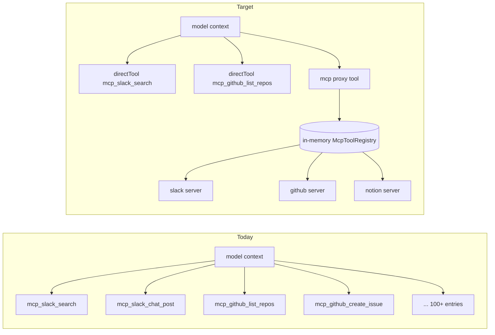

# feat: agentcore-pi MCP proxy tool

## Summary

Port the context-reduction proxy-tool pattern from [pi-mcp-adapter](https://github.com/nicobailon/pi-mcp-adapter) into our Pi runtime (`packages/agentcore-pi/agent-container`). Today every MCP tool from every configured MCP server is surfaced to the model as an individual `AgentTool` named `mcp_<server>_<tool>` — for tenants with several MCP servers this can push hundreds of tool definitions into every turn's context. The new design replaces that surface with a single `mcp` proxy AgentTool (~200 tokens) that exposes `list`, `search`, and `call` modes against a per-invocation metadata cache. Per-agent workspace config (`mcp.json`) declares a `directTools` allowlist that promotes hot tools back to first-class `AgentTool`s, so frequently-used MCP tools stay zero-hop while cold tools live behind the proxy.

The existing handle-shaped Authorization security model (HandleStore, scrubbing-fetch, bearer scrubbing) is preserved unchanged. The proxy is added as a sibling to today's MCP wiring and shipped through a substrate-first inert→live sequence, ending with the removal of the auto-per-tool surface.

---

## Problem Frame

**What's broken today.** `packages/agentcore-pi/agent-container/src/mcp-connect.ts` constructs one `AgentTool` per MCP server tool (`mcp_<server>_<tool>`). Every one of those definitions — name, description, full typebox schema — lands in the model's context on every turn, before the model has decided whether it needs MCP at all. For a tenant with Slack + GitHub + Notion + Google Drive servers, this is easily 100+ tools × ~200 tokens each.

**What pi-mcp-adapter solved.** Single `mcp` proxy tool (~200 tokens). The model calls `mcp({ list: true })` to see what's available, `mcp({ search: "..." })` to find candidates, and `mcp({ tool: "...", args: ... })` to invoke. Tool definitions stay out of the prompt; metadata is fetched on demand.

**Why pi-mcp-adapter isn't usable as-is.**

1. It's a Pi CLI extension declared via `package.json`'s `pi.extensions` field and built against `@earendil-works/pi-coding-agent`'s `ExtensionAPI` (`pi.registerTool`). Our runtime uses the SDK form `@mariozechner/pi-agent-core@0.70.2` with `new Agent({ initialState: { tools, ... } })`. There is no documented programmatic API on pi-mcp-adapter to import outside the Pi CLI.
2. Our security model — per-user OAuth bearers held in a per-invocation `HandleStore`, opaque `Handle <uuid>` Authorization shape, worker-side `scrubbingFetch` swapping handle→bearer at egress, response-body bearer scrubbing — is not what pi-mcp-adapter implements. A drop-in would either bypass HandleStore (tenant isolation regression) or require significant retrofit.
3. The original 2026-04-26 brainstorm (`docs/brainstorms/2026-04-26-pi-agent-runtime-parallel-substrate-requirements.md` R10/R13) chose the vendor-oh-my-pi MCP extension path; the existing `mcp-connect.ts:8-11` docblock explicitly defers pi-mcp-adapter as a later canary.

This plan ports the *pattern*, not the package — building our own proxy tool against the SDK shape we already use and re-binding it to our HandleStore + scrubbing-fetch.

---

## Goals & Success Criteria

- A new `mcp` `AgentTool` is registered in the Pi runtime tools array per invocation, modes `list` / `search` / `call`.
- Per-agent `mcp.json` workspace file declares `directTools: [{ server, tool }]`; listed entries are promoted to first-class `AgentTool`s; all other MCP tools are reachable only through the proxy.
- The auto-per-tool MCP surface (every MCP server tool becomes `mcp_<server>_<tool>`) is removed at the end of the arc; the only first-class MCP tools are those explicitly listed in `directTools`.
- `HandleStore`, `scrubbingFetch`, response-body bearer scrubbing, per-invocation cleanup queue, and the `assertJsonSerializableSansBearer` contract continue to pass — bearer tokens never leave the trusted handler in plain form, and no bearer string appears in any `AgentTool` serialization.
- The Marco smoke gate gains a scenario that asserts a proxy-mediated `tools/call` round-trip succeeds and the response payload carries a `mcp_proxy_used: true` pin.
- `directTools` entries that name a server/tool the live MCP listing doesn't expose fail loud at handler entry with a structured error in the agent's first turn — silent demotion is not allowed.
- The `tools_called` / `tool_invocations` arrays persisted on `thread_turns` continue to carry per-server / per-tool granularity (via `details.mcp_server` + `details.mcp_tool_name`), so admin observability is not regressed.

---

## Scope Boundaries

In scope:
- `packages/agentcore-pi/agent-container/src/mcp.ts` — extend with proxy build helper.
- `packages/agentcore-pi/agent-container/src/mcp-connect.ts` — extend with proxy-call delegation; later, remove the auto-per-tool emission.
- `packages/agentcore-pi/agent-container/src/server.ts` — modify `assembleTools` to register the proxy + directTools subset; drop the per-tool surface in the final unit.
- `packages/agentcore-pi/agent-container/src/runtime/bootstrap-workspace.ts` (or sibling reader) — load `mcp.json` from the agent's workspace after S3 sync.
- `packages/agentcore-pi/agent-container/tests/` — new tests for proxy build, proxy execute modes, directTools validator, mcp.json reader.
- `packages/api/src/__smoke__/pi-marco-smoke.ts` — add `mcp-proxy-call` scenario + assert `mcp_proxy_used` pin.
- `packages/api/src/lib/builtin-tool-slugs.ts` — register `mcp` (and any directTools-promoted slugs) so `derive-agent-skills.ts` does not treat them as workspace skill content.
- `packages/workspace-defaults/files/` — ship a documented empty `mcp.json` example so operators have a starting point.

Out of scope:
- The agentcore-strands runtime. It has its own MCP wiring (`packages/agentcore-strands/agent-container/`); a parallel port can land later if the proxy pattern proves out on Pi.
- Any `npm install` of `pi-mcp-adapter`, `@earendil-works/pi-coding-agent`, or `@modelcontextprotocol/ext-apps`. We are porting the pattern; we are not adding upstream packages.
- Any version bump of `@mariozechner/pi-agent-core` or `@modelcontextprotocol/sdk`. Both stay at currently-pinned versions; if a bump is later required, it goes through Tier-1 supply-chain review (`docs/solutions/integration-issues/flue-supply-chain-integrity-2026-05-04.md`, applies to agentcore-pi — flue was the prior name) in a separate PR.
- DB schema changes for MCP config. `tenant_mcp_servers` / `agent_mcp_servers` / `user_mcp_tokens` and `packages/api/src/lib/mcp-configs.ts` keep their current shape — the new config is workspace-file-only.
- Admin or mobile SPA changes to surface a `directTools` editor. v1 ships filesystem-only; operators (or skills that write workspace files) edit `mcp.json` directly. Admin-UI editing is a follow-up if usage justifies it.
- Changes to the per-user OAuth bearer pipeline itself (`chat-agent-invoke.ts` resolution path, refresh-on-expiry semantics, secrets manager layout). These are already correct.
- pi-mcp-adapter's `regex` / `describe` / `connect` / `directTools = true` (auto-promote-all) modes. v1 ships `list` / `search` / `call` only; the rest are deferred.

### Deferred to Follow-Up Work

- Proxy `describe` mode (separate from `list({ includeSchemas: true })`).
- Proxy `regex` search.
- pi-mcp-adapter-style `idleTimeout` / `lifecycle: lazy|eager|keep-alive` per server (our per-invocation lifecycle makes this lower-value).
- An admin SPA editor for `mcp.json`. The filesystem is the source of truth; surfacing an editor is a separate workstream.
- Telemetry flattening: synthesizing a per-call `tool_name` like `mcp.slack.search` on top of the proxy so `ExecutionTrace.tsx` shows per-server tool names without consulting `details`. Recommended as a small follow-up if operators report friction.
- Parallel port to the agentcore-strands runtime.

---

## High-Level Technical Design

This sketch communicates the intended call shape and data flow for review. It is directional guidance, not implementation specification — the implementing agent should treat it as context, not code to reproduce.

**Per-invocation flow (after this plan lands):**

```
chat-agent-invoke Lambda
  └─ AgentCore invoke -> agentcore-pi container
      └─ server.ts handleInvocation()
          ├─ allocate HandleStore + cleanup queue + scrubbingFetch
          ├─ bootstrap workspace (S3 sync) -> read mcp.json
          ├─ parseMcpConfigs(payload.mcp_configs)
          ├─ buildMcpTools(mcpConfigs, handleStore, connectMcpServer)
          │     -> connects per server, calls tools/list, caches metadata in
          │        a McpToolRegistry keyed by (serverName, toolName).
          ├─ validateDirectTools(mcpJson.directTools, registry)
          │     -> throws if a directTool names a (server, tool) not in registry.
          ├─ buildDirectTools(mcpJson.directTools, registry, connectMcpServer)
          │     -> one AgentTool per allowlisted entry, same shape as today's
          │        per-tool surface (zero-hop).
          ├─ buildMcpProxyTool(registry, connectMcpServer)
          │     -> one AgentTool named "mcp".
          └─ new Agent({ initialState: { tools: [...builtin, ...directTools, mcpProxy], ... }})
              └─ model picks: directTool (zero-hop) OR mcp({ list/search/call })

mcp proxy execute (in trusted handler, same address space as HandleStore):
  list:   return registry summaries (server, tool, label, description[, schema])
  search: filter registry by substring against name + description
  call:   look up registry entry, dispatch to MCP client (built via connectMcpServer,
          reusing scrubbingFetch -> handle->bearer at egress).
```

**Architecture diff (current vs target):**



**`mcp.json` shape sketch (directional, not authoritative):**

```jsonc
// /tenants/<tenant>/agents/<agent>/workspace/mcp.json
{
  "directTools": [
    { "server": "slack", "tool": "search" },
    { "server": "github", "tool": "list_repos" }
  ]
}
```

**Proxy parameter schema sketch (directional):**

```ts
// shape only — typebox in actual implementation
Type.Object({
  // exactly one of these three discriminators is required:
  list:   Type.Optional(Type.Boolean()),                          // mode A
  search: Type.Optional(Type.String()),                           // mode B
  call:   Type.Optional(Type.Object({                              // mode C
    server: Type.String(),
    tool:   Type.String(),
    args:   Type.Object({}, { additionalProperties: true }),
  })),
  includeSchemas: Type.Optional(Type.Boolean()),                  // applies to list/search
})
```

---

## Key Technical Decisions

- **Port the pattern, do not adopt the package.** Confirmed in scoping synthesis. pi-mcp-adapter's `package.json`-`pi.extensions`-`ExtensionAPI` shape is incompatible with our `new Agent({ initialState: { tools } })` SDK shape; vendor/install would require either pulling in `@earendil-works/pi-coding-agent` or building a shim ExtensionAPI. Porting the pattern is 200-400 lines we own; vendoring is a second upstream's full surface area.

- **directTools allowlist lives in a new `mcp.json` at the agent's workspace root.** Alternatives considered: AGENTS.md frontmatter (cohabits with skill-routing semantics owned by `derive-agent-skills.ts` — different concern, risk of accidental coupling), TOOLS.md frontmatter (Markdown-frontmatter parsing for typed config is fragile), a new `MCP.md` file (same parsing concern). JSON is machine-readable, parses with `JSON.parse`, leaves room for future per-server fields (`lifecycle`, `idleTimeout`), and mirrors pi-mcp-adapter's own `.mcp.json` precedent. The `directTools` slugs are added to `packages/api/src/lib/builtin-tool-slugs.ts` so `derive-agent-skills.ts` doesn't try to treat them as user-content skills (per `docs/solutions/best-practices/injected-built-in-tools-are-not-workspace-skills-2026-04-28.md`).

- **Proxy API surface: v1 = `list` / `search` / `call` with optional `includeSchemas`.** `describe` is redundant with `list({ includeSchemas: true, filter: <tool> })`; `connect` is implicit (we eager-connect at handler entry); `regex` is deferred (substring is sufficient for the agent's typical use). Keeps the parameter schema small enough to fit comfortably in the model's tool-definition budget.

- **Eager connect + `tools/list` at handler entry, lazy `callTool`.** Our `HandleStore` is per-invocation, so pi-mcp-adapter's process-lifetime metadata cache buys nothing here. Eager-connect at handler entry (already today's behavior in `buildMcpTools`) lets `validateDirectTools` fail loud on typos before the agent ever runs. The proxy's saving is *model-context reduction*, not *server-connection reduction*. The institutional record (`docs/solutions/diagnostics/eval-runner-stall-findings-2026-05-16.md`) flags cold MCP connect as a latency hazard; eager-at-handler-entry keeps that cost off the agent's critical path.

- **Substrate-first inert→live ship sequence (3 PRs, optionally 4).** Per `docs/solutions/architecture-patterns/inert-first-seam-swap-multi-pr-pattern-2026-05-08.md`: PR-1 ships proxy registered inert (throws a structured `not-yet-wired` error from `execute` — never silently returns `{ok: true}`), plus the `mcp.json` reader + smoke pin asserting `mcp_proxy_registered: true`. PR-2 lands the live body and the smoke pin shifts to `mcp_proxy_used: true`. PR-3 removes the per-tool surface (default flips so the only first-class MCP tools are `directTools`). Optional PR-4: cleanup of any toggle scaffolding that survives.

- **Proxy `execute()` reuses the existing `connectMcpServer` factory and `scrubbingFetch`.** No new fetch path, no new auth scheme, no new HandleStore. The proxy is a thin reader over a per-invocation `McpToolRegistry` (in-memory map keyed by `(server, tool)`) populated by `buildMcpTools` at handler entry, plus a thin dispatcher to `client.callTool` for the `call` mode. The cleanup queue at `server.ts:1199` continues to own connection teardown (LIFO drain at `server.ts:1336`).

- **Telemetry: keep `details.mcp_server` + `details.mcp_tool_name` in the proxy result envelope.** Today's per-tool surface persists these on `thread_turns.tool_invocations`. The proxy collapses surface name to `mcp`, so the per-server / per-tool identity must be recoverable from `details`. Synthesizing a flattened per-call name (`mcp.slack.search`) is left to a follow-up — admin's `ExecutionTrace.tsx` already falls back to `mcp_tool` for display, no immediate regression.

- **Boot-time validation of `directTools` is a hard fail, not a warn.** Per the activation-runtime narrow-tool-surface lesson (`docs/solutions/best-practices/activation-runtime-narrow-tool-surface-2026-04-26.md`): if `mcp.json` lists `{ server: "slack", tool: "saerch" }` (typo) and the runtime silently demotes it to a proxy-only tool, the operator sees an empty-feeling agent for weeks. Validate against the live `tools/list` per server at handler entry; on mismatch, throw a structured error from `assembleTools` so the agent's first turn surfaces it via the existing `assembleTools`-failure path (`server.ts:1242-1257`, which already drains the cleanup queue and returns 500). The error message names the offending `(server, tool)` plus the actual available tools for that server.

---

## Implementation Units

### U1. Define `mcp.json` workspace-file schema and reader

**Goal:** A new module that reads `mcp.json` from the agent's bootstrapped workspace and returns a typed `McpJsonConfig` shape, or an empty default when absent.

**Requirements:** Establishes the `directTools` allowlist surface that all subsequent units consume.

**Dependencies:** None (greenfield reader).

**Files:**
- `packages/agentcore-pi/agent-container/src/runtime/mcp-json.ts` (new)
- `packages/agentcore-pi/agent-container/tests/mcp-json.test.ts` (new)
- `packages/workspace-defaults/files/mcp.json` (new — empty `{ "directTools": [] }` shipped as a documented default)

**Approach:**
- Module exports `readMcpJson(workspaceDir: string): McpJsonConfig` and the `McpJsonConfig` type.
- `McpJsonConfig` shape: `{ directTools: Array<{ server: string; tool: string }> }`.
- Filename `mcp.json` at workspace root (sibling to AGENTS.md). Missing file → return `{ directTools: [] }`.
- Malformed JSON or wrong shape → throw a `McpJsonError` (the catch site in U3 wraps this so the agent's first turn surfaces the parse error cleanly).
- No `MCP.md`-style content — operators or skills write JSON directly.
- Follow the `Plan §006 U1 — ...` docblock convention used in every existing file in this package.

**Patterns to follow:**
- `packages/agentcore-pi/agent-container/src/runtime/system-prompt.ts:16-30` for the fixed-filename read pattern (use `node:fs/promises` with explicit `.js` extensions in relative imports).
- `packages/agentcore-pi/agent-container/src/runtime/tools/workspace-skills.ts` `discoverWorkspaceSkills` for the post-bootstrap workspace-walk pattern.

**Test scenarios:**
- Missing `mcp.json` returns `{ directTools: [] }`.
- Valid `mcp.json` with two entries returns them in order; preserves `server` + `tool` casing exactly.
- Empty `directTools: []` parses cleanly to an empty config.
- Malformed JSON throws `McpJsonError` with a message naming the file path.
- Wrong root shape (e.g., a top-level array, or `directTools` as a string) throws `McpJsonError` with a message naming the offending field.
- An entry missing `server` or `tool` throws `McpJsonError` naming the entry index.
- Extra unknown top-level keys are preserved silently (forward-compat for future fields).

**Verification:** `pnpm --filter @thinkwork/agentcore-pi test mcp-json` passes.

---

### U2. `McpToolRegistry` + `validateDirectTools`

**Goal:** Per-invocation in-memory registry of MCP tools keyed by `(server, tool)`, populated as `buildMcpTools` connects + lists. A pure validator that cross-checks `directTools` entries against the registry.

**Requirements:** Single source of truth for the proxy's `list` / `search` / `call` and for boot-time directTools validation.

**Dependencies:** U1.

**Files:**
- `packages/agentcore-pi/agent-container/src/mcp-registry.ts` (new)
- `packages/agentcore-pi/agent-container/tests/mcp-registry.test.ts` (new)

**Approach:**
- `McpToolRegistry` is a small class with `register(serverName, toolMetadata)`, `entries(): RegistryEntry[]`, `get(serverName, toolName): RegistryEntry | undefined`, `search(query: string, opts: { includeSchemas?: boolean }): RegistryEntry[]`.
- `RegistryEntry` shape: `{ server: string; tool: string; description: string; inputSchema: unknown }`.
- `validateDirectTools(directTools, registry): { ok: true } | { ok: false; missing: Array<{ server; tool; availableTools: string[] }> }`.
- The validator must list the per-server `availableTools` array on mismatch so the operator can fix the typo quickly.

**Patterns to follow:**
- `packages/agentcore-pi/agent-container/src/mcp.ts` for the in-package module style (pure, no module-load globals, no env reads).

**Test scenarios:**
- Empty registry returns empty `entries()` and empty `search()`.
- Register two tools across two servers; `entries()` returns both with stable ordering.
- `get("slack", "search")` returns the registered metadata; `get("slack", "missing")` returns `undefined`.
- `search("post")` matches by substring against `tool` name and `description` (case-insensitive), returns sorted by server then tool name.
- `search` with `includeSchemas: true` returns the `inputSchema` field; without it, the field is omitted.
- `validateDirectTools` with an empty allowlist returns `{ ok: true }`.
- `validateDirectTools` with a `directTool` whose `server` is missing returns `{ ok: false, missing: [...] }` with empty `availableTools`.
- `validateDirectTools` with a `directTool` whose `server` exists but `tool` does not returns `{ ok: false, missing: [...] }` with the server's actual `availableTools` populated.
- `validateDirectTools` with multiple missing entries returns all of them, not just the first.

**Verification:** `pnpm --filter @thinkwork/agentcore-pi test mcp-registry` passes.

---

### U3. `mcp` proxy AgentTool — inert ship

**Goal:** Register a single `AgentTool` named `mcp` whose `execute()` throws a structured `not-yet-wired` error. No metadata wiring yet — the inert ship proves registration, telemetry, and contract serialization.

**Requirements:** Substrate-first PR-1 per `inert-first-seam-swap-multi-pr-pattern-2026-05-08.md` (applies to agentcore-pi — flue was the prior name).

**Dependencies:** None (greenfield AgentTool).

**Execution note:** Per the inert-pattern rule "Throw, don't no-op" — the inert `execute()` MUST throw with a clearly-labeled payload. A silent `{ ok: true }` return causes the model to hallucinate a successful tool call.

**Files:**
- `packages/agentcore-pi/agent-container/src/mcp-proxy.ts` (new)
- `packages/agentcore-pi/agent-container/tests/mcp-proxy.test.ts` (new)
- `packages/api/src/lib/builtin-tool-slugs.ts` (modify — add `mcp` to the registry so `derive-agent-skills.ts` doesn't treat it as user-content)

**Approach:**
- Export `buildMcpProxyTool(opts: { registry: McpToolRegistry | null; connectMcpServer: ConnectMcpServerFn | null; mode: "inert" | "live" }): AgentTool<...>`.
- For `mode: "inert"`: `execute()` throws an `Error` with message like `MCP proxy is registered but not yet wired (Plan §006 U3). Use directTools for v0; live proxy lands in U5.` Include `{ isError: true }` in the thrown error so the agent loop surfaces it.
- Parameter schema: full typebox shape from the High-Level Technical Design sketch (`list`, `search`, `call`, `includeSchemas`).
- `executionMode: "sequential"` (matches every other AgentTool in this package).
- `details` envelope includes `{ mcp_proxy_used: true, mcp_proxy_mode: "inert" }` even on the throw path (use a thrown error with attached metadata, captured by `tool_execution_end`).

**Patterns to follow:**
- `packages/agentcore-pi/agent-container/src/runtime/tools/run-skill.ts` for the canonical AgentTool shape, including `additionalProperties: true` on open-shape args.
- `packages/agentcore-pi/agent-container/src/mcp-connect.ts:199-240` for the `details`-with-`mcp_server`/`mcp_tool_name` envelope convention.

**Test scenarios:**
- `buildMcpProxyTool({ mode: "inert", ... })` returns an `AgentTool` with `name === "mcp"`, `executionMode === "sequential"`, and a typebox `parameters` object that accepts `{ list: true }`, `{ search: "..." }`, and `{ call: { server, tool, args } }`.
- The returned tool's `description` mentions list / search / call modes (used by the model to decide).
- `JSON.stringify(tool)` does not throw and produces a serializable shape (no closures captured in serialization).
- `execute()` in inert mode throws an Error whose message names `Plan §006 U3` and includes `mcp_proxy_used: true` in either the message or attached fields.
- Telemetry capture: a fake `subscribe()` wrapper sees a `tool_execution_start` + `tool_execution_end` pair with `event.toolName === "mcp"`.
- The proxy tool's name (`mcp`) is in the allowlist returned by `packages/api/src/lib/builtin-tool-slugs.ts` so `derive-agent-skills.ts` skips it.

**Verification:** `pnpm --filter @thinkwork/agentcore-pi test mcp-proxy` passes; `pnpm --filter @thinkwork/api test builtin-tool-slugs` passes.

---

### U4. Wire proxy + `mcp.json` into `assembleTools` (inert)

**Goal:** Modify `assembleTools` so that, in addition to today's per-tool surface, it now also (a) reads `mcp.json` from the workspace, (b) populates an `McpToolRegistry` from the same `tools/list` calls `buildMcpTools` already makes, (c) validates `directTools` against the registry, and (d) registers the inert `mcp` proxy AgentTool alongside the existing per-tool surface. No per-tool surface removal yet.

**Requirements:** Inert ship lands in production; per-tool surface still primary; smoke gate gains the new pin.

**Dependencies:** U1, U2, U3.

**Files:**
- `packages/agentcore-pi/agent-container/src/server.ts` (modify `assembleTools` ~lines 397-518 and `handleInvocation` ~lines 1199-1361)
- `packages/agentcore-pi/agent-container/src/mcp.ts` (modify `buildMcpTools` to optionally populate the registry; or add a sibling `buildMcpToolsWithRegistry` that returns `{ tools, registry }`)
- `packages/agentcore-pi/agent-container/tests/server.test.ts` (extend — add assertion that the tools array contains a tool named `mcp` and that `mcp.json`-driven validation runs)
- `packages/agentcore-pi/agent-container/tests/mcp.test.ts` (extend — assert registry population)
- `packages/api/src/__smoke__/pi-marco-smoke.ts` (modify — add `mcp_proxy_registered: true` assertion to existing scenarios)

**Approach:**
- In `handleInvocation`, after `bootstrapWorkspace` and before `assembleTools`, read `mcp.json` via U1's `readMcpJson`. Catch `McpJsonError` and surface as a structured `mcp_config_invalid` error via the same path as today's `assembleTools` failure (drains cleanup, returns 500). Pass the parsed config into `assembleTools`.
- In `assembleTools`, when MCP configs are present: call the registry-populating variant of `buildMcpTools` to get `{ tools, registry }`. Call `validateDirectTools(mcpJson.directTools, registry)`. On `ok: false`, throw a structured `directTools_validation_failed` error including the missing entries + available tools per server — caught by the same outer try/catch.
- On validation success: push the inert proxy tool into the tools array (built via `buildMcpProxyTool({ mode: "inert" })`) in addition to today's per-tool surface. Do not yet drop the per-tool surface.
- Marco smoke pins `mcp_proxy_registered: true` in the response payload (the proxy registration is sufficient signal for inert PR-1 per the smoke-gate forcing-function lesson `docs/solutions/architecture-patterns/flue-runtime-launch-2026-05-04.md`, applies to agentcore-pi).

**Patterns to follow:**
- `packages/agentcore-pi/agent-container/src/server.ts:1232-1257` for the `assembleTools`-throws → drain cleanup → 500 path.
- `packages/agentcore-pi/agent-container/tests/server.test.ts:283-395` for the `onHandlerComplete` HandleStore-lifecycle assertion pattern.

**Test scenarios:**
- Workspace with no `mcp.json` + MCP configs present: per-tool surface present, proxy tool present, validator not consulted (empty allowlist).
- Workspace with valid `mcp.json` listing two `directTools` that exist in the live registry: tools array contains per-tool surface + inert proxy; HandleStore remains in a healthy lifecycle (size > 0 during invocation, `=== 0` after `finally`).
- Workspace with `mcp.json` listing a `directTool` whose `server` doesn't exist in MCP configs: `assembleTools` throws; cleanup queue drained; `handleStore.size === 0` after; structured error mentions `directTools_validation_failed` and the missing entry.
- Workspace with `mcp.json` listing a `directTool` whose `server` exists but `tool` does not: same as above, error message includes the server's `availableTools` array.
- Malformed `mcp.json`: `mcp_config_invalid` error, cleanup drained, no bearer leaked.
- Bearer-leak contract: `JSON.stringify(tools)` (now including the proxy) still contains zero bearer fixtures from `tests/mcp.test.ts:34-44`. The proxy tool's closures must not capture bearers.
- Marco smoke scenarios assert `mcp_proxy_registered: true` in the response (proves the inert proxy reached production runtime).
- Covers AE: `mcp_proxy_registered` pin is the per-PR forcing function described in the inert-pattern doc.

**Verification:** `pnpm --filter @thinkwork/agentcore-pi test` passes; Marco smoke `pi-marco-smoke.ts` passes against a fresh dev deploy with the new pin asserted.

---

### U5. Live proxy body — `list` / `search` / `call` modes

**Goal:** Replace U3's inert `execute()` with the live body. `list` and `search` read from the `McpToolRegistry` (populated in U4); `call` builds an MCP client via the existing `connectMcpServer` factory and dispatches.

**Requirements:** The proxy actually works end-to-end. Forwards `result.content[]`, `result.structuredContent`, and `result.isError` faithfully (per `docs/solutions/best-practices/invoke-code-interpreter-stream-mcp-shape-2026-04-24.md`).

**Dependencies:** U4. Must include the body-swap forcing-function test (lift from `inert-first-seam-swap-multi-pr-pattern-2026-05-08.md`): a test that fails the moment U5 lands without the live body wiring through.

**Files:**
- `packages/agentcore-pi/agent-container/src/mcp-proxy.ts` (modify — add `mode: "live"` branch)
- `packages/agentcore-pi/agent-container/src/server.ts` (modify — flip the proxy construction call to `mode: "live"`)
- `packages/agentcore-pi/agent-container/tests/mcp-proxy.test.ts` (extend)
- `packages/api/src/__smoke__/pi-marco-smoke.ts` (modify — add `mcp-proxy-call` scenario that asserts a `tools/call`-mediated turn returns content and the response carries `mcp_proxy_used: true`)

**Approach:**
- `list` mode: return `registry.entries()`; when `includeSchemas: true`, include `inputSchema`. Format as a single text content block (JSON-stringified table or list).
- `search` mode: return `registry.search(query, { includeSchemas })`. Same content-shape as `list`.
- `call` mode: look up `registry.get(server, tool)`; if absent, throw a structured error naming what was attempted vs. what's available. If present, use `connectMcpServer` (already-built, scrubbing-fetch-bound, cleanup-registered from U4's eager pass) to dispatch `callTool({ name: tool, arguments: args })`. Forward the result envelope `{ content, structuredContent, isError }` into the AgentTool result shape, preserving `details.mcp_server`, `details.mcp_tool_name`, `details.mcp_proxy_used: true`.
- Validate exactly one of `list` / `search` / `call` is supplied; reject otherwise with a structured parameter error.
- Lift the forcing-function pattern: a test in `mcp-proxy.test.ts` calls `execute({ call: { server, tool, args } })` with a fake `connectMcpServer` that records the call. In inert mode (mode === "inert"), the test asserts the throw. In live mode, the test asserts the fake's `callTool` was invoked with the expected args and the result envelope shape passed through. If a future PR breaks the wiring (e.g., regresses to inert), this test fails.

**Patterns to follow:**
- `packages/agentcore-pi/agent-container/src/mcp-connect.ts:212-240` for the `callTool` → result envelope → `details` envelope pattern.
- `packages/agentcore-pi/agent-container/tests/mcp-connect.test.ts` for the `transportFactory` / `clientFactory` mock seam style.

**Test scenarios:**
- `list` mode returns all registered tools as a single text content block; tool counts match registry entries.
- `list` with `includeSchemas: true` returns schemas; default omits them (keeps response size bounded).
- `search` mode matches by substring (case-insensitive) against tool name and description; returns sorted output.
- `search` returns empty when no matches.
- `call` mode with a known `(server, tool)` invokes the underlying MCP client's `callTool` with the supplied `args`; result envelope content is preserved; `details.mcp_server` + `details.mcp_tool_name` + `details.mcp_proxy_used: true` set.
- `call` mode with an unknown `(server, tool)` throws a structured error naming the attempted server/tool plus available tools for that server (or "server not configured").
- `call` mode where `result.isError === true` is propagated as a throw with the result's text content (matching `mcp-connect.ts:224-226`).
- `call` mode forwards `structuredContent` when present; falls back to `content[]` text when absent.
- Multiple proxy invocations within one agent loop reuse the same connected MCP client (no per-call reconnect); cleanup-queue size grows by exactly N (one per configured server, not per call).
- Cleanup-queue draining at handler `finally` closes all MCP clients (LIFO).
- Bearer-leak contract: bearers do not appear in any returned `content[]` text (scrubbing-fetch handles this at the HTTP layer; assert at the proxy-result layer too via a fixture-scrubbed assertion).
- Forcing-function: parametrized test runs `mode: "inert"` and `mode: "live"` over the same `execute({ call: {...} })` input; inert path asserts throw, live path asserts fake `callTool` invoked.
- Marco smoke scenario `mcp-proxy-call` asserts response carries `mcp_proxy_used: true` and the tool call produced non-empty content (not just "empty list").

**Verification:** `pnpm --filter @thinkwork/agentcore-pi test mcp-proxy` passes; Marco smoke passes with the new `mcp-proxy-call` scenario; no entry in `tools_called` reads as `mcp_<server>_<tool>` for tools the model invoked via the proxy.

---

### U6. Drop the auto-per-tool MCP surface; directTools-only first-class

**Goal:** Stop emitting `mcp_<server>_<tool>` AgentTools for every MCP tool. The only first-class MCP `AgentTool`s are those in `mcp.json`'s `directTools`. Everything else is reachable only through the proxy.

**Requirements:** The proxy is now the default surface; full context-reduction benefit lands.

**Dependencies:** U5 (proxy must be live + soaked one dev cycle).

**Files:**
- `packages/agentcore-pi/agent-container/src/mcp.ts` (modify `buildMcpTools` to return only the registry + directTools subset, not the per-tool surface)
- `packages/agentcore-pi/agent-container/src/mcp-connect.ts` (modify `createConnectMcpServer` if needed — the surface-producing branch may be retired; keep the connect-and-`callTool` machinery)
- `packages/agentcore-pi/agent-container/src/server.ts` (modify `assembleTools` to only push `directTools` + proxy)
- `packages/agentcore-pi/agent-container/tests/mcp.test.ts` (modify — assert no per-tool surface produced)
- `packages/agentcore-pi/agent-container/tests/server.test.ts` (modify — assert tools array contains proxy + directTools only)
- `packages/api/src/__smoke__/pi-marco-smoke.ts` (modify — strengthen `mcp-proxy-call` assertion: the scenario tool call routes through the proxy, no per-tool surface name appears)

**Approach:**
- `buildMcpTools` returns `{ registry, directTools: AgentTool[] }`. `directTools` array contains exactly one entry per `mcp.json` allowlist entry, using the same `exposedToolName("<server>", "<tool>")` naming convention so existing observability + admin tracking still matches the slug (no `tools_called` shape regression for directTools entries). Export `exposedToolName` from `mcp-connect.ts` (currently private at line 107) so the directTools construction path reuses the exact sanitization + 48/64-character truncation rules — duplicating the helper risks subtle slug drift over time.
- The proxy continues to be added by `assembleTools`. The total tools array shape becomes: `[...builtinPiTools, ...directToolAgentTools, mcpProxyAgentTool]`.
- Backwards-compat note: agents whose `mcp.json` is missing or empty get only the proxy — no first-class MCP tools. That's the intentional default.

**Patterns to follow:**
- `packages/agentcore-pi/agent-container/src/mcp-connect.ts:197-240` for the AgentTool-construction shape, applied only to the directTools subset.

**Test scenarios:**
- With `mcp.json: { directTools: [] }` and 3 MCP servers configured: tools array contains exactly the proxy tool plus builtin Pi tools — no `mcp_<server>_<tool>` entries.
- With `mcp.json: { directTools: [{ server: "slack", tool: "search" }] }`: tools array contains the proxy plus exactly one `mcp_slack_search` AgentTool.
- `directTools` AgentTool's `execute()` invokes the underlying MCP `callTool` with identical semantics to the legacy per-tool surface (same args mapping, same result envelope, same details fields, same `executionMode: "sequential"`).
- `tools_called` for a directTools invocation reads `mcp_slack_search` (per-server granularity preserved); `tools_called` for a proxy invocation reads `mcp` (collapsed surface, granularity recoverable via `details`).
- Bearer-leak contract still holds: `JSON.stringify(tools)` for the new shape contains zero bearer fixtures.
- HandleStore lifecycle assertions from `server.test.ts` continue to pass.
- A scenario covering the prior "per-tool surface present" assertions is updated in place — search for and update every `mcp_<server>_<tool>` assertion across `tests/server.test.ts` and `tests/mcp.test.ts` to assert *absence* of the per-tool surface for non-directTools entries.

**Verification:** `pnpm --filter @thinkwork/agentcore-pi test` passes; Marco smoke `mcp-proxy-call` scenario passes; an additional dev-stage sanity check (manual) confirms no production agent's `tools_called` history has a `mcp_<server>_<tool>` entry for tools not in its `mcp.json` directTools.

---

## System-Wide Impact

- **agentcore-pi runtime container.** All three feature-bearing implementation units land here. No new env vars, no new IAM permissions, no new container-image dependencies beyond what's already in `package.json`.
- **packages/api Lambda layer.** Only `packages/api/src/lib/builtin-tool-slugs.ts` and `packages/api/src/__smoke__/pi-marco-smoke.ts` change. No GraphQL type changes, no migration, no `chat-agent-invoke` rewiring.
- **agentcore-strands runtime.** Untouched. A future parallel port can land if this proves out.
- **Admin / mobile SPA.** No changes. Operator-facing surface in v1 is the `mcp.json` file on the workspace tree.
- **`thread_turns.tool_invocations` storage.** Shape unchanged. `tools_called` for proxy invocations contains `mcp` instead of `mcp_<server>_<tool>` — admin's `ExecutionTrace.tsx:370` already falls back to a `mcp_tool` display label, so no rendering regression. `details.mcp_server` + `details.mcp_tool_name` carry the per-server / per-tool identity for forensics.
- **Supply chain.** No package version bumps. No update to `scripts/supply-chain-baseline.txt`. If a future iteration bumps `@mariozechner/pi-agent-core` or `@modelcontextprotocol/sdk` for proxy-tool ergonomics, that's a separate Tier-1 PR per `docs/solutions/integration-issues/flue-supply-chain-integrity-2026-05-04.md` (applies to agentcore-pi — flue was the prior name).
- **Migration workflow gate.** Not applicable; no drizzle migrations.

---

## Risks & Mitigations

- **Risk: inert proxy silently succeeds and the model hallucinates calls.** Mitigation: per the inert-pattern doc, U3's inert `execute()` MUST throw, not return `{ ok: true }`. Test covers the throw explicitly.
- **Risk: `directTools` typo silently demotes the tool to proxy-only and operator doesn't notice for weeks.** Mitigation: U2 + U4 boot-time `validateDirectTools` is a hard fail in `assembleTools`, surfaced via the existing 500-with-cleanup path. Error message names the offending entry + available tools per server.
- **Risk: per-call MCP connect adds latency to the agent loop's critical path.** Mitigation: eager-connect-at-handler-entry retained (matches today); the proxy does not introduce per-call connects. Connection pool is identical to today's behavior — cleanup queue still drains at handler `finally`.
- **Risk: per-tool surface removal in U6 lands before downstream consumers are ready.** Mitigation: per-tool surface stays parallel during U3-U5 (the inert and live phases); U6 is a deliberate cutover after one dev soak. No automated rollback toggle is built (the rollback is `git revert U6`); rationale is that the proxy is well-soaked by then and adding a toggle adds branch-state complexity.
- **Risk: bearer leak through proxy result content.** Mitigation: proxy's `call` mode delegates to the existing `connectMcpServer` factory which is bound to `scrubbingFetch` — bearer scrubbing happens at the HTTP layer regardless of how the SDK client is invoked. Test covers the bearer-leak contract at the proxy result envelope.
- **Risk: streaming/structuredContent shape lost when proxy collapses response.** Mitigation: U5 forwards `result.content[]`, `result.structuredContent`, and `result.isError` faithfully (per the MCP wire-shape lesson). Tests cover both shapes.
- **Risk: LWA truncates an in-flight MCP `callTool` if cleanup is fire-and-forget.** Mitigation: continue using the existing `cleanup` queue with awaited drains at handler `finally` (per `docs/solutions/runtime-errors/lambda-web-adapter-in-flight-promise-lifecycle-2026-05-06.md`, applies to agentcore-pi). No fire-and-forget `client.close()` introduced.
- **Risk: admin's `ExecutionTrace.tsx` loses per-server tool-call granularity in the UI.** Mitigation: `details.mcp_server` / `details.mcp_tool_name` continue to be populated on the tool-invocation row; no immediate regression (the UI already falls back to a `mcp_tool` label string). Synthesizing a flattened per-call display name is left as a deferred follow-up.

---

## Verification & Smoke

- Per-unit: vitest passes for each touched test file (`pnpm --filter @thinkwork/agentcore-pi test`).
- Cross-unit: `pnpm -r --if-present typecheck && pnpm -r --if-present test` passes.
- Marco smoke: `packages/api/src/__smoke__/pi-marco-smoke.ts` passes with the new pins (`mcp_proxy_registered: true` after U4, `mcp_proxy_used: true` after U5, no `mcp_<server>_<tool>` for non-directTools after U6).
- Dev-stage soak: after each PR merge to main, watch `gh run list --branch main` for the Deploy workflow (per the `feedback_watch_post_merge_deploy_run` memory rule). Confirm at least one production-traffic invocation has the new pin in CloudWatch before opening the next PR in the arc.

---

## References

- Origin user request and conversation: this plan was generated solo (no upstream brainstorm).
- Reference design: <https://github.com/nicobailon/pi-mcp-adapter> (README + `index.ts` for the proxy-tool shape; not installed/vendored).
- Existing implementation: `packages/agentcore-pi/agent-container/src/mcp.ts`, `packages/agentcore-pi/agent-container/src/mcp-connect.ts`, `packages/agentcore-pi/agent-container/src/server.ts` (`assembleTools`, `handleInvocation`).
- Related plans: `docs/plans/2026-04-26-009-feat-pi-agent-runtime-parallel-substrate-plan.md` (R10/R13 — original MCP wiring decision), `docs/plans/2026-04-27-002-feat-pi-runtime-tool-execution-plan.md` (tool-execution path), `docs/plans/2026-05-23-004-feat-pi-browser-sandbox-parity-plan.md` (adjacent Pi runtime work).
- Institutional learnings (paths use the legacy `flue` filename — content applies to agentcore-pi):
  - `docs/solutions/architecture-patterns/inert-first-seam-swap-multi-pr-pattern-2026-05-08.md` — substrate-first inert→live, body-swap forcing function, "throw don't no-op".
  - `docs/solutions/best-practices/activation-runtime-narrow-tool-surface-2026-04-26.md` — boot-time allowlist validation, defense-in-depth at registration and discovery layers.
  - `docs/solutions/architecture-patterns/workspace-skills-load-from-copied-agent-workspace-2026-04-28.md` — workspace-files-are-the-agent precedent for `mcp.json` placement.
  - `docs/solutions/best-practices/injected-built-in-tools-are-not-workspace-skills-2026-04-28.md` — `builtin-tool-slugs.ts` registration rule.
  - `docs/solutions/architecture-patterns/flue-runtime-launch-2026-05-04.md` — Marco smoke gate as the body-swap forcing function in production.
  - `docs/solutions/best-practices/invoke-code-interpreter-stream-mcp-shape-2026-04-24.md` — MCP `content[]` / `structuredContent` / `isError` envelope.
  - `docs/solutions/runtime-errors/lambda-web-adapter-in-flight-promise-lifecycle-2026-05-06.md` — `await` cleanup before HTTP response.
  - `docs/solutions/integration-issues/flue-supply-chain-integrity-2026-05-04.md` — Tier-1 supply-chain gate (only relevant if a future iteration bumps pi-agent-core / mcp-sdk).
- Auto-memory: `project_pi_runtime_parallel_decision`, `feedback_filesystem_is_the_agent`, `feedback_watch_post_merge_deploy_run`.
