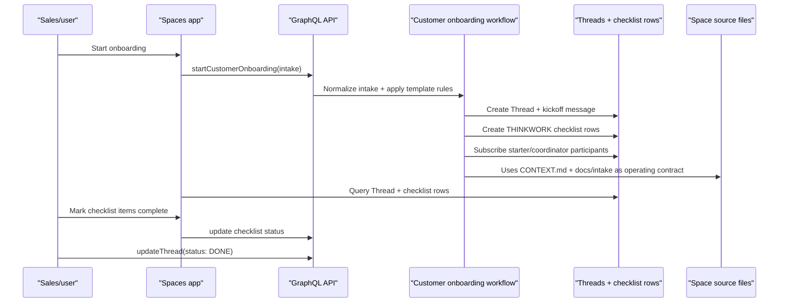

# feat: Customer Onboarding native checklist demo

## Overview

Refresh the Customer Onboarding Space so tomorrow's demo runs entirely inside ThinkWork: a user starts a template-driven onboarding Thread, answers a realistic intake form, ThinkWork creates native checklist items from the Space template, the team marks work complete in the Thread view, and a human marks the Thread `DONE` after required items are complete.

This plan intentionally defers LastMile CRM/Tasks, DocuSign API, Dun & Bradstreet API, credit API, tax-form automation, and P21 integration. Those external systems are represented as manual checklist steps for this slice (see origin: `docs/brainstorms/2026-05-19-spaces-customer-onboarding-v1-requirements.md`).

---

## Problem Frame

The existing Customer Onboarding implementation is still LastMile-shaped: `startCustomerOnboardingWorkflow` tries to create external LastMile tasks, `linked_tasks` only accepts provider `lastmile`, the seed prompt says LastMile is the system of record, and the Spaces UI has unused onboarding checklist components that are not wired into the active thread route.

For the demo, ThinkWork needs to prove the ICM/Space workflow itself: `CONTEXT.md` as the Space operating contract, `docs/customer-onboarding-intake.md` as editable workflow content, deterministic checklist creation, Thread-centered collaboration, and human-confirmed completion.

---

## Requirements Trace

- R1. Manual start creates a Customer Onboarding Thread without external connectors. Covers origin R7, R9, AE1.
- R2. Start flow captures the fuller intake template: customer/opportunity, contacts, billing/shipping, tax, credit terms, contract/compliance, P21, and blockers. Covers origin R8, R10, R12a, AE1.
- R3. Intake answers drive checklist applicability: credit check only when credit terms are requested; tax forms only when tax exempt; missing required intake creates a missing-info task. Covers origin R8, R15, AE2.
- R4. Checklist instances are ThinkWork-native for v1 and render title, status, applicability, required flag, owner/role, notes/metadata, and completion state. Covers origin R13, R14, R17, R18, AE4.
- R5. Initial template includes DocuSign, Dun & Bradstreet, credit check, tax exemption, P21 setup, and final review. Covers origin R16.
- R6. Thread is the case file: kickoff facts, discussion, checklist progress, coordinator summaries, documents/links, and completion summary remain in one place. Covers origin R11, R12, R19, AE3, AE5.
- R7. Human completion uses the existing Thread status model: mark `DONE` only after required checklist items are complete. Covers origin R21, R22, AE6.
- R8. Customer Onboarding Space source files use ICM-style placement: root `CONTEXT.md` for the operating contract and `docs/customer-onboarding-intake.md` for editable intake/checklist rules. Covers origin R20.
- R9. Workspace folder-structure generation keeps skill trees out of folder maps; skills remain in the separate Skills/Tools section. Carries forward the user's Agent Workspace correction and the ICM plan boundary.

---

## Scope Boundaries

- Do not integrate LastMile in the initial demo. Keep `buildLastMileIntegrationConfig` and webhook code as phase-two compatibility, but do not require it for manual start.
- Do not build a general workflow builder, task board, dependency graph, custom status editor, or external task sync engine.
- Do not automate DocuSign, D&B, credit checks, tax forms, or P21. They are manual checklist steps in ThinkWork.
- Do not let the coordinator silently close onboarding. The UI can recommend completion; a human confirms by marking the Thread `DONE`.
- Do not create a new Space-configuration product surface for editing every checklist rule. The seed/admin path and editable Space markdown file are enough for v1.
- Do not place installed skills inside `## Folder Structure`; the folder map is for workspace content, while skill inventory lives separately.

### Deferred to Follow-Up Work

- LastMile CRM webhook start and LastMile Tasks mirroring.
- External connector writeback and comment/activity sync.
- Dedicated native checklist/task tables with richer notes, assignment, audit, and custom workflow state.
- Automatic connector-backed task completion.
- Generalized workflow/checklist authoring UI.

---

## Context & Research

### Relevant Code and Patterns

- `packages/api/src/lib/spaces/customer-onboarding-seed.ts` owns the current Customer Onboarding prompt, checklist keys, coordinator instructions, and LastMile-shaped item templates.
- `scripts/seed-customer-onboarding-space.ts` upserts the Space, checklist template/items, LastMile integration, members, and coordinator assignment. It should become capable of updating the specific existing Customer Onboarding Space while skipping external integration for v1.
- `packages/api/src/lib/spaces/customer-onboarding-workflow.ts` normalizes intake, creates the Thread/kickoff message, creates linked tasks, and enqueues coordinator wakeup. This is the core deterministic path to pivot from LastMile task creation to native checklist instance creation.
- `packages/database-pg/src/schema/linked-tasks.ts` is currently an external mirror table: provider check allows only `lastmile`, `external_task_id` is required, and sync state is mandatory. The fastest demo path is to support a `thinkwork` provider here as a compatibility layer, using a stable internal task key while deferring a table rename or native checklist table.
- `packages/database-pg/graphql/types/linked-tasks.graphql` and `packages/api/src/graphql/resolvers/linked-tasks/threadLinkedTasks.query.ts` already expose per-thread task rows to clients. Add native statuses/mutations here instead of inventing another query for the demo.
- `apps/spaces/src/components/spaces/StartOnboardingDialog.tsx` has the manual-start entry point but only asks for the old small LastMile-style payload.
- `apps/spaces/src/components/spaces/OnboardingChecklistPanel.tsx` can render progress but is currently unused by the active `SpacesThreadDetailRoute`; it also still says "linked tasks", "sync", "LastMile", and "Archive".
- `apps/spaces/src/routes/_authed/_shell/spaces.$spaceId.tsx` currently offers only "New chat"; this is the natural place to show a Customer Onboarding start action for spaces with `kind = customer_onboarding` or `templateKey = customer_onboarding`.
- `packages/api/src/lib/workspace-map-generator.ts` already filters `skills/**` out of rendered folder structures via `folderStructureObjectPaths`; `packages/api/src/lib/__tests__/workspace-map-generator.test.ts` has coverage for this behavior. Add/confirm Space-focused coverage as part of this demo refresh.
- `packages/api/workspace-files.ts` and `apps/admin/src/lib/workspace-files-api.ts` already support Space source files and `generate-folder-structure` for `spaceId`.

### Institutional Learnings

- `docs/runbooks/customer-onboarding-space-runbook.md` is now phase-two biased because it describes LastMile webhook/task setup. Update it or add a v1 demo section so operators do not follow stale integration steps.
- `docs/plans/2026-05-19-003-feat-spaces-customer-onboarding-v1-plan.md` is useful history but superseded; do not reintroduce LastMile as the v1 system of record.
- `docs/plans/2026-05-25-002-feat-icm-stage-contracts-plan.md` is the North Star for folder/workflow concepts: Space source files are context and workflow guidance, not local-only orchestration replacing AWS/DB state.

### External Research

Skipped. This slice follows existing ThinkWork GraphQL, Drizzle, S3 workspace-file, TanStack/urql, and Thread patterns. External APIs are explicitly deferred.

---

## Key Technical Decisions

- Use `linked_tasks` as a compatibility-backed native checklist instance table for the demo by adding provider `thinkwork`. This avoids creating a new persistence/query/UI stack while giving the team a clear later migration path to `checklist_instances`.
- Keep `external_task_id` non-null for now, but populate it with an internal stable key such as `thinkwork:<threadId>:<checklistItemKey>`. Hide external-link/sync language in the UI when provider is `THINKWORK`.
- Add `NOT_APPLICABLE` as a checklist status if implementation scope allows. If time gets tight, represent not-applicable items as `required = false`, `status = CANCELLED`, and metadata `applicability: "not_applicable"`, but the preferred demo UX should show "Not applicable", not "Cancelled".
- Deterministically create all visible checklist rows, including conditional rows marked not applicable when an answer disables them. This makes the demo teach applicability instead of making skipped work disappear.
- Mark the Thread complete with existing `updateThread(status: DONE)`, which already sets `completedAt` and `closedAt`. Do not use `archivedAt` as the completion concept for this demo.
- Put editable intake/checklist content in Space source: root `CONTEXT.md` points to `docs/customer-onboarding-intake.md`; the docs file contains the question set, applicability rules, and current checklist. Runtime seed config remains the executable source of truth until markdown parsing is a later feature.
- Target the existing Customer Onboarding Space (`0b640386-05d7-4dbb-9585-e4c0b8c03f5f`) through seed/update tooling rather than relying on a new slug-created Space.

---

## High-Level Technical Design

---

## Implementation Units

- U1. **Refresh Customer Onboarding seed and Space files**

**Goal:** Make the seeded Customer Onboarding Space native-first and ICM-shaped.

**Requirements:** R5, R6, R8, R9

**Dependencies:** None

**Files:**

- Modify: `packages/api/src/lib/spaces/customer-onboarding-seed.ts`
- Modify: `packages/api/src/lib/spaces/customer-onboarding-seed.test.ts`
- Modify: `scripts/seed-customer-onboarding-space.ts`
- Modify: `docs/runbooks/customer-onboarding-space-runbook.md`
- Test: `packages/api/src/lib/spaces/customer-onboarding-seed.test.ts`

**Approach:**

- Replace LastMile-first prompt/coordinator text with ThinkWork-native checklist language.
- Update checklist item seeds to DocuSign, D&B, credit check, tax exemption, P21 setup, missing-info when needed, and final review. Include applicability metadata in item config or `externalTaskTemplate` replacement metadata.
- Add seed constants for Space source files:
  - `CONTEXT.md` with the operating contract and token-loading guidance.
  - `docs/customer-onboarding-intake.md` with the editable intake template and applicability rules from the origin doc.
- Extend the seed script with options to target an existing `--space-id`, skip external integration by default, and optionally write/update Space source files in S3 when `WORKSPACE_BUCKET` is configured.
- Update the runbook to show the ThinkWork-native demo path first; keep LastMile setup under "phase two".

**Test Scenarios:**

- Seed config test asserts prompt/coordinator copy no longer says LastMile is the system of record.
- Seed config test asserts checklist keys and applicability metadata match the demo rules.
- Seed script dry-run includes Space source file names and does not include a LastMile integration unless explicitly requested.
- Runbook review verifies the first path is manual ThinkWork-native onboarding.

---

- U2. **Support native checklist rows in linked task compatibility storage**

**Goal:** Allow ThinkWork-owned checklist instances to be stored, queried, updated, and audited without an external provider.

**Requirements:** R3, R4, R7

**Dependencies:** U1

**Files:**

- Modify: `packages/database-pg/src/schema/linked-tasks.ts`
- Create: `packages/database-pg/drizzle/NNNN_native_checklist_provider.sql`
- Modify: `packages/database-pg/graphql/types/linked-tasks.graphql`
- Modify: `packages/database-pg/graphql/types/spaces.graphql`
- Modify: `packages/api/src/lib/linked-tasks/status.ts`
- Modify: `packages/api/src/lib/linked-tasks/sync-linked-task.ts`
- Modify: `packages/api/src/graphql/resolvers/linked-tasks/index.ts`
- Create: `packages/api/src/graphql/resolvers/linked-tasks/updateLinkedTask.mutation.ts`
- Test: `packages/database-pg/__tests__/linked-tasks-schema.test.ts`
- Test: `packages/api/src/lib/linked-tasks/status.test.ts`
- Test: `packages/api/src/graphql/resolvers/linked-tasks/threadLinkedTasks.query.test.ts`
- Test: `packages/api/src/graphql/resolvers/linked-tasks/updateLinkedTask.mutation.test.ts`

**Approach:**

- Add provider `thinkwork` to DB check constraints and GraphQL enum.
- Add status `not_applicable` to DB checks, GraphQL enum, and status helpers, unless implementation elects the fallback status mapping for schedule reasons.
- Add a mutation scoped by tenant/thread/Space membership to update native checklist rows. It should reject updates to provider `lastmile` rows unless the caller path explicitly supports external-provider sync.
- On status changes, insert `linked_task_events` with provider `thinkwork`, previous/new status, optional note metadata, and a human-friendly event message.
- Keep `requiredTasksComplete` strict: required rows count complete only when status is `completed`; optional/not-applicable rows do not block completion.

**Test Scenarios:**

- DB schema test confirms `thinkwork` provider and `not_applicable` status are allowed in table definitions and migration markers.
- Query test returns both `LASTMILE` and `THINKWORK` rows but preserves tenant/Space authorization.
- Mutation test lets a Space participant mark a `THINKWORK` row `COMPLETED`.
- Mutation test rejects a non-member and a row from another tenant.
- Mutation test records a checklist event with previous/new status.
- Status helper test counts required completion correctly when optional/not-applicable rows exist.

---

- U3. **Pivot onboarding workflow to deterministic native checklist creation**

**Goal:** Manual onboarding start creates a Thread and native checklist rows from intake answers without calling LastMile.

**Requirements:** R1, R2, R3, R4, R6

**Dependencies:** U1, U2

**Files:**

- Modify: `packages/api/src/lib/spaces/customer-onboarding-workflow.ts`
- Modify: `packages/api/src/lib/spaces/customer-onboarding-workflow.test.ts`
- Modify: `packages/api/src/graphql/resolvers/spaces/startCustomerOnboarding.mutation.ts`
- Modify: `packages/api/src/graphql/resolvers/spaces/startCustomerOnboarding.mutation.test.ts`
- Modify: `packages/api/src/__tests__/webhook-crm-opportunity.test.ts` only if type changes require it

**Approach:**

- Extend normalization to capture the demo intake fields from `docs/customer-onboarding-intake.md`.
- Build an applicability evaluator that returns one row plan per template item: required/applicable/not-applicable plus explanatory metadata.
- Add a missing-information checklist row when required intake is absent.
- Create `provider = "thinkwork"` checklist rows with `syncStatus = "synced"`, no external URL, and stable internal `externalTaskId`.
- Preserve idempotency by opportunity/customer key and existing Thread detection.
- Keep coordinator wakeup, but update the summary to say native checklist rows were created and identify missing answers/blockers.
- Subscribe the starter and coordinator participants where configured; if coordinator assignment lookup is not yet wired in this workflow, preserve current starter behavior and leave coordinator auto-subscription as a follow-up within U5 if discovered during implementation.

**Test Scenarios:**

- Workflow test creates one Thread, kickoff message, starter participant, coordinator wakeup, and native checklist rows.
- Workflow test with `creditTermsRequested = true` marks credit check required; false marks it not applicable.
- Workflow test with `taxExempt = true` marks tax-form work required; false marks it not applicable.
- Workflow test with missing required intake adds a missing-info row and includes missing fields in Thread metadata.
- Workflow test verifies no task adapter call is needed for manual start.
- Resolver test passes AWSJSON/string opportunity input through and returns native checklist result fields.

---

- U4. **Wire Customer Onboarding UX into the Spaces app**

**Goal:** The customer can run the demo from the Spaces app: start onboarding, see the checklist beside the Thread, update checklist status, and complete the Thread.

**Requirements:** R1, R2, R4, R7

**Dependencies:** U2, U3

**Files:**

- Modify: `apps/spaces/src/routes/_authed/_shell/spaces.$spaceId.tsx`
- Modify: `apps/spaces/src/components/spaces/StartOnboardingDialog.tsx`
- Modify: `apps/spaces/src/components/spaces/StartOnboardingDialog.test.tsx`
- Modify: `apps/spaces/src/components/spaces/OnboardingChecklistPanel.tsx`
- Modify: `apps/spaces/src/components/spaces/OnboardingChecklistPanel.test.tsx`
- Modify: `apps/spaces/src/components/workbench/SpacesThreadDetailRoute.tsx`
- Modify: `apps/spaces/src/components/workbench/SpacesThreadDetailRoute.test.tsx`
- Modify: `apps/spaces/src/components/spaces/space-types.ts`
- Modify: `apps/spaces/src/lib/graphql-queries.ts`
- Modify: `apps/spaces/src/lib/graphql-queries.test.ts`

**Approach:**

- Show "Start onboarding" on Customer Onboarding Space home instead of only generic "New chat"; detect by `space.kind` or `space.templateKey`.
- Expand the start dialog to match the demo intake template. Use compact grouped sections, checkboxes/selects for tax exemption and credit terms, and keep optional fields optional so demo data entry is fast.
- Query `threadLinkedTasks` from `SpacesThreadDetailRoute` when the current Thread belongs to Customer Onboarding, and render `OnboardingChecklistPanel` as the info/side panel content or a dedicated right panel.
- Add status controls on each native checklist row: todo/in progress/blocked/completed/not applicable. Hide those controls for non-native provider rows if any exist.
- Remove sync/LastMile/archive language from the native path. Label the bottom action as "Complete Thread" and call `updateThread(status: DONE)` only when required checklist rows are complete.
- Show source context from Thread metadata using the expanded intake fields, not just the old CRM-like fields.

**Test Scenarios:**

- Start dialog submits the expanded intake payload, including boolean tax/credit answers.
- Space home renders Start Onboarding for `customer_onboarding` and keeps New Chat for normal Spaces.
- Checklist panel shows native rows without LastMile link/sync copy.
- Checklist panel disables Complete Thread until all required rows are completed.
- Updating a checklist row calls the new mutation and refreshes checklist/progress.
- Completing the Thread calls `UpdateThreadMutation` with `status: DONE`.

---

- U5. **Apply the refresh to the existing Customer Onboarding Space**

**Goal:** Make the specific demo Space ready at `0b640386-05d7-4dbb-9585-e4c0b8c03f5f`.

**Requirements:** R1, R5, R8, R9

**Dependencies:** U1, U3

**Files:**

- Modify: `scripts/seed-customer-onboarding-space.ts`
- Modify: `docs/runbooks/customer-onboarding-space-runbook.md`
- No checked-in secret/config files.

**Approach:**

- Use the updated seed script against the existing Space ID after the migration deploys.
- Upsert checklist templates/items to the new native demo shape without deleting existing historical Threads.
- Write or update Space source `CONTEXT.md` and `docs/customer-onboarding-intake.md`, then run Space folder-structure generation.
- Verify generated `## Folder Structure` excludes `skills/` and includes `docs/customer-onboarding-intake.md`.
- Record the exact operational command in the runbook with placeholders for `TENANT_ID`, `DATABASE_URL`, and `WORKSPACE_BUCKET`; do not commit environment values.

**Test Scenarios:**

- Dry-run prints the target Space ID and the native checklist summary.
- Smoke in dev/stage creates a new onboarding Thread in the target Space.
- Space workspace tab shows `CONTEXT.md` and `docs/customer-onboarding-intake.md`.
- Generated folder map omits skills and points to the docs file.

---

- U6. **Regenerate schemas/codegen and run focused verification**

**Goal:** Keep generated GraphQL types and contracts consistent across API/admin/spaces/mobile/CLI consumers.

**Requirements:** R1, R4, R7

**Dependencies:** U2-U4

**Files:**

- Modify generated files from `pnpm schema:build`
- Modify generated GraphQL outputs for `apps/cli`, `apps/admin`, `apps/mobile`, and `apps/spaces` where codegen scripts exist
- Test: `packages/api/src/__tests__/graphql-contract.test.ts`
- Test: `apps/spaces/src/lib/graphql-queries.test.ts`

**Approach:**

- After GraphQL schema edits, regenerate derived schema and codegen for all consumers with repo-standard scripts.
- Run focused API and Spaces app tests first, then broader typecheck for touched packages.
- If mobile/admin generated files change only because shared schema enums changed, include them; do not hand-edit generated output.

**Test Scenarios:**

- GraphQL contract test sees `THINKWORK` provider and any new checklist status/mutation.
- Spaces query tests print the new fields/mutation.
- Package typecheck passes for API and Spaces app.
- Focused UI tests pass for start dialog, checklist panel, and thread route.

---

## Sequencing

1. U1 seed/config/docs first, because it defines the demo contract and keeps product copy aligned.
2. U2 persistence/schema next, because native checklist rows need an allowed provider/status and update mutation.
3. U3 workflow pivot next, so manual starts create native rows.
4. U4 UX wiring next, so the demo is usable end to end.
5. U5 operational application after code is deployable.
6. U6 schema/codegen and verification throughout, with final focused pass before demo.

---

## Open Questions

### Resolved During Planning

- **Where should questions live?** `CONTEXT.md` is the operating contract; `docs/customer-onboarding-intake.md` holds editable questions/checklist rules.
- **Should LastMile be used in v1?** No. Keep all checklist state in ThinkWork for the initial demo.
- **Should skills appear in folder-structure maps?** No. Skill inventory belongs in Skills/Tools, not `## Folder Structure`.
- **What is the completion label?** Use Thread `DONE` / completed for the demo, not archive.
- **What storage path is fastest?** Extend `linked_tasks` with `thinkwork` provider as compatibility storage; defer a clean native checklist table.

### Deferred to Implementation

- Whether `not_applicable` lands as a first-class DB/GraphQL status or uses the fallback metadata mapping if timing is tight.
- Exact UI placement for the checklist panel inside `SpacesThreadDetailRoute`: persistent right rail vs thread info panel. Pick the version that is demo-stable and readable.
- Whether coordinator auto-subscription is already recoverable from existing `space_agent_assignments` or needs a narrow repository lookup in this slice.

---

## Risks and Mitigations

| Risk                                                                    | Probability | Impact | Mitigation                                                                                                     |
| ----------------------------------------------------------------------- | ----------- | ------ | -------------------------------------------------------------------------------------------------------------- |
| `linked_tasks` naming remains awkward for native checklist rows         | High        | Low    | Accept as compatibility debt for the demo; document follow-up native table rename/extraction.                  |
| GraphQL enum/schema changes ripple through admin/mobile generated files | Medium      | Medium | Regenerate all consumers and keep generated diffs mechanical.                                                  |
| UI scope grows beyond demo                                              | Medium      | High   | Limit to Customer Onboarding Space detection, start form, checklist panel, status update, and complete Thread. |
| Existing LastMile webhook tests break                                   | Medium      | Medium | Preserve LastMile code paths as phase-two compatibility; only manual start defaults to native.                 |
| Operator follows stale runbook and configures LastMile first            | Medium      | Medium | Update runbook so native demo path is first and LastMile is explicitly phase two.                              |
| Demo Space source files drift from seed config                          | Medium      | Low    | Treat markdown as human/agent guidance for now; seed config remains executable source of truth.                |

---

## Verification Plan

- API focused:
  - `pnpm --filter @thinkwork/api test -- src/lib/spaces/customer-onboarding-seed.test.ts src/lib/spaces/customer-onboarding-workflow.test.ts src/graphql/resolvers/spaces/startCustomerOnboarding.mutation.test.ts src/graphql/resolvers/linked-tasks/threadLinkedTasks.query.test.ts src/graphql/resolvers/linked-tasks/updateLinkedTask.mutation.test.ts`
- Database focused:
  - `pnpm --filter @thinkwork/database-pg test -- __tests__/linked-tasks-schema.test.ts`
- Spaces focused:
  - `pnpm --filter @thinkwork/spaces test -- src/components/spaces/StartOnboardingDialog.test.tsx src/components/spaces/OnboardingChecklistPanel.test.tsx src/components/workbench/SpacesThreadDetailRoute.test.tsx src/lib/graphql-queries.test.ts`
- Schema/codegen:
  - `pnpm schema:build`
  - Run each consumer `codegen` script touched by GraphQL schema changes.
- Manual smoke:
  - Open the Customer Onboarding Space.
  - Start a new onboarding Thread with tax exempt true and credit terms true.
  - Verify DocuSign, D&B, credit, tax, P21, final review, and missing-info behavior.
  - Mark required checklist rows complete.
  - Complete the Thread and verify status shows completed/done, not archived.

---

## Follow-Up Backlog

- Replace compatibility-backed `linked_tasks` native rows with a first-class `checklist_instances` model.
- Add markdown-to-template parsing so `docs/customer-onboarding-intake.md` can become executable configuration after review.
- Reintroduce LastMile CRM/Tasks as external start/writeback once native demo flow is stable.
- Add DocuSign/D&B/credit/P21 connector-assisted steps one at a time.
- Add a generalized workflow/checklist authoring surface for Space owners.
