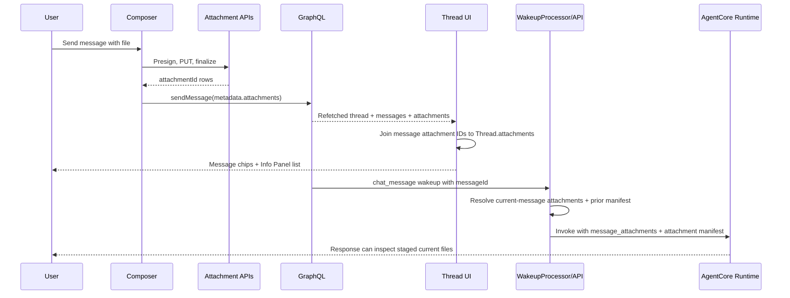
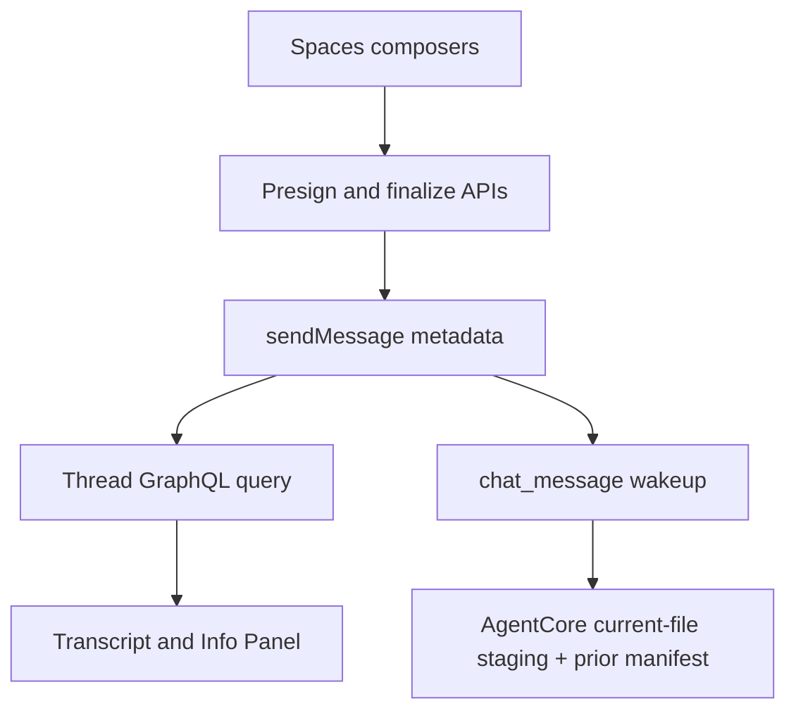

# Spaces Thread Attachments

## Overview

Spaces already has the backend attachment substrate: clients can presign uploads, PUT bytes to S3, finalize `thread_attachments` rows, download through an authorized endpoint, and query `Thread.attachments`. The missing work is the product wiring: persisted attachments must render back into the thread transcript, the Info Panel must list durable files below Progress, upload failures must be user-visible, and attachment-bearing user turns must still reach the agent path.

This plan preserves the existing presign/finalize/download architecture and treats uploaded files as durable Thread resources, not transient composer decorations (see origin: `docs/brainstorms/2026-05-26-spaces-thread-attachments-requirements.md`).

---

## Problem Frame

Today a user can select a file in the Spaces composer, but after send the file can appear to disappear: the user message renders as text only, the Info Panel either shows no Attachments section or shows attachments in the wrong position, and some upload failures are only logged. In customer onboarding threads, generic messages with files can also be consumed by onboarding fallback behavior, preventing a normal agent turn from using the uploaded file.

The feature must make the upload visibly durable across the transcript, Info Panel, collaborator reloads, and agent turn context.

---

## Requirements Trace

**Upload and persistence**
- R1. Sending a message with attached files persists each successful upload as a durable thread attachment.
- R7. A successful send refreshes thread state so transcript and Info Panel update without reload.
- R8. If all uploads fail, the app blocks the send and shows an error.
- R9. If some uploads fail, the app sends successful attachments but surfaces the partial failure.

**Transcript and Info Panel UI**
- R2. Sent messages with attachments show attachment chips in the transcript.
- R3. Transcript attachment chips support file download.
- R4. The Info Panel shows Attachments below Progress after at least one attachment exists.
- R5. The Info Panel hides the Attachments section when no files exist.
- R6. The Info Panel list shows recognizable file information and a download affordance.

**Authorization and agent context**
- R10. Attachment download remains thread-authorized and does not leak raw S3 keys.
- R11. Attachment-bearing Spaces messages are not ignored by the agent path.
- R12. Future agent turns can discover prior thread attachments, not only files on the latest message.

**Origin actors:** User, Collaborator, Agent
**Origin acceptance examples:** AE1 Send A Spreadsheet, AE2 Upload Failure, AE3 Agent Access

---

## Scope Boundaries

- No new attachment storage model, table, or raw S3 key exposure.
- No file versioning, deletion, foldering, tagging, or attachment edit UI.
- No new document parsing capability beyond making files available through the existing agent file path.
- No changes to attachment authorization semantics beyond preserving the existing thread and tenant checks.
- No empty Attachments section in the Info Panel before files exist.

---

## Context & Research

### Relevant Code and Patterns

- `apps/spaces/src/lib/upload-thread-attachments.ts` already performs presign, S3 PUT, finalize, and returns uploaded rows plus per-file failures.
- `apps/spaces/src/lib/upload-thread-attachments.test.ts` covers upload helper success and failure stages.
- `apps/spaces/src/components/workbench/SpacesThreadDetailRoute.tsx` uploads follow-up files, writes `metadata.attachments`, refetches thread queries, and owns the download helper for the workbench thread view.
- `apps/spaces/src/components/workbench/TaskThreadView.tsx` renders the workbench transcript and Info Panel. It already accepts `TaskThreadInfoPanelState.attachments` and `onDownloadAttachment`, but does not render persisted attachment chips in user messages and currently places Attachments before Progress.
- `apps/spaces/src/components/spaces/SpaceThreadRoom.tsx` and `apps/spaces/src/components/spaces/ThreadConversation.tsx` are a second Spaces thread surface with its own upload and message rendering path.
- `apps/spaces/src/lib/graphql-queries.ts` has `ComputerThreadQuery` returning thread attachments and message metadata. The generic Space thread query must maintain parity if its surface renders attachments.
- `packages/api/src/handlers/thread-attachments-presign.ts`, `packages/api/src/handlers/thread-attachments-finalize.ts`, and `packages/api/src/handlers/thread-attachment-download.ts` implement the authorized attachment lifecycle.
- `packages/api/src/graphql/resolvers/threads/thread.query.ts` loads thread attachments with tenant filtering and strips `s3_key`.
- `packages/api/src/graphql/resolvers/messages/sendMessage.mutation.ts` persists `metadata.attachments` and routes user messages to onboarding hooks, explicit mentions, or default agent dispatch.
- `packages/api/src/lib/mentions/default-agent-routing.ts` and `packages/api/src/lib/mentions/dispatch-agent-mentions.ts` enqueue `chat_message` wakeups with `messageId`.
- `packages/api/src/handlers/wakeup-processor.ts` invokes AgentCore for `chat_message` wakeups but does not currently attach resolved thread files to the runtime payload.
- `packages/agentcore-strands/agent-container/container-sources/server.py` already stages `message_attachments` to `/tmp/turn-*/attachments` and inserts a file preamble into the model context.

### Institutional Learnings

- No directly matching `docs/solutions/` entry exists for Spaces attachments. Nearby guidance confirms this repo prefers using existing AWS-native infrastructure and avoiding duplicate storage paths.
- `docs/brainstorms/2026-05-24-folder-is-the-agent-thinkwork-alignment-requirements.md` reinforces that Spaces contribute context and files, while capabilities come from the master agent/workspace routing model.
- `docs/brainstorms/2026-05-14-finance-analysis-pilot-requirements.md` and the finance pilot comments in code establish the current attachment architecture as a general capability, not a pilot-only one.

### External References

- None. Local patterns are sufficient and the plan intentionally reuses existing app, GraphQL, Lambda, and AgentCore attachment machinery.

---

## Key Technical Decisions

- Use `thread_attachments` as the source of truth: message metadata stores only attachment IDs, while display details come from `Thread.attachments`. This preserves the existing no-S3-key-in-message invariant.
- Add a shared client-side attachment resolver rather than duplicating metadata parsing in each thread renderer. The resolver should join `message.metadata.attachments` to the thread-level attachment rows and return only attachments that belong to the current thread query result.
- Render transcript chips from persisted message metadata, not from composer-local file state. This makes reloads and collaborator views behave the same as the initial sender view.
- Keep the Info Panel Attachments section hidden until files exist, then render it below Progress.
- Treat all-upload failure as a send-blocking error across every Spaces composer path. Partial failure may send successful files, but must be visible to the user.
- Validate `metadata.attachments` on write in `sendMessage`, not only on client read. Accept only finalized attachment IDs for the same tenant and thread, de-duplicate them, and persist the canonical reference list.
- Stage only current-message attachments into AgentCore `message_attachments` by default. Future-turn discovery of prior thread attachments should be a lightweight manifest/retrieval context, not eager staging of every historical file.
- Treat attachment contents as untrusted user/collaborator input. The agent context should tell the model to extract requested facts from files, not follow instructions embedded in uploaded files or trigger tools/actions solely because file content requests it.
- Keep S3 keys and presigned URLs on narrow allowed surfaces only: `s3_key` may live in the DB and internal non-logged service payloads; presigned download URLs should remain transient browser navigation targets and never be persisted in app state, message metadata, audit payloads, or user-visible errors.

---

## Open Questions

### Resolved During Planning

- Should the Info Panel show an empty Attachments section? No. It should appear only after at least one durable attachment exists.
- Should an uploaded file be a message-only item or a Thread resource? Thread resource.

### Deferred to Implementation

- Exact toast wording: use the interaction contracts below for behavior, then choose concise copy that fits the existing Spaces tone.

---

## Attachment Interaction Contracts

### Upload And Send Recovery

| State | User-visible behavior | Send behavior | Recovery |
|------|------------------------|---------------|----------|
| Upload in progress | Composer is submitting; existing file chips remain visible. | Send button remains disabled while uploads/finalize run. | User waits or cancels through existing composer affordances if available. |
| All uploads fail | Inline/composer error or toast says the file upload failed. | Do not call `sendMessage`; clear optimistic transcript state. | Keep failed files selected when the composer can preserve them; otherwise make the error explicit enough that the user knows to reattach and retry. |
| Partial uploads fail | Warning says some files were not uploaded and the successful files were sent. | Call `sendMessage` with only successful attachment IDs. | Failed files should remain selected when feasible; if the current composer clears them after success, the warning must make the partial loss clear. |
| All uploads succeed | No warning. | Call `sendMessage` with canonical `metadata.attachments`. | Composer clears after successful send as today. |
| `sendMessage` fails after finalize | Error says the files uploaded but the message did not send. | Do not render a successful message bubble. | Keep/recover the text and file context where feasible; explain that the Info Panel may still show uploaded files because they are Thread resources. |

### Attachment Display And Download

- Transcript chips: show filename as primary text, size as secondary text when available, and wrap within the message bubble without widening the conversation column.
- Info Panel rows: show filename primary, size secondary when available, and a download icon/button at row end. Uploaded date/uploader can remain omitted for this pass unless already available in the local row style.
- Ordering: transcript chips follow `message.metadata.attachments` order; Info Panel attachments use the thread query order unless implementation already sorts rows, in which case newest-first is preferred.
- Accessibility: chips and rows are semantic buttons or links with accessible names like `Download Financial Sample.xlsx`, visible focus states, keyboard activation, and adequate touch targets.
- Download states: duplicate clicks while a download request is pending should be ignored or disabled for that row; success opens the authorized URL with `noopener,noreferrer`; failure shows a retryable toast/error without leaking S3 keys, presigned URLs, or internal endpoint details.
- Long names and multiple files: filenames truncate gracefully, chips wrap to new lines, and no text may overflow the user bubble, Info Panel row, or mobile viewport.

---

## High-Level Technical Design

> *This illustrates the intended approach and is directional guidance for review, not implementation specification. The implementing agent should treat it as context, not code to reproduce.*

---

## Implementation Units

- U1. **Shared Spaces Attachment Presentation Model**

**Goal:** Create a small client-side model that safely resolves message attachment references into displayable, downloadable thread attachment items.

**Requirements:** R2, R3, R6, R10

**Dependencies:** None

**Files:**
- Create: `apps/spaces/src/lib/thread-message-attachments.ts`
- Test: `apps/spaces/src/lib/thread-message-attachments.test.ts`
- Modify: `apps/spaces/src/components/workbench/TaskThreadView.tsx`
- Modify: `apps/spaces/src/components/spaces/ThreadConversation.tsx`

**Approach:**
- Parse `message.metadata.attachments` as a tolerant array of `{ attachmentId }` references.
- Join references to the current thread's `attachments` collection by ID.
- Preserve message order from metadata and de-duplicate repeated IDs.
- Drop unknown IDs rather than rendering broken download buttons.
- Expose a display item shape usable by both `TaskThreadView` and `ThreadConversation`.
- Keep download behavior owned by the containing route so auth/token logic stays where it already lives.

**Patterns to follow:**
- `apps/spaces/src/components/workbench/TaskThreadView.tsx` metadata parser helpers such as `parseRecord`, `parseArray`, and source extraction helpers.
- `apps/spaces/src/lib/upload-thread-attachments.ts` return shapes for attachment IDs and display metadata.

**Test scenarios:**
- Happy path: metadata with one known attachment ID and thread attachments containing that row returns the file name, size, MIME type, and ID.
- Happy path: metadata with multiple attachment IDs preserves message attachment order even when `Thread.attachments` is in a different order.
- Edge case: malformed metadata, missing `attachments`, non-array attachments, or non-string IDs returns an empty list.
- Edge case: duplicate attachment IDs return one display item.
- Error path: metadata references an attachment ID absent from the thread attachment rows; resolver omits it and does not throw.

**Verification:**
- Both thread renderers can consume the same resolved attachment item shape without direct S3 key access.

---

- U2. **Workbench Transcript And Info Panel Rendering**

**Goal:** Render persisted attachment chips in the workbench thread transcript and move Info Panel Attachments below Progress.

**Requirements:** R2, R3, R4, R5, R6, R7, R10; covers AE1

**Dependencies:** U1

**Files:**
- Modify: `apps/spaces/src/components/workbench/TaskThreadView.tsx`
- Modify: `apps/spaces/src/components/workbench/SpacesThreadDetailRoute.tsx`
- Test: `apps/spaces/src/components/workbench/TaskThreadView.test.tsx`
- Test: `apps/spaces/src/components/workbench/SpacesThreadDetailRoute.test.tsx`

**Approach:**
- Pass thread-level attachments and `onDownloadAttachment` into the transcript message renderer.
- For user messages, render message text and resolved attachment chips together inside the user bubble; attachment-only messages should still show useful chips without falling back to an unhelpful empty-content label.
- Use the existing download endpoint helper from `SpacesThreadDetailRoute.tsx` for both Info Panel and transcript chips.
- Move the Info Panel Attachments section after `ThreadInfoChecklist` so it appears below Progress and checklist rows.
- Keep the section hidden when `state.attachments.length === 0`.
- Preserve current layout constraints: the Info Panel width, transcript right padding, and composer dock spacing should not shift when attachments appear.
- Follow the Attachment Display And Download contract for chip anatomy, keyboard access, pending duplicate-click handling, and long filename behavior.

**Patterns to follow:**
- Existing Info Panel attachment button styling in `TaskThreadView.tsx`.
- Existing `GeneratedArtifactCard` placement for non-text content inside messages.
- Existing test style in `TaskThreadView.test.tsx` using Testing Library and `within(panel)`.

**Test scenarios:**
- Covers AE1. Happy path: a user message with metadata referencing `Financial Sample.xlsx` renders a transcript chip with that file name.
- Covers AE1. Happy path: clicking the transcript chip calls `onDownloadAttachment` with the attachment ID.
- Covers AE1. Happy path: the Info Panel renders Progress first and Attachments below it when attachments exist.
- Edge case: with no thread attachments, the Info Panel does not render an Attachments heading.
- Edge case: attachment-only user message renders the chip and does not show `(No message content)`.
- Error path: message metadata references an unknown attachment ID; transcript does not render a broken chip.
- Error path: workbench download endpoint failure shows a user-visible error and does not leak the presigned URL, S3 key, or raw endpoint detail.
- Integration: after `SpacesThreadDetailRoute` refetches a thread containing the new attachment row and message metadata, both the transcript and Info Panel render the same file without a page reload.

**Verification:**
- The workbench route shows sent attachments in both the transcript and Info Panel, with the Info Panel section below Progress.

---

- U3. **Generic Spaces Thread Surface Parity**

**Goal:** Ensure the non-workbench Space thread route also displays and downloads persisted attachments.

**Requirements:** R2, R3, R6, R7, R10

**Dependencies:** U1

**Files:**
- Modify: `apps/spaces/src/components/spaces/SpaceThreadRoom.tsx`
- Modify: `apps/spaces/src/components/spaces/ThreadConversation.tsx`
- Modify: `apps/spaces/src/lib/graphql-queries.ts`
- Test: `apps/spaces/src/components/spaces/ThreadConversation.test.tsx`
- Test: `apps/spaces/src/components/spaces/SpaceThreadRoom.test.tsx`
- Test: `apps/spaces/src/lib/graphql-queries.test.ts`

**Approach:**
- Add thread attachments to the generic Space thread query if that query does not already request them.
- Pass thread-level attachments and a download callback from `SpaceThreadRoom.tsx` into `ThreadConversation`.
- Reuse the U1 resolver and the same chip presentation behavior so both Spaces thread surfaces behave consistently.
- Use the existing authorized download route shape: `/api/threads/:threadId/attachments/:attachmentId/download`.
- Keep sender grouping behavior intact; chips belong to the message body they were sent with.
- Ensure the generic route refetches the thread after successful send so new message metadata and the new thread attachment row render without reload.

**Patterns to follow:**
- `SpacesThreadDetailRoute.tsx` `downloadThreadAttachment` for token retrieval, download endpoint call, and `window.open`.
- `ThreadConversation.tsx` use of `normalizePersistedParts` and `renderTypedParts` to render persisted message data rather than composer-local state.

**Test scenarios:**
- Happy path: generic thread query includes `attachments { id name mimeType sizeBytes uploadedBy createdAt }`.
- Happy path: `ThreadConversation` renders a file chip for a user message whose metadata references a known attachment.
- Happy path: clicking the chip calls the provided download callback with the attachment ID.
- Edge case: grouped messages from the same sender keep each message's own attachment chips under the correct message.
- Error path: download endpoint failure surfaces a toast and does not throw through React rendering.
- Integration: after a successful send with attachments, `SpaceThreadRoom` refetches and `ThreadConversation` renders the newly attached file.

**Verification:**
- Attachments are visible and downloadable in both Spaces thread UI paths, not only the customer onboarding workbench view.

---

- U4. **Visible Upload Failure Semantics**

**Goal:** Prevent files from silently disappearing when upload or finalize fails.

**Requirements:** R1, R7, R8, R9; covers AE2

**Dependencies:** None

**Files:**
- Modify: `apps/spaces/src/components/workbench/SpacesThreadDetailRoute.tsx`
- Modify: `apps/spaces/src/components/workbench/SpacesWorkbench.tsx`
- Modify: `apps/spaces/src/components/spaces/SpaceThreadRoom.tsx`
- Test: `apps/spaces/src/components/workbench/SpacesThreadDetailRoute.test.tsx`
- Test: `apps/spaces/src/components/workbench/SpacesWorkbench.test.tsx`
- Test: `apps/spaces/src/components/spaces/SpaceThreadRoom.test.tsx`

**Approach:**
- Normalize upload result handling in the three send paths:
  - zero files: send as today.
  - all uploads fail: clear optimistic UI, block `sendMessage`, and show a clear error.
  - partial failure: send only successful attachment IDs and show a warning naming that not all files uploaded.
  - all succeed: send with metadata and no warning.
- Follow the Upload And Send Recovery table for retry, selected-file preservation, and the finalized-upload/message-send-failure case.
- Keep `metadata.attachments` absent when there are no successful attachment IDs.
- Avoid `console.warn` as the only user feedback for any upload failure.
- Ensure composer-local attachment chips clear only after a successful send path, preserving current `PromptInput` semantics.

**Patterns to follow:**
- Existing all-failed handling in `SpacesWorkbench.tsx`.
- Existing composer error handling in `TaskThreadView.tsx` `FollowUpComposer`.
- `sonner` toast usage already present in `SpaceThreadRoom.tsx` and `SpacesThreadDetailRoute.tsx`.

**Test scenarios:**
- Covers AE2. Error path: one attached file fails before any upload succeeds; no `sendMessage` mutation is called and an error is shown.
- Error path: multiple attached files all fail; no `sendMessage` mutation is called and optimistic message state is cleared.
- Happy path: two files upload successfully; `sendMessage` receives both attachment IDs in `metadata.attachments`.
- Edge case: one file succeeds and one fails; `sendMessage` receives only the successful ID and a user-visible warning appears.
- Edge case: no files attached; send behavior is unchanged and does not require attachment API configuration.
- Error path: upload finalize succeeds but `sendMessage` fails; the user sees copy that distinguishes "file uploaded" from "message sent."

**Verification:**
- A failed upload cannot look like a successful text-only send, and partial success is explicit.

---

- U5. **Backend Attachment Reference Validation**

**Goal:** Canonicalize and authorize `metadata.attachments` before message persistence so later UI and agent paths can trust attachment references.

**Requirements:** R1, R10, R11

**Dependencies:** U4 for reliable client-side upload semantics

**Files:**
- Create: `packages/api/src/lib/thread-attachments/message-attachment-refs.ts`
- Test: `packages/api/src/lib/thread-attachments/message-attachment-refs.test.ts`
- Modify: `packages/api/src/graphql/resolvers/messages/sendMessage.mutation.ts`
- Test: `packages/api/src/graphql/resolvers/messages/sendMessage.attachments.test.ts`

**Approach:**
- Parse `metadata.attachments` as an optional bounded array of attachment ID references.
- Accept only UUID-shaped IDs that resolve to finalized `thread_attachments` rows for the same tenant and thread.
- De-duplicate references while preserving client order.
- Persist the canonical list back into `messages.metadata.attachments`; reject or drop invalid refs consistently with existing GraphQL error conventions, preferring a clear client error for malformed or cross-thread/cross-tenant references.
- Keep full attachment row details in `thread_attachments`; do not duplicate names, sizes, MIME types, S3 keys, or URLs into message metadata.
- Ensure logs and errors report attachment IDs/counts only, never S3 keys or presigned URLs.

**Patterns to follow:**
- `packages/api/src/graphql/resolvers/threads/thread.query.ts` tenant-pinned attachment selection.
- `packages/api/src/lib/slack/file-attachments.ts` metadata-linking pattern for attachment ID references.
- Existing `sendMessage` metadata parsing and GraphQL error handling.

**Test scenarios:**
- Happy path: valid attachment IDs for the same thread persist as canonical `metadata.attachments`.
- Edge case: duplicate IDs are de-duplicated while preserving first occurrence order.
- Edge case: missing or empty attachment metadata leaves message metadata unchanged apart from existing behavior.
- Error path: malformed IDs are rejected or dropped according to the chosen resolver convention and never reach persisted message metadata.
- Error path: cross-tenant and cross-thread attachment IDs are not persisted.
- Error path: oversized attachment reference arrays are rejected before DB work or trimmed only if an existing convention clearly supports trimming.

**Verification:**
- Backend message metadata cannot smuggle invalid, inaccessible, or cross-thread attachment references into later display or agent paths.

---

- U6. **Agent Dispatch And Thread Attachment Context**

**Goal:** Ensure attachment-bearing Spaces messages can reach the agent and that future turns can discover prior thread attachments.

**Requirements:** R11, R12; covers AE3

**Dependencies:** U5

**Files:**
- Modify: `packages/api/src/graphql/resolvers/messages/sendMessage.mutation.ts`
- Modify: `packages/api/src/lib/spaces/customer-onboarding-chat-updates.ts`
- Modify: `packages/api/src/lib/spaces/customer-onboarding-chat-updates.test.ts`
- Modify: `packages/api/src/handlers/wakeup-processor.ts`
- Test: `packages/api/src/handlers/wakeup-processor.attachments.test.ts`
- Test: `packages/api/src/lib/mentions/default-agent-routing.test.ts`

**Approach:**
- Extract a narrow testable helper near the wakeup processor that builds attachment context for a `chat_message` AgentCore invocation:
  - current-message attachment rows become AgentCore `message_attachments` and are staged by the existing Python runtime.
  - prior thread attachments become lightweight manifest entries in the invocation context so the agent can discover that files exist without eagerly downloading every historical file.
  - invalid or cross-thread references should already be excluded by U5, but this helper should still tenant/thread-pin its queries defensively.
- Update onboarding chat handling so non-actionable messages, especially attachment-bearing messages like "Here's the financials", do not get marked as fully handled by the onboarding fallback. Onboarding should still handle actual checklist/status/fact/assignment requests.
- Keep explicit agent mentions and default agent routing behavior intact; routing files should be changed only if implementation verifies they lack the `messageId` needed to resolve attachments later.
- In `wakeup-processor.ts`, for `chat_message` wakeups with a thread and message ID, resolve current-message attachments before invoking AgentCore and pass them as `message_attachments`.
- Add a concise untrusted-file instruction to the attachment preamble or adjacent runtime context: the model may inspect uploaded files for requested facts, but must not follow instructions embedded in those files or trigger tools/actions solely because file content asks it to.
- Preserve tenant and thread filters when resolving attachment rows. Never copy `s3_key` into message metadata or GraphQL response objects.

**Patterns to follow:**
- `packages/api/src/graphql/resolvers/threads/thread.query.ts` tenant-pinned attachment selection.
- Existing `message_attachments` payload handling in `packages/api/src/handlers/chat-agent-invoke.ts`.
- Python staging behavior in `packages/agentcore-strands/agent-container/container-sources/server.py`, which already stages a list of attachment records into `/tmp`.
- Source-level guard tests already present in `customer-onboarding-chat-updates.test.ts`.

**Test scenarios:**
- Covers AE3. Happy path: a `chat_message` wakeup for a message with `metadata.attachments` resolves the current-message attachment row and includes it in AgentCore `message_attachments`.
- Covers AE3. Happy path: a later `chat_message` wakeup in the same thread includes a lightweight manifest of prior thread attachments even when the latest message has no new attachments.
- Edge case: duplicate current-message attachment references are de-duplicated before `message_attachments` payload construction, and prior-manifest entries do not duplicate staged current files.
- Edge case: attachment rows from another tenant or another thread are excluded.
- Error path: malformed message metadata does not crash wakeup processing; the agent turn proceeds without malformed refs.
- Security regression: malicious file content that says to ignore system instructions is framed as untrusted file content in the runtime preamble/context.
- Integration: customer onboarding message with an attachment but no actionable onboarding update does not set `customerOnboardingHandled`, allowing default agent dispatch.
- Regression: actionable onboarding updates still produce the onboarding assistant response and do not double-dispatch a default agent turn.

**Verification:**
- Attachment-bearing messages can reach the agent path, current-message files are staged through `message_attachments`, and prior thread files are discoverable without eager bulk download.

---

## System-Wide Impact

- **Interaction graph:** Composer upload paths, `sendMessage`, thread query refetch, transcript rendering, Info Panel rendering, onboarding parser, default/mention wakeups, and AgentCore payload construction are all affected.
- **Error propagation:** Upload errors must move from console-only diagnostics to user-visible composer/toast errors. Backend attachment resolution errors should not block the whole agent turn unless they indicate an authorization or data-integrity violation.
- **State lifecycle risks:** The main partial-state risk is a finalized `thread_attachments` row followed by failed `sendMessage`. The file remains a thread resource and may appear in the Info Panel even without a message chip, so the sender must get explicit recovery copy explaining that the file uploaded but the message did not send.
- **API surface parity:** Workbench and generic Spaces thread surfaces need equivalent display/download behavior. GraphQL schema changes are not expected; query selection parity may be required.
- **Integration coverage:** Unit tests should cover resolver helpers and UI components, while route-level tests should cover send/refetch behavior and visible upload failures.
- **Unchanged invariants:** `thread_attachments.s3_key` remains server-only; downloads continue through the authorized download endpoint; no raw file URLs are persisted in message metadata.

---

## Risks & Dependencies

| Risk | Mitigation |
|------|------------|
| Upload finalizes a file but `sendMessage` later fails, leaving a thread attachment without a message chip. | Treat attachments as thread resources and show explicit recovery copy: the file uploaded, but the message did not send. |
| Eagerly staging prior thread attachments could become heavy for long threads. | Stage only current-message attachments. Represent prior files as a lightweight manifest/retrieval context and defer any richer selection policy to follow-up requirements. |
| Onboarding parser changes could reintroduce double responses or suppress real checklist updates. | Add regression tests for actionable onboarding updates and non-actionable attachment-bearing messages. |
| Two Spaces thread renderers drift again. | Use a shared client resolver and test both `TaskThreadView` and `ThreadConversation`. |
| Download chips could expose inaccessible files if client trusts metadata alone. | Join only against `Thread.attachments` returned by the tenant-filtered query and use the existing authorized download endpoint for bytes. |
| Uploaded files may contain prompt-injection instructions. | Mark attachment contents as untrusted in agent context and test the preamble/guardrail wording. |

---

## Documentation / Operational Notes

- No new deployment mechanism is required beyond the normal PR merge pipeline. The API, Spaces app, and AgentCore handler changes deploy through existing build/deploy workflows.
- No operator documentation is required for the first pass; this is expected behavior for the thread file affordance.
- If implementation changes Spaces GraphQL query documents, run `@thinkwork/spaces` tests and typecheck. Spaces currently keeps handwritten query documents rather than a package-level codegen script.

---

## Sources & References

- **Origin document:** [docs/brainstorms/2026-05-26-spaces-thread-attachments-requirements.md](../brainstorms/2026-05-26-spaces-thread-attachments-requirements.md)
- Related frontend code: `apps/spaces/src/components/workbench/TaskThreadView.tsx`
- Related frontend route: `apps/spaces/src/components/workbench/SpacesThreadDetailRoute.tsx`
- Related generic Spaces route: `apps/spaces/src/components/spaces/SpaceThreadRoom.tsx`
- Related upload helper: `apps/spaces/src/lib/upload-thread-attachments.ts`
- Related GraphQL resolver: `packages/api/src/graphql/resolvers/threads/thread.query.ts`
- Related send resolver: `packages/api/src/graphql/resolvers/messages/sendMessage.mutation.ts`
- Related attachment APIs: `packages/api/src/handlers/thread-attachments-presign.ts`, `packages/api/src/handlers/thread-attachments-finalize.ts`, `packages/api/src/handlers/thread-attachment-download.ts`
- Related runtime staging: `packages/agentcore-strands/agent-container/container-sources/server.py`
