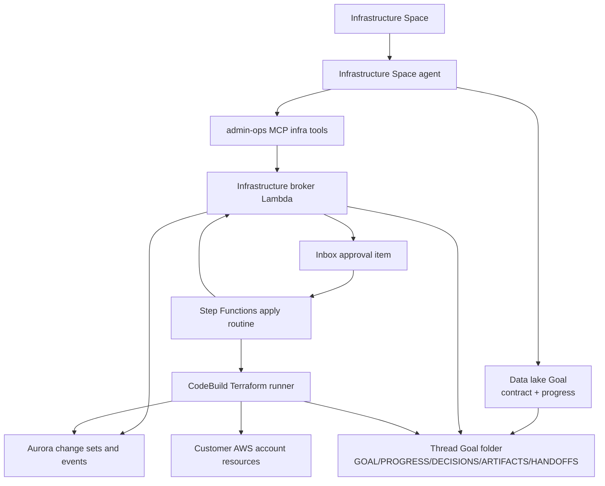
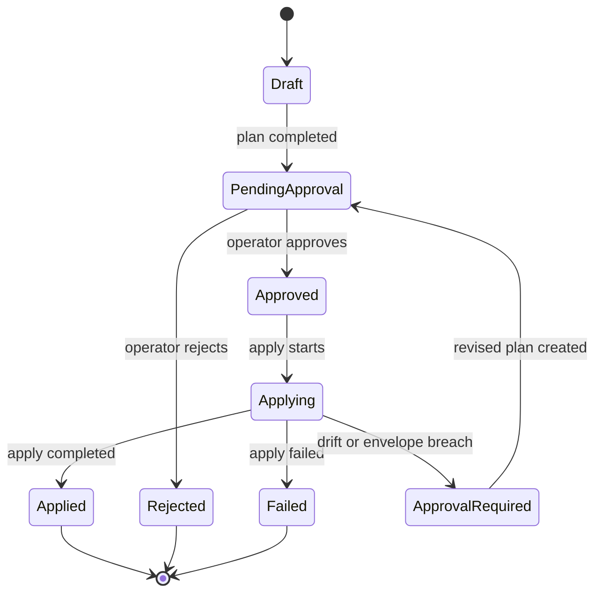
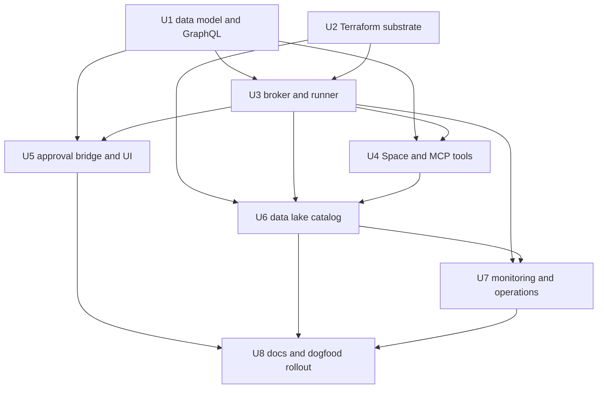

# feat: Infrastructure Space AWS data lake PoC

## Overview

Build the first customer-owned AWS infrastructure delegation path for ThinkWork: an Infrastructure Space where the agent can inspect the same AWS account that hosts the customer ThinkWork install, propose a full data lake plan, request approval once, and execute the approved plan through brokered AWS access.

The proof target is a customer data lake: Aurora, S3 import and Iceberg storage, Dagster on ECS, AWS Glue, Athena, scheduled extraction automation, monitoring, and ongoing management. This plan keeps v1 install-local, approval-first, broker-mediated, and Goal-native. It does not put raw AWS credentials in the agent runtime.

| Mode | v1 behavior |
| --- | --- |
| `read_only` | Agent can inspect approved AWS surfaces and create findings. No mutation. |
| `approve_every_step` | Every brokered mutation creates an approval item. |
| `approve_plan` | Default. Operator approves the full change envelope once; execution can continue inside that envelope. |

---

## Problem Frame

ThinkWork customers run their own install in their own AWS account. They want the agent to handle AWS work for that account without exposing credentials to the model and without forcing a human to approve each low-level AWS API call. The first dogfood customer needs a complete data lake setup and an operating surface for scheduled extraction, monitoring, and management.

The current repo already has most of the product primitives: Spaces carry local policy and context, MCP servers expose tenant tools, routines run multi-step Step Functions workflows, Inbox items handle human approvals, Terraform modules define install-time AWS resources, and folder-native Goals are being planned as the accountable execution record. This plan combines those pieces into a governed Infrastructure Space path.

---

## Requirements Trace

- R1. Provide an Infrastructure Space pattern for AWS infrastructure work inside a customer-owned ThinkWork install.
- R2. Default new Infrastructure Spaces to `approve_plan`.
- R3. Support v1 autonomy modes `read_only`, `approve_every_step`, and `approve_plan`, with room for later modes.
- R4. Persist approved plan envelopes with goal, affected resources, allowed actions, IAM impact, risk notes, rollback notes, approver, and drift/expiry boundaries.
- R5. Stop and request a new approval when execution exceeds the approved envelope.
- R6. Keep AWS access broker-mediated; do not expose raw AWS credentials to the model or general agent runtime.
- R7. Permit read-only diagnostics without approval when Space policy allows it.
- R8. Execute mutating changes through approved change sets, routines, or narrow operational tools, with durable records.
- R9. Scope v1 to the same AWS account as the customer-owned ThinkWork install.
- R10. Limit IAM mutation to ThinkWork-managed IAM resources with required prefixes, tags, and permissions boundaries.
- R11. Support the first data lake setup: Aurora, S3 import buckets, Dagster on ECS, AWS Glue, Iceberg storage, and Athena.
- R12. Configure scheduled extractions using existing Space automation primitives where possible.
- R13. Monitor health through scheduled checks, webhooks, or AWS events and report into the Infrastructure Space.
- R14. Support ongoing management: schema/table changes, extraction updates, orchestration updates, troubleshooting, and safe remediations.
- R15. Preserve deployed resource inventory, runbooks, schedules, known failure modes, and repair notes in the Infrastructure Space.
- R16. Make high-risk changes obvious in approval UI.
- R17. Let operators inspect what was approved, executed, differed, and evidenced by AWS.
- R18. Represent data lake setup and management work as folder-native Goals when the Goals substrate is available, with `GOAL.md`, `PROGRESS.md`, `DECISIONS.md`, `ARTIFACTS.md`, and `HANDOFFS.md` carrying the portable narrative execution record.

**Origin actors:** A1 (tenant operator), A2 (Infrastructure Space agent), A3 (ThinkWork deployment), A4 (AWS account), A5 (customer data team)
**Origin flows:** F1 (initial data lake setup), F2 (scheduled extractions), F3 (health monitoring and incident response), F4 (ongoing management)
**Origin acceptance examples:** AE1 (approve whole data lake plan), AE2 (stop on IAM boundary breach), AE3 (read-only health diagnosis), AE4 (nightly extraction management), AE5 (audit without raw credentials)

---

## Scope Boundaries

- Cross-account AWS access is not included. v1 targets the same account as the installed ThinkWork stack.
- Shared/vendor-hosted accounts are not included.
- Arbitrary customer IAM editing is not included. v1 IAM mutation is limited to ThinkWork-managed prefixes, tags, and boundaries.
- Raw AWS CLI credentials in the model/runtime are not included.
- Full autonomous AWS mutation without approval is not included.
- The first product slice focuses on the data lake path, not a generic AWS console replacement.
- The agent may not bypass ThinkWork approvals by using direct AWS mutation tools outside the broker.

### Deferred to Follow-Up Work

- Cross-account AWS onboarding with ExternalId trust.
- `trusted_operations`, `full_access`, and fully custom policy modes.
- Customer-owned infrastructure repository PR mode.
- Lake Formation governance and fine-grained data access as a first-class product surface. The v1 module can leave room for it, but the first proof should not depend on it.
- Generic AWS service coverage beyond the data lake services named in R11-R14.
- Multi-Goal orchestration for complex infrastructure programs. The first proof can use one data lake setup Goal plus follow-up management Goals after the folder-native Goals substrate exists.

---

## Context & Research

### Relevant Code and Patterns

- `docs/POSITIONING.md` - confirms the product promise: customer AWS boundary, no shared SaaS control plane.
- `packages/database-pg/src/schema/spaces.ts` and `packages/database-pg/graphql/types/spaces.graphql` - Space policy, kind, tool policy, MCP policy, members, and runtime overrides.
- `packages/api/src/graphql/resolvers/spaces/createSpace.mutation.ts` and `packages/api/src/graphql/resolvers/spaces/setSpaceTools.mutation.ts` - current admin/service patterns for creating Spaces and assigning tools.
- `packages/database-pg/src/schema/mcp-servers.ts` - tenant and Space MCP server assignment model.
- `packages/lambda/admin-ops-mcp.ts` and `packages/admin-ops/src/routines.ts` - existing MCP wrapper pattern for agent-callable admin operations.
- `terraform/modules/app/routines-stepfunctions/main.tf` - Step Functions execution substrate, task-token approvals, routine output bucket, and existing routine IAM scope.
- `packages/api/src/graphql/resolvers/inbox/routine-approval-bridge.ts` - load-bearing pattern for idempotent approval dispatch into Step Functions with `RequestResponse`.
- `packages/database-pg/src/schema/tenant-credentials.ts` and `packages/api/src/graphql/resolvers/tenant-credentials/*` - metadata-only credential records backed by Secrets Manager.
- `packages/api/src/handlers/seed-workspace-defaults.ts` and `packages/api/src/lib/spaces/customer-onboarding-seed.ts` - existing seeded Space source-file pattern to mirror for Infrastructure Space.
- `apps/spaces/src/components/approvals/*` and `packages/database-pg/graphql/types/inbox-items.graphql` - end-user approval detail and generic Inbox item decision contracts.
- `apps/cli/src/terraform.ts` and `apps/cli/src/commands/enterprise/templates/deploy-repo/terraform/backend-dev.hcl` - existing Terraform wrapper and customer state backend conventions.
- `docs/plans/2026-05-27-003-feat-folder-native-goals-plan.md` - planned Agentic OS substrate for explicit Goals, Space-owned Goal templates, thread-owned Goal folders, and Aurora/S3 source-of-truth split.

### Institutional Learnings

- `docs/solutions/best-practices/oauth-client-credentials-in-secrets-manager-2026-04-21.md` - secret values belong in Secrets Manager with typed helpers, metadata in Aurora, and no plaintext browser/API echoes.
- `docs/solutions/best-practices/service-endpoint-vs-widening-resolvecaller-auth-2026-04-21.md` - prefer narrow service endpoints over widening general auth paths.
- `docs/solutions/best-practices/injected-built-in-tools-are-not-workspace-skills-2026-04-28.md` - platform tools requiring tenant secrets or runtime context should be injected by the platform, not represented as workspace skills.
- `docs/solutions/best-practices/every-admin-mutation-requires-requiretenantadmin-2026-04-22.md` - gate admin mutations before side effects.
- `docs/residual-review-findings/feat-routines-phase-a-substrate.md` - shared Step Functions roles need care; true IAM-layer tenant isolation with shared roles is non-trivial. This v1 avoids cross-account/multi-tenant AWS mutation and keeps install-local boundaries.
- `docs/residual-review-findings/feat-routines-phase-b-u8.md` - bridge-level tests are important because resolver dispatch into approval bridges can silently regress.
- `docs/solutions/build-errors/aws-security-group-description-rejects-non-ascii-2026-05-13.md` - keep generated AWS resource descriptions ASCII-safe.

### External References

- AWS IAM permissions boundaries: permissions are effectively the intersection of identity policy and boundary, with explicit deny winning. This supports the ThinkWork-managed IAM-only model. <https://docs.aws.amazon.com/IAM/latest/UserGuide/access_policies_boundaries.html>
- AWS Step Functions service integration patterns: `.sync` jobs wait for completion, and `.waitForTaskToken` can pause for human approval until `SendTaskSuccess` or `SendTaskFailure`. <https://docs.aws.amazon.com/step-functions/latest/dg/connect-to-resource.html>
- AWS CodeBuild: suited for a Terraform runner because it runs configured build commands in managed environments and stores artifacts in S3. <https://aws.amazon.com/documentation-overview/codebuild/> and <https://docs.aws.amazon.com/codebuild/latest/userguide/build-spec-ref.html>
- Amazon Athena Iceberg tables: Athena creates Iceberg v2 tables and can use Glue crawlers to register Iceberg metadata. <https://docs.aws.amazon.com/athena/latest/ug/querying-iceberg-creating-tables.html>
- AWS Glue transactional tables: Glue can create/manage Iceberg tables in the Data Catalog, and Iceberg supports schema evolution and time travel. <https://docs.aws.amazon.com/glue/latest/dg/populate-otf.html>
- AWS Glue CloudWatch metrics: Glue jobs publish metrics for monitoring. <https://docs.aws.amazon.com/glue/latest/dg/monitoring-awsglue-with-cloudwatch-metrics.html>
- Amazon RDS CloudWatch metrics: RDS publishes 1-minute metrics, Performance Insights metrics, Enhanced Monitoring logs, and usage metrics. <https://docs.aws.amazon.com/AmazonRDS/latest/UserGuide/monitoring-cloudwatch.html>
- Dagster AWS deployment guidance: Dagster can run webserver/daemon on ECS, use RDS for run and event storage, use S3 for I/O, and launch each run as an ECS task. <https://docs.dagster.io/> and <https://rl-declarative-scheduling-dbt-translator.dagster.dagster-docs.io/deployment/guides/aws>
- CloudTrail Lake note: AWS docs state CloudTrail Lake will no longer be open to new customers starting May 31, 2026. Use regular CloudTrail/S3 evidence as the v1 default, and treat CloudTrail Lake as optional only when already available. <https://docs.aws.amazon.com/awscloudtrail/latest/userguide/cloudtrail-lake-concepts.html>

---

## Key Technical Decisions

- **Hybrid source of truth:** Durable infrastructure is Terraform-managed. The Infrastructure Space stores generated plan artifacts, summaries, runbooks, and inventory notes. Aurora stores change-set state and approval metadata. Terraform state lives in the customer install's existing Terraform backend under a dedicated Infrastructure Space key prefix.
- **Step Functions orchestrates mutating execution:** The broker validates policy and records state. Step Functions owns the plan/apply workflow and starts CodeBuild jobs. Lambda never runs Terraform directly.
- **CodeBuild Terraform runner:** Plan/apply runs execute in CodeBuild projects, not inside Lambda. CodeBuild owns long-running Terraform execution and artifacts using a pinned Terraform version, provider lockfile, and curated buildspecs generated by the catalog.
- **Broker-mediated AWS access:** Add a dedicated infrastructure broker Lambda/service plus a CodeBuild runner role. The agent reaches AWS through MCP tools that call this broker. The broker enforces Space policy, hashes plan artifacts, validates approvals, and records events.
- **`approve_plan` envelope hash:** A plan approval pins a plan hash and allowed-action/resource envelope. Apply must re-check the hash and fail closed when drift or scope expansion appears.
- **ThinkWork-managed IAM only:** Terraform modules may create/update IAM roles and policies only with the `thinkwork-infra-*` prefix, required tags, and the infrastructure permissions boundary. The broker and runner cannot modify arbitrary existing roles, users, access keys, or their own roles.
- **Data lake catalog first, generic AWS later:** The initial catalog contains one data lake module and a small operational-tool set. Generic AWS SDK execution is not exposed.
- **Metadata-only diagnostics by default:** Health checks inspect resource configuration, status, metrics, logs pointers, and object metadata. They do not read customer row data or S3 object bodies unless a later explicit, approved data-access policy allows it.
- **Infrastructure Space seeded as first-class Space kind:** Add `infrastructure` as a Space kind rather than overloading `custom`, so policies, UI, docs, and seed files can target it explicitly.
- **Goal-native infrastructure work:** The Infrastructure Space should seed Space-owned Goal templates such as `goals/data-lake-setup/` and create thread-owned Goal folders for data lake setup, scheduled extraction updates, monitoring reviews, and approved management work. Aurora remains canonical for change-set lifecycle and approvals; Goal markdown is canonical for narrative context, decisions, handoffs, artifact summaries, and operator briefing.
- **CloudTrail evidence, not CloudTrail Lake dependency:** Capture broker execution ids, CodeBuild build ids, AWS request ids where available, and CloudTrail lookup pointers. Do not require CloudTrail Lake for the proof.

---

## Open Questions

### Resolved During Planning

- **Which data lake deployment artifact is source of truth?** A hybrid: curated Terraform modules are the durable infra source; generated per-Space plan bundles and summaries are the working artifacts; Aurora stores change-set lifecycle; the Space stores runbooks and inventory.
- **How does this map to folder-native Goals?** The initial data lake setup is a delegated Infrastructure Goal. The approved Terraform plan, broker evidence, inventory snapshots, decisions, handoffs, and runbooks should refresh the Goal folder while structured approval/change-set state stays in Aurora.
- **Which operations are first-class broker tools versus Terraform-only?** Terraform owns resource creation and structural changes. Broker tools own read-only diagnostics and narrow operations: start/stop Glue crawler, inspect Glue job/crawler state, inspect Athena query status, inspect ECS service/task health, inspect RDS metrics, create RDS snapshot when approved, and run approved schema/table operations.
- **Which first health signals matter?** RDS CloudWatch/Database Insights signals, Glue job/crawler runs and metrics, ECS service/task health for Dagster, Athena query failures and workgroup usage, S3 object freshness/size signals, and CodeBuild/Terraform plan/apply status.
- **What approval diff format should v1 use?** A structured risk summary plus artifact links: resource changes, IAM changes, destructive actions, public/network exposure, encryption changes, cost-bearing resources, policy-boundary status, plan hash, and rollback notes.

### Deferred to Implementation

- **Exact Terraform module shape:** Final variables and resource names should settle while building the data lake catalog against the customer dogfood details.
- **Dagster deployment exactness:** The first module should prefer ECS/Fargate and RDS/S3 patterns from Dagster docs, but final container images, auth, and run-launcher configuration depend on customer requirements.
- **CloudTrail lookup depth:** Store enough request/build identifiers in v1. Add richer CloudTrail search UI later if evidence lookup becomes a common operator workflow.

---

## High-Level Technical Design

> *This illustrates the intended approach and is directional guidance for review, not implementation specification. The implementing agent should treat it as context, not code to reproduce.*



### Change-Set Lifecycle



---

## Implementation Units



- U1. **Infrastructure change-set domain model**

**Goal:** Add the durable database and GraphQL contract for Infrastructure Space autonomy mode, AWS connection metadata, change sets, change events, plan artifacts, approval envelopes, Goal linkage, and resource inventory snapshots.

**Requirements:** R1, R2, R3, R4, R5, R8, R9, R15, R17, R18; F1, F4; AE1, AE5

**Dependencies:** None

**Files:**
- Create: `packages/database-pg/src/schema/infrastructure.ts`
- Modify: `packages/database-pg/src/schema/index.ts`
- Create: `packages/database-pg/graphql/types/infrastructure.graphql`
- Create: `packages/database-pg/drizzle/NNNN_infrastructure_change_sets.sql`
- Create: `packages/database-pg/drizzle/NNNN_infrastructure_change_sets_rollback.sql`
- Create: `packages/api/src/graphql/resolvers/infrastructure/index.ts`
- Create: `packages/api/src/graphql/resolvers/infrastructure/infrastructureChangeSets.query.ts`
- Create: `packages/api/src/graphql/resolvers/infrastructure/infrastructureChangeSet.query.ts`
- Create: `packages/api/src/graphql/resolvers/infrastructure/createInfrastructureChangeSet.mutation.ts`
- Create: `packages/api/src/graphql/resolvers/infrastructure/cancelInfrastructureChangeSet.mutation.ts`
- Create: `packages/api/src/graphql/resolvers/infrastructure/shared.ts`
- Modify: `packages/api/src/graphql/resolvers/index.ts`
- Generated: `terraform/schema.graphql`
- Generated: `packages/api/src/gql/graphql.ts`
- Generated: `apps/spaces/src/gql/graphql.ts`
- Generated: `apps/admin/src/gql/graphql.ts`
- Test: `packages/api/src/graphql/resolvers/infrastructure/infrastructure-change-sets.test.ts`
- Test: `packages/database-pg/__tests__/infrastructure-schema.test.ts`

**Approach:**
- Add a schema that models:
  - install-local AWS connection metadata for the current account and region set,
  - per-Space autonomy mode with default `approve_plan`,
  - change-set lifecycle,
  - immutable plan/apply artifact keys,
  - approved plan hash and envelope,
  - optional `goal_id` / `thread_id` linkage when folder-native Goals are enabled,
  - event log rows for plan, approval, apply, failure, and drift,
  - inventory snapshots keyed by Space and service family.
- Store secret-free metadata only. Any future customer credential or external integration secret goes through the existing tenant credential pattern.
- Gate all mutations with row-derived tenant authorization before writing rows or starting AWS work.
- Require tenant-admin or service-principal authorization for change-set creation, cancellation, approval mutation, and apply dispatch. Non-admin Space members may read allowed summaries only when existing Space/tenant membership rules permit it.
- Use check constraints for autonomy modes, change-set statuses, change source types, and event types.
- Keep approval metadata in the change-set row, but continue to use Inbox items as the operator decision surface.
- If the Goals schema is already present, use a real foreign key from infrastructure change sets to the Goal row. If the infrastructure substrate lands first, keep a forward-compatible nullable metadata field and add the foreign key in the Goals integration slice.

**Execution note:** Start with schema and resolver tests before wiring broker calls.

**Patterns to follow:**
- `packages/database-pg/src/schema/tenant-credentials.ts`
- `packages/database-pg/src/schema/routine-approval-tokens.ts`
- `packages/api/src/graphql/resolvers/tenant-credentials/shared.ts`
- `packages/api/src/graphql/resolvers/inbox/decideInboxItem.mutation.ts`

**Test scenarios:**
- Happy path: creating a draft change set stores tenant, Space, source type, artifact references, autonomy mode, risk summary, and plan hash without secret values.
- Happy path: creating a draft change set for a data lake setup Goal links the change set to the Goal/Thread execution record.
- Happy path: querying a change set returns events and linked Inbox item metadata for the same tenant.
- Edge case: an omitted autonomy mode inherits `approve_plan` from the Space/default deployment setting.
- Error path: a non-member cannot query another tenant's change set.
- Error path: a non-admin/service caller cannot create or cancel a change set.
- Error path: invalid status transition from `applied` back to `applying` is refused.
- Covers AE5. Integration: change-set event rows preserve enough evidence fields to reconstruct approval and apply history without raw AWS credentials.

**Verification:**
- Database schema tests prove tables, check constraints, and generated migration markers exist.
- GraphQL tests prove tenant scoping, metadata-only responses, and status transitions.

---

- U2. **Install-local AWS broker substrate**

**Goal:** Add opt-in Terraform substrate for Infrastructure Space: artifact storage, broker Lambda wiring, CodeBuild plan/apply projects, IAM roles, a permissions boundary, and install variables.

**Requirements:** R1, R6, R8, R9, R10, R17; F1; AE2, AE5

**Dependencies:** None

**Files:**
- Create: `terraform/modules/app/infrastructure-broker/main.tf`
- Create: `terraform/modules/app/infrastructure-broker/variables.tf`
- Create: `terraform/modules/app/infrastructure-broker/outputs.tf`
- Modify: `terraform/modules/thinkwork/variables.tf`
- Modify: `terraform/modules/thinkwork/main.tf`
- Modify: `terraform/modules/thinkwork/outputs.tf`
- Modify: `terraform/modules/app/lambda-api/variables.tf`
- Modify: `terraform/modules/app/lambda-api/handlers.tf`
- Modify: `scripts/build-lambdas.sh`
- Modify: `terraform/examples/greenfield/main.tf`
- Modify: `terraform/examples/greenfield/terraform.tfvars.example`
- Test: `apps/cli/__tests__/terraform-enterprise-artifact-fixture.test.ts`
- Test: `apps/cli/__tests__/terraform-root.test.ts`

**Approach:**
- Add install flags:
  - `enable_infrastructure_space`
  - `infrastructure_autonomy_default`
  - optional `infrastructure_allowed_regions`
- Provision only when enabled.
- Create an artifacts bucket or prefix for plan bundles, sanitized plan JSON, Terraform plan files, apply logs, and resource inventory exports. Prefer reuse of an existing stage bucket when clean permissions can be scoped; create a dedicated bucket if reuse makes IAM too broad.
- Create a broker Lambda role for orchestration and read-only diagnostics.
- Create CodeBuild projects for plan and apply. CodeBuild runs Terraform with a pinned image/toolchain, writes JSON summaries and logs to the artifact location, and emits build ids for evidence.
- Keep Terraform plan artifacts immutable. Apply jobs must consume the previously approved plan artifact, Terraform lockfile, module bundle hash, backend key, and variable manifest rather than regenerating scope silently during apply.
- Create a runner role with:
  - permissions needed by the data lake module,
  - `iam:CreateRole`, `iam:PutRolePolicy`, `iam:AttachRolePolicy`, and `iam:PassRole` only for `thinkwork-infra-*`,
  - required `iam:PermissionsBoundary`,
  - required tags such as `ManagedBy=ThinkWork`, `ThinkWorkSpaceId`, `ThinkWorkChangeSetId`,
  - explicit deny or absence for IAM users/access keys and editing non-ThinkWork roles.
- Export broker function names, artifact bucket/prefix, CodeBuild project names, runner role ARN, and boundary ARN to Lambda env vars.

**Patterns to follow:**
- `terraform/modules/app/routines-stepfunctions/main.tf`
- `terraform/modules/app/lambda-api/handlers.tf`
- `terraform/modules/data/compliance-audit-bucket/main.tf`
- `terraform/modules/app/sandbox-log-scrubber/main.tf`

**Test scenarios:**
- Happy path: fixture render with `enable_infrastructure_space = true` includes broker module, CodeBuild projects, permissions boundary, and broker env vars.
- Happy path: fixture render with the flag false omits all infrastructure broker resources.
- Edge case: invalid autonomy default fails Terraform validation.
- Error path: IAM policy JSON does not grant IAM mutation outside `thinkwork-infra-*`.
- Covers AE2. Integration: planned IAM resources must include the required permissions boundary and tags.

**Verification:**
- Terraform formatting and fixture tests prove the opt-in substrate renders in both enabled and disabled modes.
- Policy inspection confirms no broad `iam:*`, no access-key actions, and no arbitrary role modification.

---

- U3. **Infrastructure broker Lambda and Terraform runner contract**

**Goal:** Implement the broker service that validates Space policy, creates plan jobs, parses runner output, pins plan hashes, applies approved plans, and records events.

**Requirements:** R4, R5, R6, R7, R8, R10, R16, R17; F1, F3, F4; AE1, AE2, AE5

**Dependencies:** U1, U2

**Files:**
- Create: `packages/lambda/infrastructure-broker.ts`
- Create: `packages/lambda/__tests__/infrastructure-broker.test.ts`
- Create: `packages/api/src/lib/infrastructure/change-set-repository.ts`
- Create: `packages/api/src/lib/infrastructure/policy.ts`
- Create: `packages/api/src/lib/infrastructure/plan-artifacts.ts`
- Create: `packages/api/src/lib/infrastructure/plan-summary.ts`
- Create: `packages/api/src/lib/infrastructure/terraform-runner.ts`
- Create: `packages/api/src/lib/infrastructure/__tests__/policy.test.ts`
- Create: `packages/api/src/lib/infrastructure/__tests__/plan-summary.test.ts`
- Create: `packages/api/src/lib/infrastructure/__tests__/terraform-runner.test.ts`
- Modify: `scripts/build-lambdas.sh`
- Modify: `terraform/modules/app/lambda-api/handlers.tf`

**Approach:**
- Expose narrow broker operations through a Lambda event contract:
  - read inventory,
  - start Terraform plan workflow,
  - ingest plan completion,
  - start apply workflow for an approved change set,
  - ingest apply completion,
  - execute narrow operational action after policy/approval check.
- Validate Space autonomy mode before mutation.
- Enforce autonomy modes consistently:
  - `read_only` refuses every mutating operation before AWS SDK, Step Functions, or CodeBuild calls.
  - `approve_every_step` creates an Inbox item for each mutating broker operation.
  - `approve_plan` creates one Inbox item for the plan envelope, then allows only actions inside that envelope until expiry or drift.
- For `approve_plan`, create one pending Inbox item after plan completion and require the approved plan hash for apply.
- Refuse apply when:
  - the plan hash differs from the approved hash,
  - the change set is expired,
  - destructive/IAM/public/network changes were not present in the approved envelope,
  - the runner reports unmanaged IAM or out-of-prefix resources,
  - CodeBuild output is missing or malformed.
- Store raw runner artifacts in S3 and sanitized summaries in Aurora/Space files.
- Capture Step Functions execution ids, CodeBuild ids, broker request ids, AWS request ids where SDKs expose them, and artifact keys in change events.
- Keep Step Functions start synchronous enough to surface validation failures; rely on event/poll completion for long work.

**Technical design:** Directional broker event families:

```text
plan.requested -> Step Functions -> CodeBuild plan -> plan.completed -> approval pending
approval.approved -> Step Functions -> CodeBuild approved plan apply -> apply.completed
diagnostic.requested -> AWS read-only SDK calls -> diagnostic.completed
operation.requested -> policy check -> approval check -> AWS SDK call -> operation.completed
```

**Patterns to follow:**
- `packages/api/src/graphql/resolvers/inbox/routine-approval-bridge.ts`
- `packages/lambda/routine-task-python.ts`
- `packages/lambda/compliance-export-runner.ts`
- `packages/api/src/lib/tenant-credentials/secret-store.ts`

**Test scenarios:**
- Happy path: plan request starts a Step Functions execution, creates a draft/pending change set, stores artifact keys, and returns a change-set id.
- Happy path: approved change set with matching hash starts the apply Step Functions execution and records `applying`.
- Edge case: read-only diagnostic request succeeds without an Inbox item in `approve_plan` mode.
- Error path: apply with mismatched plan hash fails closed and records `approval_required`.
- Error path: CodeBuild plan output missing risk summary is rejected and does not create an approval item.
- Error path: detected IAM resource outside prefix fails before approval.
- Covers AE2. Integration: a plan that introduces out-of-bound IAM cannot reach `approved` or `applying`.
- Covers AE5. Integration: completed apply records broker, CodeBuild, artifact, and AWS evidence fields without raw credentials.

**Verification:**
- Unit tests cover policy and summary parsing with mocked AWS SDK clients.
- Lambda handler tests cover broker event contracts, status transitions, and failure records.

---

- U4. **Infrastructure Space seed, Goal templates, and agent-facing MCP tools**

**Goal:** Add Infrastructure Space creation/seed behavior, folder-native Goal templates, and safe broker tools to the tenant platform agent through the existing admin-ops MCP path.

**Requirements:** R1, R2, R3, R6, R7, R12, R15, R18; F1, F2, F3, F4; AE1, AE3, AE4

**Dependencies:** U1, U3

**Files:**
- Modify: `packages/database-pg/src/schema/spaces.ts`
- Modify: `packages/database-pg/graphql/types/spaces.graphql`
- Create: `packages/database-pg/drizzle/NNNN_infrastructure_space_kind.sql`
- Create: `packages/api/src/lib/spaces/infrastructure-seed.ts`
- Create: `packages/api/src/lib/spaces/infrastructure-source-files.ts`
- Modify: `packages/api/src/handlers/seed-workspace-defaults.ts`
- Modify: `packages/api/src/graphql/resolvers/spaces/createSpace.mutation.ts`
- Modify: `packages/api/src/graphql/resolvers/spaces/shared.ts`
- Modify: `packages/lambda/admin-ops-mcp.ts`
- Create: `packages/admin-ops/src/infrastructure.ts`
- Modify: `packages/admin-ops/src/index.ts`
- Test: `packages/api/src/lib/spaces/infrastructure-seed.test.ts`
- Test: `packages/api/src/graphql/resolvers/spaces/createSpace.mutation.test.ts`
- Test: `packages/admin-ops/src/infrastructure.test.ts`
- Test: `packages/api/src/handlers/mcp-admin-provision.test.ts`

**Approach:**
- Add `infrastructure` to the Space kind enum/check constraint.
- Seed an Infrastructure Space when `enable_infrastructure_space` is enabled and no active Infrastructure Space exists for the tenant.
- Seed Space source files such as:
  - `CONTEXT.md`
  - `docs/aws-operating-contract.md`
  - `docs/data-lake-runbook.md`
  - `docs/change-approval-policy.md`
  - `docs/monitoring-signals.md`
  - `inventory/README.md`
- Seed Space-owned Goal templates when the Goals substrate is available:
  - `goals/data-lake-setup/GOAL.md`
  - `goals/data-lake-setup/PROGRESS.md`
  - `goals/data-lake-setup/DECISIONS.md`
  - `goals/data-lake-setup/ARTIFACTS.md`
  - `goals/data-lake-setup/HANDOFFS.md`
  - optional `goals/data-lake-setup/stages/01-plan/`, `02-apply/`, and `03-operate/` context/output files.
- Make `CONTEXT.md` point agents at the Goal template as the portable operating contract. Keep the root docs as reusable Space doctrine and runbook material, not the live execution record for a specific data lake setup.
- Assign the Infrastructure Space to the infrastructure broker/admin-ops MCP server and store Space policy:
  - autonomy default,
  - allowed regions,
  - read-only diagnostic allowlist,
  - mutating tool allowlist.
- Add admin-ops MCP tools that are mechanical wrappers over broker calls:
  - `infrastructure_inventory`
  - `infrastructure_diagnose`
  - `infrastructure_plan_data_lake`
  - `infrastructure_plan_operation`
  - `infrastructure_change_status`
  - `infrastructure_update_docs`
- Do not expose a generic `aws_sdk_call` or shell/CLI tool.

**Patterns to follow:**
- `packages/api/src/lib/spaces/customer-onboarding-seed.ts`
- `packages/api/src/handlers/seed-workspace-defaults.ts`
- `packages/lambda/admin-ops-mcp.ts`
- `packages/admin-ops/src/routines.ts`
- `packages/api/src/graphql/resolvers/spaces/setSpaceTools.mutation.ts`

**Test scenarios:**
- Happy path: enabling the feature seeds exactly one active Infrastructure Space with `approve_plan` policy.
- Happy path: enabling the feature seeds a portable data lake setup Goal template without overwriting operator-authored files.
- Happy path: re-running the seed is idempotent and does not overwrite operator-authored source files.
- Happy path: admin-ops MCP lists infrastructure tools only when the tenant/Space policy enables them.
- Edge case: a tenant with an archived Infrastructure Space gets a new active Space with a disambiguated slug.
- Error path: infrastructure MCP plan tool refuses calls without tenant id, Space id, or caller principal.
- Error path: a requested generic AWS action is rejected because no generic action tool exists.
- Covers AE3. Integration: read-only diagnostic MCP call reaches broker without creating an approval item.

**Verification:**
- Seed tests prove idempotent Space creation and source-file placement.
- MCP tests prove tool visibility and policy gating.

---

- U5. **Approve Plan bridge, Goal updates, and approval surfaces**

**Goal:** Add an operator approval path for infrastructure change plans, including high-risk diff rendering, idempotent decision handling, Goal folder updates, and Step Functions apply dispatch.

**Requirements:** R2, R4, R5, R8, R10, R16, R17, R18; F1, F4; AE1, AE2, AE5

**Dependencies:** U1, U3

**Files:**
- Modify: `packages/database-pg/graphql/types/inbox-items.graphql`
- Create: `packages/api/src/graphql/resolvers/inbox/infrastructure-approval-bridge.ts`
- Modify: `packages/api/src/graphql/resolvers/inbox/decideInboxItem.mutation.ts`
- Modify: `packages/api/src/graphql/resolvers/inbox/approveInboxItem.mutation.ts`
- Modify: `packages/api/src/graphql/resolvers/inbox/rejectInboxItem.mutation.ts`
- Create: `packages/api/src/graphql/resolvers/inbox/infrastructure-approval-bridge.test.ts`
- Modify: `apps/spaces/src/components/approvals/approval-types.ts`
- Create: `apps/spaces/src/components/approvals/InfrastructureChangePlanDetail.tsx`
- Create: `apps/spaces/src/components/approvals/InfrastructureChangePlanDetail.test.tsx`
- Modify: `apps/spaces/src/components/approvals/ApprovalDetail.tsx`
- Modify: `apps/spaces/src/lib/graphql-queries.ts`
- Generated: `apps/spaces/src/gql/graphql.ts`
- Optionally modify: `apps/admin/src/components/inbox/InboxItemPayload.tsx`
- Optionally test: `apps/admin/src/components/inbox/InboxItemPayload.test.tsx`

**Approach:**
- Introduce `infrastructure_change_plan` as an Inbox item type with config carrying:
  - change-set id,
  - plan hash,
  - resource change counts,
  - IAM changes,
  - destructive changes,
  - public/network exposure,
  - encryption changes,
  - estimated cost signals when available,
  - rollback notes,
  - artifact links.
- The bridge should:
  - conditionally mark a change set approved/rejected once,
  - store approver, approval timestamp, approved hash, and decision notes,
  - append approval/rejection rationale and risk summary to the linked Goal folder's `DECISIONS.md` when present,
  - refresh `PROGRESS.md` with the change-set state and next operator action,
  - invoke the apply Step Functions bridge through the broker with `RequestResponse` for immediate validation errors,
  - treat duplicate decisions as idempotent no-ops.
- The UI should render a compact but explicit risk view:
  - summary,
  - risk badges,
  - resource diff groups,
  - IAM section,
  - destructive/public exposure warnings,
  - artifact links,
  - approve/reject controls.
- Keep raw Terraform plan files behind signed server-side artifact access or backend-mediated preview; do not expose secrets or provider internals in the browser.

**Patterns to follow:**
- `packages/api/src/graphql/resolvers/inbox/routine-approval-bridge.ts`
- `apps/spaces/src/components/approvals/ApprovalDetail.tsx`
- `apps/spaces/src/components/approvals/EditAndApproveForm.tsx`
- `packages/api/src/__tests__/mcp-approval.test.ts`

**Test scenarios:**
- Happy path: approving an infrastructure change item marks the linked change set approved and dispatches apply once.
- Happy path: approving or rejecting a Goal-linked change item updates the Goal folder with the decision and current status.
- Happy path: rejecting an item marks the change set rejected and does not dispatch apply.
- Edge case: duplicate approve after a successful approve returns without a second dispatch.
- Error path: approval with mismatched plan hash refuses and records an approval error.
- Error path: deciding an item from another tenant is forbidden or hidden according to existing Inbox tenant rules.
- Covers AE1. UI renders one approval for a full data lake plan rather than one per resource.
- Covers AE2. UI highlights out-of-bound IAM as blocking rather than approvable.
- Covers AE5. UI shows evidence and artifact references without credentials.

**Verification:**
- Resolver/bridge tests prove idempotency, hash pinning, and tenant scoping.
- Component tests prove high-risk sections render from representative plan summaries.

---

- U6. **Data lake Terraform catalog and plan generator**

**Goal:** Add the first curated Infrastructure Space catalog entry for the customer data lake and wire it into the broker's plan generation.

**Requirements:** R4, R8, R10, R11, R12, R15, R16; F1, F2; AE1, AE4

**Dependencies:** U2, U3, U4

**Files:**
- Create: `packages/infrastructure-catalog/package.json`
- Create: `packages/infrastructure-catalog/src/index.ts`
- Create: `packages/infrastructure-catalog/src/data-lake/manifest.ts`
- Create: `packages/infrastructure-catalog/src/data-lake/plan-renderer.ts`
- Create: `packages/infrastructure-catalog/src/data-lake/risk-rules.ts`
- Create: `packages/infrastructure-catalog/src/data-lake/__tests__/plan-renderer.test.ts`
- Create: `packages/infrastructure-catalog/src/data-lake/__tests__/risk-rules.test.ts`
- Modify: `pnpm-workspace.yaml`
- Create: `terraform/modules/infrastructure/data-lake/main.tf`
- Create: `terraform/modules/infrastructure/data-lake/variables.tf`
- Create: `terraform/modules/infrastructure/data-lake/outputs.tf`
- Create: `terraform/modules/infrastructure/data-lake/README.md`
- Modify: `apps/cli/scripts/bundle-terraform.js`
- Test: `apps/cli/__tests__/terraform-enterprise-artifact-fixture.test.ts`

**Approach:**
- Create a catalog package that describes the data lake module input schema, required/optional values, risk annotations, output inventory mapping, Goal template metadata, and Space documentation templates.
- Create a Terraform module for:
  - S3 imported-data/raw bucket,
  - S3 Iceberg/curated bucket or prefixes,
  - Athena workgroup and query results location,
  - Glue database, crawlers/jobs scaffolding, and service roles,
  - Dagster ECS/Fargate service/task roles, task definitions, logs, security groups, and RDS/Aurora run storage as appropriate,
  - optional Aurora cluster for customer application/data needs distinct from the ThinkWork operational DB.
- All IAM resources must use ThinkWork-managed prefix/tags/boundary.
- The module must never reuse, mutate, or point extraction workloads at the ThinkWork operational Aurora database. Any customer Aurora cluster is explicit data-lake infrastructure with separate security groups, credentials, backups, and inventory records.
- Render plan bundles into a working directory for CodeBuild:
  - module source,
  - generated root module,
  - backend config pointing at the customer install's state backend with a Space-specific key,
  - variable file,
  - buildspec for plan/apply,
  - metadata manifest with expected resources and risk rules.
- Render Goal-aware narrative outputs alongside the Terraform bundle:
  - `GOAL.md` outcome, owner, mode, review policy, and completion rule,
  - `PROGRESS.md` current plan/apply/operate stage,
  - `ARTIFACTS.md` plan summary, inventory snapshots, artifact keys, and CodeBuild links,
  - `DECISIONS.md` approved envelope and rationale,
  - `HANDOFFS.md` operator/customer handoff notes.
- Start minimal: one data lake profile that satisfies the dogfood customer, not a universal configurator.

**Patterns to follow:**
- `terraform/modules/data/aurora-postgres/main.tf`
- `terraform/modules/data/s3-buckets/main.tf`
- `terraform/modules/app/agentcore-pi/main.tf`
- `apps/cli/scripts/bundle-terraform.js`
- `apps/cli/src/commands/enterprise/templates/deploy-repo/terraform/backend-dev.hcl`

**Test scenarios:**
- Happy path: valid data lake input renders a Terraform root bundle with backend config, module reference, variables, and metadata manifest.
- Happy path: risk rules classify IAM, public network, destructive, and cost-bearing resources into approval summary sections.
- Edge case: omitted optional Dagster sizing values render safe defaults.
- Error path: generated IAM names outside `thinkwork-infra-*` fail catalog validation.
- Error path: missing required customer data lake values return field-level errors before CodeBuild starts.
- Error path: a configuration that targets the ThinkWork operational database is rejected before plan generation.
- Covers AE4. Integration: plan metadata includes extraction schedule hooks and Space docs entries for a nightly extraction.
- Covers AE4. Integration: plan metadata includes extraction schedule hooks and Goal folder entries for nightly extraction setup and later handoff.

**Verification:**
- Catalog tests prove render determinism and risk classification.
- Terraform module validates syntactically in fixture tests once wired into the bundled Terraform artifact.

---

- U7. **Data lake monitoring and narrow operations**

**Goal:** Add read-only health diagnostics and approved narrow operational tools for the deployed data lake.

**Requirements:** R7, R8, R12, R13, R14, R15, R17; F2, F3, F4; AE3, AE4

**Dependencies:** U3, U6

**Files:**
- Create: `packages/api/src/lib/infrastructure/diagnostics/rds.ts`
- Create: `packages/api/src/lib/infrastructure/diagnostics/glue.ts`
- Create: `packages/api/src/lib/infrastructure/diagnostics/ecs.ts`
- Create: `packages/api/src/lib/infrastructure/diagnostics/athena.ts`
- Create: `packages/api/src/lib/infrastructure/diagnostics/s3.ts`
- Create: `packages/api/src/lib/infrastructure/diagnostics/summary.ts`
- Create: `packages/api/src/lib/infrastructure/operations/glue.ts`
- Create: `packages/api/src/lib/infrastructure/operations/rds.ts`
- Create: `packages/api/src/lib/infrastructure/operations/athena.ts`
- Create: `packages/api/src/lib/infrastructure/operations/schema.ts`
- Create: `packages/api/src/lib/infrastructure/diagnostics/__tests__/summary.test.ts`
- Create: `packages/api/src/lib/infrastructure/operations/__tests__/glue.test.ts`
- Create: `packages/api/src/lib/infrastructure/operations/__tests__/rds.test.ts`
- Modify: `packages/admin-ops/src/infrastructure.ts`
- Modify: `packages/lambda/infrastructure-broker.ts`

**Approach:**
- Implement read-only health checks:
  - RDS/Aurora: CloudWatch metrics, DB status, storage/capacity, replica lag where applicable, recent events.
  - Glue: job and crawler state, last run status, CloudWatch metrics, error counts.
  - ECS/Dagster: service desired/running counts, failed tasks, logs pointers, health checks.
  - Athena: recent query failures, workgroup status, query result bucket health.
  - S3/Iceberg: object freshness, expected prefixes, table metadata presence, bucket public access/encryption/versioning posture.
- Diagnostics must return metadata and evidence links only. They must not sample table rows, fetch S3 object bodies, or include customer record values in Space-visible summaries.
- Implement narrow operations:
  - start Glue crawler,
  - retry Glue job,
  - create RDS snapshot when approved,
  - cancel Athena query,
  - run approved schema/table operation through the same change-set approval path,
  - update the linked Goal folder and Space inventory after execution.
- Read-only diagnostics can run under `read_only` and `approve_plan`. Mutations must check autonomy mode and approval envelope.
- Have scheduled monitors use existing Space automations. If the current automation surface cannot express a needed schedule, add only the minimum connector from Infrastructure Space policy to scheduled jobs/routines.
- Monitoring summaries should refresh `PROGRESS.md` for the active operations Goal and append durable incidents/remediations to `DECISIONS.md` or `HANDOFFS.md` when they matter beyond a transient health check.

**Patterns to follow:**
- `packages/api/src/graphql/resolvers/triggers/triggerRoutineRun.mutation.ts`
- `packages/lambda/job-trigger.ts`
- `packages/api/src/handlers/crons/check-agent-health.ts`
- `docs/src/content/docs/concepts/automations.mdx`

**Test scenarios:**
- Happy path: diagnostic summary aggregates healthy RDS, Glue, ECS, Athena, and S3 signals into `healthy` with evidence.
- Happy path: failed Glue crawler run returns `degraded` with last error and suggested remediation.
- Happy path: approved start-crawler operation invokes the AWS SDK client and records an operation event.
- Edge case: missing optional component, such as no Aurora cluster in a data lake profile, returns `not_configured` rather than failure.
- Error path: mutation operation in `read_only` mode is refused before AWS SDK call.
- Error path: operational action touching resources outside the change-set envelope is refused.
- Covers AE3. Integration: scheduled monitor can run read-only and produce a Space-visible finding without an approval item.
- Covers AE4. Integration: scheduled extraction change creates/updates automation metadata and records it in the linked Goal folder and Space inventory.

**Verification:**
- Mocked AWS SDK tests prove diagnostic aggregation and operation gating.
- Integration-style tests with fake change-set rows prove mutating operations require approval.

---

- U8. **Docs, operator configuration, and dogfood rollout**

**Goal:** Document and expose the PoC so the next customer data lake can be dogfooded safely.

**Requirements:** R1, R2, R3, R11, R12, R13, R14, R15, R16, R17; all flows and acceptance examples

**Dependencies:** U4, U5, U6, U7

**Files:**
- Create: `docs/src/content/docs/concepts/spaces/infrastructure-space.mdx`
- Create: `docs/src/content/docs/operations/infrastructure-space-runbook.md`
- Create: `docs/src/content/docs/guides/data-lake-poc.mdx`
- Modify: `docs/src/content/docs/concepts/spaces.mdx`
- Modify: `docs/src/content/docs/concepts/spaces/tools.mdx`
- Modify: `docs/src/content/docs/concepts/automations.mdx`
- Modify: `docs/src/content/docs/getting-started.mdx`
- Modify: `docs/src/content/docs/applications/cli/commands.mdx`
- Modify: `terraform/examples/greenfield/terraform.tfvars.example`
- Create: `packages/api/src/__tests__/infrastructure-space-dogfood-contract.test.ts`
- Create: `docs/runbooks/infrastructure-space-dogfood-checklist.md`

**Approach:**
- Document the install flags and risk posture:
  - opt-in capability,
  - same-account only,
  - broker-mediated access,
  - `approve_plan` default,
  - ThinkWork-managed IAM only.
- Document how Infrastructure work maps onto the Agentic OS model:
  - the Infrastructure Space carries AWS operating doctrine and Goal templates,
  - each data lake setup or management effort runs as a Goal-backed Thread,
  - Aurora owns change-set/approval state,
  - Terraform owns durable infrastructure state,
  - Goal markdown owns portable narrative execution context.
- Add a dogfood runbook for the next customer:
  - enable capability in install,
  - verify Infrastructure Space seed,
  - start the data lake setup Goal,
  - ask the agent to plan the data lake,
  - approve the plan,
  - verify data lake resources,
  - create scheduled extraction,
  - run health monitor,
  - exercise one management operation.
- Add an operator checklist for approval review, including IAM, public exposure, destructive changes, encryption, cost, and rollback notes.
- Add a contract test that ties together seed files, Space kind, Goal template paths, MCP tool availability, approval item shape, and docs links.

**Patterns to follow:**
- `docs/src/content/docs/concepts/spaces/tools.mdx`
- `docs/src/content/docs/concepts/automations.mdx`
- `docs/runbooks/customer-onboarding-space-runbook.md`
- `docs/src/content/docs/getting-started.mdx`

**Test scenarios:**
- Happy path: dogfood contract test verifies the Infrastructure Space seed files and MCP tool slugs referenced in docs match code constants.
- Happy path: dogfood contract test verifies the data lake setup Goal template files match the paths referenced by docs and broker/catalog code.
- Happy path: docs reference only supported v1 autonomy modes.
- Edge case: docs make cross-account access and arbitrary IAM editing explicit non-goals.
- Covers AE1-AE5. Integration: runbook describes the full plan -> approve -> apply -> monitor -> manage loop without requiring raw AWS credentials.

**Verification:**
- Docs build passes.
- Contract test catches drift between docs, seed files, and tool names.

---

## System-Wide Impact

- **Interaction graph:** Goal-backed Space thread -> admin-ops MCP -> infrastructure broker -> Aurora change sets -> Inbox approval -> Step Functions -> CodeBuild -> AWS resources -> Goal folder + Space inventory/audit.
- **Error propagation:** Broker validation errors return synchronously to MCP/GraphQL callers. CodeBuild plan/apply failures become change-set events and Space-visible findings. Approval bridge errors must surface to the approving operator, matching routine approval behavior.
- **State lifecycle risks:** Goal status, Goal files, change-set status, Inbox status, CodeBuild status, and Terraform state can diverge. U1/U3/U5/U7 must make idempotent transitions, refresh Goal files from structured state where possible, and record reconciliation events.
- **API surface parity:** Admin configuration, apps/spaces approvals, MCP tools, GraphQL codegen, and docs must agree on autonomy modes and change-set status names.
- **Integration coverage:** Unit tests alone will not prove the path. Dogfood verification needs at least one deployed plan that reaches CodeBuild plan, approval, apply, and health monitor.
- **Unchanged invariants:** Existing routine execution, tenant credential vault, generic Inbox items, and non-Infrastructure Spaces must continue working. The broker is opt-in and should not add AWS mutation rights to existing tenants by default.

---

## Alternative Approaches Considered

- **AWS CLI inside the agent runtime:** Rejected. It is broad, hard to approve at the right level, and places credentials too close to model-driven execution.
- **Generic AWS SDK MCP server:** Rejected for v1. It is a faster demo but creates too much policy surface and makes approval envelopes harder to reason about.
- **Approve every mutation only:** Rejected as default. It is safe but creates approval fatigue for infrastructure plans with many low-level operations.
- **Terraform-only with no operational tools:** Rejected for the PoC. Data lake management needs read-only diagnosis and narrow operations such as crawler starts and query cancellation.
- **CloudTrail Lake as required evidence store:** Rejected because AWS docs now warn CloudTrail Lake will not be open to new customers after May 31, 2026. Regular CloudTrail/S3 and broker evidence are the safer v1 baseline.

---

## Risks & Dependencies

| Risk | Mitigation |
| --- | --- |
| Broker or runner role is too powerful | U2 permissions boundary, prefix/tag conditions, no generic AWS action tool, and explicit tests inspecting generated IAM policy. |
| Operator approves a plan without seeing privilege escalation | U5 risk rendering highlights IAM, PassRole, public exposure, destructive actions, and boundary status separately from the general diff. |
| Terraform state drifts between approval and apply | U3 pins plan hash and envelope; apply fails closed on hash mismatch or new resource/action scope. |
| CodeBuild can run arbitrary commands from generated artifacts | U2/U3 use curated buildspecs from catalog code, artifact hashes, dedicated projects, and tightly scoped runner roles. |
| Data lake module scope grows too broad for the first customer | U6 starts with one dogfood profile and explicit deferred work for broader service coverage. |
| Monitoring reads become noisy or expensive | U7 starts with focused health summaries and stores evidence links, not high-volume metric mirrors. |
| CloudTrail evidence is incomplete in a new account | U3 records broker/CodeBuild/AWS SDK metadata directly; CloudTrail enrichment is additive rather than required. |
| Existing Spaces or routine approvals regress | U4/U5 feature-gate Infrastructure Space behavior and add targeted regression tests around generic Space/MCP/Inbox paths. |
| Goal folders drift from infrastructure state | Link change sets to Goals, keep Aurora/Terraform canonical for structured state, and refresh Goal markdown from broker/change-set events instead of hand-editing it as authority. |

---

## Documentation / Operational Notes

- The feature must be deployment opt-in. The default install should not gain AWS mutation rights.
- The first dogfood rollout should use a non-prod customer stage or an explicit customer-approved prod window.
- Runbooks should include a manual break-glass path: disable the Infrastructure Space tools, pause the Space, and revoke/disable the broker runner role if needed.
- Rollback is approval-driven in v1. The system can present rollback notes and generate a follow-up Terraform plan, but it must not automatically destroy or revert customer infrastructure after failure without a new approved change set.
- The data lake Space should preserve reusable doctrine and inventory under Space source files, while live setup/management execution state should live in the thread Goal folder so the customer can understand the work without reading Terraform state.
- Keep generated Terraform resource descriptions ASCII-only to avoid AWS validation failures seen elsewhere in the repo.

---

## Sources & References

- Origin document: `docs/brainstorms/2026-05-27-infrastructure-space-aws-data-lake-requirements.md`
- Spaces tools docs: `docs/src/content/docs/concepts/spaces/tools.mdx`
- Automations docs: `docs/src/content/docs/concepts/automations.mdx`
- Routine substrate: `terraform/modules/app/routines-stepfunctions/main.tf`
- Tenant credential vault: `packages/database-pg/src/schema/tenant-credentials.ts`
- MCP schema: `packages/database-pg/src/schema/mcp-servers.ts`
- Space schema: `packages/database-pg/src/schema/spaces.ts`
- AWS IAM permissions boundaries: <https://docs.aws.amazon.com/IAM/latest/UserGuide/access_policies_boundaries.html>
- AWS Step Functions service integration patterns: <https://docs.aws.amazon.com/step-functions/latest/dg/connect-to-resource.html>
- AWS CodeBuild documentation: <https://aws.amazon.com/documentation-overview/codebuild/>
- AWS CodeBuild buildspec reference: <https://docs.aws.amazon.com/codebuild/latest/userguide/build-spec-ref.html>
- Amazon Athena Iceberg tables: <https://docs.aws.amazon.com/athena/latest/ug/querying-iceberg-creating-tables.html>
- AWS Glue transactional tables: <https://docs.aws.amazon.com/glue/latest/dg/populate-otf.html>
- AWS Glue metrics: <https://docs.aws.amazon.com/glue/latest/dg/monitoring-awsglue-with-cloudwatch-metrics.html>
- Amazon RDS CloudWatch metrics: <https://docs.aws.amazon.com/AmazonRDS/latest/UserGuide/monitoring-cloudwatch.html>
- Dagster overview: <https://docs.dagster.io/>
- Dagster AWS deployment guide: <https://rl-declarative-scheduling-dbt-translator.dagster.dagster-docs.io/deployment/guides/aws>
- CloudTrail Lake concepts and availability note: <https://docs.aws.amazon.com/awscloudtrail/latest/userguide/cloudtrail-lake-concepts.html>
