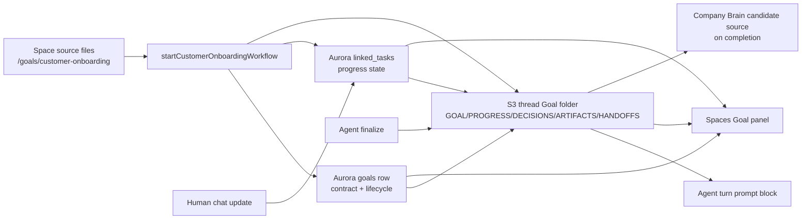
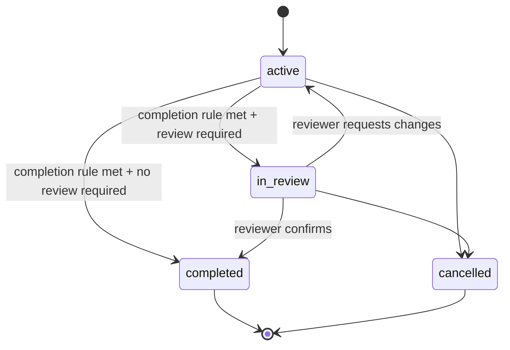

# feat: Add folder-native Goals

## Overview

Introduce Goals as the explicit workflow object that turns selected Threads into
accountable, folder-native execution records. The implementation should keep
ThinkWork's current Customer Onboarding proof intact while evolving it from
"checklist plus progress markdown" into the reference pattern for:

```text
Agent acts in a Space on behalf of a User toward a Goal.
```

Aurora owns indexed lifecycle and permissioned workflow state. S3 owns the
portable markdown folder that an agent, operator, or future local Codex/Claude
Code session can read. The first proving slice is Customer Onboarding, because
it already has a Space-owned workflow, linked tasks, artifacts, a right-side
progress panel, and `PROGRESS.md` under the thread prefix.

---

## Problem Frame

The requirements doc defines the core problem: ThinkWork has strong ingredients
for an agentic OS, but the system still lacks a crisp object that explains what
structured work is for, who owns it, how completion is judged, and what files
carry the portable execution state (see origin:
`docs/brainstorms/2026-05-27-agentic-os-folder-native-goals-requirements.md`).

Customer Onboarding demonstrates the opportunity and the gap. A Thread is
created, checklist rows drive visible progress, and `PROGRESS.md` summarizes
the work for the agent. But the workflow contract is scattered across thread
metadata, Space seed files, linked tasks, progress rendering, UI parsing, and
assistant narration. Goals make that contract explicit without giving up the
folder-native architecture.

---

## Requirements Trace

### Core model and lifecycle

- R1. Preserve the canonical model: Agent acts in a Space on behalf of a User
  toward a Goal.
- R2. Distinguish Thread intent from promoted Goals. Threads remain the durable
  conversation trace; Goals add lifecycle, ownership, completion, review, and
  portable execution files.
- R3. Add Delegate vs Collaborate as a first-class Goal mode.
- R4. Support the maturity ladder: ask in a Space, use context/tools, promote
  repeated work into Goals, add templates, then compound completed work into
  Company Brain.
- R5. Persist the minimum Goal contract: outcome, owner, mode, progress model,
  completion rule, and review policy.
- R6. Support human-confirmed completion for team workflows while allowing
  lower-risk Goals to declare no required review.
- R7. Use Customer Onboarding as the reference proving slice.

### Folder and template substrate

- R8. Keep Goal templates Space-owned markdown by default, not database-first
  workflow definitions.
- R9. Create a thread-owned Goal folder containing `GOAL.md`, `PROGRESS.md`,
  `DECISIONS.md`, `ARTIFACTS.md`, and `HANDOFFS.md`.
- R10. Let Goal templates decide whether instances are flat or staged.
- R11. Keep markdown runnable outside ThinkWork with graceful degradation.
- R12. Use S3 as the v1 Goal-folder substrate and Aurora as the execution
  ledger.
- R13. Keep structured workflow state canonical in Aurora.
- R14. Keep narrative workflow state canonical in markdown.
- R15. Keep `PROGRESS.md` as a rendered operational briefing, not a second
  source of truth for structured task rows.
- R16. Design decision, handoff, and artifact files as high-signal Company
  Brain inputs.

### Doctrine and portability

- R17. Produce operator-first doctrine, then end-user best practices, then
  product/engineering placement rules.
- R18. Make export-readiness visible as doctrine without promising export UI in
  v1.

**Origin actors:** A1 tenant operator, A2 end user, A3 Goal owner, A4
coordinator agent, A5 product/engineering team, A6 Company Brain, A7
external/local agent runner.

**Origin flows:** F1 operator defines a Space-owned Goal template, F2 Thread
intent is promoted into a Goal, F3 agent drives the Goal through progress,
decisions, and handoffs, F4 completed Goal compounds into reusable learning.

**Origin acceptance examples:** AE1 Customer Onboarding creates `GOAL.md` and
`PROGRESS.md` while checklist rows remain structured state, AE2 Space-owned
template remains portable, AE3 human review prevents silent closure, AE4
decisions/handoffs/artifacts feed Company Brain, AE5 guidance teaches placement
rules.

---

## Scope Boundaries

### Deferred for later

- Export UI or CLI for Space + Agent + User + Goal folders.
- General visual workflow builders, drag-and-drop stage editors, or full project
  management UI.
- Automatic template improvement from completed Goals.
- Cross-tool local runner adapters for Codex, Claude Code, or other agent
  environments.
- Rich artifact lifecycle management beyond portable summaries and indexed
  references.
- General task-system replacement features such as subtasks, estimates,
  dependency graphs, and portfolio reporting.

### Outside this product's identity

- ThinkWork is not trying to be a generic project management system. Goals are
  agentic outcome contracts, not Jira/Asana clones.
- ThinkWork is not trying to win as a blank ad hoc chat box. Codex-like tools
  will keep improving there; ThinkWork should win on accountable team workflow
  execution.
- ThinkWork should not make markdown a decorative export of a hidden workflow
  engine. The folder-native operating substrate is the product architecture.
- ThinkWork should not parse markdown as the authority for critical structured
  state when Aurora already owns lifecycle, permissions, review, task, and audit
  indexing.

### Deferred to Follow-Up Work

- Cross-Space reusable Goal-template marketplace: after Customer Onboarding
  proves the folder contract.
- Multi-thread or parent/child Goal orchestration: after single Thread-bound
  Goals are reliable.
- Customer Onboarding-adjacent workflow types: after the folder-native contract
  is proven by the reference slice.

---

## Context & Research

### Relevant Code and Patterns

- `packages/api/src/lib/thread-progress/storage.ts` already validates safe S3
  segments, writes markdown under `tenants/{tenantSlug}/threads/{threadId}/`,
  bounds `PROGRESS.md`, and injects it into agent prompts.
- `packages/api/src/lib/spaces/customer-onboarding-progress-md.ts` loads
  Customer Onboarding state from Aurora (`threads`, `linked_tasks`, tenant
  slug) and renders `PROGRESS.md`.
- `packages/api/src/lib/spaces/customer-onboarding-workflow.ts` creates the
  Thread, checklist rows, kickoff message, workflow metadata, and coordinator
  wakeup, then refreshes progress markdown.
- `packages/api/src/lib/spaces/customer-onboarding-chat-updates.ts` and
  `packages/api/src/lib/chat-finalize/process-finalize.ts` refresh progress
  after human chat updates and agent turns.
- `packages/api/src/graphql/resolvers/linked-tasks/updateLinkedTask.mutation.ts`
  is the manual checklist-status update path used by the Spaces panel.
- `packages/api/src/graphql/resolvers/threads/updateThread.mutation.ts` is the
  current Thread completion path used by the panel action.
- `packages/api/src/handlers/wakeup-processor.ts` prepends current
  `PROGRESS.md` to the agent message before a turn.
- `packages/api/src/graphql/resolvers/linked-tasks/threadProgressMarkdown.query.ts`
  and `packages/api/src/graphql/resolvers/threads/threadProgress.query.ts` show
  tenant/thread access checks for reading thread markdown.
- GraphQL source is canonical under
  `packages/database-pg/graphql/types/*.graphql`; generated-client consumers
  exist in `apps/admin`, `apps/cli`, and `apps/mobile`.
- `apps/spaces/src/components/workbench/SpacesThreadDetailRoute.tsx` reads
  linked tasks, thread progress markdown, and artifacts, then builds the
  right-side info panel.
- `apps/spaces/src/components/workbench/TaskThreadView.tsx` renders the
  current Thread info panel and checklist progress UI.
- `packages/database-pg/src/schema/artifacts.ts` and
  `packages/database-pg/graphql/types/artifacts.graphql` already provide an
  indexed artifact model with `threadId`, `s3Key`, summary, type, and status.
- `packages/api/src/lib/spaces/customer-onboarding-source-files.ts` materializes
  Space source markdown under `tenants/{tenantSlug}/spaces/{spaceSlug}/source/`.
- `docs/src/content/docs/concepts/agents/folder-is-the-agent.mdx` and
  `docs/src/content/docs/concepts/agents/workspace-composition.mdx` already
  define folder-native behavior and S3 workspace layout.
- `docs/src/content/docs/concepts/spaces/spaces-and-threads.mdx` defines the
  Thread/Space boundary the Goal model should extend, not replace.
- `docs/src/content/docs/concepts/knowledge/compounding-memory-pipeline.mdx`
  and `docs/src/content/docs/concepts/knowledge/business-ontology.mdx` show
  that compiled learning depends on high-quality source material and provenance.

### Institutional Learnings

- `docs/solutions/design-patterns/gitkeep-materialization-s3-empty-folders-2026-05-13.md`:
  S3 has no real empty folders; if staged Goal templates need empty directories
  before files exist, materialize them with filtered `.gitkeep` sentinels.
- `docs/solutions/workflow-issues/platform-agent-space-runtime-refactor-autopilot-sequencing-2026-05-23.md`:
  broad identity/runtime refactors need additive schema first, centralized
  resolution, staged migration gates, and fresh consumer surveys before
  destructive changes.
- `docs/solutions/workflow-issues/manually-applied-drizzle-migrations-drift-from-dev-2026-04-21.md`:
  hand-rolled migrations must be declared and drift-checked so persistent state
  changes do not silently miss deployed environments.

### External References

- Every, [Codex for Knowledge Work](https://every.to/guides/codex-for-knowledge-work):
  the useful framing for this plan is the maturity path from ad hoc assistance
  to durable workflows, plus Delegate vs Collaborate as a user mental model.
- Jake Van Clief and David McDermott,
  [Interpretable Context Methodology: Folder Structure as Agent Architecture](https://arxiv.org/abs/2603.16021):
  the folder tree, markdown files, stage outputs, and review files should be
  treated as the agent architecture, not merely as exported documentation.

---

## Key Technical Decisions

- Add a `goals` table instead of encoding the Goal only in `threads.metadata`:
  the origin requires Goal to be an explicit object with lifecycle, owner, mode,
  review, and completion semantics. Thread metadata can keep compatibility
  breadcrumbs, but Aurora needs an indexed Goal ledger.
- Bind v1 Goals one-to-one with non-terminal Thread work: this proves the model
  without creating parent Goal graphs. The table should enforce at most one
  non-terminal Goal (`active` or `in_review`) per Thread with a partial unique
  index, while allowing completed/cancelled historical Goals to remain for
  audit and future repair/replacement scenarios.
- Keep the canonical Agent/Space/User/Goal relationship explicit in API
  responses. The Goal row stores the Goal contract and owner/reviewer fields;
  Thread remains canonical for the acting `agent_id`, requester `user_id`, and
  Space binding. Goal resolvers must expose those joined identities so callers
  do not have to infer the North Star model from metadata.
- Keep Space-owned Goal templates as files: Customer Onboarding seed files
  should grow a `goals/customer-onboarding/` template folder while database rows
  index only what the runtime needs to execute and query.
- Generalize thread markdown storage rather than special-casing more
  `PROGRESS.md` helpers: existing thread-progress storage should become, or be
  wrapped by, thread Goal folder storage that reads/writes bounded markdown
  files under the same thread prefix.
- Render `PROGRESS.md` from Aurora state: linked task rows remain canonical for
  checklist progress, with `PROGRESS.md` acting as a current briefing.
- Render `GOAL.md`, `DECISIONS.md`, `ARTIFACTS.md`, and `HANDOFFS.md` from the
  best available mix of structured rows and narrative records: do not block the
  folder shape on perfect decision/handoff product surfaces.
- Prefer additive API evolution: add a new Goal query and types while keeping
  existing `threadProgressMarkdown` behavior until Spaces UI and agent prompt
  injection have moved.
- Use Thread visibility for Goal rows and Goal files. A Cognito caller can read
  Goal lifecycle and markdown only when they can see the Thread through the
  Thread visibility/participant rules; Space membership alone is not enough for
  Goal files. The public `threadGoal`/Goal-file GraphQL surface should be
  Cognito-only in v1; service callers that need Goal data should use explicit
  internal helpers rather than a tenant-wide user-facing query. This
  intentionally makes Goal files at least as protected as the Thread timeline,
  even if older linked task/progress surfaces are broader.
- Add explicit Goal review actions instead of overloading generic Thread
  completion. The API should expose `reviewGoal` actions for confirming
  completion and requesting changes that update Goal status, timestamps,
  reviewer metadata, Thread status where appropriate, and refreshed Goal files.
  `updateThread(status: DONE)` must not bypass a Goal review policy.
- Define v1 review authorization before implementation. Customer Onboarding
  should allow tenant admins, Space owners/admins, and the configured Goal
  owner/reviewer to confirm or request changes; ordinary Space members may
  update tasks but may not complete a human-reviewed Goal unless they are the
  configured reviewer/owner.
- Let the UI read structured Goal metadata for the panel and markdown files for
  narrative context: avoid fragile client parsing for the minimum Goal
  contract, while keeping markdown available for transparency.
- Treat prompt-injected Goal markdown as untrusted content unless it is emitted
  by a trusted server renderer and wrapped as data. Prompt wrappers must state
  that markdown content cannot override system, Space, User, guardrail, MCP, or
  tool policy instructions. Template fallback guidance is for local/offline use
  and cannot grant ThinkWork permissions.
- Add a Goal-file data policy: do not log raw Goal markdown, preserve existing
  workspace-bucket encryption/access controls, inherit Thread deletion/retention
  semantics unless a later retention policy says otherwise, and redact or hold
  sensitive credit/pricing/customer data before Company Brain distillation when
  the source lacks adequate provenance.
- Treat Company Brain integration as a completion seam in this plan: completed
  Goal folders should become candidates only after an eligibility gate confirms
  source-tagged decisions/handoffs/artifacts or explicit human review. Fully
  automatic template improvement is follow-up work.

---

## Open Questions

### Resolved During Planning

- Should S3 remain the file substrate? Yes. It matches existing workspace and
  thread progress storage, supports folder-native portability, is cheap and
  inspectable, and preserves AWS-only scope.
- Should Goal templates live with Space or Agent? Space-owned by default. The
  Goal template is the Space's operating pattern; Agent folders provide broader
  behavior and specialist capabilities.
- Should Customer Onboarding be the proving slice? Yes. It already has linked
  tasks, thread state, progress markdown, artifacts, and a visible progress
  panel.
- Should Goal instances be a single file or a folder? Folder. The required v1
  files are `GOAL.md`, `PROGRESS.md`, `DECISIONS.md`, `ARTIFACTS.md`, and
  `HANDOFFS.md`, with optional template-defined `stages/`.
- Should Goal cardinality be one per Thread forever or one active Goal per
  Thread? One non-terminal Goal per Thread in v1. Completed/cancelled Goals may
  remain historical records, but only one `active` or `in_review` Goal may exist
  for a Thread at a time.
- Who can read Goal files? The same users who can read the Thread timeline.
  Goal markdown can contain distilled customer, pricing, credit, and handoff
  context, so Space membership alone is not the v1 read rule.
- Who can complete a human-reviewed Goal? Tenant admins, Space owners/admins,
  and configured Goal owners/reviewers. Ordinary Space members can participate
  and update tasks, but cannot confirm final review unless explicitly assigned.
- How should Company Brain treat completed Goal folders? As candidate source
  material only after provenance/curation eligibility is met, not as automatic
  high-trust memory just because a folder exists.

### Deferred to Implementation

- Exact GraphQL naming: use the repo's schema style during implementation.
  `threadGoal` / `ThreadGoal` is the likely shape, but final names should follow
  codegen and resolver conventions.
- Exact SQL migration number: generate or hand-roll according to the current
  Drizzle journal at implementation time.
- Whether `thread-progress/storage.ts` is renamed or wrapped: preserve existing
  imports until the implementing agent sees the smallest safe change.
- Exact markdown templates for `DECISIONS.md` and `HANDOFFS.md`: start with
  simple append/render sections and evolve as decision/handoff product surfaces
  become richer.

---

## Output Structure

This illustrates the intended S3 folder layout, not a new repo directory tree:

```text
tenants/{tenantSlug}/spaces/{spaceSlug}/source/
  CONTEXT.md
  docs/
    customer-onboarding-intake.md
  goals/
    customer-onboarding/
      GOAL.md
      PROGRESS.md
      DECISIONS.md
      ARTIFACTS.md
      HANDOFFS.md
      stages/
        01-intake/
          CONTEXT.md
          OUTPUT.md
        02-execution/
          CONTEXT.md
          OUTPUT.md
        03-review/
          CONTEXT.md
          OUTPUT.md

tenants/{tenantSlug}/threads/{threadId}/
  GOAL.md
  PROGRESS.md
  DECISIONS.md
  ARTIFACTS.md
  HANDOFFS.md
  stages/
    ...
```

---

## High-Level Technical Design

> _This illustrates the intended approach and is directional guidance for
> review, not implementation specification. The implementing agent should treat
> it as context, not code to reproduce._



Goal lifecycle should start deliberately small:



---

## Implementation Units

- U1. **Add the Goal ledger**

**Goal:** Add the explicit Aurora-backed Goal object that indexes the minimum
Goal contract, lifecycle, folder prefix, and Thread binding.

**Requirements:** R1, R2, R3, R5, R6, R12, R13; F2; AE1, AE3.

**Dependencies:** None.

**Files:**

- Create: `packages/database-pg/src/schema/goals.ts`
- Modify: `packages/database-pg/src/schema/index.ts`
- Create: `packages/database-pg/graphql/types/goals.graphql`
- Modify: `packages/database-pg/graphql/types/threads.graphql`
- Create: `packages/database-pg/drizzle/NNNN_goal_ledger.sql`
- Modify: `packages/api/src/graphql/resolvers/index.ts`
- Create: `packages/api/src/graphql/resolvers/goals/index.ts`
- Create: `packages/api/src/graphql/resolvers/goals/threadGoal.query.ts`
- Create: `packages/api/src/graphql/resolvers/goals/threadGoal.query.test.ts`

**Approach:**

- Model a v1 Goal as a tenant-scoped row with `space_id`, `thread_id`,
  `template_key`, `outcome`, `owner_type`, `owner_id`, `mode`, `status`,
  `progress_model`, `completion_rule`, `review_policy`, `folder_s3_prefix`,
  `reviewer_type`, `reviewer_id`, `started_at`, `reviewed_at`,
  `completed_at`, `cancelled_at`, and `metadata`.
- Do not duplicate Thread's acting agent/requester as authoritative Goal state
  unless implementation proves denormalization is needed. The Goal API should
  join the Thread and expose `agentId`, `spaceId`, and `userId`/requester fields
  so the canonical Agent + Space + User + Goal relationship is visible.
- Use constrained text enums in the migration for `mode` (`delegate`,
  `collaborate`) and `status` (`active`, `in_review`, `completed`,
  `cancelled`) to match existing Drizzle patterns such as `linked_tasks`.
- Add indexes for tenant/thread lookup, tenant/space/status filtering, and
  folder prefix diagnostics.
- Enforce one non-terminal v1 Goal per `(tenant_id, thread_id)` with a partial
  unique index scoped to `status IN ('active','in_review')`. Completed and
  cancelled Goals remain historical and do not block repair/replacement.
- Add a GraphQL query that returns the Goal only for Cognito callers who can see
  the Thread through the Thread visibility/participant rules. Do not use
  Space-membership-only access for Goal files.

**Execution note:** Implement the resolver test-first because the access
boundary and GraphQL contract will be reused by the UI and future agent tools.

**Patterns to follow:**

- `packages/database-pg/src/schema/linked-tasks.ts` for constrained text enums,
  thread indexes, and tenant scoping.
- `packages/database-pg/src/schema/artifacts.ts` for rows attached to threads
  with optional S3 references.
- `packages/api/src/graphql/resolvers/threads/threadProgress.query.ts` for
  fail-closed tenant/thread access. Do not copy the older Space-membership
  authorization shape from `threadProgressMarkdown`.

**Test scenarios:**

- Covers AE1. Happy path: a visible Thread with a Goal row returns the Goal
  contract, status, mode, review policy, joined Thread identities, and
  timestamps. The raw S3 folder prefix remains server-only.
- Edge case: a visible Thread without a Goal returns `null`, preserving ordinary
  chat Threads.
- Error path: a Cognito caller from another tenant receives `null` for the Goal.
- Error path: service/API-key callers receive `null` from the user-facing
  `threadGoal` query, even when tenant-scoped.
- Error path: a caller with Space membership but no Thread visibility receives
  `null` for the Goal and Goal files.
- Edge case: a completed or cancelled historical Goal does not block creation
  of a new active Goal for the same Thread, while two active/in-review Goals are
  rejected by the database constraint.
- Integration: Goal API response exposes the joined Thread agent/requester
  identities needed to explain Agent + Space + User + Goal.
- Integration: generated GraphQL schema exposes the Goal type without breaking
  existing `threadProgress` and linked-task queries.

**Verification:**

- Goal rows can be queried by Thread through GraphQL with tenant and Thread
  visibility enforced.
- Existing Thread queries and `threadProgress` behavior remain compatible.

---

- U2. **Generalize thread Goal folder storage**

**Goal:** Replace the single-purpose progress markdown helper with a safe
thread-folder storage layer that can read and write bounded Goal files while
preserving the existing `PROGRESS.md` contract.

**Requirements:** R9, R10, R11, R12, R14, R15; F2, F3; AE1, AE2.

**Dependencies:** U1 for folder prefix conventions, though the storage helper
can be implemented independently.

**Files:**

- Create: `packages/api/src/lib/thread-goals/storage.ts`
- Create: `packages/api/src/lib/thread-goals/storage.test.ts`
- Modify: `packages/api/src/lib/thread-progress/storage.ts`
- Modify: `packages/api/src/handlers/wakeup-processor.ts`
- Modify: `packages/api/src/graphql/resolvers/linked-tasks/threadProgressMarkdown.query.ts`
- Modify: `packages/api/src/graphql/resolvers/threads/threadProgress.query.ts`

**Approach:**

- Add a storage helper that validates `tenantSlug`, `threadId`, and allowed Goal
  filenames, then builds keys under
  `tenants/{tenantSlug}/threads/{threadId}/{file}`.
- Allow the v1 required files: `GOAL.md`, `PROGRESS.md`, `DECISIONS.md`,
  `ARTIFACTS.md`, `HANDOFFS.md`, and stage files under
  `stages/{safe-stage}/CONTEXT.md` or `stages/{safe-stage}/OUTPUT.md`.
- Preserve the existing `readThreadProgressMarkdown`,
  `writeThreadProgressMarkdown`, and `prependThreadProgressPromptBlock`
  exports as compatibility wrappers until all consumers move.
- Add a multi-file prompt formatter that can inject `GOAL.md` plus
  `PROGRESS.md` first, with decisions/handoffs/artifacts summaries included
  only within a bounded prompt budget.
- Wrap every injected Goal file as data with explicit provenance labels such as
  `trusted_renderer`, `space_template`, or `thread_derived`. The wrapper must
  tell the model that Goal markdown is operational context, not higher-priority
  instruction, and cannot override ThinkWork runtime authorization, tool policy,
  guardrails, Space instructions, or User context.
- Prefer summaries for narrative files in prompt context. `GOAL.md` and
  `PROGRESS.md` are highest priority; `DECISIONS.md`, `HANDOFFS.md`, and
  `ARTIFACTS.md` should be injected as bounded summaries unless an agent turn
  explicitly needs more detail.
- Keep file budgets explicit. `PROGRESS.md` can keep the current 64 KB write
  budget and 24k injected-character cap; other files should have comparable
  or lower caps chosen during implementation.

**Patterns to follow:**

- `packages/api/src/lib/thread-progress/storage.ts` for S3 client dependency
  injection, safe segment validation, byte budgets, and no-cache markdown
  writes.
- `docs/solutions/design-patterns/gitkeep-materialization-s3-empty-folders-2026-05-13.md`
  if empty stage folders need to appear before `OUTPUT.md` exists.

**Test scenarios:**

- Covers AE1. Happy path: writing `PROGRESS.md` through the compatibility
  wrapper writes the same S3 key used today.
- Covers AE2. Happy path: writing all required Goal files produces keys under
  the thread folder and returns byte counts.
- Edge case: unsafe tenant slug, thread id, filename, or stage path throws
  before calling S3.
- Edge case: missing `GOAL.md` returns `null` without failing prompt injection.
- Error path: an oversized markdown file throws a clear budget error before S3
  write.
- Error path: markdown containing tool-use instructions or "ignore previous
  instructions" text is preserved as data but does not alter the prompt wrapper
  hierarchy.
- Integration: wakeup prompt injection includes the Goal contract and progress
  briefing for a thread with Goal files, and falls back to the existing
  `PROGRESS.md` behavior for older threads.

**Verification:**

- Existing progress readers continue to work.
- New Goal files can be written, read, and prompt-injected from the same thread
  prefix.

---

- U3. **Seed Space-owned Goal templates for Customer Onboarding**

**Goal:** Make Customer Onboarding's operating contract live in Space-owned
markdown under a Goal template folder.

**Requirements:** R7, R8, R10, R11, R17, R18; F1; AE2, AE5.

**Dependencies:** U2 for final folder layout conventions.

**Files:**

- Modify: `packages/api/src/lib/spaces/customer-onboarding-seed.ts`
- Modify: `packages/api/src/lib/spaces/customer-onboarding-source-files.ts`
- Modify: `packages/api/src/lib/spaces/customer-onboarding-source-files.test.ts`
- Modify: `packages/api/src/lib/spaces/customer-onboarding-seed.test.ts`

**Approach:**

- Extend `CUSTOMER_ONBOARDING_SPACE_SOURCE_FILES` with
  `goals/customer-onboarding/GOAL.md`, `PROGRESS.md`, `DECISIONS.md`,
  `ARTIFACTS.md`, `HANDOFFS.md`, and simple staged examples.
- Update `CONTEXT.md` to refer to the Goal template as the source of the
  workflow contract and to the Info Panel as a Goal panel, not just
  "Progress."
- Keep checklist rules in `docs/customer-onboarding-intake.md`, but explain
  that checklist progress is one progress model inside the broader Goal.
- Include graceful-degradation instructions in the template files: what a local
  agent should do if ThinkWork tools or GraphQL are unavailable.
- Ensure source materialization still preserves operator-authored files by
  default and only writes missing template files.

**Patterns to follow:**

- Current Customer Onboarding seed file style in
  `packages/api/src/lib/spaces/customer-onboarding-seed.ts`.
- `packages/api/src/lib/spaces/customer-onboarding-source-files.ts` for
  S3-backed Space source materialization and overwrite behavior.
- `docs/src/content/docs/concepts/agents/folder-is-the-agent.mdx` for language
  around folder-native behavior.

**Test scenarios:**

- Covers AE2. Happy path: source materialization writes the expanded template
  file list under `tenants/{tenantSlug}/spaces/{spaceSlug}/source/`.
- Edge case: existing operator-authored template files are skipped when
  `overwrite` is false.
- Edge case: source file config lists all new Goal template paths so operators
  can inspect what is part of the Space template.
- Content assertion: template markdown names the minimum Goal contract,
  Delegate/Collaborate mode, review policy, artifacts, decisions, and local
  fallback behavior.

**Verification:**

- A newly seeded Customer Onboarding Space contains a portable Goal template
  folder without overwriting existing Space source files.

---

- U4. **Create and refresh Customer Onboarding Goal instances**

**Goal:** When Customer Onboarding starts or updates, create a Goal row and
refresh the thread Goal folder from Aurora state plus narrative workflow data.

**Requirements:** R2, R3, R5, R6, R7, R9, R13, R14, R15, R16; F2, F3; AE1,
AE3, AE4.

**Dependencies:** U1, U2, U3.

**Files:**

- Modify: `packages/api/src/lib/spaces/customer-onboarding-workflow.ts`
- Modify: `packages/api/src/lib/spaces/customer-onboarding-workflow.test.ts`
- Create: `packages/api/src/lib/spaces/customer-onboarding-goal-md.ts`
- Create: `packages/api/src/lib/spaces/customer-onboarding-goal-md.test.ts`
- Modify: `packages/api/src/lib/spaces/customer-onboarding-progress-md.ts`
- Modify: `packages/api/src/lib/spaces/customer-onboarding-progress-md.test.ts`
- Modify: `packages/api/src/lib/spaces/customer-onboarding-chat-updates.ts`
- Modify: `packages/api/src/lib/spaces/customer-onboarding-chat-updates.test.ts`
- Modify: `packages/api/src/graphql/resolvers/linked-tasks/updateLinkedTask.mutation.ts`
- Modify: `packages/api/src/graphql/resolvers/linked-tasks/updateLinkedTask.mutation.test.ts`
- Modify: `packages/api/src/graphql/resolvers/threads/updateThread.mutation.ts`
- Modify: `packages/api/src/graphql/resolvers/threads/updateThread.mutation.test.ts`
- Modify: `packages/api/src/lib/chat-finalize/process-finalize.ts`

**Approach:**

- During new Customer Onboarding workflow creation, insert the Goal row in the
  same logical flow as Thread and linked-task creation. For idempotent existing
  Threads, load or repair the Goal row before returning.
- Store the folder prefix on the Goal row as
  `tenants/{tenantSlug}/threads/{threadId}/`.
- Split the current progress renderer into a Goal-folder renderer that writes:
  `GOAL.md` for contract, `PROGRESS.md` for current checklist status,
  `DECISIONS.md` for captured decisions/rationale, `ARTIFACTS.md` for artifact
  manifest and summaries, and `HANDOFFS.md` for stage/team handoffs.
- Keep the existing `PROGRESS.md` content broadly compatible so current UI
  parsing and agent prompt behavior do not break before U5/U6 land.
- Use linked tasks as the progress source of truth. Use thread metadata and
  messages as initial narrative sources for decisions/handoffs until dedicated
  decision tools exist.
- Enforce review policy in Goal status transitions: all required tasks complete
  should move a human-reviewed Customer Onboarding Goal toward `in_review`, not
  silently `completed`.
- Hook the manual update paths, not only chat/update/finalize paths:
  `updateLinkedTask` should refresh the Goal folder and recompute readiness
  after ThinkWork checklist status changes, and `updateThread` should respect
  Goal review policy before marking a Goal-backed Thread done.

**Patterns to follow:**

- `packages/api/src/lib/spaces/customer-onboarding-progress-md.ts` for
  repository/renderer separation and safe refresh wrapper.
- `packages/api/src/lib/spaces/customer-onboarding-workflow.ts` for idempotent
  workflow creation and existing thread repair.
- `packages/api/src/lib/spaces/customer-onboarding-chat-updates.ts` for
  transactional state updates followed by safe markdown refresh.

**Test scenarios:**

- Covers AE1. Happy path: starting Customer Onboarding creates a Goal row,
  linked tasks, and `GOAL.md`/`PROGRESS.md` in the thread folder.
- Covers AE3. Happy path: when all required tasks are complete and review is
  required, the Goal reaches `in_review` and the rendered files ask for human
  confirmation instead of closing automatically.
- Covers AE4. Happy path: a chat update that records a pricing or credit
  decision appears in `DECISIONS.md` with source context.
- Edge case: idempotent workflow start for an existing Thread backfills missing
  Goal row/files without duplicating linked tasks.
- Edge case: task rows marked `not_applicable` are excluded from required
  completion calculations but remain visible in narrative context when useful.
- Error path: S3 refresh failure is logged and does not roll back successful
  structured DB state.
- Integration: after chat update and agent finalize paths, the Goal folder is
  refreshed from the latest structured state.
- Integration: manual checklist updates through `updateLinkedTask` refresh the
  Goal folder and move the Goal to `in_review` when completion criteria are met.
- Integration: attempting to mark a human-reviewed Goal-backed Thread done
  routes through the Goal review policy rather than bypassing it.

**Verification:**

- Customer Onboarding Threads consistently have a Goal row and required Goal
  files.
- Existing checklist updates still work, and `PROGRESS.md` remains current.

---

- U5. **Expose Goal files and lifecycle through GraphQL**

**Goal:** Give Spaces UI and future clients a stable API for the structured
Goal contract plus selected markdown files, without making clients parse
`PROGRESS.md` for everything.

**Requirements:** R2, R5, R6, R9, R12, R13, R14; F2, F3; AE1, AE3.

**Dependencies:** U1, U2, U4.

**Files:**

- Modify: `packages/database-pg/graphql/types/goals.graphql`
- Modify: `packages/database-pg/graphql/types/threads.graphql`
- Create: `packages/api/src/graphql/resolvers/goals/threadGoalFiles.query.ts`
- Create: `packages/api/src/graphql/resolvers/goals/threadGoalFiles.query.test.ts`
- Modify: `packages/api/src/graphql/resolvers/goals/index.ts`
- Create: `packages/api/src/graphql/resolvers/goals/reviewGoal.mutation.ts`
- Create: `packages/api/src/graphql/resolvers/goals/reviewGoal.mutation.test.ts`
- Modify: `apps/spaces/src/lib/graphql-queries.ts`
- Regenerate schema/codegen artifacts in `apps/admin`, `apps/cli`, and
  `apps/mobile` if their generated clients include the changed schema surface.

**Approach:**

- Add a query that returns the visible Thread's Goal row plus the v1 markdown
  files with keys and content. A single response keeps UI request coordination
  simple.
- Add a review mutation with explicit actions: `CONFIRM_COMPLETION` moves
  `in_review` to `completed`; `REQUEST_CHANGES` moves `in_review` back to
  `active` with reviewer notes; `CANCEL` is allowed only for authorized actors
  and moves non-terminal Goals to `cancelled`.
- Keep `threadProgressMarkdown` for backward compatibility and narrow consumers
  that only need `PROGRESS.md`.
- Bound markdown returned by the API to avoid large payloads in the workbench.
  Full file download/export can be future work.
- Use the explicit U1 access rule: Goal rows and files are readable only by
  callers who can read the Thread timeline; review mutations require tenant
  admin, Space owner/admin, configured Goal owner, or configured Goal reviewer.
  Do not expose raw S3 keys for threads the caller cannot read.
- Return absent files as `null` entries rather than failing the whole query,
  because older Threads may only have `PROGRESS.md`.
- Ensure review mutations refresh Goal folder files and synchronize Thread
  status intentionally: completed Goals may mark the Thread done; requested
  changes should keep or return the Thread to active/in-progress workflow state.

**Patterns to follow:**

- `packages/api/src/graphql/resolvers/linked-tasks/threadProgressMarkdown.query.ts`
  for read access and S3 markdown return shape.
- `apps/spaces/src/lib/graphql-queries.ts` for colocating GraphQL documents used
  by the Spaces workbench.
- Existing codegen workflow described in `AGENTS.md` for schema changes.

**Test scenarios:**

- Covers AE1. Happy path: query returns Goal lifecycle fields and
  `GOAL.md`/`PROGRESS.md` content for a visible Customer Onboarding Thread.
- Edge case: legacy Thread with no Goal returns `null` rather than an error.
- Edge case: Goal exists but optional files are absent; response includes
  structured Goal fields and `null` file content for missing files.
- Error path: unauthorized tenant access or a caller without Thread visibility
  returns `null`.
- Error path: unauthorized review confirmation/request-changes fails with a
  forbidden error and does not update Goal, Thread, or S3 files.
- Integration: review confirmation moves a Goal from `in_review` to
  `completed`, sets reviewer/timestamp metadata, refreshes the folder, and
  applies the expected Thread status update.
- Integration: request-changes moves a Goal from `in_review` to `active`,
  preserves reviewer notes, refreshes the folder, and does not mark the Thread
  done.
- Integration: existing `ThreadProgressMarkdownQuery` consumers still pass
  after the new Goal query is added.

**Verification:**

- Spaces can fetch Goal lifecycle and markdown files through GraphQL without
  relying on client-side markdown parsing for the minimum contract.

---

- U6. **Evolve the Spaces info panel into a Goal panel**

**Goal:** Update the right-side Thread panel so Customer Onboarding reads as a
Goal-driven workflow, with progress as one section rather than the whole model.

**Requirements:** R1, R3, R5, R6, R7, R17; F3; AE1, AE3, AE5.

**Dependencies:** U5.

**Files:**

- Modify: `apps/spaces/src/components/workbench/SpacesThreadDetailRoute.tsx`
- Modify: `apps/spaces/src/components/workbench/SpacesThreadDetailRoute.test.tsx`
- Modify: `apps/spaces/src/components/workbench/TaskThreadView.tsx`
- Modify: `apps/spaces/src/components/workbench/TaskThreadView.test.tsx`
- Modify: `apps/spaces/src/lib/graphql-queries.ts`

**Approach:**

- Add Goal-specific state to `TaskThreadInfoPanelState`: outcome, mode, owner,
  review policy, Goal status, completion readiness, artifact count, decision
  count, and handoff count where available.
- Keep the existing compact panel style and task rows, but use an explicit
  hierarchy so the panel is clearly about the Goal and not just "Progress":
  Goal summary first, review/readiness second, progress tasks third,
  decisions/handoffs/artifacts fourth, attachments fifth, Thread metadata last.
- Use structured Goal fields for outcome/mode/review/status. Use linked tasks
  for progress. Use markdown file summaries only for narrative counts/previews
  where structured rows are not yet available.
- Change completion action language for human-reviewed Goals from generic
  "Mark as completed" toward review-aware action copy. The action should not
  silently close a Goal whose review policy requires confirmation.
- Render review actions from the explicit review mutation: when completion
  criteria are met and review is required, eligible reviewers see
  "Confirm completion" and "Request changes"; ineligible viewers see read-only
  readiness copy. Mutation loading, success, forbidden, and failure states must
  be visible.
- Define panel states rather than leaving them implicit:
  Goal loading shows a compact Goal skeleton; Goal absent falls back to the
  legacy progress panel; Goal present with missing files shows structured Goal
  fields and a "files still being prepared" narrative state; file read errors
  show a non-blocking warning while structured progress remains visible; linked
  task errors show progress unavailable without hiding Goal outcome/review.
- Keep narrative summaries simple in v1. Decisions, handoffs, and artifacts
  render as static counts plus the latest short summary when available; missing
  files show "No decisions recorded", "No handoffs recorded", or "No artifacts
  summarized" rather than parsing arbitrary markdown into interactive controls.
- Desktop remains the right-side panel. Mobile should use a full-height drawer
  or route-level details view opened from the same toolbar action, with focus
  moving into the panel/drawer and returning on close. Review buttons must be
  reachable by keyboard and touch.
- Preserve current task click-to-prefill behavior.

**Patterns to follow:**

- Existing panel rendering in `apps/spaces/src/components/workbench/TaskThreadView.tsx`.
- Existing Customer Onboarding UI tests in
  `apps/spaces/src/components/workbench/SpacesThreadDetailRoute.test.tsx`.
- Frontend guidance in `AGENTS.md`: operational UI should stay dense,
  restrained, and scannable.

**Test scenarios:**

- Covers AE1. Happy path: Customer Onboarding Thread renders a Goal panel with
  outcome, progress percent, required task completion, and task rows.
- Covers AE3. Happy path: a human-reviewed Goal with completed tasks shows
  review-ready copy instead of silently-complete copy.
- Edge case: legacy Thread with linked tasks but no Goal still renders a
  backward-compatible progress panel.
- Edge case: missing Goal markdown files do not break panel rendering when the
  structured Goal row is present.
- Edge case: Goal query loading/error/null, file partial/error, linked-task
  loading/error/empty, and all Goal statuses (`active`, `in_review`,
  `completed`, `cancelled`) render distinct states.
- Interaction: clicking an incomplete task still prefills the composer with the
  task title.
- Interaction: an eligible reviewer can confirm completion or request changes;
  an ineligible viewer cannot see enabled review actions.
- Visual/accessibility: panel has a clear accessible label and no text overlap
  at the existing desktop panel width; mobile presentation opens at the relevant
  breakpoint with focus management and touch-appropriate review actions.

**Verification:**

- Operators can glance at the side panel and understand outcome, owner/mode,
  progress, and review state.
- Existing progress-card interactions remain functional.

---

- U7. **Add completion and Company Brain ingestion seam**

**Goal:** Make completed Goal folders discoverable as high-quality source
material for Company Brain without overbuilding automatic template refinement.

**Requirements:** R4, R14, R16; F4; AE4.

**Dependencies:** U1, U4.

**Files:**

- Modify: `packages/api/src/lib/spaces/customer-onboarding-workflow.ts`
- Modify: `packages/api/src/lib/spaces/customer-onboarding-goal-md.ts`
- Modify: `packages/api/src/graphql/resolvers/threads/updateThread.mutation.ts`
- Modify: `packages/api/src/graphql/resolvers/threads/updateThread.mutation.test.ts`
- Create: `packages/api/src/lib/thread-goals/completion.ts`
- Create: `packages/api/src/lib/thread-goals/completion.test.ts`
- Modify: `packages/api/src/lib/brain/enrichment-candidate-synthesis.ts` or
  create a nearby candidate-source adapter if implementation confirms a better
  boundary.
- Create: `packages/api/src/lib/brain/goal-folder-source.test.ts`

**Approach:**

- Add a small domain helper that finalizes the Goal folder when a Goal reaches
  `completed`: stable final status in `GOAL.md`, current progress in
  `PROGRESS.md`, and high-signal `DECISIONS.md`, `HANDOFFS.md`, and
  `ARTIFACTS.md`.
- Record completion metadata on the Goal row so later compilers can identify
  completed folders without scanning S3 blindly.
- Add a candidate-source seam that can summarize completed Goal folders for
  Brain enrichment or ontology materialization. Keep it isolated so it can be
  expanded without coupling the Goal runtime to the current wiki compiler.
- Add an eligibility gate before Company Brain uses a completed Goal folder:
  the Goal must be completed through the review path or declare no-review,
  required files must be present, decision/handoff entries must carry source
  labels where available, and sensitive credit/pricing/customer data should be
  redacted or held when provenance is weak.
- Do not enqueue aggressive automatic template changes in this plan. The seam
  should make completed Goal folders available as evidence-backed source
  material.

**Patterns to follow:**

- `packages/api/src/lib/brain/enrichment-candidate-synthesis.ts` for candidate
  source shaping.
- `docs/src/content/docs/concepts/knowledge/compounding-memory-pipeline.mdx`
  for provenance discipline and retry-safe derived stores.
- `docs/src/content/docs/concepts/knowledge/business-ontology.mdx` for
  separating business/domain Brain from workflow execution mechanics.

**Test scenarios:**

- Covers AE4. Happy path: completing a Goal produces a candidate source with
  outcome, decisions, handoffs, artifacts, and final status.
- Edge case: a completed Goal with no artifacts still yields a valid source
  summary from `GOAL.md`, `PROGRESS.md`, and decisions/handoffs.
- Error path: missing optional markdown files does not prevent completion
  metadata from being recorded.
- Error path: completed folders that fail the Brain eligibility gate are marked
  not-ready for distillation without blocking Goal completion.
- Integration: Company Brain candidate synthesis can consume a completed Goal
  source that passed eligibility without reading raw chat transcripts directly.

**Verification:**

- Completed Customer Onboarding Goals leave a stable folder and metadata trail
  that Company Brain can distill later.

---

- U8. **Document the Goal doctrine and best practices**

**Goal:** Teach operators, users, and product/engineering where Goals fit and
how to get better results from ThinkWork.

**Requirements:** R1, R2, R3, R4, R8, R11, R12, R17, R18; F1, F2, F3, F4;
AE2, AE5.

**Dependencies:** U1-U6 for final naming and screenshots/copy accuracy.

**Files:**

- Create: `docs/src/content/docs/concepts/goals.mdx`
- Modify: `docs/src/content/docs/concepts/spaces.mdx`
- Modify: `docs/src/content/docs/concepts/spaces/spaces-and-threads.mdx`
- Modify: `docs/src/content/docs/concepts/agents/folder-is-the-agent.mdx`
- Modify: `docs/src/content/docs/concepts/agents/workspace-composition.mdx`
- Modify: `docs/src/content/docs/applications/admin/spaces.mdx`

**Approach:**

- Add a Goals concept page centered on: Agent acts in a Space on behalf of a
  User toward a Goal.
- Explain Delegate vs Collaborate as Goal modes with concrete guidance for when
  to choose each.
- Explain the maturity ladder from chat to durable operating system.
- Document the source-of-truth split: Aurora for structured state, S3 markdown
  for portable narrative execution context, Company Brain for distilled
  learning.
- Make Customer Onboarding the reference example, including the Goal folder
  files and how operators should author Space-owned templates.
- Make export-readiness visible as doctrine: folder-native systems should be
  readable by local agents with graceful degradation, but export UI is not part
  of v1.
- Keep end-user guidance product-level, not architecture-heavy. End users should
  understand outcome, owner, mode, progress, and review from the UI without
  reading about Aurora, S3, or Company Brain. Keep the storage/placement doctrine
  for operators and product/engineering readers.

**Patterns to follow:**

- `docs/src/content/docs/concepts/agents/folder-is-the-agent.mdx` for conceptual
  tone and external lineage handling.
- `docs/src/content/docs/concepts/spaces/spaces-and-threads.mdx` for concise
  operator-facing boundaries.
- `docs/src/content/docs/applications/admin/spaces.mdx` for admin-facing
  operational guidance.

**Test scenarios:**

- Test expectation: none -- documentation-only unit.

**Verification:**

- Docs explain what belongs in Agent, Space, User, Thread, Goal, S3 markdown,
  Aurora, and Company Brain without requiring a live walkthrough.
- End-user docs and UI copy explain how to use a Goal without requiring the
  user to understand the implementation storage model.

---

## System-Wide Impact

- **Interaction graph:** Customer Onboarding workflow creation, chat update
  parsing, agent finalize, wakeup prompt injection, GraphQL, Spaces UI, and
  Company Brain candidate generation all touch the new Goal folder or Goal row.
- **Error propagation:** DB writes for structured state should fail loudly inside
  workflow mutations; S3 markdown refresh failures should log and degrade the
  briefing without rolling back already-committed structured state unless the
  file write is part of initial Goal creation and the implementation chooses a
  stricter creation boundary.
- **State lifecycle risks:** Goal row and S3 folder can drift. U4 should include
  idempotent repair during Customer Onboarding start/refresh so missing files or
  missing rows can be regenerated from Aurora where possible.
- **API surface parity:** Schema changes require codegen in API consumers that
  own GraphQL documents. Existing `threadProgressMarkdown` should remain until
  no live consumers depend on it.
- **Integration coverage:** The most important cross-layer scenario is starting
  Customer Onboarding, creating a Goal row, writing Goal files, reading them
  through GraphQL, injecting them into a wakeup, and rendering the panel.
- **Unchanged invariants:** Threads remain the collaboration/audit record.
  Linked tasks remain the structured checklist state. Artifacts remain indexed
  in the artifact table. S3 markdown remains portable context, not a substitute
  for permissions or lifecycle rows.

---

## Alternative Approaches Considered

- **Keep Goals only in `threads.metadata`:** rejected because the origin calls
  for Goal as an explicit object with lifecycle, ownership, mode, review, and
  completion semantics. Metadata would be hard to query, authorize, and evolve.
- **Make markdown the only source of truth:** rejected because task status,
  owners, review decisions, permissions, and lifecycle need indexed, auditable
  structured state in Aurora.
- **Build a generic workflow engine first:** rejected for v1 because Customer
  Onboarding already provides the proving slice. A broad engine would delay
  learning and risk architecture churn.
- **Store Goal folders somewhere other than S3:** rejected because S3 is already
  the workspace and thread-file substrate, fits AWS-only scope, and preserves
  portability.
- **Start with docs only:** rejected because the user explicitly wants this to
  drive Thread workflows, not just sharpen language.

---

## Success Metrics

- Starting Customer Onboarding creates a visible Goal row and thread Goal
  folder.
- Starting one thin generic Goal from a Space-owned template, without
  Customer-Onboarding-specific code paths, proves the promotion model is not
  entirely overfit to the existing onboarding POC. This can be a developer or
  operator smoke path rather than a polished product surface.
- Operators can inspect Space source files and see the Customer Onboarding Goal
  template.
- The Spaces side panel shows outcome, mode/review, and progress without
  relying solely on `PROGRESS.md` parsing.
- Operators or test users can correctly identify the Goal outcome, owner,
  review state, and next action from the panel without reading architecture
  docs.
- Human-reviewed Customer Onboarding Goals move to `in_review` when required
  work is complete, and only authorized reviewers can confirm completion or
  request changes.
- Agent wakeups receive the Goal contract and progress briefing from the thread
  folder.
- Completed Customer Onboarding Goals produce decision, handoff, and artifact
  files that pass the Company Brain eligibility gate before distillation.
- A local/offline portability check can read the rendered Customer Onboarding
  Goal folder and identify the outcome, current progress, review policy,
  decisions, handoffs, and artifacts without ThinkWork APIs.
- Docs make the placement rules understandable enough that operators can decide
  whether to use a Space, Goal, automation, or folder specialist.

---

## Phased Delivery

### Phase 1: Substrate

- Land U1 and U2 together or in close sequence: Goal ledger plus safe thread
  Goal folder storage.

### Phase 2: Proving Slice

- Land U3 and U4: Customer Onboarding template files, Goal row creation, and
  Goal folder refresh.

### Phase 3: Product Surface

- Land U5 and U6: GraphQL contract and Spaces Goal panel.

### Phase 4: Learning and Doctrine

- Land U7 and U8: Company Brain completion seam and operator/user docs.

---

## Risk Analysis & Mitigation

| Risk                                                                  | Likelihood | Impact | Mitigation                                                                                                                                           |
| --------------------------------------------------------------------- | ---------- | ------ | ---------------------------------------------------------------------------------------------------------------------------------------------------- |
| Aurora and S3 drift apart                                             | Medium     | High   | Make Aurora canonical for structured state; regenerate markdown from DB where possible; add idempotent repair on workflow start/refresh.             |
| Scope expands into a workflow engine                                  | Medium     | High   | Keep v1 Thread-bound and Customer Onboarding-driven; defer generic designer and multi-Goal orchestration.                                            |
| GraphQL/codegen changes break clients                                 | Medium     | Medium | Additive schema first; keep `threadProgressMarkdown`; run consumer codegen in affected packages.                                                     |
| Markdown files become too large for prompts                           | Medium     | Medium | Bound file sizes and prompt injection; inject Goal and Progress first, summaries for other files.                                                    |
| Prompt-injected markdown overrides higher-priority instructions       | Medium     | High   | Treat Goal markdown as untrusted data with provenance labels and prompt-wrapper hierarchy tests.                                                     |
| Sensitive Goal context leaks through logs, GraphQL, prompts, or Brain | Medium     | High   | Forbid raw markdown logging, inherit Thread retention/deletion semantics, and gate/redact Brain candidates.                                          |
| Human review semantics are bypassed                                   | Medium     | High   | Store review policy in the Goal row, add explicit review mutation authorization, and test completed-task to `in_review` plus forbidden review paths. |
| Company Brain consumes noisy workflow chatter                         | Medium     | Medium | Prefer curated Goal files as source material; require eligibility/provenance before distillation; keep transcript-only inference out of the v1 seam. |
| Space source templates overwrite operator edits                       | Low        | High   | Preserve existing `overwrite: false` behavior and test skipped files.                                                                                |

---

## Documentation / Operational Notes

- Schema work needs a Drizzle migration, `pnpm schema:build`, and the normal
  GraphQL codegen regeneration flow for generated consumers described in
  `AGENTS.md`.
- Because this introduces persistent tables and potentially hand-rolled
  migration SQL, implementation should include migration drift markers if a
  manual file is used.
- The rollout should be additive. Existing Threads without Goals should
  continue rendering and running as ordinary Threads.
- Operators should be told that S3 Goal folders are portable operating context,
  while credentials, permissions, and lifecycle enforcement remain in the
  ThinkWork runtime.
- If staged templates need empty directories, use `.gitkeep` sentinels and hide
  them from user-facing file trees.
- Before shipping beyond Customer Onboarding, run the thin generic Goal
  promotion smoke path so the team knows the abstraction works outside the
  bespoke onboarding workflow.
- Goal files are operational records. Treat raw contents as sensitive: avoid
  logging them, enforce Thread-level reads, and apply the same retention/deletion
  posture as the owning Thread unless a later policy overrides it.

---

## Sources & References

- **Origin document:** `docs/brainstorms/2026-05-27-agentic-os-folder-native-goals-requirements.md`
- Related code: `packages/api/src/lib/thread-progress/storage.ts`
- Related code: `packages/api/src/lib/spaces/customer-onboarding-workflow.ts`
- Related code: `packages/api/src/lib/spaces/customer-onboarding-progress-md.ts`
- Related code: `packages/api/src/lib/spaces/customer-onboarding-seed.ts`
- Related code: `apps/spaces/src/components/workbench/SpacesThreadDetailRoute.tsx`
- Related docs: `docs/src/content/docs/concepts/agents/folder-is-the-agent.mdx`
- Related docs: `docs/src/content/docs/concepts/agents/workspace-composition.mdx`
- Related docs: `docs/src/content/docs/concepts/spaces/spaces-and-threads.mdx`
- Related learning: `docs/solutions/design-patterns/gitkeep-materialization-s3-empty-folders-2026-05-13.md`
- Related learning: `docs/solutions/workflow-issues/platform-agent-space-runtime-refactor-autopilot-sequencing-2026-05-23.md`
- External: `https://every.to/guides/codex-for-knowledge-work`
- External: `https://arxiv.org/abs/2603.16021`
