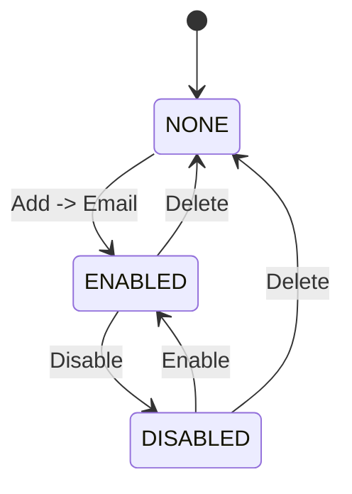

# feat: Manage Space email triggers

## Overview

Add first-class management for the synthetic Email row in Admin Space Detail -> Triggers. The row becomes a small trigger-management surface instead of a one-action disable confirmation: admins can edit the Space email prefix, disable/re-enable the trigger, delete the trigger, copy the address, and recreate it later.

The core technical change is to split the current boolean into an explicit lifecycle state: `NONE`, `DISABLED`, `ENABLED`. The Space slug remains the canonical email prefix, so changing the email address updates `spaces.slug`. Because Space source files are currently stored under `tenants/<tenant-slug>/spaces/<space-slug>/source/`, the slug update must preserve or move S3 objects before the database starts resolving the Space under the new slug.

---

## Problem Frame

The previous Spaces UI cleanup intentionally modeled email as a single synthetic row backed by `emailTriggersEnabled`. That was enough for "add" and "disable", but not enough for operational management. A renamed Space can keep an old generated address, and operators cannot distinguish pause from deletion. This plan implements the follow-on management behavior defined in the origin requirements (see origin: `docs/brainstorms/2026-05-27-admin-space-email-trigger-management-requirements.md`).

---

## Requirements Trace

- R1. Admins can edit the Space email address prefix from the Email trigger row/detail surface.
- R2. The UI previews the full `<edited-space-slug>@<tenant-slug>.thinkwork.ai` address before save.
- R3. Edited prefixes use Space slug-style normalization and validation.
- R4. Edited prefixes are unique within the tenant.
- R5. Changing the prefix preserves Space source files under the old S3 source prefix.
- R6. SES inbound routing stays domain-level and lookup-based by tenant slug + Space slug.
- R7. Disable/pause stops cold-contact email without affecting token-bearing replies.
- R8. Disabled triggers remain visible and can be re-enabled.
- R9. Delete removes the Space email trigger row and prevents cold-contact routing through it.
- R10. Delete does not delete the Space, workspace/source files, or existing threads.
- R11. Clicking the Email row opens a management dialog or detail view with edit/copy/disable-enable/delete.
- R12. Disable and Delete use distinct confirmation copy.
- R13. Add -> Email can create/recreate an Email trigger when none exists.

**Origin actors:** A1 tenant admin, A2 registered tenant sender, A3 workspace renderer/runtime, A4 SES inbound handler.
**Origin flows:** F1 change Space email address, F2 disable or re-enable Space email trigger, F3 delete Space email trigger.
**Origin acceptance examples:** AE1 prefix change preserves workspace files, AE2 disabled cold-contact rejection and re-enable, AE3 delete removes row and allows Add -> Email.

---

## Scope Boundaries

- No multiple email aliases per Space.
- No custom domains or per-tenant inbound domains.
- No per-address SES receipt rule provisioning.
- No deletion of Space workspace/source files as part of email-trigger delete.
- No change to token-bearing reply handling for agent-initiated email.
- No user-facing mobile or end-user Spaces UI changes.

---

## Context & Research

### Relevant Code and Patterns

- `apps/admin/src/components/spaces/SpaceDetailChrome.tsx` synthesizes the Email row only when `space.emailTriggersEnabled` is true, derives `${space.slug}@${tenant.slug}.thinkwork.ai`, and currently opens only a Disable `AlertDialog`.
- `apps/admin/src/lib/graphql-queries.ts` defines `SpaceAdminDetailQuery` and `SetSpaceEmailTriggersMutation`; generated admin GraphQL artifacts live under `apps/admin/src/gql/`.
- `packages/database-pg/graphql/types/spaces.graphql` exposes `Space.emailTriggersEnabled` and `setSpaceEmailTriggers(spaceId, enabled)`.
- `packages/database-pg/src/schema/spaces.ts` has `spaces.slug`, `trigger_config`, and `email_triggers_enabled`.
- `packages/api/src/graphql/resolvers/spaces/setSpaceEmailTriggers.mutation.ts` shows the row-derived tenant authorization pattern this work should keep.
- `packages/api/src/handlers/email-inbound.ts` resolves cold-contact email by joining `tenants.slug` and `spaces.slug`, then checks `spaces.email_triggers_enabled`.
- `packages/api/src/lib/spaces/template-migration.ts` defines `spaceSourcePrefix(tenantSlug, spaceSlug)`, the prefix that must survive slug changes.
- `packages/api/workspace-files.ts` resolves Space workspace file targets from `spaceId -> spaces.slug -> spaceSourcePrefix(...)`, so changing `spaces.slug` changes where the Workspace tab reads and writes.
- `packages/api/workspace-files.ts` folder move logic provides the local pattern for S3 copy-before-delete so source content is not lost if a copy fails.

### Institutional Learnings

- `docs/solutions/best-practices/every-admin-mutation-requires-requiretenantadmin-2026-04-22.md` applies: every admin-reachable mutation must derive the tenant from the row being changed, then authorize before side effects.
- `docs/brainstorms/2026-05-26-admin-spaces-ui-cleanup-requirements.md` and `docs/plans/2026-05-26-002-feat-admin-spaces-ui-cleanup-plan.md` are immediate prior art for the Triggers tab, single Add dropdown, copy-link affordance, and synthetic Email row.

### External References

- AWS S3 documents object "rename" as copy to the new key followed by deleting the original, and notes `CopyObject` is atomic only up to 5 GB per object: <https://docs.aws.amazon.com/AmazonS3/latest/userguide/copy-object.html>
- AWS S3 `DeleteObjects` supports up to 1,000 keys per request and reports per-key errors: <https://docs.aws.amazon.com/AmazonS3/latest/API/API_DeleteObjects.html>
- AWS SES receipt-rule S3 action delivers raw mail to an S3 bucket with an optional object key prefix, reinforcing that this feature should not require per-address SES resources: <https://docs.aws.amazon.com/ses/latest/dg/receiving-email-action-s3.html>

---

## Key Technical Decisions

- **Represent trigger lifecycle as `NONE | DISABLED | ENABLED`.** This is the smallest product-complete state model: `NONE` means no Email row and Add -> Email is available; `DISABLED` means visible but paused; `ENABLED` means visible and routable.
- **Keep `emailTriggersEnabled` as compatibility output.** Existing clients/tests can treat it as `emailTriggerStatus === ENABLED` while the admin Triggers UI uses the richer status. If the physical `email_triggers_enabled` column remains during the transition, lifecycle mutations should update it in lockstep with status until a later cleanup removes it.
- **Store the lifecycle on `spaces`, not a new trigger table.** The origin explicitly keeps one canonical address per Space, and no other per-email-trigger metadata is needed yet. A dedicated table would add carrying cost for an alias model that is out of scope.
- **Changing the Email prefix updates `spaces.slug`.** Inbound lookup, admin display, docs, and Space source prefix all already use Space slug as the routing key. Introducing a separate email slug would avoid S3 movement, but it would contradict the chosen "one canonical slug-backed address" model.
- **Preserve S3 source files with copy-before-database-update.** Copy every object from old prefix to new prefix first; update `spaces.slug` only after copy success; delete the old prefix after the DB update. Old-prefix cleanup failure should not make the new address unusable or risk data loss.
- **Delete is lifecycle-only.** Delete sets status to `NONE`; it does not alter `spaces.slug`, S3 source objects, threads, schedules, webhooks, or replies.

---

## Open Questions

### Resolved During Planning

- **How should prefix preservation work?** Use copy-before-DB-update and best-effort old-prefix cleanup. This follows S3 rename semantics and the local workspace folder-move pattern while prioritizing source preservation.
- **What persisted shape should represent absent/disabled/enabled?** Add a status field on `spaces` and derive the old boolean for compatibility.
- **What should Add -> Email do after deletion?** Recreate the trigger in `ENABLED` state using the current `spaces.slug` as the address prefix; do not prompt for a separate prefix in the Add menu.

### Deferred to Implementation

- **Exact generated GraphQL artifact set:** Regenerate all consumers with codegen after changing GraphQL source; the generated file list should be accepted as produced by codegen.
- **Old-prefix cleanup failure surface:** Prefer logging and successful mutation return if the new prefix and DB update succeeded; implementation may add a non-breaking warning only if an existing GraphQL pattern supports it cleanly.
- **Large object handling:** Space source files are expected to be markdown/config files well below S3 single-copy limits. If implementation discovers large objects under Space source prefixes, document and defer multipart copy support.

---

## High-Level Technical Design

> _This illustrates the intended approach and is directional guidance for review, not implementation specification. The implementing agent should treat it as context, not code to reproduce._



```mermaid
sequenceDiagram
  participant Admin as Admin UI
  participant API as GraphQL mutation
  participant DB as spaces row
  participant S3 as Workspace bucket
  participant Inbound as email-inbound

  Admin->>API: save email prefix "customer"
  API->>DB: load Space + tenant slug; authorize row-derived tenant
  API->>DB: validate new slug uniqueness
  API->>S3: copy old Space source prefix to new prefix
  API->>DB: update spaces.slug and email trigger status
  API->>S3: best-effort delete old prefix
  Inbound->>DB: resolve customer@tenant.thinkwork.ai by tenant slug + spaces.slug
```

---

## Implementation Units

- U1. **Add Space email trigger lifecycle schema and GraphQL contract**

**Goal:** Replace boolean-only semantics with an explicit lifecycle while preserving existing boolean compatibility.

**Requirements:** R6, R8, R9, R13; F2, F3; AE2, AE3

**Dependencies:** None

**Files:**

- Modify: `packages/database-pg/src/schema/spaces.ts`
- Create: `packages/database-pg/drizzle/0136_space_email_trigger_status.sql`
- Create: `packages/database-pg/drizzle/0136_space_email_trigger_status_rollback.sql`
- Modify: `packages/database-pg/__tests__/spaces-schema.test.ts`
- Modify: `packages/database-pg/graphql/types/spaces.graphql`
- Modify: `packages/api/src/graphql/resolvers/spaces/shared.ts`
- Modify: `packages/api/src/__tests__/graphql-contract.test.ts`
- Modify: `apps/admin/src/lib/graphql-queries.ts`
- Modify: `apps/admin/src/gql/graphql.ts`
- Modify: `apps/admin/src/gql/gql.ts`
- Modify: `apps/admin/src/gql/index.ts`
- Modify: `apps/admin/src/gql/fragment-masking.ts`
- Modify: `apps/cli/src/gql/graphql.ts`
- Modify: `apps/cli/src/gql/gql.ts`
- Modify: `apps/cli/src/gql/index.ts`
- Modify: `apps/cli/src/gql/fragment-masking.ts`
- Modify: `apps/mobile/lib/gql/graphql.ts`
- Modify: `apps/mobile/lib/gql/gql.ts`
- Modify: `apps/mobile/lib/gql/index.ts`
- Modify: `apps/mobile/lib/gql/fragment-masking.ts`

**Approach:**

- Add a `spaces.email_trigger_status` text column with allowed values `none`, `disabled`, `enabled`.
- Backfill existing rows so `email_triggers_enabled = true` becomes `enabled`; all other rows become `none`. This preserves current behavior where disabled/false rows are absent from the Triggers table until the user intentionally adds Email.
- Keep `email_triggers_enabled` initially as a compatibility column if the migration can do so cleanly; otherwise keep `Space.emailTriggersEnabled` as a GraphQL-resolved compatibility field derived from status. Avoid deleting the old column in this feature PR unless implementation proves it is frictionless.
- Add GraphQL enum/input surface for richer state, for example `SpaceEmailTriggerStatus` and field `emailTriggerStatus`. Keep `emailTriggersEnabled` as a compatibility field derived from status. Do not add an `emailAddress` field unless implementation finds an existing cheap resolver pattern; the admin already has `space.slug` plus `tenant.slug` and can derive the full address client-side.
- Regenerate all GraphQL codegen consumers named in AGENTS.md after editing `packages/database-pg/graphql/types/spaces.graphql`.

**Execution note:** Implement the schema/contract tests first so the generated contract shape is deliberate.

**Patterns to follow:**

- `packages/database-pg/drizzle/0122_space_email_triggers.sql` for hand-rolled migration headers, lock timeout, statement timeout, backfill, and `NOT NULL` default.
- `packages/database-pg/__tests__/spaces-schema.test.ts` for schema + manual migration marker coverage.
- Existing enum casing behavior in `packages/api/src/graphql/resolvers/spaces/shared.ts`.

**Test scenarios:**

- Happy path: schema test confirms `email_trigger_status` exists, is not null, defaults to `none`, and has an allowed-values constraint.
- Happy path: migration text contains `-- creates-column: public.spaces.email_trigger_status` and a backfill from `email_triggers_enabled`.
- Happy path: GraphQL contract exposes the new status field and keeps `emailTriggersEnabled: Boolean!`.
- Happy path: if the physical `email_triggers_enabled` column is retained, lifecycle writes keep it consistent with `email_trigger_status === 'enabled'`.
- Edge case: `toGraphqlSpace` maps the new lifecycle value to GraphQL enum casing while preserving existing enum mappings.
- Integration: generated admin GraphQL types include the status field used by the Triggers UI.

**Verification:**

- Database schema tests and API GraphQL contract tests prove the lifecycle is visible without breaking old boolean consumers.

---

- U2. **Implement email trigger management mutations and Space slug prefix preservation**

**Goal:** Provide backend mutations for create/enable/disable/delete and address-prefix edit, including safe S3 Space source preservation when the slug changes.

**Requirements:** R1-R10, R13; F1, F2, F3; AE1, AE2, AE3

**Dependencies:** U1

**Files:**

- Modify: `packages/api/src/graphql/resolvers/spaces/setSpaceEmailTriggers.mutation.ts`
- Modify: `packages/api/src/graphql/resolvers/spaces/setSpaceEmailTriggers.mutation.test.ts`
- Modify: `packages/api/src/graphql/resolvers/spaces/index.ts`
- Modify: `packages/api/src/graphql/resolvers/spaces/updateSpace.mutation.ts`
- Modify: `packages/api/src/graphql/resolvers/spaces/updateSpace.mutation.test.ts`
- Create: `packages/api/src/lib/spaces/space-slug.ts`
- Create: `packages/api/src/lib/spaces/space-source-prefix-rename.ts`
- Create: `packages/api/src/lib/spaces/space-source-prefix-rename.test.ts`
- Modify: `packages/api/src/lib/spaces/template-migration.ts`
- Modify: `packages/api/src/lib/spaces/template-migration.test.ts`
- Modify: `packages/api/src/__tests__/graphql-contract.test.ts`

**Approach:**

- Centralize Space slug normalization in a shared helper so `createSpace`, update-space behavior, and email-prefix edit follow one rule.
- Add a richer mutation contract for the email trigger, either by extending the existing resolver behind a new input object or adding focused mutations such as update/manage/delete. Preserve the old `setSpaceEmailTriggers(spaceId, enabled)` as a compatibility wrapper if feasible.
- For address edit, load the Space row and tenant slug, authorize with the row-derived tenant before side effects, validate target slug uniqueness inside the same tenant, and reject blank/invalid/no-op prefixes with clear GraphQL errors.
- Implement S3 prefix preservation as a reusable helper:
  - list objects under old `spaceSourcePrefix(tenantSlug, oldSlug)`;
  - reject or safely handle a non-empty destination prefix to avoid mixing stale orphan objects into the renamed Space;
  - copy all source objects to the new prefix before changing the DB row;
  - update `spaces.slug`, `email_trigger_status`, and `updated_at` only after copy success;
  - delete old source objects after the DB update, treating cleanup failure as non-data-loss operational cleanup rather than a reason to roll back the now-readable new prefix.
- Keep normal Settings rename behavior (`updateSpace` name/description/access mode) from silently changing the email prefix. Prefix edit remains explicit from the Email trigger management surface.

**Technical design:** Directional, not implementation specification:

```text
if newSlug != oldSlug:
  validate newSlug
  assert tenant uniqueness
  copy oldPrefix/* -> newPrefix/*
  update spaces.slug = newSlug, email_trigger_status = desiredStatus
  cleanup oldPrefix/* best effort
else:
  update email_trigger_status only
```

**Patterns to follow:**

- `packages/api/src/graphql/resolvers/spaces/setSpaceEmailTriggers.mutation.ts` for row-derived tenant lookup and authorization before writes.
- `docs/solutions/best-practices/every-admin-mutation-requires-requiretenantadmin-2026-04-22.md` for mutation authorization ordering.
- `packages/api/workspace-files.ts` folder move logic for copy-all-before-delete and partial cleanup thinking.
- `packages/api/src/lib/spaces/template-migration.ts` for S3 list/copy helper shape and AWS SDK mock-test style.

**Test scenarios:**

- Covers AE1. Happy path: changing prefix from `customer-onboarding` to `customer` copies all old Space source objects to the new prefix, updates `spaces.slug`, returns the new address, and schedules/attempts old-prefix cleanup.
- Covers AE1. Edge case: if the destination prefix already contains unrelated objects, the mutation rejects before changing `spaces.slug`.
- Covers AE1. Error path: if S3 copy fails, the mutation does not update `spaces.slug`.
- Covers AE1. Error path: if DB update fails after copy, old source prefix remains intact and the Space continues resolving under the old slug.
- Covers AE2. Happy path: disabling sets lifecycle to `disabled`, keeps the slug unchanged, and returns `emailTriggersEnabled: false`.
- Covers AE2. Happy path: enabling a disabled trigger sets lifecycle to `enabled` and returns `emailTriggersEnabled: true`.
- Covers AE3. Happy path: deleting sets lifecycle to `none`, leaves `spaces.slug` and Space source files unchanged, and returns a state that causes admin to hide the Email row.
- Error path: non-admin caller cannot enable, disable, delete, or rename another tenant's Space.
- Error path: duplicate target slug in the same tenant is rejected before S3 copy.
- Edge case: Add -> Email after `none` uses the current `spaces.slug` and sets lifecycle to `enabled` without prompting for a separate prefix.

**Verification:**

- API unit tests prove lifecycle transitions and prefix-preserving slug changes behave correctly without relying on a live AWS stack.

---

- U3. **Update inbound email routing to use lifecycle status**

**Goal:** Make SES cold-contact handling respect the new lifecycle while preserving existing token-bearing reply behavior.

**Requirements:** R6, R7, R8, R9; F2, F3; AE2

**Dependencies:** U1, U2

**Files:**

- Modify: `packages/api/src/handlers/email-inbound.ts`
- Modify: `packages/api/src/handlers/email-inbound.test.ts`
- Modify: `packages/api/src/lib/email/thread-reply.ts`
- Modify: `packages/api/src/lib/email/thread-reply.test.ts`

**Approach:**

- Select `spaces.email_trigger_status` in cold-contact lookup and treat only `enabled` as routable.
- Keep the existing lookup by `tenants.slug` and `spaces.slug`; this validates the origin decision that SES remains centralized and lookup-based.
- Preserve the early token-bearing reply path before cold-contact handling. Existing thread replies should continue using thread metadata and should not depend on the cold-contact lifecycle.
- Update tests and names from "disabled boolean" to "non-enabled lifecycle" while keeping the compatibility boolean where helpful.

**Patterns to follow:**

- Current `email-inbound.ts` branch order: reply-token routing before cold-contact handling.
- Existing tests in `packages/api/src/handlers/email-inbound.test.ts` for public/private Spaces, disabled triggers, archived Spaces, and token-bearing replies.

**Test scenarios:**

- Covers AE2. Happy path: cold-contact email to a Space with status `enabled` creates a thread.
- Covers AE2. Happy path: cold-contact email to status `disabled` does not create a thread.
- Covers AE3. Happy path: cold-contact email to status `none` does not create a thread.
- Error path: archived Space with status `enabled` still rejects cold-contact email.
- Integration: token-bearing Space reply routes before cold-contact status checks and still works when status is `disabled` or `none`.
- Edge case: private Space membership check still runs only after the trigger status is `enabled`.

**Verification:**

- Inbound handler tests prove only `enabled` accepts cold-contact and token-bearing replies remain unaffected.

---

- U4. **Build the Admin Email trigger management dialog**

**Goal:** Replace row-click disable-only behavior with a polished management dialog that edits address prefix, copies address, enables/disables, and deletes.

**Requirements:** R1-R4, R8-R13; F1, F2, F3; AE1, AE2, AE3

**Dependencies:** U1, U2

**Files:**

- Modify: `apps/admin/src/components/spaces/SpaceDetailChrome.tsx`
- Create: `apps/admin/src/components/spaces/SpaceEmailTriggerDialog.tsx`
- Create: `apps/admin/src/components/spaces/SpaceEmailTriggerDialog.test.tsx`
- Modify: `apps/admin/src/routes/_authed/_tenant/spaces/-spaces-admin-route.test.ts`
- Modify: `apps/admin/src/lib/graphql-queries.ts`
- Modify: `apps/admin/src/gql/graphql.ts`
- Modify: `apps/admin/src/gql/gql.ts`

**Approach:**

- Query `emailTriggerStatus` alongside the existing slug/boolean fields in `SpaceAdminDetailQuery`; derive the full address from `space.slug` and `tenant.slug` in the component.
- Synthesize the Email row when status is `enabled` or `disabled`; hide it when status is `none`.
- Update Add -> Email so it is enabled only when status is `none`, and it recreates the trigger as `enabled` using the current Space slug.
- On Email row click, open a dialog rather than a disable-only confirmation.
- Dialog behavior:
  - show current full address and copy button;
  - provide an editable prefix input with live normalized full-address preview;
  - save prefix changes through the backend mutation and refresh Space data;
  - show Enable or Disable based on current status;
  - show Delete as a destructive action with copy that says workspace/source files and existing threads are preserved.
- Keep the dialog compact and operational; do not turn it into a marketing/explainer panel.

**Patterns to follow:**

- Existing `SpaceTriggersProvider` mutation/refetch pattern in `SpaceDetailChrome.tsx`.
- Existing `CopyLinkButton` for address copying.
- Existing shadcn-style `Dialog`/`AlertDialog` usage in admin components.
- `SpaceMembersPanel` / `AddSpaceMemberDialog` for dialog wiring and refresh shape.

**Test scenarios:**

- Covers AE1. Happy path: when status is `enabled`, the Email row is visible with the current address, and clicking it opens the management dialog.
- Covers AE1. Happy path: editing prefix from `customer-onboarding` to `customer` previews `customer@<tenant>.thinkwork.ai`, saves through the mutation, and triggers a Space refetch.
- Covers AE2. Happy path: disabled status still renders an Email row with Disabled status and an Enable action.
- Covers AE2. Happy path: clicking Disable uses reversible copy and calls the lifecycle mutation with disabled state.
- Covers AE3. Happy path: Delete uses destructive copy, calls the delete/none transition, hides the row after refresh, and re-enables Add -> Email.
- Edge case: invalid or blank normalized prefix disables Save and does not call the mutation.
- Edge case: no-op prefix edit does not call the rename path.
- Error path: mutation errors surface as toast/error feedback and keep the dialog open.
- Integration: Add -> Email from `none` creates an enabled row; subsequent Add menu disables/hides Email while row exists.

**Verification:**

- Admin focused tests cover row visibility, dialog actions, mutation variables, refresh behavior, and Add menu availability.

---

- U5. **Update docs and operational guidance for the new lifecycle**

**Goal:** Align product docs and operator-facing language with managed lifecycle semantics.

**Requirements:** R6-R13; AE2, AE3

**Dependencies:** U1, U2, U3, U4

**Files:**

- Modify: `docs/src/content/docs/applications/admin/spaces/triggers.mdx`
- Modify: `docs/src/content/docs/concepts/spaces/triggers-and-channels.mdx`
- Modify: `docs/src/content/docs/concepts/spaces/spaces-and-threads.mdx`
- Modify: `docs/src/content/docs/concepts/threads.mdx`
- Modify: `docs/src/content/docs/applications/admin/agents.mdx`

**Approach:**

- Replace "false means no row" language with the new lifecycle: `None` means no Email row, `Disabled` means visible but paused, `Enabled` means cold-contact routable.
- Document that changing the Space email prefix changes the Space slug-backed address and preserves Space source files automatically.
- Preserve the existing distinction between cold-contact email and token-bearing replies.
- Keep docs clear that SES remains centralized; admins manage Space trigger state, not AWS receipt rules.

**Patterns to follow:**

- Current concise docs pages under `docs/src/content/docs/applications/admin/spaces/` and `docs/src/content/docs/concepts/spaces/`.

**Test scenarios:**

- Test expectation: none -- docs-only changes; rely on docs build/link checks in normal repo verification.

**Verification:**

- Docs no longer state that disabled Email triggers disappear, and they describe edit/disable/delete semantics consistently.

---

- U6. **End-to-end verification, codegen, and migration checks**

**Goal:** Validate the cross-layer contract and generated artifacts across database, API, admin, and docs.

**Requirements:** All; AE1, AE2, AE3

**Dependencies:** U1, U2, U3, U4, U5

**Files:**

- Modify: `terraform/schema.graphql`
- Modify: generated GraphQL files under `apps/cli/src/gql/`
- Modify: generated GraphQL files under `apps/admin/src/gql/`
- Modify: generated GraphQL files under `apps/mobile/lib/gql/`

**Approach:**

- Regenerate the AppSync schema from canonical GraphQL source after changing `packages/database-pg/graphql/types/spaces.graphql`.
- Regenerate codegen for every consumer with a `codegen` script in the current workspace: `apps/cli`, `apps/admin`, and `apps/mobile`. If `packages/api` gains or exposes a codegen script before implementation, include it too.
- Include a manual migration drift check for the new hand-rolled migration, following the existing 0122 email trigger migration workflow.
- Verify the GraphQL Lambda and inbound email handler still build after schema/resolver changes.
- Manually smoke the admin Triggers tab against a deployed stage if available: create/recreate Email, disable, enable, edit prefix, verify Workspace tab files remain visible, delete.

**Patterns to follow:**

- AGENTS.md GraphQL/schema instructions.
- `docs/plans/autopilot-status.md` entries for U4/U7 Space email trigger rollout verification.

**Test scenarios:**

- Integration: schema build updates `terraform/schema.graphql` without unrelated drift.
- Integration: admin codegen typechecks the new query/mutation fields.
- Integration: API contract tests, resolver tests, inbound email tests, database schema tests, and admin dialog tests all pass together.
- Manual smoke: after prefix edit, the Triggers row shows the new address and the Workspace tab still lists the previously existing Space files.

**Verification:**

- Generated files are current, focused automated tests pass, and manual or staged smoke verifies the S3 preservation path that unit tests can only mock.

---

## System-Wide Impact

- **Interaction graph:** Admin Triggers UI -> GraphQL Space resolver -> `spaces` row and S3 workspace bucket; SES inbound -> tenant/Space slug lookup -> lifecycle gate -> cold-contact thread creation; workspace-files and renderer -> `spaces.slug` -> `spaceSourcePrefix`.
- **Error propagation:** Validation/auth/S3-copy errors should fail the mutation before DB slug update. Old-prefix cleanup errors after DB success should be logged and treated as cleanup risk, not data loss.
- **State lifecycle risks:** `NONE`, `DISABLED`, and `ENABLED` must be mutually clear. A false compatibility boolean is no longer enough to tell "deleted" from "paused".
- **API surface parity:** Admin uses the richer lifecycle. Existing boolean consumers keep working as "enabled only" compatibility. CLI/mobile codegen still needs regeneration even if they do not expose the new UI.
- **Integration coverage:** Unit tests must mock S3 copy failure and DB update failure around slug rename; a deployed smoke should verify Workspace tab behavior after rename because only the deployed stack proves IAM and bucket wiring.
- **Unchanged invariants:** Email replies with threading tokens remain separate from cold-contact triggers; schedules/webhooks remain separate trigger types; Space delete/archive semantics do not change.

---

## Risks & Dependencies

| Risk                                                                                           | Mitigation                                                                                                                                                |
| ---------------------------------------------------------------------------------------------- | --------------------------------------------------------------------------------------------------------------------------------------------------------- |
| S3 prefix copy succeeds but DB update fails, leaving duplicate objects under the target prefix | Copy-before-update preserves old source; mutation should report failure and leave DB on old slug. Later retries can detect/handle target prefix contents. |
| DB update succeeds but old-prefix cleanup fails                                                | New prefix is already readable; log cleanup failure and avoid deleting source files in any error-recovery path.                                           |
| `emailTriggersEnabled` boolean callers misinterpret disabled vs deleted                        | Keep boolean as "enabled only" compatibility and migrate admin UI to explicit status.                                                                     |
| Slug uniqueness race between validation and update                                             | Enforce tenant/slug uniqueness at the database level and handle conflict errors cleanly.                                                                  |
| Generated GraphQL artifacts drift across consumers                                             | Regenerate every consumer with a current `codegen` script, not only admin.                                                                                |
| Prefix edit silently changes broader Space identity                                            | Keep name rename separate from email-prefix edit; dialog copy should make the address change explicit.                                                    |

---

## Documentation / Operational Notes

- Update docs so operators understand Email trigger lifecycle: absent/deleted, disabled, enabled.
- Mention that changing the address preserves workspace/source files automatically; admins should not manually move S3 objects.
- Deployment should include the new manual migration and drift marker coverage.
- If a production prefix cleanup fails, recovery is to inspect old/new prefixes in the shared workspace bucket; the new prefix should be authoritative once the DB slug update has succeeded.

---

## Sources & References

- **Origin document:** [docs/brainstorms/2026-05-27-admin-space-email-trigger-management-requirements.md](docs/brainstorms/2026-05-27-admin-space-email-trigger-management-requirements.md)
- **Prior Triggers plan:** [docs/plans/2026-05-26-002-feat-admin-spaces-ui-cleanup-plan.md](docs/plans/2026-05-26-002-feat-admin-spaces-ui-cleanup-plan.md)
- **Admin mutation auth pattern:** [docs/solutions/best-practices/every-admin-mutation-requires-requiretenantadmin-2026-04-22.md](docs/solutions/best-practices/every-admin-mutation-requires-requiretenantadmin-2026-04-22.md)
- **AWS S3 copy/move/rename docs:** <https://docs.aws.amazon.com/AmazonS3/latest/userguide/copy-object.html>
- **AWS S3 DeleteObjects API:** <https://docs.aws.amazon.com/AmazonS3/latest/API/API_DeleteObjects.html>
- **AWS SES S3 receipt action:** <https://docs.aws.amazon.com/ses/latest/dg/receiving-email-action-s3.html>
