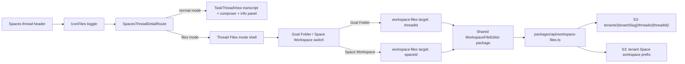

# feat: Add Thread Goal Folder Editor

## Overview

Add a Files mode to the Spaces thread detail page. The mode opens from a small Tabler `IconFiles` button in the thread header, replaces the transcript/composer surface with a full file tree and editor, and defaults to the current thread's Goal folder. From that same surface, users can switch to the parent Space workspace to inspect the Space-level context that governs the workflow.

The implementation should reuse the admin workspace editor experience instead of creating a second lightweight preview. To make that portable, extract the reusable editor pieces from `apps/admin` into a shared package, extend the workspace-files API with a thread Goal-folder target, then wire the new package into `apps/spaces`.

---

## Problem Frame

Goal-driven thread workflows now depend on durable markdown files such as `PROGRESS.md`, `DECISIONS.md`, `HANDOFFS.md`, and `ARTIFACTS.md`. The compact Goal Files summary in the Thread info panel is too compressed to explain the folder state or let users inspect and edit workflow context. Users need a clear in-thread file workspace that honors the "folder is the agent" model while keeping conversation/workflow execution separate from file inspection (see origin: `docs/brainstorms/2026-05-27-thread-goal-folder-file-editor-requirements.md`).

---

## Requirements Trace

- R1. Add a small thread-header Files icon button using Tabler `IconFiles`.
- R2. Toggle between normal thread view and full file explorer/editor view that replaces Thread Detail content.
- R3. Default Files mode to the current thread's Goal folder.
- R4. Match the admin workspace editor surface closely: tree, selected file header, editor, save/discard, and supported file/folder operations.
- R5. Include an explicit scope switch between Goal Folder and Space Workspace.
- R6. Make active scope visually clear so users do not confuse thread-local Goal state with Space-level context.
- R7. Remove the compact Goal Files section from the Thread info panel.
- R8. Keep the info panel focused on workflow status, progress, review, attachments, and thread metadata.
- R9. Expose durable portable Goal files such as progress, decisions, handoffs, artifacts, and workflow-produced files.
- R10. Reinforce that files are durable workflow context, not a secondary debug artifact.

**Origin actors:** A1 Operator/admin, A2 End user, A3 Agent

**Origin flows:** F1 Open thread files, F2 Switch to Space workspace

**Origin acceptance examples:** AE1 Files icon opens current thread Goal folder, AE2 scope switch reloads parent Space files and label, AE3 info panel no longer shows compact Goal Files list

---

## Scope Boundaries

- Do not build a second lightweight file preview inside the info panel.
- Do not replace the Space Detail workspace page; this mode is for in-thread workflow context.
- Do not add export/import functionality in this version.
- Do not add collaborative editor presence, comments, or file-level review workflows in this version.
- Do not add database tables or GraphQL schema for file content; the existing workspace-files REST handler and S3-backed folder model are the intended substrate.

---

## Context & Research

### Relevant Code and Patterns

- `apps/admin/src/components/agent-builder/WorkspaceEditor.tsx` is the UX baseline. It already handles file tree loading, selected file state, editor save/discard, create/rename/delete/move, drag/drop, cut/paste, and target-specific actions.
- `apps/admin/src/components/agent-builder/FileEditorPane.tsx` provides the CodeMirror editor surface and save/discard affordances.
- `apps/admin/src/components/agent-builder/FolderTree.tsx` provides the tree, context menus, inline rename/new-file behavior, and drag/drop handling.
- `apps/admin/src/components/ai-elements/file-tree.tsx` is a lower-level file-tree primitive used by the admin folder tree.
- `apps/admin/src/lib/workspace-files-api.ts`, `apps/admin/src/lib/workspace-tree-actions.ts`, `apps/admin/src/lib/codemirror-language.ts`, and `apps/admin/src/hooks/useKeyboardShortcuts.ts` are the supporting client/helper patterns to extract or wrap.
- `packages/api/workspace-files.ts` is the existing REST handler for S3-backed workspace files. Its target model currently supports agent, template, space, user, defaults, and catalog targets, but not thread Goal folders.
- `packages/api/src/lib/thread-progress/storage.ts` already writes thread-local files under `tenants/{tenantSlug}/threads/{threadId}/PROGRESS.md`; this establishes the S3 prefix shape for Goal Folder files.
- `packages/api/src/graphql/resolvers/threads/access.ts` and `packages/api/src/graphql/resolvers/threads/thread.query.ts` show the thread visibility predicate that should inform thread Goal-folder read access.
- `apps/spaces/src/components/workbench/SpacesThreadDetailRoute.tsx` owns the thread header action row via `usePageHeaderActions`; this is the correct integration point for `IconFiles`.
- `apps/spaces/src/components/workbench/TaskThreadView.tsx` owns the normal transcript/composer/info-panel layout; Files mode should replace this content rather than layering a file panel on top.
- `packages/ui/src/index.ts` exports shared shadcn primitives, but does not currently export `ContextMenu`; the extracted editor will need either a shared `ContextMenu` export or a Radix-local implementation.

### Institutional Learnings

- `docs/solutions/design-patterns/gitkeep-materialization-s3-empty-folders-2026-05-13.md`: empty S3 folders are represented with `.gitkeep` sentinels, and file trees should hide those implementation details from users.
- `docs/solutions/integration-issues/lambda-options-preflight-must-bypass-auth-2026-04-21.md`: workspace-files handler changes need explicit CORS/preflight coverage because browser failures otherwise look like empty editor state.
- `docs/solutions/architecture-patterns/workspace-skills-load-from-copied-agent-workspace-2026-04-28.md`: direct S3 edits should flow through the workspace-files API so manifest/derived side effects remain centralized.
- `docs/src/content/docs/concepts/agents/folder-is-the-agent.mdx`: folder structure is the agent/workspace architecture. This feature should surface the folder directly, not summarize it away.
- `docs/plans/2026-05-27-003-feat-folder-native-goals-plan.md`: thread Goal folders are thread-owned, S3-backed, and intended to include `GOAL.md`, `PROGRESS.md`, `DECISIONS.md`, `HANDOFFS.md`, and `ARTIFACTS.md`.
- `docs/plans/2026-05-25-006-feat-thread-progress-md-plan.md`: the current per-thread markdown state starts with `PROGRESS.md` under `tenants/{tenantSlug}/threads/{threadId}/`.

### External References

- External research was not needed for this plan. The repo has direct, current patterns for the file editor, S3 workspace-files API, thread access control, and Spaces thread layout.

---

## Key Technical Decisions

- Extract a reusable workspace editor package instead of copying admin components into Spaces: This preserves a single file editing UX and prevents divergence between admin and Spaces.
- Keep app-specific API clients outside the editor package: Admin and Spaces have separate auth/token helpers; the shared package should accept an injected workspace-files client or small adapter rather than importing app aliases.
- Add `threadId` as a first-class workspace-files target: The existing REST handler is already target-based and S3-prefix-backed, so adding a thread target is smaller and more consistent than creating a new GraphQL file API.
- Use the existing thread S3 prefix for Goal folders: `tenants/{tenantSlug}/threads/{threadId}/` matches current `PROGRESS.md` storage and the folder-native Goals plan.
- Default Files mode to Goal Folder and make Space Workspace an explicit switch: This matches the origin decision that the thread is the active workflow unit.
- Preserve workspace-files write authorization in v1: Read access should follow thread visibility; write operations should remain constrained by the existing workspace-files write policy unless implementation finds an already-established per-thread write role.
- Treat generated files as editable files, but not authoritative reverse-sync inputs: If a workflow refresh rewrites `PROGRESS.md`, that remains a system behavior. The editor should expose files honestly without implying every generated file is the source of truth for every database-backed task.

---

## Open Questions

### Resolved During Planning

- Which storage/API path backs the thread Goal Folder target? Use `packages/api/workspace-files.ts` with a new `threadId` target resolved to `tenants/{tenantSlug}/threads/{threadId}/`.
- What is the smallest clean extraction boundary for admin editor reuse? Extract the generic editor/tree/editor-pane/helpers into a new shared package and leave app auth, route blocking, and target-specific integrations in thin app wrappers.
- Which file operations are supported for Goal folders in v1? Support the same workspace-files operations where the caller is write-authorized; render read-only/error states for callers who can read a thread but cannot write workspace files.

### Deferred to Implementation

- Exact exported component/type names in the shared editor package: These are execution-time naming details as long as the package boundary stays generic and app-independent.
- Exact visual treatment of generated files such as `PROGRESS.md`: Implementation should add lightweight scope/helper copy only if needed to avoid implying that editing generated files updates database-backed workflow state.
- Whether existing workspace-files side effects should skip any thread target paths: Implementation should verify current identity/manifest/skill refresh hooks and ensure thread Goal-folder writes do not accidentally run agent/space-specific refresh logic.

---

## Output Structure

This tree shows the expected new shared package shape. It is a scope declaration, not a rigid file list; implementation may adjust internal filenames if the package boundary remains app-independent.

```text
packages/workspace-editor/
  package.json
  tsconfig.json
  src/
    index.ts
    components/
      WorkspaceFileEditor.tsx
      FileEditorPane.tsx
      FolderTree.tsx
      FileTree.tsx
    hooks/
      useKeyboardShortcuts.ts
    lib/
      codemirror-language.ts
      workspace-tree-actions.ts
      workspace-files-client.ts
    __tests__/
      WorkspaceFileEditor.test.tsx
      FileEditorPane.test.tsx
      FolderTree.test.tsx
      workspace-tree-actions.test.ts
```

---

## High-Level Technical Design

> *This illustrates the intended approach and is directional guidance for review, not implementation specification. The implementing agent should treat it as context, not code to reproduce.*



---

## Implementation Units

- U1. **Extract Shared Workspace Editor Package**

**Goal:** Move the generic admin workspace editor pieces into a reusable package that both `apps/admin` and `apps/spaces` can consume without app-local alias imports.

**Requirements:** R4, R10

**Dependencies:** None

**Files:**
- Create: `packages/workspace-editor/package.json`
- Create: `packages/workspace-editor/tsconfig.json`
- Create: `packages/workspace-editor/src/index.ts`
- Create: `packages/workspace-editor/src/components/WorkspaceFileEditor.tsx`
- Create: `packages/workspace-editor/src/components/FileEditorPane.tsx`
- Create: `packages/workspace-editor/src/components/FolderTree.tsx`
- Create: `packages/workspace-editor/src/components/FileTree.tsx`
- Create: `packages/workspace-editor/src/hooks/useKeyboardShortcuts.ts`
- Create: `packages/workspace-editor/src/lib/codemirror-language.ts`
- Create: `packages/workspace-editor/src/lib/workspace-tree-actions.ts`
- Create: `packages/workspace-editor/src/lib/workspace-files-client.ts`
- Create: `packages/workspace-editor/src/__tests__/WorkspaceFileEditor.test.tsx`
- Create: `packages/workspace-editor/src/__tests__/FileEditorPane.test.tsx`
- Create: `packages/workspace-editor/src/__tests__/FolderTree.test.tsx`
- Create: `packages/workspace-editor/src/__tests__/workspace-tree-actions.test.ts`
- Modify: `packages/ui/src/components/ui/context-menu.tsx`
- Modify: `packages/ui/src/index.ts`
- Modify: `apps/admin/src/components/agent-builder/WorkspaceEditor.tsx`
- Modify: `apps/admin/src/components/agent-builder/FileEditorPane.tsx`
- Modify: `apps/admin/src/components/agent-builder/FolderTree.tsx`
- Modify: `apps/admin/src/components/ai-elements/file-tree.tsx`
- Modify: `apps/admin/src/lib/codemirror-language.ts`
- Modify: `apps/admin/src/lib/workspace-tree-actions.ts`
- Modify: `apps/admin/src/hooks/useKeyboardShortcuts.ts`
- Modify: `apps/admin/package.json`
- Test: `apps/admin/src/components/agent-builder/__tests__/WorkspaceEditor.target.test.ts`
- Test: `apps/admin/src/components/agent-builder/__tests__/FileEditorPane.target.test.ts`
- Test: `apps/admin/src/components/agent-builder/__tests__/FolderTree.test.ts`
- Test: `apps/admin/src/lib/__tests__/workspace-files-api.test.ts`

**Approach:**
- Create `@thinkwork/workspace-editor` as a UI package that owns the generic tree/editor components, file operation helpers, and editor state management.
- Replace admin-local UI imports with `@thinkwork/ui` exports. Add a shared `ContextMenu` primitive to `packages/ui` by moving or adapting the existing admin implementation.
- Keep admin-specific behaviors behind props or a thin admin wrapper: skill catalog actions, regenerate map, AGENTS.md section refresh affordances, and TanStack route blocking should not force Spaces to know admin concepts.
- Make the shared component accept a target, a display label, operation capabilities, and a client adapter. The package should not import `apps/admin/src/lib/auth.ts` or `apps/spaces/src/lib/auth.ts`.
- Preserve the admin workspace editor behavior as the first characterization target before adding Spaces usage.

**Execution note:** Start with characterization coverage for the admin editor before changing imports and ownership, because this is a shared extraction with regression risk.

**Patterns to follow:**
- `apps/admin/src/components/agent-builder/WorkspaceEditor.tsx`
- `apps/admin/src/components/agent-builder/FileEditorPane.tsx`
- `apps/admin/src/components/agent-builder/FolderTree.tsx`
- `apps/admin/src/components/ai-elements/file-tree.tsx`
- `apps/admin/src/lib/workspace-tree-actions.ts`
- `docs/solutions/design-patterns/gitkeep-materialization-s3-empty-folders-2026-05-13.md`

**Test scenarios:**
- Happy path: Given the admin wrapper renders an agent workspace target, the shared editor lists files, selects a file, edits content, and calls save through the injected client.
- Happy path: Given a user edits a selected file, save/discard controls appear and discard restores the last loaded content.
- Edge case: Given the tree includes `.gitkeep`, the displayed tree hides sentinel files while preserving empty folder behavior.
- Edge case: Given the selected file is renamed or moved, selection follows the resulting path or clears predictably if the operation removes the selected file.
- Error path: Given the injected client rejects a save, the editor keeps unsaved content visible and surfaces the failure instead of clearing dirty state.
- Integration: Given the admin wrapper still passes an agent/space/template target, the outgoing workspace-files request body remains compatible with the current admin API contract.

**Verification:**
- Admin workspace editor remains behaviorally unchanged after importing from the shared package.
- Shared package builds and tests independently.
- No shared package file imports from `apps/admin` or `apps/spaces`.

---

- U2. **Add Thread Goal Folder Target to Workspace Files API**

**Goal:** Let the shared editor list, read, and write files under the current thread's Goal folder via the existing workspace-files REST API.

**Requirements:** R3, R4, R9, R10

**Dependencies:** U1 for shared target/client types, but API work can start in parallel if target shape is stable.

**Files:**
- Modify: `packages/api/workspace-files.ts`
- Modify: `packages/api/src/__tests__/workspace-files-handler.test.ts`
- Modify: `packages/api/src/lib/thread-progress/storage.ts`
- Modify: `packages/api/src/lib/thread-progress/storage.test.ts`
- Modify: `apps/admin/src/lib/workspace-files-api.ts`
- Create: `apps/spaces/src/lib/workspace-files-api.ts`
- Test: `apps/spaces/src/lib/workspace-files-api.test.ts`

**Approach:**
- Extend the workspace-files request target union with `threadId`.
- Resolve `threadId` by loading the thread for the caller's tenant and validating the caller can read the thread using the same visibility model as thread queries.
- Resolve the S3 prefix to the existing thread folder shape: `tenants/{tenantSlug}/threads/{threadId}/`.
- Reuse the existing list/get/put/delete/move/rename machinery once the thread target resolves to a safe prefix.
- Keep path sanitization and safe segment rules aligned with `threadProgressKey`.
- Keep existing workspace-files write authorization for write operations. Thread participants who can read but not write should receive the same explicit permission failure pattern as other workspace-files targets.
- Add a Spaces-local workspace-files client adapter that injects the Spaces app's auth token and supports `{ threadId }` and `{ spaceId }` targets.

**Patterns to follow:**
- `packages/api/workspace-files.ts`
- `packages/api/src/lib/thread-progress/storage.ts`
- `packages/api/src/graphql/resolvers/threads/thread.query.ts`
- `packages/api/src/graphql/resolvers/threads/access.ts`
- `apps/admin/src/lib/workspace-files-api.ts`
- `docs/solutions/integration-issues/lambda-options-preflight-must-bypass-auth-2026-04-21.md`

**Test scenarios:**
- Happy path: Given a caller can read thread `T`, list with `{ threadId: T }` returns files from `tenants/{tenantSlug}/threads/{T}/`.
- Happy path: Given a write-authorized caller puts `DECISIONS.md` under `{ threadId: T }`, the handler writes under the thread prefix and returns the updated file metadata.
- Edge case: Given both `threadId` and `spaceId` are present, the handler rejects the request as an invalid multi-target body.
- Edge case: Given a path attempts directory traversal, the handler rejects the operation before touching S3.
- Error path: Given the thread belongs to another tenant or is not visible to the caller, list/get/write returns a permission/not-found response without exposing the S3 key.
- Error path: Given a readable caller is not write-authorized, put/delete/move/rename return a permission failure while list/get still work.
- Integration: Given an `OPTIONS` preflight request, the handler returns the expected CORS response for the workspace-files route.

**Verification:**
- Thread Goal-folder files are accessible through the same REST route shape as other workspace file targets.
- No GraphQL schema or database migration is required.
- Existing agent/template/space/defaults/catalog workspace-files tests continue to pass.

---

- U3. **Add Files Mode to Spaces Thread Detail**

**Goal:** Add the thread-header Files toggle and replace the normal thread view with the shared file editor when active.

**Requirements:** R1, R2, R3, R4, R5, R6, R9, R10; covers F1, F2, AE1, AE2

**Dependencies:** U1, U2

**Files:**
- Modify: `apps/spaces/src/components/workbench/SpacesThreadDetailRoute.tsx`
- Create: `apps/spaces/src/components/workbench/ThreadWorkspaceView.tsx`
- Create: `apps/spaces/src/components/workbench/ThreadWorkspaceView.test.tsx`
- Modify: `apps/spaces/src/components/workbench/SpacesThreadDetailRoute.test.tsx`
- Modify: `apps/spaces/package.json`

**Approach:**
- Add a header action button using Tabler `IconFiles`; it should match the existing compact header action styling used for info/artifact controls.
- Store Files mode state in `SpacesThreadDetailRoute`, not inside `TaskThreadView`, because Files mode replaces the thread content rather than decorating the transcript.
- When Files mode opens, close or suppress the info and artifact panels so the editor gets the full thread detail content area.
- Render a `ThreadWorkspaceView` that contains a small scope switch, active scope label, and the shared `WorkspaceFileEditor`.
- Default scope to Goal Folder with target `{ threadId }`.
- Allow switching to Space Workspace with target `{ spaceId }` when the thread has a parent Space; if no `spaceId` exists, render the Space Workspace segment disabled with a short empty-state message explaining that the thread has no parent Space.
- Opening Files mode always resets scope to Goal Folder, including after the user previously switched to Space Workspace and closed Files mode.
- Keep the thread title/header visible so users can orient themselves while editing files.

**Patterns to follow:**
- `apps/spaces/src/components/workbench/SpacesThreadDetailRoute.tsx`
- `apps/spaces/src/components/workbench/TaskThreadView.tsx`
- `apps/spaces/src/components/workbench/ThreadDetailActions.tsx`
- `apps/spaces/src/context/PageHeaderContext.tsx`
- `packages/workspace-editor/src/components/WorkspaceFileEditor.tsx`

**Test scenarios:**
- Covers AE1. Happy path: Given a Customer Onboarding thread is open, clicking the Files icon replaces the transcript/composer with a file tree/editor targeting `{ threadId }`.
- Covers AE2. Happy path: Given Files mode is open on Goal Folder, switching to Space Workspace reloads the editor with `{ spaceId }` and updates the visible active scope label.
- Happy path: Given Files mode is active, clicking the Files icon again returns to the normal transcript/composer view.
- Happy path: Given a user switches to Space Workspace, closes Files mode, and reopens Files mode, the active scope is Goal Folder again.
- Edge case: Given the thread has no parent Space, the Space Workspace switch is not actionable and the Goal Folder remains usable.
- Edge case: Given the user toggles Files mode while the info panel is open, the editor renders without the info panel overlaying or narrowing the workspace.
- Error path: Given the workspace-files client returns a permission error, the file view shows a meaningful read/write failure state without falling back to the transcript.

**Verification:**
- The thread page has a clear mode switch between conversation and files.
- Goal Folder is the first file scope every time Files mode is opened for a thread.
- Space Workspace can be reached from Files mode without navigating away from the thread.

---

- U4. **Remove Compact Goal Files and Polish Thread File UX**

**Goal:** Keep the info panel focused on workflow status and make Files mode feel intentional enough for a client demo.

**Requirements:** R5, R6, R7, R8, R10; covers AE3

**Dependencies:** U3

**Files:**
- Modify: `apps/spaces/src/components/workbench/TaskThreadView.tsx`
- Modify: `apps/spaces/src/components/workbench/TaskThreadView.test.tsx`
- Modify: `apps/spaces/src/components/workbench/ThreadWorkspaceView.tsx`
- Modify: `apps/spaces/src/components/workbench/ThreadWorkspaceView.test.tsx`
- Modify: `apps/spaces/src/components/workbench/SpacesThreadDetailRoute.test.tsx`

**Approach:**
- Remove any remaining compact Goal Files list from the Thread info panel.
- Keep the info panel sections constrained to workflow status, review, progress, attachments, and thread metadata.
- Give Files mode clear scope affordances: current scope title, small explanatory subtitle, and active segmented/toggle state.
- Ensure the file editor has stable dimensions and does not overlap the global sidebar, header, or browser viewport at common desktop sizes.
- Preserve the recent right-panel spacing and composer/info-panel fixes from the current UI work; Files mode should remove the composer entirely rather than requiring more spacing hacks.
- If read-only mode is detected, make it visible at the editor level so users know why save/file operations are unavailable.

**Patterns to follow:**
- `apps/spaces/src/components/workbench/TaskThreadView.tsx`
- `apps/spaces/src/components/workbench/TaskThreadView.test.tsx`
- `apps/spaces/src/components/workbench/WorkbenchLayoutNotes.md`
- `packages/workspace-editor/src/components/WorkspaceFileEditor.tsx`

**Test scenarios:**
- Covers AE3. Happy path: Given the info panel is open for a thread with Goal files, the text `GOAL FILES` and compact file records are not rendered.
- Happy path: Given Files mode is open, the scope label visibly identifies either Goal Folder or Space Workspace.
- Edge case: Given a narrow desktop viewport, the file editor stays inside the thread content area and does not sit under the side navigation divider.
- Error path: Given read-only capabilities, save/create/rename/delete controls are hidden or disabled while list/get remains usable.

**Verification:**
- The info panel no longer tries to explain files.
- Files mode is the single place to inspect Goal and Space workspace files from the thread.
- Visual checks show no overlap with the sidebar, header, or composer.

---

- U5. **Verification, Local Demo, and Release Readiness**

**Goal:** Prove the extracted editor, API target, and Spaces integration work together before shipping.

**Requirements:** All requirements; covers AE1, AE2, AE3

**Dependencies:** U1, U2, U3, U4

**Files:**
- Modify: `docs/plans/autopilot-status.md`
- Modify: `docs/solutions/workflow-issues/thread-goal-folder-editor-2026-05-27.md`

**Approach:**
- Add a short solution note only after implementation has exposed real details worth preserving, especially around package extraction and thread target auth.
- Run focused checks first for the shared package, workspace-files handler, admin editor, and Spaces thread route, then broader checks required by repo conventions.
- Verify admin still renders the existing workspace editor after extraction.
- Verify Spaces locally on port 5175 with the ignored `.env` copied into the worktree before starting Vite.
- Exercise a deployed or deployed-like API path for AE1 and AE2 because workspace-files and thread Goal folders depend on AWS/S3-backed data. Local browser verification covers layout and UI behavior; API/S3 validation must use the deployed or deployed-like backend.

**Patterns to follow:**
- `AGENTS.md`
- `docs/solutions/integration-issues/lambda-options-preflight-must-bypass-auth-2026-04-21.md`
- `docs/solutions/design-patterns/gitkeep-materialization-s3-empty-folders-2026-05-13.md`

**Test scenarios:**
- Integration: In local Spaces dev, open a Customer Onboarding thread, click Files, confirm Goal Folder files list and a markdown file opens in the editor.
- Integration: Switch to Space Workspace and confirm the file tree changes to the Space-level workspace.
- Integration: Open the info panel and confirm compact Goal Files are absent while progress/review/thread metadata remain.
- Integration: In admin, open the existing workspace editor and confirm tree/editor/save/discard still work after extraction.
- Error path: Attempt to save as a caller without write permissions and confirm the UI reports the permission failure without losing local edits.

**Verification:**
- Focused unit/integration tests pass for touched packages/apps.
- Local browser verification on `localhost:5175` confirms layout and UI portions of AE1, AE2, and AE3 while pointed at a deployed or deployed-like backend for file data.
- The implementation is ready for PR review without needing manual deployment outside the normal merge/deploy pipeline.

---

## System-Wide Impact

- **Interaction graph:** Spaces thread header state now controls whether the route renders `TaskThreadView` or the file editor. The file editor uses the workspace-files REST handler, which maps targets to S3 prefixes.
- **Error propagation:** Workspace-files permission, not-found, validation, and S3 errors should surface through the shared editor without collapsing the thread route.
- **State lifecycle risks:** Thread Goal-folder files may include generated files such as `PROGRESS.md`; editing them does not necessarily update task database rows and future workflow refreshes may overwrite generated content.
- **API surface parity:** Admin and Spaces should share the same editor package and target/client vocabulary. The REST handler gains `{ threadId }`; GraphQL remains unchanged.
- **Integration coverage:** Unit tests alone will not prove S3 prefix correctness, auth behavior, or browser layout. Workspace-files handler tests and local Spaces browser verification are required.
- **Unchanged invariants:** Existing admin workspace targets, Space Detail workspace access, thread timeline rendering, composer behavior, and info panel progress/review behavior remain intact outside Files mode.

---

## Risks & Dependencies

| Risk | Mitigation |
|------|------------|
| Shared editor extraction regresses admin workspace editing | Characterize admin behavior before extraction, keep an admin wrapper for app-specific actions, and run existing admin editor tests after migration. |
| Thread Goal-folder target leaks files across tenants or invisible threads | Resolve the thread through tenant-scoped queries and thread visibility predicates before deriving an S3 prefix. Never accept caller-supplied tenant slug or raw S3 key. |
| Spaces users can read a thread but cannot write files, creating confusing disabled states | Make read-only/error states explicit in the shared editor and preserve current workspace-files write authorization until a thread-specific writer policy is designed. |
| Generated files appear editable even though workflow refreshes may overwrite them | Keep Files mode framed as folder inspection/editing and add lightweight helper copy if implementation shows this is confusing. Do not invent reverse-sync semantics in v1. |
| The extracted package pulls in admin-only aliases or dependencies | Make the package app-independent, depend on `@thinkwork/ui`, and pass app clients/actions as props. |
| CodeMirror and drag/drop dependencies bloat Spaces unexpectedly | Put editor dependencies in `packages/workspace-editor` and verify Spaces build output; accept this for v1 because the user explicitly wants the full admin editor experience. |

---

## Documentation / Operational Notes

- No database migration or GraphQL codegen is expected.
- This feature depends on the deployed workspace-files route and S3-backed thread folders for true end-to-end validation.
- Local Spaces verification should run on port 5175 when another admin/spaces Vite instance is already running.
- If implementation reveals a non-obvious auth or S3-prefix edge case, add a `docs/solutions/` note during U5 so future Goal-folder work compounds the learning.

---

## Sources & References

- **Origin document:** [docs/brainstorms/2026-05-27-thread-goal-folder-file-editor-requirements.md](../brainstorms/2026-05-27-thread-goal-folder-file-editor-requirements.md)
- Related plan: [docs/plans/2026-05-27-003-feat-folder-native-goals-plan.md](2026-05-27-003-feat-folder-native-goals-plan.md)
- Related plan: [docs/plans/2026-05-25-006-feat-thread-progress-md-plan.md](2026-05-25-006-feat-thread-progress-md-plan.md)
- Existing admin editor: `apps/admin/src/components/agent-builder/WorkspaceEditor.tsx`
- Existing workspace-files API: `packages/api/workspace-files.ts`
- Existing thread progress storage: `packages/api/src/lib/thread-progress/storage.ts`
- Spaces thread route: `apps/spaces/src/components/workbench/SpacesThreadDetailRoute.tsx`
- Spaces thread view: `apps/spaces/src/components/workbench/TaskThreadView.tsx`
- Folder-as-agent concept: `docs/src/content/docs/concepts/agents/folder-is-the-agent.mdx`
- S3 empty folder sentinel pattern: `docs/solutions/design-patterns/gitkeep-materialization-s3-empty-folders-2026-05-13.md`
- Workspace-files CORS lesson: `docs/solutions/integration-issues/lambda-options-preflight-must-bypass-auth-2026-04-21.md`
