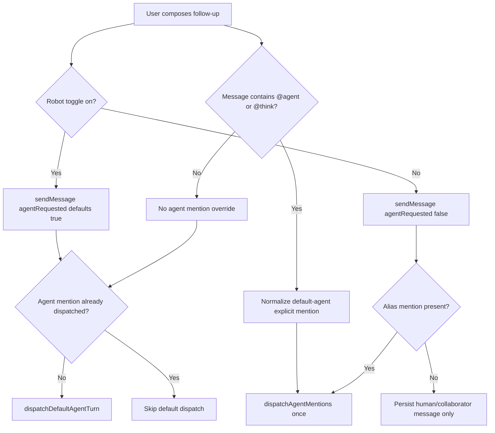

# feat: Follow-up agent toggle

## Overview

Add a one-send agent toggle to the Spaces follow-up composer so collaborator chat can be posted without waking the default Thread agent. Preserve the current agent-first behavior by default, add a special `agent` mention shortcut backed by `@agent` / `@think`, and carry the new intent through the existing GraphQL `sendMessage` path.

---

## Problem Frame

Spaces Threads are now shared human-and-agent collaboration records, but the current follow-up path still treats every ordinary user message as a default-agent request. The implementation needs to let a user opt out for one send while keeping normal agent usage fast and keeping explicit agent invocation obvious (see origin: `docs/brainstorms/2026-05-28-follow-up-agent-toggle-requirements.md`).

---

## Requirements Trace

- R1. The follow-up composer has a robot/agent toggle to the left of the mention and attachment controls.
- R2. The toggle is on by default for a new send.
- R3. Turning it off applies only to the next successfully sent message; failed sends preserve the user's current intent for retry.
- R4. A successful human-only send resets the toggle on.
- R5. The mention picker includes a special top item labeled `agent` with a distinct icon.
- R6. Selecting the special `agent` mention inserts an agent mention and turns the toggle on before send.
- R7. `@agent` and `@think` are equivalent aliases for invoking the default Thread agent without exposing or requiring the concrete agent name.
- R8. A follow-up wakes the default Thread agent when the toggle is on or the message explicitly invokes `@agent` / `@think`.
- R9. A follow-up does not wake the default Thread agent when the toggle is off and no `@agent` / `@think` invocation is present.
- R10. Collaborator mentions and attachment behavior continue to work with the toggle on or off.

**Origin actors:** A1 (Thread participant), A2 (Default Thread agent), A3 (Mentioned collaborator)
**Origin flows:** F1 (agent-targeted follow-up by default), F2 (one human-only follow-up), F3 (agent mention shortcut)
**Origin acceptance examples:** AE1 (default dispatch), AE2 (one-send opt-out), AE3 (picker shortcut override), AE4 (typed aliases), AE5 (collaborator/attachment compatibility)

---

## Scope Boundaries

- Do not add persistent per-thread, per-user, or per-session agent mute preferences.
- Do not add smart content classification or infer agent intent from message text beyond `@agent` / `@think`.
- Do not redesign collaborator mention semantics or attachment upload/download behavior.
- Do not expose the concrete default agent name in the special picker item.
- Do not change Computer-owned thread behavior; the existing `thread.computer_id` guard remains the dispatch boundary.

### Deferred to Follow-Up Work

- Empty-thread composer parity: keep this implementation focused on the in-thread follow-up composer. First-message composer parity is a follow-up product decision, not an execution-time expansion.
- Mobile parity: mobile GraphQL types may need regeneration for schema compatibility, but mobile UI changes are not part of this plan.

---

## Context & Research

### Relevant Code and Patterns

- `apps/spaces/src/components/workbench/TaskThreadView.tsx` owns the AI Elements follow-up composer, mention button, attachment button, submit callback shape, and component tests.
- `apps/spaces/src/components/workbench/SpacesThreadDetailRoute.tsx` uploads follow-up attachments, builds `SendMessageInput`, maps structured mentions, and reexecutes Thread queries after send.
- `apps/spaces/src/components/spaces/MentionMenu.tsx` centralizes mention filtering and rendering for Spaces composer surfaces.
- `packages/database-pg/graphql/types/messages.graphql` defines `SendMessageInput`; optional additions preserve existing clients.
- `packages/database-pg/graphql/types/threads.graphql` defines `ThreadMentionTarget`; it currently exposes no default-agent marker, so this plan adds one rather than asking the frontend to guess.
- `packages/api/src/graphql/resolvers/messages/sendMessage.mutation.ts` already validates mention targets, persists mentions, inserts participants, dispatches explicit agent mentions, and dispatches the default agent after commit.
- `packages/api/src/graphql/resolvers/threads/threadMentionTargets.query.ts` exposes mention targets to Spaces and should carry any default-agent marker to the UI.
- `packages/api/src/lib/mentions/parse-message-mentions.ts` already supports display-name and alias matching for text mentions.
- `packages/api/src/lib/mentions/thread-mention-targets.ts` already resolves tenant/space/platform agent mention targets.
- `docs/plans/2026-05-19-005-feat-spaces-collaborative-chat-ui-plan.md` established `sendMessage` as the right integration point for mention participation and agent wakeups.

### Institutional Learnings

- `docs/solutions/runtime-errors/stale-agentcore-runtime-image-entrypoint-not-found-2026-04-25.md` recommends proving runtime-facing agent changes through real GraphQL `sendMessage` behavior when possible, because wakeups depend on the actual backend dispatch path.
- `docs/solutions/database-issues/feature-schema-extraction-pattern.md` reinforces the local convention that canonical GraphQL changes require consumer codegen regeneration.

### External References

- Not used. Local patterns are direct and current for this feature.

---

## Key Technical Decisions

- Add an optional `agentRequested: Boolean` field to `SendMessageInput`. Missing or `true` preserves today's behavior; explicit `false` is the one-send human-only opt-out for default agent dispatch and onboarding-style agent automation. Explicit agent mentions still override it.
- Keep explicit agent mention dispatch separate from default-agent dispatch. `@agent` / `@think` should wake the default agent through the explicit mention path or an equivalent normalized alias path, not by relying on the default-dispatch flag alone.
- Resolve the default-agent mention target with the same priority as default-agent dispatch: `threads.agent_id`, then tenant platform default, then the first subscribed agent participant. Expose that target explicitly to the UI with a default-agent marker instead of using frontend heuristics.
- Change default-agent dispatch gating from "no parsed mentions" to "agent requested and no agent mention already dispatched." This lets `@teammate` with robot-on still wake the default agent while avoiding duplicate dispatch for `@agent` / `@think`.
- Treat `@agent` / `@think` as reserved aliases resolved before generic mention matching, so teammates or non-default agents named "Agent" or "Think" cannot steal the shortcut.
- Normalize `@agent` / `@think` in both UI and backend parsing. UI picker selection gives immediate visual feedback and structured mention metadata; backend alias parsing protects typed shortcuts and non-UI clients.
- Keep the special picker item label as `agent`, even when it resolves to a concrete default agent id behind the scenes.

---

## Open Questions

### Resolved During Planning

- Transport shape for opt-out: use optional `agentRequested` on `SendMessageInput`, defaulting to true server-side for backward compatibility.
- Alias normalization location: normalize in both the mention picker path and backend parser/target path so picker selection and typed shortcuts converge before dispatch.
- Empty-thread scope: defer UI parity; this plan targets the follow-up composer called out by the requirements, while keeping schema defaults compatible with existing first-message sends.
- Human-only automation boundary: `agentRequested: false` suppresses default-agent dispatch and onboarding chat-update automation for that send. Explicit `@agent` / `@think` overrides the opt-out by becoming an explicit agent mention.

### Deferred to Implementation

- Exact backend helper shape for resolving the special alias target: choose the smallest extraction that keeps `sendMessage.mutation.ts` readable once the implementer is in the code.
- Final visual treatment of the robot toggle pressed/unpressed states: follow existing `PromptInputButton` styling and verify in browser against the provided footer layout.

---

## High-Level Technical Design

> _This illustrates the intended approach and is directional guidance for review, not implementation specification. The implementing agent should treat it as context, not code to reproduce._

---

## Implementation Units

- U1. **Backend send contract and dispatch gating**

**Goal:** Add an explicit agent-request flag to `sendMessage` and update backend dispatch/automation conditions to support one-send opt-out without breaking existing clients.

**Requirements:** R8, R9, R10; F1, F2; AE1, AE2, AE5

**Dependencies:** None

**Files:**

- Modify: `packages/database-pg/graphql/types/messages.graphql`
- Modify: `packages/api/src/graphql/resolvers/messages/sendMessage.mutation.ts`
- Modify: `packages/api/src/lib/spaces/customer-onboarding-chat-updates.ts`
- Modify: `packages/api/src/graphql/resolvers/messages/sendMessage.mentions.test.ts`
- Test: `packages/api/src/graphql/resolvers/messages/sendMessage.mentions.test.ts`
- Generated: `apps/admin/src/gql/graphql.ts`
- Generated: `apps/admin/src/gql/gql.ts`
- Generated: `apps/mobile/lib/gql/graphql.ts`
- Generated: `apps/mobile/lib/gql/gql.ts`
- Generated: `apps/cli/src/gql/graphql.ts`
- Generated: `apps/cli/src/gql/gql.ts`

**Approach:**

- Extend `SendMessageInput` with optional `agentRequested`.
- Interpret only explicit `false` as a human-only opt-out; omitted and `true` both request agent handling.
- Keep `dispatchAgentMentions` for parsed agent mentions.
- Gate customer-onboarding chat-update automation on the same `agentRequested !== false` decision so human-only sends do not produce agent-like assistant/system handling.
- Replace the current `parsedMentions.length === 0` default-dispatch guard with a guard based on `agentRequested !== false`, `!hasAgentMentions`, `!thread.computer_id`, user sender, and existing onboarding handling.
- Regenerate GraphQL consumer types for packages with codegen scripts so typed consumers stay compatible with the schema change.

**Execution note:** Start with backend behavior tests/characterization around the old default-dispatch condition before editing the mutation, because this unit changes a subtle side-effect gate.

**Patterns to follow:**

- Existing optional `SendMessageInput` fields in `packages/database-pg/graphql/types/messages.graphql`.
- Existing resolver side-effect ordering assertions in `packages/api/src/graphql/resolvers/messages/sendMessage.mentions.test.ts`, but add behavioral coverage rather than relying only on source-text assertions.
- Existing default-agent helper tests in `packages/api/src/lib/mentions/default-agent-routing.test.ts`.

**Test scenarios:**

- Covers AE1. Happy path: a user message with omitted `agentRequested` and no agent mention still reaches the default-agent dispatch branch.
- Covers AE2. Happy path: a user message with `agentRequested: false` and no agent mention does not reach `dispatchDefaultAgentTurn` or customer-onboarding chat-update automation.
- Covers AE5. Integration: a user message with a collaborator mention and `agentRequested` omitted still reaches `dispatchDefaultAgentTurn`.
- Edge case: a user message with an explicit agent mention and `agentRequested` omitted does not double-dispatch through the default-agent branch.
- Edge case: a Computer-owned thread still does not use default-agent dispatch regardless of the new flag.
- Edge case: an onboarding-handled message with `agentRequested` omitted preserves today's onboarding handling before default dispatch.
- Compatibility: generated `SendMessageInput` types include the optional field and existing callers that omit it remain valid.

**Verification:**

- Backend tests prove opt-out, default-on, collaborator mention, agent mention, and Computer-thread gating.
- Generated GraphQL files compile in their owning packages.

---

- U2. **Default agent alias normalization**

**Goal:** Make `@agent` and `@think` resolve to the default Thread agent without requiring or exposing the concrete agent name.

**Requirements:** R5, R6, R7, R8; F3; AE3, AE4

**Dependencies:** U1

**Files:**

- Modify: `packages/database-pg/graphql/types/threads.graphql`
- Modify: `packages/api/src/graphql/resolvers/threads/threadMentionTargets.query.ts`
- Modify: `packages/api/src/lib/mentions/thread-mention-targets.ts`
- Modify: `packages/api/src/lib/mentions/parse-message-mentions.ts`
- Modify: `packages/api/src/lib/mentions/parse-message-mentions.test.ts`
- Modify: `packages/api/src/graphql/resolvers/messages/sendMessage.mutation.ts`
- Modify: `apps/spaces/src/lib/graphql-queries.ts`
- Test: `packages/api/src/lib/mentions/parse-message-mentions.test.ts`
- Test: `packages/api/src/graphql/resolvers/messages/sendMessage.mentions.test.ts`
- Generated: `apps/admin/src/gql/graphql.ts`
- Generated: `apps/admin/src/gql/gql.ts`
- Generated: `apps/mobile/lib/gql/graphql.ts`
- Generated: `apps/mobile/lib/gql/gql.ts`
- Generated: `apps/cli/src/gql/graphql.ts`
- Generated: `apps/cli/src/gql/gql.ts`

**Approach:**

- Add a GraphQL-visible default-agent marker, such as `isDefaultAgent`, and invocation alias metadata on `ThreadMentionTarget` so the UI can identify the default target without guessing from names or roles.
- Resolve the default-agent mention target using the same priority as default dispatch: `threads.agent_id`, tenant platform default, then the first subscribed agent participant.
- Ensure thread mention targets for the resolved default agent include reserved aliases for `agent` and `think`, merging aliases if that agent is already present as a participant target.
- Normalize alias-derived parsed mentions so the user-facing mention label can remain `agent` when the raw text is `@agent` or `@think`.
- Resolve reserved aliases before generic display-name/alias matching so a teammate or non-default agent named "Agent" or "Think" cannot intercept the shortcut.
- Preserve validation against real agent ids; the alias is a display/invocation layer, not a new target type.
- Keep explicit structured mention input valid for the special UI picker item by allowing display/raw text to represent `agent` while the target id remains the resolved default agent id.

**Patterns to follow:**

- Existing alias matching in `parse-message-mentions.ts`.
- Existing platform-agent target resolution in `thread-mention-targets.ts`.
- Existing default-agent priority in `packages/api/src/lib/mentions/default-agent-routing.ts`.
- Existing `dispatchAgentMentions` idempotency by target agent id.

**Test scenarios:**

- Covers AE4. Happy path: content containing `@agent` parses to an agent mention for the resolved default agent.
- Covers AE4. Happy path: content containing `@think` parses to the same resolved default agent mention.
- Happy path: `threadMentionTargets` marks exactly one resolved default agent target as default and includes `agent` / `think` aliases.
- Edge case: parsing aliases is case-insensitive and respects the existing mention boundary rules.
- Edge case: explicit structured mention for the resolved default agent de-duplicates with typed `@agent`.
- Edge case: if the default agent is already a Thread participant, alias metadata is merged rather than dropped.
- Edge case: a teammate named "Agent" or non-default agent named "Think" does not capture the reserved shortcut.
- Edge case: a Thread with an explicit `threads.agent_id` resolves `@agent` to that agent rather than the tenant platform default.
- Integration: `sendMessage` treats alias-derived mentions as agent mentions, dispatches `dispatchAgentMentions`, and skips default double-dispatch.

**Verification:**

- Alias parser and mention-target tests cover `@agent`, `@think`, default-agent priority, collision handling, boundaries, de-duplication, and display/raw-text preservation.
- `sendMessage` tests show aliases use the explicit agent mention route.

---

- U3. **Follow-up composer toggle and special picker item**

**Goal:** Add the default-on one-send robot toggle to the in-thread follow-up composer and put a special `agent` item at the top of mention suggestions.

**Requirements:** R1, R2, R3, R4, R5, R6, R7, R10; F1, F2, F3; AE1, AE2, AE3, AE4, AE5

**Dependencies:** U1, U2

**Files:**

- Modify: `apps/spaces/src/components/workbench/TaskThreadView.tsx`
- Modify: `apps/spaces/src/components/spaces/MentionMenu.tsx`
- Modify: `apps/spaces/src/components/workbench/SpacesComposer.test.tsx`
- Modify: `apps/spaces/src/components/workbench/TaskThreadView.test.tsx`
- Test: `apps/spaces/src/components/workbench/TaskThreadView.test.tsx`
- Test: `apps/spaces/src/components/workbench/SpacesComposer.test.tsx`

**Approach:**

- Add local `agentEnabled` state to `FollowUpComposer`, defaulting true.
- Render a robot/agent icon `PromptInputButton` before the existing mention and attachment buttons. The pressed state should be visible and accessible through aria state/title text.
- Include `agentRequested` in the follow-up submit callback data so the route can pass it into `sendMessage`.
- Snapshot `agentEnabled` at submit start and disable composer controls during upload/mutation through existing submitting/sending affordances. Reset `agentEnabled` to true after successful submit. If submit fails, keep the current state and inline error so the user can retry the same intended send.
- Build a special top mention option labeled `agent` from the backend-marked default-agent target. Selecting it inserts `@agent`, records a structured agent mention against the resolved default agent id, and sets `agentEnabled` true.
- Keep the special option scoped to the follow-up composer. If `MentionMenu` needs a shared prop for pinned/special options, default it off and add negative coverage so empty-thread `SpacesComposer` and older composer surfaces do not show the special row in this slice.
- Show the synthetic agent row first for empty mention queries and alias-prefix queries such as `a`, `ag`, `agent`, `t`, `th`, and `think`; hide it for unrelated queries. If no default-agent target is returned, omit the row rather than showing a disabled mystery control.
- Treat recognized `@agent` / `@think` text or a structured default-agent mention as a forced-on state: the toggle displays on and is disabled while the alias/mention remains present. When the alias/mention is removed from the text, the toggle becomes editable again and remains on until the user turns it off.
- Preserve attachment conversion and collaborator mention filtering exactly as they work today.

**Patterns to follow:**

- Existing `PromptInputButton` usage for mention and attachment controls in `TaskThreadView.tsx`.
- Existing mention selection and submitted-mentions filtering in `FollowUpComposer`.
- Existing AI Elements component tests around async PromptInput submit in `TaskThreadView.test.tsx`.

**Test scenarios:**

- Covers AE1. Happy path: submitting with the default toggle state calls `onSendFollowUp` with agent handling requested.
- Covers AE2. Happy path: clicking the robot toggle off and submitting sends with agent dispatch disabled, then the next composer state is on.
- Error path: if `onSendFollowUp` rejects, the toggle state is not reset, the inline error is shown, and the user can retry without reselecting the toggle.
- Covers AE3. Happy path: selecting the top `agent` mention while the toggle is off inserts `@agent`, records an agent mention, and flips the toggle on.
- Covers AE4. Happy path: typing `@think` or `@agent` forces the toggle on and disables it while the alias remains; deleting the alias re-enables the toggle.
- Covers AE5. Integration: with the toggle off, selecting a user mention and attaching a file still forwards the user mention and files while sending agent handling disabled.
- Mention picker: the special row appears first for empty and matching alias-prefix queries, remains keyboard-selectable at index 0, and is absent from unrelated queries.
- Scope guard: empty-thread `SpacesComposer` does not show the special `agent` row in this implementation slice.
- Accessibility: the robot toggle exposes `aria-label`, `aria-pressed`, Enter/Space activation, visible focus, tooltip/title copy for on/off/forced states, and an adequate touch target; the special menu row has a clear screen-reader label.

**Verification:**

- Follow-up composer tests prove callback payloads, reset behavior, retry behavior, special mention ordering, alias override, forced-on behavior, and attachment/user-mention compatibility.
- Manual browser check confirms the footer layout matches the screenshot: robot toggle left of `@` and paperclip, no text overlap, disabled/send states still fit, and narrow widths keep the icon buttons usable.

---

- U4. **Route wiring and query-contract cleanup**

**Goal:** Carry the composer-level dispatch intent into the existing route send path and keep GraphQL call sites coherent after the schema change.

**Requirements:** R8, R9, R10; F1, F2; AE1, AE2, AE5

**Dependencies:** U1, U2, U3

**Files:**

- Modify: `apps/spaces/src/components/workbench/SpacesThreadDetailRoute.tsx`
- Modify: `apps/spaces/src/lib/graphql-queries.ts`
- Modify: `apps/spaces/src/components/workbench/TaskThreadView.test.tsx`
- Modify: `apps/spaces/src/components/workbench/SpacesComposer.test.tsx`
- Test: `apps/spaces/src/components/workbench/TaskThreadView.test.tsx`
- Test: `apps/spaces/src/components/workbench/SpacesComposer.test.tsx`

**Approach:**

- Extend the route's `onSendFollowUp` signature to accept the agent-dispatch boolean from `FollowUpComposer`.
- Set `sendInput.agentRequested` only when false, or pass the boolean explicitly if that is clearer for the local type shape. The backend default keeps older callers unchanged.
- Preserve upload-before-send behavior and partial upload warnings.
- Leave empty-thread `SpacesComposer` and the older `ThreadComposer` unchanged for this slice; they will continue to omit the optional flag and therefore keep default-agent behavior.
- Update `apps/spaces/src/lib/graphql-queries.ts` to request the default-agent marker/alias fields on `threadMentionTargets` so the follow-up composer can build the special row reliably. The `SendMessage` mutation still takes `SendMessageInput`.

**Patterns to follow:**

- Current attachment upload sequencing in `SpacesThreadDetailRoute.tsx`.
- Current callback threading between `TaskThreadView` and `FollowUpComposer`.

**Test scenarios:**

- Covers AE2. Integration: `FollowUpComposer` toggle-off submit results in the route building `SendMessageInput` with agent handling disabled.
- Happy path: default toggle-on submit omits or sets the field in a way that preserves backend default dispatch.
- Error path: attachment upload failure still blocks send before any `agentRequested` value matters.
- Compatibility: empty-thread composer and older Space room composer do not need immediate UI changes because the schema field is optional.

**Verification:**

- Route/component tests prove the new callback contract.
- Typecheck proves existing GraphQL call sites tolerate the optional field.

---

## System-Wide Impact

- **Interaction graph:** `FollowUpComposer` now influences `SendMessageInput`, which affects `sendMessage.mutation.ts` dispatch side effects after the message transaction commits.
- **Error propagation:** UI send failures should preserve the selected toggle state for retry; backend dispatch failures remain logged warnings as today and should not fail message persistence.
- **State lifecycle risks:** The toggle is intentionally local and one-successful-send only. Reset only after successful submit to avoid changing user intent after a failed upload or mutation.
- **API surface parity:** `SendMessageInput` is shared by admin, mobile, CLI, and Spaces call sites. Optional defaulting preserves compatibility, but generated types need regeneration in packages with codegen scripts.
- **Integration coverage:** Tests need both frontend callback payload coverage and backend dispatch-gating coverage; either layer alone can give a false sense of correctness.
- **Unchanged invariants:** Explicit agent mention dispatch remains idempotent by message/agent id; attachment metadata remains message metadata backed by `thread_attachments`; Computer-owned threads remain outside Spaces default-agent dispatch.

---

## Risks & Dependencies

| Risk                                                                | Mitigation                                                                                                                                      |
| ------------------------------------------------------------------- | ----------------------------------------------------------------------------------------------------------------------------------------------- |
| Optional flag accidentally defaults to false for existing clients   | Server-side only treats explicit `false` as opt-out; generated consumers can omit the field.                                                    |
| `@agent` / `@think` dispatches twice                                | Preserve the `hasAgentMentions` guard around default dispatch and test alias-derived mentions.                                                  |
| `@agent` resolves to the wrong agent                                | Resolve a backend-marked default-agent target using the same priority as default dispatch, and reserve aliases before generic mention matching. |
| Human collaborator mentions stop waking the agent when toggle is on | Replace the old `parsedMentions.length === 0` guard and add a collaborator-mention test.                                                        |
| Special picker item exposes the concrete platform agent name        | Render the synthetic option label as `agent` and use the concrete id only in structured mention metadata.                                       |
| Toggle state becomes sticky by accident                             | Keep state local to the composer and reset after successful submit; do not persist it to Thread metadata or user prefs.                         |

---

## Documentation / Operational Notes

- No public docs update is required for the first implementation slice.
- PR notes should call out the new optional `SendMessageInput.agentRequested` field and its backward-compatible default.
- If browser verification runs from a worktree, copy the ignored `apps/spaces`/app env only if that app requires it; do not commit env files.

---

## Sources & References

- **Origin document:** [docs/brainstorms/2026-05-28-follow-up-agent-toggle-requirements.md](../brainstorms/2026-05-28-follow-up-agent-toggle-requirements.md)
- Related plan: `docs/plans/2026-05-19-005-feat-spaces-collaborative-chat-ui-plan.md`
- Related code: `apps/spaces/src/components/workbench/TaskThreadView.tsx`
- Related code: `apps/spaces/src/components/workbench/SpacesThreadDetailRoute.tsx`
- Related code: `apps/spaces/src/components/spaces/MentionMenu.tsx`
- Related code: `packages/api/src/graphql/resolvers/messages/sendMessage.mutation.ts`
- Related code: `packages/api/src/graphql/resolvers/threads/threadMentionTargets.query.ts`
- Related code: `packages/api/src/lib/mentions/parse-message-mentions.ts`
- Related code: `packages/api/src/lib/mentions/thread-mention-targets.ts`
- Related schema: `packages/database-pg/graphql/types/messages.graphql`
- Related schema: `packages/database-pg/graphql/types/threads.graphql`
