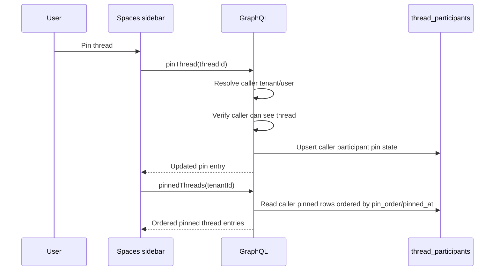

# feat: Store thread pins server-side

## Overview

Thread pins currently live only in the Spaces sidebar's browser `localStorage`, so desktop and web windows cannot share them. Move saved pins to server-side per-user thread state, then make Spaces hydrate, mutate, and reorder pins through GraphQL while keeping a one-time migration path for existing local pins.

---

## Problem Frame

Users expect pinned threads to follow their account across the desktop app, browser app, and additional windows. The current implementation stores pinned IDs under `thinkwork:spaces:pinned-threads:${tenantId}:${userId}` in `apps/spaces/src/components/shell/ChatSidebar.tsx`, which means each browser profile or desktop webview has a separate pin list. The pinned section also only renders threads present in the current recent-thread page, so old pinned threads can silently disappear from the sidebar.

---

## Requirements Trace

- R1. Pins must be persisted server-side per tenant user, not per local browser/webview.
- R2. Pinning, unpinning, and reordering in one client must be visible to other clients after data refresh.
- R3. Pinned threads must render even when they are outside the normal recent-thread query window.
- R4. Pin state must respect existing tenant, thread visibility, and participant access rules.
- R5. Existing localStorage pins should be migrated without overwriting newer server state.
- R6. The implementation must preserve existing unread/read behavior and thread grouping in the Spaces sidebar.

---

## Scope Boundaries

- Do not implement real-time cross-window push for pin changes in this plan; normal query refresh, cache invalidation, or later subscriptions are sufficient.
- Do not add tenant-wide or space-wide shared pins; pins are per user.
- Do not change artifact favorites or workspace file pinning behavior.
- Do not require mobile UI support in this slice, but keep GraphQL/codegen compatible with mobile/admin/CLI schema consumers.
- Do not store pins in `threads.metadata`; pin state is user-specific and belongs in user-thread state.

---

## Context & Research

### Relevant Code and Patterns

- `apps/spaces/src/components/shell/ChatSidebar.tsx` owns current pin UI, reorder state, localStorage helpers, and section grouping.
- `packages/database-pg/src/schema/thread-participants.ts` already stores per-user thread state such as `last_read_at`, making it the natural home for `pinned_at` and ordering metadata.
- `packages/api/src/graphql/resolvers/threads/updateThread.mutation.ts` already applies caller-scoped read state to `thread_participants` and falls back for legacy owner-only threads.
- `packages/api/src/graphql/resolvers/threads/access.ts` centralizes caller-visible thread predicates and should shape pin authorization.
- `packages/api/src/graphql/resolvers/threads/threadsPaged.query.ts` loads participant read state for a page of thread rows; pinned queries can follow a similar join/hydration pattern.
- `packages/database-pg/graphql/types/threads.graphql` is the canonical GraphQL source; derived schemas/codegen must be regenerated for consumers with codegen scripts.
- `apps/spaces/src/lib/graphql-queries.ts` is hand-authored, so Spaces needs explicit new pinned-thread operations rather than generated documents.

### Institutional Learnings

- No directly relevant `docs/solutions/` note was found for server-side thread pins. Existing thread participant read-state work is the closest local pattern.

### External References

- External research skipped: this is a repo-internal persistence and GraphQL contract change with strong local patterns.

---

## Key Technical Decisions

- Store pins on `thread_participants`: Pinning is per-user thread UI state, like `last_read_at`; storing it on `threads` would incorrectly make pins global.
- Use `pinned_at` plus `pin_order`: `pinned_at` is the durable pinned flag/audit timestamp; `pin_order` gives deterministic sidebar ordering without encoding order into client-local arrays.
- Add explicit pinned-thread GraphQL operations: A dedicated `pinnedThreads` query and pin/unpin/reorder mutations make the UI contract clear and avoid overloading generic `threadsPaged`.
- Ensure or reuse a user participant row when pinning: Legacy visible owner threads may not have participant rows. Pin mutations should verify caller access, then create the caller's participant row if needed so pin state has a server home.
- Treat server as source of truth after migration: localStorage should be read once to seed missing server pins, then stop driving UI state.

---

## Open Questions

### Resolved During Planning

- Where should pins live? `thread_participants`, because pins are per-user and the table already owns caller-specific thread read state.
- Should pinned threads come from the recent list? No. The sidebar should query pinned threads independently so older pins remain visible.
- Should desktop need separate changes? No direct desktop-specific change is expected because desktop hosts the Spaces frontend and will share the same GraphQL API.

### Deferred to Implementation

- Exact pin ordering representation: Use `pin_order` as the planned shape, but the implementation may choose a larger numeric rank type if the existing migration conventions make that cleaner.
- Exact mutation naming: The plan uses `pinThread`, `unpinThread`, and `reorderPinnedThreads` as contract names; implementers may adjust names to match GraphQL naming conventions if discovered during schema work.

---

## High-Level Technical Design

> *This illustrates the intended approach and is directional guidance for review, not implementation specification. The implementing agent should treat it as context, not code to reproduce.*

---

## Implementation Units

- U1. **Persist pin state in thread participants**

**Goal:** Add durable per-user pin fields and indexes to the thread participant model.

**Requirements:** R1, R2, R4

**Dependencies:** None

**Files:**
- Modify: `packages/database-pg/src/schema/thread-participants.ts`
- Create: `packages/database-pg/drizzle/0137_thread_participant_pins.sql`
- Create: `packages/database-pg/drizzle/0137_thread_participant_pins_rollback.sql`
- Test: `packages/database-pg/__tests__/spaces-schema.test.ts` or `packages/database-pg/__tests__/thread-participants-schema.test.ts`

**Approach:**
- Add nullable `pinned_at` and `pin_order` columns to `thread_participants`.
- Add a partial index for `(tenant_id, user_id, pin_order)` or equivalent where `participant_type = 'user'` and `pinned_at IS NOT NULL`.
- Keep pin fields nullable so existing participant rows and agent participants require no backfill.
- Include manual migration markers consistent with existing drift-reporter conventions.

**Patterns to follow:**
- `packages/database-pg/drizzle/0110_thread_participant_read_state.sql`
- `packages/database-pg/drizzle/0116_backfill_thread_participants_access.sql`
- `packages/database-pg/src/schema/thread-participants.ts`

**Test scenarios:**
- Happy path: schema metadata exposes nullable pin columns on `threadParticipants`.
- Happy path: migration declares `-- creates-column` markers for both new columns and a marker for the new index.
- Edge case: rollback drops the pin index and columns without touching `last_read_at` or participant identity constraints.

**Verification:**
- Database schema and drift checks recognize the new pin fields without altering existing participant uniqueness or read-state behavior.

---

- U2. **Expose pinned-thread GraphQL contract**

**Goal:** Add canonical GraphQL types, query, and mutations for server-backed pins.

**Requirements:** R1, R2, R3, R4

**Dependencies:** U1

**Files:**
- Modify: `packages/database-pg/graphql/types/threads.graphql`
- Modify: `packages/api/src/graphql/resolvers/threads/index.ts`
- Create: `packages/api/src/graphql/resolvers/threads/pinnedThreads.query.ts`
- Create: `packages/api/src/graphql/resolvers/threads/pinThread.mutation.ts`
- Create: `packages/api/src/graphql/resolvers/threads/unpinThread.mutation.ts`
- Create: `packages/api/src/graphql/resolvers/threads/reorderPinnedThreads.mutation.ts`
- Test: `packages/api/src/graphql/resolvers/threads/pinnedThreads.query.test.ts`
- Test: `packages/api/src/graphql/resolvers/threads/threadPins.mutation.test.ts`
- Test: `packages/api/src/__tests__/graphql-contract.test.ts`

**Approach:**
- Add a `PinnedThread` GraphQL type carrying `thread`, `pinnedAt`, and `pinOrder`.
- Add `pinnedThreads(tenantId: ID!, limit: Int): [PinnedThread!]!`.
- Add mutations to pin, unpin, and reorder caller pins.
- Resolve caller tenant/user with `resolveCallerTenantId` and `resolveCallerUserId`.
- Verify thread visibility using the same caller-visible predicate used by thread list queries before writing pin state.
- For legacy owner-visible threads without a participant row, create a user participant row before setting pin fields. Do not create rows for callers who fail visibility checks.
- Reorder only the caller's pinned thread IDs; reject or ignore IDs not pinned by the caller based on the resolver convention chosen during implementation.

**Patterns to follow:**
- `packages/api/src/graphql/resolvers/threads/updateThread.mutation.ts`
- `packages/api/src/graphql/resolvers/threads/access.ts`
- `packages/api/src/graphql/resolvers/threads/threadsPaged.query.ts`
- `packages/api/src/graphql/resolvers/threads/updateThread.mutation.test.ts`

**Test scenarios:**
- Happy path: `pinnedThreads` returns the caller's pinned rows ordered by `pin_order`, with thread fields hydrated.
- Happy path: `pinThread` sets `pinned_at` and appends an order after existing pins.
- Happy path: `unpinThread` clears `pinned_at` and removes the thread from subsequent `pinnedThreads` results.
- Happy path: `reorderPinnedThreads` updates order for the caller's pinned IDs.
- Edge case: pinning a visible legacy owner thread creates or reuses the caller participant row.
- Error path: pinning a cross-tenant or non-visible thread returns a not-found/forbidden GraphQL error and writes nothing.
- Error path: unauthenticated Cognito identity resolution failure returns an auth error.
- Integration: GraphQL contract generation includes the new type, query, and mutations without breaking existing thread operations.

**Verification:**
- API consumers can query and mutate pins through GraphQL, and server responses never expose another user's pins.

---

- U3. **Regenerate schema/codegen consumers**

**Goal:** Keep derived GraphQL artifacts and generated clients consistent after the canonical schema changes.

**Requirements:** R2, R4

**Dependencies:** U2

**Files:**
- Modify: `terraform/schema.graphql`
- Modify: `apps/cli/src/gql/`
- Modify: `apps/admin/src/gql/`
- Modify: `apps/mobile/lib/gql/`
- Modify: `packages/api/src/gql/` if present for generated API types
- Test: `packages/api/src/__tests__/graphql-contract.test.ts`

**Approach:**
- Regenerate the AppSync subscription schema from the canonical database GraphQL source.
- Regenerate codegen in each workspace consumer that has a `codegen` script, matching repository guidance.
- Confirm generated artifacts include the new contract but do not require Spaces to adopt codegen in this slice.

**Patterns to follow:**
- Repository `AGENTS.md` GraphQL schema workflow.
- Existing generated `gql` directories in `apps/cli`, `apps/admin`, and `apps/mobile`.

**Test scenarios:**
- Happy path: generated schema contains the new pinned-thread operations.
- Edge case: AppSync subscription schema generation does not accidentally expose unsupported query/mutation operations.

**Verification:**
- Generated files are updated wherever required and schema contract tests remain green.

---

- U4. **Move Spaces sidebar pins to server state**

**Goal:** Replace local-only pin state in the Spaces sidebar with GraphQL-backed pinned threads.

**Requirements:** R1, R2, R3, R5, R6

**Dependencies:** U2

**Files:**
- Modify: `apps/spaces/src/lib/graphql-queries.ts`
- Modify: `apps/spaces/src/components/shell/ChatSidebar.tsx`
- Test: `apps/spaces/src/components/shell/ChatSidebar.test.tsx`

**Approach:**
- Add hand-authored Spaces operations for `PinnedThreadsQuery`, `PinThreadMutation`, `UnpinThreadMutation`, and `ReorderPinnedThreadsMutation`.
- Load pinned threads independently from the recent threads query.
- Build `pinnedThreadIdSet` from server results and keep recent/space grouping logic filtering pinned IDs out of non-pinned sections.
- Route pin/unpin/reorder actions through GraphQL mutations and reexecute pinned/recent/search queries as needed.
- Keep optimistic UI optional; if used, ensure failed mutations revert or refetch and surface a toast.
- Preserve current drag-and-drop reorder UX, but persist the resulting ordered thread IDs via the reorder mutation.

**Patterns to follow:**
- Current pin UI and sortable pinned list in `apps/spaces/src/components/shell/ChatSidebar.tsx`.
- Existing `UpdateThreadMutation` read-state persistence in the same component.
- Existing urql `useQuery`/`useMutation` patterns in `apps/spaces/src/lib/graphql-queries.ts`.

**Test scenarios:**
- Happy path: sidebar renders pinned threads returned by `PinnedThreadsQuery` even when they are absent from recent thread results.
- Happy path: clicking pin calls `PinThreadMutation`, then the thread appears in the pinned section and disappears from Chats/Space sections.
- Happy path: clicking unpin calls `UnpinThreadMutation`, then the thread returns to its normal section.
- Happy path: dragging pinned rows calls `ReorderPinnedThreadsMutation` with the visible ordered IDs.
- Edge case: pinned query returns an archived/deleted missing thread entry; UI skips invalid rows without crashing.
- Error path: pin mutation failure keeps/refetches the previous server state and shows a user-visible error.
- Integration: search dialog groups use server-backed `pinnedThreadIdSet`, so pinned results are grouped consistently with the sidebar.

**Verification:**
- Pin state in one app window is reflected in another after refresh/refetch, and old pinned threads remain visible even outside the recent list.

---

- U5. **Migrate existing local pins safely**

**Goal:** Preserve users' existing local pins by seeding server state once without making localStorage authoritative.

**Requirements:** R5, R6

**Dependencies:** U4

**Files:**
- Modify: `apps/spaces/src/components/shell/ChatSidebar.tsx`
- Test: `apps/spaces/src/components/shell/ChatSidebar.test.tsx`

**Approach:**
- Read the existing localStorage key after tenant/user identity and server pinned results are available.
- If server has no pins, or if local contains IDs missing from server, append missing local IDs through the server reorder/pin flow.
- Mark migration complete with a versioned localStorage flag so the client does not repeatedly try to import stale IDs.
- After migration, render only server-backed pins; do not keep writing the old pin array as source of truth.
- Treat mutation failures as non-destructive: keep the local key so a later session can retry.

**Patterns to follow:**
- Existing `readPinnedThreadIds` and `threadPinsStorageKey` helpers in `ChatSidebar.tsx`.
- Existing defensive localStorage try/catch behavior in the same component.

**Test scenarios:**
- Happy path: local-only pins are imported into server mutations on first load and then rendered from server results.
- Edge case: server already has pins; local IDs not on the server are appended without reordering existing server pins.
- Edge case: localStorage contains duplicate or malformed IDs; only unique string IDs are considered.
- Error path: migration mutation failure does not clear local migration data and does not crash the sidebar.
- Integration: a migrated pin no longer disappears just because it is absent from `recentThreads`.

**Verification:**
- Existing users retain local pins after the deployment, and new sessions no longer depend on localStorage for pin display.

---

- U6. **Verify cross-surface behavior and rollout readiness**

**Goal:** Prove the server-backed pin flow works for web and desktop and document rollout expectations.

**Requirements:** R2, R3, R4, R6

**Dependencies:** U1, U2, U3, U4, U5

**Files:**
- Modify: `docs/plans/2026-05-28-002-feat-server-thread-pins-plan.md` only if execution uncovers plan corrections
- Test: `apps/spaces/src/components/shell/ChatSidebar.test.tsx`
- Test: `packages/api/src/graphql/resolvers/threads/pinnedThreads.query.test.ts`
- Test: `packages/api/src/graphql/resolvers/threads/threadPins.mutation.test.ts`

**Approach:**
- Verify with two browser contexts or desktop plus browser against the same deployed dev API after merge/deploy.
- Confirm pin, unpin, reorder, and migrated local pins round-trip through the server.
- Confirm the deployment path applies the manual migration before frontend code depends on the new GraphQL fields in production-like environments.

**Patterns to follow:**
- Recent Spaces desktop verification workflow used for thread rename and search dialog changes.
- Existing deploy pipeline conventions for GraphQL/schema changes.

**Test scenarios:**
- Integration: pin a thread in desktop, refresh web, and see the same thread in Pinned.
- Integration: reorder pins in web, refresh desktop, and see the same order.
- Integration: unpin in one window, refresh the other, and ensure the thread leaves Pinned.
- Error path: server denies pinning a thread the user cannot see; neither client shows a false pinned state after refetch.

**Verification:**
- Cross-window account-level persistence works after API deployment and frontend refresh.

---

## System-Wide Impact

- **Interaction graph:** Spaces sidebar actions will call new GraphQL pin mutations; pinned sidebar hydration will use a new query independent of recent threads.
- **Error propagation:** Pin mutation errors should surface as sidebar toasts and trigger a refetch/revert path rather than leaving optimistic false state.
- **State lifecycle risks:** LocalStorage migration can duplicate or reorder pins if not idempotent; use a versioned migration marker and server IDs as source of truth.
- **API surface parity:** Canonical GraphQL changes require derived schema/codegen updates across CLI, admin, mobile, and API consumers even though only Spaces uses the new operations immediately.
- **Integration coverage:** Unit tests can prove resolver and sidebar behavior, but desktop/web parity requires deployed-dev verification because both clients must hit the same GraphQL backend.
- **Unchanged invariants:** Thread visibility remains governed by tenant/user identity and caller-visible thread predicates. Artifact favorites and workspace file pins remain unrelated.

---

## Risks & Dependencies

| Risk | Mitigation |
|------|------------|
| Pinned mutations create participant rows for unauthorized users | Gate writes through caller tenant/user resolution and caller-visible thread checks before upsert. |
| Existing local pins are lost | Add a one-time localStorage import that appends missing IDs to server state and only marks complete after success. |
| Pinned threads outside recent results still disappear | Query pinned threads independently and render the pinned section from that query. |
| Reorder writes race between windows | Make latest reorder write win for the caller; refetch after mutation to settle UI. |
| GraphQL schema change breaks generated clients | Regenerate all required consumers and keep the new operations additive. |
| Manual migration drift | Include drift markers and rollback SQL consistent with existing hand-rolled migrations. |

---

## Documentation / Operational Notes

- Deploy order matters: database migration and API schema/resolvers must be deployed before clients rely on server pins.
- After deployment, verify with desktop and web logged into the same user account against the same stage.
- No user-facing documentation is required unless the team wants release notes for "pins now sync across windows."

---

## Sources & References

- Related code: `apps/spaces/src/components/shell/ChatSidebar.tsx`
- Related code: `packages/database-pg/src/schema/thread-participants.ts`
- Related code: `packages/api/src/graphql/resolvers/threads/updateThread.mutation.ts`
- Related code: `packages/api/src/graphql/resolvers/threads/access.ts`
- Related code: `packages/database-pg/graphql/types/threads.graphql`
