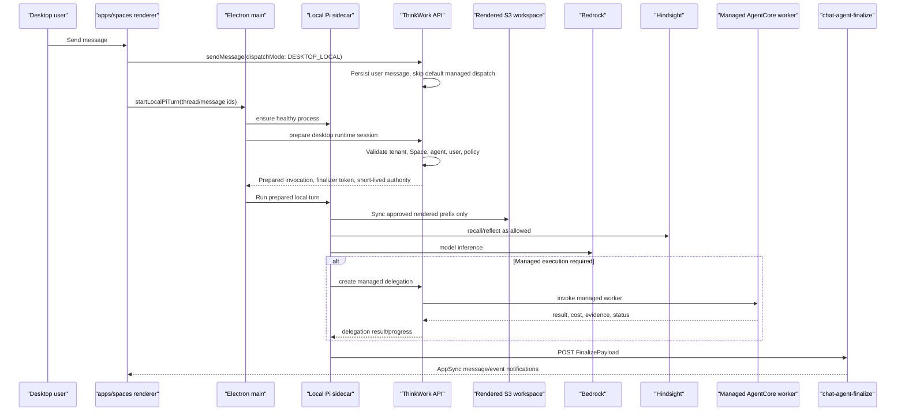

# feat: Add Desktop Local Pi sidecar

## Overview

Add a desktop-supervised local Pi sidecar to `apps/desktop` so signed-in desktop
users can run the active agent orchestration loop locally while preserving the
existing cloud-backed model, memory, thread persistence, and managed AgentCore
worker paths.

This plan treats the local sidecar as a new execution host for the existing Pi
runtime, not as a new product/runtime fork. Desktop Pi becomes the default
desktop conductor when healthy; managed AWS agents remain available as workers
for cloud isolation, hosted capabilities, long-running execution, parallelism,
or consequential work that should be visible to the user (see origin:
`docs/brainstorms/2026-05-28-desktop-local-pi-sidecar-requirements.md`).

## Problem Frame

Today the Electron app is mostly a secure shell around `apps/spaces`; user chat
turns still dispatch through the platform API into hosted runtimes. That keeps
desktop simple, but it does not establish the control-loop locality needed for a
future desktop-native product. The first local Pi version should move
orchestration into the Electron trust boundary without broadening local
permissions or trying to solve offline LLMs.

The main architectural tension is preserving the good cloud contracts that
already exist. `chat-agent-invoke` resolves tenant, agent, Space, user, policy,
workspace, runtime, and finalizer fields. `chat-agent-finalize` owns persisted
assistant messages, costs, tool evidence, notifications, and memory retain. The
sidecar should reuse those contracts rather than inventing a parallel desktop
message pipeline.

## Requirements Trace

- R1-R2. Desktop chat turns default to local Pi when the sidecar is healthy, and
  ordinary turns complete without managed AgentCore workers.
- R3. Local Pi consumes the same invocation context as managed Pi: tenant,
  agent, Space, user, thread, history, model, memory, MCP/tool policy, rendered
  workspace prefix, finalizer fields, and runtime metadata.
- R4, R20. V1 workspace access is limited to the rendered ThinkWork app
  workspace for the active Agent + Space + User tuple. No arbitrary local files,
  shell, clipboard, screenshots, browser control, or OS automation are added.
- R5, R19. V1 keeps Bedrock and Hindsight cloud-backed through explicit
  adapters and leaves a future model-provider seam for local/offline LLMs.
- R6-R11. Local Pi can delegate to managed AWS workers, passes shared context
  and tool policy, receives status/errors/costs/evidence/provenance, and
  preserves tenant isolation, Space membership, per-user OAuth/MCP scoping,
  auditability, and cost attribution.
- R12. Electron supervises the sidecar as a separate local process; the renderer
  keeps `contextIsolation` and does not gain Node access.
- R13. The UI surfaces local-vs-managed execution state only where user trust
  needs it: unavailable sidecar, fallback, approval/waiting states,
  long-running visible workers, and consequential managed delegation.
- R14-R15. Sidecar failure degrades to the existing managed runtime when safe
  and records redacted diagnostics for engineers.
- R16-R18. The existing AgentCore Pi runtime stays supported. Local and managed
  Pi share runtime logic and compatible response evidence.

**Origin actors:** A1 Desktop user, A2 Local Pi sidecar, A3 Electron shell, A4
Managed AWS agent, A5 Platform API/runtime, A6 Platform engineer.

**Origin flows:** F1 Desktop turn handled locally, F2 Local Pi delegates to a
managed AWS worker, F3 Delegation becomes visible when it matters, F4 Sidecar
failure falls back safely.

**Origin acceptance examples:** AE1 local Pi desktop turn, AE2 managed
delegation, AE3 visible consequential delegation, AE4 arbitrary local folder
refusal, AE5 sidecar crash fallback and diagnostics.

## Scope Boundaries

- No local/offline LLM inference in v1.
- No arbitrary local filesystem access, folder picker, shell commands,
  screenshots, clipboard access, local browser control, or OS automation in v1.
- No replacement or retirement of AgentCore-hosted Pi or Strands runtimes.
- No mobile support and no browser-tab local agent path inside plain
  `apps/spaces`; this depends on Electron.
- No requirement to locally reimplement managed Browser, Code Interpreter,
  hosted credentials, long-running workers, or parallel workers.
- No full workflow/project-management UI for delegation. V1 uses the smallest
  visible worker/job/thread state needed by the hybrid visibility rule.

## Context & Research

### Relevant Code and Patterns

- `apps/desktop/src/main/app.ts`, `apps/desktop/src/main/window.ts`,
  `apps/desktop/src/main/ipc-handlers.ts`, and
  `apps/desktop/src/preload/index.ts` already establish the Electron shell,
  secure window posture, typed preload bridge, OAuth, and IPC handler wiring.
- `packages/desktop-ipc/src/channels.ts`,
  `packages/desktop-ipc/src/schemas.ts`, and
  `packages/desktop-ipc/src/bridge.ts` are the right extension point for a
  typed desktop-only sidecar API.
- `apps/desktop/electron.vite.config.ts`, `apps/desktop/electron-builder.yml`,
  and `scripts/build-desktop.sh` define the bundle/package boundary. The
  sidecar needs to become an explicit packaged entry, not an implicit runtime
  import from the renderer.
- `packages/agentcore-pi/agent-container/src/server.ts` already contains
  `handleInvocation`, tool assembly, Bedrock/Pi runtime loop integration,
  Hindsight memory adapters, MCP bridge setup, finalizer callback handling, and
  response evidence. It currently mixes reusable runtime behavior with the
  AgentCore container/HTTP host.
- Pi's application embedding docs now point to
  `@earendil-works/pi-coding-agent` as the supported SDK package for custom
  web/desktop/mobile interfaces. Desktop sidecar units should embed Pi through
  this SDK surface (`createAgentSession` / `createAgentSessionRuntime`) and
  adapt ThinkWork workspace, model, tool, memory, and finalizer contracts into
  that surface instead of building a parallel agent runner.
- `packages/agentcore-pi/agent-container/src/runtime/bootstrap-workspace.ts`
  downloads and validates rendered S3 workspace prefixes. The desktop sidecar
  should reuse this behavior with a desktop cache root and stricter cleanup
  rules.
- `packages/agentcore-pi/agent-container/tests/server.test.ts` is the current
  safety net for Pi payload validation, workspace bootstrapping, finalizer, and
  tool evidence behavior.
- `packages/api/src/handlers/chat-agent-invoke.ts` is now a setup-and-dispatch
  Lambda. It resolves effective runtime config, creates the `thread_turns` row,
  builds the invoke payload with `finalize_callback_url`,
  `finalize_callback_secret`, and `thread_turn_id`, then dispatches the managed
  runtime in Event mode.
- `packages/api/src/lib/resolve-agent-runtime-config.ts`,
  `packages/api/src/lib/resolve-runtime-function-name.ts`, and
  `packages/api/src/graphql/utils.ts` centralize effective runtime resolution
  and dispatch patterns. Desktop local setup should call narrow API helpers here
  rather than duplicating policy decisions in Electron.
- `packages/api/src/handlers/chat-agent-finalize.ts`,
  `packages/api/src/lib/chat-finalize/types.ts`, and
  `packages/api/src/lib/chat-finalize/process-finalize.ts` define the persisted
  completion contract that local Pi should use for assistant messages, turn
  status, cost rows, tool evidence, notifications, and memory retain.
- `packages/api/src/graphql/resolvers/messages/sendMessage.mutation.ts`
  persists the user message and currently dispatches default agent turns via
  `dispatchDefaultAgentTurn`. Desktop-local routing must avoid creating a
  duplicate remote turn.
- `packages/database-pg/graphql/types/messages.graphql`,
  `apps/spaces/src/lib/graphql-queries.ts`, and
  `apps/spaces/src/lib/use-chat-appsync-transport.ts` are the GraphQL/client
  path where a desktop dispatch marker can be carried.
- `apps/spaces/src/lib/desktop-detection.ts`,
  `apps/spaces/src/lib/desktop-runtime.ts`, and
  `apps/spaces/src/components/DesktopApplicationHeader.tsx` already provide
  desktop-aware renderer integration points without exposing Node APIs.

### Institutional Learnings

- `docs/solutions/spikes/2026-05-21-electron-oauth-cold-start-validation.md`
  validates the Electron shell posture: register app/deep-link handlers early,
  keep safeStorage in the main process, and test packaged app behavior.
- `docs/solutions/workflow-issues/platform-agent-space-runtime-refactor-autopilot-sequencing-2026-05-23.md`
  reinforces staged runtime migrations with centralized effective-runtime
  resolution and explicit dogfood gates.
- `docs/solutions/best-practices/oauth-client-credentials-in-secrets-manager-2026-04-21.md`
  argues against leaking secrets through env/config surfaces. Desktop local Pi
  should use short-lived brokered authority, never long-lived service secrets.
- `docs/solutions/best-practices/bedrock-agentcore-sdk-version-drift-prefer-raw-boto3-2026-04-24.md`
  warns that managed-runtime wrappers drift. Keep Bedrock/Hindsight/delegation
  adapters narrow and testable behind runtime interfaces.
- `docs/solutions/workflow-issues/agentcore-runtime-no-auto-repull-requires-explicit-update-2026-04-24.md`
  is a reminder that deployed managed workers can be stale. Local sidecar
  diagnostics should make runtime version and delegation target visible.
- `docs/solutions/best-practices/service-endpoint-vs-widening-resolvecaller-auth-2026-04-21.md`
  favors narrow service endpoints over broadening shared GraphQL auth helpers.
  Desktop runtime prep and delegation should follow that shape.
- `docs/plans/2026-05-22-006-refactor-chat-agent-invoke-direct-callback-finalize-plan.md`
  established the finalizer callback pattern; local Pi should plug into it.
- `docs/plans/2026-05-23-004-feat-pi-browser-sandbox-parity-plan.md` keeps Pi
  policy API-owned and response evidence compatible with managed chat turns.

### External References

- Electron's security guidance recommends secure content, disabled Node
  integration for remote content, context isolation, renderer sandboxing,
  restrictive IPC, and not exposing Electron APIs to untrusted content:
  `https://www.electronjs.org/docs/latest/tutorial/security`.
- Electron `utilityProcess.fork` starts a Chromium-spawned child process with
  Node integration, supports `postMessage`, transferable message ports,
  stdout/stderr capture, lifecycle events, PID inspection, and graceful kill:
  `https://www.electronjs.org/docs/latest/api/utility-process`.
- AWS SDK for JavaScript v3 credential guidance recommends avoiding ambiguous
  credential sources and using short-term credentials where possible:
  `https://docs.aws.amazon.com/sdk-for-javascript/v3/developer-guide/setting-credentials-node.html`.
- AWS STS `AssumeRole` returns temporary credentials and supports session
  policies whose permissions are the intersection of the role policy and session
  policy:
  `https://docs.aws.amazon.com/STS/latest/APIReference/API_AssumeRole.html`.

## Key Technical Decisions

1. **Use an Electron-supervised sidecar process.** The first implementation
   should prefer `utilityProcess.fork` for lifecycle, structured messages,
   stdout/stderr, graceful termination, and no exposed localhost port. If
   implementation discovers a hard streaming/backpressure limitation, use a
   loopback HTTP fallback owned by the main process with random per-session auth
   and no renderer-visible port.

2. **Keep the renderer untrusted for runtime authority.** The renderer can ask
   the main process to start a local turn and subscribe to status. It never sees
   AWS credentials, Hindsight tokens, service API secrets, workspace cache
   paths, or Node primitives.

3. **Extract Pi runtime core from the AgentCore host.** Split the reusable
   invocation handler, adapters, tool assembly, workspace bootstrap, finalizer
   client, and evidence normalization into a shared TypeScript package consumed
   by both `packages/agentcore-pi` and `apps/desktop`. The current AgentCore
   container remains a host adapter around that core.

4. **Use backend-prepared local turns.** Add a narrow API endpoint that validates
   the signed-in Cognito user, Space membership, agent access, effective tool
   policy, runtime config, and rendered workspace tuple; creates the
   `thread_turns` row; returns a prepared local invocation envelope; and issues
   only short-lived sidecar authority.

5. **Preserve `chat-agent-finalize` as the only assistant-message completion
   path.** Local Pi posts the same `FinalizePayload` as managed Pi/Strands. The
   desktop app does not insert assistant messages directly.

6. **Suppress server-side managed dispatch only when desktop local takes
   responsibility.** Extend the `sendMessage` path with an explicit
   desktop-local dispatch marker so the user message persists normally but
   `dispatchDefaultAgentTurn` is skipped for that message. If local prep fails,
   the renderer/main process may request the existing managed fallback.

7. **Broker short-lived credentials; never ship static service secrets.** The
   prep endpoint should return either scoped temporary AWS credentials with a
   narrow session policy or a server-proxied model/memory adapter token. The
   preferred v1 path is temporary sidecar credentials for Bedrock/S3 plus
   short-lived Hindsight/finalizer tokens, all held in Electron main/sidecar
   memory and redacted from logs. The implementation must not store long-lived
   AWS or Hindsight credentials in `safeStorage`.

8. **Reuse rendered S3 workspaces with a desktop cache root.** The sidecar
   syncs only the API-approved rendered workspace prefix into an app-owned cache
   under Electron `userData`, partitioned by stage, tenant, agent, Space, user,
   and turn/cache version. Prefix validation stays mandatory.

9. **Treat managed AgentCore agents as delegated workers.** Local Pi owns the
   user-facing turn and can call a managed-delegation API/tool when it needs
   managed execution. Routine delegation can be summarized invisibly; expensive,
   risky, long-running, security-sensitive, destructive, or steerable work must
   create visible worker/job/thread state.

10. **Design the model adapter for future local providers now, but keep Bedrock
    as v1.** Runtime core should depend on a `ModelProvider` interface so a
    future local LLM can be added without changing desktop IPC, workspace sync,
    or finalization. The v1 implementation wires Bedrock only.

## Open Questions

### Resolved During Planning

- **Sidecar transport:** prefer Electron `utilityProcess.fork`; keep loopback
  HTTP as a contingency only if utility-process messaging blocks required
  streaming behavior.
- **Runtime split:** create a shared Pi runtime core consumed by AgentCore and
  desktop hosts rather than importing the AgentCore container file directly into
  Electron.
- **Pi SDK embedding:** desktop execution should use
  `@earendil-works/pi-coding-agent` as the application SDK. The shared runtime
  core owns ThinkWork-specific contracts and adapters; the Electron sidecar
  should prefer SDK session APIs over direct low-level loop construction.
- **Workspace strategy:** reuse rendered S3 prefix bootstrap with a desktop
  cache root and tuple-based partitioning. No arbitrary local paths in v1.
- **Credential strategy:** use a backend broker for short-lived sidecar
  authority. Do not expose static AWS/service secrets to the renderer.
- **Message dispatch ownership:** add an explicit desktop-local dispatch marker
  so `sendMessage` persists the user message without also dispatching the
  managed default turn.
- **Delegation contract:** local Pi calls a narrow managed-delegation API/tool
  that wraps existing AgentCore invocation plumbing and returns status,
  provenance, cost, and visibility metadata.

### Deferred to Implementation

- Exact AWS credential mechanism: prefer STS `AssumeRole` with a session policy
  scoped to Bedrock model invocation and the approved rendered S3 prefix; fall
  back to a server-proxied Bedrock/S3 adapter only if desktop client-side AWS
  credentials are rejected during security review.
- Exact Hindsight sidecar token shape and TTL. It should be short-lived,
  tenant/user scoped, and unusable by the renderer.
- Exact `SendMessageInput` field name. The plan uses `dispatchMode` below, but
  implementation may choose a clearer enum/name if it matches schema style.
- Exact visible delegation UI substrate. Prefer existing thread/job/task
  surfaces if one can represent visible worker progress without a new dashboard.
- Exact cancellation semantics for hidden delegated subtasks. V1 can start with
  visible-worker cancellation and make hidden subtasks best-effort cancelable if
  existing AgentCore paths support it.
- Exact `@earendil-works/pi-coding-agent` supply-chain baseline treatment. When
  the desktop package adds the SDK dependency, update the Pi supply-chain
  baseline/documentation in the same PR if it becomes part of the trusted local
  sidecar critical path.

## Output Structure

```text
packages/pi-runtime-core/
  package.json
  src/index.ts
  src/invocation.ts
  src/runtime-host.ts
  src/model-provider.ts
  src/finalize-client.ts
  src/workspace/bootstrap-workspace.ts
  src/tools/
  test/

apps/desktop/src/main/
  pi-sidecar-controller.ts
  pi-sidecar-session.ts

apps/desktop/src/sidecar/
  index.ts
  local-turn-runner.ts
  workspace-cache.ts
  managed-delegation-client.ts
  redacted-logger.ts

packages/api/src/handlers/
  desktop-runtime-session.ts
  managed-delegation.ts

packages/api/src/lib/desktop-runtime/
  prepare-local-turn.ts
  sidecar-credentials.ts
  dispatch-mode.ts
```

The implementing agent can adjust filenames to fit existing conventions, but
the important split is stable: runtime core is host-agnostic, Electron main
supervises the sidecar, the renderer sees only typed bridge calls, and API
handlers own identity/policy/workspace/finalizer preparation.

## High-Level Technical Design

This diagram is directional guidance for review, not implementation
specification.



## Implementation Units

### U1. Extract a host-agnostic Pi runtime core

**Goal:** make the reusable Pi invocation loop consumable from both AgentCore
and desktop without changing managed Pi behavior.

**Files:**

- `packages/pi-runtime-core/package.json` (new)
- `packages/pi-runtime-core/src/index.ts` (new)
- `packages/pi-runtime-core/src/invocation.ts` (new)
- `packages/pi-runtime-core/src/runtime-host.ts` (new)
- `packages/pi-runtime-core/src/model-provider.ts` (new)
- `packages/pi-runtime-core/src/finalize-client.ts` (new)
- `packages/pi-runtime-core/src/workspace/bootstrap-workspace.ts` (new or moved)
- `packages/pi-runtime-core/src/tools/` (new or moved focused modules)
- `packages/pi-runtime-core/test/invocation.test.ts` (new)
- `packages/agentcore-pi/agent-container/src/server.ts` (modify)
- `packages/agentcore-pi/agent-container/tests/server.test.ts` (modify)
- `pnpm-workspace.yaml` (modify if package is added)
- `tsconfig.json` / package-level references as needed

**Approach:**

- Move the reusable parts of `handleInvocation` into runtime core: payload
  normalization, history normalization, tool assembly, model invocation,
  Hindsight/MCP adapters, workspace bootstrap contract, evidence normalization,
  cleanup handling, and finalizer POST.
- Keep AgentCore-specific HTTP/Lambda parsing, container env resolution, and
  AgentCore host boot inside `packages/agentcore-pi/agent-container`.
- Introduce host dependencies explicitly: `ModelProvider`, `MemoryProvider`,
  `WorkspaceProvider`, `DelegationProvider`, `FinalizeClient`, logger, clock,
  and runtime metadata.
- Preserve managed Pi response shape and existing test expectations before
  changing desktop behavior.

**Patterns to follow:**

- Existing dependency-injection style in
  `packages/agentcore-pi/agent-container/tests/server.test.ts`.
- Finalizer payload compatibility from `packages/api/src/lib/chat-finalize/types.ts`.
- Narrow adapter isolation from recent Pi browser/sandbox parity planning.

**Test scenarios:**

- A valid invocation returns the same message/evidence fields through the new
  core as the old AgentCore host path.
- Missing required tenant/agent/thread fields still fails with the same status
  and error semantics.
- Finalizer fields present cause a `FinalizePayload` POST; absent fields keep
  the direct response behavior for direct/eval callers.
- Cleanup callbacks run on success and failure.
- AgentCore host tests prove `server.ts` still accepts the existing HTTP/Lambda
  payload shapes.

**Verification:**

- `pnpm --filter @thinkwork/pi-runtime-core test`
- `pnpm --filter @thinkwork/agentcore-pi test`
- `pnpm -r --if-present typecheck` for affected packages

### U2. Add a desktop runtime session preparation API

**Goal:** give Electron main a narrow, authenticated way to prepare a local Pi
turn with platform-authoritative identity, policy, workspace, finalizer, and
short-lived authority.

**Files:**

- `packages/api/src/handlers/desktop-runtime-session.ts` (new)
- `packages/api/src/handlers/desktop-runtime-session.test.ts` (new)
- `packages/api/src/lib/desktop-runtime/prepare-local-turn.ts` (new)
- `packages/api/src/lib/desktop-runtime/sidecar-credentials.ts` (new)
- `packages/api/src/lib/desktop-runtime/dispatch-mode.ts` (new)
- `packages/pi-runtime-core/src/desktop-session.ts` (new or modify)
- `packages/api/src/lib/resolve-agent-runtime-config.ts` (reuse or minor modify)
- `packages/api/src/handlers/chat-agent-invoke.ts` (minor extraction only if needed)
- `scripts/build-lambdas.sh` (modify)
- `terraform/modules/app/lambda-api/handlers.tf` and API Gateway route wiring
  (modify)

**Approach:**

- Add `POST /api/desktop/runtime-session` or equivalent narrow route protected
  by the signed-in user's Cognito token, not by a renderer-visible service
  secret.
- Validate the caller's tenant, Space membership, thread access, and agent
  access using existing GraphQL/API helpers.
- Reuse `resolveAgentRuntimeConfig` and the same workspace tuple rendering used
  by `chat-agent-invoke`.
- Create the `thread_turns` row and return `thread_turn_id`,
  `finalize_callback_url`, a short-lived `finalize_callback_secret` or scoped
  callback token, rendered workspace prefix, model/memory/tool policy fields,
  a `pi_sdk` embedding contract, and sidecar credentials.
- Keep credentials in the response scoped and short-lived. Prefer STS
  credentials with session policy for approved S3 prefix and Bedrock model
  calls; include source identity/session tags for audit.
- Log only redacted credential/session metadata.

**Patterns to follow:**

- `packages/api/src/handlers/chat-agent-invoke.ts` setup payload fields.
- `packages/api/src/lib/resolve-agent-runtime-config.ts` effective runtime
  resolution.
- Narrow endpoint guidance from
  `docs/solutions/best-practices/service-endpoint-vs-widening-resolvecaller-auth-2026-04-21.md`.

**Test scenarios:**

- Signed-in desktop caller with Space access receives a prepared invocation
  envelope and a created `thread_turns` id.
- Caller without Space/thread access is denied before any credentials or turn
  row are issued.
- Prepared envelope includes the same finalizer fields expected by
  `chat-agent-finalize`.
- Rendered workspace prefix is tenant/agent scoped and rejects malformed or
  cross-tenant prefixes.
- Credential broker emits short TTL/scoped metadata and never returns static
  service secrets.
- Hindsight disabled or unavailable returns a memory adapter state the sidecar
  can handle without failing the entire turn.

**Verification:**

- `pnpm --filter @thinkwork/api test -- src/handlers/desktop-runtime-session.test.ts`
- `pnpm --filter @thinkwork/api typecheck`
- Deployed dev smoke after implementation: prepare a session for a known
  desktop thread and confirm the returned prefix/turn/finalizer fields match
  the existing managed invoke payload shape.

### U3. Add desktop-local dispatch ownership to `sendMessage`

**Goal:** persist the user's message through the normal GraphQL mutation while
preventing duplicate remote agent dispatch when Electron will run the local
sidecar.

**Files:**

- `packages/database-pg/graphql/types/messages.graphql` (modify)
- `packages/api/src/graphql/resolvers/messages/sendMessage.mutation.ts` (modify)
- `packages/api/src/graphql/resolvers/messages/sendMessage.mutation.test.ts`
  or existing resolver tests (modify/add)
- `apps/spaces/src/lib/graphql-queries.ts` (modify)
- `apps/spaces/src/lib/use-chat-appsync-transport.ts` (modify)
- `apps/spaces/src/lib/use-chat-appsync-transport.test.ts` (modify)
- Codegen outputs for `packages/api`, `apps/spaces`, `apps/admin`,
  `apps/mobile`, and `apps/cli` if affected by schema generation.

**Approach:**

- Add an optional enum/string field such as `dispatchMode` to
  `SendMessageInput`, with default behavior preserving current managed dispatch.
- In `sendMessage.mutation.ts`, when `dispatchMode` is desktop-local, persist
  the message, mentions, participants, notifications, and metadata normally, but
  skip `dispatchDefaultAgentTurn` for the default agent path.
- Keep explicit human mentions and non-default dispatch semantics unchanged
  unless implementation determines desktop-local must suppress those too. If
  mentions would create managed work, document and test that behavior.
- Update `apps/spaces` transport to set the marker only when running inside
  trusted desktop and the bridge reports local Pi is available or starting.
- If local prep/sidecar startup fails after message persistence, call an
  explicit fallback endpoint/action to dispatch the managed turn rather than
  resubmitting the user message.

**Patterns to follow:**

- Existing `SendMessageInput.metadata` additive-shape approach.
- `apps/spaces/src/lib/desktop-runtime.ts` and `desktop-detection.ts` for
  desktop-only behavior.
- Existing resolver tests that assert default-agent dispatch ordering.

**Test scenarios:**

- Existing browser/mobile sendMessage calls continue to dispatch the managed
  default agent.
- Desktop-local sendMessage persists exactly one user message and does not call
  `dispatchDefaultAgentTurn`.
- Desktop-local sendMessage still updates participants/read state/notifications
  consistently with the normal path.
- A local-prep failure can trigger managed fallback without creating a duplicate
  user message.
- Codegen consumers compile after the schema addition.

**Verification:**

- `pnpm schema:build`
- `pnpm --filter @thinkwork/api codegen`
- `pnpm --filter @thinkwork/spaces codegen`
- `pnpm --filter @thinkwork/admin codegen`
- `pnpm --filter @thinkwork/mobile codegen`
- `pnpm --filter @thinkwork/cli codegen`
- `pnpm --filter @thinkwork/api test -- src/graphql/resolvers/messages`
- `pnpm --filter @thinkwork/spaces test -- src/lib/use-chat-appsync-transport.test.ts`

### U4. Add Electron sidecar supervision and typed IPC

**Goal:** package and supervise a local Pi process from Electron main, expose a
minimal typed bridge to the renderer, and keep runtime authority outside the
renderer.

**Files:**

- `apps/desktop/src/main/pi-sidecar-controller.ts` (new)
- `apps/desktop/src/main/pi-sidecar-session.ts` (new)
- `apps/desktop/src/main/ipc-handlers.ts` (modify)
- `apps/desktop/src/main/app.ts` (modify)
- `apps/desktop/src/preload/index.ts` (modify)
- `apps/desktop/src/sidecar/index.ts` (new)
- `packages/desktop-ipc/src/channels.ts` (modify)
- `packages/desktop-ipc/src/schemas.ts` (modify)
- `packages/desktop-ipc/src/bridge.ts` (modify)
- `packages/desktop-ipc/test/schemas.test.ts` (modify)
- `apps/desktop/test/main/pi-sidecar-controller.test.ts` (new)
- `apps/desktop/electron.vite.config.ts` (modify)
- `apps/desktop/electron-builder.yml` (modify)
- `scripts/build-desktop.sh` (modify)

**Approach:**

- Add a sidecar entrypoint built separately from main/preload/renderer and
  packaged with the desktop app.
- Implement a controller in main that starts the sidecar after app readiness,
  tracks PID/version/health, captures stdout/stderr through a redacting logger,
  restarts with bounded backoff, and kills the process during app shutdown.
- Extend `@thinkwork/desktop-ipc` with typed methods/events such as
  `pi.status`, `pi.startTurn`, `pi.cancelTurn`, and `pi.logs.openDiagnostics`
  or equivalent.
- Validate every IPC payload with zod schemas in `packages/desktop-ipc`; do not
  expose arbitrary method names or transport details.
- Store sidecar runtime state in main memory. The preload bridge forwards only
  status and command results the renderer needs.

**Patterns to follow:**

- Existing `registerDesktopIpcHandlers` organization in
  `apps/desktop/src/main/ipc-handlers.ts`.
- Existing `safeStorage` and OAuth main-process ownership in `apps/desktop`.
- Electron security recommendations for context isolation, IPC sender
  validation, and no broad Electron API exposure.

**Test scenarios:**

- Main starts sidecar and reports `starting -> healthy` status.
- Sidecar crash reports redacted diagnostics and bounded restart state.
- Renderer bridge can request a local turn only through the typed API and cannot
  access credentials, cache paths, or process handles.
- Invalid IPC payloads are rejected before reaching the controller.
- App shutdown kills or reaps the sidecar.
- Packaged build contains the sidecar entry and can resolve it at runtime.

**Verification:**

- `pnpm --filter @thinkwork/desktop-ipc test`
- `pnpm --filter @thinkwork/desktop test -- test/main/pi-sidecar-controller.test.ts`
- `pnpm --filter @thinkwork/desktop typecheck`
- `bash scripts/build-desktop.sh` or the repo's desktop package build path

### U5. Execute local desktop turns in the sidecar

**Goal:** run a prepared desktop invocation through the Pi application SDK, sync
only the approved rendered workspace, call Bedrock/Hindsight, and finalize
through the platform.

**Files:**

- `apps/desktop/src/sidecar/local-turn-runner.ts` (new)
- `apps/desktop/src/sidecar/workspace-cache.ts` (new)
- `apps/desktop/src/sidecar/runtime-adapters/bedrock.ts` (new)
- `apps/desktop/src/sidecar/runtime-adapters/hindsight.ts` (new)
- `apps/desktop/src/sidecar/redacted-logger.ts` (new)
- `apps/desktop/package.json` (modify; add
  `@earendil-works/pi-coding-agent` with an explicit version pin)
- `apps/desktop/test/sidecar/local-turn-runner.test.ts` (new)
- `apps/desktop/test/sidecar/workspace-cache.test.ts` (new)
- `packages/pi-runtime-core/src/model-provider.ts` (modify as needed)
- `packages/pi-runtime-core/src/workspace/bootstrap-workspace.ts` (modify as
  needed)

**Approach:**

- Sidecar receives only a prepared invocation envelope from Electron main; it
  does not self-resolve tenant/Space/agent policy.
- Use Pi's SDK session API (`createAgentSession`, and
  `createAgentSessionRuntime` if session replacement/cwd-bound state is needed)
  as the orchestration substrate. Configure SDK session state from the prepared
  invocation with in-memory session management, runtime API-key overrides, and a
  ThinkWork resource loader over the rendered workspace cache.
- Build runtime core providers around the short-lived session authority:
  Bedrock model calls, Hindsight memory calls, S3 workspace sync, finalizer
  POST, and managed-delegation calls.
- Cache workspace contents under Electron `userData` with tuple-based
  partitioning. Clean stale files when the rendered prefix changes and evict old
  turn/cache directories by count/age/size.
- For v1, reject attempts to use non-rendered local paths with a structured tool
  result that explains the supported app workspace boundary.
- Include `runtime_host: "desktop-local"` or equivalent metadata in the
  finalizer payload while keeping existing `runtime: "pi"` evidence compatible.
- Ensure fatal local errors produce a finalizer failure payload when a
  `thread_turn_id` exists; otherwise report a preflight failure to Electron main
  for managed fallback.

**Patterns to follow:**

- Workspace prefix validation in
  `packages/agentcore-pi/agent-container/src/runtime/bootstrap-workspace.ts`.
- Finalizer handling in `packages/agentcore-pi/agent-container/src/server.ts`
  and `packages/api/src/lib/chat-finalize/types.ts`.
- Hindsight async/tool cleanup expectations from existing Pi runtime tests.

**Test scenarios:**

- A prepared local turn runs through mocked Bedrock/Hindsight providers and
  posts a successful `FinalizePayload`.
- Sidecar downloads only keys under the approved rendered prefix and rejects a
  prefix outside the tenant/agent rendered path.
- Cache cleanup removes stale files when S3 state changes and does not cross
  tenant/user cache partitions.
- Missing/expired credentials fail before model invocation and report fallback
  eligibility to main.
- Arbitrary local folder requests do not read local files and produce a bounded
  refusal/tool result.
- Runtime metadata marks the host as desktop-local without breaking existing
  response evidence consumers.

**Verification:**

- `pnpm --filter @thinkwork/desktop test -- test/sidecar`
- `pnpm --filter @thinkwork/pi-runtime-core test`
- Manual packaged smoke on dev: send one simple desktop message, confirm no
  AgentCore-hosted Pi dispatch, assistant response persists, and turn metadata
  shows local Pi host.

### U6. Add managed delegation from local Pi to AgentCore workers

**Goal:** let local Pi remain the conductor while asking managed AWS agents to
perform work that needs hosted execution.

**Files:**

- `packages/pi-runtime-core/src/delegation.ts` (new)
- `apps/desktop/src/sidecar/managed-delegation-client.ts` (new)
- `packages/api/src/handlers/managed-delegation.ts` (new)
- `packages/api/src/handlers/managed-delegation.test.ts` (new)
- `packages/api/src/lib/desktop-runtime/managed-delegation.ts` (new)
- `packages/api/src/handlers/chat-agent-invoke.ts` (reuse/extract dispatch
  helper if needed)
- `packages/api/src/lib/mentions/default-agent-routing.ts` (reference or reuse
  where applicable)
- Optional database/GraphQL files only if visible worker state needs a new
  persisted field rather than existing thread/job/task structures.

**Approach:**

- Add a runtime-core `DelegationProvider` that local Pi can call as a tool or
  internal orchestrator capability.
- The API endpoint validates the sidecar session, tenant, Space, thread, parent
  turn, tool policy, and delegation visibility.
- Hidden delegations return a bounded result payload to local Pi with status,
  errors, tool evidence, costs, and provenance for synthesis into the current
  turn.
- Visible delegations create or attach to existing worker/job/thread surfaces
  and stream progress through existing notification/subscription mechanisms.
- Reuse `chat-agent-invoke` setup and AgentCore Event-mode dispatch for the
  managed worker. Do not create a separate managed-runtime launcher unless
  extraction proves necessary.
- Attach cost attribution to the parent local turn and delegated worker ids.

**Patterns to follow:**

- Existing chat-agent-invoke Event-mode dispatch and finalizer fields.
- Existing thread/job/task UI if it can represent visible worker progress.
- Hybrid visibility rules from the origin document.

**Test scenarios:**

- Local Pi requests a hidden managed delegation and receives a summarized result
  with costs/evidence/provenance.
- Expensive/long-running/risky delegation requests are forced into visible mode
  by server policy even if the sidecar asks for hidden mode.
- Delegation inherits tenant, Space, user, rendered workspace, and narrowed tool
  policy from the parent turn.
- Unauthorized sidecar session cannot delegate across tenant/thread/Space.
- Managed worker failures return structured errors that local Pi can include in
  final synthesis or finalizer failure.
- Visible delegation emits a user-visible status event without cluttering
  routine hidden delegation.

**Verification:**

- `pnpm --filter @thinkwork/api test -- src/handlers/managed-delegation.test.ts`
- `pnpm --filter @thinkwork/pi-runtime-core test`
- Deployed dev smoke: desktop local Pi delegates one task to managed Pi/Strands
  and final response includes delegated evidence/cost provenance.

### U7. Surface local runtime and visible delegation state in `apps/spaces`

**Goal:** make desktop users aware of local runtime health, fallback, and
consequential managed delegation without turning chat into an operations
dashboard.

**Files:**

- `apps/spaces/src/lib/desktop-runtime.ts` (modify)
- `apps/spaces/src/lib/desktop-detection.ts` (modify if needed)
- `apps/spaces/src/components/DesktopApplicationHeader.tsx` (modify)
- `apps/spaces/src/components/DesktopApplicationHeader.test.tsx` (modify)
- `apps/spaces/src/components/workbench/SpacesThreadDetailRoute.tsx` (modify)
- `apps/spaces/src/components/workbench/SpacesThreadDetailRoute.test.tsx`
  (modify)
- `apps/spaces/src/components/workbench/TaskDashboard.tsx` or existing task
  components (modify only if visible delegation uses them)
- `apps/spaces/src/lib/use-chat-appsync-transport.ts` (modify as part of U3/U7
  integration)

**Approach:**

- Show compact desktop-local status in existing desktop chrome/header: healthy,
  starting, unavailable, fallback-to-managed, and local turn running.
- In the thread view, surface visible managed delegation as an existing
  task/job/thread event row when possible. Routine hidden delegation should only
  appear as normal evidence in the assistant response.
- Add fallback affordance when local sidecar fails after message persistence:
  "run in cloud" or an automatic managed fallback depending on the server's
  safety/fallback response.
- Avoid exposing low-level process details, credentials, S3 paths, or raw logs
  in user-facing UI. Diagnostics can open a desktop-owned redacted log view.

**Patterns to follow:**

- Existing desktop header tests and desktop bridge abstractions.
- Current task/thread event components for long-running work.
- Existing design density in `apps/spaces` operational surfaces.

**Test scenarios:**

- Healthy sidecar produces local-runtime status without changing browser/mobile
  UI.
- Sidecar unavailable causes fallback status and no desktop-local dispatch
  marker.
- A visible managed delegation renders progress/status in the thread surface.
- Hidden delegation does not create extra UI chrome beyond assistant evidence.
- Fallback action dispatches the managed path once and does not duplicate user
  messages.

**Verification:**

- `pnpm --filter @thinkwork/spaces test -- src/components/DesktopApplicationHeader.test.tsx`
- `pnpm --filter @thinkwork/spaces test -- src/components/workbench/SpacesThreadDetailRoute.test.tsx`
- Browser/Electron manual smoke after desktop build: healthy, crash/fallback,
  and visible delegation states.

### U8. Add diagnostics, redaction, packaging, and rollout gates

**Goal:** make the local sidecar debuggable and shippable without leaking
secrets or destabilizing existing managed runtime behavior.

**Files:**

- `apps/desktop/src/sidecar/redacted-logger.ts` (new or extend from U5)
- `apps/desktop/src/main/pi-sidecar-diagnostics.ts` (new)
- `apps/desktop/test/main/pi-sidecar-diagnostics.test.ts` (new)
- `apps/desktop/README.md` (modify)
- `docs/runbooks/desktop-local-pi-sidecar.md` (new)
- `packages/api/src/handlers/desktop-runtime-session.test.ts` (extend)
- `packages/api/src/handlers/managed-delegation.test.ts` (extend)
- `scripts/build-desktop.sh` (verify sidecar package)
- Optional `packages/api/scripts/desktop-local-pi-smoke.ts` (new)

**Approach:**

- Add a redaction helper shared by main and sidecar logs for AWS keys, session
  tokens, Hindsight tokens, finalizer secrets, S3 signed material, OAuth tokens,
  and user message bodies where logs do not need content.
- Keep local logs bounded by size/age and located under app-owned diagnostics,
  not workspace cache directories.
- Include runtime version, sidecar build hash, host type, stage, tenant slug/id
  hash, agent slug/id hash, crash reason, restart count, and delegation decision
  summaries.
- Add a desktop-local Pi feature flag or stage config gate so dev/dogfood can
  enable it before broad release.
- Document local smoke steps, known fallback behavior, and where redacted logs
  live.

**Patterns to follow:**

- Existing desktop update/telemetry diagnostics style.
- Secrets hygiene from prior OAuth and service-endpoint solution docs.
- Existing smoke-script patterns under `packages/api/scripts`.

**Test scenarios:**

- Redactor removes all credential/token patterns from synthetic logs.
- Diagnostics expose lifecycle/version/status without raw secrets or message
  bodies.
- Feature flag disabled means desktop uses existing managed dispatch.
- Packaged app contains sidecar files and can start them from the installed
  location.
- Managed runtime path remains unchanged for browser, mobile, and disabled
  desktop-local configurations.

**Verification:**

- `pnpm --filter @thinkwork/desktop test -- test/main/pi-sidecar-diagnostics.test.ts`
- `pnpm --filter @thinkwork/desktop typecheck`
- `pnpm -r --if-present test` for touched packages
- Packaged desktop smoke on dev with feature flag on and off

## Sequencing

1. **Runtime core extraction first.** U1 should land with no desktop behavior
   enabled and no managed Pi regression. This is the riskiest refactor and
   deserves focused review.
2. **Backend prep and dispatch ownership second.** U2 and U3 establish safe
   server contracts before Electron can run a local turn.
3. **Desktop process and local execution third.** U4 and U5 can be developed
   behind a feature flag once the API can prepare and finalize local turns.
4. **Delegation fourth.** U6 builds managed worker delegation after simple
   local turns are end-to-end.
5. **UI and rollout polish last.** U7 and U8 make the feature trustworthy and
   supportable for dogfood.

The minimal first dogfood slice is U1-U5 plus the U8 feature flag/logging
subset: one desktop message runs through local Pi, reads the rendered app
workspace, calls Bedrock/Hindsight, posts the finalizer, and falls back to
managed runtime if sidecar startup fails.

## System-Wide Impact

- **Desktop:** gains a supervised Node sidecar process and new IPC channels.
  Renderer security posture should remain unchanged.
- **API:** gains desktop runtime prep, possibly managed delegation endpoints,
  and a `sendMessage` dispatch marker. Existing managed paths remain default
  outside desktop.
- **GraphQL/codegen:** `SendMessageInput` likely changes; all consumers with
  codegen scripts must regenerate.
- **Runtime packages:** Pi runtime code becomes shared between AgentCore and
  desktop. This should reduce drift but increases package-boundary discipline.
- **Persistence:** no new assistant-message path. `chat-agent-finalize` remains
  authoritative. New columns/tables should be avoided unless visible delegation
  cannot use existing thread/job/task structures.
- **Security:** desktop receives short-lived authority for Bedrock/S3/Hindsight
  in main/sidecar memory. This requires careful redaction, TTL, session policy,
  and no renderer exposure.
- **Cost/observability:** local orchestration should reduce hosted control-loop
  spend for ordinary turns, but Bedrock/Hindsight and delegated workers remain
  billable. Cost attribution must include local parent turn and managed worker
  child ids.

## Risks & Mitigations

| Risk                                                                     | Mitigation                                                                                                                                                                                    |
| ------------------------------------------------------------------------ | --------------------------------------------------------------------------------------------------------------------------------------------------------------------------------------------- |
| Runtime extraction regresses managed Pi                                  | Start with U1 only, preserve existing server tests, add parity tests around response/finalizer shape.                                                                                         |
| Desktop and server both dispatch an agent turn                           | Add explicit `dispatchMode` tests and a fallback path that dispatches managed work without resubmitting the message.                                                                          |
| Renderer gains access to credentials or process power                    | Keep all credentials in main/sidecar memory, validate all IPC with schemas, and never expose Node/process/cache paths through preload.                                                        |
| Short-lived AWS credentials are too broad                                | Use STS session policies scoped to approved S3 prefix and Bedrock actions, with source identity/session tags; consider server-proxied adapters if review rejects client-side AWS credentials. |
| Sidecar cache leaks cross-tenant/user workspace data on shared machines  | Partition by stage/tenant/agent/Space/user, validate prefixes, clean stale files, and keep cache under app-owned userData.                                                                    |
| Local failure leaves a persisted user message with no assistant response | If a `thread_turn_id` exists, post failure finalize; otherwise offer/trigger managed fallback exactly once.                                                                                   |
| Managed delegation becomes invisible when user agency is needed          | Enforce visibility thresholds server-side, not only in sidecar prompts.                                                                                                                       |
| Packaged Electron build cannot resolve sidecar bundle                    | Add build/package tests and packaged smoke before dogfood.                                                                                                                                    |

## Rollout Gates

- Feature flag disabled by default outside dev/dogfood.
- U1 managed Pi parity tests pass before any desktop code depends on runtime
  core.
- Desktop-local prep endpoint deployed and smoke-tested with a real Cognito
  desktop session before sidecar execution is enabled.
- First dev dogfood proves AE1 and AE5: simple local turn and sidecar crash
  fallback/diagnostics.
- Second dev dogfood proves AE2 and AE3: managed delegation hidden and visible
  paths with costs/evidence.
- Security review of credential broker and redaction before enabling beyond
  internal dogfood.

## Command Reference

Use targeted commands during implementation; broaden only when the touched
surface grows.

```bash
pnpm --filter @thinkwork/pi-runtime-core test
pnpm --filter @thinkwork/agentcore-pi test
pnpm --filter @thinkwork/api test -- src/handlers/desktop-runtime-session.test.ts
pnpm --filter @thinkwork/api test -- src/handlers/managed-delegation.test.ts
pnpm --filter @thinkwork/desktop-ipc test
pnpm --filter @thinkwork/desktop test
pnpm --filter @thinkwork/spaces test -- src/lib/use-chat-appsync-transport.test.ts
pnpm schema:build
pnpm --filter @thinkwork/api codegen
pnpm --filter @thinkwork/spaces codegen
pnpm --filter @thinkwork/admin codegen
pnpm --filter @thinkwork/mobile codegen
pnpm --filter @thinkwork/cli codegen
pnpm -r --if-present typecheck
```

## Follow-Up Work

- Local/offline model provider implementation.
- User-granted local folders and desktop automation permissions.
- Rich worker/project-management UI for visible delegations.
- Broader local resource adapters beyond rendered app workspace.
- More advanced cancellation and resumption for hidden delegated subtasks.
