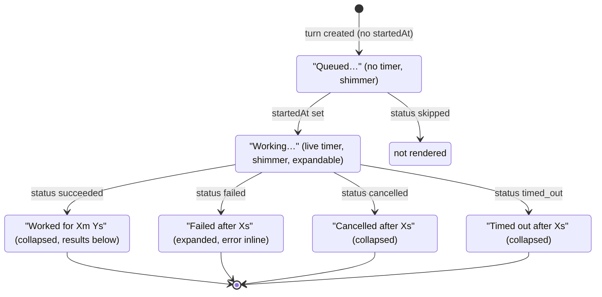
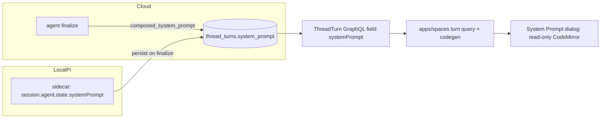

<!--
CORRECTION (2026-05-28, post-research): the original plan claimed a hard
dependency on plan 003 (desktop-local-pi-sidecar). Plan 003 is ALREADY
MERGED to main (PRs #1798–#1802; the sidecar, pi-sidecar-session.ts,
LocalPiConsole in TaskThreadView.tsx, and apps/spaces/src/lib/use-desktop-local-pi-console.ts
are all present). ALL units U1–U7 are unblocked. The earlier "blocked"
framing was a research artifact — initial research ran against a stale
detached checkout (63edf783) instead of real origin/main (a44823e3).

STATUS: U1 (composer reorder) is DONE and merged (PR #1808 / commit 1c3e69c4).
U2–U7 remain. Re-verify ALL file line numbers below against current
origin/main before editing — they came from the stale checkout and are off
(notably TaskThreadView.tsx and the thread route file).
-->

# feat: Desktop turn-surface consolidation, composer reorder, and system-prompt viewer

## Summary

Three cleanups to the ThinkWork Spaces desktop UI (`apps/spaces`, React 19 + Vite + Tailwind 4, runs in Electron via `apps/desktop`):

1. **Composer reorder** — move the Space dropdown after the paperclip in the empty-thread composer.
2. **One turn surface** — relabel the existing activity collapsible (keep its tool rows) so it reads **"Working…"** in shimmer style while running and **"Worked for Xm Ys"** collapsed when done; remove the separate "Processing…" shimmer and the boxed Local Pi console; merge local-Pi events into the same row list; render the final assistant message as un-boxed prose.
3. **System Prompt viewer** — add a "System Prompt" item to the thread "…" menu that opens a read-only, tree-less CodeMirror dialog showing the **exact** persisted system prompt the model received.

**Sequencing:** Plan `2026-05-28-003-feat-desktop-local-pi-sidecar` is **already merged to main**, so the surface this plan consolidates (boxed Local Pi console, sidecar session path) already exists. **All units U1–U7 are unblocked.** U1 is done (PR #1808). U5/U7 consolidate the merged local-Pi code — verify against current main before editing. See Risks & Dependencies.

---

## Problem Frame

The desktop thread UI has three rough edges (see origin):

- The Space dropdown sits first in the composer toolbar, ahead of @ and paperclip; it reads better after the attachment control.
- A running turn stacks **three** competing surfaces — a "Thinking" collapsible (brain icon), a "Processing…" shimmer, and (in the in-flight local-Pi build) a boxed raw-log "Local Pi console". After completion the raw console still renders in a bordered box after the final message. This is noisy and inconsistent versus the clean Codex-style "Worked for Xs" collapsible.
- There is no way to inspect the exact prompt (composed AGENTS.md + SPACE.md + USER.md) the model received for a thread.

The refinement confirmed during planning: the existing activity collapsible and its tool rows are good. This is a **relabel + merge**, not a rebuild — change the header chrome, unify the "running" signal, and feed local-Pi output into the existing rows.

---

## Requirements & Success Criteria

Traced from the origin requirements doc:

- **R1** Composer order is `@ → paperclip → Space dropdown → send` (empty-thread composer only).
- **R2** A running turn shows exactly **one** progress surface — header "Working…" in shimmer style, no brain icon, no "Thinking" label, no separate "Processing…" element.
- **R3** A completed turn shows a collapsed **"Worked for Xm Ys"** header with results below; expanding shows chronological steps.
- **R4** Terminal non-success states (failed / cancelled / timed_out) render distinct, honest headers rather than a misleading "Worked for Xs"; `skipped` is not rendered.
- **R5** Local-Pi events are represented as merged step rows in the same activity list; no boxed console is rendered. Raw sidecar logs remain reachable behind a quiet "view console log" toggle, shown only when such data exists.
- **R6** The final assistant message renders as inline prose, never boxed.
- **R7** The turn surface behaves consistently across cloud/managed and desktop-local Pi turns.
- **R8** The thread "…" menu has a "System Prompt" item opening a read-only, tree-less viewer that shows the **exact persisted** system prompt (not a re-derivation) for both managed and local-Pi threads.

---

## Key Technical Decisions

- **KTD1 — Relabel + extend the vendored AI Elements primitive, do not rebuild or overlay.** The header chrome lives in the vendored `Reasoning`/`ReasoningTrigger` (`apps/spaces/src/components/ai-elements/reasoning.tsx`) and `ThinkingRow`/`ThreadTurnActivity` (`TaskThreadView.tsx`). Per the vendor-extend learning (`docs/solutions/design-patterns/ai-elements-vendor-extend-composability-gap-2026-05-13.md`), widen props / add typed slots in place; never inject via absolute-positioned overlay. Keep the tool-row machinery (`actionRowsForTurn`, `ActionRow`).
- **KTD2 — Single source of truth for "running" = turn status.** Derive running purely from `turn.status` (`queued|running|claimed|pending` → active; terminal → frozen), never from "assistant message present". Delete the competing `showProcessingShimmer` / `showTaskQueueProcessingShimmer` signals so they can't disagree. This is what makes R2's "exactly one surface" hold across the known message-refetch race windows (`withTurnResponseFallback`).
- **KTD3 — Per-turn live timer from wall-clock.** Elapsed time is computed `Date.now() - Date.parse(startedAt)` on a 1s interval inside a per-turn component keyed on `turn.id` (not a shared timer, not an incrementing counter), so historical turns don't animate and backgrounded-tab throttling stays correct. Null `startedAt` (queued) → "Queued…" with no timer.
- **KTD4 — System prompt is read, not recomputed.** The GraphQL `ThreadTurn` type **already exposes `systemPrompt`** (`packages/database-pg/graphql/types/heartbeats.graphql:53-81`), populated from `thread_turns.system_prompt` at finalize. Cloud work is therefore client-side: select the field, regen codegen, extend the client interface. (see origin: docs/brainstorms/2026-05-28-desktop-turn-surface-and-composer-cleanup-requirements.md)
- **KTD5 — Local-Pi capture via the SDK.** The Pi SDK exposes `session.agent.state.systemPrompt` (confirmed at https://pi.dev/docs/latest/sdk). The sidecar reads it after session creation and persists it into the same `thread_turns.system_prompt` column the cloud path uses, so one read path serves both runtimes. Caveat: `state.systemPrompt` reflects the composed prompt but may not capture post-compaction transforms — acceptable for this viewer.
- **KTD6 — Latest turn *with a captured prompt*.** The viewer shows the most recent turn whose `systemPrompt` is non-null, falling back to an empty state only when none exists — so a running/failed latest turn doesn't hide a real prompt one turn back.
- **KTD7 — Reuse the existing CodeMirror stack.** Use `packages/workspace-editor`'s read-only editor (or `@uiw/react-codemirror` directly, mirroring `WorkspaceFilesPanel.tsx`) rather than a parallel viewer (`docs/solutions/design-patterns/audit-existing-ui-and-data-model-before-parallel-build-2026-04-28.md`). Any new dep installs via `pnpm --filter @thinkwork/spaces add`, never npm or `shadcn add`.

---

## High-Level Technical Design

### Turn header state machine

*Directional guidance — header labels and default-open behavior, not a literal component spec.*

### System-prompt dual-source data flow

---

## Implementation Units

### U1. Reorder the empty-thread composer toolbar

**Goal:** Render order `@ → paperclip → Space dropdown → send`.
**Requirements:** R1.
**Dependencies:** none.
**Files:**
- `apps/spaces/src/components/workbench/SpacesComposer.tsx`
- `apps/spaces/src/components/workbench/SpacesComposer.test.tsx` (create if absent)

**Approach:** Move the Space `<Select>` block (currently `SpacesComposer.tsx:245-273`) to render after `<PromptInputAttachButton />` (`:284`), keeping its conditional guard, color classes, and disabled logic intact. Confirm the target is `SpacesComposer` only — the in-thread `FollowUpComposer` (`TaskThreadView.tsx:1596`) has no Space picker and is out of scope.

**Patterns to follow:** existing `PromptInputTools` children ordering.

**Test scenarios:**
- Happy path: when `spaces` is non-empty and `selectedSpaceId` set, the toolbar renders children in order @ mention, attach, Space select, submit (assert DOM order).
- Edge: when the Space select is hidden (no spaces / no `onSelectedSpaceChange`), the remaining order is @ mention, attach, submit.
- Edge: during `isSubmitting`, the Space select is disabled while @ and attach remain (document current mixed-state behavior).

**Verification:** Visual order matches `@ → paperclip → Space → send`; existing composer tests pass.

---

### U2. Extend the client turn model and turn query

**Goal:** Give the client the fields and status vocabulary the new surface and the viewer need.
**Requirements:** R4, R8 (read-path half).
**Dependencies:** none.
**Files:**
- `apps/spaces/src/components/workbench/TaskThreadView.tsx` (the `TaskThreadTurn` interface `:134`, `RENDERED_TURN_STATUSES` `:972`, new `formatTurnHeader` helper near `turnSummary`/`formatTurnDuration` `:2624`/`:2654`)
- the apps/spaces GraphQL document that selects thread turns (locate the turn selection set; add `systemPrompt`, `runtimeType`, `errorCode`)
- generated codegen output for apps/spaces (regenerated, not hand-edited)
- `apps/spaces/src/components/workbench/TaskThreadView.test.tsx`

**Approach:**
- Add `systemPrompt`, `runtimeType`, `errorCode` to the `TaskThreadTurn` interface and to the turn selection set in the apps/spaces query. The `ThreadTurn` GraphQL type already exposes these (`heartbeats.graphql:53-81`) — no schema/resolver change required. Run `pnpm --filter @thinkwork/spaces codegen` (verify the script exists; the field is unusable in the client until codegen regenerates — `docs/solutions/workflow-issues/platform-agent-space-runtime-refactor-autopilot-sequencing-2026-05-23.md`).
- Extend `RENDERED_TURN_STATUSES` to cover the full DB vocabulary (`queued|running|succeeded|failed|cancelled|timed_out|skipped`).
- Add `formatTurnHeader(status, isRunning, duration)` returning: queued→"Queued…", running→"Working…", succeeded→"Worked for Xm Ys", failed→"Failed after Xs", cancelled→"Cancelled after Xs", timed_out→"Timed out after Xs", skipped→null (not rendered). Duration formatting: omit the minutes segment under 60s ("Worked for 12s"); sub-second floors to "1s".

**Patterns to follow:** existing `formatTurnDuration`/`turnSummary`/`formatTurnStatus`; existing codegen workflow.

**Test scenarios:**
- Happy path: `formatTurnHeader` returns the correct label+duration for each of the seven statuses.
- Edge: sub-second duration → "Worked for 1s"; exactly-60s → "Worked for 1m 0s"; under-60s → no minutes segment.
- Edge: `skipped` → null (caller renders nothing).
- Edge: running with null `startedAt` → "Queued…" path (no duration).
- Integration: a turn payload including `systemPrompt`/`runtimeType` deserializes into `TaskThreadTurn` without type errors (codegen types compile).

**Verification:** `pnpm --filter @thinkwork/spaces typecheck` passes with the new fields; header helper unit tests green.

---

### U3. Per-turn live elapsed-time hook

**Goal:** A self-contained elapsed-time value for the running header.
**Requirements:** R2 (live timer).
**Dependencies:** none.
**Files:**
- `apps/spaces/src/components/workbench/useTurnElapsed.ts` (new; or co-locate in TaskThreadView if the file's conventions prefer that)
- `apps/spaces/src/components/workbench/useTurnElapsed.test.ts`

**Approach:** Hook takes `startedAt: string | null` and `isRunning: boolean`. While running with a valid `startedAt`, it recomputes `Date.now() - Date.parse(startedAt)` on a 1s interval and returns formatted elapsed; clears the interval on unmount or when running stops; returns null when `startedAt` is null. Compute from wall-clock each tick (not an incrementing counter) so backgrounded tabs stay correct. Keyed implicitly per component instance — one hook per turn surface.

**Execution note:** Implement the timing edge cases test-first — they are the failure-prone part.

**Test scenarios:**
- Happy path: running + valid `startedAt` → elapsed advances ~1s/tick.
- Edge: null `startedAt` → returns null, no interval started.
- Edge: `isRunning` flips false → interval cleared, value freezes.
- Edge: parent re-render does not reset elapsed to 0 (value derives from `startedAt`, not internal counter).
- Edge: unmount clears the interval (no leak / no setState-after-unmount).

**Verification:** Hook tests green; no timer leak warnings.

---

### U4. Consolidate the turn surface: header chrome + single running signal + un-boxed message

**Goal:** One Codex-style surface — "Working…" shimmer while running, "Worked for Xs" collapsed when done — replacing the brain-icon "Thinking" header and the separate "Processing…" shimmer; final message un-boxed.
**Requirements:** R2, R3, R4, R6, R7.
**Dependencies:** U2, U3.
**Files:**
- `apps/spaces/src/components/workbench/TaskThreadView.tsx` (`ThreadTurnActivity` `:988`, `ThinkingRow` `:2061`, `ProcessingShimmer` `:1151` + its render sites `:390`/`:965`, the running-state derivation, the assistant-message render block)
- `apps/spaces/src/components/ai-elements/reasoning.tsx` (extend header slot if needed)
- `apps/spaces/src/components/workbench/TaskThreadView.test.tsx`

**Approach:**
- Replace the `ThinkingRow` header for turn activity: drop the brain icon and "Thinking" label. Running → render `formatTurnHeader` "Working…" using the existing shimmer treatment (reuse the `ProcessingShimmer` character-shimmer styling as the header text style before deleting the standalone component); done → "Worked for Xm Ys", collapsed by default. Keep a thin divider/rule under the header (Codex parity).
- Failed turns: header "Failed after Xs", expanded by default, error surfaced inline (reconcile with the existing default-closed comment at `:1000`).
- Introduce one `isTurnRunning(turn)` derivation from `turn.status` (KTD2) and route the header, the timer (U3), and any residual streaming cursor through it. Delete `showProcessingShimmer` and `showTaskQueueProcessingShimmer` and their render sites (`:390`, `:965`).
- Un-box the final assistant message: remove the bordered container so it renders as inline prose.

**Patterns to follow:** vendored AI Elements extend-in-place (KTD1); existing `Reasoning`/`ReasoningTrigger` collapsible + `aria-expanded`.

**Test scenarios:**
- Happy path (running): a `running` turn renders exactly one progress surface with header "Working…" and no `ProcessingShimmer`/boxed element; the surface is expandable.
- Happy path (done): a `succeeded` turn renders "Worked for Xm Ys", collapsed by default, with the assistant message as un-boxed prose below.
- Edge (failed): a `failed` turn renders "Failed after Xs", expanded, with the error visible.
- Edge (cancelled/timed_out): correct headers; collapsed.
- Edge (running, no steps yet): header "Working…", expandable, empty/"Starting…" content — chevron does not reveal blank confusion.
- Edge (completed, zero tool calls): "Worked for Xs"; expanding shows a "No tool activity" placeholder rather than nothing.
- Integration (race window): during `withTurnResponseFallback` (synthesized assistant message before refetch), exactly one progress element renders — header and any cursor agree (asserts KTD2).
- Edge (multiple turns): only the latest running turn shows "Working…"; prior turns are "Worked for Xs" collapsed and do not animate.
- A11y: running header carries `role="status"` + `aria-live="polite"` announcing state, not per-second ticks; collapsible keeps `aria-expanded`.

**Verification:** Visual: running shows one shimmer header, no box; done shows collapsed "Worked for Xs" + plain-prose message. Single-progress-element assertion passes.

---

### U5. Merge local-Pi events into activity rows; gate the raw-console toggle; remove the box

**Goal:** Local-Pi output appears as step rows in the same activity list; the boxed Local Pi console is gone; raw logs live behind a quiet, conditionally-shown toggle.
**Requirements:** R5, R7.
**Dependencies:** U4. (Plan 003's `LocalPiConsole` and local-Pi event/console data are **already on main** — no cross-plan wait.)
**Files:**
- `apps/spaces/src/components/workbench/TaskThreadView.tsx` (`actionRowsForTurn` `:2385`; remove `LocalPiConsole` + its render site introduced by plan 003)
- `apps/spaces/src/components/workbench/TaskThreadView.test.tsx`

**Approach:**
- Extend `actionRowsForTurn` to fold local-Pi events (the data plan 003 surfaces) into the same human-readable row list as cloud tool invocations, chronologically merged and de-duplicated with the existing logic.
- Add a "view console log" affordance inside the expanded surface that reveals the raw sidecar lines — rendered **only** when console/log data exists for the turn (effectively local-Pi turns), so cloud turns don't grow an empty toggle. Not boxed, collapsed by default.
- Delete the `LocalPiConsole` component and its render site that plan 003 added.

**Execution note:** Verify against the merged plan-003 code before editing — the `LocalPiConsole` symbol and the local-Pi event shape come from that branch (`docs/solutions/feedback_worktree_copy_source_freshness` discipline: diff against the merged main first).

**Test scenarios:**
- Happy path: a local-Pi turn with events renders merged step rows (no separate box); raw lines available via the toggle.
- Edge: a cloud turn shows no "view console log" toggle (no console data).
- Edge: a local-Pi turn with console data but zero tool rows still shows merged rows from the console events.
- Regression: no bordered console box renders after the final message for a local-Pi turn (the exact regression R5 fixes).
- Integration: chronological ordering of merged cloud tool rows + Pi events is correct and de-duplicated.

**Verification:** Local-Pi turn shows one consolidated surface, rows merged, optional log toggle; no box anywhere.

---

### U6. System Prompt menu item + read-only viewer dialog

**Goal:** "System Prompt" in the thread "…" menu opens a read-only, tree-less CodeMirror dialog showing the exact persisted prompt.
**Requirements:** R8.
**Dependencies:** U2 (`systemPrompt` in the turn query).
**Files:**
- `apps/spaces/src/components/workbench/ThreadDetailActions.tsx` (new menu item + dialog-open state)
- `apps/spaces/src/components/workbench/SystemPromptDialog.tsx` (new)
- `apps/spaces/src/components/workbench/SystemPromptDialog.test.tsx` (new)
- reuse `packages/workspace-editor` read-only editor or `@uiw/react-codemirror` (mirror `apps/spaces/src/components/workbench/WorkspaceFilesPanel.tsx`)

**Approach:**
- Add a non-destructive "System Prompt" `DropdownMenuItem` (icon) grouped with Archive, before the separator/Delete. Apply the documented one-frame `setTimeout(…, 0)` menu→dialog focus defer already used for delete (`ThreadDetailActions.tsx:110-116`) to avoid the Radix focus-trap race.
- Dialog mounts a read-only CodeMirror viewer (markdown highlighting, no file tree) bound to the selected turn's `systemPrompt` via the reactive query so it live-updates if a running turn finalizes while open (controlled `value` prop — do not snapshot into local state on mount).
- Selection rule (KTD6): latest turn with a non-null `systemPrompt`; otherwise empty state.
- Empty-state matrix: no turns yet / latest still running ("captured at completion") / failed before capture / older thread with null prompt — distinct messaging, not one generic line.
- Copy-to-clipboard button with `try/catch` + `sonner` toast on failure (Electron/non-secure-context clipboard can reject).

**Patterns to follow:** `WorkspaceFilesPanel.tsx` dialog shell minus the tree; existing `AlertDialog` focus management; `sonner` toast usage already in `ThreadDetailActions`.

**Test scenarios:**
- Happy path: menu shows "System Prompt"; selecting it opens the dialog with the latest captured prompt rendered read-only.
- Edge: thread with zero turns → "no turns yet" empty state.
- Edge: latest turn running, no captured prompt, earlier turn has one → shows the earlier prompt (KTD6).
- Edge: all turns null prompt → "not captured" empty state.
- Edge (live update): dialog open during a running turn; when the turn finalizes and `systemPrompt` populates, the viewer updates from empty to content.
- Edge: very large prompt (tens of KB) renders without freezing (consider disabling highlighting above a size threshold).
- Error: clipboard write rejects → toast shown, no crash.
- A11y: dialog traps and restores focus; opening from the menu does not leave focus trapped in the closing dropdown.

**Verification:** Menu item present and non-destructive; dialog shows the exact stored prompt read-only with working copy; empty states behave per matrix.

---

### U7. Capture the local-Pi composed system prompt and persist it

**Goal:** Local-Pi turns persist their composed prompt so the viewer (U6) works for local threads, not just cloud.
**Requirements:** R8 (local-Pi parity).
**Dependencies:** U6 consumes the result. (The sidecar session-creation path from plan 003 is **already on main**.)
**Files:**
- the pi-sidecar session module introduced by plan 003 (the "local Pi SDK session creating" path)
- the local-Pi turn finalize/persistence path that writes `thread_turns`
- corresponding sidecar/main test file

**Approach:** After the Pi SDK session is created, read `session.agent.state.systemPrompt` (KTD5) and thread it through to the local-Pi turn's finalize/persistence so it lands in `thread_turns.system_prompt` — the same column the cloud path uses. Pass the value explicitly through any intermediate payload construction (avoid the subset-dict drop anti-pattern, `docs/solutions/patterns/apply-invocation-env-field-passthrough-2026-04-24.md`). Snapshot the value at session/coroutine entry rather than re-reading later (`feedback_completion_callback_snapshot_pattern`).

**Test scenarios:**
- Happy path: a local-Pi turn persists a non-null `system_prompt` equal to `session.agent.state.systemPrompt`.
- Edge: session with no/empty system prompt → persists null/empty without erroring; U6 renders the empty state.
- Integration: the persisted value round-trips through the GraphQL `systemPrompt` field to the U6 dialog for a local-Pi thread.
- Edge: passthrough does not drop the field across the intermediate payload step (explicit assertion).

**Verification:** A local-Pi turn's `thread_turns.system_prompt` is populated and visible in the System Prompt dialog.

---

## Scope Boundaries

**In scope:** the three features above and the client/sidecar wiring they require.

### Outside this change (non-goals)
- Changing what tools/steps the agent runs, or the sidecar/main-process logging itself — only how it's surfaced.
- Editing the system prompt from the viewer (read-only inspection only).
- Backend schema/resolver changes for `systemPrompt` — the field already exists.

### Deferred to Follow-Up Work
- Removing the "view console log" toggle once local Pi is stable.
- Per-turn prompt selection UI in the viewer (v1 shows latest-with-prompt).
- Exact post-compaction prompt snapshots (KTD5 caveat).
- `PROMPT_SOURCES.md` and other agent-dir files beyond the composed prompt.
- `/ce-compound` write-ups for the turn-consolidation pattern and the dual-source system-prompt exposure (no corpus coverage today).

---

## Risks & Dependencies

- **Plan 003 surface is already merged (no cross-plan wait).** The boxed `LocalPiConsole`, the local-Pi event/console data, and the sidecar session path originate in `2026-05-28-003-feat-desktop-local-pi-sidecar`, **which is merged to main** (PRs #1798–#1802; `apps/desktop/src/sidecar/`, `pi-sidecar-session.ts`, `LocalPiConsole` in `TaskThreadView.tsx`, `apps/spaces/src/lib/use-desktop-local-pi-console.ts`). **All units U1–U7 are unblocked.** Before U5/U7, `git fetch` and re-verify the `LocalPiConsole` symbol + local-Pi event shape against current main (`feedback_diff_against_origin_before_patching`) — and re-derive every line number in this plan, which came from a stale checkout.
- **Codegen coupling.** The new turn-query fields are untyped/unqueryable until `pnpm --filter @thinkwork/spaces codegen` regenerates client documents; ship the query change + regenerated output together.
- **GraphQL deploys via PR**, not `aws lambda update-function-code` — though this plan needs no resolver change, the query/codegen change still ships through a PR to `main`.
- **Worktree isolation.** Do this work in `.claude/worktrees/<name>` off `origin/main`; the admin/spaces dev ports must be Cognito-registered if a dev server is needed for visual validation.
- **Visual validation requires Eric's primary checkout + dev stage** — a worktree dev server can't reach the API (`feedback_validate_locally_before_push`). Don't open the PR before he validates the rendered turn surface.

---

## Open Questions

- **Does `apps/spaces` have a `codegen` script?** CLAUDE.md lists cli/admin/mobile/api as the known consumers; verify the spaces package and use its script (or the repo-wide codegen) in U2. Deferred to implementation — does not change the plan shape.
- **`packages/workspace-editor` real state.** Confirm at U6 whether its read-only editor export is production-ready or still a stub; if stub, mount `@uiw/react-codemirror` directly mirroring `WorkspaceFilesPanel.tsx`. Either path satisfies KTD7.

---

## Sources & Research

- Origin: `docs/brainstorms/2026-05-28-desktop-turn-surface-and-composer-cleanup-requirements.md`
- Predecessor (merged): `docs/plans/2026-05-28-003-feat-desktop-local-pi-sidecar-plan.md`
- GraphQL turn type already exposing `systemPrompt`/`runtimeType`/`status`/`errorCode`: `packages/database-pg/graphql/types/heartbeats.graphql:53-81`; status vocabulary `packages/database-pg/src/schema/scheduled-jobs.ts:107`.
- Pi SDK `session.agent.state.systemPrompt`: https://pi.dev/docs/latest/sdk
- Learnings: AI Elements vendor-extend (`docs/solutions/design-patterns/ai-elements-vendor-extend-composability-gap-2026-05-13.md`); audit-before-parallel-build (`docs/solutions/design-patterns/audit-existing-ui-and-data-model-before-parallel-build-2026-04-28.md`); GraphQL codegen coupling (`docs/solutions/workflow-issues/platform-agent-space-runtime-refactor-autopilot-sequencing-2026-05-23.md`); shadcn/pnpm dep install (`docs/solutions/tooling-decisions/shadcn-add-cli-pnpm-workspace-vendor-pattern-2026-05-13.md`); Electron typed-IPC boundary (`docs/solutions/spikes/2026-05-21-electron-oauth-cold-start-validation.md`); field passthrough anti-pattern (`docs/solutions/patterns/apply-invocation-env-field-passthrough-2026-04-24.md`).
