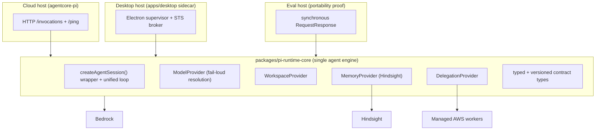
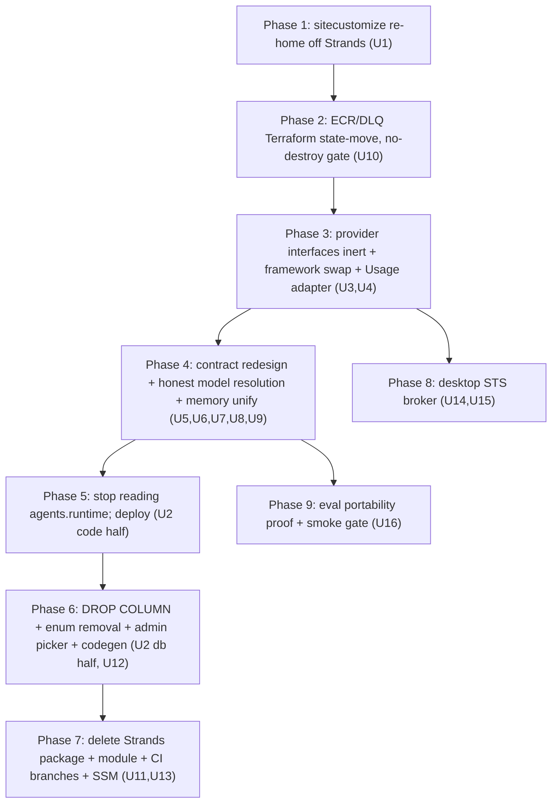

# refactor: Firm Pi into the single host-agnostic runtime core

## Summary

Make Pi the product's single host-agnostic agent runtime core: delete the legacy
Strands runtime and the entire runtime-selection surface, unify the cloud runtime
and the desktop sidecar on `@earendil-works/pi-coding-agent` behind four provider
interfaces (Model / Workspace / Memory / Delegation), collapse memory to
Hindsight-only, redesign the runtime↔platform contract into one typed, versioned,
consistently-cased shape with accurate token/cost reporting and fail-loud model
resolution, build a desktop STS credential broker, and use the eval path as a
portability proof host. The work is sequenced as deploy-gated phases because it
crosses several hard deploy boundaries.

## Problem Frame

Pi is becoming the component the whole product depends on, but it grew under two
pressures that are now actively harmful, and there are no production users to
migrate — so the cuts are cheap now and expensive later.

The audits found the foundation is further from "single core" than the brainstorm
assumed, and that "delete Strands" has build-time prerequisites the brainstorm
didn't know about:

- The Pi sandbox base image **COPYs `sitecustomize.py` out of the Strands package**
  (`terraform/modules/app/agentcore-code-interpreter/Dockerfile.sandbox-base:50`).
  Deleting the package drops that file and breaks the sandbox base build. (The
  cloud Pi runtime image itself already builds from its own dedicated
  `packages/agentcore-pi/agent-container/Dockerfile` and the deploy pipeline
  already points the Pi build steps at it — so the remaining Strands-Dockerfile
  coupling is the sandbox base image only, not the cloud Pi image.)
- The **shared ECR repository and async DLQ are owned by the Strands Terraform
  module** (`module.agentcore`) and consumed by reference in `module.agentcore_pi`.
  Deleting the module destroys the ECR repo that holds the live Pi image.
- The two hosts run **two different agent frameworks**: the cloud runtime is pinned
  to the deprecated `@mariozechner/pi-agent-core@0.70.2` + `@mariozechner/pi-ai@0.70.2`;
  the desktop sidecar runs `@earendil-works/pi-coding-agent@0.76.0` and bypasses the
  shared loop with its own ~1,345-line driver. `packages/pi-runtime-core` already
  exists with a shared `agent-loop.ts`, `types.ts`, `history.ts`, `tool-costs.ts`,
  `finalize-client.ts`, and `desktop-session.ts` — but only one of the four
  *provider interfaces* the brainstorm references exists (`DelegationProvider`); the
  loop wrapper hardcodes Bedrock rather than going through a Model/Workspace/Memory
  seam.
- The contract is snake_case with camelCase islands, unversioned, emits two
  divergent usage shapes, and **silently substitutes Claude Sonnet** when handed an
  unrecognized model ID — the reason the desktop UI can label a turn "Kimi" while
  Sonnet ran. Token usage reads zero whenever the framework swallows a Bedrock
  error.
- The desktop sidecar reaches Bedrock/S3 through the **laptop's ambient AWS
  credential chain** — works for one developer, cannot work for a real user with no
  AWS credentials. The credential broker its own plan promised was never built.

The cost of leaving these is compounding: every new capability is built against a
divergent, mis-shaped, partially-extracted foundation.

## Requirements Trace

Origin: `docs/brainstorms/2026-05-28-pi-runtime-firming-requirements.md`.

Per-R-ID mapping, derived from each unit's own Requirements line (R-IDs and
acceptance-example IDs referenced as `AE<N>` are defined in the origin brainstorm):

- R1 — Pi is the sole runtime → U2, U11.
- R2 — runtime-selection surface removed end to end → U2, U12. (Partial: the
  `agents.runtime` column and GraphQL field are removed; the `runtime_type`
  provenance columns on `thread_turns`/`cost_events` are intentionally retained as
  recording-only per the Key Technical Decision, and their removal is deferred.)
- R3 — re-home sandbox base image, ECR repo, async DLQ without destroying live
  resources → U1, U10.
- R4 — CI/CD + scripts updated to Pi-only → U11.
- R5 — stop conforming to Strands SDK conventions → U13.
- R6, R7 — single host-agnostic core; both hosts on `pi-coding-agent`
  `createAgentSession()` → U4.
- R8 — Model / Workspace / Memory / Delegation provider interfaces → U3 (define),
  U7 (Model/Workspace wired).
- R9 — honest model resolution → U3 (interface), U7 (cloud wiring).
- R10 — lift duplicated host-portable logic into core → U4 (cloud), and the desktop
  sidecar's duplicated driver consolidation (see U4 approach note).
- R11, R12 — Hindsight-only memory behind `MemoryProvider` → U8 (R12 interface also
  in U3).
- R13, R14 — clean typed versioned contract → U6.
- R15 — accurate token/cost; failures surface → U5 (cred snapshot), U7 (fail-loud),
  U9 (usage accuracy).
- R16, R17 — desktop STS credential broker → U14, U15.
- R18 — eval path as portability proof host → U16.

## Key Technical Decisions

- **Phase-gate the Strands removal; each phase boundary is a deploy boundary, not
  just a commit.** The destructive cuts (DROP COLUMN, Terraform module delete,
  Strands source delete) each depend on a prior change being merged *and deployed*.
  Sequencing follows the established staged-collapse precedent
  (`docs/solutions/workflow-issues/platform-agent-space-runtime-refactor-autopilot-sequencing-2026-05-23.md`)
  and the migration-ordering rule (see origin; `feedback_migration_deploy_ordering`).

- **Re-home the sandbox base file before deleting Strands sources.** The cloud Pi
  image already builds from `packages/agentcore-pi/agent-container/Dockerfile` and
  the deploy pipeline already points at it — that work is done. The one remaining
  build-time prerequisite is re-homing `sitecustomize.py` off the Strands package
  (the sandbox-base image COPYs it) before `packages/agentcore-strands/` is removed
  (audit finding S1, narrowed to the sandbox base after re-verifying against main).

- **Re-home shared infra via Terraform `moved {}` blocks with a no-destroy plan
  gate.** The ECR repo, async DLQ, and their lifecycle/policy resources move from
  `module.agentcore` into the Pi module (or a new shared-infra module) using the
  same `moved {}` pattern already used for the Flue→Pi rename. A `terraform plan`
  must assert **zero `aws_ecr_repository` destroy/create** before apply — a `moved`
  typo silently degrades to destroy+create and drops the Pi image (origin AE2;
  audit S3).

- **Unify on `@earendil-works/pi-coding-agent` via `createAgentSession()` SDK
  mode.** Both hosts consume the framework's intended embedding surface — the cloud
  runtime migrates off the lower-level `pi-agent-core` `Agent` it calls today; the
  desktop sidecar already uses this surface. Do the package swap and a `Usage`-type
  adapter in `pi-runtime-core` as one unit *before* the contract redesign, so the
  redesign churns one stable type surface (audit S7).

- **Wrap the framework behind our own provider interfaces; do not own the loop.**
  Ship each interface (Model / Workspace / Memory / Delegation) inert with full
  tests behind a stable signature first, integrate at the dependency gate — the
  inert-first seam-swap pattern
  (`docs/solutions/architecture-patterns/inert-first-seam-swap-multi-pr-pattern-2026-05-08.md`,
  `feedback_ship_inert_pattern`).

- **One typed versioned contract with a one-deploy transitional dual-read.** The
  finalize handler branches on a `version` field and accepts the legacy unversioned
  shape for exactly one release so in-flight turns that start on the old container
  and finalize after the swap aren't lost; the legacy branch is removed the
  following release. This is transitional, not the standing compat shim the origin
  forbids (audit S6).

- **Fail-loud model resolution lives on the `ModelProvider` interface.** The core
  throws a typed `UnsupportedModelError` before any model call; each host supplies
  its own supported-ID set. The check must also catch the resolve-then-
  ValidationException case (missing `us.` inference-profile prefix) that today
  zeroes tokens silently (`feedback_pi_ai_silent_validation_exception`).

- **Hindsight-only, scoped to application code and `public.*` only.** Delete the
  managed AgentCore Memory tool path and the `MEMORY_ENGINE` branch behind a
  `MemoryProvider` interface. Do **not** touch the `hindsight.*` Postgres schema or
  any non-public schema (`feedback_only_touch_public_schema`). Managed-namespace
  memory data in dev is dropped, not migrated (no production users).

- **Desktop credentials become short-lived STS, with both ambient fallbacks
  removed.** PKCE→Cognito→STS `AssumeRoleWithWebIdentity`; refresh secret in OS
  `safeStorage` (main process only); the `aws-sdk-default-credential-chain` and
  `AWS_BEARER_TOKEN_BEDROCK` fallbacks in the sidecar are removed so R16 actually
  holds. Credential material never crosses the IPC boundary to the renderer
  (`docs/solutions/spikes/2026-05-21-electron-oauth-cold-start-validation.md`).

- **Keep `runtime_type` on `thread_turns` / `cost_events` as recording-only.** Drop
  the `agents.runtime` column and the whole selection surface, but retain the
  historical provenance columns — confirm nothing reads them back to *route*, only
  to *record*.

## High-Level Technical Design

### Target architecture: one core, three hosts

### Deploy-gated sequencing (each arrow is a deploy boundary)

## Implementation Units

Phasing groups the units; U-IDs are stable and not renumbered. Each phase boundary
that involves a destructive cut (U2 db half, U10, U11) requires the prior unit
**merged and deployed** before it lands.

### U1. Re-home the sandbox base file off the Strands package

- Goal: the sandbox base image no longer COPYs from the Strands package — the one
  genuine build-time prerequisite (verified against code) for deleting Strands. The
  cloud Pi runtime image already builds from its own
  `packages/agentcore-pi/agent-container/Dockerfile` and the deploy pipeline already
  points the Pi build steps at it, so a Pi Dockerfile is NOT net-new work; only the
  `sitecustomize.py` re-home remains.
- Requirements: R3.
- Dependencies: none (first unit).
- Files:
  - move `packages/agentcore-strands/agent-container-sandbox/sitecustomize.py` →
    `packages/agentcore-pi/agent-container-sandbox/sitecustomize.py` (and its test)
  - `terraform/modules/app/agentcore-code-interpreter/Dockerfile.sandbox-base`
    (repoint the COPY at line 50)
  - `terraform/modules/app/agentcore-code-interpreter/README.md` (path refs)
- Approach: Move the file and repoint the sandbox-base COPY; keep the
  `import sitecustomize` startup assertion. Do NOT author a new Pi Dockerfile or
  re-point Pi deploy.yml/release.yml build steps — those already exist and work;
  confirm them rather than recreating them. Leave the Strands image build in place
  until U11.
- Patterns to follow: existing two-tag single-platform image scheme — keep
  `${sha}` (amd64, Lambda) and `${sha}-arm64` (AgentCore) separate; do not collapse
  (`docs/solutions/workflow-issues/multi-arch-image-lambda-vs-agentcore-split-tags-2026-04-24.md`).
- Execution note: Verify with `get-agent-runtime ... containerUri` that the Pi
  runtime actually serves the new image — AgentCore does not auto-repull, and READY
  status + Lambda image URI both lie
  (`docs/solutions/workflow-issues/agentcore-runtime-no-auto-repull-requires-explicit-update-2026-04-24.md`).
- Test scenarios:
  - Covers R3. The sandbox base image builds with the re-homed `sitecustomize.py`
    and the `import sitecustomize` startup assertion passes.
  - The existing Pi container image still serves a turn (non-empty content) after
    the sandbox-base re-home — confirming the re-home didn't break the image.
  - A turn through the code-interpreter sandbox still has stdout/stderr redaction
    applied (proves the re-homed `sitecustomize.py` is active).
- Verification: the sandbox base image builds with the re-homed `sitecustomize.py`,
  and a Pi turn + a sandbox turn both still succeed (the existing Pi image is
  confirmed, not rebuilt from a new Dockerfile).

### U3. Define the four provider interfaces (inert)

- Goal: `pi-runtime-core` exposes Model / Workspace / Memory / Delegation provider
  interfaces with full tests, behind stable signatures, before any host consumes
  them.
- Requirements: R8, R9 (the `ModelProvider.supports`/`resolve` surface), R12.
- Dependencies: none.
- Files:
  - `packages/pi-runtime-core/src/model-provider.ts` (new)
  - `packages/pi-runtime-core/src/workspace-provider.ts` (new)
  - `packages/pi-runtime-core/src/memory-provider.ts` (new)
  - `packages/pi-runtime-core/src/delegation.ts` (existing `DelegationProvider`,
    aligned to the same shape conventions)
  - `packages/pi-runtime-core/src/index.ts` (exports)
  - `packages/pi-runtime-core/test/model-provider.test.ts`,
    `workspace-provider.test.ts`, `memory-provider.test.ts` (new)
- Approach: Interfaces only (no host implementations yet). `ModelProvider` exposes
  a resolve/`supports(modelId)` surface so the core can throw a typed
  `UnsupportedModelError` uniformly while each host supplies its support list.
  `MemoryProvider` exposes recall/reflect-shaped methods. `WorkspaceProvider`
  exposes read/list/sync. Each carries the cred-snapshot-at-entry expectation so
  every writeback site inherits it
  (`feedback_completion_callback_snapshot_pattern`).
- Patterns to follow: the existing `DelegationProvider` interface shape; inert-first
  seam-swap (`feedback_ship_inert_pattern`).
- Test scenarios:
  - Covers R8. Each interface has a fake/stub implementation a host can substitute;
    a unit constructs the core against the stubs without any concrete AWS/Bedrock/
    Hindsight client.
  - Covers R9. `ModelProvider.resolve` on an unsupported ID throws
    `UnsupportedModelError`; on a supported ID returns the resolved model.
  - A `MemoryProvider` stub satisfies the recall→reflect chain contract.
- Verification: `pi-runtime-core` typechecks and tests pass; no host imports the new
  interfaces yet (inert).

### U4. Migrate the cloud runtime onto `@earendil-works/pi-coding-agent` + Usage adapter

- Goal: the cloud runtime runs `createAgentSession()` from the same framework the
  desktop sidecar uses, off the deprecated `@mariozechner/*` scope, with a pinned
  `Usage`-type adapter so downstream usage readers don't churn.
- Requirements: R6, R7.
- Dependencies: U3.
- Files:
  - `packages/pi-runtime-core/package.json` AND `packages/agentcore-pi/package.json`
    — swap BOTH `@mariozechner/pi-agent-core` and `@mariozechner/pi-ai` →
    `@earendil-works/*` (pi-ai is a second pinned dep, not just pi-agent-core)
  - `packages/pi-runtime-core/src/agent-loop.ts` (wrap `createAgentSession()` SDK
    mode; builtin coding tools disabled, our tools injected)
  - `packages/pi-runtime-core/src/types.ts` (import `Message`/`Usage` from the new
    package; add `Usage` adapter)
  - `packages/pi-runtime-core/src/history.ts`, `tool-costs.ts` (package import
    swap)
  - `packages/agentcore-pi/agent-container/src/server.ts` (consume the core loop via
    `createAgentSession()`; drop direct `pi-agent-core` `Agent` construction)
  - `packages/agentcore-pi/agent-container/src/tools/memory.ts`,
    `runtime/tools/web-search.ts`, `runtime/tools/context-engine.ts`,
    `runtime/tools/send-email.ts` (all construct `AgentTool` from `@mariozechner/*`
    — all must swap. web-search + context-engine landed via #1813, send-email via
    #1814, after the plan's original basis)
- Approach: Swap the package and isolate the `Usage` shape behind an adapter so a
  shape difference between scopes doesn't cascade into every usage-reading site at
  once. Resolve whether `@earendil-works/pi-coding-agent` subsumes the `pi-ai`
  model/usage types or whether a separate `@earendil-works` AI package is needed.
  Run cloud through `createAgentSession()` SDK mode (the intended embedding
  surface), builtin coding tools off, platform tools injected. R10 note: this unit
  also consolidates the desktop sidecar's duplicated host-portable logic
  (history/prompt building, run-result assembly) into the core so the ~1,345-line
  driver no longer reimplements it.
- Blast radius: the swap must keep the whole workspace type graph green — the
  `agentcore-pi` container Dockerfile runs `tsc --build` over `pi-aws` then
  `agentcore-pi`, so a locally-typechecking swap can still break the container build
  if the lockfile isn't refreshed (`pnpm --frozen-lockfile`). #1811 also made the
  Dockerfile COPY+build `@thinkwork/pi-runtime-core` into the image, so the
  `@mariozechner`→`@earendil` swap must keep that in-image build green too.
- Tool inventory drift (survey current main, not canary.55): since the plan was
  written, `web_search` and Company Brain/`context-engine` tools were added to the
  cloud runtime (#1813) and Company Brain + Send Email to the desktop sidecar
  (#1814). The "platform tools injected" set is therefore larger than the plan's
  basis — re-grep `packages/agentcore-pi/agent-container/src/runtime/tools/` for the
  live set; all of it must route through `createAgentSession()` and be covered by
  the framework swap and tool-cost/usage plumbing.
- agent-loop.ts moved-target note: `agent-loop.ts` gained a `runWithRetry` wrapper
  after canary.55 — the `createAgentSession()` rewrite must preserve/reconcile it,
  not overwrite. Confirmed against current main: `resolveModel` still hardcodes the
  `us.anthropic.claude-sonnet-4-5-…` fallback and the file is still on
  `@mariozechner/*`, so U4 (swap), U7 (fail-loud resolution), and U9 (usage) all
  remain genuinely required — not pre-done.
- Patterns to follow: the desktop sidecar's existing `createAgentSession()` usage in
  `apps/desktop/src/sidecar/local-turn-runner.ts`.
- Execution note: Add a build-time assertion that the expected
  `createAgentSession` signature exists, so SDK drift fails at build, not first
  invocation (`docs/solutions/best-practices/bedrock-agentcore-sdk-version-drift-prefer-raw-boto3-2026-04-24.md`).
- Bus-factor contingency (required, not advisory): after this pass every host
  depends on a single-author 0.x SDK with no second framework left. Vendor a pinned
  tarball (or a private-registry mirror) so a yank/unpublish can't break deploys,
  and record the explicit trigger + rough cost for the deferred "own the loop"
  fallback. The build-time signature assertion catches type drift only; the tarball
  + written fallback trigger cover unpublish and author-abandonment.
- Test scenarios:
  - Covers R6, R7. A cloud turn runs through `createAgentSession()` and returns
    non-empty content + non-zero tokens (call-count assertion that the SDK session
    was constructed).
  - The `Usage` adapter maps the framework's usage shape to the contract's usage
    fields for a representative turn.
  - Builtin coding tools are absent from the session's active tool set; injected
    platform tools are present.
- Verification: cloud Pi turn succeeds end-to-end on the new framework; a
  repo-wide grep for `@mariozechner/` returns zero matches (both `pi-agent-core`
  and `pi-ai`, across all package.json files and imports) — this grep must now clear
  the web-search / context-engine / send-email tool files added since the original
  basis, not just `tools/memory.ts`.

### U5. Snapshot creds at loop entry; remove env re-reads

- Goal: the agent loop and every writeback site (finalize, completion, memory)
  snapshot `THINKWORK_API_URL` / `API_AUTH_SECRET` (and equivalents) at coroutine
  entry and thread them as parameters — never re-read after the turn.
- Requirements: R15 (correct terminal-state reporting depends on creds surviving
  the turn).
- Dependencies: U4.
- Files:
  - `packages/pi-runtime-core/src/agent-loop.ts`, `finalize-client.ts`
  - `packages/agentcore-pi/agent-container/src/server.ts`
- Approach: Capture identity/secrets once at entry; pass through. Removes the
  intermittent env-shadowing that empties callbacks mid-turn.
- Patterns to follow:
  `docs/solutions/workflow-issues/agentcore-completion-callback-env-shadowing-2026-04-25.md`,
  `feedback_completion_callback_snapshot_pattern`; wrap Lambda env reads in a
  function, not module-load constants (`feedback_vitest_env_capture_timing`).
- Test scenarios:
  - A turn whose `process.env` is mutated after loop entry still finalizes with the
    entry-time API URL/secret.
  - Covers R15. The finalize callback fires with non-empty creds in a run that
    simulates post-entry env mutation.
- Verification: smoke run shows finalize/retain dispatched (not env-empty) across
  repeated invocations.

### U6. Redesign the runtime↔platform contract (typed, versioned, one-shape)

- Goal: one typed, versioned, consistently-cased contract covering both the
  invocation (request) payload and the response/finalize payload, with the
  synchronous and callback emission shapes unified.
- Requirements: R13, R14.
- Dependencies: U4.
- Files:
  - `packages/pi-runtime-core/src/types.ts` (canonical typed contract + `version`
    field; unify `pi_usage`/`response.usage`/finalize `usage` to one field)
  - `packages/api/src/handlers/chat-agent-invoke.ts` (invocation builder targets
    the typed contract)
  - `packages/api/src/lib/evals/agentcore-direct.ts` (`buildEvalAgentCorePayload`
    targets the same typed contract; preserve `evalMode` discriminator)
  - `packages/api/src/lib/desktop-runtime/prepare-local-turn.ts` (desktop builder
    targets the same typed contract; preserve `runtimeHost` discriminator)
  - `packages/api/src/lib/chat-finalize/process-finalize.ts`,
    `chat-finalize/types.ts` (version-keyed dual-read; one canonical usage field)
  - `packages/api/src/lib/desktop-runtime/finalize-auth.ts`,
    `packages/api/src/lib/chat-finalize/claim-turn.ts` (already exist — verify the
    dual-read legacy branch routes through both; do not rebuild)
  - `apps/desktop/src/sidecar/local-turn-runner.ts` (read renamed invocation
    fields)
  - `packages/agentcore-pi/agent-container/src/server.ts` (emit the unified shape)
- Approach: Define the contract once in `pi-runtime-core`; have all three
  invocation builders target the typed shape so the compiler enumerates every
  consumer. Preserve typed `evalMode` / `runtimeHost` discriminators so memory-skip
  (eval) and finalize-skip (eval) vs. callback-finalize (chat/desktop) stay correct
  per host. `process-finalize` branches on `version` and accepts the legacy
  unversioned shape during a transitional window (transitional dual-read).
- Approach (dual-read window — metric-gated, not fixed): keep the legacy-read branch
  until an empirical zero-traffic check passes — zero legacy-shape finalizes for N
  days AND no in-flight turns or DLQ/redrive entries older than the window. Async
  chat/wakeup turns dispatch via Lambda Event mode with retries + DLQ redrive, so a
  turn can finalize well after the deploy that started it; a fixed "exactly one
  release" window can drop a delayed turn. The finalize handler's dual-read must
  also be live and deployed BEFORE the container starts emitting the versioned
  shape (the AgentCore image refresh lags via the reconciler), or sequence the
  version-emission to turn on a release after the handler is confirmed deployed.
- Approach (dual-read security): the `version` field changes payload shape only,
  never trust. The legacy/unversioned branch MUST enforce identical authentication,
  tenant-binding, and turn-binding checks as the versioned branch — otherwise an
  attacker with a finalize token can submit the legacy shape to take a weaker path
  (downgrade attack).
- Approach (finalize token hardening — MOSTLY ALREADY BUILT on main; verify, don't
  rebuild): main now ships `packages/api/src/lib/desktop-runtime/finalize-auth.ts`
  (`verifyDesktopFinalizeToken` — tenant + `thread_turn_id` binding, SHA-256
  timing-safe verify, expiry) and `packages/api/src/lib/chat-finalize/claim-turn.ts`
  (`claimThreadTurnForFinalize` — CAS `UPDATE … WHERE finalized_at IS NULL`, whose
  docstring states a replayed token is rejected as already-finalized). So
  binding + verify + expiry + single-use are done. The residual for U6 is narrow:
  confirm the transitional dual-read's legacy branch routes desktop-token auth
  through `verifyDesktopFinalizeToken` AND through `claimThreadTurnForFinalize` (no
  bypass path), and give the finalize token its own TTL decoupled from the AWS
  session TTL if it isn't already. Add `finalize-auth.ts` and `claim-turn.ts` to the
  Files list and reference them rather than describing a fresh build.
- Test scenarios:
  - Covers R13, R14. The same typed builder produces chat, eval, and desktop
    payloads; eval still skips memory + reads synchronous response, chat + desktop
    still finalize via callback.
  - A single Pi turn's response satisfies both the chat-finalize usage reader and
    the eval synchronous-usage reader from the same canonical field (no aliasing).
  - The finalize handler accepts a legacy unversioned payload AND a new versioned
    payload during the transition; a turn that starts pre-swap and finalizes
    post-swap records correctly.
  - A legacy-shaped finalize with a token bound to a different turn/tenant is
    rejected exactly as the versioned path rejects it (no downgrade bypass).
  - A finalize replay with a valid-but-already-consumed token is rejected; a token
    for turn A cannot finalize turn B.
  - Casing: no snake_case body with camelCase islands in the typed contract.
- Verification: chat, eval, and desktop turns all round-trip through the unified
  contract; an in-flight legacy-shape finalize is accepted during the transition
  window.

### U7. Wire cloud host to the Model + Workspace providers; fail-loud model resolution

- Goal: the cloud runtime resolves models and reads the workspace through the U3
  interfaces, and an unsupported model fails loud instead of silently running
  Sonnet.
- Requirements: R8, R9, R15.
- Dependencies: U3, U4, U6.
- Files:
  - `packages/agentcore-pi/agent-container/src/server.ts` (model default at the
    fallback site; workspace bootstrap behind `WorkspaceProvider`)
  - `packages/agentcore-pi/agent-container/src/runtime/bootstrap-workspace.ts`
    (implement `WorkspaceProvider`)
  - `packages/pi-runtime-core/src/model-provider.ts` (Bedrock support set +
    `us.`-prefix-aware validation)
- Approach: Replace the unconditional Sonnet fallback with
  `ModelProvider.resolve`, throwing `UnsupportedModelError`. For chat (async), the
  turn finalizes with `status: failed` + a surfaced error. Catch the
  resolve-then-ValidationException (missing `us.` prefix) case and surface it
  rather than recording zero tokens.
- Tool-routing note (new surface since basis): the cloud `assembleTools` now also
  registers `web_search`, Company Brain/`context_engine`, and `send_email` (added
  #1813/#1814). These platform tools must keep registering and routing through the
  `createAgentSession()` session after the U4 swap — re-grep
  `packages/agentcore-pi/agent-container/src/runtime/tools/` for the live set; don't
  enumerate from the plan's original (smaller) inventory.
- Patterns to follow: `feedback_pi_ai_silent_validation_exception`; the
  smoke-detector matrix (non-empty content + non-zero tokens).
- Test scenarios:
  - Covers origin AE5. A chat turn requesting an unsupported model makes no Bedrock
    call to Sonnet, finalizes `status: failed` with a surfaced error, and records no
    model as having run.
  - Covers R15. A turn whose model resolves but ValidationExceptions (missing `us.`
    prefix) finalizes `failed`, not `complete` with 0 tokens.
  - A supported model resolves and runs; workspace reads go through
    `WorkspaceProvider` with the tenant/agent prefix enforced.
- Verification: unsupported-model and ValidationException turns surface failure;
  supported-model turns succeed with non-zero tokens.

### U8. Hindsight-only memory behind the MemoryProvider

- Goal: memory is Hindsight-only, accessed through `MemoryProvider`; the managed
  AgentCore Memory tool path and the `MEMORY_ENGINE` branch are removed.
- Requirements: R11, R12.
- Dependencies: U3, U4.
- Files:
  - delete `packages/agentcore-pi/agent-container/src/tools/memory.ts` (managed
    path)
  - `packages/agentcore-pi/agent-container/src/tools/hindsight.ts` (implement
    `MemoryProvider`; keep async wrappers)
  - `packages/agentcore-pi/agent-container/src/server.ts` (remove the
    `MEMORY_ENGINE` branch; Hindsight-only)
  - `terraform/modules/thinkwork/main.tf` (remove ONLY the Pi-side `MEMORY_ENGINE` /
    `agentcore_memory_id` inputs in this unit — see ordering note)
- Approach: Collapse the engine selector to Hindsight. Decide hard-fail vs. warn
  when `HINDSIGHT_ENDPOINT` is absent (a turn silently losing memory is worse than
  failing). Keep Hindsight tool wrappers `async def`/`async` with
  `arecall`/`areflect`, fresh client, `aclose`, retry; edit the recall/reflect
  docstrings together.
- Approach (data + schema): Drop managed-namespace dev memory; do **not** migrate.
  Scope all deletion to application code and `public.*` config rows only — never
  touch `hindsight.*` or any non-public schema. Before deleting, resolve the open
  question that dev's managed namespace holds no dogfood memory anyone cares about,
  and treat the drop as a verified deletion (confirm no residual in managed-service
  retention) rather than just removing the read path.
- Ordering note (Terraform): the `agentcore-memory` module ALSO feeds
  `module.agentcore` (Strands), which is not deleted until U11 — so this unit
  removes only the Pi-side memory inputs and the managed-memory code path. Deletion
  of the `agentcore-memory` module instantiation and `local.resolved_memory_engine`
  is deferred to U11, after `module.agentcore` is gone. Removing the module here
  would leave `module.agentcore` referencing an orphaned output and fail
  `terraform plan`.
- Patterns to follow: `feedback_hindsight_async_tools`,
  `feedback_hindsight_recall_reflect_pair`, `feedback_only_touch_public_schema`.
- Test scenarios:
  - Covers R11, R12. A turn uses memory through `MemoryProvider` calling Hindsight;
    no managed-AgentCore-Memory code path or `MEMORY_ENGINE` branch remains.
  - Recall is followed by reflect (chain contract preserved).
  - Missing `HINDSIGHT_ENDPOINT` produces the chosen explicit behavior (fail-loud
    or warn), not a silent no-memory turn.
- Verification: memory recall/reflect works via Hindsight; grep shows no managed
  memory path; no non-public schema touched.

### U9. Accurate token/cost reporting

- Goal: token usage and cost are recorded accurately for a normal turn; a swallowed
  model error surfaces rather than recording zero.
- Requirements: R15.
- Dependencies: U6, U7.
- Files:
  - `packages/pi-runtime-core/src/agent-loop.ts` (assert usage present/non-zero OR
    explicit failure inside the loop)
  - `packages/api/src/lib/chat-finalize/process-finalize.ts`,
    `packages/api/src/lib/cost-recording.ts` (read the canonical usage field;
    update the stale "pi runtime always returns 0 tokens" comment/path)
  - `packages/agentcore-pi/agent-container/src/server.ts` (populate
    `hindsight_usage` rather than hardcoding `[]`)
- Approach: In the loop, treat empty usage on a success path as a failure to
  surface (the swallowed-ValidationException case returns a run-result with empty
  usage and no error, so it currently takes the success path). Populate
  `hindsight_usage` from the `MemoryProvider`.
- Test scenarios:
  - Covers R15, origin AE7. A normal completed turn records real input/output tokens
    and cost from the canonical field.
  - A turn whose model call returned empty usage records a surfaced failure, not
    zero tokens.
  - `hindsight_usage` is populated for a turn that used memory.
- Verification: cost rows show real tokens for normal turns; failed-usage turns are
  marked failed.

### U10. Re-home ECR repo + async DLQ via Terraform state-move

- Goal: the shared ECR repository and async DLQ move out of the Strands module so
  it can be deleted without destroying the live Pi image.
- Requirements: R3.
- Dependencies: U1 (sandbox base file re-homed off the Strands package first);
  merged + deployed.
- Files:
  - `terraform/modules/app/agentcore-pi/main.tf` (or a new
    `terraform/modules/app/agentcore-shared/`) — own
    `aws_ecr_repository.agentcore`, its lifecycle policy,
    `aws_sqs_queue.agentcore_async_dlq`, `aws_iam_role_policy.agentcore_dlq_send`
  - `terraform/modules/thinkwork/main.tf` (`moved {}` blocks; repoint
    `module.agentcore_pi` inputs off `module.agentcore.*`)
  - `terraform/modules/app/agentcore-pi/variables.tf` / `outputs.tf` as needed
- Approach: Add `moved {}` blocks at the parent for each resource; repoint Pi module
  inputs to its own resources (or the shared module's outputs). Note: the existing
  Flue→Pi `moved` blocks cover only the Lambda/role/log-group/invoke-config — they
  do NOT include the ECR repo or DLQ, so this is the first move of those specific
  addresses (`module.agentcore.aws_ecr_repository.agentcore`,
  `module.agentcore.aws_sqs_queue.agentcore_async_dlq`). Repoint every reader of
  `module.agentcore.ecr_repository_url` / `.agentcore_async_dlq_arn` in the same
  change. Verify the existing Flue→Pi `moved` blocks are already applied on dev
  before stacking this (else it's double state surgery).
- Execution note: Run `terraform plan` and assert **zero `aws_ecr_repository`
  destroy/create** before apply. Empirically check `terraform state list | grep
  agentcore` on dev first.
- Test scenarios:
  - Covers origin AE2. `terraform plan` after the state-move shows the ECR repo and
    DLQ moved (not destroyed/created); the Pi runtime still pulls its image from the
    same repo.
  - Test expectation: none for code — this is Terraform; verification is the plan
    diff + a post-apply Pi turn.
- Verification: plan shows moves not destroys; apply succeeds; Pi turn served from
  the same ECR image post-apply.

### U2. Remove the runtime-selection surface (code, then DB)

- Goal: remove the runtime resolver and all consumers (code half, deploy first),
  then drop the `agents.runtime` column (db half, after the code is deployed).
- Requirements: R1, R2.
- Dependencies: U4 (cloud on one framework). The db half depends on the code half
  being merged **and deployed**.
- Files:
  - delete `packages/api/src/lib/resolve-runtime-function-name.ts` and its test
  - `packages/api/src/handlers/chat-agent-invoke.ts`,
    `packages/api/src/handlers/wakeup-processor.ts` (remove the `else`→Strands
    branch + the `"strands"` default), `packages/api/src/lib/resolve-agent-runtime-config.ts`,
    `packages/api/src/lib/evals/agentcore-direct.ts`,
    `packages/api/src/graphql/utils.ts`,
    `packages/api/src/lib/desktop-runtime/prepare-local-turn.ts`,
    `packages/api/scripts/eval-stall-probe.ts` (replace
    `resolveRuntimeFunctionName(...)` with a direct `AGENTCORE_PI_FUNCTION_NAME`
    read)
  - `packages/database-pg/src/schema/agents.ts`,
    `packages/database-pg/src/schema/agent-templates.ts` (remove `runtime` column)
  - `packages/database-pg/drizzle/NNNN_drop_agent_runtime_column.sql` (+ rollback) —
    hand-rolled, with `-- creates`/`drops` markers
- Approach: First PR removes every reader of `agents.runtime` and the resolver,
  defaulting all dispatch to the Pi function; deploy. Backfill collapses ALL
  non-target values to the Pi target — note the column default is still `"strands"`,
  so rows created before the code half deploys carry `strands`, and the backfill
  WHERE clause + verify-zero-remaining check must cover `strands` AND `flue`, not
  just `flue` (query dev `SELECT DISTINCT runtime, count(*) FROM agents` first).
  Second PR drops the column after the code is deployed.
- Execution note: DROP COLUMN must land after the code that reads it is deployed
  (`feedback_migration_deploy_ordering`); apply the hand-rolled migration to dev via
  psql before merging or the drift gate fails (`feedback_handrolled_migrations_apply_to_dev`,
  `project_migration_precheck_ci_gate`).
- Test scenarios:
  - Covers R1, R2, origin AE1. Chat, wakeup, eval, and desktop dispatch all route to
    Pi with no runtime-selection branch; no reference to `resolveRuntimeFunctionName`
    or `AgentRuntimeType` remains.
  - The backfill migration collapses all `runtime` rows to the target value with a
    verify-zero-remaining check.
  - `resolveAgentRuntimeConfig` no longer selects `agents.runtime` (proves the
    column is safe to drop).
- Verification: all dispatch paths reach Pi; column dropped after code deploy; drift
  gate green.

### U12. Remove the GraphQL runtime enum + admin picker (one PR, with codegen)

- Goal: remove the `AgentRuntime` enum, the `Agent.runtime` field, and the admin
  runtime picker together, with codegen regenerated across consumers.
- Requirements: R2.
- Dependencies: U2 (code half deployed).
- Files:
  - `packages/database-pg/graphql/types/agents.graphql` (remove `AgentRuntime`,
    `Agent.runtime`, `UpdateTenantAgentInput.runtime`)
  - `packages/api/src/graphql/resolvers/tenant-agent/runtime.ts` (delete),
    `updateTenantAgent.mutation.ts`, `agents-runtime-config.ts` handler
  - `apps/admin/src/components/tenant-agent/TenantAgentHeaderControls.tsx` (remove
    picker)
  - regenerate codegen: `apps/cli`, `apps/admin`, `apps/mobile`, `packages/api`;
    run `pnpm schema:build`
  - `packages/api/src/__tests__/graphql-contract.test.ts` (update)
- Approach: Because `Agent.runtime` is non-null, removing it is a breaking schema
  change — the enum removal, resolver removal, admin-picker removal, and codegen
  regen must land in one PR or deployed consumers querying `runtime` break
  (`docs/solutions/workflow-issues/platform-agent-space-runtime-refactor-autopilot-sequencing-2026-05-23.md`).
- Patterns to follow: admin UI + backend mutation removal
  (`docs/solutions/conventions/admin-trim-ui-preserve-backend-mutations-2026-05-13.md`).
- Test scenarios:
  - Covers R2. The GraphQL schema has no `AgentRuntime` enum or `runtime` field;
    the contract test passes; codegen builds clean across all four consumers.
  - The admin agent header no longer renders a runtime picker.
- Verification: `pnpm schema:build` + codegen succeed; admin builds; contract test
  green.

### U11. Delete the Strands package, Terraform module, CI branches, and SSM

- Goal: remove all remaining Strands surface now that nothing builds from it,
  references it, or routes to it.
- Requirements: R1, R4.
- Dependencies: U1, U10, U2, U12 (all merged + deployed).
- Files:
  - delete `packages/agentcore-strands/`
  - delete `terraform/modules/app/agentcore-runtime/`; remove its instantiation
    (`module.agentcore`) and output passthroughs in
    `terraform/modules/thinkwork/main.tf`; remove `AGENTCORE_FUNCTION_NAME` wiring
  - `.github/workflows/deploy.yml` (remove Strands build/push/`check_runtime
    strands`/`update --runtime strands`/`runtime-id-strands` SSM/`strands_*_sha`
    verify), `.github/workflows/release.yml` (remove strands amd64/arm64 + manifest
    entries)
  - `scripts/post-deploy.sh` (default RUNTIME→pi; drop `strands` validation),
    `scripts/update-agentcore-runtime-image.sh` (drop strands arm),
    `scripts/lint-agentcore-iam.mjs` (repoint paths off `agentcore-strands`),
    `scripts/release/__tests__/build-release-manifest.test.ts` (update expectations)
  - decommission the Strands AgentCore runtime + its SSM `runtime-id-strands`
    parameter
- Approach: Run a fresh consumer survey at execution time before deleting — the plan
  is a snapshot (`docs/solutions/workflow-issues/survey-before-applying-parent-plan-destructive-work-2026-04-24.md`).
  Verify `packages/agentcore` (tenant-router/auth-agent) and `packages/computer-runtime`
  don't depend on the deleted package or shared infra.
- Test scenarios:
  - Covers R1, R4. A full deploy builds and serves Pi with no Strands build step;
    the post-deploy verify job passes with no strands-runtime probe.
  - Test expectation: none for the deletions themselves — verification is a green
    deploy + the existing Pi smoke.
- Verification: clean deploy with Strands fully removed; Pi smoke green; no orphaned
  Terraform references.

### U13. De-Strands-ify Pi conventions

- Goal: redesign the conventions Pi kept only to mirror Strands — system-prompt
  assembly details, memory namespace shape, completion contract mirroring, and the
  Strands-specific telemetry filter — to best practice.
- Requirements: R5.
- Dependencies: U6, U8 (contract + memory already reshaped).
- Files:
  - `packages/agentcore-pi/agent-container/src/runtime/system-prompt.ts`
  - `packages/api/src/lib/agentcore-spans.ts` (remove the
    `strands.telemetry.tracer` filter that drops Pi spans)
  - memory namespace shape (coordinate with U8)
- Approach: Remove parity-only constraints. Notably `agentcore-spans.ts` hard-filters
  on the Strands tracer scope name, silently dropping Pi spans — fix so Pi spans are
  captured.
- Test scenarios:
  - Covers R5. Pi runtime spans are captured by `fetchSpansForSession` (no
    Strands-tracer-only filter).
  - System-prompt assembly produces the intended Pi shape (not the Strands-mirroring
    order) for a representative tuple.
- Verification: Pi spans appear in observability; system prompt matches the
  redesigned shape.

### U14. Desktop STS credential broker — token vending

- Goal: the desktop app exchanges a browser identity flow for short-lived STS
  credentials, stored in the OS keychain, vended to the sidecar process only.
- Requirements: R16, R17.
- Dependencies: U4 (sidecar on the unified core).
- Files:
  - `apps/desktop/src/main/` (new broker module: PKCE→Cognito→STS
    `AssumeRoleWithWebIdentity`; refresh secret in `safeStorage`)
  - `apps/desktop/src/main/pi-runtime-session-client.ts` (obtain + attach STS creds
    to the prepared session)
  - `packages/api/src/lib/desktop-runtime/sidecar-credentials.ts`,
    `prepare-local-turn.ts` (return real brokered creds / role info instead of the
    null `server-brokered` stub)
  - Terraform: add the broker's redirect to Cognito `desktop_callback_urls`; add the
    STS role + web-identity trust policy
- Approach: Register `app.on("open-url")` synchronously at module load and buffer
  URLs; validate scheme/host/path/`code` in main before renderer routing. Generate
  `state` per-flow as a high-entropy value held in main memory alongside the PKCE
  verifier, and reject any callback whose returned `state` does not match an
  in-flight flow (single-use, expired after one use) — presence-checking `state` is
  not binding it. Keep the PKCE verifier in memory only; store tokens in
  `safeStorage` in main.
- Approach (least-privilege — load-bearing): the credentials live on an untrusted
  end-user laptop, so the assumed role's IAM policy is the ONLY tenant-isolation
  control. The web-identity role must be least-privilege and resource-scoped:
  `bedrock:InvokeModel` limited to the supported model ARNs, and S3 actions scoped
  to the caller's `rendered_workspace_prefix` via IAM conditions keyed on session
  tags (tenant/user) passed through `AssumeRoleWithWebIdentity` from the Cognito
  identity. Do not mint one broad shared role.
- Approach (short TTL): mint short-lived STS creds (e.g. the
  `AssumeRoleWithWebIdentity` minimum) and refresh per-need / reconstruct the
  Bedrock client on expiry — short TTL is the only practical revocation path for a
  lost device. Do NOT mint "TTL ≥ session TTL"; resolve the exact TTL before
  implementation as a security parameter, not during it.
- Approach (trust boundary): enumerate which process holds which secret — main
  holds the refresh secret + PKCE verifier; the sidecar process holds the STS creds
  + finalize token; the renderer holds none. The renderer↔main IPC surface is an
  explicit allowlist with no credential-returning handler; brokered creds reach the
  sidecar via a channel the renderer cannot observe.
- Approach (two desktop credential surfaces — reconcile, don't duplicate): the
  desktop now has TWO brokered-credential mechanisms, and U14 owns reconciling them.
  (1) This unit's STS broker for Bedrock/S3 (model + workspace). (2) An ALREADY-
  MERGED per-turn `dps_` token path (#1814, `finalize-auth.ts` +
  `createContextEngineTools`/`createSendEmailTools` in `local-turn-runner.ts`) that
  authorizes API-backed tools — finalize AND Send Email AND Company Brain recall.
  Decide explicitly whether the STS broker supersedes the scoped-token path for
  API tools or they coexist; if they coexist, classify the scoped-token path as
  in-scope-retained (not superseded), and U15's broker-failure terminal-state
  handling + the IPC-no-credential-material assertion apply to BOTH.
- Approach (per-turn token is a MULTI-capability bearer — replay gap): the single-use
  CAS already on main (`claim-turn.ts`, `UPDATE … WHERE finalized_at IS NULL`)
  protects only the *finalize* call. The same `dps_` token also authorizes Send
  Email and Company Brain reads via the capability endpoints, which have NO
  consumption gate — a captured token can call them repeatedly for the token's TTL.
  Enumerate every action the per-turn token authorizes and, for each, state the
  server-side scope binding (tenant/user/turn) and abuse limit. Treat **Send Email
  as highest-risk** (outbound impersonation / spam / phishing): sender identity and
  recipient scope enforced server-side from the authenticated user (never trusted
  from the sidecar), and rate-limited per turn. Either issue a separate narrowly-
  scoped capability token distinct from the finalize token, or add per-call
  replay/rate controls (bind each capability call to a live, non-finalized turn).
  Add a standing rule: any NEW desktop tool requires explicit per-token scope
  review — the boundary widens silently otherwise.
- Approach (single shared auth function): main currently has TWO finalize-token auth
  implementations — `finalize-auth.ts` (`authenticateDesktopFinalizeToken`, used by
  the capability endpoints) and an inline `isAuthorizedFinalizeToken` in
  `chat-agent-finalize.ts`. When U6's version-branching dual-read lands, route both
  finalize branches AND the capability endpoints through ONE shared auth function so
  the downgrade guard can't be defeated by drift between two implementations.
- Patterns to follow:
  `docs/solutions/spikes/2026-05-21-electron-oauth-cold-start-validation.md`;
  `docs/solutions/runbooks/update-cognito-callback-urls-2026-05-22.md`. The STS
  `AssumeRoleWithWebIdentity` leg is net-new — spike it first.
- Execution note: degraded-mode `safeStorage` on Linux (`basic_text`) needs DI'd
  tests.
- Test scenarios:
  - Covers R16, origin AE8. A desktop user with no AWS creds on the machine completes
    a turn using brokered STS creds; no long-lived secret is written to disk.
  - Covers R17. A renderer-side invoke of EVERY exposed IPC handler returns no
    credential material (not just the happy-path prepared-session call).
  - A turn that runs past credential TTL refreshes/rebuilds the Bedrock client
    rather than failing.
  - Cross-tenant isolation: a sidecar holding tenant A's brokered creds cannot read
    tenant B's workspace prefix — denied by the STS role's IAM condition, not just
    application-level prefix checks.
  - An OAuth callback with a missing or non-matching `state` is rejected without
    exchanging the code.
- Verification: a clean-machine desktop turn works via brokered creds; IPC carries
  no credential material.

### U15. Remove the desktop ambient-credential fallbacks

- Goal: the sidecar no longer falls back to the ambient AWS chain or
  `AWS_BEARER_TOKEN_BEDROCK`; broker failures surface as explicit terminal states.
- Requirements: R16.
- Dependencies: U14.
- Files:
  - `apps/desktop/src/sidecar/local-turn-runner.ts` (remove the
    `aws-sdk-default-credential-chain` and `AWS_BEARER_TOKEN_BEDROCK` fallbacks —
    re-locate these on current main; the file grew ~269 lines since canary.55 so any
    prior line-number references are stale)
  - `apps/desktop/src/sidecar/runtime-adapters/bedrock.ts`
- Approach: Each broker failure (keychain locked, entry missing, refresh 401,
  expiry mid-turn) maps to an explicit user-facing terminal state, not a silent
  ambient-cred run.
- Test scenarios:
  - Covers R16. Keychain returns null → the turn fails with a re-auth prompt, not a
    silent ambient-cred run.
  - Refresh 401 → explicit terminal state surfaced to the user.
  - No code path reaches Bedrock via ambient creds.
- Verification: with no ambient creds available, broker-failure turns fail loudly;
  no ambient path remains.

### U16. Eval path as portability proof + smoke gate

- Goal: the eval invocation path exercises the unified core as a third host and is
  kept working as an ongoing portability guard, with the smoke-detector matrix
  wired as the fail-loud gate.
- Requirements: R18.
- Dependencies: U6, U7, U9.
- Files:
  - `packages/api/src/lib/evals/agentcore-direct.ts` (targets the unified contract;
    synchronous read from the canonical usage field)
  - `packages/api/src/__smoke__/pi-marco-smoke.ts` (assert non-empty content +
    non-zero tokens; runtime === "pi"; retain dispatched)
  - a finalize-leg test harness (fake-finalize host) exercising the
    callback contract against the core
- Approach: The eval host drives the core synchronously (RequestResponse, no
  finalize callback), proving the invoke + loop + synchronous-response legs are
  host-portable. Because the eval leg skips the finalize callback — exactly where
  the contract redesign (U6), the cred-snapshot fix (U5), and the failed-status
  path (U7/U9) live — add a finalize-leg harness so the portability guard covers
  that surface too rather than leaving it proven only by live chat/desktop turns.
  Wire the smoke matrix (LWA routing → non-JSON; IAM/prefix → 0 tokens; loop swallow
  → empty content with non-zero tokens; retain → `retained===false`) as deploy
  detectors.
- Patterns to follow: the existing post-deploy Pi smoke; the smoke-detector table
  from the runtime-launch learnings.
- Execution note: bound the eval synchronous (RequestResponse) turn duration against
  the 15-min Lambda cap so a representative eval turn completes within it.
- Test scenarios:
  - Covers R18. An eval run drives the core through the unified contract and reads
    usage from the canonical field; memory is skipped (eval mode) and no finalize
    callback fires.
  - The finalize-leg harness drives a turn's terminal state through the
    callback contract: a normal turn records real usage; a failed-status turn
    surfaces the failure; the cred snapshot survives a post-entry env mutation.
  - The smoke gate fails the deploy on empty content or zero tokens.
- Verification: eval run succeeds against the unified core; the finalize-leg harness
  passes; smoke gate catches an induced 0-token/empty-content regression.

## Scope Boundaries

### In scope

Full brainstorm scope: Strands deletion + selection-surface removal, single core on
`pi-coding-agent`, four provider interfaces, Hindsight-only memory, clean versioned
contract with honest model resolution and accurate cost, desktop STS broker, eval
portability proof.

### Deferred for later

- Local/offline model inference (the `ModelProvider` seam leaves room; Bedrock +
  framework providers stay the path).
- The full local-repo coding surface (worktrees/terminal/PR on the user's machine).
- Owning a hand-written agent loop (we keep wrapping the framework).
- Landing canary.55 to main — a separate decision; firming happens on `pi-firming`.

### Deferred to Follow-Up Work

- Migrating managed-AgentCore-Memory data to Hindsight (dropped under "no production
  users"; revisit only if a prod stage with real memory lands before this ships).
- Dropping the `runtime_type` recording columns on `thread_turns`/`cost_events`
  (kept as provenance; a later cleanup can drop them if they prove unused).

### Outside this product's identity

- Running two agent runtimes or two agent frameworks as a standing architecture.
- A standing dual-runtime compatibility window or contract compat shim (the
  contract dual-read is one-deploy transitional, not standing).

## Risks & Dependencies

- **AgentCore does not auto-repull images.** A green deploy can leave the runtime on
  the old image. Verify `containerUri` after every image change; the source-SHA
  freshness check must key off Pi package paths after U1.
- **Terraform state-move typos destroy the ECR repo.** The no-destroy plan gate in
  U10 is the guard; verify the prior Flue→Pi `moved` blocks are applied on dev
  first.
- **Migration ordering.** DROP COLUMN (U2 db half) only after the reading code is
  deployed; apply hand-rolled SQL to dev before merge or the drift gate fails.
- **Codegen couples producer and consumer.** The GraphQL enum removal (U12) forces
  admin/mobile/cli consumer removal + codegen into one PR.
- **Framework dependency churn + bus factor.** `@earendil-works/pi-coding-agent` is
  rapid-release, effective single-author — and after this pass every host depends on
  it with no second framework left as an escape hatch. Pin at minor and add a
  build-time `createAgentSession` signature assertion (catches type drift), but that
  does NOT cover behavioral regressions, a yanked/unpublished version, or
  author-abandonment. The vendored-tarball + written "own the loop" fallback trigger
  is a required U4 deliverable (not advisory) — see U4's bus-factor contingency.
- **Migration drift gate is currently disabled.** The `migration-drift-check` the
  plan leans on to catch an unapplied hand-rolled `DROP COLUMN` (U2) is `if: false`
  in `deploy.yml` at canary.55 — re-enable it or hand-verify the U2 migration
  applied to dev before merge; the gate is not currently a backstop.
- **005 owns the shared Pi/runtime files; the desktop-sidecar workstream is now
  baseline, not a concurrent race.** Plan `2026-05-28-003` (desktop local Pi
  sidecar) is **already merged** to main (PRs #1798–#1802), and follow-on desktop
  work continues to land (#1810 turn-model/prompt-capture, #1813 web_search +
  Company Brain cloud tools, #1814 Company Brain + Send Email on desktop +
  `finalize-auth.ts`, #1815/#1816 turn-surface + tool-args rendering). So this is
  not a freeze-the-other-plan situation — that code is the substrate U4/U6/U14/U15
  build on. The decision: **005 is the architectural firming and owns the shared
  core/runtime/sidecar files** (`agent-loop.ts`, `server.ts`, `local-turn-runner.ts`,
  `finalize-auth.ts`, the contract types); other desktop plans finish only their
  non-overlapping UX work and rebase onto 005's phases for anything touching those
  files. Two operational consequences: (a) the plan's basis is current `origin/main`,
  not `canary.55` — re-survey every unit against main before it starts (the U11
  fresh-survey rule applied plan-wide); (b) U-IDs are plan-LOCAL — plans 003/004/005
  all number units U2/U3/U5/U7 with different meanings, so a commit tagged "U7" in
  git history may belong to another plan. Qualify cross-plan references (`005-U7`).
- **CI lacks `uv`.** Don't spawn `uv run` from TS tests (`feedback_ci_lacks_uv`).
- **Worktree bootstrap.** After `pnpm install` in `pi-agent`, clear `tsbuildinfo`
  and rebuild `@thinkwork/database-pg` before typecheck
  (`feedback_worktree_tsbuildinfo_bootstrap`).
- **In-flight turns during contract cutover** — mitigated by the U6 transitional
  dual-read.

### Per-cut verification checklist ("no production users" is a premise, not a free pass)

The "no production users, cuts are cheap" framing justifies several destructive
units. It is load-bearing and is verified per-cut, not assumed globally — "no
production users" is not the same as "nothing depends on the dropped surface."
Before each destructive unit lands, confirm its specific gate:

- U8 (drop managed memory): dev's managed-memory namespace holds no dogfood memory
  anyone cares about (already an Open Question).
- U2 db half (DROP COLUMN), U11 (delete Strands): no in-flight or DLQ/redrive turns
  straddle the cut that still read `agents.runtime` or route via the Strands
  function.
- U2, U12 (selection surface + enum removal): the canary desktop build currently
  dogfooded does not break when `agents.runtime` / the `AgentRuntime` enum / the
  legacy contract shape disappears (verify against the running canary, not just
  dev API).
- U6 (contract cutover): the legacy-read window stays open until the metric-gate in
  U6 passes (zero legacy-shape finalizes + no turns older than the window).

## Open Questions

### Resolve before the relevant unit (empirical, do at execution time)

- U2: What value does dev's `agents.runtime` actually store — `flue` or `pi`? Query
  dev (`SELECT DISTINCT runtime, count(*) FROM agents`) before authoring the
  backfill WHERE clause; the tree has conflicting `0062` (pi→flue) and `0126`
  (flue→pi) migrations.
- U10: Are the existing `agentcore_flue`→`agentcore_pi` `moved {}` blocks already
  applied on dev? Run `terraform state list | grep agentcore` before stacking the
  ECR/DLQ move.
- U8: Confirm dev's managed-memory namespace holds no dogfood memory anyone cares
  about before dropping it.

### Deferred to implementation

- U8: hard-fail vs. warn when `HINDSIGHT_ENDPOINT` is absent.
- U13: the exact redesigned system-prompt assembly and memory namespace shape.
- U14: exact STS credential TTL (short, refresh-on-need) and the role's
  least-privilege IAM policy / session-tag scoping.

## Sources & Research

- **Basis: current `origin/main`, not `canary.55`.** This plan was first written
  against `canary.55` (`379d1519`); a re-review against `origin/main` (12 commits
  ahead) found drift — see the per-unit notes and the active-collision update in
  Risks. Re-survey each unit's target files against current `main` before starting.
- Already-on-main since the plan was written (verify, don't rebuild): finalize-token
  binding/verify/expiry (`packages/api/src/lib/desktop-runtime/finalize-auth.ts`),
  single-use/replay CAS (`packages/api/src/lib/chat-finalize/claim-turn.ts`,
  `UPDATE … WHERE finalized_at IS NULL`), and new tools — `web_search` +
  Company Brain/`context-engine` (cloud, #1813), Company Brain + Send Email
  (desktop, #1814).
- Origin: `docs/brainstorms/2026-05-28-pi-runtime-firming-requirements.md`
- Build-time coupling: `terraform/modules/app/agentcore-code-interpreter/Dockerfile.sandbox-base:50`
  (sandbox base COPYs `sitecustomize.py` from the Strands package; the cloud Pi
  image already builds from its own `packages/agentcore-pi/agent-container/Dockerfile`)
- Terraform ownership: `terraform/modules/app/agentcore-runtime/main.tf` (ECR repo,
  async DLQ), `terraform/modules/thinkwork/main.tf` (`module.agentcore_pi` wiring +
  Flue→Pi `moved` blocks)
- Selection surface: `packages/api/src/lib/resolve-runtime-function-name.ts` + 9
  consumers; `packages/database-pg/graphql/types/agents.graphql` (non-null `runtime`
  + `AgentRuntime { STRANDS, FLUE }`)
- Core state: `packages/pi-runtime-core/src/` already has `agent-loop.ts`,
  `types.ts`, `history.ts`, `tool-costs.ts`, `finalize-client.ts`,
  `desktop-session.ts`, `delegation.ts` — but `DelegationProvider` is the only
  provider interface; the loop hardcodes Bedrock. Cloud loop
  `packages/agentcore-pi/agent-container/src/server.ts`; desktop loop
  `apps/desktop/src/sidecar/local-turn-runner.ts` (model fallback + ambient-cred
  fallback — re-locate on current main; the file grew ~269 lines since canary.55 so
  prior line numbers are stale)
- Desktop session/auth: `packages/api/src/lib/desktop-runtime/prepare-local-turn.ts`,
  `sidecar-credentials.ts`
- Learnings: `docs/solutions/workflow-issues/platform-agent-space-runtime-refactor-autopilot-sequencing-2026-05-23.md`,
  `manually-applied-drizzle-migrations-drift-from-dev-2026-04-21.md`,
  `agentcore-runtime-no-auto-repull-requires-explicit-update-2026-04-24.md`,
  `agentcore-completion-callback-env-shadowing-2026-04-25.md`,
  `multi-arch-image-lambda-vs-agentcore-split-tags-2026-04-24.md`;
  `docs/solutions/architecture-patterns/inert-first-seam-swap-multi-pr-pattern-2026-05-08.md`;
  `docs/solutions/spikes/2026-05-21-electron-oauth-cold-start-validation.md`
- Memory invariants: `feedback_only_touch_public_schema`,
  `feedback_hindsight_async_tools`, `feedback_hindsight_recall_reflect_pair`
- External research (from origin brainstorm): own-a-thin-loop convergence, AgentCore
  Memory cloud-only constraint, multi-host core + adapter pattern, PKCE→STS
  credential vending.
