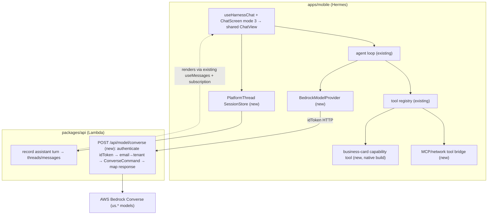
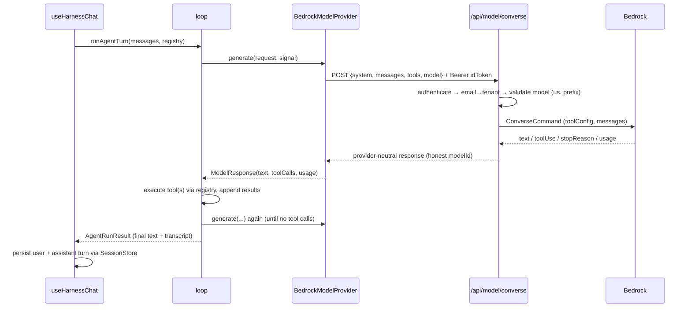

# feat: Mobile agent harness — cloud AWS Bedrock provider + tools + chat UI

## Summary

Build the bespoke lightweight mobile agent harness out into a working agent backed by
**cloud AWS Bedrock** inference. The harness core (the JSON tool-calling loop, the
`ModelProvider` seam, the tool registry, the session-store interface, a mock provider)
already exists at `apps/mobile/lib/agent/` and is tested. This plan adds everything from
the provider outward: a real Bedrock `ModelProvider` reached through a **thin
authenticated platform proxy** (the device sends its Cognito idToken; no on-device AWS
credentials), a network/MCP **tool bridge** plus one mobile-native **capability tool**
(photo of a business card → CRM) as the showcase, a third **chat-UI mode** that runs
turns through the harness, and **turn persistence** through the existing platform thread
path so harness turns render and appear in history like any other thread.

The harness is **our own loop** — explicitly *not* the Pi runtime, which can't run on
iOS (see `docs/solutions/spikes/2026-05-29-mobile-embedded-node-pi-spike.md`). It is the
clean `ModelProvider` seam a future on-device local model slots into. This plan is
**Bedrock-only and not gated on the `005` firming work** — it depends on no
`pi-runtime-core` or `@earendil-works` code.

---

## Problem Frame

`apps/mobile` is a pure cloud GraphQL client today. The harness core gives the phone a
real agent loop that runs in Hermes (no Node runtime, no native addons), but a loop with
only a mock provider does nothing. To make it a usable mobile agent we need: a way to
actually call a model, a way for the model to use tools, a surface to talk to it, and
persistence so turns aren't ephemeral.

Two constraints shape the approach:

- **No on-device AWS credentials in v1.** The fastest, safest reach to Bedrock is a thin
  platform proxy the app already-authenticates to with its Cognito idToken (the
  `workspace-api.ts` pattern). Direct device→Bedrock SigV4 calls would require the
  credential-broker work (Cognito Identity Pool → STS) and are deferred.
- **Bedrock's model resolution is a known footgun.** Newer Anthropic models reject
  on-demand `InvokeModel`/Converse without the `us.` inference-profile prefix
  (`ValidationException`), and unrecognized IDs silently degrade to Sonnet
  (`feedback_pi_ai_silent_validation_exception`, `project_pi_framework_is_earendil`).
  The provider and proxy must fail loud and report the model that actually ran.

The platform already performs Bedrock Converse with tool-use (via the pi-ai SDK inside
the cloud runtime), so the wire mapping is a known quantity to mirror — but the proxy
should call the AWS SDK `ConverseCommand` directly rather than depend on pi-ai's registry
and history-normalization behavior.

---

## Requirements

- R1. A mobile harness turn can call AWS Bedrock and get a real answer, through a
  platform proxy authenticated by the user's Cognito idToken. No AWS credentials on the
  device.
- R2. The provider implements the existing `ModelProvider` seam unchanged — the loop,
  registry, and types are not modified to accommodate it.
- R3. Tool-calling round-trips: the model can request a registered tool, the loop
  executes it, and the result feeds the next model call (multi-step), across both
  network/MCP tools and mobile-native tools.
- R4. Model resolution is honest: unknown or un-prefixed model IDs fail loud (no silent
  Sonnet substitution), `ValidationException` surfaces as an error (not empty content +
  0 tokens), and the response reports the model that actually ran.
- R5. Token usage is reported accurately for a normal turn.
- R6. A user can talk to the harness agent from a chat surface in the app, with assistant
  text, tool calls, and tool results rendered.
- R7. Harness turns persist through the existing platform thread path — the user message
  and the (client-produced) assistant turn appear in the thread and in `/threads`
  history, rendered by the existing message query + subscription.
- R8. The showcase capability works end-to-end: a photo of a business card → a multimodal
  Bedrock turn → a CRM action via a tool.
- R9. Tenant resolution is correct for Google-federated users (null JWT `tenantId`) via
  the email→`users.tenant_id` lookup.

---

## Key Technical Decisions

- **Reach Bedrock through a thin platform proxy, not direct device SigV4.** The mobile
  `BedrockModelProvider` POSTs a provider-neutral request to a new authenticated platform
  endpoint that performs the Converse call server-side. No on-device AWS creds; reuses
  the `workspace-api.ts` idToken client pattern. Direct SigV4 + Cognito-Identity-Pool
  brokered creds is deferred (it's the harder credential-broker surface from plan `002`).

- **The proxy calls the AWS SDK `ConverseCommand` directly, not pi-ai.** Mirror the
  canonical mapping (`convertToolConfig` / `convertMessages` / `mapStopReason` / usage)
  from the installed `@earendil-works/pi-ai` `amazon-bedrock` provider, but own the call.
  This avoids pi-ai's `getModel` registry returning `undefined` for typos, its
  string→content-block history-normalization requirement, and a worktree-only dependency.
  The harness `ToolSpec`/`ToolCall`/`Message` shapes are a near-1:1 match to Bedrock's
  `toolConfig`/`toolUse`/`toolResult`.

- **Fail-loud model resolution lives in the proxy (server-side, authoritative) and is
  mirrored in the provider.** Validate the requested model ID against an allowlist of
  `us.`-prefixed inference-profile IDs; reject unknown/un-prefixed IDs with a clear error;
  catch `ValidationException` and surface it rather than recording empty content + 0
  tokens; return the resolved `modelId` so the UI never claims a model that didn't run
  (`feedback_pi_ai_silent_validation_exception`). Verify the live model IDs against
  Bedrock at implementation time — they drift.

- **Tenant resolution via email lookup, not the JWT claim.** `authenticate()` returns a
  null `tenantId` for Google-federated users (every mobile OAuth user, incl. Eric). The
  proxy must resolve tenant by `users.email` like `auth-me.ts` does
  (`feedback_oauth_tenant_resolver`); trusting `auth.tenantId` produces null-tenant turns.

- **Persist turns through the existing thread path.** A `SessionStore` implementation
  records the user message and the client-produced assistant turn (plus tool evidence) to
  the platform `threads`/`messages` so they render via the existing `useMessages` +
  subscription and appear in history. The user message reuses the existing send path; the
  client-produced assistant turn needs a minimal authenticated "record assistant turn"
  write (the one genuinely new persistence primitive). Device-local SQLite caching/offline
  buffering is deferred.

- **Network/MCP tools first (no native build); one mobile-native showcase tool second.**
  The network/MCP tool bridge (wrapping `mcp-client.ts`) proves the tool path with zero
  native dependencies. The business-card capability tool requires adding
  `expo-image-picker` + a camera/photo permission + an EAS build, so it lands as its own
  unit with that native-build implication called out.

- **Multimodal (image) input is part of the provider/proxy contract** so the showcase
  works — Converse image content blocks, fed from the picked photo.

- **No new harness-core changes.** Everything attaches at the existing seams
  (`ModelProvider`, `Tool`, `SessionStore`, the `ChatScreen` mode split). The local
  on-device model provider stays out of scope (parked).

---

## High-Level Technical Design

### Components

### A turn, end to end

---

## Implementation Units

Phased. U-IDs are stable. The harness core at `apps/mobile/lib/agent/` is the
already-built foundation; nothing in it is modified.

### Phase A — Provider + proxy (the focus)

### U1. Platform Bedrock Converse proxy endpoint

- **Goal:** An authenticated platform endpoint that takes a provider-neutral request and
  performs a Bedrock Converse call server-side, with fail-loud model resolution.
- **Requirements:** R1, R4, R5, R9.
- **Dependencies:** none.
- **Files:**
  - `packages/api/src/handlers/model-converse.ts` (new)
  - `packages/api/src/handlers/model-converse.test.ts` (new)
  - `terraform/modules/app/lambda-api/handlers.tf` (add `"POST /api/model/converse"` to
    the `local.api_routes` map; per-key timeout override > 30s default)
  - `scripts/build-lambdas.sh` (add the build entry; check `BUNDLED_AGENTCORE_ESBUILD_FLAGS`
    if bundling `@aws-sdk/client-bedrock-runtime`)
- **Approach:** Mirror `packages/api/src/handlers/auth-me.ts` for structure: OPTIONS→204
  via `handleCors` **before** auth, `authenticate(event.headers)`, gate on
  `authType === "cognito"`, resolve tenant via `users.email` lookup (not the JWT claim).
  Map the request body → `ConverseCommand` input (`modelId`, `messages`, `system`,
  `inferenceConfig`, `toolConfig`) mirroring the `@earendil-works/pi-ai` `amazon-bedrock`
  mapping; parse `output.message.content[]` into `{text, toolCalls(from toolUse blocks),
  stopReason(mapStopReason), usage}`. Validate `modelId` against an allowlist of
  `us.`-prefixed IDs; reject unknown/un-prefixed with a 4xx error; catch
  `ValidationException` and return a surfaced error (not empty content). Read env (region,
  allowlist) via a lazy function, not module-scope const (`feedback_vitest_env_capture_timing`).
- **Patterns to follow:** `auth-me.ts` (auth + email→tenant), `packages/api/src/lib/response.ts`
  (`handleCors`, `json`), `packages/api/src/lib/cognito-auth.ts` (`authenticate`); Bedrock
  mapping from the installed `@earendil-works/pi-ai/dist/providers/amazon-bedrock.js`
  (`convertToolConfig`, `convertMessages`, `mapStopReason`).
- **Execution note:** New handler needs the Terraform route AND the `build-lambdas.sh`
  entry in the same change or every deploy fails `filebase64sha256`
  (`feedback_lambda_zip_build_entry_required`). Deploy via PR to `main`, not
  `update-function-code` (`feedback_graphql_deploy_via_pr`).
- **Test scenarios:**
  - Covers R1. A valid request with a `us.`-prefixed model returns mapped
    `{text, toolCalls, stopReason, usage, modelId}` (Bedrock client mocked).
  - Covers R4. An un-prefixed or unknown model ID is rejected with a clear error; no
    Converse call is made; no Sonnet substitution.
  - Covers R4. A mocked `ValidationException` surfaces as an error response, not a 200
    with empty content + 0 tokens.
  - A tool-using assistant turn maps `toolUse` blocks → `toolCalls` with id/name/input.
  - Consecutive tool results in the request are coalesced into one user message (Bedrock
    requires this).
  - OPTIONS returns 204 with CORS headers before auth runs; a missing/invalid token
    returns 401 with CORS headers.
  - Covers R9. A caller whose JWT `tenantId` is null resolves tenant by email; an unknown
    email fails closed.
- **Verification:** the endpoint returns a correctly-mapped Converse result for a normal
  and a tool-using turn; bad model IDs and ValidationExceptions fail loud; tenant resolves
  for a federated user.

### U2. Mobile `BedrockModelProvider`

- **Goal:** A `ModelProvider` implementation that drives the harness loop by calling the
  U1 proxy with the user's idToken.
- **Requirements:** R1, R2, R4, R5.
- **Dependencies:** U1.
- **Files:**
  - `apps/mobile/lib/agent/providers/bedrock.ts` (new)
  - `apps/mobile/lib/agent/providers/bedrock.test.ts` (new)
  - `apps/mobile/lib/agent/index.ts` (export)
- **Approach:** Implement `ModelProvider` (`id: "bedrock-converse"`). `generate(request,
  signal)` maps the harness `ModelRequest` (system, messages, tools, model) to the proxy
  body, POSTs via an idToken client mirroring `apps/mobile/lib/workspace-api.ts`
  (`await getIdToken()` per request, `Authorization: Bearer`, base URL =
  `EXPO_PUBLIC_GRAPHQL_URL` with `/graphql` stripped), and maps the response →
  `ModelResponse`. Pass `signal` through to `fetch`. On a non-ok/`ok:false` response,
  throw (the loop converts provider throws to a clean `error` stop reason). Set
  `modelResponse.modelId` from the proxy's honest value. Do **not** implement retries or
  model resolution client-side beyond surfacing the proxy's error — resolution is
  authoritative in U1.
- **Patterns to follow:** `apps/mobile/lib/workspace-api.ts` (idToken HTTP client,
  error-shape handling), `apps/mobile/lib/auth.ts` `getIdToken()`; the existing
  `MockModelProvider` for the interface shape.
- **Test scenarios:**
  - Covers R2. A `runAgentTurn` using `BedrockModelProvider` (fetch stubbed via
    `vi.stubGlobal`) completes a direct-answer turn and a multi-step tool-calling turn —
    proving the real provider satisfies the same seam the mock does.
  - The request body sent to the proxy carries system, mapped messages, and the registry
    tool specs; `Authorization: Bearer <idToken>` is set.
  - Covers R4. A proxy error response (bad model / ValidationException) makes the turn end
    with stop reason `error`, not a fabricated answer.
  - Covers R5. Usage from the proxy response is surfaced on `ModelResponse.usage`.
  - An aborted signal aborts the fetch.
- **Verification:** the harness loop runs real Bedrock turns end-to-end against the proxy
  (mocked in tests; live in manual smoke); failures surface honestly.

### U3. Multimodal (image) input in the provider/proxy contract

- **Goal:** The request contract carries image content so the loop can send a photo to a
  multimodal Bedrock model — the substrate for the business-card showcase.
- **Requirements:** R8.
- **Dependencies:** U1, U2.
- **Files:**
  - `apps/mobile/lib/agent/types.ts` (extend `Message` content to allow image parts — an
    additive optional field; do not break existing string-content usage)
  - `apps/mobile/lib/agent/providers/bedrock.ts`, `packages/api/src/handlers/model-converse.ts`
    (map image parts → Converse `image` content blocks)
  - test updates in `bedrock.test.ts` and `model-converse.test.ts`
- **Approach:** Add an optional structured-content form to a message (text + image parts)
  while keeping plain string content working (the loop and existing tools are unaffected).
  Map image parts to Converse `{ image: { format, source: { bytes } } }`. Keep it minimal:
  one image per user message is enough for v1.
- **Patterns to follow:** Bedrock Converse image content block shape; the additive-field
  discipline so existing `Message` consumers (loop, registry, mock) keep compiling.
- **Test scenarios:**
  - Covers R8. A message with an image part maps to a Converse image content block in the
    proxy request.
  - A plain string-content message still maps to a text block (no regression).
- **Verification:** a multimodal request round-trips; text-only turns unchanged.

### Phase B — Tools

### U4. Network/MCP tool bridge

- **Goal:** Registered harness tools can execute network actions via the existing MCP
  client — proving the full model↔tool round-trip with no native build.
- **Requirements:** R3.
- **Dependencies:** U2.
- **Files:**
  - `apps/mobile/lib/agent/tools/mcp-tool.ts` (new — adapt an MCP tool name + schema into
    a harness `Tool` whose `execute` wraps `callMcpTool`)
  - `apps/mobile/lib/agent/tools/mcp-tool.test.ts` (new)
  - `apps/mobile/lib/mcp-client.ts` (swap the legacy `EXPO_PUBLIC_MCP_AUTH_TOKEN` bearer
    for `getIdToken()` if routing MCP through the user's identity — confirm at execution)
- **Approach:** A factory that, given an MCP tool's name/description/JSON-schema, returns a
  `Tool` whose `execute(args, ctx)` calls `callMcpTool(name, args)` and returns
  `{ content: <stringified result>, isError }`. MCP errors map to `isError` results (the
  loop feeds them back to the model). Tool results that want rich rendering emit
  `_type`-tagged JSON consumable by `genui-registry.ts`.
- **Patterns to follow:** `apps/mobile/lib/mcp-client.ts` (`callMcpTool`, error shape),
  the existing `Tool` interface + `ToolRegistry`.
- **Test scenarios:**
  - Covers R3. A registered MCP-backed tool executes during a loop turn (MCP client
    mocked) and its result is appended as a tool message and re-fed to the model.
  - An MCP error (`result.isError` / `data.error`) becomes an `isError` tool result, and
    the loop continues (model can recover).
  - The tool spec advertised to the model matches the MCP tool's schema.
- **Verification:** a Bedrock turn calls an MCP tool and incorporates the result.

### U5. Business-card capability tool (mobile-native showcase)

- **Goal:** The showcase end-to-end: pick a photo of a business card → multimodal Bedrock
  turn → CRM action via a tool.
- **Requirements:** R8.
- **Dependencies:** U3, U4.
- **Files:**
  - `apps/mobile/package.json` (add `expo-image-picker`)
  - `apps/mobile/app.json` (image-picker plugin + `NSCameraUsageDescription` /
    photo-library usage string; photo-library description already present)
  - `apps/mobile/lib/agent/tools/capture-business-card.ts` (new — picks an image, returns
    it as an image part for the next turn)
  - `apps/mobile/lib/agent/tools/capture-business-card.test.ts` (new — image-picker mocked)
- **Approach:** A capability tool (or composer affordance) that invokes `expo-image-picker`,
  attaches the chosen image as a multimodal message part (U3), and lets the model extract
  fields and call a CRM MCP tool (U4) to create the opportunity. Permission-gated; mirror
  the `expo-speech-recognition` config-plugin + permission precedent already in `app.json`.
- **Execution note:** Adding a native module requires `expo prebuild`/regenerate + a new
  EAS build; verify on a native dev build, **not** Expo Go
  (`docs/solutions/best-practices/expo-splash-native-dev-build-verification-2026-04-27.md`).
- **Patterns to follow:** the `expo-speech-recognition` plugin/permission wiring in
  `app.json`; the U4 MCP tool bridge for the CRM call.
- **Test scenarios:**
  - The tool returns an image part for a picked photo (image-picker mocked); a cancelled
    pick returns a clean no-op result, not an error turn.
  - Covers R8 (integration, native-build-gated): on a dev build, a business-card photo
    yields extracted fields and a CRM tool call. (Manual/native verification — not a
    node-vitest test.)
- **Verification:** on a native build, the showcase runs end-to-end; unit-level, the tool
  produces a valid image part and handles cancellation.

### Phase C — UI + persistence

### U6. `useHarnessChat` hook + third ChatScreen mode

- **Goal:** A chat surface that runs turns through the harness and renders the loop's
  output in the existing shared chat view.
- **Requirements:** R6.
- **Dependencies:** U2 (U4 for tools).
- **Files:**
  - `apps/mobile/hooks/useHarnessChat.ts` (new — returns the shared
    `{ messages, send, connectionStatus, isStreaming, historyLoaded, ... }` shape)
  - `apps/mobile/components/chat/ChatScreen.tsx` (add a third branch selecting the harness
    mode, feeding the existing `ChatView`)
  - `apps/mobile/lib/agent/harness-chat-core.ts` (new — testable turn-driving logic under
    `lib/` so vitest's `lib/**` include picks it up)
  - `apps/mobile/lib/agent/harness-chat-core.test.ts` (new)
- **Approach:** The hook owns a `ToolRegistry` (network/MCP tools + the capability tool),
  builds the seed transcript from prior messages + the new user message, calls
  `runAgentTurn` with `BedrockModelProvider`, and maps `AgentEvent`s → the shared
  `ChatMessage` shape (assistant text, tool-call/result rows; reuse `genui-registry` for
  rich tool results). No `ChatView`/`ChatBubble`/`ChatInput` changes. Put the
  turn-driving + event-mapping logic in `lib/agent/harness-chat-core.ts` so it is unit
  testable (the hook is a thin RN wrapper; `hooks/*.test.ts` is outside vitest's `lib/**`
  include — see Risks).
- **Patterns to follow:** `apps/mobile/components/chat/ChatScreen.tsx` (mode split →
  shared `ChatView`), `apps/mobile/hooks/useGatewayChat.ts` (`ChatMessage` type + the
  hook return shape), `apps/mobile/hooks/useGraphQLChat.ts` (streaming/optimistic render).
- **Test scenarios:**
  - Covers R6. Given a seed transcript and a stubbed provider, driving a turn maps loop
    events to the expected `ChatMessage` sequence (user, assistant text, tool rows).
  - `isStreaming`/`connectionStatus` transition correctly across a turn and on error.
  - A tool result tagged with a GenUI `_type` is passed through for rich rendering.
- **Verification:** the harness mode renders a full turn in the shared chat view,
  visually indistinguishable in shape from the other modes.

### U7. Turn persistence through the platform thread path

- **Goal:** Harness turns (user message + client-produced assistant turn + tool evidence)
  persist to platform threads so they render via the existing query/subscription and
  appear in `/threads` history.
- **Requirements:** R7.
- **Dependencies:** U6.
- **Files:**
  - `apps/mobile/lib/agent/platform-thread-session-store.ts` (new — implements the
    existing `SessionStore` interface; writes turns via the thread path)
  - `apps/mobile/lib/agent/platform-thread-session-store.test.ts` (new)
  - a minimal authenticated "record assistant turn" write — EITHER a new GraphQL mutation
    (`packages/database-pg/graphql/types/*.graphql` + `packages/api` resolver + codegen
    across consumers) OR a side-effect persist on the U1 proxy's final step. Resolve the
    mechanism in this unit (see Approach).
- **Approach:** The user message reuses the existing send/thread-create path
  (`useGraphQLChat`'s `useCreateThread`/`useSendMessage`). The client-produced assistant
  turn is the one genuinely new write: it needs an authenticated way to append an
  assistant message (with `toolResults`/evidence) to a thread. **Recommended:** a narrow
  authenticated "append assistant turn" path rather than widening any existing mutation —
  evaluate adding it to the U1 proxy as an end-of-turn persist (server already
  authenticated + tenant-resolved) vs. a dedicated GraphQL mutation; prefer the proxy
  side-effect if it avoids a codegen change across all four consumers
  (`docs/solutions/workflow-issues/platform-agent-space-runtime-refactor-autopilot-sequencing-2026-05-23.md`).
  Persisted turns must render through `useMessages` + `useNewMessageSubscription`
  unchanged. Do **not** touch `spaces.*` schema (`project_spaces_rearchitecture_parallel`).
- **Execution note:** if the assistant-turn write happens in a runtime that POSTs back
  after the turn, snapshot creds/endpoints at entry, don't re-read after
  (`feedback_completion_callback_snapshot_pattern`) — likely N/A here since persistence is
  synchronous in the proxy, but hold the rule if it moves async.
- **Test scenarios:**
  - Covers R7. Completing a harness turn writes the user message and the assistant turn
    (with tool evidence) such that a thread read returns both in order (persistence layer
    mocked at the mutation/endpoint boundary).
  - A turn that errored persists the user message + a surfaced-error assistant state, not
    a fabricated answer.
  - Re-loading the thread shows the harness turn rendered identically to a cloud turn.
- **Verification:** harness turns appear in the thread and in history; render path
  unchanged; no `spaces.*` touched.

### Phase D — Turn context

### U8. System-prompt + tool-policy + turn-context assembly

- **Goal:** A harness turn is assembled with a coherent system prompt and the right
  advertised tool set for the active agent/thread.
- **Requirements:** R3, R6.
- **Dependencies:** U2, U4.
- **Files:**
  - `apps/mobile/lib/agent/turn-context.ts` (new — builds system prompt + selects which
    tools to register for a turn)
  - `apps/mobile/lib/agent/turn-context.test.ts` (new)
- **Approach:** v1 keeps this lightweight: a base system prompt (identity + mobile-safe
  tool guidance) plus the registered network/MCP + capability tools. Full platform
  agent-config / tool-policy parity (fetching the agent's configured tools, per-tenant
  policy narrowing) is deferred — assemble from a small, explicit local config for v1 and
  leave a seam for the platform-config fetch.
- **Patterns to follow:** the workspace/agent context the existing chat path uses; keep it
  smaller than the cloud runtime's full assembly.
- **Test scenarios:**
  - Covers R6. A built turn context yields a non-empty system prompt and the expected tool
    specs for a given tool set.
  - Covers R3. Tools selected for the turn are exactly those registered; an empty tool set
    yields a tools-less request (model answers directly).
- **Verification:** turns are assembled with a coherent prompt + correct tool set;
  swapping the tool set changes what the model is offered.

---

## Scope Boundaries

### In scope

The cloud Bedrock provider + platform proxy, fail-loud honest model resolution, accurate
usage, multimodal image input, a network/MCP tool bridge, one mobile-native showcase tool
(business-card → CRM), a third harness chat mode rendering in the existing view, and turn
persistence through the platform thread path.

### Deferred to Follow-Up Work

- Direct device→Bedrock SigV4 with Cognito-Identity-Pool brokered creds (removes the
  proxy hop) — the credential-broker surface from plan `002`.
- The broader mobile-native tool set (contacts, calendar, location, live camera, voice
  action) beyond the business-card showcase.
- Device-local SQLite session store + offline buffering + sync-when-online reconciliation.
- Full platform agent-config / tool-policy parity in turn-context assembly.
- Streaming token deltas to the UI (v1 renders on turn/step completion).

### Outside this product's identity / parked

- The local/on-device `ModelProvider` (llama.rn / ExecuTorch / MLC / Apple Foundation
  Models) — parked at the seam until the on-device-model trigger
  (`project_mobile_on_device_pi_embedded_node`). This plan keeps the seam clean for it.
- Multiplayer Spaces thread collaboration — its own future brainstorm.
- Running the actual Pi runtime on the device (NO-GO,
  `docs/solutions/spikes/2026-05-29-mobile-embedded-node-pi-spike.md`).

---

## Risks & Dependencies

- **Bedrock model-ID drift + the `us.` prefix.** Verify the live inference-profile model
  IDs against Bedrock before pinning the allowlist; a swallowed `ValidationException`
  presents as a ~2s empty-content turn (`feedback_pi_ai_silent_validation_exception`). U1
  fails loud to make this impossible to ship silently.
- **New Lambda handler registration trifecta.** Handler + `handlers.tf` route +
  `build-lambdas.sh` entry must land together or every deploy fails
  (`feedback_lambda_zip_build_entry_required`); OPTIONS must bypass auth
  (`docs/solutions/integration-issues/lambda-options-preflight-must-bypass-auth-2026-04-21.md`);
  deploy via PR (`feedback_graphql_deploy_via_pr`); check `BUNDLED_AGENTCORE_ESBUILD_FLAGS`
  if bundling the Bedrock SDK; raise the per-route timeout above the 30s default.
- **Null tenant for federated users.** The proxy must resolve tenant by email; trusting
  the JWT claim yields null-tenant turns (`feedback_oauth_tenant_resolver`).
- **Vitest include glob.** `apps/mobile/vitest.config.ts` only collects `lib/**/*.test.ts`.
  Hook logic that needs testing must live under `lib/` (hence `harness-chat-core.ts`), or
  widen the include — don't put untested turn logic in `hooks/`.
- **Native build for U5.** `expo-image-picker` + permission requires prebuild + an EAS
  build; verify on a native dev build, never Expo Go; keep the Apple Team ID stable
  (`docs/solutions/runbooks/rotate-apple-developer-credentials-2026-05-22.md`).
- **Persistence mechanism (U7).** A new GraphQL mutation couples producer + four codegen
  consumers; prefer the proxy side-effect persist if it avoids that. Don't touch `spaces.*`.
- **MCP client auth.** `mcp-client.ts` uses the legacy shared bearer; routing MCP through
  user identity needs the `getIdToken()` swap (`feedback_mobile_cognito_sync_invariant` —
  keep `getCurrentUser()`/hydration synchronous).
- **Worktree/CI hygiene.** Clear `tsbuildinfo` + rebuild `@thinkwork/database-pg` before
  first typecheck (`feedback_worktree_tsbuildinfo_bootstrap`); CI has no `uv`
  (`feedback_ci_lacks_uv`).
- **Not gated on `005`.** The harness is independent of `pi-runtime-core` /
  `@earendil-works`; this plan can proceed regardless of the firming work's state.

---

## Open Questions

### Resolve before the relevant unit (empirical, at execution time)

- U1: the exact set of live `us.`-prefixed Bedrock model IDs to allowlist (verify against
  Bedrock; they drift).
- U1: whether the Bedrock SDK client should be bundled (esbuild flags) or externalized for
  this handler.
- U7: assistant-turn persistence mechanism — proxy end-of-turn side-effect vs. a dedicated
  GraphQL mutation (prefer the option that avoids a four-consumer codegen change).

### Deferred to implementation

- U4: whether MCP routes through the user idToken now or keeps the shared bearer for v1.
- U6: exact `AgentEvent` → `ChatMessage` mapping for tool rows + GenUI passthrough.
- U8: shape of the v1 local turn-context config and the seam for a later platform-config
  fetch.

---

## Sources & Research

- Harness core (already built, this session): `apps/mobile/lib/agent/`
  (`loop.ts`, `types.ts`, `tool-registry.ts`, `session-store.ts`, `providers/mock.ts`).
- Bedrock Converse mapping to mirror: `@earendil-works/pi-ai` `amazon-bedrock` provider
  (`convertToolConfig` / `convertMessages` / `mapStopReason` / usage); orchestration ref
  `packages/agentcore-pi/agent-container/src/server.ts` (`runAgentLoop`, `resolveModel`,
  `normalizeHistory`).
- Platform handler + auth: `packages/api/src/handlers/auth-me.ts` (auth + email→tenant),
  `packages/api/src/lib/cognito-auth.ts` (`authenticate`), `packages/api/src/lib/response.ts`
  (`handleCors`, `json`), `terraform/modules/app/lambda-api/handlers.tf`,
  `scripts/build-lambdas.sh`.
- Mobile HTTP + auth: `apps/mobile/lib/workspace-api.ts` (idToken client),
  `apps/mobile/lib/auth.ts` (`getIdToken`), `apps/mobile/lib/auth-context.tsx`.
- Mobile chat + persistence: `apps/mobile/components/chat/ChatScreen.tsx` (mode split),
  `apps/mobile/hooks/useGatewayChat.ts` (`ChatMessage`), `apps/mobile/hooks/useGraphQLChat.ts`
  (thread create/send + subscription), `apps/mobile/lib/genui-registry.ts`.
- Tools: `apps/mobile/lib/mcp-client.ts`; expo modules in `apps/mobile/package.json` /
  `app.json` (image-picker NOT yet installed; photo-library permission present, camera not).
- Learnings/memory: `feedback_pi_ai_silent_validation_exception`,
  `project_pi_framework_is_earendil`, `feedback_oauth_tenant_resolver`,
  `feedback_lambda_zip_build_entry_required`,
  `docs/solutions/integration-issues/lambda-options-preflight-must-bypass-auth-2026-04-21.md`,
  `docs/solutions/best-practices/service-endpoint-vs-widening-resolvecaller-auth-2026-04-21.md`,
  `feedback_graphql_deploy_via_pr`, `feedback_vitest_env_capture_timing`,
  `feedback_mobile_cognito_sync_invariant`, `feedback_worktree_tsbuildinfo_bootstrap`,
  `feedback_ci_lacks_uv`, `project_mobile_on_device_pi_embedded_node`,
  `docs/solutions/spikes/2026-05-29-mobile-embedded-node-pi-spike.md`.
