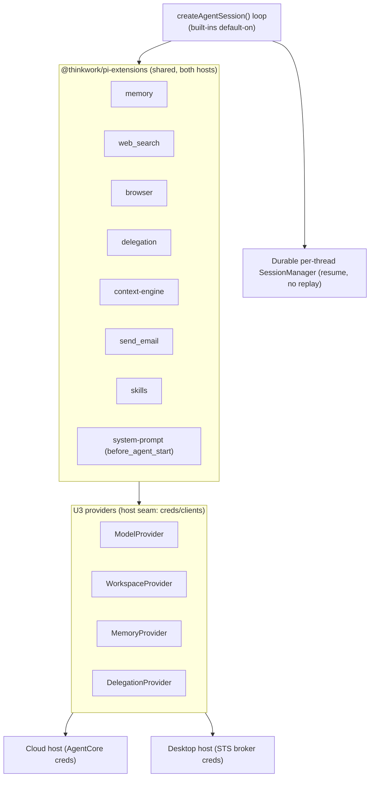
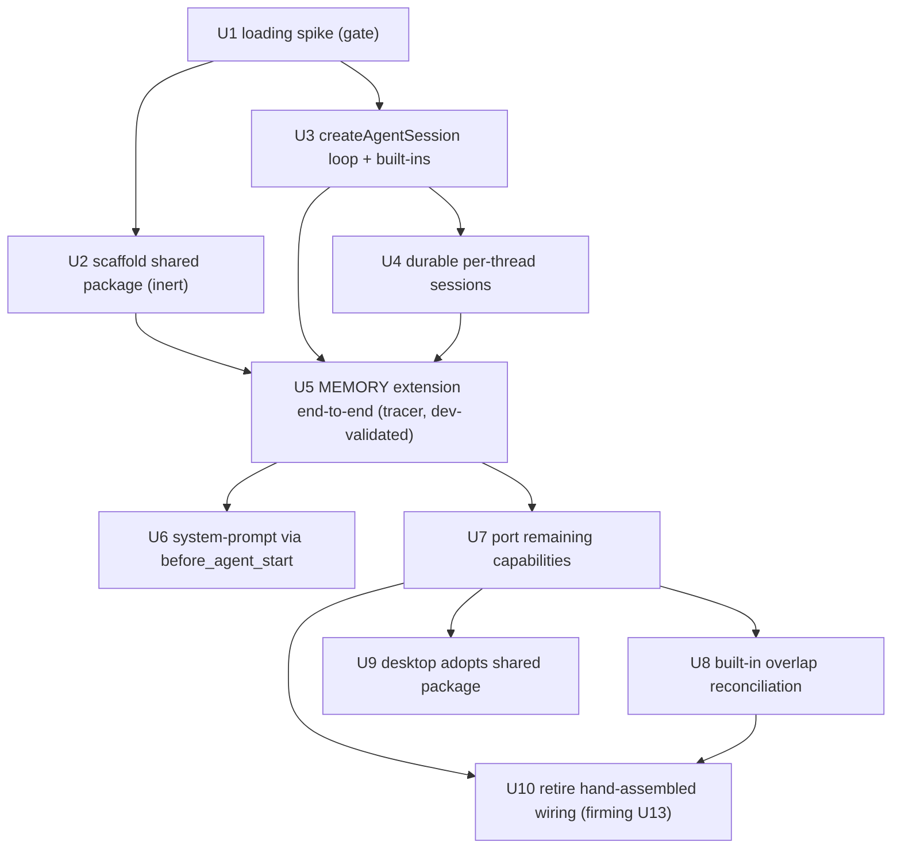

# refactor: Pi extensions as a first-class runtime layer

## Summary

Make Pi **extensions** the first-class home for thinkwork's platform capabilities.
A shared `@thinkwork/pi-extensions` package holds each capability (memory,
web_search, browser, delegation, context-engine, send_email, skills,
system-prompt composition) as a Pi extension, loaded by both the cloud and
desktop hosts on top of `createAgentSession()`, over **durable per-thread
sessions**, with the U3 provider interfaces preserved as the host-capability seam
beneath. This supersedes the firming plan's "createAgentSession + hand-assembled
`customTools`" framing (U4 part 2) and its hand-rolled de-Strands-ification (U13).
The work is sequenced **tracer-bullet-first**: a gating extension-loading spike
and the memory capability land and dev-validate before the remaining capabilities
port against a proven pattern.

## Problem Frame

The firming plan (`docs/plans/2026-05-28-005-refactor-pi-runtime-firming-plan.md`)
already moved the cloud runtime off the deprecated `@mariozechner/*` scope onto
`@earendil-works/*` (U4 part 1, merged + deployed). Its remaining U4 step planned
to inject platform capabilities as hand-assembled **`customTools`** on
`createAgentSession`. Investigation showed `customTools` is the SDK's programmatic
escape hatch, not its intended extensibility surface.

Pi's first-class mechanism is **extensions** (see origin): TypeScript modules that
`registerTool`, edit the system prompt via `before_agent_start`, subscribe to
lifecycle events (`session_start`, `tool_call`, `message_end`), discover skills
via `resources_discover`, and can override built-ins by name. That is almost
exactly what `packages/agentcore-pi/agent-container/src/server.ts` reimplements by
hand today (tool assembly, system-prompt composition, memory recall/reflect,
skill loading). Staying on hand-assembled tools perpetually re-implements what the
SDK provides — the divergent foundation the firming plan exists to eliminate.

Two coupled problems are resolved here:
- **Capabilities should be extensions, shared across hosts** — not per-host
  hand-assembly that drifts.
- **The cloud replays full `messages_history` every invocation** (a Strands-era
  convention). `createAgentSession` is built around a persistent `SessionManager`;
  durable per-thread sessions dissolve the replay/seeding problem and are
  host-symmetric with desktop.

## Requirements Trace

Origin: `docs/brainstorms/2026-05-29-pi-extensions-architecture-requirements.md`.

- R1 — extensions are first-class → U2, U5, U7.
- R2 — shared `@thinkwork/pi-extensions` package, both hosts → U2, U9.
- R3 — layered with U3 providers preserved → U5, U7 (extensions call providers).
- R4 — full built-ins on in the cloud sandbox → U3.
- R5 — overlap reconciliation (keep custom only where isolation/enforcement adds value) → U8.
- R6 — durable per-thread sessions → U4.
- R7 — system-prompt composition via `before_agent_start` → U6.
- R8 — tracer-bullet (memory first) → U5 (and U1 gating spike).
- R9 — capability parity, no regression → U7, U9.
- R10 — reshape firming U4/U13 → this plan supersedes them; U10 retires the
  hand-assembled wiring U13 targeted.

Origin Acceptance Examples: AE1 (tracer) → U5; AE2 (durable session) → U4;
AE3 (one edit, both hosts) → U9; AE4 (built-ins live, no dup) → U3, U8;
AE5 (loading proven) → U1.

## Key Technical Decisions

- **Tracer-bullet first; the loading spike gates everything.** The one genuinely
  unproven mechanism is *how AgentCore loads bundled extensions serverlessly*
  (origin Q1). U1 resolves it empirically before the package or capabilities are
  built out, so the whole arc isn't built on an unverified assumption
  (`docs/solutions/best-practices/bedrock-agentcore-sdk-version-drift-prefer-raw-boto3-2026-04-24.md`
  — verify SDK surface empirically, fail at build not first invocation).

- **Keep `runAgentLoop(args): RunAgentLoopResult` as the stable seam.** The cloud
  loop migrates from `new Agent(...)` to `createAgentSession(...)` *inside*
  `packages/pi-runtime-core/src/agent-loop.ts`, preserving the function contract so
  `server.ts` and `server.test.ts`'s existing override change minimally
  (inert-first seam-swap;
  `docs/solutions/architecture-patterns/inert-first-seam-swap-multi-pr-pattern-2026-05-08.md`).

- **Full built-ins on in the cloud sandbox** (`read/bash/edit/write/grep/find/ls`)
  via `createAgentSession`'s tool allowlist (`initialActiveToolNames` =
  `allToolNames`), plus our extension tools additively — "leverage built-ins,
  disable nothing" (`feedback_pi_leverage_builtin_tools`).

- **Extensions on top, U3 providers underneath, no overlap.** Extensions are the
  agent-facing layer (tools/prompt/hooks); the U3 Model/Workspace/Memory/Delegation
  interfaces stay as the host seam (creds/clients). Extensions call providers;
  providers stay host-swappable. U3 (merged) is preserved.

- **Durable per-thread sessions replace stateless replay.** A `SessionManager`
  backed by durable storage keyed by thread; turns resume the persisted session
  rather than replaying `messages_history`. Backing store (S3 vs Aurora) and
  per-thread concurrency are resolved in U4 (Open Questions). Schema already tracks
  `thread_turns.session_id_before/after`.

- **One shared extension package, both hosts.** Cloud and desktop load the same
  `@thinkwork/pi-extensions` set; the only host difference is config/creds supplied
  through the providers — the real "one core, many hosts."

- **Overlap reconciliation, not blind duplication.** Prefer built-ins where
  semantics match; keep `execute_code` (sandbox isolation + stdout/stderr
  redaction) and `file_read` (workspace-prefix enforcement), overriding the
  built-in by name where ours must win.

- **Hindsight-only memory + cred-snapshot-at-entry carried from the firming plan.**
  The memory extension wraps the U3 `MemoryProvider` (Hindsight), keeps async
  recall/reflect wrappers, and snapshots creds at loop entry
  (`feedback_hindsight_async_tools`, `feedback_completion_callback_snapshot_pattern`,
  `feedback_only_touch_public_schema`).

## High-Level Technical Design

### Target architecture

### Deploy-gated sequencing (tracer-bullet first)

Each arrow into U5 and beyond crosses a dev-deploy validation boundary — the
runtime behavior of `createAgentSession` + extension loading + durable sessions is
only confirmable on a deployed AgentCore runtime (deploy-to-dev is the E2E loop;
`feedback_merge_prs_as_ci_passes`, `feedback_watch_post_merge_deploy_run`).

## Implementation Units

Phasing groups the units; U-IDs are stable. Units past U5 depend on the tracer
bullet validating on a dev deploy first.

### U1. Resolve cloud extension-loading mechanism (spike)

- Goal: empirically determine how the AgentCore container loads bundled
  `@thinkwork/pi-extensions` modules into a `createAgentSession` — Pi's
  `settings.json` `extensions` array pointing at bundled paths vs a programmatic
  SDK load path — and document the chosen mechanism.
- Requirements: R8; origin AE5, Q1.
- Dependencies: none (gating).
- Files:
  - `docs/solutions/spikes/2026-05-29-pi-extension-loading-agentcore-spike.md` (new — findings)
  - throwaway probe under `packages/agentcore-pi/agent-container/` (not merged as product code)
- Approach: Stand up a minimal extension that registers one trivial tool, load it
  via each candidate mechanism in the container, and confirm the tool appears in
  the session's active tools on a real dev turn. Capture: the loading API, where
  extension files must live in the image, how per-invocation config/creds reach the
  extension, and any serverless caveats (the doc notes extensions are "not
  serverless by default"). Resolve before U2/U5 build on it.
- Patterns to follow: AgentCore no-auto-repull verification
  (`docs/solutions/workflow-issues/agentcore-runtime-no-auto-repull-requires-explicit-update-2026-04-24.md`);
  build-time SDK-surface assertion.
- Execution note: spike — the deliverable is the findings doc + a proven mechanism,
  not production code.
- Test scenarios:
  - Covers AE5. On a dev deploy, the probe extension's tool is present in the
    session's active tool set and is callable in a real turn.
  - The chosen mechanism surfaces per-invocation config (tenant/agent/thread) to
    the extension.
  - Test expectation: none for unit tests — verification is the dev-deploy probe +
    the findings doc.
- Verification: a documented, reproduced loading mechanism; a dev turn shows the
  probe tool active. U2 can scaffold against it with confidence.

### U2. Scaffold the shared `@thinkwork/pi-extensions` package (inert)

- Goal: a new workspace package with the extension-authoring conventions and one
  stub extension, building and testing in isolation, consumed by no host yet.
- Requirements: R1, R2.
- Dependencies: U1.
- Files:
  - `packages/pi-extensions/package.json`, `tsconfig.json`, `vitest.config.ts` (new)
  - `packages/pi-extensions/src/index.ts`, `src/define-extension.ts` (new — shared
    authoring helper/conventions over `@earendil-works/pi-coding-agent`)
  - `packages/pi-extensions/src/<stub>.ts` + `test/<stub>.test.ts` (new)
  - root workspace config if package globs need it
- Approach: Establish the extension shape (default factory receiving the
  extension API; `registerTool` / `on(event)` conventions) and a typed seam to
  accept a U3 provider bundle so each extension calls providers rather than
  constructing clients. Inert: ship with tests, no host imports it yet
  (`feedback_ship_inert_pattern`).
- Patterns to follow: the U3 provider-interface package shape in
  `packages/pi-runtime-core/src/`; inert-first seam-swap.
- Test scenarios:
  - Covers R2. A stub extension registers a tool against a fake provider bundle
    with no concrete AWS/Bedrock/Hindsight client; unit constructs it in isolation.
  - The authoring helper rejects a malformed extension (missing factory/tool name).
  - Covers R1. The package builds + typechecks standalone; no host imports it
    (inert).
- Verification: `pi-extensions` builds, typechecks, tests green; grep shows no host
  consumes it yet.

### U3. Migrate the cloud loop to `createAgentSession` + built-ins (keep the seam)

- Goal: `runAgentLoop` runs `createAgentSession()` internally with the full
  built-in tool set enabled, preserving the `RunAgentLoopArgs`/`RunAgentLoopResult`
  contract so `server.ts` changes minimally.
- Requirements: R4; origin AE4.
- Dependencies: U1.
- Files:
  - `packages/pi-runtime-core/src/agent-loop.ts` (swap `new Agent` →
    `createAgentSession`; model via `ModelRegistry`/`AuthStorage`; built-ins via
    `initialActiveToolNames = allToolNames`; tool-invocation + usage extraction
    from the session)
  - `packages/pi-runtime-core/src/types.ts` (add `cwd`/workspace to
    `RunAgentLoopArgs` if the session needs it; keep result shape stable)
  - `packages/agentcore-pi/agent-container/src/server.ts` (pass workspace `cwd`;
    otherwise unchanged call site)
  - `packages/pi-runtime-core/test/agent-loop.test.ts` (new — first direct
    coverage of the loop)
  - `packages/agentcore-pi/agent-container/tests/server.test.ts` (adjust the
    `runAgentLoop` override only if the contract shifted)
- Approach: Drive `createAgentSession` with a fake/in-memory `SessionManager` for
  now (durable backing lands in U4), full built-ins on, our existing platform
  `AgentTool[]` passed as `customTools` *transitionally* (extensions replace this
  in U5/U7). Resolve model via the SDK registry, priming Bedrock auth from the
  container's credential chain. Extract content/usage/tool-invocations from
  `session.messages` + `session.subscribe`. Keep the cred-snapshot-at-entry
  invariant.
- Blast radius: the container Dockerfile runs `tsc --build` over `pi-aws` then
  `agentcore-pi`; keep the whole workspace type graph green (`pnpm --frozen-lockfile`).
- Patterns to follow: the desktop's `createAgentSession` usage in
  `apps/desktop/src/sidecar/local-turn-runner.ts`; the U4-part-1 build-time SDK
  signature assertion.
- Execution note: add a build-time assertion that `createAgentSession` +
  `allToolNames` exist, so SDK drift fails at build, not first invocation.
- Test scenarios:
  - Covers R4, AE4. A cloud turn runs through `createAgentSession`; the active tool
    set contains the 7 built-ins AND our injected tools.
  - Returns non-empty content + non-zero tokens for a representative turn
    (smoke-detector parity).
  - A turn whose `process.env` mutates after entry still finalizes with entry-time
    creds (cred-snapshot invariant preserved).
  - The `runAgentLoop` result shape is unchanged (tool-invocations, usage,
    toolsCalled populated as before).
- Verification: cloud Pi turn succeeds end-to-end via `createAgentSession` on dev;
  built-ins present; result contract stable.

### U4. Durable per-thread sessions

- Goal: a `SessionManager` backed by durable storage keyed by thread; turns resume
  the persisted session instead of replaying `messages_history`.
- Requirements: R6; origin AE2.
- Dependencies: U3.
- Files:
  - `packages/pi-runtime-core/src/durable-session-manager.ts` + test (new —
    implements the SDK `SessionManager` surface over durable storage)
  - `packages/agentcore-pi/agent-container/src/server.ts` (resume by thread instead
    of passing full history; record `session_id_before/after`)
  - `packages/api/src/lib/chat-finalize/*` and/or schema as needed for session
    continuity (coordinate with the firming contract work)
- Approach: Implement the SDK's `SessionManager` contract backed by durable
  storage; on invocation, load the thread's session and resume; persist after the
  turn. Decide backing store and per-thread concurrency (Open Questions). Migrate
  existing threads' history into sessions or accept a cutover. Stop sending full
  `messages_history` once resume is proven.
- Approach (concurrency): two invocations on the same thread must not corrupt the
  session — define locking/optimistic-concurrency before enabling writes.
- Patterns to follow: `thread_turns.session_id_before/after` already in schema;
  cred-snapshot-at-entry; migration-deploy-ordering for any schema change
  (`feedback_migration_deploy_ordering`, `feedback_handrolled_migrations_apply_to_dev`).
- Test scenarios:
  - Covers AE2. Two successive turns on one thread: the second resumes the
    persisted session and has prior context without replaying full history.
  - A turn started before a container recycle resumes correctly after.
  - Concurrent invocations on the same thread do not corrupt or lose session state.
  - Missing/corrupt stored session → defined fallback (rebuild or fail-loud), not
    a silent empty context.
- Verification: multi-turn dev thread keeps context with no full-history replay;
  concurrency test green.

### U5. Memory/hindsight as the first extension end-to-end (tracer bullet)

- Goal: prove the whole spine — the memory capability runs as a Pi extension
  loaded from the shared package, calling the U3 `MemoryProvider`, over
  `createAgentSession` + durable sessions, in the cloud, validated on a dev deploy.
- Requirements: R1, R3, R8; origin AE1.
- Dependencies: U1, U2, U3, U4.
- Files:
  - `packages/pi-extensions/src/memory.ts` + `test/memory.test.ts` (new — registers
    the recall/reflect tool, `session_start` recall hook; calls `MemoryProvider`)
  - `packages/agentcore-pi/agent-container/src/server.ts` (load the memory
    extension via the U1 mechanism; remove the hand-assembled memory tool path)
  - delete/retire the cloud's bespoke memory tool wiring superseded by the extension
- Approach: The memory extension recalls on `session_start` and exposes
  recall/reflect tools, all through the U3 `MemoryProvider` (Hindsight) — keeping
  async wrappers + the recall→reflect chain. The host supplies the provider
  (creds/client); the extension is host-agnostic. This is the first capability to
  go end-to-end and the template the rest follow.
- Patterns to follow: `feedback_hindsight_async_tools`,
  `feedback_hindsight_recall_reflect_pair`, `feedback_only_touch_public_schema`;
  the U3 `MemoryProvider` interface.
- Execution note: the deliverable isn't done until a dev-deploy turn shows the
  extension-loaded memory recall/reflect working (smoke: non-empty content +
  non-zero tokens + memory used).
- Test scenarios:
  - Covers AE1, R1, R3. With a fake `MemoryProvider`, the extension's
    `session_start` recalls and its reflect tool writes back; no hand-assembled
    memory tool remains in the cloud path.
  - Recall is followed by reflect (chain contract preserved).
  - The extension calls only the provider — no direct Hindsight client in the
    extension (host-agnostic).
  - Dev-deploy: a real turn uses memory via the loaded extension.
- Verification: dev turn recalls/reflects via the loaded extension + provider;
  loading + sessions + provider seam all proven on one capability.

### U6. System-prompt composition via `before_agent_start`

- Goal: the composed system prompt is produced through an extension
  `before_agent_start` hook rather than hand-built in `server.ts` and passed as a
  string, shared by both hosts.
- Requirements: R7.
- Dependencies: U5.
- Files:
  - `packages/pi-extensions/src/system-prompt.ts` + test (new)
  - `packages/agentcore-pi/agent-container/src/runtime/system-prompt.ts` (move
    composition into the extension hook; keep the workspace-defaults/skill-block
    inputs)
  - `packages/agentcore-pi/agent-container/src/server.ts` (stop passing a prebuilt
    prompt string)
- Approach: Port `composeSystemPrompt` into the `before_agent_start` hook so the
  prompt is assembled inside the session lifecycle from workspace defaults +
  available tools + skill blocks. One composition path for cloud + desktop.
- Test scenarios:
  - Covers R7. For a representative tenant/agent tuple, the hook produces the
    expected composed prompt (defaults + tools + skills) inside the session.
  - Parity: the composed prompt matches the prior hand-built output for the same
    inputs (characterization).
- Execution note: characterization-first — capture the current composed prompt for
  a fixture tuple before moving the logic, assert parity.
- Verification: prompt composition runs via the hook; characterization parity holds.

### U7. Port the remaining capabilities to extensions

- Goal: web_search, browser, context-engine, send_email, delegation, and skills
  become extensions in the shared package, replacing their hand-assembled tool
  wiring in the cloud.
- Requirements: R1, R3, R9.
- Dependencies: U5.
- Files:
  - `packages/pi-extensions/src/{web-search,browser,context-engine,send-email,delegation,skills}.ts`
    + tests (new)
  - `packages/agentcore-pi/agent-container/src/server.ts` + the corresponding
    `runtime/tools/*` (retire hand-assembled wiring as each capability moves)
- Approach: One capability per extension, each calling the relevant U3 provider /
  host service (delegation → `DelegationProvider`; workspace/skills →
  `WorkspaceProvider`). Follow the U5 template. Preserve per-capability config gates
  (a capability only registers when its config is present). No behavior regression.
- Test scenarios:
  - Covers R9. Each migrated extension registers its tool(s) against a fake
    provider; behavior matches the prior custom tool for a representative call.
  - A capability whose config is absent does not register its tool (gating
    preserved).
  - Covers R3. Extensions call providers, never construct host clients directly.
- Verification: every capability available as an extension; cloud turns exercise
  each with no regression vs prior behavior.

### U8. Built-in overlap reconciliation

- Goal: remove blind duplication between built-ins and custom tools; keep custom
  tools only where they add isolation/enforcement.
- Requirements: R5; origin AE4.
- Dependencies: U7.
- Files:
  - `packages/agentcore-pi/agent-container/src/runtime/tools/execute-code.ts`,
    `.../file-read` wiring (keep + override built-in by name where needed)
  - retire now-redundant custom tools superseded by built-ins
- Approach: Audit each built-in vs custom overlap. Prefer built-ins where
  semantics match (grep/find/ls). Keep `execute_code` (sandbox isolation +
  redaction) and `file_read` (workspace-prefix enforcement); register them as
  name-overrides so ours wins. Remove duplicates so the model sees one tool per
  capability.
- Test scenarios:
  - Covers R5, AE4. The active tool set has no duplicate "two ways to read a file /
    run code"; `execute_code`/`file_read` overrides win where kept.
  - A retired custom tool is absent; its built-in equivalent is present and works.
  - Sandbox isolation/redaction still applies through the kept `execute_code` path.
- Verification: deduplicated tool set; isolation/enforcement intact; no regression.

### U9. Desktop host adopts the shared extension package

- Goal: the desktop sidecar loads the same `@thinkwork/pi-extensions` set as the
  cloud, so a capability is defined once for both hosts.
- Requirements: R2, R9; origin AE3.
- Dependencies: U7.
- Files:
  - `apps/desktop/src/sidecar/local-turn-runner.ts` (load the shared extensions;
    retire desktop-specific tool assembly)
  - `apps/desktop/package.json` (depend on `@thinkwork/pi-extensions`)
- Approach: Replace the desktop's bespoke `customTools` assembly with the shared
  extension set, supplying desktop creds via its providers (STS broker, firming
  U14/U15). Built-in subset stays a per-host decision (desktop may keep read-only;
  see Scope Boundaries). Proves "one edit, both hosts."
- Test scenarios:
  - Covers AE3, R2. A change to a shared extension changes desktop behavior with no
    desktop-specific edit.
  - Desktop turn exercises a shared extension (e.g., memory) via the desktop
    providers.
  - Covers R9. No capability regression on desktop vs its prior behavior.
- Verification: desktop runs the shared extensions; a shared-extension change
  reflects on both hosts.

### U10. Retire hand-assembled tool/prompt wiring (firming U13 close-out)

- Goal: remove the now-dead hand-assembled tool/system-prompt assembly and the
  Strands-mirroring conventions U13 targeted, now that extensions own them.
- Requirements: R10.
- Dependencies: U7, U8.
- Files:
  - `packages/agentcore-pi/agent-container/src/server.ts` (remove `assembleTools`
    and prompt-string plumbing superseded by extensions)
  - `packages/api/src/lib/agentcore-spans.ts` (remove the Strands-tracer-only span
    filter so Pi spans are captured — carried from firming U13)
  - delete dead `runtime/tools/*` wiring fully replaced by extensions
- Approach: Delete the superseded wiring; reconcile telemetry (Pi spans captured,
  not filtered by the Strands tracer scope). Run a fresh consumer survey before
  deleting (the plan is a snapshot).
- Patterns to follow:
  `docs/solutions/workflow-issues/survey-before-applying-parent-plan-destructive-work-2026-04-24.md`;
  firming U13.
- Test scenarios:
  - Covers R10. A cloud turn runs with no `assembleTools`/prompt-string path; tools
    + prompt come entirely from extensions.
  - Pi runtime spans appear in `fetchSpansForSession` (no Strands-tracer-only
    filter).
  - Test expectation: none for the pure deletions beyond a green deploy + Pi smoke.
- Verification: clean cloud turn with all capability + prompt wiring via
  extensions; Pi spans captured; no dead wiring remains.

## Scope Boundaries

### In scope

Extensions as the agent-facing layer; shared `@thinkwork/pi-extensions` package
loaded by both hosts; layering with preserved U3 providers; full cloud built-ins +
overlap reconciliation; durable per-thread sessions; system-prompt via extension
hook; tracer-bullet (memory) then full capability parity; desktop adoption;
retiring the hand-assembled wiring (firming U13 close-out).

### Deferred for later

- Adopting Pi's native `resources_discover` for the tenant skill catalog (today's
  `run_skill` + materialized `skills/`) — origin Q3; revisit after the tracer
  bullet.
- Migrating the desktop from its read-only built-in subset to the full set
  (per-host blast-radius decision).
- Registering custom model **providers** via the extension `registerProvider` hook
  (U3 `ModelProvider` covers cloud needs for now).

### Deferred to Follow-Up Work

- Backfilling/migrating existing thread history into durable sessions if U4 opts
  for a cutover rather than a migration.

### Outside this product's identity

- Maintaining hand-assembled `customTools`/tool wiring as the standing
  architecture (extensions are the home; `customTools` is transitional only).
- Per-host divergent capability sets as a standing design.
- Stateless full-history replay as the standing session model.

## Risks & Dependencies

- **Extension-loading is the gating unknown.** If U1 can't prove a clean
  serverless load mechanism, the package/capability units are blocked — U1 is
  first and explicitly a spike.
- **Durable sessions add concurrency + storage risk.** Two invocations per thread,
  store backing choice, and existing-thread migration are real; U4 must resolve
  concurrency before enabling writes.
- **Single-author 0.x SDK.** `@earendil-works/*` extension/session APIs may shift;
  keep the build-time signature assertion and the firming plan's supply-chain
  Tier-1 review + vendored-tarball contingency.
- **Deploy-validated behavior.** `createAgentSession`, extension loading, and
  durable sessions are only fully confirmable on a dev deploy — each post-U5 unit
  carries a dev-smoke gate (`feedback_merge_prs_as_ci_passes`,
  `feedback_watch_post_merge_deploy_run`); AgentCore no-auto-repull (verify
  `containerUri`).
- **Concurrent firming work.** This plan supersedes firming U4 part 2 + U13 and
  shares files with the firming plan (`server.ts`, `pi-runtime-core`,
  `local-turn-runner.ts`); sequence against firming U14/U15 (desktop STS) which U9
  depends on for desktop creds.
- **Container build graph.** `tsc --build` over `pi-aws` → `agentcore-pi`; the new
  `pi-extensions` package must slot into the build order. Worktree bootstrap:
  clear `tsbuildinfo` + build `@thinkwork/database-pg` before typecheck
  (`feedback_worktree_tsbuildinfo_bootstrap`).
- **CI lacks `uv`**; don't spawn `uv run` from TS tests (`feedback_ci_lacks_uv`).

## Open Questions

### Resolve before the relevant unit

- U1 (gating): exact serverless extension-loading mechanism — `settings.json`
  `extensions` vs programmatic load — and where extension files live in the image.
- U4: durable session store backing (S3 vs Aurora), per-thread concurrency model,
  and existing-thread migration vs cutover.

### Deferred to implementation

- U3/U5: whether platform tools pass transitionally as `customTools` during U3
  before extensions fully replace them in U5/U7, or extensions land first.
- U8: per-capability overlap reconciliation specifics (which customs retire vs
  override which built-ins).
- U6: exact composed-prompt parity fixtures.

## Sources & Research

- Origin: `docs/brainstorms/2026-05-29-pi-extensions-architecture-requirements.md`
- Pi extensions doc: https://pi.dev/docs/latest/extensions (registerTool,
  before_agent_start, lifecycle events, resources_discover, override-by-name,
  "not serverless by default")
- SDK surface (this session's inspection): `@earendil-works/pi-coding-agent@0.76.0`
  `createAgentSession` options (`tools`/`customTools`/`noTools`/
  `initialActiveToolNames`/`allowedToolNames`/`baseToolsOverride`), `AgentSession`
  (`prompt`/`messages`/`subscribe`/`dispose`), `allToolNames`
  (`read/bash/edit/write/grep/find/ls`), `ModelRegistry`/`AuthStorage`/
  `SessionManager`/`DefaultResourceLoader`
- Desktop reference: `apps/desktop/src/sidecar/local-turn-runner.ts`
  (`createAgentSession` driving pattern)
- Cloud loop + call site: `packages/pi-runtime-core/src/agent-loop.ts`,
  `packages/agentcore-pi/agent-container/src/server.ts`
- U3 providers (merged): `packages/pi-runtime-core/src/{model,workspace,memory}-provider.ts`,
  `delegation.ts`
- Firming plan (superseded U4 pt2/U13):
  `docs/plans/2026-05-28-005-refactor-pi-runtime-firming-plan.md`
- Learnings: inert-first seam-swap
  (`docs/solutions/architecture-patterns/inert-first-seam-swap-multi-pr-pattern-2026-05-08.md`),
  AgentCore no-auto-repull, env-shadowing/cred-snapshot, supply-chain integrity,
  survey-before-destructive-work
