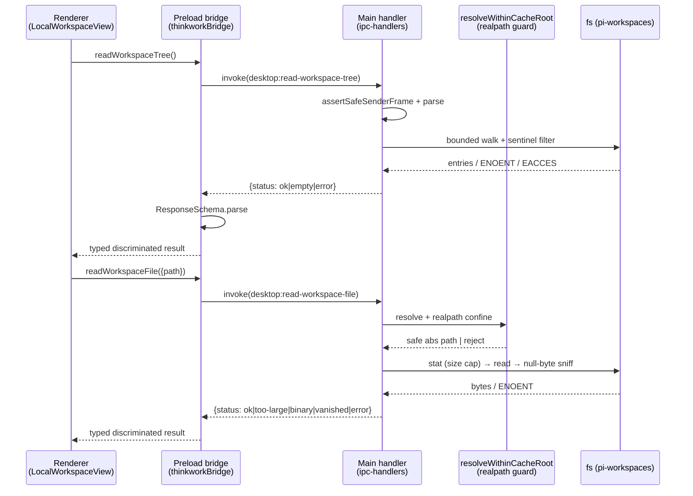
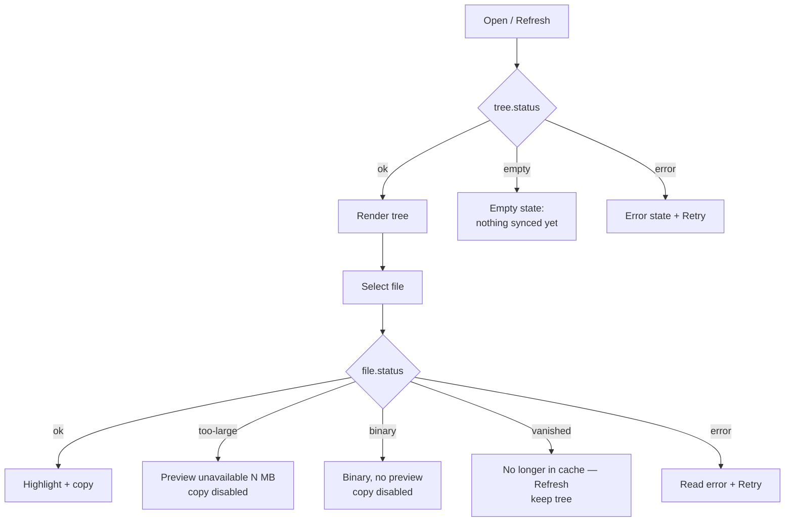

# feat: Desktop Local Workspace view

## Summary

Add a read-only **Local Workspace** inspector to the desktop Settings menu. It
renders the local Pi sidecar's synced workspace cache (the `pi-workspaces`
directory under Electron `userData`) as a nested file tree on the left and the
selected file's contents — line-numbered, syntax-highlighted, copyable — on the
right, with a manual Refresh. New read-only filesystem IPC (`read-tree`,
`read-file`) is added to the desktop bridge, confined to the cache root by a
realpath-based traversal guard. The surface is desktop-build only and renders an
empty state until the in-flight sidecar populates the cache.

---

## Problem Frame

The desktop app is moving toward a local agent posture. The in-flight Desktop
Local Pi Sidecar (`docs/plans/2026-05-28-003-feat-desktop-local-pi-sidecar-plan.md`)
syncs each rendered S3 workspace into an app-owned cache under Electron
`userData`, partitioned by stage/tenant/agent/Space/user. Today that cache is a
black box — the only way to confirm what the sidecar pulled down is to dig
through a hidden directory in Finder. As the local runtime becomes the primary
execution path, "what does my agent actually see on disk right now?" becomes a
routine question. There is no in-app answer.

Research confirms three facts that shape the build:

- **No reference viewer exists.** The brainstorm's Image #2 (the thread
  goal-folder viewer) is unbuilt — `docs/plans/2026-05-27-005-feat-thread-goal-folder-editor-plan.md`
  describes a read-write CodeMirror *editor*, and almost none of it is on `main`.
  The viewer is built fresh here, reusing the vendored `FileTreeFolder` tree
  primitive and the Shiki `CodeBlock` content component.
- **No filesystem IPC exists.** `read-tree` / `read-file` are net-new across all
  four IPC layers; the settings menu is currently decorative (no active-section
  state, no content pane, no click handlers).
- **The cache root lives only in the pi-agent worktree.** The literal
  `join(app.getPath("userData"), "pi-workspaces")` exists in the sidecar
  worktree, not `main`. This plan promotes it to a shared constant so the viewer
  and sidecar agree, and ships inert (empty state) until the sidecar merges.

---

## Requirements

Carried from the origin brainstorm (`R1`–`R9`), plus plan-introduced hardening
requirements (`R10`–`R14`) that resolve the brainstorm's deferred questions and
the flow-analysis gaps.

**Entry point and surface**

- R1. A **Local Workspace** item appears in the desktop Settings menu, present
  only in the desktop build (`isDesktopBuild()`) and absent from web.
  *(origin R1)*
- R2. Selecting it opens a full-screen two-pane view — left file/folder tree,
  right content pane, dark theme, monospaced line-numbered content. *(origin R2)*

**Tree and content**

- R3. The left pane renders the **entire** `pi-workspaces` cache root as a
  nested, expandable tree reflecting the stage/tenant/agent/Space/user
  partitioning. *(origin R3; whole-root scope confirmed — see KTD-6)*
- R4. Selecting a file shows its contents with line numbers and syntax
  highlighting. *(origin R4)*
- R5. A user can copy a displayable file's contents. *(origin R5)*
- R6. A clear **empty state** shows when the cache root is missing or contains no
  non-sentinel files — framed as "nothing synced yet," not an error. *(origin R6)*

**Refresh and freshness**

- R7. A manual **Refresh** re-reads the tree and the open file. No live
  file-watching. *(origin R7)*

**Maturation**

- R8. Tuple path segments may render as raw slugs/IDs in v1 but the tree node
  model must not preclude later human-friendly labeling. The trailing
  `spaceId`/`userId` segments are opaque IDs (not slugs), so friendly labeling
  for those two levels is more load-bearing than a cosmetic refinement — see
  Scope Boundaries. *(origin R8)*

**Safety**

- R9. Filesystem reads are confined to the resolved cache root by a
  realpath-based guard; no path outside the root — including via symlink — is
  readable. *(origin R9, hardened)*

**Plan-introduced hardening** *(resolves origin Outstanding Questions + flow gaps)*

- R10. Both IPC responses carry a **discriminated status** so the renderer
  distinguishes states that must not collapse together: tree →
  `ok | empty | error`; file → `ok | too-large | binary | vanished | error`.
- R11. `read-file` **stat-gates on size** (cap `MAX_FILE_BYTES = 2 * 1024 * 1024`,
  defined as a named constant in U1); over-cap returns `too-large` with the byte
  size and is never highlighted; copy is disabled for non-displayable content.
- R12. Binary content (null-byte sniff) returns `binary`; text with an unknown
  or absent extension falls back to a `plaintext` language rather than throwing
  in Shiki.
- R13. The tree walk is **bounded** (max depth + node count) and filters the
  sidecar's own sentinel files — matching its `SKIP_FILES` set (`manifest.json`,
  `_defaults_version`, `.thinkwork-workspace-cache.json`), ideally imported as a
  shared constant alongside `WORKSPACE_CACHE_DIRNAME` so the two never drift;
  truncation surfaces a visible "tree truncated" sentinel.
- R14. The view renders a graceful "not available outside the desktop app" state
  when `getDesktopBridge()` is null, independent of menu gating; selection is
  keyed by relative path with defined refresh behavior (missing → keep tree,
  clear pane, inline notice; now-a-folder → deselect); overlapping reads/refreshes
  are abort-guarded so stale content never paints.
- R15. The full-screen view provides an explicit **return affordance** (a
  close/back control in the view header) back to the rest of the app, and the
  content pane shows a **no-file-selected placeholder** ("Select a file to view
  its contents") when the tree has loaded but nothing is selected.

---

## Key Technical Decisions

- **KTD-1: Mirror the `getDesktopConfig` IPC pattern exactly across four layers.**
  Channel constants in `packages/desktop-ipc/src/channels.ts` (`desktop:read-workspace-tree`,
  `desktop:read-workspace-file`), Zod request/response schemas in
  `schemas.ts` registered in `ChannelSchemas`, `ThinkworkBridge` interface
  methods in `bridge.ts`, handlers in `apps/desktop/src/main/ipc-handlers.ts`
  (each calling `assertSafeSenderFrame(event)` then `.parse(payload)`), and
  preload methods in `apps/desktop/src/preload/index.ts` that **re-parse the
  response** with the Zod schema. Rationale: this is the established, enforced
  convention; deviating breaks the `satisfies ThinkworkBridge` check.

- **KTD-2: Discriminated-union response schemas (R10).** A single status-tagged
  response shape resolves empty-vs-error, binary, too-large, and vanished in one
  place and keeps the renderer's branching honest. Empty renders only for missing
  root / empty filtered tree (`ENOENT`); `EACCES`/`EIO` map to `error` with a
  retry — never silently to empty (which would make a permission-denied cache
  look like "not synced yet" forever).

- **KTD-3: Standalone realpath-based path guard, unit-tested directly (R9).**
  A pure `resolveWithinCacheRoot(root, relPath)` helper resolves the target,
  `realpath`s it, and asserts it stays within `realpath(root)` — rejecting
  symlink targets that escape. Tested directly with raw `../`, percent-encoded
  dot-segments, absolute paths, and symlink-escape inputs, because Electron/Chromium
  normalizes some inputs before a handler sees them (round-trip tests alone are
  insufficient — per `docs/solutions/spikes/2026-05-21-electron-oauth-cold-start-validation.md`).
  Mirrors the chroot/`safeJoin` shape in `packages/api/src/handlers/workspace-files-efs.ts`.

- **KTD-4: Bounded eager tree walk (R13).** The handler walks the whole cache
  root once per open/refresh with a depth cap and node-count cap, filtering
  sentinels during the walk, and returns the full tree in one response. Eager
  (not lazy-per-folder) keeps the renderer and Refresh simple; the cache is small
  in practice and caps protect against a pathological `skills/` tree. The walk
  uses async `fs/promises` (never the `*Sync` variants) so it never blocks the
  Electron main-process event loop. Truncation returns a sentinel node rather
  than walking unbounded.

- **KTD-5: Reuse existing primitives; build no new tree/highlighter.** The
  `FileTreeFolder` tree primitive lives in
  `apps/admin/src/components/ai-elements/file-tree.tsx`, **not** `apps/spaces` —
  and `apps/spaces` does not import from `apps/admin`. U3 vendors a copy into
  `apps/spaces` with the `// Copy of apps/admin/...` header per repo convention
  (e.g. `ScheduledJobFormDialog.tsx`). The primitive already exposes a
  `trailing?: ReactNode` slot (plus a `FileTreeActions` export) on the folder
  header row, so the Refresh affordance needs **no** primitive patch. Right pane
  uses `apps/spaces/src/components/ai-elements/code-block.tsx`
  (`CodeBlock` + `CodeBlockCopyButton`) with an extension→`BundledLanguage` map
  defaulting to `plaintext` (R12).

- **KTD-6: Show the whole cache root (origin R3), leakage as accepted risk.**
  Per origin decision and user confirmation, the tree shows every tuple under
  `pi-workspaces`, not just the active identity. On a shared machine this exposes
  other users'/tenants' synced files — accepted for a single-user dev posture.
  Synced workspace files can include **credentials** (MCP/OAuth tokens, API keys
  embedded in `AGENTS.md`), so whole-root exposure is a confidentiality risk, not
  just structural visibility. The view shows a one-line disclosure at access time
  ("shows all synced workspaces on this machine, including any credentials in
  workspace files"). Identity-scoping is a tracked follow-up (see Scope
  Boundaries), gated before any non-developer rollout.

- **KTD-7: Full-screen surface via a dedicated route, not a sidebar pane.** The
  settings nav is sidebar-width and decorative today. The Local Workspace item
  navigates (TanStack Router) to a desktop-gated route that renders the
  full-width viewer in the main content area (matching Image #2), rather than
  retrofitting a settings content-pane pattern that doesn't exist. The route
  guards on `getDesktopBridge()` so a deep-link/web reach renders the
  not-available state (R14).

- **KTD-8: Shared cache-root constant, ship inert.** Export
  `WORKSPACE_CACHE_DIRNAME = "pi-workspaces"` from `packages/desktop-ipc` and
  resolve `join(app.getPath("userData"), WORKSPACE_CACHE_DIRNAME)` at runtime
  (after the dev `userData` override). Until the sidecar merges and syncs, the
  view shows the empty state. **Failure mode:** the real path is currently a
  call-site literal in the pi-agent worktree, so the two agree only by string
  coincidence — if the sidecar lands a different path or partition layout, the
  viewer silently reads a stale/empty root with no compile-time link. Adoption of
  the shared `WORKSPACE_CACHE_DIRNAME` constant (and a shared partition-layout
  helper) should be a **merge gate on the sidecar PR**, owned by whoever lands it.

---

## High-Level Technical Design

Read path and status flow, renderer → main → filesystem:

Renderer status → UI mapping (the state machine the view renders):

---

## Implementation Units

### U1. IPC contract and shared cache-root constant

**Goal:** Define the typed, validated contract for the two read-only channels and
the shared directory constant — no behavior yet.

**Requirements:** R10, R11, R12, R13 (schema shapes), R8 (tree node model), R9 (path field), KTD-1, KTD-2, KTD-8.

**Dependencies:** none.

**Files:**
- `packages/desktop-ipc/src/channels.ts` — add `READ_WORKSPACE_TREE_CHANNEL` (`desktop:read-workspace-tree`), `READ_WORKSPACE_FILE_CHANNEL` (`desktop:read-workspace-file`); register in `IPC_CHANNELS`.
- `packages/desktop-ipc/src/schemas.ts` — request schemas (`ReadWorkspaceTreeRequestSchema = EmptyRequestSchema`; `ReadWorkspaceFileRequestSchema` = `{ path: string }` strict) and discriminated-union response schemas (tree: `ok{tree}|empty|error{code}`; file: `ok{content,language,truncated?}|too-large{size}|binary|vanished|error{code}`); register in `ChannelSchemas`; export inferred types. Define the recursive tree-node type (name, relative path, kind: file/dir, children, `truncated?` sentinel).
- `packages/desktop-ipc/src/bridge.ts` — add `readWorkspaceTree()` and `readWorkspaceFile(req)` to the `ThinkworkBridge` interface.
- `packages/desktop-ipc/src/constants.ts` (new) — export `WORKSPACE_CACHE_DIRNAME = "pi-workspaces"`, the sidecar `SKIP_FILES` sentinel set, and `MAX_FILE_BYTES = 2 * 1024 * 1024`. Add `export * from "./constants.js"` to the package barrel (`src/index.ts`) so consumers can import them.

**Approach:** Use `.strict()` objects per repo convention; discriminate on a `status` literal. Tree-node model carries the raw relative path so later friendly-labeling (R8) is additive. No `fs` here.

**Patterns to follow:** existing `GetDesktopConfig*` schema/channel/bridge triplet in the same files.

**Test scenarios** (`packages/desktop-ipc/__tests__/workspace-schemas.test.ts`):
- Tree response parses for each status variant; rejects unknown status; rejects missing `tree` on `ok`.
- File response parses each variant; `too-large` requires numeric `size`; `error` requires `code`.
- Request schema rejects non-string / missing `path`; tree request accepts undefined.
- Recursive tree node validates nested children and the `truncated` sentinel.

**Verification:** `packages/desktop-ipc` typechecks and tests pass; `ThinkworkBridge` interface compiles with the new methods.

---

### U2. Main-process workspace-cache reader, path guard, and IPC handlers

**Goal:** Implement the bounded tree walk, the size/binary-aware file read, the
realpath traversal guard, register both handlers, and expose them on the preload
bridge.

**Requirements:** R3, R6, R9, R10, R11, R12, R13, KTD-1 through KTD-4, KTD-8.

**Dependencies:** U1.

**Files:**
- `apps/desktop/src/main/workspace-cache-reader.ts` (new) — `resolveCacheRoot(app)` = `join(app.getPath("userData"), WORKSPACE_CACHE_DIRNAME)`; `resolveWithinCacheRoot(root, relPath)` realpath guard; `walkCacheTree(root, {maxDepth, maxNodes})` with sentinel filtering + truncation; `readCacheFile(root, relPath, {maxBytes})` doing resolve→open→fstat→read→null-byte sniff→language map, returning the discriminated result. The extension→`BundledLanguage` map (plaintext default, R12) lives as a module-scope const here — no separate module (single consumer).
- `apps/desktop/src/main/ipc-handlers.ts` — register both channels with `assertSafeSenderFrame` + request `.parse`; wire `rateLimit` (e.g. ~10 invocations/sec per channel, from the `handler-guards.ts` defaults) on the tree/file reads to absorb rapid Refresh clicks and bound main-process load.
- `apps/desktop/src/preload/index.ts` — add `readWorkspaceTree` / `readWorkspaceFile` bridge methods that `invoke` and re-`parse` the response.

**Approach:** All `fs` lives in main, using async `fs/promises` (never `*Sync`) so the walk never blocks the main event loop. Classify errno explicitly: `ENOENT` on root → tree `empty`; `ENOENT` on a previously-listed file → file `vanished`; `EACCES`/other → `error{code}`. Empty-after-filter root (only sentinels) → `empty`. For the file read, **open once via `fs.open`, then `fstat(fd)` for the size gate and read through the same descriptor** — not two independent path-based calls — to close the stat→read TOCTOU window against concurrent sidecar writes / symlink swap; over `maxBytes` → `too-large{size}` without reading full contents. Null-byte sniff on the first chunk → `binary`.

**Execution note:** Write the `resolveWithinCacheRoot` guard test-first — it is the security-critical unit and the flow analysis flagged symlink escape as the gap AE4 misses.

**Patterns to follow:** `getDesktopConfig` handler (sender guard + parse); `packages/api/src/handlers/workspace-files-efs.ts` (chroot/safeJoin + sentinel filtering shape); `packages/desktop-ipc/src/handler-guards.ts` (`rateLimit`).

**Test scenarios** (`apps/desktop/src/main/__tests__/workspace-cache-reader.test.ts`, using a temp dir as the cache root):
- `resolveWithinCacheRoot`: **Covers AE4.** rejects `../../etc/passwd`, percent-encoded `..%2f`, absolute paths; rejects a symlink whose realpath escapes the root; accepts a legitimate nested relative path. (Direct calls, not via IPC.)
- Tree walk: nested tree returned with correct kinds; sentinels (`manifest.json`, `_defaults_version`, `.thinkwork-workspace-cache.json`) filtered; folder containing only sentinels renders empty; depth/node cap produces a `truncated` sentinel; missing root → `empty`; root with only sentinels → `empty`.
- **Covers AE5.** File read: small text → `ok` with mapped language; unknown extension → `ok` with `plaintext`; file over `MAX_FILE_BYTES` → `too-large{size}` (and assert full contents not read); binary (null byte) → `binary`; `ENOENT` → `vanished`; permission error → `error`.
- Symlink-swap between resolve and read returns `vanished`/`error`, never reads the swapped target (fd-based read closes the TOCTOU window).
- **Covers AE6.** Errno classification: `ENOENT` root vs `EACCES` root map to `empty` vs `error` respectively (not collapsed).
- Handler integration: `assertSafeSenderFrame` rejection path; request schema rejection on bad payload.

**Verification:** `apps/desktop` typechecks; reader unit tests pass; invoking the channels from a test harness returns schema-valid discriminated responses; the dev `userData` override is honored when unpackaged.

---

### U3. Local Workspace view component

**Goal:** Build the full-screen two-pane read-only viewer with status-aware
rendering, selection, refresh, and abort handling.

**Requirements:** R2, R4, R5, R7, R8, R10–R15, KTD-5, KTD-6, KTD-7.

**Dependencies:** U2.

**Files:**
- `apps/spaces/src/components/local-workspace/LocalWorkspaceView.tsx` (new) — two-pane layout; tree (left) + content (right); Refresh button; status→UI mapping per the HTD state machine; selection keyed by relative path; request-token/abort so stale responses don't paint; loading state distinct from empty.
- `apps/spaces/src/components/local-workspace/useLocalWorkspace.ts` (new) — local hook wrapping `getDesktopBridge()` calls (mirrors `update-banner.tsx`'s `NonNullable<ReturnType<typeof getDesktopBridge>>` pattern), exposing tree/file state, refresh, and select actions; returns a not-available signal when the bridge is null.
- `apps/spaces/src/components/ai-elements/file-tree.tsx` (new — vendored copy of `apps/admin/src/components/ai-elements/file-tree.tsx` per KTD-5, with the `// Copy of apps/admin/...` header; uses its existing `trailing?` slot for the Refresh affordance). The renderer takes the language from the `ok` file response — no client-side extension map.

**Approach:** Tree from the vendored `FileTreeFolder`; content from `CodeBlock` + `CodeBlockCopyButton`. Copy disabled for `too-large`/`binary`. Content pane shows the no-file-selected placeholder (R15) until a file is picked; a close/back control in the view header returns to the app (R15). On refresh, re-fetch tree; if the selected relative path is gone → keep tree, clear pane, inline "no longer in cache" notice; if it became a folder → deselect. Disable Refresh while a request is in flight. A one-line disclosure banner notes the view shows all synced workspaces on this machine (KTD-6).

**Patterns to follow:** `apps/spaces/src/components/update-banner.tsx` (bridge access, null-guard, event/action shape); `getDesktopBridge()` from `apps/spaces/src/lib/desktop-runtime.ts`.

**Test scenarios** (`apps/spaces/src/components/local-workspace/LocalWorkspaceView.test.tsx`, mocking the bridge):
- **Covers AE1.** `ok` tree with nested `skills/` renders collapsible folders; selecting `GOAL.md` requests and renders highlighted content.
- **Covers AE2.** `empty` tree → empty state; after bridge returns populated tree, Refresh repopulates without remount.
- Status rendering: `too-large` → preview-unavailable + copy disabled; `binary` → binary notice + copy disabled; file `error` → error + retry; tree `error` → error + retry (not empty).
- Selection identity on refresh: selected path missing → tree kept, pane cleared, inline notice; selected path now a folder → deselected.
- Abort/stale: a slow read superseded by a newer selection does not paint stale content; Refresh disabled while in flight.
- **Covers R15.** loaded tree, nothing selected → no-file-selected placeholder; header close/back control returns to the app.
- **Covers R14.** bridge null → not-available state.

**Verification:** component tests pass; manual smoke in the desktop dev build shows tree + content + refresh against a hand-seeded `pi-workspaces` dir.

---

### U4. Settings entry point and desktop-gated route

**Goal:** Wire the Settings menu item and the full-screen route so clicking
Local Workspace opens the viewer; gate to desktop builds.

**Requirements:** R1, R2, KTD-7; AE3.

**Dependencies:** U3.

**Files:**
- `apps/spaces/src/routes/_authed/_shell/settings.local-workspace.tsx` (new) — desktop-gated route rendering `LocalWorkspaceView` in the `_shell` main content area (`SidebarInset`); in-shell routes like `memory.*` / `automations.*` confirm the convention. Not-available/redirect when `getDesktopBridge()` is null.
- `apps/spaces/src/components/shell/ChatSidebar.tsx` — in `SettingsNav`, conditionally insert the **Local Workspace** item (icon + label, reusing `navItemClassName`) only when `isDesktopBuild()`, with an `onClick`/`Link` that navigates to the route.

**Approach:** Smallest functional change to the decorative settings nav — add the single gated item with real navigation rather than building a general settings-section framework. The route owns the full-width surface (KTD-7).

**Patterns to follow:** `isDesktopBuild()` gating in `apps/spaces/src/components/SpacesSidebar.tsx`; existing in-shell TanStack Router route files under `apps/spaces/src/routes/_authed/_shell/`.

**Test scenarios** (extend `apps/spaces/src/components/shell/ChatSidebar.test.tsx` or a route test):
- **Covers AE3.** desktop build → Local Workspace item present in settings nav; web build (`isDesktopBuild()` false) → item absent.
- Clicking the item navigates to the route and mounts `LocalWorkspaceView`.
- Route reached without a bridge (web/deep-link) → not-available state, no crash.

**Verification:** item appears only in desktop dev build; navigation renders the viewer full-screen; web build shows no item and the route is inert.

---

## Acceptance Examples

- AE1. **Covers R3, R4.** Cache root with `dev/acme/onboarding-agent/<spaceId>/<userId>/`
  (the trailing two segments are opaque IDs, not slugs — see R8) containing
  `AGENTS.md`, `GOAL.md`, `skills/` → tree shows nested collapsible folders;
  selecting `GOAL.md` renders line-numbered contents.
- AE2. **Covers R6, R7.** Empty root → empty state; after a sync, Refresh
  populates the tree without restart.
- AE3. **Covers R1.** Web build → no Local Workspace item in Settings.
- AE4. **Covers R9.** A request escaping the root (`../../`, encoded
  dot-segments, absolute path, or an out-of-root symlink target) is rejected;
  nothing outside the cache root is read.
- AE5. **Covers R10, R11, R12.** A 50 MB synced artifact → `too-large` preview
  with copy disabled; a binary file → `binary` notice; an extension-less text
  file → rendered as `plaintext`, not a Shiki throw.
- AE6. **Covers R6, R10.** A permission-denied cache root renders the error state
  with retry — not the empty "nothing synced yet" state.

---

## Scope Boundaries

**In scope:** read-only nested tree of the whole `pi-workspaces` root; content
viewing with highlight + copy; manual refresh; discriminated status handling;
realpath traversal guard; desktop-only gating.

**Deferred for later** *(origin)*
- Live file-watching / auto-refresh.
- Human-friendly tuple labeling (R8 keeps the model open; rendering deferred).
- Tree search / filter.

**Deferred to Follow-Up Work** *(plan-local)*
- Identity-scoping the tree to the active tenant/user — a **tracked issue gated
  before any non-developer rollout**, since whole-root exposure includes
  credentials in other identities' workspace files (KTD-6).
- Sidecar **adoption** of the shared `WORKSPACE_CACHE_DIRNAME` constant (U1
  exports it; the sidecar still uses its call-site literal). Until the sidecar PR
  imports it (and a shared partition-layout helper), the two agree only by string
  coincidence — owner: whoever lands the sidecar PR; tracked as a merge gate on
  that PR.

**Outside this feature** *(origin)*
- Editing files; writing changes back to S3 or the platform.
- "Reveal in Finder" / OS file-manager integration.
- Managing the sidecar itself (start/stop/status).

---

## Risks & Dependencies

- **Depends on the Desktop Local Pi Sidecar** (`docs/plans/2026-05-28-003-feat-desktop-local-pi-sidecar-plan.md`,
  in-flight in the `.claude/worktrees/pi-agent` worktree) to populate the cache.
  This feature ships inert and shows the empty state until the sidecar merges and
  syncs. The cache-root path (`pi-workspaces` under `userData`) currently exists
  only as a call-site literal in that worktree; KTD-8 promotes it to a shared
  constant — coordinate to avoid two divergent literals.
- **Cross-identity exposure incl. credentials (accepted for dev posture).**
  Showing the whole root exposes other users'/tenants' synced files on a shared
  machine (KTD-6) — and those files can contain credentials (MCP/OAuth tokens,
  API keys in `AGENTS.md`), so the impact is confidentiality, not just structure.
  Accepted for a single-user dev posture with an access-time disclosure;
  identity-scoping is a tracked follow-up gated before non-developer rollout.
- **Mid-sync reads — sidecar writes are non-atomic (verified).** The sidecar uses
  plain `writeFile` (no temp+rename) in `apps/desktop/src/sidecar/workspace-cache.ts`
  (pi-agent worktree), so a read during sync can catch a partial file — the
  `vanished`/`error` statuses do **not** cover a successfully-read-but-truncated
  file. Accepted for a read-only debug surface (manual refresh re-reads); the
  temp+rename ask is folded into the KTD-8 sidecar coordination so atomic writes
  land before this view is promoted to end-user use.
- **`FileTreeFolder` lives in `apps/admin`, not `apps/spaces`** — U3 vendors a
  copy (the established cross-app pattern); it already exposes a `trailing?`
  actions slot, so no primitive patch is needed for Refresh.
- **Shiki throws on unmapped languages** — the extension→language map with a
  `plaintext` default (R12) is load-bearing, not optional.

---

## Sources & Research

- Origin: `docs/brainstorms/2026-05-30-desktop-local-workspace-view-requirements.md`.
- Sidecar dependency: `docs/plans/2026-05-28-003-feat-desktop-local-pi-sidecar-plan.md`;
  `docs/brainstorms/2026-05-28-desktop-local-pi-sidecar-requirements.md`.
- Unbuilt reference editor: `docs/plans/2026-05-27-005-feat-thread-goal-folder-editor-plan.md`.
- IPC exemplar: `packages/desktop-ipc/src/{channels.ts,schemas.ts,bridge.ts,handler-guards.ts}`,
  `apps/desktop/src/main/ipc-handlers.ts`, `apps/desktop/src/preload/index.ts`.
- Path resolution: `apps/desktop/src/main/user-data.ts`.
- Desktop gating + bridge access: `apps/spaces/src/lib/desktop-runtime.ts`,
  `apps/spaces/src/components/update-banner.tsx`,
  `apps/spaces/src/components/SpacesSidebar.tsx`.
- Reusable UI primitives: `apps/admin/src/components/ai-elements/file-tree.tsx`
  (`FileTreeFolder`, vendored into spaces by U3),
  `apps/spaces/src/components/ai-elements/code-block.tsx`.
- Settings surface: `apps/spaces/src/components/shell/ChatSidebar.tsx`.
- Learnings: `docs/solutions/spikes/2026-05-21-electron-oauth-cold-start-validation.md`
  (path-traversal tests must hit the resolver directly; per-stage `userData`);
  `docs/solutions/architecture-patterns/efs-sidecar-lambda-bypasses-worker-queue-for-reads-2026-05-13.md`
  (read storage directly read-only; `safeJoin` + sentinel filtering);
  `docs/solutions/design-patterns/ai-elements-vendor-extend-composability-gap-2026-05-13.md`;
  `docs/solutions/design-patterns/gitkeep-materialization-s3-empty-folders-2026-05-13.md`.
