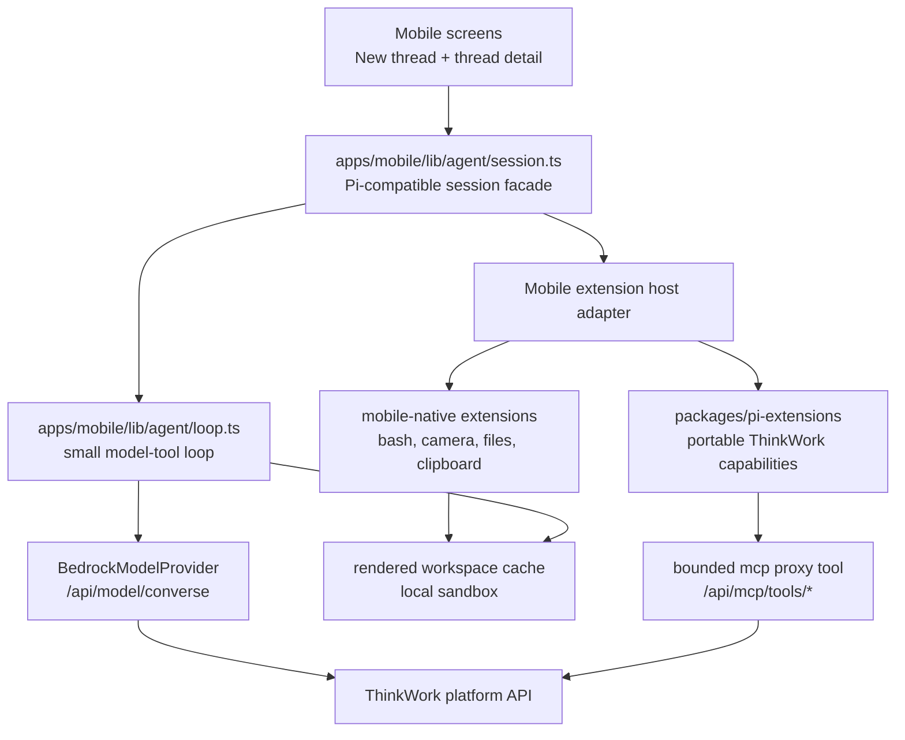

# feat: Pi-compatible mobile host

## Summary

Make the ThinkWork mobile app a **Pi-compatible host**: a Hermes-native agent
runtime that preserves Pi's small core, local bash-first philosophy, extension
model, session semantics, observable events, and workspace behavior while
respecting iOS constraints. This is not a plan to run the upstream
`@earendil-works/pi-coding-agent` package on iOS. The prior embedded-Node spike
proved that path is blocked by Node version and native-addon constraints. The
mobile path is compatibility through a host adapter, contract tests, and shared
ThinkWork extensions.

The mobile harness already has real pieces: `createAgentSession`, a
`ModelProvider` seam, Bedrock proxy inference, local `bash` through `just-bash`,
tenant MCP proxy calls, workspace context injection, image input, persisted
thread turns, and optimistic navigation. The remaining architectural work is to
stop that from becoming a third divergent runtime. Mobile should share
capability authoring with `packages/pi-extensions`, share prompt/workspace
semantics with desktop and AgentCore Pi, and make `bash` plus a rendered
workspace the agent's center of gravity.

## Problem Frame

Pi's current docs describe a minimal terminal coding harness whose core stays
small while extensions, skills, prompt templates, packages, sessions,
compaction, and event streams provide power. Its SDK centers on
`createAgentSession()`, a `ResourceLoader`, `SessionManager`, built-in tools for
the active `cwd`, and a session object with prompt, steer, follow-up, abort,
messages, tools, compaction, and event streaming. Extensions register tools,
intercept lifecycle/tool events, persist state, and customize compaction.

ThinkWork now has three Pi-ish hosts:

- AgentCore Pi, using upstream Pi in `packages/agentcore-pi`.
- Desktop Local Pi, using upstream Pi in `apps/desktop/src/sidecar`.
- Mobile Pi, using a Hermes-native harness in `apps/mobile/lib/agent`.

The product goal is not "a phone-shaped chat client." It is "a mobile Pi host":
the user can start work on the phone, see real tool evidence, use local bash,
use connected MCP tools, inspect and modify a workspace sandbox, attach photos
and files, abort or redirect long work, and get behavior that matches desktop
where the host capabilities overlap.

The central risk is runtime drift. Mobile currently mirrors Pi vocabulary but
owns its own extension API, prompt composition, workspace context loader, MCP
tool surface, session transcript, and local bash filesystem. If we keep adding
features directly in mobile screens and bespoke extensions, every new platform
capability can fork across AgentCore Pi, Desktop Pi, and Mobile Pi.

## Sources And Research

- Pi docs: `https://pi.dev/docs/latest`
- Pi SDK docs: `https://pi.dev/docs/latest/sdk`
- Pi extensions docs: `https://pi.dev/docs/latest/extensions`
- Pi session format docs: `https://pi.dev/docs/latest/session-format`
- Pi RPC docs: `https://pi.dev/docs/latest/rpc`
- Local Pi reference clone: `/Users/ericodom/Projects/_references/pi`
- Origin requirements:
  `docs/brainstorms/2026-05-30-mobile-pi-architecture-review-requirements.md`
- Embedded-Node no-go:
  `docs/solutions/spikes/2026-05-29-mobile-embedded-node-pi-spike.md`
- Shared extension plan:
  `docs/plans/2026-05-29-004-refactor-pi-extensions-architecture-plan.md`
- Initial mobile harness plan:
  `docs/plans/2026-05-29-003-feat-mobile-harness-bedrock-cloud-plan.md`
- Built-in tool boundary:
  `docs/solutions/best-practices/injected-built-in-tools-are-not-workspace-skills-2026-04-28.md`

## Requirements Trace

Origin:
`docs/brainstorms/2026-05-30-mobile-pi-architecture-review-requirements.md`.

- R1 small Pi-shaped public surface -> U1, U7.
- R2 no upstream SDK on iOS today -> U1; non-goal maintained throughout.
- R3 shared extension authoring -> U2, U3, U8.
- R4 lifecycle events -> U1, U2, U7.
- R5 bash as primary execution tool -> U4, U5, U9.
- R6 durable sandbox -> U4, U5.
- R7 Pi-like workspace built-ins -> U4, U5.
- R8 transparent workspace sync -> U4.
- R9 shared system-prompt composition -> U3.
- R10 bounded MCP proxy surface -> U6.
- R11 ephemeral per-turn MCP credentials -> U6.
- R12 MCP discovery failures observable -> U6, U7.
- R13 observable from first tap -> U7, U9.
- R14 abort, steer, follow-up -> U7.
- R15 durable tool transcript/session state -> U7.
- R16 compaction or summarization -> U7.
- R17 mobile-native capabilities as extensions -> U8.
- R18 permission-aware mobile-native capabilities -> U8.
- R19 local, simulator, deployed, and TestFlight tests -> U9.
- R20 smoke matrix -> U9.

Acceptance examples AE1-AE5 map to U4-U9.

## Key Technical Decisions

- **Compatibility, not upstream SDK embedding.** Mobile stays Hermes-native until
  a maintained Node 22+ iOS embedder and a native-addon-free Pi SDK load path
  exist. The mobile host aligns by contract tests, adapters, and shared
  capability packages.

- **Use shared ThinkWork extensions where possible.** Portable platform
  capabilities should be authored in `packages/pi-extensions` as
  `ThinkworkExtension` definitions and loaded by AgentCore Pi, Desktop Pi, and
  Mobile Pi through host adapters. Mobile-only capabilities should still use the
  same extension concepts.

- **Keep the mobile core small.** `apps/mobile/lib/agent/loop.ts` should remain a
  provider/tool loop, not a policy engine. Tool policy, prompt composition,
  workspace context, MCP, memory, and mobile-native powers belong in extensions
  or host providers.

- **Make bash useful by giving it a workspace.** `just-bash` is the right near
  term shell substrate, with public network enabled and private ranges denied.
  It becomes Pi-like only when backed by a durable rendered-workspace cache and
  sibling file tools (`read`, `grep`, `find`, `ls`, later `edit`/`write`).

- **Workspace sync cannot be part of the turn's critical path.** Mobile should
  validate/prewarm the rendered workspace when the new-thread screen, thread
  detail, or active agent/space selection loads. A turn should see a local cache
  immediately, with stale-while-refresh behavior.

- **MCP should be bounded by default.** Mobile currently registers one visible
  tool per MCP tool. That proved live CRM access, but it will not scale. Move to
  a single `mcp` list/search/call proxy tool by default, matching the desktop
  `pi-mcp-adapter` direction. Direct tools stay opt-in for explicitly allowed
  high-value tools.

- **Tool evidence is product behavior, not debug logging.** Every turn should
  emit stable events for prompt start, tool calls, tool results, MCP failures,
  workspace sync status, assistant output, abort, and done. The UI can render a
  compact activity surface from that event stream.

- **Mobile-native powers are host extensions.** Camera, photo library, file
  attachment, clipboard, notifications, and later location are powerful tools
  with OS permissions. They should be modeled as explicit host capabilities with
  visible UI/approval, not as invisible chat-screen plumbing.

## High-Level Design

Mobile host responsibilities:

- Own the app-specific UI, optimistic navigation, activity timeline, and native
  permission prompts.
- Provide a mobile-safe `ExtensionAPI` subset and adapters for shared
  `ThinkworkExtension` definitions.
- Provide host providers for workspace, model, MCP, memory, delegation, and
  mobile-native powers.
- Keep a durable per-thread session transcript and workspace sandbox.

Shared runtime responsibilities:

- Keep the core loop, tool result shape, event naming, prompt composition,
  extension tool declaration, and platform capability behavior consistent with
  desktop and AgentCore Pi.
- Keep credential and secret resolution server-side or per-turn ephemeral.

## Implementation Units

Units are PR-sized and ordered so later units have testable substrate. The
execution workflow should use one branch/worktree and one PR per unit unless a
unit explicitly says otherwise.

### U1. Mobile Pi Compatibility Contract And Baseline Tests

- **Goal:** Define and enforce the compatibility contract between upstream Pi,
  ThinkWork Desktop Pi, AgentCore Pi, and Mobile Pi before deeper refactors.
- **Requirements:** R1, R2, R4.
- **Dependencies:** none.
- **Files:**
  - `apps/mobile/lib/agent/compat/pi-contract.ts` (new)
  - `apps/mobile/lib/agent/compat/pi-contract.test.ts` (new)
  - `apps/mobile/lib/agent/session.test.ts`
  - `apps/mobile/lib/agent/loop.test.ts`
  - `apps/mobile/lib/agent/extensions/__tests__/extensions.test.ts`
  - `docs/solutions/architecture-patterns/mobile-pi-compatible-host-contract-2026-05-30.md`
    (new)
- **Approach:** Capture the mobile-compatible subset: `createAgentSession`,
  `prompt`, `subscribe`, `messages`, `tools`, `ready`, `abort`, extension load,
  `before_agent_start`, `agent_start`, `tool_call`, `after_tool_call`,
  `agent_end`, tool transcript shape, and event order. Add golden tests that
  currently pass where behavior exists and marked gaps where implementation
  units will fill them.
- **Test scenarios:**
  - A session loads extensions before first prompt and exposes registered tools.
  - `before_agent_start` chains system-prompt edits in registration order.
  - A tool call produces an observable tool-call event, result event, transcript
    tool message, and final assistant text.
  - Abort returns an `aborted` stop reason and emits a done event.
  - Contract doc records the upstream SDK features intentionally out of scope
    for mobile V1.
- **Verification:**
  - `pnpm --filter @thinkwork/mobile test -- lib/agent/compat/pi-contract.test.ts lib/agent/session.test.ts lib/agent/loop.test.ts`

### U2. Shared Extension Adapter For Mobile

- **Goal:** Let mobile load portable `ThinkworkExtension` definitions from
  `packages/pi-extensions` through a Hermes-safe adapter and provider bundle.
- **Requirements:** R3, R4.
- **Dependencies:** U1.
- **Files:**
  - `apps/mobile/lib/agent/extensions/thinkwork-extension-adapter.ts` (new)
  - `apps/mobile/lib/agent/extensions/__tests__/thinkwork-extension-adapter.test.ts`
    (new)
  - `apps/mobile/lib/agent/extensions/types.ts`
  - `apps/mobile/lib/agent/extensions/load-extensions.ts`
  - `packages/pi-extensions/src/define-extension.ts`
  - `packages/pi-extensions/src/index.ts`
- **Approach:** Adapt `ThinkworkExtension.register(pi, providers)` to the mobile
  `ExtensionFactory` shape without importing the upstream Pi SDK at runtime.
  Convert shared Pi tool results (`content` blocks) into mobile `ToolResult`
  text. Preserve `toolNames` so hosts can reason about active tools. Supply a
  mobile `ProviderBundle` with only safe providers initially.
- **Important constraint:** `packages/pi-extensions` currently uses type-only Pi
  imports and `typebox`. Confirm Metro/Hermes can consume the package without
  pulling Node-only upstream Pi code. If bundling fails, split any host-neutral
  types into a pure submodule rather than copying extensions into mobile.
- **Test scenarios:**
  - A shared test extension registers a tool and prompt hook through the mobile
    adapter.
  - Tool result content blocks flatten into mobile text without losing `isError`.
  - Missing required providers fail loud during extension registration.
  - The adapter does not import `@earendil-works/pi-coding-agent` at runtime in
    the mobile bundle.
- **Verification:**
  - `pnpm --filter @thinkwork/mobile test -- lib/agent/extensions/__tests__/thinkwork-extension-adapter.test.ts`
  - `pnpm --filter @thinkwork/mobile build:web`

### U3. Shared System Prompt And Workspace Context Parity

- **Goal:** Replace mobile's bespoke prompt/context injection with the shared
  ThinkWork system-prompt composition order or a contract-verified mobile
  equivalent.
- **Requirements:** R3, R8, R9.
- **Dependencies:** U2.
- **Files:**
  - `apps/mobile/lib/agent/extensions/workspace-context-extension.ts`
  - `apps/mobile/lib/agent/turn-context.ts`
  - `apps/mobile/lib/agent/thread-turn.ts`
  - `apps/mobile/lib/agent/extensions/__tests__/workspace-context-extension.test.ts`
  - `packages/pi-extensions/src/system-prompt.ts`
  - `packages/pi-extensions/test/system-prompt.test.ts`
- **Approach:** Reuse `createSystemPromptExtension` where possible by supplying
  a mobile `fileReader` over the rendered workspace cache. Preserve the shared
  order: current date, requester context, runtime tool policy, `AGENTS.md`,
  `CONTEXT.md`, `GUARDRAILS.md`, `SPACE.md`, `USER.md`, then skills. Keep
  mobile-specific guidance short and additive.
- **Test scenarios:**
  - "What is my name?" has `USER.md` context without direct server fetch during
    the model call when cache is warm.
  - Prompt includes runtime tool policy that honestly states whether `bash`,
    `execute_code`, `send_email`, and MCP are available.
  - Missing `USER.md` or offline workspace cache degrades visibly but does not
    crash the turn.
  - Mobile and shared prompt composition produce equivalent section order for a
    common virtual workspace fixture.
- **Verification:**
  - `pnpm --filter @thinkwork/mobile test -- lib/agent/extensions/__tests__/workspace-context-extension.test.ts lib/agent/turn-context.test.ts`
  - `pnpm --filter @thinkwork/pi-extensions test -- system-prompt`

### U4. Rendered Workspace Cache And Read/Grep/Find/Ls Built-Ins

- **Goal:** Give mobile a local rendered workspace cache and Pi-like read-only
  workspace tools over that cache.
- **Requirements:** R5, R6, R7, R8, R13.
- **Dependencies:** U3.
- **Files:**
  - `apps/mobile/lib/agent/workspace-cache.ts` (new)
  - `apps/mobile/lib/agent/tools/read-tool.ts` (new)
  - `apps/mobile/lib/agent/tools/grep-tool.ts` (new)
  - `apps/mobile/lib/agent/tools/find-tool.ts` (new)
  - `apps/mobile/lib/agent/tools/ls-tool.ts` (new)
  - `apps/mobile/lib/agent/extensions/workspace-tools-extension.ts` (new)
  - `apps/mobile/lib/workspace-api.ts`
  - `apps/mobile/app/(tabs)/index.tsx`
  - `apps/mobile/app/thread/[threadId]/index.tsx`
  - `apps/desktop/src/sidecar/workspace-cache.ts` (reference only)
- **Approach:** Port the desktop `WorkspaceCache` semantics to React Native:
  manifest, TTL, stale-while-refresh, safe relative paths, partition by stage,
  tenant/agent/space/user, and bounded cache eviction. Use Expo filesystem
  primitives if available in the current dependency set; otherwise add the
  smallest Expo-supported filesystem dependency. Prewarm on New Thread page
  load, active space/agent changes, and thread detail load. Register `read`,
  `grep`, `find`, and `ls` over the cache.
- **Test scenarios:**
  - Fresh cache blocks only the prewarm job, not a turn that can use stale local
    files.
  - Stale manifest returns cache hit and schedules background refresh.
  - Path traversal (`../`, absolute paths, backslashes) is rejected.
  - `read`, `grep`, `find`, and `ls` operate only inside the cache root.
  - Cache events surface enough activity to explain "workspace refresh failed."
- **Verification:**
  - `pnpm --filter @thinkwork/mobile test -- lib/agent/workspace-cache.test.ts lib/agent/tools`
  - Simulator smoke: open New Thread, wait for prewarm, ask "what is my name?"
    and confirm first answer does not wait on a full workspace sync.

### U5. Workspace-Backed Local Bash

- **Goal:** Make mobile `bash` run inside the same durable workspace sandbox as
  the read-only built-ins, with public network enabled and private ranges denied.
- **Requirements:** R5, R6, R7, R13, R20.
- **Dependencies:** U4.
- **Files:**
  - `apps/mobile/lib/agent/extensions/local-bash-extension.ts`
  - `apps/mobile/lib/agent/extensions/__tests__/local-bash-extension.test.ts`
  - `apps/mobile/lib/agent/loop.ts`
  - `apps/mobile/lib/agent/session.ts`
  - `apps/mobile/lib/agent/types.ts`
- **Approach:** Mount or mirror cached workspace files into `just-bash` at
  `/workspace`. Persist shell files per thread/workspace across app restarts
  when supported by the bash substrate; otherwise persist a materialized file
  snapshot after each command. Pass `sessionId` through `runAgentTurn` tool
  context instead of relying on extension closures. Keep public internet access
  on by default and deny loopback/private ranges. Add output truncation,
  timeout, command metadata, and activity events.
- **Test scenarios:**
  - `bash` can read files that `read` can read from the workspace cache.
  - A file created in one turn is visible in a later turn for the same thread.
  - A different thread cannot see that file unless it belongs to the shared
    workspace cache.
  - `curl https://example.com` succeeds; loopback/private range fetches fail.
  - Timeout and output-size limits produce clear tool errors and UI events.
- **Verification:**
  - `pnpm --filter @thinkwork/mobile test -- lib/agent/extensions/__tests__/local-bash-extension.test.ts lib/agent/loop.test.ts`
  - `pnpm --filter @thinkwork/mobile smoke:pi-harness -- --capabilities bash`

### U6. Bounded MCP Proxy Tool For Mobile

- **Goal:** Replace the default "one visible tool per MCP tool" mobile surface
  with a bounded `mcp` proxy tool that supports list, search, and call.
- **Requirements:** R10, R11, R12, R13, R20.
- **Dependencies:** U2.
- **Files:**
  - `apps/mobile/lib/agent/extensions/mcp-tools-extension.ts`
  - `apps/mobile/lib/agent/extensions/__tests__/mcp-tools-extension.test.ts`
  - `apps/mobile/lib/mcp-client.ts`
  - `packages/api/src/handlers/mcp-proxy.ts`
  - `packages/api/src/handlers/mcp-proxy.test.ts`
  - `packages/agentcore-pi/agent-container/src/mcp-proxy.ts` (reference)
  - `apps/desktop/src/sidecar/local-turn-runner.ts` (reference)
- **Approach:** Keep server-side bearer resolution and Cognito auth. On mobile,
  register one model-visible `mcp` tool by default:
  `list`, `search`, `call({ server, tool, args })`, and optional schema
  inclusion. Preserve direct per-tool registration only through an explicit
  allowlist for known compact/high-value tools. Activity events should distinguish
  discovery failure, auth failure, transport failure, and MCP `isError`.
- **Test scenarios:**
  - Multiple MCP servers expose only one default `mcp` tool to the model.
  - `mcp({ list: true })` returns server/tool descriptions and optional schemas.
  - `mcp({ search: "opportunity" })` narrows CRM-related tools.
  - `mcp({ call: ... })` dispatches with platform-resolved credentials and no
    bearer token in the device prompt, logs, or persistent storage.
  - Expired connector auth produces a visible recoverable tool error.
- **Verification:**
  - `pnpm --filter @thinkwork/mobile test -- lib/agent/extensions/__tests__/mcp-tools-extension.test.ts`
  - `pnpm --filter @thinkwork/api test -- src/handlers/mcp-proxy.test.ts`
  - `pnpm --filter @thinkwork/mobile smoke:pi-harness -- --capabilities mcp`

### U7. Mobile Session Semantics: Events, Abort, Follow-Up, Durability, Compaction

- **Goal:** Bring mobile closer to Pi's session behavior so long-running mobile
  work feels like an agent session rather than a single blocking chat request.
- **Requirements:** R1, R4, R13, R14, R15, R16, R20.
- **Dependencies:** U1, U4, U5, U6.
- **Files:**
  - `apps/mobile/lib/agent/session.ts`
  - `apps/mobile/lib/agent/loop.ts`
  - `apps/mobile/lib/agent/session-store.ts`
  - `apps/mobile/lib/agent/persist-turn.ts`
  - `apps/mobile/lib/agent/thread-turn.ts`
  - `apps/mobile/components/threads/TurnExecutionTimeline.tsx`
  - `apps/mobile/app/thread/[threadId]/index.tsx`
  - `apps/mobile/lib/pending-thread-starts.ts`
- **Approach:** Add `agent_start`, `agent_end`, `tool_call`, and
  `after_tool_call` dispatch in the loop. Persist a structured session transcript
  that includes assistant tool requests, tool results, activity metadata, and
  stop reasons, not only flattened user/assistant text. Add abort first, then
  follow-up queueing, then steering if the UI affords it cleanly. Add a
  compaction hook or summarization path before long histories degrade quality.
- **Test scenarios:**
  - New thread navigates optimistically, shows user message and Working state
    immediately, and never drops Working while the local turn is active.
  - Activity timeline renders model start, tool start, result, failure, abort,
    and completion from stable events.
  - Abort cancels provider calls and abort-aware tools.
  - A queued follow-up runs after the current turn finishes.
  - A resumed thread reconstructs tool transcript without relying only on chat
    text.
  - Compaction/summarization triggers before configured context threshold.
- **Verification:**
  - `pnpm --filter @thinkwork/mobile test -- lib/agent/session.test.ts lib/agent/thread-turn.test.ts lib/agent/persist-turn.test.ts`
  - iOS simulator: start plain, bash, and MCP turns; abort one; confirm activity
    timeline and persisted messages are coherent.

### U8. Mobile-Native Capability Extensions

- **Goal:** Model mobile-only powers as host extensions with explicit permissions
  and evidence.
- **Requirements:** R17, R18, R20.
- **Dependencies:** U2, U7.
- **Files:**
  - `apps/mobile/lib/agent/extensions/mobile-native/index.ts` (new)
  - `apps/mobile/lib/agent/extensions/mobile-native/photo-extension.ts` (new)
  - `apps/mobile/lib/agent/extensions/mobile-native/file-extension.ts` (new)
  - `apps/mobile/lib/agent/extensions/mobile-native/clipboard-extension.ts`
    (new)
  - `apps/mobile/lib/agent/capture-image.ts`
  - `apps/mobile/lib/agent/tools/image-picker.ts`
  - `apps/mobile/app/thread/[threadId]/index.tsx`
  - `apps/mobile/components/input/MessageInputFooter.tsx`
- **Approach:** Convert photo and file attachment flows into explicit
  host-provided capabilities that the agent loop can see in the transcript. The
  model may request a capability, but native UI owns permission prompts and
  visible user approval. Start with photo/library/file/clipboard read, and defer
  write-side device powers until policy exists.
- **Test scenarios:**
  - Photo library and camera attachments are represented as model image input
    with activity evidence.
  - File attachments preserve filename, MIME type, size, and text extraction
    result when available.
  - Clipboard read requires visible user action or explicit permission affordance.
  - Denied OS permission produces a recoverable tool result.
- **Verification:**
  - `pnpm --filter @thinkwork/mobile test -- lib/agent/capture-image.test.ts lib/agent/extensions/mobile-native`
  - Simulator smoke for image and file attachments.

### U9. E2E Parity Harness And TestFlight Release Checklist

- **Goal:** Make mobile Pi behavior measurable across local unit tests,
  simulator, deployed-stage harness smokes, and TestFlight/on-device validation.
- **Requirements:** R19, R20.
- **Dependencies:** U3-U8.
- **Files:**
  - `apps/mobile/scripts/pi-harness-smoke.ts`
  - `apps/mobile/scripts/pi-device-smoke.md` (new)
  - `apps/mobile/package.json`
  - `docs/plans/autopilot-status.md`
  - `docs/solutions/testing/mobile-pi-smoke-matrix-2026-05-30.md` (new)
- **Approach:** Expand the existing smoke script and document a repeatable
  on-device script. Required matrix: plain chat, "what is my name?", direct web
  search, bash, workspace read/search, workspace skills, MCP CRM, image
  attachment, file attachment, abort, missing MCP credentials, and one managed
  AgentCore Pi turn. Capture thread id and thread identifier for every smoke.
  Require both AgentCore Pi and Local/Mobile Pi comparisons for shared
  capabilities when feasible.
- **Test scenarios:**
  - `plain`: no tools required, first assistant output starts quickly.
  - `workspace`: user identity from `USER.md` with cache hit or stale hit.
  - `web_search`: direct ThinkWork `web_search` tool is used; it is not routed
    through MCP.
  - `bash`: command output only after bash tool result.
  - `workspace-tools`: read/grep/find/ls used on cached workspace files.
  - `skill`: shared `workspace_skill` extension reads skill instructions before
    answering.
  - `mcp`: CRM read-only call through bounded `mcp` proxy.
  - `image` and `file`: attachments reach the model/tool transcript.
  - `abort`: cancellation is reflected in UI and persisted stop reason.
  - `mcp-auth-failure`: visible reconnection/auth guidance.
  - `agentcore_pi`: a normal deployed managed Pi thread turn completes and
    records runtime `pi`.
- **Verification:**
  - `pnpm --filter @thinkwork/mobile smoke:pi-harness -- --capabilities all --json`
  - `pnpm --filter @thinkwork/mobile smoke:pi-harness -- --capabilities full --json`
  - `pnpm --filter @thinkwork/mobile ios` simulator validation
  - EAS build and TestFlight submission only after local + deployed smokes pass.

### U10. Standardize Host-Contained Bash On just-bash

- **Goal:** Make Desktop Local Pi and Mobile Pi expose the same contained
  `just-bash` semantics for the `bash` tool instead of letting one host drift
  toward arbitrary native shell access.
- **Requirements:** R5, R6, R7, R13, R20.
- **Dependencies:** U5, U7, U9.
- **Files:**
  - `apps/desktop/src/sidecar/just-bash-tool.ts` (new)
  - `apps/desktop/src/sidecar/local-turn-runner.ts`
  - `apps/desktop/test/sidecar/local-turn-runner.test.ts`
  - `apps/desktop/package.json`
  - `apps/mobile/lib/agent/extensions/local-bash-extension.ts`
  - `packages/pi-extensions/src/system-prompt-compose.ts`
  - `docs/solutions/architecture-patterns/pi-host-contained-bash-2026-05-30.md`
    (new)
- **Approach:** Keep mobile's local `just-bash` tool as the reference and add a
  desktop-local `just-bash` custom `bash` tool over the rendered workspace.
  Desktop Local Pi should no longer expose the upstream SDK's native `bash`
  built-in; it should allowlist the other Pi file/search built-ins plus the
  host-provided `bash` custom tool. Both hosts should describe `bash` as a
  contained workspace sandbox with public network enabled and private/loopback
  ranges denied.
- **Test scenarios:**
  - Desktop Local Pi passes `bash` as a host custom tool and removes native SDK
    `bash` from the built-in allowlist.
  - Desktop `bash` reads rendered workspace files from `/workspace`.
  - Desktop `bash` cannot read arbitrary host files through native shell access.
  - Shared system-prompt policy says `bash` is host-contained, not a generic
    native shell.
  - Mobile local-bash tests still pass with the same public-network/private-deny
    containment semantics.
- **Verification:**
  - `pnpm --filter @thinkwork/desktop test -- test/sidecar/local-turn-runner.test.ts`
  - `pnpm --filter @thinkwork/desktop typecheck`
  - `pnpm --filter @thinkwork/mobile test -- lib/agent/extensions/__tests__/local-bash-extension.test.ts`
  - `pnpm --filter @thinkwork/pi-extensions test -- system-prompt`

## Cross-Cutting Verification

Run the smallest meaningful tests per unit, then broaden:

- Mobile focused tests:
  `pnpm --filter @thinkwork/mobile test -- lib/agent`
- Mobile package tests:
  `pnpm --filter @thinkwork/mobile test`
- Shared extension tests:
  `pnpm --filter @thinkwork/pi-extensions test`
- API handler tests:
  `pnpm --filter @thinkwork/api test -- src/handlers/mcp-proxy.test.ts`
- Mobile bundle sanity:
  `pnpm --filter @thinkwork/mobile build:web`
- Harness smoke:
  `pnpm --filter @thinkwork/mobile smoke:pi-harness -- --capabilities plain,workspace,bash,mcp,image --json`
- Simulator validation:
  copy `apps/mobile/.env` from the main checkout, build
  `@thinkwork/react-native-sdk`, start Expo/iOS, and visually verify new thread,
  Working state, activity timeline, bash, MCP, and attachment flows.
- TestFlight:
  submit only after unit tests, bundle sanity, deployed-stage smokes, and
  simulator validation pass.

## Risks And Mitigations

- **Upstream Pi SDK cannot run on iOS today.** Mitigation: compatibility by
  contract tests and adapters; keep the no-go spike as the durable reason.

- **Metro may pull Node-only code from shared extension packages.** Mitigation:
  type-only imports, pure submodule boundaries, and mobile bundle tests in U2.

- **`just-bash` is not a native shell.** Mitigation: tell the model honestly,
  preserve Pi-like semantics where possible, and route unsupported native tasks
  to AgentCore/Desktop Pi rather than pretending.

- **Workspace sync can regress first-token latency.** Mitigation: transparent
  prewarm, stale-while-refresh, cache-hit events, and explicit performance
  acceptance in U4/U9.

- **MCP credentials are sensitive.** Mitigation: server-side bearer resolution,
  Cognito-authenticated proxy calls, no bearer prompt/log/device persistence,
  and explicit auth-failure tool results.

- **Mobile-native capabilities can surprise users.** Mitigation: OS permission
  prompts, visible UI affordances, and extension policy that prevents silent
  device actions.

- **Long sessions can corrupt context if only flattened chat text is persisted.**
  Mitigation: structured transcript persistence and compaction/summarization
  in U7.

## Non-Goals

- Do not embed upstream `@earendil-works/pi-coding-agent` on iOS in this plan.
- Do not ship arbitrary native iOS shell access.
- Do not give the model silent access to arbitrary device files, contacts,
  location, notifications, or clipboard.
- Do not write MCP bearer tokens or OAuth secrets to device disk.
- Do not replace AgentCore Pi or Desktop Pi. Mobile should be a peer host with a
  mobile capability envelope.
- Do not implement full upstream TUI commands, keybindings, tree navigation, or
  package installation on mobile V1.

## Definition Of Done

The mobile Pi compatible host is complete when:

- Mobile can load portable ThinkWork extensions through a shared adapter.
- Mobile uses shared or contract-equivalent system-prompt composition.
- Mobile has a transparent rendered workspace cache and read/grep/find/ls tools.
- Mobile `bash` runs in a durable workspace-backed sandbox with public network
  enabled and private ranges denied.
- Mobile MCP defaults to a bounded `mcp` proxy tool with server-side bearer
  resolution.
- Mobile turns are observable from first tap through completion, failure, or
  abort.
- Mobile persists structured tool transcript/session state and can compact or
  summarize long histories.
- Photo/file/mobile-native capabilities are extension-shaped and
  permission-aware.
- The smoke matrix passes locally, in simulator, against deployed dev services,
  and on TestFlight.
