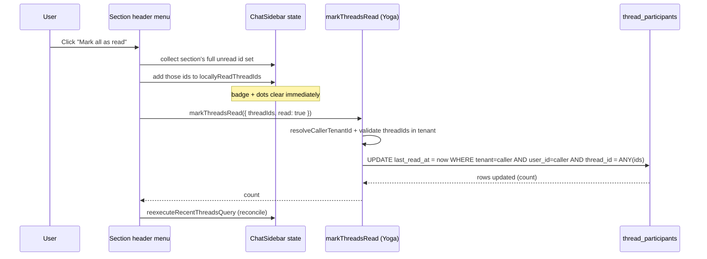
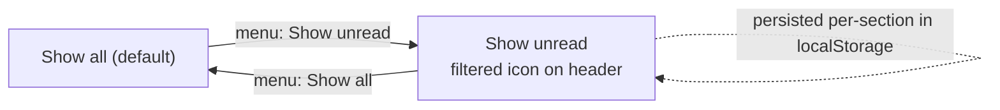

# feat: Sidebar section unread badge, "…" menu, and unread filter

## Summary

Add per-section controls to the chat sidebar's group headers (Chats, each
Space): an unread-count badge between the section label and a hover-revealed
"…" menu, with **Mark all as read** and a **Show unread / Show all** toggle.
When "Show unread" is active the section renders only its unread threads and
shows a filtered indicator. "Mark all as read" is backed by a new **batch
`markThreadsRead` GraphQL mutation** (the single-thread read path exists; batch
and mark-unread do not). No DB migration — the per-user read marker
(`thread_participants.last_read_at`) and its index already exist.

---

## Problem Frame

The sidebar already computes per-thread unread state (`isThreadUnread` against
the caller's `thread_participants.last_read_at`) and shows a blue dot, and Space
sections already render an unread count. But there's no way to act on unread at
the section level: no count on the generic "Chats" section, no "mark all read,"
and no way to focus a section on just its unread threads. Clearing a backlog
means opening threads one at a time.

Research confirms the surface and the one real gap:

- **Section rendering** lives in `apps/spaces/src/components/shell/ChatSidebar.tsx`
  — `ThreadListSection` (Chats/Pinned) and `SpaceThreadSection` (per Space), each
  wrapping a `Collapsible` whose `SidebarGroupLabel` is a trigger button.
  `SpaceThreadSection` already renders an unread badge span; `ThreadListSection`
  does not.
- **No "…" menu exists** on any sidebar item (the "New thread" item has none).
  The pattern is to combine the hover-reveal used by `ChatThreadRow`
  (`group-hover/…:flex`) with the `DropdownMenu` API used by `AccountMenu` in
  `apps/spaces/src/components/SpacesSidebar.tsx`.
- **Read state is per-user** via `thread_participants.last_read_at`
  (`packages/database-pg/src/schema/thread-participants.ts`, with
  `idx_thread_participants_user_unread`). `isThreadUnread`
  (`apps/spaces/src/components/shell/chat-sidebar-types.ts`) compares it to thread
  activity. Single-thread mark-read exists (`updateThread { lastReadAt }` →
  `applyCallerReadState`); **batch and mark-unread do not**.
- The threads query already supports an `unreadOnly` arg, but the per-section
  filter is cheapest as a **client-side filter** of already-fetched threads.

---

## Requirements

- R1. Each thread-grouped section header (Chats + every Space) shows an
  **unread-count badge** between the section label and the section's controls.
  Generic sections compute the count client-side via `isThreadUnread`; Space
  sections reuse the existing server `unreadThreadCount`. No badge when the count
  is zero.
- R2. Hovering a section header reveals a **"…" menu button**; clicking opens a
  `DropdownMenu`. Opening the menu must NOT toggle the section's collapse state.
- R3. The menu contains **Mark all as read** and a **Show unread / Show all**
  toggle item (label reflects current state).
- R4. **Mark all as read** marks every unread thread in that section read for the
  caller (the whole section, not just the loaded page — see KTD-2), clears the
  badge, and is optimistic (badge/dots clear immediately, reconcile on response).
- R5. When **Show unread** is active for a section, the section renders only its
  unread threads; a **filtered indicator** (icon) shows on the header. Toggling
  back to **Show all** restores the full list. The choice **persists across
  reloads**, per section.
- R6. A new **batch `markThreadsRead(threadIds, read)` mutation** marks an
  explicit set of threads read/unread for the caller, writing only the caller's
  existing `thread_participants` rows, validating every thread belongs to the
  caller's tenant. (`read: false` → mark unread.) The tenant is resolved from
  context, never from the input.
- R7. The unread filter and section menu apply only to thread-grouped sections
  (Chats, Spaces), not the action items (New thread, Search, Automations).
- R8. Interaction details (see KTD-7): the badge always reflects the section's
  **full true unread total** (not the filtered subset) and is visible when the
  section is collapsed; the "…" trigger is reachable without hover (focus-visible
  + visible on touch) and works while collapsed; when **Show unread** is active
  and the list empties (after Mark all as read or organically), the section shows
  an inline "No unread — Show all" affordance rather than a blank gap.

---

## Key Technical Decisions

- **KTD-1: New batch mutation, keyed on an explicit thread-id list.** Add
  `markThreadsRead(input: MarkThreadsReadInput!)` to
  `packages/database-pg/graphql/types/threads.graphql`, resolver in
  `packages/api/src/graphql/resolvers/threads/`, registered in that dir's
  `index.ts` `threadMutations`. Input is `{ threadIds: [ID!]!, read: Boolean! = true }`
  — **no `tenantId`** (the resolver derives tenant from context; a client value
  would be dead input at best, a cross-tenant hole at worst) and **no `spaceId`
  scope** (see KTD-2). The write is a single statement against the caller's own
  rows: `UPDATE thread_participants SET last_read_at = ? WHERE tenant_id = ? AND
  user_id = ? AND thread_id = ANY(?)`. `read:false` sets `last_read_at = null`.
  Like `updateThread`, skip `notifyThreadUpdate` for read-state-only writes.
  Mirror the dedupe/`inArray`-validate idiom in `setSpaceTools.mutation.ts`.

- **KTD-2: "Mark all as read" marks the section's FULL unread set, by id.**
  Marking only the loaded top-5 leaves "Show more (44)" bold; a *server-side
  scope* can't reproduce the client "Chats" section (which is `no spaceId OR a
  default-space thread, excluding pinned, limited to the recent page` — a
  client-only heuristic the server has no `is_default` column for). So the client
  collects the section's complete unread id set first — reusing the existing
  `unreadOnly` arg on the threads query for that section's scope — then calls
  `markThreadsRead({ threadIds, read: true })` with those exact ids. This makes
  the id list authoritative (badge/filter and mark target use the *same* source),
  honest under pagination, and removes the need for a server "general-chats"
  discriminator entirely.

- **KTD-3: Caller-scoped authorization, not admin.** Marking read is a normal
  per-user action on the caller's own participant rows. Resolve the caller via
  `resolveCallerTenantId(ctx)` (`ctx.auth.tenantId` is null for Google-federated
  users; fail closed / `UNAUTHENTICATED` if no caller resolves). Validate every
  `threadId` belongs to that tenant (`inArray` existence check) and **UPDATE only
  existing caller participant rows** — predicate on `tenant_id = caller AND
  user_id = caller`, no upsert/insert (so a caller can't create phantom
  participant rows or touch threads they never joined; a non-participant id
  simply matches 0 rows). Do not use `requireTenantAdmin`; never let a caller
  mark threads in another tenant.

- **KTD-4: Per-section "Show unread" is a client-side filter, made honest under
  pagination.** Default: filter already-fetched threads through `isThreadUnread`
  (no refetch, scroll stable). But the loaded page can hide unread threads behind
  "Show more", so when a section's true unread total exceeds its loaded-unread
  count, the filter triggers that section's `unreadOnly` refetch (the arg already
  exists on the threads query) so "Show unread" shows the complete set rather
  than a misleading partial list. Persist the per-section toggle in a
  `useSyncExternalStore` + `localStorage` store mirroring
  `apps/spaces/src/lib/editor-prefs.ts` / `thread-notifications-pref.ts` (both
  present on this branch), keyed by section id → bool. Align the client unread
  predicate with the server's `callerUnreadParticipantExists` (notably the
  no-activity and null-`last_read_at` cases) so badge, filter, and mark target
  agree.

- **KTD-5: Optimistic clear via `locallyReadThreadIds`, with a derived badge.**
  `ChatSidebar` keeps a `locallyReadThreadIds: Set<string>` for click-to-read
  optimism (additive — correct for mark-*read*; the deferred per-row mark-*unread*
  must instead remove ids, so it cannot reuse this set as-is). "Mark all as read"
  adds the section's unread ids immediately, fires the batch mutation, then
  refetches via `reexecuteRecentThreadsQuery`; toast on error. Because the Space
  badge renders the server `unreadThreadCount` (which the local set does not
  touch), compute the displayed badge as
  `max(0, count − |section ids in locallyReadThreadIds|)` so it drops on
  optimistic mark-all and reconciles on refetch; the generic Chats badge is
  already derived from fetched threads minus the local set.

- **KTD-6: No DB migration.** `thread_participants.last_read_at` and
  `idx_thread_participants_user_unread` already exist; this feature only writes
  to them. After the GraphQL type edit: regenerate codegen in `admin`/`mobile`/`cli`
  and `apps/spaces` (all have a `codegen` script) → `pnpm schema:build` for the
  AppSync schema. Note: `apps/spaces`'s `codegen.ts` excludes
  `src/lib/graphql-queries.ts`, so adding the new operation there needs no
  spaces-codegen change — but the app *does* have a codegen pipeline (don't skip
  it if a typed op is ever added elsewhere).

- **KTD-7: Section-header interaction rules.** Pin the cramped-row decisions so
  implementers don't diverge: (a) **discoverability** — the "…" trigger is
  revealed on hover/`focus-visible` AND always visible on touch
  (`@media (hover: none)`); it is keyboard-reachable. (b) **collapsed state** —
  badge and "…" menu stay visible/interactive while the section is collapsed
  (acting on a backlog shouldn't require expanding). (c) **header element order**
  — `[chevron] [label] [badge] [filtered-indicator] [«…»]`, with the menu trigger
  rightmost; the filtered indicator and badge share the trailing slot. (d)
  **empty-after-mark-all** — when Show-unread is active and the filtered list
  empties, render an inline "No unread — Show all" affordance (one tap reverts
  the filter and writes the pref back), never a blank section. (e) **badge
  semantics** — always the section's full true unread total, not the filtered
  count.

---

## High-Level Technical Design

"Mark all as read" data flow (optimistic, cross-layer):

Per-section view state (filter toggle):

---

## Implementation Units

### U1. Batch `markThreadsRead` mutation (backend)

**Goal:** A caller-scoped batch mutation to mark an explicit list of threads
read/unread for the caller.

**Requirements:** R6, R4 (backing), KTD-1, KTD-3, KTD-6.

**Dependencies:** none.

**Files:**
- `packages/database-pg/graphql/types/threads.graphql` — add `markThreadsRead(input: MarkThreadsReadInput!): MarkThreadsReadResult!` under the existing `extend type Mutation`, plus `input MarkThreadsReadInput { threadIds: [ID!]!, read: Boolean! = true }` and `type MarkThreadsReadResult { updated: Int! }`. **No `tenantId`** (resolver derives it) and **no scope/`spaceId`** — the client supplies the exact ids (KTD-2).
- `packages/api/src/graphql/resolvers/threads/markThreadsRead.mutation.ts` (new) — resolver.
- `packages/api/src/graphql/resolvers/threads/index.ts` — register in `threadMutations`.
- `packages/api/src/lib/threads/thread-unread-state.ts` — add a batched `markCallerThreadsRead` helper doing the single `UPDATE thread_participants SET last_read_at = ? WHERE tenant_id = ? AND user_id = ? AND thread_id = ANY(?)`.
- Tests: `packages/api/src/graphql/resolvers/threads/markThreadsRead.mutation.test.ts` (or the dir's existing test location).

**Approach:** Resolve caller user + tenant via `resolveCallerTenantId(ctx)`;
throw `UNAUTHENTICATED` if no caller resolves. Dedupe `threadIds`; validate they
belong to the caller's tenant (`inArray` existence check). Write ONE statement
against `thread_participants` predicated on `tenant_id = caller AND user_id =
caller AND thread_id = ANY(validIds)` — `read:true` sets `last_read_at = now`,
`read:false` sets it `null`. **No upsert/insert**: ids with no caller participant
row simply match zero rows (preserving `applyCallerReadState` semantics; don't
create phantom rows or touch the legacy owner path). Skip `notifyThreadUpdate`.
Return the count of rows updated.

**Execution note:** Start with a failing test for the cross-tenant rejection +
not-a-participant no-op — this is the security-critical contract.

**Patterns to follow:** `setSpaceTools.mutation.ts` (batch dedupe/validate-with-`inArray`);
`updateThread.mutation.ts` + `applyCallerReadState` (caller read-state write,
notify-skip, participant-row gating); `resolveCallerTenantId`.

**Test scenarios:**
- Happy: `read:true` marks the listed threads; result `updated` matches; the
  caller's participant `last_read_at` advances; already-read ids are idempotent.
- Happy: `read:false` sets `last_read_at` null for the listed threads (the first
  end-user mark-unread path).
- Edge: empty `threadIds` → `updated: 0`, no error; duplicate ids deduped.
- Security: ids from another tenant are rejected (or excluded) — caller cannot
  mark foreign-tenant threads; another user's read state is never written (only
  rows keyed to the caller's `user_id`).
- Security: an id the caller is NOT a participant in matches 0 rows — no phantom
  participant row is created, no error.
- Auth: caller with null `ctx.auth.tenantId` (Google-federated) resolves via
  `resolveCallerTenantId` and succeeds for their own tenant; unresolvable caller
  → `UNAUTHENTICATED`.

**Verification:** `packages/api` typechecks + tests pass; invoking the mutation
advances/clears `thread_participants.last_read_at` for the caller only; codegen
regenerated for admin/mobile/cli/spaces and `pnpm schema:build` leaves a clean
diff.

---

### U2. Per-section unread-filter preference store (client)

**Goal:** A persisted, reactive per-section "show unread only" preference.

**Requirements:** R5, R7, KTD-4.

**Dependencies:** none.

**Files:**
- `apps/spaces/src/lib/sidebar-section-prefs.ts` (new) — `useSectionUnreadFilter(sectionId)` + `setSectionUnreadFilter(sectionId, on)` over `useSyncExternalStore` + `localStorage` (JSON map keyed by section id).
- Tests: `apps/spaces/src/lib/sidebar-section-prefs.test.ts`.

**Approach:** Mirror `apps/spaces/src/lib/editor-prefs.ts` exactly (read/write
helpers, same-tab event + cross-tab `storage` listener, `useSyncExternalStore`
with a stable server snapshot). Store a `Record<sectionId, boolean>`; default
off (Show all). Section id = a stable key (`"chats"`, `space:<id>`).

**Patterns to follow:** `apps/spaces/src/lib/editor-prefs.ts`,
`apps/spaces/src/lib/thread-notifications-pref.ts`.

**Test scenarios:**
- Default off for an unknown section; round-trips on/off per section id; two
  section ids are independent; garbage stored JSON falls back to all-off.

**Verification:** spaces typechecks + tests pass; toggling persists across a
simulated reload (re-read returns the set value).

---

### U3. Section header badge, "…" menu, filter + mark-all wiring (client)

**Goal:** Render the badge, the hover "…" `DropdownMenu`, and the filtered
indicator on both section types; wire the filter (client-side) and "Mark all as
read" (batch mutation + optimistic).

**Requirements:** R1, R2, R3, R4, R5, R7, R8, KTD-2, KTD-4, KTD-5, KTD-7.

**Dependencies:** U1 (mutation), U2 (pref store).

**Files:**
- `apps/spaces/src/components/shell/ChatSidebar.tsx` — `ThreadListSection` +
  `SpaceThreadSection`: add the badge (Chats: derived from fetched threads minus
  `locallyReadThreadIds`; Space: `max(0, unreadThreadCount − locally-marked)` per
  KTD-5), the "…" trigger + `DropdownMenu` (Mark all as read; Show unread/Show
  all) per the KTD-7 reveal/order/collapsed rules, the filtered indicator, apply
  the unread filter (KTD-4) with the empty-state affordance, and wire mark-all
  (collect the section's full unread id set → `markThreadsRead({threadIds, read:true})`
  → optimistic `locallyReadThreadIds` → `reexecuteRecentThreadsQuery`).
- `apps/spaces/src/lib/graphql-queries.ts` — add `MarkThreadsReadMutation`
  (plain `gql`; lands in this file, which spaces `codegen.ts` excludes).
- `apps/spaces/src/components/shell/chat-sidebar-types.ts` — shared section
  unread-count + unread-id-collection helpers; align the client unread predicate
  with the server's per KTD-4.
- Tests: `apps/spaces/src/components/shell/ChatSidebar.test.tsx` (extend) or a
  focused section-header test.

**Approach:** Place the "…" `DropdownMenuTrigger` as a sibling of the
`CollapsibleTrigger` label button (NOT nested) so opening the menu doesn't toggle
collapse; reveal per KTD-7 (hover + `focus-visible` + always-on for `hover:none`).
Verify the Radix-portalled menu content isn't unmounted by the collapsible.
DropdownMenu API per `AccountMenu`. Filter: when `useSectionUnreadFilter(sectionId)`
is on, render the section's unread threads (loaded-filter, with the KTD-4
`unreadOnly` refetch when more unread exist beyond the page) and show the filtered
icon; on empty, show the "No unread — Show all" affordance (R8). Mark all as read:
collect the section's full unread ids, optimistically add them to
`locallyReadThreadIds`, call `markThreadsRead`, then `reexecuteRecentThreadsQuery`;
toast on error.

**Patterns to follow:** `ChatThreadRow` hover-reveal (`group-hover/thread-row:flex`),
`AccountMenu` `DropdownMenu` usage, the existing Space badge span, the
`locallyReadThreadIds` + `persistThreadRead` optimism already in `ChatSidebar`.

**Test scenarios:**
- **Covers R1, R8.** Section with N unread renders the badge with N (full true
  total, not the filtered subset); zero unread → no badge; badge shows while
  collapsed.
- **Covers R2, R8.** "…" trigger reachable via hover and keyboard focus; clicking
  it opens the menu and does NOT toggle the section collapse; menu usable while
  collapsed.
- **Covers R3, R4.** "Mark all as read" collects the section's unread ids and
  calls `markThreadsRead({ threadIds, read:true })`; the badge (Chats AND Space)
  drops to 0 immediately (optimistic) before the response; reconciles on refetch.
- **Covers R5, R8.** Toggling "Show unread" renders only unread threads + filtered
  icon; choice persists across remount; when the filtered list empties after
  mark-all, the "No unread — Show all" affordance shows (no blank section).
- **Covers R7.** New thread / Search / Automations rows show no badge/menu.
- Error: mutation rejection surfaces a toast and the refetch reconciles
  (no permanent wrong state).

**Verification:** spaces typechecks + tests pass; manual desktop/web smoke shows
badge, hover menu, optimistic mark-all, and a persisted unread filter.

---

## Scope Boundaries

**In scope:** section-level unread badge, hover "…" menu (Mark all as read; Show
unread/Show all), client-side unread filter with persisted per-section toggle,
filtered indicator, and the batch `markThreadsRead` mutation (read + unread).

**Deferred to Follow-Up Work**
- Per-row "Mark as unread" affordance on individual threads (the mutation
  supports `read:false`; exposing it per-row is a separate UI change).
- Live badge updates pushed via the AppSync subscription schema (this plan
  reconciles via refetch; real-time push is a follow-up through
  `pnpm schema:build`).
- A global (all-sections) unread filter or a top-level "mark everything read".

**Outside this feature**
- Changing how unread itself is computed (`isThreadUnread` / `last_read_at`
  semantics stay as-is).
- Notifications / desktop badge behavior.

---

## Risks & Dependencies

- **Coordinate with the in-flight spaces/notifications workstream.** `spaces.*`
  schema and `resolvers/spaces/shared.ts` are being actively touched in this
  tree, and a separate multiplayer/notifications workstream exists. Confirm no
  parallel read-state model is being added before extending
  `thread-unread-state.ts` (per the "audit before parallel build" learning).
- **Deploy ordering.** The mutation only reads/writes existing columns, so no
  migration-ordering hazard — but the GraphQL type change must ship with codegen
  regenerated (admin/mobile/cli/spaces) and `pnpm schema:build` run, or consumers
  drift.
- **"Mark all" completeness vs. the client section definition.** The full unread
  id set must be collected with the *same* predicate that defines the section
  and the badge — the client "Chats" section is `no-space OR default-space,
  non-pinned, recent` (a client-only heuristic the server can't reproduce), so
  KTD-2 collects ids client-side via the `unreadOnly` query for that scope rather
  than a server-side scope discriminator. If badge, filter, and collected ids use
  different predicates, the count won't reach zero after mark-all.
- **`locallyReadThreadIds` is additive and unpruned.** Fine for mark-*read* (this
  plan's only optimistic path). The deferred per-row mark-*unread* must remove ids
  from this set (or use a generation-keyed override) — it cannot reuse the
  additive set, or a freshly-unread thread stays dot-suppressed until reload.
- **Collapse-vs-menu interaction.** The section label is the collapse trigger;
  the "…" trigger must not bubble, or opening the menu collapses the section.

---

## Sources & Research

- Sidebar: `apps/spaces/src/components/shell/ChatSidebar.tsx`
  (`ThreadListSection`, `SpaceThreadSection`, `ChatThreadRow`,
  `locallyReadThreadIds`), `apps/spaces/src/components/SpacesSidebar.tsx`
  (`AccountMenu` DropdownMenu), `apps/spaces/src/components/shell/chat-sidebar-types.ts`
  (`isThreadUnread`).
- Read state: `packages/database-pg/src/schema/thread-participants.ts`
  (`last_read_at` + `idx_thread_participants_user_unread`);
  `packages/api/src/graphql/resolvers/threads/threadsPaged.query.ts`
  (`unreadOnly`, `callerUnreadParticipantExists`, `loadCallerReadState`);
  `packages/api/src/graphql/resolvers/threads/updateThread.mutation.ts` +
  `applyCallerReadState`; `packages/api/src/lib/threads/thread-unread-state.ts`.
- Batch mutation patterns: `packages/api/src/graphql/resolvers/spaces/setSpaceTools.mutation.ts`,
  `quick-actions.graphql` (`reorderQuickActions`).
- Mutation registration + GraphQL source: `packages/api/src/graphql/resolvers/threads/index.ts`,
  `packages/database-pg/graphql/types/threads.graphql`,
  `apps/spaces/src/lib/graphql-queries.ts` (plain `gql`; this file is excluded
  from spaces `codegen.ts`, though the app does have a codegen pipeline).
- Preference pattern: `apps/spaces/src/lib/editor-prefs.ts`,
  `apps/spaces/src/lib/thread-notifications-pref.ts`.
- Learnings: `docs/solutions/design-patterns/audit-existing-ui-and-data-model-before-parallel-build-2026-04-28.md`
  (audit before building parallel read-state); `docs/solutions/best-practices/every-admin-mutation-requires-requiretenantadmin-2026-04-22.md`
  (gate batch writes once, validate the whole id set against the tenant);
  `docs/solutions/database-issues/feature-schema-extraction-pattern.md`
  (codegen + `schema:build` workflow).
