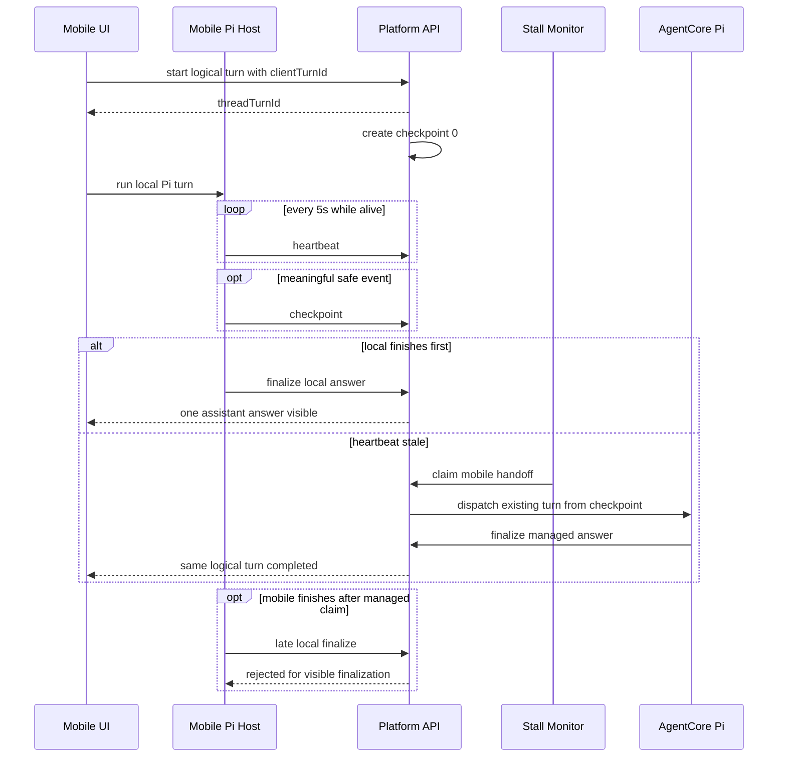
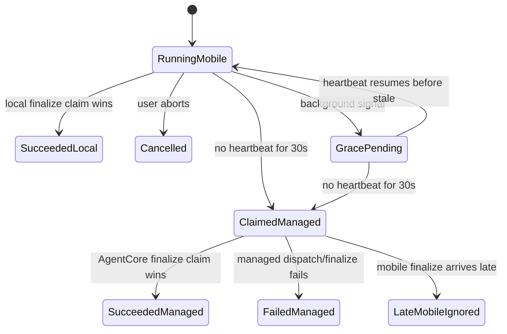
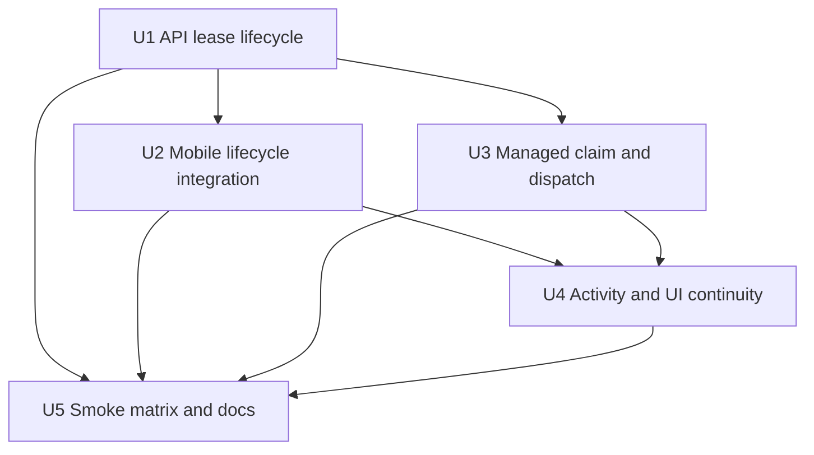

# feat: Mobile Pi AgentCore Background Handoff

## Overview

Mobile Pi should stay the default execution host, but an in-flight mobile turn
must not disappear when iOS backgrounds, suspends, or kills the app. This plan
adds a small durable turn lease around the existing mobile Pi loop, checkpoints
safe transcript evidence as the loop runs, and lets the existing server-side
stall monitor claim stale mobile turns for managed AgentCore Pi continuation.

The deliberately simple shape is:

- Use existing `thread_turns` as the lease record.
- Use existing `thread_turn_events` plus JSON snapshot fields as the checkpoint
  and activity substrate.
- Create a baseline safe checkpoint at turn start, before any model/tool work.
- Keep heartbeat cheap: update liveness every 5 seconds, but write checkpoints
  only on meaningful safe events or a bounded debounce.
- Reuse the existing managed AgentCore dispatch/finalize path where possible.
- Keep one visible user turn and one visible assistant answer.
- Treat handoff as best effort: continue from the latest safe checkpoint when
  possible, and fail closed around unsafe or mutating in-flight work.

---

## Problem Frame

The mobile app currently runs the Pi-compatible Hermes host locally and persists
the user/assistant pair only after completion through
`packages/api/src/handlers/record-turn.ts`. That means a long turn can be lost
if the app backgrounds before the local loop finishes. The brainstorm locks in
the intended behavior: every agent-enabled mobile Pi turn is handoff-capable
from the start, mobile heartbeats while alive, the server decides staleness, and
managed AgentCore becomes the authoritative finisher after claim (see origin:
`docs/brainstorms/2026-05-31-mobile-pi-background-agentcore-handoff-requirements.md`).

The key planning constraint is simplicity. This should not become a general
distributed process migration framework. V1 transfers transcript evidence and
ownership, not a live local process.

---

## Requirements Trace

- R1. Every agent-enabled mobile Pi turn creates a durable handoff-capable lease
  before the local loop starts.
- R2. Mobile heartbeats active leases every 5 seconds while alive.
- R3. The platform treats a mobile lease as stale after 30 seconds without
  heartbeat.
- R4. A background signal starts or reinforces a grace window, but does not
  immediately dispatch AgentCore.
- R5. Server-side monitoring owns stale detection and handoff claiming.
- R6. Mobile persists event transcript checkpoints while a turn runs.
- R7. Managed AgentCore continues from the latest safe checkpoint as the same
  logical turn.
- R8. After managed handoff claim, late mobile completion cannot create the
  visible assistant answer.
- R9. Unsafe in-flight checkpoints fall back to the latest safe checkpoint and
  record activity evidence.
- R10. Read-only and local evidence can carry across handoff.
- R11. Mutating effects are not silently replayed or trusted without durable
  proof.
- R12. Mobile-only permissioned actions are not reproduced by AgentCore without
  an explicit capability path.
- R13. The thread shows one logical turn, not a failed local turn followed by a
  separate managed turn.
- R14. Handoff provenance is visible in activity/timeline only.
- R15. Thread status and the working indicator remain active while ownership
  moves from mobile to AgentCore.

**Origin actors:** A1 mobile user, A2 mobile Pi host, A3 platform API, A4 server
watchdog, A5 managed AgentCore Pi host.

**Origin flows:** F1 normal local completion, F2 background grace and managed
continuation, F3 late mobile completion after claim.

**Origin acceptance examples:** AE1 local recovery before stale threshold, AE2
managed continuation after heartbeat loss, AE3 late mobile completion rejected,
AE4 unsafe in-flight checkpoint fallback.

---

## Scope Boundaries

- V1 is mobile Pi only. Use generic lease/checkpoint naming where cheap, but do
  not retrofit desktop local Pi in this plan.
- No human confirmation modal, push notification policy, or blocking approval
  UI in v1.
- No serialization or migration of active local process state, including a
  running local bash process.
- No silent replay of mutating tool calls.
- No new broad runtime orchestration system. The implementation should fit
  around existing thread turns, events, and AgentCore finalization.
- No redesign of the mobile Pi host. The plan adds durability and handoff around
  the current host.

### Deferred to Follow-Up Work

- Desktop local Pi adoption of the same lease vocabulary.
- Lower-latency stale claim using a delayed queue if one-minute watchdog cadence
  proves too slow in practice.
- Push notification or foreground banner policy after managed handoff completes.

---

## Context & Research

### Relevant Code and Patterns

- `packages/database-pg/src/schema/scheduled-jobs.ts` already defines
  `threadTurns` with `runtime_type`, `status`, `context_snapshot`,
  `result_json`, `last_activity_at`, `origin_turn_id`, and timestamps. This is
  enough for a v1 lease without a new table.
- `threadTurnEvents` already provides ordered append-only activity events keyed
  by `run_id`, `seq`, `event_type`, `message`, and `payload`. In this plan,
  public `threadTurnId`, persisted `thread_turns.id`, and event `run_id` all
  refer to the same logical turn id.
- `packages/api/src/handlers/chat-agent-finalize.ts` and
  `packages/api/src/lib/chat-finalize/process-finalize.ts` already implement an
  idempotent finalization claim using `thread_turns.finalized_at`. This is the
  pattern for preventing duplicate assistant answers.
- `packages/api/src/handlers/chat-agent-invoke.ts` already builds managed
  AgentCore payloads, renders workspace context, resolves MCP/web/search/email
  config, dispatches Event-mode Lambda, and uses the finalize callback.
- `packages/api/src/lib/desktop-runtime/prepare-local-turn.ts` already creates a
  `thread_turns` row for a local runtime before a local sidecar turn starts. The
  mobile lifecycle should mirror this shape, not invent a separate concept.
- `packages/api/src/handlers/crons/stall-monitor.ts` already runs every minute
  and scans `thread_turns` by `last_activity_at`. It can become the mobile
  handoff watchdog without adding a new schedule.
- `apps/mobile/lib/agent/thread-turn.ts` already collects `AgentEvent[]` through
  `session.subscribe`, builds `MobileSessionTurnEvidence`, and records the turn.
  Those hooks are enough to add checkpoint writes.
- `apps/mobile/lib/agent/session.ts` already exposes `abort()` and a Pi-shaped
  event stream, so mobile can stop cleanly without changing the loop contract.
- `apps/mobile/app/(tabs)/index.tsx` and
  `apps/mobile/app/thread/[threadId]/index.tsx` own the new-thread and
  follow-up-thread local harness launch paths.

### Institutional Learnings

- `docs/solutions/architecture-patterns/mobile-pi-compatible-host-contract-2026-05-30.md`
  says mobile should remain a Pi-compatible host, with capabilities surfaced as
  events, tools, extensions, and contract tests rather than hidden screen
  plumbing.
- `docs/solutions/testing/mobile-pi-smoke-matrix-2026-05-30.md` defines the
  current mobile Pi capability matrix and already expects managed AgentCore Pi,
  local bash, web search, MCP, attachments, and abort to be measurable.
- Existing finalize-callback work in `packages/api/src/lib/chat-finalize/`
  demonstrates that long-running AgentCore work should complete by callback,
  not by holding an API Lambda open.

### External References

- None. The local repo has direct patterns for durable turn rows, local runtime
  preparation, scheduled stale monitors, and AgentCore finalization. External
  research would add little practical value for this planning pass.

---

## Key Technical Decisions

- Use `thread_turns` as the lease: This avoids a new persistence model and keeps
  lifecycle status, activity queries, and finalization on the existing surface.
- Store checkpoints in existing JSON/activity fields: Use `threadTurnEvents` for
  ordered visible evidence and `context_snapshot`/`result_json` for the latest
  compact machine-readable checkpoint. Add columns only if implementation proves
  existing JSON fields cannot support safe compare-and-set semantics.
- Reuse the existing stall monitor: Extend
  `packages/api/src/handlers/crons/stall-monitor.ts` for mobile handoff before
  generic five-minute timeout processing. That keeps scheduling simple.
- Use one logical turn ID: Mobile local completion and managed continuation race
  to finalize the same `thread_turns.id`; `finalized_at` remains the idempotency
  guard.
- Persist the user message at turn start: The visible thread should show the
  prompt immediately and give AgentCore a durable message to continue from if
  mobile dies before completion.
- Require a mobile-generated `clientTurnId`: Store it in
  `thread_turns.external_run_id` with a narrow unique constraint for mobile
  turns so start retries do not duplicate user messages or turn rows.
- Create checkpoint 0 at start: The baseline checkpoint contains the durable user
  prompt, prior context identity, attachment references, and runtime metadata.
  Later continuation should fail closed only if this baseline is missing or
  corrupt.
- Separate heartbeat from checkpoint: Heartbeat updates `last_activity_at` and
  may report the latest checkpoint sequence; checkpoint writes happen for
  meaningful safe events or a bounded debounce.
- Classify checkpoints by safety: Read-only/local evidence can continue;
  mutating or mobile-only permissioned in-flight work rolls back to the last safe
  checkpoint.
- Activity-only transparency: Add timeline events for local start, checkpoint,
  background grace, stale claim, unsafe fallback, managed continuation, and
  completion. Do not add a modal.
- Accept scheduled-watchdog latency in v1: The stale threshold is 30 seconds,
  but the existing one-minute scheduler means claim can happen shortly after the
  threshold. A delayed queue is a follow-up optimization if this proves too slow.

---

## Open Questions

### Resolved During Planning

- Durable storage shape: Use existing `thread_turns`, `thread_turn_events`, and
  JSON snapshot fields for v1. Add a narrow unique constraint for mobile
  `external_run_id`/`clientTurnId`, but avoid a dedicated checkpoint ledger
  unless tests expose a real need.
- Watchdog shape: Extend the existing one-minute stall monitor with mobile
  handoff claim logic instead of adding a new scheduler.
- Grace window meaning: Background does not create a separate timer. It records
  activity and reinforces the same 30-second no-heartbeat stale rule.
- Tool safety classification: Begin with explicit metadata in the mobile
  checkpoint writer. Treat local bash, workspace reads/search, web search, MCP
  reads, model text, and attachments as carry-forward transcript evidence. Local
  bash output is evidence text only; it is not proof that durable side effects
  should be trusted or replayed. Treat email, future writes, mutating bash
  commands, and mobile-only permissioned actions as unsafe unless durable proof
  exists.
- Activity labels: Use short system activity strings matching existing timeline
  style: "mobile Pi turn started", "checkpoint saved", "background grace
  started", "managed Pi claimed", "unsafe checkpoint skipped", and "managed Pi
  completed".

### Deferred to Implementation

- Exact endpoint names and payload field names: Keep them coherent with existing
  `/api/threads/...` handlers and mobile auth helpers during implementation.
- Exact helper extraction from `chat-agent-invoke.ts`: Create a small shared
  managed-dispatch helper or explicit existing-turn dispatch path. Do not call
  `chat-agent-invoke` as-is for handoff, because that handler creates a new
  `thread_turns` row.
- Whether existing GraphQL fields already expose enough activity metadata for
  the mobile UI: If not, add the smallest schema/codegen change needed.

---

## High-Level Technical Design

> This illustrates the intended approach and is directional guidance for review,
> not implementation specification. The implementing agent should treat it as
> context, not code to reproduce.

---

## Implementation Units

- U1. **API Turn Lease Lifecycle**

**Goal:** Add a durable mobile turn lifecycle around the existing
completion-only `record-turn` behavior: start, heartbeat/checkpoint, background
grace signal, and local finalize.

**Requirements:** R1, R2, R4, R6, R8, R13, R15; F1, F3; AE1, AE3.

**Dependencies:** None.

**Files:**

- Create: `packages/api/src/lib/mobile-turns/lifecycle.ts`
- Create: `packages/api/src/lib/thread-turn-events.ts`
- Create or modify: `packages/api/src/handlers/mobile-turn-session.ts`
- Modify: `packages/database-pg/src/schema/scheduled-jobs.ts`
- Create: `packages/database-pg/drizzle/<next>_mobile_turn_client_id.sql`
- Modify: `packages/api/src/handlers/record-turn.ts`
- Modify: `terraform/modules/app/lambda-api/handlers.tf`
- Test: `packages/api/src/handlers/mobile-turn-session.test.ts`
- Test: `packages/api/src/lib/thread-turn-events.test.ts`
- Test: `packages/api/src/handlers/record-turn.test.ts`

**Approach:**

- Create a Cognito-authenticated mobile lifecycle endpoint or small endpoint
  group under the existing `/api/threads/...` HTTP API surface.
- On start, require a mobile-generated `clientTurnId`, validate
  tenant/thread/agent access, insert the user message if it has not already been
  inserted for that idempotency key, create a `thread_turns` row with
  `runtime_type`/snapshot metadata identifying the mobile Pi host, set
  `external_run_id = clientTurnId`, `status = running`, `started_at`, and
  `last_activity_at`, then notify thread turn subscribers.
- Add a narrow unique constraint for mobile turn idempotency using
  `tenant_id`, `thread_id`, and `external_run_id` for mobile Pi turns so start
  retries can safely load and return the existing `threadTurnId`. Treat
  `clientTurnId` as an idempotency token only, never as authorization.
- Create baseline checkpoint 0 inside the start transaction. It should include
  the user prompt, requester identity, prior context identity, attachment
  references, active space/agent ids, and runtime metadata.
- Return `threadTurnId` to mobile so all heartbeat, checkpoint, background, and
  finalization calls target the same logical turn.
- On heartbeat, update only liveness fields (`last_activity_at` and optionally
  latest checkpoint sequence). Do not write full transcript checkpoints every 5
  seconds.
- On checkpoint, append bounded `thread_turn_events` and refresh the latest
  compact checkpoint JSON.
- Centralize `thread_turn_events` appends behind a helper that allocates `seq`
  under a transaction/parent-turn lock so checkpoint ordering is stable.
- On background signal, append an activity event and record the background
  timestamp in the snapshot without dispatching managed AgentCore. The stale
  rule remains 30 seconds without heartbeat.
- On abort, mark the lease `cancelled` or otherwise non-handoff-eligible and
  append an abort activity event so the watchdog cannot later claim it as stale
  work.
- On local finalize, use the same idempotency posture as
  `processFinalize`: only the first eligible finisher writes the visible
  assistant answer. If managed has claimed, return a non-visible diagnostic
  response: the late result may be stored for evidence, but the response must
  make clear that visible finalization was rejected.
- Keep `record-turn` compatible for any remaining callers, but make the new
  lifecycle path the mobile harness path.

**Execution note:** Start with request/response and idempotency tests before
changing the mobile caller. The correctness boundary is server-owned.

**Patterns to follow:**

- `packages/api/src/handlers/record-turn.ts` for Cognito tenant/thread guards.
- `packages/api/src/lib/desktop-runtime/prepare-local-turn.ts` for local runtime
  turn creation.
- `packages/api/src/handlers/chat-agent-finalize.ts` and
  `packages/api/src/lib/chat-finalize/process-finalize.ts` for finalization
  idempotency.

**Test scenarios:**

- Happy path: authenticated mobile start with a valid thread and user text
  inserts one user message, one running `thread_turns` row, and returns a
  `threadTurnId`.
- Happy path: start creates checkpoint 0 before any model/tool work.
- Happy path: retrying start with the same `clientTurnId` returns the existing
  `threadTurnId` and does not duplicate the user message.
- Happy path: heartbeat with a valid `threadTurnId` updates
  `last_activity_at` without appending a full checkpoint event.
- Happy path: checkpoint append allocates the next ordered event sequence for
  the same `run_id`/`threadTurnId`.
- Happy path: local finalize before stale claim inserts one assistant message,
  marks the turn succeeded/finalized, updates thread preview, and notifies
  subscribers. Covers F1.
- Edge case: checkpoint payloads are bounded and reject obviously oversized
  transcripts.
- Edge case: abort marks the turn non-handoff-eligible, and a later watchdog
  scan ignores it.
- Error path: cross-tenant thread or unknown thread returns the same style of
  404/403 protection as `record-turn`.
- Error path: a valid `clientTurnId` for a different tenant/thread cannot load
  or mutate the existing turn.
- Error path: late mobile finalize after managed claim does not insert an
  assistant message and stores diagnostic evidence only. Covers AE3.
- Integration: thread lifecycle status reports running after start and completed
  after local finalize.

**Verification:**

- A mobile-local turn can be represented durably before the model runs.
- The previous completion-only behavior remains available for compatibility.
- No server API path can produce duplicate visible assistant answers for the
  same `threadTurnId`.

---

- U2. **Mobile Harness Lease Integration**

**Goal:** Wire the mobile Pi host to the lifecycle API so every agent-enabled
turn starts durably, heartbeats, checkpoints, handles backgrounding, and
finalizes through the server-owned lease.

**Requirements:** R1, R2, R4, R6, R10, R11, R12, R15; F1, F2; AE1.

**Dependencies:** U1.

**Files:**

- Create: `apps/mobile/lib/agent/turn-lease.ts`
- Modify: `apps/mobile/lib/agent/thread-turn.ts`
- Modify: `apps/mobile/lib/agent/persist-turn.ts`
- Modify: `apps/mobile/lib/agent/types.ts`
- Modify: `apps/mobile/app/(tabs)/index.tsx`
- Modify: `apps/mobile/app/thread/[threadId]/index.tsx`
- Test: `apps/mobile/lib/agent/turn-lease.test.ts`
- Test: `apps/mobile/lib/agent/thread-turn.test.ts`
- Test: `apps/mobile/lib/agent/persist-turn.test.ts`

**Approach:**

- Replace the mobile harness' default end-only `recordTurn` path with a
  lifecycle client that generates a `clientTurnId` and starts a lease before
  `session.prompt`.
- Keep the local Pi event loop unchanged; add a narrow adapter that subscribes
  to `AgentEvent` and writes safe checkpoints through the lifecycle client.
- Run a 5-second heartbeat timer while the turn is active. Stop it in `finally`
  and during abort. Heartbeat is a liveness update, not a transcript write.
- Write checkpoints on meaningful safe events or a bounded debounce, not on
  every heartbeat.
- Use React Native app state events to send a background signal when possible,
  then rely on the server watchdog for the actual claim.
- Classify event evidence at checkpoint time:
  - Safe transcript evidence: model text, local bash output text, workspace
    reads/searches, web search, MCP read-only responses, image/file evidence,
    and non-mutating tool results.
  - Unsafe unless durable proof exists: send email, future write actions,
    mutating bash commands, mobile-only permissioned actions, and in-flight tool
    calls without a result.
- Preserve the existing optimistic UI behavior: route immediately, mark the
  thread active, and let the durable turn lease keep the working state alive.
  Reconcile the optimistic user bubble with the durable user message created at
  lease start so mobile does not render a duplicate prompt.

**Execution note:** Characterize the current `runThreadHarnessTurn` result and
event ordering before replacing the persistence path.

**Patterns to follow:**

- `apps/mobile/lib/agent/thread-turn.ts` for extension loading and event
  collection.
- `apps/mobile/lib/agent/session.ts` for event subscription and abort semantics.
- `apps/mobile/lib/agent/compat/pi-contract.test.ts` for Pi-compatible host
  contract posture.
- `docs/solutions/architecture-patterns/mobile-pi-compatible-host-contract-2026-05-30.md`.

**Test scenarios:**

- Happy path: `runThreadHarnessTurn` starts a lease before calling the model,
  heartbeats while the mocked provider is pending, writes checkpoint events, and
  finalizes with assistant text.
- Happy path: the mobile client reuses the same `clientTurnId` for a retry of
  the same pending local send.
- Happy path: background app-state event sends a background signal but does not
  abort the local run by itself. Covers AE1.
- Edge case: local run finishes with no final text, so fallback assistant text
  finalizes through the lifecycle path exactly once.
- Edge case: abort stops the heartbeat timer, records an aborted checkpoint, and
  calls lifecycle abort so the lease is non-handoff-eligible.
- Error path: lifecycle start failure prevents the local model call and surfaces
  a clear harness error.
- Error path: local finalize rejected due to managed claim clears active UI state
  without writing duplicate visible messages.
- Integration: new-thread and existing-thread send paths both pass the active
  space, user identity, agent id, attachments, and prior messages into the lease
  flow.
- Integration: optimistic pending user messages are replaced by the durable
  start-created message without duplicate prompt rendering.

**Verification:**

- Mobile no longer waits until the end of a turn before the platform knows a
  logical turn exists.
- Heartbeat and checkpoint calls are observable in unit tests without requiring
  a simulator.
- The existing local tools/extensions remain available through the same host.

---

- U3. **Managed Handoff Claim and Dispatch**

**Goal:** Extend server-side stale monitoring so a stale mobile lease can be
claimed once and continued by managed AgentCore Pi from the latest safe
checkpoint.

**Requirements:** R3, R5, R7, R8, R9, R10, R11, R12, R13, R14; F2, F3; AE2,
AE3, AE4.

**Dependencies:** U1.

**Files:**

- Create: `packages/api/src/lib/mobile-turns/checkpoint.ts`
- Create or modify: `packages/api/src/lib/mobile-turns/managed-dispatch.ts`
- Create or modify: `packages/api/src/lib/chat-agent/dispatch-managed-turn.ts`
- Modify: `packages/api/src/handlers/crons/stall-monitor.ts`
- Modify: `packages/api/src/handlers/chat-agent-invoke.ts`
- Modify: `terraform/modules/app/lambda-api/main.tf`
- Test: `packages/api/src/lib/mobile-turns/checkpoint.test.ts`
- Test: `packages/api/src/lib/mobile-turns/managed-dispatch.test.ts`
- Test: `packages/api/src/handlers/crons/stall-monitor.test.ts`
- Test: `packages/api/src/handlers/chat-agent-invoke.runtime-routing.test.ts`

**Approach:**

- Add a mobile-specific branch to the existing stall monitor before the generic
  five-minute timeout branch. It scans running mobile Pi `thread_turns` whose
  `last_activity_at` is more than 30 seconds old and whose snapshot indicates
  they are handoff-eligible.
- Ignore cancelled, aborted, finalized, non-handoff-eligible, or already-claimed
  turns.
- Claim handoff with an atomic update that only succeeds while the row is still
  running and unfinalized. Record claim metadata and append a
  "managed Pi claimed" event.
- Define a compact `MobileTurnCheckpoint` schema in the API layer. It should
  render into the current AgentCore contract rather than requiring a Python
  runtime change: prior conversation remains `messages_history`; the current
  `message` is the original user prompt plus a concise continuation preamble
  containing safe checkpoint evidence and any unsafe-fallback note.
- Build continuation context from the latest safe checkpoint: original user
  message, prior conversation, safe transcript events, tool evidence, and
  activity notes. If the newest checkpoint is unsafe, fall back to the previous
  safe checkpoint and append an "unsafe checkpoint skipped" event. If checkpoint
  0 is missing or corrupt, fail closed.
- Dispatch managed AgentCore through a shared managed-dispatch helper or an
  explicit `existingThreadTurnId` path extracted from `chat-agent-invoke`.
  Do not call `chat-agent-invoke` as-is, because it creates a new
  `thread_turns` row.
- The extracted path should reuse the same runtime config, workspace rendering,
  tool config, MCP config, web search config, and finalize callback semantics as
  a normal `chat-agent-invoke` turn while skipping turn creation.
- Preserve the same `thread_turns.id` as the idempotency/finalization key so the
  user-visible assistant answer remains one logical turn.
- If dispatch fails synchronously, mark the turn failed with a clear error and
  preserve activity evidence. Do not restart local mobile work.

**Execution note:** Implement the checkpoint safety classifier with tests before
connecting it to the watchdog. The unsafe fallback policy is the most important
trust boundary.

**Patterns to follow:**

- `packages/api/src/handlers/crons/stall-monitor.ts` for scheduled stale scans.
- `packages/api/src/handlers/chat-agent-invoke.ts` for AgentCore payload setup.
- `packages/api/src/graphql/utils.ts` for Event-mode Lambda dispatch patterns.
- `packages/api/src/lib/chat-finalize/process-finalize.ts` for one-winner
  finalization.

**Test scenarios:**

- Happy path: a stale running mobile turn with a safe checkpoint is claimed once
  and dispatched to AgentCore with the original thread turn id. Covers AE2.
- Happy path: a fresh running mobile turn is ignored by the watchdog.
- Happy path: a turn with only checkpoint 0 can be dispatched using the original
  user prompt and baseline context.
- Edge case: two watchdog invocations race; only one claim update succeeds and
  only one managed dispatch happens.
- Edge case: aborted/cancelled mobile turns are not claimed when their heartbeat
  stops.
- Edge case: latest checkpoint is an in-flight mutating tool call; dispatcher
  falls back to the previous safe checkpoint and writes an activity event.
  Covers AE4.
- Error path: checkpoint 0 is missing or corrupt; turn fails closed with a clear
  error instead of restarting blindly from an untrusted prompt reconstruction.
- Error path: AgentCore dispatch throws synchronously; turn is marked failed and
  no duplicate assistant answer is inserted.
- Integration: late mobile local finalize after a managed claim is rejected by
  U1 lifecycle finalization. Covers AE3.

**Verification:**

- Stale mobile turns can be observed, claimed, and dispatched without adding a
  new scheduler.
- Managed continuation uses the same production AgentCore finalization path as
  normal cloud turns.
- Unsafe or mutating evidence is not silently replayed.

---

- U4. **Activity Timeline and Working State Continuity**

**Goal:** Make the host transfer understandable in the mobile UI while keeping
the user-facing conversation as one logical turn.

**Requirements:** R13, R14, R15; F1, F2, F3; AE1, AE2, AE3, AE4.

**Dependencies:** U1, U2, U3.

**Files:**

- Inspect first, modify only if existing payloads are insufficient:
  `packages/api/src/graphql/resolvers/triggers/threadTurns.query.ts`
- Inspect first, modify only if existing payloads are insufficient:
  `packages/api/src/graphql/resolvers/triggers/threadTurnEvents.query.ts`
- Modify: `packages/api/src/graphql/resolvers/threads/lifecycle-status.ts`
- Modify: `apps/mobile/app/thread/[threadId]/index.tsx`
- Modify: `apps/mobile/components/threads/ActivityTimeline.tsx`
- Modify if GraphQL documents change: `apps/mobile/lib/gql/*`
- Test: `packages/api/src/__tests__/lifecycle-status.test.ts`
- Test: `apps/mobile/components/threads/ActivityTimeline.test.tsx`

**Approach:**

- Verify first that mobile can already query the activity events needed for local start,
  checkpoint saved, background grace, managed claim, unsafe fallback, and
  managed completion. Add GraphQL/codegen work only for proven gaps.
- Keep `deriveLifecycleStatus` returning running while either local mobile or
  managed continuation owns the same logical turn.
- Render host transfer evidence in the existing activity/timeline pattern rather
  than adding an inline banner or modal.
- Keep the existing working indicator behavior active while the logical turn is
  running, independent of whether the current owner is mobile or AgentCore.
- If GraphQL already exposes enough event payload, avoid schema changes. If not,
  add the smallest schema/codegen update needed for mobile.

**Patterns to follow:**

- `packages/api/src/graphql/resolvers/threads/lifecycle-status.ts` for status
  derivation.
- `packages/api/src/graphql/resolvers/triggers/threadTurnEvents.query.ts` for
  ordered activity retrieval.
- Existing mobile thread detail activity rendering in
  `apps/mobile/app/thread/[threadId]/index.tsx`.

**Test scenarios:**

- Happy path: local completion shows one user message, one assistant message,
  and activity showing mobile start/checkpoints/completion.
- Happy path: managed handoff shows one logical running turn, managed claim
  activity, and one final assistant answer. Covers AE2.
- Edge case: unsafe checkpoint fallback appears as activity without adding
  visible assistant text.
- Error path: managed dispatch failure appears as failed turn activity and
  clears the working indicator.
- Integration: lifecycle status remains `RUNNING` through the mobile-to-managed
  ownership transfer and becomes completed only after finalization.

**Verification:**

- Users can understand that a backgrounded mobile turn continued elsewhere.
- The UI never shows a failed local turn followed by a separate cloud turn for
  the same prompt.

---

- U5. **E2E Smoke Coverage and Operational Docs**

**Goal:** Extend the mobile Pi verification matrix so background handoff is
measurable alongside bash, web search, MCP, attachments, abort, and managed
AgentCore Pi.

**Requirements:** R1-R15; F1, F2, F3; AE1, AE2, AE3, AE4.

**Dependencies:** U1, U2, U3, U4.

**Files:**

- Modify: `apps/mobile/scripts/pi-harness-smoke.ts`
- Modify: `apps/mobile/package.json`
- Modify: `docs/solutions/testing/mobile-pi-smoke-matrix-2026-05-30.md`
- Create: `docs/solutions/architecture-patterns/mobile-pi-background-handoff-2026-05-31.md`
- Test: `apps/mobile/scripts/pi-harness-smoke.test.ts`
- Test: `packages/api/src/handlers/crons/stall-monitor.test.ts`

**Approach:**

- Add smoke modes for:
  - Local turn completes before stale threshold.
  - Heartbeat stops and managed AgentCore continuation completes.
  - Late mobile completion is rejected after managed claim.
  - Unsafe in-flight checkpoint falls back to the last safe checkpoint.
- Keep dry-run support so CI can validate the matrix shape without deployed
  credentials.
- In deployed smoke mode, print `thread.id`, `thread.identifier`, and
  `threadTurnId` for every handoff scenario so failures are traceable in the UI.
- Update the smoke matrix doc with expected evidence and operational caveats,
  including the one-minute watchdog cadence.
- Add a short solution doc after implementation lands describing mobile
  background handoff v1 behavior and limits.

**Patterns to follow:**

- `apps/mobile/scripts/pi-harness-smoke.ts` for current mobile capability smoke
  shape.
- `docs/solutions/testing/mobile-pi-smoke-matrix-2026-05-30.md` for evidence
  table style and latest dev evidence.
- `docs/solutions/architecture-patterns/mobile-pi-compatible-host-contract-2026-05-30.md`
  for durable architecture pattern docs.

**Test scenarios:**

- Happy path: dry-run matrix includes all new handoff scenarios with expected
  capability names and evidence fields.
- Happy path: deployed smoke can create a turn, stop heartbeats, observe managed
  continuation, and report one visible assistant answer.
- Edge case: dry-run validates unsafe checkpoint scenario shape without a live
  mutating tool.
- Error path: missing deployed credentials skip deployed smoke with an explicit
  message rather than producing a false pass.
- Integration: existing bash, web search, MCP, image, file, abort, and
  AgentCore Pi rows remain present in the full matrix.

**Verification:**

- The feature has repeatable local/API tests and an E2E smoke path.
- Docs tell an implementer/operator how to interpret a handoff turn in dev.

---

## System-Wide Impact

- **Interaction graph:** Mobile UI starts a thread, mobile Pi starts a durable
  turn, API lifecycle endpoints update `thread_turns`, the stall monitor claims
  stale mobile leases, AgentCore finalizes through the existing callback, and
  GraphQL/mobile activity renders the same logical turn.
- **Error propagation:** Local lifecycle start failures prevent the model call;
  heartbeat/checkpoint failures should be surfaced as diagnostic events but not
  immediately kill a still-running local loop; managed dispatch failures mark
  the logical turn failed with visible activity.
- **State lifecycle risks:** Duplicate user messages, duplicate assistant
  answers, and stale running indicators are the primary risks. The plan uses a
  single `threadTurnId`, idempotent start keys, and `finalized_at` compare-and-
  set semantics to contain them.
- **Security boundary:** Cognito-authenticated lifecycle endpoints must resolve
  the caller's tenant and user server-side on every call. `clientTurnId` is
  dedupe metadata only; it never grants read/write access to another thread or
  turn.
- **API surface parity:** Mobile gets a lifecycle API analogous to desktop
  local runtime session preparation, but desktop behavior does not change in
  this plan.
- **Integration coverage:** Unit tests must be complemented by smoke tests that
  exercise deployed auth, mobile lifecycle calls, watchdog claim, AgentCore
  dispatch, and finalization.
- **Unchanged invariants:** MCP tools, web search, local bash, workspace
  context, mobile attachments, and the Pi-compatible host contract remain
  capabilities of the mobile loop; this plan changes persistence/ownership, not
  the tool model.

---

## Alternative Approaches Considered

- Dedicated checkpoint table: Rejected for v1 because `thread_turns` and
  `thread_turn_events` already carry the needed lease, activity, and JSON
  snapshot fields.
- Immediate AgentCore dispatch on background: Rejected because iOS can
  background briefly and recover; the origin explicitly requires a grace window.
- Delayed SQS/EventBridge per-turn handoff job: Deferred. It could improve
  latency, but the existing one-minute stall monitor is simpler and already
  deployed.
- Human confirmation before handoff: Rejected for v1 because the app may be
  backgrounded or killed, and the origin chose activity-only transparency.
- Restart from the original prompt only: Rejected because the origin requires
  continuation from safe event transcript checkpoints.

---

## Risks & Dependencies

| Risk                                                                       | Mitigation                                                                                                    |
| -------------------------------------------------------------------------- | ------------------------------------------------------------------------------------------------------------- |
| Duplicate assistant answers if mobile and AgentCore finish close together  | Use one `threadTurnId` and existing `finalized_at` finalization claim semantics.                              |
| Watchdog cadence feels slower than the 30-second stale threshold           | Document that v1 claims shortly after threshold on the one-minute schedule; defer delayed queue optimization. |
| Unsafe tool effects are carried forward incorrectly                        | Add explicit checkpoint safety classification and tests for mutating/in-flight tool calls.                    |
| Mobile lifecycle endpoints become a parallel chat system                   | Keep them scoped to start/heartbeat/checkpoint/finalize and reuse existing message/thread/finalize helpers.   |
| Managed continuation accidentally creates a second `thread_turns` row      | Extract an existing-turn AgentCore dispatch helper; never call `chat-agent-invoke` as-is for handoff.         |
| Managed continuation payload duplicates too much `chat-agent-invoke` logic | Extract only the smallest helper needed; avoid broad refactors during feature delivery.                       |
| Existing `record-turn` callers regress                                     | Preserve compatibility tests and migrate only the mobile harness default path.                                |

---

## Documentation / Operational Notes

- Update the mobile smoke matrix with handoff scenarios and expected evidence.
- Add a solution doc after implementation describing the lease/checkpoint/handoff
  pattern and its v1 limits.
- Make logs and activity events include `threadTurnId` so dev-stage debugging can
  correlate mobile, watchdog, and AgentCore phases.
- Do not run manual production mutations. Handoff behavior ships through normal
  PR/merge/deploy.

---

## Sources & References

- **Origin document:** `docs/brainstorms/2026-05-31-mobile-pi-background-agentcore-handoff-requirements.md`
- `packages/database-pg/src/schema/scheduled-jobs.ts`
- `packages/api/src/handlers/record-turn.ts`
- `packages/api/src/handlers/chat-agent-invoke.ts`
- `packages/api/src/handlers/chat-agent-finalize.ts`
- `packages/api/src/lib/chat-finalize/process-finalize.ts`
- `packages/api/src/lib/desktop-runtime/prepare-local-turn.ts`
- `packages/api/src/handlers/crons/stall-monitor.ts`
- `apps/mobile/lib/agent/thread-turn.ts`
- `apps/mobile/lib/agent/session.ts`
- `docs/solutions/architecture-patterns/mobile-pi-compatible-host-contract-2026-05-30.md`
- `docs/solutions/testing/mobile-pi-smoke-matrix-2026-05-30.md`
