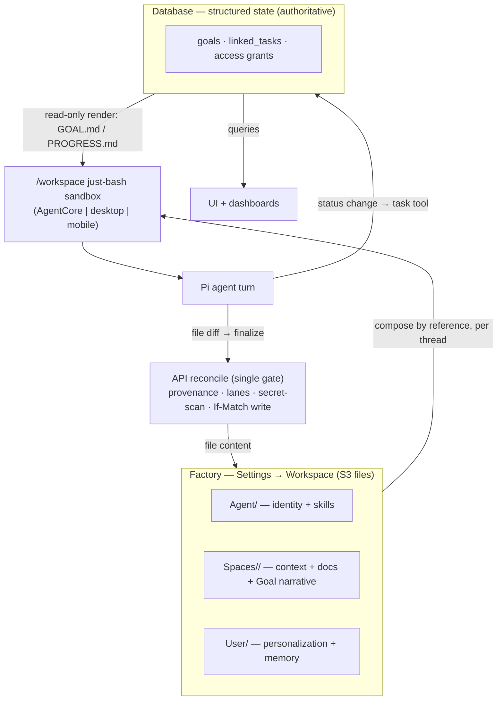

# refactor: Workspace + Agent-Turn Architecture

## Summary

Re-architect the workspace file substrate into three legible source folders (Agent / Spaces / User) that compose per-thread into a rendered runtime workspace, and build the **net-new reconcile path** that writes the agent's file changes back to S3 through the API. Structured workflow state (goals, tasks, lifecycle, access) **stays database-authoritative and is preserved** — the ownership line is drawn by data kind so the two stores never hold the same fact (no drift). Delivered as an inert→live, substrate-first arc with a one-shot S3 cutover (no production users).

## Problem Frame

Today the file layout bottoms out in raw UUIDs and random petnames (illegible), materializes a rendered copy per `(agent × space × user)` tuple (duplication + deep nesting), and — most damagingly — lets the same kind of fact live writably in both Postgres and S3, where they drift. The agent's file changes also never reach S3 at all: desktop `workspace-cache.ts` is download-only, mobile snapshots to AsyncStorage, AgentCore persists only the transcript. So the agent can edit `/workspace` and the edits vanish. This plan fixes legibility, removes the per-tuple explosion, gives each data kind one authoritative home, and builds the write-back path — without inverting the working Goals feature out of the database (see origin: `docs/brainstorms/2026-05-31-workspace-architecture-simplification-requirements.md`).

## Requirements Traceability

| Origin requirement | Units |
|---|---|
| R1–R3 legibility / human names | U1, U2 |
| R4–R8 factory & composition | U2, U3, U8 |
| R9–R12 ownership boundary | U5, U7, U8 |
| R13 Goals preserved (DB) | U7, U9 |
| R14–R18 turn & reconcile | U4, U5, U6 |
| R19–R21 file storage & partial-success | U5, U6 |
| R22 secrets | U10 |
| R23 runtimes / desktop executor | U6, U12 |
| R24 revocation + TTL | U11 |
| R25 migration / cutover | U12, U13 |
| R26 documentation | U14 |

## Key Technical Decisions

- **KTD1 — Reconcile at the finalize boundary, not per-runtime.** Desktop and AgentCore already converge on `POST /api/threads/{threadId}/finalize` → `processFinalize` (`packages/api/src/lib/chat-finalize/process-finalize.ts`). Mobile must be migrated to create/use a durable `thread_turn_id` and call the same finalize endpoint before mobile write-back is considered complete; do not add a second mobile-only reconcile endpoint. The changed-file diff rides the existing `finalizeTurn` callback (`packages/pi-runtime-core/src/finalize-client.ts` `buildFinalizeBody`). Building reconcile once at this single trust boundary honors the "server is the only authoritative gate" requirement and avoids divergent write paths.

- **KTD2 — Lift the existing If-Match pattern; do not invent locking.** `packages/agentcore-pi/agent-container/src/runtime/session-store.ts` already does conditional S3 writes (`IfMatch`/`IfNoneMatch` → `SessionConflictError` on 412). File reconcile reuses this exact shape. S3 object versioning is already enabled (`terraform/modules/data/s3-buckets/main.tf`), so the recovery net needs no infra change.

- **KTD3 — Extract and reuse provenance/lane policy.** `packages/api/workspace-files.ts` already has target resolvers (`resolveAgentTarget`/`resolveSpaceTarget`/`resolveUserContextTarget`/`resolveThreadTarget`) and lane rejectors (`isProtectedOrchestrationWritePath`, `rejectSpaceCapabilityWrite`, `isVisibleUserContextPath`), but they currently live in a handler-shaped module. Extract the shared target resolution, path provenance, and lane-policy functions into a tested library before U5; `workspace-files.ts` and `reconcile.ts` both call that library.

- **KTD4 — Structured state never passes through reconcile.** Task/goal status mutations go through a transactional task tool backed by a server API that writes `linked_tasks`/`goals` directly (the database owns them). `GOAL.md`/`PROGRESS.md` are rendered read-only from the database into the runtime workspace by U8 and are an explicit reconcile reject-lane once U8 wires those paths — the agent cannot write status by editing a file. This is the ownership invariant that prevents drift.

- **KTD5 — Inert→live, stubs throw.** Per `docs/solutions/architecture-patterns/inert-first-seam-swap-multi-pr-pattern-2026-05-08.md`: land the diff contract + finalize plumbing with the reconcile body stubbed to **throw** (never no-op — a silent no-op would ack turns while writes vanish, the worst failure for a write-back path), then swap in the live body with a call-count body-swap test asserting `PutObject` actually fires.

- **KTD6 — Provenance is fixed-prefix with local manifest composition.** Source folders remain canonical in S3. Each thread hydrates from an ordered manifest of source prefixes, composes them locally into `/workspace` under deterministic owner prefixes, and carries source/owner metadata in the hydrate manifest for reconcile. Unmapped paths are rejected and logged (matching existing lane-rejection behavior); the explicit `scratch/` lane is a non-authoritative discard lane that returns `dropped_scratch` in the reconcile report without logging a violation.

- **KTD7 — Stable human-name paths, UUID identity.** Folder names derive from display names at creation time via the existing `slugFromDisplayName` + collision pattern (`tenant-credentials/shared.ts`, `createSpace.mutation.ts:nextAvailableSpaceSlug`, `workspace-files.ts:resolveCollisionName`) and persist as `workspace_folder_name`. Display-name renames do not automatically rename S3 folders. The UUID remains the stable identity in the database; every path consumer resolves UUID→stable workspace folder name through the database and never treats the display name as the storage key.

- **KTD8 — One-shot cutover, no forward-compat.** No production users → regenerate S3 to the new layout in a single idempotent, dry-runnable, per-tenant-batched migration (mirroring `scripts/migrate-collapse-agents.ts` and the materialize-at-write-time backfill contract). No dual-read/dual-write window.

## High-Level Technical Design



## Output Structure (new S3 file layout)

```text
tenants/<tenant>/                         # tenant = security boundary (S3 only)
  agents/<agent-name>/                    # Agent source (shared per customer)
    AGENTS.md  IDENTITY.md  CAPABILITIES.md  skills/
  spaces/<space-name>/                    # Spaces source (shared, ACL-gated)
    CONTEXT.md  docs/
    goals/<goal-name>/                    # Goal NARRATIVE only (decisions, handoffs, artifacts)
  users/<user-name>/                      # User source (per-user)
    USER.md  memory/
  threads/<thread-name>/                  # per-thread rendered runtime (composed by reference)
    GOAL.md  PROGRESS.md                  # DB-rendered, read-only
    <thread>.jsonl                        # transcript
```
Per-tuple `rendered/<agent>/<space>/<user>/` is removed. Empty folders carry `.gitkeep` sentinels (filtered from leaf rendering, no user-facing delete) per `docs/solutions/design-patterns/gitkeep-materialization-s3-empty-folders-2026-05-13.md`.

---

## Phase A — File layout & legibility

### U1. Human-name folder identity

- **Goal:** Folder paths are legible human names; retire the random petname generator; keep UUID as the stable identity.
- **Requirements:** R2, R3.
- **Dependencies:** none.
- **Files:** `packages/api/src/graphql/resolvers/tenant-credentials/shared.ts` (`slugFromDisplayName`, `assertSlugAvailable`), `packages/api/src/graphql/resolvers/spaces/createSpace.mutation.ts` (`nextAvailableSpaceSlug`), `packages/api/workspace-files.ts` (`resolveCollisionName`), `packages/database-pg/src/schema/threads.ts` + `goals.ts` (add a stable `workspace_folder_name`/path field if not already present), and only those consumers of `packages/database-pg/src/utils/generate-slug.ts` that actually create workspace folder names.
- **Approach:** Centralize a `workspaceFolderName(displayName, existingSiblings)` helper that derives a sanitized name at creation time and appends a collision suffix only when needed. Persist that value separately from display name. First classify each `generate-slug.ts` consumer as either in-scope workspace path generation or out-of-scope durable/external slug generation; leave unrelated tenant, invite, URL, or durable identifier slugs unchanged. Path consumers resolve UUID→`workspace_folder_name` via the database; never cache a path string. Migration of existing rows handled in U13.
- **Patterns to follow:** `slugFromDisplayName` + `resolveCollisionName`.
- **Test scenarios:**
  - Covers R3. A user named "Eric Odom" yields folder `eric-odom`, not a UUID or petname.
  - Two spaces both named "Customer" yield `customer` and `customer-2` (collision suffix only on the second).
  - A rename ("Customer" → "Customer Inc") changes the display name but leaves the existing `workspace_folder_name` and S3 prefix stable.
  - Empty/symbol-only display name falls back to a safe default rather than an empty path.
- **Verification:** New entities render legible stable folder names in Settings → Workspace; no petname/UUID leaves; display-name rename does not move or orphan references. Any future folder rename is a separate explicit subtree move/alias migration with rollback and idempotency.

### U2. Canonical file key builders + three-source layout

- **Goal:** One canonical key scheme for the Agent/Spaces/User factory + per-thread runtime; eliminate the per-tuple prefix.
- **Requirements:** R1, R4, R5, R6.
- **Dependencies:** U1.
- **Files:** `packages/api/src/lib/workspace-renderer/prefixes.ts`, the duplicated inline builders in `packages/api/workspace-files.ts:188-248` (keep both in sync — comment at `:185`), `packages/api/src/lib/workspace-renderer/types.ts`.
- **Approach:** Replace `renderedWorkspacePrefix` (per-tuple) with `threadRuntimePrefix(threadName)` and align the source builders to `agents/<name>/`, `spaces/<name>/`, `users/<name>/`. Encode owner-prefix determinism for KTD6 provenance. Add `.gitkeep` materialization for empty source/goal folders.
- **Patterns to follow:** existing builder shape in `prefixes.ts`; gitkeep pattern.
- **Test scenarios:**
  - Each builder produces the documented Output Structure path for given names.
  - A path under `users/<name>/memory/` maps to owner = User; under `spaces/<name>/docs/` = Space; under `agents/<name>/skills/` = Agent (the provenance lookup KTD6 depends on).
  - An unmapped top-level path resolves to "unowned" (drives U5's reject behavior).
  - The two builder copies (`prefixes.ts` and `workspace-files.ts`) produce byte-identical keys for the same inputs.
- **Verification:** No code path constructs a `rendered/<agent>/<space>/<user>/` key; provenance lookup is total over the new layout.

### U3. Per-thread render-by-reference

- **Goal:** Compose the three sources by reference into the per-thread runtime workspace, plus DB-rendered read-only status files — replacing per-tuple materialization.
- **Requirements:** R6, R8, R14.
- **Dependencies:** U2.
- **Files:** `packages/api/src/lib/workspace-renderer/compose-tuple.ts` (replace `renderWorkspaceTuple`), `packages/api/src/handlers/workspace-renderer.ts`, `packages/api/src/lib/workspace-renderer/repository.ts` (the resolve shape).
- **Approach:** Compose by reference (no deep-copy of agent/space files into each thread) using the KTD6 hydrate manifest: ordered source prefixes are hydrated locally into deterministic owner-prefixed paths in `/workspace`, with owner/source metadata retained for reconcile. U3 reserves the status-file mount point; U8 owns the actual DB-rendered `GOAL.md`/`PROGRESS.md` projection and reconcile reject-lane.
- **Patterns to follow:** existing `compose-tuple.ts` source-merge logic.
- **Test scenarios:**
  - A thread composes Agent + Space + User by reference; editing the canonical Space source is visible to the thread without a re-copy.
  - The runtime composition contract reserves locations for `GOAL.md`/`PROGRESS.md`; U8 supplies their DB-rendered contents and read-only behavior.
  - No per-thread duplicate of agent skills / space docs is written to S3.
  - A goal-less Space thread composes without any goal status files and does not error.
- **Verification:** Rendered runtime contains composed sources + read-only status files; S3 object count per thread does not include copied source files.

---

## Phase B — Reconcile substrate (inert → live)

### U4. Diff contract + finalize plumbing (inert)

- **Goal:** Carry the end-of-turn changed-file set through the finalize callback; land the reconcile seam stubbed-to-throw.
- **Requirements:** R15, R16.
- **Dependencies:** U2.
- **Files:** `packages/pi-runtime-core/src/finalize-client.ts` (`buildFinalizeBody` — add `changed_files`: `{ path, op: create|modify|delete, content?, base_etag? }[]`), `packages/api/src/handlers/chat-agent-finalize.ts`, `packages/api/src/lib/chat-finalize/process-finalize.ts` (add reconcile step seam and durable reconcile status), new `packages/api/src/lib/chat-finalize/reconcile.ts` (stub throws).
- **Approach:** Define a minimal text-file diff payload shape (including delete/rename-as-delete+create): `content` is required for create/modify, absent for delete; binary files, checksums, MIME metadata, and presigned temporary upload flow are deferred. Add strict validation before reconcile runs: maximum changed-file count per turn, maximum content bytes per file and total payload, maximum path length, canonical relative paths only, allowed operations only, and typed per-file rejection results. The reconcile function exists but throws `NotImplemented` when invoked with a non-empty diff (KTD5). Do not rely on `thread_turns.finalized_at` alone for idempotency: add a pre-finalize claim/reconcile status (or move `finalized_at` marking after reconcile and message side effects) so retries can re-enter reconcile until a terminal reconcile report exists.
- **Execution note:** Land with a body-swap forcing-function test that fails until U5 makes `PutObject` fire.
- **Test scenarios:**
  - `buildFinalizeBody` serializes a changed-file set with per-file op, optional content, and base ETag.
  - The finalize handler accepts the new field and passes it to the reconcile seam.
  - Create/modify without content is rejected; delete with content is rejected.
  - Oversized content, too many files, malformed paths, and unsupported ops fail closed before secret scanning or S3 writes.
  - Invoking reconcile with a non-empty diff throws (not no-ops) — stub-throws assertion.
  - If reconcile throws after the turn is claimed, retry re-enters reconcile rather than treating the turn as fully finalized.
  - An empty diff is a clean no-op (turn with no file changes finalizes normally).
- **Verification:** Diff flows end-to-end to the seam; seam throws; existing finalize behavior unchanged for no-diff turns.

### U5. Reconcile handler (live)

- **Goal:** The live reconcile body: provenance-route, lane-enforce, secret-scan, conditional-write, per-file partial-success.
- **Requirements:** R9, R11, R16, R17, R19, R21.
- **Dependencies:** U4, U2, extracted lane/provenance library from KTD3.
- **Files:** `packages/api/src/lib/chat-finalize/reconcile.ts`, shared lane/provenance library extracted from `packages/api/workspace-files.ts`, and the If-Match/If-None-Match shape from `packages/agentcore-pi/agent-container/src/runtime/session-store.ts`.
- **Approach:** For each changed file: validate the payload (U4); derive tenant/thread/user/agent/space from server-side auth/session state; verify the finalize callback is bound to the expected thread turn; verify current space membership and source-kind write permission; bind each path + `base_etag` to the hydrated manifest for that thread; resolve owner by path (U2/KTD6); reject + log out-of-lane and unmapped; return `dropped_scratch` for `scratch/` without logging a violation; run the minimal secret-scan gate (known key formats + high-entropy heuristics); defer U8-specific status-file path rejection until U8 wires the status projection; then conditionally write. Create uses `IfNoneMatch: "*"`. Modify/delete require a non-empty `base_etag` and use `IfMatch`; missing/empty ETag rejects that file with a typed partial-success failure. A 412 rejects that file, preserves the prior S3 version, records the failure, and does not retry-loop. Snapshot `API_AUTH_SECRET`/URL at handler entry per `docs/solutions/workflow-issues/agentcore-completion-callback-env-shadowing-2026-04-25.md`; use `RequestResponse`; persist and surface reconcile status in the response payload. Best-effort per file; never all-or-nothing (S3 has no multi-object txn).
- **Test scenarios:**
  - Covers AE3. A write to `memory/x.md` lands under the User source; `docs/x.md` under Space; `skills/x.md` under Agent.
  - Covers AE3. A write outside the agent's lane is rejected and logged, not written.
  - A write outside the current tenant/thread/user/space/agent grants is rejected and audited even if its path shape is valid.
  - A path or ETag not present in the hydrated manifest is rejected and audited.
  - After U8 wires status-file paths, a write to a read-only status file (`PROGRESS.md`) is rejected (KTD4).
  - Covers AE8. An If-Match conflict rejects that one file, preserves the prior S3 version, and reports it — no retry loop, other files still write.
  - Create uses `IfNoneMatch: "*"`; modify/delete require non-empty `base_etag`.
  - A 3-of-5 partial failure writes the 2 successes, reports the 3 failures; no half-written cross-store fact.
  - A delete op honors lane + If-Match; an unmapped path is rejected; `scratch/` writes return `dropped_scratch`.
  - Env secret/URL is read once at entry (not re-read mid-handler).
- **Verification:** `PutObject` call-count test passes (body-swap); conflicts and lane violations are reported, not silently dropped; reconcile status appears in the finalize response.

### U6. Runtime diff-capture on all three hosts

- **Goal:** Each runtime captures its post-turn `/workspace` diff and posts it via finalize.
- **Requirements:** R15, R21, R23.
- **Dependencies:** U4 for diff capture; U5 + KTD6 hydration/provenance contract for end-to-end round-trip verification.
- **Files:** `apps/desktop/src/sidecar/local-turn-runner.ts` + `apps/desktop/src/sidecar/just-bash-tool.ts` (expose `bash.fs` snapshot; capture diff vs. hydrated baseline post-turn, pre-finalize), `apps/mobile/lib/agent/extensions/local-bash-extension.ts` (`snapshotWorkspace` → post to reconcile API in addition to AsyncStorage), `apps/mobile/lib/agent/compat/pi-contract.ts` (+ test), `packages/agentcore-pi/agent-container/src/runtime/` (container post-turn diff → finalize).
- **Approach:** Reuse mobile's `bash.fs.getAllPaths()` snapshot pattern (already the diff-capture precedent) on desktop and AgentCore. Compute create/modify/delete against the hydration baseline; attach content for create/modify and base ETags from the hydrate manifest where required. Migrate mobile to create/use `thread_turn_id` and call the shared finalize endpoint, matching desktop/AgentCore. Import `just-bash/browser` on Hermes (mobile gotcha per `docs/solutions/architecture-patterns/mobile-pi-compatible-host-contract-2026-05-30.md`). Model the capability as an extension visible to the loop + covered by the pi-contract test, not hidden chat plumbing.
- **Test scenarios:**
  - Desktop: a file written in `/workspace` during a turn appears in the finalize diff with op=modify and a base ETag.
  - Mobile: `snapshotWorkspace` posts the diff through the shared finalize endpoint using a `thread_turn_id`; the pi-contract test marks the capability implemented.
  - A file deleted in `/workspace` produces op=delete in the diff.
  - A turn with no file changes produces an empty diff (no spurious writes).
  - AgentCore container posts its diff at finalize.
- **Verification:** Before U5 is live, all three runtimes prove diff capture reaches the finalize payload. After U5 is live, all three runtimes round-trip a `/workspace` edit to canonical S3 via reconcile.

---

## Phase C — Ownership boundary for structured state

### U7. Task-status tool (DB-authoritative mutation)

- **Goal:** The agent mutates task/goal status through a transactional tool, never by editing a file.
- **Requirements:** R9, R11, R13.
- **Dependencies:** none (DB schema exists).
- **Files:** new tool wrapper in `packages/pi-extensions/src/` (shared across runtimes), wired into the tool allowlist on all three; new server API/service path in `packages/api` against `packages/database-pg/src/schema/linked-tasks.ts` + `goals.ts`.
- **Approach:** A `set_task_status` (and minimal goal-state) tool calls a server API, not MCP and not direct DB access from runtimes. The API performs the transactional update of `linked_tasks`, resolves task/goal IDs through the current thread context, enforces tenant isolation and space membership, rejects IDs outside the active thread/goal, audits accepted/rejected mutations, and emits a status-projection hook that U8 consumes to re-render status files. Reuse the existing review/lifecycle logic in `packages/api/src/graphql/resolvers/goals/reviewGoal.mutation.ts`.
- **Patterns to follow:** existing platform extensions in `packages/pi-extensions`; the transactional update in `reviewGoal.mutation.ts`.
- **Test scenarios:**
  - Covers AE2. Calling the tool marks a task `completed` in `linked_tasks` (a DB transaction); editing `PROGRESS.md` text does not.
  - Concurrent calls from an automation and a user serialize via the DB (no lost update; constraint upheld).
  - A task/goal ID outside the current tenant/thread/goal is rejected server-side and audited.
  - An invalid status transition is rejected by the tool, not silently written.
  - The tool is registered in the allowlist on desktop, mobile, and AgentCore.
- **Verification:** Status changes are DB transactions; the agent has no file path to authoritative status.

### U8. DB-rendered read-only status files

- **Goal:** `GOAL.md`/`PROGRESS.md` render from the database into the runtime and are a reconcile reject-lane.
- **Requirements:** R10, R11, R12, R6.
- **Dependencies:** U3, U5, U7.
- **Files:** `packages/api/src/lib/thread-goals/storage.ts`, `packages/api/src/lib/spaces/customer-onboarding-progress-md.ts` / `customer-onboarding-goal-md.ts` (the render functions), composition mount point reserved in U3, specific reject-lane wiring in U5.
- **Approach:** U8 owns the status-file projection end to end. On status change (U7), consume the status-projection hook and re-render the status files into the runtime, read-only. Reconcile rejects any agent write to these paths once U8 wires the specific paths (KTD4). Narrative goal files (decisions/handoffs/artifacts) remain file-authoritative and reconcile normally.
- **Test scenarios:**
  - A task-status change re-renders `PROGRESS.md` from `linked_tasks`.
  - An agent write to `GOAL.md`/`PROGRESS.md` is rejected by reconcile.
  - A narrative file (e.g., `DECISIONS.md` agent prose) reconciles normally (file-authoritative).
  - Covers AE4. A decision note exists only as a file; task status exists only in the DB.
- **Verification:** Status files are always DB-derived and never agent-written; narrative files round-trip.

### U9. Generalize progress + review beyond customer-onboarding

- **Goal:** Progress derivation and the review gate work for any Goal, not just the customer-onboarding template.
- **Requirements:** R13.
- **Dependencies:** U7.
- **Files:** generalize `packages/api/src/lib/spaces/customer-onboarding-goal-md.ts:customerOnboardingGoalReadiness` and the progress renderer into a template-agnostic `packages/api/src/lib/thread-goals/` module; preserve `reviewGoal.mutation.ts` lifecycle + the `threadGoal`/`threadGoalFiles` GraphQL contract.
- **Approach:** Extract readiness (`required && status !== not_applicable`, `completedRequired === totalRequired`) to a shared function keyed off `linked_tasks` for any goal. Keep the GraphQL surface and Spaces UI working unchanged.
- **Test scenarios:**
  - Covers AE1. A 7-task goal with one `not_applicable` reports 3/6 = 50%.
  - Covers AE5. All required tasks complete → goal moves to review; does not auto-close.
  - All tasks `not_applicable` (0 required) → not complete, gate does not fire, surfaced as "no required tasks."
  - A non-customer-onboarding goal derives progress identically.
  - `threadGoal`/`threadGoalFiles`/`reviewGoal` return the same shape the Spaces UI expects.
- **Verification:** Progress/review are template-agnostic; the existing Spaces goal UI still works.

---

## Phase D — Secrets & revocation

### U10. Secret references + quarantine controls

- **Goal:** Extend U5's minimal secret-scan gate with governed secret references and quarantine controls.
- **Requirements:** R22.
- **Dependencies:** U5.
- **Files:** quarantine/control extensions in `packages/api/src/lib/chat-finalize/reconcile.ts`; TS-side reference resolver in `packages/agentcore-pi/agent-container/src/runtime/` (mirror Python `load_nova_act_key`: env → SSM `/thinkwork/<stage>/…` → Secrets Manager); any server-side grant table/API needed for tenant-scoped secret aliases.
- **Approach:** U5 owns the minimal scan gate that blocks obvious inlined secrets before canonical S3 writes. U10 adds the governed behavior around that gate: on match, quarantine that file in encrypted storage with a dedicated KMS key, fail the file (partial-success), post a thread message naming only the file path + matched rule metadata, and provide an explicit operator-only override for false positives. Quarantined content has short configurable retention; all reads and overrides are audited; raw secret values are never logged or sent in thread messages/notifications. Pointers resolve at turn time, never inline values. Prefer tenant-scoped `secret://` aliases created through an admin-controlled flow; raw ARNs are rejected unless they match the current account, region, stage, and tenant-approved prefix. Resolve-time policy enforces tenant/user grants, scopes runtime IAM to the minimum prefixes, and logs only redacted reference IDs.
- **Test scenarios:**
  - Covers AE6. An agent writing an `sk-…`/AWS-key-shaped value has that file quarantined; the key never reaches S3.
  - Quarantined content is encrypted, access-controlled to an operator role, retained briefly, audited, and never echoed in logs or notifications.
  - A legitimate high-entropy string flagged as a false positive can be overridden only through the operator-authorized path.
  - A tenant-scoped `secret://` pointer resolves at runtime to the SSM/Secrets-Manager value when the caller has the required grant.
  - Raw ARN pointers outside the approved account/region/stage/tenant prefix are rejected.
  - Quarantine fails only that file; other files in the turn still reconcile.
- **Verification:** No inlined secret reaches canonical S3; pointers resolve; false positives have an escape hatch.

### U11. Revocation wipe + TTL re-validation

- **Goal:** Revoked access wipes the local copy best-effort; TTL gates offline execution.
- **Requirements:** R24.
- **Dependencies:** U3.
- **Files:** sync clients (`apps/desktop/src/sidecar/workspace-cache.ts`, `apps/mobile/lib/agent/workspace-cache.ts`), revocation signal wiring via the existing transport (`packages/api/src/lib/chat-finalize/notify.ts` / AppSync), access grants in `packages/database-pg/src/schema/spaces.ts` (`spaceMembers`).
- **Approach:** On revocation, push a wipe signal via AppSync; clients delete that space's local subtree best-effort. Local copies carry a conservative default maximum offline execution TTL of 15 minutes. The executor re-confirms access at session start, refuses to run a space after TTL expiry when revalidation cannot complete, and revalidates before reconcile. Polling/session-start revalidation is the fallback when the push signal is missed.
- **Test scenarios:**
  - Covers AE7. Revoking a user's space access wipes that subtree on next connect.
  - A TTL-expired local copy refuses to execute until access is re-confirmed; failure to revalidate after expiry fails closed.
  - Revoked-mid-turn: the reconcile write is rejected at the server gate and recorded (not silently lost).
  - A still-granted space is unaffected by another space's revocation.
- **Verification:** Revocation removes local access best-effort; offline execution is bounded by the configured TTL and server-side reconcile remains the final authority.

---

## Phase E — Migration (one-shot cutover)

### U12. Update boot/hydration prefix validators (3 runtimes)

- **Goal:** All three runtime validators accept the new layout and reject the old.
- **Requirements:** R23, R25.
- **Dependencies:** U2.
- **Files:** `packages/agentcore-pi/agent-container/src/runtime/bootstrap-workspace.ts` (`normalizeRenderedWorkspacePrefix`), `apps/desktop/src/sidecar/workspace-cache.ts` (`normalizeRenderedWorkspacePrefix`), `apps/mobile/lib/agent/workspace-cache.ts` (the `WorkspaceTarget` resolution upstream).
- **Approach:** Replace the `tenants/<t>/rendered/<agent>/` allow-list with the new `tenants/<t>/threads/<name>/` (and source-prefix) validation. Keep path-safety (no `..`, absolute, `\`). One-shot — no dual-shape tolerance (no production users).
- **Test scenarios:**
  - Each validator accepts a new-layout prefix and rejects a malformed one (`..`, absolute).
  - Each validator rejects the retired `rendered/` shape (no lingering acceptance).
  - Path-safety checks are preserved.
- **Verification:** All three runtimes boot/hydrate against the new layout; none accept the old.

### U13. One-shot S3 regenerate/cutover

- **Goal:** Regenerate S3 into the new layout; eliminate per-tuple rendered copies; migrate entity folder names.
- **Requirements:** R25.
- **Dependencies:** U1, U2, U3, U12.
- **Files:** new `scripts/migrate-workspace-layout.ts` (mirror `scripts/migrate-collapse-agents.ts`), any hand-rolled SQL for new name/path columns in `packages/database-pg/drizzle/` with the required `-- creates:` markers.
- **Approach:** Idempotent, dry-runnable (diff-without-writing), per-tenant batched, `noop` on re-run. Generate stable human-readable `workspace_folder_name` values for existing entities, regenerate source folders under those stable names, drop `rendered/` tuples, and render thread runtimes fresh. Apply any hand-rolled migration to dev before merge and paste `\d+` into the PR (per `docs/solutions/workflow-issues/manually-applied-drizzle-migrations-drift-from-dev-2026-04-21.md`). Survey live consumers at execution time before any prefix drop (per `docs/solutions/workflow-issues/survey-before-applying-parent-plan-destructive-work-2026-04-24.md`).
- **Execution note:** Dry-run → apply → repair → dry-run (expect second dry-run to be `noop`).
- **Test scenarios:**
  - Dry-run reports the planned moves without writing.
  - Apply regenerates the new layout; re-run is `noop` (idempotent).
  - No `rendered/<agent>/<space>/<user>/` keys remain after cutover.
  - Existing entities get stable human-name folders; references resolve via UUID→`workspace_folder_name`.
- **Verification:** A clean stage shows only the new layout; the migration is idempotent and dry-run-safe.

---

## Phase F — Documentation

### U14. User-facing architecture documentation

- **Goal:** Clear documentation of the ownership model, factory→runtime composition, and turn lifecycle.
- **Requirements:** R26.
- **Dependencies:** U1–U13 (document the shipped shape).
- **Files:** `docs/src/content/docs/` (Astro Starlight) — a new "Workspace architecture" page set.
- **Approach:** Explain, for an operator/user audience: what lives in files vs. the database and *why* (the ownership table from the requirements doc), how the factory composes into a per-thread runtime, how a turn flows (`compose → hydrate → run → reconcile`), how status changes go through the tool not files, and how to read the workspace tree. Lead with the ownership model — it's the concept everything else hangs on.
- **Test expectation: none — documentation. Verify by review against the requirements doc's Ownership Model section and the shipped behavior.**
- **Verification:** The docs render in the Starlight site and a new operator can explain "files vs. database, and why" after reading.

---

## Risks & Dependencies

- **Reconcile is the load-bearing net-new system.** Mitigate with the inert→live arc (KTD5) and a `PutObject` call-count body-swap test so a future change can't silently leave it inert.
- **Finalize idempotency can hide failed reconcile.** Do not mark a turn fully finalized until reconcile has a terminal report, or add a separate claim/status state that lets retries resume reconcile after a failure.
- **Mobile must join shared finalize.** Mobile write-back is not done until local mobile turns create/use `thread_turn_id` and call the same finalize endpoint as desktop/AgentCore.
- **Env shadowing on writeback.** Snapshot API URL + secret at handler entry; `RequestResponse`; surface status in the response (U5).
- **Changed-file payloads widen API risk.** Keep the first contract text-only and small; enforce count, content bytes, total payload, path length, canonicalization, and op validation before scan/write.
- **Reconcile is an authorization boundary.** Every file write must be checked against server-derived tenant/thread/user/space/agent identity, current grants, and the hydrated manifest, not just path shape.
- **Secret quarantine is sensitive storage.** Encryption, operator-only access, retention, redaction, and audit are required before quarantine/override ships.
- **Migration drift.** Hand-rolled SQL discipline + apply-to-dev-before-merge + the CI Migration Drift Precheck (expect fail-closed). Survey live consumers before any prefix drop.
- **Two key-builder copies** (`prefixes.ts` + `workspace-files.ts`) must stay byte-identical (U2 test).
- **GraphQL deploys via PR to `main`**, never `aws lambda update-function-code`; a new reconcile/handler needs both `handlers.tf` and a `scripts/build-lambdas.sh` entry.
- **workspace-defaults byte-parity** test gates any edit to a canonical default file.
- **Mobile Hermes:** import `just-bash/browser`, not the package root.

## Scope Boundaries

### Deferred to Follow-Up Work

- State-machine Goal workflows (`transitions.md` / branching).
- Workflows-as-shareable-catalog.
- Operator UX polish beyond the minimal operator-authorized secret quarantine override path specified in U10.

### Outside this refactor scope

- Multi-agent department routing / rosters — `department` is a label and this refactor keeps the v1 one-agent-per-customer model, while preserving plural-capable folder and ownership shapes where cheap.
- Inverting goals/tasks to file-authoritative status — structured state stays database-authoritative.
- Overlapping authority between stores.

## Open Questions (deferred to implementation)

- Exact secret-scan ruleset thresholds and false-positive tuning (U5/U10).
- Whether future binary/large-file reconcile uses checksums + presigned temporary uploads or a separate artifact path.
- The minimal `set_task_status` tool surface and which goal-state transitions it exposes (U7).

## Sources & Research

- Origin: `docs/brainstorms/2026-05-31-workspace-architecture-simplification-requirements.md`.
- Reconcile widening point: `packages/pi-runtime-core/src/finalize-client.ts`, `packages/api/src/handlers/chat-agent-finalize.ts`, `packages/api/src/lib/chat-finalize/process-finalize.ts`.
- If-Match precedent: `packages/agentcore-pi/agent-container/src/runtime/session-store.ts`.
- Provenance/lane helpers + key builders: `packages/api/workspace-files.ts`, `packages/api/src/lib/workspace-renderer/{prefixes,compose-tuple,repository}.ts`.
- Goals (preserved): `packages/database-pg/src/schema/{goals,linked-tasks}.ts`, `packages/api/src/graphql/resolvers/goals/*`, `packages/api/src/lib/thread-goals/*`, `packages/api/src/lib/spaces/customer-onboarding-*`.
- Diff-capture precedent: `apps/mobile/lib/agent/extensions/local-bash-extension.ts` (`snapshotWorkspace`).
- Migration playbook: `docs/solutions/workflow-issues/platform-agent-space-runtime-refactor-autopilot-sequencing-2026-05-23.md`, `scripts/migrate-collapse-agents.ts`, `docs/plans/2026-04-27-003-refactor-materialize-at-write-time-workspace-bootstrap-plan.md`.
- Migration safety: `docs/solutions/workflow-issues/manually-applied-drizzle-migrations-drift-from-dev-2026-04-21.md`, `docs/solutions/workflow-issues/survey-before-applying-parent-plan-destructive-work-2026-04-24.md`.
- Seam-swap + env-shadow: `docs/solutions/architecture-patterns/inert-first-seam-swap-multi-pr-pattern-2026-05-08.md`, `docs/solutions/workflow-issues/agentcore-completion-callback-env-shadowing-2026-04-25.md`.
- Host contracts: `docs/solutions/architecture-patterns/{pi-host-contained-bash,mobile-pi-compatible-host-contract}-2026-05-30.md`.
- Infra: `terraform/modules/data/s3-buckets/main.tf` (versioning enabled).
