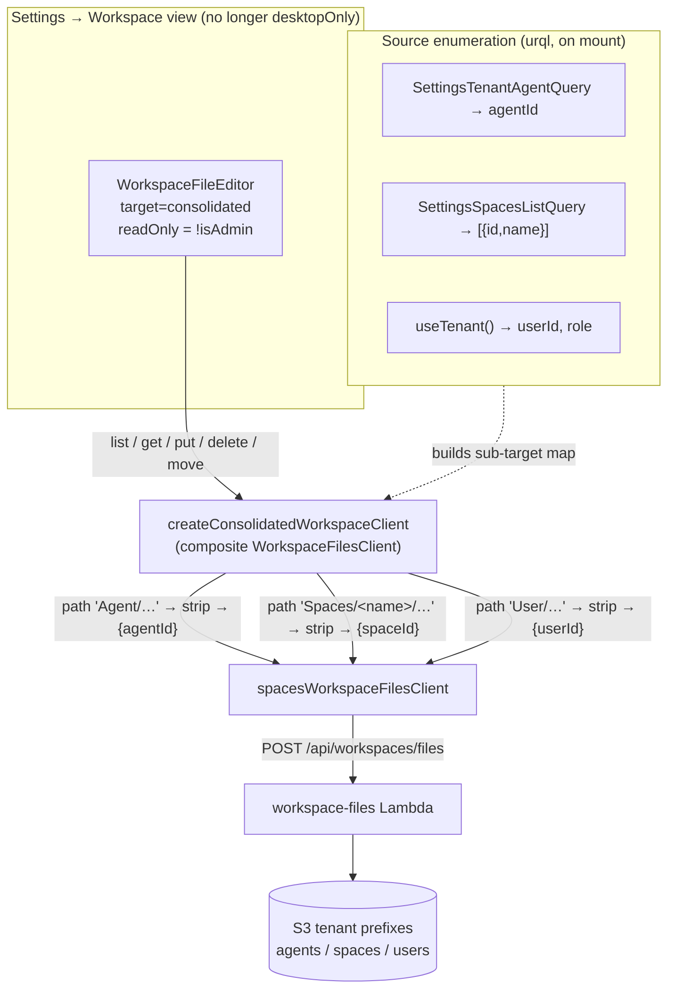

# feat: Editable Settings → Workspace (S3-backed, consolidated 3-source tree)

## Summary

The **Settings → Workspace** view (`apps/spaces`, route `/settings/local-workspace`) is loved as a single place to see the whole workspace — Agent, Spaces, and User sources — without hopping between `Agent → workspace`, `Spaces → Space → workspace`, and `Users → User → workspace`. Today it is a desktop-only, **read-only** inspector that reads the local sidecar cache over the desktop IPC bridge, and clicking a file fails to load its contents.

This plan makes that view **editable with save-back-to-S3** and fixes file selection — by **replacing the desktop-bridge read path with the same S3-backed, read/write editor the rest of spaces already uses** (`WorkspaceFileEditor` + `spacesWorkspaceFilesClient` against `POST /api/workspaces/files`). A thin **composite client** fans a single logical tree across the three sources (Agent / each Space / User) and routes reads/writes back to the correct per-target API call by path prefix — the exact pattern `skillCatalogClient` already uses. Editing is gated to tenant **owner/admin** (the API's existing write-role gate) via the editor's `readOnly` prop. Because the view becomes S3-backed, the **desktop-only** restriction is dropped — it works in any build.

The file-selection bug is resolved **by construction**: the broken desktop-bridge read path is removed entirely and replaced by the proven editor used in four other spaces settings screens.

---

## Problem Frame

Three problems, one root cause:

1. **Read-only by design, now reversed.** The origin requirements doc made this view read-only *specifically because* it read the local sidecar cache, which the sidecar overwrites on every sync — so any local edit would silently vanish (see origin: `docs/brainstorms/2026-05-30-desktop-local-workspace-view-requirements.md`, "Read-only inspection"). The user now wants editing. Writing the local cache remains futile for exactly the documented reason; the authoritative store is **S3**.
2. **No save path.** The desktop bridge exposes only `readWorkspaceTree` / `readWorkspaceFile` (`packages/desktop-ipc/src/bridge.ts:76-81`) — there is no write IPC, and adding one would bypass the server-side side-effects (`agent_skills` re-derivation, governance audit events, manifest regeneration) that only the `/api/workspaces/files` Lambda performs.
3. **Clicking a file shows nothing.** `useLocalWorkspace.select()` sets the selection (highlight works) and calls `readFile`, but the content pane stays empty — the bridge read returns a non-`ok` status. Leading hypotheses: a global 50 ms `rateLimit({ key: "read-workspace-file" })` guard in `apps/desktop/src/main/ipc-handlers.ts:223` that throws on the mount/refresh double-read, or post-`fix: flatten workspace roots` cache-layout drift producing `vanished`. **Both are moot** under this plan — the desktop-bridge read path is replaced.

**Root cause:** the view is built on the wrong substrate (local read-replica) for what it now needs to be (an authoritative editor). Re-backing it on the S3 API solves all three at once and aligns with "files are authoritative; S3 is the source of truth."

---

## Origin Context

The origin doc (`2026-05-30-desktop-local-workspace-view-requirements.md`) defined this view as a read-only inspector and **explicitly deferred** "write-back to S3" as "a separate, larger feature." This plan *is* that deferred feature. Carried-forward intent that still holds:

- **S3 remains the source of truth.** Honored — all writes go to S3 via the existing API; the local cache (if still present in a desktop build) converges on next sync.
- **Same visual language as the thread goal-folder viewer.** Honored — `WorkspaceFileEditor` is that same component, already used for thread goal files (`ThreadWorkspaceView`).
- **Maximum transparency into all synced sources.** Partially changed: the consolidated tree now reflects the **authoritative S3 sources** (Agent / Spaces / User) rather than the literal sidecar cache. This is a deliberate, user-confirmed trade — the editor edits source files, which is what the user wants to change.

---

## Requirements

- **R1.** Every file shown in the Settings → Workspace tree is editable by an authorized user and saves back to S3. *(user change #1)*
- **R2.** Clicking a file loads and displays its contents in the editor pane. *(user change #2)*
- **R3.** The consolidated tree continues to present all three sources as top-level groups — **Agent**, **Spaces** (one folder per space), **User** — in one place. *(preserve the loved property)*
- **R4.** Editing is available only to tenant **owner/admin**; other members see the same files **read-only** (matches the API's write-role gate; no backend change). *(confirmed decision)*
- **R5.** Saves use the existing `POST /api/workspaces/files` `action:"put"` authority so server-side side-effects (audit events, `agent_skills` re-derivation, manifest regen, built-in-tool guards) all fire. No new write path, no new IPC, no GraphQL mutation.
- **R6.** The view no longer requires the desktop build — dropping `desktopOnly` so it renders in web and desktop alike.

**Success criteria:** an owner/admin opens Settings → Workspace, clicks `Agent/AGENTS.md`, sees its content, edits it, saves, and the change is durably in S3 (verifiable via a subsequent agent turn or a re-list). A non-admin sees the same tree and content but no save affordance.

---

## Key Technical Decisions

### KTD1 — Re-back the view on the S3 API for both read and write (replace, don't augment)
Rather than keep the local-cache read and bolt on an S3 write, the entire view is re-backed on `spacesWorkspaceFilesClient` (read + write). **Why:** writes must go to S3 regardless (KTD-forced by the sidecar-overwrite reality); once reading from S3 too, the API natively speaks `target + logical path` so no fragile reverse path→target mapping is needed; it mirrors the proven admin/spaces editor exactly; and it frees the view from desktop-only. *(User-confirmed fork — "S3 API for read+write".)*

### KTD2 — Compose the 3-source tree with a composite `WorkspaceFilesClient`
`WorkspaceFileEditor` is single-target. To show Agent + Spaces + User as one tree, introduce a `createConsolidatedWorkspaceClient(...)` that: on `list`, fans out to each underlying target and **prefixes** returned paths (`Agent/…`, `Spaces/<spaceName>/…`, `User/…`); on `get`/`put`/`delete`/`move`/`rename`, **parses the prefix** to pick the underlying target, strips it, and delegates to `spacesWorkspaceFilesClient`. This is the exact prefix-strip/re-prefix pattern `skillCatalogClient` already implements in `apps/spaces/src/lib/workspace-files-api.ts:109-158`. **Why:** maximal reuse of the proven editor; the unified tree the user loves falls out for free.

### KTD3 — Gate editing via the editor's `readOnly` prop on caller role
Pass `readOnly={!(role === "owner" || role === "admin")}` from `useTenant()`. **Why:** the API already 403s non-admin writes; surfacing read-only in the UI avoids a confusing failed-save and requires **no backend change**. *(User-confirmed fork — "Admin/owner only".)*

### KTD4 — Selection bug fixed by replacement, not patched
The desktop-bridge read path (`useLocalWorkspace` + `readWorkspaceFile` IPC) is removed from this view; `WorkspaceFileEditor` owns selection→load and is already proven in `SettingsAgentConfig`, `SettingsSpaceConfig`, `SettingsUserDetail`, `SettingsSkillDetail`. **Why:** the underlying rate-limit / cache-drift hypotheses are desktop-cache artifacts that no longer apply once the view reads S3.

### KTD5 — Retire the now-dead desktop read path as grep-gated cleanup, not silently
After the swap, `useLocalWorkspace.ts` and the spaces `LocalWorkspaceView` desktop-cache code are unused (confirmed: only `useLocalWorkspace.ts` consumes the bridge reads in spaces). Per the "sequence UI removal separately, grep for callers" learning, removal of the spaces-side dead code is a unit here; teardown of the `apps/desktop` IPC bridge + `workspace-cache-reader` is **deferred** (it is harmless if left, and may have non-spaces value).

---

## High-Level Technical Design

The composite client is the crux. One `WorkspaceFileEditor` mounts against a single synthetic target; the composite client routes by top-level path segment.



**List composition (directional):**
```
list(consolidated):
  agentFiles = client.list({agentId}).map(prefix "Agent/")
  spaceFiles = for each space s: client.list({spaceId: s.id}).map(prefix `Spaces/${s.name}/`)
  userFiles  = client.list({userId}).map(prefix "User/")
  return concat(agentFiles, spaceFiles, userFiles)   // failures per-source degrade gracefully

route(path):                       // get/put/delete/move/rename
  [top, ...rest] = path.split("/")
  top == "Agent"  → {agentId},                logical = rest.join("/")
  top == "Spaces" → {spaceId: lookup(rest[0])}, logical = rest.slice(1).join("/")
  top == "User"   → {userId},                 logical = rest.join("/")
```
*Directional guidance for review, not a code spec. Space display-name→id lookup comes from the enumerated map; collisions on space name are avoided by keying routing on a name→id map built once.*

---

## Implementation Units

### U1. Consolidated composite workspace-files client
**Goal:** A `WorkspaceFilesClient` that presents Agent/Spaces/User as one prefixed tree and routes operations to the right per-target call.
**Requirements:** R1, R2, R3, R5.
**Dependencies:** none.
**Files:**
- `apps/spaces/src/lib/consolidated-workspace-client.ts` (new) — `createConsolidatedWorkspaceClient(subTargets)` returning `WorkspaceFilesClient<ConsolidatedTarget>`; prefix constants `Agent/`, `Spaces/`, `User/`; name→spaceId map.
- `apps/spaces/src/lib/consolidated-workspace-client.test.ts` (new).
**Approach:** Mirror `skillCatalogClient` (`apps/spaces/src/lib/workspace-files-api.ts:109-158`) for prefix-strip/re-prefix. `listFiles` fans out with `Promise.allSettled` so one source erroring (e.g., a space the caller can't read) degrades to a partial tree rather than a blank one. Routing parses the first path segment; `Spaces/<name>/…` resolves `<name>` via the injected name→id map. Reject/normalize unsafe segments (`..`, leading slashes) consistent with existing sanitization.
**Patterns to follow:** `skillCatalogClient` and `createThreadGoalFilesClient` in `apps/spaces/src/lib/workspace-files-api.ts`; `WorkspaceFilesClient` type in `packages/workspace-editor/src/lib/workspace-files-client.ts`.
**Test scenarios:**
- `list` concatenates and prefixes files from all three sources (`Agent/AGENTS.md`, `Spaces/finance/GOAL.md`, `User/USER.md`). *Covers R3.*
- `get("Agent/AGENTS.md")` delegates with `{agentId}` and logical path `AGENTS.md`.
- `get("Spaces/finance/GOAL.md")` resolves "finance"→spaceId and logical path `GOAL.md`.
- `put("User/USER.md", content)` delegates `{userId}` + `action:"put"`. *Covers R1, R5.*
- One source's `listFiles` rejecting yields a partial tree (others still present), not a thrown error.
- Unknown/space-name-not-in-map path → typed error, no API call.
- Unsafe path segment (`..`) rejected before any delegate call.

### U2. Source-enumeration hook
**Goal:** Resolve the sub-targets (tenant agent id, the caller's spaces with display names, current user id) and the caller's role, and build the map the composite client needs.
**Requirements:** R3, R4, R6.
**Dependencies:** none (parallel to U1).
**Files:**
- `apps/spaces/src/components/workspace-settings/useConsolidatedSources.ts` (new).
- `apps/spaces/src/components/workspace-settings/useConsolidatedSources.test.tsx` (new).
**Approach:** Reuse existing queries — `SettingsTenantAgentQuery` (agent id, as in `SettingsAgentConfig`), `SettingsSpacesListQuery` (id + name, as in `SettingsSpaces`), and `useTenant()` for `userId` + `role`. Return `{ subTargets, nameToSpaceId, isAdmin, loading, error }`. Memoize so the composite client identity is stable across renders (the editor keys on `targetKey`).
**Patterns to follow:** query usage in `apps/spaces/src/components/settings/SettingsAgentConfig.tsx` and `SettingsSpaces.tsx`; `useTenant()` from `apps/spaces/src/context/TenantContext.tsx:270`.
**Test scenarios:**
- Builds sub-targets from mocked agent/spaces/user data; `nameToSpaceId` maps each space name to its id.
- `isAdmin` true for role `owner`/`admin`, false otherwise. *Covers R4.*
- Surfaces `loading` until all three sources resolve; surfaces `error` if the agent or spaces query fails.

### U3. Consolidated editable Workspace view
**Goal:** Render the unified, editable (role-gated) Workspace editor; preserve the header + Refresh; handle loading/empty/error.
**Requirements:** R1, R2, R3, R4.
**Dependencies:** U1, U2.
**Files:**
- `apps/spaces/src/components/workspace-settings/WorkspaceSettingsView.tsx` (new) — mounts `WorkspaceFileEditor` with `target=consolidated`, `targetKey="consolidated:<tenantId>"`, `client={createConsolidatedWorkspaceClient(...)}`, `readOnly={!isAdmin}`.
- `apps/spaces/src/components/workspace-settings/WorkspaceSettingsView.test.tsx` (new).
**Approach:** Replace the `ResizablePanelGroup` + `FileTree` + read-only `CodeBlock` composition with a single `WorkspaceFileEditor` (it brings its own tree, selection, editor pane, Save/Discard, Cmd+S, create/delete/move/rename). Keep the `usePageHeaderActions` title; the editor's own loading/empty/error states replace the bespoke `Centered` ones, though a top-level guard for "still enumerating sources" remains. Memoize the composite client on `subTargets`.
**Patterns to follow:** `apps/spaces/src/components/settings/SettingsAgentConfig.tsx:126-129` (mount shape); `SettingsUserDetail` for role usage.
**Test scenarios:**
- Renders the three top-level groups once sources resolve. *Covers R3.*
- Selecting a file loads its content into the editor pane (regression guard for the original bug). *Covers R2.*
- As owner/admin, the editor is editable and Save invokes the composite client's `put` with the correctly-routed target/path. *Covers R1, R4.*
- As a non-admin role, no save affordance and edits are not persisted (`readOnly`). *Covers R4.*
- While sources are enumerating, a loading state shows; on enumeration error, an error state with retry shows.

### U4. Route + nav wiring; drop desktop-only
**Goal:** Point the Workspace settings route at the new view and make it available off-desktop.
**Requirements:** R6.
**Dependencies:** U3.
**Files:**
- `apps/spaces/src/routes/_authed/settings.local-workspace.tsx` (modify) — import/render `WorkspaceSettingsView` instead of `LocalWorkspaceView`.
- `apps/spaces/src/components/settings/settings-nav.tsx` (modify) — remove `desktopOnly: true` from the Workspace nav item (lines ~104-109); keep label/icon.
- `apps/spaces/src/components/settings/settings-nav.test.ts` (modify) — drop the desktop-gated expectation for Workspace.
**Approach:** Minimal wiring swap. Consider renaming the route path from `local-workspace` to `workspace` is **out of scope** (would require redirect handling) — keep the existing path to avoid breaking deep links; only swap the rendered component and the gate.
**Patterns to follow:** `visibleSettingsNavItems` in `settings-nav.tsx:118`.
**Test scenarios:**
- `visibleSettingsNavItems` includes Workspace when `isDesktop:false`. *Covers R6.*
- Route renders `WorkspaceSettingsView`.

### U5. Retire dead spaces desktop-cache code (grep-gated)
**Goal:** Remove the now-unused local-cache read path in spaces without touching shared/other-consumer code.
**Requirements:** (cleanup; supports R-set integrity)
**Dependencies:** U3, U4.
**Files:**
- `apps/spaces/src/components/local-workspace/LocalWorkspaceView.tsx` (delete)
- `apps/spaces/src/components/local-workspace/useLocalWorkspace.ts` (delete)
- `apps/spaces/src/components/local-workspace/*.test.tsx` (delete)
- `apps/spaces/src/components/ai-elements/file-tree.tsx` (delete **only if** no remaining importers after the swap — grep first)
**Approach:** `grep -rn` for each symbol before deleting. Confirmed today: only `useLocalWorkspace.ts` consumes the bridge reads in spaces. Leave `apps/desktop` IPC bridge + `workspace-cache-reader` and `packages/desktop-ipc` schemas in place (deferred — see Scope Boundaries).
**Test expectation:** none — pure deletion; covered by the suite still compiling/passing after removal.
**Verification:** `pnpm --filter @thinkwork/spaces typecheck` and `test` green with no dangling imports.

---

## Scope Boundaries

**In scope:** consolidated editable Workspace view in spaces, S3 read+write via the existing API, role-gated editing, dropping desktop-only, fixing file selection, retiring the dead spaces-side cache reader.

### Deferred to Follow-Up Work
- **Tear down the desktop workspace IPC bridge** (`apps/desktop/src/main/workspace-cache-reader.ts`, `ipc-handlers` read handlers, `packages/desktop-ipc` `readWorkspace*` schemas). Harmless if left; remove once confirmed no other consumer (e.g., a future desktop offline mode) wants it.
- **Diagnose the original rate-limit / flatten-roots cache bug** for the desktop sidecar's own use — only relevant if the bridge survives. Recorded here; not fixed because the path is leaving this view.
- **Route rename** `local-workspace` → `workspace` with redirect.

### Outside this product's identity / Non-goals
- **No new write IPC or local-cache writes** — the sidecar overwrites the cache; S3 is authoritative (origin decision, unchanged).
- **No backend authz change** — non-admin editing is intentionally not enabled (confirmed decision R4).
- **No new GraphQL mutation** — all file writes go through `/api/workspaces/files`.

---

## Risks & Dependencies

- **Per-source list latency / N+1.** Listing one space at a time fans out to N calls. Mitigation: `Promise.allSettled` in parallel; tenants have a small number of spaces (the screenshot shows 5). If it becomes slow, a future `list-all` action is a server-side optimization — not needed now.
- **Space the caller cannot read.** The API may 403 a `list` for a restricted space. Mitigation: per-source graceful degradation (U1) — that source is simply absent from the tree rather than blanking the whole view.
- **`agent_skills` re-derivation / governance audit on save.** Saving `AGENTS.md` or `skills/*/SKILL.md` triggers server-side derivation + audit events (existing behavior). This is desirable, but operators editing `AGENTS.md` directly can change routing — note in the editor description that Agent governance files are live. *(learning: workspace-skills-load-from-copied-agent-workspace)*
- **Built-in tool files.** The API already guards built-in tool slugs out of `skills/`; the editor must not offer to create them. Inherited from the API; no client work, but verify create-file UX doesn't surface them.
- **urql document cache.** Enumeration queries use spaces' document cache; `WorkspaceFileEditor` manages its own (non-urql) file-list/content state and refetches after writes internally, so no stale-list issue for saves. Enumeration is mount-time and stable. *(learning: spaces-urql-doc-cache-no-live-invalidation — noted, low impact here.)*

---

## Test Strategy

Unit-level coverage lives with each unit (above). Cross-cutting checks:
- **Selection regression** (R2): an explicit test in U3 that clicking a tree file loads content — this is the user-reported bug, guarded permanently.
- **Role gating** (R4): U2 (`isAdmin` logic) + U3 (read-only render) together.
- **Routing correctness** (R1/R5): U1 covers that each prefix lands on the right target + `put` — the safety-critical part (a mis-routed write corrupts the wrong source).
- **Gate:** `pnpm --filter @thinkwork/spaces typecheck && test`, then `pnpm --filter @thinkwork/spaces lint`. Per repo memory, run `tsc` as its own gate (vitest green ≠ tsc green).

---

## Sources & Research

- Origin: `docs/brainstorms/2026-05-30-desktop-local-workspace-view-requirements.md` (read-only-by-design rationale; write-back deferred).
- API write authority: `packages/api/workspace-files.ts` (`action:"put"`, `WRITE_ACTIONS`, owner/admin gate `callerIsTenantAdmin`, per-target S3 key builders).
- Existing spaces client: `apps/spaces/src/lib/workspace-files-api.ts` (`spacesWorkspaceFilesClient`, `skillCatalogClient` prefix pattern).
- Reusable editor: `packages/workspace-editor/src/components/WorkspaceFileEditor.tsx` (single-target read/write, `readOnly`, Save/Discard, Cmd+S).
- Live mount references: `apps/spaces/src/components/settings/{SettingsAgentConfig,SettingsSpaceConfig,SettingsUserDetail,SettingsSkillDetail}.tsx`.
- Enumeration: `SettingsTenantAgentQuery`, `SettingsSpacesListQuery`, `useTenant()` (`apps/spaces/src/context/TenantContext.tsx`).
- Current (to-be-replaced) view: `apps/spaces/src/components/local-workspace/{LocalWorkspaceView,useLocalWorkspace}.ts(x)`; route `apps/spaces/src/routes/_authed/settings.local-workspace.tsx`; nav `settings-nav.tsx`.
- Learnings: `docs/solutions/architecture-patterns/workspace-skills-load-from-copied-agent-workspace-2026-04-28.md`; `docs/solutions/design-patterns/gitkeep-materialization-s3-empty-folders-2026-05-13.md`; `docs/solutions/conventions/admin-trim-ui-preserve-backend-mutations-2026-05-13.md`; `docs/solutions/integration-issues/spaces-urql-doc-cache-no-live-invalidation.md`.
