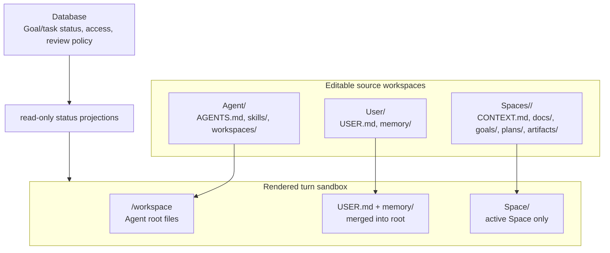

# docs: Workspace Architecture Next Steps and User Guidance

## Summary

Document the now-canonical workspace architecture end to end, add concise in-app guidance where users encounter the three source workspaces, and turn the expected folder shapes into regression guardrails. This plan does not re-open the core architecture decision. It explains and protects the model already implemented: source workspaces are `Agent`, `Spaces`, and `User`; runtime turns hydrate the Agent workspace as the base, merge User context into the root, and mount the active Space as singular `Space/`.

## Problem Frame

The workspace refactor removed UUID/petname folder paths and tuple materialization, but the product still needs a stronger explanation layer. Operators now see multiple related trees:

- Settings -> Workspace shows the editable source factory: `Agent`, `Spaces`, and `User`.
- Settings -> Agent/Spaces/Users show individual editable source workspaces.
- Settings -> Workspace shows the consolidated S3-backed source workspace in desktop and web builds.
- Pi turns on AgentCore, desktop, and mobile run from the rendered `/workspace` sandbox.

Those trees are intentionally different. Without crisp documentation and visible product cues, users reasonably interpret differences as bugs: `Spaces` vs. singular `Space`, source factory vs. rendered runtime, editable files vs. database-rendered status, and S3 source prefixes vs. local sandbox shape. The next step is to make the architecture legible, then backstop it with tests and runbooks so future changes cannot reintroduce `workspace/`, `source/`, `workspace-archives/`, UUID folders, or tuple-shaped sandboxes.

## Requirements Traceability

| Requirement                                                                                                                            | Source                                | Units      |
| -------------------------------------------------------------------------------------------------------------------------------------- | ------------------------------------- | ---------- |
| R1. Explain source workspace shape: top-level `Agent`, `Spaces`, `User` in Settings -> Workspace.                                      | Origin R4, user regression feedback   | U1, U2, U4 |
| R2. Explain runtime sandbox shape: Agent root at `/workspace`, User merged into root, active Space mounted at `/workspace/Space`.      | Origin R6, R14, user clarification    | U1, U3, U4 |
| R3. Explain ownership: files own working/narrative content; DB owns structured state; `GOAL.md` and `PROGRESS.md` are projections.     | Origin R9-R13, R26                    | U1, U2, U5 |
| R4. Explain sync and hydration behavior: local caches check/refresh workspace changes instead of downloading all S3 before every turn. | User performance questions, origin F1 | U1, U3, U5 |
| R5. Provide operator procedures for verifying S3/API/local/runtime workspace shape after releases.                                     | Autopilot regression history          | U3, U4     |
| R6. Add regression coverage for source detail views, factory view, desktop local inspector, and AgentCore/mobile rendered sandboxes.   | User full-regression request          | U4         |

## Scope Boundaries

In scope:

- End-user documentation for operators and builders.
- In-app explanatory guidance on the Settings workspace surfaces.
- A runbook/checklist for release verification and support triage.
- Automated guardrails that assert canonical folder shapes.
- Minimal telemetry documentation for sync/hydration timing and where to look during slow turns.

Out of scope for this plan:

- Changing the canonical workspace architecture.
- Implementing new reconcile/write-back semantics.
- Optimizing sync performance.
- Migrating additional S3 data beyond already-completed shape cleanup.
- Changing task/progress workflow behavior.
- Shipping a new mobile or desktop release solely from this documentation plan.

## Context & Research

The docs site already has a workspace architecture section:

- `docs/src/content/docs/concepts/agents/workspace-architecture/index.mdx`
- `docs/src/content/docs/concepts/agents/workspace-architecture/workspace-tree.mdx`
- `docs/src/content/docs/concepts/agents/workspace-architecture/ownership-model.mdx`
- `docs/src/content/docs/concepts/agents/workspace-architecture/turn-lifecycle.mdx`
- `docs/src/content/docs/concepts/agents/workspace-composition.mdx`
- `docs/src/content/docs/concepts/spaces/workspace-context.mdx`
- `docs/src/content/docs/applications/admin/spaces/workspace.mdx`

The current docs are directionally right but still include older terms in places (`SPACE.md`, `Spaces/<space>/...`, thread status mounts) and do not give users a simple source-vs-runtime mental model.

The relevant in-app surfaces already route through shared workspace editor components:

- `apps/spaces/src/components/settings/SettingsAgentConfig.tsx`
- `apps/spaces/src/components/settings/SettingsSpaceConfig.tsx`
- `apps/spaces/src/components/settings/SettingsUserDetail.tsx`
- `apps/spaces/src/components/workspace-settings/WorkspaceSettingsView.tsx`
- `apps/spaces/src/components/workspace-settings/useConsolidatedSources.ts`
- `apps/spaces/src/lib/consolidated-workspace-client.ts`
- `packages/workspace-editor/src/components/WorkspaceFileEditor.tsx`
- `packages/workspace-editor/src/components/FolderTree.tsx`

The test surfaces already exist and should be extended rather than replaced:

- `packages/api/src/lib/workspace-renderer/compose-tuple.test.ts`
- `packages/agentcore-pi/agent-container/tests/bootstrap-workspace.test.ts`
- `apps/desktop/test/sidecar/workspace-cache.test.ts`
- `apps/mobile/lib/agent/workspace-cache.test.ts`
- `apps/spaces/src/components/settings/SettingsAgentConfig.test.tsx` (new)
- `apps/spaces/src/components/settings/SettingsSpaceConfig.test.tsx` (new)
- `apps/spaces/src/components/settings/SettingsUserDetail.test.tsx`
- `apps/spaces/src/components/workspace-settings/WorkspaceSettingsView.test.tsx`
- `apps/spaces/src/lib/consolidated-workspace-client.test.ts`

## Key Decisions

- **KTD1 - Treat source and runtime as different product concepts, not one tree.** The docs should name two shapes explicitly: source factory (`Agent`, `Spaces`, `User`) and runtime sandbox (`/workspace` with Agent root files, User root files, and singular `Space/`). Trying to make every UI show the same tree would hide useful distinctions and make support harder.

- **KTD2 - Keep the explanation user-facing and operational.** The primary audience is operators/builders validating behavior, not only engineers. Use small diagrams, tables, examples, and "what you should see" checklists instead of implementation-heavy prose.

- **KTD3 - Put guidance where the confusion happens.** The docs site carries the complete model, but the Settings workspace views should include compact context: "Agent files apply everywhere", "Space files apply only in this Space", "User files personalize this user", and "runtime mounts the active Space as `Space/`".

- **KTD4 - Backstop docs with tests.** The folder-shape regressions were visible in UI and runtime behavior. The plan must add tests that fail if legacy wrapper folders (`workspace/`, `source/`, `workspace-archives/`) or tuple/UUID shapes return.

- **KTD5 - Defer deeper concerns into follow-up sessions.** Performance, reconcile write-back completeness, and task/progress LLM matching are important, but this plan only documents current behavior and creates the guardrails needed before those sessions.

## High-Level Design



## Implementation Units

### U1. Refresh public workspace architecture docs

- **Goal:** Make the public docs the canonical explanation for source factory, runtime sandbox, ownership, and turn lifecycle.
- **Requirements:** R1, R2, R3, R4.
- **Dependencies:** none.
- **Files:**
  - `docs/src/content/docs/concepts/agents/workspace-architecture/index.mdx`
  - `docs/src/content/docs/concepts/agents/workspace-architecture/workspace-tree.mdx`
  - `docs/src/content/docs/concepts/agents/workspace-architecture/ownership-model.mdx`
  - `docs/src/content/docs/concepts/agents/workspace-architecture/turn-lifecycle.mdx`
  - `docs/src/content/docs/concepts/agents/workspace-composition.mdx`
  - `docs/src/content/docs/concepts/spaces/workspace-context.mdx`
- **Approach:** Replace stale examples with the current shapes. Split examples into two labeled blocks: "Source factory" and "Rendered runtime". State that Settings -> Workspace shows `Agent`, `Spaces`, `User`, while the agent sandbox sees root Agent files, User context at root, and singular `Space/` for the active Space. Explain that sync checks for changes and hydrates local files for the turn; it should not be described as copying the whole bucket before every turn.
- **Test scenarios:**
  - Search docs for stale canonical examples that show `source/`, `workspace/` wrapper folders, `workspace-archives/`, or tuple-shaped rendered roots as expected output.
  - Verify the docs build succeeds.
  - Verify the workspace architecture landing page links to tree, ownership, and lifecycle pages.
- **Verification:** `pnpm --filter docs build`.

### U2. Add concise in-app workspace guidance

- **Goal:** Give users enough context inside Settings to understand what each workspace view edits.
- **Requirements:** R1, R2, R3.
- **Dependencies:** U1 for final wording/link targets.
- **Files:**
  - `apps/spaces/src/components/settings/SettingsAgentConfig.tsx`
  - `apps/spaces/src/components/settings/SettingsAgentConfig.test.tsx` (new)
  - `apps/spaces/src/components/settings/SettingsSpaceConfig.tsx`
  - `apps/spaces/src/components/settings/SettingsSpaceConfig.test.tsx` (new)
  - `apps/spaces/src/components/settings/SettingsUserDetail.tsx`
  - `apps/spaces/src/components/workspace-settings/WorkspaceSettingsView.tsx`
  - `apps/spaces/src/components/workspace-settings/WorkspaceSettingsView.test.tsx`
  - `apps/spaces/src/lib/consolidated-workspace-client.test.ts`
  - `apps/spaces/src/components/settings/WorkspaceViewToggle.tsx`
  - `packages/workspace-editor/src/components/WorkspaceFileEditor.tsx`
- **Approach:** Add restrained helper copy or an info affordance near each workspace editor, not a large tutorial. Agent copy should say these files are the tenant-wide base. Space copy should say these files apply only when work happens in this Space and will mount as `Space/` in a turn. User copy should say these files personalize the selected user and are merged into runtime context. If the shared editor already has a header/help slot, use it; otherwise add the smallest local wrapper on each settings view.
- **Test scenarios:**
  - Agent settings workspace renders guidance that does not imply a top-level `workspace/` folder.
  - Space settings workspace renders guidance that does not imply a top-level `source/` folder.
  - User settings workspace renders guidance and still defaults to `USER.md`.
  - Toggle and breadcrumbs still behave as before.
- **Verification:** `pnpm --filter @thinkwork/spaces test -- SettingsAgentConfig SettingsSpaceConfig SettingsUserDetail WorkspaceViewToggle`.

### U3. Add operator runbook for verification and support triage

- **Goal:** Give release/support operators a reliable checklist for validating source S3, Settings API, local desktop cache, and runtime sandbox shape.
- **Requirements:** R4, R5.
- **Dependencies:** U1.
- **Files:**
  - `docs/runbooks/workspace-architecture-verification.md`
  - `docs/runbooks/spaces-runtime-renderer-rollout.md`
  - `docs/plans/autopilot-status.md` only if this work is run in autopilot mode.
- **Approach:** Create a runbook with four sections: S3 source shape, consolidated Settings workspace views, desktop/mobile cache behavior, and runtime sandbox smoke. Include exact expected roots and forbidden roots. Document where to look for sync/hydration timing in desktop, mobile, and AgentCore logs. Update the older rollout runbook so it no longer refers to obsolete `space/`, `user/`, or rendered-prefix behavior as the current expectation.
- **Test scenarios:**
  - Runbook lists expected source factory roots: `Agent`, `Spaces`, `User`.
  - Runbook lists expected runtime roots: Agent files directly at root, `USER.md`/`memory/`, and singular `Space/`.
  - Runbook lists forbidden folders: `workspace/`, `source/`, `workspace-archives/`, UUID/petname tuple folders, and top-level `Agent`/`Spaces`/`User` inside runtime.
- **Verification:** Markdown links resolve in the docs build.

### U4. Add automated workspace-shape guardrails

- **Goal:** Prevent the exact source/runtime folder regressions that triggered the recent debugging loop.
- **Requirements:** R1, R2, R5, R6.
- **Dependencies:** none.
- **Files:**
  - `packages/api/src/lib/workspace-renderer/compose-tuple.test.ts`
  - `packages/agentcore-pi/agent-container/tests/bootstrap-workspace.test.ts`
  - `apps/desktop/test/sidecar/workspace-cache.test.ts`
  - `apps/mobile/lib/agent/workspace-cache.test.ts`
  - `apps/spaces/src/components/workspace-settings/WorkspaceSettingsView.test.tsx`
  - `apps/spaces/src/lib/consolidated-workspace-client.test.ts`
- **Approach:** Add explicit positive and negative assertions for the canonical shapes. Source factory tests should expect `Agent`, `Spaces`, and `User`. Source detail tests should expect Agent root files directly under Agent, Space files directly under the selected Space, and User files directly under User. Runtime tests should expect `/workspace/AGENTS.md`, `/workspace/USER.md`, `/workspace/memory/`, and `/workspace/Space/CONTEXT.md`; they should reject `/workspace/Agent`, `/workspace/Spaces`, `/workspace/User`, `/workspace/workspace`, `/workspace/source`, and `/workspace/workspace-archives`.
- **Test scenarios:**
  - Settings workspace API/detail fixture with legacy wrapper keys does not render wrapper folders.
  - AgentCore bootstrap from a manifest-backed thread produces the runtime shape, not the source factory shape.
  - Consolidated Settings workspace renders the source factory shape and omits removed S3 folders.
  - Mobile workspace cache preserves singular `Space/` in the runtime handoff payload.
  - Negative fixture with UUID/petname tuple paths fails or is filtered from visible canonical roots.
- **Verification:** Smallest meaningful tests first, then relevant package test suites:
  - `pnpm --filter @thinkwork/api test -- compose-tuple`
  - `pnpm --filter @thinkwork/agentcore-pi test -- bootstrap-workspace`
  - `pnpm --filter @thinkwork/desktop test -- workspace-cache`
  - `pnpm --filter @thinkwork/mobile test -- workspace-cache`
  - `pnpm --filter @thinkwork/spaces test -- WorkspaceSettingsView consolidated-workspace-client`

### U5. Document current limitations and next engineering follow-ups

- **Goal:** Leave a clear, honest ledger for the separate sessions that should follow this documentation PR.
- **Requirements:** R3, R4, R6.
- **Dependencies:** U1.
- **Files:**
  - `docs/src/content/docs/concepts/agents/workspace-architecture/turn-lifecycle.mdx`
  - `docs/runbooks/workspace-architecture-verification.md`
  - optionally `docs/plans/2026-06-01-002-fix-workspace-runtime-performance-and-reconcile-plan.md` if the team wants a follow-up plan document during implementation.
- **Approach:** Add a "Current limitations and follow-ups" section that does not overpromise. It should call out that structured task/progress updates use platform tools/resolvers; file reconcile is file-side only; sync latency should be measured from logged timings before optimizing; and fuzzy natural-language task completion depends on LLM/tool routing rather than exact text matching. Keep this section short in user docs, with deeper engineering concerns in the runbook or a later plan.
- **Test scenarios:**
  - Docs state `PROGRESS.md` edits are not authoritative for task status.
  - Docs state task completion should use task/progress platform actions.
  - Docs do not claim all S3 is downloaded before every turn.
  - Docs do not claim performance problems are fixed by this work.
- **Verification:** Docs build and review pass.

## System-Wide Impact

- **Docs site:** Clarifies existing docs and removes stale examples that conflict with the implemented workspace shape.
- **Settings UI:** Adds low-friction explanations; should not change editor behavior or persistence.
- **API/runtime tests:** Adds shape guardrails around existing behavior. Test failures should indicate regression, not a new feature requirement.
- **Support/operations:** Gives operators a checklist for verifying S3, API, desktop, mobile, and AgentCore without relying on memory from debugging sessions.

## Risks & Mitigations

- **Risk: Docs drift again as runtime implementation evolves.** Mitigation: U4 codifies folder shape in tests and U3 gives a release checklist.
- **Risk: In-app copy becomes too noisy.** Mitigation: use compact helper text or info affordances; keep full explanation in docs.
- **Risk: User docs imply write-back/performance guarantees that are not yet true.** Mitigation: U5 explicitly documents limitations and next follow-ups without marketing language.
- **Risk: Tests overfit to fixture names.** Mitigation: assert structural roots and forbidden folders, not specific customer or user names.
- **Risk: Source and runtime terminology remains confusing.** Mitigation: use the same two labels everywhere: "source workspace" and "rendered runtime workspace".

## Documentation / Operational Notes

The final docs should include:

- A one-screen "what you should see" source tree:

```text
Workspace
├── Agent
├── Spaces
└── User
```

- A one-screen "what the agent sees during a turn" runtime tree:

```text
/workspace
├── AGENTS.md
├── CONTEXT.md
├── USER.md
├── memory/
├── skills/
├── workspaces/
└── Space/
    ├── CONTEXT.md
    ├── artifacts/
    ├── docs/
    ├── goals/
    └── plans/
```

- A short authority table:

| Thing                                              | Authority                               |
| -------------------------------------------------- | --------------------------------------- |
| Agent instructions, skills, docs, memory notes     | Files in S3 source workspaces           |
| User profile context and user memory notes         | User source workspace plus profile data |
| Active Space context and workflow templates        | Space source workspace                  |
| Task status, progress, review gates, access grants | Database                                |
| `GOAL.md` and `PROGRESS.md`                        | Read-only projections of database state |

## Open Questions

- None blocking. The architecture decisions are already made by the origin requirements and current implementation.

Deferred to separate sessions:

- Measure and optimize slow workspace hydration or USER.md retrieval.
- Complete or harden file reconcile/write-back behavior if gaps remain after regression.
- Improve fuzzy natural-language task completion routing and tool invocation.
- Decide release timing for the next desktop/TestFlight builds after these docs/guardrails merge.

## Completion Notes

Implemented on `docs/workspace-architecture-guidance`.

- Refreshed workspace architecture docs around the source factory (`Agent`, `Spaces`, `User`) and rendered runtime (`/workspace` with Agent files at root, User merged at root, active Space mounted as `Space/`).
- Added concise source-workspace guidance to Agent, Space, User, and consolidated Settings workspace views.
- Added `docs/runbooks/workspace-architecture-verification.md` and updated the runtime renderer rollout runbook.
- Added guardrails for consolidated Settings source shape, API hydrate manifests, AgentCore Pi bootstrap, desktop cache, and mobile cache.

Verification:

- `pnpm --filter @thinkwork/spaces test -- src/lib/consolidated-workspace-client.test.ts src/components/workspace-settings/WorkspaceSettingsView.test.tsx src/components/settings/SettingsAgentConfig.test.tsx src/components/settings/SettingsSpaceConfig.test.tsx src/components/settings/SettingsUserDetail.test.tsx`
- `pnpm --filter @thinkwork/agentcore-pi test -- agent-container/tests/bootstrap-workspace.test.ts`
- `pnpm --filter @thinkwork/api test -- src/lib/workspace-renderer/compose-tuple.test.ts`
- `pnpm --filter @thinkwork/mobile test -- lib/agent/workspace-cache.test.ts`
- `pnpm --filter @thinkwork/desktop test -- test/sidecar/workspace-cache.test.ts`
- `pnpm --filter @thinkwork/spaces typecheck`
- `pnpm --filter @thinkwork/desktop typecheck`
- `pnpm --filter @thinkwork/api typecheck`
- `pnpm --filter @thinkwork/agentcore-pi typecheck`
- `pnpm --filter @thinkwork/docs build`

## Sources & References

- `docs/brainstorms/2026-05-31-workspace-architecture-simplification-requirements.md`
- `docs/plans/2026-05-31-002-refactor-workspace-architecture-simplification-plan.md`
- `docs/plans/autopilot-status.md`
- `docs/src/content/docs/concepts/agents/workspace-architecture/index.mdx`
- `docs/src/content/docs/concepts/agents/workspace-architecture/workspace-tree.mdx`
- `docs/src/content/docs/concepts/agents/workspace-architecture/turn-lifecycle.mdx`
- `docs/src/content/docs/concepts/agents/workspace-composition.mdx`
- `docs/src/content/docs/concepts/spaces/workspace-context.mdx`
- `docs/src/content/docs/applications/admin/spaces/workspace.mdx`
- `apps/spaces/src/components/settings/SettingsAgentConfig.tsx`
- `apps/spaces/src/components/settings/SettingsSpaceConfig.tsx`
- `apps/spaces/src/components/settings/SettingsUserDetail.tsx`
- `apps/spaces/src/components/workspace-settings/WorkspaceSettingsView.tsx`
- `apps/spaces/src/lib/consolidated-workspace-client.ts`
- `packages/api/src/lib/workspace-renderer/compose-tuple.test.ts`
- `packages/agentcore-pi/agent-container/tests/bootstrap-workspace.test.ts`
