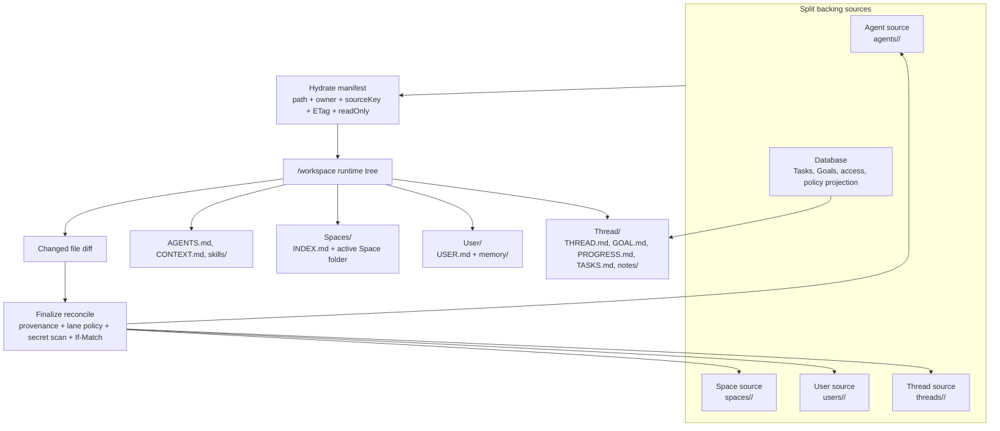

# feat: Workspace Contract v1 Hardening

## Summary

Implement Workspace Contract v1 as the coherent rendered tree described in the
origin requirements: the agent runtime sees Agent root files directly, plus
`Spaces/`, `User/`, and `Thread/`; Settings continues to expose editable source
workspaces as `Agent`, `Spaces`, and `User`; backing S3 stores remain split and
writes route by provenance. This is **Option A** from the brainstorm: render one
clear product contract without physically collapsing every source into one
Agent-rooted S3 tree.

This plan supersedes the older runtime expectation that merged `USER.md` into
the root and mounted the active Space as singular `Space/`. The new runtime
contract keeps User context explicit under `User/`, keeps the active Space under
`Spaces/<active-space>/`, adds lightweight `Spaces/INDEX.md` for other Spaces,
and introduces generated `Thread/` projections for live thread state.
Coherent does not mean the Settings source tree and runtime tree are
byte-identical; it means every visible path has a documented purpose,
provenance, and write-back outcome.

## Problem Frame

The repository currently contains two shapes and several compatibility shims.
The API renderer composes a hydrate manifest with owner-prefixed paths
(`Agent/...`, `User/...`, `Spaces/<space>/...`), but AgentCore bootstrap and
desktop/mobile cache layers normalize those paths into the older runtime shape:
Agent root files at `/workspace`, User merged into root, and singular `Space/`.
The workspace UI also still strips legacy `source/`, `workspace/`, and
`workspace-archives/` paths in multiple places. That explains why the product can
look right in Settings but wrong in a runtime, or vice versa.

Workspace Contract v1 should remove that split-brain behavior. Humans and agents
need predictable file locations; Space configuration must reveal workflow,
skills, tools, and policy; live task progress must remain database-authoritative
while still projecting into files for LLM/reporting context; writes must persist
to the correct source lane; and slow turns must show which workspace phase took
time.

## Requirements Traceability

| Origin requirement | Plan units |
| --- | --- |
| R1-R5 rendered workspace contract | U1, U2, U8 |
| R6-R9 `SPACE.md` manifest and workflow definitions | U1, U3, U8 |
| R10-R13 Thread projections and Refresh progress | U4, U5, U8 |
| R14-R18 write-back lanes | U1, U5, U6 |
| R19-R21 sync telemetry | U6, U8 |
| R22 hard cutover from legacy paths | U7, U8 |
| AE1 runtime shape | U1, U2, U8 |
| AE2 Space overview panels | U3, U8 |
| AE3 Refresh progress | U4, U8 |
| AE4 write-back routing | U5, U8 |
| AE5 timing diagnostics | U6, U8 |
| AE6 legacy path removal | U7, U8 |

## Scope Boundaries

In scope:

- New rendered runtime shape: Agent root files plus top-level `Spaces/`,
  `User/`, and `Thread/`.
- Settings source shape remains `Agent`, `Spaces`, `User`.
- Active Space hydrated fully at `Spaces/<active-space>/`; other Spaces appear
  only through `Spaces/INDEX.md` in v1.
- `SPACE.md` as editable markdown source with typed frontmatter and rendered
  overview panels.
- `Thread/` generated projections from database state and editable
  `Thread/notes/`.
- Write-back provenance for Agent, Space, User, and Thread notes.
- Per-turn workspace timing/count diagnostics.
- Hard migration and deletion of legacy `source/`, `workspace/`, and
  `workspace-archives/` keys.

Out of scope:

- Physically collapsing S3 storage into a single Agent-rooted tree.
- Hydrating every authorized Space into every turn.
- Building a general approval queue.
- Replacing database-authoritative task/goal state with markdown.
- Building a full compounding workflow for `Thread/notes/`.
- Maintaining long-lived compatibility reads for legacy workspace paths.

## Context & Research

The renderer entry point is `packages/api/src/lib/workspace-renderer/compose-tuple.ts`.
It currently lists Agent, Space, User, and thread-goal S3 sources, writes
`.hydrate_manifest.json` under `threadRuntimePrefix`, and maps hydrate files to
`Agent/...`, `User/...`, and `Spaces/<space>/...`. It also strips legacy
`source/` and `workspace/` segments through `runtimeSourcePath`.

Runtime hydration is where the older shape reappears:

- `packages/agentcore-pi/agent-container/src/runtime/bootstrap-workspace.ts`
  converts `Agent/...` to root files, `User/...` to root files, and
  `Spaces/<space>/...` to singular `Space/...`.
- `apps/desktop/src/sidecar/workspace-cache.ts` normalizes the hydrate manifest
  and currently keeps tuple roots in the desktop cache, but also lists all
  tenant Spaces for Space hydration and includes legacy fallback paths.
- `apps/mobile/lib/agent/workspace-cache.ts` prefixes cached files as
  `Agent/...`, `User/...`, and `Spaces/<space>/...` for mobile, but also keeps
  legacy stripping and root read candidates such as `USER.md`.

Write-back already has a real server-side seam:

- `packages/pi-runtime-core/src/finalize-client.ts` serializes
  `changed_files`.
- `apps/desktop/src/sidecar/local-turn-runner.ts` captures workspace baselines,
  timings, and diffs before finalize.
- `packages/api/src/lib/chat-finalize/process-finalize.ts` claims reconcile
  before `finalized_at`, records reconcile status, and then continues finalize.
- `packages/api/src/lib/chat-finalize/reconcile.ts` validates changed files,
  reads the hydrate manifest, routes owner lanes through
  `packages/api/src/lib/workspace-lanes.ts`, secret-scans, and conditionally
  writes to S3.

Task/progress machinery already exists and should be preserved:

- `packages/pi-extensions/src/task-status.ts` exposes `set_task_status` to Pi.
- `packages/api/src/handlers/task-status-tool.ts` authenticates the tool call.
- `packages/api/src/lib/task-status-tool.ts` updates `linked_tasks` in a
  transaction and refreshes thread goal/progress markdown.
- `packages/api/src/lib/thread-progress/storage.ts` and
  `packages/api/src/lib/thread-goals/storage.ts` store current goal/progress
  projections under the thread S3 prefix.
- `apps/spaces/src/components/workbench/SpacesThreadDetailRoute.tsx` already
  reads progress markdown and linked tasks for the right info panel.

Space Settings is currently too thin for the new product contract:

- `apps/spaces/src/components/settings/SettingsSpaceConfig.tsx` renders Name,
  Access, Status, and Description, but not workflows, tools, skills, task
  templates, runtime policy, or manifest status.
- `packages/api/src/lib/workspace-renderer/space-md-parser.ts` only parses the
  `Mentionable Workspaces` section today; it is not yet a typed manifest parser.
- `packages/database-pg/src/schema/spaces.ts` already has JSON policy/config
  columns and `render_diagnostics`, so DB projections can be indexed/applied
  without making the database the conceptual authoring source.

Documentation and runbooks currently describe the older runtime shape in
`docs/runbooks/workspace-architecture-verification.md`,
`docs/runbooks/spaces-runtime-renderer-rollout.md`, and docs pages under
`docs/src/content/docs/concepts/agents/workspace-architecture/`. Those docs
must be updated in the same arc as the contract change.

Local patterns are strong enough for this plan. No external research is needed:
the work is repo-specific, follows existing GraphQL/API/S3/React/Pi extension
patterns, and depends primarily on current code behavior.

## Key Decisions

- **KTD1 - One rendered runtime contract, split backing stores.** S3 remains
  split into Agent, Space, User, and Thread prefixes. The manifest carries
  provenance so the runtime can render one tree and reconcile can route writes
  back to the correct source.
- **KTD2 - Agent source is the runtime base, but User and Space stay visible.**
  Agent files hydrate at `/workspace` root. User context stays under `User/`.
  The active Space hydrates under `Spaces/<active-space>/`. `Thread/` holds
  generated and thread-scoped material.
- **KTD3 - Generated projections are read-only.** `Spaces/INDEX.md` and
  `Thread/*.md` projections are generated by the platform, marked read-only in
  the hydrate manifest, and rejected during reconcile.
- **KTD4 - `SPACE.md` is the authoring surface.** Typed frontmatter plus
  markdown prose is the conceptual source for Space configuration. Database
  fields are applied/indexed projections for query and enforcement.
- **KTD5 - Space owns workflow definitions; Thread owns live progress.** Space
  files such as `workflows/*.md` define reusable workflow behavior. Live task
  status and progress remain database state and render into `Thread/` files.
- **KTD6 - `Thread/notes/` is the writable thread lane.** Agents can persist
  raw findings and compounding candidates there without mutating Space config or
  generated progress files.
- **KTD7 - Hard cutover beats compatibility.** Because there are no active users,
  migrate canonical S3 shape and delete legacy prefixes; remove hidden stripping
  and fallback reads after migration.
- **KTD8 - Telemetry first appears where operators already debug turns.** Put
  workspace timing/count diagnostics in turn details/debug surfaces before
  building a separate analytics dashboard.

## High-Level Design



Expected runtime shape:

```text
/workspace
├── AGENTS.md
├── CONTEXT.md
├── GUARDRAILS.md
├── MEMORY_GUIDE.md
├── skills/
├── workspaces/
├── Spaces/
│   ├── INDEX.md
│   └── customer-onboarding/
│       ├── SPACE.md
│       ├── CONTEXT.md
│       ├── workflows/
│       ├── docs/
│       ├── plans/
│       └── artifacts/
├── User/
│   ├── USER.md
│   └── memory/
└── Thread/
    ├── THREAD.md
    ├── GOAL.md
    ├── PROGRESS.md
    ├── TASKS.md
    └── notes/
```

## Implementation Units

### U1. Shared workspace contract and default instructions

- **Goal:** Define the Workspace Contract v1 path/provenance model once and make
  Agent instructions teach it clearly.
- **Requirements:** R1-R5, R14-R18.
- **Dependencies:** none.
- **Files:**
  - `packages/api/src/lib/workspace-renderer/types.ts`
  - `packages/api/src/lib/workspace-renderer/prefixes.ts`
  - `packages/api/src/lib/workspace-lanes.ts`
  - `packages/workspace-defaults/files/AGENTS.md`
  - `packages/workspace-defaults/src/index.ts`
  - `packages/workspace-defaults/src/__tests__/parity.test.ts`
  - `docs/src/content/docs/concepts/agents/workspace-architecture/workspace-tree.mdx`
- **Approach:** Add explicit contract types or helpers for runtime paths,
  generated mounts, owner lanes, read-only projections, and writable Thread
  notes. Keep Agent source files as root runtime paths while preserving owner
  metadata for reconcile. Treat Thread notes as a distinct writable owner lane
  from generated Thread projections; do not overload the existing thread-goal
  status owner for both. Update default `AGENTS.md` to say: read
  `User/USER.md` for personalization; read `Spaces/<active-space>/SPACE.md` and
  `CONTEXT.md` for Space context; use `Thread/PROGRESS.md` and
  `Thread/TASKS.md` as generated progress context; write raw findings to
  `Thread/notes/`; use task/status tools for status changes.
- **Test scenarios:**
  - `workspacePathOwner("AGENTS.md")` maps to Agent and
    `workspacePathOwner("User/USER.md")` maps to User.
  - `workspacePathOwner("Spaces/customer/docs/a.md")` maps to Space.
  - `workspacePathOwner("Thread/notes/finding.md")` maps to writable Thread
    notes.
  - `Thread/PROGRESS.md`, `Thread/TASKS.md`, and `Spaces/INDEX.md` are marked
    generated/read-only, not writable source files.
  - Workspace-defaults byte parity passes after updating `AGENTS.md`.
- **Verification:** `pnpm --filter @thinkwork/api test -- workspace-lanes` and
  `pnpm --filter @thinkwork/workspace-defaults test`.

### U2. Runtime renderer and hydration parity

- **Goal:** Make AgentCore, desktop, and mobile hydrate the same Workspace
  Contract v1 tree.
- **Requirements:** R1-R5, AE1.
- **Dependencies:** U1.
- **Files:**
  - `packages/api/src/lib/workspace-renderer/compose-tuple.ts`
  - `packages/api/src/lib/workspace-renderer/compose-tuple.test.ts`
  - `packages/api/src/lib/workspace-renderer/repository.ts`
  - `packages/api/src/handlers/workspace-renderer.ts`
  - `packages/agentcore-pi/agent-container/src/runtime/bootstrap-workspace.ts`
  - `packages/agentcore-pi/agent-container/tests/bootstrap-workspace.test.ts`
  - `apps/desktop/src/sidecar/workspace-cache.ts`
  - `apps/desktop/test/sidecar/workspace-cache.test.ts`
  - `apps/mobile/lib/agent/workspace-cache.ts`
  - `apps/mobile/lib/agent/workspace-cache.test.ts`
  - `packages/agentcore-strands/agent-container/container-sources/bootstrap_workspace.py`
  - `packages/agentcore-strands/agent-container/test_bootstrap_workspace_rendered.py`
- **Approach:** Change hydrate paths so Agent files appear directly at runtime
  root, User files appear under `User/`, the active Space appears under
  `Spaces/<active-space>/`, and generated Thread files appear under `Thread/`.
  Add a generated read-only `Spaces/INDEX.md` with authorized Space names and
  active-space metadata. Do not list or hydrate every tenant Space source; the
  index should come from the repository/access query, while only the active
  Space source is fully listed. Prefer writing generated projection files to the
  thread runtime prefix and referencing them from the hydrate manifest with
  read-only metadata, because existing host hydrators already download S3
  objects by `sourceKey`. Remove the singular `Space/` conversion in AgentCore
  and update desktop/mobile to stop rewriting tuple paths back to older shapes.
- **Test scenarios:**
  - Desktop local Pi bash smoke prints `/workspace`, root `AGENTS.md`,
    `User/USER.md`, `Spaces/INDEX.md`, `Spaces/<active>/SPACE.md`, and
    `Thread/PROGRESS.md`.
  - AgentCore bootstrap from a manifest-backed thread produces the same tree.
  - Mobile cache/just-bash hydrate produces the same tree.
  - No runtime contains top-level `Agent/`, singular `Space/`, root `USER.md`,
    `source/`, `workspace/`, or `workspace-archives/`.
  - `Spaces/INDEX.md` lists authorized Spaces but only the active Space folder is
    hydrated.
- **Verification:** `pnpm --filter @thinkwork/api test -- compose-tuple`,
  `pnpm --filter @thinkwork/agentcore-pi test -- bootstrap-workspace`,
  `pnpm --filter @thinkwork/desktop test -- workspace-cache`, and
  `pnpm --filter @thinkwork/mobile test -- workspace-cache`.

### U3. `SPACE.md` manifest parser and Space overview UI

- **Goal:** Make a Space visibly show its workflow, tools, skills, policies, and
  operating model from editable markdown configuration.
- **Requirements:** R6-R9, AE2.
- **Dependencies:** U1.
- **Files:**
  - `packages/api/src/lib/workspace-renderer/space-md-parser.ts`
  - `packages/api/src/lib/workspace-renderer/space-md-parser.test.ts`
  - `packages/api/src/graphql/resolvers/spaces/*`
  - `packages/database-pg/src/schema/spaces.ts`
  - `packages/database-pg/graphql/types/spaces.graphql`
  - `apps/spaces/src/components/settings/SettingsSpaceConfig.tsx`
  - `apps/spaces/src/components/settings/SettingsSpaceConfig.test.tsx`
  - `apps/spaces/src/lib/settings-queries.ts`
  - `packages/api/workspace-files.ts`
  - `packages/api/src/__tests__/workspace-files-handler.test.ts`
- **Approach:** Extend the current `SPACE.md` parser beyond mentionable
  workspaces into typed frontmatter plus prose sections. Parse descriptive
  fields, workflows, tools, skills, bash/runtime policy, membership hints, and
  review policy into a typed manifest result. Store/index an applied projection
  in existing Space JSON/policy columns where useful, but keep markdown as the
  authoring source. Auto-apply low-risk descriptive fields after validation;
  mark behavior/security fields as pending/apply-required in v1 rather than
  building a full approval queue. Render read-only overview panels in
  Settings -> Spaces -> Space Detail and include an affordance to edit
  `SPACE.md` in the workspace editor.
- **Test scenarios:**
  - A `SPACE.md` with workflows, tools, skills, and review policy parses into a
    typed manifest with validation diagnostics.
  - Invalid behavior/security fields do not silently change runtime policy.
  - Descriptive frontmatter updates can refresh Space name/description after
    validation.
  - Space Detail renders workflow/tools/skills/policy panels for Customer
    instead of only Name/Access/Status/Description.
  - Saving `SPACE.md` through workspace-files triggers parse/projection refresh.
- **Verification:** `pnpm --filter @thinkwork/api test -- space-md-parser
  workspace-files-handler` and `pnpm --filter @thinkwork/spaces test --
  SettingsSpaceConfig`.

### U4. Thread projections and Refresh progress

- **Goal:** Always provide generated `Thread/` projections for LLM/reporting
  context, with a user-triggered refresh from database state.
- **Requirements:** R10-R13, AE3.
- **Dependencies:** U1, U2.
- **Files:**
  - `packages/api/src/lib/thread-goals/storage.ts`
  - `packages/api/src/lib/thread-goals/progress.ts`
  - `packages/api/src/lib/thread-progress/storage.ts`
  - `packages/api/src/lib/task-status-tool.ts`
  - `packages/api/src/graphql/resolvers/goals/threadGoalFiles.query.ts`
  - `packages/api/src/graphql/resolvers/threads/threadProgress.query.ts`
  - `packages/api/src/graphql/resolvers/threads/*`
  - `packages/database-pg/graphql/types/goals.graphql`
  - `apps/spaces/src/components/workbench/SpacesThreadDetailRoute.tsx`
  - `apps/spaces/src/components/workbench/SpacesThreadDetailRoute.test.tsx`
  - `apps/spaces/src/lib/graphql-queries.ts`
- **Approach:** Generalize the current thread goal/progress storage into a
  projection service that writes `Thread/THREAD.md`, `Thread/GOAL.md`,
  `Thread/PROGRESS.md`, and `Thread/TASKS.md` under the thread runtime/source
  prefix. Regenerate projections when task status changes, when the user clicks
  "Refresh progress" in the thread info panel, and during turn preparation only
  when the projection is absent or stale against database freshness metadata.
  The refresh mutation reads authoritative DB state, rewrites generated
  projection files, refreshes UI queries, and records an audit/log event; it
  never changes task status as a side effect. Preserve natural-language task
  completion through `set_task_status`: the model should map "DocuSign is
  complete" to the tool, then the projection refresh reflects the DB change.
- **Test scenarios:**
  - `set_task_status` updates `linked_tasks` and refreshes `Thread/PROGRESS.md`
    from the updated database state.
  - Clicking Refresh progress rewrites projections from DB and does not mutate
    any task rows.
  - The right info panel shows refreshed checklist progress after the mutation.
  - `Thread/PROGRESS.md` appears in the hydrate manifest as generated/read-only.
  - A prompt like "DocuSign is complete" can be covered by an integration/e2e
    regression that verifies the tool path is used and progress changes.
- **Verification:** `pnpm --filter @thinkwork/api test -- task-status-tool
  thread-progress threadGoalFiles` and `pnpm --filter @thinkwork/spaces test --
  SpacesThreadDetailRoute`.

### U5. Write-back lanes for Agent, Space, User, and Thread notes

- **Goal:** Route every changed runtime path to one allowed destination or a
  visible non-persisted result.
- **Requirements:** R14-R18, AE4.
- **Dependencies:** U1, U2, U4.
- **Files:**
  - `packages/api/src/lib/workspace-lanes.ts`
  - `packages/api/src/lib/chat-finalize/reconcile.ts`
  - `packages/api/src/lib/chat-finalize/reconcile.test.ts`
  - `packages/api/src/lib/chat-finalize/process-finalize.ts`
  - `packages/api/src/handlers/chat-agent-finalize.test.ts`
  - `packages/pi-runtime-core/src/workspace-diff.ts`
  - `packages/pi-runtime-core/test/workspace-diff.test.ts`
  - `apps/desktop/src/sidecar/local-turn-runner.ts`
  - `apps/desktop/test/sidecar/local-turn-runner.test.ts`
  - `apps/mobile/lib/agent/extensions/local-bash-extension.ts`
  - `apps/mobile/lib/agent/extensions/__tests__/local-bash-extension.test.ts`
- **Approach:** Update lane policy for the new runtime paths. Root Agent files
  and Agent folders write to Agent source. `User/...` writes to User source.
  `Spaces/<active-space>/...` writes to Space source for allowed Space lanes.
  `Thread/notes/...` writes to thread-scoped artifact/source S3 after existing
  validation and secret scanning. Generated paths (`Spaces/INDEX.md`,
  `Thread/THREAD.md`, `Thread/GOAL.md`, `Thread/PROGRESS.md`,
  `Thread/TASKS.md`) reject with a clear report. Preserve the existing
  hydrate-manifest ETag and If-Match discipline for stale writes.
- **Test scenarios:**
  - `Thread/notes/findings.md` persists to a thread-scoped prefix and appears in
    the reconcile report.
  - `Spaces/customer/docs/onboarding.md` persists to Space source.
  - `User/memory/preferences.md` persists to User source.
  - `AGENTS.md` persists to Agent source with audit/summary visibility.
  - Edits to `Thread/PROGRESS.md` and `Spaces/INDEX.md` are rejected as
    generated read-only projections.
  - A stale ETag rejects only the affected file; other files still write.
- **Verification:** `pnpm --filter @thinkwork/api test -- reconcile
  process-finalize chat-agent-finalize` plus focused desktop/mobile diff tests.

### U6. Workspace sync telemetry in turn debug surfaces

- **Goal:** Make slow "read a local USER.md" turns diagnosable by phase and
  count.
- **Requirements:** R19-R21, AE5.
- **Dependencies:** U2, U5.
- **Files:**
  - `packages/api/src/lib/workspace-renderer/compose-tuple.ts`
  - `packages/api/src/lib/desktop-runtime/prepare-local-turn.ts`
  - `apps/desktop/src/sidecar/workspace-cache.ts`
  - `apps/desktop/src/sidecar/local-turn-runner.ts`
  - `apps/mobile/lib/agent/workspace-cache.ts`
  - `packages/agentcore-pi/agent-container/src/runtime/bootstrap-workspace.ts`
  - `packages/api/src/lib/chat-finalize/process-finalize.ts`
  - `apps/spaces/src/components/workbench/TaskThreadView.tsx`
  - `apps/spaces/src/components/workbench/TaskThreadView.test.tsx`
- **Approach:** Standardize diagnostics keys across runtimes:
  `source_freshness_ms`, `manifest_render_ms`, `hydration_copy_ms`,
  `workspace_sync_ms`, `sdk_session_ms`, `model_tool_run_ms`,
  `reconcile_writeback_ms`, plus file/byte/cache counts. Existing desktop
  `local_pi_timings_ms` is the pattern; extend it rather than replacing it.
  Store diagnostics in `thread_turns.context_snapshot`, finalize response
  diagnostics, or existing result JSON where appropriate. Render a compact
  debug section in the turn detail/console log surface with bounded width and
  horizontal scrolling for raw console output.
- **Test scenarios:**
  - A workspace cache hit reports cache hit and zero hydrated bytes/files.
  - A cache miss reports listed/hydrated file counts and bytes copied.
  - A reconcile write reports changed/persisted/rejected/conflicted counts.
  - A slow pre-model turn shows whether time was spent in render, hydration,
    SDK/session setup, model/tools, or reconcile.
  - Console log message content stays bounded inside the thread max width with
    horizontal scroll.
- **Verification:** Focused package tests for timing payloads and
  `pnpm --filter @thinkwork/spaces test -- TaskThreadView`.

### U7. Hard S3 migration and legacy compatibility removal

- **Goal:** Remove legacy workspace path support after migrating canonical data.
- **Requirements:** R22, AE6.
- **Dependencies:** U1, U2, U5.
- **Files:**
  - `packages/api/src/lib/workspace-layout-migration.ts`
  - `packages/api/src/__tests__/migrate-workspace-layout.test.ts`
  - `scripts/migrate-workspace-layout.ts`
  - `packages/api/workspace-files.ts`
  - `packages/api/src/__tests__/workspace-files-handler.test.ts`
  - `apps/spaces/src/lib/consolidated-workspace-client.ts`
  - `apps/spaces/src/lib/consolidated-workspace-client.test.ts`
  - `apps/desktop/src/sidecar/workspace-cache.ts`
  - `apps/mobile/lib/agent/workspace-cache.ts`
  - `packages/agentcore-pi/agent-container/src/runtime/bootstrap-workspace.ts`
- **Approach:** Update the migration to dry-run/apply canonical moves for
  legacy `source/`, `workspace/`, `workspace-archives/`, and retired rendered
  tuple prefixes, then delete migrated legacy keys. After migration, remove
  compatibility stripping/fallback reads from API, web, desktop, mobile, and
  AgentCore. Tests should expect legacy keys to be absent/rejected, not quietly
  normalized. The implementation must not run production mutation commands
  outside the normal authorized migration/release process. Stage this as a
  dry-run/census before reader removal, then apply/delete once U2/U5 canonical
  readers and writers are deployed and verified.
- **Test scenarios:**
  - Dry-run reports every planned copy/delete and conflicts before mutation.
  - Apply copies legacy `spaces/<space>/source/CONTEXT.md` to canonical
    `spaces/<space>/CONTEXT.md` and deletes the legacy key.
  - Legacy `agents/<agent>/workspace/...` and `workspace-archives/...` are
    deleted after migration.
  - Workspace-files list/read no longer presents legacy wrapper paths as
    canonical data.
  - Desktop/mobile/AgentCore tests fail if `stripLegacySourceRoot` behavior is
    reintroduced for canonical hydration.
- **Verification:** `pnpm --filter @thinkwork/api test --
  migrate-workspace-layout workspace-files-handler`, plus focused desktop and
  mobile workspace-cache tests.

### U8. Documentation and full regression matrix

- **Goal:** Update docs/runbooks and lock the whole contract with desktop,
  mobile, AgentCore, task/progress, and write-back e2e coverage.
- **Requirements:** All requirements, AE1-AE6.
- **Dependencies:** U1-U7.
- **Files:**
  - `docs/runbooks/workspace-architecture-verification.md`
  - `docs/runbooks/spaces-runtime-renderer-rollout.md`
  - `docs/src/content/docs/concepts/agents/workspace-architecture/index.mdx`
  - `docs/src/content/docs/concepts/agents/workspace-architecture/workspace-tree.mdx`
  - `docs/src/content/docs/concepts/agents/workspace-architecture/ownership-model.mdx`
  - `docs/src/content/docs/concepts/agents/workspace-architecture/turn-lifecycle.mdx`
  - `docs/src/content/docs/concepts/spaces/workspace-context.mdx`
  - `docs/src/content/docs/guides/spaces/goals-and-files.mdx`
  - relevant e2e/smoke tests under `apps/spaces`, `apps/mobile`,
    `apps/desktop`, `packages/agentcore-pi`, and `packages/api/src/__smoke__`
- **Approach:** Rewrite the docs to describe the new runtime tree and source
  tree without the older singular `Space/`/merged User model. Add a regression
  checklist that exercises:
  desktop local development app, iOS simulator/mobile Pi, AgentCore, workspace
  shape, `USER.md` grounding, natural-language task completion through the LLM
  and `set_task_status`, Refresh progress, `Thread/PROGRESS.md`, write-back to
  Space/User/Thread notes, generated projection rejection, and telemetry. Keep
  the runbook operational: exact bash probes, expected outputs, forbidden
  folders, and where to inspect logs.
- **Test scenarios:**
  - Docs build succeeds and contains no stale expected runtime examples for
    singular `Space/`, root `USER.md`, `source/`, `workspace/`, or
    `workspace-archives/`.
  - Desktop local app e2e starts a Customer thread, verifies workspace shape,
    sends "DocuSign is complete", and sees progress update within the expected
    event loop.
  - Mobile simulator e2e verifies the same workspace shape and task/progress
    behavior.
  - AgentCore e2e verifies the same workspace shape and task/progress behavior.
  - Write-back e2e writes `Thread/notes/findings.md`,
    `Spaces/<active>/docs/onboarding.md`, and an attempted
    `Thread/PROGRESS.md` edit, then verifies the first two persist and the last
    is rejected/reported.
  - Telemetry e2e verifies a turn debug panel can distinguish render/hydrate,
    SDK/session, model/tools, and reconcile timing.
- **Verification:** Run the smallest focused suites from U1-U7 first, then the
  desktop/mobile/AgentCore regression matrix documented by this unit.

## Sequencing Notes

1. Land U1 first so every later unit uses the same path vocabulary and tests.
2. Land U2 before any UI or write-back work; runtime shape is the foundation.
3. U3 and U4 can proceed in parallel after U1, but U4 needs U2 before runtime
   hydrate assertions are final.
4. U5 depends on U2 and U4 because generated paths and Thread notes must exist
   before reconcile can route/reject them correctly.
5. U6 can start once U2 establishes phases and U5 establishes reconcile counts.
6. U7 should be late enough that canonical writers are deployed, but before
   declaring v1 complete.
7. U8 closes the loop and should not start until the expected behavior is
   implemented in all three runtimes.

## Risks and Mitigations

- **Risk: Cross-runtime drift.** Desktop, mobile, AgentCore, and Strands have
  separate hydration code. Mitigate with shared fixtures and identical expected
  tree assertions in each runtime test suite.
- **Risk: Removing compatibility reveals stale writers.** The hard cutover can
  fail if a writer still emits `source/` or `workspace/`. Mitigate with U7
  dry-run census, tests that reject legacy paths, and release checklist checks.
- **Risk: Write-back to `AGENTS.md` is powerful.** V1 allows it to avoid a broad
  approval system. Mitigate with validation, audit, version history, reconcile
  summaries, and future review policy follow-up.
- **Risk: Generated files look editable.** Agents may try to update
  `Thread/PROGRESS.md`. Mitigate with explicit AGENTS guidance, read-only
  manifest metadata, reconcile rejection, and tool descriptions that direct
  status changes through `set_task_status`.
- **Risk: `SPACE.md` grows into a second database.** Keep markdown as authoring
  source, but apply only validated fields to DB projections used for runtime
  enforcement.
- **Risk: Telemetry becomes noisy.** Keep v1 diagnostics compact and scoped to
  turn debug surfaces; do not build a dashboard in this plan.

## Open Questions For Implementation

- Exact frontmatter schema names for `SPACE.md` fields can be finalized in U3,
  as long as they cover the origin requirements and remain typed/validated.
- Exact S3 prefix for `Thread/notes/` should follow current thread prefix
  conventions in `packages/api/src/lib/thread-goals/storage.ts`.
- Exact storage location for per-turn diagnostics can be chosen in U6 among
  `context_snapshot`, result JSON, or existing diagnostics payloads, but it must
  be queryable by the thread detail UI.
- Exact e2e harness commands may vary by runtime; U8 should document the final
  commands after implementation identifies the least flaky local path.

## Definition of Done

- Settings -> Workspace shows `Agent`, `Spaces`, and `User` source roots.
- Runtime `/workspace` contains Agent root files, `Spaces/INDEX.md`,
  `Spaces/<active-space>/`, `User/USER.md`, and `Thread/PROGRESS.md`.
- Space Detail displays manifest-derived workflow/tools/skills/policy overview.
- Refresh progress regenerates `Thread/PROGRESS.md` from DB without mutating
  task status.
- Natural-language task completion is verified through the LLM/tool path, not
  by exact filename matching or markdown edits.
- Reconcile writes Agent, Space, User, and `Thread/notes/` changes to the correct
  backing stores and rejects generated projections.
- Turn debug details show workspace phase timings and counts.
- Legacy `source/`, `workspace/`, and `workspace-archives/` compatibility reads
  are removed after migration.
- Desktop, mobile simulator, and AgentCore regression checks pass.
