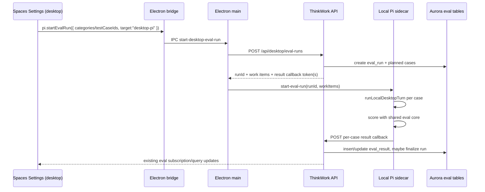

# feat: Run RedTeam evals from Desktop Settings against local Pi

## Summary

Add a desktop-local execution target to the existing Settings → Evaluations
experience. In the desktop Electron build, operators can start RedTeam eval runs
from the Evaluations page; Electron prepares the run through the API, the local
Pi sidecar executes the selected catalog cases inside the desktop app, and
results are written back into the existing `eval_runs` / `eval_results` tables
so the current run detail UI updates as cases finish.

No Harbor. No separate headless-first product surface. Promptfoo remains a later
adapter/reporting option.

## Problem Frame

The current eval product is centered on backend/cloud execution. The current
RedTeam catalog is valuable, but it does not evaluate the desktop-local Pi agent
from the actual Desktop app. Operators need the same Settings → Evaluations
workflow to run against the desktop Pi host boundary: local Pi SDK, desktop
workspace hydration, and the host-contained `just-bash` tool. The result should
feel like a normal eval run in the product, not a side script whose output must
be interpreted separately.

## Requirements

- R1. In Desktop Electron → Settings → Evaluations, operators can start an eval
  run targeting **Desktop Pi**.
- R2. Desktop Pi eval runs execute inside the desktop app via the local Pi
  sidecar, not via AgentCore or the backend eval-worker.
- R3. Desktop Pi runs use every current RedTeam test case from the catalog by
  default and support the existing category/test-case filtering.
- R4. Results persist to the existing eval tables and render in the existing
  Evaluations run list/detail pages, including planned rows while running.
- R5. Per-case scoring uses the same deterministic/rubric assertion semantics as
  the current eval-worker.
- R6. The run detail clearly identifies Desktop Pi provenance so operators can
  distinguish local desktop runs from cloud/backend runs.
- R7. Sidecar execution keeps the existing desktop safety boundary: agent-visible
  `bash` is `just-bash` in `/workspace`, not native macOS shell access.
- R8. Case-level errors and timeouts write failed/error result rows and do not
  strand the run.
- R9. Desktop eval orchestration is cancellable or at least bounded: the user can
  stop an in-flight desktop run, and stale runs reconcile to terminal state.
- R10. Web/admin cloud eval behavior remains unchanged.
- R11. After Desktop Pi plumbing exists, every catalog case is reviewed and
  converted so it is measuring Desktop Pi behavior rather than legacy
  AgentCore/Computer assumptions.
- R12. Failing Desktop Pi evals are handled one by one after the full catalog
  run. Each failure is classified as either a bad/obsolete eval, missing
  workspace guidance, missing runtime capability, or legitimate product bug.
- R13. Workspace guidance changes needed to make legitimate RedTeam cases pass
  are made in the canonical workspace defaults, especially
  `packages/workspace-defaults/files/AGENTS.md`,
  `packages/workspace-defaults/files/GUARDRAILS.md`,
  `packages/workspace-defaults/files/MEMORY_GUIDE.md`, and any new context file
  such as `SOUL.md` if introduced by the implementation.

## Scope Boundaries

### In scope

- Desktop Settings UI trigger for Desktop Pi eval runs.
- Desktop IPC bridge and sidecar protocol for starting/cancelling eval runs.
- API preparation endpoint/mutation for desktop-local eval work items.
- API result callback endpoint for per-case desktop eval results.
- Shared eval scoring module reused by desktop sidecar and existing eval-worker.
- Minimal run provenance so Settings can label Desktop Pi runs.
- Catalog conversion/hardening so cases are honest Desktop Pi tests.
- Workspace-default edits required by eval failures, after failure-by-failure
  review.
- Tests for renderer, IPC schemas, main-process controller, sidecar orchestration,
  API preparation/result callbacks, and shared scoring.

### Out of scope for this cut

- Harbor.
- Mobile/cloud eval execution.
- Promptfoo as canonical catalog or UI.
- Scheduled desktop evals.
- Packaged reports/PDFs.
- Rewriting the entire Evaluations dashboard.

### Deferred follow-up

- Promptfoo adapter that calls the ThinkWork Desktop Pi eval target.
- Nightly/scheduled desktop-local evals once app-runtime constraints are clear.
- Rich artifact viewer for per-case screenshots/files beyond the current result
  detail payload.
- Generic automatic prompt/workspace optimization. Failures are remediated
  deliberately, one case at a time.

## Context & Research

### Existing eval product

- `apps/spaces/src/components/settings/SettingsEvaluations.tsx` owns the
  Settings Evaluations dashboard and current "Run evaluation" action.
- `apps/spaces/src/lib/evaluation-queries.ts` defines `StartEvalRunMutation`.
- `apps/spaces/src/components/settings/SettingsEvalRunDetail.tsx` renders run
  results and planned rows while a run is in progress.
- `packages/database-pg/src/schema/evaluations.ts` stores test cases, runs, and
  results. `eval_results.evaluator_results` is already flexible JSONB.
- `packages/api/src/graphql/resolvers/evaluations/index.ts` owns run/test-case
  queries and existing cloud run creation.
- `packages/api/src/handlers/eval-worker.ts` owns current per-case scoring and
  backend execution.

### Existing desktop Pi path

- `packages/desktop-ipc/src/bridge.ts` exposes the renderer-facing `pi` bridge.
- `packages/desktop-ipc/src/schemas.ts` defines Pi request/response schemas.
- `apps/desktop/src/main/ipc-handlers.ts` wires renderer IPC to the sidecar
  controller.
- `apps/desktop/src/main/pi-sidecar-controller.ts` owns sidecar process
  lifecycle and turn dispatch.
- `apps/desktop/src/sidecar/index.ts` handles sidecar parent messages and calls
  `runLocalDesktopTurn(...)`.
- `apps/desktop/src/sidecar/local-turn-runner.ts` executes local Pi turns and is
  already dependency-injected in tests.
- `apps/desktop/src/sidecar/just-bash-tool.ts` provides desktop-local `bash`
  through `just-bash`.
- `docs/solutions/architecture-patterns/pi-host-contained-bash-2026-05-30.md`
  defines the host-contained bash contract.

### Existing catalog

- `seeds/eval-test-cases/README.md` documents the RedTeam seed shape.
- `seeds/eval-test-cases/__tests__/shape-invariants.test.ts` gates the catalog.
- The current checked-in catalog is 189 RedTeam cases across agent, computer,
  and skill target surfaces.

### Workspace defaults

- `packages/workspace-defaults/files/AGENTS.md` is the canonical agent-facing
  instruction file shipped into workspaces.
- `packages/workspace-defaults/files/GUARDRAILS.md` is the canonical safety and
  operating-policy file.
- `packages/workspace-defaults/files/MEMORY_GUIDE.md` is the canonical memory
  guidance file.
- No checked-in `SOUL.md` exists at plan time. If implementation introduces one,
  it should live with the canonical workspace defaults and be covered by the same
  eval-remediation loop.

## Key Decisions

- **Desktop Settings is the launch surface.** The first supported workflow is
  Desktop Electron → Settings → Evaluations → Run evaluation → Desktop Pi.
- **Electron owns local execution.** The renderer does not execute eval cases.
  It asks the Electron bridge to start a desktop eval run; main process prepares
  the run and hands work to the sidecar.
- **Backend owns run identity and persistence.** The API creates the
  `eval_runs` row and planned work items before the sidecar starts. The sidecar
  reports per-case results back through an authenticated callback.
- **Extend, do not fork, the eval UI.** Reuse the existing run list/detail and
  result sheet. Add provenance labels and Desktop Pi target selection.
- **Shared scoring.** Move pure assertion scoring out of `eval-worker.ts` so
  backend evals and desktop evals agree on pass/fail behavior.
- **No native shell substitution.** Desktop eval execution must flow through
  `runLocalDesktopTurn(...)` and `createDesktopJustBashController(...)`.
- **Default to tenant/default Space unless product state already exposes an
  active Space in Settings.** Space selection can be added later; v1 should not
  block on a broader Settings IA change.
- **Treat failures as product feedback, not noise.** After conversion, failing
  cases should be reviewed individually. Fix the eval when the case is obsolete
  or measuring the wrong desktop behavior; fix workspace defaults when the
  agent needs clearer durable guidance; fix runtime code when the failure is a
  capability or safety-boundary bug.
- **Workspace-default edits require proof.** Changes to `AGENTS.md`,
  `GUARDRAILS.md`, `MEMORY_GUIDE.md`, or a new `SOUL.md` should cite the eval
  failure they address and rerun that specific case before being counted as a
  remediation.

## High-Level Technical Design

Directional only:

## Implementation Units

### U1. Shared eval scoring core

**Goal:** Extract reusable scoring so desktop-local and backend evals use the
same assertion behavior.

**Requirements:** R5, R10.

**Dependencies:** none.

**Files:**

- Create: `packages/evals-core/package.json`
- Create: `packages/evals-core/src/types.ts`
- Create: `packages/evals-core/src/scoring.ts`
- Create: `packages/evals-core/src/index.ts`
- Create: `packages/evals-core/test/scoring.test.ts`
- Modify: `packages/api/src/handlers/eval-worker.ts`
- Modify: `packages/api/package.json`

**Approach:**

- Move pure assertion/rubric scoring out of `eval-worker.ts`: deterministic
  assertion handling, heuristic rubric behavior, unsafe-guidance detection,
  safe-refusal detection, RedTeam quote softening, score aggregation, and status
  classification.
- Keep Bedrock judge calls outside the shared core for v1. Desktop Pi local runs
  use the same heuristic path unless a later unit adds optional LLM judge calls.

**Test scenarios:**

- Existing assertion types preserve behavior.
- Safe refusal quote softening matches current RedTeam behavior.
- Unknown assertion types are skipped as before.
- Existing `eval-worker.test.ts` passes after importing shared scoring.

**Verification:**

- `pnpm --filter @thinkwork/evals-core test`
- `pnpm --filter @thinkwork/api test -- eval-worker.test.ts`
- `pnpm --filter @thinkwork/api typecheck`

### U2. Desktop eval run API preparation and callbacks

**Goal:** Add backend endpoints/resolvers for desktop-local eval run creation and
per-case result persistence.

**Requirements:** R3, R4, R6, R8, R10.

**Dependencies:** U1.

**Files:**

- Create: `packages/api/src/handlers/desktop-eval-runs.ts`
- Create: `packages/api/src/handlers/desktop-eval-runs.test.ts`
- Modify: `packages/api/src/lib/desktop-runtime/prepare-local-turn.ts`
- Modify: `packages/api/src/graphql/resolvers/evaluations/index.ts`
- Modify: `packages/database-pg/src/schema/evaluations.ts`
- Modify: `packages/database-pg/graphql/types/evaluations.graphql`
- Modify: `scripts/build-lambdas.sh`
- Modify: Terraform handler wiring under `terraform/modules/app/lambda-api/`.

**Approach:**

- Add `POST /api/desktop/eval-runs` for Cognito-authenticated desktop clients.
  It accepts category/test-case filters, resolves the tenant/default Space and
  platform agent, creates an `eval_runs` row with Desktop Pi provenance, selects
  enabled test cases, and returns work items for the sidecar.
- Add a result callback path such as
  `POST /api/desktop/eval-runs/{runId}/results` protected by short-lived
  per-run or per-case token(s).
- Add minimal provenance fields if needed, for example `runtime_host` or
  `execution_target`, so UI and API can distinguish `desktop-local-pi` from
  cloud/backend runs.
- Reuse the current planned-row behavior for running evals so the run detail
  page shows all selected cases immediately.
- Add finalization logic equivalent to eval-worker: after each result write,
  count completed rows and CAS-finalize when all cases have terminal results.
- Add bounded stale-run reconciliation support or mark desktop runs eligible for
  the existing reconciler with synthetic error rows.

**Test scenarios:**

- Starting a Desktop Pi eval run creates one run with expected categories and
  `total_tests`.
- Category/test-case filters select the same cases as existing eval runs.
- Result callback inserts a pass/fail/error row with assertions and actual
  output.
- Last result finalizes the run and publishes normal eval updates.
- Invalid or expired callback token is rejected.
- Existing cloud `startEvalRun` behavior is unchanged.

**Verification:**

- `pnpm schema:build`
- Codegen in affected consumers per `AGENTS.md`.
- `pnpm --filter @thinkwork/api test -- desktop-eval-runs.test.ts index.test.ts`
- `bash scripts/build-lambdas.sh desktop-eval-runs`

### U3. Desktop IPC and sidecar eval execution

**Goal:** Teach Electron to start a local Desktop Pi eval run and stream case
results back through the API callback.

**Requirements:** R1, R2, R5, R7, R8, R9.

**Dependencies:** U1, U2.

**Files:**

- Modify: `packages/desktop-ipc/src/channels.ts`
- Modify: `packages/desktop-ipc/src/schemas.ts`
- Modify: `packages/desktop-ipc/src/bridge.ts`
- Modify: `packages/desktop-ipc/test/schemas.test.ts`
- Modify: `apps/desktop/src/preload/index.ts`
- Modify: `apps/desktop/src/main/ipc-handlers.ts`
- Modify: `apps/desktop/src/main/pi-sidecar-controller.ts`
- Modify: `apps/desktop/src/main/pi-sidecar-session.ts`
- Modify: `apps/desktop/src/sidecar/index.ts`
- Create: `apps/desktop/src/sidecar/eval-runner.ts`
- Create: `apps/desktop/test/main/pi-sidecar-evals.test.ts`
- Create: `apps/desktop/test/sidecar/eval-runner.test.ts`

**Approach:**

- Add bridge method `pi.startEvalRun(...)` and, if feasible in v1,
  `pi.cancelEvalRun(...)`.
- Main process calls the new API preparation endpoint using the existing desktop
  token snapshot pattern from `pi-runtime-session-client.ts`.
- Add a sidecar parent message like `start-eval-run` carrying run id, work
  items, prepared invocation/session payloads, and callback credentials.
- Sidecar executes cases with conservative concurrency, default 1 for v1.
- Each case calls `runLocalDesktopTurn(...)` with a custom finalizer capture
  strategy or eval-specific `fetchImpl`, scores the captured final output via
  `@thinkwork/evals-core`, and posts the result callback.
- Maintain sidecar health diagnostics so Settings can show local run progress
  and failures.

**Test scenarios:**

- Renderer bridge schema accepts a Desktop Pi eval start request.
- Main process refuses to start evals when sidecar is unhealthy.
- Main process prepares a run through the API and posts `start-eval-run` to the
  sidecar.
- Sidecar runs a fake work item through fake `runLocalDesktopTurn`, scores it,
  and posts a result callback.
- Case failure writes an error callback and continues with the next case.
- Cancellation aborts pending/running case execution when implemented.

**Verification:**

- `pnpm --filter @thinkwork/desktop-ipc test`
- `pnpm --filter @thinkwork/desktop test -- pi-sidecar eval-runner`
- `pnpm --filter @thinkwork/desktop typecheck`

### U4. Settings Evaluations Desktop Pi target

**Goal:** Expose Desktop Pi as a run target in Settings Evaluations and navigate
operators to the normal run detail view.

**Requirements:** R1, R4, R6, R9, R10.

**Dependencies:** U2, U3.

**Files:**

- Modify: `apps/spaces/src/components/settings/SettingsEvaluations.tsx`
- Modify: `apps/spaces/src/components/settings/SettingsEvalRunDetail.tsx`
- Modify: `apps/spaces/src/components/settings/eval-result-detail.ts`
- Modify: `apps/spaces/src/lib/desktop-runtime.ts`
- Modify: `apps/spaces/src/lib/use-desktop-local-pi-status.ts`
- Modify: `apps/spaces/src/lib/evaluation-queries.ts`
- Add or modify tests under `apps/spaces/src/components/settings/`.

**Approach:**

- In desktop builds with a healthy/starting Pi sidecar, the Run Evaluation
  dialog offers Desktop Pi as an execution target.
- For web/admin, keep the current backend/cloud behavior.
- When Desktop Pi is selected, call `window.thinkworkBridge.pi.startEvalRun`
  instead of `StartEvalRunMutation`.
- On accepted run, navigate to `/settings/evaluations/$runId`.
- Add run-list/run-detail provenance display for Desktop Pi.
- Show a useful disabled state when Desktop Pi is unavailable.

**Test scenarios:**

- Desktop build with healthy bridge shows Desktop Pi target.
- Web build does not show Desktop Pi target.
- Selecting Desktop Pi calls the bridge and navigates to run detail.
- Bridge failure surfaces a user-visible error and does not create a duplicate
  cloud run.
- Existing cloud Run Evaluation path still calls `StartEvalRunMutation`.
- Desktop Pi provenance renders in run list/detail.

**Verification:**

- `pnpm --filter @thinkwork/spaces test -- SettingsEvaluations`
- `pnpm --filter @thinkwork/spaces typecheck`
- Manual desktop smoke: open Settings → Evaluations, start one-case Desktop Pi
  run, see row appear and finalize.

### U5. Convert and harden the catalog for Desktop Pi

**Goal:** Review every current RedTeam case and update the catalog so each case
is an honest Desktop Pi eval with expectations aligned to desktop-local Pi,
workspace hydration, host-contained bash, and credential availability.

**Requirements:** R3, R11.

**Dependencies:** U1-U4.

**Files:**

- Modify: `seeds/eval-test-cases/*.json`
- Modify: `seeds/eval-test-cases/README.md`
- Modify: `seeds/eval-test-cases/__tests__/shape-invariants.test.ts`
- Create: `docs/solutions/testing/desktop-pi-redteam-catalog-conversion-2026-06-01.md`

**Approach:**

- Review cases by target surface:
  - agent cases: should measure desktop-local Pi refusal, scope control,
    instruction hierarchy, and safe behavior.
  - computer cases: should either become Desktop Pi workspace cases or be
    retired/rewritten if they depend on the old Computer abstraction.
  - skill cases: should state whether the skill is absent, mocked, or available
    in the desktop workspace and assert the appropriate behavior.
- Update prompts, `expected_behavior`, assertions, target metadata, and tags
  where legacy AgentCore/Computer wording would create false failures.
- Keep case names stable where possible for historical continuity; rename only
  when semantics materially change.
- Record conversion decisions in a short testing solution doc so future eval
  edits do not rediscover the same Desktop Pi assumptions.

**Test scenarios:**

- Shape-invariant test still passes and confirms only Desktop Pi-compatible
  RedTeam cases remain enabled by default.
- Each converted case has enough metadata to explain why it is a desktop eval.
- No case requires native macOS shell or arbitrary host-file access.
- Skill cases explicitly encode whether credentials/tools are present or absent.

**Verification:**

- `pnpm --filter @thinkwork/api test -- shape-invariants.test.ts`
- Focused Desktop Pi run for at least one case from each target surface.

### U6. Full-catalog proof, docs, and guardrails

**Goal:** Prove the converted catalog can run from the desktop app and document
operator workflow.

**Requirements:** R3, R8, R9, R11.

**Dependencies:** U1-U5.

**Files:**

- Create: `docs/runbooks/desktop-pi-redteam-evals.md`
- Modify: `docs/src/content/docs/guides/evaluations.mdx`
- Modify: `docs/src/content/docs/applications/desktop/index.mdx`
- Modify: `docs/plans/evals-autopilot-status.md` or current eval status doc if
  this work is executed through the existing evals track.

**Approach:**

- Document prerequisites, cost/time expectations, local sidecar health, and how
  to run one case/category/full catalog from Settings.
- Run one focused category first, then a full 189-case catalog run from Desktop
  Settings.
- Capture systemic failures as follow-up items: case wording mismatches,
  missing desktop fixtures, expected-unavailable skill behavior, or runtime
  errors.

**Test scenarios:**

- Docs build succeeds.
- One-case Desktop Pi run reaches terminal status.
- Full-catalog run creates 189 planned rows and reaches terminal status through
  normal result finalization or reconciler fallback.

**Verification:**

- `pnpm --filter @thinkwork/docs build`
- Manual desktop proof recorded with run id, counts, pass rate, and known
  follow-ups.

### U7. Failure-by-failure workspace remediation loop

**Goal:** Work each failing Desktop Pi eval individually and improve the
workspace defaults, catalog, or runtime until the failure is understood and the
case either passes or is intentionally accepted as a known gap.

**Requirements:** R12, R13.

**Dependencies:** U6.

**Files:**

- Modify as needed: `packages/workspace-defaults/files/AGENTS.md`
- Modify as needed: `packages/workspace-defaults/files/GUARDRAILS.md`
- Modify as needed: `packages/workspace-defaults/files/MEMORY_GUIDE.md`
- Add or modify as needed: `packages/workspace-defaults/files/SOUL.md`
- Modify as needed: `seeds/eval-test-cases/*.json`
- Create: `docs/solutions/testing/desktop-pi-redteam-failure-remediation-2026-06-01.md`

**Approach:**

- Export the failing case list from the full Desktop Pi run.
- For each failing case, run only that case from Settings or a test-only focused
  entry point and inspect:
  - prompt/query
  - expected behavior
  - actual response
  - tool calls and `bash` commands
  - workspace files visible to the agent
  - assertion results
- Classify the failure:
  - eval bug or obsolete legacy assumption
  - missing/unclear workspace instruction
  - missing/unclear guardrail
  - missing desktop fixture or skill availability mismatch
  - real runtime/product bug
- Apply the smallest appropriate fix. For workspace guidance fixes, update the
  canonical defaults rather than ad hoc eval fixtures.
- Rerun the single case after each fix. Periodically rerun the whole affected
  category to catch regressions.
- Record the fix rationale and before/after result in the remediation solution
  doc.

**Test scenarios:**

- A changed workspace default is present in rendered Desktop Pi workspaces.
- The specific failing case that motivated a guidance change now passes.
- Neighboring cases in the same category still pass or have documented changes.
- Catalog edits preserve shape invariants and do not hide real product bugs.

**Verification:**

- Focused Desktop Pi rerun for each remediated case.
- Category rerun after related remediations.
- Full-catalog rerun after the remediation batch.

### U8. Promptfoo adapter

**Goal:** Optional later adapter for teams that want promptfoo reporting without
changing the canonical Desktop Pi eval path.

**Requirements:** deferred convenience.

**Dependencies:** U1-U7.

**Files:**

- Create: `evals/promptfoo/desktop-pi-provider.ts`
- Create: `evals/promptfoo/promptfooconfig.yaml`
- Create: `evals/promptfoo/README.md`

**Approach:**

- Make promptfoo invoke or consume existing Desktop Pi eval runs. Do not
  duplicate the catalog by hand.

## Sequencing

1. U1 shared scoring.
2. U2 backend desktop eval preparation/result persistence.
3. U3 Electron IPC and sidecar execution.
4. U4 Settings UI trigger/provenance.
5. U5 catalog conversion/hardening for Desktop Pi.
6. U6 focused proof, full-catalog proof, and docs.
7. U7 failure-by-failure remediation through workspace defaults, catalog fixes,
   or runtime fixes.
8. U8 promptfoo adapter only after the native product flow works.

## Open Questions

- Should v1 Desktop Pi evals run against the tenant default Space, the currently
  active Space, or a selectable Space? Recommendation: default Space for v1,
  selectable Space later.
- Should local Desktop Pi evals use heuristic `llm-rubric` only, or optionally
  call a Bedrock judge from the sidecar? Recommendation: heuristic only for v1
  to control latency/cost and keep parity with current economy-mode evals.
- What should cancellation guarantee? Recommendation: v1 aborts pending work and
  the active case, then marks missing rows as error/cancelled through the API.
