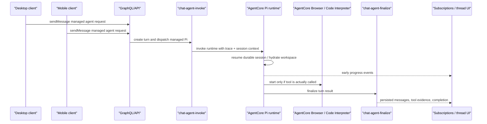

# refactor: AgentCore-first Pi execution

## Overview

ThinkWork should converge desktop and mobile Pi execution onto one security and operations story: all agent execution runs through AWS AgentCore Pi, while desktop and mobile remain clients. This plan starts with a U0 spike that routes desktop and mobile to AgentCore quickly, deploys it, and gathers real evidence before the deeper cleanup. Then it removes local Pi dispatch from Spaces, removes the Electron local sidecar/IPC surface, retires mobile's on-device harness path, tombstones desktop-local backend preparation APIs, and adds latency instrumentation plus managed-path responsiveness work so AgentCore feels alive enough for desktop and mobile users.

The plan is intentionally not a NemoClaw/OpenShell plan. Those remain research vocabulary only. The implementation target is a simpler product shape: Pi is the runtime identity; AgentCore is the execution boundary.

---

## Problem Frame

The upstream requirements document records a course correction away from local sandbox design. OpenShell/MicroVM/container routes introduced too many OS-specific and mobile-specific branches, and `just-bash` created a second sandbox story the user explicitly does not want to support. The new problem is not "how do we build a local secure sandbox?" but "how do we make AgentCore-backed Pi feel fast, present, and enterprise-safe?" (see origin: `docs/brainstorms/2026-06-01-agentcore-first-pi-execution-requirements.md`).

Local research found four active local-execution clusters to remove or reroute:

- Spaces desktop-local dispatch and UI status paths in `apps/spaces`.
- Electron Pi sidecar, preload bridge, IPC schemas, and sidecar tests in `apps/desktop` and `packages/desktop-ipc`.
- Backend desktop-local runtime preparation, finalize-token, and managed-delegation support in `packages/api` and Terraform routes.
- Mobile on-device harness, `just-bash`, smoke scripts, and primary thread send paths in `apps/mobile`.

AgentCore Pi already has the right center of gravity: `packages/agentcore-pi/agent-container/src/server.ts` runs the managed runtime, has durable S3-backed session support, and lazily wires Browser/Code Interpreter when the invocation enables those tools. The plan should strengthen that path rather than invent another one.

---

## Requirements Trace

- R1. AgentCore is the execution boundary for all Pi agent work across desktop and mobile.
- R2. Desktop and mobile must not expose or run local Pi execution; local sidecars, dispatch, console/status surfaces, and mobile local loops are removed or rerouted.
- R3. Desktop must not expose `just-bash` as a local execution or security story.
- R4. Mobile must not run local Pi execution; mobile submits agent work to AgentCore.
- R5. NemoClaw/OpenShell remain research references only.
- R6. Pi remains the runtime identity; AgentCore is the hosting/isolation substrate.
- R7. AgentCore turn latency must be measurable by phase.
- R8. Desktop and mobile must show early progress before final completion.
- R9. AgentCore Pi should use durable sessions and avoid full replay when a resumable session exists.
- R10. Safe, cost-bounded prewarm should happen where evidence supports it.
- R11. Browser and Code Interpreter setup remains lazy.
- R12. Faster model routing or two-stage responses are evaluated only if telemetry shows model time dominates.
- R13. User-facing labels should be simple, such as "Managed agent".
- R14. Enterprise language should say execution runs in AWS-managed AgentCore isolation.
- R15. Future local execution re-entry requires a separate requirements document and evidence.

**Origin actors:** A1 Desktop user, A2 Mobile user, A3 AgentCore Pi runtime, A4 Desktop/mobile clients, A5 Platform operator / enterprise reviewer.

**Origin flows:** F1 Desktop turn runs in AgentCore, F2 Mobile turn runs in AgentCore, F3 Fast-feeling AgentCore turn.

**Origin acceptance examples:** AE1 all desktop/mobile Pi messages execute through AgentCore, AE2 slow turns expose the dominant latency phase, AE3 simple conversational turns show early progress without initializing Browser/Code Interpreter, AE4 enterprise reviewer gets a one-sentence AgentCore isolation answer.

---

## Scope Boundaries

- No OpenShell, NemoClaw, MicroVM, Docker Desktop, Podman, or local-container execution.
- No local desktop Pi sidecar, local desktop `bash`, or desktop-local dispatch mode.
- No local mobile Pi loop, on-device model loop, or local mobile `just-bash` sandbox.
- No replacement of Pi as the runtime identity.
- No removal of AgentCore Browser or AgentCore Code Interpreter.
- No future local execution work without a separate brainstorm that cites AgentCore latency/product evidence.
- No model-routing change until instrumentation shows model latency is the dominant delay.

### Deferred to Follow-Up Work

- Delete tombstoned desktop-local HTTP routes after one desktop release cycle or an equivalent client-adoption signal. This plan removes execution capability immediately, but a short tombstone period gives old packaged clients a clear 410 response instead of an ambiguous failure.
- Remove stale generated GraphQL enum values from external consumers only after canonical schema regeneration lands in every workspace that owns codegen.

---

## Context & Research

### Relevant Code and Patterns

- `apps/spaces/src/lib/desktop-runtime.ts` currently decides when desktop-local dispatch is available and summarizes local Pi status.
- `apps/spaces/src/lib/use-chat-appsync-transport.ts`, `apps/spaces/src/components/workbench/SpacesWorkbench.tsx`, and `apps/spaces/src/components/workbench/SpacesThreadDetailRoute.tsx` currently set `dispatchMode: "DESKTOP_LOCAL"` and call the Electron Pi bridge.
- `apps/spaces/src/lib/use-desktop-local-pi-status.ts`, `apps/spaces/src/lib/use-desktop-local-pi-console.ts`, and `apps/spaces/src/components/workbench/TaskThreadView.tsx` expose local Pi status/diagnostic surfaces.
- `apps/desktop/src/main/ipc-handlers.ts`, `apps/desktop/src/preload/index.ts`, and `packages/desktop-ipc/src/bridge.ts` expose the Electron Pi bridge and sidecar control surface.
- `apps/desktop/src/sidecar/local-turn-runner.ts` and `apps/desktop/src/sidecar/just-bash-tool.ts` implement the desktop-local runtime and `just-bash` tool.
- `packages/api/src/handlers/desktop-runtime-session.ts`, `packages/api/src/handlers/desktop-workspace-prewarm.ts`, and `packages/api/src/lib/desktop-runtime/prepare-local-turn.ts` prepare desktop-local turns.
- `packages/api/src/graphql/resolvers/messages/sendMessage.agent-handling.ts` suppresses managed dispatch when `dispatchMode` is `DESKTOP_LOCAL`.
- `packages/database-pg/graphql/types/messages.graphql` defines `MessageDispatchMode`, currently including `DESKTOP_LOCAL`.
- `apps/mobile/app/thread/[threadId]/index.tsx` and `apps/mobile/app/(tabs)/index.tsx` call `runThreadHarnessTurn` for mobile thread sends.
- `apps/mobile/lib/agent/thread-turn.ts`, `apps/mobile/hooks/useHarnessChat.ts`, `apps/mobile/lib/agent/harness-chat-core.ts`, and `apps/mobile/lib/agent/extensions/local-bash-extension.ts` implement the on-device mobile harness.
- `packages/agentcore-pi/agent-container/src/server.ts` is the managed runtime target; it already handles session store setup and lazy Browser/Code Interpreter registration.
- `packages/api/src/lib/agentcore-spans.ts` already fetches AWS AgentCore spans and runtime logs by session id, giving instrumentation work an existing API-side pattern.

### Institutional Learnings

- `docs/solutions/best-practices/bedrock-agentcore-sdk-version-drift-prefer-raw-boto3-2026-04-24.md` warns that AgentCore wrapper APIs drift; prefer raw boto3/client calls for Code Interpreter-style AWS APIs.
- `docs/solutions/workflow-issues/agentcore-runtime-no-auto-repull-requires-explicit-update-2026-04-24.md` says AgentCore Runtime does not auto-repull updated ECR images; runtime updates must be explicit and verified.
- `docs/solutions/architecture-patterns/mobile-pi-compatible-host-contract-2026-05-30.md` and `docs/solutions/architecture-patterns/pi-host-contained-bash-2026-05-30.md` document the local mobile/desktop Pi direction this plan supersedes.
- `docs/solutions/testing/mobile-pi-smoke-matrix-2026-05-30.md` is tied to the mobile harness and should be marked obsolete or retired when mobile local execution is removed.

### External References

- AWS AgentCore Runtime docs: AgentCore Runtime handles scaling, session management, security isolation, and infrastructure management for hosted agents.
- AWS AgentCore Observability docs: AgentCore spans and runtime logs are available through CloudWatch, including `/aws/spans` and runtime log groups.
- AWS AgentCore Code Interpreter docs: Code Interpreter provides managed sandbox execution for agent code tasks; keep it as the cloud code execution story.
- AWS AgentCore Browser docs: Browser provides the managed browser runtime and observability features such as live view/session recording.

---

## Key Technical Decisions

- **Remove local execution instead of hiding it behind flags:** A disabled local Pi flag still leaves a second product path to explain and maintain. Product behavior should route to AgentCore unconditionally.
- **Spike before deletion:** Route desktop and mobile through AgentCore first, deploy it, and learn from real turns before deleting large local-runtime surfaces.
- **Tombstone old desktop-local API routes before deleting them:** Old desktop clients may still call `/api/desktop/runtime-session` or `/api/desktop/workspace-prewarm`. Returning a clear 410 for one release is safer than leaving local preparation functional or removing routes with no diagnostic.
- **Delete `DESKTOP_LOCAL` as a client-controlled GraphQL behavior:** Client inputs should no longer be able to suppress managed dispatch by claiming desktop-local mode.
- **Keep AgentCore Browser and Code Interpreter lazy:** The managed tools remain part of Pi, but ordinary conversational turns must not pay their startup cost.
- **Treat warm-container workspace reuse as a first-class optimization candidate:** AgentCore warm containers may preserve `/workspace` for follow-up turns. A strict tenant/prefix/manifest/ETag-scoped local hydrate cache is acceptable if U0 shows S3 hydration dominates follow-up latency.
- **Use telemetry before speed architecture:** Prewarm, durable-session tuning, and progress UI can proceed now, but model downgrade/two-stage routing waits for phase metrics.
- **Treat old local Pi docs as superseded:** The old local sandbox docs should not remain as current architectural guidance.

---

## Open Questions

### Resolved During Planning

- Should desktop or mobile retain any local Pi execution for dogfood? **No.** The origin explicitly says no local Pi at all.
- Should AgentCore Browser or Code Interpreter be removed because they are sandboxes? **No.** The origin preserves them as AWS-managed tools.
- Should OpenShell/NemoClaw be part of v1? **No.** They remain research references only.
- Should old desktop-local HTTP routes be removed immediately? **Resolved as tombstone first.** This removes execution capability while giving old clients a clear compatibility error.

### Deferred to Implementation

- Exact telemetry field names and span emission helper names: defer until implementers inspect current logging helpers and CloudWatch/OTel conventions.
- Exact prewarm actions and thresholds: defer until initial phase metrics identify the dominant cold path and AWS cost/limit behavior.
- Whether the current rendered-workspace cache actually speeds up AgentCore turns: defer until U0/U5 measure S3 render, changed-file sync, AgentCore hydration, and ephemeral runtime reuse behavior in deployed AgentCore.
- Whether `managed-delegation` can be deleted in the same PR as desktop-local removal: defer to dependency inspection, because some tools import desktop finalize-token helpers today.
- Whether old mobile harness primitives should be deleted outright or moved to archived test fixtures: defer to implementation once import graph and current tests are visible.

---

## High-Level Technical Design

> *This illustrates the intended approach and is directional guidance for review, not implementation specification. The implementing agent should treat it as context, not code to reproduce.*

There is no desktop-local branch in this flow. Desktop and mobile differ in client UX only; agent execution always crosses the API into AgentCore.

---

## Implementation Units

- U0. **Spike: Route desktop and mobile to AgentCore now**

**Goal:** Make the smallest deployable change that routes both desktop and mobile Pi turns through AgentCore, then use deployed tests to decide whether AgentCore functionality, workspace hydration, or client routing needs correction before the larger removal work.

**Requirements:** R1, R2, R4, R7, R8, R9, R10; F1, F2, F3; AE1, AE2, AE3.

**Dependencies:** None. This is intentionally first.

**Files:**
- Modify: `apps/spaces/src/lib/use-chat-appsync-transport.ts`
- Modify: `apps/spaces/src/components/workbench/SpacesWorkbench.tsx`
- Modify: `apps/spaces/src/components/workbench/SpacesThreadDetailRoute.tsx`
- Modify: `apps/mobile/app/thread/[threadId]/index.tsx`
- Modify: `apps/mobile/app/(tabs)/index.tsx`
- Modify: `apps/mobile/hooks/useGraphQLChat.ts`
- Modify: `packages/api/src/graphql/resolvers/messages/sendMessage.agent-handling.ts`
- Modify: `packages/api/src/handlers/chat-agent-invoke.ts`
- Modify: `packages/agentcore-pi/agent-container/src/server.ts`
- Test: `apps/spaces/src/lib/use-chat-appsync-transport.test.ts`
- Test: `apps/spaces/src/components/workbench/SpacesWorkbench.test.tsx`
- Test: `apps/spaces/src/components/workbench/SpacesThreadDetailRoute.test.tsx`
- Create test: `apps/mobile/app/thread/[threadId]/index.test.tsx`
- Create test: `apps/mobile/app/(tabs)/index.test.tsx`
- Test: `packages/api/src/graphql/resolvers/messages/sendMessage.mentions.test.ts`
- Test: `packages/api/src/handlers/chat-agent-invoke.runtime-routing.test.ts`
- Test: `packages/agentcore-pi/agent-container/tests/server.test.ts`

**Approach:**
- Keep the change deliberately small: bypass or disable desktop-local dispatch and mobile harness execution at the call sites, but do not delete sidecar/harness code in this unit.
- Route desktop and mobile sends through the managed `sendMessage`/AgentCore path with enough tests to prove the clients are no longer choosing local execution.
- Add lightweight temporary or structured logging around rendered workspace render, S3 upload/check, AgentCore hydration, session-store hit/miss, and first runtime activity so deployed runs produce actionable evidence.
- Deploy to the intended dev/canary environment and run real desktop and mobile turns that cover ordinary chat, workspace-backed file context, a code/tool turn, and a simple no-tool turn.
- Include a warm-follow-up probe: send two or more turns in the same thread inside the expected AgentCore warm-container window and compare renderer cache, S3 list/get/write counts, bootstrap duration, and session-store hit/miss behavior.
- Use the spike result to decide whether to continue directly into U1-U7, fix AgentCore functionality first, or add a focused workspace-hydration optimization unit before cleanup.

**Execution note:** This is a spike, not the cleanup. Prefer reversible, narrow routing changes and concrete deployed evidence over deleting large local-runtime code in the same unit.

**Patterns to follow:**
- Use existing managed send-message dispatch instead of inventing a new transport.
- Use existing AgentCore trace/log conventions in `packages/api/src/lib/agentcore-spans.ts` and `packages/agentcore-pi/agent-container/src/handler-context.ts`.
- Preserve the rendered workspace cache/checking behavior long enough to measure whether it helps AgentCore.

**Test scenarios:**
- Covers AE1. Happy path: desktop send with local Pi available still routes to managed AgentCore.
- Covers AE1. Happy path: mobile follow-up and new-thread first message route to managed AgentCore instead of `runThreadHarnessTurn`.
- Covers AE2. Deployed evidence: a slow managed turn records enough phase data to identify whether delay is workspace render, S3/cache, AgentCore hydration, model, tool startup, or finalize.
- Covers AE3. Deployed evidence: a simple no-tool turn does not start Browser or Code Interpreter.
- Workspace scenario: a turn that needs rendered workspace files can read the expected workspace in AgentCore after S3 hydration.
- Ephemeral runtime scenario: two turns in the same thread reveal whether changed-file cache checks reduce AgentCore hydration work or whether the ephemeral runtime still rehydrates too much.
- Warm-container scenario: two follow-up questions inside the warm window show whether `/workspace` persists and whether unchanged rendered files are still downloaded/written every turn.

**Verification:**
- Desktop and mobile can both complete real deployed AgentCore turns.
- The team has concrete timing and functionality evidence before deleting local runtime code.
- Any required course correction is recorded before U1-U7 proceed.

---

- U1. **Remove Spaces desktop-local dispatch and surfaces**

**Goal:** Make Spaces submit all agent turns through the managed path and remove local Pi status/console affordances from the desktop renderer.

**Requirements:** R1, R2, R3, R8, R13; F1; AE1, AE4.

**Dependencies:** None.

**Files:**
- Modify: `apps/spaces/src/lib/desktop-runtime.ts`
- Modify: `apps/spaces/src/lib/use-chat-appsync-transport.ts`
- Modify: `apps/spaces/src/components/workbench/SpacesWorkbench.tsx`
- Modify: `apps/spaces/src/components/workbench/SpacesThreadDetailRoute.tsx`
- Modify: `apps/spaces/src/components/workbench/SpacesComposer.tsx`
- Modify: `apps/spaces/src/components/workbench/TaskThreadView.tsx`
- Modify or delete: `apps/spaces/src/lib/use-desktop-local-pi-status.ts`
- Modify or delete: `apps/spaces/src/lib/use-desktop-local-pi-console.ts`
- Test: `apps/spaces/src/lib/desktop-runtime.test.ts`
- Test: `apps/spaces/src/lib/use-chat-appsync-transport.test.ts`
- Test: `apps/spaces/src/components/workbench/SpacesWorkbench.test.tsx`
- Test: `apps/spaces/src/components/workbench/SpacesThreadDetailRoute.test.tsx`
- Test: `apps/spaces/src/components/workbench/SpacesComposer.test.tsx`
- Test: `apps/spaces/src/components/workbench/TaskThreadView.test.tsx`

**Approach:**
- Replace desktop-local readiness helpers with desktop-shell detection only where the renderer still needs shell features such as update banners, settings chrome, or file/dialog behavior.
- Remove `dispatchMode: "DESKTOP_LOCAL"` assignment from new-thread and follow-up sends.
- Remove `getDesktopBridge()?.pi?.prewarmWorkspace`, `startTurn`, retry, cancel, and custom local Pi event dispatch calls from workbench flows.
- Remove local Pi diagnostic folding from thread activity; managed AgentCore progress should remain visible through existing thread events and the new instrumentation/progress work in U5/U6.
- Update the composer control from local/cloud switching to a single managed-agent label or remove the control if it no longer has meaningful interaction.

**Execution note:** Add characterization tests around send payloads before deleting the local branch, because these components currently mix thread creation, onboarding handling, and runtime routing.

**Patterns to follow:**
- Keep existing GraphQL send mutation patterns in `apps/spaces/src/lib/use-chat-appsync-transport.ts`.
- Preserve desktop shell feature detection from `apps/spaces/src/lib/desktop-detection.ts` where it is unrelated to Pi execution.

**Test scenarios:**
- Happy path: desktop build with a mocked healthy Pi bridge sends a user message and the GraphQL payload has no `dispatchMode`.
- Happy path: new-thread composer in desktop build creates the thread and dispatches managed agent handling without calling `prewarmWorkspace` or `startTurn`.
- Covers AE1. Integration: follow-up send in `SpacesThreadDetailRoute` no longer calls the Electron Pi bridge and still triggers managed backend dispatch.
- Error path: a missing desktop Pi bridge does not produce local Pi-specific errors or fallback copy.
- Covers AE4. UI: the composer/header/thread activity no longer presents local Pi or `just-bash` labels.

**Verification:**
- Spaces desktop and web share the same agent send payload shape.
- No renderer code path can request desktop-local Pi execution.
- Local Pi status/diagnostic UI is absent from normal thread surfaces.

---

- U2. **Remove Electron Pi sidecar and IPC bridge**

**Goal:** Stop the desktop shell from starting, exposing, or diagnosing a local Pi runtime.

**Requirements:** R1, R2, R3, R13, R14; F1; AE1, AE4.

**Dependencies:** U1 should remove renderer calls first or land in the same coordinated PR.

**Files:**
- Modify: `apps/desktop/src/main/ipc-handlers.ts`
- Modify: `apps/desktop/src/main/env.ts`
- Modify: `apps/desktop/src/preload/index.ts`
- Modify: `apps/desktop/electron.vite.config.ts`
- Modify: `packages/desktop-ipc/src/bridge.ts`
- Modify: `packages/desktop-ipc/src/schemas.ts`
- Delete or archive after import cleanup: `apps/desktop/src/main/pi-sidecar-controller.ts`
- Delete or archive after import cleanup: `apps/desktop/src/main/pi-sidecar-diagnostics.ts`
- Delete or archive after import cleanup: `apps/desktop/src/main/pi-runtime-session-client.ts`
- Delete or archive after import cleanup: `apps/desktop/src/sidecar/local-turn-runner.ts`
- Delete or archive after import cleanup: `apps/desktop/src/sidecar/just-bash-tool.ts`
- Delete or archive after import cleanup: `apps/desktop/src/sidecar/index.ts`
- Test: `apps/desktop/test/main/ipc-handlers.test.ts`
- Test: `apps/desktop/test/main/pi-sidecar-controller.test.ts`
- Test: `apps/desktop/test/main/pi-runtime-session-client.test.ts`
- Test: `apps/desktop/test/sidecar/local-turn-runner.test.ts`

**Approach:**
- Remove `desktopLocalPiEnabled` from the runtime environment snapshot and build-time env allowlist.
- Do not create or start `createPiSidecarController` in `registerIpcHandlers`.
- Remove Pi-specific IPC channels from the preload bridge and shared IPC package, or leave explicit unsupported stubs only if an old renderer contract needs one release of compatibility.
- Remove sidecar process code, local turn runner code, and desktop `just-bash` tool once imports are gone.
- Keep unrelated desktop shell capabilities intact: auth, update events, shell chrome, workspace file viewing if still used outside local Pi.

**Execution note:** Characterize the preload bridge shape before editing, then update tests to assert `window.thinkworkBridge.pi` is absent.

**Patterns to follow:**
- Follow existing bridge optionality in `packages/desktop-ipc/src/bridge.ts`; prefer removing Pi from the exported bridge over returning a fake "healthy" or "disabled" runtime.
- Preserve CORS/auth/update IPC patterns already in `apps/desktop/src/main/ipc-handlers.ts`.

**Test scenarios:**
- Happy path: desktop startup registers normal IPC handlers but never constructs or starts a Pi sidecar, even if old local Pi env vars are present.
- Covers AE1. Integration: preload exposes no callable `pi.startTurn`, `pi.prewarmWorkspace`, or `pi.cancelTurn`.
- Error path: old local Pi env vars are ignored and do not throw during desktop startup.
- UI contract: renderer code that checks for a desktop bridge still works for non-Pi shell capabilities.

**Verification:**
- Desktop packaged runtime has no local Pi process, no sidecar diagnostics, and no `just-bash` tool dependency path.
- Removing local Pi does not remove the desktop app's non-agent shell capabilities.

---

- U3. **Retire desktop-local backend contracts**

**Goal:** Remove backend behavior that prepares or authenticates desktop-local turns, and prevent client-controlled `DESKTOP_LOCAL` dispatch from suppressing managed AgentCore handling.

**Requirements:** R1, R2, R3, R6, R14; F1; AE1, AE4.

**Dependencies:** U1, U2.

**Files:**
- Modify: `packages/database-pg/graphql/types/messages.graphql`
- Modify: `packages/api/src/graphql/resolvers/messages/sendMessage.agent-handling.ts`
- Modify: `packages/api/src/graphql/resolvers/messages/sendMessage.mutation.ts`
- Modify: `packages/api/src/handlers/desktop-runtime-session.ts`
- Modify: `packages/api/src/handlers/desktop-workspace-prewarm.ts`
- Modify or delete: `packages/api/src/lib/desktop-runtime/prepare-local-turn.ts`
- Modify or delete: `packages/api/src/lib/desktop-runtime/dispatch-mode.ts`
- Modify or delete: `packages/api/src/lib/desktop-runtime/managed-delegation.ts`
- Modify or delete: `packages/api/src/lib/desktop-runtime/finalize-auth.ts`
- Modify or delete: `packages/api/src/lib/desktop-runtime/sidecar-credentials.ts`
- Modify: `packages/api/src/handlers/chat-agent-finalize.ts`
- Modify: `packages/api/src/handlers/mcp-context-engine.ts`
- Modify: `packages/api/src/handlers/email-send.ts`
- Modify: `packages/api/src/handlers/task-status-tool.ts`
- Modify: `terraform/modules/app/lambda-api/handlers.tf`
- Regenerate: `apps/cli/src/gql/graphql.ts`
- Regenerate: `apps/admin/src/gql/graphql.ts`
- Regenerate: `apps/spaces/src/gql/graphql.ts`
- Regenerate: `apps/mobile/lib/gql/graphql.ts`
- Test: `packages/api/src/graphql/resolvers/messages/sendMessage.mentions.test.ts`
- Test: `packages/api/src/handlers/desktop-runtime-session.test.ts`
- Test: `packages/api/src/handlers/desktop-workspace-prewarm.test.ts`
- Test: `packages/api/src/lib/desktop-runtime/prepare-local-turn.test.ts`
- Test: `packages/api/src/lib/desktop-runtime/managed-delegation.test.ts`
- Test: `packages/api/src/handlers/chat-agent-finalize.test.ts`

**Approach:**
- Remove `DESKTOP_LOCAL` from the canonical GraphQL input enum after renderer clients stop sending it, then regenerate consumer codegen.
- Update send-message agent handling so managed dispatch is the only agent execution path for user messages that request agent handling.
- Replace desktop runtime session and workspace prewarm handlers with 410 Gone tombstone responses for one release cycle; remove the expensive preparation code and any sidecar credentials from the active path.
- Remove desktop finalize-token acceptance from finalize and MCP/tool handlers unless another non-local execution path still requires it.
- Keep service-secret finalize for AgentCore Pi unchanged.
- Update Terraform handler lists so tombstone endpoints remain cheap while local preparation and managed-delegation lambdas disappear where no longer needed.

**Execution note:** Start with tests that prove `DESKTOP_LOCAL` no longer suppresses managed dispatch and old desktop-local endpoints return 410.

**Patterns to follow:**
- Use existing API error response helpers in `packages/api/src/lib/response.js`.
- Preserve the service-endpoint auth and idempotent finalize contract documented in `packages/api/src/handlers/chat-agent-finalize.ts`.

**Test scenarios:**
- Covers AE1. Happy path: a user `sendMessage` with agent handling requested dispatches managed AgentCore; there is no desktop-local exemption.
- Edge case: an old generated client attempting to send `DESKTOP_LOCAL` receives schema/input rejection or normalization to managed behavior, depending on the final schema transition.
- Error path: `POST /api/desktop/runtime-session` returns 410 with a stable code explaining desktop-local execution is retired.
- Error path: `POST /api/desktop/workspace-prewarm` returns 410 and does not call workspace rendering/preparation.
- Integration: `chat-agent-finalize` still accepts AgentCore service-secret finalization and rejects removed desktop sidecar finalize tokens.

**Verification:**
- Backend cannot prepare a desktop-local turn.
- Client-controlled dispatch cannot disable AgentCore execution.
- Terraform no longer deploys local-preparation behavior except temporary tombstone routes.

---

- U4. **Remove mobile on-device harness execution**

**Goal:** Make mobile submit Pi work through the same managed API/AgentCore route as desktop, removing `runThreadHarnessTurn`, mobile `just-bash`, and harness smoke flows from product execution.

**Requirements:** R1, R2, R4, R8, R13; F2; AE1, AE4.

**Dependencies:** U3 should preserve or strengthen managed send-message dispatch; U5/U6 can land after this but should inform progress UI polish.

**Files:**
- Modify: `apps/mobile/app/thread/[threadId]/index.tsx`
- Modify: `apps/mobile/app/(tabs)/index.tsx`
- Modify: `apps/mobile/components/chat/ChatScreen.tsx`
- Modify: `apps/mobile/components/input/MessageInputFooter.tsx`
- Modify: `apps/mobile/hooks/useGraphQLChat.ts`
- Delete or archive after import cleanup: `apps/mobile/hooks/useHarnessChat.ts`
- Delete or archive after import cleanup: `apps/mobile/lib/agent/thread-turn.ts`
- Delete or archive after import cleanup: `apps/mobile/lib/agent/harness-chat-core.ts`
- Delete or archive after import cleanup: `apps/mobile/lib/agent/extensions/local-bash-extension.ts`
- Delete or archive after import cleanup: `apps/mobile/lib/agent/providers/bedrock.ts`
- Modify: `apps/mobile/lib/agent/index.ts`
- Modify: `apps/mobile/package.json`
- Modify: `apps/mobile/metro.config.js`
- Modify: `apps/mobile/vitest.config.ts`
- Delete or archive: `apps/mobile/types/just-bash-browser.d.ts`
- Delete or archive: `apps/mobile/scripts/pi-harness-smoke.ts`
- Delete or archive: `apps/mobile/scripts/pi-device-smoke.md`
- Test: `apps/mobile/lib/agent/thread-turn.test.ts`
- Test: `apps/mobile/lib/agent/harness-chat-core.test.ts`
- Test: `apps/mobile/lib/agent/extensions/__tests__/local-bash-extension.test.ts`
- Test: `apps/mobile/scripts/pi-harness-smoke.test.ts`
- Create test: `apps/mobile/app/thread/[threadId]/index.test.tsx`
- Create test: `apps/mobile/app/(tabs)/index.test.tsx`
- Create test: `apps/mobile/hooks/useGraphQLChat.test.ts`

**Approach:**
- Replace `runThreadHarnessTurn` calls in thread detail and new-thread first-message flows with managed `SendMessageMutation` or the existing GraphQL chat hook.
- Preserve `agentRequested: false` behavior for plain human messages.
- Keep mobile-native attachment capture and mention serialization, but send them through the managed API route rather than local harness-specific `nativeAttachments`.
- Remove `just-bash` from mobile dependencies and resolver aliases after all local bash imports are gone.
- Remove harness smoke scripts because they test a product path that no longer exists.

**Execution note:** Add managed-send coverage around current first-message and follow-up mobile flows before deleting harness tests, because mobile thread creation has several attachment/mention/agent-enabled branches.

**Patterns to follow:**
- Prefer `apps/mobile/hooks/useGraphQLChat.ts` and existing `SendMessageMutation` usage over creating a new mobile-specific agent transport.
- Keep `@thinkwork/react-native-sdk` subscription patterns for thread/message updates.

**Test scenarios:**
- Covers AE1. Happy path: mobile follow-up send with agent enabled calls the GraphQL/API send path and does not call `runThreadHarnessTurn`.
- Covers AE1. Happy path: mobile new-thread first message routes through managed AgentCore dispatch rather than the on-device harness.
- Edge case: `agentRequested: false` still persists a plain user message and does not dispatch an agent turn.
- Error path: managed send failure surfaces as the existing mobile error/alert state, not a `[harness]` console-only failure.
- Covers AE4. Dependency check: mobile no longer imports `just-bash` or maps `just-bash/browser`.

**Verification:**
- Mobile has no on-device Pi loop, no local bash sandbox, and no smoke scripts that imply local execution remains supported.
- Mobile and desktop use the same managed AgentCore execution boundary.

---

- U5. **Instrument AgentCore turn latency by phase**

**Goal:** Add traceable, phase-level telemetry from client submit through API dispatch, AgentCore runtime, tool startup/execution, finalize, and client render.

**Requirements:** R7, R9, R11, R12; F3; AE2, AE3.

**Dependencies:** Can begin independently, but U1-U4 reduce noisy local-runtime branches.

**Files:**
- Modify: `packages/api/src/handlers/chat-agent-invoke.ts`
- Modify: `packages/api/src/handlers/chat-agent-finalize.ts`
- Modify: `packages/api/src/lib/agentcore-spans.ts`
- Modify: `packages/agentcore-pi/agent-container/src/server.ts`
- Modify: `packages/agentcore-pi/agent-container/src/handler-context.ts`
- Modify: `packages/agentcore-pi/agent-container/src/runtime/browser-automation-runner.ts`
- Modify: `packages/agentcore-pi/agent-container/src/runtime/sandbox-factory.ts`
- Modify: `apps/spaces/src/lib/use-chat-appsync-transport.ts`
- Modify: `apps/mobile/hooks/useGraphQLChat.ts`
- Test: `packages/api/src/handlers/chat-agent-invoke.runtime-routing.test.ts`
- Test: `packages/api/src/handlers/chat-agent-finalize.test.ts`
- Test: `packages/api/src/lib/agentcore-spans.test.ts`
- Test: `packages/agentcore-pi/agent-container/tests/server.test.ts`
- Test: `packages/agentcore-pi/agent-container/tests/browser-automation.test.ts`
- Test: `packages/agentcore-pi/agent-container/tests/sandbox-factory.test.ts`

**Approach:**
- Propagate the existing trace id through API invocation, runtime payload, runtime logs, and finalize.
- Emit structured phase events for client submit, API request validation, thread-turn creation, workspace render/preflight, AgentCore invoke, runtime receive, session-store hit/miss, session resume, workspace hydration, first model/assistant event when available, tool startup, tool execution, finalize callback, finalize persistence, and client render/completion.
- Keep payloads redacted; record ids, phase names, durations, status, and coarse tool type rather than user content or secrets.
- Extend `fetchSpansForSession` to include the new runtime phase records when querying a session/turn.
- If direct OTel span creation is available in the current runtime, align names with AWS AgentCore Observability. If not, use structured runtime logs that `agentcore-spans.ts` can merge into drill-in views.

**Patterns to follow:**
- Follow redaction and structured logging conventions in `packages/agentcore-pi/agent-container/src/handler-context.ts`.
- Follow existing CloudWatch span fetching in `packages/api/src/lib/agentcore-spans.ts`.
- Prefer raw AWS SDK/client interactions for AgentCore built-in tool telemetry where wrapper APIs drift.

**Test scenarios:**
- Covers AE2. Happy path: a managed turn emits trace-correlated phase records from API invoke through runtime completion.
- Covers AE2. Error path: runtime failure still emits a terminal phase record with error type and trace id.
- Covers AE3. Lazy tool path: simple conversational turn has no Browser or Code Interpreter startup phase.
- Integration: `fetchSpansForSession` merges AWS spans and ThinkWork runtime phase logs without dropping non-AWS Pi phase records.
- Privacy: structured phase records do not include raw message text, attachment content, bearer tokens, or tool secrets.

**Verification:**
- An operator can inspect a slow turn and identify whether delay came from API dispatch, runtime cold start, session resume, workspace hydration, model time, tool startup/execution, finalize, or client rendering.

---

- U6. **Improve managed-path perceived responsiveness**

**Goal:** Use AgentCore as the only execution path while making desktop/mobile feel responsive through early progress, durable session reuse, lazy tools, and evidence-backed prewarm.

**Requirements:** R8, R9, R10, R11, R12; F3; AE3.

**Dependencies:** U5 for measurement-driven prioritization. U1 and U4 should ensure clients render managed progress rather than local harness progress.

**Files:**
- Modify: `packages/api/src/handlers/chat-agent-invoke.ts`
- Modify: `packages/agentcore-pi/agent-container/src/server.ts`
- Modify: `packages/agentcore-pi/agent-container/src/runtime/bootstrap-workspace.ts`
- Modify: `packages/agentcore-pi/agent-container/src/runtime/session-store.ts`
- Modify: `apps/spaces/src/components/workbench/TaskThreadView.tsx`
- Modify: `apps/mobile/components/threads/ActivityTimeline.tsx`
- Modify: `apps/mobile/lib/hooks/use-turn-completion.tsx`
- Test: `packages/api/src/handlers/chat-agent-invoke.runtime-routing.test.ts`
- Test: `packages/agentcore-pi/agent-container/tests/server.test.ts`
- Test: `packages/agentcore-pi/agent-container/tests/bootstrap-workspace.test.ts`
- Test: `packages/agentcore-pi/agent-container/tests/session-store.test.ts`
- Test: `apps/spaces/src/components/workbench/TaskThreadView.test.tsx`
- Test: `apps/mobile/components/threads/ActivityTimeline.test.tsx`

**Approach:**
- Emit an immediate managed "accepted/starting" progress event after the API creates a turn and before AgentCore completion.
- Ensure AgentCore Pi uses durable sessions when `workspaceBucket` and tenant identity are available, and logs why it falls back when unavailable.
- Avoid full history/workspace replay when a resumable session exists; keep fallback behavior for missing session stores explicit and observable.
- If U0 shows warm follow-up turns keep the same local workspace, add a strict local hydrate cache to `bootstrapWorkspace`: skip `GetObject + writeFile` only when tenant slug, agent slug, rendered prefix, source key, runtime path, and manifest ETag/fingerprint all match. Still delete files no longer present in the current manifest and hard-reset the local workspace when tenant/prefix changes.
- Keep Browser and Code Interpreter session creation lazy and verify ordinary turns do not initialize either tool.
- Add prewarm only where instrumentation shows a meaningful cold path and where AWS limits/cost are safe. Candidate triggers from the origin are desktop app open, thread open, and composer focus, but implementation should choose based on U5 metrics.
- Do not introduce faster-model/two-stage routing unless U5 shows model time dominates.

**Patterns to follow:**
- Follow existing thread-turn event rendering rather than adding a separate local status channel.
- Follow existing AgentCore session-store setup in `packages/agentcore-pi/agent-container/src/server.ts`.

**Test scenarios:**
- Covers AE3. Happy path: a simple desktop managed turn shows an early progress state before final assistant completion.
- Covers AE3. Happy path: a simple mobile managed turn shows a working/progress state sourced from managed events, not local harness lifecycle.
- Edge case: when durable session store is unavailable, the runtime logs fallback reason and still completes through managed execution.
- Covers AE3. Lazy tool path: ordinary conversation does not start Browser or Code Interpreter sessions.
- Warm cache path: two same-thread invocations with unchanged hydrate manifest/ETags skip unchanged S3 downloads and writes on the second invocation while preserving the same visible `/workspace` tree.
- Tenant safety path: changing tenant slug, agent slug, or rendered prefix invalidates the local hydrate cache and rehydrates from scratch.
- Deletion safety path: a file removed from the rendered manifest is removed locally even when other unchanged files are skipped.
- Error path: AgentCore dispatch failure clears client working state and surfaces a managed-path error.

**Verification:**
- Managed AgentCore turns feel present on desktop/mobile without a local runtime.
- Prewarm and session reuse decisions are tied to phase metrics, not guesses.

---

- U7. **Update docs, tests, and operational language**

**Goal:** Make the repository's documentation, tests, and enterprise-facing language match the AgentCore-first execution story.

**Requirements:** R5, R13, R14, R15; A5; AE4.

**Dependencies:** U1-U6.

**Files:**
- Modify: `docs/src/content/docs/applications/desktop/index.mdx`
- Modify: `docs/src/content/docs/applications/mobile/index.mdx`
- Modify: `docs/src/content/docs/applications/mobile/threads-and-chat.mdx`
- Modify: `docs/src/content/docs/architecture.mdx`
- Modify: `docs/solutions/architecture-patterns/mobile-pi-compatible-host-contract-2026-05-30.md`
- Modify: `docs/solutions/architecture-patterns/pi-host-contained-bash-2026-05-30.md`
- Modify: `docs/solutions/testing/mobile-pi-smoke-matrix-2026-05-30.md`
- Modify: `apps/desktop/README.md` if it references local Pi
- Modify: `apps/mobile/scripts/pi-device-smoke.md` if not deleted by U4
- Test: docs build/lint coverage where this repo already runs it

**Approach:**
- Mark local Pi/mobile harness docs as superseded by AgentCore-first execution rather than leaving them as active architecture guidance.
- Replace local sandbox language with the one-sentence enterprise answer from AE4.
- Update smoke/test documentation to remove mobile harness and desktop-local Pi commands.
- Keep historical plan documents unchanged except where a current status/autopilot doc could mislead active work.

**Patterns to follow:**
- Preserve the repo's `docs/solutions/` format with frontmatter and explicit "superseded by" links.
- Keep docs concrete and operational; avoid re-opening the OpenShell/NemoClaw product debate.

**Test scenarios:**
- Test expectation: none for pure documentation text, beyond existing docs build/lint.
- Review scenario: searching docs for `desktop-local`, `local Pi`, `just-bash`, and `pi-harness` should find only historical/superseded references or no active product guidance.

**Verification:**
- Enterprise-facing docs say ThinkWork agent execution runs in AWS-managed AgentCore isolation, with local clients as clients.
- Current docs no longer instruct operators or users to run local Pi, mobile harness smoke, or `just-bash` flows.

---

## System-Wide Impact

- **Interaction graph:** Desktop and mobile both converge on API-managed send-message dispatch, `chat-agent-invoke`, AgentCore Pi, `chat-agent-finalize`, subscriptions, and thread UI. The desktop Electron shell leaves the agent execution graph.
- **Error propagation:** Local sidecar errors disappear. Managed dispatch errors should propagate through existing GraphQL/API error states and thread-turn events with trace ids.
- **State lifecycle risks:** Removing local runtime preparation reduces duplicate-turn and sidecar-finalize risks, but tombstoned routes must not create `thread_turns` or prepare workspace state.
- **API surface parity:** GraphQL schema/codegen, Spaces, mobile, admin, and CLI generated types may all contain `DESKTOP_LOCAL` and need regeneration or compatibility handling.
- **Integration coverage:** Unit tests must be backed by at least one cross-layer managed send scenario for desktop and mobile, because the core risk is a hidden branch still suppressing AgentCore dispatch.
- **Unchanged invariants:** Pi remains the runtime identity; AgentCore Browser and Code Interpreter remain available managed tools; service-secret AgentCore finalize remains the canonical completion callback.

---

## Alternative Approaches Considered

- **Keep local Pi behind a disabled feature flag:** Rejected because it preserves the two-sandbox support burden and enterprise explanation problem.
- **Mobile delegates to desktop local agent:** Rejected in brainstorm because it creates always-on desktop requirements, fragile availability semantics, and still leaves local sandbox trust work.
- **OpenShell/NemoClaw on desktop, AgentCore on mobile:** Rejected because it creates two execution substrates and unclear Windows/mobile support.
- **AgentCore plus local fallback only for slow turns:** Rejected because classification/routing would be fragile and would turn latency problems into security/product complexity.
- **Immediate deletion of desktop-local API routes:** Not chosen for rollout safety; tombstone routes remove execution capability while producing clear diagnostics for old clients.

---

## Success Metrics

- All desktop/mobile agent sends create managed AgentCore turns; none create `runtime_host: "desktop-local"` turns.
- Searches for product-active `DESKTOP_LOCAL`, local Pi bridge calls, mobile `runThreadHarnessTurn`, and `just-bash` imports show no execution path remains.
- Operators can open a slow turn trace and identify the dominant latency phase.
- If U0 confirms warm follow-up reuse, unchanged workspace files are not re-downloaded/re-written on same-thread warm invocations.
- Ordinary conversational turns show early progress and do not start Browser or Code Interpreter sessions.
- Enterprise-facing docs can answer execution security with one sentence: ThinkWork agent execution runs in AWS-managed AgentCore isolation; desktop/mobile are clients.

---

## Dependencies / Prerequisites

- AgentCore Pi runtime, Browser, Code Interpreter, and Observability remain available in the deployed AWS stages.
- Codegen must be regenerated for every consumer after canonical GraphQL enum changes.
- Desktop packaged rollout needs a compatibility decision for old clients; this plan uses 410 tombstones.
- AgentCore runtime deploys must continue to call `UpdateAgentRuntime` when runtime container code changes.

---

## Phased Delivery

### Phase 0: Prove AgentCore Routing and Gather Evidence

- U0 routes desktop and mobile to AgentCore with the smallest deployable change, then captures real turn evidence before deeper cleanup.

### Phase 1: Remove Local Client Branches

- U1 removes desktop renderer local dispatch.
- U2 removes Electron local sidecar/IPC.
- U4 reroutes mobile to managed send and removes the harness from product execution.

### Phase 2: Close Backend Contracts

- U3 removes client-controlled desktop-local dispatch, tombstones old HTTP preparation endpoints, and removes sidecar auth/finalize paths.

### Phase 3: Make Managed AgentCore Feel Fast

- U5 instruments phase-level latency.
- U6 adds early managed progress, durable-session visibility, lazy-tool checks, and evidence-backed prewarm.

### Phase 4: Align Documentation and Operations

- U7 marks old local Pi guidance as superseded and updates enterprise/operator language.

---

## Risk Analysis & Mitigation

| Risk | Likelihood | Impact | Mitigation |
|------|------------|--------|------------|
| Hidden desktop/mobile branch still suppresses managed dispatch | Medium | High | Remove `DESKTOP_LOCAL` schema behavior, add payload tests, and search import graph during implementation. |
| Old packaged desktop clients call removed endpoints | Medium | Medium | Keep 410 tombstone endpoints for one release cycle with stable error code. |
| Mobile loses first-message agent handling during harness removal | Medium | High | Add focused mobile new-thread and follow-up managed-send tests before deleting harness tests. |
| Spike proves AgentCore routing works but workspace hydration is too slow | Medium | High | Use U0/U5 phase data to decide whether to add a focused S3-to-AgentCore hydration optimization before broad deletion. |
| Warm-container workspace cache leaks stale or cross-tenant files | Low | High | Scope cache validity to tenant, agent, rendered prefix, manifest fingerprint, and per-file ETags; always delete files missing from the current manifest; reset on scope change. |
| AgentCore latency remains slow after local removal | Medium | High | Instrument phases first, add early progress, then optimize based on measured dominant phases. |
| Tool startup cost affects simple turns | Low | Medium | Keep Browser/Code Interpreter lazy and add tests proving simple turns do not initialize them. |
| Stale docs keep local Pi alive socially | High | Medium | Mark local Pi docs superseded and update active desktop/mobile docs. |
| AgentCore runtime code changes do not deploy | Medium | High | Preserve explicit `UpdateAgentRuntime` deploy checks from existing institutional learning. |

---

## Documentation / Operational Notes

- Product docs should stop describing local Pi, local desktop `bash`, and mobile harness execution as active paths.
- Operator docs should explain how to inspect AgentCore turn traces by trace/thread-turn id.
- Enterprise language should avoid sandbox taxonomy and use the simple AgentCore isolation story from AE4.
- Any future local execution revisit must start from a new requirements document, not a hidden flag or opportunistic branch.

---

## Sources & References

- **Origin document:** `docs/brainstorms/2026-06-01-agentcore-first-pi-execution-requirements.md`
- **Prior local desktop plan:** `docs/plans/2026-05-28-003-feat-desktop-local-pi-sidecar-plan.md`
- **Prior mobile host plan:** `docs/plans/2026-05-30-004-feat-mobile-pi-compatible-host-plan.md`
- **AgentCore SDK drift learning:** `docs/solutions/best-practices/bedrock-agentcore-sdk-version-drift-prefer-raw-boto3-2026-04-24.md`
- **AgentCore deploy learning:** `docs/solutions/workflow-issues/agentcore-runtime-no-auto-repull-requires-explicit-update-2026-04-24.md`
- **Superseded mobile local host pattern:** `docs/solutions/architecture-patterns/mobile-pi-compatible-host-contract-2026-05-30.md`
- **Superseded local bash pattern:** `docs/solutions/architecture-patterns/pi-host-contained-bash-2026-05-30.md`
- **AWS AgentCore Runtime:** https://docs.aws.amazon.com/bedrock-agentcore/latest/devguide/runtime-how-it-works.html
- **AWS AgentCore Observability:** https://docs.aws.amazon.com/bedrock-agentcore/latest/devguide/observability-get-started.html
- **AWS AgentCore Code Interpreter:** https://docs.aws.amazon.com/bedrock-agentcore/latest/devguide/code-interpreter-tool.html
- **AWS AgentCore Browser:** https://docs.aws.amazon.com/bedrock-agentcore/latest/devguide/browser-quickstart.html
