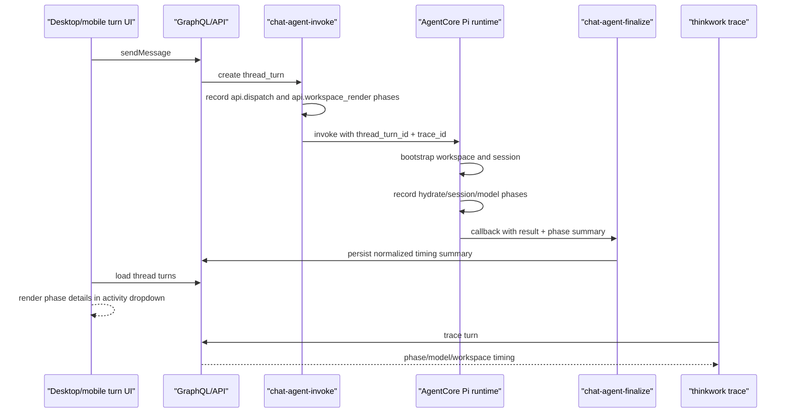

# feat: AgentCore latency observability and warm follow-up proof

## Overview

AgentCore-first Pi execution is now shipped across desktop and mobile, but the
user experience still feels slow on cold turns. A real desktop dev-app
regression showed the first AgentCore turn completing in 28s and a same-thread
follow-up completing in 10.5s. That confirms warm runtime behavior helps, but
the product still cannot reliably explain where the remaining time goes. The
next step is a focused observability and proof unit: make every AgentCore turn
self-diagnosing in the UI and CLI, prove whether workspace render/hydration is
being skipped on warm follow-ups, and record a small latency matrix before any
speed architecture changes.

This plan deliberately does not change the AgentCore-first architecture. It
extends the just-shipped AgentCore path so engineers and users can see the
dominant latency phase instead of guessing.

---

## Problem Frame

The previous plan required AgentCore turn latency to be measurable by phase
(R7), visible progress before completion (R8), durable session reuse where
possible (R9), and evidence before model routing or prewarm changes (R10-R12).
Implementation delivered the routing, instrumentation hooks, and warm hydrate
cache, but live verification exposed three gaps:

- The desktop UI shows an aggregate duration, e.g. `Worked for 10s`, but not
  the phase breakdown.
- `thinkwork trace turn <turnId>` currently returns a generic GraphQL error for
  recent chat turns, so the CLI cannot explain latency.
- CloudWatch searches did not find expected phase logs for the live follow-up,
  which means logs are either emitted to the wrong sink, missing the turn/session
  identifiers needed for lookup, or not wired into the resolver path.

The product question is no longer "should desktop/mobile run local Pi?" It is:
"when AgentCore is slow, can we tell whether it is API dispatch, workspace
render, runtime hydrate, model latency, finalize, subscription, or UI render?"

---

## Requirements Trace

- R1. Preserve AgentCore as the only Pi execution boundary for desktop and
  mobile.
- R2. A desktop or mobile user can expand a turn activity row and see meaningful
  timing details for the turn.
- R3. Operators can inspect a turn with the CLI and get phase/model/workspace
  timing without a generic GraphQL failure.
- R4. AgentCore Pi runtime emits bootstrap/hydrate metrics with enough identity
  to correlate logs to a thread turn.
- R5. Workspace render and runtime hydrate cache behavior is measurable:
  cache hit/miss, file counts, synced/skipped/deleted counts, and durations.
- R6. Warm follow-up proof compares cold-ish first turn and same-thread warm
  follow-up using the same agent, same thread, and deterministic prompts.
- R7. Browser and Code Interpreter remain lazy; observability must not start
  managed tools on ordinary no-tool turns.
- R8. This unit does not introduce prewarm, model routing, or two-stage answers;
  it only gathers reliable data for those decisions.

**Carried-forward origin constraints:** AgentCore remains the execution boundary
and future local execution remains out of scope (see origin:
`docs/plans/2026-06-02-001-refactor-agentcore-first-pi-execution-plan.md`).

---

## Scope Boundaries

- No return to local desktop or mobile Pi execution.
- No OpenShell, NemoClaw, MicroVM, Docker, Podman, or local sandbox work.
- No model routing or faster-model fallback in this unit.
- No AgentCore prewarm in this unit.
- No production mutation outside normal merge/deploy pipelines.
- No broad redesign of turn lifecycle storage.

### Deferred to Follow-Up Work

- Prewarm on desktop app open, thread open, or composer focus after phase data
  proves the cold path is worth the cost.
- Simple-turn faster-model routing after model latency is proven dominant.
- Deeper schema-level turn-to-message linkage if timestamp-based matching keeps
  misattributing turn rows in busy multi-user threads.

---

## Context & Research

### Relevant Code and Patterns

- `packages/api/src/handlers/chat-agent-invoke.ts` already emits
  `api.workspace_render` phase logs and passes `rendered_workspace_prefix` to
  the AgentCore payload.
- `packages/api/src/handlers/chat-agent-finalize.ts` completes thread turns and
  is the natural place to persist final phase summaries if runtime callback data
  includes them.
- `packages/agentcore-pi/agent-container/src/runtime/bootstrap-workspace.ts`
  already returns `synced`, `skipped`, `deleted`, `total`, and `prefix`, and
  uses local hydrate cache metadata to skip unchanged files on warm containers.
- `packages/agentcore-pi/agent-container/src/server.ts` calls
  `bootstrapWorkspace` and controls the runtime lifecycle around workspace
  bootstrap, session-store setup, agent loop, and finalize callback.
- `packages/api/src/graphql/resolvers/observability/turnInvocationLogs.query.ts`
  currently queries Bedrock model invocation logs by turn time window. It catches
  CloudWatch `ResourceNotFoundException`, but recent live calls returned a
  generic GraphQL error through the CLI, so coverage should exercise this
  resolver failure mode.
- `apps/cli/src/commands/turn.ts` correctly lists turn start/finish timing.
- `apps/cli/src/commands/trace.ts` already exposes `trace turn` and
  `trace thread`; the command should become useful for AgentCore chat turns.
- `apps/spaces/src/components/workbench/TaskThreadView.tsx` renders the
  expandable `Worked for ...` turn row and summarizes model/status/duration.
- `apps/spaces/src/components/workbench/SpacesThreadDetailRoute.tsx` maps
  backend thread-turn rows into `TaskThreadTurn` objects for the desktop/web
  transcript.

### Institutional Learnings

- `docs/solutions/diagnostics/eval-runner-stall-findings-2026-05-16.md`
  demonstrates a useful latency-study shape: gather phase durations, compare
  p50/p95-ish behavior, and avoid architectural guesses from single anecdotes.
- `docs/solutions/workflow-issues/agentcore-runtime-no-auto-repull-requires-explicit-update-2026-04-24.md`
  warns that AgentCore runtime image changes require explicit runtime update and
  verification; any runtime observability changes must be verified after deploy.
- `docs/plans/2026-06-02-001-refactor-agentcore-first-pi-execution-plan.md`
  records the U6 warm hydrate cache and the final live result: desktop first
  turn 28s, iOS E2E pass, and same-thread desktop follow-up 10.5s.

### External Research

Skipped. The work is scoped to existing repo observability surfaces, existing
CloudWatch/GraphQL/CLI patterns, and the already-shipped AgentCore runtime. The
codebase has direct local examples to follow; external research would not change
the implementation shape for this unit.

---

## Key Technical Decisions

- **Persist or expose normalized phase summaries instead of relying only on raw
  CloudWatch search.** CloudWatch remains useful, but the product needs stable
  turn-level details available to the UI and CLI.
- **Keep raw logs correlated by turn id and trace id.** Runtime logs must include
  `thread_turn_id`, `thread_id`, `trace_id`, and the phase name so operators can
  still investigate when the normalized summary is incomplete.
- **Treat workspace metrics as first-class turn metadata.** `synced`,
  `skipped`, `deleted`, `total`, prefix, cache status, and bootstrap duration
  are safe operational fields and directly answer whether rendered workspace
  copying is happening.
- **Use the existing turn activity row as the user-facing surface.** The UI
  already has the right affordance; this unit enriches it rather than adding a
  new diagnostics page.
- **Measure before optimizing.** A 10.5s warm follow-up is better than 28s, but
  the next optimization should be selected from phase data, not intuition.

---

## Open Questions

### Deferred to Implementation

- Whether phase summaries should be stored in `thread_turns.result_json`,
  `thread_turns.usage_json`, or a dedicated event/payload field. Prefer the
  smallest existing field that already reaches desktop/mobile without schema
  churn.
- Whether `turnInvocationLogs` should query an alternate log group, return
  partial empty results with diagnostics, or both.
- Whether AgentCore runtime logs are missing because the deployed runtime image
  lacks the latest logging code, because the log group name is wrong, or because
  identifiers are not included in the log lines.

---

## High-Level Technical Design

> This illustrates the intended approach and is directional guidance for
> review, not implementation specification.

---

## Implementation Units

### U1. Repair AgentCore Turn Trace Resolver and CLI Output

**Goal:** `thinkwork trace turn <turnId>` returns useful diagnostics for recent
AgentCore chat turns instead of a generic backend error.

**Requirements:** R3, R8.

**Dependencies:** None.

**Files:**

- Modify: `packages/api/src/graphql/resolvers/observability/turnInvocationLogs.query.ts`
- Modify: `apps/cli/src/commands/trace.ts`
- Test: `packages/api/src/graphql/resolvers/observability/turnInvocationLogs.test.ts`
- Test: `apps/cli/__tests__/trace.test.ts`

**Approach:**

- Add focused resolver coverage for CloudWatch failures, malformed log events,
  no-log windows, and successful Bedrock invocation log parsing.
- Ensure resolver errors become empty/diagnostic results rather than GraphQL
  "Unexpected error" responses.
- If no model logs are found, return a stable empty result with enough context
  for the CLI to say "no model logs found for this turn window" instead of
  failing.
- Keep sensitive previews out of default CLI output; preserve existing JSON mode
  for machine-readable inspection.

**Test Scenarios:**

- A turn with no CloudWatch events returns `[]` and the CLI exits 0.
- A CloudWatch access or resource failure is logged server-side and returned as
  an unavailable trace state, not a GraphQL error.
- A valid model invocation event renders request id, model, token counts,
  cache-read tokens, tool count, and cost.
- CLI table output is readable for empty and populated trace results.

**Verification:**

- `thinkwork trace turn <known-turn-id> --stage dev` exits 0 after deploy, even
  when no Bedrock invocation logs are found.

### U2. Persist AgentCore Phase and Workspace Hydration Summary

**Goal:** Every AgentCore chat turn captures normalized phase metrics that can
be shown without depending on ad hoc CloudWatch searches.

**Requirements:** R2, R4, R5, R6, R7, R8.

**Dependencies:** U1 can land independently, but this unit should reuse any
diagnostic result shape U1 introduces.

**Files:**

- Modify: `packages/api/src/handlers/chat-agent-invoke.ts`
- Modify: `packages/api/src/handlers/chat-agent-finalize.ts`
- Modify: `packages/agentcore-pi/agent-container/src/server.ts`
- Modify: `packages/agentcore-pi/agent-container/src/runtime/bootstrap-workspace.ts`
- Test: `packages/api/src/handlers/chat-agent-invoke.runtime-routing.test.ts`
- Test: `packages/api/src/handlers/chat-agent-finalize.test.ts`
- Test: `packages/agentcore-pi/agent-container/tests/bootstrap-workspace.test.ts`
- Test: `packages/agentcore-pi/agent-container/tests/server.test.ts`

**Approach:**

- Define a compact, stable phase summary shape for AgentCore turns:
  `api_dispatch`, `workspace_render`, `runtime_invoke`, `workspace_bootstrap`,
  `session_resume`, `agent_loop`, `finalize`, and `subscription_visible` where
  locally measurable.
- Add runtime bootstrap metrics to the finalize payload or another existing
  callback payload: `synced`, `skipped`, `deleted`, `total`, `prefix`,
  `durationMs`, and whether the hydrate cache was useful.
- Include `thread_turn_id`, `thread_id`, and `trace_id` in runtime phase logs so
  raw log search can correlate a live turn even if normalized persistence fails.
- Store the summary in an existing turn field that desktop/mobile already load,
  unless implementation proves a small GraphQL type addition is cleaner.
- Keep Browser and Code Interpreter lazy; ordinary no-tool turns should not show
  managed-tool startup phases.

**Test Scenarios:**

- Warm hydrate cache hit returns skipped file counts and persists them into the
  turn summary.
- Cold hydrate records synced file counts and duration.
- Missing or malformed phase data does not block finalization.
- Runtime logs include turn id and trace id on bootstrap/session/agent-loop
  phases.
- No-tool chat turns do not initialize Browser or Code Interpreter while
  recording normal phases.

**Verification:**

- A deployed same-thread follow-up shows whether workspace files were skipped or
  re-synced.

### U3. Render Turn Timing Details in Desktop Spaces

**Goal:** Expanding the `Worked for ...` row shows phase and workspace-cache
details so slow turns are self-diagnosing in the desktop/web client.

**Requirements:** R2, R5, R6.

**Dependencies:** U2.

**Files:**

- Modify: `apps/spaces/src/components/workbench/TaskThreadView.tsx`
- Modify: `apps/spaces/src/components/workbench/SpacesThreadDetailRoute.tsx`
- Test: `apps/spaces/src/components/workbench/TaskThreadView.test.tsx`
- Test: `apps/spaces/src/components/workbench/SpacesThreadDetailRoute.test.tsx`

**Approach:**

- Parse the persisted phase/workspace summary from the turn row's existing
  `usage_json`, `result_json`, or selected storage field.
- Add detail rows for phase durations and workspace hydrate counts.
- Preserve the existing compact summary line such as
  `Manual chat · moonshotai.kimi-k2.5 · succeeded · 10.5s`.
- Render missing phase data gracefully; old turns should still show the current
  aggregate summary.
- Keep the visual treatment dense and operational, not a new card-heavy panel.

**Test Scenarios:**

- Existing turns with no phase summary render unchanged.
- A completed AgentCore turn with phase summary shows phase rows and workspace
  cache counts when expanded.
- A running turn continues to live-update the aggregate elapsed time without
  layout shift.
- Long phase labels and counts do not overflow compact desktop widths.

**Verification:**

- Desktop dev app shows cold and warm follow-up phase details in the expanded
  turn activity row.

### U4. Warm Follow-Up Latency Proof and Status Update

**Goal:** Run and record a small latency matrix that proves what improved and
what remains slow after U1-U3.

**Requirements:** R6, R8.

**Dependencies:** U1-U3.

**Files:**

- Modify: `docs/plans/autopilot-status.md`
- Optionally create: `docs/solutions/diagnostics/agentcore-warm-followup-latency-2026-06-02.md`

**Approach:**

- Use local desktop dev app against the deployed dev stack and run at least:
  cold-ish first turn, immediate same-thread follow-up, follow-up after a short
  idle interval, and a no-space/default chat comparison when practical.
- Capture turn ids, start/finish times, aggregate durations, model name, phase
  durations, workspace render cache status, hydrate synced/skipped/deleted
  counts, and whether Browser/Code Interpreter stayed lazy.
- Record whether the phase data points to model latency, runtime bootstrap,
  workspace hydrate, finalize/subscription, or UI rendering as the next likely
  optimization target.

**Test Scenarios:**

- Same-thread follow-up produces a persisted phase summary and the UI renders
  it.
- CLI trace for the same turn exits 0 and matches the UI enough for operator
  confidence.
- If a phase is unavailable, the status doc records the exact missing field/log
  path as a follow-up bug rather than claiming success.

**Verification:**

- `docs/plans/autopilot-status.md` contains the U8 live proof with turn ids and
  timing evidence.

---

## Rollout and Verification

- Local focused verification should start with the touched API, AgentCore Pi,
  CLI, and Spaces test files.
- Broader verification before PR should include `pnpm lint`, `pnpm typecheck`,
  `bash scripts/verify-supply-chain.sh`, and `pnpm test` unless a documented
  local environment issue blocks a root gate.
- Live verification requires the normal merge/deploy pipeline before using the
  desktop dev app for deployed AgentCore timing proof.

---

## Risks and Mitigations

| Risk                                             | Impact                                | Mitigation                                                                                                                 |
| ------------------------------------------------ | ------------------------------------- | -------------------------------------------------------------------------------------------------------------------------- |
| Phase data lands in a field not loaded by Spaces | UI cannot show details                | Prefer existing loaded turn fields or update the thread-turn row query and tests in the same unit.                         |
| Runtime image changes do not reach AgentCore     | Live proof still lacks runtime phases | Record runtime version/update evidence and follow the AgentCore runtime explicit-update learning.                          |
| CloudWatch model logs are absent or delayed      | CLI trace cannot show model timing    | Return a stable unavailable state and rely on persisted runtime/API phases for non-model timing.                           |
| Phase logging leaks prompt content               | Security/privacy issue                | Log only phase names, counts, durations, ids, model names, and safe cache status; do not log prompt text or file contents. |
| Additional observability adds latency            | Worse user experience                 | Keep persistence compact and best-effort; do not block finalize on diagnostic write failures.                              |

---

## Acceptance Criteria

- `thinkwork trace turn <turnId> --stage dev` exits 0 for AgentCore chat turns.
- Desktop turn activity expansion shows aggregate duration plus phase/workspace
  details for new AgentCore turns.
- AgentCore runtime workspace bootstrap metrics include `synced`, `skipped`,
  `deleted`, `total`, `prefix`, and duration.
- A live same-thread follow-up proof records first-turn and warm-follow-up
  durations with enough data to identify the next optimization target.
- No local Pi execution path is reintroduced.
