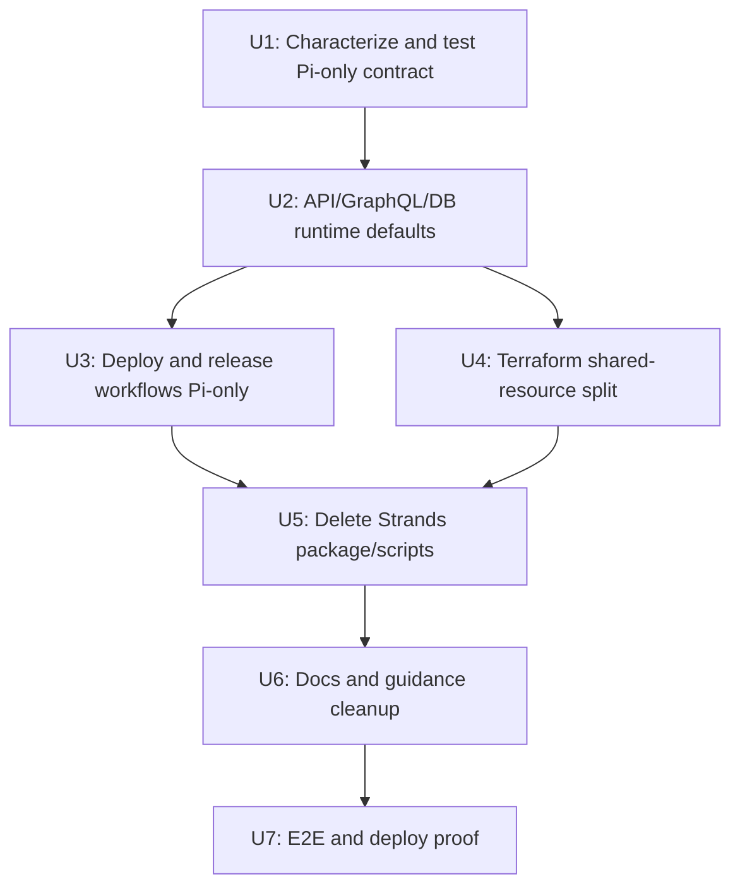

# refactor: Remove legacy Strands AgentCore runtime

## Overview

ThinkWork has moved desktop and mobile execution to AgentCore Pi. The remaining
legacy Strands runtime is now deployment noise and product ambiguity: the main
deploy summary still unconditionally verifies the old Strands AgentCore runtime,
then fails with `ListAgentRuntimes Forbidden`, making otherwise healthy deploys
look broken. This plan removes Strands as an active runtime, preserves Pi as the
only agent runtime identity, and keeps the AgentCore deployment protections that
still matter for Pi.

This is a follow-on to the AgentCore-first plan, not a change in direction.
Desktop and mobile remain clients, Pi remains the runtime identity, and AWS
AgentCore remains the execution boundary.

---

## Problem Frame

The current repo still treats Strands as first-class in several places even
after AgentCore Pi is the product path:

- `.github/workflows/deploy.yml` detects Strands source changes, builds Strands
  amd64 and arm64 images, updates the Strands Lambda/runtime, and verifies
  Strands in Deploy Summary.
- `.github/workflows/release.yml` publishes Strands release images and records
  them in the release manifest.
- `scripts/post-deploy.sh` defaults to `--runtime strands`, and
  `scripts/update-agentcore-runtime-image.sh` accepts and updates `strands`.
- `terraform/modules/app/agentcore-runtime` owns Strands Lambda/IAM/log/DLQ
  resources, but also owns shared resources Pi currently imports, especially the
  AgentCore ECR repository and async DLQ.
- Database and API defaults still normalize missing/unknown runtimes to
  `strands`, and GraphQL still exposes `AgentRuntime.STRANDS`.
- `packages/agentcore-strands` remains a large Python container package with
  tests, sandbox support, Hindsight/memory code, skill registration, and browser
  automation.
- Active docs and runbooks still say the Strands runtime is current.

The deploy failure is only the visible symptom. The durable fix is to retire the
legacy Strands runtime end to end instead of patching one failing verification
step.

---

## Requirements Trace

- R1. Main deploys must not verify, build, update, or require permissions for
  the legacy Strands AgentCore runtime.
- R2. Pi remains the only active agent runtime for desktop, mobile, wakeups,
  evals, and normal agent dispatch.
- R3. API and database defaults must fail or coerce safely toward Pi; no new
  agent/template/runtime config should default to Strands.
- R4. Terraform must preserve shared Pi dependencies while retiring
  Strands-specific Lambda, IAM, log, SSM, and runtime resources through the
  normal merge/deploy pipeline.
- R5. Release artifacts and supply-chain tests must stop publishing Strands
  runtime images.
- R6. Source cleanup must remove `packages/agentcore-strands` and stale Strands
  scripts/tests/docs without deleting Pi, AgentCore Browser, AgentCore Code
  Interpreter, AgentCore Memory, or shared `packages/agentcore` helpers that Pi
  still needs.
- R7. Deploy protections from prior learnings remain for Pi: source-SHA
  freshness checks, split amd64/arm64 tags, explicit `UpdateAgentRuntime`, and
  strict Pi post-deploy verification.
- R8. No manual production mutation is required; destructive resource removal
  happens only through Terraform/deploy after code review.

**Carried-forward origin constraints:** AgentCore is the execution boundary,
Pi is the runtime identity, local execution stays removed, and runtime image
changes must still call `UpdateAgentRuntime` (see origin:
`docs/plans/2026-06-02-001-refactor-agentcore-first-pi-execution-plan.md`).

---

## Scope Boundaries

### In Scope

- Retire the legacy Strands runtime and container package:
  `packages/agentcore-strands`.
- Remove Strands runtime build/update/verify/release paths from GitHub Actions.
- Make Pi the default/only active runtime in API dispatch, GraphQL runtime
  parsing, and database schema/migrations.
- Move or rename shared Terraform resources so Pi does not depend on a module
  whose identity is "Strands runtime".
- Update tests, generated GraphQL clients, docs, AGENTS guidance, and runbooks
  that describe Strands as active.

### Out of Scope

- Removing AgentCore itself.
- Removing AgentCore Pi, Browser, Code Interpreter, Memory, Observability, or
  the Pi container.
- Removing `packages/agentcore` until implementation proves a file is truly
  Strands-only. It contains shared Python helpers, tenant-router/auth-agent
  scripts, and historical runtime tooling that need inventory before deletion.
- Changing the desktop/mobile AgentCore-first behavior already verified.
- Adding new latency optimizations beyond preserving Pi deploy correctness.
- Manual AWS deletes outside the normal Terraform/deploy pipeline.

---

## Context & Research

### Relevant Code and Patterns

- `.github/workflows/deploy.yml` currently emits
  `strands_container_source_sha`, checks `/thinkwork/<stage>/agentcore/runtime-id-strands`,
  builds `packages/agentcore-strands/agent-container/Dockerfile`, updates the
  Strands Lambda/runtime, and verifies Strands in Deploy Summary.
- `.github/workflows/release.yml` builds
  `agentcore-strands-amd64` and `agentcore-strands-arm64` release images.
- `scripts/post-deploy.sh` defaults to `RUNTIME="strands"` and validates
  `strands|pi`.
- `scripts/update-agentcore-runtime-image.sh` updates both runtime types and
  chooses `thinkwork-<stage>-agentcore-role` for Strands.
- `terraform/modules/app/agentcore-runtime/main.tf` is named as the Strands
  runtime module, but owns the shared ECR repository and shared async DLQ used
  by `terraform/modules/app/agentcore-pi/main.tf`.
- `terraform/modules/thinkwork/main.tf` instantiates `module "agentcore"` from
  `../app/agentcore-runtime` and passes its `ecr_repository_url` and
  `agentcore_async_dlq_arn` to `module "agentcore_pi"`.
- `packages/api/src/lib/resolve-runtime-function-name.ts` declares
  `AgentRuntimeType = "strands" | "pi"` and normalizes everything except
  `pi/flue` to `strands`.
- `packages/api/src/graphql/resolvers/tenant-agent/runtime.ts` parses missing
  runtime input as `strands` and serializes `strands` as `STRANDS`.
- `packages/database-pg/src/schema/agents.ts` and
  `packages/database-pg/src/schema/agent-templates.ts` default runtime to
  `strands`.
- `packages/database-pg/graphql/types/agents.graphql` exposes
  `enum AgentRuntime { STRANDS FLUE }`; `FLUE` currently maps to Pi.
- `packages/api/src/handlers/chat-agent-invoke.ts`,
  `packages/api/src/handlers/wakeup-processor.ts`,
  `packages/api/src/graphql/utils.ts`, and eval scripts all still contain
  Strands routing assumptions or defaults.
- `.github/workflows/verify.yml` still labels the computer thread streaming
  smoke as a Python Strands path.
- `scripts/lint-agentcore-iam.mjs` lints Strands Python source against
  `terraform/modules/app/agentcore-runtime/main.tf`.

### Institutional Learnings

- `docs/solutions/workflow-issues/agentcore-runtime-no-auto-repull-requires-explicit-update-2026-04-24.md`
  says AgentCore Runtime does not auto-repull updated ECR images. Pi must keep
  explicit `UpdateAgentRuntime` plus source-image freshness verification.
- `docs/solutions/build-errors/multi-arch-image-lambda-vs-agentcore-split-tags-2026-04-24.md`
  says Lambda and AgentCore require different image architectures and tag
  shapes. Pi must keep separate amd64 Lambda and arm64 AgentCore tags.
- `docs/solutions/diagnostics/agentcore-warm-followup-latency-2026-06-02.md`
  confirms the current product concern is Pi AgentCore latency/diagnostics, not
  Strands behavior.
- `docs/plans/2026-06-02-001-refactor-agentcore-first-pi-execution-plan.md`
  establishes AgentCore-first Pi execution and rejects multiple execution
  substrates.

### External Research

Skipped. The issue is inside repo-local CI, Terraform, API defaults, and runtime
packaging. Existing institutional docs already capture the AgentCore deployment
constraints that matter.

---

## Key Technical Decisions

- **Retire Strands as runtime, not just as a deploy check.** Patching Deploy
  Summary would make CI green while leaving defaults and release images pointing
  at an obsolete runtime.
- **Pi is the default and only active runtime.** Unknown, null, or legacy
  `flue`/`strands` values should resolve to Pi after a guarded migration and
  compatibility window.
- **Move shared Terraform resources before deleting Strands resources.** ECR and
  async DLQ should live in a neutral AgentCore platform module or directly in
  the Pi module; otherwise removing the Strands module would break Pi or destroy
  shared resources unintentionally.
- **Keep `STRANDS` compatibility only where needed for old clients/data.**
  GraphQL input may accept `STRANDS` for one release and coerce it to Pi, but
  active UI/docs should stop offering it.
- **Do not remove `packages/agentcore` wholesale in the first pass.** It is not
  the same as `packages/agentcore-strands`. Inventory each file and delete only
  confirmed Strands-only helpers/scripts.
- **Use characterization tests before deletion.** Runtime-routing and workflow
  contract tests should lock in Pi-only behavior before large source removal.

---

## Open Questions

### Resolved During Planning

- Should this preserve Strands as a disabled fallback? **No.** The product goal
  is one execution substrate and one enterprise security story.
- Should AgentCore Pi deploy verification remain? **Yes.** Removing Strands
  should not weaken Pi source-SHA freshness or runtime update checks.
- Should Terraform deletion be manual? **No.** Resource retirement happens
  through reviewed Terraform changes and the normal pipeline.
- Should `packages/agentcore` be removed with `packages/agentcore-strands`?
  **Not automatically.** It must be inventoried because it contains shared or
  separately scoped AgentCore utilities.

### Deferred to Implementation

- Whether current deployed data contains `agents.runtime = 'strands'` or
  `agent_templates.runtime = 'strands'`, and whether the migration should
  snapshot counts into an operator log before coercing to `pi`.
- Whether Terraform state moves can preserve ECR/DLQ addresses cleanly or
  whether a carefully sequenced replacement resource is simpler.
- Whether old generated GraphQL clients need a one-release `STRANDS` input
  compatibility path before the enum is removed from public schema.

---

## Implementation Units

### U1. Characterize Strands Usage And Data Safety

**Goal:** Produce a precise deletion map and lock in the active Pi-only runtime
contract before removing code.

**Files / areas:**

- `.github/workflows/deploy.yml`
- `.github/workflows/release.yml`
- `.github/workflows/verify.yml`
- `scripts/post-deploy.sh`
- `scripts/update-agentcore-runtime-image.sh`
- `scripts/lint-agentcore-iam.mjs`
- `packages/api/src/lib/resolve-runtime-function-name.ts`
- `packages/api/src/lib/resolve-agent-runtime-config.ts`
- `packages/api/src/graphql/resolvers/tenant-agent/runtime.ts`
- `packages/api/src/handlers/chat-agent-invoke.ts`
- `packages/api/src/handlers/wakeup-processor.ts`
- `packages/database-pg/src/schema/agents.ts`
- `packages/database-pg/src/schema/agent-templates.ts`
- `packages/database-pg/graphql/types/agents.graphql`
- `terraform/modules/app/agentcore-runtime/main.tf`
- `terraform/modules/app/agentcore-pi/main.tf`
- `terraform/modules/thinkwork/main.tf`
- `packages/agentcore-strands/**`
- `packages/agentcore/**`

**Approach:**

- Add or update focused tests that describe the intended Pi-only behavior:
  runtime normalization, GraphQL runtime parsing, function-name resolution, and
  chat/wakeup dispatch.
- Inventory all Strands references and classify each as delete, rename to Pi,
  compatibility-only, historical doc, or shared AgentCore utility.
- Confirm which Terraform outputs/resources are shared by Pi before changing
  module ownership.

**Tests / verification:**

- `packages/api/src/lib/__tests__/resolve-runtime-function-name.test.ts`
- `packages/api/src/lib/__tests__/resolve-agent-runtime-config.test.ts`
- `packages/api/src/graphql/resolvers/tenant-agent/runtime.test.ts`
- `packages/api/src/handlers/chat-agent-invoke.runtime-routing.test.ts`
- `packages/api/src/handlers/wakeup-processor.test.ts` if existing; otherwise
  add a focused runtime-routing test near the handler.

**Acceptance scenarios:**

- Null, unknown, `flue`, and legacy `strands` runtime values no longer select a
  Strands function for new dispatch.
- Existing tests prove chat and wakeup dispatch select Pi.
- The implementation branch has an explicit list of files that will be deleted
  versus preserved.

---

### U2. Make API, GraphQL, And Database Runtime Defaults Pi-Only

**Goal:** Stop creating or resolving active Strands runtime configuration.

**Files / areas:**

- `packages/api/src/lib/resolve-runtime-function-name.ts`
- `packages/api/src/lib/resolve-agent-runtime-config.ts`
- `packages/api/src/graphql/resolvers/tenant-agent/runtime.ts`
- `packages/api/src/graphql/utils.ts`
- `packages/api/src/handlers/chat-agent-invoke.ts`
- `packages/api/src/handlers/wakeup-processor.ts`
- `packages/api/scripts/eval-stall-probe.ts`
- `packages/database-pg/src/schema/agents.ts`
- `packages/database-pg/src/schema/agent-templates.ts`
- `packages/database-pg/graphql/types/agents.graphql`
- New migration under `packages/database-pg/drizzle/`
- Generated clients in `apps/admin/src/gql/`, `apps/mobile/lib/gql/`, and
  `apps/spaces/src/gql/`.

**Approach:**

- Change runtime normalization so Pi is the safe default.
- Update GraphQL runtime parsing so `FLUE` and any temporary `STRANDS` input
  compat map to Pi; remove active UI offering for Strands.
- Change Drizzle defaults from `strands` to `pi`.
- Add a migration that backfills `agents.runtime` and
  `agent_templates.runtime` from `strands`/`flue` to `pi`, then tightens CHECK
  constraints to Pi-only if compatibility permits. If generated clients still
  need `STRANDS` for one release, keep the schema enum temporarily but map it
  to Pi and document the removal target.
- Regenerate GraphQL schemas/codegen in all consumers that own generated types.

**Tests / verification:**

- `packages/api/src/lib/__tests__/resolve-runtime-function-name.test.ts`
- `packages/api/src/lib/__tests__/resolve-agent-runtime-config.test.ts`
- `packages/api/src/graphql/resolvers/tenant-agent/runtime.test.ts`
- `packages/api/src/graphql/resolvers/tenant-agent/updateTenantAgent.mutation.test.ts`
- `packages/database-pg/__tests__/*runtime*.test.ts` or a new migration text
  test that asserts Pi-only defaults/constraints.
- Codegen scripts for `packages/api`, `apps/admin`, `apps/mobile`, and
  `apps/spaces`.

**Acceptance scenarios:**

- Creating or updating an agent without a runtime stores/resolves Pi.
- Existing rows with legacy Strands runtime are backfilled or coerced to Pi.
- No dispatch path attempts `AGENTCORE_FUNCTION_NAME` for Strands.
- Admin/Spaces/mobile generated enums no longer make Strands look like the
  preferred runtime.

---

### U3. Make Deploy And Release Workflows Pi-Only

**Goal:** Remove the false-red deploy path and publish only active Pi runtime
artifacts.

**Files / areas:**

- `.github/workflows/deploy.yml`
- `.github/workflows/release.yml`
- `.github/workflows/verify.yml`
- `scripts/post-deploy.sh`
- `scripts/post-deploy.test.sh`
- `scripts/update-agentcore-runtime-image.sh`
- `scripts/release/build-release-manifest.ts`
- `scripts/release/__tests__/build-release-manifest.test.ts`
- `scripts/supply-chain-baseline.txt`

**Approach:**

- Remove `strands_container_source_sha`; compute only Pi container source SHA
  from Pi and shared Pi dependencies.
- Remove Strands from the container path filter.
- Remove Strands image build steps, Lambda update, runtime update, stale-image
  checks, and Deploy Summary verification.
- Keep Pi amd64 and Pi arm64 builds, Pi Lambda update, Pi
  `UpdateAgentRuntime`, Pi stale-image detection, and Pi strict post-deploy
  verification.
- Change `scripts/post-deploy.sh` default runtime to Pi or require
  `--runtime pi` explicitly. Reject `--runtime strands`.
- Change `scripts/update-agentcore-runtime-image.sh` to Pi-only or to reject
  Strands with a retirement message.
- Remove Strands release image builds and release manifest entries/tests.
- Rename verify workflow comments that call the product path "Python Strands"
  if the smoke now targets Pi/Spaces behavior.

**Tests / verification:**

- `scripts/post-deploy.test.sh`
- `scripts/release/__tests__/build-release-manifest.test.ts`
- `pnpm test -- scripts/release/__tests__/build-release-manifest.test.ts`
  or the repo's equivalent script runner.
- `git diff --check`.

**Acceptance scenarios:**

- A frontend-only deploy summary no longer calls
  `scripts/post-deploy.sh --runtime strands`.
- A Pi container change still forces a Pi image build and explicit
  `UpdateAgentRuntime`.
- A docs/frontend-only change can leave `build-container` skipped without
  failing on Strands permissions.
- Release manifests include Pi runtime images and no Strands runtime images.

---

### U4. Move Shared Terraform Resources Out Of The Strands Module

**Goal:** Preserve Pi infrastructure while retiring Strands-specific resources.

**Files / areas:**

- `terraform/modules/app/agentcore-runtime/main.tf`
- `terraform/modules/app/agentcore-pi/main.tf`
- `terraform/modules/app/agentcore-pi/variables.tf`
- `terraform/modules/app/agentcore-pi/outputs.tf`
- New or renamed neutral module under `terraform/modules/app/agentcore-platform/`
  if needed.
- `terraform/modules/thinkwork/main.tf`
- `terraform/modules/thinkwork/outputs.tf`
- `terraform/modules/thinkwork/variables.tf`
- `terraform/examples/greenfield/main.tf`
- `terraform/examples/greenfield/terraform.tfvars.example` if present.
- `terraform/modules/app/lambda-api/handlers.tf`

**Approach:**

- Move the shared ECR repository and async DLQ from
  `terraform/modules/app/agentcore-runtime` into a neutral AgentCore platform
  module or directly into the Pi module.
- Use Terraform `moved {}` blocks where possible to preserve ECR/DLQ state.
- Remove Strands Lambda function, Strands IAM role/policy, Strands log group,
  Strands event-invoke config, Strands SSM runtime id wiring, and Nova Act
  parameter descriptions that exist only for the old Strands browser tool.
- Keep or relocate shared permissions Pi still needs: S3, Bedrock, AgentCore
  Browser, Code Interpreter, Memory, X-Ray/logs, RDS Data API, Secrets Manager,
  and service-auth API access.
- Remove `AGENTCORE_RUNTIME_SSM_STRANDS` and old Strands function env wiring
  from Lambda/API config once dispatch is Pi-only.

**Tests / verification:**

- `terraform -chdir=terraform/examples/greenfield fmt -recursive`
- `terraform -chdir=terraform/examples/greenfield init`
- `terraform -chdir=terraform/examples/greenfield validate`
- Any existing Terraform snapshot/text tests if present.
- `scripts/lint-agentcore-iam.mjs` updated or replaced to lint Pi's role
  instead of the retired Strands module.

**Acceptance scenarios:**

- Terraform no longer declares Strands Lambda/IAM/log resources as active
  runtime infrastructure.
- Pi still has an ECR repository, async DLQ, role, Lambda, runtime id, and
  required runtime permissions.
- Terraform plan does not attempt to destroy shared Pi dependencies as a side
  effect of deleting Strands.

---

### U5. Delete Strands Container Source And Retire Strands-Only Scripts

**Goal:** Remove the large obsolete Strands code surface from the repo.

**Files / areas:**

- `packages/agentcore-strands/**`
- `pyproject.toml`
- `packages/agentcore/scripts/build-and-push.sh`
- `packages/agentcore/scripts/create-runtime.sh`
- `packages/agentcore/agent-container/**` after U1 classification.
- `terraform/modules/app/agentcore-code-interpreter/Dockerfile.sandbox-base`
- `terraform/modules/app/agentcore-code-interpreter/README.md`
- `scripts/lint-agentcore-iam.mjs`
- Any imports/comments in `packages/agentcore-pi/**`, `packages/pi-extensions/**`,
  and `packages/pi-runtime-core/**` that point at Strands as the source of truth.

**Approach:**

- Delete `packages/agentcore-strands` after U2-U4 prove no active runtime path
  imports it.
- Remove it from the uv workspace in `pyproject.toml`.
- Replace Strands-colocated sandbox helper placement if
  `agentcore-code-interpreter` still needs `sitecustomize.py`; move that helper
  to a neutral path before deletion.
- Remove Strands modes from `packages/agentcore/scripts/*` or delete those
  scripts if no longer used.
- Rewrite Pi comments that say "mirrors Strands" to point at the active Pi or
  shared package source.

**Tests / verification:**

- `uv run pytest packages/agentcore/ packages/agentcore-pi/` if Python tests
  remain relevant after deletion.
- `pnpm --filter @thinkwork/agentcore-pi test`
- `pnpm --filter @thinkwork/pi-runtime-core test`
- `pnpm --filter @thinkwork/pi-extensions test`
- `rg -n "packages/agentcore-strands|agentcore-strands|runtime-id-strands"`
  finds no active code references.

**Acceptance scenarios:**

- The repo no longer contains the Strands container package.
- Pi tests still pass.
- Code Interpreter sandbox helper files live in a neutral or Pi-owned path.
- Remaining `strands` text is historical documentation only, not active code.

---

### U6. Clean Up Docs, Runbooks, AGENTS Guidance, And Product Language

**Goal:** Make active documentation match the Pi-only AgentCore architecture.

**Files / areas:**

- `AGENTS.md`
- `docs/src/content/docs/**`
- `docs/runbooks/**`
- `docs/solutions/**` only when a doc is active guidance rather than historical
  learning.
- `terraform/modules/app/agentcore-memory/README.md`
- `terraform/modules/app/agentcore-code-interpreter/README.md`
- `packages/agentcore-pi/README.md`
- `packages/api/src/lib/skill-md-parser.ts` comments if needed.

**Approach:**

- Update repo guidance: Python Strands runtime is retired; Pi AgentCore is the
  active runtime.
- Mark old Strands runbooks as historical/superseded or remove them if they no
  longer correspond to any active component.
- Update compliance docs that describe a Strands-specific emit path to describe
  current Pi/API emit behavior or explicitly archive the Strands section.
- Keep historical `docs/solutions` entries intact unless they are presented as
  active operational instructions; add a short superseded note where useful.

**Tests / verification:**

- `pnpm --filter @thinkwork/docs build`
- `rg -n "Strands|strands|agentcore-strands|runtime-id-strands" AGENTS.md docs`
  reviewed so remaining hits are historical/superseded only.

**Acceptance scenarios:**

- AGENTS.md no longer tells agents that `packages/agentcore-strands` is the
  current runtime.
- Operator docs no longer ask deployers to verify or flush Strands.
- Enterprise-facing docs retain the one-sentence AgentCore isolation story.

---

### U7. End-To-End Verification And Deployment Proof

**Goal:** Prove the cleanup fixed deploy status without regressing Pi desktop
or mobile behavior.

**Files / areas:**

- `.github/workflows/deploy.yml`
- `.github/workflows/verify.yml`
- `docs/plans/autopilot-status.md` or the active status doc for execution.

**Approach:**

- Run focused local tests first, then broader monorepo checks.
- Open one PR for the unit set only if the implementation is tightly coupled;
  otherwise split by data/API, workflow, Terraform, and source/docs removal.
- After merge, wait for the main deploy run to complete and confirm Deploy
  Summary verifies Pi only.
- Run local desktop Electron app against dev and create a new AgentCore-backed
  thread plus a follow-up.
- Run iOS simulator smoke for new-thread and follow-up if mobile code or
  generated GraphQL changed.
- Trigger verify workflow smokes if credentials and workflow permissions allow.

**Tests / verification:**

- `pnpm -r --if-present typecheck`
- `pnpm -r --if-present test`
- `pnpm -r --if-present lint`
- `pnpm format:check`
- `terraform -chdir=terraform/examples/greenfield validate`
- Local desktop Electron E2E: new thread, then follow-up, both through
  AgentCore Pi.
- iOS simulator E2E: new thread, then follow-up, both through AgentCore Pi.
- Main deploy run: Deploy Summary green, no Strands verification call.

**Acceptance scenarios:**

- Main deploy is green for a PR that does not touch AgentCore container code.
- Pi container changes still rebuild/update/verify the Pi AgentCore runtime.
- Desktop and mobile still complete managed AgentCore turns.
- Searches for active Strands code paths are clean.

---

## Suggested Sequencing

U2 should land before deleting source so runtime dispatch cannot fall back to a
missing Strands function. U4 should land before deleting the old Terraform
module because Pi currently imports shared resources from it. U3 can land early
if the immediate deploy red must be fixed quickly, but the full retirement is
not complete until U2, U4, and U5 are done.

---

## Risk Analysis & Mitigation

| Risk                                                                             | Likelihood | Impact | Mitigation                                                                                        |
| -------------------------------------------------------------------------------- | ---------- | ------ | ------------------------------------------------------------------------------------------------- |
| Removing the Strands Terraform module destroys shared ECR/DLQ resources Pi needs | Medium     | High   | U4 moves shared resources first and uses Terraform state moves where possible                     |
| Existing rows still contain `runtime = 'strands'`                                | High       | High   | U2 backfills/coerces to Pi before dispatch-source deletion                                        |
| Old generated clients still send `STRANDS`                                       | Medium     | Medium | Keep temporary parser compatibility mapping to Pi while removing active UI options                |
| Pi runtime image freshness check is weakened                                     | Low        | High   | U3 preserves Pi source-SHA, split tags, `UpdateAgentRuntime`, and strict post-deploy verification |
| `packages/agentcore` contains shared code mistakenly deleted as "Strands stuff"  | Medium     | Medium | U1 classifies it separately; U5 deletes only confirmed Strands-only files                         |
| Terraform removes Strands resources before deploy IAM/env is updated             | Medium     | Medium | Sequence U2/U3/U4 and use normal PR/deploy pipeline, not manual deletes                           |
| Docs retain confusing Strands guidance                                           | High       | Medium | U6 searches active docs and marks historical docs as superseded where needed                      |

---

## Success Metrics

- Main deploy summary no longer fails because it tries to inspect Strands.
- Deploy Summary verifies Pi only and passes on frontend/docs-only deploys.
- `rg -n "agentcore-strands|runtime-id-strands|--runtime strands"` finds no
  active code or workflow paths.
- `agents.runtime` and `agent_templates.runtime` default to Pi, and legacy rows
  are migrated or safely coerced.
- Release manifest contains Pi runtime images and no Strands runtime images.
- Desktop and iOS simulator E2E still complete a new thread and follow-up
  through AgentCore Pi.
- AGENTS.md and active docs describe Pi AgentCore as the runtime; Strands
  appears only in historical learning docs.

---

## Documentation / Operational Notes

- This cleanup will likely remove AWS resources managed by Terraform. That is
  expected, but only through reviewed Terraform changes and the normal deploy
  pipeline.
- If a stage still has a Strands AgentCore runtime in AWS after Terraform
  removes code references, treat it as retired/orphaned infrastructure and
  handle deletion through an explicit operator runbook or Terraform import/state
  reconciliation. Do not add new deploy checks for it.
- Any future Strands resurrection requires a fresh requirements document; it
  should not return as a hidden fallback.

---

## Sources & References

- **Origin plan:** `docs/plans/2026-06-02-001-refactor-agentcore-first-pi-execution-plan.md`
- **Latency follow-up plan:** `docs/plans/2026-06-02-002-feat-agentcore-latency-observability-plan.md`
- **AgentCore-first requirements:** `docs/brainstorms/2026-06-01-agentcore-first-pi-execution-requirements.md`
- **AgentCore runtime image learning:** `docs/solutions/workflow-issues/agentcore-runtime-no-auto-repull-requires-explicit-update-2026-04-24.md`
- **Image architecture learning:** `docs/solutions/build-errors/multi-arch-image-lambda-vs-agentcore-split-tags-2026-04-24.md`
- **Warm follow-up diagnostics:** `docs/solutions/diagnostics/agentcore-warm-followup-latency-2026-06-02.md`
