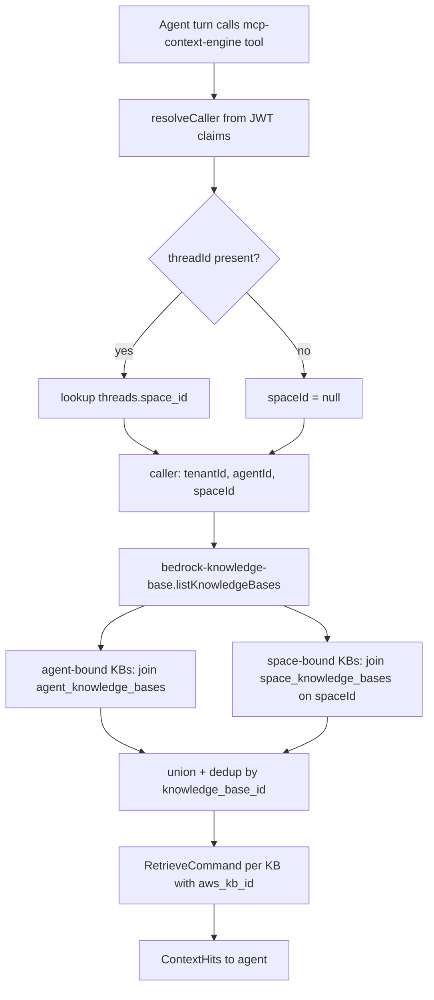
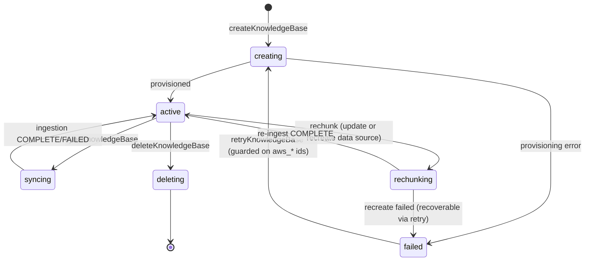

# feat: Knowledge Bases operator console in Spaces + close binding/provider gaps

## Summary

Bring operator-grade Knowledge Base management into Spaces settings (create, upload, add-docs-later, sync, delete, re-chunk, test-retrieval, binding), close the context-provider gap so per-Space KB bindings actually reach the agent, add recovery for failed KBs, and retire the admin KB page. Two tracks: a frontend port mirroring the Artifacts admin→Spaces migration, and an independent backend track for the genuinely net-new work.

---

## Problem Frame

`apps/admin` is being deprecated and `apps/spaces` is the single operator console, but the Spaces KB settings view (`apps/spaces/src/routes/_authed/settings.knowledge-bases.tsx` → `SettingsKnowledgeBases`) is a read-only summary table with no row-click navigation and no management. Admin has the full lifecycle; Spaces has none of it. Three things compound into "KBs feel broken": clicking a KB in settings does nothing (no detail route wired), a failed KB is a permanent dead end (create is fire-and-forget, flips `status=failed` asynchronously with no retry), and per-Space binding is silent theater (`space_knowledge_bases` has a full write path but the context provider only reads `agent_knowledge_bases`).

KBs are being positioned as a key feature of the ThinkWork Context system, so a KB an operator can't manage, recover, trust to reach the agent, or inspect is not yet that feature. See origin: `docs/brainstorms/2026-06-03-knowledge-bases-admin-to-spaces-requirements.md`.

---

## Requirements

Carried from origin (R-IDs preserved). Grouped by capability.

### Console parity (operator management in Spaces settings)

- R1. From `/settings/knowledge-bases`, an operator can create a new KB (name, description, chunking config) without leaving Spaces.
- R2. The operator KB list navigates on row-click to a management-capable detail surface.
- R3. The detail surface lets an operator upload documents, add more documents later, and delete individual documents.
- R4. The detail surface lets an operator trigger a sync and shows live status while syncing, including document count and last-sync result.
- R5. The detail surface lets an operator delete a KB with the same teardown admin performs (Bedrock KB, data source, S3 documents, DB rows).
- R6. The detail surface shows KB configuration (embedding model, chunking, status, last sync) and any error message.
- R7. All management actions in R1–R6 are operator-gated; non-operators cannot reach them.

### Refinement (beyond admin parity)

- R8. An operator can change a KB's chunking config, which triggers a full re-ingest of all documents; the UI makes clear this reprocesses everything.
- R9. An operator can run a test query against a KB and see the ranked results the agent would retrieve — snippet, relevance score, source document — without involving a chat thread.

### Failure recovery

- R10. A KB that failed to provision surfaces the underlying failure reason in plain terms.
- R11. An operator can retry/recreate a failed or stuck KB; retry is idempotent and does not orphan partially-provisioned Bedrock resources.
- R12. Provisioning failure on create is surfaced to the initiating operator at create time, not only via a later asynchronous status flip.

### Binding (both scopes, both wired)

- R13. An operator can bind/unbind a KB tenant-wide (every Space's threads retrieve it).
- R14. An operator can bind/unbind a KB per-Space (only that Space's threads retrieve it).
- R15. The agent context provider retrieves from both tenant-wide (agent-bound) and the thread's Space (space-bound) KBs in a single turn.
- R16. A KB bound at both scopes contributes its hits once, not twice.

### Migration

- R17. The admin KB list and detail routes are removed once R1–R16 are in place; no operator KB capability is lost.

---

## Key Technical Decisions

- KTD1. **Frontend port mirrors the Artifacts admin→Spaces plan and the MCP Servers list→detail pattern.** Rename the flat `settings.knowledge-bases.tsx` into `settings.knowledge-bases.index.tsx` + add `settings.knowledge-bases.$kbId.tsx`, both `<OperatorGuard>`-wrapped, mirroring `apps/spaces/src/routes/_authed/settings.mcp-servers.{index,$serverId}.tsx`. Two-layer operator gating: `operatorOnly: true` nav flag (already registered in `settings-nav.tsx`) plus `OperatorGuard` route wrap. (see origin; sibling plan `docs/plans/2026-06-03-001-feat-artifacts-spaces-operator-port-plan.md`)

- KTD2. **Typed `graphql()` documents, not the legacy `gql` tag.** Author KB ops in a new codegen-included `apps/spaces/src/lib/kb-queries.ts` using the `graphql()` helper (the `settings-queries.ts` style), never in `apps/spaces/src/lib/graphql-queries.ts` (the one file codegen excludes). All needed mutations already exist in the canonical schema; no schema change for create/sync/delete/setSpaceKnowledgeBases — just regenerate with `pnpm --filter @thinkwork/spaces codegen`.

- KTD3. **Close the provider gap end-to-end — identity plumbing first, then the union.** The provider can only retrieve space-bound KBs if the thread's Space identity actually reaches it, and today it does not: the `query_context` tool schema, `ContextEngineCaller` (`packages/api/src/lib/context-engine/types.ts`), and `resolveCaller` (`packages/api/src/handlers/mcp-context-engine.ts`) carry only `tenantId`/`userId`/`agentId` — no `threadId`/`spaceId`. So this is a plumbing task across the runtime, not a single column lookup. **Preferred path:** resolve `spaceId` at the Pi runtime (it already snapshots `threadId` in handler-context) and pass it on each `query_context` call, skipping a DB lookup; **fallback:** pass `threadId` and resolve `threads.space_id` in the handler. Either way, add the field to the tool schema, `ContextEngineCaller`, and the runtime call sites (`packages/pi-extensions/src/context-engine.ts`, `packages/agentcore-pi/agent-container/src/server.ts`), then extend `listKnowledgeBases` to union `space_knowledge_bases` with the agent-scoped set **deduped by `knowledge_base_id`**. The space lookup MUST filter `spaces.tenant_id = caller.tenantId` so a crafted thread can't pull another tenant's bindings.

- KTD4. **Tightening the no-agent fallback is an intentional behavior change that needs a migration audit.** Today `listKnowledgeBases` returns *all* tenant KBs when no `agentId` is present; the new default is space-scoped ∪ agent-scoped. This silently drops KBs for two cases that must be checked **before** U7 ships: (a) existing tenants whose KBs are retrieved today only via the broad fallback (no agent binding, no space binding) — audit and either backfill a tenant-wide binding or surface them in the console as "unbound — will stop retrieving"; (b) non-agent service callers of `query_context` (enrichment, kb-promotion, brain) — enumerate them and confirm none expect tenant-wide retrieval, or gate the broad behavior behind an explicit tenant-wide scope flag. Correct under single-agent-per-tenant for the common path, but "intentional" is not "verified."

- KTD5. **Re-chunk prefers in-place data-source update; delete+recreate is the guarded fallback.** The installed `@aws-sdk/client-bedrock-agent` exposes `UpdateDataSourceCommand`; if it accepts a changed `chunkingConfiguration`, update in place and re-ingest with no retrieval gap. If chunking is immutable on update, fall back to delete+recreate — but that path must be a guarded state machine: null `aws_data_source_id` and set `status` to a distinct `rechunking` immediately after a successful `DeleteDataSourceCommand`, so a failed recreate lands in a recoverable state and the provider never queries a dangling data source (`bedrock-knowledge-base.ts` guards only on `aws_kb_id`, so a stale `aws_data_source_id` would silently return zero hits). Extend `UpdateKnowledgeBaseInput` + `updateKnowledgeBase.mutation.ts` to carry chunking fields and add a `rechunk` action — including the `rechunk` case to the manager's `KbManagerEvent.action` union and dispatch switch.

- KTD6. **Idempotent retry requires rewriting `handleCreate` into resumable steps — the guards don't exist yet.** Today `handleCreate` is a single linear `try` block that calls `CreateKnowledgeBaseCommand` then `CreateDataSourceCommand` unconditionally and persists `aws_kb_id` + `aws_data_source_id` together in one trailing UPDATE — so a retry after a partial success creates a *second* Bedrock KB (the orphan AE4 forbids). The rewrite: read the row first; persist `aws_kb_id` immediately after KB-create (before data-source create); skip `CreateKnowledgeBaseCommand` when `aws_kb_id` is set and `CreateDataSourceCommand` when `aws_data_source_id` is set; null-guard the returned data-source id and keep `status` `creating`/`failed` (never `active`) when it is missing. `createVectorTable` is already `CREATE TABLE IF NOT EXISTS` (idempotent at the pgvector layer), but Bedrock `CreateKnowledgeBase` is *not* — that's where the guard matters. A `retryKnowledgeBase` mutation re-invokes this path **only when `status === "failed"`**; async re-invokes set `MaximumRetryAttempts=0` + DLQ. (see learning: `project_async_retry_idempotency_lessons` #552)

- KTD7. **Synchronous create-error surfacing is hybrid, not fully synchronous.** Keep async Bedrock provisioning (it exceeds a GraphQL latency budget), but stop returning a fake-success row when dispatch fails: if `getKbManagerFnArn()` is null or the invoke `.send()` throws, surface the error to the operator instead of swallowing it. Terminal provisioning failures still land as `status:"failed"` + `error_message` (already rendered in the detail UI) and are recoverable via KTD6. (platform rule: user-initiated create/update invokes surface errors; see learning `feedback_avoid_fire_and_forget_lambda_invokes`)

- KTD8. **Test-retrieval is a native, KB-scoped inspection query, separate from Context Engine routing config.** A new `testKnowledgeBaseRetrieval(id, query)` resolver runs Bedrock `RetrieveCommand` against the KB's `aws_kb_id` and returns ranked snippets + scores + source. It resolves nothing from routing config — it's the KB's own inspection view. (see learning: `context-engine-adapters-operator-verification-2026-04-29.md`)

- KTD9. **Server-side authorization is net-new across the KB surface — the existing resolvers have none.** `createKnowledgeBase`, `updateKnowledgeBase`, `deleteKnowledgeBase`, `syncKnowledgeBase`, and `setAgentKnowledgeBases` currently call no `requireTenantAdmin` and apply no tenant filter; `knowledgeBase(id)` and `knowledgeBases(tenantId)` return rows for any caller-supplied id/tenant. This plan **adds** gating to all of them (not "confirms" it): look up the target row and pin tenant from it — never from `ctx.auth.tenantId` (null for Google-federated callers) or a naive arg match — before any side effect. `setAgentKnowledgeBases` must also validate every supplied `knowledgeBaseId` belongs to the agent's tenant (mirror `setSpaceKnowledgeBases.mutation.ts`), or a cross-tenant KB can be bound. The net-new operations (`retryKnowledgeBase`, `testKnowledgeBaseRetrieval`) are gated the same way. Bounded operator queries over widening `resolveCaller`. This backfill is its own unit (U13). (see learnings: `every-admin-mutation-requires-requiretenantadmin-2026-04-22.md`, `service-endpoint-vs-widening-resolvecaller-auth-2026-04-21.md`)

- KTD10. **urql document cache has no live invalidation.** After every operator mutation (create/sync/delete/rechunk/retry/bind), reexecute the list/detail query with `requestPolicy: "network-only"`. (see learning: `spaces-urql-doc-cache-no-live-invalidation.md`)

- KTD11. **Binding management home is the KB detail page.** Bind a KB tenant-wide (via `setAgentKnowledgeBases` against the tenant's platform agent) and to chosen Spaces (via `setSpaceKnowledgeBases`) from the KB detail surface. The reverse "what KBs does this Space have" control on `SettingsSpaceConfig` is deferred to follow-up.

---

## High-Level Technical Design

### Context-provider union (the gap closure — KTD3/KTD4)

The provider receives a caller that today carries no Space identity; the fix threads the thread's Space through and unions both binding sources before retrieval.

**The `threadId` feeding the Space lookup does not reach the provider today — plumbing it from the Pi runtime through the `query_context` tool schema and `ContextEngineCaller` is the load-bearing part of U7, not the lookup itself (KTD3).**

### KB status lifecycle (with new retry / rechunk transitions — KTD5/KTD6)

---

## Implementation Units

Two tracks. Track A (frontend port) and Track B (backend net-new) are largely independent and can land in parallel; Track C (cutover) is last. Binding-per-Space UI (U10) depends on the provider gap (U7) to be functionally meaningful.

### Track A — Frontend operator console

### U1. Split KB settings into list→detail with operator-gated routing

- **Goal:** Replace the flat read-only KB settings view with a list route that navigates on row-click to a detail route, both operator-gated; establish the typed GraphQL doc module.
- **Requirements:** R2, R7
- **Dependencies:** none
- **Files:**
  - `apps/spaces/src/routes/_authed/settings.knowledge-bases.index.tsx` (new — rename of current flat route, `<OperatorGuard>`-wrapped)
  - `apps/spaces/src/routes/_authed/settings.knowledge-bases.$kbId.tsx` (new, `<OperatorGuard>`-wrapped)
  - `apps/spaces/src/routes/_authed/settings.knowledge-bases.tsx` (remove flat route)
  - `apps/spaces/src/components/settings/SettingsKnowledgeBases.tsx` (add row click → `navigate({ to, params: { kbId } })`)
  - `apps/spaces/src/components/settings/SettingsKnowledgeBaseDetail.tsx` (new shell — `useParams`, `usePageHeaderActions` nested breadcrumbs, `SettingsSection`/`SettingsRow`)
  - `apps/spaces/src/lib/kb-queries.ts` (new — typed `graphql()` documents for KB list/detail/mutations)
- **Approach:** Mirror `settings.mcp-servers.{index,$serverId}.tsx` + `SettingsMcpServerDetail.tsx` exactly. Move the existing `ComputerKnowledgeBasesQuery`/`ComputerKnowledgeBaseDetailQuery` usage onto typed docs in `kb-queries.ts`; run codegen. Detail shell renders config + error banner (R6) from the detail query; management controls land in U2–U5.
- **Patterns to follow:** `apps/spaces/src/components/settings/SettingsMcpServerDetail.tsx`, `apps/spaces/src/lib/settings-queries.ts`, `apps/spaces/src/components/settings/SettingsContent.tsx` primitives.
- **Test scenarios:**
  - Covers AE6. Non-operator hitting `/settings/knowledge-bases` or `/settings/knowledge-bases/:id` is redirected (OperatorGuard) and sees no management controls.
  - Operator sees the list; clicking a row navigates to the detail route with the right `kbId`.
  - Detail renders name, status badge, config rows, and an error banner when `errorMessage` is set.
  - `apps/spaces/src/components/settings/SettingsKnowledgeBaseDetail.test.tsx`, extend `SettingsKnowledgeBases.test.tsx`.

### U2. Port the create-KB flow into the Spaces console

- **Goal:** Operator can create a KB (name, description, chunking config) from the list view.
- **Requirements:** R1
- **Dependencies:** U1
- **Files:**
  - `apps/spaces/src/components/settings/KnowledgeBaseFormDialog.tsx` (new — ported from admin, `@thinkwork/ui` primitives)
  - `apps/spaces/src/components/settings/SettingsKnowledgeBases.tsx` ("New Knowledge Base" button + `handleCreated` → network-only refetch)
  - `apps/spaces/src/lib/kb-queries.ts` (CreateKnowledgeBase mutation doc)
- **Approach:** Port `apps/admin/src/components/knowledge-bases/KnowledgeBaseFormDialog.tsx`, swapping `@/components/ui/*` for `@thinkwork/ui` and admin `useTenant()` for the Spaces `useTenant()` shape. On success, refetch list network-only (KTD10); the new row appears in `creating` status (provisioning runs for minutes), and a dispatch failure (KTD7) surfaces inline rather than closing on a fake success.
- **Patterns to follow:** admin `KnowledgeBaseFormDialog.tsx`; `SettingsSpaceConfig.tsx` mutation+error handling (`res.error.message`).
- **Test scenarios:**
  - Happy path: submitting the form calls `createKnowledgeBase` with `{ tenantId, name, description?, chunkingStrategy, chunkSizeTokens, chunkOverlapPercent }` and refetches the list.
  - Error path: a `res.error` surfaces an inline message; dialog stays open.
  - Default chunking values (FIXED_SIZE, 300, 20) populate when untouched.
  - In-progress: after submit the list shows the KB in `creating` until provisioning resolves (no indefinite spinner, no fake `active`).
  - `apps/spaces/src/components/settings/KnowledgeBaseFormDialog.test.tsx`.

### U3. Port document management into KB detail

- **Goal:** Operator can list, upload (presigned), add later, and delete documents on the KB detail page.
- **Requirements:** R3
- **Dependencies:** U1
- **Files:**
  - `apps/spaces/src/lib/kb-files-api.ts` (add `getUploadUrl`, `uploadDocument`, `deleteDocument`; update stale "operator console only" header comment)
  - `apps/spaces/src/components/settings/SettingsKnowledgeBaseDetail.tsx` (Documents section: file input, list, per-file delete)
- **Approach:** Port the document helpers from `apps/admin/src/lib/knowledge-base-api.ts` (already shaped on `api-fetch` + `ApiError`, both present in Spaces) onto the shared REST endpoint `/api/knowledge-bases/files`. Two-step upload (getUploadUrl → presigned S3 PUT). Refetch document list after upload/delete.
- **Patterns to follow:** admin `$kbId.tsx` Documents card; Spaces `kb-files-api.ts` existing `listDocuments`.
- **Test scenarios:**
  - Happy path: upload calls `getUploadUrl` then PUTs to the returned URL, then refreshes the list.
  - Multiple files upload sequentially.
  - Delete removes a file and refreshes.
  - Error path: a failed presign or PUT surfaces an error without corrupting the list.
  - `apps/spaces/src/lib/kb-files-api.test.ts`, extend `SettingsKnowledgeBaseDetail.test.tsx`.

### U4. Port sync + status polling + error display into KB detail

- **Goal:** Operator can trigger a sync and watch live status; failed-sync reason is visible.
- **Requirements:** R4, R6
- **Dependencies:** U1
- **Files:**
  - `apps/spaces/src/components/settings/SettingsKnowledgeBaseDetail.tsx` (Sync section: trigger button, status/doc-count/last-sync rows, 5s poll while `status === "syncing"`)
  - `apps/spaces/src/lib/kb-queries.ts` (SyncKnowledgeBase mutation doc)
- **Approach:** Mirror admin `$kbId.tsx` sync card + `useEffect` polling (`reexecute({ requestPolicy: "network-only" })` every 5s while syncing). Render `errorMessage` and `lastSyncStatus`.
- **Patterns to follow:** admin `$kbId.tsx` lines for sync polling and error banner.
- **Test scenarios:**
  - Triggering sync calls `syncKnowledgeBase(id)` and flips the UI to syncing.
  - While `status === "syncing"`, the detail query is re-executed on an interval; polling stops when status leaves syncing.
  - `lastSyncStatus: "FAILED"` renders the failure reason.
  - `apps/spaces/src/components/settings/SettingsKnowledgeBaseDetail.test.tsx`.

### U5. KB delete with confirmation

- **Goal:** Operator can delete a KB from the detail page with an inline confirm, then return to the list.
- **Requirements:** R5
- **Dependencies:** U1
- **Files:**
  - `apps/spaces/src/components/settings/SettingsKnowledgeBaseDetail.tsx` (delete confirm/cancel; on success `navigate` to list)
  - `apps/spaces/src/lib/kb-queries.ts` (DeleteKnowledgeBase mutation doc)
- **Approach:** Mirror admin inline `confirmDelete` state. Backend teardown already handled by the manager `delete` action (extended in U6 to clear space bindings).
- **Patterns to follow:** admin `$kbId.tsx` delete flow; `SettingsMcpServerDetail.tsx` delete-then-navigate.
- **Test scenarios:**
  - Delete requires explicit confirm; cancel aborts.
  - On confirmed delete, `deleteKnowledgeBase(id)` is called and the view navigates to the list.
  - `apps/spaces/src/components/settings/SettingsKnowledgeBaseDetail.test.tsx`.

### Track B — Backend net-new and gap closure

### U6. Fix delete teardown + surface create/sync dispatch errors synchronously

- **Goal:** `deleteKnowledgeBase` cleans up space bindings; create/sync stop returning fake-success when dispatch fails.
- **Requirements:** R5, R12
- **Dependencies:** none
- **Files:**
  - `packages/api/src/graphql/resolvers/knowledge/deleteKnowledgeBase.mutation.ts` (also `db.delete(spaceKnowledgeBases)` for the KB)
  - `packages/api/src/graphql/resolvers/knowledge/createKnowledgeBase.mutation.ts` (surface null-ARN / invoke `.send()` failure instead of swallowing)
  - `packages/api/src/graphql/resolvers/knowledge/syncKnowledgeBase.mutation.ts` (same dispatch-error surfacing)
- **Approach:** KTD7 hybrid — keep `Event`-style async provisioning but throw a `GraphQLError` (and mark `status:"failed"` + `error_message`) when `getKbManagerFnArn()` is null or the invoke throws, rather than `console.error` + fake-success. Add the missing `spaceKnowledgeBases` delete to teardown. Add `requireTenantAdmin` + row-derived tenant pin to all three — they have **none** today, so this is net-new gating, not a confirmation (the full backfill is U13/KTD9).
- **Patterns to follow:** existing resolver bodies; `setSpaceKnowledgeBases.mutation.ts` for `requireAdminOrServiceCaller` usage.
- **Test scenarios:**
  - Covers AE3. Create with a null manager ARN (or throwing invoke) returns an error to the caller, not a `creating` success row.
  - Delete removes both `agentKnowledgeBases` and `spaceKnowledgeBases` rows for the KB.
  - Non-admin caller is rejected before any invoke or delete.
  - `packages/api/src/graphql/resolvers/knowledge/{deleteKnowledgeBase,createKnowledgeBase,syncKnowledgeBase}.mutation.test.ts` (Drizzle-mock template from `setSpaceKnowledgeBases.mutation.test.ts`).

### U7. Close the context-provider gap (thread→space + union both binding scopes)

- **Goal:** Space-bound KBs reach the agent; agent-bound (tenant-wide) and space-bound union and dedup.
- **Requirements:** R15, R16
- **Dependencies:** none (U10 binding UI depends on this)
- **Files:**
  - `packages/api/src/lib/context-engine/types.ts` (add `spaceId?`/`threadId?` to `ContextEngineCaller`)
  - `packages/api/src/handlers/mcp-context-engine.ts` (`query_context` tool schema: add the identity arg; `resolveCaller`/`callerWithTargetArgs`: accept and thread it through)
  - `packages/pi-extensions/src/context-engine.ts` (send `spaceId`/`threadId` on each `query_context` call)
  - `packages/agentcore-pi/agent-container/src/server.ts` (pass `args.identity.threadId` / resolved `spaceId` into the extension)
  - `packages/api/src/lib/context-engine/caller-scope.ts` (validate new field)
  - `packages/api/src/lib/context-engine/providers/bedrock-knowledge-base.ts` (`listKnowledgeBases`: union `space_knowledge_bases` for the Space filtered by `spaces.tenant_id = caller.tenantId`, dedup by `knowledge_base_id`; tighten no-agent fallback)
- **Approach:** KTD3/KTD4. **Plumb the Space identity end-to-end first** (runtime → tool schema → caller → provider) — the column lookup is worthless until a non-null `spaceId` actually arrives. Prefer resolving `spaceId` at the Pi runtime (handler-context already holds `threadId`); fallback resolves `threads.space_id` in the handler. In the provider, union the agent and space joins, dedup by KB id, filter to `aws_kb_id` present + `enabled`, and filter the space by `spaces.tenant_id = caller.tenantId`. Replace the no-agent → all-tenant-KBs fallback with space ∪ agent (after the KTD4 caller audit).
- **Patterns to follow:** existing `listKnowledgeBases` agent-join; `setSpaceKnowledgeBases.mutation.ts` space-tenant validation; `space_knowledge_bases` schema in `packages/database-pg/src/schema/knowledge-bases.ts`.
- **Test scenarios:**
  - Covers AE1. A thread in Space S retrieves from a KB bound only to S; a thread in a different Space does not.
  - Covers AE2. A KB bound both tenant-wide and to S returns its chunks once.
  - **Integration: a non-null `spaceId` actually reaches `bedrock-knowledge-base.ts` from a real `query_context` call** (not just a provider unit test) — guards against the green-tested no-op.
  - A thread whose Space belongs to another tenant yields no space-bound KBs (tenant isolation).
  - No-agent caller returns space ∪ agent scoped, not all tenant KBs; caller with no `threadId`/`spaceId` falls back to agent-scoped only without error.
  - Regression: enumerate current no-agent `query_context` callers (KTD4 audit) and assert each returns its expected narrowed set.
  - `packages/api/src/lib/context-engine/providers/bedrock-knowledge-base.test.ts`.

### U8. Re-chunk: chunking-on-update + manager rechunk action

- **Goal:** Operator chunking changes persist and trigger a full re-ingest.
- **Requirements:** R8
- **Dependencies:** none
- **Files:**
  - `packages/database-pg/graphql/types/knowledge-bases.graphql` (extend `UpdateKnowledgeBaseInput` with chunking fields)
  - `packages/api/src/graphql/resolvers/knowledge/updateKnowledgeBase.mutation.ts` (persist chunking fields)
  - `packages/api/knowledge-base-manager.ts` (new `rechunk` action: delete + recreate data source with new `chunkingConfiguration`, then `StartIngestionJob`)
  - `apps/spaces/src/components/settings/SettingsKnowledgeBaseDetail.tsx` (editable chunking with explicit "reprocesses all documents" warning)
  - `apps/spaces/src/lib/kb-queries.ts` (UpdateKnowledgeBase doc; rechunk trigger)
- **Approach:** KTD5. Codegen after the GraphQL change (`pnpm schema:build` not required — type-only input change — but regenerate consumers: `packages/api`, `apps/spaces`). Prefer `UpdateDataSourceCommand` for the chunking change (no retrieval gap); fall back to the guarded delete+recreate state machine (KTD5) only if chunking is immutable on update. Add the `rechunk` case to the manager's `KbManagerEvent.action` union and dispatch switch. The detail UI shows a persistent in-progress "reprocessing — retrieval temporarily unavailable" state until re-ingest completes (reuse the syncing/polling path from U4). No new Lambda handler → no `build-lambdas.sh` entry change.
- **Patterns to follow:** `handleCreate` data-source creation in `knowledge-base-manager.ts`; `handleSync` ingestion polling.
- **Test scenarios:**
  - Covers AE5. Changing chunk size on a KB with N synced docs triggers a re-ingest that reprocesses all N (not just new docs).
  - `updateKnowledgeBase` persists chunking fields; name/description-only updates still work.
  - UI surfaces the "reprocesses all documents" warning before submit, and a persistent reprocessing/in-progress state after submit.
  - Partial failure: delete-succeeds/recreate-fails leaves the KB in a recoverable `rechunking`/`failed` state with `aws_data_source_id` nulled, and the provider does not query a dangling data source.
  - `packages/api/src/graphql/resolvers/knowledge/updateKnowledgeBase.mutation.test.ts`; manager `rechunk` covered by a handler unit test asserting the update-or-(delete+recreate)+ingest path and the partial-failure recovery state.

### U9. Failure recovery: idempotent retry

- **Goal:** A failed KB can be retried/recreated without orphaning Bedrock resources.
- **Requirements:** R10, R11
- **Dependencies:** U6 (UX coupling — retry surfaces results via U6's error handling). The load-bearing work is the `handleCreate` idempotency rewrite, internal to this unit and not gated by U6.
- **Files:**
  - `packages/database-pg/graphql/types/knowledge-bases.graphql` (add `retryKnowledgeBase(id: ID!)` mutation)
  - `packages/api/src/graphql/resolvers/knowledge/retryKnowledgeBase.mutation.ts` (new — gated; only when `status === "failed"`; invoke manager `create`)
  - `packages/api/knowledge-base-manager.ts` (rewrite `handleCreate` into resumable steps with per-step persistence: persist `aws_kb_id` right after KB-create; skip `CreateKnowledgeBaseCommand`/`CreateDataSourceCommand` when their id is already set; null-guard the data-source id and keep `status` non-`active` when missing)
  - `apps/spaces/src/components/settings/SettingsKnowledgeBaseDetail.tsx` (retry affordance beside the error banner; disables + in-progress while retrying)
  - `apps/spaces/src/lib/kb-queries.ts` (RetryKnowledgeBase doc)
- **Approach:** KTD6. Today `handleCreate` is one linear block that persists both AWS ids together, so a retry after partial success double-creates the Bedrock KB — the rewrite into per-step persistence + presence guards is the real work here, not the resolver. `createVectorTable` is already `CREATE TABLE IF NOT EXISTS`; Bedrock `CreateKnowledgeBase` is not, which is where the guard matters. Mutation rejects non-failed KBs and is gated (KTD9). `MaximumRetryAttempts=0` on async re-invoke.
- **Patterns to follow:** `handleCreate` provisioning sequence; `requireTenantAdmin` row-derived pin (KTD9).
- **Test scenarios:**
  - Covers AE4. Retrying a KB stuck in `failed` after partial provisioning completes or re-fails cleanly with no duplicate Bedrock resources.
  - Injecting a `CreateDataSource` failure then retrying issues **zero** `CreateKnowledgeBaseCommand` calls (no duplicate Bedrock KB).
  - Retry on a non-failed KB is rejected; non-admin caller rejected.
  - UI: retry disables the button and shows an in-progress state until resolution.
  - `packages/api/src/graphql/resolvers/knowledge/retryKnowledgeBase.mutation.test.ts`; manager idempotency handler test.

### U10. Test-retrieval query + panel

- **Goal:** Operator runs a test query against a KB and sees ranked results.
- **Requirements:** R9
- **Dependencies:** U1
- **Files:**
  - `packages/database-pg/graphql/types/knowledge-bases.graphql` (add `testKnowledgeBaseRetrieval(id: ID!, query: String!)` returning ranked hits)
  - `packages/api/src/graphql/resolvers/knowledge/testKnowledgeBaseRetrieval.query.ts` (new — Bedrock `RetrieveCommand` against `aws_kb_id`; gated)
  - `apps/spaces/src/components/settings/SettingsKnowledgeBaseDetail.tsx` (query input + results list: snippet, score, source)
  - `apps/spaces/src/lib/kb-queries.ts` (TestKnowledgeBaseRetrieval doc)
- **Approach:** KTD8 — native KB-scoped inspection, not routing config. Reuse the provider's `RetrieveCommand` shape against the single KB. Branch on KB state **before** querying: a null `aws_kb_id` (failed/creating) renders an explicit "not provisioned yet — retry provisioning" state linking to U9's retry, distinct from the "provisioned, 0 results" empty state — otherwise an unprovisioned KB looks falsely empty and sends the operator down the wrong recovery path. Show a loading state while the query runs; surface per-result score + source.
- **Patterns to follow:** `RetrieveCommand` usage in `bedrock-knowledge-base.ts`; resolver auth via row-derived pin.
- **Test scenarios:**
  - Happy path: a query returns ranked hits with snippet/score/source.
  - Empty result on a provisioned KB renders an explanatory empty state (0 hits).
  - A failed/creating KB (null `aws_kb_id`) renders the "not provisioned — retry" state linking to U9, NOT an empty-results list.
  - Loading state shows while the Bedrock query is in flight.
  - Non-admin caller rejected.
  - `packages/api/src/graphql/resolvers/knowledge/testKnowledgeBaseRetrieval.query.test.ts`; panel test in `SettingsKnowledgeBaseDetail.test.tsx`.

### U11. Binding management on KB detail (tenant-wide + per-Space)

- **Goal:** Operator binds/unbinds a KB tenant-wide and to specific Spaces from the KB detail page.
- **Requirements:** R13, R14
- **Dependencies:** U1 (functional verification depends on U7 — the binding UI may merge first, but it stays silent theater until U7 plumbs Space identity)
- **Files:**
  - `apps/spaces/src/components/settings/SettingsKnowledgeBaseDetail.tsx` (Binding section: tenant-wide toggle + per-Space multi-select)
  - `apps/spaces/src/lib/kb-queries.ts` (SetAgentKnowledgeBases / SetSpaceKnowledgeBases docs + a Spaces list query for the picker)
- **Approach:** KTD11. Tenant-wide bind = `setAgentKnowledgeBases` against the tenant's platform agent; per-Space bind = `setSpaceKnowledgeBases`. Refetch detail network-only after each change (KTD10). Functionally meaningful only once U7 lands (space-bound KBs reach retrieval). The UI must make the blast-radius difference legible — tenant-wide (every Space's threads) is visually separated from the per-Space selection and confirms on enable, so an operator can't conflate "this Space" with "all Spaces."
- **Patterns to follow:** `setSpaceKnowledgeBases.mutation.ts` input shape; `SettingsSpaceConfig.tsx` mutation+error pattern.
- **Test scenarios:**
  - Toggling tenant-wide calls `setAgentKnowledgeBases` and refetches.
  - Selecting/deselecting Spaces calls `setSpaceKnowledgeBases` with the updated set.
  - Error path surfaces inline and leaves prior bindings intact in the UI.
  - Empty state: when the tenant has no Spaces, the per-Space selector shows a "no Spaces yet" state, not a blank control.
  - `apps/spaces/src/components/settings/SettingsKnowledgeBaseDetail.test.tsx`.

### U13. Backfill server-side authorization across the KB resolver surface

- **Goal:** Every KB read/write resolver enforces tenant-scoped admin authorization; no cross-tenant read or write is possible.
- **Requirements:** R7
- **Dependencies:** none
- **Files:**
  - `packages/api/src/graphql/resolvers/knowledge/{createKnowledgeBase,updateKnowledgeBase,deleteKnowledgeBase,syncKnowledgeBase}.mutation.ts` (add `requireTenantAdmin` + row-derived tenant pin before side effects)
  - `packages/api/src/graphql/resolvers/knowledge/setAgentKnowledgeBases.mutation.ts` (gate + validate every supplied `knowledgeBaseId` belongs to the agent's tenant)
  - `packages/api/src/graphql/resolvers/knowledge/{knowledgeBase,knowledgeBases}.query.ts` (filter by caller tenant; reject mismatched `tenantId` arg)
- **Approach:** KTD9. These resolvers ship with **no** authz today, so this is net-new gating, not hardening. Mirror `setSpaceKnowledgeBases.mutation.ts`: fetch the target row, pin tenant from it, `requireTenantAdmin`, then act. For `setAgentKnowledgeBases`, filter supplied KB ids against `knowledgeBases.tenant_id = agent.tenant_id` and reject if any are foreign. The net-new `retryKnowledgeBase` (U9) and `testKnowledgeBaseRetrieval` (U10) carry their own gate in their units.
- **Execution note:** Add the gating test-first — each resolver gets a rejection test before the gate exists, so the suite proves the hole closed.
- **Patterns to follow:** `setSpaceKnowledgeBases.mutation.ts` (`requireAdminOrServiceCaller` + tenant pin + `inArray` tenant validation).
- **Test scenarios:**
  - Covers AE6. Non-admin / cross-tenant caller is rejected on create, update, delete, sync, and setAgentKnowledgeBases before any side effect.
  - `setAgentKnowledgeBases` with a KB id from another tenant is rejected, not silently bound.
  - `knowledgeBase(id)` and `knowledgeBases(tenantId)` return nothing for a tenant the caller doesn't belong to.
  - `packages/api/src/graphql/resolvers/knowledge/*.test.ts` (Drizzle-mock template from `setSpaceKnowledgeBases.mutation.test.ts`).

### Track C — Cutover

### U12. Retire the admin KB route and detail

- **Goal:** Remove the admin KB surface once Spaces parity (U1–U11, U13) is verified.
- **Requirements:** R17
- **Dependencies:** U1, U2, U3, U4, U5, U6, U7, U8, U9, U10, U11, U13
- **Files:**
  - `apps/admin/src/routes/_authed/_tenant/knowledge-bases/index.tsx` (remove)
  - `apps/admin/src/routes/_authed/_tenant/knowledge-bases/$kbId.tsx` (remove)
  - `apps/admin/src/components/knowledge-bases/KnowledgeBaseFormDialog.tsx` (remove if unreferenced)
  - admin nav registration (remove the KB entry)
- **Approach:** Delete the admin KB UI after confirming every operator capability exists in Spaces. Shared backend (resolvers, Lambdas, `/api/knowledge-bases/files`) stays — only the admin frontend is retired.
- **Test scenarios:** Test expectation: none — pure removal. Verify admin build/typecheck pass with no dangling imports.

---

## Acceptance Examples

Carried from origin; each is linked from the test scenarios above via `Covers AE<N>.`

- AE1. **Space-bound retrieval reaches context.** Given KB K bound only to Space S, when a thread in S runs a turn matching K's content, the agent's context includes hits from K; a thread in a different Space does not. (U7)
- AE2. **Dual-bound KB de-duplicates.** Given K bound tenant-wide and to S, a thread in S retrieves K's chunks once. (U7)
- AE3. **Failed create is visible immediately.** Given create where provisioning dispatch fails, the operator sees the reason without waiting for a status refresh. (U6)
- AE4. **Retry is idempotent.** Given a KB stuck in `failed` after partial provisioning, retry completes or re-fails cleanly without duplicate Bedrock resources. (U9)
- AE5. **Re-chunk reprocesses everything.** Given a KB with N synced docs, changing chunk size reprocesses all N. (U8)
- AE6. **Non-operator cannot manage.** A non-operator can browse read-only but sees no create/upload/sync/delete/bind controls. (U1)

---

## System-Wide Impact

- **Context retrieval behavior change (KTD4).** Tightening the no-agent fallback from "all tenant KBs" to "space ∪ agent scoped" changes what some current callers retrieve. Verify no caller relies on the tenant-wide-everything default before shipping U7.
- **Auth surface (net-new across the board).** The existing KB resolvers (`create`/`update`/`delete`/`sync`/`setAgentKnowledgeBases`) and the `knowledgeBase`/`knowledgeBases` queries enforce **no** authorization today — exposing them in Spaces without U13 would surface unauthenticated-to-the-tenant create/delete/Bedrock-spend and cross-tenant reads. U13 backfills row-derived `requireTenantAdmin` across the surface; `retryKnowledgeBase` and `testKnowledgeBaseRetrieval` are gated the same way (KTD9).
- **Retrieval migration audit (KTD4).** Before U7 ships, audit KBs retrieved today only via the no-agent broad fallback and enumerate non-agent `query_context` callers; backfill bindings or gate the broad path, or some tenants' agents silently stop retrieving KB content.
- **Bedrock cost/latency.** Re-chunk (U8) and retry (U9) trigger ingestion jobs — token cost and minutes-long async work. Re-chunk transiently empties retrieval (KTD5).
- **No new Lambda handler, no schema migration.** New manager actions live in the existing `knowledge-base-manager` handler; GraphQL changes are type-only input/field additions (no Drizzle migration). Ship GraphQL changes via PR to `main`, not `update-function-code` (learning `feedback_graphql_deploy_via_pr`).

---

## Risks & Dependencies

- **Bedrock data-source chunking mutability (KTD5).** If `UpdateDataSourceCommand` cannot change chunking config, the delete+recreate path is mandatory; verify against the current `@aws-sdk/client-bedrock-agent` version during U8. Either way the plan assumes recreate.
- **Async retry double-provisioning (KTD6).** Lambda Event invokes default to 2 retries; without CAS guards + `MaximumRetryAttempts=0`, a retry can double-provision. Mitigated in U9.
- **`spaces.*` schema boundary.** `space_knowledge_bases` is `public.*` and safe to touch; do not modify `schema/spaces.ts` table definitions (parallel workstream) beyond FK-referenced reads. (learning `feature-schema-extraction-pattern.md`; memory `project_spaces_rearchitecture_parallel`)
- **Dependency:** U11's per-Space binding is only functionally meaningful after U7; sequence accordingly (binding UI can land first behind the gap, but verification of AE1/AE2 requires U7).
- **Identity plumbing is the critical path for U7.** `threadId`/`spaceId` does not reach the context provider today; if U7 is scoped as a provider-only change it ships a green-tested no-op and per-Space binding stays dead. The runtime → tool-schema → caller → provider plumbing is in scope (KTD3).
- **Bedrock eventual consistency on re-chunk.** `CreateDataSource` immediately after `DeleteDataSource` (KTD5 fallback) may race deletion; prefer `UpdateDataSourceCommand`, and confirm Bedrock's consistency window before assuming delete→recreate is synchronous.
- **Existing KB resolvers are unauthenticated-to-the-tenant today (U13).** Exposing them in Spaces before U13 lands widens the blast radius of the current gap.

---

## Scope Boundaries

**In scope:** R1–R17 across the two tracks above.

**Deferred to Follow-Up Work:**
- Reverse binding control ("what KBs does this Space have") on `SettingsSpaceConfig.tsx` — KB-detail binding (U11) is the v1 home (KTD11).
- Auto-sync on upload (ingestion stays operator-triggered).
- Document preview/inline viewing beyond name/size/date.
- Per-binding `search_config` editing (the JSONB column exists but is not surfaced).
- `/ce-compound` capture of the admin→Spaces port pattern (third instance after Evaluations and Artifacts).

**Outside this product's identity** (carried from origin):
- Replacing or reconfiguring the embedding model, vector store, or Bedrock ingestion pipeline.
- End-user (non-operator) KB creation/management.
- Changes to `spaces.*` table definitions owned by the separate Spaces rearchitecture workstream.

---

## Sources & Research

- Origin requirements: `docs/brainstorms/2026-06-03-knowledge-bases-admin-to-spaces-requirements.md`
- Sibling port plan to mirror: `docs/plans/2026-06-03-001-feat-artifacts-spaces-operator-port-plan.md`
- Spaces list→detail template: `apps/spaces/src/routes/_authed/settings.mcp-servers.{index,$serverId}.tsx`, `apps/spaces/src/components/settings/SettingsMcpServerDetail.tsx`
- Operator gating: `apps/spaces/src/components/settings/{OperatorGuard,settings-nav,SettingsSidebar}.tsx`, `apps/spaces/src/context/TenantContext.tsx`
- Admin KB surface to port/retire: `apps/admin/src/routes/_authed/_tenant/knowledge-bases/{index,$kbId}.tsx`, `apps/admin/src/lib/knowledge-base-api.ts`, `apps/admin/src/components/knowledge-bases/KnowledgeBaseFormDialog.tsx`
- Resolvers: `packages/api/src/graphql/resolvers/knowledge/{createKnowledgeBase,updateKnowledgeBase,deleteKnowledgeBase,syncKnowledgeBase}.mutation.ts`, `packages/api/src/graphql/resolvers/spaces/setSpaceKnowledgeBases.mutation.ts`
- Provider gap: `packages/api/src/lib/context-engine/providers/bedrock-knowledge-base.ts`, `packages/api/src/lib/context-engine/types.ts`, `packages/api/src/handlers/mcp-context-engine.ts`, `packages/database-pg/src/schema/threads.ts` (`space_id`)
- Manager Lambda: `packages/api/knowledge-base-manager.ts`, `scripts/build-lambdas.sh`
- Schema: `packages/database-pg/src/schema/knowledge-bases.ts`, `packages/database-pg/graphql/types/{knowledge-bases,spaces}.graphql`
- Learnings: `spaces-urql-doc-cache-no-live-invalidation.md`, `context-engine-adapters-operator-verification-2026-04-29.md`, `every-admin-mutation-requires-requiretenantadmin-2026-04-22.md`, `service-endpoint-vs-widening-resolvecaller-auth-2026-04-21.md`, `lambda-web-adapter-in-flight-promise-lifecycle-2026-05-06.md`; memory `feedback_avoid_fire_and_forget_lambda_invokes`, `project_async_retry_idempotency_lessons`
- Test templates: `packages/api/src/graphql/resolvers/spaces/setSpaceKnowledgeBases.mutation.test.ts`, `apps/spaces/src/components/settings/SettingsSpaceConfig.test.tsx`
