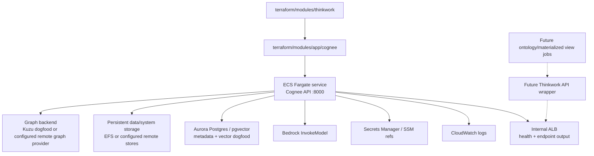
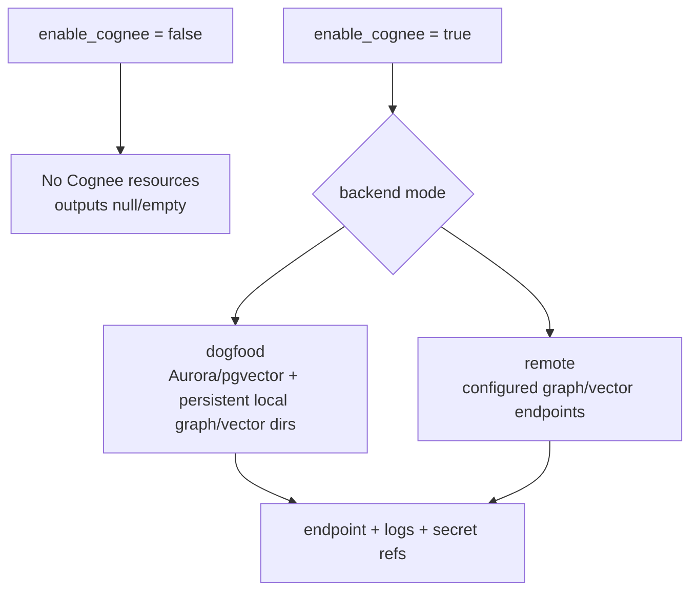

# feat: Add Cognee Infrastructure to Terraform

## Overview

Add Cognee as an optional AWS-native knowledge-graph service in the Thinkwork
Terraform stack. Cognee should support the product direction of replacing the
weak Wiki/Brain ontology substrate with a governed ontology/knowledge graph,
while leaving Hindsight as the agent-memory layer.

This plan scopes the first implementation to infrastructure and deployment
wiring. It does not replace Company Brain, migrate wiki data, or route runtime
agent context through Cognee yet. The goal is to make a deployable Cognee
service available to downstream ontology work with stable endpoints, storage,
secrets, IAM, logs, and rollout controls.

---

## Problem Frame

The origin ontology requirements drew the durable boundary: Hindsight is memory,
ontology is meaning, and Company Brain/Wiki is a materialized view. The current
conversation updates the technical direction: Cognee is now the leading
candidate for the ontology/knowledge-graph substrate that could replace the weak
wiki model.

Thinkwork's Terraform stack is already organized as a registry-shaped composite
module under `terraform/modules/thinkwork`, with app/data/foundation submodules
and a greenfield example. Optional add-ons such as Hindsight are enabled through
root variables and wired into runtime modules through outputs and environment
variables. Cognee should follow that pattern rather than becoming ad hoc
deployment glue outside Terraform.

---

## Requirements Trace

- R1. Cognee is provisioned as an optional infrastructure add-on and is disabled
  by default for existing deployments.
- R2. Hindsight remains the agent-memory substrate; Cognee is named and wired as
  ontology/knowledge graph infrastructure, not a replacement memory engine.
- R3. Terraform provisions a Cognee API runtime with durable logs, stable
  endpoint output, health checks, IAM, and security-group boundaries.
- R4. Cognee storage backends are configurable enough to support a low-cost
  dogfood mode and a production-ready remote graph/vector mode.
- R5. Sensitive Cognee credentials and API tokens are stored in Secrets Manager
  or SSM SecureString by ARN/reference, not broadcast as plaintext Lambda or ECS
  environment values.
- R6. The Cognee service can use AWS Bedrock for LLM and embedding calls through
  IAM where supported by Cognee's provider configuration.
- R7. The composite module, greenfield example, CLI-generated deploy templates,
  and CI Terraform plan/apply variables stay in sync.
- R8. Operators can inspect Cognee's deployed endpoint, log group, enabled
  status, and selected backend mode from Terraform outputs.
- R9. The plan preserves the origin ontology boundary: generated ontology
  structure must later flow through evidence-backed approval/materialization
  rather than silently mutating customer-facing knowledge.

**Origin actors:** A1 tenant admin / ontology owner, A2 ThinkWork agent, A3
Hindsight memory layer, A4 ontology suggestion engine, A5 Company Brain
compiler, A6 ThinkWork operator.

**Origin flows:** F1 suggest ontology change set, F2 review and approve a change
set, F3 apply ontology update and reprocess affected Brain views, F4 agent uses
ontology-shaped Company Brain context.

**Origin acceptance examples:** AE1-AE5 remain product acceptance examples for
the later ontology integration. This Terraform plan creates the Cognee substrate
that those flows can use; it does not complete the flows itself.

---

## Scope Boundaries

- No Company Brain or Wiki migration to Cognee in this plan.
- No user-facing ontology UI changes in this plan.
- No agent runtime/provider changes that query Cognee in this plan.
- No decision that Cognee replaces Hindsight.
- No customer-facing materialized view generation in this plan.
- No automatic import of existing wiki pages, Hindsight memory, or PDFs into
  Cognee during Terraform apply.
- No adoption of non-AWS managed SaaS as the default production backend.

### Deferred to Follow-Up Work

- Cognee ingestion jobs for existing wiki pages, PDFs, catalogs, and Hindsight
  observations.
- API wrappers that expose Cognee through Thinkwork auth/tenant boundaries.
- Operator UI for Cognee dataset status, ontology proposals, graph inspection,
  and materialized entity pages.
- Eval harness comparing Cognee-backed ontology retrieval against the existing
  Wiki/Brain and Bedrock KB paths.
- Production graph-backend decision if the dogfood mode proves insufficient.

---

## Context & Research

### Relevant Code and Patterns

- `AGENTS.md` frames Thinkwork as AWS-only, Terraform-deployed, and
  registry-module based.
- `terraform/modules/thinkwork/main.tf` wires foundation, data, and app modules
  through the public composite module.
- `terraform/modules/thinkwork/variables.tf` and
  `terraform/modules/thinkwork/outputs.tf` are the stable registry-module
  surface.
- `terraform/modules/app/hindsight-memory/main.tf` is the closest local pattern:
  optional ECS Fargate service, ALB, CloudWatch logs, IAM, security groups, and
  database security-group ingress.
- `terraform/modules/data/aurora-postgres/main.tf` already supports Aurora or
  RDS Postgres and exposes a database secret/endpoint to app modules.
- `terraform/examples/greenfield/main.tf` mirrors composite variables and is the
  local deployment example.
- `.github/workflows/verify.yml` and `.github/workflows/deploy.yml` pass
  Terraform variables explicitly rather than reading tfvars in CI.
- `apps/cli/src/commands/init.ts` generates deploy-repo Terraform files for new
  installs and must not drift from module variables.

### Institutional Learnings

- `docs/solutions/best-practices/business-ontology-change-set-loop-2026-05-17.md`
  says generated ontology structure should flow through evidence-backed change
  sets before affecting durable business schema.
- `docs/solutions/best-practices/oauth-client-credentials-in-secrets-manager-2026-04-21.md`
  establishes the pattern of storing secret values in Secrets Manager and
  exposing only ARNs/references to runtime configuration.
- `docs/solutions/integration-issues/agentcore-runtime-role-missing-code-interpreter-perms-2026-04-24.md`
  warns that AWS API usage must land with matching Terraform IAM permissions.
- `docs/solutions/workflow-issues/deploy-silent-arch-mismatch-took-a-week-to-surface-2026-04-24.md`
  recommends post-deploy smoke checks for container/runtime changes because
  Terraform success alone does not prove the service is alive.

### External References

- Cognee Docker deployment docs: self-hosted Cognee exposes an API on port 8000,
  supports Docker deployment, and uses environment variables for LLM, relational
  DB, vector store, graph store, auth, and CORS.
- Cognee architecture docs: Cognee combines relational, vector, and graph stores;
  relational storage tracks documents/provenance, vector storage handles
  embeddings, and graph storage captures entities and relationships.
- Cognee graph-store docs: supported graph stores include Kuzu, Kuzu remote,
  Neo4j, Neptune, and Neptune Analytics; local Kuzu is not suitable for
  concurrent multi-agent/process use.
- Cognee vector-store docs: supported vector stores include LanceDB, PGVector,
  ChromaDB, and Neptune Analytics.
- Cognee ontology quickstart: Cognee can ground entities and relationships to OWL
  ontologies, including class/property validation.

---

## Key Technical Decisions

- **Cognee is an optional app module.** Add `terraform/modules/app/cognee` and
  enable it from `terraform/modules/thinkwork` with `enable_cognee`, mirroring
  the add-on pattern rather than modifying Hindsight.
- **Use ECS Fargate as the first runtime shape.** Cognee is a containerized API
  service; ECS/Fargate matches the Hindsight add-on pattern and avoids adding
  Kubernetes or EC2 management to an AWS-only product.
- **Use a VPC-local endpoint for phase 1.** Cognee should expose only an
  internal ALB (`internal = true`) in phase 1. ECS tasks should run in the
  existing public subnets with `assign_public_ip = true` so the service can
  reach Bedrock, ECR, Secrets Manager, CloudWatch Logs, and optional external
  providers without adding NAT gateways or VPC endpoints in this pass. The task
  security group should allow inbound traffic only from the internal ALB, and
  the ALB security group should allow only VPC-local or explicitly configured
  caller-network access. The Cognee module should not expose an internet-facing
  endpoint mode, CORS controls, or Cognee-native auth controls in this phase;
  direct public/API access belongs to the later Thinkwork API wrapper work.
- **Support two backend modes.** Provide a low-cost dogfood mode using shared
  Aurora/pgvector plus persistent ECS storage for Cognee's local data/system
  directories, and a production mode that can point Cognee at remote graph/vector
  backends such as Neptune/Neptune Analytics or future dedicated services.
- **Do not hardcode local file stores as the production truth.** Cognee's Kuzu
  and LanceDB defaults are useful for single-task trials, but the plan must make
  remote graph/vector configuration explicit so enterprise scaling does not rest
  on container-local files.
- **Prefer Bedrock provider configuration over third-party API keys.** Since
  Thinkwork is AWS-native, the Cognee task role should get Bedrock invoke
  permissions and Cognee should be configured for Bedrock LLM/embedding models
  where supported. Non-Bedrock provider keys remain optional secret inputs.
- **Expose stable outputs, not implementation internals.** Downstream
  application work should consume `cognee_enabled`, endpoint, log group, and
  secret ARN outputs rather than reconstructing resource names.

---

## Open Questions

### Resolved During Planning

- **Should Cognee replace Hindsight?** No. The plan names Cognee as ontology and
  knowledge-graph infrastructure. Hindsight remains memory.
- **Should Terraform ingest existing wiki/PDF data?** No. Terraform should
  provision infrastructure only; ingestion belongs to application jobs.
- **Should this use AWS GraphRAG Toolkit instead?** No for this plan. The chosen
  direction is Cognee as ontology substrate; AWS GraphRAG Toolkit remains a
  possible specialized document pipeline later.
- **What is the phase-1 endpoint shape?** Use an internal ALB with ECS tasks in
  public subnets using `assign_public_ip = true` for outbound egress. This keeps
  the Cognee API off the public internet while avoiding NAT/VPC-endpoint work
  until a fully private runtime path is explicitly planned.

### Deferred to Implementation

- **Exact Cognee image and extras:** Implementation must verify whether the
  public image includes needed providers/loaders or whether Thinkwork needs an
  ECR-hosted custom image with extras such as `postgres`, `pgvector`, `docs`,
  `neptune`, or OCR/PDF dependencies.
- **Exact Bedrock env values:** Cognee docs list Bedrock support, but the
  implementation should confirm the exact `LLM_PROVIDER`,
  `EMBEDDING_PROVIDER`, model id, and structured-output backend env values for
  the selected Cognee version.
- **Production graph backend:** The Terraform interface should allow remote
  graph/vector configuration, but the first implementation may defer provisioning
  Neptune/Neptune Analytics until product evals justify the cost and shape.
- **Aurora/pgvector readiness:** Implementation must verify whether the selected
  relational/vector path requires a `pgvector` extension or migration outside
  the existing Hindsight setup before Cognee dogfood mode is enabled.

---

## Output Structure

    terraform/modules/app/cognee/
      main.tf
      variables.tf
      outputs.tf
      README.md
    terraform/modules/thinkwork/
      main.tf
      variables.tf
      outputs.tf
    terraform/examples/greenfield/
      main.tf
    apps/cli/
      src/commands/init.ts
      src/commands/enterprise/templates/deploy-repo/terraform/main.tf
      __tests__/terraform-cognee-fixture.test.ts
    .github/workflows/
      verify.yml
      deploy.yml

---

## High-Level Technical Design

> _This illustrates the intended approach and is directional guidance for
> review, not implementation specification. The implementing agent should treat
> it as context, not code to reproduce._

---

## Implementation Units

- U1. **Create the Cognee Terraform app module**

**Goal:** Add a reusable app submodule that provisions the Cognee runtime
surface without changing the rest of the stack.

**Requirements:** R1, R3, R4, R5, R6, R8

**Dependencies:** None

**Files:**

- Create: `terraform/modules/app/cognee/main.tf`
- Create: `terraform/modules/app/cognee/variables.tf`
- Create: `terraform/modules/app/cognee/outputs.tf`
- Create: `terraform/modules/app/cognee/README.md`
- Test: `apps/cli/__tests__/terraform-cognee-fixture.test.ts`

**Approach:**

- Model the module after `terraform/modules/app/hindsight-memory`, but name the
  service, IAM roles, security groups, log group, and endpoint around Cognee.
- Provision an ECS cluster/service/task definition or reuse an injected cluster
  only if an existing local pattern makes that preferable during implementation.
- Expose variables for image URI/tag, CPU/memory, desired count,
  model/provider config, backend providers, and allowed internal caller
  networks. Do not expose public endpoint mode, CORS, or Cognee-native auth
  variables in phase 1.
- Provision an internal ALB and run ECS tasks in the existing public subnets
  with `assign_public_ip = true` for outbound egress. Do not create an
  internet-facing ALB for Cognee in phase 1.
- Restrict network ingress so the Cognee task accepts traffic only from the
  internal ALB, and the internal ALB accepts traffic only from VPC-local or
  explicitly configured caller-network sources.
- Mount persistent writable paths for Cognee's data and system directories,
  because Cognee requires writable `DATA_ROOT_DIRECTORY` and
  `SYSTEM_ROOT_DIRECTORY` even when external databases are configured.
- Verify the selected Aurora/PGVector path includes the required extension and
  migration ownership; do not assume Hindsight's database setup automatically
  satisfies Cognee's relational/vector requirements.
- Add CloudWatch log retention and health checks for the Cognee API endpoint.
- Grant the task role Bedrock invoke permissions and only the storage/secrets
  permissions needed by selected configuration.

**Patterns to follow:**

- `terraform/modules/app/hindsight-memory/main.tf`
- `terraform/modules/app/agentcore-platform/main.tf`
- `docs/solutions/integration-issues/agentcore-runtime-role-missing-code-interpreter-perms-2026-04-24.md`

**Test scenarios:**

- Happy path: with `enable_cognee` handled by the parent module and valid module
  inputs, Terraform validation accepts the new module without missing variables
  or provider references.
- Edge case: with remote backend variables empty in dogfood mode, the task
  definition still has durable local data/system paths and does not rely on
  ephemeral container storage for required Cognee directories.
- Error path: invalid backend mode/provider combinations are rejected by
  variable validation rather than producing an ECS task that starts with
  contradictory Cognee env vars.
- Error path: any attempt to configure an internet-facing Cognee endpoint in
  phase 1 is rejected because direct public/API access is deferred to the
  Thinkwork API wrapper.
- Integration: generated HCL fixture assertions confirm the module exposes
  endpoint/log/secret outputs consumed by the composite module.

**Verification:**

- The module can be validated standalone with backend disabled.
- The module documents required Cognee env/provider assumptions and links to
  Cognee deployment/configuration docs.
- The Cognee ALB is internal-only, the task security group has no direct public
  ingress, and service egress to Bedrock, ECR, Secrets Manager, and CloudWatch
  Logs is covered by the public-subnet task pattern.

---

- U2. **Wire Cognee through the composite Thinkwork module**

**Goal:** Make Cognee available from `terraform/modules/thinkwork` without
breaking existing deployments or conflating Cognee with memory-engine selection.

**Requirements:** R1, R2, R3, R4, R6, R8, R9

**Dependencies:** U1

**Files:**

- Modify: `terraform/modules/thinkwork/main.tf`
- Modify: `terraform/modules/thinkwork/variables.tf`
- Modify: `terraform/modules/thinkwork/outputs.tf`
- Test: `apps/cli/__tests__/terraform-cognee-fixture.test.ts`

**Approach:**

- Add `enable_cognee` and Cognee-specific configuration variables to the
  composite root.
- Instantiate `module "cognee"` behind `count = var.enable_cognee ? 1 : 0`.
- Pass VPC, subnet, database endpoint/secret, database security group, region,
  account id, and selected model/backend config into the Cognee module.
- Add database security-group ingress only through the Cognee module path, not a
  broad global rule.
- Expose outputs such as `cognee_enabled`, `cognee_endpoint`,
  `cognee_log_group_name`, and `cognee_task_role_arn`.
- Keep `memory_engine`, `enable_hindsight`, and `hindsight_endpoint` unchanged.

**Patterns to follow:**

- `terraform/modules/thinkwork/main.tf` Hindsight enablement and output pattern.
- `terraform/modules/thinkwork/variables.tf` variable validation style.
- `terraform/modules/thinkwork/outputs.tf` nullable add-on endpoint pattern.

**Test scenarios:**

- Happy path: default `enable_cognee = false` leaves the composite module output
  values null/empty and creates no Cognee resources.
- Happy path: `enable_cognee = true` wires module inputs from existing VPC,
  database, and region/account variables.
- Edge case: setting both `enable_hindsight = true` and `enable_cognee = true`
  is valid and does not change `memory_engine`.
- Error path: invalid Cognee backend mode/provider values are rejected by
  validation.

**Verification:**

- Composite module validation passes.
- Existing Hindsight and AgentCore memory outputs are unchanged.
- Cognee outputs are stable names for downstream application work.

---

- U3. **Add Cognee secrets and configuration hygiene**

**Goal:** Keep sensitive Cognee/provider credentials out of tfstate-adjacent
runtime surfaces and make operator rotation survivable.

**Requirements:** R5, R6, R7

**Dependencies:** U1, U2

**Files:**

- Modify: `terraform/modules/app/cognee/main.tf`
- Modify: `terraform/modules/app/cognee/variables.tf`
- Modify: `terraform/modules/app/cognee/outputs.tf`
- Create or modify: `terraform/modules/app/cognee/README.md`
- Test: `apps/cli/__tests__/terraform-cognee-fixture.test.ts`

**Approach:**

- Prefer Bedrock IAM for LLM and embeddings so no third-party key is needed in
  the default AWS path.
- If non-Bedrock provider keys are supported, provision a Secrets Manager secret
  container/value with `ignore_changes` on secret value or accept a pre-existing
  secret ARN, following the OAuth credential pattern.
- Expose only secret ARNs or SSM parameter names in Terraform outputs and task
  env vars when feasible.
- Add IAM policy statements narrowly scoped to the Cognee task role.
- Document any unavoidable Cognee env var that contains a secret so reviewers can
  decide whether the selected Cognee version requires a wrapper/entrypoint to
  fetch secrets at startup.

**Patterns to follow:**

- `docs/solutions/best-practices/oauth-client-credentials-in-secrets-manager-2026-04-21.md`
- `terraform/modules/app/lambda-api/oauth-secrets.tf`
- `terraform/modules/data/aurora-postgres/main.tf` secret-container ownership
  comments.

**Test scenarios:**

- Happy path: Bedrock-only configuration does not require a provider API key.
- Happy path: optional non-Bedrock secret ARN is passed as an ARN/reference
  rather than a plaintext root-module output.
- Edge case: empty optional provider secret remains valid when Bedrock mode is
  selected.
- Error path: non-Bedrock provider mode without a corresponding secret reference
  fails validation.

**Verification:**

- Terraform plan does not expose Cognee provider secrets in outputs.
- Cognee task role has only the permissions required for selected runtime paths.
- The README explains secret rotation and operator-owned secret-value behavior.

---

- U4. **Propagate Cognee through examples, CLI templates, and CI workflows**

**Goal:** Keep every deployment surface aligned so Cognee can be enabled in real
stages, generated deploy repos, and CI verification without manual HCL edits.

**Requirements:** R1, R7, R8

**Dependencies:** U2, U3

**Files:**

- Modify: `terraform/examples/greenfield/main.tf`
- Modify: `apps/cli/src/commands/init.ts`
- Modify: `apps/cli/src/commands/enterprise/templates/deploy-repo/terraform/main.tf`
- Modify: `.github/workflows/verify.yml`
- Modify: `.github/workflows/deploy.yml`
- Test: `apps/cli/__tests__/terraform-cognee-fixture.test.ts`
- Test: `apps/cli/__tests__/enterprise-secrets.test.ts`

**Approach:**

- Add Cognee variables to the greenfield example with safe disabled defaults.
- Add generated tfvars/template support in the CLI so new deployments can opt in
  without hand-editing hidden module inputs.
- Update CI Terraform plan/apply variable lists with explicit disabled/default
  values or GitHub variable plumbing, matching the repo's current no-tfvars CI
  style.
- Keep Cognee off in CI by default unless explicitly enabled for a stage.
- Add file-content tests for generated Terraform/template surfaces, following
  the existing pure fixture-test style.

**Patterns to follow:**

- `.github/workflows/verify.yml` Terraform plan variable block.
- `.github/workflows/deploy.yml` Terraform apply variable block.
- `apps/cli/src/commands/init.ts` generated `enable_hindsight` surface.
- `apps/cli/__tests__/terraform-sandbox-host-fixture.test.ts`.

**Test scenarios:**

- Happy path: generated greenfield HCL includes `enable_cognee = false` by
  default and passes the value through to `module.thinkwork`.
- Happy path: enterprise deploy template exposes Cognee variables with safe
  defaults.
- Edge case: CI verify/deploy still passes explicit values for every required
  root variable when Cognee is disabled.
- Error path: enterprise secret validation does not require Cognee provider
  secrets unless the template enables a non-Bedrock provider mode.

**Verification:**

- New deployment templates and repo examples agree on variable names.
- CI plan/apply surfaces cannot accidentally enable Cognee without an explicit
  variable change.
- The CLI tests protect against future template drift.

---

- U5. **Add operational handoff and smoke-check guidance**

**Goal:** Make Cognee deployable by operators without confusing Terraform
success with service readiness.

**Requirements:** R3, R5, R6, R8, R9

**Dependencies:** U1, U2, U3, U4

**Files:**

- Create or modify: `terraform/modules/app/cognee/README.md`
- Modify: `docs/src/content/docs/guides/business-ontology-operations.mdx`
- Modify: `docs/src/content/docs/concepts/knowledge/business-ontology.mdx`
- Test: `apps/cli/__tests__/terraform-cognee-fixture.test.ts`

**Approach:**

- Document how to enable Cognee, expected monthly cost drivers, selected backend
  mode, secret setup, health endpoint, log group, and rollback behavior.
- Document that Cognee infrastructure alone does not migrate the Wiki/Brain or
  change agent context.
- Add a post-deploy smoke expectation: health endpoint is reachable from the
  intended caller network, Cognee reports configured providers, and logs show no
  startup connectivity failure.
- Include a cleanup warning for any persistent data volumes or remote graph
  stores that Terraform may not fully destroy safely in production.

**Patterns to follow:**

- `docs/solutions/patterns/mcp-custom-domain-setup-2026-04-23.md`
- `docs/solutions/workflow-issues/deploy-silent-arch-mismatch-took-a-week-to-surface-2026-04-24.md`
- `terraform/modules/data/compliance-audit-bucket/README.md`

**Test scenarios:**

- Happy path: docs name the Terraform outputs an operator needs to inspect
  endpoint, logs, and backend mode.
- Edge case: docs explain disabled/default state so existing deployments do not
  expect Cognee resources.
- Error path: docs explain where to look for startup failures caused by provider,
  database, graph, or vector configuration errors.

**Verification:**

- Operators can enable Cognee and understand what Terraform does and does not
  prove.
- Docs preserve the product boundary: Cognee substrate first, ontology migration
  later.

---

## System-Wide Impact

- **Interaction graph:** Terraform module wiring affects the public composite
  module, greenfield example, CLI-generated deploy repos, CI verify/deploy
  workflows, ECS, Aurora security groups, IAM, Secrets Manager/SSM, and future
  API/provider code.
- **Error propagation:** Terraform validation should catch contradictory backend
  modes. Runtime provider failures should surface through ECS health checks and
  CloudWatch logs, not as silent ontology/search failures.
- **State lifecycle risks:** Persistent Cognee stores must not be accidentally
  ephemeral. Remote graph/vector backends may need explicit cleanup guidance.
- **API surface parity:** Any new composite module variable must be mirrored in
  `terraform/examples/greenfield`, CLI init output, enterprise deploy templates,
  and CI variable lists.
- **Integration coverage:** Terraform validation proves syntax and dependencies;
  a post-deploy smoke check is still needed to prove Cognee boots, reaches its
  backends, and can call Bedrock/provider APIs.
- **Unchanged invariants:** Hindsight remains the memory engine. Existing
  Bedrock KBs remain document retrieval. Cognee starts as ontology/knowledge
  graph substrate only.

---

## Alternative Approaches Considered

- **Use Cognee Cloud instead of self-hosted Terraform:** Rejected as the default
  because Thinkwork is AWS-only by policy and customer ontology data likely
  needs deployment inside the customer's AWS environment. It can remain a
  discovery/prototyping comparison, not the product default.
- **Use AWS GraphRAG Toolkit instead of Cognee:** Rejected for this plan because
  the current strategic need is ontology/knowledge-graph substrate, not only
  document-to-graph retrieval over PDFs.
- **Deploy Cognee on EC2:** Rejected as the first path because the repo already
  has ECS/Fargate container add-on patterns and avoids direct host management.
- **Use embedded Kuzu/LanceDB only:** Useful for a dogfood mode, but rejected as
  the only infrastructure path because Cognee docs warn local Kuzu is not fit
  for concurrent multi-process use and local stores are fragile for enterprise
  runtime expectations.
- **Provision Neptune Analytics immediately:** Deferred. Cognee can be designed
  to accept remote graph/vector settings now, but Neptune Analytics has a real
  hourly floor and should be justified by evals rather than added by default.

---

## Dependencies / Prerequisites

- Terraform provider support for any selected AWS service must fit the current
  `hashicorp/aws ~> 5.0` pin or the plan needs a provider-version follow-up.
- Cognee image/version selection must be pinned before implementation lands.
- AWS Bedrock model access must be enabled in target accounts for the selected
  Cognee LLM and embedding models.
- If production mode uses remote graph/vector stores, those services and network
  routes must exist before enabling Cognee against them.
- If dogfood mode uses persistent local data/system directories, the chosen
  persistent storage must support the ECS task's startup and write patterns.

---

## Risk Analysis & Mitigation

| Risk                                                                                      | Likelihood | Impact | Mitigation                                                                                                                                                                             |
| ----------------------------------------------------------------------------------------- | ---------- | ------ | -------------------------------------------------------------------------------------------------------------------------------------------------------------------------------------- |
| Cognee public image lacks required provider/PDF extras                                    | Medium     | Medium | Make image URI/tag configurable and document a custom ECR image path as an implementation-time decision.                                                                               |
| Embedded graph/vector stores become accidental production truth                           | Medium     | High   | Add explicit backend mode variables, documentation, and validation that distinguishes dogfood from production.                                                                         |
| Secrets leak through task environment or tfstate                                          | Medium     | High   | Prefer Bedrock IAM; use Secrets Manager/SSM indirection for non-Bedrock keys; document any unavoidable Cognee limitation.                                                              |
| CI/template surfaces drift from module variables                                          | High       | Medium | Add CLI fixture tests and update verify/deploy variable lists in the same unit as example/template changes.                                                                            |
| Terraform apply succeeds but Cognee cannot start                                          | Medium     | Medium | Add health checks, logs, and post-deploy smoke guidance; do not treat Terraform success as runtime proof.                                                                              |
| Networking prevents private service from reaching Bedrock/provider APIs                   | Medium     | Medium | Use an internal ALB with public-subnet ECS tasks and `assign_public_ip = true` for phase 1; defer fully private subnets until NAT/VPC endpoints are explicitly added and smoke-tested. |
| Dogfood mode assumes PGVector is available when the selected database lacks the extension | Medium     | Medium | Verify extension/migration ownership in U1 and fail validation or docs handoff before enabling PGVector-backed Cognee storage.                                                         |
| Cognee blurs memory and ontology boundaries                                               | Medium     | High   | Keep naming, outputs, docs, and deferred work explicit: Hindsight is memory; Cognee is ontology/knowledge graph substrate.                                                             |

---

## Phased Delivery

### Phase 1

- Land optional Cognee Terraform module, composite wiring, safe disabled default,
  and docs.
- Use dogfood backend mode unless implementation verifies a production remote
  backend is cheap and ready.
- Do not route app traffic to Cognee yet.

### Phase 2

- Add application/API integration wrappers, tenant auth, ingestion jobs, and
  evals.
- Decide whether production backend should be Neptune, Neptune Analytics, or a
  dedicated graph service based on measured Cognee behavior.

### Phase 3

- Migrate or regenerate wiki/ontology materialized views through an
  evidence-backed approval loop.
- Add customer-facing ontology inspection and generated entity/topic pages.

---

## Success Metrics

- Existing deployments with default variables produce no Cognee resources and no
  behavior change.
- Enabling Cognee provisions a healthy service with stable endpoint/log outputs.
- Cognee can call the selected LLM/embedding provider and connect to configured
  relational/vector/graph storage.
- CI, greenfield examples, and CLI-generated templates share the same Cognee
  variable names and defaults.
- Operators can explain where Cognee fits without confusing it with Hindsight or
  Bedrock KBs.

---

## Documentation / Operational Notes

- The Cognee module README should be written as an operator handoff: enablement,
  backend modes, secrets, logs, health, rollback, and cleanup.
- Product docs should state that Cognee is infrastructure for future
  ontology-backed knowledge features, not an immediate wiki replacement by
  itself.
- Deployment docs should call out that ingestion/import jobs are separate from
  Terraform apply.
- CI variable updates should mention that GitHub Actions passes explicit
  `-var` values and does not rely on tfvars.

---

## Sources & References

- **Origin document:** [docs/brainstorms/2026-05-17-business-ontology-change-sets-requirements.md](../brainstorms/2026-05-17-business-ontology-change-sets-requirements.md)
- Related plan: [docs/plans/2026-05-19-002-feat-ontology-gated-hindsight-wiki-plan.md](2026-05-19-002-feat-ontology-gated-hindsight-wiki-plan.md)
- Related solution: [docs/solutions/best-practices/business-ontology-change-set-loop-2026-05-17.md](../solutions/best-practices/business-ontology-change-set-loop-2026-05-17.md)
- Related solution: [docs/solutions/best-practices/oauth-client-credentials-in-secrets-manager-2026-04-21.md](../solutions/best-practices/oauth-client-credentials-in-secrets-manager-2026-04-21.md)
- Related code: `terraform/modules/app/hindsight-memory/main.tf`
- Related code: `terraform/modules/thinkwork/main.tf`
- Related code: `terraform/examples/greenfield/main.tf`
- Related code: `.github/workflows/verify.yml`
- Related code: `.github/workflows/deploy.yml`
- External docs: [Cognee Docker deployment](https://docs.cognee.ai/how-to-guides/cognee-sdk/deployment/docker)
- External docs: [Cognee architecture](https://docs.cognee.ai/core-concepts/architecture)
- External docs: [Cognee graph stores](https://docs.cognee.ai/setup-configuration/graph-stores)
- External docs: [Cognee vector stores](https://docs.cognee.ai/setup-configuration/vector-stores)
- External docs: [Cognee ontology quickstart](https://docs.cognee.ai/guides/ontology-support)
