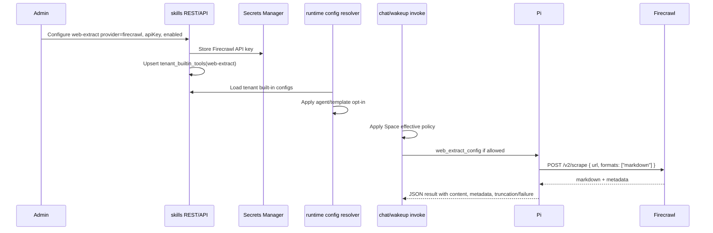

# feat: Add Firecrawl web extraction

## Overview

Add a new credentialed built-in tool, **Web Extraction**, backed by Firecrawl for single-page URL-to-markdown/text extraction. This fills the gap between `web_search` discovery and `browser_automation` interaction: agents should search to find candidate URLs, use `web_extract` to read a known page, and reserve Browser Automation for pages that need interaction or rendered-state inspection.

The plan follows the existing built-in-tool pattern: Admin owns tenant-level provider/API-key configuration, runtime config resolves secrets from `tenant_builtin_tools`, Pi receives a bounded tool config payload, and Spaces/agent policy can narrow tool availability without exposing secrets.

---

## Problem Frame

A recent research thread showed Exa returning promising URLs with empty/thin snippets, followed by Browser Automation opening the target page and returning screenshot/session metadata rather than usable page content. That path is expensive and still leaves the agent without extracted knowledge. The origin doc defines Firecrawl as extraction, not search, and v1 as single-page extraction only (see origin: `docs/brainstorms/2026-06-04-firecrawl-web-extraction-requirements.md`).

---

## Requirements Trace

- R1. Firecrawl is a separate credentialed built-in named Web Extraction, not a Web Search provider.
- R2. Runtime-facing tool name is extraction-oriented; plan decision: built-in slug `web-extract`, runtime tool `web_extract`.
- R3. Admin is the v1 credential surface; Spaces must not edit provider/API keys.
- R4. v1 optimizes for one known URL at a time.
- R5. Tool output includes clean markdown/text, source URL, title/metadata when available, and truncation/failure status.
- R6. Tool output must be page knowledge, not screenshot/session metadata.
- R7. Tool supports user-provided URLs and URLs discovered by Web Search.
- R8. Availability follows built-in governance: tenant credential plus agent/template/Space/runtime narrowing.
- R9. Browser Automation remains separate for interactive tasks.
- R10. Agents prefer Web Extraction over Browser Automation for reading, summarizing, analyzing, or quoting ordinary public pages.
- R11. Browser Automation remains fallback for interaction or extraction failure.
- R12. Agent guidance teaches the sequence: Web Search -> Web Extraction -> Browser Automation fallback.
- R13. Guidance must not carry Firecrawl credentials or duplicate the platform implementation.

**Origin actors:** A1 tenant admin, A2 Space user, A3 agent runtime, A4 agent/operator reviewer.
**Origin flows:** F1 configure Firecrawl, F2 agent reads a known URL, F3 fallback to Browser Automation.
**Origin acceptance examples:** AE1 missing config, AE2 successful extraction, AE3 search-to-extract, AE4 browser fallback, AE5 guidance without credentials.

---

## Scope Boundaries

- Do not implement crawl, map, recursive docs ingestion, sitemap traversal, or multi-page packs.
- Do not implement structured JSON extraction with user-provided schemas.
- Do not implement authenticated-page extraction, CAPTCHA handling, proxy configuration, or credentialed browser automation.
- Do not add Spaces provider/API-key editing.
- Do not replace Exa/SerpAPI Web Search.
- Do not replace Browser Automation or Firecrawl Interact; Browser Automation remains the first-class interaction path.

### Deferred to Follow-Up Work

- CLI management for `web-extract`: the docs already note CLI manages only Web Search today; keep this follow-up unless v1 implementation wants CLI parity.
- Site crawling and structured extraction: revisit after single-page extraction proves useful and quota/safety behavior is understood.

---

## Context & Research

### Relevant Code and Patterns

- `packages/api/src/handlers/skills.ts` owns credentialed built-in REST routes and the current backend catalog for `web-search`.
- `packages/api/src/lib/builtin-tools/web-search.ts` resolves Secrets Manager keys, loads tenant built-in rows, and normalizes provider results.
- `packages/api/src/lib/resolve-agent-runtime-config.ts` resolves agent/template built-in opt-ins and produces `webSearchConfig`.
- `packages/api/src/handlers/chat-agent-invoke.ts` passes built-in payload fields to Pi and applies effective workspace-renderer `blockedTools` before doing so.
- `packages/pi-extensions/src/web-search.ts` and `packages/agentcore-pi/agent-container/src/server.ts` show the direct Pi extension pattern for provider-backed tools.
- `apps/admin/src/routes/_authed/_tenant/agent/tools.tsx` is the current Admin Built-in Tools surface with provider/API-key/test dialog behavior for credentialed tools.
- `apps/spaces/src/components/settings/SettingsTools.tsx` intentionally exposes only list + enable/disable in Spaces.
- `packages/api/src/graphql/resolvers/spaces/tools-policy.ts` validates built-in tool slugs for Space tool policy through `isBuiltinToolSlug`.

### Institutional Learnings

- `docs/solutions/best-practices/injected-built-in-tools-are-not-workspace-skills-2026-04-28.md`: platform-owned tools with credentials must remain injected built-ins, not `workspace/skills` files.
- `docs/solutions/integration-issues/web-enrichment-must-use-summarized-external-results-2026-05-01.md`: web integrations must verify content quality, not merely provider participation or hit count.
- `docs/solutions/best-practices/activation-runtime-narrow-tool-surface-2026-04-26.md`: narrow tool surfaces and explicit availability checks prevent the runtime from silently exposing wrong or partial capabilities.

### External References

- Firecrawl official Scrape API docs: `https://docs.firecrawl.dev/api-reference/endpoint/scrape`
  - Current endpoint is `POST https://api.firecrawl.dev/v2/scrape`.
  - Auth uses bearer token.
  - Request requires `url` and supports `formats: ["markdown"]`.
  - `onlyMainContent` defaults true; `onlyCleanContent` is a beta LLM cleanup pass.
  - Firecrawl docs explicitly direct browser interactions to the Interact endpoint, which is out of scope for this v1.

---

## Key Technical Decisions

- **Use `web-extract` / `web_extract`:** Keeps extraction visibly separate from `web-search` while matching the repo's built-in slug versus runtime tool naming style.
- **Add a direct runtime config field, not a workspace skill:** `web_extract_config` should travel beside `web_search_config`, avoiding `skillsConfig` as the handoff for a credentialed platform tool.
- **Use Firecrawl `/v2/scrape` with markdown only:** v1 should request markdown and main-content extraction; structured JSON, screenshots, actions, and Interact remain out of scope.
- **Default agent/template opt-in should mirror Web Search:** Add `web_extract` JSON opt-in fields defaulting to `{ "enabled": true }`, then let tenant credential and Space/tool policy narrow final availability.
- **Plan for Space policy allowed-list parity:** `chat-agent-invoke` currently uses effective `blockedTools` for built-ins and `allowedServers` for MCP; Web Extraction should not claim Space policy support unless `allowedTools` is honored for built-in payload fields too.
- **Agent guidance lives in platform instructions/tool descriptions first:** This satisfies R12 without creating a tenant workspace skill that might be mistaken for the implementation. A catalog skill can be a follow-up if product wants explicit `/web-scraping` activation later.

---

## Open Questions

### Resolved During Planning

- Final names: use built-in slug `web-extract` and runtime tool `web_extract`.
- v1 output limit: enforce a bounded markdown/text response in the tool layer; default target should be large enough for page reading but small enough to avoid oversized model turns. Exact byte/token limit is an implementation-time constant, but tests must cover truncation.
- Space policy: include support for both blocked and allowed tool policy in payload gating so Space policy can narrow availability without key editing.
- Companion guidance: deliver through tool descriptions and workspace/default instruction surfaces for v1, not through a credential-bearing workspace skill.

### Deferred to Implementation

- Exact Firecrawl response field paths: confirm from live mocked payloads and docs while implementing normalization.
- Exact output limit value: choose based on current Pi result-size behavior and test fixtures.
- Whether Firecrawl errors include stable error codes worth preserving: normalize message/status first, add specific code handling only when observed from docs or tests.

---

## High-Level Technical Design

> _This illustrates the intended approach and is directional guidance for review, not implementation specification. The implementing agent should treat it as context, not code to reproduce._

---

## Implementation Units

- U1. **Extend built-in data model and backend catalog**

**Goal:** Make `web-extract` a first-class credentialed built-in across backend catalog, database config, GraphQL agent/template opt-in fields, and built-in slug filtering.

**Requirements:** R1, R2, R3, R8, AE1

**Dependencies:** None

**Files:**

- Modify: `packages/api/src/handlers/skills.ts`
- Modify: `packages/api/src/lib/builtin-tool-slugs.ts`
- Modify: `packages/database-pg/src/schema/agents.ts`
- Modify: `packages/database-pg/src/schema/agent-templates.ts`
- Create: `packages/database-pg/drizzle/<next>_add_web_extract_builtin_config.sql`
- Modify: `packages/database-pg/graphql/types/agents.graphql`
- Modify: `apps/admin/src/lib/graphql-queries.ts`
- Create: `packages/api/src/handlers/skills.builtin-tools.test.ts`
- Test: `packages/api/src/graphql/resolvers/tenant-agent/updateTenantAgent.mutation.test.ts`

**Approach:**

- Add `web-extract` to `BUILTIN_TOOL_SLUGS` so workspace skill derivation and Space policy validation recognize it as platform-owned.
- Extend the `BUILTIN_TOOL_CATALOG` in `skills.ts` with provider `firecrawl` and key env label metadata consistent with the existing credentialed built-in shape.
- Add additive agent and agent-template JSON columns named `web_extract` with default `{ "enabled": true }`, mirroring `web_search` and preserving the hand-rolled migration marker pattern.
- Expose `webExtract` in GraphQL Agent and UpdateTenantAgent input so the Admin agent tools page can show agent access state.

**Patterns to follow:**

- `packages/database-pg/drizzle/0044_add_web_search_template_config.sql`
- `packages/database-pg/drizzle/0113_agents_own_runtime_fields.sql`
- `docs/solutions/best-practices/injected-built-in-tools-are-not-workspace-skills-2026-04-28.md`

**Test scenarios:**

- Happy path: `PUT /api/skills/builtin-tools/web-extract` with provider `firecrawl`, enabled true, and an API key stores a tenant row with `hasSecret` true.
- Error path: unknown provider for `web-extract` is rejected with a provider allowlist error.
- Happy path: `UpdateTenantAgent` accepts `webExtract: {"enabled":true}` and persists `web_extract`.
- Error path: invalid/unsupported `webExtract` JSON follows the same validation style as Web Search if a dedicated validator is added.

**Verification:**

- The built-in catalog can list, configure, test, disable, and delete `web-extract` without changing Spaces key-edit behavior.
- Workspace skill derivation does not treat `skills/web-extract/SKILL.md` as user-owned content.

---

- U2. **Add Firecrawl config loading and admin test support**

**Goal:** Implement the API-side helper that loads tenant Firecrawl config, resolves its secret, and supports Admin test calls without owning the runtime tool implementation.

**Requirements:** R1, R3, R4, R8, AE1

**Dependencies:** U1

**Files:**

- Create: `packages/api/src/lib/builtin-tools/web-extract.ts`
- Create: `packages/api/src/lib/builtin-tools/web-extract.test.ts`
- Modify: `packages/api/src/handlers/skills.ts`

**Approach:**

- Keep Firecrawl helper separate from `web-search.ts`; shared secret resolution can be reused or factored only if it stays simple.
- Load `tenant_builtin_tools` row where `tool_slug = "web-extract"`, `enabled = true`, `provider = "firecrawl"`, and `secret_ref` resolves.
- Test endpoint should make a small Firecrawl `/v2/scrape` call through a narrowly scoped API helper and return `{ ok, provider, resultCount? }` style feedback consistent with Web Search tests.
- Keep full runtime extraction normalization in U4, where the agent-facing `web_extract` tool lives. If a shared helper emerges naturally, keep it dependency-light and covered from both API and Pi tests; otherwise prefer two small clients over a cross-package dependency knot.
- Normalize failures into concise messages; do not leak API keys, request headers, or full raw error bodies.

**Patterns to follow:**

- `packages/api/src/lib/builtin-tools/web-search.ts`
- `packages/api/src/lib/builtin-tools/web-search.test.ts`
- `docs/solutions/integration-issues/web-enrichment-must-use-summarized-external-results-2026-05-01.md`

**Test scenarios:**

- Happy path: enabled Firecrawl row plus resolvable secret returns tenant Web Extraction config.
- Error path: missing row, disabled row, wrong provider, or unreadable secret returns null.
- Happy path: Admin test request with a valid key and mocked Firecrawl scrape response returns `ok: true`.
- Error path: Admin test request with a non-2xx Firecrawl response returns bounded, redacted failure text.
- Error path: Admin test without a saved secret or supplied key returns the same style of missing-key error as Web Search.

**Verification:**

- Backend tests prove credential loading and test-call safety; runtime content quality is verified in U4 and U6.

---

- U3. **Thread Web Extraction through runtime config and policy**

**Goal:** Resolve `webExtractConfig` for eligible agents and pass `web_extract_config` to Pi only when tenant credentials, agent/template opt-in, and effective Space/tool policy allow it.

**Requirements:** R3, R7, R8, R10, R11, AE1, AE3, AE4

**Dependencies:** U1, U2

**Files:**

- Modify: `packages/api/src/lib/resolve-agent-runtime-config.ts`
- Modify: `packages/api/src/handlers/chat-agent-invoke.ts`
- Modify: `packages/api/src/handlers/wakeup-processor.ts`
- Modify: `packages/api/agentcore-invoke.ts`
- Modify: `packages/api/src/lib/evals/agentcore-direct.ts`
- Create: `packages/api/src/lib/templates/web-extract-config.ts`
- Create: `packages/api/src/lib/templates/web-extract-config.test.ts`
- Test: `packages/api/src/lib/__tests__/resolve-agent-runtime-config.test.ts`
- Test: `packages/api/src/handlers/chat-agent-invoke.runtime-routing.test.ts`
- Test: `packages/api/src/graphql/resolvers/spaces/setSpaceTools.mutation.test.ts`

**Approach:**

- Add a `WebExtractConfig` runtime type and `webExtractConfig?: WebExtractConfig` to `AgentRuntimeConfig`.
- Validate `agent.web_extract`/`agent_templates.web_extract` with a dedicated validator mirroring `web-search-config.ts`.
- Resolve `webExtractConfig` directly from tenant config and opt-in state, rather than smuggling it through `skillsConfig`.
- Ensure blocked-tool checks recognize both `web-extract` and `web_extract`.
- Update `chat-agent-invoke` payload gating to consider effective `allowedTools` as well as `blockedTools` for built-in payloads. This is important because Space policy has an allowlist model and today built-in fields mainly gate on blocked tools.
- Carry the same config through wakeup/eval/direct invocation surfaces where `web_search_config` already appears.

**Patterns to follow:**

- `packages/api/src/lib/templates/web-search-config.ts`
- `packages/api/src/lib/resolve-agent-runtime-config.ts` Web Search, Send Email, and Browser handling
- `packages/api/src/handlers/chat-agent-invoke.ts` effective policy filtering
- `packages/api/src/lib/workspace-renderer/effective-policy-composer.ts`

**Test scenarios:**

- Happy path: enabled tenant Firecrawl config plus `agent.web_extract = {"enabled":true}` resolves `webExtractConfig`.
- Error path: tenant config exists but agent/template opt-in is null; config is omitted.
- Error path: `blocked_tools` containing `web_extract` or `web-extract` omits the payload.
- Integration: rendered Space policy with `blockedTools: ["web_extract"]` omits `web_extract_config`.
- Integration: rendered Space policy with `allowedTools` that excludes `web_extract` omits `web_extract_config`.
- Integration: rendered Space policy with `allowedTools` including `web_extract` permits the payload when tenant/agent gates pass.
- Regression: existing `web_search_config`, `browser_automation_enabled`, `send_email_config`, and MCP filtering behavior stays unchanged.

**Verification:**

- Runtime invocation payloads include `web_extract_config` only for truly eligible turns.
- Space policy can narrow Web Extraction without giving Spaces a credential editor.

---

- U4. **Register the Pi `web_extract` extension tool**

**Goal:** Add a Pi extension that exposes `web_extract` and calls Firecrawl with bounded, agent-readable output.

**Requirements:** R4, R5, R6, R7, R9, R10, R11, AE2, AE3, AE4

**Dependencies:** U2, U3

**Files:**

- Create: `packages/pi-extensions/src/web-extract.ts`
- Modify: `packages/pi-extensions/src/index.ts`
- Modify: `packages/agentcore-pi/agent-container/src/server.ts`
- Create: `packages/agentcore-pi/agent-container/tests/web-extract.test.ts`
- Test: `packages/agentcore-pi/agent-container/tests/server.test.ts`
- Modify: `packages/api/scripts/pi-runtime-capability-smoke.ts`

**Approach:**

- Mirror `createWebSearchExtension`, but give `web_extract` a URL-focused schema: URL required, optional extraction goal only if it helps agent intent without changing Firecrawl into structured extraction.
- Tool description should explicitly tell the model to use `web_extract` for reading a known public URL and `browser_automation` only for interaction/failure.
- Use the config passed by `web_extract_config`; if missing API key, return a structured false result rather than throwing during registration.
- Validate URLs consistently with Browser Automation's public HTTPS posture where possible.
- Firecrawl request should target `POST https://api.firecrawl.dev/v2/scrape` with bearer auth, JSON body containing the URL, `formats: ["markdown"]`, and v1-safe defaults such as main-content extraction.
- Return a JSON text payload with `ok`, `provider`, `url`, `title`, `markdown` or `text`, `truncated`, and `error` fields. Avoid raw screenshots and avoid returning full raw provider payloads to the model.
- Add cost/latency details only if the existing tool-cost path supports provider calls cleanly; otherwise include duration metadata and defer explicit cost accounting.

**Patterns to follow:**

- `packages/pi-extensions/src/web-search.ts`
- `packages/pi-extensions/src/browser.ts`
- `packages/agentcore-pi/agent-container/src/runtime/browser-automation-runner.ts` URL validation style
- `packages/agentcore-pi/agent-container/tests/server.test.ts`

**Test scenarios:**

- Happy path: payload with `web_extract_config` registers extension tool name `web_extract`.
- Error path: absent config does not register `web_extract`.
- Happy path: valid URL plus mocked Firecrawl markdown returns `ok: true`, content, metadata, and duration details.
- Edge case: Firecrawl success with no markdown/text returns an extraction failure rather than an empty successful result.
- Edge case: empty URL returns `ok: false` with a clear message.
- Edge case: non-HTTPS or credential-bearing URL is rejected.
- Edge case: long markdown is truncated and marked `truncated: true`.
- Error path: Firecrawl timeout/non-2xx returns bounded `ok: false` without leaking secrets.
- Regression: `browser_automation` still registers independently and remains available when enabled.

**Verification:**

- Pi can expose `web_extract` without a workspace skill and without Browser Automation.
- A capability smoke target can assert the tool appears and returns page content under mocked or deployed-safe conditions.

---

- U5. **Update Admin, generated clients, and documentation**

**Goal:** Make Web Extraction visible and configurable in Admin, keep Spaces credential editing out of scope, regenerate GraphQL clients, and document the new capability.

**Requirements:** R1, R2, R3, R8, R13, AE1, AE5

**Dependencies:** U1, U3

**Files:**

- Modify: `apps/admin/src/routes/_authed/_tenant/agent/tools.tsx`
- Modify: `apps/admin/src/lib/builtin-tools-api.ts` if the type needs provider-specific config additions
- Modify: `apps/spaces/src/components/settings/SettingsTools.tsx` only if display copy needs to clarify read-only configuration
- Modify: `docs/src/content/docs/applications/admin/builtin-tools.mdx`
- Modify: `docs/src/content/docs/applications/admin/agent-templates.mdx`
- Modify: `docs/src/content/docs/applications/cli/commands.mdx`
- Modify: generated GraphQL outputs in `apps/admin`, `apps/spaces`, `apps/mobile`, `apps/cli`, and `packages/api` as required by schema/codegen changes
- Test: existing Admin route tests or add a focused target test for the Web Extraction catalog row

**Approach:**

- Add Web Extraction to the Admin catalog as a credentialed row with provider `firecrawl`.
- Keep the existing Configure dialog path rather than building a new Firecrawl-specific UI.
- Update docs to describe Web Search versus Web Extraction versus Browser Automation.
- Document that Spaces settings may show the row/effective enabled state but v1 provider/API-key configuration remains Admin-only.
- Regenerate codegen for every consumer with a `codegen` script after GraphQL type changes.

**Patterns to follow:**

- Web Search copy and API-key flow in `apps/admin/src/routes/_authed/_tenant/agent/tools.tsx`
- `docs/src/content/docs/applications/admin/builtin-tools.mdx`
- `docs/src/content/docs/applications/admin/agent-templates.mdx`

**Test scenarios:**

- UI/static target: Admin source includes Web Extraction with credentialed providers and does not render it as policy-gated.
- Happy path: Configure dialog can select Firecrawl, accept a key, test, and save using existing API client shape.
- Regression: Spaces Built-in Tools remains list/toggle oriented and does not add API-key fields.
- Documentation review: docs explain that Firecrawl is extraction and Browser Automation is interaction.

**Verification:**

- Operators can configure Firecrawl from Admin without learning a new settings surface.
- Documentation and generated clients line up with the new GraphQL fields.

---

- U6. **Update agent guidance and verification prompts**

**Goal:** Teach agents the intended tool choice and make the failure from the screenshot testable: search finds a URL, extraction reads it, browser is reserved for interaction.

**Requirements:** R9, R10, R11, R12, R13, AE3, AE4, AE5

**Dependencies:** U4, U5

**Files:**

- Modify: `packages/pi-extensions/src/web-search.ts`
- Modify: `packages/pi-extensions/src/browser.ts`
- Modify: `packages/workspace-defaults/files/TOOLS.md`
- Modify: `packages/workspace-defaults/files/AGENTS.md`
- Modify: `packages/workspace-defaults/src/index.ts`
- Modify: `packages/api/src/lib/workspace-map-generator.ts`
- Modify: `packages/api/scripts/pi-runtime-capability-smoke.ts`
- Test: `packages/api/src/lib/__tests__/workspace-map-generator.test.ts`
- Test: `packages/agentcore-pi/agent-container/tests/server.test.ts`

**Approach:**

- Update `web_search` description so it says search finds candidate URLs and `web_extract` reads a known URL.
- Update `browser_automation` description so it prefers `web_extract` for ordinary page reading and reserves browser sessions for interaction, rendered-state inspection, or extraction failure.
- Add default workspace guidance that names the three-tool sequence without embedding credentials or provider internals.
- Extend the runtime capability smoke script with a `web_extract` scenario that uses a deterministic public URL and verifies content words, not just the tool name.
- If a full deployed smoke would require a real Firecrawl key, make the strict provider-backed smoke opt-in while keeping local/mocked tests mandatory.

**Patterns to follow:**

- Current Browser Automation description in `packages/pi-extensions/src/browser.ts`
- Existing capability smoke cases in `packages/api/scripts/pi-runtime-capability-smoke.ts`
- Workspace map tool guidance around browser automation in `packages/api/src/lib/workspace-map-generator.ts`

**Test scenarios:**

- Static/content test: generated workspace guidance mentions Web Search -> Web Extraction -> Browser Automation fallback.
- Happy path: capability smoke prompt for `web_extract` asks the agent to read a deterministic URL and expects extracted page content.
- Regression: browser smoke still expects Browser Automation evidence and is not replaced by Web Extraction.
- Error path: if Firecrawl config is absent, smoke reports unavailable config rather than falsely passing from model text.

**Verification:**

- The model has enough guidance to avoid the screenshot-only Browser Automation path for ordinary page reading.
- Verification checks content quality, not merely provider/tool participation.

---

## System-Wide Impact

- **Interaction graph:** Admin config writes `tenant_builtin_tools` and Secrets Manager; runtime config resolves tenant and agent gates; chat/wakeup/direct invoke payloads pass `web_extract_config`; Pi extension calls Firecrawl.
- **Error propagation:** Provider errors should become bounded tool results and Admin test responses, not unhandled Lambda/runtime failures.
- **State lifecycle risks:** Secret creation/update/delete reuses existing built-in secret behavior; migrations must include manual-drift markers because deploy gates check hand-rolled SQL objects.
- **API surface parity:** GraphQL schema/codegen, Admin queries, direct AgentCore invocation payload, eval direct payload, wakeup payload, Space policy validation, and docs all need the new field/slug.
- **Integration coverage:** Unit tests alone do not prove the screenshot failure is fixed; one smoke or mocked capability scenario must assert extracted page content appears.
- **Unchanged invariants:** Web Search remains discovery/ranking; Browser Automation remains interactive and costlier; Spaces do not edit provider secrets; workspace skills do not own built-in implementation.

---

## Risks & Dependencies

| Risk                                                                  | Mitigation                                                                                                |
| --------------------------------------------------------------------- | --------------------------------------------------------------------------------------------------------- |
| Space policy claims but does not enforce `allowedTools` for built-ins | Add explicit payload gating tests for both `blockedTools` and `allowedTools` in `chat-agent-invoke`.      |
| Firecrawl response shape changes or differs from docs                 | Normalize defensively and test with representative mocked success/failure payloads from official docs.    |
| Tool returns too much content for Pi/model turns                      | Enforce truncation in the Pi extension and test the marker/status.                                        |
| Operators confuse Web Search, Web Extraction, and Browser Automation  | Update Admin/docs/tool descriptions with crisp task boundaries.                                           |
| Built-in gets accidentally installed as a workspace skill             | Add `web-extract` to `BUILTIN_TOOL_SLUGS` and keep implementation in platform/runtime code.               |
| Deploy drift gate fails after hand-rolled SQL                         | Add `-- creates-column` markers and mention manual migration application in verification notes if needed. |
| Real provider smoke requires a Firecrawl key                          | Keep local/mocked tests mandatory; make deployed strict provider smoke opt-in when credentials exist.     |

---

## Documentation / Operational Notes

- Update Admin Built-in Tools docs to include Web Extraction in the catalog table and distinguish it from Web Search.
- Update Agent Templates docs if `webExtract` opt-in appears alongside Web Search.
- Update CLI docs to say CLI still manages only Web Search unless CLI support is added in this plan.
- Do not document or expose Firecrawl API keys in Spaces.
- Deployed verification needs a real Firecrawl key configured in Secrets Manager through the Admin flow.

---

## Sources & References

- **Origin document:** `docs/brainstorms/2026-06-04-firecrawl-web-extraction-requirements.md`
- Related learning: `docs/solutions/best-practices/injected-built-in-tools-are-not-workspace-skills-2026-04-28.md`
- Related learning: `docs/solutions/integration-issues/web-enrichment-must-use-summarized-external-results-2026-05-01.md`
- Related code: `packages/api/src/handlers/skills.ts`
- Related code: `packages/api/src/lib/builtin-tools/web-search.ts`
- Related code: `packages/pi-extensions/src/web-search.ts`
- Related code: `packages/agentcore-pi/agent-container/src/server.ts`
- External docs: `https://docs.firecrawl.dev/api-reference/endpoint/scrape`
