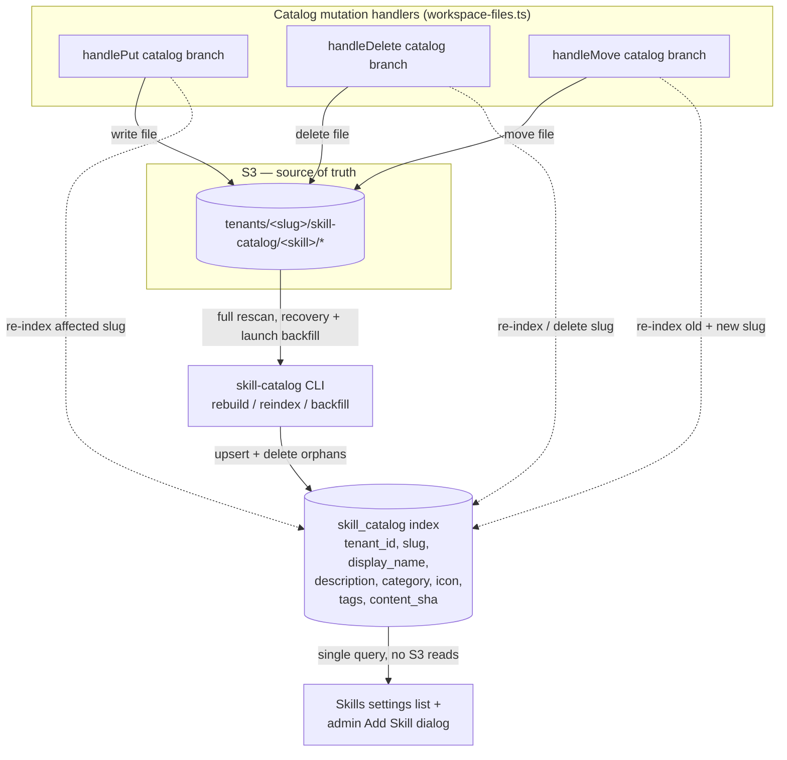

# feat: Skills catalog DB index

## Summary

Re-add a per-tenant `skill_catalog` table that indexes the S3 skill catalog so
the Skills settings page resolves from a single DB query instead of scanning S3
and reading every skill file on each load. S3 stays the source of truth; the
table mirrors per-skill display metadata plus the content SHA. Sync is
write-through — the catalog file mutation handlers re-index the affected
skill(s) inline — with a one-shot backfill and an operator-invocable rebuild as
the drift-recovery valve. The listing also upgrades from raw slugs to human
display names and descriptions.

---

## Problem Frame

The Skills settings list (`apps/spaces/src/components/settings/SettingsSkills.tsx`)
is slow. It calls `listSkillSlugs()` →
`spacesWorkspaceFilesClient.listFiles({ catalog: true })` → `handleCatalogList()`
in `packages/api/workspace-files.ts`, which on **every** load (a) runs a full
`ListObjectsV2` scan of `tenants/<slug>/skill-catalog/`, and (b) reads the full
content of **every file in every skill folder** to compute a per-skill SHA256.
Cost is O(skills × files-per-skill) S3 round-trips per page load. The handler's
own `TODO` proposes "a catalog sha index file" as the fix.

A second surface has the same shape: the admin agent-builder "Add Skill" dialog
(`apps/admin/src/components/agent-builder/AddSkillDialog.tsx`) lists the catalog
and then fetches each skill's `SKILL.md` individually (`getWorkspaceFile`
per-slug, an N+1) to render display metadata client-side.

The catalog used to be indexed in Postgres (`skill_catalog`, `tenant_skills`),
dropped in migration `0131` (#1676) when S3 became source of truth. Dropping the
*index* alongside that move is the regression this plan corrects: S3 stays
authoritative, but a read should not fan out across it.

---

## Key Technical Decisions

- **Index the catalog listing only; install state stays derived.** One
  per-tenant table mirrors what exists in each tenant's S3 catalog. Per-tenant
  install/enabled/version state is **not** reintroduced — it stays derived from
  agent workspaces via `agent_skills` (`packages/api/src/lib/derive-agent-skills.ts`),
  which this plan does not touch (see origin: `docs/brainstorms/2026-06-04-skills-catalog-db-index-requirements.md`).

- **Per-tenant table, not global.** The dropped `skill_catalog` had a global
  unique `slug` and no `tenant_id`. The catalog is per-tenant, so the new table
  keys on `(tenant_id, slug)` with an FK to `tenants(id) ON DELETE CASCADE`. The
  closest existing template is `tenant_workflow_catalog`
  (`packages/database-pg/src/schema/tenant-customize-catalog.ts`), which already
  carries the exact display fields; mirror it.

- **Hand-rolled migration, applied to dev before reading code merges.** The
  table needs a composite unique index and FK ordering, so it ships as a
  hand-rolled `drizzle/0143_*.sql` (not `db:generate`) with the full header
  template and `-- creates:` / `-- creates-constraint:` markers the
  `migration-precheck.yml` and `deploy.yml` drift gates require. The table must
  be applied to dev **before** the Lambda code that reads it is deployed, or the
  bundled-Drizzle Lambdas (`graphql-http` bundles the schema) query a table that
  doesn't exist. (See origin learnings:
  `docs/solutions/workflow-issues/manually-applied-drizzle-migrations-drift-from-dev-2026-04-21.md`,
  `docs/solutions/database-issues/feature-schema-extraction-pattern.md`.)

- **Staged cutover: backfill before the read path flips off S3.** Table
  existence is necessary but not sufficient — the table is *empty* at deploy time,
  so flipping the listing to read the index in the same release would show every
  pre-existing tenant an empty catalog until someone runs the backfill. Sequence
  it: ship and deploy the table (U1) + write-through (U3) + backfill/rebuild
  command (U6) with the listing still scanning S3; run the backfill across all
  tenants; **then** land the read-path flip (U4) in a follow-up so reads cut over
  only once the index is populated. This is the "ship inert" pattern — U4 is the
  dependency gate's payoff, not part of the first deploy.

- **The read summary stays behind the existing admin gate.** The catalog target
  in `workspace-files.ts` already gates the *entire* catalog surface (reads
  included) behind `callerIsTenantAdmin`. The new index-backed summary is served
  through that same gated dispatch — not a new ungated endpoint or resolver — and
  `listIndexedSkills(tenantId)` always receives `tenantId` resolved from the
  caller's token (`resolveCatalogTarget` / `resolveCallerFromAuth`), never a
  caller-supplied request parameter, so the per-tenant partition can't be crossed.

- **Write-through hooks the catalog file mutation handlers — all three.** The
  catalog's only writers are the catalog cases of `handlePut`, `handleDelete`,
  and `handleMove` (its `handleSingleFileMove` / `handleFolderMove` helpers) in
  `packages/api/workspace-files.ts`. Today only `handlePut` has a catalog branch;
  delete and move have no catalog-specific tail (the catalog case falls through to
  a no-op), so write-through is **net-new** code in the delete/move paths, not a
  hook into an existing branch. (The plugin-upload processor and
  `catalog-install`/`reinstall` write to *agent workspaces*, not the catalog — they
  are not write-through points; U3 makes this enumeration a blocking pre-merge
  grep.) After any catalog mutation, re-index the **affected skill slug(s)** by
  listing just that one skill's prefix and upserting or deleting its row. Move
  re-indexes **both** source and destination slugs, resolved inside the move
  helpers after the collision-resolved destination is known (a folder rename
  changes the top-level slug segment itself).

- **The index `content_sha` is display/freshness-only — not a correctness
  authority.** `catalog-reinstall.ts` re-lists S3 and recomputes
  `computeCatalogSkillSha` itself, comparing against the installed copy's
  `.catalog-ref.json.source_sha256` — it never reads the index. So a stale or
  briefly-wrong index SHA degrades only the listing surface and self-heals on the
  next mutation or rebuild; it cannot break an install or the reinstall drift
  check. This bounds the severity of every concurrency/consistency window below.
  Still store `computeCatalogSkillSha` (`packages/api/src/lib/catalog-skill-sha.ts`)
  output so the displayed value stays meaningful.

- **Write-through failure does not fail the mutation — S3 is already committed.**
  The S3 write must precede the index write (you can't index a file that doesn't
  exist yet), so by the time re-index runs the durable write is done and a failed
  re-index cannot roll it back. Returning a 5xx would falsely tell the caller the
  publish failed (and invite a retry) while the file is in fact live — and would
  break AE3 ("appears on next load without a manual rebuild"). Instead, mirror the
  established `syncDerivedAgentSkills` precedent in the same file: return
  `ok: true` with a non-fatal index-warning field and emit a log/metric on
  re-index failure. The operator rebuild is the recovery valve for the rare drift
  this leaves.

- **A reindex with no `SKILL.md` in the prefix skips, it does not write a
  null-metadata row.** A multi-file skill is published as N sequential
  single-file puts, so a mid-upload reindex can see a partial folder. The listing
  summary only surfaces skills whose `SKILL.md` exists; a reindex that finds files
  but no `SKILL.md` leaves the prior row untouched (no half-baked slug-only row,
  no permanently-partial row from an abandoned upload).

- **Per-slug serialization guards the write-through ↔ rebuild ↔ concurrent-write
  races.** Concurrent reindexes of the same slug (double-click publish, two admin
  sessions, a put racing a delete) are read-modify-write over an S3 listing and
  can otherwise commit out of S3-observation order (lost update, or a deleted
  skill's row resurrected by a slow in-flight reindex). Take a per-(tenant, slug)
  `pg_advisory_xact_lock` around each reindex so same-slug reindexes serialize.
  This is cheap and collapses the same-slug lost-update and put/delete-interleave
  windows. Cross-slug ordering is not guarded (not needed — rows are independent).

- **`onConflictDoUpdate`, never `DO NOTHING`.** Upserts on `(tenant_id, slug)`
  refresh the SHA and metadata on re-run. A silent `DO NOTHING` would leave stale
  rows and swallow failures (origin learning:
  `docs/solutions/logic-errors/compile-continuation-dedupe-bucket-2026-04-20.md`).

- **Re-list, not known-delta, for reindex — because the SHA needs the full
  file-set.** `computeCatalogSkillSha` hashes all of a skill's files, so the
  affected-slug prefix listing is required; the mutation's single known path isn't
  sufficient. We accept the small `ListObjectsV2` read-after-write window (a
  listing may momentarily miss the just-written object); the display-only SHA and
  the next mutation/rebuild heal it.

- **Keep the REST listing path; add an index-backed per-skill summary.** Rather
  than reviving the orphaned, resolver-less `SkillCatalogQuery`
  (`apps/spaces/src/lib/graphql-queries.ts`), the existing catalog REST surface
  serves a new per-skill summary response (`{ slug, display_name, description,
  category, icon, tags, sha }`) read from the index in one query. The existing
  flat per-file listing stays for browsing *into* a skill (detail view); the
  list page and admin dialog switch to the summary.

- **Lenient metadata parsing with slug fallback.** Populate display fields via
  `parseSkillMdInternal` (`packages/api/src/lib/skill-md-parser.ts`, the lenient
  catalog-side parser), coercing optional `display_name`/`category`/`icon`/`tags`
  to null when absent; render falls back to the slug when `display_name` is null.

---

## High-Level Technical Design

S3 remains source of truth. The index is a derived projection written by the
three catalog mutation handlers and reconstructable from S3 at any time by the
rebuild command. Reads no longer touch S3.

---

## Requirements Traceability

Origin requirements (see `docs/brainstorms/2026-06-04-skills-catalog-db-index-requirements.md`):

- R1 (single-query read, no S3 fan-out) → U4
- R2 (enriched display, slug fallback) → U4, U5
- R3 (SHA served from index) → U2, U4
- R4 (per-tenant index fields; content in S3) → U1, U2
- R5 (S3 authoritative; rebuild corrects) → U6 + KTDs
- R6 (no install state; no `agent_skills` change) → Scope Boundaries (no unit modifies it)
- R7 (every catalog write path re-indexes) → U3
- R8 (launch backfill) → U6
- R9 (operator rebuild) → U6

Acceptance examples AE1–AE3 are enforced in U4 test scenarios; AE4 in U6.

---

## Implementation Units

### U1. Re-add the per-tenant `skill_catalog` index table

- **Goal:** A per-tenant catalog index table exists in the schema and in dev.
- **Requirements:** R4 (table shape), supports R1/R5.
- **Dependencies:** none.
- **Files:**
  - `packages/database-pg/src/schema/skills.ts` (add `skillCatalog` export + relations alongside `pluginUploads`; already re-exported from `src/schema/index.ts`)
  - `packages/database-pg/drizzle/0143_skill_catalog_index.sql` (new, hand-rolled)
- **Approach:** Mirror `tenant_workflow_catalog`
  (`packages/database-pg/src/schema/tenant-customize-catalog.ts`). Columns:
  `id` uuid PK, `tenant_id` uuid NOT NULL FK → `tenants(id)` ON DELETE CASCADE,
  `slug` text NOT NULL, `display_name` text, `description` text, `category` text,
  `icon` text, `tags` text[], `content_sha` text NOT NULL, `created_at` /
  `updated_at` timestamptz NOT NULL default now(). `uniqueIndex` on
  `(tenant_id, slug)`; secondary `index` on `(tenant_id)`. The `.sql` carries the
  header template (purpose, plan ref, literal `psql` apply command, `to_regclass`
  pre-flight, advisory lock) and `-- creates: public.skill_catalog`,
  `-- creates: public.<unique_index_name>`, `-- creates-constraint:` for the FK.
- **Execution note:** Apply to dev via `psql -f` and paste `\d+ skill_catalog`
  into the PR **before** merging any reading code; `migration-precheck.yml` runs
  `db:migrate-manual` against dev and fails closed on MISSING markers.
- **Patterns to follow:** `tenant-customize-catalog.ts` table + recent ADD-table
  migration `drizzle/0136_goal_ledger.sql` for the marker/header shape.
- **Test scenarios:** `Test expectation: none — DDL/scaffolding.` Verification is
  the drift gate plus the `\d+` confirmation; no behavioral unit test.
- **Verification:** `skill_catalog` present in dev with the composite unique
  index and FK; `db:migrate-manual` reports all `-- creates:` markers PRESENT.

### U2. Catalog-index library: metadata parse, SHA, and upsert/delete/rescan helpers

- **Goal:** A tested, reusable module that maps a skill's catalog files to an
  index row and performs scoped re-index and full rescan against the DB. Ships
  inert (not wired into request paths yet).
- **Requirements:** R3 (SHA parity), R4 (fields), underpins R7/R8/R9.
- **Dependencies:** U1.
- **Files:**
  - `packages/api/src/lib/catalog-index.ts` (new)
  - `packages/api/src/lib/catalog-index.test.ts` (new)
- **Approach:** Functions: `reindexSkill(tenantId, slug)` — take a
  per-`(tenant, slug)` `pg_advisory_xact_lock`, list that one skill's catalog
  prefix; if files include `SKILL.md`, parse metadata via `parseSkillMdInternal`,
  compute `computeCatalogSkillSha`, `db.insert(skillCatalog).values(...)
  .onConflictDoUpdate({ target: [tenant_id, slug], set: { ...metadata,
  content_sha, updated_at: now() } })`; if no files at all, delete the row; if
  files exist but no `SKILL.md` (partial/mid-upload folder), **skip** — leave any
  prior row untouched, do not write a null-metadata row. `rescanTenant(tenantId)`
  — list all skills, reindex each, delete index rows whose slug no longer exists
  in S3 (orphan sweep guarded per U6), return counts (`skillsInS3`,
  `rowsUpserted`, `rowsDeleted`). `listIndexedSkills(tenantId)` — single SELECT
  scoped to `tenant_id` returning the per-skill summary rows; **`tenantId` is
  always caller-derived, never a request parameter** (callers must pass the
  token-resolved tenant). Metadata coercion defends against the lenient parser
  (null-coerce optional fields, array-coerce `tags`). Note the stored `content_sha`
  is display/freshness-only (see KTDs) — not consumed by reinstall drift checks.
- **Patterns to follow:** upsert shape from
  `packages/api/src/graphql/resolvers/customize/enableWorkflow.mutation.ts`
  (`onConflictDoUpdate`); SHA from `packages/api/src/lib/catalog-skill-sha.ts`;
  parser from `packages/api/src/lib/skill-md-parser.ts` (`parseSkillMdInternal`).
- **Test scenarios:**
  - Happy: a skill folder with valid `SKILL.md` frontmatter → row with
    display_name/description/category/icon/tags populated and `content_sha`
    equal to `computeCatalogSkillSha` of its files.
  - Edge: `SKILL.md` present but missing frontmatter → row inserted with null
    display fields (slug-fallback at render time); `tags` absent → null, not `[]`
    crash.
  - Edge: prefix has files but **no `SKILL.md`** (mid-upload) → reindex skips, no
    row written; a prior row for that slug is left intact.
  - Edge: upload abandoned after a non-`SKILL.md` file → no partial row persists.
  - Upsert: reindex of an existing slug with changed file content → same row
    UPDATED with new sha + metadata (not duplicated, not skipped).
  - Delete: reindex of a slug whose files were all removed → row deleted.
  - Rescan: mixed state (new slug, changed slug, removed slug) → inserts, updates,
    and orphan deletes happen; returned counts match S3 reality.
  - Tenant isolation: reindex/rescan for tenant A never touches tenant B rows.
- **Verification:** `npx vitest run packages/api/src/lib/catalog-index.test.ts`
  green; module imported nowhere in request paths yet.

### U3. Write-through: re-index on catalog put / delete / move

- **Goal:** Every catalog file mutation keeps the index current inline.
- **Requirements:** R7.
- **Dependencies:** U2.
- **Files:**
  - `packages/api/workspace-files.ts` (catalog branches of `handlePut` ~L1093,
    `handleDelete` ~L1417, `handleMove` ~L1732)
  - `packages/api/test/integration/*` (write-through integration coverage; mirror
    existing workspace-files integration test location)
- **Approach:** After a successful catalog S3 mutation, call
  `reindexSkill(tenantId, affectedSlug)` (slug via `catalogPathSlug(path)`). Note
  `handlePut` is the only handler with an existing catalog branch — `handleDelete`
  and the move helpers (`handleSingleFileMove`, `handleFolderMove`) currently have
  no catalog tail, so this adds a net-new catalog post-mutation branch in each.
  For moves, run the re-index **inside the helper after the collision-resolved
  destination is known**, re-indexing both `catalogPathSlug(cleanFrom)` and
  `catalogPathSlug(finalDest)` (folder rename changes the top-level slug). The S3
  write is already committed when re-index runs, so on re-index failure **return
  `ok: true` with a non-fatal index-warning and emit a log/metric** — do not fail
  the response (a 5xx would falsely report the durable write as failed; the
  rebuild valve repairs the rare drift). Mirror the post-write
  `syncDerivedAgentSkills` precedent in this file (origin learning:
  `docs/solutions/database-issues/brain-enrichment-approval-must-sync-wiki-sections-2026-05-02.md`).
- **Patterns to follow:** the existing put-triggered `deriveAgentSkills` hook in
  `workspace-files.ts` is the precedent for a post-write re-derivation seam that
  signals failure without rolling back the S3 write.
- **Test scenarios:**
  - Covers R7. Put a new file under a new skill slug (with `SKILL.md`) → index row
    appears with correct sha and metadata.
  - Put an updated file in an existing multi-file skill → row's sha refreshes,
    no duplicate row.
  - Delete one file of a multi-file skill → row remains, sha updated.
  - Delete the last file of a skill → row removed.
  - Move/rename a skill folder → old slug row removed (or sha-updated if files
    remain), new slug row created.
  - A non-catalog put (agent workspace path) → no index mutation.
  - Re-index failure → response is still `ok: true` with an index-warning; a
    metric/log is emitted (not a 5xx).
  - Concurrency: a put-reindex and a delete-reindex interleaved on the same slug →
    serialized by the advisory lock; final state matches the last S3 state (no
    resurrected row for a deleted skill).
- **Verification:** integration tests green; a grep confirms no
  `PutObjectCommand` / `CopyObjectCommand` / `DeleteObjectCommand` targets the
  `tenants/*/skill-catalog/` prefix outside `workspace-files.ts` — if any are
  found, hook write-through there before merging (closes the R7 enumeration); manual
  put/delete/move against dev reflects in `skill_catalog` rows.

### U4. Read path: serve the listing from the index

- **Goal:** The Skills settings list resolves from one DB query with enriched
  display and zero per-file content reads.
- **Requirements:** R1, R2, R3.
- **Dependencies:** U1, U2, and U6 backfill **run in the environment** — this is
  the cutover unit: it flips reads off S3, so it lands only after the index is
  populated (staged-cutover KTD). Ships in a follow-up release to U1/U3/U6.
- **Files:**
  - `packages/api/workspace-files.ts` (catalog summary branch → `listIndexedSkills`,
    served through the existing `callerIsTenantAdmin`-gated catalog dispatch)
  - `apps/spaces/src/lib/workspace-files-api.ts` (`listSkillSlugs` → index-backed
    summary)
  - `apps/spaces/src/components/settings/SettingsSkills.tsx` (render name +
    description, slug fallback)
- **Approach:** Add a per-skill summary response served from `listIndexedSkills`
  through the **same admin-gated catalog dispatch** that serves the catalog today
  (no new ungated path); `tenantId` is caller-derived. The summary lists only
  skills with a `SKILL.md`-backed row (partial uploads are not surfaced — see U2
  skip rule). Point `SettingsSkills` at it; render `display_name` (fallback slug) +
  description, optionally category/icon. The flat per-file catalog list stays for
  the detail view. After catalog-mutating actions, drive a `network-only` refetch
  so the list reflects the fresh index (origin learning:
  `docs/solutions/integration-issues/spaces-urql-doc-cache-no-live-invalidation.md`).
- **Patterns to follow:** existing `handleCatalogList` request/response wiring;
  spaces client query conventions in `workspace-files-api.ts`.
- **Test scenarios:**
  - Covers AE1. Tenant with N skills → response built from a single DB query;
    zero per-skill `GetObject` content reads on the request path.
  - Covers AE2. Skill with display metadata → name + description shown; skill
    without → slug shown.
  - Covers AE3. After a skill is published (write-through from U3), it appears on
    next load; after removal, it disappears — no manual rebuild.
  - Edge: empty catalog → empty list, no error.
  - SHA: summary `sha` equals `computeCatalogSkillSha` for the skill.
  - Tenant isolation: tenant A's list never includes tenant B's skills.
- **Verification:** Skills settings page loads from the index (no per-file reads
  in logs); names/descriptions render with slug fallback.

### U5. Point the admin "Add Skill" dialog at the index listing

- **Goal:** The admin agent-builder skill picker drops its per-slug `SKILL.md`
  N+1 and reads metadata from the index summary.
- **Requirements:** R2.
- **Dependencies:** U4.
- **Files:**
  - `apps/admin/src/components/agent-builder/AddSkillDialog.tsx`
- **Approach:** Replace the `listWorkspaceFiles({catalog:true})` +
  per-slug `getWorkspaceFile(SKILL.md)` pattern with the index-backed summary
  (one call). Preserve existing display/selection behavior.
- **Patterns to follow:** the spaces `SettingsSkills` consumption added in U4.
- **Test scenarios:**
  - Dialog renders the skill list from the summary with no per-slug fetches.
  - Display name + description render; slug fallback when metadata absent.
  - Loading and empty states behave as before.
- **Verification:** dialog opens with a single list call; network panel shows no
  per-skill `SKILL.md` fetches.

### U6. `skill catalog rebuild` CLI: backfill and rebuild

- **Goal:** An operator can backfill existing catalogs and rebuild a drifted
  index from S3, with reported counts. Backfill and rebuild are the same
  synchronous reconcile operation.
- **Requirements:** R5, R8, R9.
- **Dependencies:** U2 (rescan helper); reads U1's table.
- **Files:**
  - `apps/cli/src/commands/skill.ts` (reactivate the existing retired `catalog`
    slot with a single `rebuild` subcommand — no new top-level command, no
    `reindex`/`status` subcommands: there is no async job to poll, so the `wiki`
    three-verb shape doesn't apply to a synchronous reconcile)
  - the API/admin action the CLI calls (a handler that invokes `rescanTenant`)
  - `apps/cli/__tests__/*` (CLI command tests)
- **Approach:** A single `skill catalog rebuild` with `-s/--stage`, `-t/--tenant`,
  `--all`, `--dry-run`, `-y/--yes` (Cognito auth + `getApiEndpoint`, mirroring
  `skill push`). The command calls a deployed action that runs `rescanTenant`
  (S3 reads must run server-side, not a psql step). **Authorization:** a
  single-tenant rebuild requires `callerIsTenantAdmin` for that tenant; `--all`
  (cross-tenant iteration) requires platform-operator status (`isPlatformOperator`
  / `THINKWORK_PLATFORM_OPERATOR_EMAILS`) or an apikey credential — a tenant admin
  must not be able to rescan every tenant. **Rebuild-vs-write-through race:** the
  orphan sweep deletes only rows whose `updated_at` predates the rebuild's start
  timestamp, so a row a concurrent publish inserted after rebuild began is not
  erased (combined with the per-slug advisory lock from U2). Report absolute counts
  (`skills in S3`, `rows upserted`, `rows deleted`) — not denominator-relative —
  and use `RequestResponse` with surfaced errors, never fire-and-forget (origin
  learnings: backfill-audit + fire-and-forget conventions).
- **Patterns to follow:** `skill push` auth/endpoint resolution in
  `apps/cli/src/commands/skill.ts`; `apps/cli/src/commands/wiki.ts` for the
  stage/tenant option wiring only (not its three-verb async shape).
- **Test scenarios:**
  - Covers AE4. Drifted index (missing row, stale metadata, stale sha) → after
    rebuild, index exactly matches current S3 catalog.
  - `--dry-run` reports the diff without writing.
  - `--tenant` scopes to one tenant; `--all` requires platform-operator (a plain
    tenant admin invoking `--all` is rejected).
  - Idempotent: a second rebuild with no S3 change writes nothing new, reports
    zero deltas.
  - Orphan deletion: a slug removed from S3 → its index row deleted on rebuild.
  - Concurrency: a publish lands mid-rebuild → the new row survives the orphan
    sweep (the `updated_at`-after-start guard).
  - Error surfacing: a failed server action returns non-zero with a clear message
    (not a silent success).
- **Verification:** `npx vitest run` for the CLI tests green; `skill catalog
  rebuild -s dev -t <tenant>` reconciles the index to S3 with reported counts.

---

## Scope Boundaries

Carried from origin (`docs/brainstorms/2026-06-04-skills-catalog-db-index-requirements.md`):

- Per-tenant install / enabled / version state in the DB — **out**. Stays derived
  from the workspace (`agent_skills`); `tenant_skills` is not reintroduced.
- Changes to `agent_skills` or its derivation — **out**.
- A periodic background reconciler — **out**; the operator rebuild is the accepted
  recovery path.
- Letting the agent runtime or other surfaces read skill metadata from the DB
  instead of S3 — **out**; this serves the listing surfaces only.
- An S3-side index file — **rejected** in favor of the DB table.

### Deferred to Follow-Up Work

- Reviving a clean GraphQL `SkillCatalog` query/resolver to replace the REST
  listing surface — deferred; this plan extends the existing REST path.
- A scheduled drift audit (the rebuild's count reporting could feed an alarm) —
  deferred; not needed for v1.

---

## Risks & Dependencies

- **Incomplete write-through silently drifts the index.** Mitigation: the catalog
  write surface is a closed set of three handlers (U3); a pre-merge grep gate
  (U3 verification) confirms no catalog-prefix writer exists outside
  `workspace-files.ts`; integration tests cover put/delete/move including the
  multi-file, rename, and interleave edge cases; the rebuild command is the
  recovery valve.
- **Empty-table cutover.** The table is empty at deploy time; flipping reads off
  S3 before backfilling would show existing tenants an empty catalog. Mitigation:
  the staged-cutover KTD — U4 (read flip) lands only after U6 backfill has run, in
  a release after U1/U3/U6.
- **Deploy ordering.** The `0143` migration must be applied to dev before the
  reading/writing Lambda code (bundled into `graphql-http`) deploys, and
  `pnpm build:lambdas` must rebuild the bundled-Drizzle handlers. Sequence:
  apply table → merge U3 write-through + U6 command → post-merge deploy →
  run backfill (`skill catalog rebuild --all`) → merge U4 read flip → deploy.
  (Origin learnings cited in KTDs.)
- **Concurrency drift (bounded, self-healing).** Same-slug racing reindexes,
  put/delete interleaves, and rebuild-vs-publish can momentarily mis-state a row.
  Mitigation: per-`(tenant, slug)` advisory lock (U2) plus the `updated_at`-guarded
  orphan sweep (U6). Residual windows self-heal on the next mutation or rebuild,
  and because `content_sha` is display-only (KTDs) they never break an install or
  the reinstall drift check.
- **Tenant deletion cascades the index.** The FK `ON DELETE CASCADE` wipes a
  tenant's `skill_catalog` rows on tenant deletion — correct for a derived cache
  (S3 is authoritative; rebuild reconstructs), but implementers should confirm no
  audit/soft-delete expectation on `tenants` is bypassed by the cascade.
- **Client cache staleness.** urql document cache won't auto-invalidate the list
  after a mutation; U4 drives a `network-only` refetch.

---

## Sources & Research

- Origin: `docs/brainstorms/2026-06-04-skills-catalog-db-index-requirements.md`
- Read/slow path: `packages/api/workspace-files.ts` (`handleCatalogList`,
  `handlePut`/`handleDelete`/`handleMove` catalog branches, `catalogPathSlug`),
  `apps/spaces/src/components/settings/SettingsSkills.tsx`,
  `apps/spaces/src/lib/workspace-files-api.ts`,
  `apps/admin/src/components/agent-builder/AddSkillDialog.tsx`
- SHA + parser: `packages/api/src/lib/catalog-skill-sha.ts`,
  `packages/api/src/lib/skill-md-parser.ts` (`parseSkillMdInternal`)
- Drift consumers (preserve contract): `packages/api/src/lib/catalog-reinstall.ts`,
  `packages/api/src/lib/catalog-install.ts`,
  `packages/api/src/types/catalog-skill.ts`
- Schema template + migration shape:
  `packages/database-pg/src/schema/tenant-customize-catalog.ts`,
  `packages/database-pg/drizzle/0136_goal_ledger.sql`,
  `packages/database-pg/drizzle/0131_drop_skill_catalog_and_tenant_skills.sql`
- DB client + upsert pattern: `packages/database-pg/src/db.ts`,
  `packages/api/src/graphql/resolvers/customize/enableWorkflow.mutation.ts`
- CLI template: `apps/cli/src/commands/wiki.ts`, `apps/cli/src/commands/skill.ts`
- Learnings:
  `docs/solutions/workflow-issues/manually-applied-drizzle-migrations-drift-from-dev-2026-04-21.md`,
  `docs/solutions/database-issues/feature-schema-extraction-pattern.md`,
  `docs/solutions/architecture-patterns/workspace-skills-load-from-copied-agent-workspace-2026-04-28.md`,
  `docs/solutions/database-issues/brain-enrichment-approval-must-sync-wiki-sections-2026-05-02.md`,
  `docs/solutions/integration-issues/spaces-urql-doc-cache-no-live-invalidation.md`,
  `docs/solutions/logic-errors/compile-continuation-dedupe-bucket-2026-04-20.md`
