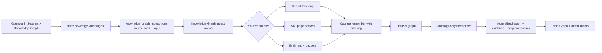

# feat: Ingest Ontology-Shaped Wiki and Brain Data into Knowledge Graph

## Overview

Add a Knowledge Graph ingest path for known, already-structured ThinkWork data
from Compounding Memory wiki pages and Company Brain entity pages. This is a
follow-up validation source, not a replacement for Phase II thread ingest. The
goal is to prove Cognee can render useful graph data when the source is closer
to the approved business ontology than raw chat transcripts.

This plan preserves the current ontology-only graph gate. It does not weaken
normalization or let Cognee-inferred generic entities become trusted graph
output. Instead, it introduces source adapters that emit ontology-shaped
document packets from existing `wiki` and `brain` records, then runs them
through the same Cognee + ThinkWork normalization pipeline with source-aware
evidence and diagnostics.

---

## Problem Frame

The thread-ingest path is now observable, but the Bunkhouse smoke showed a bad
source fit: Cognee returns raw graph data, yet most nodes are Cognee structural
scaffolding or unapproved generic entities, so the approved graph remains empty.
That is useful diagnostic evidence, but it is not useful product value.

ThinkWork already has better candidates for a first useful Knowledge Graph:
compiled wiki pages, tenant entity pages, aliases, page links, facets, and
section sources. Those records already carry stable titles, typed page shape,
ontology subtypes, relationships, and provenance. Ingesting them as
ontology-shaped graph source should produce a visible approved graph without
turning raw message inference into authority.

---

## Requirements Trace

- R1-R5. Continue using approved ontology definitions as constraints. This plan
  intentionally adds a follow-up source event that is not thread messages:
  selected wiki/brain pages whose structure is already closer to the ontology.
  It does not make wiki/brain the primary Phase II source or remove thread
  ingest.
- R6-R10. Keep Settings > Knowledge Graph as the operator surface and extend
  existing ingest/run history to distinguish source kind, source scope, counts,
  duration, and errors.
- R11-R16. Preserve one filtered Table/Graph dataset, with only approved
  ontology entities and relationships in the main graph and diagnostics for
  anything dropped.
- R17-R20. Entity detail remains read-only and should show source wiki/brain
  evidence when graph rows originate from wiki/brain packets.
- R21-R22. Do not route agents through Cognee and do not create a graph or
  ontology editing workflow.

**Origin actors:** A1 tenant operator/admin, A3 source data provider, A4
approved ontology layer, A5 Cognee service.

**Origin flows:** F1 manual ingest, F2 explore graph output, F3 inspect entity
provenance.

**Origin acceptance examples:** AE1-AE5 remain relevant; this plan adds a
source-selection variant of manual ingest and evidence inspection.

---

## Scope Boundaries

- No weakening of the ontology-only gate in `normalizeCogneeGraph`.
- No use of Cognee output for agent retrieval.
- No ontology change-set generation, approval, or schema mutation in this unit.
- No direct browser calls to Cognee.
- No tenant-wide automatic ingest scheduler.
- No destructive rebuild of wiki or brain data.
- No attempt to ingest every source type in Context Engine.

### Deferred to Follow-Up Work

- Automatic end-of-compile wiki/brain graph refresh.
- Tenant-wide graph rollups across all users and spaces.
- Ontology expansion or mapping based on dropped Cognee diagnostics.
- Agent retrieval backed by validated Knowledge Graph data.
- A curated demo seed pack if existing dogfood wiki/brain rows are too sparse.

---

## Context & Research

### Relevant Code and Patterns

- `packages/api/src/handlers/knowledge-graph-thread-ingest.ts` owns the
  current worker flow: load run, load source data, export ontology, ingest into
  Cognee, fetch dataset graph, normalize, replace snapshot.
- `packages/api/src/lib/knowledge-graph/cognee-client.ts` already supports
  `remember`, ontology upload, dataset graph retrieval, and transcript form
  upload. Its `add_cognify` path should be treated as legacy compatibility, not
  the target API for this follow-up.
- `packages/api/src/lib/knowledge-graph/normalizer.ts` is the ontology gate and
  now captures dropped raw Cognee samples in run metrics.
- `packages/api/src/lib/knowledge-graph/ontology-export.ts` exports approved
  ontology definitions as both custom prompt and OWL.
- `packages/database-pg/src/schema/knowledge-graph.ts` stores ingest runs,
  normalized entities, normalized relationships, and evidence.
- `packages/database-pg/graphql/types/knowledge-graph.graphql` currently exposes
  thread ingest only through `StartKnowledgeGraphThreadIngestInput`.
- `packages/api/src/lib/wiki/repository.ts` centralizes wiki pages, links,
  aliases, sections, places, unresolved mentions, and section sources.
- `packages/api/src/lib/brain/repository.ts` centralizes tenant entity pages,
  aliases, links, sections, and section sources.
- `apps/spaces/src/components/settings/knowledge-graph/KnowledgeGraphExplorer.tsx`
  and sibling components are the source-selection and run-detail UI target.
- `scripts/smoke/knowledge-graph-thread-ingest-smoke.mjs` is the pattern for a
  deployed smoke that asserts run status and graph visibility.

### Institutional Learnings

- `docs/solutions/best-practices/business-ontology-change-set-loop-2026-05-17.md`
  warns against silently turning inferred patterns into durable ontology. This
  plan reads approved ontology; it does not write it.
- `docs/solutions/best-practices/probe-every-pipeline-stage-before-tuning-2026-04-20.md`
  applies directly: the implementation should measure source packet counts,
  Cognee raw graph counts, normalized counts, and dropped counts separately.
- `docs/solutions/database-issues/brain-enrichment-approval-must-sync-wiki-sections-2026-05-02.md`
  is relevant to evidence integrity: brain/wiki source rows must stay aligned
  with visible page/facet state.

### External References

- Cognee API reference documents `/api/v1` endpoints and dataset graph
  inspection: https://docs.cognee.ai/api-reference/introduction
- Cognee v1.0's main operations are `remember`, `recall`, `improve`, and
  `forget`; legacy `add`, `cognify`, `memify`, and `search` remain lower-level
  building blocks rather than the preferred workflow:
  https://docs.cognee.ai/core-concepts/overview
- Cognee `remember` is the main ingestion entry point in v1.0. In permanent
  memory mode it normalizes data, builds graph nodes/edges, creates embeddings,
  and can run a follow-up improvement pass:
  https://docs.cognee.ai/core-concepts/main-operations/remember
- Cognee `improve` enriches an existing graph after ingestion and can add
  derived retrieval structures or bridge session memory into the permanent
  graph. Use it only if the source-shaped `remember` run needs post-ingest
  enrichment:
  https://docs.cognee.ai/core-concepts/main-operations/improve
- Cognee ontology guidance emphasizes formal grounding and the `ontology_valid`
  flag as downstream trust evidence:
  https://www.cognee.ai/blog/deep-dives/grounding-ai-memory

---

## Key Technical Decisions

- **Add a source-kind abstraction before adding more handlers.** The current
  thread worker should evolve into a shared Knowledge Graph ingest worker that
  delegates source loading/rendering to adapters for `thread`, `wiki`, and
  `brain`.
- **Use wiki/brain as ontology-shaped source, not as raw prose only.** Render
  each selected page as a compact packet with stable entity id, title, approved
  type/subtype, aliases, summary, sections/facets, relationships, and
  citations. Include prose, but make the structure explicit.
- **Keep Cognee in the loop.** The purpose is still to test Cognee graph
  materialization. The adapter should not bypass Cognee by writing normalized
  graph rows directly, except in tests or explicit fallback diagnostics.
- **Use one dataset namespace per source scope.** Keep thread datasets as-is and
  add names such as `thinkwork:<tenantId>:wiki:<ownerId>:run:<runId>` and
  `thinkwork:<tenantId>:brain:run:<runId>` so runs are inspectable and avoid
  accidental cross-source contamination.
- **Persist source kind and source scope on runs.** The run ledger should show
  whether a graph came from thread, wiki, brain, or a future source, with enough
  input metadata for the UI and smoke scripts to reproduce it.
- **Evidence should point back to wiki/brain rows.** Use `sourceKind:
cognee_payload` or add schema/API support for source kinds that can represent
  `wiki_page`, `wiki_section`, `brain_page`, `brain_section`, and section source
  refs without overloading `messageId`.
- **Prefer existing approved subtype fields.** Wiki `entity_subtype` and Brain
  `entity_subtype` should be mapped to approved ontology type slugs. Pages
  without approved subtypes can be included as diagnostics, but not trusted
  main-graph nodes.
- **Start with a small deterministic source scope.** The first production smoke
  should ingest a bounded set of known dogfood pages, not the entire tenant.

---

## Open Questions

### Resolved During Planning

- **Can this ingest wiki/brain despite the original Phase II "not Wiki
  downstream" decision?** Yes, as a follow-up validation source. Thread ingest
  remains the Phase II manual source path, but raw thread messages are proving
  too weak for a useful approved graph. Wiki/brain ingest is explicitly scoped
  to proving Cognee against already structured, ontology-shaped ThinkWork data.
- **Should the ontology gate be weakened to make the graph non-empty?** No. The
  main graph still contains only approved ontology entities and relationships.
  Diagnostics explain drops; source shaping and ontology mapping are the levers.

### Deferred to Implementation

- **Exact source selection defaults:** The first implementation should prefer
  explicit page ids for smoke and UI actions. If the UI needs a fallback, choose
  a small recent active-page sample during implementation based on available
  GraphQL patterns.
- **Exact Cognee v1 ingestion controls:** Start with `remember` permanent memory
  mode, ontology key, source packet metadata, and a structured custom prompt. If
  Cognee still ignores packet structure, research the current v1 graph-shaping
  mechanism during U3 rather than assuming the legacy `cognify`/`graph_model`
  controls are still the right path.

---

## High-Level Technical Design

> _This illustrates the intended approach and is directional guidance for
> review, not implementation specification. The implementing agent should treat
> it as context, not code to reproduce._

---

## Implementation Units

- U1. **Add source-aware ingest run contract**

**Goal:** Extend the Knowledge Graph run model and GraphQL contract so an ingest
run can represent `thread`, `wiki`, or `brain` source scopes while preserving
existing thread ingest behavior.

**Requirements:** R1-R10, R21-R22

**Dependencies:** None

**Files:**

- Modify: `packages/database-pg/src/schema/knowledge-graph.ts`
- Modify: `packages/database-pg/graphql/types/knowledge-graph.graphql`
- Modify: `packages/api/src/graphql/resolvers/knowledge-graph/startThreadIngest.mutation.ts`
- Modify: `packages/api/src/graphql/resolvers/knowledge-graph/ingestRuns.query.ts`
- Modify: `packages/api/src/graphql/resolvers/knowledge-graph/mappers.ts`
- Test: `packages/database-pg/__tests__/knowledge-graph-schema.test.ts`
- Test: `packages/api/src/__tests__/knowledge-graph-start-ingest.test.ts`
- Test: `packages/api/src/__tests__/knowledge-graph-resolvers.test.ts`

**Approach:**

- Add a run `source_kind` field or equivalent input metadata that can be indexed
  and rendered without parsing arbitrary JSON.
- Prefer explicit run scope columns: `source_kind`, `source_ref`, and nullable
  `thread_id`, plus matching nullable `thread_id` or `source_ref` on normalized
  entity, relationship, and evidence rows. If nulling `thread_id` creates too
  much migration blast radius, introduce a stable synthetic `source_ref` and
  keep `thread_id` only for thread runs while all source-agnostic reads use the
  new source columns.
- Introduce a source-general mutation name such as
  `startKnowledgeGraphIngest`, while preserving `startKnowledgeGraphThreadIngest`
  as a compatibility wrapper if existing UI/tests still use it.
- Define source inputs for thread id, wiki owner/user scope plus page ids or
  query, and brain page ids or bounded tenant-scope selection.
- Update uniqueness and active-run constraints from tenant/thread only to
  tenant/source-kind/source-ref, with thread runs using their thread id as the
  source ref.
- Ensure tenant resolution still uses existing `resolveCallerTenantId` and
  source-specific authorization checks.

**Patterns to follow:**

- `packages/api/src/graphql/resolvers/knowledge-graph/startThreadIngest.mutation.ts`
- `packages/api/src/graphql/resolvers/wiki/compileWikiNow.mutation.ts`
- `packages/database-pg/graphql/types/knowledge-graph.graphql`

**Test scenarios:**

- Happy path: starting a thread ingest through the existing mutation still
  creates a queued run with source kind `thread`.
- Happy path: starting a wiki or brain ingest creates a queued run with source
  kind, input scope, dataset name, and requester id recorded.
- Edge case: a missing or invalid source scope is rejected before worker invoke.
- Error path: a user from another tenant cannot start ingest for wiki/brain rows
  outside their tenant.
- Integration: query run history returns source kind and input fields needed by
  Spaces without breaking existing thread list run status.

**Verification:**

- Existing thread ingest tests continue to pass.
- New source-aware run rows are visible through GraphQL with stable, typed
  source metadata.

---

- U2. **Create wiki and brain graph source adapters**

**Goal:** Convert selected wiki pages and Brain entity pages into deterministic
ontology-shaped source packets for Cognee ingestion.

**Requirements:** R1-R5, R11-R20

**Dependencies:** U1

**Files:**

- Create: `packages/api/src/lib/knowledge-graph/source-adapters.ts`
- Create: `packages/api/src/lib/knowledge-graph/wiki-source.ts`
- Create: `packages/api/src/lib/knowledge-graph/brain-source.ts`
- Modify: `packages/api/src/lib/wiki/repository.ts`
- Modify: `packages/api/src/lib/brain/repository.ts`
- Test: `packages/api/src/lib/knowledge-graph/wiki-source.test.ts`
- Test: `packages/api/src/lib/knowledge-graph/brain-source.test.ts`

**Approach:**

- Define a shared source packet shape with source id, source kind, title, entity
  type slug, aliases, summary, body sections, outgoing relationships, and
  evidence citations.
- Wiki adapter reads active pages, aliases, links, sections, and section sources
  for a bounded owner/user scope or explicit page ids.
- Brain adapter reads active tenant entity pages, aliases, page links, sections,
  and section sources for explicit page ids or a bounded tenant selection.
- Map `entity_subtype` to ontology entity type slug when approved; flag missing
  or unapproved subtypes in packet diagnostics.
- Render packets as Markdown or JSON-lines text that Cognee can ingest, with
  explicit ontology labels and relationship declarations near the prose.
- Record source row ids in packet metadata so the normalizer can attach
  evidence back to wiki/brain records.

**Patterns to follow:**

- `packages/api/src/lib/knowledge-graph/thread-transcript.ts`
- `packages/api/src/lib/wiki/repository.ts`
- `packages/api/src/lib/brain/repository.ts`
- `packages/api/src/lib/context-engine/providers/wiki.ts`
- `packages/api/src/lib/context-engine/providers/brain.ts`

**Test scenarios:**

- Happy path: a wiki entity page with approved `entity_subtype`, aliases,
  section text, section sources, and a page link renders one packet with a
  known entity declaration and relationship hint.
- Happy path: a Brain customer/opportunity/person page renders as an approved
  ontology entity packet with facet citations.
- Edge case: a page without approved subtype is included as diagnostic source
  material but marked untrusted for normalization.
- Edge case: empty sections or archived pages are excluded from source packets.
- Error path: an invalid owner id or tenant mismatch returns no packets and does
  not leak titles from another tenant.

**Verification:**

- Adapter fixtures produce deterministic packet text and metadata snapshots.
- Packet counts and skipped-page diagnostics are available to run metrics.

---

- U3. **Generalize the ingest worker and Cognee client inputs**

**Goal:** Reuse the current worker pipeline for thread, wiki, and brain sources,
with source-aware dataset names, node sets, custom prompts, and metrics.

**Requirements:** R1-R10, R21-R22

**Dependencies:** U1, U2

**Files:**

- Modify: `packages/api/src/handlers/knowledge-graph-thread-ingest.ts`
- Modify: `packages/api/src/lib/knowledge-graph/cognee-client.ts`
- Modify: `packages/api/src/lib/knowledge-graph/ontology-export.ts`
- Modify: `packages/api/src/lib/knowledge-graph/repository.ts`
- Test: `packages/api/src/handlers/knowledge-graph-thread-ingest.test.ts`
- Test: `packages/api/src/lib/knowledge-graph/cognee-client.test.ts`
- Test: `packages/api/src/lib/knowledge-graph/ontology-export.test.ts`
- Test: `packages/api/src/lib/knowledge-graph/runs.test.ts`

**Approach:**

- Keep the deployed Lambda entry point name if that minimizes infrastructure
  churn, but make its internal event/process function source-aware.
- For thread runs, preserve current transcript rendering and dataset naming.
- For wiki/brain runs, load packets through the new adapters and upload one
  synthetic source document containing bounded, structured packet content via
  Cognee v1 permanent `remember`.
- Add source-specific `node_set` values such as `thinkwork_wiki` and
  `thinkwork_brain` alongside tenant and run identifiers.
- Add a source-specific custom prompt section for `remember` that asks Cognee to
  preserve the declared entity labels, approved type slugs, relationship names,
  and citations from the packet rather than inventing generic entities.
- Keep the existing `add_cognify` client path only as a guarded legacy fallback
  for older deployments. New implementation and tests should assert the v1
  `remember` path first.
- Store metrics for source packet count, skipped source count, Cognee raw graph
  counts, normalized counts, dropped counts, and sample drop reasons.

**Patterns to follow:**

- `packages/api/src/handlers/knowledge-graph-thread-ingest.ts`
- `packages/api/src/lib/knowledge-graph/cognee-client.ts`
- `packages/api/src/lib/knowledge-graph/repository.ts`

**Test scenarios:**

- Happy path: a wiki run loads packets, calls Cognee with source-specific node
  sets, fetches graph, normalizes, and marks the run succeeded.
- Happy path: a brain run does the same and records packet/source metrics.
- Edge case: zero eligible wiki/brain packets fails the run with a clear error
  and metrics showing skipped source counts.
- Error path: Cognee remember failure records the source kind, packet count, and
  error without replacing the previous successful snapshot.
- Integration: existing forced thread ingest smoke behavior is unchanged.

**Verification:**

- The same worker can process thread and non-thread runs from fixtures.
- Metrics make every pipeline stage observable.

---

- U4. **Normalize wiki/brain evidence into graph rows**

**Goal:** Make normalized entities and relationships from wiki/brain packets
carry useful source evidence and detail-sheet provenance.

**Requirements:** R11-R20

**Dependencies:** U2, U3

**Files:**

- Modify: `packages/api/src/lib/knowledge-graph/normalizer.ts`
- Modify: `packages/api/src/lib/knowledge-graph/repository.ts`
- Modify: `packages/database-pg/src/schema/knowledge-graph.ts`
- Modify: `packages/database-pg/graphql/types/knowledge-graph.graphql`
- Modify: `packages/api/src/graphql/resolvers/knowledge-graph/entity.query.ts`
- Modify: `packages/api/src/graphql/resolvers/knowledge-graph/mappers.ts`
- Test: `packages/api/src/lib/knowledge-graph/normalizer.test.ts`
- Test: `packages/api/src/__tests__/knowledge-graph-resolvers.test.ts`
- Test: `packages/database-pg/__tests__/knowledge-graph-schema.test.ts`

**Approach:**

- Extend evidence source kinds or evidence metadata so wiki/brain citations do
  not masquerade as thread messages.
- Teach normalization to match Cognee nodes back to source packet ids, labels,
  type slugs, aliases, and relationship hints when Cognee preserves that data.
- Preserve the hard gate: only approved entity types and approved relationship
  endpoint pairs become main graph rows.
- Keep dropped raw Cognee samples in run metrics when Cognee produces
  unapproved or structural output.
- Ensure detail GraphQL returns enough evidence metadata for Spaces to link
  back to source title/section labels in a compact way.

**Patterns to follow:**

- Existing dropped sample metrics in `packages/api/src/lib/knowledge-graph/normalizer.ts`
- `packages/api/src/graphql/resolvers/wiki/mappers.ts`
- `packages/api/src/graphql/resolvers/brain/mappers.ts`

**Test scenarios:**

- Happy path: Cognee output matching packet entity ids and approved type slugs
  normalizes to graph rows with wiki/brain evidence.
- Happy path: approved relationship labels and allowed endpoint types normalize
  to graph edges with section/facet evidence.
- Edge case: Cognee returns the right labels but wrong relationship endpoint
  types; the edge is dropped with `incompatible_endpoint`.
- Error path: malformed source metadata does not crash normalization; it falls
  back to dropped diagnostics or missing provenance.
- Integration: entity detail query returns evidence rows that identify source
  kind, source ref, source label, and snippet.

**Verification:**

- A fixture graph from wiki/brain packets produces non-empty normalized graph
  rows while the Bunkhouse thread fixture remains gated/diagnostic-only.

---

- U5. **Add Spaces source selection and run detail support**

**Goal:** Let operators start and inspect wiki/brain Knowledge Graph ingests
from Settings > Knowledge Graph without adding clutter to the main graph view.

**Requirements:** R6-R20

**Dependencies:** U1, U3, U4

**Files:**

- Modify: `apps/spaces/src/components/settings/knowledge-graph/KnowledgeGraphExplorer.tsx`
- Modify: `apps/spaces/src/components/settings/knowledge-graph/KnowledgeGraphIngestControls.tsx`
- Modify: `apps/spaces/src/components/settings/knowledge-graph/KnowledgeGraphRunBanner.tsx`
- Modify: `apps/spaces/src/components/settings/knowledge-graph/KnowledgeGraphEntitySheet.tsx`
- Modify: `apps/spaces/src/lib/settings-queries.ts`
- Modify: `apps/spaces/src/gql/graphql.ts`
- Modify: `apps/spaces/src/gql/gql.ts`
- Test: `apps/spaces/src/components/settings/knowledge-graph/KnowledgeGraphExplorer.test.tsx`

**Approach:**

- Keep the current thread ingest side sheet simple; add a source selector or
  separate source action in the header/ingest sheet for wiki and brain.
- Display run source kind and source label in run history and detail panels.
- For wiki/brain runs, show packet/source counts and graph output counts in the
  detail panel.
- Preserve the main Table/Graph behavior: it shows approved normalized graph
  rows for the selected/latest source scope, with diagnostics only in the run
  detail.
- Add evidence rendering for wiki/brain source refs in entity details.

**Patterns to follow:**

- `apps/spaces/src/components/settings/knowledge-graph/KnowledgeGraphExplorer.tsx`
- `apps/spaces/src/components/settings/knowledge-graph/KnowledgeGraphEntitySheet.tsx`
- `apps/spaces/src/components/settings/SettingsWiki.tsx`

**Test scenarios:**

- Happy path: operator can select wiki or brain source, start ingest, and see a
  source-specific queued/succeeded run.
- Happy path: a successful wiki/brain run with non-empty graph shows approved
  entities in the main table and graph.
- Edge case: a wiki/brain run with empty approved graph shows the existing
  diagnostics panel with source packet counts and dropped samples.
- Edge case: long source titles and evidence labels truncate without horizontal
  scroll.
- Integration: thread ingest side sheet still lists thread titles plus status
  icons only, and clicking a thread opens detail.

**Verification:**

- Spaces source test covers source selection, run detail, evidence rendering,
  and empty graph diagnostics.
- Local dev server on `:5174` renders the Knowledge Graph page without layout
  regressions.

---

- U6. **Add focused smoke scripts for known wiki and brain data**

**Goal:** Provide deployed verification that the new source path produces a
non-empty approved graph for known dogfood data, or emits actionable
diagnostics if existing data is not yet ontology-shaped enough.

**Requirements:** R1-R20

**Dependencies:** U1, U2, U3, U4, U5

**Files:**

- Create: `scripts/smoke/knowledge-graph-wiki-ingest-smoke.mjs`
- Create: `scripts/smoke/knowledge-graph-brain-ingest-smoke.mjs`
- Modify: `docs/plans/cognee-thread-ingest-explorer-autopilot-status.md`
- Test: `packages/api/src/handlers/knowledge-graph-thread-ingest.test.ts`

**Approach:**

- Mirror `scripts/smoke/knowledge-graph-thread-ingest-smoke.mjs` for service
  auth, polling, run output, and graph assertions.
- Wiki smoke should select a bounded set of active pages with approved
  `entity_subtype`, aliases, and page links for a known dogfood user.
- Brain smoke should select active tenant entity pages with approved subtypes,
  facets, section sources, and page links.
- A passing smoke requires either a non-empty approved graph or a clear failure
  explaining that no eligible source packets exist. For release validation, the
  target should be non-empty approved graph rows.
- Record the exact selected source ids, run id, raw Cognee counts, normalized
  counts, and dropped diagnostics in the status doc.

**Patterns to follow:**

- `scripts/smoke/knowledge-graph-thread-ingest-smoke.mjs`
- `scripts/post-deploy/brain-v0-smoke.sh`
- `docs/plans/cognee-thread-ingest-explorer-autopilot-status.md`

**Test scenarios:**

- Happy path: smoke starts a wiki ingest, polls completion, and asserts at
  least one normalized entity or emits source eligibility diagnostics.
- Happy path: smoke starts a brain ingest, polls completion, and asserts at
  least one normalized entity or emits source eligibility diagnostics.
- Error path: missing service auth or tenant id fails before mutation with a
  clear message.
- Integration: smoke output includes run id, source ids, entity count,
  relationship count, evidence count, and dropped sample summary.

**Verification:**

- Deployed smoke can be run after merge/deploy and gives a definitive answer on
  whether current wiki/brain data produces a useful Cognee graph.

---

## System-Wide Impact

- **Interaction graph:** Spaces starts source-aware runs through GraphQL;
  GraphQL records run metadata and invokes the existing worker; the worker calls
  source adapters, Cognee, normalizer, and repository snapshot replacement.
- **Error propagation:** Source loading failures, Cognee failures, and
  normalization failures should mark runs failed with metrics rather than
  leaking unhandled Lambda errors to operators.
- **State lifecycle risks:** Re-ingesting a wiki/brain source scope should
  replace only the relevant Knowledge Graph snapshot rows, not source wiki/brain
  rows and not unrelated thread snapshots.
- **API surface parity:** Existing thread GraphQL fields must keep working while
  new source-aware fields are added.
- **Integration coverage:** Unit tests alone will not prove Cognee behavior;
  deployed smoke is required for at least one wiki or brain source.
- **Unchanged invariants:** Cognee remains read-only and non-authoritative;
  approved ontology definitions remain the only source of trusted graph types.

---

## Risks & Dependencies

| Risk                                                                                             | Mitigation                                                                                                                                     |
| ------------------------------------------------------------------------------------------------ | ---------------------------------------------------------------------------------------------------------------------------------------------- |
| Existing dogfood wiki/brain rows lack approved subtypes or links, producing another empty graph. | Add source eligibility metrics and smoke diagnostics; if no eligible rows exist, seed or select known ontology-shaped pages in a follow-up.    |
| Cognee still ignores explicit packet structure and returns generic nodes.                        | Use ontology key plus source-specific `remember` prompt and current v1 graph-shaping research; preserve raw-drop diagnostics to guide mapping. |
| Evidence rows become ambiguous when source is not a thread message.                              | Extend evidence source kind/metadata deliberately and test detail resolvers for wiki/brain evidence.                                           |
| Source-aware run schema creates compatibility churn.                                             | Preserve thread mutation/query behavior and add new fields in an additive way.                                                                 |
| Ingesting too many pages overloads Cognee or makes debugging impossible.                         | Start with bounded explicit page selection and smoke-targeted small scopes.                                                                    |

---

## Documentation / Operational Notes

- Update the Knowledge Graph operations docs after implementation to explain
  source kinds, expected diagnostics, and how to choose a known wiki/brain smoke
  target.
- Record deployed smoke results in the existing Knowledge Graph autopilot status
  doc so future agents can compare thread, wiki, and brain source quality.
- If wiki/brain source packets still produce unapproved Cognee output, the next
  implementation unit should be ontology expansion/mapping or source packet
  shaping through current Cognee v1 controls, not weakening the normalizer.

---

## Sources & References

- Origin document: `docs/brainstorms/2026-06-04-cognee-phase-ii-ingest-explorer-requirements.md`
- Existing KG plan: `docs/plans/2026-06-04-003-feat-cognee-thread-ingest-explorer-plan.md`
- Company Brain requirements: `docs/brainstorms/2026-04-29-company-brain-v0-requirements.md`
- Wiki/Brain schema context: `docs/brainstorms/2026-05-16-wiki-brain-schema-extraction-requirements.md`
- Ontology governance learning: `docs/solutions/best-practices/business-ontology-change-set-loop-2026-05-17.md`
- Cognee overview: https://docs.cognee.ai/core-concepts/overview
- Cognee remember operation: https://docs.cognee.ai/core-concepts/main-operations/remember
- Cognee improve operation: https://docs.cognee.ai/core-concepts/main-operations/improve
- Cognee ontology grounding article: https://www.cognee.ai/blog/deep-dives/grounding-ai-memory
