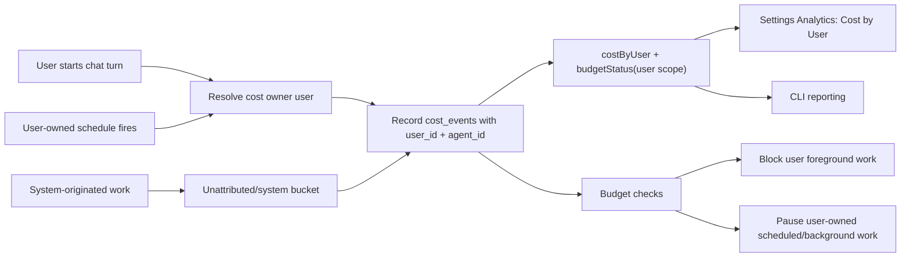

# feat: Add user cost attribution and budgets

## Overview

Move ThinkWork cost reporting and budget enforcement from legacy per-agent chargeback to per-user chargeback while preserving tenant totals and agent context for compatibility. The main change is to make `user_id` a first-class owner on cost events and budget policies, then teach every major cost-producing path to resolve the human owner before recording spend.

This plan treats "user budget exceeded" as a spend ownership state, not a platform-agent pause. Foreground user work should be blocked before dispatch, and user-owned scheduled/background work should be paused or skipped with enough state for admins to understand and recover.

---

## Problem Frame

The origin requirements define the product shift: one tenant platform agent makes "Cost by Agent" a low-signal row, so Settings -> Analytics must answer "which user is responsible for this spend?" instead (see origin: `docs/brainstorms/2026-06-05-user-cost-attribution-and-budgets-requirements.md`). Scheduled/background work is charged to the user who configured or owns it, and exceeding that user's budget pauses all user-owned work.

---

## Requirements Trace

- R1. Settings -> Analytics replaces "Cost by Agent" with "Cost by User."
- R2. The user table shows user identity, event count, and cost, sorted by spend.
- R3. Existing tenant summary, trend, and model cost views remain.
- R4. Interactive work is attributed to the initiating user.
- R5. Scheduled/background work is attributed to its configuring or owning user.
- R6. Budgets are configurable per user rather than per agent.
- R7. User budget status is visible in analytics.
- R8. User-owned scheduled/background work counts against the owning user's budget.
- R9. User budget overage pauses foreground and configured background work owned by that user.
- R10. Tenant-level budget reporting remains.
- R11. Agent-scoped cost/budget wording is retired from user-facing Settings -> Analytics.
- R12. Unresolved system spend remains visible and is not silently assigned to a user.

**Origin actors:** A1 tenant admin, A2 tenant user, A3 scheduled/background runtime, A4 reporting surface.

**Origin flows:** F1 admin reviews user spend, F2 user-owned automation incurs cost, F3 user exceeds budget.

**Origin acceptance examples:** AE1 user cost table, AE2 scheduled job chargeback, AE3 user budget pause, AE4 tenant totals without agent-row interpretation.

---

## Scope Boundaries

- Keep tenant-level budgets and totals intact.
- Keep agent IDs on cost records as audit/runtime context, but stop using them as the primary chargeback axis in Settings -> Analytics.
- Do not reintroduce multiple product agents or per-agent admin controls.
- Do not build invoicing, payments, or user self-service budget management.
- Do not make model-level reporting user-specific in v1 unless it naturally falls out of the aggregate query layer.

### Deferred to Follow-Up Work

- Historical backfill beyond direct `thread_id` and existing owner metadata: if older rows lack enough data to resolve a user, keep them as unattributed/system spend rather than adding an expensive or speculative forensic migration.
- Space-level budget redesign: current Space budget concepts are adjacent but not required to ship per-user budgets.

---

## Context & Research

### Relevant Code and Patterns

- `packages/database-pg/src/schema/cost-events.ts` defines `cost_events` and `budget_policies`; both are currently tenant/agent oriented.
- `packages/database-pg/graphql/types/costs.graphql` exposes `AgentCostSummary`, `costByAgent`, `BudgetPolicy.agentId`, and `UpsertBudgetPolicyInput.agentId`.
- `packages/api/src/graphql/resolvers/costs/*` computes cost summaries, agent breakdowns, budget status, and upsert/delete policy mutations.
- `packages/api/src/lib/cost-recording.ts` owns `recordCostEvents`, `checkBudgetAndPause`, and cost subscriptions.
- `packages/api/src/lib/chat-finalize/process-finalize.ts` records chat-turn LLM, compute, tool, and Hindsight costs.
- `packages/api/src/handlers/chat-agent-invoke.ts` already resolves `currentUserId` for foreground turns through message sender, thread creator, or the narrow computer-owned fallback.
- `packages/api/src/handlers/wakeup-processor.ts` already derives `invokerUserId` from `agent_wakeup_requests.requested_by_actor_type/id` and uses it for workspace/tool identity.
- `packages/database-pg/src/schema/scheduled-jobs.ts` stores `created_by_type` and `created_by_id`; scheduled skill runs also carry `config.invokerUserId`.
- `packages/lambda/job-trigger.ts` loads `scheduled_jobs` at fire time and already pauses deprovisioned scheduled skill runs by updating the job row.
- `apps/spaces/src/components/settings/SettingsAnalytics.tsx` is the screenshot surface with the "Cost by Agent" card.
- `apps/admin/src/routes/_authed/_tenant/-analytics/CostView.tsx`, `apps/admin/src/hooks/useCostData.ts`, and `apps/admin/src/stores/cost-store.ts` use `costByAgent` and agent-scoped budget rows.
- `apps/cli/src/commands/cost.ts` and `apps/cli/src/commands/budget.ts` expose `by-agent` and `--scope tenant|agent` reporting/policy commands.

### Institutional Learnings

- `docs/solutions/workflow-issues/manually-applied-drizzle-migrations-drift-from-dev-2026-04-21.md` is relevant because this feature adds persistent columns/indexes. Any hand-rolled migration must include `-- creates-column:` / `-- creates:` markers and drift-check compatibility.
- `docs/solutions/build-errors/worktree-stale-tsbuildinfo-drizzle-implicit-any-2026-04-24.md` is relevant when validating Drizzle-heavy type changes in worktrees: rebuild `@thinkwork/database-pg` before downstream API typecheck if stale inference appears.

### External References

- None. Local GraphQL, Drizzle, scheduler, and UI patterns are established enough for this plan.

---

## Key Technical Decisions

- Add `user_id` to both `cost_events` and `budget_policies`: this is the smallest direct data model change that makes reporting and enforcement queryable without deriving ownership on every analytics request.
- Keep `agent_id` as compatibility/runtime context: agent context is still useful for tracing, existing observability, and legacy API consumers, but it should no longer be the user-facing chargeback axis.
- Add explicit `user` budget scope instead of overloading `tenant` or `agent`: this keeps `budgetStatus` semantics clear and allows tenant and user policies to coexist.
- Treat unattributed rows as a visible system bucket: this satisfies R12 and prevents accidental assignment of system-originated spend to the wrong human.
- Use pre-dispatch gates plus post-recording checks: foreground work should fail before an expensive runtime dispatch when a user is already over budget; post-recording checks catch the turn that crosses the threshold and pause user-owned schedules.
- Prefer compatibility aliases over hard removals for GraphQL and CLI: existing `costByAgent` and agent budget surfaces can remain for non-Settings consumers while new `costByUser` and user-scope budget APIs become canonical.

---

## Open Questions

### Resolved During Planning

- Which owner should be charged for scheduled/background work? Charge the user who configured or owns the work, using `scheduled_jobs.created_by_type/id` and more specific config owner fields such as `config.invokerUserId` where they are already the execution identity.
- How should system spend be represented? Keep it visible as an unattributed/system bucket instead of assigning it to a user.
- Should the API rename or replace every agent contract immediately? Add user-first contracts and update user-facing consumers; keep agent contracts as compatibility/audit surfaces for now.

### Deferred to Implementation

- Exact backfill coverage for old cost rows: implementers should inspect existing production row shapes and apply only deterministic backfills.
- Exact admin affordance for manually clearing budget-paused scheduled jobs: use the existing scheduled-job update patterns where possible, but final UI control placement can follow what implementation finds in the current automations screens.
- Whether `notifyCostRecorded` needs user fields or whether user-cost clients should rely on query refetch after subscription: decide from current subscription usage during implementation.

---

## High-Level Technical Design

> _This illustrates the intended approach and is directional guidance for review, not implementation specification. The implementing agent should treat it as context, not code to reproduce._



---

## Implementation Units

- U1. **Extend the cost and budget data model**

**Goal:** Make user ownership first-class in the operational cost ledger and budget policies.

**Requirements:** R4, R5, R6, R8, R10, R12; supports AE2.

**Dependencies:** None.

**Files:**

- Modify: `packages/database-pg/src/schema/cost-events.ts`
- Modify: `packages/database-pg/src/schema/scheduled-jobs.ts`
- Modify: `packages/database-pg/graphql/types/costs.graphql`
- Modify: `packages/database-pg/graphql/types/subscriptions.graphql`
- Create: `packages/database-pg/drizzle/0145_user_cost_attribution.sql`
- Create: `packages/database-pg/drizzle/0145_user_cost_attribution_rollback.sql`
- Test: `packages/database-pg/__tests__/migration-0145.test.ts`

**Approach:**

- Add nullable `user_id` on `cost_events`, FK'd to `users.id`, plus an index suitable for tenant/date user cost queries.
- Add nullable `user_id` on `budget_policies`, plus an index for tenant/user lookups; update comments to describe `scope = tenant | agent | user`.
- Update any DB-level checks, GraphQL enums, resolver validation, and CLI validation that currently restrict budget scope to `tenant | agent` so `user` is a first-class allowed value.
- Add scheduled-job budget pause state if implementation confirms `enabled` alone cannot preserve the difference between "admin disabled" and "temporarily paused by budget." Prefer explicit fields such as `budget_paused`, `budget_paused_at`, and `budget_paused_reason` over overloading `enabled`.
- Extend GraphQL `CostEvent`, `BudgetPolicy`, and `UpsertBudgetPolicyInput` with `userId`.
- Add a `UserCostSummary` GraphQL type with `userId`, `userName`, `userEmail`, `totalUsd`, `eventCount`, and a system/unattributed indicator.
- Update `CostRecordedEvent` only if U6 needs incremental user-cost updates.
- Include deterministic migration markers and rollback coverage. The migration should backfill `cost_events.user_id` only where direct, low-risk owner links exist, such as `cost_events.thread_id -> threads.user_id`.

**Execution note:** Characterization-first for migration tests and GraphQL contract tests, because this unit changes shared persistent and API surfaces.

**Patterns to follow:**

- `packages/database-pg/src/schema/cost-events.ts` for colocating cost tables and relations.
- Recent additive migration style in `packages/database-pg/drizzle/0144_skill_catalog_index.sql`.
- Manual migration marker guidance in `docs/solutions/workflow-issues/manually-applied-drizzle-migrations-drift-from-dev-2026-04-21.md`.

**Test scenarios:**

- Happy path: migration exposes nullable `cost_events.user_id` and `budget_policies.user_id` with expected indexes/markers.
- Happy path: rows with `cost_events.thread_id` pointing at a user-owned thread are backfilled to that `threads.user_id`.
- Edge case: cost rows without a resolvable thread/user remain `NULL` and are not assigned to an arbitrary tenant user.
- Rollback: rollback migration removes added columns/indexes without touching unrelated cost columns.

**Verification:**

- Drizzle schema, GraphQL schema source, and migration file agree on user attribution fields.
- Migration drift checks can identify the added columns/indexes.

---

- U2. **Create user attribution and budget enforcement helpers**

**Goal:** Centralize cost owner resolution, user-budget checking, and user-owned schedule pause behavior so cost-producing paths do not duplicate policy logic.

**Requirements:** R4, R5, R6, R8, R9, R12; supports F2, F3, AE2, AE3.

**Dependencies:** U1.

**Files:**

- Modify: `packages/api/src/lib/cost-recording.ts`
- Create: `packages/api/src/lib/user-budget-enforcement.ts`
- Test: `packages/api/src/__tests__/cost-recording.test.ts`
- Test: `packages/api/src/lib/user-budget-enforcement.test.ts`

**Approach:**

- Extend `RecordCostParams` with optional `userId` and write it on every inserted cost row.
- Extend `recordHindsightCost` and direct tool-cost insertion callers to accept or preserve the same owner where available.
- Split current `checkBudgetAndPause` into tenant, agent compatibility, and user-aware checks, keeping the existing tenant behavior.
- Add a helper that checks whether a user is currently over budget for a tenant, based on enabled `scope = user` budget policy and month-to-date `cost_events.user_id` spend.
- Add a helper that marks or keeps user-owned scheduled/background work paused when a user budget is exceeded. Use `scheduled_jobs.created_by_type = 'user' AND created_by_id = userId`, plus known execution-owner config such as scheduled skill runs' `config.invokerUserId`.
- Ensure user-budget checks do not mutate platform-agent `budget_paused`; agent pause remains a tenant/legacy compatibility action.
- Ensure unattributed/system costs contribute to tenant spend but never to user spend.

**Patterns to follow:**

- Existing `checkBudgetAndPause` tenant and agent policy query shape in `packages/api/src/lib/cost-recording.ts`.
- Scheduled skill-run deprovision pause pattern in `packages/lambda/job-trigger.ts`.
- Existing `startOfMonth` helper from GraphQL cost resolvers.

**Test scenarios:**

- Happy path: `recordCostEvents` writes `user_id` for LLM and compute rows when `userId` is supplied.
- Happy path: user budget policy computes spend only from rows matching that user and tenant.
- Happy path: when a user's spend reaches the configured limit, user-owned scheduled jobs are budget-paused while unrelated users' jobs remain active.
- Edge case: `userId = null` records cost but skips user-budget enforcement.
- Error path: invalid or cross-tenant user IDs do not cause costs to be charged to another tenant's user.
- Integration: after a cost row crosses a user budget, the helper returns a state that callers can use to block foreground work and pause background work.

**Verification:**

- Cost recording callers can pass a user owner without changing existing tenant/model totals.
- User budget enforcement has one reusable API for chat, wakeup, scheduled job, and future cost emitters.

---

- U3. **Propagate user ownership through runtime and background cost paths**

**Goal:** Ensure every major cost-producing path records or derives the correct user owner before writing cost rows or dispatching expensive work.

**Requirements:** R4, R5, R8, R9, R12; supports F2, F3, AE2, AE3.

**Dependencies:** U1, U2.

**Files:**

- Modify: `packages/api/src/handlers/chat-agent-invoke.ts`
- Modify: `packages/api/src/lib/chat-finalize/types.ts`
- Modify: `packages/api/src/lib/chat-finalize/process-finalize.ts`
- Modify: `packages/api/src/lib/hindsight-cost.ts`
- Modify: `packages/api/src/handlers/wakeup-processor.ts`
- Modify: `packages/lambda/job-trigger.ts`
- Modify: `packages/api/src/handlers/crons/budget-reset.ts`
- Test: `packages/api/src/handlers/chat-agent-invoke.identity.test.ts`
- Test: `packages/api/src/lib/chat-finalize/process-finalize.test.ts`
- Test: `packages/api/src/handlers/wakeup-processor.system-prompt.test.ts`
- Test: `packages/lambda/__tests__/job-trigger.skill-run.test.ts`
- Test: `packages/api/src/handlers/crons/budget-reset.test.ts`

**Approach:**

- For chat turns, use the existing `resolveChatInvokeIdentity` result as the cost owner. Gate dispatch before AgentCore invocation when that user is already over budget.
- Add `user_id` or equivalent owner field to finalize payloads so asynchronous finalize can record the same owner resolved at dispatch time. Avoid re-resolving from mutable thread state when the dispatch already had a stable user.
- Pass the owner into `recordCostEvents`, Hindsight cost recording, and direct tool-cost insertions in `process-finalize`.
- In `wakeup-processor`, use existing `invokerUserId` when `requested_by_actor_type = user`; fall back to `threads.user_id` only when a thread is present and the wakeup has no explicit user actor. Leave system/agent-originated wakeups unattributed unless an existing field proves user ownership.
- In `job-trigger`, resolve scheduled owner from the scheduled job row before work starts. For `skill_run`, prefer `config.invokerUserId` because that is the execution identity. For other user-created jobs, use `created_by_type/id`.
- Add budget gates in `job-trigger` before invoking routines, skill runs, or agent wakeups for user-owned schedules. Over-budget user-owned schedules should be paused/skipped with a clear failure/status marker rather than dispatching paid work.
- Update budget reset to clear user-budget pauses at the start of a new billing period, without re-enabling jobs that an admin explicitly disabled.

**Patterns to follow:**

- Identity resolution in `packages/api/src/handlers/chat-agent-invoke.identity.test.ts`.
- Existing finalize cost recording in `packages/api/src/lib/chat-finalize/process-finalize.ts`.
- Existing scheduled skill-run deprovision handling in `packages/lambda/job-trigger.ts`.
- Existing monthly reset cron in `packages/api/src/handlers/crons/budget-reset.ts`.

**Test scenarios:**

- Covers AE3. Happy path: a chat turn for an over-budget user is rejected before AgentCore dispatch, while a different user in the same tenant can still dispatch.
- Covers AE2. Happy path: a scheduled skill run with `config.invokerUserId = lin` records resulting cost against Lin.
- Happy path: a user-created scheduled job with `created_by_type = user` uses `created_by_id` as the cost owner.
- Edge case: system-created scheduled work records tenant spend but no user spend.
- Error path: if a scheduled job's configured owner user has been deprovisioned, existing deprovision pause behavior still wins and no budget assignment is fabricated.
- Integration: the same `user_id` appears on LLM, compute, Hindsight, and tool cost rows for a single finalized user-owned turn.
- Integration: monthly reset clears budget pause state for budget-paused schedules without re-enabling admin-disabled schedules.

**Verification:**

- Every planned first-party cost producer either passes a user owner or intentionally records unattributed/system spend.
- User budget overage blocks foreground work and pauses/skips user-owned background work without pausing the tenant platform agent globally.

---

- U4. **Add user-first GraphQL cost and budget APIs**

**Goal:** Expose canonical user cost breakdowns and user budget status while keeping compatibility for existing agent-oriented consumers.

**Requirements:** R1, R2, R6, R7, R10, R11, R12; supports F1, AE1, AE4.

**Dependencies:** U1, U2.

**Files:**

- Create: `packages/api/src/graphql/resolvers/costs/costByUser.query.ts`
- Modify: `packages/api/src/graphql/resolvers/costs/budgetStatus.query.ts`
- Modify: `packages/api/src/graphql/resolvers/costs/budgetPolicies.query.ts`
- Modify: `packages/api/src/graphql/resolvers/costs/upsertBudgetPolicy.mutation.ts`
- Create: `packages/api/src/graphql/resolvers/costs/userBudgetStatus.query.ts`
- Create: `packages/api/src/graphql/resolvers/costs/unpauseUserBudget.mutation.ts`
- Modify: `packages/api/src/graphql/resolvers/costs/index.ts`
- Modify: `packages/api/src/__tests__/graphql-contract.test.ts`
- Test: `packages/api/src/graphql/resolvers/costs/costByUser.query.test.ts`
- Test: `packages/api/src/graphql/resolvers/costs/budgetStatus.query.test.ts`
- Test: `packages/api/src/graphql/resolvers/costs/upsertBudgetPolicy.mutation.test.ts`
- Test: `packages/api/src/graphql/resolvers/costs/unpauseUserBudget.mutation.test.ts`

**Approach:**

- Add `costByUser(tenantId, from, to)` that groups by `cost_events.user_id`, joins/loads users for display name/email, and returns a system/unattributed row for `NULL` user IDs.
- Extend `budgetStatus` to compute `scope = user` policies using `cost_events.user_id`; keep tenant and agent compatibility branches.
- Extend `upsertBudgetPolicy` so `scope = user` requires `userId`, and `scope = agent` keeps the existing `agentId` requirement.
- Add `userBudgetStatus(userId)` for focused checks if UI or runtime consumers benefit from a single-user call; otherwise implementers may use a shared helper internally and expose only `budgetStatus`.
- Add a user-first resume/unpause mutation for budget-paused user-owned work if the UI needs manual recovery after a budget increase. Keep existing agent unpause behavior as legacy compatibility, not the primary recovery path.
- Return stable policy fields including `userId` so admin/spaces/CLI consumers can map policy rows to user breakdowns.
- Keep `costByAgent` available for compatibility, but document it as legacy/audit-oriented.

**Patterns to follow:**

- `packages/api/src/graphql/resolvers/costs/costByAgent.query.ts` for aggregation shape.
- `packages/api/src/graphql/resolvers/core/tenantMembers.query.ts` for resolving user display data through loaders.
- `packages/api/src/__tests__/graphql-contract.test.ts` for schema contract assertions.

**Test scenarios:**

- Covers AE1. Happy path: `costByUser` returns one row per user with sorted totals, names/emails, and event counts.
- Covers AE4. Happy path: `costSummary`, `costTimeSeries`, and `costByModel` remain tenant-level and unchanged by user grouping.
- Edge case: `NULL` user cost rows appear as an unattributed/system row instead of being dropped.
- Edge case: user budget status includes only spend for that user, not all tenant spend.
- Error path: `upsertBudgetPolicy(scope: "user")` without `userId` throws a clear error.
- Error path: `upsertBudgetPolicy(scope: "user")` rejects users outside the tenant.
- Recovery path: user budget unpause only resumes work paused by user-budget enforcement, not work an admin disabled manually.

**Verification:**

- Generated schema exposes user-first contracts and existing consumers still compile against compatibility contracts until they are migrated.

---

- U5. **Update Settings/Admin analytics surfaces to show user costs and budgets**

**Goal:** Replace the user-facing agent cost row with a user budget table in both Settings Analytics and the admin Analytics cost view.

**Requirements:** R1, R2, R3, R7, R11, R12; supports F1, AE1, AE4.

**Dependencies:** U4.

**Files:**

- Modify: `apps/spaces/src/lib/settings-queries.ts`
- Modify: `apps/spaces/src/components/settings/SettingsAnalytics.tsx`
- Modify: `apps/admin/src/lib/graphql-queries.ts`
- Modify: `apps/admin/src/hooks/useCostData.ts`
- Modify: `apps/admin/src/stores/cost-store.ts`
- Modify: `apps/admin/src/routes/_authed/_tenant/-analytics/CostView.tsx`
- Test: `apps/spaces/src/components/settings/SettingsAnalytics.test.tsx`
- Test: `apps/admin/src/routes/_authed/_tenant/-analytics/CostView.test.tsx`
- Test: `apps/admin/src/stores/cost-store.test.ts`

**Approach:**

- Rename Settings query usage from `SettingsCostByAgent` to `SettingsCostByUser` and render "Cost by User" with user name/email, events, spend, and a visible unattributed/system row when present.
- Rename admin store types from `byAgent` to `byUser` or add parallel user-cost state, then migrate the cost view to user rows.
- Replace `AgentBudgetTable` with a user budget table that maps `budgetStatus` rows where `policy.scope = "user"` to `costByUser` rows.
- Keep tenant budget summary behavior in the same card/table area so overall spend remains visible.
- Remove the active/archived agent filtering UI from cost reporting. If user lifecycle status is available through tenant members, use that instead; otherwise avoid filtering away rows.
- Preserve existing cost trend and cost-by-model cards.
- If the store still uses subscription incremental updates, include user fields in `CostRecordedEvent` or fall back to query refetch so user budget rows do not drift client-side.

**Patterns to follow:**

- `apps/spaces/src/components/settings/SettingsAnalytics.tsx` table and metric card style.
- `apps/admin/src/routes/_authed/_tenant/-analytics/CostView.tsx` budget progress layout.
- Existing `useCostData` hydration model for summary/model/time-series/budget data.

**Test scenarios:**

- Covers AE1. Happy path: Settings Analytics renders a "Cost by User" card with multiple users and no "Cost by Agent" heading.
- Happy path: admin Cost view shows user budget progress for a user with a budget policy.
- Happy path: tenant total metrics, trend, and cost-by-model cards render with existing data shapes.
- Edge case: unattributed/system spend renders in its own row and does not show a fake user email.
- Edge case: no user cost data renders the existing empty-state pattern.
- Integration: store hydration maps `costByUser` and `budgetStatus` into consistent rows without relying on platform-agent IDs.

**Verification:**

- The screenshot surface no longer shows "Cost by Agent" and the admin analytics view no longer requires interpreting the single platform agent as a chargeback actor.

---

- U6. **Update CLI reporting, codegen, docs, and compatibility messaging**

**Goal:** Keep generated consumers and operator documentation aligned with the new user-first cost model.

**Requirements:** R6, R7, R10, R11, R12; supports AE4.

**Dependencies:** U4, U5.

**Files:**

- Modify: `apps/cli/src/commands/cost.ts`
- Modify: `apps/cli/src/commands/budget.ts`
- Modify: `apps/admin/src/gql/graphql.ts`
- Modify: `apps/admin/src/gql/gql.ts`
- Modify: `apps/spaces/src/gql/graphql.ts`
- Modify: `apps/spaces/src/gql/gql.ts`
- Modify: `apps/mobile/lib/gql/graphql.ts`
- Modify: `apps/mobile/lib/gql/gql.ts`
- Modify: `apps/cli/src/gql/graphql.ts`
- Modify: `apps/cli/src/gql/gql.ts`
- Modify: `packages/database-pg/graphql/schema.graphql`
- Modify: `docs/src/content/docs/applications/admin/analytics.mdx`
- Modify: `docs/src/content/docs/concepts/control/budgets-usage-and-audit.mdx`
- Modify: `docs/src/content/docs/applications/cli/commands.mdx`
- Test: `apps/cli/src/commands/cost.test.ts`
- Test: `apps/cli/src/commands/budget.test.ts`

**Approach:**

- Add `thinkwork cost by-user` and update help text from "per-agent" to "per-user" where it describes current chargeback reporting.
- Update `thinkwork budget upsert` to accept `--scope tenant|user` as the primary shape and `--user <id>` for user policies. Decide during implementation whether `agent` remains accepted as a deprecated compatibility scope.
- Regenerate GraphQL artifacts for the consumers that have codegen scripts: `apps/cli`, `apps/admin`, `apps/spaces`, and `apps/mobile`.
- Run `pnpm schema:build` so derived GraphQL schema artifacts reflect the new cost fields.
- Update docs that currently describe agent/Space budgets as the only model, especially the "No per-user budgets" known limit in `docs/src/content/docs/concepts/control/budgets-usage-and-audit.mdx`.

**Patterns to follow:**

- Existing table output in `apps/cli/src/commands/cost.ts` and `apps/cli/src/commands/budget.ts`.
- Repository AGENTS guidance for GraphQL schema/codegen after editing `packages/database-pg/graphql/types/*.graphql`.
- Admin analytics docs at `docs/src/content/docs/applications/admin/analytics.mdx`.

**Test scenarios:**

- Happy path: `cost by-user` prints user, id/email, total, and events.
- Happy path: `budget upsert --scope user --user <id>` sends `userId` and not `agentId`.
- Edge case: JSON output includes raw user-cost rows including unattributed/system rows.
- Error path: `budget upsert --scope user` without `--user` fails with a clear message.
- Compatibility: existing `cost by-agent` either still works as a legacy command or emits a deprecation message without breaking JSON consumers, depending on the implementation choice.

**Verification:**

- Generated artifacts compile with the updated GraphQL operations.
- Operator docs consistently describe user cost attribution and user budgets.

---

## System-Wide Impact

- **Interaction graph:** Cost ownership flows from chat identity, wakeup actor, scheduled job owner, and skill-run invoker into cost recording, GraphQL reporting, admin/spaces UI, CLI, and budget reset.
- **Error propagation:** Over-budget foreground work should fail before runtime dispatch with a user-facing/admin-readable reason. Over-budget scheduled work should skip or pause with a durable status reason instead of failing silently.
- **State lifecycle risks:** Avoid conflating admin-disabled schedules with budget-paused schedules. Monthly reset and budget increases need a clear path to resume only budget-paused work.
- **API surface parity:** GraphQL, admin generated clients, spaces generated clients, CLI generated clients, and docs all need the same `userId` policy/cost concepts.
- **Integration coverage:** Unit tests alone are not enough; at least one cross-layer scenario should prove a user-owned scheduled job produces a user-owned cost row and contributes to budget status.
- **Unchanged invariants:** Tenant totals, cost time series, model cost reporting, thread cost summaries, and agent trace context remain available.

---

## Risks & Dependencies

| Risk                                                       | Mitigation                                                                                                                                                                                              |
| ---------------------------------------------------------- | ------------------------------------------------------------------------------------------------------------------------------------------------------------------------------------------------------- |
| Incorrect owner attribution charges the wrong user         | Prefer explicit owner fields in this order: chat dispatch user, scheduled skill `invokerUserId`, scheduled job `created_by_type/id`, thread owner; keep unresolved rows unattributed.                   |
| Historical backfill overreaches                            | Backfill only deterministic links; leave ambiguous rows as system/unattributed.                                                                                                                         |
| Budget pause disables admin-disabled schedules permanently | Add explicit budget pause state or metadata so reset/unpause distinguishes budget pause from admin disable.                                                                                             |
| Existing agent-oriented consumers break                    | Keep compatibility GraphQL queries and CLI paths while migrating user-facing Settings Analytics to user-first APIs.                                                                                     |
| Migration drift on live AWS stack                          | Use drift-check markers, rollback file, and follow the manual migration guidance already captured in `docs/solutions/workflow-issues/manually-applied-drizzle-migrations-drift-from-dev-2026-04-21.md`. |
| Client-side cost store drifts after subscription events    | Either include user fields in cost subscription events or refetch user-cost/budget queries on cost updates.                                                                                             |

---

## Documentation / Operational Notes

- Update admin analytics docs to describe "Cost by User" as the primary chargeback table.
- Update control/budgets docs to remove the "No per-user budgets" known limit and explain how user-owned automation is charged.
- Update CLI command docs to include `cost by-user` and user budget examples.
- Rollout should preserve existing tenant and agent budget rows. Existing agent-scope rows can remain as legacy rows until a separate cleanup or migration decision retires them.
- After deployment, admins should expect historical rows without deterministic owner links to appear as system/unattributed spend until new cost rows accumulate with `user_id`.

### U1 Deployment Checklist

Use this checklist for `packages/database-pg/drizzle/0148_user_cost_attribution.sql`.

**Before apply:**

```sql
SELECT scope, count(*) FROM public.budget_policies GROUP BY scope ORDER BY scope;
SELECT count(*) AS total_cost_events FROM public.cost_events;
SELECT count(*) AS thread_backfillable_cost_events
FROM public.cost_events ce
JOIN public.threads t
  ON t.id = ce.thread_id
 AND t.tenant_id = ce.tenant_id
WHERE ce.user_id IS NULL
  AND t.user_id IS NOT NULL;
```

**Apply:**

```bash
psql "$DATABASE_URL" -v ON_ERROR_STOP=1 -f packages/database-pg/drizzle/0148_user_cost_attribution.sql
```

**After apply:**

```sql
SELECT count(*) AS unattributed_cost_events
FROM public.cost_events
WHERE user_id IS NULL;

SELECT conname, convalidated
FROM pg_constraint
WHERE conrelid IN ('public.cost_events'::regclass, 'public.budget_policies'::regclass)
  AND conname IN (
    'cost_events_user_id_users_id_fk',
    'budget_policies_user_id_users_id_fk',
    'budget_policies_scope_check',
    'budget_policies_scope_shape_check'
  )
ORDER BY conname;
```

Then run:

```bash
bash scripts/db-migrate-manual.sh packages/database-pg/drizzle/0148_user_cost_attribution.sql
```

**Rollback guidance:** Prefer code rollback first. SQL rollback drops `cost_events.user_id`, `budget_policies.user_id`, and scheduled-job budget-pause columns, so use `0148_user_cost_attribution_rollback.sql` only after taking a backup or explicitly accepting loss of user attribution and budget-pause state written after the forward migration.

**Monitor:** Watch GraphQL cost recording, scheduled-job update paths, and migration drift checks after merge. New cost rows remain allowed with `user_id = NULL` until U2/U3 thread user ownership through live cost writers.

---

## Sources & References

- **Origin document:** `docs/brainstorms/2026-06-05-user-cost-attribution-and-budgets-requirements.md`
- Related code: `packages/database-pg/src/schema/cost-events.ts`
- Related code: `packages/api/src/lib/cost-recording.ts`
- Related code: `packages/api/src/lib/chat-finalize/process-finalize.ts`
- Related code: `packages/lambda/job-trigger.ts`
- Related code: `apps/spaces/src/components/settings/SettingsAnalytics.tsx`
- Related code: `apps/admin/src/routes/_authed/_tenant/-analytics/CostView.tsx`
- Related code: `apps/cli/src/commands/cost.ts`
- Related code: `apps/cli/src/commands/budget.ts`
- Institutional learning: `docs/solutions/workflow-issues/manually-applied-drizzle-migrations-drift-from-dev-2026-04-21.md`
