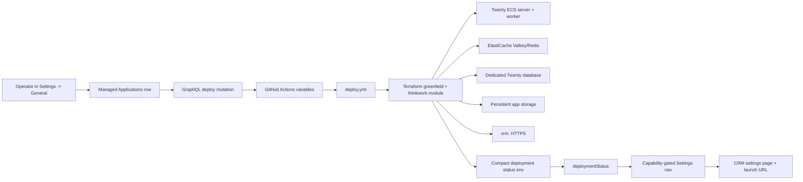

# feat: Add Twenty CRM as a Managed Application

## Overview

Add Twenty CRM as an optional ThinkWork-managed application. Operators enable it
from Settings -> General -> Managed Applications, ThinkWork queues the normal
deploy workflow, Terraform provisions Twenty on AWS, and CRM settings appear
only after deployed status reports Twenty as running.

The implementation should mirror Cognee's optional-add-on pattern where it
fits, but CRM data needs a safer lifecycle. A first enable should create and
start Twenty. A later park action should stop runtime capacity while retaining
the dedicated database, app secrets, ElastiCache configuration, file storage,
and the re-enable path. A separate destructive cleanup action removes the
runtime substrate plus the dedicated database and secrets when an operator
explicitly chooses to delete CRM data.

---

## Problem Frame

The origin requirements define v1 as a deployable managed app, not a custom CRM
integration (see origin:
docs/brainstorms/2026-06-05-twenty-crm-managed-application-requirements.md).
Cognee proved the operator toggle -> GitHub Actions variable -> deploy workflow
-> Terraform -> deployment status loop. Twenty should reuse that loop while
adding public HTTPS access, AWS-managed Redis, dedicated Postgres isolation, and
safe disable semantics for business-critical CRM data.

---

## Requirements Trace

- R1. Settings -> General includes an operator-only Managed Applications
  section.
- R2. Managed Applications lists optional stage applications, initially Cognee
  and Twenty CRM.
- R3. Cognee's current deploy toggle moves into Managed Applications and its
  Knowledge Graph settings page is hidden unless Cognee is enabled.
- R4. Twenty CRM has a Managed Applications row with toggle, status,
  description, and confirmation before deploy or disable.
- R5. Toggling Twenty on queues the normal ThinkWork deploy pipeline.
- R6. CRM settings remain hidden while Twenty enablement is queued but not
  reflected in deployment status.
- R7. CRM settings appears only after deployment status reports Twenty enabled.
- R8. CRM settings exposes the public HTTPS Twenty URL and operational details.
- R9. Turning Twenty off requires confirmation and communicates retained data.
- R10. Disabling Twenty preserves the database, secrets, persistent storage, and
  re-enable path.
- R11. Twenty v1 uses Twenty's native first-user setup.
- R12. ThinkWork SSO and pre-seeded invites are follow-up work.
- R13. Twenty is exposed at a managed stage subdomain derived from the existing
  public domain pattern.
- R14. Twenty uses a dedicated database and role on the existing Aurora/Postgres
  instance, not the shared ThinkWork database or schema.

**Origin actors:** A1 ThinkWork operator, A2 ThinkWork platform deploy pipeline,
A3 Twenty CRM admin user, A4 future ThinkWork CRM user or agent.

**Origin flows:** F1 Enable Twenty CRM, F2 Reveal CRM settings after deployment,
F3 First Twenty admin setup, F4 Disable Twenty CRM.

**Origin acceptance examples:** AE1 Managed Applications rows, AE2 queued
enable hides CRM settings until enabled, AE3 CRM settings links public HTTPS
app, AE4 disable preserves data, AE5 native Twenty first-user setup.

---

## Scope Boundaries

- No custom ThinkWork CRM UI beyond settings, status, health, and launch link.
- No ThinkWork SSO, Cognito federation, Google SSO, identity sync, user
  pre-seeding, workspace seeding, or invite automation in v1.
- No CRM connector, MCP tool, webhook adapter, or agent read/write integration
  in v1.
- No full generic managed-app registry refactor. A small local registry/helper
  is acceptable where it prevents Cognee/Twenty duplication.
- No separate Aurora/Postgres instance unless implementation discovers a hard
  Twenty constraint that blocks a dedicated database on the existing instance.
- No ambiguous destructive delete path from the runtime toggle; deleting CRM
  data requires an explicit Destroy action.

### Deferred to Follow-Up Work

- ThinkWork SSO/Cognito/Google launch integration for Twenty.
- CRM connector and agent tools that read or write Twenty data.
- S3-backed Twenty file storage or multi-task scaling if EFS-backed v1 storage
  proves insufficient.
- Dedicated customer-facing CRM extension inside ThinkWork.

---

## Context & Research

### Relevant Code and Patterns

- `terraform/modules/app/cognee` is the closest app-module pattern: ECS
  Fargate, ALB, CloudWatch logs, EFS, Secrets Manager indirection, DB security
  group ingress, IAM, outputs, and guardrails.
- `terraform/modules/thinkwork/main.tf`, `variables.tf`, and `outputs.tf` wire
  optional app modules through the registry-shaped composite module.
- `.github/workflows/deploy.yml` resolves Cognee GitHub variables, prepares its
  dedicated database credentials, and passes explicit Terraform `-var` values.
- `.github/workflows/verify.yml` mirrors Cognee deploy variables for drift
  checks.
- `packages/api/src/graphql/resolvers/core/setKnowledgeGraphDeployment.mutation.ts`
  reads a deploy token from Secrets Manager, updates a GitHub Actions variable,
  and dispatches `deploy.yml`.
- `packages/api/src/graphql/resolvers/core/deploymentStatus.query.ts` compacts
  Cognee status into one Lambda environment value because `graphql-http` is near
  Lambda's 4 KB env-var limit.
- `packages/api/src/graphql/resolvers/core/knowledgeGraphHealthCheck.query.ts`
  checks Cognee health through AWS control-plane APIs rather than assuming the
  GraphQL Lambda can reach an internal ALB.
- `apps/spaces/src/components/settings/SettingsGeneral.tsx`,
  `SettingsKnowledgeGraph.tsx`, `settings-nav.tsx`, and `SettingsSidebar.tsx`
  are the current settings surfaces and navigation gates.
- `terraform/modules/app/www-dns` manages Cloudflare DNS records, shared ACM
  certificate SANs, and app/docs/admin/api CNAME patterns.
- `terraform/modules/foundation/vpc` creates public and private subnets. The
  current Cognee pattern runs ECS in public subnets for outbound egress while
  private subnets are available for private AWS resources.
- `apps/cli/src/commands/init.ts` and
  `apps/cli/src/commands/enterprise/templates/deploy-repo/terraform/main.tf`
  must stay in sync with the composite module surface for generated deploy
  repos.

### Institutional Learnings

- `docs/plans/cognee-terraform-infrastructure-autopilot-status.md` records the
  failures this plan must not repeat: shared database collisions, `CREATE
DATABASE ... OWNER` failing because Aurora admin was not a member of the
  target role, URL-encoded DB password incompatibility, Lambda env size limits,
  and health checks that assumed private network reachability.
- `docs/solutions/best-practices/oauth-client-credentials-in-secrets-manager-2026-04-21.md`
  establishes the pattern of exposing secret ARNs or secret references, not
  secret values, in runtime config.
- `docs/solutions/patterns/mcp-custom-domain-setup-2026-04-23.md` documents the
  repo's custom-domain reality: CI passes Terraform variables explicitly, and
  DNS/TLS changes need careful Cloudflare/ACM handling.
- `docs/solutions/workflow-issues/deploy-silent-arch-mismatch-took-a-week-to-surface-2026-04-24.md`
  argues for post-deploy smoke checks for multi-component deployments because
  green Terraform does not prove the app is alive.

### External References

- Twenty Docker Compose docs: server and worker containers, Postgres, Redis,
  persistent server storage, `SERVER_URL`, and `/healthz` health check.
  https://docs.twenty.com/developers/self-host/capabilities/docker-compose
- Twenty setup docs: `ENCRYPTION_KEY` is env-only and losing it loses access to
  encrypted secrets; single-workspace mode makes the first user admin and
  disables new signups after workspace creation.
  https://docs.twenty.com/developers/self-host/capabilities/setup
- Amazon ElastiCache docs: Valkey/Redis OSS clusters are VPC-scoped, accessed
  through endpoints, controlled by security groups and subnet groups, and can
  be backed up or scaled.
  https://docs.aws.amazon.com/AmazonElastiCache/latest/dg/WhatIs.Components.html

---

## Key Technical Decisions

- **Use AWS-managed Redis-compatible cache, not a sidecar.** Twenty should use
  ElastiCache for Valkey/Redis OSS. Valkey is the cheaper managed ElastiCache
  engine versus Redis OSS; the tradeoff is that any managed cache adds a
  separate AWS service compared with a Docker Compose-style bundled Redis
  container. ElastiCache matches ThinkWork's AWS-native posture and the user's
  explicit preference.
- **Use a dedicated Twenty database on the existing Aurora/Postgres instance.**
  This follows the Cognee isolation hotfix and avoids Twenty migrations touching
  ThinkWork application tables.
- **Use a two-state deploy contract.** A single `TWENTY_ENABLED` boolean cannot
  represent initial absence and disable-with-retention. Use a retained/provision
  flag plus a runtime-enabled flag, for example `TWENTY_PROVISIONED` and
  `TWENTY_RUNTIME_ENABLED`. Initial off is `false/false`; enable is
  `true/true`; disable is `true/false`.
- **Keep Twenty runtime single-task in v1.** Run one server task and one worker
  task against the same database, EFS storage, and ElastiCache endpoint. Scaling
  follows later after storage and worker behavior are proven.
- **Expose Twenty through a public HTTPS ALB.** The managed subdomain should be
  `crm.<www_domain>` by default, with DNS-only Cloudflare CNAME and TLS via the
  existing certificate/SAN pattern or an equivalent regional ACM cert.
- **Store app secrets in Secrets Manager.** `PG_DATABASE_URL` and
  `ENCRYPTION_KEY` should be injected from Secrets Manager, not assembled as
  plaintext ECS task environment values.
- **Keep Lambda status compact.** Twenty deployment status should be packed into
  one compact env var or similarly compact payload, then expanded in the
  resolver, to avoid repeating Cognee's 4 KB Lambda env failure.
- **Use Twenty native first-user setup.** The CRM page links to Twenty; SSO and
  pre-seeded admins remain explicit follow-up work.

---

## Open Questions

### Resolved During Planning

- **Should Redis be a sidecar or AWS managed?** Use AWS-managed Redis through
  ElastiCache for Valkey/Redis OSS.
- **How can disable retain data without creating resources before first
  enable?** Use separate provisioned/retained and runtime-enabled deploy
  variables rather than one boolean.
- **Should Twenty use the shared database schema, a dedicated DB, or separate
  instance?** Use a dedicated database and role on the existing database
  instance.
- **Should CRM settings be visible while a deployment is queued?** No. Only show
  it once deployment status reports Twenty runtime enabled.

### Deferred to Implementation

- Exact Twenty image digest and whether the upstream image is published in a
  digest form compatible with the existing supply-chain expectations.
- Exact ElastiCache shape: node-based replication group versus serverless cache.
  Prefer the simplest Terraform-supported shape that exposes a normal Redis URL
  Twenty can consume and keeps access restricted to the Twenty task security
  group.
- Exact certificate implementation for `crm.<www_domain>` after checking
  whether the existing shared ACM certificate can safely serve the ALB in the
  deployed region.
- Exact Twenty environment values beyond the required v1 infrastructure
  variables. Do not turn on Google/Microsoft/email integrations in v1.
- Whether the CRM health check should fetch public `/healthz`, inspect ECS/ALB
  control-plane health, or do both.

---

## Output Structure

    terraform/modules/app/twenty/
      main.tf
      variables.tf
      outputs.tf
      README.md
    packages/api/src/graphql/resolvers/core/
      managedApplications.ts
      setManagedApplicationDeployment.mutation.ts
      managedApplicationHealthCheck.query.ts
    apps/spaces/src/components/settings/
      ManagedApplicationsSection.tsx
      SettingsCrm.tsx

The exact file split may change during implementation, but the plan expects a
new Terraform app module, a small API managed-app helper, and focused settings
components rather than burying all behavior in existing large files.

---

## High-Level Technical Design

> This illustrates the intended approach and is directional guidance for
> review, not implementation specification. The implementing agent should treat
> it as context, not code to reproduce.

The lifecycle states are:

| Provisioned | Runtime enabled | User-facing meaning | Terraform behavior                                                  |
| ----------- | --------------- | ------------------- | ------------------------------------------------------------------- |
| false       | false           | Never enabled       | No Twenty resources                                                 |
| true        | true            | Enabled             | Runtime desired count > 0, status/nav visible                       |
| true        | false           | Parked              | Retained data/secrets/storage/cache config, runtime desired count 0 |

---

## Implementation Units

- U1. **Create the Twenty Terraform app module**

**Goal:** Add a focused Terraform module that provisions Twenty runtime,
storage, AWS-managed Redis, and public HTTPS access while supporting parked
runtime state.

**Requirements:** R8, R10, R13, R14; F2, F4; AE3, AE4.

**Dependencies:** None.

**Files:**

- Create: `terraform/modules/app/twenty/main.tf`
- Create: `terraform/modules/app/twenty/variables.tf`
- Create: `terraform/modules/app/twenty/outputs.tf`
- Create: `terraform/modules/app/twenty/README.md`
- Test: `apps/cli/__tests__/terraform-twenty-fixture.test.ts`

**Approach:**

- Model Twenty as AWS-native infrastructure, not Docker Compose. Use ECS
  Fargate for the Twenty server and worker, ElastiCache for Valkey/Redis OSS,
  Aurora/Postgres for the dedicated database, CloudWatch logs, and encrypted
  persistent storage for Twenty local files.
- Prefer separate ECS services for server and worker so the public ALB only
  targets the server, and the worker can use its own command, health/essential
  policy, and desired-count behavior.
- Use public subnets for ECS tasks if outbound egress still depends on public
  IPs, matching Cognee's phase-1 egress pattern. Put ElastiCache in private
  subnets and allow inbound only from the Twenty task security group.
- Terminate public HTTPS at an ALB using `crm.<domain>` as `SERVER_URL`. The
  ALB target health path should use Twenty's `/healthz` unless implementation
  finds a more appropriate endpoint.
- Inject `PG_DATABASE_URL` and `ENCRYPTION_KEY` from Secrets Manager. Do not put
  DB password or encryption key in task-definition plaintext environment.
- Add lifecycle guardrails: when provisioned is true and runtime is false, keep
  retained resources but set server/worker desired counts to 0; when
  provisioned is false, create no Twenty resources.

**Patterns to follow:**

- `terraform/modules/app/cognee/main.tf` for ECS, EFS, ALB, logs, secret
  injection, and DB security group ingress.
- `terraform/modules/foundation/vpc/main.tf` for public/private subnet
  expectations.

**Test scenarios:**

- Happy path: Terraform fixture enables provisioned/runtime state and includes
  ECS server, ECS worker, ElastiCache, HTTPS ALB, EFS/storage, log groups, and
  outputs.
- Edge case: provisioned true with runtime false produces retained data
  resources with server/worker desired counts parked.
- Error path: enabling runtime without required `twenty_image_uri`,
  `twenty_public_url`, DB URL secret, or encryption secret fails Terraform
  validation/guardrails.
- Security path: ElastiCache ingress is restricted to the Twenty task security
  group, and app secrets are only injected through ECS secrets.

**Verification:**

- The module validates independently.
- A Terraform plan can represent all three lifecycle states without destroying
  retained resources when parking runtime.

---

- U2. **Wire Twenty through the composite module and public DNS**

**Goal:** Expose Twenty as a first-class optional app in the ThinkWork module,
greenfield example, outputs, and public DNS/TLS wiring.

**Requirements:** R5, R8, R10, R13, R14; F1, F2, F4; AE2, AE3, AE4.

**Dependencies:** U1.

**Files:**

- Modify: `terraform/modules/thinkwork/main.tf`
- Modify: `terraform/modules/thinkwork/variables.tf`
- Modify: `terraform/modules/thinkwork/outputs.tf`
- Modify: `terraform/modules/app/lambda-api/variables.tf`
- Modify: `terraform/modules/app/lambda-api/handlers.tf`
- Modify: `terraform/modules/app/www-dns/variables.tf`
- Modify: `terraform/modules/app/www-dns/main.tf`
- Modify: `terraform/modules/app/www-dns/outputs.tf`
- Modify: `terraform/examples/greenfield/main.tf`
- Modify: `terraform/examples/greenfield/terraform.tfvars.example`
- Test: `apps/cli/__tests__/terraform-twenty-fixture.test.ts`

**Approach:**

- Add composite variables for `twenty_provisioned`,
  `twenty_runtime_enabled`, image URI, database name/user/secret selectors,
  Redis settings, and public URL/domain inputs.
- Use `count` on the app module from the provisioned/retained variable, not the
  runtime variable. Runtime state controls desired counts, not whether retained
  resources exist.
- Add nullable outputs for `twenty_enabled`, `twenty_provisioned`,
  `twenty_url`, log group names, cluster/service names, ALB/target health
  identifiers, Redis endpoint, and retained storage identifiers.
- Extend `www-dns` with an explicit CRM host gate and CNAME. Keep the cert SAN
  list gated by a plain bool to avoid dependency cycles, following docs/admin
  and api patterns.
- Propagate a compact Twenty status value into `lambda-api` rather than a large
  set of separate env vars.

**Patterns to follow:**

- `terraform/modules/thinkwork` Cognee wiring.
- `terraform/modules/app/www-dns/main.tf` `include_app`, `include_api`, and
  cycle-avoidance comments.
- `terraform/modules/app/lambda-api/handlers.tf` compact `COGNEE` env pattern.

**Test scenarios:**

- Happy path: greenfield fixture with Twenty enabled exposes `crm.<domain>` and
  passes the correct module variables.
- Edge case: `www_domain` empty keeps Twenty deployable only if an explicit
  public URL/certificate path is provided, or fails with a clear precondition if
  v1 requires managed domain.
- Edge case: runtime disabled but provisioned true keeps outputs that let the
  Managed Applications row report "parked".
- Error path: `twenty_db_name` cannot equal the shared ThinkWork database name.

**Verification:**

- Composite and greenfield Terraform validation pass.
- Outputs give the API enough compact status to drive UI visibility and CRM
  details without exceeding Lambda env limits.

---

- U3. **Extend deploy, verify, and generated deploy templates**

**Goal:** Make Twenty deployable through the same GitHub Actions and generated
deploy-repo paths as Cognee, including DB/user preparation and secret creation.

**Requirements:** R5, R10, R14; F1, F4; AE2, AE4.

**Dependencies:** U1, U2.

**Files:**

- Modify: `.github/workflows/deploy.yml`
- Modify: `.github/workflows/verify.yml`
- Modify: `apps/cli/src/commands/init.ts`
- Modify: `apps/cli/src/commands/enterprise/templates/deploy-repo/terraform/main.tf`
- Modify: `apps/cli/src/commands/enterprise/templates/deploy-repo/terraform/terraform.tfvars.example`
- Modify: `apps/cli/__tests__/terraform-cognee-fixture.test.ts` or create a
  sibling Twenty fixture test
- Create: `apps/cli/__tests__/terraform-twenty-fixture.test.ts`

**Approach:**

- Introduce GitHub repository variables for provisioned/runtime state. The API
  deploy mutation should set both variables on enable, and only runtime false
  on disable.
- Add deploy workflow steps to resolve Twenty variables, validate identifiers,
  create or rotate URL-safe DB credentials, generate an `ENCRYPTION_KEY`, and
  create/update Secrets Manager JSON for app runtime secrets.
- Prepare the dedicated database and role using the Cognee hotfix shape: create
  the database without assigning ownership to the target role, grant connect and
  schema privileges, and avoid touching the shared `thinkwork` database except
  as the admin connection source.
- Pass Twenty Terraform vars explicitly in deploy and verify workflows. CI does
  not read tfvars.
- Keep generated deploy repo templates in sync so self-hosted enterprise stacks
  can opt into Twenty later without hand-editing missing variables.

**Patterns to follow:**

- `.github/workflows/deploy.yml` Cognee "Resolve deployment inputs" and
  "Prepare database credentials" steps.
- Cognee DB hotfix notes in
  `docs/plans/cognee-terraform-infrastructure-autopilot-status.md`.
- `apps/cli/__tests__/terraform-cognee-fixture.test.ts`.

**Test scenarios:**

- Happy path: generated Terraform fixture includes Twenty provision/runtime
  variables, passes them to `module "thinkwork"`, and exposes Twenty outputs.
- Happy path: deploy workflow sets provisioned/runtime env vars and Terraform
  vars from GitHub repository variables.
- Edge case: disabling Twenty sets runtime false without clearing provisioned or
  deleting secret selectors.
- Error path: invalid Twenty DB username/name fails before Terraform apply.
- Error path: missing DB outputs when enabling Twenty fails with an actionable
  workflow error.

**Verification:**

- Generated deploy templates and greenfield example remain structurally aligned.
- CI workflow validation covers both enabled and parked states.

---

- U4. **Add managed-application GraphQL status, deploy control, and health**

**Goal:** Give Spaces/Desktop a typed API for managed application rows,
capability-gated navigation, Twenty deploy actions, and CRM operational health.

**Requirements:** R1, R2, R3, R4, R5, R6, R7, R8, R9, R10; F1, F2, F4; AE1,
AE2, AE3, AE4.

**Dependencies:** U2, U3.

**Files:**

- Modify: `packages/database-pg/graphql/types/core.graphql`
- Modify: `packages/api/src/graphql/resolvers/core/index.ts`
- Modify: `packages/api/src/graphql/resolvers/core/deploymentStatus.query.ts`
- Modify: `packages/api/src/graphql/resolvers/core/setKnowledgeGraphDeployment.mutation.ts`
- Create: `packages/api/src/graphql/resolvers/core/managedApplications.ts`
- Create: `packages/api/src/graphql/resolvers/core/setManagedApplicationDeployment.mutation.ts`
- Create: `packages/api/src/graphql/resolvers/core/managedApplicationHealthCheck.query.ts`
- Test: `packages/api/src/graphql/resolvers/core/setKnowledgeGraphDeployment.mutation.test.ts`
- Test: `packages/api/src/graphql/resolvers/core/general-reads-authz.test.ts`
- Test: `packages/api/src/graphql/resolvers/core/managedApplications.test.ts`
- Test: `packages/api/src/graphql/resolvers/core/managedApplicationHealthCheck.query.test.ts`

**Approach:**

- Add a small managed-app registry/helper for Cognee and Twenty. This is not a
  full registry refactor; it is a typed list of known optional apps and the
  GitHub variable/status mapping for each.
- Preserve existing Cognee GraphQL fields and mutation for compatibility, but
  route shared GitHub variable update/dispatch behavior through the helper.
- Extend `DeploymentStatus` with Twenty fields and/or a
  `managedApplications` list that includes each app's key, display name,
  enabled/running state, provisioned/parked state where applicable, URL, logs,
  and service identifiers.
- Add `setManagedApplicationDeployment` for Twenty and, if useful, Cognee.
  Twenty enable sets provisioned true and runtime true. Twenty disable sets
  runtime false and leaves provisioned true.
- Add a health check that is operator-only. For Twenty, prefer public `/healthz`
  plus AWS ECS/ALB/ElastiCache control-plane checks if feasible. For Cognee,
  preserve the current AWS control-plane behavior.
- Keep auth gates at least as strict as existing deployment status and Cognee
  deploy mutations: tenant admin for reads/health, platform operator allowlist
  for deploy actions.

**Patterns to follow:**

- `packages/api/src/graphql/resolvers/core/deploymentStatus.query.ts`
- `packages/api/src/graphql/resolvers/core/setKnowledgeGraphDeployment.mutation.ts`
- `packages/api/src/graphql/resolvers/core/knowledgeGraphHealthCheck.query.ts`
- `packages/api/src/graphql/resolvers/core/general-reads-authz.test.ts`

**Test scenarios:**

- Covers AE1. Happy path: deployment status returns Cognee and Twenty managed
  app entries with correct enabled/parked/url fields from compact env values.
- Covers AE2. Happy path: enabling Twenty upserts both provisioned and runtime
  GitHub Actions variables, dispatches deploy workflow, and returns a queued
  message.
- Covers AE4. Happy path: disabling Twenty changes only runtime-enabled state
  and returns a data-retention message.
- Error path: non-platform-operator caller cannot trigger deploy changes.
- Error path: member caller cannot read deployment status or run health checks.
- Edge case: malformed compact Twenty env produces disabled/unknown status
  rather than throwing from deploymentStatus.
- Integration: GraphQL contract test includes the new types, mutation, and
  health query after schema/codegen.

**Verification:**

- API tests prove deploy controls cannot be invoked by ordinary members and
  cannot accidentally request destructive CRM deletion.

---

- U5. **Build the Spaces/Desktop Managed Applications and CRM settings UI**

**Goal:** Move Cognee and Twenty controls into Settings -> General, gate
Knowledge Graph and CRM settings by deployment status, and add a CRM settings
page for enabled Twenty deployments.

**Requirements:** R1, R2, R3, R4, R6, R7, R8, R9, R11, R12, R13; F1, F2, F3,
F4; AE1, AE2, AE3, AE4, AE5.

**Dependencies:** U4.

**Files:**

- Modify: `apps/spaces/src/lib/settings-queries.ts`
- Modify: `apps/spaces/src/components/settings/SettingsGeneral.tsx`
- Modify: `apps/spaces/src/components/settings/SettingsKnowledgeGraph.tsx`
- Modify: `apps/spaces/src/components/settings/settings-nav.tsx`
- Modify: `apps/spaces/src/components/settings/SettingsSidebar.tsx`
- Create: `apps/spaces/src/components/settings/ManagedApplicationsSection.tsx`
- Create: `apps/spaces/src/components/settings/SettingsCrm.tsx`
- Create: `apps/spaces/src/routes/_authed/settings.crm.tsx`
- Test: `apps/spaces/src/components/settings/settings-nav.test.ts`
- Test: `apps/spaces/src/components/settings/SettingsGeneral.test.tsx` or a
  new focused `ManagedApplicationsSection.test.tsx`
- Test: `apps/spaces/src/components/settings/SettingsCrm.test.tsx`

**Approach:**

- Add a Managed Applications section in General for operators only. It should
  show Cognee and Twenty rows with toggle, status, concise description, and
  queued state.
- Move Cognee enable/disable control from `SettingsKnowledgeGraph` into the new
  section. The Knowledge Graph page keeps service details and health only when
  enabled.
- Extend settings navigation to accept deployment capabilities. Hide Knowledge
  Graph unless Cognee is enabled and hide CRM unless Twenty runtime is enabled.
  Avoid a flash of unavailable nav items while role/status queries are
  unresolved.
- Guard direct `/settings/crm` route access the same way. If Twenty is not
  runtime-enabled, redirect back to General or render the existing unavailable
  settings state rather than exposing a half-populated CRM page.
- Add confirmation dialogs for enabling/disabling Twenty. Disable copy must say
  the runtime will be parked and CRM data retained.
- Add CRM settings page showing status, stage, region, URL, service/log details,
  health check, and first-user setup guidance phrased as operational status, not
  a marketing explainer.
- Use the existing settings row/card style. Keep the page utilitarian and dense;
  no hero or marketing layout.

**Patterns to follow:**

- `apps/spaces/src/components/settings/SettingsKnowledgeGraph.tsx`
- `apps/spaces/src/components/settings/SettingsContent.tsx`
- `apps/spaces/src/components/settings/settings-nav.tsx`
- `apps/spaces/src/components/settings/SettingsSidebar.tsx`

**Test scenarios:**

- Covers AE1. Happy path: operator General page renders Managed Applications
  with Cognee and Twenty rows.
- Covers AE2. Happy path: enabling Twenty queues deployment and CRM nav remains
  hidden until deployment status reports enabled.
- Covers AE3. Happy path: when status reports Twenty enabled, CRM nav appears
  and CRM page renders the public HTTPS URL.
- Covers AE3. Edge case: direct `/settings/crm` navigation while Twenty is
  disabled redirects or renders unavailable state.
- Covers AE4. Happy path: disabling Twenty shows retention confirmation and
  invokes the mutation with runtime disable semantics.
- Covers AE5. Happy path: CRM page indicates native Twenty first-user setup and
  does not present ThinkWork SSO controls.
- Edge case: deployment status query fails; Managed Applications reports
  unavailable status without exposing stale toggles.
- Error path: mutation error shows a toast and does not leave the toggle in a
  false-success state.

**Verification:**

- Operators can see and use managed app controls; members cannot see operator
  deployment controls.
- Settings nav visibility follows deployed app status, not only static route
  definitions.

---

- U6. **Regenerate GraphQL types and keep route/codegen artifacts in sync**

**Goal:** Keep all generated GraphQL consumers and TanStack route artifacts
consistent after schema and route changes.

**Requirements:** R6, R7, R8.

**Dependencies:** U4, U5.

**Files:**

- Modify: `apps/spaces/src/gql/graphql.ts`
- Modify: `apps/spaces/src/gql/gql.ts`
- Modify: `apps/spaces/src/routeTree.gen.ts`
- Modify: `apps/cli/src/gql/graphql.ts`
- Modify: `apps/admin/src/gql/graphql.ts`
- Modify: `apps/mobile/src/gql/graphql.ts`
- Modify: `packages/api/src/generated/graphql.ts` or the current generated API
  type output if codegen updates it
- Test: existing codegen contract tests under `packages/api/src/__tests__/graphql-contract.test.ts`

**Approach:**

- Run the repo's standard GraphQL schema build and per-consumer codegen after
  editing `packages/database-pg/graphql/types/core.graphql`.
- Regenerate TanStack route tree after adding `settings.crm.tsx`.
- Do not hand-edit generated files except to resolve generation conflicts.

**Patterns to follow:**

- Existing generated files and codegen scripts for `apps/spaces`, `apps/cli`,
  `apps/admin`, `apps/mobile`, and `packages/api`.

**Test scenarios:**

- Happy path: generated Spaces documents include managed application status,
  deploy mutation, CRM health query, and Twenty fields.
- Happy path: route tree includes `/settings/crm`.
- Error path: GraphQL contract test fails if schema generation omits the new
  mutation/query from the API contract.

**Verification:**

- Typecheck sees no stale generated types or missing route references.

---

- U7. **Add docs, runbook notes, and deployment smokes**

**Goal:** Document the managed-app behavior and add post-deploy verification so
Twenty does not silently deploy broken or unreachable.

**Requirements:** R8, R10, R11, R12, R13, R14; AE3, AE4, AE5.

**Dependencies:** U1, U2, U3, U4, U5, U6.

**Files:**

- Modify: `docs/src/content/docs/applications/desktop/index.mdx`
- Modify: `docs/src/content/docs/applications/admin/memory.mdx` or the closest
  current Settings/Knowledge Graph doc if Cognee visibility changes need docs
- Create: `docs/src/content/docs/applications/admin/managed-applications.mdx`
- Modify: `docs/plans/cognee-terraform-infrastructure-autopilot-status.md` only
  if implementation needs to cross-link Cognee lessons
- Create: `scripts/smoke/twenty-managed-app-smoke.mjs`
- Test: `scripts/smoke-enterprise-deployment-template.sh` if deploy-template
  contents need a smoke assertion

**Approach:**

- Document Managed Applications as operator-owned infrastructure controls, not
  end-user connector settings.
- Document Twenty v1 limits: native first-user setup, no ThinkWork SSO yet, no
  CRM agent integration yet, and disable parks runtime while retaining data.
- Add a deployed smoke that reads Terraform/API outputs, confirms the public
  URL is HTTPS, probes `/healthz`, and optionally verifies GraphQL deployment
  status and health query.
- Add deploy summary output for Twenty status if it is useful for operators
  triaging the workflow.

**Patterns to follow:**

- Existing Cognee docs and smoke guidance in
  `docs/plans/cognee-terraform-infrastructure-autopilot-status.md`.
- `scripts/smoke` conventions.

**Test scenarios:**

- Happy path: smoke succeeds when Twenty is enabled and `/healthz` returns a
  healthy status through the public URL.
- Edge case: smoke skips with a clear message when Twenty is not provisioned.
- Error path: smoke fails loudly when deployment status says enabled but the
  public URL is missing or unhealthy.
- Documentation: docs mention retained disable behavior and deferred SSO.

**Verification:**

- Operators have a documented way to verify Twenty after deployment.
- The plan's deferred product boundaries are visible in docs, not hidden in
  code comments.

---

## System-Wide Impact

- **Interaction graph:** Settings UI calls GraphQL; GraphQL mutates GitHub
  Actions variables and dispatches `deploy.yml`; deploy workflow prepares DB
  and secrets, then Terraform provisions/parks Twenty; deployment status flows
  back to GraphQL Lambda env and gates settings navigation.
- **Error propagation:** GitHub API failures, missing deploy-token secret,
  invalid repo variables, DB prep failures, Terraform guardrail failures, and
  health-check failures should surface as user-visible messages or workflow
  failures rather than silent toggles.
- **State lifecycle risks:** Parking runtime while retaining resources requires
  separate provisioned/runtime state. Any implementation that maps disable to
  `count = 0` risks destroying retained resources and violates R10.
- **API surface parity:** Existing Cognee fields/mutation should keep working
  until all callers are migrated. New managed-app APIs should not break current
  Spaces settings queries.
- **Integration coverage:** Unit tests cannot prove public DNS, ACM, ALB, ECS,
  ElastiCache, and Twenty container behavior together. A post-deploy smoke is
  required.
- **Unchanged invariants:** Twenty does not replace Hindsight, Cognee, Memory,
  Knowledge Bases, Webhooks, or future CRM connector surfaces. It is an
  operator-managed app deployment only.

---

## Risks & Dependencies

| Risk                                                                       | Mitigation                                                                                                                   |
| -------------------------------------------------------------------------- | ---------------------------------------------------------------------------------------------------------------------------- |
| Disable destroys CRM data because Terraform count follows a single boolean | Use separate provisioned/runtime variables and test parked plans explicitly.                                                 |
| Lambda env exceeds 4 KB again                                              | Pack Twenty status compactly and derive stable names in the resolver.                                                        |
| Twenty migrations touch shared ThinkWork tables                            | Use a dedicated database and role; workflow rejects shared DB name.                                                          |
| DB role creation repeats Cognee owner/member failure                       | Create database without target role ownership, then grant connect/schema privileges.                                         |
| Public URL or TLS does not come up in one apply                            | Follow the existing `www-dns` cycle-avoidance pattern and document any two-pass requirement if discovered.                   |
| ElastiCache access fails from ECS                                          | Place cache in VPC subnets, restrict SG inbound to Twenty task SG, and include a health/smoke path that proves connectivity. |
| Twenty image tag drifts unexpectedly                                       | Require a reviewed image URI/digest for enablement rather than relying on `latest`.                                          |
| Operators assume SSO exists                                                | CRM settings and docs explicitly say v1 uses native Twenty first-user setup.                                                 |

---

## Documentation / Operational Notes

- Add docs for Managed Applications, including who can use it and what
  disabling does.
- Add Twenty v1 runbook notes: required GitHub variables/secrets, first-user
  setup, where logs live, what to check when health fails, and how to re-enable
  from parked state.
- Call out the SSO follow-up path without presenting it as available.
- Include a deployment smoke in the workflow or runbook before considering the
  feature operational.

---

## Sources & References

- **Origin document:** docs/brainstorms/2026-06-05-twenty-crm-managed-application-requirements.md
- Related code: `terraform/modules/app/cognee`
- Related code: `packages/api/src/graphql/resolvers/core/setKnowledgeGraphDeployment.mutation.ts`
- Related code: `packages/api/src/graphql/resolvers/core/deploymentStatus.query.ts`
- Related code: `apps/spaces/src/components/settings/SettingsGeneral.tsx`
- Related code: `terraform/modules/app/www-dns`
- Related plan: `docs/plans/2026-06-04-001-feat-cognee-terraform-infrastructure-plan.md`
- Related status log: `docs/plans/cognee-terraform-infrastructure-autopilot-status.md`
- External docs: https://docs.twenty.com/developers/self-host/capabilities/docker-compose
- External docs: https://docs.twenty.com/developers/self-host/capabilities/setup
- External docs: https://docs.aws.amazon.com/AmazonElastiCache/latest/dg/WhatIs.Components.html
