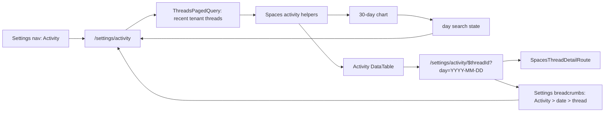

# feat: Add Spaces Settings Activity

## Overview

Add an operator-only Activity page to `apps/spaces` Settings that ports the useful admin Analytics > Activity experience into the Settings shell. The page should show recent thread activity, a clickable 30-day activity chart, search/refresh/table controls, and URL-backed date filtering. Thread rows open a Settings-hosted thread detail view whose breadcrumbs preserve the Activity/date context.

---

## Problem Frame

Operators can inspect activity today in `apps/admin` under Analytics > Activity, but Spaces Settings currently only exposes cost Analytics. Since Spaces is the active operator surface, Activity needs to exist as a first-class Settings page with Settings-native header spacing and breadcrumb behavior. The most important behavioral constraint from the origin document is context preservation: when an operator filters to a date, opens a thread, and navigates back through browser controls or breadcrumbs, the filtered date must survive (see origin: `docs/brainstorms/2026-06-05-spaces-settings-activity-requirements.md`).

---

## Requirements Trace

- R1. Add an operator-only standalone Activity page to Spaces Settings.
- R2. Match Settings Analytics header/content conventions rather than the admin Analytics tab chrome.
- R3. Activity is a Settings navigation destination, not a tab inside Settings Analytics.
- R4. Preserve the admin Activity surface: 30-day bar chart, item count, search, refresh, thread activity table, status, cost, duration, relative time, empty state, and pagination.
- R5. Clicking a chart day toggles that day as the active table filter.
- R6. Selected date and clear-date controls share the toolbar row with Search Activity.
- R7. The active date filter is represented in route search state.
- R8. Clearing the date removes only the date filter and does not reset search.
- R9. Thread row clicks open Settings-hosted thread detail, not the main Threads shell.
- R10. Reuse/adapt the existing Spaces thread detail experience inside Settings.
- R11. Unfiltered Activity drill-in breadcrumbs include Activity > thread title.
- R12. Date-filtered Activity drill-in breadcrumbs include Activity > date > thread title, with the date crumb linking back to filtered Activity.
- R13. Settings breadcrumbs preserve search state when supplied by a crumb.
- R14. Selected chart date remains visually distinct while non-selected dates de-emphasize.
- R15. Clickable table rows feel consistent with other Settings tables.
- R16. Desktop Settings widths do not overlap toolbar controls; long thread titles truncate; pagination remains reachable.

**Origin actors:** A1 Operator, A2 Spaces Settings shell, A3 Thread detail viewer

**Origin flows:** F1 Browse activity, F2 Filter by day, F3 Open and return from thread detail

**Origin acceptance examples:** AE1 date chart filter + toolbar placement + URL state, AE2 clear date preserves search, AE3 unfiltered drill-in breadcrumb, AE4 filtered drill-in breadcrumb search state

---

## Scope Boundaries

- Do not redesign Settings Analytics cost reporting.
- Do not add new activity types beyond thread-derived activity already available from existing thread data in v1.
- Do not add backend aggregation for v1. Use existing thread data and defer aggregation/performance hardening if the bounded recent activity list is not enough.
- Do not create a new thread detail design. Reuse the existing Spaces thread detail component with Settings-specific navigation context.
- Do not expose Activity to non-operators unless an existing operator policy changes separately.

### Deferred to Follow-Up Work

- Backend daily aggregation or date-range queries for very high-volume tenants, if the bounded recent-thread fetch proves insufficient.
- Cross-surface consolidation with admin Activity utilities after admin retirement direction is clearer. For this feature, Spaces-specific helpers are acceptable to avoid coupling a new Spaces page to admin-local imports.

---

## Context & Research

### Relevant Code and Patterns

- `apps/admin/src/routes/_authed/_tenant/-analytics/ActivityView.tsx` already implements the user-facing model: 30-day chart, selected day opacity, search, refresh, thread rows, status/cost/duration/relative-time cells, empty state, and row click to thread detail.
- `apps/admin/src/lib/activity-utils.ts` has mapping helpers and label/tone constants, but it is admin-local. Port the relevant normalization into Spaces rather than importing from `apps/admin`.
- `apps/spaces/src/components/settings/SettingsAnalytics.tsx` is the visual template for Settings-native header/content spacing.
- `apps/spaces/src/components/settings/SettingsContent.tsx` provides `SettingsHeader`, `SettingsTablePane`, and `SettingsPane`; list/table settings pages commonly use `SettingsTablePane` plus `@thinkwork/ui` `DataTable`.
- `apps/spaces/src/components/settings/settings-nav.tsx` is the operator-gated Settings nav source and the fallback breadcrumb source.
- `apps/spaces/src/routes/_authed/settings.analytics.tsx` shows the Settings route + `OperatorGuard` pattern.
- `apps/spaces/src/lib/graphql-queries.ts` includes `ThreadsPagedQuery`, `ThreadUpdatedSubscription`, and `ThreadTurnUpdatedSubscription`. `ThreadsPagedQuery` returns the fields needed for a thread activity row: id, number, identifier, title, status, agent, space, channel, costSummary, lastActivityAt, lastTurnCompletedAt, createdAt, updatedAt.
- `apps/spaces/src/routes/_authed/_shell/threads.index.tsx` shows server-paged thread table behavior and row navigation.
- `apps/spaces/src/components/workbench/SpacesThreadDetailRoute.tsx` owns the current Spaces thread detail experience and already accepts `backHref` plus `documentTitlePrefix`.
- `apps/spaces/src/components/DesktopApplicationHeader.tsx` already renders breadcrumb `search` into `<Link search={crumb.search}>`; `apps/spaces/src/components/settings/SettingsHeaderBar.tsx` currently renders only `to={crumb.href}` and needs parity.
- `apps/spaces/src/context/PageHeaderContext.tsx` already models `breadcrumbs[].search`, so this feature should not invent a new breadcrumb state shape.

### Institutional Learnings

- `docs/plans/2026-06-03-001-feat-artifacts-spaces-operator-port-plan.md` is the closest admin-to-Spaces operator-port precedent: keep Settings sections operator-only with nav gating plus `OperatorGuard`, and preserve the Settings shell for detail views entered from Settings.
- `docs/plans/2026-05-31-003-refactor-spaces-settings-ui-cleanup-plan.md` reinforces that Settings pages should use the shared header action/content patterns and that Spaces app code, not `apps/desktop`, owns desktop-rendered Settings UI.
- `docs/solutions/integration-issues/spaces-urql-doc-cache-no-live-invalidation.md` notes Spaces uses urql document cache behavior; explicit network refreshes are safer for manual Refresh and subscription-triggered updates.

### External References

- None. Local TanStack Router, urql, Settings, and DataTable patterns are sufficient.

---

## Key Technical Decisions

- Use a Spaces-specific activity helper module. Admin utilities are good source material, but importing from `apps/admin` would couple the active Spaces app to the deprecated surface and make future admin deletion harder.
- Use `ThreadsPagedQuery` as the v1 data source with a bounded recent-activity fetch. Request enough recent threads for the 30-day chart and table, sort by recent update, and client-filter by search/date. Backend aggregation is deferred unless implementation proves this cannot satisfy the current operator surface.
- Store the selected day in route search state named `day`, using canonical `YYYY-MM-DD`. Keep search text local component state for v1 because the origin only requires date persistence.
- Add Activity as `/settings/activity` and Settings thread detail as `/settings/activity/$threadId`. The detail route validates the same `day` search parameter so direct links and breadcrumbs can round-trip the date.
- Extend `SpacesThreadDetailRoute` with an optional breadcrumb override for Settings contexts. The default space breadcrumb behavior remains unchanged for `/threads/$id`; the Settings Activity route injects Activity/date breadcrumbs and `backHref`.
- Update `SettingsHeaderBar` to pass `crumb.search` to TanStack `<Link>`, matching `DesktopApplicationHeader`. This is necessary for R13 and benefits any future Settings breadcrumb with search state.

---

## Open Questions

### Resolved During Planning

- Should Activity reuse admin helpers or port Spaces-specific helpers? Resolved: port the relevant normalization into Spaces to avoid a dependency from `apps/spaces` to `apps/admin`.
- Should Activity require a new backend query? Resolved for v1: use existing `ThreadsPagedQuery` with a bounded recent fetch and defer aggregation/date-range backend work.
- Should Settings thread detail wrap or fork the existing thread detail component? Resolved: wrap/adapt `SpacesThreadDetailRoute` with injected breadcrumbs/backHref, preserving the existing detail implementation.

### Deferred to Implementation

- Exact bounded fetch size for recent activity: choose a reasonable constant during implementation after checking current UI performance and existing list defaults. The plan expects enough rows for the 30-day chart and paginated table without adding backend work.
- Whether `lastActivityAt`, `lastTurnCompletedAt`, or `updatedAt` should be the final activity timestamp precedence. Start from existing Spaces thread-list precedence and adjust only if admin Activity parity requires a different field.

---

## High-Level Technical Design

> _This illustrates the intended approach and is directional guidance for review, not implementation specification. The implementing agent should treat it as context, not code to reproduce._

---

## Implementation Units

- U1. **Add Activity route, nav entry, and activity data helpers**

**Goal:** Establish the Settings Activity destination, operator gate, date search contract, and Spaces-local activity row model.

**Requirements:** R1, R3, R4, R7, R15; supports F1 and AE1

**Dependencies:** None

**Files:**

- Create: `apps/spaces/src/routes/_authed/settings.activity.tsx`
- Create: `apps/spaces/src/components/settings/SettingsActivity.tsx`
- Create: `apps/spaces/src/lib/settings-activity.ts`
- Modify: `apps/spaces/src/components/settings/settings-nav.tsx`
- Modify: `apps/spaces/src/routeTree.gen.ts` (generated by the route tooling)
- Test: `apps/spaces/src/lib/settings-activity.test.ts`
- Test: `apps/spaces/src/components/settings/settings-nav.test.ts`

**Approach:**

- Add `/settings/activity` with `validateSearch` returning `{ day?: string }` only for valid `YYYY-MM-DD` strings.
- Wrap the route with `OperatorGuard`, matching `settings.analytics.tsx`.
- Add an operator-only `Activity` nav item near `Analytics`; use an activity-oriented icon from the existing icon libraries.
- Build `settings-activity.ts` around a small `ActivityItem` row type and helpers for:
  - date key extraction in local time
  - last-30-days count construction
  - thread-to-activity-row mapping
  - status tone, type label, cost formatting, duration formatting
  - search/date filtering
- Base timestamp precedence on existing Spaces thread-list helpers: prefer `lastActivityAt`, then `lastTurnCompletedAt`, then `updatedAt`, then `createdAt`.
- Keep this helper module free of React/router code so date/search behavior can be unit-tested directly.

**Patterns to follow:**

- `apps/admin/src/routes/_authed/_tenant/-analytics/ActivityView.tsx`
- `apps/admin/src/lib/activity-utils.ts`
- `apps/spaces/src/routes/_authed/settings.analytics.tsx`
- `apps/spaces/src/components/settings/settings-nav.tsx`

**Test scenarios:**

- Happy path: a thread with identifier, title, status, channel, cost, and activity timestamp maps to an activity row with the expected title, type, status, cost, and date key.
- Edge case: a thread missing `lastActivityAt` uses `lastTurnCompletedAt`, then `updatedAt`, then `createdAt`.
- Edge case: invalid/missing timestamps do not crash chart-count construction and produce stable fallback ordering.
- Happy path: last-30-days counts include zero-count days and count multiple rows on the same day.
- Happy path: search matches title and agent name case-insensitively.
- Covers AE1: date filtering keeps only rows whose local date key equals the selected `day`.
- Navigation: `visibleSettingsNavItems` includes Activity for resolved operators and hides it for non-operators.

**Verification:**

- Activity appears in Settings nav only for operators.
- `/settings/activity` accepts valid `day` search state and normalizes invalid dates away.
- Activity helpers produce deterministic rows/counts independent of React rendering.

---

- U2. **Build the Settings Activity page UI**

**Goal:** Render the Settings-native Activity chart, toolbar, table, loading/empty states, refresh behavior, and date/search filtering.

**Requirements:** R2, R4, R5, R6, R7, R8, R14, R15, R16; covers F1, F2, AE1, AE2

**Dependencies:** U1

**Files:**

- Modify: `apps/spaces/src/components/settings/SettingsActivity.tsx`
- Modify: `apps/spaces/src/lib/graphql-queries.ts` if the existing thread query needs an additional selected field already present in GraphQL
- Test: `apps/spaces/src/components/settings/SettingsActivity.test.tsx`

**Approach:**

- Use `SettingsTablePane` or an equivalent Settings full-height table layout so the page header and toolbar match Settings list pages.
- Query recent tenant threads through `ThreadsPagedQuery` with `showArchived: false`, `sortField: "updated"`, `sortDir: "desc"`, and a bounded `limit` suitable for the v1 30-day chart/table.
- Subscribe to `ThreadUpdatedSubscription` and `ThreadTurnUpdatedSubscription` for the active tenant and reexecute the query with a network refresh when relevant updates arrive.
- Render the 30-day chart using the existing `@thinkwork/ui` chart/Recharts pattern already used by Settings Analytics and admin Activity.
- Clicking a chart bar toggles `day` route search state; clicking the currently-selected day clears it.
- Render the toolbar as one wrapping row: Search Activity input, Refresh button, and, when selected, the date badge plus Clear date filter control on that same row. Use responsive wrapping rather than fixed positioning so narrow desktop widths do not overlap.
- Keep search as local component state. Clearing the date updates only route search state and leaves search untouched.
- Render rows with `@thinkwork/ui` `DataTable`, `hideHeader`, `scrollable`, `tableClassName="table-fixed"`, row truncation, status badge, duration, cost, and relative time. Use client pagination over the filtered bounded result.
- Row click navigates to `/settings/activity/$threadId` with the current `day` search value and a thread-title fallback in location state when useful.

**Patterns to follow:**

- `apps/admin/src/routes/_authed/_tenant/-analytics/ActivityView.tsx`
- `apps/spaces/src/components/settings/SettingsSkills.tsx`
- `apps/spaces/src/components/settings/SettingsAnalytics.tsx`
- `apps/spaces/src/routes/_authed/_shell/threads.index.tsx`

**Test scenarios:**

- Happy path: rendered page shows item count, chart, Search Activity input, Refresh button, and activity table rows from mocked thread data.
- Covers AE1: clicking a chart day calls route navigation/search update with `day: "YYYY-MM-DD"` and filters visible rows to that date.
- Covers AE1 and R6: when a day is selected, the date badge and Clear date filter control render in the same toolbar container as the search input.
- Covers AE2: changing search text, then clearing the date filter, leaves the search input value intact and only removes the date search state.
- Happy path: Refresh reexecutes the thread query with a network refresh policy.
- Integration: thread update or turn update subscription data triggers a network refresh.
- Empty state: no rows after search/date filtering renders the Activity empty state rather than an empty table shell.
- Responsive/layout guard: long thread titles render truncated text within a fixed table layout.

**Verification:**

- The Activity page visually matches the Settings Analytics/List-page header area, not admin Analytics tabs.
- Chart day selection, clearing, search, refresh, pagination, and row clicks behave as specified.

---

- U3. **Preserve search state in Settings breadcrumbs**

**Goal:** Make Settings header breadcrumbs honor `crumb.search`, enabling date-preserving Activity breadcrumbs.

**Requirements:** R13; supports R11, R12, AE4

**Dependencies:** None

**Files:**

- Modify: `apps/spaces/src/components/settings/SettingsHeaderBar.tsx`
- Modify: `apps/spaces/src/components/settings/settings-nav.tsx`
- Test: `apps/spaces/src/components/settings/SettingsHeaderBar.test.tsx`

**Approach:**

- Extend the `SettingsCrumb` type with optional `search?: Record<string, unknown>`.
- Pass `search={crumb.search}` into the Settings header `<Link>`, mirroring `DesktopApplicationHeader`.
- Add a focused Settings header test for a linked breadcrumb with `href: "/settings/activity"` and `search: { day: "2026-05-31" }`.
- Preserve existing behavior for href-only crumbs and plain final crumbs.

**Patterns to follow:**

- `apps/spaces/src/components/DesktopApplicationHeader.tsx`
- `apps/spaces/src/components/DesktopApplicationHeader.test.tsx`
- `apps/spaces/src/context/PageHeaderContext.tsx`

**Test scenarios:**

- Covers AE4: a Settings breadcrumb with `href` plus `search.day` renders a link whose href includes the query string.
- Regression: a breadcrumb with `href` and no search still renders the same href as before.
- Regression: the final breadcrumb remains plain text when it has no href.

**Verification:**

- Settings breadcrumbs can link to `/settings/activity?day=YYYY-MM-DD`.
- Existing Settings detail breadcrumbs are unchanged.

---

- U4. **Add Settings-hosted Activity thread detail**

**Goal:** Open clicked Activity rows inside the Settings shell while preserving Activity/date breadcrumbs and existing thread detail behavior.

**Requirements:** R9, R10, R11, R12, R13; covers F3, AE3, AE4

**Dependencies:** U1, U3

**Files:**

- Create: `apps/spaces/src/routes/_authed/settings.activity.$threadId.tsx`
- Modify: `apps/spaces/src/components/workbench/SpacesThreadDetailRoute.tsx`
- Modify: `apps/spaces/src/routeTree.gen.ts` (generated by the route tooling)
- Test: `apps/spaces/src/components/workbench/SpacesThreadDetailRoute.test.tsx`
- Test: `apps/spaces/src/routes/_authed/settings.activity.$threadId.test.tsx`

**Approach:**

- Add `/settings/activity/$threadId` with `validateSearch` for the same optional `day` string as `/settings/activity`.
- Wrap the route in `OperatorGuard`.
- Render `SpacesThreadDetailRoute` with:
  - `threadId` from the route param
  - `backHref` as a safe fallback to `/settings/activity`; the filtered-date return path is preserved by browser history and breadcrumb `search`, not by assuming `backHref` parses raw query strings
  - `documentTitlePrefix` appropriate to Settings Activity
  - a new optional breadcrumb override that replaces the default space breadcrumb when supplied
- Extend `SpacesThreadDetailRoute` with an optional prop for caller-provided breadcrumb root/trail. Default behavior for `/threads/$id` stays the same: when no override is supplied, it continues to show the existing space breadcrumb if the thread has a space.
- For Settings Activity:
  - unfiltered: breadcrumbs are `Activity` (href `/settings/activity`) > thread title
  - filtered: breadcrumbs are `Activity` (href `/settings/activity`) > formatted date (href `/settings/activity`, search `{ day }`) > thread title
- Preserve the existing final-crumb inline title rename behavior by ensuring the final breadcrumb remains the thread title and still hosts `titleContent`.
- When navigating from the Activity table, include current `day` search state and pass thread title fallback through router state where the existing detail component can use it or where a new fallback seam is added.
- Do not rely on embedding `?day=...` in `PageHeaderActions.backHref` unless implementation first adds explicit search support for header fallback navigation. The required filtered return behavior comes from the Activity row navigation history entry plus the date breadcrumb link.

**Patterns to follow:**

- `apps/spaces/src/routes/_authed/_shell/threads.$id.tsx`
- `apps/spaces/src/routes/_authed/settings.artifacts.$id.tsx`
- `apps/spaces/src/routes/_authed/_shell/artifacts.$id.tsx`
- `apps/spaces/src/components/workbench/SpacesThreadDetailRoute.tsx`

**Test scenarios:**

- Covers AE3: with no day search, Settings Activity detail publishes breadcrumbs with Activity as a link and the thread title as the final crumb.
- Covers AE4: with day search, Settings Activity detail publishes Activity > formatted date > thread title, and the date crumb carries `search.day`.
- Regression: the existing `/threads/$id` usage without a breadcrumb override still publishes the space breadcrumb when the thread has a space.
- Regression: `titleContent` still renders in the final crumb when a route supplies custom breadcrumbs.
- Error/loading path: missing thread data still renders the existing thread detail loading/not-found behavior inside the Settings shell rather than escaping to the main shell.

**Verification:**

- Opening a row from unfiltered Activity stays inside Settings and the Activity breadcrumb returns to unfiltered Activity.
- Opening a row from date-filtered Activity stays inside Settings and Activity/date breadcrumbs return to the correct Activity states.
- Main thread detail routes are behaviorally unchanged.

---

- U5. **End-to-end polish, accessibility, and visual verification**

**Goal:** Validate that the full Activity flow is coherent in the Settings shell across desktop widths and that route state survives navigation.

**Requirements:** R2, R6, R7, R8, R11, R12, R14, R16; covers AE1-AE4

**Dependencies:** U2, U3, U4

**Files:**

- Modify: `apps/spaces/src/components/settings/SettingsActivity.test.tsx`
- Modify: `apps/spaces/src/components/settings/SettingsHeaderBar.test.tsx`
- Modify: `apps/spaces/src/components/workbench/SpacesThreadDetailRoute.test.tsx`
- Modify: `apps/spaces/src/routes/_authed/settings.activity.$threadId.test.tsx`

**Approach:**

- Round out tests around the actual flow rather than duplicating every helper assertion:
  - Activity route starts with `day` search and renders a selected chart/date badge state.
  - Activity row click includes `day` in navigation to thread detail.
  - Detail breadcrumb date crumb links back with search state.
- Verify the Settings toolbar wraps cleanly at narrower desktop widths; selected date controls should move as a group if they wrap, never overlap the search input.
- Verify chart selected-day opacity is visible in dark mode and does not make unselected bars disappear entirely.
- Verify DataTable pagination remains reachable with the Settings shell's scroll container.
- Manual visual QA should use the Spaces dev server with the ignored admin/spaces env copied as described in `AGENTS.md` when running from a worktree.

**Patterns to follow:**

- `apps/spaces/src/components/artifacts/ArtifactsListBody.test.tsx`
- `apps/spaces/src/components/DesktopApplicationHeader.test.tsx`
- `apps/spaces/src/components/workbench/SpacesThreadDetailRoute.test.tsx`

**Test scenarios:**

- Covers AE1-AE4: Activity filter -> row click -> Settings thread detail -> Activity/date breadcrumbs preserve or clear date as specified.
- Accessibility: chart bars or chart container have a keyboard/mouse-accessible path to select/clear the date, or the selected-date state is otherwise exposed through visible toolbar controls.
- Layout: with long thread titles and an active date badge, the toolbar/table render without text overlap.

**Verification:**

- Browser verification confirms `/settings/activity`, `/settings/activity?day=YYYY-MM-DD`, and `/settings/activity/$threadId?day=YYYY-MM-DD` behave as designed.
- Focused Spaces tests cover helper logic, Activity UI behavior, Settings breadcrumb search links, and thread-detail breadcrumb overrides.

---

## System-Wide Impact

- **Interaction graph:** Settings nav opens Activity; Activity queries recent threads and subscribes to thread updates; row click routes to Settings-hosted thread detail; thread detail uses the existing thread-detail query/subscription stack.
- **Error propagation:** Thread query failures should render an inline Activity error/empty state without breaking the Settings shell. Thread detail errors remain owned by `SpacesThreadDetailRoute`.
- **State lifecycle risks:** `day` is route state; search is local state. Clearing `day` must not reset search. Subscription refreshes must not clear either state.
- **API surface parity:** Main `/threads/$id` behavior must stay unchanged while `/settings/activity/$threadId` injects alternate breadcrumbs.
- **Integration coverage:** Unit tests should cover route search and breadcrumb search state; browser verification should cover the full chart -> table -> detail -> breadcrumb return flow.
- **Unchanged invariants:** No backend schema/resolver changes; no change to Settings Analytics; no change to non-operator Settings visibility.

---

## Risks & Dependencies

| Risk                                                                                         | Mitigation                                                                                                                   |
| -------------------------------------------------------------------------------------------- | ---------------------------------------------------------------------------------------------------------------------------- |
| Bounded thread fetch may miss older 30-day rows for high-volume tenants.                     | Accept for v1 to avoid backend aggregation; document follow-up aggregation/date-range query if operators hit the limit.      |
| SettingsHeaderBar search support could affect existing Settings breadcrumbs.                 | Mirror the already-tested Desktop header behavior and add SettingsHeaderBar regression tests for href-only and final crumbs. |
| Custom breadcrumbs could regress main thread detail space breadcrumbs or inline rename.      | Make breadcrumb override optional and test both default and override paths.                                                  |
| Toolbar controls may overlap at desktop widths similar to the screenshots.                   | Use wrapping flex layout, fixed/truncated table cells, and browser visual verification.                                      |
| Subscription refreshes could reset local UI state if state is derived from data incorrectly. | Keep `day` in route search and search text in React state; query reexecution should update rows only.                        |

---

## Documentation / Operational Notes

- No public docs update is required for v1.
- Because this is a local Spaces UI feature, verification should include the Spaces/admin env-file setup from `AGENTS.md` when running a dev server from a worktree.
- If implementation adds a new query file that is codegen-included, regenerate Spaces GraphQL codegen; if it only uses `apps/spaces/src/lib/graphql-queries.ts`, no typed codegen change is expected.

---

## Sources & References

- **Origin document:** [docs/brainstorms/2026-06-05-spaces-settings-activity-requirements.md](docs/brainstorms/2026-06-05-spaces-settings-activity-requirements.md)
- Admin Activity source: `apps/admin/src/routes/_authed/_tenant/-analytics/ActivityView.tsx`
- Admin activity helpers: `apps/admin/src/lib/activity-utils.ts`
- Spaces Settings Analytics template: `apps/spaces/src/components/settings/SettingsAnalytics.tsx`
- Spaces Settings content/header patterns: `apps/spaces/src/components/settings/SettingsContent.tsx`, `apps/spaces/src/components/settings/SettingsHeaderBar.tsx`, `apps/spaces/src/components/settings/settings-nav.tsx`
- Spaces thread queries and subscriptions: `apps/spaces/src/lib/graphql-queries.ts`
- Spaces thread list route: `apps/spaces/src/routes/_authed/_shell/threads.index.tsx`
- Spaces thread detail route: `apps/spaces/src/components/workbench/SpacesThreadDetailRoute.tsx`
- Breadcrumb search precedent: `apps/spaces/src/components/DesktopApplicationHeader.tsx`, `apps/spaces/src/components/DesktopApplicationHeader.test.tsx`
