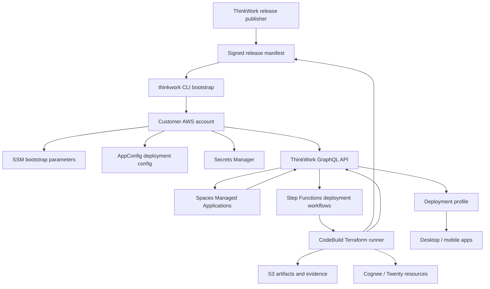
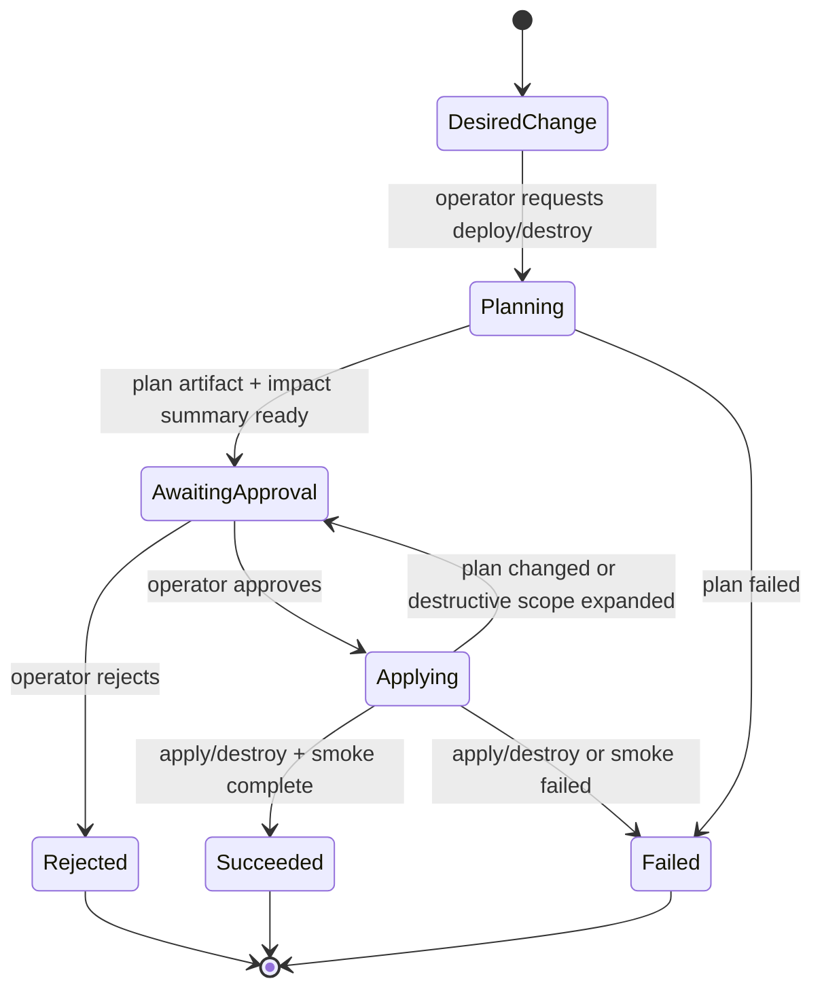
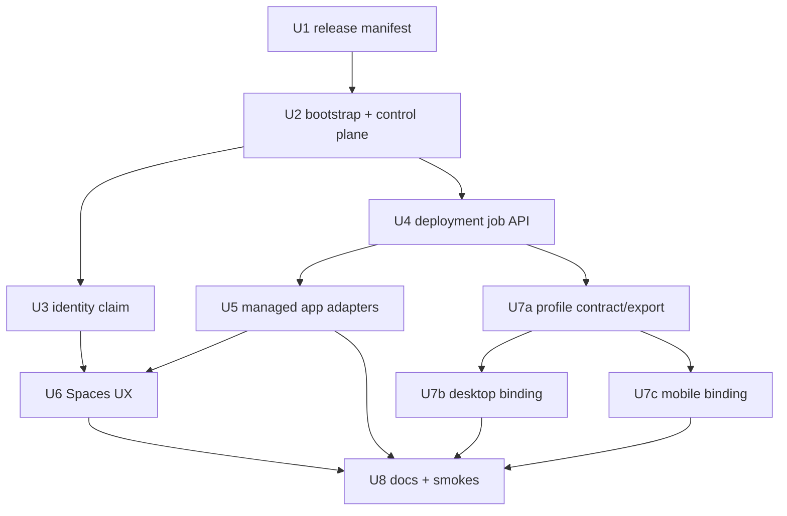

# feat: GitHub-free Customer Deployments

## Overview

Replace the customer deployment model that requires a customer GitHub repository
and GitHub Actions with a bootstrap-first, AWS-native deployment system.

The CLI remains the first-mile tool: a customer platform admin runs a guided
bootstrap with temporary AWS administrator access, selects a ThinkWork release,
configures identity, and deploys only the foundation needed to log into Spaces
and operate the environment. After that, steady-state deployment authority moves
into the customer AWS account through Step Functions, CodeBuild, customer-owned
configuration, Secrets Manager, S3 artifacts, and the deployed ThinkWork API.

Managed applications such as Cognee and Twenty become Spaces-first lifecycle
objects. Operators see a plan preview, approve deploy or destroy, watch progress,
and inspect logs/evidence without relying on a source repo CI run. Desktop and
mobile clients become universal distributions that bind to a deployment profile
before sign-in instead of shipping customer-specific endpoint builds.

---

## Problem Frame

ThinkWork is starting to deploy into companies that do not all use GitHub. The
current enterprise deployment path improved over forking source, but it still
expects each customer to have a GitHub repo, GitHub Actions, GitHub environment
secrets, and workflow dispatch rights. That makes GitHub an accidental product
dependency for customer-owned deployment.

The origin document defines the replacement product shape: no source fork, no
customer GitHub repo, no GitHub Actions requirement, minimal CLI bootstrap, AWS
as steady-state authority, first-admin claim by email, Spaces-first managed app
lifecycle, destructive managed-app teardown by default, and universal apps that
bind to customer deployment profiles (see origin:
`docs/brainstorms/2026-06-06-github-free-customer-deployments-requirements.md`).

---

## Requirements Trace

### Bootstrap and Authority

- R1. Customer deployments must not require a ThinkWork source fork, customer
  GitHub repo, or GitHub Actions.
- R2. The CLI bootstrap gathers AWS account, region, identity-provider,
  first-admin email, and release-selection inputs.
- R3. After bootstrap, the customer AWS account is the steady-state deployment
  authority, not GitHub or the operator laptop.
- R4. Initial bootstrap deploys only foundation: auth, API, database, Spaces,
  deployment runner/control plane, configuration storage, and login/profile
  outputs.
- R5. V1 does not require a custom domain; AWS-generated URLs are acceptable.
- R6. Customer deployment configuration lives in customer AWS after bootstrap;
  secrets live in Secrets Manager.
- R7. Customer deploy jobs pull signed/versioned ThinkWork release manifests and
  public artifacts rather than cloning or forking source.

### Identity

- R8. Bootstrap asks for first-admin email and stores a pending claim.
- R9. First-admin claim completes by matching the verified email from Cognito.
- R10. V1 bootstrap supports configurable Cognito OIDC/SAML providers; Google
  can remain an easy preset.

### Managed Applications

- R11. Spaces Settings -> Managed Applications is the normal operator surface.
- R12. V1 proves the lifecycle with Cognee and Twenty CRM deploy/teardown.
- R13. Managed-app deploy/teardown runs through plan preview and explicit
  approval before apply or destroy.
- R14. Managed-app teardown defaults to destructive destroy of app resources and
  data.
- R15. Destructive teardown communicates app-specific data impact before
  approval.
- R16. Managed-app status, plan summary, progress, logs, release version, and
  endpoints are visible from Spaces.
- R17. The control plane supports infrastructure creation and destruction
  without local Terraform from a browser session.
- R18. CLI managed-app commands are recovery/bootstrap support; Spaces is the
  default operator path.

### Universal Clients

- R19. Desktop and mobile distributions are universal by default.
- R20. Deployment profiles contain API, GraphQL/AppSync, Cognito/Auth, stage,
  and display metadata.
- R21. Desktop/mobile apps can import or enter a deployment profile before
  sign-in and store it locally.
- R22. Sign-in shows the connected profile and blocks incomplete configuration
  before OAuth begins.

### Release and Evidence

- R23. ThinkWork releases are immutable, versioned artifacts coordinated by a
  release manifest.
- R24. Customer environments can update the selected ThinkWork release without
  changing source code or creating a GitHub workflow.
- R25. Logs, plan artifacts, approvals, and smoke-check evidence are preserved
  for customer admins and ThinkWork support.

**Origin actors:** A1 (customer platform admin), A2 (first ThinkWork admin),
A3 (ThinkWork operator), A4 (customer AWS deployment control plane),
A5 (ThinkWork release publisher), A6 (desktop/mobile user)

**Origin flows:** F1 (bootstrap a customer AWS environment), F2 (claim the first
admin and finish setup), F3 (deploy or tear down managed applications), F4 (bind
universal desktop/mobile apps to a customer deployment)

**Origin acceptance examples:** AE1 (GitHub-free bootstrap), AE2 (first admin
claim), AE3 (Cognee deploy through Managed Applications), AE4 (Twenty destructive
teardown), AE5 (desktop deployment profile import), AE6 (release upgrade through
manifest/artifacts)

---

## Scope Boundaries

The first two lists preserve product-scope decisions from the origin document.
The follow-up list captures implementation sequencing that should not block the
first GitHub-free deployment path.

### Deferred for later

- Customer custom domains during bootstrap. V1 uses generated AWS/Cognito URLs
  first and adds domain setup after login.
- A ThinkWork-hosted central directory for endpoint discovery. Universal apps
  use deployment profiles first.
- Customer-specific branded desktop/mobile builds.
- Non-AWS deployment targets. ThinkWork remains AWS-native.
- A full generic app marketplace. V1 proves the lifecycle with Cognee and
  Twenty CRM.
- Rich policy automation for low-risk immediate applies. V1 uses plan preview
  and approval for managed-app changes.
- Migration tooling from existing GitHub deployment repos to the new
  AWS-native model.

### Outside this product's identity

- Making GitHub Actions the required customer deployment substrate.
- Making the operator laptop the steady-state deployment authority after
  bootstrap.
- Turning ThinkWork into a hosted SaaS control plane that deploys into customer
  accounts by default.
- Shipping separate customer-specific client binaries as the normal way to
  select a deployment.

### Deferred to Follow-Up Work

- Backward-compatible migration of existing customer GitHub deployment repos to
  the AWS-native control plane.
- Customer-specific branding in deployment profiles and app chrome beyond
  display metadata.
- Optional "park but retain data" mode for managed apps. V1 destructive teardown
  is explicit and intentional.
- Rich app marketplace catalog beyond first-party managed apps. The v1 registry
  should remain small and first-party.
- Cross-account deployment delegation. V1 runs in the same AWS account as the
  customer ThinkWork install.

---

## Context & Research

### Relevant Code and Patterns

- `apps/cli/src/commands/enterprise/bootstrap.ts`,
  `apps/cli/src/commands/enterprise/aws-bootstrap.ts`,
  `apps/cli/src/commands/enterprise/deploy.ts`, and
  `apps/cli/src/commands/enterprise/workflow.ts` implement the current
  enterprise path: generated deployment repo, GitHub OIDC bootstrap, release
  pinning, workflow dispatch, and local metadata. Reuse validation and release
  concepts; replace the GitHub bootstrap/workflow client with AWS control-plane
  clients.
- `apps/cli/src/commands/enterprise/release.ts` already models a release pin
  with manifest URL, SHA-256, and Terraform module version. Extend this into a
  real signed release manifest contract instead of `CHANGE_ME`.
- `packages/api/src/graphql/resolvers/core/setKnowledgeGraphDeployment.mutation.ts`
  is the current load-bearing seam to replace: it reads a GitHub token, updates
  a GitHub Actions variable, and dispatches `deploy.yml`.
- `packages/api/src/graphql/resolvers/core/deploymentStatus.query.ts` and
  `packages/database-pg/graphql/types/core.graphql` expose deployment status
  into Settings from Lambda environment variables. The new model needs durable
  job/application status while preserving compact Lambda env usage.
- `apps/spaces/src/components/settings/SettingsKnowledgeGraph.tsx` and
  `apps/spaces/src/lib/settings-queries.ts` are the current Cognee operator UI
  and typed query surface. Replace the single toggle/workflow result with a
  Managed Applications surface that handles plan, approval, progress, and
  app-specific teardown warnings.
- `packages/api/src/graphql/resolvers/core/bootstrapUser.mutation.ts` already
  has the pending-owner-email claim path used by paid signup. Extend this for
  bootstrap first-admin claim rather than introducing passwords or setup tokens.
- `terraform/modules/thinkwork/variables.tf`,
  `terraform/modules/thinkwork/main.tf`, and `terraform/modules/app/cognee/*`
  show the current optional Cognee module wiring and guardrail style.
- `docs/plans/2026-06-05-003-feat-twenty-crm-managed-app-plan.md` defines the
  Twenty AWS shape. This plan supersedes its GitHub Actions and data-retention
  assumptions for the new GitHub-free lifecycle.
- `apps/desktop/src/main/env.ts`, `apps/desktop/src/main/ipc-handlers.ts`,
  `packages/desktop-ipc/src/schemas.ts`, and
  `apps/spaces/src/routes/sign-in.tsx` define the current desktop endpoint
  configuration flow. It is env-baked and already reports missing values before
  OAuth.
- `apps/mobile/lib/auth.ts`, `apps/mobile/lib/graphql/client.ts`, and related
  mobile API helpers read Cognito/AppSync/API endpoints from
  `EXPO_PUBLIC_*` env vars. They need the same deployment profile abstraction as
  desktop.
- `terraform/modules/app/routines-stepfunctions/main.tf` and
  `packages/api/src/graphql/resolvers/routines/triggerRoutineRun.mutation.ts`
  provide local patterns for Step Functions orchestration and `StartExecution`
  integration.

### Institutional Learnings

- `docs/solutions/architecture-patterns/inert-first-seam-swap-multi-pr-pattern-2026-05-08.md`
  is directly relevant: ship substrate first, then live runner, then consumers,
  so Terraform/IAM/API/UI failures can be reviewed and rolled back separately.
- `docs/solutions/best-practices/every-admin-mutation-requires-requiretenantadmin-2026-04-22.md`
  applies to every managed-app mutation: authz must gate before AWS side
  effects, and Google-federated tenant resolution requires `resolveCallerTenantId`.
- `docs/solutions/best-practices/oauth-client-credentials-in-secrets-manager-2026-04-21.md`
  reinforces the split between metadata/config and secrets.
- `docs/solutions/workflow-issues/deploy-silent-arch-mismatch-took-a-week-to-surface-2026-04-24.md`
  and `docs/solutions/developer-experience/routine-rebuild-closeout-checkpoints-2026-05-03.md`
  both point to post-deploy smoke checks that prove runtime behavior, not just
  successful infrastructure apply.
- `docs/solutions/build-errors/aws-security-group-description-rejects-non-ascii-2026-05-13.md`
  is a reminder to keep generated Terraform names/descriptions ASCII-safe.
- `docs/plans/cognee-terraform-infrastructure-autopilot-status.md` captures
  Cognee rollout failures: Lambda env size pressure, EFS mount target issues,
  startup failures, and health smoke value.

### External References

- AWS Step Functions CodeBuild integration supports starting, stopping, and
  managing CodeBuild builds, including the optimized `.sync` pattern:
  <https://docs.aws.amazon.com/step-functions/latest/dg/connect-codebuild.html>
- AWS Step Functions service integrations describe job-running patterns such as
  `.sync`: <https://docs.aws.amazon.com/step-functions/latest/dg/concepts-service-integrations.html/>
- AWS CodeBuild buildspecs support environment variables, Secrets Manager and
  Parameter Store injection, reports, and S3 artifacts:
  <https://docs.aws.amazon.com/codebuild/latest/userguide/build-spec-ref.html>
- AWS CodeBuild exposes build IDs/ARNs and region variables that can become
  deploy evidence:
  <https://docs.aws.amazon.com/codebuild/latest/userguide/build-env-ref-env-vars.html>
- Amazon Cognito supports OIDC identity providers in user pools:
  <https://docs.aws.amazon.com/cognito/latest/developerguide/cognito-user-pools-oidc-idp.html>
- Amazon Cognito supports SAML identity providers in user pools:
  <https://docs.aws.amazon.com/cognito/latest/developerguide/cognito-user-pools-saml-idp.html>
- AWS AppConfig hosted configuration/deployments can version non-secret
  configuration and report deployment status:
  <https://docs.aws.amazon.com/appconfig/latest/userguide/appconfig-deploying.html>

---

## Key Technical Decisions

- **Step Functions plus CodeBuild is the customer deployment engine.**
  Step Functions owns orchestration, approval-gated apply/destroy transitions,
  retries, timeouts, and state. CodeBuild owns Terraform plan/apply/destroy
  execution, logs, and artifacts. Lambda and the browser never run Terraform.
- **Use customer AWS config storage by purpose.** Aurora remains the product
  source for tenants, managed-app desired state, deployment jobs, approvals, and
  Settings queries. SSM Parameter Store stores stable bootstrap outputs and
  control-plane resource names under `/thinkwork/<stage>/deployment/*`.
  AppConfig stores versioned non-secret deployment configuration such as release
  pins and managed-app desired config. Secrets Manager stores IdP secrets,
  application secrets, and database credentials.
- **Release manifest verification is two-stage.** The CLI and AWS runner verify
  a signed manifest with a pinned ThinkWork public key, then verify each
  referenced artifact by SHA-256 before Terraform or asset deployment consumes
  it.
- **Initial bootstrap may use local Terraform exactly once.** The CLI can apply
  the minimal foundation and control plane from bundled/published artifacts
  because nothing exists yet. After bootstrap, deploy, destroy, and upgrade work
  runs through the customer AWS control plane.
- **Replace GitHub-specific Cognee mutation with generic managed-app jobs.**
  `setKnowledgeGraphDeployment` should be deprecated or implemented as a thin
  compatibility wrapper over a new managed-app deployment API.
- **Managed-app destroy means destructive destroy in v1.** Cognee and Twenty
  teardown plans must include app-specific resource and data deletion effects:
  runtime resources, persistent storage, generated secrets, dedicated database
  users/databases, and app-owned buckets or cache resources where applicable.
- **First admin uses the existing pending-owner-email claim model.** Bootstrap
  provisions a tenant/pending owner email, and `bootstrapUser` claims it after
  Cognito sign-in with verified email.
- **Universal clients use a profile abstraction, not env-only config.**
  Desktop and mobile still support build-time defaults for development, but
  production user routing comes from a locally stored deployment profile.
- **Ship substrate inert-first.** Create AWS control-plane resources, schemas,
  config storage, and compatibility APIs before removing GitHub dispatch from
  the UI path.

---

## Open Questions

### Resolved During Planning

- **Which AWS services form the control plane?** Step Functions orchestrates,
  CodeBuild runs Terraform, S3 stores artifacts/evidence, SSM stores bootstrap
  outputs/resource identifiers, AppConfig stores versioned non-secret deployment
  config, Secrets Manager stores secrets, CloudWatch Logs stores raw execution
  logs, and Aurora stores product-facing job/app state.
- **What should the release manifest contain?** Manifest schema version,
  release version, compatibility bounds, artifact URLs and SHA-256 hashes,
  Terraform module versions or bundle URLs, deployment runner/build image
  references, Spaces/admin/mobile/desktop profile contract versions, managed-app
  descriptors for Cognee and Twenty, smoke contracts, and a detached signature.
- **How does AWS verify artifact integrity?** Runner verifies the manifest
  signature with a pinned ThinkWork public key, verifies artifact hashes before
  use, records the manifest digest on every deployment job, and fails closed on
  mismatch.
- **Which IdP inputs are required?** OIDC bootstrap needs provider name,
  issuer/discovery URL or explicit endpoints, client ID, client secret, scopes,
  and email/name attribute mapping. SAML bootstrap needs provider name, metadata
  URL or XML, optional domain/identifier hints, and email/name attribute
  mapping. Secrets go to Secrets Manager; non-secret metadata becomes Terraform
  variables/config.
- **What is the deployment profile format?** A signed JSON profile with
  `schemaVersion`, deployment id, display name, stage, region, issued-at,
  Spaces URL, API URL, GraphQL HTTP URL, AppSync HTTP/WS URLs, Cognito domain,
  user pool id, client id, and optional support metadata. Import mechanisms are
  desktop deep link/file/paste and mobile link/QR/paste for v1.
- **What smoke evidence is mandatory?** Foundation bootstrap proves Spaces URL
  reachability, GraphQL health/auth config, Cognito hosted login configuration,
  and first-admin claim readiness. Managed-app jobs prove Terraform result,
  app health endpoint or AWS health status, endpoint publication, and status
  query update. Upgrades prove manifest version change, API health, and managed
  app status still readable.

### Deferred to Implementation

- **Exact release signature mechanism:** The plan requires signed manifests and
  pinned public-key verification; implementation can choose the concrete
  signature library/tooling that best fits Node CLI and CodeBuild runner.
- **Exact AppConfig versus SSM split for each setting:** Use the purpose split
  above, but final key names and config document shape should settle during U2
  and U4.
- **Exact Terraform runner image:** The runner must pin Terraform/OpenTofu,
  Node, AWS CLI, and checksum tooling; the final image source and digest belong
  to release artifact implementation.
- **Final Twenty module details:** Carry forward
  `docs/plans/2026-06-05-003-feat-twenty-crm-managed-app-plan.md`, but change
  GitHub and retention assumptions to match this origin document.

### Deferred Product Decisions from Review

- **V1 deployment scope:** Confirm whether V1 is explicitly net-new
  GitHub-free deployments first, with migration of existing GitHub-backed
  customer repos deferred, or whether at least one existing deployment must move
  before the GitHub-free claim is complete.
- **Production teardown posture:** Confirm whether production managed apps keep
  destructive destroy as the default V1 lifecycle or add a data-retaining
  park/disable path before broader enterprise rollout.

---

## Output Structure

This is the expected new structure. Implementation units define required
ownership areas; exact file names may change to match local conventions if the
unit notes the substitution.

```text
terraform/modules/app/deployment-control-plane/
terraform/modules/app/twenty/
apps/cli/src/commands/enterprise/aws-deployments.ts
packages/api/src/graphql/resolvers/deployments/
packages/database-pg/graphql/types/deployments.graphql
packages/database-pg/src/schema/deployments.ts
packages/deployment-runner/
apps/spaces/src/components/settings/managed-applications/
packages/release-manifest/
packages/deployment-profile/
scripts/release/
scripts/smoke/
docs/src/content/docs/deploy/
```

---

## High-Level Technical Design

> *This illustrates the intended approach and is directional guidance for
> review, not implementation specification. The implementing agent should treat
> it as context, not code to reproduce.*



### Managed-App Job Lifecycle



---

## Implementation Units



- U1. **Release Manifest and Artifact Contract**

**Goal:** Turn the placeholder enterprise release pin into a signed, immutable
release contract that CLI bootstrap and AWS deployment jobs can consume without
source checkout.

**Requirements:** R1, R7, R23, R24, R25, A5, F1, F3, AE1, AE6

**Dependencies:** None

**Files:**
- Create: `scripts/release/build-release-manifest.mjs`
- Create: `scripts/release/verify-release-manifest.mjs`
- Create: `packages/release-manifest/package.json`
- Create: `packages/release-manifest/tsconfig.json`
- Create: `packages/release-manifest/src/index.ts`
- Create: `packages/release-manifest/test/manifest.test.ts`
- Modify: `apps/cli/src/commands/enterprise/release.ts`
- Modify: `.github/workflows/deploy.yml`
- Modify: `.github/workflows/verify.yml`
- Test: `apps/cli/__tests__/enterprise-release.test.ts`

**Approach:**
- Define a manifest schema that includes release version, compatibility bounds,
  artifact URLs, artifact SHA-256 digests, Terraform module/bundle references,
  deployment runner image or bundle reference, managed-app descriptors, smoke
  contracts, and profile schema version.
- Publish the manifest and its detached signature as release artifacts. Existing
  GitHub release publishing can remain a ThinkWork-owned publishing mechanism;
  customer deployments must not need their own GitHub repo or Actions.
- Embed or publish a pinned ThinkWork public key for CLI and runner
  verification. Verification order is signature first, artifact hashes second.
- Include key ids, validity windows, multiple trusted keys for rotation,
  revoked-key denylist handling, and break-glass guidance for compromised
  release keys. The CLI and runner must reject expired or revoked manifests and
  must test old-key, new-key, expired-key, and revoked-key manifests.
- Keep the current `resolveEnterpriseReleasePin` API compatible where useful,
  but remove the `CHANGE_ME` posture for production bootstrap.
- Include app descriptors for Cognee and Twenty so the runtime can plan and
  smoke each app using the selected release's known artifact/image digests.

**Execution note:** Implement the manifest parser/validator test-first; this is
an external contract consumed by CLI, CodeBuild, and later clients.

**Patterns to follow:**
- `apps/cli/src/commands/enterprise/release.ts` for current release pin shape.
- `docs/plans/2026-06-05-003-feat-twenty-crm-managed-app-plan.md` for Twenty
  artifact needs.

**Test scenarios:**
- Covers AE6. Happy path: a manifest with valid signature and matching artifact
  hashes resolves release version, Terraform module version, and Cognee/Twenty
  descriptors.
- Error path: invalid signature is rejected before artifact metadata is trusted.
- Error path: artifact hash mismatch fails with a message naming the artifact
  and expected digest.
- Edge case: manifest compatibility bounds reject an older CLI or runner.
- Edge case: key rotation accepts a manifest signed by the next trusted key and
  rejects an expired or revoked key id.
- Edge case: managed-app descriptor is missing required smoke metadata, so the
  manifest is not usable for managed-app deployment.

**Verification:**
- Release manifest tooling can generate, validate, and verify a manifest in CI.
- CLI release resolution can no longer silently proceed with `CHANGE_ME`.

---

- U2. **GitHub-Free Bootstrap and AWS Control Plane Substrate**

**Goal:** Add the minimal AWS-native control plane that bootstrap installs once
and that later deploy jobs use for plan/apply/destroy without GitHub Actions.

**Requirements:** R1, R2, R3, R4, R5, R6, R7, R17, R23, R24, R25, A1, A4, F1,
AE1

**Dependencies:** U1

**Files:**
- Create: `terraform/modules/app/deployment-control-plane/main.tf`
- Create: `terraform/modules/app/deployment-control-plane/variables.tf`
- Create: `terraform/modules/app/deployment-control-plane/outputs.tf`
- Create: `terraform/modules/app/deployment-control-plane/README.md`
- Modify: `terraform/modules/thinkwork/main.tf`
- Modify: `terraform/modules/thinkwork/variables.tf`
- Modify: `terraform/modules/thinkwork/outputs.tf`
- Modify: `apps/cli/src/commands/enterprise/aws-bootstrap.ts`
- Modify: `apps/cli/src/commands/enterprise/bootstrap.ts`
- Modify: `apps/cli/src/commands/enterprise/deploy.ts`
- Create: `apps/cli/src/commands/enterprise/aws-deployments.ts`
- Modify: `apps/cli/src/environments.ts`
- Test: `apps/cli/__tests__/enterprise-aws-bootstrap.test.ts`
- Test: `apps/cli/__tests__/terraform-deployment-control-plane-fixture.test.ts`

**Approach:**
- Add a Terraform module that creates the deployment state machine(s), CodeBuild
  project(s), runner IAM role, artifact/evidence bucket or prefix, CloudWatch
  log groups, SSM parameter prefix, AppConfig application/environment/profile,
  and Secrets Manager placeholders/grants required by the runner.
- Keep bootstrap minimal: foundation, API, database, Spaces, Cognito, the
  control plane, config storage, and enough outputs for login/profile binding.
  Do not ask managed-app questions up front.
- Replace the GitHub OIDC role bootstrap path with an AWS-native bootstrap path.
  Existing GitHub enterprise commands can stay as legacy/compatibility, but the
  default new-deployment path should not ask for a GitHub repository.
- Store local CLI metadata only as a recovery pointer; the durable config and
  selected release live in customer AWS.
- Generate AWS-created Spaces/Cognito/API URLs and profile handoff output. Do
  not require custom domains.
- Use AppConfig for versioned non-secret deployment config and SSM for stable
  bootstrap outputs/resource identifiers. Secrets Manager owns IdP secrets and
  application secrets.
- Apply the inert-first pattern: Terraform can create a runner/project with a
  stub buildspec first, then U4/U5 swap in live orchestration.

**Patterns to follow:**
- `terraform/modules/app/routines-stepfunctions/main.tf` for Step Functions
  IAM/logging conventions.
- `apps/cli/src/commands/enterprise/aws-bootstrap.ts` for AWS bootstrap client
  abstractions and dry-run result shapes.
- `docs/solutions/architecture-patterns/inert-first-seam-swap-multi-pr-pattern-2026-05-08.md`.

**Test scenarios:**
- Covers AE1. Happy path: bootstrap plan without a GitHub repository produces
  AWS state bucket/lock table, control-plane resources, AppConfig/SSM/Secrets
  targets, release pin, and generated URLs.
- Happy path: dry-run prints planned AWS mutations and profile handoff without
  mutating resources.
- Edge case: missing AWS account id or region fails before generating Terraform
  variables.
- Error path: invalid stage/customer slug is rejected before resource names are
  produced.
- Error path: release manifest verification failure blocks bootstrap.
- Integration: Terraform fixture with the control plane enabled renders Step
  Functions, CodeBuild, S3 evidence, SSM/AppConfig, and IAM outputs; disabled
  mode remains inert.

**Verification:**
- A new customer bootstrap can be planned without GitHub inputs.
- Terraform fixture tests prove the substrate renders with scoped outputs and
  ASCII-safe names/descriptions.

---

- U3. **First-Admin Claim and Cognito Identity Provider Inputs**

**Goal:** Make bootstrap identity configurable and connect the first signed-in
admin to the pending customer environment without generated passwords or broad
setup tokens.

**Requirements:** R2, R4, R8, R9, R10, A1, A2, F1, F2, AE2

**Dependencies:** U2

**Files:**
- Modify: `terraform/modules/foundation/cognito/main.tf`
- Modify: `terraform/modules/foundation/cognito/variables.tf`
- Modify: `terraform/modules/foundation/cognito/outputs.tf`
- Modify: `terraform/modules/thinkwork/main.tf`
- Modify: `terraform/modules/thinkwork/variables.tf`
- Modify: `packages/api/src/graphql/resolvers/core/bootstrapUser.mutation.ts`
- Modify: `packages/database-pg/src/schema/core.ts`
- Modify: `packages/database-pg/graphql/types/core.graphql`
- Create: `packages/database-pg/drizzle/<generated>_bootstrap_first_admin_claim.sql`
- Modify: `apps/cli/src/commands/enterprise/bootstrap.ts`
- Create: `apps/cli/src/commands/enterprise/identity-provider.ts`
- Test: `packages/api/src/graphql/resolvers/core/bootstrapUser.mutation.test.ts`
- Test: `apps/cli/__tests__/enterprise-identity-provider.test.ts`

**Approach:**
- Extend bootstrap inputs to support Google preset, generic OIDC, and generic
  SAML.
- For OIDC, collect provider name, issuer/discovery URL or explicit endpoints,
  client id, client secret, scopes, and attribute mapping. For SAML, collect
  provider name, metadata URL/XML, optional email-domain identifiers, and
  attribute mapping.
- Harden OIDC/SAML metadata fetching and parsing: require HTTPS, reject
  localhost/private/link-local/IMDS addresses, apply response timeouts and size
  caps, disable XML external entities, and validate OIDC issuer/endpoints plus
  SAML entityID/certificates against the configured provider.
- Store IdP client secrets in Secrets Manager and non-secret IdP metadata as
  Terraform/config inputs.
- Extend Cognito Terraform to configure selected providers and callback/logout
  URLs for generated AWS URLs plus desktop/mobile redirect schemes.
- Reuse the pending-owner-email path in `bootstrapUser` for the first admin
  claim. The bootstrap-created tenant should be claimed only when the verified
  Cognito email matches the pending email. Require a true
  `ctx.auth.emailVerified` value before the claim can attach the user, clear
  `pending_owner_email`, or stamp `custom:tenant_id`.
- Keep the default auto-create-free-workspace path for non-bootstrap contexts
  unless the deployment is explicitly configured to require a pending first
  admin.

**Execution note:** Add characterization tests around the existing
`bootstrapUser` pending-owner path before changing it.

**Patterns to follow:**
- Existing pending-owner claim logic in
  `packages/api/src/graphql/resolvers/core/bootstrapUser.mutation.ts`.
- Cognito callback URL wiring in `terraform/modules/thinkwork/main.tf`.

**Test scenarios:**
- Covers AE2. Happy path: pending first-admin email matches a verified Cognito
  email and grants owner/admin membership to the pre-provisioned tenant.
- Edge case: email comparison is case-insensitive and clears the pending claim
  after success.
- Error path: signed-in user with a different verified email cannot claim the
  pending tenant.
- Error path: signed-in user with the matching email but `emailVerified=false`
  cannot claim the pending tenant, clear the pending claim, or create owner
  membership.
- Error path: OIDC config without client secret or issuer/discovery URL fails
  bootstrap validation before Terraform.
- Error path: SAML config without metadata fails bootstrap validation.
- Error path: private-IP metadata URL, oversized SAML XML, XXE payload, or
  mismatched OIDC/SAML issuer metadata fails validation before Terraform.
- Integration: Cognito Terraform fixture includes OIDC/SAML provider variables
  and callback URLs for generated Spaces URL and app redirect schemes.

**Verification:**
- First admin can claim a bootstrap-created tenant through Cognito sign-in.
- Bootstrap supports Google, generic OIDC, and generic SAML input paths without
  exposing secrets in CLI metadata or browser payloads.

---

- U4. **Deployment Job Domain, API, and Runner Orchestration**

**Goal:** Create a durable managed deployment job API that starts AWS-owned
plan/apply/destroy workflows, records evidence, and replaces GitHub workflow
dispatch.

**Requirements:** R3, R6, R11, R13, R16, R17, R18, R24, R25, A3, A4, F3, AE3,
AE4, AE6

**Dependencies:** U2, U3

**Files:**
- Create: `packages/database-pg/src/schema/deployments.ts`
- Modify: `packages/database-pg/src/schema/index.ts`
- Create: `packages/database-pg/drizzle/<generated>_managed_deployments.sql`
- Create: `packages/database-pg/graphql/types/deployments.graphql`
- Modify: `packages/database-pg/graphql/types/core.graphql`
- Create: `packages/api/src/graphql/resolvers/deployments/index.ts`
- Create: `packages/api/src/graphql/resolvers/deployments/managedApplications.query.ts`
- Create: `packages/api/src/graphql/resolvers/deployments/startManagedApplicationPlan.mutation.ts`
- Create: `packages/api/src/graphql/resolvers/deployments/approveManagedApplicationDeployment.mutation.ts`
- Create: `packages/api/src/graphql/resolvers/deployments/rejectManagedApplicationDeployment.mutation.ts`
- Create: `packages/api/src/graphql/resolvers/deployments/managedApplicationDeployment.query.ts`
- Create: `packages/api/src/graphql/resolvers/deployments/deploymentEvidence.query.ts`
- Modify: `packages/api/src/graphql/resolvers/core/index.ts`
- Modify: `packages/api/src/graphql/resolvers/core/setKnowledgeGraphDeployment.mutation.ts`
- Modify: `apps/cli/src/gql/graphql.ts`
- Modify: `apps/spaces/src/gql/graphql.ts`
- Modify: `apps/mobile/lib/gql/graphql.ts`
- Create: `packages/deployment-runner/package.json`
- Create: `packages/deployment-runner/tsconfig.json`
- Create: `packages/deployment-runner/src/plan.ts`
- Create: `packages/deployment-runner/src/apply.ts`
- Create: `packages/deployment-runner/src/shared.ts`
- Test: `packages/api/src/graphql/resolvers/deployments/managed-applications.test.ts`
- Test: `packages/api/src/graphql/resolvers/deployments/managed-application-deployment.test.ts`
- Test: `packages/api/src/graphql/resolvers/deployments/deployment-evidence.test.ts`
- Test: `packages/deployment-runner/test/deployment-runner.test.ts`

**Approach:**
- Add deployment domain tables for managed apps, desired state, deployment jobs,
  job events, plan artifacts, approvals, selected release manifest digest, and
  evidence links.
- Add GraphQL types for managed app catalog rows, desired status, job lifecycle,
  plan summaries, app-specific data-impact summaries, approval actions, and
  evidence URLs.
- Regenerate GraphQL schema/codegen for every consumer that imports typed
  operations after adding the deployment schema.
- Gate mutations with tenant owner/admin authorization before AWS side effects.
  Use `resolveCallerTenantId` for federated users.
- Gate deployment queries with the same tenant boundary as mutations:
  `managedApplications`, `managedApplicationDeployment`, and
  `deploymentEvidence` resolve the caller tenant, reject unauthenticated,
  member, and cross-tenant callers, and only return short-lived tenant-scoped
  evidence/log URLs. ThinkWork support access is read-only unless a separately
  audited break-glass policy is introduced.
- Use idempotency keys so duplicate click/retry does not start multiple
  Step Functions executions for the same desired change.
- API starts Step Functions executions with a compact input: tenant/stage/app,
  requested operation, selected release manifest digest, desired config version,
  and job id. Step Functions starts CodeBuild `.sync` jobs.
- Use separate executions for plan and apply/destroy. The plan execution ends
  after writing an immutable plan artifact and setting `awaiting_approval`. The
  approve mutation verifies tenant owner/admin authorization, destructive
  confirmation, operation, desired config version, plan digest, and selected
  manifest digest, then starts a separate apply/destroy execution.
- CodeBuild runner verifies the manifest, prepares Terraform input from
  AppConfig/SSM/Secrets Manager, writes sanitized plan summaries and raw
  artifacts to S3, and records job events through a narrow API/service callback.
- Package the runner as CodeBuild-executed scripts/artifacts, not Lambda
  handlers. If a Lambda callback is needed, it is a narrow event ingestion
  surface and never runs Terraform.
- Define the runner callback trust contract: authenticate with SigV4/IAM or a
  dedicated per-environment credential stored in Secrets Manager, validate
  `jobId` against DB-owned tenant/app/operation state, validate Step Functions
  execution ARN and CodeBuild build ARN against the started job, ignore
  caller-supplied tenant/app fields for authorization, and use idempotency keys
  for event writes with retry/backoff behavior.
- Deprecate `setKnowledgeGraphDeployment` as a GitHub-specific mutation. For
  compatibility, have it call the new managed-app plan path for Cognee or mark
  it legacy once Spaces has moved.
- Do not rely on Lambda environment variables for all app status. Keep compact
  environment-derived deployment status for foundation details, but make
  managed-app status job-backed.

**Patterns to follow:**
- `packages/api/src/graphql/resolvers/routines/triggerRoutineRun.mutation.ts`
  for `StartExecution` patterns.
- `docs/solutions/best-practices/every-admin-mutation-requires-requiretenantadmin-2026-04-22.md`.
- `docs/solutions/design-patterns/audit-existing-ui-and-data-model-before-parallel-build-2026-04-28.md`
  for matching existing approval/status models before inventing new shapes.

**Test scenarios:**
- Covers AE3. Happy path: enabling Cognee creates a plan job, starts Step
  Functions, records manifest digest, and returns plan status to Spaces.
- Covers AE4. Happy path: destroying Twenty records a destructive data-impact
  summary and waits for explicit approval before CodeBuild destroy.
- Covers AE6. Happy path: selecting a newer release creates an upgrade plan with
  old/new manifest versions and evidence placeholders.
- Edge case: duplicate mutation with the same idempotency key returns the
  existing job and does not start a second execution.
- Error path: non-admin/member caller is rejected before `StartExecution`.
- Error path: unauthenticated, member, and cross-tenant callers cannot read
  managed app, deployment job, plan, evidence, or log state.
- Error path: Step Functions start failure leaves the job failed with an
  operator-readable message.
- Error path: CodeBuild output missing plan summary or manifest digest mismatch
  is rejected and does not create an approval-ready job.
- Error path: runner callback with invalid credentials, mismatched job id,
  mismatched execution/build ARN, or caller-supplied cross-tenant fields is
  rejected without mutating another tenant's job state.
- Integration: approved job transitions through planning, awaiting approval,
  applying, succeeded/failed with event ordering intact.

**Verification:**
- Managed-app lifecycle no longer requires GitHub token, GitHub variables, or
  workflow dispatch.
- Operators can inspect job, plan, approval, and evidence state through GraphQL.

---

- U5. **Cognee and Twenty Managed-App Adapters**

**Goal:** Make Cognee and Twenty first-class managed apps that deploy and tear
down through the new deployment job system, including destructive resource/data
semantics.

**Requirements:** R11, R12, R13, R14, R15, R16, R17, A3, A4, F3, AE3, AE4

**Dependencies:** U1, U2, U4

**Files:**
- Modify: `terraform/modules/app/cognee/main.tf`
- Modify: `terraform/modules/app/cognee/variables.tf`
- Modify: `terraform/modules/app/cognee/outputs.tf`
- Create: `terraform/modules/app/twenty/main.tf`
- Create: `terraform/modules/app/twenty/variables.tf`
- Create: `terraform/modules/app/twenty/outputs.tf`
- Create: `terraform/modules/app/twenty/README.md`
- Modify: `terraform/modules/thinkwork/main.tf`
- Modify: `terraform/modules/thinkwork/variables.tf`
- Modify: `terraform/modules/thinkwork/outputs.tf`
- Create: `packages/deployment-runner/src/apps/cognee.ts`
- Create: `packages/deployment-runner/src/apps/twenty.ts`
- Create: `packages/deployment-runner/src/apps/registry.ts`
- Create: `plugins/company-brain/smoke/cognee-managed-app-smoke.mjs`
- Create: `plugins/twenty/smoke/twenty-managed-app-smoke.mjs`
- Test: `apps/cli/__tests__/terraform-cognee-fixture.test.ts`
- Test: `apps/cli/__tests__/terraform-twenty-fixture.test.ts`
- Test: `packages/deployment-runner/test/deployment-runner-managed-apps.test.ts`

**Approach:**
- Create a small first-party managed-app registry, not a marketplace. Each
  adapter provides app id, display metadata, Terraform variable mapping,
  required secrets, plan summary interpretation, destructive impact text,
  smoke contract, and endpoint/status extraction.
- Keep Cognee's existing guardrails: immutable image digest, dedicated database
  credentials, no all-network internal CIDRs, Bedrock model resource ARNs, and
  compact status.
- Add Twenty's AWS module from the prior plan but change lifecycle semantics:
  teardown destroys Twenty runtime and data resources instead of parking while
  retaining data. Destroy impact includes dedicated DB/user, EFS or file
  storage, ElastiCache, generated secrets, ECS services, ALB/target group, and
  logs/artifacts where Terraform owns them.
- Add app-specific pre-destroy steps for database/user cleanup where Terraform
  cannot safely express the deletion by resource alone. These steps run in
  CodeBuild runner with least-privilege DB credentials and record evidence.
- Make every destructive plan show exact categories of data/resources affected.
  Approval requires an explicit destructive confirmation state in the API/UI,
  not only toggling a switch.
- For v1, destructive deploy/destroy approval requires a Cognito-authenticated
  customer tenant owner/admin on the same tenant. Approval is bound to the
  current plan digest, selected manifest digest, operation, and desired config
  version. ThinkWork support/operator access remains read-only unless a
  separately audited break-glass path is specified.
- Update release manifest app descriptors to include required image digests and
  smoke contracts for both apps.

**Patterns to follow:**
- `terraform/modules/app/cognee/*` for optional app guardrails.
- `docs/plans/2026-06-05-003-feat-twenty-crm-managed-app-plan.md` for Twenty
  AWS topology, adjusted for this plan's destructive teardown requirement.
- `docs/plans/cognee-terraform-infrastructure-autopilot-status.md` for Cognee
  rollout pitfalls and smoke expectations.

**Test scenarios:**
- Covers AE3. Happy path: Cognee deploy plan maps selected release artifact
  values into Terraform variables and produces endpoint/log/status evidence.
- Covers AE4. Happy path: Twenty destroy plan lists CRM data/resource deletion,
  requires approval, and runs destroy through the runner.
- Happy path: Twenty module provisions server, worker, dedicated database/user,
  cache, storage, ALB, logs, and compact status outputs when enabled.
- Edge case: Cognee/Twenty disabled mode creates no optional app resources.
- Error path: enabling an app without required image digest or secret fails at
  plan time with actionable missing inputs.
- Error path: destroy plan refuses to proceed when the runner cannot generate a
  data-impact summary.
- Integration: Cognee and Twenty smoke scripts skip clearly when not deployed
  and fail loudly when endpoints/status are unhealthy.

**Verification:**
- Cognee and Twenty can both be planned, approved, deployed, destroyed, smoked,
  and status-reported without GitHub Actions.
- App-specific destructive impact is visible before approval.

---

- U6. **Spaces Managed Applications UX**

**Goal:** Replace the single Knowledge Graph toggle with a managed-app operator
surface that supports plan preview, explicit approval, progress, logs, endpoints,
release versions, and destructive teardown warnings.

**Requirements:** R11, R12, R13, R15, R16, R18, A3, F3, AE3, AE4, AE6

**Dependencies:** U3, U4, U5

**Files:**
- Create: `apps/spaces/src/components/settings/managed-applications/ManagedApplicationsPage.tsx`
- Create: `apps/spaces/src/components/settings/managed-applications/ManagedApplicationRow.tsx`
- Create: `apps/spaces/src/components/settings/managed-applications/ManagedApplicationPlanDialog.tsx`
- Create: `apps/spaces/src/components/settings/managed-applications/ManagedApplicationJobTimeline.tsx`
- Create: `apps/spaces/src/components/settings/managed-applications/ManagedApplicationEvidenceLinks.tsx`
- Modify: `apps/spaces/src/components/settings/SettingsGeneral.tsx`
- Modify: `apps/spaces/src/components/settings/SettingsKnowledgeGraph.tsx`
- Modify: `apps/spaces/src/components/settings/settings-nav.tsx`
- Modify: `apps/spaces/src/lib/settings-queries.ts`
- Test: `apps/spaces/src/components/settings/ManagedApplicationsPage.test.tsx`
- Test: `apps/spaces/src/components/settings/ManagedApplicationPlanDialog.test.tsx`
- Test: `apps/spaces/src/components/settings/settings-nav.test.ts`
- Test: `apps/spaces/src/lib/graphql-queries.schema.test.ts`

**Approach:**
- Add Settings -> Managed Applications as the primary lifecycle surface for
  Cognee and Twenty. Keep direct Knowledge Graph/CRM pages as details that only
  appear when the app status supports them.
- For each app, show desired state, deployed state, selected release, latest
  job, health/smoke status, endpoint/log links, and next action.
- Actions are not raw switches. A deploy/destroy action starts plan generation
  and opens a plan dialog when ready. Apply/destroy requires explicit approval
  from the plan dialog.
- Destructive teardown copy is app-specific. Cognee warns about knowledge graph
  metadata/storage/database deletion. Twenty warns about CRM database, files,
  cache/runtime, and generated secrets.
- The plan dialog shows affected data categories, selected app, operation,
  release/manifest digest, plan digest, and plan timestamp. Destroy remains
  disabled until the deliberate confirmation control is satisfied, and the
  final action labels distinguish `Deploy application` from `Destroy
  application and data`. Approval is invalidated when the plan digest or
  destructive scope changes.
- Show job progress from durable events rather than optimistic pending state
  alone. Polling is acceptable for v1; subscriptions can follow if needed.
- Preserve current "configuration incomplete before OAuth" behavior for
  desktop sign-in while adding profile display in U7.
- State coverage:
  - Page states: loading catalog, empty catalog, no permission, deployment
    control plane not ready, GraphQL/API error, and ready.
  - Row states: not deployed, deployed, planning, awaiting approval, applying,
    destroying, rejected, failed, succeeded, and status unknown.
  - Plan dialog states: plan pending, plan ready, plan failed, approval disabled,
    destructive confirmation required, stale plan, rejected, and submitted.
  - Timeline/evidence states: no events yet, partial evidence, evidence loading,
    evidence unavailable, and evidence link expired.

**Patterns to follow:**
- `apps/spaces/src/components/settings/SettingsKnowledgeGraph.tsx` for current
  operator settings composition.
- `apps/spaces/src/components/approvals/*` for approval/readability patterns.
- `apps/spaces/src/components/settings/SettingsContent.tsx` for Settings layout.

**Test scenarios:**
- Covers AE3. Happy path: enabling Cognee starts a plan, shows plan preview,
  requires approval, then shows progress and final endpoint/status.
- Covers AE4. Happy path: destroying Twenty shows destructive CRM data warning,
  requires approval, and then shows destroy progress.
- Covers AE6. Happy path: release upgrade plan shows old/new release versions
  and evidence links.
- Edge case: direct Knowledge Graph route while Cognee is not deployed redirects
  or shows a clear not-deployed state.
- Edge case: latest job failed shows failure message, log/evidence link, and a
  retry/replan path.
- Edge case: control plane unavailable, no permission, stale plan, rejected job,
  and expired evidence link all show clear disabled actions or retry paths.
- Error path: GraphQL mutation failure does not flip the local displayed
  desired state.
- Integration: generated typed GraphQL operations include managed-app catalog,
  job detail, plan, approve, reject, and status fields.

**Verification:**
- Operators can manage Cognee and Twenty from Spaces without CLI or GitHub.
- UI makes destructive data impact clear before approval.

---

- U7. **Deployment Profile Contract and Universal Client Binding**

**Goal:** Let one desktop and one mobile distribution connect to customer-owned
ThinkWork deployments by importing a deployment profile before sign-in. This is
split into U7a/U7b/U7c so the shared contract, desktop binding, and mobile
binding can be reviewed and rolled back independently.

**Requirements:** R5, R19, R20, R21, R22, A2, A6, F4, AE5

**Dependencies:** U2, U4

### U7a. Profile Contract, Export, and Trust

**Files:**
- Create: `packages/deployment-profile/package.json`
- Create: `packages/deployment-profile/tsconfig.json`
- Create: `packages/deployment-profile/src/index.ts`
- Create: `packages/deployment-profile/test/deployment-profile.test.ts`
- Create: `apps/spaces/src/routes/deployment-profile.tsx`
- Modify: `apps/spaces/src/routes/sign-in.tsx`
- Modify: `apps/spaces/src/routes/-sign-in.test.tsx`

**Approach:**
- Define deployment profile JSON schema v1 in a shared package. Required fields:
  schema version, deployment id, display name, stage, region, issued-at,
  Spaces URL, API URL, GraphQL HTTP URL, AppSync HTTP/WS URLs, Cognito domain,
  user pool id, client id, and profile signature/hash metadata.
- Add API/Spaces route to export the profile from the customer environment.
  The profile is not secret, but it must be integrity-protected so users can
  trust which deployment they are binding.
- Define the profile trust contract: signing authority, public-key distribution
  or pinning, key ids, verification-key rotation, TLS-only import URLs,
  verified issuer/fingerprint display, and a dev-only exception for unsigned
  env fallback.
- Define validation states for valid/trusted, unsigned, invalid signature,
  unknown signing key, unsupported schema, missing required fields, malformed
  URL/JSON, endpoint mismatch, and expired/stale issued-at if used. Sign-in
  blocks OAuth for every invalid or untrusted state.
- Sign-in UI clearly displays connected deployment display name/stage/region
  plus trust status and blocks OAuth when required fields are missing.

### U7b. Desktop Profile Binding

**Files:**
- Modify: `packages/desktop-ipc/src/schemas.ts`
- Modify: `packages/desktop-ipc/test/schemas.test.ts`
- Modify: `apps/desktop/src/main/env.ts`
- Modify: `apps/desktop/src/main/ipc-handlers.ts`
- Modify: `apps/desktop/src/main/deep-link.ts`
- Modify: `apps/desktop/src/preload/index.ts`

**Approach:**
- Desktop profile import paths: custom deep link, file picker/JSON paste, and
  build-time env fallback for development. Store active profile in Electron
  user data with safe parsing and expose it through `getDesktopConfig`.
- Show the current profile before sign-in, allow replace/remove before OAuth,
  preserve the previous valid profile on failed import, and reject replacement
  while signed in unless the user signs out. Changing the active profile clears
  auth/session/client caches before the next sign-in.
- Update desktop auth/API resolution to use the active profile instead of
  constants captured only from env. Keep env values as defaults for dev and
  existing builds.

### U7c. Mobile Profile Binding

**Files:**
- Modify: `apps/mobile/lib/auth.ts`
- Modify: `apps/mobile/lib/graphql/client.ts`
- Create: `apps/mobile/lib/platform-config.ts`
- Modify: `apps/mobile/lib/auth-context.tsx`
- Create: `apps/mobile/lib/deployment-profile.ts`
- Create: `apps/mobile/app/deployment-profile.tsx`
- Test: `apps/mobile/lib/deployment-profile.test.ts`

**Approach:**
- Mobile profile import paths: link/QR to profile, JSON paste, and build-time
  env fallback for development. Store active profile in secure/local storage
  before auth modules initialize.
- Add a mobile platform-config layer so existing helpers that read
  `EXPO_PUBLIC_*` directly can move gradually to profile-backed resolution
  without duplicating storage/parsing logic in every module.
- Show the current profile before sign-in, allow replace/remove before OAuth,
  preserve the previous valid profile on failed import, and reject replacement
  while signed in unless the user signs out. Changing the active profile clears
  auth/session/client caches before the next sign-in.
- Update mobile auth/API clients to resolve endpoint values from the active
  profile instead of constants captured only from env. Keep env values as
  defaults for dev and existing builds.

**Execution note:** Add profile parser tests before changing desktop/mobile auth
initialization; stale env constants are easy to miss.

**Patterns to follow:**
- `packages/desktop-ipc/src/schemas.ts` for zod IPC contract validation.
- `apps/desktop/src/main/ipc-handlers.ts` for desktop config response.
- `apps/spaces/src/routes/sign-in.tsx` for incomplete config messaging.
- `apps/mobile/lib/auth.ts` and `apps/mobile/lib/graphql/client.ts` for current
  env-based auth/API config.

**Test scenarios:**
- Covers AE5. Happy path: desktop imports a valid profile, stores it, shows
  connected customer/stage, and starts OAuth against that Cognito domain.
- Covers AE5. Happy path: mobile imports a valid profile before sign-in and
  GraphQL/Auth clients use profile endpoints.
- Edge case: env fallback still works in local/dev when no profile exists.
- Edge case: replacing or removing a profile is allowed before OAuth, forbidden
  while signed in unless the user signs out, and clears auth/session/client
  caches after the active profile changes.
- Error path: profile missing Cognito client id, GraphQL URL, or Cognito domain
  is rejected and sign-in is disabled.
- Error path: malformed profile URL/JSON is rejected without clearing the
  previous valid profile.
- Error path: unsigned production profile, invalid signature, unknown key,
  unsupported schema, mismatched signed endpoint metadata, or non-TLS import URL
  is rejected and blocks OAuth.
- Integration: desktop `getDesktopConfig` returns profile-backed endpoints and
  missing-field diagnostics compatible with existing Spaces sign-in behavior.

**Verification:**
- Desktop and mobile no longer require customer-specific endpoint builds for
  production use.
- Users can see and trust which customer deployment they are about to sign into.

---

- U8. **Operational Evidence, Documentation, and Rollout**

**Goal:** Make the new deployment model supportable: docs, smoke checks,
evidence links, rollback/retry guidance, and phased migration from the current
GitHub-dependent path.

**Requirements:** R18, R23, R24, R25, F1, F3, F4, AE1, AE3, AE4, AE5, AE6

**Dependencies:** U1, U2, U4, U5, U6, U7a, U7b, U7c

**Files:**
- Create: `docs/src/content/docs/deploy/github-free-customer-deployments.mdx`
- Create: `docs/src/content/docs/deploy/managed-applications.mdx`
- Create: `docs/src/content/docs/deploy/deployment-profiles.mdx`
- Create: `docs/src/content/docs/deploy/release-manifests.mdx`
- Modify: `apps/cli/src/commands/enterprise/templates/deploy-repo/docs/runbook.md`
- Create: `scripts/smoke/foundation-bootstrap-smoke.mjs`
- Modify: `plugins/company-brain/smoke/cognee-managed-app-smoke.mjs`
- Modify: `plugins/twenty/smoke/twenty-managed-app-smoke.mjs`

**Approach:**
- Document the operator path: CLI bootstrap, generated URL login, first admin
  claim, Managed Applications, release upgrade, and deployment profile import.
- Document recovery CLI usage separately from normal operation so the default
  posture remains Spaces-first.
- Add mandatory smoke contracts that write evidence to S3 and surface links in
  Spaces: foundation bootstrap, Cognee deploy/destroy, Twenty deploy/destroy,
  and release upgrade.
- Evidence should include manifest digest, Step Functions execution ARN,
  CodeBuild build ARN/id, Terraform plan/apply artifact keys, smoke result,
  app endpoint/status, and relevant CloudWatch log links. It must not include
  secrets or raw credentials.
- Keep the legacy enterprise GitHub deployment docs clearly marked as legacy or
  compatibility once the AWS-native flow is ready.
- Add support runbook guidance for failed plan, failed apply, failed smoke,
  stuck job, manifest verification failure, and first-admin claim mismatch.

**Patterns to follow:**
- `docs/solutions/workflow-issues/deploy-silent-arch-mismatch-took-a-week-to-surface-2026-04-24.md`
  for smoke expectations.
- `apps/cli/src/commands/enterprise/templates/deploy-repo/scripts/smoke.mjs`
  for existing enterprise smoke intent.

**Test scenarios:**
- Covers AE1. Happy path: foundation smoke proves generated Spaces/API/Auth
  outputs are usable after bootstrap.
- Covers AE3. Happy path: Cognee smoke records health/status evidence after
  deploy.
- Covers AE4. Happy path: Twenty destroy evidence records destructive operation
  completion and app no-longer-deployed status.
- Covers AE5. Happy path: deployment profile docs and smoke validate required
  fields are present in exported profile.
- Covers AE6. Happy path: release upgrade evidence includes old/new release
  versions, manifest digests, and smoke result.
- Edge case: smoke scripts skip with clear evidence when an app is not enabled
  rather than reporting false failure.

**Verification:**
- Customer admins and ThinkWork support can diagnose deployment failures from
  Spaces/docs/evidence without access to a customer source repo CI run.
- The user-facing docs match the new GitHub-free default.

---

## System-Wide Impact

- **Interaction graph:** CLI bootstrap, Terraform modules, Cognito, GraphQL API,
  Step Functions, CodeBuild, S3 evidence, AppConfig/SSM/Secrets Manager, Spaces
  Settings, desktop IPC, and mobile auth/API clients all participate.
- **Error propagation:** CLI bootstrap failures should stop before partial
  customer config is trusted. API mutation failures should fail before AWS side
  effects when auth/config is invalid. Step Functions/CodeBuild failures should
  become deployment job events with log/evidence links.
- **State lifecycle risks:** Desired app state, selected release, plan artifact,
  approval, apply result, and smoke result must not drift. Apply/destroy must
  use the approved plan digest and selected manifest digest.
- **API surface parity:** Spaces GraphQL, CLI recovery commands, desktop IPC,
  and mobile profile loading all need the same deployment profile/config
  vocabulary.
- **Integration coverage:** Unit tests are not enough. The key cross-layer
  coverage is bootstrap fixture, managed-app plan/apply lifecycle, profile
  export/import, and smoke evidence.
- **Unchanged invariants:** ThinkWork remains AWS-only and customer-account
  owned. GitHub can remain a ThinkWork release publishing tool and legacy
  deployment compatibility path, but it is not required for customer deploys.

---

## Alternative Approaches Considered

| Approach | Why Not Chosen |
| --- | --- |
| Keep customer GitHub deployment repos | Fails the primary requirement for customers without GitHub and keeps GitHub as deployment authority. |
| CLI/local Terraform for every deploy | Violates the requirement that the operator laptop is not steady-state authority and makes browser-managed apps impossible without local handoffs. |
| ThinkWork-hosted SaaS deployment control plane | Conflicts with customer-owned AWS positioning and creates a cross-account trust/product surface outside this v1 identity. |
| CodePipeline instead of Step Functions plus CodeBuild | CodePipeline is good for linear CI/CD, but managed-app deploy/destroy needs product-driven plan, approval, evidence, and per-app lifecycle state. Step Functions maps better to those explicit transitions while still using CodeBuild for Terraform. |
| Customer-specific desktop/mobile builds | Solves endpoint selection but violates universal distribution requirement and increases release/support burden. |

---

## Success Metrics

- A customer with no GitHub account can bootstrap a minimal ThinkWork
  environment and log into Spaces.
- Median time from CLI bootstrap start to first successful Spaces login is
  tracked and low enough that a customer admin can complete the flow without a
  ThinkWork engineer driving every step.
- First-admin claim completion rate, number of ThinkWork-assisted steps, and
  support tickets per deployment are tracked so the new model proves adoption
  friction improved, not only technical capability.
- Cognee and Twenty can each be deployed and destroyed from Spaces with plan
  preview, explicit approval, progress, logs, final status, and smoke evidence.
- A new release can be selected and applied through the customer AWS control
  plane using a signed manifest.
- Desktop and mobile users can import a customer deployment profile and sign in
  against that customer environment with one universal app build.
- Support can diagnose failed deployment jobs from captured evidence without
  needing access to a customer repo's CI.

---

## Dependencies / Prerequisites

- ThinkWork must publish release artifacts that are sufficient for customer AWS
  jobs to deploy without source checkout.
- Bootstrap users need temporary AWS administrator access for the first
  foundation/control-plane deployment.
- Customer IdPs must provide a verified email claim that maps to Cognito.
- The deployment runner requires scoped IAM that can create/destroy ThinkWork
  managed resources while avoiding arbitrary customer infrastructure mutation.
- Twenty image digest, required secrets, and health endpoint details should be
  finalized from the existing Twenty managed-app plan during U5.

---

## Risk Analysis & Mitigation

| Risk | Likelihood | Impact | Mitigation |
| --- | --- | --- | --- |
| Runner IAM is too broad | Medium | High | Scope to ThinkWork-managed prefixes/tags where possible, require permissions boundaries for IAM resources, and review with security lens before live apply. |
| Manifest/artifact tampering | Low | High | Signed manifest, pinned public key, artifact SHA-256 verification, manifest digest recorded on every job, key ids/validity windows, and revoked-key denylist handling. |
| Partial bootstrap leaves confusing state | Medium | Medium | CLI dry-run, explicit bootstrap phases, SSM/AppConfig writes after verification, and clear recovery docs. |
| Lambda env size pressure returns | Medium | Medium | Durable app/job status in Aurora and compact env only for foundation outputs. |
| Destructive app teardown surprises operators | Medium | High | App-specific impact summaries, explicit approval, confirmation language, and evidence of what was destroyed. |
| Forged deployment profile binds users to hostile endpoints | Low | High | Signed profiles, pinned/trusted verification keys, TLS-only import URLs, trust-state display, OAuth blocking on invalid profiles, and profile/session cache reset on deployment changes. |
| Desktop/mobile profile import breaks existing dev flows | Medium | Medium | Keep dev-only env fallback and add parser/IPC/mobile tests before changing auth initialization. |
| CodeBuild plan/apply succeeds but app is unhealthy | Medium | High | Mandatory app smokes and status evidence before marking jobs succeeded. |
| Existing GitHub enterprise path regresses before replacement is ready | Medium | Medium | Keep legacy path isolated; introduce AWS-native path behind new commands/surfaces before deprecating GitHub dispatch. |

---

## Phased Delivery

### Phase 1: Foundation and Trust Contract

- U1 release manifest contract.
- U2 inert AWS control-plane substrate and CLI bootstrap path.
- U3 first-admin claim and IdP bootstrap.

### Phase 2: Managed-App Lifecycle

- U4 deployment job domain/API/runner orchestration.
- U5 Cognee and Twenty adapters, Terraform, destructive destroy, and smokes.
- U6 Spaces Managed Applications UX.

### Phase 3: Universal Clients and Supportability

- U7a deployment profile contract/export and trust validation.
- U7b desktop deployment profile binding.
- U7c mobile deployment profile binding.
- U8 docs, smoke evidence, operational runbooks, and rollout cleanup.

---

## Documentation Plan

- Add a new deploy guide for GitHub-free customer bootstrap.
- Add Managed Applications docs for Cognee and Twenty lifecycle, including
  destructive teardown semantics.
- Add release manifest docs for publishers and customer operators.
- Add deployment profile docs for desktop/mobile user setup and support.
- Mark GitHub deployment repo docs as legacy/compatibility when the AWS-native
  path becomes the default.

---

## Operational / Rollout Notes

- Roll out inert substrate before live runner to avoid coupling Terraform/IAM
  review with product UI changes.
- Keep the existing GitHub Actions deployment path available until at least one
  GitHub-free customer bootstrap and Cognee/Twenty lifecycle completes.
- Treat `setKnowledgeGraphDeployment` as compatibility only after U4/U6; do not
  leave it dispatching GitHub workflows from the new Managed Applications page.
- Add CloudWatch alarms or dashboard entries for failed deployment runner jobs,
  failed smokes, and stuck Step Functions executions.
- Store evidence links durably enough for support; raw CodeBuild logs can remain
  in CloudWatch/S3 with retention configured by Terraform.

---

## Sources & References

- **Origin document:** `docs/brainstorms/2026-06-06-github-free-customer-deployments-requirements.md`
- Related brainstorm: `docs/brainstorms/2026-06-05-twenty-crm-managed-application-requirements.md`
- Related plan: `docs/plans/2026-06-05-003-feat-twenty-crm-managed-app-plan.md`
- Related plan: `docs/plans/2026-05-27-002-feat-infrastructure-space-aws-data-lake-plan.md`
- Related status notes: `docs/plans/cognee-terraform-infrastructure-autopilot-status.md`
- Current GitHub dispatch seam:
  `packages/api/src/graphql/resolvers/core/setKnowledgeGraphDeployment.mutation.ts`
- Current bootstrap claim seam:
  `packages/api/src/graphql/resolvers/core/bootstrapUser.mutation.ts`
- Current desktop config seam: `apps/desktop/src/main/env.ts`
- AWS Step Functions CodeBuild integration:
  <https://docs.aws.amazon.com/step-functions/latest/dg/connect-codebuild.html>
- AWS Step Functions service integrations:
  <https://docs.aws.amazon.com/step-functions/latest/dg/concepts-service-integrations.html/>
- AWS CodeBuild buildspec reference:
  <https://docs.aws.amazon.com/codebuild/latest/userguide/build-spec-ref.html>
- AWS CodeBuild environment variables:
  <https://docs.aws.amazon.com/codebuild/latest/userguide/build-env-ref-env-vars.html>
- Amazon Cognito OIDC IdP docs:
  <https://docs.aws.amazon.com/cognito/latest/developerguide/cognito-user-pools-oidc-idp.html>
- Amazon Cognito SAML IdP docs:
  <https://docs.aws.amazon.com/cognito/latest/developerguide/cognito-user-pools-saml-idp.html>
- AWS AppConfig deployment docs:
  <https://docs.aws.amazon.com/appconfig/latest/userguide/appconfig-deploying.html>
