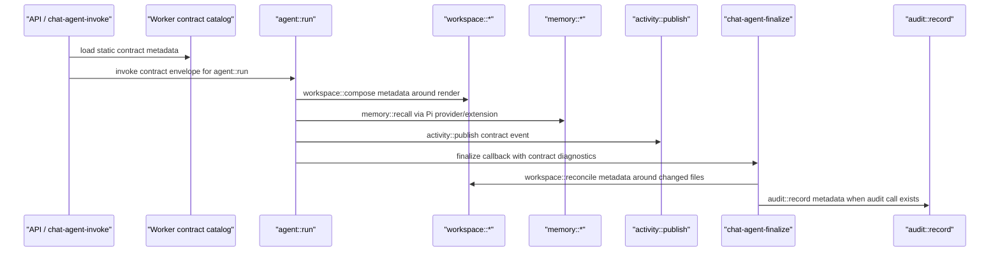

# AWS-Native Worker Contract Tracer Bullet

## Overview

Introduce a thin ThinkWork Worker Contract Layer that adopts iii's Worker /
Function / Trigger vocabulary without adopting iii Engine or building a new
runtime. The first implementation should be a tracer bullet through the existing
AgentCore Pi turn path: `agent::run` wraps the current dispatch, memory calls are
described as `memory::*`, workspace render/finalize is described as
`workspace::*`, and activity/audit events carry contract metadata for
observability.

This is an architecture-language and contract-surfacing change first. It should
not replace AWS substrates, move execution out of AgentCore, or create a generic
runtime registry.

---

## Problem Frame

The origin document identifies too many backend orchestration shapes:
GraphQL resolvers, REST Lambdas, AgentCore callbacks, AppSync activity,
scheduler Lambdas, MCP bridges, memory providers, and compliance drainers. The
goal is to make capabilities legible as workers with callable functions and
triggers while keeping AWS as the machinery.

Planning should preserve the origin's most important guardrail: do **not** build
"iii but worse and AWS-only." The first unit must prove that stable function IDs
and a common invocation envelope improve readability and testing without adding
a new engine.

---

## Requirements Trace

- R1. Adopt Worker / Function / Trigger as ThinkWork's internal architecture
  language.
- R2. Keep the contract layer thin over AWS-native primitives, not a new
  runtime engine.
- R3. Carry a common invocation envelope with tenant/user/Space/thread/trace,
  idempotency, caller, and auth context where applicable.
- R4. Declare each function's behavior shape, timeout/retry expectations,
  permissions, audit level, and version.
- R5. Call cross-worker capabilities by function ID where the capability crosses
  a worker boundary.
- R6. Memory is the first proof worker, with `memory::recall`,
  `memory::remember`, `memory::forget`, `memory::inspect`, and
  `memory::export`.
- R7. Memory contracts must support AgentCore Memory, Hindsight, and future
  agentmemory / iii-backed adapters without changing the Pi caller contract.
- R8. `agent::run` wraps the current AgentCore Pi dispatch path.
- R9. Workspace contracts include `workspace::compose` and
  `workspace::reconcile`.
- R10. Activity or audit is included in the proof to demonstrate feedback and
  observability.
- R11. AWS remains the v1 runtime substrate.
- R12. Do not build custom queue, cron, stream bus, state store, worker
  supervisor, marketplace, or engine console.
- R13. Contract declarations must allow adapter-style implementations later.
- R14. State-changing calls must define idempotency and audit behavior.
- R15. The contract layer must improve contributor legibility.
- R16. Preserve AgentCore-first product clarity.

**Origin actors:** A1 Platform engineer, A2 Pi agent runtime, A3 Operator /
enterprise reviewer, A4 Future deployment maintainer.

**Origin flows:** F1 Agent turn uses worker contracts, F2 Memory provider swap
stays behind one contract, F3 Operator inspects the capability surface.

**Origin acceptance examples:** AE1 memory provider swap, AE2 AgentCore Pi
execution boundary, AE3 workspace/activity/audit finalize contract, AE4 AWS
trigger mapping, AE5 contributor inspection.

---

## Scope Boundaries

- No iii Engine adoption as production control plane.
- No custom worker runtime, live worker bus, generic function registry console,
  queue, cron, stream bus, or state store.
- No replacement of AgentCore as the Pi execution boundary.
- No broad migration of all handlers/resolvers/Lambdas into workers.
- No public worker marketplace or third-party worker installation flow.
- No on-prem/offline implementation; keep contracts portable enough that future
  non-AWS adapters are possible.

### Deferred to Follow-Up Work

- Runtime registry persisted in Aurora: only consider after the static contract
  catalog proves useful.
- Operator UI for workers/functions/triggers: out of the tracer bullet.
- Concrete agentmemory adapter: this plan leaves room for it but does not wire
  an external iii-backed memory worker.
- Contract generation into Terraform: validation hooks may be added, but
  Terraform resource generation is not part of the first slice.

---

## Context & Research

### Relevant Code and Patterns

- `packages/api/src/handlers/chat-agent-invoke.ts` already forms the setup and
  dispatch boundary for user-message turns. It resolves runtime config, renders
  workspace tuples, creates a turn row, emits phase logs, and invokes AgentCore
  Pi.
- `packages/api/src/handlers/chat-agent-finalize.ts` and
  `packages/api/src/lib/chat-finalize/process-finalize.ts` already define the
  authoritative end-of-turn callback and idempotency surface.
- `packages/api/src/handlers/chat-agent-activity.ts` and
  `packages/pi-runtime-core/src/activity-client.ts` already provide best-effort
  live activity with durable replay through `thread_turn_events`.
- `packages/api/src/lib/memory/adapter.ts` and
  `packages/api/src/lib/memory/types.ts` already define normalized memory
  adapter contracts for AgentCore Memory and Hindsight.
- `packages/pi-runtime-core/src/memory-provider.ts` is the host seam the Pi
  extension uses for `recall` and `reflect`.
- `packages/pi-extensions/src/memory.ts` registers the agent-facing memory tools
  and proactive grounding hook.
- `packages/api/src/lib/compliance/emit.ts` provides the existing audit event
  envelope, UUIDv7 idempotency support for cross-runtime callers, and
  compliance source validation.
- `packages/api/src/lib/agentcore-phase-log.ts` and
  `docs/solutions/diagnostics/agentcore-warm-followup-latency-2026-06-02.md`
  establish the pattern of persisting safe runtime diagnostics rather than
  relying only on CloudWatch search.

### Institutional Learnings

- `docs/solutions/architecture-patterns/runtime-swap-tool-parity-and-record-contract.md`
  warns that runtime swaps silently break tool surfaces unless tool availability
  and record shape become explicit contracts.
- `docs/plans/2026-05-22-006-refactor-chat-agent-invoke-direct-callback-finalize-plan.md`
  established the direct finalize callback and one-winner idempotency pattern
  this plan should preserve.
- `docs/solutions/workflow-issues/agentcore-completion-callback-env-shadowing-2026-04-25.md`
  requires long-running agent callbacks to snapshot credentials/context at entry
  rather than re-reading environment later.
- `docs/solutions/best-practices/service-endpoint-vs-widening-resolvecaller-auth-2026-04-21.md`
  argues for narrow service endpoints over widening shared auth helpers; worker
  contracts must preserve that blast-radius discipline.

### External References

- iii Engine and agentmemory remain design references only for this plan. The
  first implementation does not add either as a production dependency.

---

## Key Technical Decisions

- **Static catalog first:** Define contract metadata in a versioned TypeScript
  package or module, not in a runtime database registry. This makes contracts
  reviewable, testable, and importable without creating a new control plane.
- **One safe invocation-record shape:** Persisted metadata should use one small
  contract-invocation record shape instead of ad hoc per-handler fields. The
  record is descriptive evidence, not an execution log that replays work.
- **Contract metadata, not behavior rewrite:** The tracer bullet annotates and
  routes existing seams; it does not move memory, workspace, activity, or audit
  behavior into a new engine.
- **Memory contract bridges existing seams:** API normalized memory adapters and
  Pi `MemoryProvider` should converge through function IDs, but the first pass
  keeps the existing provider behavior.
- **AgentCore remains execution substrate:** `agent::run` describes the
  existing `chat-agent-invoke` -> AgentCore Pi path. It does not introduce iii
  execution or local execution.
- **Observability is part of the contract:** Contract invocation metadata should
  land in safe diagnostics/activity/audit surfaces so operators can inspect
  which worker functions participated in a turn.
- **The catalog is a shared foundation (decided 2026-06-09):**
  `packages/worker-contracts` is consumed by the connected application registry
  plan (`docs/plans/2026-06-08-003-feat-connected-application-registry-plan.md`),
  which extends the base worker/function/trigger types, `domain::name` ID
  grammar, validation helpers, and safe invocation-record shape for managed-app
  capabilities. Keep the shared core small — contract shapes, ID grammar,
  validation, record shape — and do not generalize the internal invocation
  envelope to serve managed-app events; each domain extends its own envelope.
  Validation reserves namespace prefixes (platform domains `agent` / `memory` /
  `workspace` / `activity` / `audit` vs managed-app keys like `twenty` /
  `cognee`) so the two catalogs can never claim the same capability ID.

---

## Open Questions

### Resolved During Planning

- **Where should canonical declarations live initially?** Use a static
  TypeScript catalog/package, not Aurora, so the first slice avoids becoming a
  control plane.
- **Which tracer bullet is narrowest?** Reuse the existing user-message
  AgentCore Pi path because it already crosses agent dispatch, workspace render,
  memory tools, activity, and finalize.
- **Should iii compatibility drive exact metadata shape now?** Keep field names
  iii-inspired but ThinkWork-owned. Compatibility is a design constraint, not a
  production dependency.
- **Package or API-local module?** Resolved 2026-06-09: the
  `packages/worker-contracts` package route is required. The connected
  application registry plan (2026-06-08-003) consumes the base contract types
  as a second consumer, which justifies the standalone package; the API-local
  fallback is withdrawn. This plan's U1 must land before that plan's U1.

### Deferred to Implementation

- Exact event names for contract activity: pick names that fit the existing
  `thread_turn_events` conventions during implementation.
- Whether audit records need new compliance event types for the tracer bullet:
  determine by checking `COMPLIANCE_EVENT_TYPES` and redaction schemas at
  implementation time.

---

## Output Structure

Expected shape if implementation chooses the package route:

```text
packages/worker-contracts/
  package.json
  tsconfig.json
  src/
    index.ts
    envelope.ts
    functions.ts
    invocation-record.ts
    catalog.ts
  test/
    catalog.test.ts
    envelope.test.ts
    invocation-record.test.ts
```

The package route is required (resolved 2026-06-09): the connected application
registry plan (2026-06-08-003) consumes the base contract types as a second
consumer. Keep the package dependency-free — types and validation only — so it
cannot create dependency cycles.

---

## High-Level Technical Design

> _This illustrates the intended approach and is directional guidance for review, not implementation specification. The implementing agent should treat it as context, not code to reproduce._



---

## Implementation Units

- U1. **Define the static worker contract catalog**

**Goal:** Create the minimal contract vocabulary and static catalog for the
tracer bullet: Worker, Function, Trigger, invocation envelope, and behavior
metadata.

**Requirements:** R1, R2, R3, R4, R11, R12, R13, R15.

**Dependencies:** None.

**Files:**

- Create: `packages/worker-contracts/package.json`
- Create: `packages/worker-contracts/tsconfig.json`
- Create: `packages/worker-contracts/src/index.ts`
- Create: `packages/worker-contracts/src/envelope.ts`
- Create: `packages/worker-contracts/src/functions.ts`
- Create: `packages/worker-contracts/src/invocation-record.ts`
- Create: `packages/worker-contracts/src/catalog.ts`
- Test: `packages/worker-contracts/test/catalog.test.ts`
- Test: `packages/worker-contracts/test/envelope.test.ts`
- Test: `packages/worker-contracts/test/invocation-record.test.ts`

**Approach:**

- Define a small set of structural types: worker manifest, function contract,
  trigger contract, invocation envelope, invocation outcome, and audit/timeout
  metadata.
- Define one persisted invocation-record shape with only safe fields:
  function ID, worker ID, implementation, trigger source, status, duration,
  trace ID, idempotency key reference, and small status/detail strings. It must
  explicitly exclude raw payloads, secrets, file content, and bearer material.
- Seed the static catalog with the first functions:
  `agent::run`, `workspace::compose`, `workspace::reconcile`,
  `memory::recall`, `memory::remember`, `memory::forget`,
  `memory::inspect`, `memory::export`, `activity::publish`, and
  `audit::record`.
- Keep the catalog declarative. It should not know how to call Lambda,
  AgentCore, SQS, or AppSync.
- Include validation helpers that catch duplicate function IDs, missing worker
  owners, unsupported modes, and state-changing functions without idempotency or
  audit metadata. Support namespace-prefix reservation so downstream catalogs
  (managed-app capabilities from plan 2026-06-08-003 use app keys like `twenty`
  and `cognee`) register non-colliding ID prefixes alongside the platform
  domains (`agent`, `memory`, `workspace`, `activity`, `audit`).
- Avoid runtime discovery, database storage, or network calls in this unit.

**Patterns to follow:**

- `packages/api/src/lib/memory/types.ts` for normalized contract-shaped data.
- `packages/api/src/lib/compliance/emit.ts` for envelope discipline and
  state-changing audit/idempotency expectations.
- `packages/pi-runtime-core/src/types.ts` for small shared runtime types.

**Test scenarios:**

- Happy path: the seed catalog validates with no duplicate function IDs.
- Edge case: duplicate function ID fails validation with a useful message.
- Edge case: a state-changing function without idempotency metadata fails
  validation.
- Edge case: a function with unsupported mode fails validation.
- Happy path: an invocation envelope with tenant/thread/trace/caller fields
  normalizes without dropping fields.
- Happy path: a contract invocation record strips or rejects unsafe payload
  fields and keeps only bounded metadata.
- Error path: an envelope missing tenant scope for a tenant-scoped function is
  rejected by validation helper.

**Verification:**

- The package builds and exports only static contract helpers.
- Tests prove the catalog cannot silently drift into malformed function
  declarations.

---

- U2. **Surface memory as worker contracts without changing memory behavior**

**Goal:** Connect the existing normalized API memory layer and Pi memory provider
to the `memory::*` function IDs, preserving current AgentCore/Hindsight behavior
while making memory the first proof worker.

**Requirements:** R3, R5, R6, R7, R13, R14, R15. Covers AE1 and F2.

**Dependencies:** U1.

**Files:**

- Modify: `packages/api/src/lib/memory/types.ts`
- Modify: `packages/api/src/lib/memory/adapter.ts`
- Modify: `packages/api/src/lib/memory/recall-service.ts`
- Modify: `packages/pi-runtime-core/src/memory-provider.ts`
- Modify: `packages/pi-extensions/src/memory.ts`
- Test: `packages/api/src/lib/memory/recall-service.test.ts`
- Test: `packages/pi-runtime-core/test/memory-provider.test.ts`
- Test: `packages/pi-extensions/test/memory.test.ts`

**Approach:**

- Import the contract catalog where dependency direction allows and annotate
  memory requests/results with contract metadata such as function ID, worker ID,
  trace ID, and backend implementation when available.
- Keep existing method names (`recall`, `retain`, `inspect`, `export`,
  `forget`) and behavior intact. The change is contract surfacing, not a memory
  rewrite.
- Ensure Pi's `MemoryProvider.recall` and `reflect` can report that the
  underlying call represented `memory::recall` and memory synthesis without
  forcing the agent-facing tool names to change.
- Preserve requester-scope validation in `createRecallService`; do not weaken
  tenant/user guardrails to fit the new envelope.
- Leave agentmemory/iii as a future adapter candidate. Do not add a dependency
  or runtime call in this unit.

**Patterns to follow:**

- `packages/api/src/lib/memory/adapter.ts` for backend-independent memory
  behavior.
- `packages/pi-extensions/src/memory.ts` for the recall/reflect chain and
  proactive grounding behavior.
- `docs/solutions/architecture-patterns/runtime-swap-tool-parity-and-record-contract.md`
  for the rule that runtime-visible surfaces need explicit record contracts.

**Test scenarios:**

- Covers AE1. Happy path: API recall returns normalized results with
  `memory::recall` contract metadata while preserving existing result ordering
  and token-budget trimming.
- Covers AE1. Happy path: Pi memory extension still registers `recall` and
  `reflect`; calling `recall` routes through the provider and exposes
  `memory::recall` metadata in details or diagnostics.
- Edge case: requester user mismatch still throws and is not bypassed by
  contract-envelope metadata.
- Error path: missing host memory provider still fails loudly when loading the
  memory extension.
- Integration: a fake memory adapter can declare backend `"agentmemory"` or
  another string and still satisfy the normalized memory contract.

**Verification:**

- Existing AgentCore/Hindsight memory tests continue to pass.
- No external iii or agentmemory package is added.
- Implementers can inspect code and identify the memory worker/function IDs used
  by API and Pi memory seams.

---

- U3. **Wrap AgentCore Pi dispatch as `agent::run`**

**Goal:** Make `chat-agent-invoke` treat AgentCore Pi dispatch as the
`agent::run` function contract, carrying the common envelope into diagnostics
and payload metadata without changing the execution boundary.

**Requirements:** R1, R3, R5, R8, R11, R16. Covers AE2 and F1.

**Dependencies:** U1.

**Files:**

- Modify: `packages/api/src/handlers/chat-agent-invoke.ts`
- Modify: `packages/api/src/handlers/chat-agent-invoke.runtime-routing.test.ts`
- Modify: `packages/api/src/lib/agentcore-phase-log.ts`
- Test: `packages/api/src/lib/agentcore-phase-log.test.ts`

**Approach:**

- Build a worker invocation envelope around the existing turn context at the
  point `chat-agent-invoke` creates the `thread_turns` row and dispatches the
  AgentCore Pi Lambda.
- Add safe contract metadata to `thread_turns.context_snapshot` and/or existing
  runtime diagnostics: function ID `agent::run`, worker `agent`, trace ID,
  tenant/thread/agent IDs, runtime implementation `agentcore-pi`, and trigger
  source for manual chat.
- Use the invocation-record helper from U1 rather than constructing persisted
  metadata inline inside the handler.
- Preserve existing workspace render, pre-dispatch error handling, runtime
  routing, and Event-mode dispatch behavior.
- Update phase logs to include optional contract fields so operators can connect
  API dispatch and runtime phases to a function ID.
- Do not change `resolveRuntimeFunctionName`, Lambda target selection, or
  AgentCore payload semantics beyond safe metadata.

**Patterns to follow:**

- Existing `logAgentCorePhase` usage in `chat-agent-invoke.ts` and
  `chat-agent-finalize.ts`.
- `docs/solutions/diagnostics/agentcore-warm-followup-latency-2026-06-02.md`
  for persisting safe diagnostics alongside CloudWatch.
- `docs/brainstorms/2026-06-01-agentcore-first-pi-execution-requirements.md`
  for the non-negotiable AgentCore execution boundary.

**Test scenarios:**

- Covers AE2. Happy path: Pi runtime dispatch still targets
  `AGENTCORE_PI_FUNCTION_NAME`, but the inserted turn context includes
  `agent::run` contract metadata.
- Covers AE2. Happy path: InvokeCommand remains Event-mode and no local/iii
  runtime target is introduced.
- Error path: pre-dispatch agent-not-found behavior remains unchanged and does
  not emit a false completed contract invocation.
- Edge case: workspace rendering skipped because renderer is unconfigured still
  dispatches with `agent::run` metadata and records the render skip reason.
- Integration: phase log helper accepts and serializes optional function/worker
  metadata without breaking existing phase log callers.

**Verification:**

- Runtime routing tests pass with updated assertions.
- A developer can inspect a turn row or phase log and identify `agent::run` as
  the contract that initiated the managed Pi turn.

---

- U4. **Annotate workspace, activity, and finalize feedback contracts**

**Goal:** Prove the interconnected worker concept by adding contract metadata to
workspace render/reconcile and activity/finalize paths, using existing AWS
surfaces.

**Requirements:** R3, R4, R9, R10, R11, R14, R15. Covers AE3, AE4, AE5 and F3.

**Dependencies:** U1, U3.

**Files:**

- Modify: `packages/api/src/handlers/chat-agent-invoke.ts`
- Modify: `packages/api/src/handlers/chat-agent-activity.ts`
- Modify: `packages/api/src/handlers/chat-agent-activity.test.ts`
- Modify: `packages/api/src/handlers/chat-agent-finalize.ts`
- Modify: `packages/api/src/handlers/chat-agent-finalize.test.ts`
- Modify: `packages/api/src/lib/chat-finalize/process-finalize.ts`
- Modify: `packages/api/src/lib/chat-finalize/process-finalize.test.ts`
- Modify: `packages/api/src/lib/chat-finalize/reconcile.ts`
- Modify: `packages/api/src/lib/chat-finalize/reconcile.test.ts`
- Modify: `packages/api/src/lib/thread-turn-events.ts`
- Test: `packages/api/src/lib/thread-turn-events.test.ts`

**Approach:**

- Treat `renderWorkspaceTupleForInvoke` as the current implementation of
  `workspace::compose`; record contract metadata alongside existing render
  result fields (`rendered`, `renderedPrefix`, `cacheStatus`, skip/failure
  reason).
- Treat `reconcileChangedFiles` inside finalize as the current implementation of
  `workspace::reconcile`; add function ID and idempotency context to the
  `workspace_reconcile` status written into `thread_turns.context_snapshot`.
- Treat the activity endpoint as `activity::publish`; include function metadata
  in accepted events while preserving current validation, append ordering, and
  best-effort AppSync publish semantics.
- Use the shared invocation-record helper for all persisted metadata so
  workspace, activity, and finalize produce the same safe shape.
- Add contract metadata to finalize diagnostics for `audit::record` only where
  an audit event is actually emitted. Do not invent audit records for every turn
  unless compliance event types already support it.
- Keep all metadata bounded and safe to persist: no secrets, full file content,
  bearer tokens, or unredacted payloads.

**Patterns to follow:**

- `packages/api/src/lib/chat-finalize/process-finalize.ts` for current
  reconcile idempotency and finalization ordering.
- `packages/api/src/handlers/chat-agent-activity.ts` for durable append plus
  best-effort publish.
- `packages/api/src/lib/compliance/emit.ts` for state-changing audit and
  cross-runtime UUIDv7 idempotency semantics.
- `docs/solutions/workflow-issues/agentcore-completion-callback-env-shadowing-2026-04-25.md`
  for snapshotting callback context.

**Test scenarios:**

- Covers AE3. Happy path: a completed finalize with changed files records
  `workspace::reconcile` metadata in the workspace reconcile status and keeps
  existing reconcile report behavior.
- Covers AE3. Error path: reconcile failure records failed contract metadata and
  still leaves `finalized_at` unset so callback retry can re-enter.
- Covers AE3. Happy path: activity endpoint accepts an event with
  `activity::publish` metadata, appends it, and still publishes best-effort.
- Covers AE4. Edge case: scheduled or background trigger metadata, when present,
  is represented as trigger metadata rather than a new cron engine.
- Covers AE5. Integration: a finalized turn with workspace changes and activity
  events has enough metadata for an operator to identify `agent::run`,
  `workspace::compose`, `workspace::reconcile`, and `activity::publish`.
- Error path: oversized activity payload handling remains failure-isolated and
  does not fail the turn.

**Verification:**

- Existing finalize, reconcile, and activity tests pass with contract metadata
  assertions.
- No new queue/cron/stream/state runtime exists; all behavior still uses current
  AWS-backed handlers and tables.

---

- U5. **Document the worker contract rules and guard against engine creep**

**Goal:** Make the new architecture language discoverable and preserve the
guardrails that prevent the contract layer from becoming a homemade engine.

**Requirements:** R1, R2, R11, R12, R13, R15, R16. Covers AE5.

**Dependencies:** U1, U2, U3, U4.

**Files:**

- Create: `docs/src/content/docs/concepts/worker-contracts.mdx`
- Modify: `docs/src/content/docs/architecture.mdx`
- Modify: `docs/src/content/docs/concepts/agents/runtime-selection.mdx`
- Create: `docs/solutions/architecture-patterns/aws-native-worker-contract-layer.md`

**Approach:**

- Add user/developer-facing docs explaining Worker / Function / Trigger in
  ThinkWork terms.
- Explicitly document what the worker contract layer is **not**: no runtime bus,
  no custom queue, no custom cron, no marketplace, no engine console, no
  replacement for AgentCore.
- Include the first catalog functions and their AWS-backed implementations.
- Link back to the requirements and plan so future work understands this was a
  tracer bullet, not a mandate to convert every handler.
- Capture the pattern under `docs/solutions/architecture-patterns/` after
  implementation so future contributors can reuse it.

**Patterns to follow:**

- `docs/src/content/docs/architecture.mdx` for high-level system language.
- `docs/src/content/docs/concepts/agents/runtime-selection.mdx` for AgentCore
  execution posture.
- Existing solution docs under `docs/solutions/architecture-patterns/` for
  concise institutional pattern capture.

**Test scenarios:**

- Test expectation: none -- docs-only behavior. The docs build/format check is
  sufficient unless implementation adds executable examples.

**Verification:**

- Docs explain how to inspect the first worker contracts and preserve
  AgentCore-first clarity.
- Documentation uses repo-relative links and does not imply iii Engine is a
  production dependency.

---

## System-Wide Impact

- **Interaction graph:** User-message turns touch API dispatch, workspace render,
  AgentCore Pi runtime, memory extension/provider, activity endpoint, finalize,
  reconcile, and optional compliance audit. The plan annotates those surfaces
  without moving ownership.
- **Error propagation:** Existing behavior remains authoritative: pre-dispatch
  errors stay in `chat-agent-invoke`, live activity is best-effort, finalize
  remains idempotent, and reconcile failures keep retry semantics.
- **State lifecycle risks:** Contract metadata must stay small, redacted, and
  safe for `thread_turns.context_snapshot`, `usage_json.diagnostics`, and
  `thread_turn_events.payload`.
- **API surface parity:** No GraphQL, REST, CLI, or mobile API behavior changes
  are required in the first slice.
- **Integration coverage:** Unit tests should prove metadata appears at each
  seam; dev E2E should verify one real turn carries enough metadata to inspect
  the worker flow.
- **Unchanged invariants:** AgentCore is still the Pi execution boundary;
  Aurora/S3 remain durable state; AppSync/thread-turn events remain the
  streaming/replay surface; compliance audit retains its existing redaction and
  outbox semantics.

---

## Plan Review Notes

- **Confidence:** High that the tracer bullet is implementable because the repo
  already has the needed seams: memory adapters, Pi memory provider, direct
  AgentCore dispatch, activity events, finalize/reconcile, and compliance audit
  helpers.
- **Main implementation uncertainty:** resolved 2026-06-09 — package placement
  is fixed to `packages/worker-contracts` because the connected application
  registry plan consumes the base types. The package must stay dependency-free
  (types and validation only) so it cannot create dependency-graph friction.
- **Primary product risk:** Worker vocabulary could make ThinkWork sound like
  it has a new runtime fabric. Docs and persisted metadata must consistently say
  AWS/AgentCore remain the execution substrate.
- **Primary security risk:** Contract metadata can become payload logging if the
  invocation-record helper is too permissive. U1 must land the redaction/safety
  boundary before later units persist metadata in turn/activity/finalize records.

---

## Risks & Dependencies

| Risk                                                    | Mitigation                                                                                                                                                                                              |
| ------------------------------------------------------- | ------------------------------------------------------------------------------------------------------------------------------------------------------------------------------------------------------- |
| The static catalog grows into an engine                 | Keep U1 declarative only; no network calls, runtime discovery, queue, cron, state store, or DB registry.                                                                                                |
| Metadata leaks sensitive data                           | Restrict persisted contract metadata to IDs, modes, implementation names, durations, and status; never persist full payloads, secrets, file contents, or bearer tokens.                                 |
| Contract layer duplicates existing memory abstractions  | Build on `packages/api/src/lib/memory/*` and `packages/pi-runtime-core/src/memory-provider.ts` rather than inventing new memory behavior.                                                               |
| AgentCore-first clarity gets blurred                    | `agent::run` must explicitly identify `agentcore-pi` as the v1 implementation and must not add local/iii execution targets.                                                                             |
| Tests only prove catalog shape, not interconnected flow | U4 requires integration-style assertions across dispatch, workspace, activity, and finalize metadata.                                                                                                   |
| Package dependency graph becomes awkward                | Keep `packages/worker-contracts` dependency-free (types and validation only) so it cannot participate in cycles; the API-local fallback is withdrawn now that plan 2026-06-08-003 consumes the package. |
| Shared helpers become hidden control flow               | Limit shared helpers to validation and safe metadata shaping; execution must remain in the existing AWS-backed handlers, providers, and callbacks.                                                      |

---

## Documentation / Operational Notes

- Update architecture docs only after the code path exists; otherwise docs will
  overpromise a worker fabric that is not yet inspectable.
- Dev verification should capture one real AgentCore Pi turn and inspect its
  turn row/activity/finalize diagnostics for worker function metadata.
- Operator language should stay simple: ThinkWork uses AWS-managed AgentCore for
  execution and a ThinkWork worker contract layer to describe surrounding
  capabilities.

---

## Alternative Approaches Considered

- **Adopt iii Engine directly:** Deferred because it would introduce a new
  production control plane, license review, and operational surface before
  proving the pattern helps ThinkWork.
- **Build an AWS-native engine with live registry and console:** Rejected for
  this phase because it is the exact "iii but worse and AWS-only" failure mode
  the origin document warns against.
- **Memory-only abstraction:** Rejected as insufficient proof. Memory is the
  right first worker, but the tracer bullet must include agent, workspace, and
  feedback surfaces to prove interconnected worker semantics.
- **Database-backed registry first:** Deferred. A static catalog is easier to
  review and validate, and avoids creating a new control plane prematurely.

---

## Sources & References

- **Origin document:** `docs/brainstorms/2026-06-06-aws-native-worker-contract-layer-requirements.md`
- `docs/brainstorms/2026-06-01-agentcore-first-pi-execution-requirements.md`
- `docs/brainstorms/2026-05-29-pi-extensions-architecture-requirements.md`
- `docs/brainstorms/2026-05-31-workspace-architecture-simplification-requirements.md`
- `docs/solutions/architecture-patterns/runtime-swap-tool-parity-and-record-contract.md`
- `docs/solutions/workflow-issues/agentcore-completion-callback-env-shadowing-2026-04-25.md`
- `docs/solutions/best-practices/service-endpoint-vs-widening-resolvecaller-auth-2026-04-21.md`
- `docs/solutions/diagnostics/agentcore-warm-followup-latency-2026-06-02.md`
- `packages/api/src/handlers/chat-agent-invoke.ts`
- `packages/api/src/handlers/chat-agent-finalize.ts`
- `packages/api/src/handlers/chat-agent-activity.ts`
- `packages/api/src/lib/memory/adapter.ts`
- `packages/pi-runtime-core/src/memory-provider.ts`
- `packages/pi-extensions/src/memory.ts`
