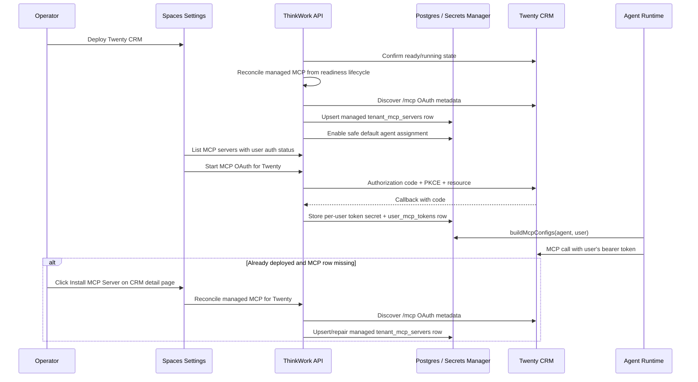

# feat: Add Twenty CRM MCP OAuth

## Overview

Add a managed Twenty CRM MCP connector that is created automatically from the
Twenty managed-application deployment state, made visible in MCP settings, and
authenticated per user from desktop/web Spaces. The implementation should reuse
ThinkWork's existing tenant MCP registry and `user_mcp_tokens` storage rather
than creating a parallel connector model.

Two outcomes define the release: when Twenty CRM reaches ready/running state it
must automatically appear in Settings -> MCP Servers as **Twenty CRM**, and an
end user must be able to configure their own access from desktop/web Spaces so
the resulting OAuth credential is stored in the ThinkWork vault and injected
automatically when ThinkWork invokes the Twenty MCP server.

For already-deployed stages or failed reconciliation, the CRM settings/detail
page also needs an operator-only **Install MCP Server** recovery action. That
button should call the same idempotent managed MCP reconciliation path used by
deployment readiness; it is not a separate generic MCP add flow.

---

## Problem Frame

Twenty CRM can now be deployed at a ThinkWork-managed URL, but agents still need
an MCP registration and a per-user OAuth token before they can safely use CRM
tools. Operators should not paste the MCP URL manually, and users should not
copy tokens. When Twenty is running, ThinkWork should reconcile the MCP server
into the existing tenant registry, let users connect from the desktop-first MCP
settings surface, and ensure agent calls use the current user's Twenty
authorization. This follows the origin decisions around system-managed
registration, per-user OAuth, and the split between Managed Applications and MCP
Servers (see origin: `docs/brainstorms/2026-06-06-twenty-crm-mcp-desktop-oauth-requirements.md`).

---

## Requirements Trace

- R1. Auto-register a tenant-wide **Twenty CRM** MCP server when Twenty is
  running.
- R2. Use the deployed Twenty public URL with the MCP path as the connection
  target.
- R2a. Run auto-registration from the managed-app deploy/redeploy readiness
  lifecycle, not from a best-effort Settings page refresh.
- R2b. Add a CRM settings/detail-page **Install MCP Server** recovery action for
  already-deployed CRM stages where the managed Twenty MCP registration is
  missing or unhealthy.
- R3. Mark the row as ThinkWork-managed/system-owned.
- R4. Make registration idempotent across status refreshes and redeploys.
- R5. Update the managed MCP registration if the Twenty URL changes.
- R6. Remove parked Twenty from active agent runtime configuration and running
  UI states.
- R7. Preserve reconnect continuity across park and redeploy.
- R8. Remove managed MCP registration and stored token material during full
  destructive cleanup.
- R9. Support OAuth-protected MCP connection from desktop/web Spaces.
- R10. Support desktop and browser OAuth completion without the mobile-only deep
  link.
- R11. Persist and display connected/expired/not-connected user auth status
  across refresh.
- R11a. Store the user's OAuth credential server-side in the ThinkWork vault via
  the existing per-user MCP token pattern, not in durable browser/desktop state.
- R12. Let users clear or reconnect their own MCP authentication.
- R13. Surface OAuth failures clearly.
- R14. Use the current user's stored OAuth token for Twenty MCP agent calls.
- R14a. Automatically inject the stored user credential when invoking Twenty
  MCP, matching the existing LastMile MCP server behavior.
- R14b. Required end-to-end verification must use a ThinkWork agent to fetch a
  list of Twenty opportunities assigned to the authenticated user.
- R15. Do not fall back to a tenant-wide credential when a user token is
  missing.
- R16. Keep token refresh and expiry handling server-side.
- R17. Keep Settings -> General as the runtime lifecycle surface.
- R18. Keep MCP Servers as the connection/authentication surface.
- R19. Do not add a separate Configure button to Managed Applications.
- R20. Keep **Install MCP Server** on the CRM settings/detail page only, visible
  when the managed MCP registration needs repair.

**Origin actors:** A1 ThinkWork operator, A2 ThinkWork end user, A3 ThinkWork
agent runtime, A4 ThinkWork platform, A5 Twenty CRM MCP server

**Origin flows:** F1 auto-register Twenty MCP when CRM is running, F1a recover
missing Twenty MCP registration from CRM settings, F2 remove Twenty MCP from
active use when CRM is parked or destroyed, F3 user authenticates Twenty MCP
from desktop, F4 agent uses Twenty MCP with the user's credentials

**Origin acceptance examples:** AE1 auto-registration, AE1a recovery install,
AE2 park/redeploy continuity, AE3 destructive cleanup, AE4 desktop OAuth success
state, AE5 no credential fallback, AE6 agent fetches assigned Twenty
opportunities

---

## Scope Boundaries

- No custom CRM UI beyond managed-app access and MCP connection/authentication
  surfaces.
- No tenant-wide API key fallback for Twenty MCP user actions.
- No ThinkWork SSO into Twenty CRM in this release; users authenticate against
  Twenty's MCP authorization server.
- No generic rewrite of all MCP management. Add the reusable pieces needed for
  OAuth-protected MCP servers without replacing the existing registry.
- No mobile regression. The existing mobile MCP OAuth path must keep working.
- No manual production mutation outside the normal deploy pipeline.

### Deferred to Follow-Up Work

- Fine-grained per-Space CRM MCP policy and tool allowlists beyond the existing
  MCP assignment model.
- ThinkWork/Cognito SSO into the Twenty web app.
- Rich CRM-native ThinkWork UI or CRM-specific agent UX.

---

## Context & Research

### Relevant Code and Patterns

- `packages/database-pg/src/schema/mcp-servers.ts` defines
  `tenant_mcp_servers`, `agent_mcp_servers`, `space_mcp_servers`, and
  `user_mcp_tokens`. This is the correct persistence surface for outbound MCP.
- `packages/api/src/handlers/skills.ts` owns tenant MCP CRUD, user MCP server
  listing, token clearing, and the current mobile-first `/api/skills/mcp-oauth`
  proxy.
- `packages/api/src/lib/mcp-configs.ts` already skips OAuth MCP servers when
  the current user has no active token and refreshes tokens from Secrets
  Manager when possible.
- `apps/mobile/app/settings/mcp-server-detail.tsx` and
  `apps/mobile/components/credentials/McpServersSection.tsx` are the behavioral
  reference for connect, reconnect, clear-auth, and auth status display.
- `apps/spaces/src/components/settings/SettingsMcpServers.tsx`,
  `apps/spaces/src/components/settings/SettingsMcpServerDetail.tsx`, and
  `apps/spaces/src/lib/mcp-api.ts` currently expose list/enable/remove but do
  not expose OAuth connect.
- `packages/database-pg/graphql/types/core.graphql` is the canonical GraphQL
  schema surface for `deploymentStatus`; generated consumers must be refreshed
  after schema changes.
- `packages/api/src/graphql/resolvers/core/managedApplications.ts`,
  `deploymentStatus.query.ts`, and
  `setManagedApplicationDeployment.mutation.ts` are the managed-app status and
  lifecycle control surfaces.
- `apps/spaces/src/components/settings/ManagedApplicationsSection.tsx` and
  `SettingsCrm.tsx` are the UI surfaces that should remain runtime-focused.

### Institutional Learnings

- `docs/solutions/best-practices/oauth-client-credentials-in-secrets-manager-2026-04-21.md`
  explicitly says per-user MCP tokens should use the existing
  `mcp-configs.ts`/Secrets Manager pattern, not shared OAuth client-credential
  storage.
- `docs/solutions/best-practices/every-admin-mutation-requires-requiretenantadmin-2026-04-22.md`
  requires tenant-pinned auth before side effects. New MCP lifecycle mutations
  and destructive cleanup paths must gate before DB or Secrets Manager writes.

### External References

- MCP authorization spec:
  `https://modelcontextprotocol.io/specification/2025-06-18/basic/authorization`
- Twenty OAuth docs:
  `https://docs.twenty.com/developers/extend/oauth`

---

## Key Technical Decisions

- **Use the tenant MCP registry.** The Twenty MCP connector is a row in
  `tenant_mcp_servers`, not a hidden managed-app-only config. This preserves the
  existing runtime path and operator observability.
- **Provide a CRM detail-page repair action.** Automatic registration is still
  the contract, but already-deployed stages need an operator recovery path. The
  CRM settings/detail page should show **Install MCP Server** only when Twenty
  is deployed/ready and the managed MCP row is missing or failed.
- **Use `oauth` as the canonical auth type.** Existing compatibility with
  `per_user_oauth` can remain for older rows and CLI inputs, but new managed
  Twenty rows should use `auth_type="oauth"` and UI checks should normalize both
  values.
- **Add explicit managed ownership fields.** Use first-class columns such as
  `management_source` and `managed_application_key` rather than burying
  ownership in `auth_config`, so delete/update rules and UI affordances are
  easy to enforce.
- **Preserve parked connector continuity.** Parking should disable the managed
  server and runtime assignments but keep the managed row and user token records
  unless the token becomes invalid. Full destroy removes the row and token
  secrets.
- **Use a web return-channel for desktop/web MCP OAuth.** Extend the existing
  MCP OAuth proxy with a validated return mode that can post a completion
  result back to the opener and/or redirect to a Spaces settings URL. Keep the
  mobile deep link as the default for existing mobile callers.
- **Include MCP `resource` in OAuth requests.** The MCP authorization spec
  requires the target resource in authorization and token requests. Planning
  treats this as a release requirement for Twenty MCP rather than a later
  cleanup.
- **Do not bypass user auth in runtime.** Existing runtime behavior that skips
  OAuth servers without an active user token is correct; this plan strengthens
  the UI state around that behavior rather than adding a fallback credential.
  When a token exists, runtime assembly should inject it automatically so the
  user experience matches existing LastMile MCP servers.
- **Use an agent-level E2E proof.** `initialize`/`tools/list` is useful for
  diagnostics, but release verification must prove a ThinkWork agent can fetch
  opportunities assigned to the authenticated user through Twenty MCP.

---

## Open Questions

### Resolved During Planning

- **How should managed MCP rows be marked?** Add explicit ownership columns on
  `tenant_mcp_servers` instead of overloading `auth_config`.
- **Should parked CRM keep or delete the MCP row?** Keep an internal disabled
  managed row for reconnect continuity; delete it only during full destructive
  cleanup.
- **How should desktop/web OAuth complete?** Use an API-managed browser return
  channel with validated return targets; keep mobile deep link behavior intact.
- **Should the MCP `resource` parameter be required?** Yes. Include it in the
  Twenty MCP auth path and token refresh path.
- **Which servers should desktop show?** Show tenant-available MCP servers with
  current-user auth status in MCP Servers. Distinguish connection status from
  agent runtime assignment in copy and row state.
- **Where does manual recovery live?** On the CRM settings/detail page as
  **Install MCP Server**, not on the Managed Applications row and not in the
  generic manual MCP add form.

### Deferred to Implementation

- **Exact Twenty MCP verification tool:** Discover the authenticated tool list
  after OAuth and choose the Twenty read path that lists opportunities assigned
  to the authenticated user. Authenticated MCP `initialize`/`tools/list` may be
  used as a diagnostic preflight, but it is not sufficient as release
  verification.
- **Exact migration number:** Use the next available Drizzle migration number
  from the implementation branch.

---

## High-Level Technical Design

> _This illustrates the intended approach and is directional guidance for review, not implementation specification. The implementing agent should treat it as context, not code to reproduce._

---

## Implementation Units

- U1. **Add managed MCP ownership schema**

**Goal:** Represent system-managed MCP rows explicitly so Twenty's connector can
be protected, reconciled, parked, and destroyed without confusing it with
manually registered third-party servers.

**Requirements:** R3, R4, R5, R6, R7, R8, R18, F1, F2, AE1, AE2, AE3

**Dependencies:** None

**Files:**

- Modify: `packages/database-pg/src/schema/mcp-servers.ts`
- Create: `packages/database-pg/drizzle/<next>_managed_mcp_servers.sql`
- Test: `packages/api/src/__tests__/managed-mcp-lifecycle.test.ts`

**Approach:**

- Add nullable ownership fields to `tenant_mcp_servers`, such as
  `management_source` with default `manual` and `managed_application_key` for
  rows owned by managed apps.
- Add a uniqueness guard so a tenant can have only one managed row per managed
  application key.
- Keep manual MCP server behavior unchanged by defaulting existing rows to
  manual ownership.
- Model park as `enabled=false` plus retained ownership fields, not row
  deletion.
- Model full destroy as row deletion plus cleanup of related assignments and
  user tokens in later units.

**Patterns to follow:**

- `packages/database-pg/src/schema/mcp-servers.ts` for MCP table definitions.
- Existing Drizzle migration files under `packages/database-pg/drizzle/`.

**Test scenarios:**

- Happy path: inserting a manual MCP server without ownership fields still
  behaves as a manual approved server.
- Happy path: inserting a managed Twenty row records `managed_application_key`
  and can be queried distinctly from manual rows.
- Edge case: attempting two managed Twenty rows for the same tenant violates the
  uniqueness guard.
- Integration: generated schema exports expose the new fields for API helpers.

**Verification:**

- The database schema can distinguish manual and managed MCP servers without
  changing existing manual rows.

---

- U2. **Reconcile Twenty managed app state into MCP registry**

**Goal:** Create, update, disable, and delete the Twenty MCP registry row based
on managed-application state and URL, without requiring a user to paste the MCP
URL.

**Requirements:** R1, R2, R2b, R3, R4, R5, R6, R7, R8, R17, R18, R20, F1, F1a,
F2, AE1, AE1a, AE2, AE3

**Dependencies:** U1

**Files:**

- Create: `packages/api/src/lib/managed-mcp-applications.ts`
- Modify: `packages/database-pg/graphql/types/core.graphql`
- Modify: `packages/api/src/graphql/resolvers/core/managedApplications.ts`
- Modify: `packages/api/src/graphql/resolvers/core/deploymentStatus.query.ts`
  for read-only status fields only
- Modify: `packages/api/src/graphql/resolvers/core/setManagedApplicationDeployment.mutation.ts`
- Modify: `packages/api/src/handlers/skills.ts`
- Modify: `apps/spaces/src/components/settings/SettingsCrm.tsx`
- Generate: GraphQL codegen outputs for affected consumers
- Test: `packages/api/src/graphql/resolvers/core/managedApplications.test.ts`
- Test: `packages/api/src/__tests__/managed-mcp-lifecycle.test.ts`
- Test: `apps/spaces/src/components/settings/SettingsCrm.test.tsx`

**Approach:**

- Add a shared reconciliation helper that accepts the normalized Twenty managed
  app status and tenant id, then applies the MCP state transition.
- Invoke reconciliation from the managed-app deployment lifecycle after deploy
  or redeploy confirms Twenty is ready/running, and from park/destroy lifecycle
  paths after those actions are queued or completed. `deploymentStatus` may
  report managed MCP fields but must not create/update/delete rows as a read
  side effect.
- Add an operator-only GraphQL mutation or existing managed-app action variant
  that explicitly runs the Twenty MCP reconciliation for an already-deployed CRM
  stage. The CRM detail page uses this for **Install MCP Server** recovery.
- For `running` with URL: discover `/.well-known/oauth-protected-resource/mcp`,
  upsert the `twenty-crm` managed MCP row with `auth_type="oauth"`,
  `transport="streamable-http"`, `status="approved"`, and a matching URL hash.
- Normalize older `per_user_oauth` values at API boundaries, but write new
  managed Twenty rows with canonical `auth_type="oauth"`.
- For `parked`: set the managed row `enabled=false` and disable its default
  runtime assignment while preserving user token rows and secrets.
- For `disabled` after destructive cleanup: delete the managed row, associated
  assignments, user token rows, and Secrets Manager token secrets.
- Treat URL changes as system-managed updates that recompute the approval hash
  without forcing manual re-approval.

**Patterns to follow:**

- `packages/api/src/graphql/resolvers/core/setManagedApplicationDeployment.mutation.ts`
  for platform-operator lifecycle mutation gating.
- `packages/api/src/lib/mcp-server-hash.ts` and
  `packages/api/src/lib/mcp-server-update.ts` for approval hash invariants.
- `packages/api/src/handlers/skills.ts` for MCP cascade delete behavior.

**Test scenarios:**

- Covers AE1. Happy path: running Twenty at `https://crm.example.com` creates
  exactly one managed MCP row with URL `https://crm.example.com/mcp`.
- Covers AE1. UI path: after readiness reconciliation, Settings -> MCP Servers
  lists **Twenty CRM** without an operator manually entering a URL.
- Covers AE1a. Recovery path: with Twenty ready and no managed MCP row, clicking
  **Install MCP Server** on the CRM detail page runs reconciliation and creates
  exactly one managed Twenty MCP row.
- Covers AE1a. Visibility: **Install MCP Server** is hidden or disabled when the
  managed Twenty MCP row is already healthy.
- Covers AE1. Edge case: calling reconciliation repeatedly with unchanged
  status does not create duplicates or flip manual rows.
- Covers AE1. Edge case: running Twenty with a changed URL updates the managed
  row and keeps it approved with a current hash.
- Covers AE2. Happy path: parking Twenty disables the managed MCP row and
  runtime assignment while retaining `user_mcp_tokens`.
- Covers AE3. Happy path: destructive cleanup deletes the managed row,
  assignments, user token rows, and token secrets.
- Error path: discovery failure leaves the row disabled or absent and returns a
  clear error for the UI/deploy caller.
- Security: a member cannot invoke the operator/service reconciliation path for
  another tenant.
- Security: a member cannot invoke the CRM detail-page recovery action.

**Verification:**

- Twenty running status results in an idempotent system-owned MCP registration.
- Already-deployed CRM can repair a missing MCP registration from the CRM detail
  page.
- Park and destroy transitions produce the data-retention behavior specified in
  the origin doc.

---

- U3. **Generalize MCP OAuth for desktop/web and spec resource handling**

**Goal:** Extend the existing MCP OAuth proxy so desktop/web Spaces can complete
OAuth and Twenty receives spec-aligned authorization and token requests.

**Requirements:** R9, R10, R11, R13, R14, R16, F3, F4, AE4, AE5

**Dependencies:** U1, U2

**Files:**

- Modify: `packages/api/src/handlers/skills.ts`
- Modify: `packages/api/src/lib/mcp-configs.ts`
- Modify: `packages/database-pg/graphql/types/core.graphql` if GraphQL exposes
  new OAuth/auth-status entry points
- Generate: GraphQL codegen outputs for affected consumers
- Test: `packages/api/src/__tests__/mcp-oauth-desktop.test.ts`
- Test: `packages/api/src/lib/__tests__/mcp-configs-approved-filter.test.ts`

**Approach:**

- Add a validated return target to `/api/skills/mcp-oauth/authorize` so callers
  can request mobile deep-link completion, browser popup completion, or a safe
  Spaces route redirect.
- Preserve the current mobile default of `thinkwork://mcp-oauth-complete`.
- Store return mode and target in signed/encoded state alongside PKCE verifier,
  token endpoint, client id, tenant id, user id, and MCP server id.
- Include the MCP server resource URI in authorization, token exchange, and
  refresh requests.
- Return a small completion HTML page for browser/desktop popup mode that
  posts success/error to the opener and then closes, with a redirect fallback
  for blocked `postMessage`.
- Validate return origins/paths so an attacker cannot turn the OAuth callback
  into an open redirect.
- Keep token material server-side in Secrets Manager and
  `user_mcp_tokens`; expose only auth status and non-sensitive metadata to
  desktop/web clients.

**Patterns to follow:**

- Existing `mcpOAuthAuthorize`/`mcpOAuthCallback` flow in
  `packages/api/src/handlers/skills.ts`.
- Mobile `apps/mobile/app/settings/mcp-server-detail.tsx` for force reconnect
  semantics.
- `packages/api/src/handlers/mcp-oauth.test.ts` for resource-parameter
  expectations in ThinkWork's inbound MCP OAuth server.

**Test scenarios:**

- Covers AE4. Happy path: desktop/web authorize stores return target in state,
  exchanges code, stores token secret, and returns a completion page.
- Covers AE4. Vault path: token material is stored in ThinkWork vault/Secrets
  Manager and represented by `user_mcp_tokens`, not durable browser state.
- Happy path: mobile authorize without return target still redirects to
  `thinkwork://mcp-oauth-complete`.
- Error path: token exchange failure returns a desktop/web completion error
  state rather than the mobile deep link when desktop/web mode was requested.
- Security: unsafe external return URLs are rejected before redirecting to
  Twenty.
- Spec alignment: authorization, token exchange, and refresh requests include
  the MCP `resource` parameter.
- Regression: DCR endpoint caching still recomputes `url_hash` for approved
  OAuth rows.

**Verification:**

- OAuth completion works for mobile and desktop/web modes, and the runtime
  refresh path stays spec-aligned.

---

- U4. **Add desktop/web MCP auth UI**

**Goal:** Make MCP Servers the user-facing connection/authentication surface for
Twenty CRM and other OAuth-protected MCP servers.

**Requirements:** R9, R10, R11, R12, R13, R18, R19, F3, AE4

**Dependencies:** U2, U3

**Files:**

- Modify: `apps/spaces/src/lib/mcp-api.ts`
- Modify: `apps/spaces/src/components/settings/SettingsMcpServers.tsx`
- Modify: `apps/spaces/src/components/settings/SettingsMcpServerDetail.tsx`
- Modify if generated routes change: `apps/spaces/src/routeTree.gen.ts`
- Test: `apps/spaces/src/components/settings/SettingsMcpServers.test.tsx`
- Test: `apps/spaces/src/components/settings/SettingsMcpServerDetail.test.tsx`

**Approach:**

- Extend the Spaces MCP API client to fetch tenant MCP rows with current-user
  auth status and managed ownership metadata.
- Display managed rows as system-managed and disable manual remove for them;
  destructive cleanup stays on the CRM detail page, not MCP Servers.
- Add connect/reconnect/clear-auth actions on the MCP server detail page for
  canonical `authType="oauth"` servers, while treating legacy
  `authType="per_user_oauth"` rows as OAuth for backward compatibility.
- Use popup/postMessage completion for browser and desktop renderer sessions,
  then refetch the server detail so connected/expired/not-connected survives
  refresh from server state.
- Make the list copy distinguish connector authentication from agent runtime
  assignment when the API can report both.
- Surface OAuth errors with inline state and toast/message copy instead of
  leaving the row visually unchanged.

**Patterns to follow:**

- `apps/mobile/components/credentials/McpServersSection.tsx` for status labels.
- `apps/mobile/app/settings/mcp-server-detail.tsx` for reconnect and clear-auth
  behavior.
- `apps/spaces/src/components/settings/SettingsCrm.tsx` for settings row
  structure and destructive action placement.

**Test scenarios:**

- Covers AE4. Happy path: an OAuth server with `authStatus="not_connected"`
  shows a Connect action.
- Covers goal 2. Happy path: the Twenty detail page lets a desktop user
  configure/authenticate their own access and then shows the server as
  connected from API-backed state.
- Covers AE4. Happy path: successful popup completion refetches and shows
  connected state.
- Covers AE4. Refresh: a connected server remains connected after remount
  because status comes from the API.
- Covers R12. Happy path: Clear authentication calls the user-token delete
  endpoint and updates the row to not connected.
- Error path: OAuth completion with `status=error` shows an actionable failure
  state.
- Scope boundary: managed Twenty row does not show a Remove action and Managed
  Applications does not regain a Configure button.
- Scope boundary: the CRM detail page may show **Install MCP Server** only for
  recovery; the Managed Applications row still does not show Configure.

**Verification:**

- A desktop/web user can connect, reconnect, clear, and refresh the Twenty MCP
  connection state entirely from MCP Servers.
- If GraphQL documents change, run Spaces codegen before tests.

---

- U5. **Expose user auth status and protect runtime behavior**

**Goal:** Make the API provide the auth/assignment state the desktop UI needs,
and ensure agent runtime behavior remains per-user and safe.

**Requirements:** R11, R12, R14, R15, R16, R18, F4, AE5

**Dependencies:** U1, U2, U3

**Files:**

- Modify: `packages/api/src/handlers/skills.ts`
- Modify: `packages/api/src/lib/mcp-configs.ts`
- Test: `packages/api/src/__tests__/mcp-user-servers.test.ts`
- Test: `packages/api/src/lib/__tests__/mcp-configs-approved-filter.test.ts`

**Approach:**

- Extend the user/tenant MCP list response to include `authType`,
  `authStatus`, `managedApplicationKey`, `managementSource`, and assignment
  state.
- Include enabled tenant-managed OAuth servers in the user-facing list even
  before the user has authenticated, so users can connect before an agent call
  needs the tool.
- Keep runtime config generation gated by approved/enabled server, enabled
  assignment, and active current-user token.
- When a current-user token exists, inject it automatically into the MCP
  adapter configuration so agent/tool invocations behave like existing
  LastMile MCP servers.
- When a user token is missing or expired, log/return enough structured context
  for caller-visible "authentication required" states without sending any MCP
  request to Twenty.
- Preserve the existing mobile response shape or add fields in a backward
  compatible way.

**Patterns to follow:**

- `mcpListUserServers` in `packages/api/src/handlers/skills.ts`.
- `buildMcpConfigs` in `packages/api/src/lib/mcp-configs.ts`.
- Existing mobile MCP types in `apps/mobile/app/settings/mcp-server-detail.tsx`.

**Test scenarios:**

- Covers AE5. Runtime with enabled Twenty MCP and no user token skips the server
  and does not produce bearer auth.
- Covers AE5. Runtime with enabled Twenty MCP and active user token includes the
  server with bearer auth.
- Covers goal 2. Runtime invocation receives the stored user credential without
  requiring the user or agent prompt to supply an API key/token manually.
- Happy path: user-facing list includes a managed Twenty OAuth server with
  `not_connected` before auth.
- Happy path: user-facing list reports `active` after a token row exists.
- Edge case: expired token row reports `expired` without deleting the tenant
  MCP server.
- Regression: mobile callers still receive the fields they currently depend on.

**Verification:**

- UI-visible state and runtime inclusion both derive from server-side auth
  state, not from local browser state.

---

- U6. **Document and verify the end-to-end Twenty MCP flow**

**Goal:** Prove the whole lifecycle works locally and against the deployed dev
CRM: auto-register, authenticate, run a ThinkWork agent that fetches the
authenticated user's assigned Twenty opportunities, park, redeploy, and destroy
cleanup.

**Requirements:** R1-R20, R14b, F1-F4, AE1-AE6

**Dependencies:** U1, U2, U3, U4, U5

**Files:**

- Create: `plugins/twenty/smoke/twenty-mcp-oauth-smoke.mjs`
- Modify: `docs/src/content/docs/applications/admin/managed-applications.mdx`
- Modify: `docs/src/content/docs/concepts/connectors/mcp-tools.mdx`
- Test: `apps/spaces/src/components/settings/SettingsMcpServerDetail.test.tsx`
- Test: `packages/api/src/__tests__/managed-mcp-lifecycle.test.ts`

**Approach:**

- Add a smoke script or documented verification helper that can:
  discover the Twenty MCP endpoint, verify OAuth metadata, seed or identify an
  opportunity assigned to the authenticated user, and run a ThinkWork agent task
  that asks for that user's Twenty opportunities.
- Treat authenticated MCP `initialize`/`tools/list` as a preflight only. The
  required E2E check is the ThinkWork agent result, because it proves the token
  is stored, selected for the current user, injected into runtime MCP config,
  and usable through the actual agent path.
- Document the operator/user split:
  Managed Applications controls deploy/park/destroy; MCP Servers controls
  connection/authentication.
- Document expected states for running, parked, and destroyed CRM MCP.
- Include browser verification on `localhost:5175/settings/mcp-servers` and
  `localhost:5175/settings/general` as part of implementation verification,
  because the target user experience is desktop/web.
- Keep destructive verification opt-in and clearly separated from read-only
  health/auth checks.

**Patterns to follow:**

- `plugins/twenty/smoke/twenty-managed-app-smoke.mjs` for managed app smoke style.
- `docs/src/content/docs/applications/admin/managed-applications.mdx` for
  operator docs.

**Test scenarios:**

- Covers AE1. Smoke: running CRM yields one managed Twenty MCP row.
- Covers goal 1. Browser smoke: after CRM is ready, Settings -> MCP Servers
  shows **Twenty CRM** before any manual MCP registration.
- Covers AE1a. Recovery smoke: deleting or simulating a missing managed MCP row
  for an already-ready CRM lets an operator click **Install MCP Server** on the
  CRM detail page and see **Twenty CRM** appear in Settings -> MCP Servers.
- Covers AE4. Smoke/manual browser: connecting from MCP Servers returns to a
  connected state after OAuth.
- Covers AE5. Preflight: authenticated MCP `tools/list` succeeds with the
  user's token before the agent E2E run.
- Covers AE6. Required E2E: a ThinkWork agent fetches a list of Twenty
  opportunities assigned to the authenticated user through the Twenty MCP
  server.
- Covers goal 2. Smoke: an authenticated desktop user can trigger a ThinkWork
  MCP invocation that includes the stored Twenty credential automatically.
- Covers AE2. Smoke/manual: park removes runtime availability while retaining
  reconnect continuity.
- Covers AE3. Smoke/manual: destructive cleanup removes the managed MCP row and
  token state.
- Documentation: docs clearly state that deploy/park/destroy live in Managed
  Applications/CRM, while OAuth connect lives in MCP Servers.

**Verification:**

- The implementer can demonstrate the end-to-end flow through the local dev UI
  and deployed `https://crm.thinkwork.ai` before release.
- Release is not complete until the ThinkWork agent can fetch the authenticated
  user's assigned Twenty opportunities through the MCP path.

---

## System-Wide Impact

- **Interaction graph:** Managed application status now affects MCP registry
  rows, MCP assignments, user token visibility, and runtime config generation.
- **Error propagation:** Discovery, DCR, OAuth callback, token exchange, and
  Secrets Manager failures need UI-visible messages and should not silently
  leave stale connected/deploying states.
- **State lifecycle risks:** Running/parked/destroyed transitions must be
  idempotent. Park retains data and token continuity; destroy removes token
  material.
- **API surface parity:** Mobile must keep working with the existing MCP OAuth
  flow while desktop/web gains return-channel support.
- **Integration coverage:** Unit tests alone do not prove OAuth popup behavior
  or real Twenty MCP tool availability; implementation must include browser and
  deployed agent-level smoke verification for assigned opportunities.
- **Unchanged invariants:** Agent runtime must not call OAuth MCP servers
  without the current user's token, and Managed Applications must not grow a
  separate Configure button.

---

## Risks & Dependencies

| Risk                                                                      | Mitigation                                                                                                                                                                                                 |
| ------------------------------------------------------------------------- | ---------------------------------------------------------------------------------------------------------------------------------------------------------------------------------------------------------- |
| Query-driven reconciliation could introduce surprising read side effects. | Run reconciliation from managed-app deploy/redeploy/park/destroy lifecycle paths; keep `deploymentStatus` read-only.                                                                                       |
| Already-deployed stages miss the initial reconciliation.                  | Add an operator-only **Install MCP Server** recovery action on the CRM detail page that reuses the same idempotent reconciler.                                                                             |
| Managed row URL/auth changes could trip the MCP approval hash gate.       | Route system-managed updates through a helper that recomputes `url_hash` deliberately and only for managed rows.                                                                                           |
| OAuth callback could become an open redirect.                             | Validate return targets against allowed app origins, internal paths, and known app schemes before starting OAuth.                                                                                          |
| Desktop popup behavior differs from browser-hosted Spaces.                | Use popup + postMessage with redirect/status-refresh fallback, then verify in local desktop/web on port 5175.                                                                                              |
| Auto-registered server could be visible but unusable by agents.           | Reconcile a safe default runtime assignment where possible and show assignment/auth state separately in UI.                                                                                                |
| Twenty changes tool names or has no low-risk read-only tool.              | Use `initialize`/`tools/list` only as preflight, then discover the deployed read path for opportunities assigned to the authenticated user and fail the release gate if that agent-level proof cannot run. |
| Destructive cleanup misses user token secrets.                            | Centralize cleanup in managed MCP lifecycle helper and test DB row + Secrets Manager deletion behavior.                                                                                                    |

---

## Documentation / Operational Notes

- Update managed application docs to say Twenty CRM deploy/park/destroy lives in
  Settings -> General and CRM details, while OAuth connection lives in MCP
  Servers.
- Document that **Install MCP Server** on the CRM detail page is a recovery
  action for already-deployed CRM stages or failed reconciliation.
- Add an operator note that parking CRM disables active MCP use but preserves
  reconnect continuity.
- Add a verification note for `https://crm.thinkwork.ai/mcp` metadata and the
  authenticated agent smoke that fetches assigned Twenty opportunities.
- Release notes should call out that the Twenty MCP connector uses per-user
  Twenty OAuth; users must connect before agents can use CRM tools.

---

## Sources & References

- **Origin document:** `docs/brainstorms/2026-06-06-twenty-crm-mcp-desktop-oauth-requirements.md`
- Prior managed app requirements:
  `docs/brainstorms/2026-06-05-twenty-crm-managed-application-requirements.md`
- Existing managed app plan:
  `docs/plans/2026-06-05-003-feat-twenty-crm-managed-app-plan.md`
- MCP schema: `packages/database-pg/src/schema/mcp-servers.ts`
- MCP OAuth proxy: `packages/api/src/handlers/skills.ts`
- Runtime MCP config: `packages/api/src/lib/mcp-configs.ts`
- Spaces MCP settings:
  `apps/spaces/src/components/settings/SettingsMcpServers.tsx`,
  `apps/spaces/src/components/settings/SettingsMcpServerDetail.tsx`
- Mobile MCP auth reference:
  `apps/mobile/app/settings/mcp-server-detail.tsx`,
  `apps/mobile/components/credentials/McpServersSection.tsx`
- MCP authorization spec:
  `https://modelcontextprotocol.io/specification/2025-06-18/basic/authorization`
- Twenty OAuth docs: `https://docs.twenty.com/developers/extend/oauth`
